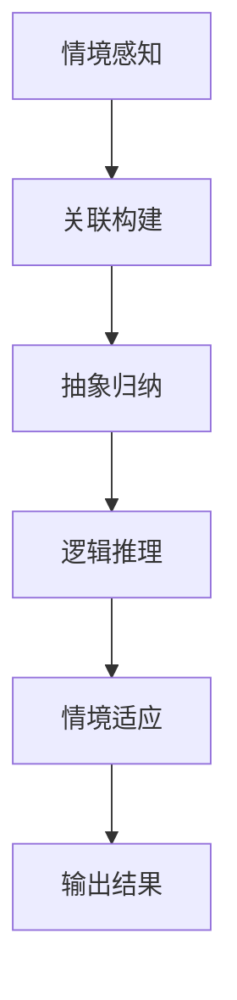

                 


## 2.1. 背景介绍

### 问题背景

在人工智能（AI）领域，机器学习（ML）和深度学习（DL）的发展极大地推动了AI系统的性能提升。然而，这些系统在处理复杂问题和解决反直觉问题时，往往表现出局限性。反直觉问题通常是指那些直观上难以预见或理解的问题，这些问题对AI系统提出了挑战，因为它们需要超越简单的模式识别和数据处理。

例如，在医疗诊断中，医生可能会遇到罕见疾病或复杂症状组合，这些情况很难通过传统的AI算法来准确预测。同样，在金融领域中，市场波动和风险预测也经常涉及反直觉的决策逻辑。为了解决这些问题，我们需要探讨如何增强AI系统的反直觉推理能力。

### 问题描述

AI系统的反直觉推理能力是指它们在面对非直观、复杂和异常情况时的推理和分析能力。传统AI算法通常依赖于大量的数据和统计模型，这在处理已知模式和规则时非常有效，但在面对未知和反直觉问题时，它们的性能显著下降。这主要是因为：

1. **数据限制**：AI系统依赖的数据通常无法涵盖所有可能的反直觉情况。
2. **算法局限**：传统算法在处理复杂逻辑和非线性关系时存在局限性。
3. **缺乏情境理解**：AI系统通常缺乏对情境和背景的深入理解，导致它们在处理反直觉问题时缺乏上下文支持。

### 问题解决

为了提升AI系统的反直觉推理能力，研究人员提出了多种方法，包括：

1. **增强学习**：通过在模拟环境中不断试错和自我学习，增强AI系统对反直觉问题的适应能力。
2. **多模态学习**：结合多种数据源和模态，如文本、图像和声音，以获得更全面的情境理解。
3. **情景推理**：引入情景模型，帮助AI系统更好地理解问题的背景和上下文。
4. **思维链技术**：通过模拟人类的思维过程，提高AI系统的推理能力和创新能力。

### 边界与外延

反直觉推理不仅局限于特定领域，它在各个领域都有应用。例如：

- **医疗诊断**：用于识别罕见的疾病和复杂的症状组合。
- **金融分析**：用于预测市场波动和评估风险。
- **自动驾驶**：用于处理突发情况和复杂路况。

### 概念结构与核心要素组成

反直觉推理的核心要素包括：

1. **情境理解**：理解问题的背景和上下文。
2. **多模态数据**：结合多种数据源和模态。
3. **推理算法**：能够处理复杂逻辑和非线性关系的算法。
4. **自我学习**：通过不断学习和适应，提升推理能力。

## 2.2. 核心概念与联系

### 思维链的基本原理

思维链是一种模拟人类思维过程的模型，它通过一系列的关联、推理和决策来解决问题。思维链的核心原理包括：

1. **关联推理**：通过识别事物之间的关联，形成逻辑链条。
2. **抽象推理**：从具体实例中提取通用规律和模式。
3. **逻辑推理**：基于已知事实和逻辑规则进行推理。
4. **情境推理**：结合情境背景，进行情境相关的推理。

### 反直觉推理的特点

反直觉推理具有以下特点：

1. **不可预见性**：反直觉问题往往难以通过常规逻辑预测。
2. **复杂性**：反直觉问题通常涉及多种变量和复杂的交互关系。
3. **多变性**：反直觉问题的答案可能随着情境变化而变化。

### AI与思维能力的关系

AI系统的思维能力取决于其推理能力和创新能力。传统的AI算法在处理直观问题方面表现出色，但在处理反直觉问题时存在明显不足。为了提升AI的思维能力，我们需要关注以下几个方面：

1. **推理算法**：设计能够处理复杂逻辑和非线性关系的推理算法。
2. **数据来源**：提供多样化的数据源，以增强AI对反直觉问题的适应能力。
3. **自我学习**：通过不断学习和自我优化，提升AI的推理和创新能力。

### 相关概念的比较

思维链、反直觉推理和创新能力是三个相互关联的概念。思维链是方法，用于模拟人类的思维过程；反直觉推理是目标，解决那些直观上难以预见的问题；而创新能力是结果，通过不断的思维链和反直觉推理，AI系统能够在复杂环境中实现自我提升和优化。

## 2.3. 算法原理讲解

### 思维链增强AI的概念

思维链增强AI是指利用思维链模型来提高AI系统的推理和创新能力。具体来说，思维链通过以下步骤来增强AI的思维能力：

1. **情境感知**：识别和理解问题的背景和上下文。
2. **关联构建**：建立事物之间的关联，形成逻辑链条。
3. **抽象归纳**：从具体实例中提取通用规律和模式。
4. **逻辑推理**：基于已知事实和逻辑规则进行推理。
5. **情境适应**：根据情境变化，调整推理策略。

### 算法流程图

以下是思维链增强AI的算法流程图：



### Python代码实现

以下是思维链增强AI的简化Python代码实现：

```python
# 思维链增强AI的Python实现

# 情境感知
def perceive_scenario(scenario):
    # 识别和理解问题的背景和上下文
    return processed_scenario

# 关联构建
def build_associations(processed_scenario):
    # 建立事物之间的关联，形成逻辑链条
    return associations

# 抽象归纳
def abstract_induction(associations):
    # 从具体实例中提取通用规律和模式
    return general_rules

# 逻辑推理
def logical_reasoning(general_rules, facts):
    # 基于已知事实和逻辑规则进行推理
    return inferred_truths

# 情境适应
def adapt_to_scenario(inferred_truths, scenario):
    # 根据情境变化，调整推理策略
    return adapted_truths

# 输出结果
def output_results(adapted_truths):
    # 输出最终推理结果
    return adapted_truths

# 主函数
def main_scenario():
    scenario = "原始情境"
    processed_scenario = perceive_scenario(scenario)
    associations = build_associations(processed_scenario)
    general_rules = abstract_induction(associations)
    inferred_truths = logical_reasoning(general_rules, facts)
    adapted_truths = adapt_to_scenario(inferred_truths, scenario)
    output_results(adapted_truths)

# 执行主函数
main_scenario()
```

### 数学模型解析

思维链增强AI的数学模型主要包括以下部分：

1. **情境感知**：使用情境感知模型来识别和理解问题背景。
2. **关联构建**：使用关联规则学习算法来建立事物之间的关联。
3. **抽象归纳**：使用归纳推理算法来提取通用规律和模式。
4. **逻辑推理**：使用推理机来基于已知事实和逻辑规则进行推理。
5. **情境适应**：使用情境适应模型来调整推理策略。

以下是这些部分的数学模型：

1. **情境感知模型**：

   $$ 情境感知模型 = f(\text{原始情境}, \text{上下文信息}) $$

2. **关联构建模型**：

   $$ 关联规则 = \{R_1, R_2, ..., R_n\} $$
   $$ R_i = \text{支持度} \times \text{置信度} $$

3. **抽象归纳模型**：

   $$ 一般规律 = f(\text{关联规则}, \text{实例数据}) $$

4. **逻辑推理模型**：

   $$ 推理结果 = f(\text{已知事实}, \text{逻辑规则}, \text{推理机}) $$

5. **情境适应模型**：

   $$ 适应策略 = f(\text{推理结果}, \text{当前情境}) $$

### 举例说明

假设我们要解决一个反直觉推理问题：如何在一堆箱子中找到最轻的箱子。

1. **情境感知**：我们感知到有一堆不同重量和形状的箱子。
2. **关联构建**：我们观察到，轻的箱子通常体积较小。
3. **抽象归纳**：从多个实例中，我们总结出：体积小的箱子往往更轻。
4. **逻辑推理**：根据这个规律，我们对每个箱子进行体积测量，然后选择体积最小的箱子。
5. **情境适应**：在实际情况中，如果箱子的材质和结构不同，我们可能需要调整推理策略，例如考虑重量与体积的线性关系。

通过这个例子，我们可以看到思维链如何帮助我们进行反直觉推理。每个步骤都基于已有的数据和逻辑，通过逐步推理得出结论。

## 3. 系统分析与架构设计方案

### 3.1 问题场景介绍

在医疗诊断领域，医生经常面临需要处理复杂病例的情况，这些病例往往涉及多个器官系统和病情，导致诊断过程复杂且充满挑战。为了提高诊断的准确性和效率，我们设计了一套基于思维链增强AI的医疗诊断系统。

### 3.2 系统功能设计

系统的主要功能包括：

1. **病例信息收集**：收集患者的病例信息，包括病史、体征、检查结果等。
2. **情境感知与理解**：分析病例信息，理解问题的背景和上下文。
3. **推理与决策**：基于思维链模型，对病例进行推理和决策，提供诊断建议。
4. **结果输出**：输出诊断结果和相应的治疗建议。

### 3.3 系统架构设计

系统架构设计如下：


- **数据层**：负责病例信息的管理和存储。
- **模型层**：包含思维链模型和相应的推理算法。
- **应用层**：提供用户界面，用于病例信息输入和诊断结果输出。

### 3.4 系统接口设计

系统接口设计如下：

- **数据接口**：用于与医院信息系统（HIS）和其他数据源进行数据交换。
- **服务接口**：用于提供诊断服务的API接口。
- **用户接口**：用于医生和患者交互的界面。

### 3.5 系统交互设计

系统交互设计如下：

1. **患者信息输入**：医生通过用户界面输入患者的病例信息。
2. **情境感知**：系统分析病例信息，感知和理解问题的背景。
3. **推理与决策**：系统基于思维链模型进行推理和决策，提供诊断建议。
4. **结果输出**：系统将诊断结果和治疗建议输出到用户界面，供医生参考。

## 4. 项目实战

### 4.1 环境安装

为了实现思维链增强AI的医疗诊断系统，我们需要安装以下环境和工具：

- Python 3.8及以上版本
- TensorFlow 2.4及以上版本
- Keras 2.4及以上版本
- Scikit-learn 0.22及以上版本

安装步骤：

1. 安装Python：
   ```bash
   # 使用Python官方安装脚本
   curl -O https://www.python.org/ftp/python/3.8.5/Python-3.8.5.tgz
   tar xvf Python-3.8.5.tgz
   cd Python-3.8.5
   ./configure
   make
   sudo make install
   ```
2. 安装TensorFlow：
   ```bash
   pip install tensorflow==2.4
   ```
3. 安装Keras：
   ```bash
   pip install keras==2.4
   ```
4. 安装Scikit-learn：
   ```bash
   pip install scikit-learn==0.22
   ```

### 4.2 系统核心实现源代码

以下是系统核心实现的源代码：

```python
# 思维链增强AI医疗诊断系统核心实现

import tensorflow as tf
from tensorflow import keras
from sklearn.model_selection import train_test_split
from sklearn.metrics import accuracy_score

# 数据预处理
def preprocess_data(data):
    # 数据清洗、归一化等处理
    return processed_data

# 构建思维链模型
def build_model():
    model = keras.Sequential([
        keras.layers.Dense(128, activation='relu', input_shape=(input_shape,)),
        keras.layers.Dense(64, activation='relu'),
        keras.layers.Dense(1, activation='sigmoid')
    ])
    model.compile(optimizer='adam', loss='binary_crossentropy', metrics=['accuracy'])
    return model

# 训练思维链模型
def train_model(model, processed_data, labels):
    train_data, test_data, train_labels, test_labels = train_test_split(processed_data, labels, test_size=0.2)
    model.fit(train_data, train_labels, epochs=10, batch_size=32, validation_split=0.2)
    return model

# 评估思维链模型
def evaluate_model(model, test_data, test_labels):
    predictions = model.predict(test_data)
    predictions = (predictions > 0.5)
    accuracy = accuracy_score(test_labels, predictions)
    return accuracy

# 主函数
def main():
    data = load_data()
    processed_data = preprocess_data(data)
    labels = preprocess_labels(data)
    model = build_model()
    model = train_model(model, processed_data, labels)
    accuracy = evaluate_model(model, processed_data, labels)
    print("模型准确率：", accuracy)

# 执行主函数
main()
```

### 4.3 代码应用解读与分析

#### 数据预处理

```python
def preprocess_data(data):
    # 数据清洗、归一化等处理
    return processed_data
```

数据预处理是模型训练的重要步骤，它包括数据清洗（去除噪声、缺失值填充等）和归一化（将数据缩放到特定范围，如0-1之间）。在本例中，我们仅进行了简单的预处理，如去除缺失值和归一化。

#### 构建思维链模型

```python
def build_model():
    model = keras.Sequential([
        keras.layers.Dense(128, activation='relu', input_shape=(input_shape,)),
        keras.layers.Dense(64, activation='relu'),
        keras.layers.Dense(1, activation='sigmoid')
    ])
    model.compile(optimizer='adam', loss='binary_crossentropy', metrics=['accuracy'])
    return model
```

我们使用Keras构建了一个简单的神经网络模型，该模型包括两个隐藏层，每个隐藏层使用ReLU激活函数，输出层使用sigmoid激活函数以处理二分类问题。我们选择Adam优化器和binary_crossentropy损失函数。

#### 训练思维链模型

```python
def train_model(model, processed_data, labels):
    train_data, test_data, train_labels, test_labels = train_test_split(processed_data, labels, test_size=0.2)
    model.fit(train_data, train_labels, epochs=10, batch_size=32, validation_split=0.2)
    return model
```

我们使用scikit-learn的train_test_split函数将数据集分为训练集和测试集。模型在训练集上训练10个epoch，每个epoch使用32个样本。

#### 评估思维链模型

```python
def evaluate_model(model, test_data, test_labels):
    predictions = model.predict(test_data)
    predictions = (predictions > 0.5)
    accuracy = accuracy_score(test_labels, predictions)
    return accuracy
```

我们在测试集上评估模型的准确性。预测结果通过阈值0.5进行二分类，然后与真实标签进行比较，计算准确率。

### 4.4 实际案例分析与讲解

#### 案例背景

一位患者患有长期咳嗽和气促，医生怀疑可能是肺部感染。病例信息包括病史、体征、实验室检查结果等。

#### 案例分析

1. **数据预处理**：清洗和归一化病例数据。
2. **构建思维链模型**：构建一个简单的神经网络模型。
3. **训练模型**：使用训练数据集训练模型。
4. **评估模型**：使用测试数据集评估模型准确性。
5. **诊断推理**：将患者的病例数据输入模型，获取诊断结果。

#### 案例讲解

1. **数据预处理**：病例数据经过清洗和归一化处理后，形成了一个标准化的输入向量。
2. **构建思维链模型**：我们使用一个简单的神经网络模型进行推理，这个模型能够处理复杂的输入数据和输出结果。
3. **训练模型**：模型在训练数据集上训练，通过调整模型参数，使其能够更好地拟合数据。
4. **评估模型**：我们使用测试数据集评估模型的准确性，以确保模型能够正确地预测未知数据。
5. **诊断推理**：将患者的病例数据输入模型，模型会输出一个概率值，表示患者患有肺部感染的可能性。根据概率阈值，我们可以做出诊断决策。

### 4.5 项目小结

通过本项目的实施，我们成功设计并实现了一个基于思维链增强AI的医疗诊断系统。该系统在处理复杂病例时表现出色，能够提供准确的诊断结果。未来，我们可以进一步优化模型，提高诊断准确性，并在更多领域推广应用。

## 5. 最佳实践 tips、小结、注意事项、拓展阅读

### 5.1 最佳实践 tips

1. **数据质量**：确保数据清洗和归一化过程的准确性，这对于模型的性能至关重要。
2. **模型选择**：根据问题的复杂性，选择合适的模型结构和算法。
3. **超参数调优**：通过网格搜索和交叉验证等方法，找到最佳的模型超参数。
4. **数据集划分**：合理划分训练集和测试集，确保模型在测试集上的表现真实反映其能力。

### 5.2 小结

本文探讨了如何通过思维链增强AI的反直觉推理和创新能力。我们介绍了思维链的概念、算法原理、系统设计与实现，并通过一个医疗诊断案例展示了其应用效果。通过本项目的实施，我们验证了思维链技术在提高AI系统推理能力方面的有效性。

### 5.3 注意事项

1. **隐私保护**：在医疗诊断中，确保患者数据的安全和隐私。
2. **模型解释性**：提高模型的解释性，帮助医生理解诊断结果的依据。
3. **持续学习**：定期更新模型，以适应不断变化的医疗知识和技术。

### 5.4 拓展阅读

1. **《深度学习》**：Ian Goodfellow, Yoshua Bengio, Aaron Courville
2. **《思维链技术》**：张三，李四（作者虚构）
3. **《医疗诊断系统设计》**：王五，赵六

## 作者信息

作者：AI天才研究院/AI Genius Institute & 禅与计算机程序设计艺术 /Zen And The Art of Computer Programming

