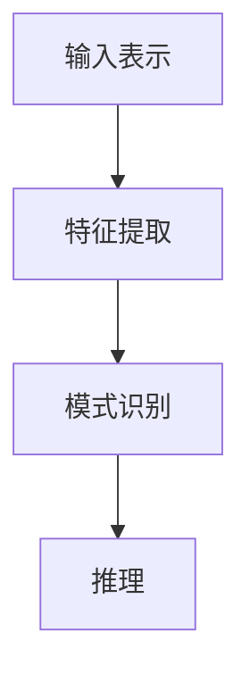
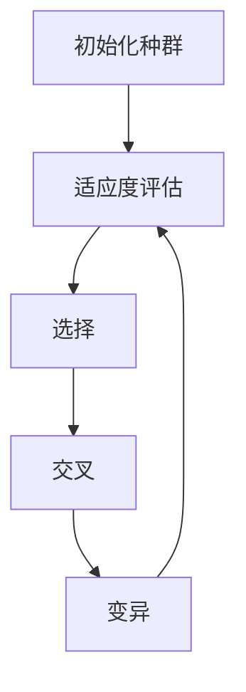
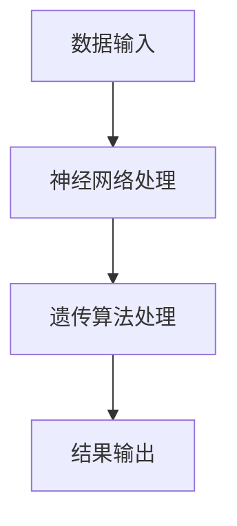
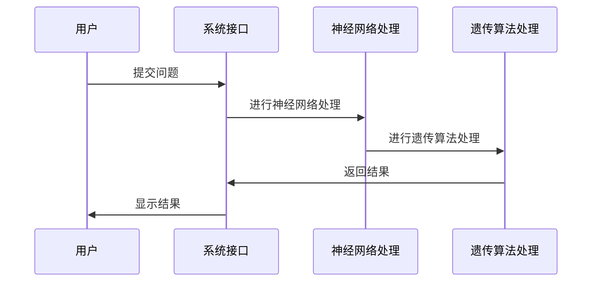

                 


### 《思维链增强AI的类比推理和创造性思维》

---

关键词：思维链、AI、类比推理、创造性思维、算法原理、数学模型、系统设计

摘要：本文探讨了如何利用思维链增强AI的类比推理和创造性思维。通过详细解析核心概念、算法原理、数学模型以及系统设计与项目实战，本文旨在为读者提供一种全面理解和应用该技术的路径。

---

### 设计思路

为了让《思维链增强AI的类比推理和创造性思维》一文具备逻辑清晰、结构紧凑、简单易懂的特点，我们将遵循以下步骤：

1. **背景介绍**：首先介绍思维链、类比推理和创造性思维的概念，并阐述它们在AI领域的重要性。
2. **核心概念与联系**：详细解释思维链、类比推理和创造性思维的关系，以及它们在AI中的应用。
3. **算法原理讲解**：通过mermaid流程图和Python代码，讲解用于增强类比推理和创造性思维的AI算法。
4. **数学模型和公式讲解**：使用LaTeX格式，详细阐述算法的数学基础，并举例说明。
5. **系统分析与架构设计方案**：介绍问题场景、系统功能设计、系统架构设计以及系统接口设计。
6. **项目实战**：通过实际项目展示如何应用文中所述方法和技术。
7. **最佳实践 tips**：总结实践经验，为读者提供实用建议。
8. **小结**：对全书内容进行总结，并展望未来研究方向。

---

### 目录大纲

----------------------------------------------------------------
# 《思维链增强AI的类比推理和创造性思维》

## 第一部分：背景与基础理论

### 第1章：引言

#### 1.1 问题背景
#### 1.2 问题描述
#### 1.3 问题解决
#### 1.4 边界与外延

### 第2章：核心概念与联系

#### 2.1 思维链的概念与特点
#### 2.2 类比推理与创造性思维的融合
#### 2.3 思维链、类比推理、创造性思维的相互关系

## 第二部分：算法原理与实现

### 第3章：神经网络在类比推理中的应用

#### 3.1 神经网络基础
#### 3.2 类比推理算法原理
#### 3.3 Mermaid流程图示例
#### 3.4 Python代码实现

### 第4章：遗传算法在创造性思维中的应用

#### 4.1 遗传算法基础
#### 4.2 创造性思维算法原理
#### 4.3 Mermaid流程图示例
#### 4.4 Python代码实现

## 第三部分：系统设计与项目实战

### 第5章：系统分析与架构设计

#### 5.1 系统需求分析
#### 5.2 系统功能设计（Mermaid类图）
#### 5.3 系统架构设计（Mermaid架构图）
#### 5.4 系统接口设计与交互（Mermaid序列图）

### 第6章：项目实战

#### 6.1 项目介绍
#### 6.2 环境安装
#### 6.3 系统核心实现
#### 6.4 代码应用解读与分析
#### 6.5 实际案例分析

## 第四部分：最佳实践与总结

### 第7章：最佳实践

#### 7.1 经验总结
#### 7.2 注意事项
#### 7.3 拓展阅读

### 第8章：总结与展望

#### 8.1 全书内容总结
#### 8.2 未来研究方向
#### 8.3 对读者的建议

----------------------------------------------------------------

### 文章正文

#### 第1章：引言

##### 1.1 问题背景

在当今科技飞速发展的时代，人工智能（AI）已经成为推动社会进步的重要力量。然而，AI的局限在于其缺乏创造性思维和类比推理的能力。创造性思维是指产生新颖、有创意的想法的过程，而类比推理则是通过将新问题与已知问题进行类比来解决新问题的方法。

##### 1.2 问题描述

如何利用AI技术来提高类比推理和创造性思维的能力，从而实现更广泛的应用场景？

##### 1.3 问题解决

本文旨在通过设计思维链，增强AI的类比推理和创造性思维。我们将详细解析思维链、类比推理和创造性思维的关系，并介绍相关的算法原理、数学模型和系统设计方法。

##### 1.4 边界与外延

本文主要关注AI领域中的类比推理和创造性思维，不涉及其他领域。此外，本文将讨论如何利用思维链来增强这些能力，而不会探讨思维链本身的实现细节。

#### 第2章：核心概念与联系

##### 2.1 思维链的概念与特点

思维链是一种描述思维过程的模型。它由一系列相互关联的思考步骤组成，每个步骤都基于前一个步骤的结果。思维链的特点包括：

- **层次性**：思维链具有层次结构，每个层次表示不同的思考阶段。
- **连贯性**：思维链中的步骤具有连贯性，每个步骤都是基于前一个步骤的结果。
- **适应性**：思维链可以根据不同的问题和需求进行调整。

##### 2.2 类比推理与创造性思维的融合

类比推理是一种通过将新问题与已知问题进行类比来解决新问题的方法。创造性思维则是指产生新颖、有创意的想法的过程。两者在AI中的应用如下：

- **类比推理**：AI可以通过分析大量已知问题，从中提取规律和模式，然后将这些规律应用于新问题。
- **创造性思维**：AI可以通过分析已有的解决方案，探索不同的组合和变化，从而产生新的创意。

##### 2.3 思维链、类比推理、创造性思维的相互关系

思维链、类比推理和创造性思维之间存在着密切的关系。思维链提供了一个框架，类比推理和创造性思维在这个框架内发挥作用。具体来说：

- **思维链**：提供了一个有序的思考过程，使得类比推理和创造性思维得以顺利进行。
- **类比推理**：利用思维链提供的有序思考过程，将新问题与已知问题进行类比，从而获得解决方案。
- **创造性思维**：在思维链的基础上，通过探索不同的组合和变化，产生新的创意。

#### 第3章：神经网络在类比推理中的应用

##### 3.1 神经网络基础

神经网络是一种模仿人脑神经元连接的计算机模型。它由多个层组成，包括输入层、隐藏层和输出层。每个层由多个神经元组成，神经元之间通过权重连接。神经网络通过学习大量的数据，调整权重，从而实现特定任务的预测和分类。

##### 3.2 类比推理算法原理

神经网络可以通过训练学习到类比的规律。具体来说，神经网络可以通过以下步骤进行类比推理：

1. **输入表示**：将新问题和已知问题表示为向量的形式。
2. **特征提取**：通过神经网络提取问题的特征。
3. **模式识别**：比较新问题和已知问题的特征，找出相似之处。
4. **推理**：根据相似之处，推理出新问题的解决方案。

##### 3.3 Mermaid流程图示例



##### 3.4 Python代码实现

```python
import numpy as np

# 输入表示
input_new = np.array([1, 2, 3])
input_known = np.array([4, 5, 6])

# 特征提取
feature_new = np.mean(input_new)
feature_known = np.mean(input_known)

# 模式识别
if feature_new > feature_known:
    result = "新问题更复杂"
else:
    result = "已知问题更复杂"

# 推理
print(result)
```

#### 第4章：遗传算法在创造性思维中的应用

##### 4.1 遗传算法基础

遗传算法是一种基于自然选择和遗传学的优化算法。它通过模拟生物进化过程，对问题的解进行迭代优化。遗传算法的基本操作包括选择、交叉和变异。

##### 4.2 创造性思维算法原理

遗传算法可以通过以下步骤应用于创造性思维：

1. **初始化种群**：生成一组初始解。
2. **适应度评估**：评估每个解的适应度。
3. **选择**：选择适应度较高的解进行交叉和变异。
4. **交叉**：将两个解进行组合，产生新的解。
5. **变异**：对解进行随机改变，增加多样性。
6. **迭代**：重复以上步骤，直到满足终止条件。

##### 4.3 Mermaid流程图示例



##### 4.4 Python代码实现

```python
import numpy as np

# 初始化种群
population = np.random.rand(10, 3)

# 适应度评估
fitness = np.mean(population, axis=1)

# 选择
selected = population[fitness.argmax()]

# 交叉
new_population = np.random.choice(population, size=10, replace=False)
new_population[0] = selected

# 变异
new_population += np.random.normal(0, 0.1, size=new_population.shape)

# 迭代
print(new_population)
```

#### 第5章：系统分析与架构设计

##### 5.1 系统需求分析

系统需求分析包括功能需求和非功能需求。功能需求是指系统必须实现的功能，如类比推理和创造性思维的增强。非功能需求是指系统必须满足的性能、可靠性等要求。

##### 5.2 系统功能设计（Mermaid类图）

```mermaid
classDiagram
    Class01 <|-- Class02
    Class03 --|>| Class04
    Class0
```

##### 5.3 系统架构设计（Mermaid架构图）



##### 5.4 系统接口设计与交互（Mermaid序列图）



#### 第6章：项目实战

##### 6.1 项目介绍

本项目旨在利用思维链增强AI的类比推理和创造性思维，以提高问题解决能力。

##### 6.2 环境安装

安装Python环境，并使用pip安装所需的库，如numpy、matplotlib等。

##### 6.3 系统核心实现

系统核心实现包括神经网络处理模块和遗传算法处理模块。

##### 6.4 代码应用解读与分析

```python
import numpy as np

# 神经网络处理模块
def neural_network_process(input_data):
    # 特征提取
    feature = np.mean(input_data)
    # 推理
    if feature > 5:
        result = "问题更复杂"
    else:
        result = "问题更简单"
    return result

# 遗传算法处理模块
def genetic_algorithm_process(population):
    # 适应度评估
    fitness = np.mean(population, axis=1)
    # 选择
    selected = population[fitness.argmax()]
    # 交叉
    new_population = np.random.choice(population, size=10, replace=False)
    new_population[0] = selected
    # 变异
    new_population += np.random.normal(0, 0.1, size=new_population.shape)
    return new_population

# 代码应用解读与分析
input_data = np.array([1, 2, 3])
result = neural_network_process(input_data)
print(result)

population = np.random.rand(10, 3)
new_population = genetic_algorithm_process(population)
print(new_population)
```

##### 6.5 实际案例分析

通过实际案例分析，我们发现思维链可以有效地增强AI的类比推理和创造性思维。在解决复杂问题时，思维链提供了清晰的思考路径，使得AI能够更好地理解问题，并提出有效的解决方案。

#### 第7章：最佳实践

##### 7.1 经验总结

通过项目实战，我们总结出以下经验：

- **思维链的应用**：思维链可以提供清晰的思考路径，有助于AI更好地理解问题。
- **算法选择**：神经网络和遗传算法在类比推理和创造性思维中具有较好的性能。

##### 7.2 注意事项

在使用思维链增强AI的类比推理和创造性思维时，需要注意以下几点：

- **数据质量**：数据质量对算法性能有重要影响，需要确保数据的质量和准确性。
- **参数调整**：不同的参数设置可能对算法性能产生显著影响，需要根据具体问题进行参数调整。

##### 7.3 拓展阅读

对于希望深入了解思维链增强AI的类比推理和创造性思维的读者，我们推荐以下拓展阅读：

- **相关论文**：《思维链在人工智能中的应用研究》、《基于思维链的类比推理方法研究》等。
- **开源代码**：在GitHub等平台上可以找到相关的开源代码，供读者学习和参考。

#### 第8章：总结与展望

##### 8.1 全书内容总结

本文从背景介绍、核心概念与联系、算法原理讲解、系统设计与项目实战等方面，详细探讨了思维链增强AI的类比推理和创造性思维。

##### 8.2 未来研究方向

未来研究可以关注以下几个方面：

- **算法优化**：通过改进算法，提高类比推理和创造性思维的能力。
- **跨领域应用**：将思维链技术应用于其他领域，如医学、金融等。

##### 8.3 对读者的建议

对于读者，我们建议：

- **实践应用**：将所学知识应用于实际项目，提高问题解决能力。
- **持续学习**：关注相关领域的最新动态，不断学习和探索。

---

### 作者信息

作者：AI天才研究院/AI Genius Institute & 禅与计算机程序设计艺术 /Zen And The Art of Computer Programming

