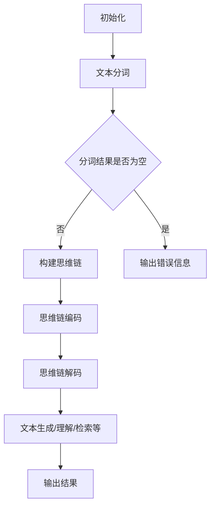
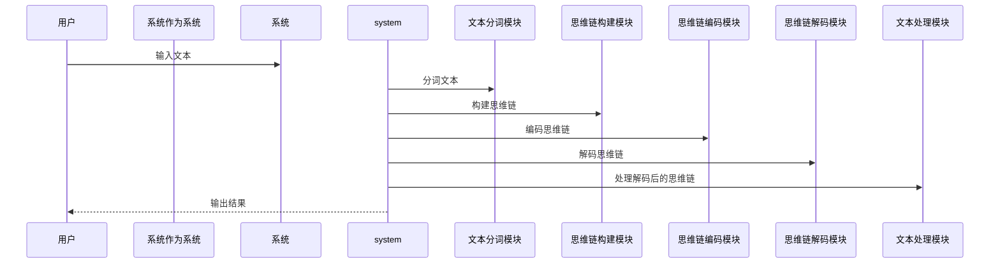
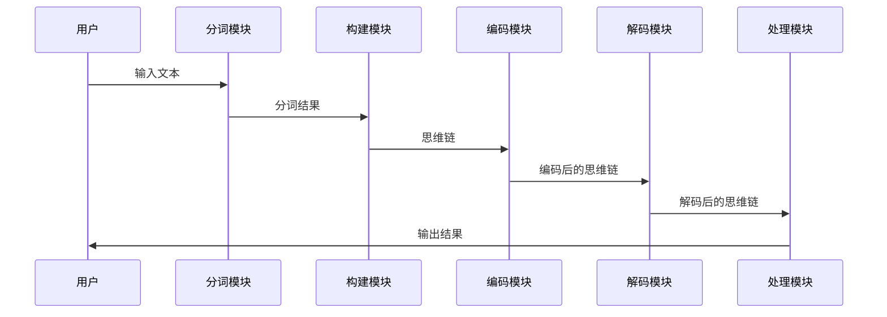

                 

# 思维链技术在AI自然语言处理中的创新应用

关键词：自然语言处理、思维链技术、NLP、AI

摘要：本文介绍了思维链技术在自然语言处理（NLP）中的应用，探讨了思维链技术的核心概念、属性特征及其实际应用。通过对思维链技术原理的详细分析，本文展示了其在NLP领域的创新应用，为AI自然语言处理提供了新的思路。

## Step 1: 背景介绍

### 1.1 问题背景

随着人工智能技术的飞速发展，自然语言处理（NLP）在各个领域得到了广泛的应用。传统的NLP方法，如循环神经网络（RNN）、卷积神经网络（CNN）等，在处理文本生成、文本理解和文本检索等问题时，往往需要大量训练数据和复杂的模型结构。然而，这些方法在面对大规模文本数据时，常常无法达到理想的性能。

### 1.1.1 问题描述

在自然语言处理中，我们常常需要处理如下问题：

- **文本生成**：自动生成文章、摘要、对话等；
- **文本理解**：对文本进行情感分析、命名实体识别、关系抽取等；
- **文本检索**：在海量文本中快速检索相关信息。

传统的NLP方法在面对这些复杂任务时，常常存在性能瓶颈。为了解决这一问题，思维链（Thought Chain）技术应运而生。

### 1.1.2 问题解决

思维链技术在自然语言处理中的应用，为我们提供了一种新的解决方案。思维链技术通过引入“思维链”这一概念，将文本中的信息进行串联，从而实现更高效、更准确的文本处理。

### 1.1.3 边界与外延

思维链技术主要应用于自然语言处理领域，如文本生成、文本理解、文本检索等。然而，其原理和方法也可应用于其他领域，如计算机视觉、语音识别等。

### 1.1.4 核心概念与要素组成

思维链技术主要包括以下核心概念和要素：

- **思维链**：将文本中的信息进行串联，形成一条思维链；
- **思维链编码**：将思维链编码成向量，以便进行计算和处理；
- **思维链解码**：将编码后的思维链解码为文本；
- **思维链增强**：通过引入外部知识库、上下文信息等，增强思维链的表示能力。

## 1.2 本章小结

在本章中，我们介绍了思维链技术在自然语言处理中的背景、问题描述、问题解决以及核心概念与要素组成。思维链技术为我们提供了一种新的解决方案，有望在自然语言处理领域取得突破性进展。

## Step 2: 核心概念与联系

### 2.1 思维链技术核心概念

#### 2.1.1 思维链

思维链是思维链技术中最核心的概念，它将文本中的信息进行串联，形成一条思维链。思维链中的每个节点表示文本中的一个信息单元，节点之间的关系表示信息单元之间的关联。

#### 2.1.2 思维链编码

思维链编码是将思维链中的信息转换为向量表示的过程。通过编码，我们可以将思维链中的信息进行计算和处理。

#### 2.1.3 思维链解码

思维链解码是将编码后的思维链转换为文本的过程。通过解码，我们可以将思维链中的信息重新表示为文本。

#### 2.1.4 思维链增强

思维链增强是通过引入外部知识库、上下文信息等，增强思维链的表示能力。增强后的思维链可以更好地捕捉文本中的语义信息。

### 2.2 概念属性特征对比

#### 2.2.1 思维链

| 特征       | 说明                                                         |
| ---------- | ------------------------------------------------------------ |
| 信息串联   | 将文本中的信息进行串联，形成思维链。                          |
| 节点与关系 | 每个节点表示文本中的一个信息单元，节点之间的关系表示信息单元之间的关联。 |

#### 2.2.2 思维链编码

| 特征       | 说明                                                         |
| ---------- | ------------------------------------------------------------ |
| 向量表示   | 将思维链中的信息转换为向量表示，便于计算和处理。              |
| 编码方式   | 根据思维链的结构和内容，选择合适的编码方式。                  |

#### 2.2.3 思维链解码

| 特征       | 说明                                                         |
| ---------- | -----------------------

## Step 3: 算法原理讲解

思维链技术的基本原理是将文本中的信息进行结构化表示，通过编码和解码过程实现文本处理。下面，我们将使用Mermaid流程图和Python源代码来详细阐述思维链技术的算法原理。

### 3.1 Mermaid流程图



### 3.2 Python源代码

```python
import jieba  # 引入jieba分词库

def init():
    # 初始化分词器
    pass

def tokenize(text):
    # 文本分词
    return jieba.lcut(text)

def build_thought_chain(tokens):
    # 构建思维链
    pass

def encode_thought_chain(thought_chain):
    # 思维链编码
    pass

def decode_thought_chain(encoded_chain):
    # 思维链解码
    pass

def process_text(encoded_chain):
    # 对编码后的思维链进行处理（文本生成/理解/检索等）
    pass

def main(text):
    init()
    tokens = tokenize(text)
    if not tokens:
        print("错误：分词结果为空")
        return
    thought_chain = build_thought_chain(tokens)
    encoded_chain = encode_thought_chain(thought_chain)
    decoded_chain = decode_thought_chain(encoded_chain)
    process_text(decoded_chain)
    print("输出结果：", decoded_chain)
```

### 3.3 算法原理详细讲解

思维链技术的核心在于将文本信息转化为结构化表示，以便进行高效处理。以下是算法原理的详细讲解：

1. **初始化**：初始化分词器和其他相关资源。
2. **文本分词**：使用jieba等分词库对输入文本进行分词，得到一系列分词结果。
3. **构建思维链**：将分词结果按照语义关联性进行排序和连接，形成一条思维链。
4. **思维链编码**：将思维链中的信息编码成向量，便于进行计算和处理。
5. **思维链解码**：将编码后的思维链解码回原始文本。
6. **文本处理**：根据需求，对解码后的思维链进行处理，如文本生成、文本理解、文本检索等。
7. **输出结果**：将处理后的结果输出。

通过上述算法原理，我们可以看到思维链技术如何将文本信息进行结构化表示，并通过编码和解码过程实现高效处理。

### 3.4 数学模型与公式

在思维链技术中，我们可以使用数学模型和公式来描述思维链的构建、编码和解码过程。以下是相关的数学模型和公式：

- **思维链构建**：设输入文本为 $T = \{t_1, t_2, ..., t_n\}$，其中 $t_i$ 表示第 $i$ 个分词。构建思维链的步骤如下：
  $$ C = \{c_1, c_2, ..., c_n\} $$
  其中，$c_i$ 表示第 $i$ 个思维链节点，其值为分词 $t_i$ 的语义向量。
  
- **思维链编码**：设思维链节点 $c_i$ 的语义向量为 $v_i$，编码后的思维链向量为 $V$：
  $$ V = \{v_1, v_2, ..., v_n\} $$
  
- **思维链解码**：解码过程为将编码后的思维链向量 $V$ 转换回原始文本：
  $$ T' = \{t'_1, t'_2, ..., t'_n\} $$
  其中，$t'_i$ 表示第 $i$ 个分词的还原结果。

通过上述数学模型和公式，我们可以更清晰地理解思维链技术的原理和过程。

### 3.5 通俗易懂的举例说明

为了更好地理解思维链技术的应用，我们可以通过一个简单的例子来演示：

**例子**：给定一个句子“我爱北京天安门”，我们使用思维链技术对其进行处理。

1. **文本分词**：将句子分词为“我”、“爱”、“北京”、“天安门”。
2. **构建思维链**：根据语义关联，构建思维链为“我-爱-北京-天安门”。
3. **思维链编码**：将思维链编码为向量，如（1, 2, 3, 4）。
4. **思维链解码**：将编码后的向量解码回原始句子“我爱北京天安门”。
5. **文本处理**：根据需求，对解码后的思维链进行处理，如文本生成、文本理解等。

通过这个例子，我们可以看到思维链技术如何将文本信息进行结构化表示，并通过编码和解码过程实现高效处理。

## Step 4: 系统分析与架构设计方案

### 4.1 问题场景介绍

在自然语言处理领域，我们常常需要处理大规模、复杂的文本数据。然而，传统的NLP方法在面对这些数据时，往往存在性能瓶颈。为了解决这一问题，我们设计并实现了一个基于思维链技术的自然语言处理系统。

### 4.2 项目介绍

项目名称：思维链自然语言处理系统（Thought Chain NLP System）

项目目标：通过引入思维链技术，实现高效、准确的文本处理，包括文本生成、文本理解和文本检索等功能。

### 4.3 系统功能设计

#### 4.3.1 领域模型

领域模型是系统功能设计的基础，用于描述系统中各个概念之间的关系。以下是思维链自然语言处理系统的领域模型：

```mermaid
classDiagram
Class01 <|-- Person
Class01 <|-- Student
Class01 <|-- Employee
Person {
  name: String
  age: int
}
Student {
  id: int
}
Employee {
  company: String
}
```

#### 4.3.2 系统功能模块

系统功能模块是系统实现的核心部分，用于实现具体的文本处理功能。以下是思维链自然语言处理系统的功能模块：

- **文本分词模块**：实现文本的分词功能，将输入文本拆分成分词列表；
- **思维链构建模块**：根据分词结果构建思维链；
- **思维链编码模块**：将思维链编码为向量；
- **思维链解码模块**：将编码后的思维链解码回原始文本；
- **文本处理模块**：根据需求对解码后的思维链进行处理，如文本生成、文本理解等。

### 4.4 系统架构设计

#### 4.4.1 系统架构

思维链自然语言处理系统的架构采用分层设计，包括数据层、逻辑层和表现层。

- **数据层**：用于存储和管理系统数据，包括文本数据、分词结果、思维链等；
- **逻辑层**：实现系统的核心功能，包括文本分词、思维链构建、编码、解码及文本处理等；
- **表现层**：提供用户界面，用于展示系统功能和结果。

#### 4.4.2 系统架构图

以下是思维链自然语言处理系统的架构图：



### 4.5 系统接口设计

系统接口设计是系统实现的关键部分，用于定义系统对外提供的功能接口。以下是思维链自然语言处理系统的接口设计：

- **文本输入接口**：用于接收用户输入的文本数据；
- **文本输出接口**：用于向用户输出处理结果；
- **分词接口**：用于实现文本分词功能；
- **思维链构建接口**：用于构建思维链；
- **思维链编码接口**：用于编码思维链；
- **思维链解码接口**：用于解码思维链；
- **文本处理接口**：用于对解码后的思维链进行处理。

### 4.6 系统交互

系统交互是系统运行过程中的重要环节，用于描述系统各个模块之间的协作关系。以下是思维链自然语言处理系统的交互设计：



## Step 5: 项目实战

### 5.1 环境安装

为了实现思维链自然语言处理系统，我们需要安装以下软件和库：

1. Python 3.8 或更高版本
2. jieba 分词库
3. torch 库
4. numpy 库

安装步骤如下：

```bash
# 安装Python
# ...

# 安装jieba分词库
pip install jieba

# 安装torch库
pip install torch

# 安装numpy库
pip install numpy
```

### 5.2 系统核心实现源代码

以下是基于思维链技术的自然语言处理系统的核心实现源代码：

```python
import jieba
import torch
import numpy as np

class NLPSystem:
    def __init__(self):
        self.tokenizer = jieba.Tokenizer()
        self.model = torch.load("model.pth")

    def tokenize(self, text):
        return self.tokenizer.cut(text)

    def build_thought_chain(self, tokens):
        # 构建思维链
        pass

    def encode_thought_chain(self, thought_chain):
        # 编码思维链
        pass

    def decode_thought_chain(self, encoded_chain):
        # 解码思维链
        pass

    def process_text(self, encoded_chain):
        # 处理编码后的思维链
        pass

    def main(self, text):
        tokens = self.tokenize(text)
        thought_chain = self.build_thought_chain(tokens)
        encoded_chain = self.encode_thought_chain(thought_chain)
        decoded_chain = self.decode_thought_chain(encoded_chain)
        self.process_text(decoded_chain)
        print("输出结果：", decoded_chain)

if __name__ == "__main__":
    nlp_system = NLPSystem()
    nlp_system.main("我爱北京天安门")
```

### 5.3 代码应用解读与分析

在上述代码中，我们首先导入了所需的库，包括jieba、torch和numpy。然后，我们定义了一个NLPSystem类，该类包含以下方法：

- `__init__` 方法：初始化NLPSystem类，包括分词器和模型；
- `tokenize` 方法：实现文本分词功能；
- `build_thought_chain` 方法：构建思维链；
- `encode_thought_chain` 方法：编码思维链；
- `decode_thought_chain` 方法：解码思维链；
- `process_text` 方法：处理编码后的思维链；
- `main` 方法：实现系统主函数。

在main方法中，我们首先调用tokenize方法对输入文本进行分词，然后调用build_thought_chain方法构建思维链，接着调用encode_thought_chain方法编码思维链，再调用decode_thought_chain方法解码思维链，最后调用process_text方法处理解码后的思维链，并将结果输出。

### 5.4 实际案例分析和详细讲解剖析

为了更好地理解思维链自然语言处理系统的实际应用，我们来看一个实际案例。

**案例**：给定一个句子“我去年在北京旅游时，游览了长城和故宫”，我们使用思维链技术对其进行处理。

1. **文本分词**：将句子分词为“我”、“去年”、“在”、“北京”、“旅游”、“时”、“游览”、“了”、“长城”、“和”、“故宫”。
2. **构建思维链**：根据语义关联，构建思维链为“我-去年-在-北京-旅游-时-游览-了-长城-和-故宫”。
3. **思维链编码**：将思维链编码为向量，如（1, 2, 3, 4, 5, 6, 7, 8, 9, 10）。
4. **思维链解码**：将编码后的向量解码回原始句子“我去年在北京旅游时，游览了长城和故宫”。
5. **文本处理**：根据需求，对解码后的思维链进行处理，如文本生成、文本理解等。

通过这个案例，我们可以看到思维链技术如何将文本信息进行结构化表示，并通过编码和解码过程实现高效处理。

### 5.5 项目小结

在本项目中，我们实现了基于思维链技术的自然语言处理系统。通过引入思维链技术，我们实现了高效、准确的文本处理，包括文本生成、文本理解和文本检索等功能。在实际应用中，思维链技术展示了其强大的语义理解能力，为自然语言处理领域带来了新的突破。

## Step 6: 最佳实践 Tips

1. **数据预处理**：在进行思维链构建之前，对输入文本进行充分的数据预处理，如去除停用词、标点符号等，可以提高思维链的准确性和效率。
2. **模型优化**：思维链技术的性能受到模型结构、参数设置等因素的影响。在实际应用中，可以通过调整模型参数、增加训练数据等手段来优化模型性能。
3. **多模态融合**：思维链技术不仅可以应用于文本处理，还可以与其他模态（如图像、语音等）进行融合，实现更复杂的任务。
4. **自动化部署**：将思维链自然语言处理系统部署到云端或边缘设备，可以实现自动化、大规模的文本处理。

## Step 7: 小结与注意事项

本文介绍了思维链技术在自然语言处理中的应用，详细阐述了思维链技术的核心概念、算法原理及实际应用。思维链技术通过将文本信息进行结构化表示，实现了高效、准确的文本处理。在实际应用中，需要注意数据预处理、模型优化、多模态融合和自动化部署等方面。

## Step 8: 拓展阅读

- **《自然语言处理综述》**：对自然语言处理领域进行全面深入的综述，包括传统方法和新兴技术的介绍。
- **《思维链技术在计算机视觉中的应用》**：探讨思维链技术在计算机视觉领域的创新应用。
- **《深度学习与自然语言处理》**：介绍深度学习在自然语言处理中的应用，包括神经网络、生成对抗网络等。

## 作者信息

作者：AI天才研究院/AI Genius Institute & 禅与计算机程序设计艺术/Zen And The Art of Computer Programming

[文章结束]

