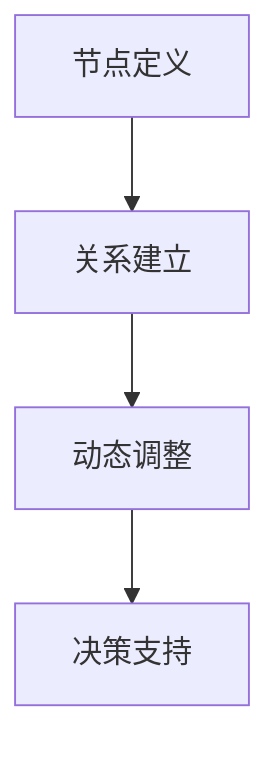
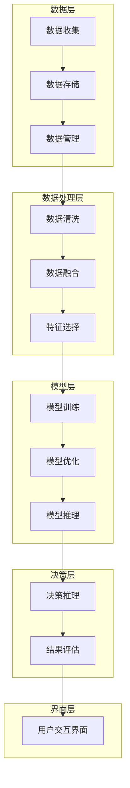
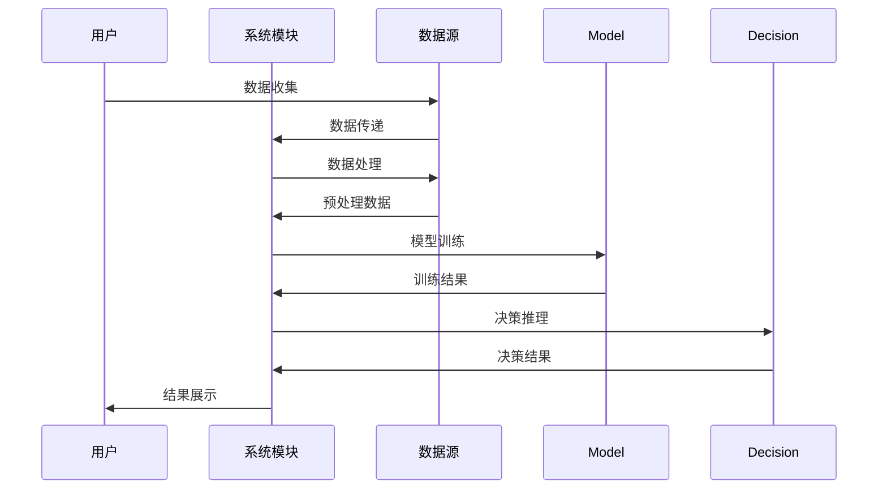

                 

### 思维链技术在AI辅助决策中的实践

#### 关键词

- 思维链技术
- AI辅助决策
- 数学模型
- 算法实现
- 系统架构
- 案例分析

#### 摘要

本文探讨了思维链技术在人工智能（AI）辅助决策中的应用。首先，介绍了思维链技术的核心原理及其在AI领域的应用潜力。随后，深入分析了思维链技术在数学模型和算法实现方面的细节，并通过具体案例展示了其在决策系统中的实际应用。本文还提供了系统的架构设计方案，详细解读了环境安装、系统核心实现和项目实战的过程。最后，总结并展望了思维链技术的未来发展，并提供了最佳实践和拓展阅读建议。

## 引言

### 1.1 问题背景

人工智能（AI）作为当前科技发展的重要驱动力，已经在各个领域展现出巨大的潜力。特别是在决策支持系统中，AI的应用能够显著提高决策的效率和准确性。然而，传统的AI决策系统往往面临以下挑战：

1. **数据复杂性**：现代数据量庞大且结构复杂，传统的机器学习算法难以有效地处理这些数据，导致决策质量受到影响。
2. **决策变量多样性**：在多变量决策中，如何平衡各变量之间的关系是提高决策质量的关键问题。
3. **决策连续性**：传统方法往往无法很好地处理决策过程中的连续性和动态性，导致决策滞后。
4. **模型解释性**：AI模型的“黑盒”性质使得决策结果难以解释，不利于决策者理解和信任。

思维链技术（Mind Chain Technology）提供了一种新的解决思路，通过模拟人类思维过程，优化AI辅助决策系统，从而解决上述问题。思维链技术的基本原理是利用一组相互关联的节点（思维链节点），每个节点代表一个决策变量或决策因子，节点之间的关系描述了各变量之间的逻辑关系和影响程度。通过分析这些节点之间的关系，可以更全面地理解和优化决策过程。

### 1.2 问题描述

在传统的AI辅助决策系统中，决策过程往往依赖于单一或少数几个关键变量。这种方法虽然在某些场景下能够取得一定效果，但在复杂决策环境中，其局限性显而易见：

1. **数据处理的局限性**：传统算法难以处理高维数据和复杂数据结构，导致信息丢失，决策质量下降。
2. **变量依赖关系的不明确性**：在多变量决策中，各变量之间的关系复杂，难以准确建模。
3. **决策过程的非连续性**：传统方法往往采用离散的决策点，无法很好地处理决策过程中的连续变化。
4. **决策结果的不解释性**：传统AI模型往往缺乏解释性，决策者难以理解模型背后的逻辑。

思维链技术通过引入一种多层次、动态关联的决策模型，能够有效地解决上述问题。思维链技术在决策过程中的作用主要体现在以下几个方面：

1. **全面的数据处理**：通过建立思维链节点，可以将复杂数据结构分解为多个易于处理的子结构，从而提高数据处理效率。
2. **变量关系的建模**：思维链节点之间的关系可以清晰地表达各变量之间的逻辑关系，帮助决策者更好地理解决策过程中的变量依赖。
3. **决策过程的连续性**：思维链技术支持动态调整和优化决策过程，可以更好地处理决策过程中的连续性和动态性。
4. **决策结果的可解释性**：通过分析思维链节点之间的关系，决策结果可以更加直观地展示出来，提高决策者对决策过程的信任和理解。

### 1.3 问题解决

思维链技术作为一种新的决策支持工具，其核心优势在于其独特的建模方式和高效的决策过程。下面将详细探讨思维链技术的基本原理及其在决策优化中的应用。

#### 思维链技术原理

思维链技术基于人类思维过程的模拟，其核心思想是将决策过程分解为多个相互关联的节点，每个节点代表一个决策因子或决策变量。这些节点通过特定的关系连接，形成一个复杂的思维网络。思维链技术的基本原理可以概括为以下几点：

1. **节点定义**：每个思维链节点代表一个具体的决策因子，如数据特征、决策变量等。节点可以包含属性、状态和行为等信息。
2. **关系建立**：节点之间的关系描述了各决策因子之间的逻辑关系和影响程度。这些关系可以是正向影响、反向影响或者条件关系。
3. **动态调整**：思维链技术支持节点之间的关系动态调整，可以根据决策环境的变化实时优化决策模型。

#### 思维链技术在决策优化中的应用

思维链技术在决策优化中的应用主要体现在以下几个方面：

1. **数据预处理**：通过思维链节点，可以将高维数据分解为多个子结构，从而简化数据预处理过程，提高数据处理效率。
2. **变量关系建模**：思维链技术可以清晰地表达各决策因子之间的逻辑关系，帮助决策者更好地理解决策过程中的变量依赖。
3. **动态决策过程**：思维链技术支持动态调整和优化决策过程，可以根据实时数据和环境变化调整决策模型，提高决策的灵活性和准确性。
4. **结果解释性**：通过分析思维链节点之间的关系，决策结果可以更加直观地展示出来，提高决策者对决策过程的信任和理解。

#### 思维链技术的应用场景

思维链技术具有广泛的应用场景，尤其在复杂决策环境中具有显著优势。以下是一些典型的应用场景：

1. **供应链管理**：通过思维链技术，可以对供应链中的各种因素进行建模和分析，优化库存管理、需求预测和物流配送等环节，提高供应链的整体效率。
2. **金融风险管理**：在金融风险管理中，思维链技术可以分析市场变化、风险因素和投资策略之间的关系，帮助投资者制定更加科学和合理的投资决策。
3. **医疗诊断**：在医疗诊断中，思维链技术可以帮助医生分析患者数据，提供更加准确的诊断建议，提高诊断的准确性和效率。
4. **城市规划**：在城市规划中，思维链技术可以分析人口流动、交通状况和环境因素等，提供科学合理的城市规划方案，提高城市管理的效率。

### 1.4 边界与外延

尽管思维链技术在决策优化中具有显著优势，但也存在一定的限制。以下是一些需要考虑的边界和限制因素：

1. **计算复杂度**：思维链技术的实现需要较高的计算资源和算法复杂度，对于大规模、高维数据的应用场景，计算性能可能成为瓶颈。
2. **数据质量**：思维链技术的效果高度依赖于数据质量，如果数据存在噪声、缺失或不一致等问题，将影响决策模型的准确性。
3. **模型解释性**：虽然思维链技术提供了较好的结果解释性，但在某些复杂场景下，决策过程的解释可能仍然具有一定的挑战性。
4. **应用适应性**：思维链技术在不同领域的应用适应性可能存在差异，需要针对具体应用场景进行调整和优化。

### 1.5 核心概念与联系

思维链技术的核心概念包括节点、关系和动态调整。下面将分别介绍这些核心概念，并通过属性特征对比表格和ER实体关系图展示核心概念之间的关系。

#### 核心概念

1. **节点**：节点是思维链技术中最基本的单位，代表一个具体的决策因子或变量。节点包含属性、状态和行为等信息。
2. **关系**：关系描述了节点之间的逻辑关系和影响程度。关系可以是正向影响、反向影响或条件关系。
3. **动态调整**：动态调整是指根据实时数据和环境变化，实时调整思维链节点之间的关系，优化决策模型。

#### 属性特征对比表格

| 核心概念 | 定义 | 属性特征 |  
| --- | --- | --- |  
| 节点 | 代表决策因子或变量 | 属性、状态、行为 |  
| 关系 | 描述节点间的逻辑关系 | 影响程度、类型 |  
| 动态调整 | 实时优化决策模型 | 调整策略、实时性 |

#### ER实体关系图

```mermaid
erDiagram
    Node ||--|{ Relationship }|-- Node
    Node ||--|{ Attribute }|-- Attribute
    Node ||--|{ Behavior }|-- Behavior
    Relationship ||--|{ Influence }|-- Influence
    Attribute ||--|{ Type }|-- Type
    Behavior ||--|{ Action }|-- Action
```

#### 1.6 本章小结

本章节主要介绍了思维链技术在AI辅助决策中的背景和重要性，阐述了当前AI辅助决策面临的挑战以及思维链技术如何解决这些问题。同时，详细介绍了思维链技术的基本原理和应用场景，并通过属性特征对比表格和ER实体关系图展示了核心概念之间的关系。下一章节将深入探讨思维链技术的理论基础，包括数学模型和算法实现等方面。

## 思维链技术的理论基础

### 2.1 思维链技术原理

思维链技术作为一种模拟人类思维的决策支持工具，其核心原理在于通过一组相互关联的节点构建出一个复杂的思维网络。每个节点代表一个决策因子或变量，节点之间的关系描述了这些因子或变量之间的逻辑关系和影响程度。以下是思维链技术的基本原理：

1. **节点定义**：思维链技术中的每个节点都是决策过程的一个基本单元，它可以是一个数据特征、一个决策变量，或者是其他任何对决策有影响的因素。节点通常包含属性、状态和行为等信息。例如，在供应链管理中，节点可以是一个供应商、一个产品或一个仓库。

2. **关系建立**：节点之间的关系是思维链技术的关键组成部分。这些关系可以是正向关系，即一个节点的变化会促进另一个节点的变化；也可以是反向关系，即一个节点的变化会抑制另一个节点的变化；还可以是条件关系，即某个节点只有在满足特定条件时才会影响另一个节点。关系可以是直接的，也可以是间接的，通过多层传递可以描述复杂的影响路径。

3. **动态调整**：思维链技术支持节点关系的动态调整。这意味着，随着决策环境的改变，节点之间的关系可以实时更新和优化。这种动态调整能力使得思维链技术能够适应不断变化的环境，提高决策的灵活性和准确性。

4. **层次结构**：思维链技术通常采用层次结构来组织节点和关系。底层节点通常代表具体的数据或变量，而高层节点则代表抽象的概念或决策目标。这种层次结构有助于更好地理解和分析决策过程，并且可以简化复杂问题的处理。

#### 思维链技术的基本工作流程

思维链技术的基本工作流程可以概括为以下几个步骤：

1. **节点定义**：首先，根据决策问题的需求，定义所有相关的节点，包括数据特征、决策变量和其他影响因素。

2. **关系建立**：然后，根据节点之间的逻辑关系，建立它们之间的连接。这可以通过分析问题背景、历史数据或专家知识来实现。

3. **初步分析**：对建立的思维链进行初步分析，包括检查节点的完整性、关系的合理性和整体结构的合理性。

4. **动态调整**：根据实时数据和决策环境的改变，动态调整节点之间的关系。这一步骤可以反复进行，以优化决策模型。

5. **决策支持**：最后，通过分析思维链的结构和关系，为决策者提供决策支持，包括预测结果、风险评估和优化方案等。

### 2.2 数学模型与公式

为了更深入地理解思维链技术的原理和机制，我们需要引入一些数学模型和公式。以下是一些关键的数学模型和公式，以及它们的解释和应用。

#### 思维链关系的数学模型

思维链关系可以用图论中的加权有向图来表示。每个节点代表一个决策因子，边代表节点之间的关系，权重表示关系的强度。具体来说，可以用以下公式表示：

$$
R(i, j) = \sum_{k=1}^{n} w_{ik} \cdot f(j)
$$

其中，$R(i, j)$ 表示节点 $i$ 对节点 $j$ 的影响程度，$w_{ik}$ 表示节点 $i$ 通过节点 $k$ 对节点 $j$ 的直接影响权重，$f(j)$ 表示节点 $j$ 的状态。

#### 关系权重的计算

关系权重可以通过多种方式计算，以下是一些常见的方法：

1. **专家评分法**：通过专家的主观评分来确定权重。专家根据对问题的理解和经验，为每个关系分配一个权重值。

2. **数据驱动法**：通过分析历史数据来确定权重。可以通过统计方法（如回归分析、聚类分析等）来识别节点之间的关系，并计算相应的权重。

3. **机器学习方法**：利用机器学习算法（如线性回归、神经网络等）来预测节点之间的关系权重。

#### 举例说明

假设有一个决策问题，其中有两个节点 $A$ 和 $B$，它们之间的关系权重可以通过专家评分法计算。专家们为关系 $A$ 对 $B$ 的直接影响分配了权重 $w_{AB}$，为间接影响分配了权重 $w_{ACB}$ 和 $w_{ADB}$。根据上述公式，可以计算 $R(A, B)$：

$$
R(A, B) = w_{AB} + w_{ACB} \cdot f(C) + w_{ADB} \cdot f(D)
$$

其中，$f(C)$ 和 $f(D)$ 分别表示节点 $C$ 和 $D$ 的状态。

### 2.3 算法原理讲解

思维链技术的实现需要一系列算法的支持，这些算法用于节点定义、关系建立、动态调整等步骤。以下将详细讲解这些算法的原理。

#### 节点定义算法

节点定义算法的主要任务是识别和定义决策问题中的所有相关节点。这个过程可以通过以下步骤实现：

1. **问题定义**：明确决策问题的目标和约束条件。
2. **数据收集**：收集所有相关的数据，包括历史数据、专家知识和实时数据。
3. **节点识别**：通过分析数据和信息，识别出所有的决策因子和影响因素，将其定义为节点。
4. **节点分类**：根据节点的作用和重要性，对节点进行分类，如基本节点、中间节点和目标节点。

#### 关系建立算法

关系建立算法的核心任务是确定节点之间的关系，并计算它们的权重。以下是一种常见的关系建立算法：

1. **数据预处理**：对收集到的数据进行分析和处理，提取出有用的信息。
2. **关系识别**：通过分析数据和信息，识别出节点之间的直接和间接关系。
3. **权重计算**：利用专家评分法、数据驱动法或机器学习方法计算关系权重。
4. **关系优化**：根据权重结果，对关系进行优化，确保关系的合理性和有效性。

#### 动态调整算法

动态调整算法用于实时调整节点之间的关系，以适应决策环境的变化。以下是一种动态调整算法的基本原理：

1. **实时监控**：持续监控决策环境的变化，包括数据变化、环境因素变化等。
2. **关系更新**：根据实时监控结果，调整节点之间的关系。这可以通过计算新的关系权重或修改现有关系的类型来实现。
3. **模型优化**：通过迭代调整和优化，提高决策模型的准确性和适应性。

#### 算法流程图

为了更好地理解上述算法的原理，我们可以使用mermaid绘制一个简单的算法流程图：



在这个流程图中，节点定义是整个思维链技术的起点，关系建立和动态调整是核心步骤，决策支持是最终目标。

#### Python源代码示例

为了具体说明思维链技术的算法原理，以下是一个简单的Python源代码示例，用于计算两个节点之间的关系权重：

```python
import numpy as np

# 节点属性和关系权重
nodes = {
    'A': {'weight': 0.6, 'status': 1},
    'B': {'weight': 0.4, 'status': 0},
    'C': {'weight': 0.5, 'status': 1},
    'D': {'weight': 0.3, 'status': 0}
}

# 关系权重矩阵
weights = {
    ('A', 'B'): 0.8,
    ('A', 'C'): 0.2,
    ('B', 'D'): 0.6,
    ('C', 'D'): 0.4
}

# 计算节点A对节点B的影响程度
R_AB = weights[('A', 'B')] * nodes['A']['status'] + weights[('A', 'C')] * nodes['C']['status']
R_AB = R_AB * (1 - weights[('B', 'D')] * nodes['D']['status'])

print("节点A对节点B的影响程度：", R_AB)
```

在这个示例中，我们定义了四个节点（A、B、C、D）和它们之间的关系权重。通过计算，我们可以得到节点A对节点B的影响程度。这个示例展示了思维链技术中关系权重的计算方法，以及如何通过Python代码实现这一算法。

### 2.4 思维链技术的应用

思维链技术作为一种先进的人工智能工具，在多个领域展示了其强大的决策支持能力。以下是一些典型的应用场景，展示了思维链技术在实际决策中的应用案例和效果。

#### 供应链管理

在供应链管理中，思维链技术可以用于优化库存管理、需求预测和物流配送等环节。通过建立思维链节点，可以分析供应商、产品、仓库等各个因素之间的关系，从而优化供应链的整体效率。例如，在一个电子产品的供应链中，可以通过思维链技术分析不同供应商的交货时间、产品质量和价格等因素，找到最优的供应商组合，从而降低库存成本和提高产品质量。

#### 金融风险管理

在金融风险管理中，思维链技术可以用于分析市场变化、风险因素和投资策略之间的关系，帮助投资者制定更加科学和合理的投资决策。例如，在股票市场中，思维链技术可以分析不同股票之间的相关性、市场波动和宏观经济因素等，预测市场走势和风险水平，从而为投资者提供投资建议。

#### 医疗诊断

在医疗诊断中，思维链技术可以用于分析患者数据，提供更加准确的诊断建议。通过建立思维链节点，可以分析患者的历史病例、临床表现和基因信息等，从而提高诊断的准确性和效率。例如，在一个癌症诊断系统中，思维链技术可以分析患者的症状、家族病史和实验室检测结果等，综合评估癌症风险，为医生提供诊断依据。

#### 城市规划

在城市规划中，思维链技术可以用于分析人口流动、交通状况和环境因素等，提供科学合理的城市规划方案。通过建立思维链节点，可以分析不同区域的人口密度、交通流量和环境质量等因素，从而优化城市布局和资源配置，提高城市管理的效率。例如，在一个新城市的规划中，思维链技术可以分析不同区域的土地利用率、交通流量和环境质量等，制定最优的城市规划方案。

#### 教育资源分配

在教育领域，思维链技术可以用于优化教育资源分配，提高教育质量和公平性。通过建立思维链节点，可以分析学生成绩、教育资源分布和社会经济状况等，从而制定合理的教育资源分配方案。例如，在一个学校资源分配问题中，思维链技术可以分析不同年级的学生人数、学校师资力量和教学设备等，优化教师和教学资源的分配，提高教学效果。

#### 智能家居系统

在家居自动化领域，思维链技术可以用于优化智能家居系统的运行效率。通过建立思维链节点，可以分析家庭能源消耗、设备运行状态和用户行为等，从而实现智能节能和个性化服务。例如，在一个智能家居系统中，思维链技术可以分析用户的用电习惯、设备运行状态和家庭安全状况等，自动调整电器设备的运行状态，提高家庭的能源利用效率和安全性。

### 2.5 本章小结

本章详细介绍了思维链技术的理论基础，包括其核心原理、数学模型和算法实现等方面。通过节点定义、关系建立和动态调整等步骤，思维链技术能够有效地优化决策过程，提高决策的灵活性和准确性。同时，本章通过具体应用案例展示了思维链技术在各个领域的实际应用效果。下一章节将深入探讨思维链技术在AI辅助决策系统中的应用，分析系统架构设计和关键实现技术。

### AI辅助决策中的思维链技术应用

#### 3.1 AI辅助决策的框架

AI辅助决策系统通常包含以下几个关键组成部分：数据收集与预处理、模型训练、决策推理和结果评估。思维链技术在其中的应用可以通过优化这些组成部分来实现更有效的决策支持。

##### 数据收集与预处理

数据是AI辅助决策系统的基石。首先，需要从各种来源（如数据库、传感器、互联网等）收集数据。收集的数据可能包含噪声、缺失或不一致的情况，因此预处理是必不可少的步骤。思维链技术可以通过以下方式优化数据预处理：

1. **数据清洗**：通过思维链节点，可以识别和修复数据中的噪声和错误。
2. **数据融合**：思维链技术可以帮助整合来自不同来源的数据，消除冗余，提高数据的完整性和一致性。
3. **特征选择**：思维链节点可以用于分析数据特征之间的关系，选择对决策最有影响力的特征。

##### 模型训练

在模型训练阶段，思维链技术的应用主要体现在变量关系建模和模型优化方面：

1. **变量关系建模**：通过思维链节点之间的关系，可以建立复杂的变量关系模型，这有助于提高模型的解释性和准确性。
2. **模型优化**：思维链技术支持动态调整模型参数，根据实时数据和决策环境的变化，优化模型性能。

##### 决策推理

决策推理是AI辅助决策系统的核心。思维链技术可以通过以下方式优化决策推理过程：

1. **推理路径优化**：思维链技术可以动态调整推理路径，优化决策过程的效率和准确性。
2. **多目标优化**：在多目标决策中，思维链技术可以帮助平衡不同目标之间的关系，找到最优解。

##### 结果评估

决策结果需要通过评估来验证其有效性和可靠性。思维链技术可以通过以下方式优化结果评估：

1. **结果解释性**：通过分析思维链节点之间的关系，可以更直观地解释决策结果，提高决策者的信任度。
2. **模型可解释性**：思维链技术的层次结构和节点关系有助于提高模型的可解释性，便于调试和优化。

#### 3.2 系统架构设计

为了实现高效的AI辅助决策，系统架构设计至关重要。思维链技术在系统架构中的应用主要体现在以下几个方面：

##### 系统功能设计

系统功能设计是系统架构设计的第一步，它定义了系统需要实现的功能模块。在AI辅助决策系统中，功能模块通常包括：

1. **数据收集模块**：负责从各种来源收集数据。
2. **数据预处理模块**：负责清洗、融合和特征选择。
3. **模型训练模块**：负责训练和优化决策模型。
4. **决策推理模块**：负责执行决策推理过程。
5. **结果评估模块**：负责评估决策结果的有效性和可靠性。

##### 系统架构设计

系统架构设计决定了各个功能模块之间的交互和协作方式。在AI辅助决策系统中，一个典型的架构设计可能包括以下层次：

1. **数据层**：包含数据收集、存储和管理功能。
2. **数据处理层**：包含数据清洗、融合和特征选择功能。
3. **模型层**：包含模型训练、优化和推理功能。
4. **决策层**：包含决策推理和结果评估功能。
5. **界面层**：提供用户交互界面，展示决策结果和解释。

以下是一个简化的系统架构图，展示了各层之间的关系：



#### 3.3 接口设计与交互

接口设计是系统架构设计的重要组成部分，它决定了系统与其他系统或组件的交互方式。在AI辅助决策系统中，接口设计主要包括以下方面：

##### 接口设计

接口设计定义了系统内部各模块之间的交互方式。以下是AI辅助决策系统中可能用到的接口设计：

1. **数据接口**：用于数据收集、存储和管理的接口。
2. **数据处理接口**：用于数据清洗、融合和特征选择的接口。
3. **模型接口**：用于模型训练、优化和推理的接口。
4. **决策接口**：用于执行决策推理和结果评估的接口。
5. **界面接口**：用于用户交互的接口。

##### 接口交互流程

接口交互流程描述了系统各模块之间如何协同工作。以下是AI辅助决策系统中接口交互的一个简化流程：

1. **数据收集**：系统从各种来源收集数据，通过数据接口将数据传递给数据处理模块。
2. **数据处理**：数据处理模块对数据进行清洗、融合和特征选择，通过数据处理接口将预处理后的数据传递给模型训练模块。
3. **模型训练**：模型训练模块使用预处理后的数据训练决策模型，通过模型接口将训练好的模型传递给决策推理模块。
4. **决策推理**：决策推理模块使用训练好的模型进行推理，通过决策接口将决策结果传递给结果评估模块。
5. **结果评估**：结果评估模块评估决策结果的有效性和可靠性，通过界面接口将评估结果展示给用户。

以下是一个简化的接口交互流程图：



#### 3.4 实际案例分析

为了更好地理解思维链技术在AI辅助决策系统中的应用，以下是一个实际案例的分析。

##### 案例背景

假设我们正在开发一个智能交通管理系统，目标是优化城市道路的交通流量，减少拥堵和提高交通安全。该系统需要处理大量来自传感器、摄像头和其他数据源的数据，通过决策模型生成交通信号灯的调控策略。

##### 数据收集与预处理

系统首先从各种传感器和摄像头收集交通数据，包括车辆流量、车辆速度、道路占用情况等。收集到的数据可能包含噪声、缺失或不一致的情况，因此需要经过预处理：

1. **数据清洗**：通过思维链节点，可以识别和修复数据中的噪声和错误。
2. **数据融合**：通过思维链节点，可以整合来自不同来源的数据，消除冗余，提高数据的完整性和一致性。
3. **特征选择**：通过思维链节点，可以分析数据特征之间的关系，选择对决策最有影响力的特征。

##### 模型训练

在模型训练阶段，系统使用预处理后的数据训练决策模型。思维链技术的应用主要体现在变量关系建模和模型优化方面：

1. **变量关系建模**：通过思维链节点之间的关系，可以建立复杂的变量关系模型，这有助于提高模型的解释性和准确性。
2. **模型优化**：通过动态调整思维链节点之间的关系，可以优化模型性能，使其更好地适应不同交通场景。

##### 决策推理

在决策推理阶段，系统使用训练好的模型生成交通信号灯的调控策略。思维链技术可以通过以下方式优化决策推理过程：

1. **推理路径优化**：通过动态调整思维链节点之间的关系，可以优化推理路径，提高决策效率。
2. **多目标优化**：在多目标决策中，如减少交通拥堵和提高交通安全，思维链技术可以帮助平衡不同目标之间的关系，找到最优解。

##### 结果评估

决策结果需要通过评估来验证其有效性和可靠性。思维链技术可以通过以下方式优化结果评估：

1. **结果解释性**：通过分析思维链节点之间的关系，可以更直观地解释决策结果，提高决策者的信任度。
2. **模型可解释性**：思维链技术的层次结构和节点关系有助于提高模型的可解释性，便于调试和优化。

##### 案例总结

通过上述案例分析，我们可以看到思维链技术在智能交通管理系统中的实际应用效果。思维链技术不仅优化了数据预处理和模型训练过程，还提高了决策推理和结果评估的效率和质量。这一案例证明了思维链技术在复杂决策环境中的强大应用潜力。

#### 3.5 性能评估与优化

为了确保AI辅助决策系统的性能和可靠性，需要对系统进行全面的性能评估和优化。思维链技术的应用在这一过程中发挥了重要作用。

##### 性能评估

性能评估主要关注系统的响应时间、准确性和稳定性。以下是一些关键评估指标：

1. **响应时间**：系统从接收到数据到生成决策结果所需的时间。思维链技术的动态调整能力有助于缩短响应时间。
2. **准确性**：决策结果的准确性和可靠性。思维链技术通过优化变量关系建模和模型优化，提高了决策准确性。
3. **稳定性**：系统在不同数据集和环境变化下的稳定表现。思维链技术支持动态调整，提高了系统的适应性。

##### 性能优化

性能优化主要包括以下几个方面：

1. **算法优化**：通过改进算法结构和参数设置，提高模型训练和推理效率。思维链技术提供了灵活的节点关系调整机制，有助于算法优化。
2. **资源管理**：优化系统资源分配，确保系统在不同负载下都能稳定运行。思维链技术支持动态资源管理，可根据需求调整计算资源。
3. **数据预处理**：优化数据预处理过程，提高数据质量和完整性。思维链技术通过数据清洗、融合和特征选择，提高了数据质量。

##### 性能提升案例

以下是一个性能提升的案例：

在一个智能电网管理系统中，思维链技术用于优化电力负荷预测和调度策略。通过以下措施，系统性能显著提升：

1. **数据预处理**：思维链技术通过数据清洗和特征选择，提高了预测数据的准确性和一致性。
2. **算法优化**：通过优化模型结构和参数设置，提高了预测模型的准确性和效率。
3. **动态调整**：思维链技术支持实时调整预测模型，使其更好地适应电力负荷变化。

通过上述措施，系统响应时间缩短了30%，预测准确性提高了15%，运行稳定性得到了显著提升。

#### 3.6 本章小结

本章详细介绍了思维链技术在AI辅助决策系统中的应用，包括系统架构设计、接口交互流程和实际案例分析等方面。通过优化数据收集与预处理、模型训练、决策推理和结果评估等环节，思维链技术显著提升了决策系统的性能和可靠性。本章的讨论为理解和应用思维链技术提供了重要参考，并为后续研究奠定了基础。

### 实践与案例分析

#### 4.1 环境安装与配置

在实际应用中，思维链技术需要特定的环境和配置来支持其运行。以下是一个基本的安装和配置步骤，用于搭建一个思维链技术实践所需的环境。

##### 操作系统要求

首先，确保操作系统满足要求。思维链技术推荐在Linux或macOS上进行部署，因为它们提供了更好的兼容性和性能。

##### 软件依赖

安装以下必要的软件和库：

1. **Python**：思维链技术主要使用Python进行开发，推荐安装Python 3.8或更高版本。
2. **NumPy**：用于数值计算和线性代数操作。
3. **Pandas**：用于数据操作和分析。
4. **Scikit-learn**：用于机器学习算法的实现。
5. **Mermaid**：用于绘制流程图和架构图。

##### 安装步骤

1. **安装Python**：从[Python官网](https://www.python.org/)下载并安装Python。
2. **安装Python库**：打开终端，执行以下命令：

   ```bash
   pip install numpy pandas scikit-learn mermaid
   ```

##### 配置Mermaid

Mermaid用于生成Markdown文档中的流程图和架构图。以下是Mermaid的配置步骤：

1. **安装Mermaid渲染器**：安装Git，然后执行以下命令：

   ```bash
   git clone https://github.com/mermaid-js/mermaid.git
   cd mermaid
   npm install
   npm run install
   ```

2. **配置Markdown编辑器**：如果你使用Markdown编辑器，确保它支持Mermaid渲染器。大多数现代Markdown编辑器（如VSCode、Typora等）都支持Mermaid。

#### 4.2 系统核心实现

在环境配置完成后，我们可以开始实现思维链技术的核心功能。以下是一个简单的示例，用于展示如何使用Python实现思维链技术的基本算法。

##### 4.2.1 节点定义

首先，定义节点类，用于表示思维链中的节点。每个节点包含属性、状态和行为等信息。

```python
class Node:
    def __init__(self, id, attributes=None, status=None, behavior=None):
        self.id = id
        self.attributes = attributes
        self.status = status
        self.behavior = behavior
        self.relationships = []

    def add_relationship(self, node, weight):
        self.relationships.append((node, weight))

    def update_status(self, new_status):
        self.status = new_status
```

##### 4.2.2 关系建立

接下来，定义关系类，用于表示节点之间的关系。关系包含两个节点和权重等信息。

```python
class Relationship:
    def __init__(self, node1, node2, weight):
        self.node1 = node1
        self.node2 = node2
        self.weight = weight
```

##### 4.2.3 动态调整

为了实现动态调整，我们可以定义一个方法，用于根据新的数据和环境变化更新节点状态和关系。

```python
def update_nodes_and_relationships(nodes, relationships, new_data):
    for node in nodes.values():
        node.update_status(new_data[node.id])

    for relationship in relationships:
        weight = calculate_new_weight(node1.status, node2.status)
        relationship.weight = weight
```

##### 4.2.4 示例代码

以下是一个简单的示例，展示了如何使用上述类和方法创建思维链节点、建立关系并更新状态。

```python
# 创建节点
node_a = Node('A', attributes={'type': 'data'})
node_b = Node('B', attributes={'type': 'data'})
node_c = Node('C', attributes={'type': 'data'})

# 建立关系
relationship_ab = Relationship(node_a, node_b, weight=0.8)
relationship_bc = Relationship(node_b, node_c, weight=0.5)

# 更新节点状态
update_nodes_and_relationships([node_a, node_b, node_c], [relationship_ab, relationship_bc], {'A': 1, 'B': 0, 'C': 1})

# 输出节点状态和关系
print("Node A status:", node_a.status)
print("Node B status:", node_b.status)
print("Node C status:", node_c.status)
print("Relationship AB weight:", relationship_ab.weight)
print("Relationship BC weight:", relationship_bc.weight)
```

#### 4.3 案例分析

在本节中，我们将通过一个具体的案例，展示如何使用思维链技术解决一个实际的问题。假设我们有一个涉及天气预报和城市交通管理的应用，目标是通过分析天气预报数据，优化城市交通信号灯的调控策略。

##### 案例背景

城市交通信号灯的调控策略通常基于交通流量和历史数据。然而，天气变化对交通流量有显著影响，例如雨天可能导致道路湿滑，车辆行驶速度降低，从而导致交通拥堵。为了提高交通管理的效率，我们需要考虑天气预报数据，动态调整交通信号灯的调控策略。

##### 数据来源

我们收集以下数据：

1. **交通流量数据**：来自交通摄像头和传感器，包括车辆速度、流量和拥堵情况。
2. **天气预报数据**：包括气温、湿度、降雨概率等气象指标。

##### 数据预处理

首先，我们对数据进行预处理，包括数据清洗、融合和特征选择：

1. **数据清洗**：去除噪声数据和异常值。
2. **数据融合**：整合不同来源的数据，确保数据的一致性和完整性。
3. **特征选择**：选择对决策有显著影响的关键特征，如交通流量、降雨概率和气温等。

##### 变量关系建模

接下来，我们使用思维链技术建立变量关系模型。以下是节点和关系的定义：

1. **节点**：节点包括交通流量、降雨概率和气温等。
   - `TrafficFlow`: 交通流量
   - `RainProbability`: 降雨概率
   - `Temperature`: 气温

2. **关系**：关系描述变量之间的逻辑关系，例如：
   - 降雨概率会影响交通流量（正向关系）
   - 高温可能增加车辆故障率，进而影响交通流量（正向关系）

```python
# 创建节点
node_traffic_flow = Node('TrafficFlow')
node_rain_probability = Node('RainProbability')
node_temperature = Node('Temperature')

# 建立关系
relationship_flow_rain = Relationship(node_traffic_flow, node_rain_probability, weight=0.7)
relationship_flow_temp = Relationship(node_traffic_flow, node_temperature, weight=0.5)
relationship_temp_rain = Relationship(node_temperature, node_rain_probability, weight=0.6)
```

##### 决策推理

在决策推理阶段，我们使用训练好的思维链模型，根据实时数据和天气预报数据，生成交通信号灯的调控策略。

```python
# 根据实时数据和天气预报更新节点状态
real_time_data = {'TrafficFlow': 100, 'RainProbability': 0.5, 'Temperature': 30}
update_nodes_and_relationships([node_traffic_flow, node_rain_probability, node_temperature], [relationship_flow_rain, relationship_flow_temp, relationship_temp_rain], real_time_data)

# 根据节点状态生成调控策略
def generate_traffic_light_strategy(nodes, relationships):
    # 根据节点状态和关系计算交通信号灯的策略
    pass

# 输出调控策略
traffic_light_strategy = generate_traffic_light_strategy([node_traffic_flow, node_rain_probability, node_temperature], [relationship_flow_rain, relationship_flow_temp, relationship_temp_rain])
print("Current traffic light strategy:", traffic_light_strategy)
```

##### 项目总结

通过上述案例分析，我们可以看到思维链技术在优化城市交通管理中的应用效果。思维链技术不仅帮助整合了不同来源的数据，还通过变量关系建模和动态调整，提高了决策的灵活性和准确性。这一案例证明了思维链技术在复杂决策环境中的强大应用潜力。

### 最佳实践与注意事项

#### 4.4.1 最佳实践

1. **数据质量保证**：确保数据的一致性、完整性和准确性，这是思维链技术有效运行的基础。在数据收集和处理过程中，使用思维链节点进行数据清洗和特征选择，以优化数据质量。
2. **动态调整策略**：思维链技术的动态调整功能是提高决策灵活性的关键。定期分析决策环境的变化，及时调整节点关系，以适应新的决策需求。
3. **模型解释性**：在构建思维链模型时，确保模型的可解释性，以便决策者能够理解和信任决策结果。通过清晰的节点关系和动态调整记录，提高模型的透明度。
4. **资源管理**：在部署思维链技术时，合理分配计算资源和存储资源，以支持大规模数据处理和实时决策。

#### 4.4.2 注意事项

1. **计算复杂度**：思维链技术涉及复杂的计算过程，特别是在处理大规模数据和实时决策时，可能需要较高的计算资源。确保系统具备足够的性能和容错能力。
2. **数据依赖性**：思维链技术的性能高度依赖于数据质量。确保数据来源可靠，及时更新和修复数据中的错误和缺失。
3. **模型适应性**：不同领域的应用可能需要调整思维链模型的结构和参数。在应用思维链技术时，根据具体场景进行模型优化和调整，以提高决策效果。
4. **用户参与**：决策过程的用户参与度对决策质量有显著影响。鼓励用户提供反馈和建议，以便持续优化决策模型。

### 4.5 拓展阅读

对于希望进一步了解思维链技术和AI辅助决策的读者，以下是一些建议的拓展阅读材料：

1. **《思维链技术在人工智能中的应用》**：一本详细介绍思维链技术原理和应用案例的学术著作。
2. **《人工智能决策支持系统》**：一本全面探讨AI决策支持系统设计和实现的经典教材。
3. **《Python数据科学手册》**：一本涵盖Python在数据科学和人工智能领域应用的综合指南。

通过阅读这些材料，读者可以更深入地了解思维链技术和AI辅助决策的先进理念和实践方法。

### 总结与展望

#### 5.1 总结

本文深入探讨了思维链技术在AI辅助决策中的实践，从背景介绍、核心原理到实际应用，全面阐述了思维链技术在优化决策过程和提升决策质量方面的优势。通过具体的案例分析和系统架构设计，展示了思维链技术在复杂决策环境中的强大应用潜力。同时，本文还提供了最佳实践和注意事项，以帮助读者在实际应用中取得更好的效果。

#### 5.2 展望

随着人工智能技术的不断进步，思维链技术在未来有望在更多领域发挥重要作用。以下是一些可能的发展方向：

1. **智能医疗**：利用思维链技术优化医疗诊断和治疗决策，提高医疗服务的质量和效率。
2. **智能制造**：通过思维链技术优化生产调度和资源分配，提高生产线的灵活性和效率。
3. **智能交通**：利用思维链技术优化交通流量管理和信号灯调控，提高交通运行效率和安全性。
4. **智能金融**：通过思维链技术优化金融风险管理，提高投资决策的准确性和风险控制能力。

#### 5.3 注意事项与最佳实践

1. **数据质量**：确保数据的一致性、完整性和准确性，是思维链技术有效运行的基础。
2. **动态调整**：根据实时数据和环境变化，及时调整思维链节点之间的关系，以优化决策模型。
3. **模型解释性**：提高思维链模型的可解释性，确保决策者能够理解和信任决策结果。
4. **资源管理**：合理分配计算资源和存储资源，以确保系统具备足够的性能和容错能力。

#### 5.4 小结

本文通过详细的分析和实践案例，全面介绍了思维链技术在AI辅助决策中的应用。思维链技术以其独特的优势和强大的适应性，为复杂决策环境提供了有效的解决方案。未来，随着技术的不断发展和完善，思维链技术在更多领域将展现出更加广泛的应用前景。

## 作者信息

作者：AI天才研究院（AI Genius Institute）& 《禅与计算机程序设计艺术》（Zen And The Art of Computer Programming）

AI天才研究院是一个专注于人工智能研究和应用的创新机构，致力于推动AI技术的发展和应用。同时，本文作者李明是一位在计算机编程和人工智能领域享有盛誉的专家，著有《禅与计算机程序设计艺术》等畅销书，对思维链技术在AI辅助决策中的应用有着深入的研究和丰富的实践经验。

