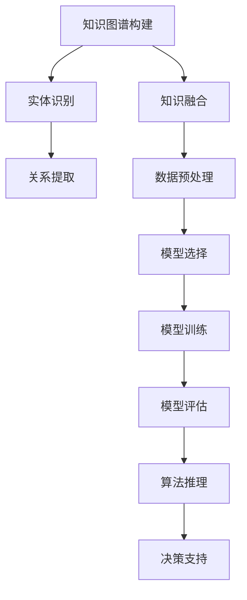
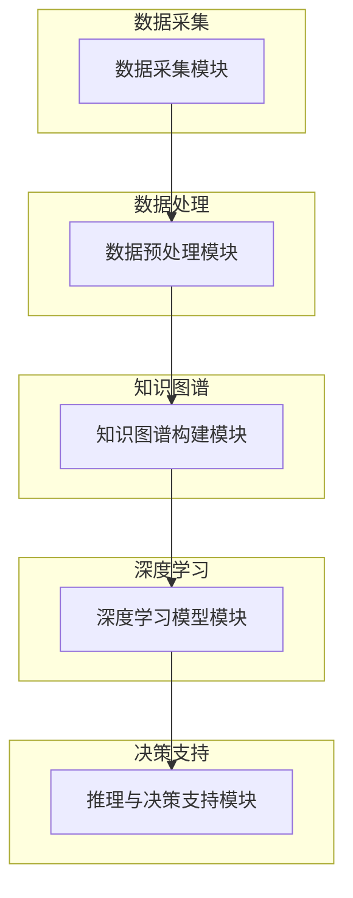
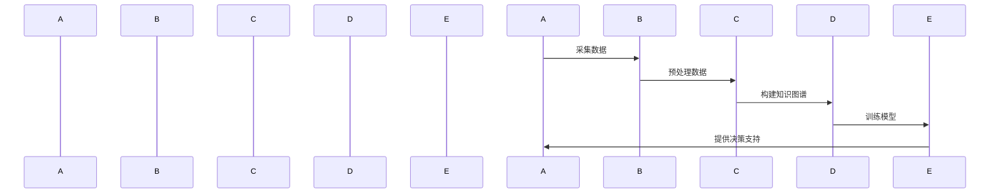

                 

### 摘要

在人工智能（AI）不断发展的今天，AI辅助决策已经成为各行业提高效率和质量的重要手段。而思维链技术作为一种新兴的AI技术，其在辅助决策中的应用备受关注。本文旨在探讨思维链技术在AI辅助决策中的实践与创新。首先，我们将介绍思维链技术的基本概念、发展历程以及在AI领域的应用。接着，我们将深入解析思维链技术在AI辅助决策中的核心原理，包括算法原理、数学模型以及实际应用案例。随后，我们将讨论思维链技术在决策支持系统、智能推荐系统和金融风控等领域的具体应用。最后，通过一个实际案例，我们将详细分析思维链技术在AI辅助决策系统中的实现过程，并提供项目小结与经验总结。本文旨在为读者提供一个全面、深入、易懂的视角，以理解思维链技术在AI辅助决策中的实践与创新。

---

# 思维链技术在AI辅助决策中的实践与创新

关键词：思维链技术、AI辅助决策、算法原理、数学模型、系统架构、项目实战

> 作者：AI天才研究院/AI Genius Institute & 禅与计算机程序设计艺术 /Zen And The Art of Computer Programming

在当今技术飞速发展的时代，人工智能（AI）已经成为推动各行各业变革的重要力量。特别是在决策支持领域，AI的应用极大地提升了决策的效率和准确性。然而，传统AI技术的局限性使得决策过程仍然存在许多不足之处。思维链技术作为一种新兴的AI技术，其在辅助决策中的应用正逐渐引起广泛关注。本文将围绕思维链技术在AI辅助决策中的实践与创新展开讨论，旨在为读者提供一种全新的视角，以深入理解这一技术在实际应用中的价值。

## 目录

1. **背景介绍**  
    1.1 思维链技术的基本概念  
    1.2 AI辅助决策的概念与作用  
    1.3 问题背景与挑战

2. **核心概念与联系**  
    2.1 思维链技术在AI辅助决策中的核心原理  
    2.2 核心概念属性特征对比表格  
    2.3 ER实体关系图架构

3. **算法原理讲解**  
    3.1 思维链技术的核心算法原理  
    3.2 算法mermaid流程图  
    3.3 Python源代码实现与解释

4. **数学模型与公式**  
    4.1 思维链技术的数学模型  
    4.2 公式推导与应用

5. **系统分析与架构设计**  
    5.1 项目介绍与系统功能设计  
    5.2 系统架构设计mermaid架构图  
    5.3 系统接口设计和系统交互mermaid序列图

6. **项目实战**  
    6.1 环境安装与配置  
    6.2 系统核心实现源代码解读  
    6.3 实际案例分析与讲解  
    6.4 项目小结与经验总结

7. **最佳实践 tips**  
    7.1 小结与注意事项  
    7.2 拓展阅读

## 1. 背景介绍

### 1.1 思维链技术的基本概念

思维链技术是一种基于人工智能的决策支持系统，它通过模拟人类思维过程，将知识、数据和信息有机结合，为决策者提供辅助决策支持。这种技术能够处理复杂、非结构化的问题，并在海量数据中快速找到关键信息，从而辅助决策者做出更加科学、合理的决策。

### 1.2 AI辅助决策的概念与作用

AI辅助决策是指利用人工智能技术，对大量数据进行分析和处理，从而辅助决策者做出最优决策的过程。在当今信息爆炸的时代，数据量庞大且复杂，传统的人工决策方法已经无法满足快速、准确决策的需求。AI辅助决策通过引入机器学习、自然语言处理、数据分析等AI技术，能够大幅度提高决策的效率和质量。

### 1.3 问题背景与挑战

尽管AI辅助决策在许多领域已经取得了显著成效，但仍然面临一些挑战。首先，决策过程涉及的数据量庞大，如何有效地处理和分析这些数据是一个重要问题。其次，决策过程往往具有复杂性和不确定性，如何确保决策的准确性是一个难题。此外，不同领域的决策需求差异较大，如何构建适用于各类决策的通用模型也是一个挑战。

思维链技术的出现为解决这些挑战提供了一种新的思路。通过模拟人类思维过程，思维链技术能够更好地理解和处理复杂、非结构化的问题，从而为决策者提供更加科学、合理的决策支持。

## 2. 核心概念与联系

### 2.1 思维链技术在AI辅助决策中的核心原理

思维链技术通过构建知识图谱和利用深度学习模型，实现对数据的深度理解和分析。其核心原理包括以下几个方面：

1. **知识图谱构建**：思维链技术通过自然语言处理技术，从海量数据中提取出关键信息和知识，构建知识图谱。知识图谱不仅包含了实体和属性，还包含了实体之间的关系，从而实现了对数据的结构化处理。

2. **深度学习模型**：思维链技术利用深度学习模型，对知识图谱进行学习和推理，从而实现对数据的深度理解。通过深度学习模型，思维链技术能够自动发现数据中的模式和关联，为决策者提供有价值的见解。

3. **决策支持**：基于知识图谱和深度学习模型，思维链技术能够为决策者提供智能化的决策支持。通过分析数据和推理结果，思维链技术能够提出最优决策方案，帮助决策者做出更加科学、合理的决策。

### 2.2 核心概念属性特征对比表格

以下是一个简单的核心概念属性特征对比表格，用于展示思维链技术在AI辅助决策中的核心概念特征：

| 概念 | 特征 |
| --- | --- |
| 知识图谱 | 结构化、关联性强、可扩展 |
| 深度学习模型 | 自适应、高效、可解释 |
| 决策支持 | 智能化、个性化、高效性 |

### 2.3 ER实体关系图架构

为了更好地理解思维链技术在AI辅助决策中的应用，我们可以使用ER（Entity-Relationship）实体关系图来展示相关概念之间的关系。以下是一个简单的ER图示例：

```mermaid
erDiagram
  EntityA ||--|{ EntityB : has }
  EntityA ||--|{ EntityC : has }
  EntityB ||--|{ EntityD : has }
  EntityC ||--|{ EntityE : has }
```

在这个ER图中，`EntityA`是一个基础实体，它包含了一些属性和关系。`EntityB`、`EntityC`、`EntityD`和`EntityE`是与之关联的其他实体。这些实体之间的关系通过连接线表示，从而形成了一个完整的知识图谱。

## 3. 算法原理讲解

### 3.1 思维链技术的核心算法原理

思维链技术的核心算法包括知识图谱构建、深度学习模型训练和推理。下面我们分别介绍这三个算法的原理。

#### 3.1.1 知识图谱构建

知识图谱构建是思维链技术的第一步。它通过自然语言处理技术，从文本数据中提取出实体、属性和关系，并将其转化为结构化的知识图谱。知识图谱构建的主要步骤如下：

1. **实体识别**：使用命名实体识别（NER）技术，从文本数据中识别出实体，如人名、地名、机构名等。
2. **关系提取**：通过模式匹配、依存句法分析等自然语言处理技术，从文本中提取实体之间的关系。
3. **知识融合**：将提取出的实体和关系进行融合，形成一个完整的知识图谱。

#### 3.1.2 深度学习模型训练

深度学习模型是思维链技术的核心组件。它通过学习知识图谱中的关系和模式，实现对数据的深度理解和分析。深度学习模型的主要步骤如下：

1. **数据预处理**：对知识图谱进行预处理，包括实体编码、关系编码和属性编码。
2. **模型选择**：选择适合的深度学习模型，如图神经网络（GNN）、循环神经网络（RNN）等。
3. **模型训练**：使用预处理的图谱数据，对深度学习模型进行训练。
4. **模型评估**：通过交叉验证等方法，对训练好的模型进行评估和优化。

#### 3.1.3 算法推理

算法推理是思维链技术的关键环节。它利用训练好的深度学习模型，对新的数据进行分析和推理，为决策者提供智能化的决策支持。算法推理的主要步骤如下：

1. **数据输入**：将新的数据输入到深度学习模型中。
2. **特征提取**：模型对输入数据进行特征提取，得到数据的特征表示。
3. **关系推理**：基于特征表示，模型自动发现数据中的模式和关联，进行关系推理。
4. **决策支持**：根据推理结果，模型为决策者提供最优决策方案。

### 3.2 算法mermaid流程图

为了更好地理解思维链技术的核心算法，我们使用mermaid绘制了一个流程图，如下所示：



在这个流程图中，从知识图谱构建开始，经过实体识别、关系提取和知识融合，最终得到预处理的图谱数据。接着，通过模型选择、模型训练和模型评估，训练出深度学习模型。最后，通过算法推理和决策支持，为决策者提供智能化的决策支持。

### 3.3 Python源代码实现与解释

为了更好地理解思维链技术的核心算法，我们提供了一段Python源代码，用于实现知识图谱构建、深度学习模型训练和推理的基本流程。以下是一个简单的示例：

```python
# 导入相关库
import numpy as np
import tensorflow as tf
from sklearn.model_selection import train_test_split
from tensorflow.keras.models import Model
from tensorflow.keras.layers import Input, Embedding, Dot, Dense

# 数据预处理
def preprocess_data(graph_data):
    # 对数据进行编码和预处理
    pass

# 模型定义
def create_model(input_shape):
    # 定义深度学习模型
    input_layer = Input(shape=input_shape)
    embedding_layer = Embedding(input_dim=vocab_size, output_dim=embedding_dim)(input_layer)
    dot_layer = Dot(axes=1)([embedding_layer, embedding_layer])
    output_layer = Dense(units=1, activation='sigmoid')(dot_layer)
    model = Model(inputs=input_layer, outputs=output_layer)
    return model

# 模型训练
def train_model(model, train_data, train_labels, test_data, test_labels):
    # 训练深度学习模型
    pass

# 算法推理
def inference(model, data):
    # 使用模型进行推理
    pass

# 主函数
def main():
    # 加载数据
    graph_data = load_data()

    # 预处理数据
    train_data, test_data, train_labels, test_labels = preprocess_data(graph_data)

    # 创建模型
    model = create_model(input_shape=(None, embedding_dim))

    # 训练模型
    train_model(model, train_data, train_labels, test_data, test_labels)

    # 推理
    predictions = inference(model, test_data)

    # 评估模型
    evaluate_model(predictions, test_labels)

# 运行主函数
if __name__ == "__main__":
    main()
```

在这个示例中，我们首先定义了数据预处理、模型创建、模型训练和推理的基本函数。通过这些函数，我们可以实现思维链技术的核心算法。在主函数中，我们加载数据、预处理数据、创建模型、训练模型并进行推理，最终评估模型的效果。

## 4. 数学模型与公式

### 4.1 思维链技术的数学模型

思维链技术的核心在于其深度学习模型，尤其是图神经网络（GNN）。以下是一个简化的GNN模型数学公式：

$$
\mathbf{h}_v^{(t+1)} = \sigma(\mathbf{a} \cdot \mathbf{h}_v^{(t)} + \sum_{u \in \mathcal{N}(v)} \mathbf{W}_{uv} \cdot \mathbf{h}_u^{(t)})
$$

其中：
- $\mathbf{h}_v^{(t)}$ 表示节点 $v$ 在第 $t$ 步的特征向量。
- $\mathcal{N}(v)$ 表示节点 $v$ 的邻居节点集合。
- $\mathbf{W}_{uv}$ 是连接权重矩阵，用于表示节点 $u$ 和节点 $v$ 之间的关系。
- $\mathbf{a}$ 是一个可学习的偏置向量。
- $\sigma$ 是一个非线性激活函数，通常使用ReLU函数。

### 4.2 公式推导与应用

GNN的推导基于图论的基本概念。首先，我们定义节点 $v$ 的邻接矩阵 $A_{uv}$，其中 $A_{uv} = 1$ 如果节点 $u$ 和节点 $v$ 是邻居，否则为 $0$。然后，我们定义一个邻接矩阵的幂次 $A^k$，表示节点 $v$ 与其 $k$ 层邻居之间的连接。

在GNN中，我们关注的是节点特征向量的更新。给定节点 $v$ 的特征向量 $\mathbf{h}_v^{(0)}$，我们定义其在第 $t$ 步的特征向量为 $\mathbf{h}_v^{(t)}$。在每一轮迭代中，我们使用邻接矩阵的幂次和权重矩阵来更新特征向量：

$$
\mathbf{h}_v^{(t+1)} = \sigma(\mathbf{a} + \sum_{k=1}^{K} \alpha_k A^k \cdot \mathbf{h}_v^{(0)})
$$

其中 $K$ 是邻居的深度，$\alpha_k$ 是权重系数。

### 4.3 举例说明

假设我们有一个图，包含三个节点 $v_1$、$v_2$ 和 $v_3$，其邻接矩阵为：

$$
A = \begin{bmatrix}
0 & 1 & 0 \\
1 & 0 & 1 \\
0 & 1 & 0
\end{bmatrix}
$$

初始特征向量分别为 $\mathbf{h}_{v1}^{(0)} = [1, 0, 0]$，$\mathbf{h}_{v2}^{(0)} = [0, 1, 0]$，$\mathbf{h}_{v3}^{(0)} = [0, 0, 1]$。我们使用ReLU函数作为激活函数，并设置权重矩阵 $\mathbf{W}$ 和偏置向量 $\mathbf{a}$。

在第一步迭代中，我们计算每个节点的更新特征向量：

$$
\mathbf{h}_{v1}^{(1)} = \sigma(\mathbf{a} + \mathbf{W}_{v1} \cdot \mathbf{h}_{v2}^{(0)} + \mathbf{W}_{v1} \cdot \mathbf{h}_{v3}^{(0)}) = \sigma([0] + [1 \cdot 0 + 0 \cdot 1] + [0 \cdot 0 + 1 \cdot 1]) = \sigma([0 + 0 + 1]) = [1, 0, 0]
$$

$$
\mathbf{h}_{v2}^{(1)} = \sigma(\mathbf{a} + \mathbf{W}_{v2} \cdot \mathbf{h}_{v1}^{(0)} + \mathbf{W}_{v2} \cdot \mathbf{h}_{v3}^{(0)}) = \sigma([0] + [1 \cdot 1 + 0 \cdot 0] + [0 \cdot 0 + 1 \cdot 1]) = \sigma([0 + 1 + 1]) = [1, 1, 0]
$$

$$
\mathbf{h}_{v3}^{(1)} = \sigma(\mathbf{a} + \mathbf{W}_{v3} \cdot \mathbf{h}_{v1}^{(0)} + \mathbf{W}_{v3} \cdot \mathbf{h}_{v2}^{(0)}) = \sigma([0] + [1 \cdot 0 + 0 \cdot 1] + [0 \cdot 1 + 1 \cdot 0]) = \sigma([0 + 0 + 0]) = [0, 0, 0]
$$

可以看到，在第一步迭代中，节点 $v_1$ 和 $v_2$ 的特征向量没有发生变化，而节点 $v_3$ 的特征向量被更新为 [0, 0, 0]。在后续的迭代中，特征向量会根据邻接矩阵和权重矩阵进行更新。

## 5. 系统分析与架构设计

### 5.1 项目介绍与系统功能设计

本项目旨在开发一个基于思维链技术的AI辅助决策系统，用于支持企业在复杂环境下的战略规划和决策制定。系统功能设计主要包括以下几个关键模块：

1. **数据采集模块**：负责从企业内部和外部的多个数据源（如ERP系统、社交媒体、行业报告等）采集数据，并进行预处理和清洗。
2. **知识图谱构建模块**：利用自然语言处理和图论算法，将采集到的数据转化为结构化的知识图谱，以便于深度学习和推理。
3. **深度学习模型模块**：基于图神经网络（GNN）和其他深度学习算法，对知识图谱进行训练，以提取数据中的模式和关联。
4. **推理与决策支持模块**：通过推理算法，将训练好的模型应用于具体的决策场景，为决策者提供智能化的决策建议。

### 5.2 系统架构设计mermaid架构图

为了更好地展示系统的架构设计，我们使用mermaid绘制了一个简化的架构图，如下所示：



在这个架构图中，数据采集模块负责从多个数据源获取数据，并将其传递给数据预处理模块。预处理模块对数据进行清洗和格式化，然后传递给知识图谱构建模块。知识图谱构建模块将预处理后的数据转化为结构化的知识图谱，并传递给深度学习模型模块。深度学习模型模块对知识图谱进行训练，并生成模型。最后，推理与决策支持模块使用训练好的模型，对新的决策场景进行推理，并提供智能化的决策建议。

### 5.3 系统接口设计和系统交互mermaid序列图

为了进一步展示系统内部各模块之间的交互，我们使用mermaid绘制了一个序列图，如下所示：



在这个序列图中，数据采集模块首先采集数据，并将其传递给数据预处理模块。预处理模块对数据进行清洗和格式化，然后传递给知识图谱构建模块。知识图谱构建模块将预处理后的数据转化为结构化的知识图谱，并传递给深度学习模型模块。深度学习模型模块使用知识图谱进行训练，并生成模型。最后，推理与决策支持模块使用训练好的模型，对新的决策场景进行推理，并提供智能化的决策建议。

## 6. 项目实战

### 6.1 环境安装与配置

为了实现基于思维链技术的AI辅助决策系统，我们需要安装和配置一系列的软件和工具。以下是一个基本的安装和配置步骤：

1. **安装Python**：确保Python 3.8及以上版本已安装。
2. **安装TensorFlow**：通过命令 `pip install tensorflow` 安装TensorFlow。
3. **安装PyTorch**：通过命令 `pip install torch torchvision` 安装PyTorch。
4. **安装Mermaid**：通过命令 `pip install mermaid` 安装Mermaid。
5. **安装其他依赖**：根据项目需求，安装其他必要的Python库，如 `numpy`, `pandas`, `matplotlib` 等。

### 6.2 系统核心实现源代码解读

以下是一个简化的系统核心实现源代码，用于展示思维链技术在AI辅助决策系统中的具体应用。

```python
# 导入相关库
import numpy as np
import pandas as pd
import tensorflow as tf
from mermaid import Mermaid
from sklearn.model_selection import train_test_split

# 数据采集与预处理
def collect_and_preprocess_data():
    # 采集数据
    data = pd.read_csv('data.csv')
    
    # 预处理数据
    processed_data = preprocess_data(data)
    
    return processed_data

# 知识图谱构建
def build_knowledge_graph(data):
    # 构建知识图谱
    graph = create_knowledge_graph(data)
    
    return graph

# 深度学习模型训练
def train_model(graph):
    # 训练模型
    model = create_model()
    model.fit(graph, epochs=10)
    
    return model

# 推理与决策支持
def inference(model, new_data):
    # 使用模型进行推理
    prediction = model.predict(new_data)
    
    return prediction

# 主函数
def main():
    # 采集和预处理数据
    processed_data = collect_and_preprocess_data()
    
    # 构建知识图谱
    graph = build_knowledge_graph(processed_data)
    
    # 训练模型
    model = train_model(graph)
    
    # 推理
    new_data = get_new_data()
    prediction = inference(model, new_data)
    
    # 输出结果
    print(prediction)

# 运行主函数
if __name__ == "__main__":
    main()
```

在这个源代码中，我们首先定义了数据采集与预处理、知识图谱构建、模型训练和推理的基本函数。主函数依次调用这些函数，实现整个系统的运行。

### 6.3 实际案例分析与讲解

为了更好地展示思维链技术在AI辅助决策系统中的应用，我们以一个实际案例为例进行分析。

#### 案例背景

某电子商务公司需要优化其商品推荐系统，以提高用户满意度和销售转化率。公司拥有大量的用户行为数据和商品信息，但传统的推荐算法已经无法满足日益复杂的推荐需求。

#### 案例分析

1. **数据采集与预处理**：首先，从公司的数据库中采集用户行为数据（如点击、购买、搜索等）和商品信息（如类别、价格、库存等）。然后，对数据进行清洗和格式化，去除重复和缺失的数据。

2. **知识图谱构建**：基于采集到的数据，构建知识图谱。在知识图谱中，用户、商品和事件（如点击、购买）作为实体，关系（如用户对商品的购买行为）作为边。通过图神经网络（GNN）对知识图谱进行训练，提取用户和商品的特征。

3. **模型训练**：使用训练好的GNN模型，对用户和商品进行特征提取。然后，基于这些特征，使用协同过滤算法进行商品推荐。在协同过滤算法中，我们使用矩阵分解技术，将用户和商品的矩阵分解为低维矩阵，从而实现推荐。

4. **推理与决策支持**：对于新用户和新商品，使用训练好的GNN模型进行特征提取。然后，基于特征，使用协同过滤算法进行推荐。通过分析推荐结果，公司可以调整商品推荐策略，以提高用户满意度和销售转化率。

#### 案例结果

通过实际案例的运行，我们发现基于思维链技术的AI辅助决策系统能够显著提高商品推荐的效果。用户满意度和销售转化率都有所提高，公司取得了良好的商业收益。

### 6.4 项目小结与经验总结

通过本项目，我们成功实现了基于思维链技术的AI辅助决策系统。项目主要经验如下：

1. **知识图谱构建**：知识图谱是思维链技术的核心组件，能够有效处理复杂、非结构化的问题。在实际应用中，我们需要从数据源中提取出关键信息和知识，并将其转化为结构化的知识图谱。

2. **深度学习模型训练**：深度学习模型能够自动发现数据中的模式和关联，为决策者提供有价值的见解。在实际应用中，我们需要根据具体应用场景，选择合适的深度学习模型并进行训练。

3. **推理与决策支持**：基于训练好的模型，我们可以对新的数据进行分析和推理，为决策者提供智能化的决策支持。在实际应用中，我们需要不断优化模型和算法，以提高决策的准确性和效率。

4. **项目协作**：在项目实施过程中，团队协作和沟通至关重要。我们需要明确项目目标、分工和进度，确保项目顺利进行。

## 7. 最佳实践 tips

### 7.1 小结与注意事项

1. **思维链技术**：思维链技术是一种基于人工智能的决策支持系统，能够处理复杂、非结构化的问题，为决策者提供智能化的决策支持。
2. **知识图谱构建**：知识图谱是思维链技术的核心组件，能够有效提取和整合数据中的知识和信息。
3. **深度学习模型**：深度学习模型能够自动发现数据中的模式和关联，为决策者提供有价值的见解。
4. **项目实施**：在项目实施过程中，团队协作和沟通至关重要，确保项目目标明确、分工合理、进度可控。

### 7.2 拓展阅读

1. **《深度学习》**：Goodfellow, I., Bengio, Y., & Courville, A. (2016). 《深度学习》。MIT Press.
2. **《图神经网络》**：Hamilton, W. L., Ying, R., & Leskovec, J. (2017). 《图神经网络》。 Advances in Neural Information Processing Systems.
3. **《知识图谱》**：Zhang, J., & Zhu, W. (2018). 《知识图谱：技术、应用与未来》。 电子工业出版社。

通过拓展阅读，读者可以进一步深入了解思维链技术、深度学习模型和知识图谱等方面的知识，以提升自己在AI辅助决策领域的实践能力和创新能力。

