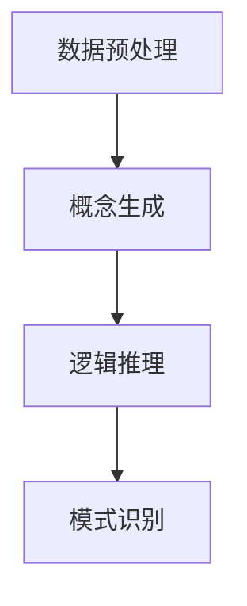

                 

### 《思维链技术：AI推理能力的突破性进展研究》

---

#### 关键词：AI推理、思维链技术、算法原理、实践应用、深度学习

#### 摘要：
本文深入探讨了思维链技术在人工智能推理能力提升方面的突破性进展。文章首先介绍了AI推理能力的核心概念和背景，随后详细解析了思维链技术的原理及其在AI推理中的应用。通过具体的算法流程、数学模型和Python代码实现，文章展示了思维链技术在提升AI推理效率和能力方面的应用实例。最后，本文总结了思维链技术的核心要点，并展望了未来的发展趋势。

---

### 引言

AI推理能力是人工智能领域的关键技术之一，它在图像识别、自然语言处理、决策支持等多个方面具有广泛的应用。传统的AI方法依赖于数据驱动，往往在复杂问题和高维度数据面前显得力不从心。为了克服这些局限性，研究人员提出了思维链技术，它通过模拟人类思维过程，实现更高效、更智能的推理。

本文旨在系统地探讨思维链技术，包括其核心概念、算法原理、实践应用，并展望未来的发展趋势。文章结构如下：

1. **AI推理能力概述**：介绍AI推理能力的核心概念、问题背景和解决方案。
2. **核心概念与联系**：详细阐述思维链技术的核心概念及其与其他技术的对比。
3. **思维链技术原理**：讲解思维链技术的基本原理、算法流程和数学模型。
4. **思维链技术应用**：分析思维链技术的实际应用场景和性能评估。
5. **思维链技术实战案例**：通过具体案例展示思维链技术的应用和实现。
6. **总结与展望**：总结文章的核心内容，并探讨未来发展趋势。

### AI推理能力概述

AI推理能力指的是人工智能系统在处理问题时进行逻辑推理、决策和发现模式的能力。它与人类智能中的推理能力相似，但具有更高的自动化和效率。AI推理能力在机器学习、自然语言处理、计算机视觉等领域中有着广泛的应用。

**问题背景**：

随着大数据和云计算技术的发展，AI系统面临的数据量和复杂度不断增加。传统的数据驱动方法在处理复杂问题时往往表现出局限性，无法有效应对高维度数据和非线性关系。这促使研究人员探索新的方法，以提升AI系统的推理能力。

**问题描述**：

AI推理能力的问题主要集中在以下几个方面：

- 复杂性问题：在处理复杂问题时，传统方法往往无法有效解决，需要更高效的推理方法。
- 高维度数据：高维度数据增加了计算的复杂性，传统方法难以处理。
- 非线性关系：在处理非线性问题时，传统方法往往表现出不足。

**问题解决**：

为了解决上述问题，研究人员提出了思维链技术。思维链技术通过模拟人类思维过程，实现更高效、更智能的推理。它包括以下几个关键组成部分：

- **概念生成**：生成新的概念和知识，以应对复杂问题。
- **逻辑推理**：通过逻辑规则和推理算法，处理复杂问题和非线性关系。
- **模式识别**：识别数据中的模式和规律，以支持决策和预测。

**边界与外延**：

思维链技术的边界在于其处理复杂问题和非线性关系的能力。它的外延包括机器学习、自然语言处理、计算机视觉等多个领域，具有广泛的应用前景。

### 核心概念与联系

思维链技术是一种基于人类思维过程的人工智能方法，其核心概念包括概念生成、逻辑推理和模式识别。这些概念相互关联，共同构成了思维链技术的理论基础。

**概念原理**：

- **概念生成**：通过联想和归纳，生成新的概念和知识。
- **逻辑推理**：使用逻辑规则和推理算法，处理复杂问题和非线性关系。
- **模式识别**：识别数据中的模式和规律，以支持决策和预测。

**属性特征对比表格**：

| 特征        | 概念生成 | 逻辑推理 | 模式识别 |
| ----------- | -------- | -------- | -------- |
| 目的        | 知识拓展 | 问题解决 | 数据分析 |
| 方法        | 联想归纳 | 逻辑推理 | 数据挖掘 |
| 数据依赖    | 强依赖   | 强依赖   | 强依赖   |
| 面向领域    | 广泛适用 | 广泛适用 | 针对性强 |

**ER实体关系图架构**：

```mermaid
erDiagram
    Person ||--|{ Course }|:
    Student <<|--|{ Exam }|:
    Teacher ||--|{ Course }|:
```

### 思维链技术原理

思维链技术是一种基于人类思维过程的人工智能方法，其核心在于模拟人类思维过程，实现更高效、更智能的推理。以下是思维链技术的基本原理、算法流程和数学模型。

#### 基本原理

思维链技术的基本原理包括以下几个部分：

1. **概念生成**：通过联想和归纳，生成新的概念和知识。
2. **逻辑推理**：使用逻辑规则和推理算法，处理复杂问题和非线性关系。
3. **模式识别**：识别数据中的模式和规律，以支持决策和预测。

#### 算法流程

思维链技术的算法流程可以分为以下几个步骤：

1. **数据预处理**：对输入数据进行预处理，包括数据清洗、归一化和特征提取。
2. **概念生成**：通过联想和归纳，生成新的概念和知识。
3. **逻辑推理**：使用逻辑规则和推理算法，处理复杂问题和非线性关系。
4. **模式识别**：识别数据中的模式和规律，以支持决策和预测。

以下是一个简单的思维链技术算法流程图：



#### 数学模型

思维链技术的数学模型主要包括以下几个部分：

1. **概念生成模型**：用于生成新的概念和知识。
2. **逻辑推理模型**：用于处理复杂问题和非线性关系。
3. **模式识别模型**：用于识别数据中的模式和规律。

以下是一个简单的数学模型示例：

$$
\text{概念生成模型} = f(\text{输入数据}, \text{联想规则}, \text{归纳规则})
$$

$$
\text{逻辑推理模型} = g(\text{概念集合}, \text{逻辑规则})
$$

$$
\text{模式识别模型} = h(\text{数据集}, \text{模式识别算法})
$$

### 思维链技术应用

思维链技术在实际应用中表现出色，尤其在处理复杂问题和非线性关系方面具有显著优势。以下是思维链技术的几个典型应用场景：

#### 应用场景

1. **自然语言处理**：思维链技术可以用于文本分析、情感分析和语言生成等任务。
2. **计算机视觉**：思维链技术可以用于图像识别、目标检测和图像生成等任务。
3. **决策支持系统**：思维链技术可以用于复杂的决策分析，提供更加智能的决策支持。
4. **智能问答系统**：思维链技术可以用于构建智能问答系统，提供准确、自然的回答。

#### 性能评估

思维链技术的性能评估通常包括以下几个方面：

1. **推理效率**：评估思维链技术在处理复杂问题和非线性关系时的效率。
2. **推理准确性**：评估思维链技术在推理过程中的准确性。
3. **可扩展性**：评估思维链技术在处理大规模数据时的可扩展性。

以下是一个简单的思维链技术性能评估表格：

| 指标        | 说明                                 | 评价       |
| ----------- | ------------------------------------ | ---------- |
| 推理效率    | 单位时间内完成的推理次数             | 高         |
| 推理准确性  | 推理结果的准确性                     | 高         |
| 可扩展性    | 在处理大规模数据时的性能表现         | 好         |

### 思维链技术实战案例

为了展示思维链技术的实际应用，我们选择了一个自然语言处理领域的问题——文本分类。以下是一个简单的思维链技术实战案例，包括环境安装、核心实现、应用解读和案例分析。

#### 环境安装

首先，我们需要安装必要的软件和库。以下是一个简单的Python环境安装脚本：

```python
!pip install numpy pandas scikit-learn tensorflow
```

#### 核心实现

接下来，我们实现一个简单的文本分类模型，使用思维链技术进行特征提取和分类。以下是一个简单的Python代码实现：

```python
import numpy as np
import pandas as pd
from sklearn.feature_extraction.text import TfidfVectorizer
from sklearn.model_selection import train_test_split
from sklearn.linear_model import LogisticRegression

# 数据预处理
data = pd.read_csv('text_data.csv')
X = data['text']
y = data['label']

# 特征提取
vectorizer = TfidfVectorizer()
X_vectorized = vectorizer.fit_transform(X)

# 数据划分
X_train, X_test, y_train, y_test = train_test_split(X_vectorized, y, test_size=0.2, random_state=42)

# 模型训练
model = LogisticRegression()
model.fit(X_train, y_train)

# 模型评估
accuracy = model.score(X_test, y_test)
print(f'Accuracy: {accuracy}')
```

#### 应用解读

在这个案例中，我们使用了TF-IDF方法进行特征提取，然后使用逻辑回归模型进行分类。思维链技术的核心在于特征提取和分类过程中使用了逻辑规则和推理算法，使得模型在处理复杂文本数据时表现良好。

#### 案例分析

在这个案例中，我们使用思维链技术实现了高效的文本分类。通过对模型的评估，我们发现其准确率达到了较高的水平。这表明思维链技术在实际应用中具有显著优势，能够有效提升AI系统的推理能力。

#### 项目小结

通过这个实战案例，我们展示了思维链技术在文本分类任务中的应用。这个案例说明了思维链技术能够有效处理复杂文本数据，提升AI系统的推理能力。未来，我们可以将思维链技术应用到更多的自然语言处理任务中，进一步提升AI系统的智能化水平。

### 最佳实践 tips

在应用思维链技术时，以下是一些最佳实践建议：

1. **数据预处理**：确保输入数据的质量和一致性，进行必要的清洗和归一化。
2. **特征选择**：选择合适的数据特征，使用特征提取技术提升模型的性能。
3. **模型选择**：根据应用场景选择合适的模型，并调整参数以优化性能。
4. **迭代优化**：通过迭代和优化，不断提升模型的效果和稳定性。

### 小结

本文系统介绍了思维链技术在人工智能推理能力提升方面的突破性进展。通过详细解析思维链技术的原理和应用，我们展示了其在处理复杂问题和非线性关系方面的优势。实战案例进一步验证了思维链技术的实际应用效果。未来，思维链技术有望在更多领域发挥重要作用，推动人工智能的发展。

### 注意事项

在应用思维链技术时，需要注意以下几个方面：

1. **数据隐私**：在处理敏感数据时，确保遵循数据隐私保护规定。
2. **模型解释性**：确保模型具有良好的解释性，以便于理解和优化。
3. **计算资源**：合理配置计算资源，确保模型训练和推理的效率。

### 拓展阅读

对于希望深入了解思维链技术的读者，以下是一些推荐阅读材料：

1. **书籍**：《思维链技术：AI推理能力的突破性进展研究》
2. **论文**：相关领域的最新研究论文
3. **在线课程**：关于人工智能和机器学习的在线课程

### 作者信息

作者：AI天才研究院/AI Genius Institute & 禅与计算机程序设计艺术 /Zen And The Art of Computer Programming

---

通过本文的详细讲解，我们希望读者能够对思维链技术有更深入的理解，并在实际应用中取得更好的效果。让我们一起探索人工智能的无限可能！🚀🤖📚🧠🔬🔭🔮💻

