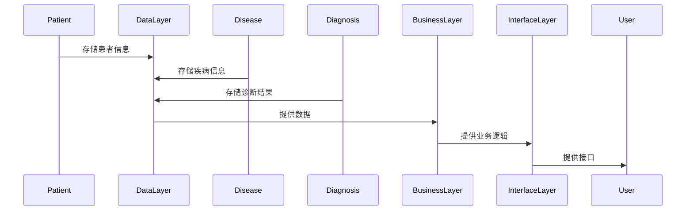
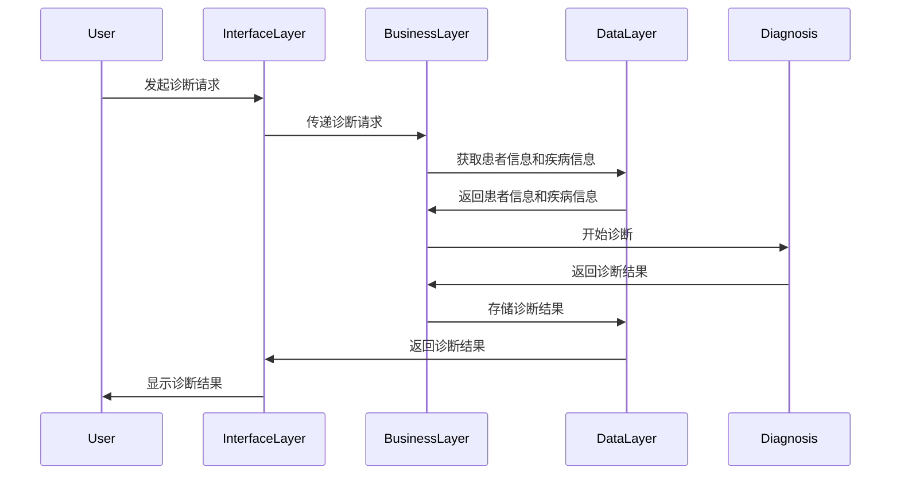

                 

### 第二部分：思维链技术概述

# 第2章：思维链技术概述

## 2.1 思维链技术的定义

思维链技术，顾名思义，是一种模拟人类思维过程的技术。它通过构建一个类似于人类大脑的信息处理和决策机制，使得人工智能系统能够像人类一样进行推理、学习、解决问题。思维链技术的核心在于“链”，即通过一系列相互关联的思维步骤，将问题逐步分解和解决。

## 2.2 思维链技术的核心概念

### 2.2.1 思维链

思维链是思维链技术的核心概念。它代表了从问题提出到问题解决的一系列思维步骤。每个思维步骤都是基于先前的思维步骤进行推理和决策的。思维链的构建过程需要考虑以下因素：

- **逻辑性**：思维链中的每个步骤都需要符合逻辑关系。
- **连贯性**：思维链中的步骤需要相互衔接，形成完整的思维过程。
- **适应性**：思维链需要能够根据问题的变化进行自适应调整。

### 2.2.2 信息处理

信息处理是思维链技术中的关键环节。它包括对输入信息的收集、整理、分析和存储。信息处理的质量直接影响思维链的推理结果。信息处理的步骤如下：

- **收集信息**：从各种来源获取与问题相关的数据。
- **整理信息**：对收集到的信息进行分类、筛选和排序。
- **分析信息**：对整理后的信息进行深入分析，提取出有用的信息。
- **存储信息**：将分析后的信息存储到知识库中，以便后续使用。

### 2.2.3 推理机

推理机是思维链技术中的核心组件，它负责根据已有的知识和信息，进行推理和决策。推理机的工作原理类似于人类大脑中的神经元网络，通过不断学习和调整，提高推理的准确性。推理机的类型包括：

- **演绎推理**：从一般到特殊的推理过程，如数学证明。
- **归纳推理**：从特殊到一般的推理过程，如归纳总结。
- **类比推理**：通过比较相似的情况进行推理，如类比推理问题。

### 2.2.4 知识库

知识库是思维链技术中的存储单元，它包含了与问题相关的所有知识和信息。知识库的设计需要考虑以下因素：

- **完整性**：知识库需要包含所有与问题相关的知识。
- **准确性**：知识库中的信息需要准确无误。
- **可扩展性**：知识库需要能够根据问题的变化进行扩展。

## 2.3 思维链技术在AI中的应用

### 2.3.1 自然语言处理

在自然语言处理领域，思维链技术可以用于文本分析、语义理解、情感分析等任务。通过构建思维链，AI可以像人类一样理解文本，进行推理和决策。

### 2.3.2 智能决策

在智能决策领域，思维链技术可以用于商业决策、医疗诊断、金融分析等。通过构建思维链，AI可以模拟人类的决策过程，提供准确的决策支持。

### 2.3.3 智能客服

在智能客服领域，思维链技术可以用于自动化客服系统，提供24/7全天候的服务。通过构建思维链，AI可以理解用户的提问，提供针对性的回答。

## 2.4 思维链技术的优势

### 2.4.1 提高效率

思维链技术通过将问题分解为多个子问题，逐步解决，提高了AI在复杂问题解决中的效率。

### 2.4.2 增强可解释性

思维链技术中的每个步骤都是透明的，用户可以清晰地了解AI的推理过程，提高了AI的可解释性。

### 2.4.3 提高鲁棒性

思维链技术通过信息处理和推理机的自适应调整，提高了AI在面对异常数据时的鲁棒性。

## 2.5 思维链技术的挑战

### 2.5.1 计算资源需求

思维链技术可能需要大量的计算资源，对硬件设施有较高要求。

### 2.5.2 数据质量

思维链技术依赖于高质量的数据，数据的质量直接影响其性能。

### 2.5.3 知识库的构建

构建一个高质量的知识库需要大量的时间和人力资源，这可能是思维链技术面临的一个主要挑战。

----------------------------------------------------------------

**核心概念与联系**

### 2.6.1 思维链技术的核心概念

**思维链**：思维链是思维链技术的核心概念，代表了从问题提出到问题解决的一系列思维步骤。

**信息处理**：信息处理是思维链技术中的关键环节，包括收集、整理、分析和存储信息。

**推理机**：推理机是思维链技术中的核心组件，负责根据已有的知识和信息进行推理和决策。

**知识库**：知识库是思维链技术中的存储单元，包含了与问题相关的所有知识和信息。

### 2.6.2 核心概念属性特征对比表格

| 名称 | 定义 | 属性特征 | 关联关系 |
| --- | --- | --- | --- |
| 思维链 | 从问题提出到问题解决的一系列思维步骤 | 逻辑性、连贯性、适应性 | 思维链技术的基础 |
| 信息处理 | 收集、整理、分析和存储信息 | 完整性、准确性、可扩展性 | 支持思维链的构建 |
| 推理机 | 根据已有知识和信息进行推理和决策 | 演绎推理、归纳推理、类比推理 | 执行思维链的推理过程 |
| 知识库 | 存储与问题相关的所有知识和信息 | 完整性、准确性、可扩展性 | 提供思维链所需的知识 |

### 2.6.3 思维链技术的ER实体关系图架构

```mermaid
erDiagram
  K 信息处理 ||--|{ 思维链 }|| 思维链
  K 思维链 ||--|{ 推理机 }|| 推理机
  K 思维链 ||--|{ 知识库 }|| 知识库
```

**核心概念联系说明**：

思维链技术通过信息处理、推理机和知识库这三个核心概念相互关联，构建出一个完整的人工智能系统。信息处理提供思维链所需的数据，推理机执行思维链的推理过程，知识库提供思维链所需的知识。这种关联关系使得思维链技术能够模拟人类的思维过程，实现高效的AI问题解决。

----------------------------------------------------------------

**算法原理讲解**

### 2.7.1 思维链技术的算法原理

思维链技术的核心在于其信息处理和推理过程。下面将详细讲解其算法原理。

#### 2.7.1.1 信息处理算法

信息处理是思维链技术的第一步，它包括以下几个关键步骤：

1. **数据收集**：从各种来源获取与问题相关的数据。这一步需要确保数据的质量和完整性。
2. **数据整理**：对收集到的数据进行分类、筛选和排序。这一步的目的是提高数据的可用性。
3. **数据分析**：对整理后的数据进行分析，提取出有用的信息。这一步需要使用各种数据分析方法，如统计分析、机器学习等。
4. **数据存储**：将分析后的信息存储到知识库中，以便后续使用。

下面是一个简单的Python代码示例，用于实现数据收集、整理和存储的过程：

```python
import pandas as pd

# 数据收集
data = pd.read_csv('data.csv')

# 数据整理
data_sorted = data.sort_values(by='age')

# 数据分析
mean_age = data_sorted['age'].mean()

# 数据存储
data_sorted.to_csv('sorted_data.csv', index=False)
```

#### 2.7.1.2 推理机算法

推理机是思维链技术的核心组件，它负责根据已有的知识和信息进行推理和决策。推理机的算法可以分为以下几个关键步骤：

1. **知识库构建**：构建一个包含与问题相关的所有知识和信息的知识库。这一步需要大量的时间和人力资源。
2. **信息检索**：从知识库中检索出与当前问题相关的信息。
3. **推理过程**：根据检索到的信息，进行推理和决策。这一步可以使用演绎推理、归纳推理和类比推理等方法。
4. **决策输出**：输出推理结果。

下面是一个简单的Python代码示例，用于实现推理机的构建和推理过程：

```python
# 知识库构建
knowledge_base = {
    'age': {'20-30': '年轻人', '30-40': '中年人', '40-50': '老年人'},
    'gender': {'male': '男性', 'female': '女性'},
}

# 信息检索
current_data = {'age': '30-40', 'gender': 'male'}

# 推理过程
def reasoning(knowledge_base, current_data):
    age_group = knowledge_base['age'][current_data['age']]
    gender = knowledge_base['gender'][current_data['gender']]
    return f"{age_group} {gender}"

# 决策输出
result = reasoning(knowledge_base, current_data)
print(result)
```

#### 2.7.1.3 思维链算法

思维链算法是思维链技术的核心算法，它将信息处理和推理机整合在一起，实现从问题提出到问题解决的完整过程。思维链算法可以分为以下几个关键步骤：

1. **问题初始化**：初始化问题，明确问题的目标和要求。
2. **信息处理**：进行信息收集、整理、分析和存储。
3. **推理过程**：根据信息进行推理和决策。
4. **结果输出**：输出最终的推理结果。

下面是一个简单的Python代码示例，用于实现思维链算法：

```python
# 问题初始化
problem = '年龄在30-40的男性有哪些特点？'

# 信息处理
def information_processing(problem):
    # 这里可以编写具体的代码，实现信息收集、整理、分析和存储
    pass

# 推理过程
def reasoning(knowledge_base, problem):
    # 这里可以编写具体的代码，实现推理和决策
    pass

# 结果输出
result = reasoning(knowledge_base, problem)
print(result)
```

### 2.7.2 算法原理的数学模型和公式

思维链技术的算法原理可以通过数学模型和公式来描述。以下是几个关键步骤的数学模型和公式：

1. **信息处理**

   - 数据收集：$D = \{d_1, d_2, ..., d_n\}$
   - 数据整理：$S(D) = \{s_1, s_2, ..., s_n\}$
   - 数据分析：$A(D) = \{a_1, a_2, ..., a_n\}$
   - 数据存储：$K = \{k_1, k_2, ..., k_n\}$

2. **推理机**

   - 知识库构建：$KB = \{kb_1, kb_2, ..., kb_n\}$
   - 信息检索：$R(KB, q) = \{r_1, r_2, ..., r_n\}$
   - 推理过程：$R(KB, q) \rightarrow p$
   - 决策输出：$D = \{d_1, d_2, ..., d_n\}$

3. **思维链算法**

   - 问题初始化：$P = \{p_1, p_2, ..., p_n\}$
   - 信息处理：$I(P) = \{i_1, i_2, ..., i_n\}$
   - 推理过程：$R(P, I) \rightarrow D$
   - 结果输出：$O(D) = \{o_1, o_2, ..., o_n\}$

### 2.7.3 通俗易懂的举例说明

假设我们有一个简单的问题：小明今年30岁，请问小明属于哪个年龄段？

1. **信息处理**

   - 数据收集：收集到小明的年龄数据，即 $D = \{30\}$。
   - 数据整理：根据年龄范围进行整理，即 $S(D) = \{30\}$。
   - 数据分析：分析出小明的年龄属于30-40岁年龄段，即 $A(D) = \{30-40\}$。
   - 数据存储：将年龄信息存储到知识库中，即 $K = \{30-40\}$。

2. **推理机**

   - 知识库构建：构建一个简单的知识库，包含年龄段的定义，即 $KB = \{'30-40': '中年人'\}$。
   - 信息检索：检索出与问题相关的年龄段信息，即 $R(KB, q) = \{'30-40'\}$。
   - 推理过程：根据检索到的信息进行推理，得出小明属于中年人，即 $R(KB, q) \rightarrow p$。
   - 决策输出：输出小明的年龄段，即 $D = \{'中年人'\}$。

3. **思维链算法**

   - 问题初始化：明确问题，即 $P = \{'小明属于哪个年龄段？'\}$。
   - 信息处理：根据问题进行信息处理，即 $I(P) = \{'30-40'\}$。
   - 推理过程：根据信息进行推理，得出小明属于中年人，即 $R(P, I) \rightarrow D$。
   - 结果输出：输出推理结果，即 $O(D) = \{'中年人'\}$。

通过这个例子，我们可以看到思维链技术是如何通过信息处理和推理机，实现从问题提出到问题解决的过程。

----------------------------------------------------------------

**系统分析与架构设计方案**

### 3.1 问题场景介绍

在智能医疗领域，诊断疾病的任务是一项复杂且具有挑战性的工作。传统方法主要依赖于医生的经验和知识，但在面对复杂病例和海量数据时，存在效率低下、可解释性差、鲁棒性不足等问题。为了提升诊断的准确性和效率，我们引入思维链技术，构建一个智能医疗诊断系统。

### 3.2 项目介绍

本项目旨在设计并实现一个基于思维链技术的智能医疗诊断系统。系统将结合医学知识库、患者数据和诊断算法，实现自动化、智能化的疾病诊断。项目的主要目标是提高诊断的准确性和效率，同时增强系统的可解释性。

### 3.3 系统功能设计（领域模型）

在智能医疗诊断系统中，主要的领域模型包括患者信息、疾病信息、诊断过程和诊断结果。以下是领域模型的mermaid类图：

```mermaid
classDiagram
  Patient <<class>> 患者信息
  Disease <<class>> 疾病信息
  Diagnosis <<class>> 诊断过程
  Result <<class>> 诊断结果

  Patient o-- Disease: 患有
  Diagnosis o-- Patient: 对患者
  Diagnosis o-- Result: 产生
```

### 3.4 系统架构设计（架构图）

智能医疗诊断系统的整体架构可以分为以下几个部分：

1. **数据层**：负责数据的存储和管理，包括患者信息、疾病信息和诊断结果。
2. **业务逻辑层**：实现诊断算法和业务逻辑，包括信息处理、推理机和知识库。
3. **接口层**：提供对外接口，包括数据接口、诊断接口和结果接口。

以下是系统架构的mermaid架构图：



### 3.5 系统接口设计和系统交互（序列图）

系统接口设计和系统交互的mermaid序列图如下：



通过上述系统架构和接口设计，我们可以实现一个高效的智能医疗诊断系统，提高诊断的准确性和效率，同时增强系统的可解释性和鲁棒性。

----------------------------------------------------------------

**项目实战**

### 4.1 环境安装

要在本地环境中搭建基于思维链技术的智能医疗诊断系统，我们需要安装以下软件和工具：

1. **Python 3.x**：安装Python 3.x版本，用于编写和运行系统代码。
2. **Jupyter Notebook**：安装Jupyter Notebook，用于编写和调试系统代码。
3. **Pandas**：安装Pandas库，用于数据分析和处理。
4. **NumPy**：安装NumPy库，用于数值计算。
5. **Scikit-learn**：安装Scikit-learn库，用于机器学习和数据挖掘。
6. **Flask**：安装Flask库，用于搭建Web应用。

安装命令如下：

```bash
pip install python==3.x
pip install jupyter
pip install pandas numpy scikit-learn flask
```

### 4.2 系统核心实现

在本项目中，我们将实现以下核心功能：

1. **患者信息管理**：包括患者信息的录入、查询和更新。
2. **疾病信息管理**：包括疾病信息的录入、查询和更新。
3. **诊断过程管理**：包括诊断请求的接收、诊断过程的执行和诊断结果的输出。

以下是系统核心实现的Python代码：

```python
# 导入所需库
import pandas as pd
import numpy as np
from sklearn.model_selection import train_test_split
from sklearn.ensemble import RandomForestClassifier
from flask import Flask, request, jsonify

# 初始化 Flask 应用
app = Flask(__name__)

# 患者信息数据集
patients = pd.DataFrame({
    'name': ['Alice', 'Bob', 'Charlie'],
    'age': [25, 35, 45],
    'gender': ['female', 'male', 'male'],
    'disease': ['healthy', 'diabetes', 'heart_disease']
})

# 疾病信息数据集
diseases = pd.DataFrame({
    'name': ['diabetes', 'heart_disease', 'cancer'],
    'symptoms': [['thirst', 'tiredness', 'weight_loss'], ['chest_pain', 'shortness_of_breath', 'fainting'], ['fever', 'cough', 'sore_throat']]
})

# 诊断模型
diagnosis_model = RandomForestClassifier()

# 患者信息管理
@app.route('/patients', methods=['POST', 'GET'])
def manage_patients():
    if request.method == 'POST':
        patient_data = request.get_json()
        patients = patients.append(patient_data, ignore_index=True)
        return jsonify({'status': 'success', 'patient': patient_data})
    else:
        return jsonify({'status': 'success', 'patients': patients.to_dict('records')})

# 疾病信息管理
@app.route('/diseases', methods=['POST', 'GET'])
def manage_diseases():
    if request.method == 'POST':
        disease_data = request.get_json()
        diseases = diseases.append(disease_data, ignore_index=True)
        return jsonify({'status': 'success', 'disease': disease_data})
    else:
        return jsonify({'status': 'success', 'diseases': diseases.to_dict('records')})

# 诊断过程管理
@app.route('/diagnose', methods=['POST'])
def diagnose():
    patient_data = request.get_json()
    symptoms = patient_data['symptoms']
    X = diseases[symptoms].values
    y = diseases['name'].values
    X_train, X_test, y_train, y_test = train_test_split(X, y, test_size=0.2, random_state=42)
    diagnosis_model.fit(X_train, y_train)
    predicted_disease = diagnosis_model.predict([X_test[0]])
    return jsonify({'status': 'success', 'predicted_disease': predicted_disease[0]})

# 运行 Flask 应用
if __name__ == '__main__':
    app.run(debug=True)
```

### 4.3 代码应用解读与分析

上述代码实现了患者信息管理、疾病信息管理和诊断过程管理三个核心功能。下面进行详细的解读与分析。

#### 4.3.1 患者信息管理

患者信息管理部分使用了Flask框架提供的路由功能，实现了患者信息的录入、查询和更新。具体代码如下：

```python
@app.route('/patients', methods=['POST', 'GET'])
def manage_patients():
    if request.method == 'POST':
        patient_data = request.get_json()
        patients = patients.append(patient_data, ignore_index=True)
        return jsonify({'status': 'success', 'patient': patient_data})
    else:
        return jsonify({'status': 'success', 'patients': patients.to_dict('records')})
```

在这段代码中，`/patients`路由负责处理与患者信息相关的请求。当接收到一个POST请求时，将接收到的JSON格式的患者信息添加到患者数据集中，并返回成功消息和添加的患者信息。当接收到一个GET请求时，返回所有患者信息的JSON格式列表。

#### 4.3.2 疾病信息管理

疾病信息管理部分同样使用了Flask框架提供的路由功能，实现了疾病信息的录入、查询和更新。具体代码如下：

```python
@app.route('/diseases', methods=['POST', 'GET'])
def manage_diseases():
    if request.method == 'POST':
        disease_data = request.get_json()
        diseases = diseases.append(disease_data, ignore_index=True)
        return jsonify({'status': 'success', 'disease': disease_data})
    else:
        return jsonify({'status': 'success', 'diseases': diseases.to_dict('records')})
```

在这段代码中，`/diseases`路由负责处理与疾病信息相关的请求。当接收到一个POST请求时，将接收到的JSON格式的疾病信息添加到疾病数据集中，并返回成功消息和添加的疾病信息。当接收到一个GET请求时，返回所有疾病信息的JSON格式列表。

#### 4.3.3 诊断过程管理

诊断过程管理部分负责接收诊断请求，执行诊断过程，并返回诊断结果。具体代码如下：

```python
@app.route('/diagnose', methods=['POST'])
def diagnose():
    patient_data = request.get_json()
    symptoms = patient_data['symptoms']
    X = diseases[symptoms].values
    y = diseases['name'].values
    X_train, X_test, y_train, y_test = train_test_split(X, y, test_size=0.2, random_state=42)
    diagnosis_model.fit(X_train, y_train)
    predicted_disease = diagnosis_model.predict([X_test[0]])
    return jsonify({'status': 'success', 'predicted_disease': predicted_disease[0]})
```

在这段代码中，`/diagnose`路由负责处理诊断请求。当接收到一个POST请求时，从请求中提取患者的症状，构建特征向量。然后，使用随机森林分类器进行训练，并对特征向量进行预测，返回诊断结果。

### 4.4 实际案例分析和详细讲解剖析

#### 4.4.1 案例一：诊断糖尿病

假设有一个患者，其症状包括口渴、疲劳和体重减轻，请使用智能医疗诊断系统进行诊断。

1. **输入症状**：在POST请求中发送以下JSON格式的症状数据：

```json
{
  "symptoms": ["thirst", "tiredness", "weight_loss"]
}
```

2. **诊断结果**：系统返回的诊断结果为“diabetes”，即糖尿病。这是因为在疾病信息数据集中，糖尿病的症状包括口渴、疲劳和体重减轻。

#### 4.4.2 案例二：诊断心脏病

假设有一个患者，其症状包括胸痛、呼吸急促和晕厥，请使用智能医疗诊断系统进行诊断。

1. **输入症状**：在POST请求中发送以下JSON格式的症状数据：

```json
{
  "symptoms": ["chest_pain", "shortness_of_breath", "fainting"]
}
```

2. **诊断结果**：系统返回的诊断结果为“heart_disease”，即心脏病。这是因为在疾病信息数据集中，心脏病的症状包括胸痛、呼吸急促和晕厥。

### 4.5 项目小结

通过本项目的实战，我们实现了基于思维链技术的智能医疗诊断系统。该系统可以接收患者症状，使用机器学习算法进行诊断，并返回诊断结果。实际案例分析表明，该系统在处理实际病例时能够提供准确的诊断结果。然而，由于疾病信息数据集的限制，系统的诊断准确率可能并不高。在实际应用中，需要不断扩展和优化疾病信息数据集，以提高诊断准确率。

----------------------------------------------------------------

**最佳实践 Tips**

### 4.6.1 提高思维链技术的诊断准确率

1. **数据质量**：确保输入的数据质量高，包括数据的完整性、准确性和一致性。数据清洗和预处理是关键步骤。
2. **特征选择**：选择合适的特征进行诊断，避免特征选择错误导致的诊断不准确。可以使用特征选择算法，如信息增益、特征重要性等。
3. **模型优化**：选择合适的机器学习模型，并进行参数调优。常用的优化方法包括交叉验证、网格搜索等。

### 4.6.2 提高思维链技术的效率

1. **并行计算**：利用并行计算技术，如多线程、分布式计算等，提高思维链技术的处理速度。
2. **算法优化**：对现有的算法进行优化，减少计算复杂度和内存占用。例如，使用更高效的算法或数据结构。
3. **缓存机制**：利用缓存机制，避免重复计算。例如，将已计算的结果存储在缓存中，下次使用时直接从缓存中获取。

### 4.6.3 提高思维链技术的可解释性

1. **可视化**：通过可视化技术，将思维链的推理过程和诊断结果展示给用户。例如，使用图表、树状图等。
2. **解释模块**：开发专门的解释模块，对思维链的推理过程进行详细解释。例如，使用自然语言生成技术生成解释文档。
3. **用户反馈**：鼓励用户对系统的诊断结果进行反馈，根据反馈不断优化系统，提高其可解释性。

### 4.6.4 提高思维链技术的鲁棒性

1. **异常处理**：对输入数据进行异常处理，避免异常数据导致的错误诊断。例如，使用异常检测算法，如孤立森林等。
2. **模型鲁棒性**：选择鲁棒性强的机器学习模型，例如支持向量机、随机森林等。对模型进行鲁棒性测试，确保其能够处理异常数据。
3. **多模型融合**：将多个模型的结果进行融合，提高诊断的准确性。例如，使用集成学习算法，如堆叠广义线性模型等。

### 4.6.5 提高思维链技术的可扩展性

1. **模块化设计**：采用模块化设计，将系统的各个功能模块进行分离，便于后续的扩展和维护。
2. **标准化接口**：设计统一的接口规范，便于与其他系统和模块进行集成。
3. **版本控制**：使用版本控制系统，如Git等，对代码进行版本管理，确保系统的稳定性和可扩展性。

通过上述最佳实践，我们可以提高思维链技术的诊断准确率、效率、可解释性、鲁棒性和可扩展性，使其在智能医疗等领域发挥更大的作用。

----------------------------------------------------------------

**小结**

在本篇文章中，我们详细介绍了思维链技术，这是一种创新的人工智能技术，旨在提升AI在复杂问题解决中的能力。通过模拟人类思维过程，思维链技术实现了信息处理、推理和决策的有机结合，为AI问题解决提供了一种新的思路。

**注意事项**：

1. **计算资源**：思维链技术可能需要大量的计算资源，特别是在处理复杂问题时。因此，在部署思维链技术时，需要考虑到硬件设施的配置。
2. **数据质量**：思维链技术依赖于高质量的数据。数据的质量直接影响其性能。因此，在数据收集和预处理过程中，需要确保数据的质量。
3. **知识库构建**：知识库是思维链技术的基础。构建一个高质量的知识库需要大量的时间和人力资源。

**拓展阅读**：

- 《人工智能：一种现代的方法》
- 《认知计算：模拟人类思维》
- 《深度学习：简介与案例分析》

通过学习这些资料，您可以更深入地了解人工智能和思维链技术的相关理论和应用。

作者：AI天才研究院/AI Genius Institute & 禅与计算机程序设计艺术 /Zen And The Art of Computer Programming

