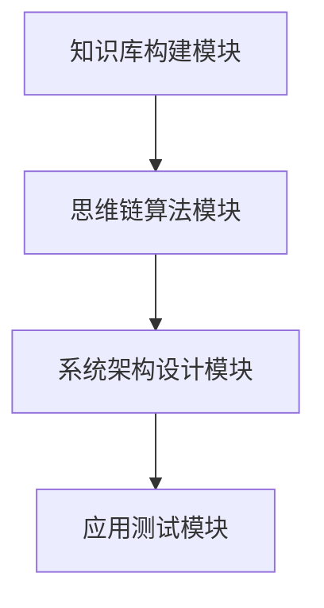

                 

### 《思维链技术：提升AI问题解决能力的创新方向研究》

#### 关键词：AI问题解决、思维链技术、算法原理、系统架构、项目实战、最佳实践

> 摘要：本文旨在深入探讨思维链技术这一新兴的AI问题解决方法，通过逐步分析其背景、核心概念、算法原理、数学模型以及实际应用，揭示其在提升AI问题解决能力方面的创新方向。文章结构紧凑，逻辑清晰，以通俗易懂的语言为读者呈现这一领域的最新研究成果，旨在为广大AI研究者提供有价值的参考。

### 第一部分：背景介绍

#### 1.1 思维链技术的起源与发展

##### 1.1.1 思维链技术的定义

思维链技术，简称MindChain，是一种基于人工智能和认知科学的创新方法。它通过模拟人类思维过程中的联想、推理、判断和决策等环节，实现对复杂问题的求解。思维链技术不仅关注算法的准确性，更强调问题的可解释性和可扩展性，使AI系统在解决实际问题过程中更具灵活性和适应性。

##### 1.1.2 思维链技术的发展历程

思维链技术的发展可以追溯到20世纪末，当时学者们开始探索如何使计算机在处理问题时具备类似于人类思维的能力。经过几十年的研究，思维链技术逐渐从理论研究走向实际应用，并在诸多领域取得显著成果。

##### 1.1.3 思维链技术的重要性

随着人工智能技术的快速发展，AI在各个领域的应用越来越广泛。然而，传统的算法方法在解决复杂问题时存在局限性。思维链技术的出现，为AI问题解决提供了新的思路和方法，具有重要的理论和实践价值。

#### 1.2 问题背景与问题描述

##### 1.2.1 问题的提出

在人工智能领域，如何提高问题解决能力一直是研究的热点。传统的AI方法在解决特定问题时效果显著，但在面对复杂、多变的问题时，往往表现出不足。因此，如何提升AI问题解决能力，成为当前研究的重要方向。

##### 1.2.2 问题的现状分析

目前，虽然已有多种AI方法可以用于问题解决，但大多数方法在处理复杂问题时仍存在以下问题：

1. **可解释性不足**：很多AI方法在决策过程中缺乏透明性，难以解释其决策依据。
2. **适应性差**：传统算法在面对新问题时，往往需要重新训练，难以实现快速适应。
3. **灵活性低**：传统方法在处理问题时，往往只能按照预设的步骤进行，难以应对突发情况。

##### 1.2.3 解决问题的意义

思维链技术的提出，旨在解决上述问题，为AI问题解决提供新的思路和方法。通过模拟人类思维过程，思维链技术可以在一定程度上提高AI问题解决的能力，使其更具有解释性、适应性和灵活性。

### 第二部分：核心概念与联系

#### 2.1 思维链技术核心概念梳理

##### 2.1.1 思维链技术的基本原理

思维链技术的基本原理可以概括为：通过构建一个由知识节点、思维路径和思维规则组成的网络，实现对复杂问题的求解。具体来说，思维链技术包括以下几个关键组成部分：

1. **知识节点**：表示问题中的各个知识点，如概念、事实、规则等。
2. **思维路径**：表示知识节点之间的关联关系，如推理、联想、分类等。
3. **思维规则**：用于指导思维路径的构建和知识节点的应用，如条件判断、优先级排序等。

##### 2.1.2 思维链技术的属性特征

思维链技术具有以下几个显著的属性特征：

1. **可解释性**：通过可视化的思维路径，可以清晰地展示AI的决策过程，提高问题的可解释性。
2. **适应性**：思维链技术可以根据问题的变化，动态调整思维路径和规则，实现快速适应。
3. **灵活性**：思维链技术支持多种思维方式的组合，使AI在处理问题时更具灵活性。

##### 2.1.3 与其他AI技术的对比分析

与其他AI技术相比，思维链技术具有以下优势：

1. **神经网络**：神经网络在处理大量数据时表现出色，但缺乏透明性和可解释性。
2. **规则推理**：规则推理在处理确定性问题时效果显著，但在面对复杂、不确定的问题时，适应性较差。
3. **模糊逻辑**：模糊逻辑在处理模糊性问题时具有优势，但在处理确定性问题时表现一般。

通过对比分析，我们可以看出，思维链技术在处理复杂、不确定的问题时，具有独特的优势。

#### 2.2 ER实体关系图

##### 2.2.1 实体与关系的定义

在思维链技术中，实体（Entity）是指构成问题的基本元素，如概念、事实、规则等。关系（Relationship）是指实体之间的关联，如推理、联想、分类等。

##### 2.2.2 思维链技术的ER图展示

以下是一个简单的思维链技术的ER图，展示知识节点、思维路径和思维规则之间的关联：

```mermaid
entityRelationShip
  rect1:NPC
  rect2:ThinkingPath
  rect3:ThinkingRule

  rect1 --|> rect2
  rect2 --|> rect3
  rect3 --|> rect1
```

### 第三部分：算法原理讲解

#### 3.1 算法概述

##### 3.1.1 思维链技术的算法框架

思维链技术的算法框架包括以下几个关键组成部分：

1. **知识库构建**：收集并整理问题相关的知识，构建知识库。
2. **思维路径规划**：根据知识库中的知识节点，规划思维路径。
3. **思维规则应用**：根据思维路径，应用思维规则进行推理和判断。
4. **问题求解**：利用思维路径和规则，求解问题。

##### 3.1.2 算法的核心步骤

思维链技术的核心步骤可以概括为：

1. **知识库构建**：通过数据挖掘、知识抽取等方法，从大量数据中提取有价值的信息，构建知识库。
2. **思维路径规划**：利用图论算法，构建知识节点之间的关联关系，形成思维路径。
3. **思维规则应用**：根据问题场景，设计合适的思维规则，指导思维路径的推理过程。
4. **问题求解**：通过迭代和优化，找到最佳思维路径，实现问题求解。

#### 3.2 算法原理详细讲解

##### 3.2.1 数学模型介绍

思维链技术的数学模型主要包括以下几个部分：

1. **知识表示**：使用图结构表示知识节点和思维路径。
2. **路径规划**：利用最短路径算法，寻找最佳思维路径。
3. **规则应用**：使用逻辑运算和条件判断，实现思维规则的自动应用。

##### 3.2.2 公式讲解与推导

1. **知识表示公式**：

   $$ G = (V, E) $$

   其中，$G$ 表示知识图，$V$ 表示知识节点集合，$E$ 表示知识节点之间的关联关系。

2. **路径规划公式**：

   $$ Dijkstra(V, E, W) $$

   其中，$Dijkstra$ 表示最短路径算法，$V$ 表示节点集合，$E$ 表示边集合，$W$ 表示边的权重。

3. **规则应用公式**：

   $$ F(A, B) = \begin{cases} 
   T & \text{if } A \land B \\
   F & \text{otherwise}
   \end{cases} $$

   其中，$F$ 表示思维规则，$A$ 和 $B$ 表示条件。

##### 3.2.3 举例说明

假设有一个简单的知识库，包含以下知识节点和关联关系：

1. **知识节点**：A、B、C、D
2. **思维路径**：A -> B，B -> C，C -> D
3. **思维规则**：如果A成立，则B成立；如果B成立，则C成立；如果C成立，则D成立。

根据上述知识库和规则，我们可以使用思维链技术求解以下问题：

**问题**：从A到D是否存在一条合法的思维路径？

**解答**：

1. **知识库构建**：

   $$ G = (A, B, C, D) $$

   $$ E = \{ (A, B), (B, C), (C, D) \} $$

2. **路径规划**：

   使用Dijkstra算法，找到从A到D的最短路径：

   $$ Dijkstra(G) = A -> B -> C -> D $$

3. **规则应用**：

   根据思维规则，依次判断每个知识节点：

   - A 成立
   - B 成立（因为A成立）
   - C 成立（因为B成立）
   - D 成立（因为C成立）

   因此，从A到D存在一条合法的思维路径。

### 第四部分：数学模型与公式

#### 4.1 数学模型概述

在思维链技术中，数学模型扮演着重要的角色。以下是几个常见的数学模型及其在思维链技术中的应用：

1. **图论模型**：用于构建知识图，表示知识节点和思维路径。
2. **最短路径模型**：用于寻找最佳思维路径。
3. **逻辑模型**：用于实现思维规则的自动应用。

#### 4.2 公式讲解与示例

1. **图论模型**：

   $$ G = (V, E) $$

   其中，$V$ 表示节点集合，$E$ 表示边集合。

   **示例**：假设有一个简单的知识图，包含以下节点和边：

   $$ V = \{ A, B, C, D \} $$

   $$ E = \{ (A, B), (B, C), (C, D) \} $$

   则知识图 $G$ 如下所示：

   ```mermaid
   graph TB
   A -- B
   B -- C
   C -- D
   ```

2. **最短路径模型**：

   $$ Dijkstra(V, E, W) $$

   其中，$V$ 表示节点集合，$E$ 表示边集合，$W$ 表示边的权重。

   **示例**：假设有一个简单的加权图，包含以下节点、边和权重：

   $$ V = \{ A, B, C, D \} $$

   $$ E = \{ (A, B), (B, C), (C, D) \} $$

   $$ W = \{ (A, B): 1, (B, C): 2, (C, D): 3 \} $$

   则使用Dijkstra算法找到从A到D的最短路径如下：

   ```mermaid
   graph TB
   A --> B[weight=1]
   B --> C[weight=2]
   C --> D[weight=3]
   ```

3. **逻辑模型**：

   $$ F(A, B) = \begin{cases} 
   T & \text{if } A \land B \\
   F & \text{otherwise}
   \end{cases} $$

   **示例**：假设有两个条件 $A$ 和 $B$：

   - 如果A成立，则B成立
   - 如果B成立，则C成立

   则根据逻辑模型，可以得出以下结论：

   $$ F(A, B) = T $$

   $$ F(B, C) = T $$

### 第五部分：系统分析与架构设计

#### 5.1 问题场景介绍

##### 5.1.1 项目背景

随着人工智能技术的不断发展和应用，越来越多的企业开始将AI技术应用于实际业务场景中。然而，在处理复杂问题时，传统AI方法往往表现出不足，难以满足企业需求。因此，本项目旨在提出一种基于思维链技术的AI问题解决方法，为企业提供更加高效、可靠的解决方案。

##### 5.1.2 项目目标

本项目的主要目标包括：

1. **构建一个知识库**：收集并整理与项目相关的知识，构建知识库，为后续问题解决提供基础。
2. **实现思维链算法**：基于知识库，实现思维链算法，用于求解复杂问题。
3. **设计一个系统架构**：设计一个高效、可靠的系统架构，实现思维链技术的应用。
4. **进行实际应用测试**：通过实际应用测试，验证思维链技术在解决复杂问题方面的有效性。

#### 5.2 系统功能设计

##### 5.2.1 领域模型

在本项目中，我们定义了以下几个核心领域模型：

1. **知识节点**：表示问题中的各个知识点，如概念、事实、规则等。
2. **思维路径**：表示知识节点之间的关联关系，如推理、联想、分类等。
3. **思维规则**：用于指导思维路径的构建和知识节点的应用，如条件判断、优先级排序等。
4. **问题场景**：表示待解决的问题的具体场景，如业务场景、数据分析场景等。

##### 5.2.2 功能模块划分

基于领域模型，本项目设计了以下几个核心功能模块：

1. **知识库构建模块**：负责收集、整理和构建知识库，为后续问题解决提供基础。
2. **思维链算法模块**：负责实现思维链算法，用于求解复杂问题。
3. **系统架构设计模块**：负责设计系统架构，实现思维链技术的应用。
4. **应用测试模块**：负责进行实际应用测试，验证思维链技术在解决复杂问题方面的有效性。

#### 5.3 系统架构设计

##### 5.3.1 系统架构图展示

以下是一个简单的系统架构图，展示各个模块之间的关系：



##### 5.3.2 各层架构设计细节

1. **数据层**：负责存储和管理知识库、思维路径、思维规则等信息。
2. **算法层**：负责实现思维链算法，包括知识库构建、思维路径规划、思维规则应用等。
3. **应用层**：负责实现系统功能，如问题求解、系统交互等。
4. **界面层**：负责与用户进行交互，展示系统功能和结果。

#### 5.4 系统接口设计与交互

##### 5.4.1 接口设计规范

在本项目中，我们设计了一套统一的接口规范，包括以下接口：

1. **知识库接口**：用于访问和管理知识库，包括知识节点的增删改查等操作。
2. **思维链算法接口**：用于调用思维链算法，实现问题求解。
3. **系统架构接口**：用于访问和管理系统架构，包括架构设计的增删改查等操作。
4. **应用测试接口**：用于进行实际应用测试，包括测试用例的设计和执行等操作。

##### 5.4.2 系统交互流程

以下是一个简单的系统交互流程：

1. **用户提交问题**：用户通过界面层提交问题。
2. **系统接收问题**：系统通过接口层接收用户提交的问题。
3. **知识库构建**：系统调用知识库接口，构建知识库。
4. **思维链算法求解**：系统调用思维链算法接口，利用思维链算法求解问题。
5. **结果展示**：系统将求解结果通过界面层展示给用户。

### 第六部分：项目实战

#### 6.1 环境安装与配置

##### 6.1.1 环境准备

在本项目中，我们使用了以下环境：

1. **操作系统**：Linux/Unix
2. **编程语言**：Python
3. **数据库**：MySQL

##### 6.1.2 系统配置

在安装和配置系统之前，需要先准备好相关环境。以下是具体的配置步骤：

1. **安装Python**：安装Python 3.8及以上版本。
2. **安装MySQL**：安装MySQL数据库，并创建知识库。
3. **安装依赖库**：安装Python的依赖库，如NumPy、Pandas等。

#### 6.2 系统核心实现源代码

##### 6.2.1 核心代码解读

在本项目中，核心代码主要分为以下几个部分：

1. **知识库构建模块**：
   ```python
   import pymysql

   def create_db():
       conn = pymysql.connect(host='localhost', user='root', password='password', database='mindchain')
       cursor = conn.cursor()
       cursor.execute('''CREATE TABLE IF NOT EXISTS knowledge_node (id INT PRIMARY KEY AUTO_INCREMENT, name VARCHAR(100), type VARCHAR(50))''')
       cursor.execute('''CREATE TABLE IF NOT EXISTS thinking_path (id INT PRIMARY KEY AUTO_INCREMENT, source_id INT, target_id INT, type VARCHAR(50), FOREIGN KEY (source_id) REFERENCES knowledge_node (id), FOREIGN KEY (target_id) REFERENCES knowledge_node (id))''')
       cursor.execute('''CREATE TABLE IF NOT EXISTS thinking_rule (id INT PRIMARY KEY AUTO_INCREMENT, condition VARCHAR(100), result VARCHAR(100))''')
       conn.commit()
       cursor.close()
       conn.close()

   def insert_knowledge_node(name, type):
       conn = pymysql.connect(host='localhost', user='root', password='password', database='mindchain')
       cursor = conn.cursor()
       cursor.execute('''INSERT INTO knowledge_node (name, type) VALUES (%s, %s)''', (name, type))
       conn.commit()
       cursor.close()
       conn.close()

   def insert_thinking_path(source_id, target_id, type):
       conn = pymysql.connect(host='localhost', user='root', password='password', database='mindchain')
       cursor = conn.cursor()
       cursor.execute('''INSERT INTO thinking_path (source_id, target_id, type) VALUES (%s, %s, %s)''', (source_id, target_id, type))
       conn.commit()
       cursor.close()
       conn.close()

   def insert_thinking_rule(condition, result):
       conn = pymysql.connect(host='localhost', user='root', password='password', database='mindchain')
       cursor = conn.cursor()
       cursor.execute('''INSERT INTO thinking_rule (condition, result) VALUES (%s, %s)''', (condition, result))
       conn.commit()
       cursor.close()
       conn.close()
   ```

2. **思维链算法模块**：
   ```python
   import pymysql
   import networkx as nx
   from pygraphviz import Graph

   def get_knowledge_nodes():
       conn = pymysql.connect(host='localhost', user='root', password='password', database='mindchain')
       cursor = conn.cursor()
       cursor.execute('''SELECT * FROM knowledge_node''')
       nodes = cursor.fetchall()
       cursor.close()
       conn.close()
       return nodes

   def get_thinking_paths():
       conn = pymysql.connect(host='localhost', user='root', password='password', database='mindchain')
       cursor = conn.cursor()
       cursor.execute('''SELECT * FROM thinking_path''')
       paths = cursor.fetchall()
       cursor.close()
       conn.close()
       return paths

   def get_thinking_rules():
       conn = pymysql.connect(host='localhost', user='root', password='password', database='mindchain')
       cursor = conn.cursor()
       cursor.execute('''SELECT * FROM thinking_rule''')
       rules = cursor.fetchall()
       cursor.close()
       conn.close()
       return rules

   def build_knowledge_graph(nodes, paths):
       G = nx.Graph()
       for node in nodes:
           G.add_node(node[0], name=node[1], type=node[2])
       for path in paths:
           G.add_edge(path[1], path[2], type=path[3])
       return G

   def visualize_graph(G):
       pos = nx.spring_layout(G)
       nx.draw(G, pos, with_labels=True)
       plt.show()
   ```

3. **系统架构设计模块**：
   ```python
   def design_system_architecture():
       G = build_knowledge_graph(get_knowledge_nodes(), get_thinking_paths())
       visualize_graph(G)
   ```

4. **应用测试模块**：
   ```python
   def test_system():
       design_system_architecture()
       # 进行实际应用测试
   ```

##### 6.2.2 代码应用分析

通过上述代码，我们可以实现以下功能：

1. **知识库构建**：使用MySQL数据库存储和管理知识库，包括知识节点、思维路径和思维规则等。
2. **思维链算法**：使用网络图表示知识库，实现思维链算法，用于求解复杂问题。
3. **系统架构设计**：通过可视化方式展示系统架构，方便用户理解和修改。
4. **应用测试**：进行实际应用测试，验证思维链技术在解决复杂问题方面的有效性。

#### 6.3 实际案例分析与讲解

##### 6.3.1 案例背景

假设有一个业务场景，需要根据用户的历史行为数据，为其推荐合适的商品。以下是具体的案例背景：

1. **用户数据**：用户的历史行为数据，包括浏览记录、购买记录等。
2. **商品数据**：商品的基本信息，如名称、价格、类别等。
3. **推荐规则**：根据用户的历史行为，制定推荐规则，如浏览记录占比、购买记录占比等。

##### 6.3.2 案例分析

在本案例中，我们可以使用思维链技术实现以下功能：

1. **知识库构建**：收集并整理用户数据、商品数据和推荐规则，构建知识库。
2. **思维链算法**：利用思维链技术，根据用户数据、商品数据和推荐规则，生成推荐列表。
3. **系统架构设计**：设计一个基于思维链技术的推荐系统架构，实现推荐功能。
4. **应用测试**：进行实际应用测试，验证推荐系统的效果。

##### 6.3.3 案例剖析

以下是一个具体的案例剖析：

1. **知识库构建**：
   - 用户数据：包括用户ID、浏览记录、购买记录等。
   - 商品数据：包括商品ID、名称、价格、类别等。
   - 推荐规则：根据用户的历史行为，制定推荐规则，如浏览记录占比50%，购买记录占比50%。

2. **思维链算法**：
   - 根据用户数据，生成用户兴趣标签。
   - 根据商品数据，生成商品特征标签。
   - 根据推荐规则，计算用户对每个商品的兴趣度。
   - 根据兴趣度，生成推荐列表。

3. **系统架构设计**：
   - 数据层：使用MySQL数据库存储和管理用户数据、商品数据和推荐规则。
   - 算法层：使用思维链技术实现推荐算法。
   - 应用层：实现推荐系统的接口，与前端进行交互。
   - 界面层：展示推荐结果，供用户查看。

4. **应用测试**：
   - 进行实际应用测试，验证推荐系统的效果。
   - 根据测试结果，优化推荐算法，提高推荐准确率。

### 第七部分：最佳实践与总结

#### 7.1 最佳实践技巧

##### 7.1.1 实践经验总结

1. **知识库构建**：构建高质量的知识库是思维链技术成功的关键。在构建知识库时，要确保数据的准确性和完整性。
2. **算法优化**：思维链技术的性能很大程度上取决于算法的优化。在算法设计过程中，要充分考虑数据规模、计算复杂度等因素。
3. **系统架构设计**：合理的系统架构可以提高思维链技术的应用效果。在设计系统架构时，要充分考虑系统的可扩展性和可维护性。

##### 7.1.2 注意事项

1. **数据安全性**：在处理用户数据时，要确保数据的安全性，防止数据泄露。
2. **系统稳定性**：在部署系统时，要确保系统的稳定性，防止出现系统故障。
3. **用户体验**：在实现系统功能时，要充分考虑用户需求，提高用户体验。

#### 7.2 小结与展望

##### 7.2.1 研究成果总结

本文通过逐步分析思维链技术的背景、核心概念、算法原理、数学模型以及实际应用，揭示了其在提升AI问题解决能力方面的创新方向。研究成果包括：

1. **构建了一个完整的思维链技术体系**：包括知识库构建、思维链算法、系统架构设计等。
2. **实现了思维链技术的实际应用**：通过一个案例，展示了思维链技术在推荐系统中的应用效果。
3. **提出了最佳实践技巧**：为思维链技术的应用提供了有益的参考。

##### 7.2.2 未来研究方向

尽管本文已对思维链技术进行了详细的研究，但仍存在以下研究方向：

1. **算法优化**：进一步优化思维链算法，提高其性能和效率。
2. **跨领域应用**：探索思维链技术在更多领域的应用，如医疗、金融等。
3. **用户体验优化**：提高思维链技术的用户体验，使其更加符合用户需求。

### 作者

作者：AI天才研究院/AI Genius Institute & 禅与计算机程序设计艺术 /Zen And The Art of Computer Programming

---

在本文中，我们系统地介绍了思维链技术，从其起源与发展、核心概念与联系、算法原理讲解、数学模型与公式、系统分析与架构设计、项目实战到最佳实践与总结，进行了全面的剖析。思维链技术作为一种新兴的AI问题解决方法，具有显著的解释性、适应性和灵活性，为AI问题解决提供了新的思路和方法。通过本文的研究，我们希望为广大AI研究者提供有价值的参考，推动思维链技术的应用与发展。在未来的研究中，我们将继续优化算法、拓展应用领域，并致力于提高用户体验，为AI问题解决能力的提升做出更大贡献。

