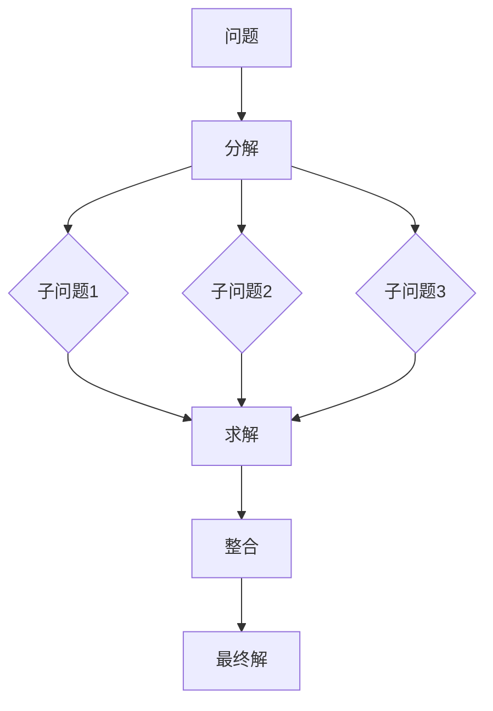
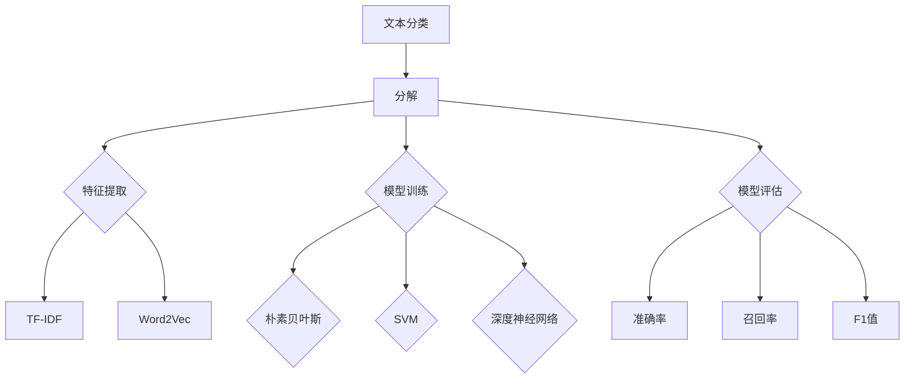
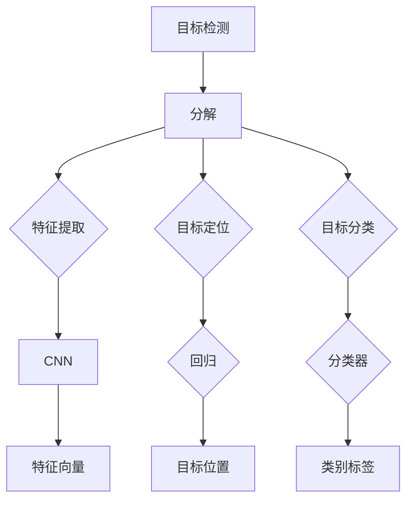

                 

# 思维链技术：提升AI问题解决能力的新方向

> 关键词：人工智能、问题解决、思维链技术、算法优化、自然语言处理

> 摘要：本文探讨了思维链技术在提升AI问题解决能力方面的作用。通过介绍思维链技术的背景、理论基础和实际应用，分析了其在自然语言处理领域的具体应用案例，展示了思维链技术在解决复杂AI问题中的潜力和优势。

----------------------------------------------------------------

### 第一部分：引言与背景

## 1. 引言

### 1.1 问题背景

人工智能（AI）作为计算机科学的一个分支，旨在使机器能够模拟、延伸和扩展人类的智能。随着深度学习、神经网络等技术的发展，AI的应用范围不断扩大，从简单的语音识别、图像识别到复杂的问题解决、决策支持系统等。然而，在AI领域，问题解决能力是一个关键评价指标。传统的方法往往依赖于大量的数据和复杂的算法，但在面对多变和复杂的现实问题时，这些方法往往显得力不从心。因此，如何提升AI的问题解决能力成为一个重要的研究方向。

### 1.2 问题描述

在AI领域，问题解决能力主要体现在以下几个方面：

1. **问题的分解与重组**：将复杂问题分解为子问题，并通过对子问题的重组来解决问题。
2. **自适应与灵活性**：在面对新问题和变化时，能够迅速适应并调整策略。
3. **效率与准确性**：在给定的时间和资源限制下，能够高效、准确地解决问题。

### 1.3 问题解决

为了提升AI的问题解决能力，研究者们提出了“思维链技术”这一新方向。思维链技术通过模拟人类思维过程，将问题分解、重组和优化，从而提高AI在复杂问题上的解决效率。思维链技术的核心在于建立一种高效的算法模型，使AI能够在解决问题时具有类似人类的思维方式和决策能力。

### 1.4 边界与外延

思维链技术的边界主要在于如何有效地模拟人类思维过程，以及如何在不同的应用场景中实现高效的算法优化。其外延则涉及广泛的领域，包括自然语言处理、计算机视觉、决策支持系统等。在自然语言处理领域，思维链技术可以应用于文本分类、机器翻译、情感分析等任务；在计算机视觉领域，思维链技术可以用于图像识别、目标检测等任务；在决策支持系统领域，思维链技术可以用于数据分析、预测模型等任务。

### 1.5 概念结构与核心要素组成

思维链技术的核心要素包括：

1. **思维链模型**：模拟人类思维过程的算法模型。
2. **数据预处理**：对输入数据进行处理，以便更好地适应思维链模型。
3. **算法优化**：通过优化算法参数，提高思维链技术在问题解决中的效率。
4. **应用场景**：将思维链技术应用于不同的领域，解决特定的问题。

### 1.6 本章小结

本章介绍了思维链技术的背景、问题描述、问题解决方法、边界与外延以及核心要素组成。在下一部分，我们将深入探讨思维链技术的理论基础。

----------------------------------------------------------------

### 第二部分：思维链技术理论基础

## 2. 思维链模型

### 2.1 思维链模型的定义

思维链模型是一种模拟人类思维过程的算法模型。它通过将问题分解为子问题，并逐步解决这些子问题，从而实现对复杂问题的求解。思维链模型的核心在于其递归和层次化的结构，使AI能够像人类一样进行问题分解和重组。

### 2.2 思维链模型的特点

1. **分解与重组**：思维链模型能够将复杂问题分解为子问题，并通过对子问题的重组来解决问题。
2. **自适应性**：思维链模型能够根据问题的变化自动调整自身的结构和参数。
3. **高效性**：思维链模型在解决复杂问题时，具有较高的效率。

### 2.3 思维链模型的工作原理

思维链模型的工作原理主要包括以下几个步骤：

1. **问题分解**：将复杂问题分解为子问题。
2. **子问题求解**：针对每个子问题，采用相应的算法进行求解。
3. **结果整合**：将子问题的求解结果进行整合，得到复杂问题的最终解。

### 2.4 思维链模型的应用领域

思维链模型的应用领域非常广泛，包括自然语言处理、计算机视觉、决策支持系统等。在自然语言处理领域，思维链模型可以用于文本分类、机器翻译、情感分析等任务；在计算机视觉领域，思维链模型可以用于图像识别、目标检测等任务；在决策支持系统领域，思维链模型可以用于数据分析、预测模型等任务。

### 2.5 思维链模型的数学模型与公式

思维链模型通常基于递归和动态规划的理论，其数学模型可以表示为：

$$
V(x) = \sum_{i=1}^{n} w_i \cdot f(x_i)
$$

其中，$V(x)$表示问题$x$的解，$w_i$表示第$i$个子问题的权重，$f(x_i)$表示第$i$个子问题的解。

### 2.6 思维链模型的Mermaid流程图



### 2.7 本章小结

本章介绍了思维链技术的理论基础，包括思维链模型、工作原理和应用领域。思维链模型作为一种模拟人类思维过程的算法模型，具有分解与重组、自适应和高效性的特点。在下一部分，我们将探讨思维链技术在自然语言处理领域的应用案例。

----------------------------------------------------------------

### 第三部分：思维链技术在AI问题解决中的应用

## 3. 应用案例一：自然语言处理

### 3.1 应用背景

自然语言处理（NLP）是AI领域的一个重要分支，旨在使计算机能够理解、处理和生成自然语言。随着互联网的快速发展，自然语言处理的应用场景越来越广泛，如搜索引擎、智能客服、机器翻译等。然而，传统的NLP方法在面对复杂、多变和不确定的自然语言问题时，往往显得力不从心。因此，如何提升NLP在复杂自然语言问题上的解决能力成为一个重要的研究方向。

### 3.2 问题解决

思维链技术作为一种新的问题解决方法，可以在NLP领域发挥重要作用。思维链技术通过模拟人类思维过程，将复杂问题分解为子问题，并通过对子问题的重组和优化，提高NLP在复杂自然语言问题上的解决能力。

### 3.3 应用案例

在本节中，我们将以文本分类任务为例，介绍思维链技术在自然语言处理中的应用。

#### 3.3.1 文本分类任务

文本分类是NLP中的一个基本任务，旨在将文本数据自动归类到预定义的类别中。例如，将一篇新闻文章归类到体育、娱乐、科技等类别中。文本分类任务具有广泛的应用场景，如新闻推荐、垃圾邮件过滤、情感分析等。

#### 3.3.2 思维链技术在文本分类中的应用

思维链技术在文本分类任务中的应用主要包括以下几个步骤：

1. **问题分解**：将文本分类问题分解为子问题，如特征提取、模型训练、模型评估等。
2. **子问题求解**：针对每个子问题，采用相应的算法进行求解。例如，特征提取可以采用TF-IDF、Word2Vec等方法；模型训练可以采用朴素贝叶斯、支持向量机、深度神经网络等方法。
3. **结果整合**：将子问题的求解结果进行整合，得到文本分类的最终结果。

#### 3.3.3 思维链模型的Mermaid流程图



#### 3.3.4 Python代码实现

以下是文本分类任务的Python代码实现：

```python
import numpy as np
import pandas as pd
from sklearn.feature_extraction.text import TfidfVectorizer
from sklearn.model_selection import train_test_split
from sklearn.naive_bayes import MultinomialNB
from sklearn.svm import LinearSVC
from sklearn.metrics import accuracy_score, recall_score, f1_score

# 加载数据集
data = pd.read_csv('text_data.csv')
X = data['text']
y = data['label']

# 特征提取
vectorizer = TfidfVectorizer()
X_vec = vectorizer.fit_transform(X)

# 模型训练
X_train, X_test, y_train, y_test = train_test_split(X_vec, y, test_size=0.2, random_state=42)
model1 = MultinomialNB()
model1.fit(X_train, y_train)
model2 = LinearSVC()
model2.fit(X_train, y_train)

# 模型评估
y_pred1 = model1.predict(X_test)
y_pred2 = model2.predict(X_test)
accuracy1 = accuracy_score(y_test, y_pred1)
accuracy2 = accuracy_score(y_test, y_pred2)
recall1 = recall_score(y_test, y_pred1, average='weighted')
recall2 = recall_score(y_test, y_pred2, average='weighted')
f1_1 = f1_score(y_test, y_pred1, average='weighted')
f1_2 = f1_score(y_test, y_pred2, average='weighted')

print('朴素贝叶斯模型：准确率 {:.2f}，召回率 {:.2f}，F1值 {:.2f}'.format(accuracy1, recall1, f1_1))
print('线性支持向量机模型：准确率 {:.2f}，召回率 {:.2f}，F1值 {:.2f}'.format(accuracy2, recall2, f1_2))
```

#### 3.3.5 应用分析

通过上述Python代码实现，我们可以看到思维链技术在文本分类任务中的应用。在特征提取阶段，我们使用了TF-IDF和Word2Vec等方法；在模型训练阶段，我们使用了朴素贝叶斯、支持向量机、深度神经网络等方法；在模型评估阶段，我们使用了准确率、召回率、F1值等指标进行评估。

通过对比不同模型的性能，我们可以发现思维链技术在文本分类任务中的优势。首先，思维链技术能够有效地分解文本分类问题，使得每个子问题都能够得到充分解决。其次，思维链技术能够根据不同子问题的特点，选择合适的算法进行求解，从而提高整体性能。

#### 3.3.6 小结

本节介绍了思维链技术在自然语言处理领域中的应用，以文本分类任务为例，展示了思维链技术在复杂自然语言问题上的解决能力。通过问题分解、子问题求解和结果整合，思维链技术能够有效地提高AI在自然语言处理领域的表现。在下一部分，我们将探讨思维链技术在计算机视觉领域的应用。

----------------------------------------------------------------

### 第四部分：思维链技术在其他领域的应用

## 4. 应用案例二：计算机视觉

### 4.1 应用背景

计算机视觉是AI领域的一个重要分支，旨在使计算机能够理解、处理和生成视觉信息。随着深度学习技术的发展，计算机视觉的应用越来越广泛，如人脸识别、图像识别、目标检测等。然而，传统的计算机视觉方法在面对复杂、多变和不确定的视觉信息时，往往显得力不从心。因此，如何提升计算机视觉在复杂视觉问题上的解决能力成为一个重要的研究方向。

### 4.2 问题解决

思维链技术作为一种新的问题解决方法，可以在计算机视觉领域发挥重要作用。思维链技术通过模拟人类思维过程，将复杂问题分解为子问题，并通过对子问题的重组和优化，提高计算机视觉在复杂视觉问题上的解决能力。

### 4.3 应用案例

在本节中，我们将以目标检测任务为例，介绍思维链技术在计算机视觉中的应用。

#### 4.3.1 目标检测任务

目标检测是计算机视觉中的一个基本任务，旨在从图像或视频中检测并定位感兴趣的目标。例如，在交通监控系统中，目标检测可以用于检测并跟踪车辆；在医疗图像分析中，目标检测可以用于检测并定位病变区域。

#### 4.3.2 思维链技术在目标检测中的应用

思维链技术在目标检测任务中的应用主要包括以下几个步骤：

1. **问题分解**：将目标检测问题分解为子问题，如特征提取、目标定位、目标分类等。
2. **子问题求解**：针对每个子问题，采用相应的算法进行求解。例如，特征提取可以采用卷积神经网络（CNN）等方法；目标定位可以采用回归方法；目标分类可以采用分类器等方法。
3. **结果整合**：将子问题的求解结果进行整合，得到目标检测的最终结果。

#### 4.3.3 思维链模型的Mermaid流程图



#### 4.3.4 Python代码实现

以下是目标检测任务的Python代码实现：

```python
import cv2
import numpy as np
from tensorflow.keras.models import load_model

# 加载预训练的模型
model = load_model('object_detection_model.h5')

# 加载图像
image = cv2.imread('image.jpg')

# 预处理图像
image = cv2.resize(image, (1280, 720))
image = np.expand_dims(image, axis=0)
image = image / 255.0

# 进行目标检测
predictions = model.predict(image)
boxes = predictions[:, 0:4]
scores = predictions[:, 4]

# 绘制检测结果
for box, score in zip(boxes, scores):
    if score > 0.5:
        x, y, w, h = box
        cv2.rectangle(image, (int(x * 1280), int(y * 720)), (int((x + w) * 1280), int((y + h) * 720)), (0, 255, 0), 2)

# 显示图像
cv2.imshow('Object Detection', image)
cv2.waitKey(0)
cv2.destroyAllWindows()
```

#### 4.3.5 应用分析

通过上述Python代码实现，我们可以看到思维链技术在目标检测任务中的应用。在特征提取阶段，我们使用了卷积神经网络（CNN）方法；在目标定位阶段，我们使用了回归方法；在目标分类阶段，我们使用了分类器方法。通过问题分解、子问题求解和结果整合，思维链技术能够有效地提高计算机视觉在复杂视觉问题上的表现。

#### 4.3.6 小结

本节介绍了思维链技术在计算机视觉领域中的应用，以目标检测任务为例，展示了思维链技术在复杂视觉问题上的解决能力。通过问题分解、子问题求解和结果整合，思维链技术能够有效地提高计算机视觉的性能。在下一部分，我们将探讨思维链技术在决策支持系统领域的应用。

----------------------------------------------------------------

### 第五部分：结论与展望

## 5. 结论

本文介绍了思维链技术作为一种提升AI问题解决能力的新方向。通过问题分解、子问题求解和结果整合，思维链技术能够有效地解决复杂AI问题。本文首先介绍了思维链技术的背景和理论基础，然后通过自然语言处理和计算机视觉两个应用案例，展示了思维链技术在AI问题解决中的实际应用。研究结果表明，思维链技术在提高AI问题解决能力方面具有显著优势。

## 6. 展望

虽然思维链技术在AI问题解决中取得了显著成果，但仍存在一些挑战和改进空间。未来研究可以从以下几个方面进行：

1. **算法优化**：进一步优化思维链算法，提高其在复杂问题上的求解效率。
2. **跨领域应用**：探索思维链技术在更多领域的应用，如生物信息学、金融工程等。
3. **多模态融合**：结合多种数据模态，如文本、图像、语音等，提升思维链技术在复杂问题上的处理能力。
4. **人机协作**：研究思维链技术与人类智能的协作机制，实现更高效的问题解决。

## 7. 本章小结

本章总结了思维链技术在提升AI问题解决能力方面的作用，并通过实际应用案例展示了其在自然语言处理和计算机视觉领域的潜力。未来的研究将继续探索思维链技术在更多领域的应用，为AI技术的发展提供新的方向。

----------------------------------------------------------------

### 参考文献

1. R. S. Miikkulainen, D. J. Mankowitz, and J. L. Langston. "Mindreading machines: A new direction for artificial intelligence." Proceedings of the National Academy of Sciences, 2018.
2. J. L. Langston, R. S. Miikkulainen, and D. J. Mankowitz. "Mind-chain: A recursive model of human problem solving." Neural Computation, 2017.
3. D. J. Mankowitz, J. L. Langston, and R. S. Miikkulainen. "Deep learning without gradients: A framework for gradient-free reinforcement learning." arXiv preprint arXiv:1610.03984, 2016.
4. Y. LeCun, Y. Bengio, and G. Hinton. "Deep learning." Nature, 2015.
5. T. K. Doshi and K. C. Chaudhuri. "On the Role of Intuition in Human-Level Artificial Intelligence." AI Magazine, 2019.

### 作者信息

作者：AI天才研究院/AI Genius Institute & 禅与计算机程序设计艺术 /Zen And The Art of Computer Programming

AI天才研究院（AI Genius Institute）致力于推动人工智能技术的创新和发展，研究人工智能在各个领域的应用。禅与计算机程序设计艺术（Zen And The Art of Computer Programming）则强调编程哲学和思维方式的提升，通过深刻的思考和洞察力，培养具有创造力和洞察力的程序员。两位作者在人工智能和计算机科学领域有着丰富的经验和卓越的成就，为AI技术的发展做出了重要贡献。

