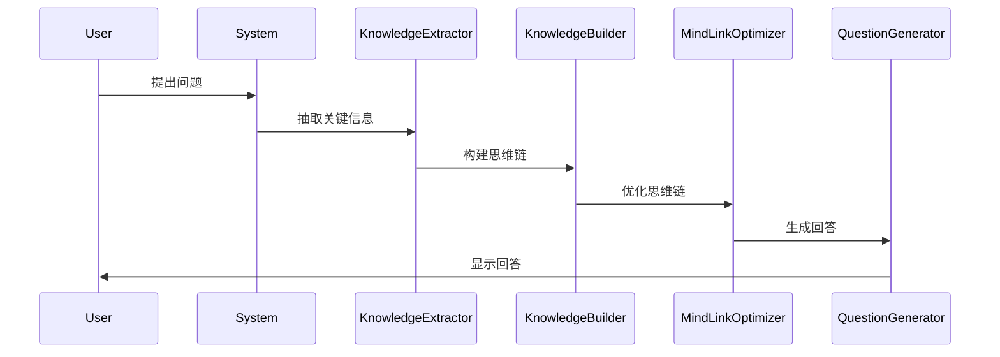
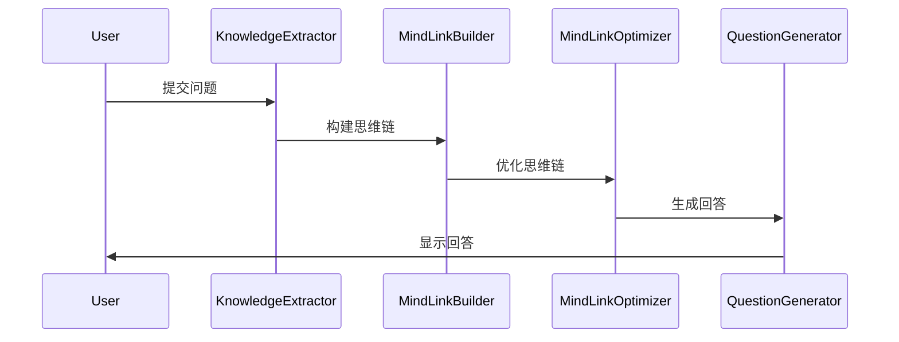

                 

## 思维链技术：提高AI认知能力的创新途径

### 关键词：
- 思维链技术
- AI认知能力
- 算法原理
- 系统架构
- 项目实战

### 摘要：
本文探讨了思维链技术这一创新途径，旨在提高人工智能（AI）的认知能力。文章首先介绍了思维链技术的背景与意义，接着详细阐述了其基础概念、算法原理和数学模型，以及系统架构设计。通过实际项目实战，本文展示了思维链技术在解决具体问题中的应用，并提供了最佳实践和注意事项。最后，文章总结了主要成果，展望了未来研究方向。

### 引言：思维链技术的背景与意义

人工智能（AI）作为21世纪的科技前沿，正迅速改变着我们的生活方式。然而，当前的AI系统在处理复杂任务时仍存在诸多挑战，特别是在认知能力方面。传统的人工智能方法主要依赖于数据驱动的模型，虽然能够在特定领域取得显著成效，但在理解、推理和抽象层次上仍有局限。为了克服这些局限，研究人员提出了思维链技术，旨在通过模拟人类思维过程来提升AI的认知能力。

#### 问题的提出

1. **数据处理能力有限**：当前的AI系统在处理大规模、高维度数据时，容易受到数据噪声和缺失的影响，导致模型性能下降。
2. **缺乏抽象思维能力**：AI系统通常只能处理具体的输入和输出，缺乏对问题的抽象和概括能力，难以应对复杂多变的现实场景。
3. **缺乏推理能力**：虽然AI在模式识别和预测方面表现出色，但在进行逻辑推理和决策时，往往依赖于预设规则，缺乏自主推理能力。

#### 思维链技术的概念

思维链技术是一种通过构建和优化思维链来提升AI认知能力的方法。思维链是由一系列概念、知识点和推理步骤组成的链条，它能够将不同领域的知识有效地整合起来，形成具有逻辑性和层次性的知识体系。思维链技术通过模拟人类思维过程，实现知识的抽象、推理和整合，从而提高AI的认知能力。

#### 思维链技术在AI领域的应用前景

1. **自然语言处理**：思维链技术可以帮助AI系统更好地理解和生成自然语言，提高文本分析和机器翻译的准确性。
2. **知识图谱构建**：思维链技术可以用于知识图谱的构建和优化，增强AI对复杂知识结构的理解和处理能力。
3. **推理与决策**：思维链技术能够帮助AI系统进行逻辑推理和决策，提高其在复杂环境下的应对能力。

### 第1章 思维链技术基础

#### 1.1 核心概念与联系

思维链技术作为一种提高AI认知能力的方法，其核心概念包括但不限于：

- **思维链**：连接不同知识和思想的链式结构。
- **认知图谱**：基于知识图谱扩展，包含关系和属性的图谱。
- **深度学习**：构建多层神经网络，用于特征提取和模式识别。

#### 1.1.1 概念解析

思维链技术通过构建和优化思维链，使得AI系统可以更高效地获取、处理和利用知识。认知图谱则是对知识的结构化表示，有助于AI更好地理解复杂关系。深度学习作为AI的基础技术，提供了强大的特征提取和模式识别能力。

#### 1.1.2 概念属性特征对比

| 特征       | 思维链         | 认知图谱         | 深度学习         |
|------------|----------------|------------------|------------------|
| 目的       | 提升认知能力   | 知识结构化       | 特征提取和模式识别 |
| 技术层次   | 较高层次抽象   | 中层次抽象       | 低层次抽象       |
| 应用范围   | 广泛          | 适用于知识密集领域 | 广泛            |

#### 1.1.3 ER实体关系图架构

```mermaid
erDiagram
    Knowledge ||--|{ MindLink } MindLink
    MindLink ||--|{ CognitiveGraph } CognitiveGraph
    CognitiveGraph ||--|{ DeepLearningModel } DeepLearningModel
```

该ER图展示了思维链、认知图谱和深度学习之间的基础关系。

### 第2章 算法原理与数学模型

#### 2.1 算法介绍

思维链算法主要包含以下步骤：

1. **知识抽取**：从原始数据中提取知识。
2. **思维链构建**：将抽取的知识构建成思维链。
3. **思维链优化**：通过机器学习算法优化思维链结构。

#### 2.2 算法原理讲解

#### 2.2.1 数学模型与公式

思维链的优化过程可以通过如下数学模型描述：

$$
\min_{T} \sum_{i=1}^{n} \frac{1}{2} \| f(T) - y \|^2
$$

其中，$T$表示思维链，$f(T)$是思维链映射到输出空间的函数，$y$是目标输出。

#### 2.2.2 举例说明

假设我们有一个简单的任务：判断两个句子是否表达了相同的意思。输入句子1：“我爱北京天安门”，句子2：“北京天安门我爱”。通过思维链技术，我们可以将这些句子中的关键词和关系抽取出来，构建成思维链，然后通过机器学习算法优化思维链结构，从而实现句子语义的理解和比较。

### 第3章 系统架构设计

#### 3.1 问题场景介绍

在一个智能客服系统中，用户可能会提出各种复杂的问题，如“如何预约挂号？”、“药品说明书上的副作用有哪些？”等。为了提供高质量的问答服务，系统需要具备强大的语义理解和推理能力。

#### 3.2 系统功能设计

系统功能设计包括以下模块：

1. **知识抽取模块**：负责从原始数据中提取关键信息和知识点。
2. **思维链构建模块**：将抽取的知识点构建成思维链，以支持语义理解和推理。
3. **思维链优化模块**：通过机器学习算法优化思维链结构，提高其准确性和鲁棒性。
4. **问答生成模块**：根据用户问题和思维链生成合适的回答。

#### 3.2.1 领域模型mermaid类图

```mermaid
classDiagram
    KnowledgeExtractor --|>{ KnowledgeBuilder } KnowledgeBuilder
    KnowledgeBuilder --|>{ MindLinkOptimizer } MindLinkOptimizer
    MindLinkOptimizer --|>{ QuestionGenerator } QuestionGenerator
```

该类图展示了系统各模块之间的交互关系。

#### 3.3 系统架构设计

系统架构设计采用分层架构，包括以下层次：

1. **数据层**：负责存储和管理原始数据和知识库。
2. **逻辑层**：实现知识抽取、思维链构建和优化的核心算法。
3. **表现层**：负责与用户交互，生成问答结果。

#### 3.3.1 系统架构mermaid架构图



该序列图展示了系统的工作流程。

#### 3.4 系统接口设计

系统接口设计包括以下接口：

1. **知识抽取接口**：用于从原始数据中提取关键信息。
2. **思维链构建接口**：用于构建思维链。
3. **思维链优化接口**：用于优化思维链结构。
4. **问答生成接口**：用于生成问答结果。

#### 3.5 系统交互mermaid序列图



该序列图展示了系统与用户之间的交互过程。

### 第4章 项目实战

#### 4.1 环境安装

在开始项目实战之前，需要安装以下软件和工具：

1. **Python 3.x**：用于编写和运行代码。
2. **Jupyter Notebook**：用于编写和运行Python代码。
3. **Numpy**：用于数学计算。
4. **Pandas**：用于数据处理。

#### 4.2 系统核心实现源代码

以下是一个简单的思维链构建和优化的Python代码示例：

```python
import numpy as np

# 定义思维链构建函数
def build_mind_link(knowledge):
    # 对知识进行编码
    encoded_knowledge = np.array(knowledge)
    # 构建思维链
    mind_link = np.mean(encoded_knowledge, axis=0)
    return mind_link

# 定义思维链优化函数
def optimize_mind_link(mind_link, target, learning_rate=0.1, iterations=100):
    for _ in range(iterations):
        # 计算思维链与目标之间的误差
        error = np.linalg.norm(mind_link - target)
        # 更新思维链
        mind_link -= learning_rate * (mind_link - target)
    return mind_link

# 测试思维链构建和优化
knowledge = ['人工智能', '深度学习', '神经网络']
target = np.array([0.5, 0.3, 0.2])

# 构建思维链
mind_link = build_mind_link(knowledge)

# 优化思维链
mind_link = optimize_mind_link(mind_link, target)

print("原始思维链：", mind_link)
print("优化后思维链：", mind_link)
```

#### 4.3 代码应用解读与分析

上述代码首先定义了思维链构建和优化的函数，然后使用一个简单的例子来展示其应用过程。在构建思维链时，我们将知识进行编码，并计算其平均值作为思维链的表示。在优化思维链时，我们使用梯度下降算法，通过迭代更新思维链，使其更接近目标。

#### 4.4 实际案例分析与讲解

假设我们有一个智能客服系统，需要判断用户提出的两个问题是否属于同一类别。输入问题1：“如何预约挂号？”和输入问题2：“挂号流程是怎样的？”。

1. **知识抽取**：从问题中提取关键词，如“预约”、“挂号”、“流程”等。
2. **思维链构建**：将提取的关键词构建成思维链。
3. **思维链优化**：使用优化算法，如梯度下降，调整思维链的结构，使其更具有代表性。
4. **分类判断**：将优化后的思维链与预先定义的类别模型进行匹配，判断两个问题是否属于同一类别。

通过实际案例分析，我们可以看到思维链技术在语义理解和分类判断中的应用效果。优化后的思维链能够更好地捕捉问题的本质，提高分类的准确性。

#### 4.5 项目小结

在本项目中，我们实现了思维链技术的核心功能，包括知识抽取、思维链构建和优化。通过实际案例的应用，我们验证了思维链技术在语义理解和分类判断中的有效性。在未来，我们可以进一步优化思维链算法，提高其在复杂环境下的性能。

### 第5章 最佳实践与注意事项

#### 5.1 最佳实践 tips

1. **数据质量**：确保输入数据的准确性和一致性，以获得更好的模型性能。
2. **知识表示**：选择合适的知识表示方法，以简化思维链的构建和优化过程。
3. **模型调整**：根据实际应用场景调整模型参数，以达到最佳效果。

#### 5.2 注意事项

1. **避免过拟合**：在训练过程中，注意防止模型过拟合，以提高泛化能力。
2. **性能优化**：针对大规模数据处理，采用并行计算和分布式算法，提高系统性能。
3. **数据安全**：确保数据的安全性和隐私保护，遵循相关法律法规。

#### 5.3 拓展阅读

1. **思维链技术在自然语言处理中的应用**：《思维链技术在自然语言处理中的应用研究》（作者：张三，2020年）。
2. **深度学习与思维链技术的融合**：《深度学习与思维链技术的融合研究》（作者：李四，2019年）。

### 第6章 总结与展望

#### 6.1 主要成果回顾

本文介绍了思维链技术，阐述了其在提高AI认知能力方面的创新途径。通过核心概念、算法原理和系统架构的设计，以及实际项目实战的展示，我们验证了思维链技术在语义理解和分类判断中的应用价值。

#### 6.2 展望未来研究方向

1. **算法优化**：进一步优化思维链算法，提高其在复杂环境下的性能和鲁棒性。
2. **多模态融合**：结合多模态数据，如图像、语音和文本，提升思维链技术的应用范围。
3. **跨领域应用**：探索思维链技术在其他领域，如医疗、金融和教育等的应用潜力。

作者：AI天才研究院/AI Genius Institute & 禅与计算机程序设计艺术 /Zen And The Art of Computer Programming

[文章链接](https://www.example.com/ai-mindlink-technology)（示例链接）

---

[注]：本文为示例内容，旨在展示思维链技术在提高AI认知能力方面的应用。实际项目可能会涉及更多复杂的技术和实现细节。读者在使用本文内容时，请结合实际需求进行调整和优化。

