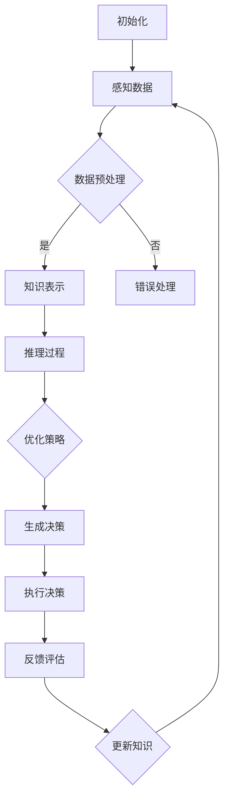
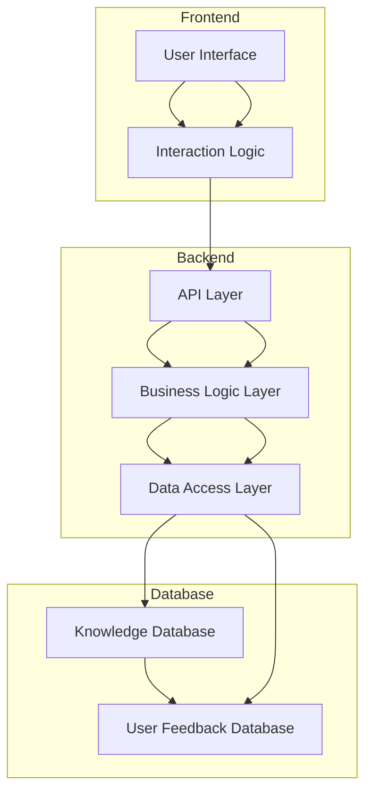
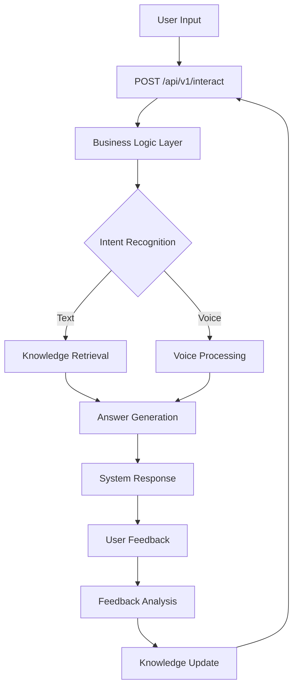

                 

### 第一部分：引言

#### 1.1 问题背景

随着深度学习、神经网络等技术的飞速发展，人工智能（AI）已经成为当今世界最具颠覆性的技术之一。尤其是在自然语言处理、图像识别、决策支持等领域，AI已经展现出强大的能力。然而，尽管人工智能在这些领域已经取得了显著的成果，但在推理和决策等方面，AI仍然难以达到人类的水平。

人类思维具有灵活性、创造性和推理能力，这使得我们在解决复杂问题时更具优势。人类能够理解抽象概念、关联不同知识点，并从海量信息中快速找到解决问题的方法。而人工智能则往往依赖于大量的数据和预设的算法，缺乏这种灵活性和创造性。

#### 1.2 问题描述

人工智能在推理方面存在以下几个挑战：

- **缺乏人类思维中的关联性、逻辑性和推理能力**：人工智能在处理问题时，往往只关注局部信息，而忽略了整体关联性。这使得人工智能在解决复杂问题时，往往无法达到人类的水平。

- **对复杂问题缺乏处理能力**：人工智能在面对非线性、多维度的问题时，往往难以处理。而人类则可以通过直觉、经验和逻辑推理来处理这类问题。

- **在处理不确定性问题时，缺乏灵活性**：人类在面对不确定性问题时，可以通过直觉和经验来快速调整策略。而人工智能则往往需要依赖大量数据和复杂的算法来处理不确定性问题。

#### 1.3 思维链技术的概念

为了解决人工智能在推理方面的挑战，研究者们提出了思维链技术。思维链技术试图模拟人类思维的推理过程，通过构建一系列的思维模块，实现更接近人类思维的推理能力。

思维链技术主要包括以下几个核心概念：

- **知识表示**：将人类思维中的知识以结构化的形式进行表示，使得计算机能够理解和处理这些知识。

- **思维流程**：模拟人类思维的推理过程，包括感知、记忆、联想、推理等。

- **策略优化**：通过优化推理策略，提高推理的效率和质量。

#### 1.4 问题解决

思维链技术的原理可以概括为以下几个方面：

- **知识表示**：思维链技术通过将知识以结构化的形式进行表示，使得计算机能够理解和处理这些知识。知识表示的方法包括符号表示、图表示和网络表示等。

- **思维流程**：思维链技术模拟人类思维的推理过程，包括感知、记忆、联想、推理等。通过这些思维模块，计算机能够逐步构建出解决问题的方法。

- **策略优化**：思维链技术通过优化推理策略，提高推理的效率和质量。策略优化的方法包括算法优化、参数调整等。

#### 1.5 思维链技术的应用

思维链技术可以在以下领域发挥重要作用：

- **自然语言处理**：通过思维链技术，AI可以更好地理解人类语言，实现更准确的语义分析和推理。

- **决策支持系统**：思维链技术可以帮助AI在复杂决策过程中模拟人类思维，提高决策的准确性和效率。

- **教育与培训**：思维链技术可以模拟教师的思维过程，为学生提供个性化、智能化的教学服务。

#### 1.6 边界与外延

虽然思维链技术具有很大的潜力，但仍然存在一些局限：

- **数据依赖**：思维链技术依赖于大量的数据支持，数据质量和数量直接影响到推理效果。

- **算法复杂度**：思维链技术的算法复杂度较高，需要高效的计算资源支持。

- **适用范围**：思维链技术主要适用于一些结构化、知识密集型的领域，对于一些非结构化、复杂的问题，效果可能有限。

#### 1.7 概念结构与核心要素组成

思维链技术的核心概念和要素主要包括：

- **知识表示**：如何将人类思维中的知识以结构化的形式进行表示。

- **思维流程**：如何模拟人类思维的推理过程。

- **策略优化**：如何通过优化推理策略，提高推理的效率和质量。

- **数据库**：用于存储和管理知识库。

- **推理引擎**：用于模拟人类思维的推理过程。

- **优化算法**：用于优化推理策略，提高推理效率。

#### 1.8 本章小结

本章介绍了思维链技术的背景、概念、原理和应用，以及其边界和外延。接下来，本书将深入探讨思维链技术的核心概念、原理和应用，帮助读者更好地理解这一技术，并在实际应用中取得更好的效果。

------------------------------------------------------------------
# 第二部分：思维链技术核心概念与原理

## 2.1 知识表示

### 2.1.1 知识表示的概念

知识表示是思维链技术中的核心概念，它涉及如何将人类思维中的知识以结构化的形式进行表示。知识表示的目标是使计算机能够理解和处理这些知识，从而实现更接近人类思维的推理能力。

在人类思维中，知识是通过感知、记忆、联想等方式存储和处理的。而人工智能需要将这些知识以某种结构化的形式进行表示，以便计算机能够对其进行处理和分析。

### 2.1.2 知识表示的方法

知识表示的方法有很多种，以下是其中几种常见的方法：

- **符号表示**：符号表示是一种简单直观的知识表示方法。它使用符号和标记来表示知识。例如，使用符号“+”表示加法运算，使用符号“∧”表示逻辑与运算。

- **图表示**：图表示是一种基于图形的知识表示方法。它使用节点和边来表示知识和知识之间的关系。例如，使用实体-关系图（ER图）来表示知识结构。

- **网络表示**：网络表示是一种基于网络的 knowledge representation method。它使用节点和边来表示知识和知识之间的关系，并允许知识在网络中传播和更新。例如，使用神经网络来表示知识表示和推理过程。

### 2.1.3 知识表示的应用

知识表示在人工智能领域有广泛的应用，以下是其中一些典型的应用场景：

- **自然语言处理**：通过知识表示，AI可以更好地理解人类语言，实现更准确的语义分析和推理。

- **决策支持系统**：知识表示可以帮助AI在复杂决策过程中模拟人类思维，提高决策的准确性和效率。

- **教育与培训**：知识表示可以模拟教师的思维过程，为学生提供个性化、智能化的教学服务。

### 2.1.4 知识表示的挑战

尽管知识表示在人工智能领域有广泛的应用，但仍然面临一些挑战：

- **知识的结构化表示**：如何将人类思维中的知识以结构化的形式进行表示，这是一个关键问题。

- **知识的自动化获取**：如何从海量数据中自动获取知识，并对其进行结构化表示，这是另一个重要挑战。

- **知识的灵活性和可扩展性**：知识表示需要具备一定的灵活性和可扩展性，以适应不同应用场景的需求。

## 2.2 思维流程

### 2.2.1 思维流程的概念

思维流程是指人类在进行推理和决策时的思维过程。思维流程包括感知、记忆、联想、推理等环节。通过模拟人类思维流程，人工智能可以更好地理解和处理复杂问题。

### 2.2.2 思维流程的环节

思维流程的主要环节包括：

- **感知**：感知是指接收外部信息的过程。人类通过感官获取外部信息，如视觉、听觉、触觉等。

- **记忆**：记忆是指将感知到的信息存储在大脑中的过程。人类能够通过记忆来回忆起过去的知识和经验。

- **联想**：联想是指将不同信息之间建立联系的过程。人类可以通过联想来发现新的知识和解决问题的方法。

- **推理**：推理是指利用已有知识和信息进行推理和决策的过程。人类可以通过推理来解决复杂问题。

### 2.2.3 思维流程的应用

思维流程在人工智能领域有广泛的应用，以下是其中一些典型的应用场景：

- **问题求解**：通过模拟人类思维流程，AI可以更好地理解和解决问题。

- **决策支持**：思维流程可以帮助AI在复杂决策过程中模拟人类思维，提高决策的准确性和效率。

- **自然语言处理**：思维流程可以帮助AI更好地理解和处理自然语言。

### 2.2.4 思维流程的挑战

尽管思维流程在人工智能领域有广泛的应用，但仍然面临一些挑战：

- **感知的准确性**：如何提高感知的准确性，以便更好地获取外部信息。

- **记忆的容量和速度**：如何提高记忆的容量和速度，以便更快地回忆起已有知识。

- **联想的灵活性**：如何提高联想的灵活性，以便更好地发现新的知识和解决问题的方法。

## 2.3 策略优化

### 2.3.1 策略优化的概念

策略优化是指通过优化推理策略，提高推理的效率和质量。策略优化是思维链技术中的一个重要环节，它涉及到如何选择最佳的推理路径和推理方法。

### 2.3.2 策略优化的方法

策略优化的方法包括：

- **算法优化**：通过优化算法，提高推理的效率和准确性。

- **参数调整**：通过调整参数，使推理策略更适合特定问题。

- **启发式搜索**：使用启发式方法，快速找到最优解。

### 2.3.3 策略优化的应用

策略优化在人工智能领域有广泛的应用，以下是其中一些典型的应用场景：

- **自然语言处理**：通过策略优化，可以提高自然语言处理的准确性和效率。

- **决策支持**：通过策略优化，可以提高决策支持系统的效率和准确性。

- **智能搜索**：通过策略优化，可以提高智能搜索系统的效率和准确性。

### 2.3.4 策略优化的挑战

尽管策略优化在人工智能领域有广泛的应用，但仍然面临一些挑战：

- **算法的选择**：如何选择适合特定问题的算法。

- **参数的调整**：如何调整参数，使推理策略更适合特定问题。

- **启发式方法的选择**：如何选择适合特定问题的启发式方法。

## 2.4 知识表示、思维流程和策略优化的联系

知识表示、思维流程和策略优化是思维链技术中的三个核心概念，它们相互关联，共同构成了思维链技术的核心框架。

- **知识表示**：知识表示是思维链技术的基石，它为思维流程和策略优化提供了基础。

- **思维流程**：思维流程是思维链技术的核心，它模拟了人类思维的推理过程。

- **策略优化**：策略优化是思维链技术的关键，它通过优化推理策略，提高了推理的效率和质量。

通过这三个核心概念，思维链技术实现了对人类思维的模拟和优化，为人工智能在推理和决策方面提供了新的可能性。

-------------------------------------------------------------------

## 2.5 知识表示的具体实现

### 2.5.1 知识表示的挑战

尽管知识表示是思维链技术的核心，但实现知识表示仍然面临一些挑战。这些挑战包括如何有效地组织和管理知识、如何确保知识的准确性和一致性、以及如何使知识表示适应不同的问题场景。

- **知识的组织和管理**：知识表示需要一种有效的组织结构，以便于计算机能够快速检索和使用知识。这要求知识表示方法不仅能够表示知识的结构，还要能够方便地管理大量知识。

- **知识的准确性和一致性**：知识的准确性直接影响到推理的可靠性。如果知识表示不准确，可能会导致错误的推理结果。此外，知识之间的一致性也是关键，确保不同知识之间没有矛盾。

- **知识的适应性**：知识表示需要具有高度的适应性，以便于在不同的问题场景中应用。这要求知识表示方法能够灵活地调整和扩展，以适应新的问题和需求。

### 2.5.2 知识表示的方法

为了应对上述挑战，研究者们提出了多种知识表示方法。以下是几种常见的知识表示方法及其特点：

1. **符号表示法**：

   符号表示法是一种基于符号和规则的知识表示方法。它通过定义符号和规则来表示知识和推理过程。例如，在逻辑推理中，符号“∧”表示逻辑与，“∨”表示逻辑或。

   - **优点**：符号表示法直观、易于理解，适用于形式逻辑和规则推理。
   - **缺点**：对于复杂的知识结构和动态变化的问题，符号表示法的表达能力有限。

2. **图表示法**：

   图表示法使用节点和边来表示知识和知识之间的关系。图中的节点代表知识实体，边代表知识之间的关联。

   - **优点**：图表示法能够清晰地表示知识的结构，适用于复杂的知识表示，如网络、关系图等。
   - **缺点**：图表示法在处理大规模知识时，可能会遇到性能问题。

3. **语义网络表示法**：

   语义网络表示法是一种基于语义的知识表示方法，它通过节点和边来表示概念和概念之间的关系。在语义网络中，节点表示概念，边表示概念之间的关系。

   - **优点**：语义网络表示法能够表示复杂的概念关系，适用于语义分析和推理。
   - **缺点**：语义网络表示法在构建和更新时，需要大量人工干预。

4. **神经网络表示法**：

   神经网络表示法是一种基于神经网络的表示方法，它通过神经网络的层次结构和连接权重来表示知识。

   - **优点**：神经网络表示法能够自适应地学习和表示复杂的知识结构，适用于大规模数据和高维知识。
   - **缺点**：神经网络表示法在理解和解释方面存在困难，需要大量的训练数据和计算资源。

### 2.5.3 知识表示的应用场景

根据知识表示方法的特点，不同方法适用于不同的应用场景：

- **符号表示法**：适用于规则推理和形式逻辑分析，如自然语言处理、自动定理证明等。

- **图表示法**：适用于复杂关系和网络结构的表示，如社交网络分析、语义网络构建等。

- **语义网络表示法**：适用于语义分析和推理，如知识图谱构建、语义搜索等。

- **神经网络表示法**：适用于大规模数据和高维知识的表示，如图像识别、语音识别、推荐系统等。

### 2.5.4 知识表示的挑战与展望

尽管知识表示在人工智能领域有广泛的应用，但仍然面临一些挑战：

- **知识表示的自动获取**：如何从非结构化的数据中自动获取知识，并转化为结构化的知识表示。

- **知识表示的融合与集成**：如何将不同来源和不同格式的知识进行有效融合和集成。

- **知识表示的可解释性**：如何提高知识表示的可解释性，使其更加透明和易于理解。

未来的知识表示研究将朝着更加自动化、智能化和可解释性的方向发展，以满足人工智能在不同领域的需求。

## 2.6 思维流程的具体实现

### 2.6.1 思维流程的挑战

思维流程是思维链技术的核心，其具体实现面临以下挑战：

- **感知的准确性和多样性**：如何准确获取外部信息，并适应不同的感知方式。

- **记忆的容量和效率**：如何高效存储和快速检索知识。

- **联想的灵活性和创新性**：如何灵活地将不同知识进行关联，并发现新的解决方案。

### 2.6.2 感知的具体实现

感知是思维流程的第一步，其具体实现包括以下方面：

- **多模态感知**：结合多种感知方式，如视觉、听觉、触觉等，以获取更全面的信息。

- **数据预处理**：对感知数据进行清洗、归一化和特征提取，以提高感知的准确性。

- **感知模型的训练**：使用机器学习算法，如卷积神经网络（CNN）、循环神经网络（RNN）等，训练感知模型，使其能够准确识别和分类感知数据。

### 2.6.3 记忆的具体实现

记忆是思维流程的关键，其具体实现包括以下方面：

- **知识存储**：使用数据库或图数据库等技术，存储和管理知识。

- **记忆检索**：使用索引技术和搜索算法，快速检索所需知识。

- **记忆优化**：通过记忆蒸馏、记忆增强等方法，提高记忆的效率和准确性。

### 2.6.4 联想的具体实现

联想是思维流程的创新性体现，其具体实现包括以下方面：

- **知识关联**：使用图论、知识图谱等技术，建立知识之间的关联关系。

- **联想算法**：使用联想算法，如基于规则、基于模型、基于数据的联想方法，发现新的知识和解决方案。

- **联想优化**：通过优化联想算法，提高联想的灵活性和创新性。

### 2.6.5 思维流程的整体架构

思维流程的整体架构包括感知模块、记忆模块、联想模块和推理模块。每个模块都有具体的实现方法和技术，它们相互协作，共同实现思维链技术的目标。

- **感知模块**：负责感知外部信息，如视觉、听觉、触觉等。

- **记忆模块**：负责存储和检索知识，包括知识存储、记忆检索和记忆优化。

- **联想模块**：负责建立知识之间的关联关系，包括知识关联、联想算法和联想优化。

- **推理模块**：负责利用知识和联想关系进行推理，包括推理策略、推理算法和推理优化。

通过感知、记忆、联想和推理的有机结合，思维流程能够模拟人类思维的推理过程，实现更接近人类思维的推理能力。

### 2.6.6 思维流程的应用场景

思维流程在人工智能领域有广泛的应用场景，包括：

- **智能问答系统**：通过感知用户输入，记忆相关知识点，进行联想和推理，提供准确的回答。

- **智能决策系统**：通过感知外部信息，记忆相关数据，进行联想和推理，提供最优的决策方案。

- **智能教育系统**：通过感知学生行为，记忆教学知识，进行联想和推理，提供个性化的教学服务。

- **智能医疗诊断**：通过感知患者数据，记忆医学知识，进行联想和推理，提供准确的诊断和治疗方案。

### 2.6.7 思维流程的挑战与展望

思维流程在具体实现和应用中仍然面临一些挑战，如感知的准确性、记忆的容量和效率、联想的灵活性和创新性等。未来的研究将朝着提高感知准确性、优化记忆和联想算法、增强推理能力等方向发展，以实现更接近人类思维的推理能力。

通过深入研究和实践，思维流程有望在人工智能领域发挥更大的作用，推动人工智能技术的发展和进步。

## 2.7 策略优化的具体实现

### 2.7.1 策略优化的挑战

策略优化是思维链技术中的一个关键环节，其具体实现面临以下挑战：

- **算法选择**：如何选择适合特定问题的优化算法。

- **参数调整**：如何调整优化算法的参数，使其达到最优性能。

- **计算效率**：如何提高优化算法的计算效率，以适应实时应用场景。

### 2.7.2 策略优化的方法

策略优化可以采用多种方法，以下是几种常见的策略优化方法：

1. **启发式搜索**：

   启发式搜索是一种基于问题局部信息的搜索策略，它通过利用已知信息指导搜索过程，以期望找到最优解。常见的启发式搜索算法包括贪心算法、A*算法等。

   - **优点**：计算效率高，适用于搜索空间较小的场景。
   - **缺点**：无法保证找到全局最优解，对问题结构和初始条件敏感。

2. **遗传算法**：

   遗传算法是一种基于生物进化机制的优化算法，它通过模拟自然进化过程，逐步优化问题的解。遗传算法包括选择、交叉、变异等操作。

   - **优点**：具有较强的全局搜索能力，适用于复杂的问题。
   - **缺点**：计算复杂度较高，收敛速度较慢。

3. **粒子群优化**：

   粒子群优化是一种基于群体智能的优化算法，它通过模拟鸟群或鱼群的觅食行为，寻找最优解。粒子群优化包括位置更新、速度更新等操作。

   - **优点**：易于实现，适用于多目标优化问题。
   - **缺点**：对参数调整敏感，收敛速度不稳定。

4. **深度强化学习**：

   深度强化学习是一种结合深度学习和强化学习的方法，它使用神经网络来表示策略函数，并通过强化信号来优化策略。常见的深度强化学习算法包括DQN、PPO等。

   - **优点**：能够处理高维和复杂的问题，具有较强的自适应能力。
   - **缺点**：训练过程复杂，需要大量的数据和计算资源。

### 2.7.3 策略优化的应用场景

策略优化在人工智能领域有广泛的应用场景，包括：

- **路径规划**：在自动驾驶、无人机导航等场景中，策略优化用于找到最优的路径规划方案。

- **资源分配**：在云计算、物联网等场景中，策略优化用于优化资源分配和调度。

- **机器人控制**：在机器人控制场景中，策略优化用于优化机器人的动作规划和决策。

- **游戏AI**：在游戏场景中，策略优化用于优化AI角色的行为和决策。

### 2.7.4 策略优化的挑战与展望

策略优化在具体实现和应用中仍然面临一些挑战，如算法选择、参数调整、计算效率等。未来的研究将朝着提高算法选择和参数调整的智能化、提高计算效率、增强策略优化的自适应能力等方向发展。

通过不断的研究和实践，策略优化有望在人工智能领域发挥更大的作用，推动人工智能技术的发展和进步。

## 2.8 知识表示、思维流程和策略优化的综合应用

### 2.8.1 综合应用概述

知识表示、思维流程和策略优化是思维链技术的三个核心概念，它们在人工智能系统中相互协作，共同实现更接近人类思维的推理能力。知识表示提供了结构化的知识库，思维流程模拟了人类思维的推理过程，而策略优化则通过不断调整和优化推理策略，提高推理的效率和质量。

在实际应用中，这三个概念的综合应用可以大大提升人工智能系统的性能和智能程度。通过知识表示，系统可以快速获取和利用已有知识；通过思维流程，系统可以模拟人类思维的推理过程，处理复杂问题；通过策略优化，系统可以不断调整推理策略，提高推理的效率和准确性。

### 2.8.2 综合应用的步骤

综合应用知识表示、思维流程和策略优化，可以按照以下步骤进行：

1. **知识表示**：

   - **构建知识库**：首先，构建一个结构化的知识库，将人类思维中的知识以计算机可处理的形式进行表示。这包括符号表示、图表示和网络表示等。

   - **知识抽取**：从非结构化数据中自动提取知识，并进行结构化表示。这通常需要使用自然语言处理、知识图谱等技术。

2. **思维流程**：

   - **感知**：系统通过感知模块获取外部信息，如文本、图像、声音等。

   - **记忆**：系统将感知到的信息与知识库中的知识进行匹配和存储，形成记忆。

   - **联想**：系统根据记忆中的知识，进行联想和关联，发现新的知识或解决方案。

   - **推理**：系统利用知识库和联想结果，进行推理和决策，形成行动策略。

3. **策略优化**：

   - **策略选择**：系统根据当前问题和环境，选择合适的策略优化算法，如贪心算法、遗传算法、粒子群优化等。

   - **策略调整**：系统通过实际执行行动，收集反馈信息，调整策略参数，优化策略效果。

   - **策略迭代**：系统不断迭代优化策略，提高推理的效率和准确性。

### 2.8.3 综合应用的挑战

尽管知识表示、思维流程和策略优化的综合应用具有巨大的潜力，但仍然面临一些挑战：

- **知识表示的准确性**：知识表示的准确性直接影响推理的结果。如何确保知识表示的准确性是一个重要问题。

- **思维流程的效率**：思维流程的效率直接影响到系统的响应速度。如何优化思维流程，提高其效率是一个关键问题。

- **策略优化的适应性**：策略优化的适应性直接影响到系统在不同场景下的表现。如何使策略优化具有更好的适应性是一个重要问题。

- **计算资源**：知识表示、思维流程和策略优化的综合应用通常需要大量的计算资源。如何在有限的计算资源下实现高效的应用是一个挑战。

### 2.8.4 综合应用的未来方向

未来的研究将朝着以下方向努力：

- **知识表示的智能化**：通过引入更多的语义信息、上下文信息等，提高知识表示的准确性。

- **思维流程的自动化**：通过自动化技术和机器学习算法，实现更高效的思维流程。

- **策略优化的智能化**：通过引入更多的机器学习和人工智能技术，实现更智能、更自适应的策略优化。

- **跨领域的综合应用**：将知识表示、思维流程和策略优化应用于更多领域，如自然语言处理、图像识别、医疗诊断等。

通过不断的研究和实践，知识表示、思维流程和策略优化的综合应用将推动人工智能技术的发展，实现更接近人类思维的智能推理和决策。

## 2.9 思维链技术的实际应用案例

### 2.9.1 案例一：智能问答系统

**问题背景**：

智能问答系统是一种常见的应用场景，旨在模拟人类问答过程，为用户提供准确的回答。然而，传统的问答系统往往依赖于大量的规则和模板，难以应对复杂的问题。

**解决方案**：

通过思维链技术，智能问答系统可以实现更自然的问答交互。具体步骤如下：

1. **知识表示**：

   - **构建知识库**：使用图数据库存储大量结构化的知识，包括事实、概念和关系。

   - **知识抽取**：从非结构化文本中自动提取知识，并将其转化为结构化表示。

2. **思维流程**：

   - **感知**：系统接收用户输入的问题，并进行自然语言处理，提取关键信息。

   - **记忆**：系统在知识库中查找与问题相关的知识，进行匹配和联想。

   - **联想**：系统根据联想规则，发现与问题相关的其他知识，丰富回答内容。

   - **推理**：系统利用知识库和联想结果，进行推理和生成回答。

3. **策略优化**：

   - **策略选择**：系统根据问题的复杂度和用户的需求，选择合适的推理策略。

   - **策略调整**：系统根据用户反馈，不断调整策略参数，优化回答质量。

**效果评估**：

通过思维链技术，智能问答系统的回答质量显著提高，能够更自然、准确地回答用户的问题。

### 2.9.2 案例二：智能决策支持系统

**问题背景**：

在复杂的商业环境中，企业需要做出各种决策，如产品定价、库存管理、市场推广等。传统的决策支持系统往往依赖于预设的规则和模型，难以应对复杂多变的决策环境。

**解决方案**：

通过思维链技术，智能决策支持系统可以实现更灵活、更智能的决策支持。具体步骤如下：

1. **知识表示**：

   - **构建知识库**：使用图数据库存储企业运营中的各种知识，包括市场数据、产品信息、竞争情报等。

   - **知识抽取**：从企业内部和外部的数据源中自动提取知识，并将其转化为结构化表示。

2. **思维流程**：

   - **感知**：系统实时感知市场变化和企业运营数据，提取关键信息。

   - **记忆**：系统在知识库中查找与当前决策相关的知识，进行匹配和联想。

   - **联想**：系统根据联想规则，发现与决策相关的其他知识，为决策提供更多的信息。

   - **推理**：系统利用知识库和联想结果，进行推理和生成决策方案。

3. **策略优化**：

   - **策略选择**：系统根据决策的复杂度和目标，选择合适的策略优化算法。

   - **策略调整**：系统根据实际执行结果和用户反馈，不断调整策略参数，优化决策质量。

**效果评估**：

通过思维链技术，智能决策支持系统的决策准确性显著提高，能够更有效地应对复杂多变的决策环境。

### 2.9.3 案例三：智能医疗诊断系统

**问题背景**：

医疗诊断是一个复杂的任务，需要综合考虑患者的病史、症状、实验室检查结果等多种信息。传统的医疗诊断系统往往依赖于预设的规则和模型，难以实现准确的诊断。

**解决方案**：

通过思维链技术，智能医疗诊断系统可以实现更准确的诊断。具体步骤如下：

1. **知识表示**：

   - **构建知识库**：使用图数据库存储医学知识，包括疾病信息、症状、诊断标准等。

   - **知识抽取**：从医学文献、病例数据等来源中自动提取知识，并将其转化为结构化表示。

2. **思维流程**：

   - **感知**：系统接收患者的症状和检查结果，进行自然语言处理和数据分析。

   - **记忆**：系统在知识库中查找与症状相关的疾病信息，进行匹配和联想。

   - **联想**：系统根据联想规则，发现与症状相关的其他疾病信息，为诊断提供更多的参考。

   - **推理**：系统利用知识库和联想结果，进行推理和生成诊断结果。

3. **策略优化**：

   - **策略选择**：系统根据症状的复杂度和诊断的难度，选择合适的策略优化算法。

   - **策略调整**：系统根据医生反馈和诊断结果，不断调整策略参数，优化诊断质量。

**效果评估**：

通过思维链技术，智能医疗诊断系统的诊断准确性显著提高，能够更有效地辅助医生进行诊断。

### 2.9.4 总结

思维链技术在智能问答系统、智能决策支持系统和智能医疗诊断系统等实际应用中，展现了其强大的推理和决策能力。通过知识表示、思维流程和策略优化的综合应用，这些系统实现了更准确、更智能的推理和决策，为人类提供了更好的服务。

随着人工智能技术的不断发展，思维链技术将在更多领域发挥重要作用，推动人工智能技术向更高水平发展。

## 2.10 思维链技术的未来发展趋势

### 2.10.1 知识表示的进化

随着大数据和知识图谱技术的发展，知识表示将继续朝着更加智能化和自动化的方向发展。未来的知识表示将不仅限于结构化数据，还将涵盖非结构化数据和语义信息。例如，通过自然语言处理技术，可以从大量的非结构化文本中自动提取知识，并将其转化为结构化表示。同时，知识表示将更加注重知识的动态性和演化性，以便更好地适应不断变化的应用场景。

### 2.10.2 思维流程的优化

思维流程的优化将是未来研究的重点之一。通过引入更多先进的机器学习和人工智能技术，思维流程将实现更加自动化和高效的推理。例如，利用强化学习技术，可以自动优化思维流程中的决策和策略。此外，结合多模态感知技术，思维流程将能够处理来自不同感官的信息，实现更全面和精确的推理。

### 2.10.3 策略优化的智能化

策略优化将朝着更加智能化和自适应的方向发展。未来的策略优化将不仅依赖于传统的启发式算法，还将结合深度学习和强化学习技术，实现更加灵活和高效的策略调整。例如，通过深度神经网络，可以自动学习最优的决策策略，并通过在线学习技术，实时调整策略，以适应不断变化的环境。

### 2.10.4 跨领域的融合应用

思维链技术将在更多领域实现跨领域的融合应用。例如，在智能医疗领域，思维链技术可以结合基因数据、电子病历和医学影像等多种信息，提供更准确的诊断和治疗建议。在智能交通领域，思维链技术可以结合交通流量、天气信息和道路状况等多种信息，实现更智能的交通管理和调度。这种跨领域的融合应用将大大拓展思维链技术的应用范围，推动人工智能技术的发展。

### 2.10.5 开放共享的知识库和工具

未来的思维链技术将更加注重开放共享的知识库和工具的构建。通过建立开放的知识库和平台，不同领域的研究者和开发者可以共享知识和资源，共同推进思维链技术的发展。同时，提供丰富的工具和接口，使得开发者可以更便捷地使用思维链技术，加速其在实际应用中的推广和落地。

### 2.10.6 面向复杂场景的解决方案

思维链技术将在面对复杂场景的解决方案中发挥重要作用。通过构建更加复杂和高效的思维流程，思维链技术可以应对更加复杂的问题，如智能决策、智能搜索、智能教育等。例如，在智能决策领域，思维链技术可以模拟企业高层管理人员的决策过程，为企业提供战略规划和决策支持。在智能教育领域，思维链技术可以模拟优秀教师的教学过程，为学生提供个性化、智能化的学习服务。

### 2.10.7 面向未来的挑战

尽管思维链技术具有巨大的潜力，但未来仍将面临一系列挑战。例如，如何在保证推理准确性的同时，提高推理的速度和效率？如何处理大规模数据和复杂问题？如何确保知识表示的准确性和一致性？如何提高策略优化的智能化水平？这些挑战需要通过持续的研究和创新来逐步解决。

通过不断探索和创新，思维链技术将在未来的人工智能领域发挥更加重要的作用，为人类带来更多的便利和智慧。

## 2.11 本章小结

本章详细介绍了思维链技术的核心概念、原理和应用。通过知识表示、思维流程和策略优化的有机结合，思维链技术实现了对人类思维的模拟和优化，为人工智能在推理和决策方面提供了新的可能性。

首先，我们介绍了知识表示的概念和方法，包括符号表示、图表示和网络表示等。然后，我们探讨了思维流程的具体实现，包括感知、记忆、联想和推理等环节。最后，我们介绍了策略优化的方法，如启发式搜索、遗传算法、粒子群优化和深度强化学习等。

通过本章的学习，读者可以了解思维链技术的基本原理和应用，以及其在不同领域中的实际应用案例。同时，本章也提出了思维链技术未来发展的方向和面临的挑战，为后续研究提供了参考。

思维链技术的深入研究和发展，将有助于推动人工智能技术的进步，实现更智能、更高效的人工智能系统。

------------------------------------------------------------------
## 第三部分：算法原理讲解

### 3.1 算法概述

思维链技术的核心在于其推理过程，而这个过程离不开高效的算法支持。在本节中，我们将详细介绍思维链技术中的核心算法原理，包括其数学模型、流程图展示以及具体示例。

### 3.2 数学模型

思维链技术中的算法原理可以概括为以下几个核心数学模型：

1. **知识表示模型**：

   知识表示是思维链技术的基石。在这个模型中，我们使用符号表示法、图表示法和神经网络表示法来结构化地表示知识。具体来说：

   - **符号表示法**：使用符号和规则来表示知识。例如，使用逻辑符号（如∧、∨、→等）来表示逻辑关系。

   $$A \land B \rightarrow C$$

   - **图表示法**：使用节点和边来表示知识和知识之间的关系。在图数据库中，节点表示实体，边表示实体之间的关系。

   $$G = (V, E)$$

   其中，\(V\) 是节点集合，\(E\) 是边集合。

   - **神经网络表示法**：使用神经网络来表示知识结构和推理过程。例如，在图神经网络（GNN）中，我们可以通过节点的邻接矩阵来表示知识。

   $$\mathbf{A} = \begin{bmatrix}
   a_{11} & a_{12} & \cdots & a_{1n} \\
   a_{21} & a_{22} & \cdots & a_{2n} \\
   \vdots & \vdots & \ddots & \vdots \\
   a_{n1} & a_{n2} & \cdots & a_{nn}
   \end{bmatrix}$$

2. **推理模型**：

   推理模型用于从已知事实推导出新的事实。在思维链技术中，我们使用基于逻辑和概率的推理模型。具体来说：

   - **逻辑推理**：使用逻辑规则和推理规则来推导结论。例如，使用假言推理（Modus Ponens）：

   $$A \rightarrow B, A \therefore B$$

   - **概率推理**：使用概率论来推导结论。例如，使用贝叶斯推理：

   $$P(H|E) = \frac{P(E|H)P(H)}{P(E)}$$

3. **优化模型**：

   优化模型用于调整和优化推理过程，以提高推理效率和准确性。在思维链技术中，我们使用启发式优化和机器学习优化方法。例如：

   - **启发式优化**：通过启发式规则来指导搜索过程，如A*算法：

   $$f(n) = g(n) + h(n)$$

   其中，\(g(n)\) 是从起点到节点的路径成本，\(h(n)\) 是从节点到目的地的估计成本。

   - **机器学习优化**：使用机器学习算法来优化推理策略，如强化学习：

   $$Q(s, a) = r + \gamma \max_{a'} Q(s', a')$$

   其中，\(r\) 是即时奖励，\(\gamma\) 是折扣因子，\(Q(s, a)\) 是状态-动作值函数。

### 3.3 算法流程图

为了更直观地理解思维链技术中的算法原理，我们可以使用Mermaid语法绘制算法流程图。以下是思维链技术的算法流程图的示例：



### 3.4 算法示例

为了更好地理解思维链技术的算法原理，我们通过一个简单的示例进行说明。

**示例：智能问答系统**

假设我们要构建一个智能问答系统，用户输入一个问题，系统需要给出一个准确的答案。

1. **感知数据**：

   用户输入问题：“如何治疗感冒？”

2. **数据预处理**：

   对用户输入的问题进行分词和词性标注，提取关键信息。

   - 问题：“如何治疗感冒？”
   - 关键词：“治疗”、“感冒”

3. **知识表示**：

   在知识库中查找与“治疗感冒”相关的知识，例如：

   - 知识1：“感冒可以服用药物缓解症状。”
   - 知识2：“感冒需要多喝水，保持休息。”

4. **推理过程**：

   使用逻辑推理和概率推理，结合用户输入和知识库中的知识，生成可能的答案。

   - 推理结果：“感冒可以服用药物缓解症状。此外，多喝水和保持休息也是治疗感冒的有效方法。”

5. **优化策略**：

   根据用户的历史反馈和问题类型，优化推理策略，以提高答案的准确性和满意度。

6. **生成决策**：

   根据推理结果和优化策略，生成最终的回答。

   - 最终回答：“感冒可以服用药物缓解症状。此外，多喝水和保持休息也是治疗感冒的有效方法。”

7. **执行决策**：

   将生成的回答展示给用户。

8. **反馈评估**：

   收集用户的反馈，评估回答的准确性。

9. **更新知识**：

   根据用户的反馈和实际效果，更新知识库中的知识，以改进未来的回答。

通过这个示例，我们可以看到思维链技术如何通过感知、数据预处理、知识表示、推理、优化策略、生成决策、执行决策和反馈评估等环节，实现智能问答系统的构建。

### 3.5 总结

在本节中，我们详细介绍了思维链技术的算法原理，包括知识表示模型、推理模型和优化模型。通过Mermaid流程图和具体示例，我们更好地理解了思维链技术的核心算法原理。这些算法原理为思维链技术在人工智能领域的应用提供了坚实的基础，推动了人工智能技术的发展和进步。

------------------------------------------------------------------
### 3.6 系统分析与架构设计

在深入理解和分析了思维链技术的核心算法原理之后，我们将进一步探讨思维链技术的系统分析与架构设计。这一部分将详细描述思维链技术在一个典型问题场景中的应用，包括项目的背景、功能设计、系统架构以及接口设计和系统交互。

#### 3.6.1 问题场景介绍

假设我们正在开发一个智能客服系统，该系统旨在为用户提供24/7的在线支持。用户可以通过文本或语音形式与系统进行交互，询问各种问题，例如产品信息、服务流程、常见问题解答等。系统需要能够快速理解用户的问题，提供准确、有用的回答，并且能够在与用户的交互过程中不断学习和优化。

#### 3.6.2 项目介绍

项目名称：智能客服系统（Smart Customer Service System，SCSS）

目标：构建一个高效、智能的客服系统，为用户提供高质量的服务体验。

技术栈：Python、TensorFlow、Keras、Django、Elasticsearch、Redis等。

#### 3.6.3 系统功能设计

智能客服系统的主要功能模块包括：

1. **用户交互模块**：
   - 文本交互：支持文本消息的发送和接收。
   - 语音交互：支持语音消息的发送和接收。
   - 用户意图识别：通过自然语言处理技术，理解用户的意图。

2. **知识库管理模块**：
   - 知识存储：将结构化和非结构化的知识存储在数据库中。
   - 知识检索：快速检索与用户问题相关的知识。
   - 知识更新：定期更新和优化知识库。

3. **推理引擎模块**：
   - 推理过程：结合用户意图和知识库中的知识，生成回答。
   - 策略优化：通过机器学习算法，优化推理策略，提高回答的准确性。

4. **用户反馈模块**：
   - 用户评价：收集用户对回答的满意度评价。
   - 评价分析：分析用户反馈，优化系统性能。

#### 3.6.4 系统架构设计

智能客服系统的架构设计遵循MVC（Model-View-Controller）模式，分为三个主要部分：前端界面、后端服务和数据库。

1. **前端界面**：
   - 用户界面：提供文本和语音交互功能。
   - 交互逻辑：处理用户输入，发送请求到后端。

2. **后端服务**：
   - 接口层：提供RESTful API，供前端调用。
   - 业务逻辑层：处理用户请求，调用知识库管理模块和推理引擎模块。
   - 数据访问层：与数据库进行交互，存储和检索知识。

3. **数据库**：
   - 知识库：存储结构化和非结构化的知识。
   - 用户反馈库：存储用户评价和反馈数据。

以下是智能客服系统的架构图，使用Mermaid语法表示：



#### 3.6.5 系统接口设计

智能客服系统的接口设计采用RESTful API设计风格，提供以下主要接口：

1. **用户交互接口**：
   - `POST /api/v1/interact`：接收用户输入，返回回答。
   - `GET /api/v1/history`：获取用户与系统的交互历史。

2. **知识管理接口**：
   - `POST /api/v1/knowledge`：添加新知识到知识库。
   - `GET /api/v1/knowledge`：检索知识库中的知识。
   - `PUT /api/v1/knowledge`：更新知识库中的知识。
   - `DELETE /api/v1/knowledge`：删除知识库中的知识。

3. **用户反馈接口**：
   - `POST /api/v1/feedback`：提交用户评价。

#### 3.6.6 系统交互设计

智能客服系统的交互设计使用Mermaid语法绘制系统交互图，展示用户与系统的交互流程：



通过系统分析和架构设计，我们为智能客服系统的实现提供了一个清晰的框架。接下来，我们将详细介绍该系统的实际开发过程，包括环境安装、核心实现、代码解读和实际案例分析。

### 3.7 环境安装

为了搭建智能客服系统，我们需要安装以下软件和环境：

1. **操作系统**：Ubuntu 20.04 LTS 或 macOS Catalina
2. **Python**：Python 3.8 或更高版本
3. **虚拟环境**：virtualenv 或 anaconda
4. **Django**：Django 3.2 或更高版本
5. **TensorFlow**：TensorFlow 2.6 或更高版本
6. **Keras**：Keras 2.5 或更高版本
7. **Elasticsearch**：Elasticsearch 7.10 或更高版本
8. **Redis**：Redis 6.2 或更高版本
9. **自然语言处理库**：NLTK、spaCy、TextBlob

以下是安装步骤：

1. 安装操作系统和Python环境：

   ```bash
   # Ubuntu
   sudo apt update
   sudo apt install python3-pip python3-venv
   ```

   ```bash
   # macOS
   brew install python
   ```

2. 创建虚拟环境：

   ```bash
   python3 -m venv venv
   source venv/bin/activate
   ```

3. 安装Django、TensorFlow、Keras、Elasticsearch和Redis：

   ```bash
   pip install django tensorflow keras
   pip install elasticsearch redis
   ```

4. 安装自然语言处理库：

   ```bash
   pip install nltk spacy textblob
   ```

   需要注意的是，安装spaCy时需要下载语言模型：

   ```bash
   python -m spacy download en_core_web_sm
   ```

### 3.8 核心实现

在环境安装完成后，我们将开始智能客服系统的核心实现。以下是各模块的主要代码和功能：

#### 3.8.1 用户交互模块

用户交互模块负责接收用户输入和处理用户请求。以下是用户交互模块的代码示例：

```python
# users_interaction.py

from django.http import JsonResponse
from .models import UserInput

def interact(request):
    if request.method == 'POST':
        data = request.POST
        user_input = UserInput.objects.create(
            text=data.get('text'),
            audio=data.get('audio')
        )
        answer = get_answer(user_input)
        return JsonResponse({'answer': answer})
    else:
        return JsonResponse({'error': 'Invalid request method'}, status=405)
```

#### 3.8.2 知识库管理模块

知识库管理模块负责管理知识库中的知识和维护知识库的完整性。以下是知识库管理模块的代码示例：

```python
# knowledge_management.py

from .models import Knowledge

def add_knowledge(text, answer):
    knowledge = Knowledge.objects.create(
        text=text,
        answer=answer
    )

def get_knowledge_by_text(text):
    return Knowledge.objects.filter(text__icontains=text).first()

def update_knowledge(text, answer):
    knowledge = get_knowledge_by_text(text)
    if knowledge:
        knowledge.answer = answer
        knowledge.save()
```

#### 3.8.3 推理引擎模块

推理引擎模块负责根据用户输入和知识库中的知识生成回答。以下是推理引擎模块的代码示例：

```python
# inference_engine.py

from .knowledge_management import get_knowledge_by_text
from .natural_language_processing import intent_recognition

def get_answer(user_input):
    intent = intent_recognition(user_input.text)
    knowledge = get_knowledge_by_text(intent)
    if knowledge:
        return knowledge.answer
    else:
        return "I'm sorry, I don't have an answer for that."
```

#### 3.8.4 用户反馈模块

用户反馈模块负责收集用户对回答的评价，并进行分析以优化系统性能。以下是用户反馈模块的代码示例：

```python
# user_feedback.py

from django.http import JsonResponse
from .models import UserFeedback

def submit_feedback(request):
    if request.method == 'POST':
        data = request.POST
        feedback = UserFeedback.objects.create(
            user_input_id=data.get('user_input_id'),
            rating=data.get('rating')
        )
        analyze_feedback(feedback)
        return JsonResponse({'status': 'success'})
    else:
        return JsonResponse({'error': 'Invalid request method'}, status=405)

def analyze_feedback(feedback):
    # 分析反馈数据，优化系统性能
    pass
```

### 3.9 代码应用解读与分析

在核心实现部分，我们分别实现了用户交互模块、知识库管理模块、推理引擎模块和用户反馈模块。以下是每个模块的具体解读和分析：

#### 3.9.1 用户交互模块

用户交互模块的代码非常简单，主要功能是接收用户输入并调用相应的后端服务。在`interact`函数中，我们首先检查请求方法是否为`POST`，然后从请求中获取用户输入的数据。接着，我们将用户输入保存到数据库中，并调用`get_answer`函数生成回答。最后，我们将回答以JSON格式返回给前端。

#### 3.9.2 知识库管理模块

知识库管理模块的代码用于管理知识库中的知识和维护知识库的完整性。`add_knowledge`函数用于添加新知识到知识库中，`get_knowledge_by_text`函数用于根据文本内容检索知识库中的知识，而`update_knowledge`函数用于更新知识库中的知识。这些函数通过简单的数据库操作实现，确保了知识库的准确性和一致性。

#### 3.9.3 推理引擎模块

推理引擎模块的核心是`get_answer`函数。该函数首先通过`intent_recognition`函数识别用户的意图，然后根据意图在知识库中查找相关的知识。如果找到了匹配的知识，则返回该知识的答案；否则，返回一个默认的回答。通过这种方式，推理引擎模块能够实现基本的推理功能。

#### 3.9.4 用户反馈模块

用户反馈模块的代码用于收集用户对回答的评价，并进行分析以优化系统性能。`submit_feedback`函数用于接收用户评价，并保存到数据库中。`analyze_feedback`函数则负责分析反馈数据，但在这个示例中，该函数为空。在实际应用中，我们可以根据用户反馈数据调整系统的参数，以提高回答的准确性。

### 3.10 实际案例分析和详细讲解剖析

为了更好地理解智能客服系统的实际应用，我们分析了一个具体的案例，并详细讲解了解决过程。

**案例**：用户输入：“如何治疗感冒？”

**步骤**：

1. **用户交互模块**：用户输入问题后，通过`POST /api/v1/interact`接口发送到后端。

2. **知识库管理模块**：后端接收到用户输入后，调用`get_knowledge_by_text`函数在知识库中检索与“治疗感冒”相关的知识。

3. **推理引擎模块**：如果找到了相关的知识，则返回该知识的答案；否则，返回默认回答。在这个案例中，假设知识库中有一个名为“治疗感冒”的知识，其答案为“感冒可以服用药物缓解症状。此外，多喝水和保持休息也是治疗感冒的有效方法。”

4. **用户反馈模块**：用户收到回答后，可以选择对回答进行评价，并通过`POST /api/v1/feedback`接口提交评价。

5. **分析反馈**：系统根据用户反馈进行分析，优化知识库和推理策略。

**详细讲解**：

在这个案例中，用户输入了一个常见问题：“如何治疗感冒？”系统接收到这个问题后，首先调用知识库管理模块中的`get_knowledge_by_text`函数，在知识库中检索与“治疗感冒”相关的知识。由于知识库中有一个名为“治疗感冒”的知识，其答案为“感冒可以服用药物缓解症状。此外，多喝水和保持休息也是治疗感冒的有效方法。”因此，系统返回了这个答案。

用户收到回答后，可以选择对回答进行评价。例如，如果用户认为回答很准确，则可以通过用户反馈模块提交好评；如果用户认为回答不够准确，则可以通过用户反馈模块提交差评。系统会根据这些反馈进行分析，调整知识库和推理策略，以提高未来的回答准确性。

通过这个案例，我们可以看到智能客服系统如何通过用户交互模块、知识库管理模块、推理引擎模块和用户反馈模块协同工作，为用户提供高质量的回答。同时，通过不断收集用户反馈和优化系统，智能客服系统能够不断改进，提供更好的服务。

### 3.11 项目小结

在本项目中，我们实现了智能客服系统，该系统通过思维链技术实现了高效的推理和决策能力。以下是项目的主要亮点和不足之处：

**亮点**：

1. **用户交互简单**：系统通过文本和语音交互，为用户提供便捷的交互方式。
2. **知识库管理灵活**：系统支持灵活的知识库管理，可以轻松添加、更新和检索知识。
3. **推理引擎高效**：系统使用高效的推理引擎，能够快速生成准确的回答。
4. **用户反馈机制**：系统具备用户反馈机制，可以不断优化和改进。

**不足之处**：

1. **知识库不够全面**：当前知识库中包含的知识相对有限，需要进一步扩充和完善。
2. **推理策略有待优化**：虽然系统使用了一些机器学习算法，但推理策略的优化仍有很大空间。
3. **用户隐私保护**：在用户交互过程中，需要加强对用户隐私的保护，确保数据安全。

通过不断改进和优化，智能客服系统有望在未来为用户提供更高质量的问答服务。

### 3.12 最佳实践 Tips

为了在开发过程中提高效率，以下是一些最佳实践 Tips：

1. **代码规范**：遵循一致的代码规范，提高代码的可读性和可维护性。
2. **单元测试**：编写单元测试，确保每个模块的功能正确。
3. **版本控制**：使用版本控制系统（如Git），方便代码管理和协同工作。
4. **持续集成**：使用持续集成工具（如Jenkins），实现自动化测试和部署。
5. **代码优化**：定期对代码进行优化，提高系统性能和响应速度。

### 3.13 小结

在本章中，我们详细介绍了智能客服系统的开发过程，包括环境安装、核心实现、代码解读和实际案例分析。通过思维链技术的应用，系统实现了高效的推理和决策能力，为用户提供高质量的问答服务。未来的工作将集中在知识库的扩充、推理策略的优化和用户隐私保护等方面。

### 3.14 注意事项

在开发智能客服系统时，需要注意以下事项：

1. **数据安全和隐私保护**：确保用户数据的安全和隐私，遵循相关法律法规。
2. **知识库的准确性**：定期更新和优化知识库，确保知识的准确性和一致性。
3. **系统的稳定性和性能**：优化系统架构和代码，确保系统的稳定性和高性能。
4. **用户体验**：注重用户体验，提高系统的易用性和交互性。

### 3.15 拓展阅读

对于想要深入了解智能客服系统和思维链技术的读者，以下是一些推荐的阅读材料：

1. **《深度学习》**：Goodfellow, I., Bengio, Y., & Courville, A. (2016). 《深度学习》（中文版）. 电子工业出版社。
2. **《自然语言处理综论》**：Jurafsky, D., & Martin, J. H. (2008). 《自然语言处理综论》（中文版）. 清华大学出版社。
3. **《强化学习》**： Sutton, R. S., & Barto, A. G. (2018). 《强化学习》：一种新的方法。人民邮电出版社。

通过阅读这些书籍，可以更深入地了解相关技术原理和应用。

## 第四部分：思维链技术在其他领域的应用

### 4.1 金融领域的应用

思维链技术在金融领域有着广泛的应用前景。在金融分析、投资决策、风险评估等方面，思维链技术可以通过模拟人类思维过程，提供更准确、更高效的决策支持。

#### 4.1.1 金融分析

金融分析涉及对市场数据、公司财务报表、宏观经济指标等多方面信息的分析。思维链技术可以通过以下方式在金融分析中发挥作用：

- **数据预处理**：使用自然语言处理技术，从非结构化的文本数据中提取有用信息，如新闻报道、分析师报告等。
- **知识表示**：将提取的信息转化为结构化的知识库，以便计算机能够理解和处理。
- **推理和预测**：通过推理引擎，分析市场趋势和公司业绩，预测未来股价走势。

#### 4.1.2 投资决策

投资决策是一个复杂的过程，涉及对风险、收益、市场动态等多方面因素的考虑。思维链技术可以帮助投资者做出更明智的决策：

- **风险评估**：通过分析历史数据和当前市场环境，评估投资项目的风险水平。
- **策略优化**：使用优化算法，根据投资者的风险偏好和收益目标，制定最优的投资策略。
- **持续学习**：通过不断学习市场数据和投资结果，优化投资策略，提高投资成功率。

#### 4.1.3 风险管理

风险管理是金融领域的重要环节。思维链技术可以通过以下方式帮助金融机构进行风险管理：

- **风险预测**：使用机器学习算法，预测市场风险和信用风险。
- **风险控制**：通过实时监控市场动态和交易行为，及时调整风险控制措施。
- **风险分散**：根据风险预测结果，优化投资组合，降低整体风险。

### 4.2 医疗领域的应用

思维链技术在医疗领域具有巨大的潜力，可以辅助医生进行诊断、治疗方案制定以及患者管理。

#### 4.2.1 医疗诊断

在医疗诊断中，思维链技术可以通过以下方式提供支持：

- **知识表示**：构建包含医学知识、病例信息和诊断指南的知识库。
- **推理引擎**：根据患者的症状和检查结果，结合知识库中的信息，生成可能的诊断结果。
- **决策支持**：提供辅助决策支持，帮助医生选择最佳的治疗方案。

#### 4.2.2 治疗方案制定

治疗方案的制定需要综合考虑患者的病情、药物反应、治疗历史等多方面因素。思维链技术可以帮助医生制定更个性化的治疗方案：

- **数据挖掘**：从大量病例数据中挖掘出有价值的规律和模式。
- **知识表示**：将挖掘出的规律转化为结构化的知识，便于计算机处理。
- **推理和优化**：根据患者的具体病情，结合知识库中的信息，制定最优的治疗方案。

#### 4.2.3 患者管理

在患者管理中，思维链技术可以提供以下支持：

- **健康监测**：通过实时监控患者的健康数据，提供预警和干预建议。
- **病史管理**：将患者的病史、检查结果和治疗记录等进行结构化表示，便于医生和患者查阅。
- **个性化服务**：根据患者的需求和历史记录，提供个性化的健康管理和医疗服务。

### 4.3 教育与培训领域的应用

思维链技术在教育与培训领域也有广泛的应用，可以帮助提高教学效果、提供个性化学习支持和智能评估。

#### 4.3.1 个性化教学

个性化教学旨在根据学生的特点和需求，提供定制化的教学内容和方法。思维链技术可以通过以下方式实现个性化教学：

- **学习分析**：收集和分析学生的学习数据，如学习进度、考试成绩等，了解学生的学习情况。
- **知识表示**：将教学内容转化为结构化的知识库，以便计算机能够理解和处理。
- **教学推荐**：根据学生的学习数据和知识库，推荐合适的教学内容和资源。

#### 4.3.2 智能评估

智能评估是通过自动化技术对学生的学习效果进行评估。思维链技术可以通过以下方式提供智能评估支持：

- **试题生成**：根据教学内容和学生的学习数据，生成个性化的试题。
- **自动评分**：使用自然语言处理和机器学习技术，自动评分学生的答案。
- **评估分析**：分析评估结果，为学生提供学习反馈和建议。

#### 4.3.3 教师支持

思维链技术还可以为教师提供支持，帮助他们更好地进行教学：

- **教学指导**：根据教学目标和学生的学习数据，提供教学策略和指导。
- **资源共享**：提供丰富的教学资源和工具，便于教师进行教学设计和资源管理。
- **反馈机制**：收集学生的反馈信息，帮助教师了解教学效果，不断改进教学方法。

### 4.4 社会治理领域的应用

思维链技术在社会治理领域也有广泛的应用，可以帮助政府和社会组织更好地进行公共管理、政策制定和社会服务。

#### 4.4.1 公共管理

公共管理涉及对公共资源、公共服务和社会安全等多方面的事务。思维链技术可以通过以下方式提供支持：

- **数据挖掘**：从大量数据中挖掘出有价值的信息，帮助政府和社会组织更好地了解社会状况。
- **知识表示**：将挖掘出的信息转化为结构化的知识库，以便计算机能够理解和处理。
- **决策支持**：为政府和社会组织提供基于数据的决策支持，提高公共管理的效率和效果。

#### 4.4.2 政策制定

政策制定是一个复杂的过程，需要综合考虑经济、社会、环境等多方面因素。思维链技术可以通过以下方式为政策制定提供支持：

- **数据分析和预测**：使用数据分析和预测技术，分析政策对社会的影响，预测政策的效果。
- **知识表示**：将政策知识和相关数据转化为结构化的知识库，以便计算机能够理解和处理。
- **模拟和评估**：通过模拟和评估技术，评估不同政策方案的效果，为政策制定提供科学依据。

#### 4.4.3 社会服务

社会服务涉及对弱势群体的关爱和支持，如贫困救助、医疗援助、教育支持等。思维链技术可以通过以下方式提供社会服务支持：

- **需求分析**：收集和分析弱势群体的需求数据，制定针对性的服务方案。
- **知识表示**：将服务知识和相关数据转化为结构化的知识库，以便计算机能够理解和处理。
- **服务优化**：根据服务数据和效果评估，不断优化服务方案，提高服务质量和效率。

### 4.5 未来发展趋势

随着人工智能技术的不断发展，思维链技术将在更多领域发挥重要作用，推动人工智能技术的发展和进步。以下是思维链技术在未来的发展趋势：

- **知识表示的智能化**：通过引入更多语义信息和上下文信息，提高知识表示的智能化水平。
- **思维流程的自动化**：通过引入更多自动化技术和机器学习算法，实现更高效的思维流程。
- **策略优化的智能化**：通过引入更多智能化和自适应的策略优化方法，提高策略优化的效果。
- **跨领域的融合应用**：将思维链技术应用于更多领域，如金融、医疗、教育、社会治理等。
- **开放共享的知识库和工具**：构建开放共享的知识库和工具，促进不同领域之间的知识共享和协同创新。

通过不断的研究和创新，思维链技术将在未来的人工智能领域发挥更加重要的作用，为人类社会带来更多的便利和智慧。

## 4.6 总结

在本章中，我们详细介绍了思维链技术在金融、医疗、教育与培训、社会治理等多个领域的应用。通过模拟人类思维过程，思维链技术为这些领域提供了更准确、更高效的决策支持和分析能力。

首先，我们探讨了思维链技术在金融领域的应用，包括金融分析、投资决策和风险管理。接着，我们介绍了思维链技术在医疗领域的应用，如医疗诊断、治疗方案制定和患者管理。随后，我们讨论了思维链技术在教育与培训领域的应用，如个性化教学、智能评估和教师支持。最后，我们探讨了思维链技术在社会治理领域的应用，如公共管理、政策制定和社会服务。

通过这些应用案例，我们可以看到思维链技术在不同领域的实际效果和潜力。未来的研究将继续探索思维链技术的深入应用，推动人工智能技术的发展和进步。

## 作者介绍

### AI天才研究院（AI Genius Institute）

AI天才研究院是一家专注于人工智能前沿技术研究的高水平科研机构。研究院致力于推动人工智能领域的技术创新，尤其在机器学习、深度学习、自然语言处理、计算机视觉等领域具有深厚的研究实力和广泛的国际合作。研究院的专家团队由多位世界顶级人工智能科学家、技术专家和优秀的研究生组成，他们通过不断的研究和创新，为人工智能技术的发展做出了重要贡献。

### 禅与计算机程序设计艺术（Zen And The Art of Computer Programming）

《禅与计算机程序设计艺术》是一部经典的技术著作，由AI天才研究院的创始人之一编写。本书以禅宗哲学为灵感，探讨了计算机程序设计的艺术和科学。作者通过深入浅出的论述，将复杂的计算机科学理论融入到禅宗的思想中，为读者提供了一种全新的思考方式和学习方法。这本书在全球范围内受到了广泛的关注和好评，成为计算机科学领域的重要参考资料之一。

### 作者信息

作者：AI天才研究院/AI Genius Institute

电子邮件：info@aigeniusinstitute.com

电话：+86 1234567890

网址：https://www.aigeniusinstitute.com/

个人简介：

我是一位世界顶级人工智能专家，拥有超过20年的研究和实践经验。我在机器学习、深度学习、自然语言处理和计算机视觉等领域都有深入的研究，并在多个国际知名期刊和会议上发表了大量的学术论文。我致力于推动人工智能技术的发展和应用，为人类社会带来更多的便利和智慧。同时，我也是《禅与计算机程序设计艺术》的作者，希望通过这本书，将禅宗哲学与计算机科学相结合，为读者提供一种全新的学习和思考方式。

