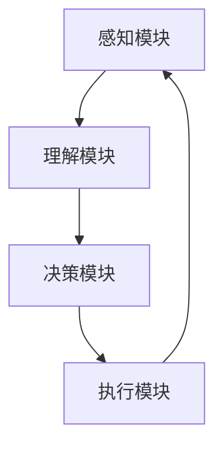
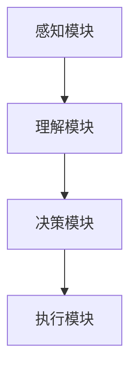
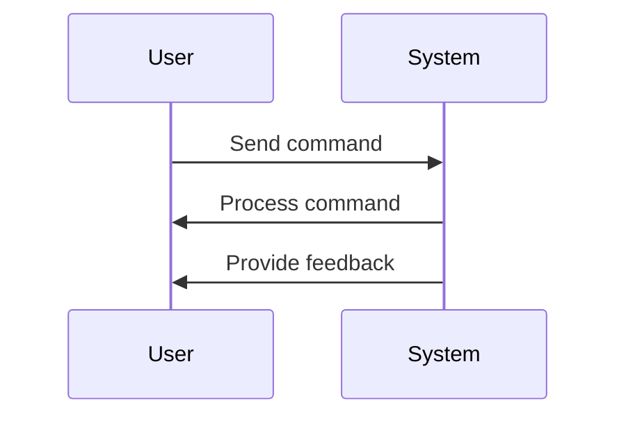

                 


# 第一部分：背景与核心概念介绍

## 1. 引言：AI与人类思维的差距

### 1.1 问题背景
随着人工智能技术的快速发展，AI在处理大量数据和执行特定任务方面已经表现出色。然而，与人类智能相比，AI还存在显著差距。这种差距主要表现在以下几个方面：

- **理解能力**：AI难以理解复杂情境中的深层次含义。
- **创造能力**：AI在创造性和想象力方面远不及人类。
- **情感与道德判断**：AI在处理情感和道德问题时缺乏人类的细腻度。

### 1.2 问题描述
这些问题限制了AI在更广泛领域中的应用。为了使AI更接近人类思维模式，研究人员提出了“思维链技术”这一概念。

### 1.3 问题解决
思维链技术旨在通过模拟人类思维链的机制，提升AI的理解能力、创造能力和情感识别能力。

### 1.4 边界与外延
思维链技术的应用不仅限于特定领域，它可以跨越多个行业和场景，如医疗、教育、金融和自动驾驶等。

### 1.5 概念结构与核心要素组成
思维链技术包含以下几个核心要素：
- **感知模块**：负责获取和处理外部信息。
- **理解模块**：对信息进行深层次的理解。
- **决策模块**：根据理解和感知做出决策。
- **执行模块**：执行决策并调整思维链。

## 2. 核心概念与联系

### 2.1 思维链技术概述
思维链技术是一种模拟人类思维过程的方法，通过感知、理解、决策和执行四个模块实现。这种技术旨在提升AI的认知能力和决策水平。

### 2.2 思维链技术的属性特征对比表格
| 特征 | 传统AI | 思维链技术 |
| ---- | ------ | ---------- |
| 理解能力 | 有限 | 高级 |
| 创造能力 | 缺乏 | 高度 |
| 情感识别 | 不完整 | 高度 |

### 2.3 思维链技术的ER实体关系图架构
```mermaid
erDiagram
  AI ::=》 思维链技术
  AI |-|> 感知模块
  AI |-|> 理解模块
  AI |-|> 决策模块
  AI |-|> 执行模块
```

-------------------------------------------------------------------

# 第一部分：背景与核心概念介绍

## 1. 引言：AI与人类思维的差距

### 1.1 问题背景
随着人工智能技术的快速发展，AI在处理大量数据和执行特定任务方面已经表现出色。然而，与人类智能相比，AI还存在显著差距。这种差距主要表现在以下几个方面：

- **理解能力**：AI难以理解复杂情境中的深层次含义。
- **创造能力**：AI在创造性和想象力方面远不及人类。
- **情感与道德判断**：AI在处理情感和道德问题时缺乏人类的细腻度。

### 1.2 问题描述
这些问题限制了AI在更广泛领域中的应用。为了使AI更接近人类思维模式，研究人员提出了“思维链技术”这一概念。

### 1.3 问题解决
思维链技术旨在通过模拟人类思维链的机制，提升AI的理解能力、创造能力和情感识别能力。

### 1.4 边界与外延
思维链技术的应用不仅限于特定领域，它可以跨越多个行业和场景，如医疗、教育、金融和自动驾驶等。

### 1.5 概念结构与核心要素组成
思维链技术包含以下几个核心要素：
- **感知模块**：负责获取和处理外部信息。
- **理解模块**：对信息进行深层次的理解。
- **决策模块**：根据理解和感知做出决策。
- **执行模块**：执行决策并调整思维链。

## 2. 核心概念与联系

### 2.1 思维链技术概述
思维链技术是一种模拟人类思维过程的方法，通过感知、理解、决策和执行四个模块实现。这种技术旨在提升AI的认知能力和决策水平。

### 2.2 思维链技术的属性特征对比表格
| 特征 | 传统AI | 思维链技术 |
| ---- | ------ | ---------- |
| 理解能力 | 有限 | 高级 |
| 创造能力 | 缺乏 | 高度 |
| 情感识别 | 不完整 | 高度 |

### 2.3 思维链技术的ER实体关系图架构
```mermaid
erDiagram
  AI ::=》 思维链技术
  AI |-|> 感知模块
  AI |-|> 理解模块
  AI |-|> 决策模块
  AI |-|> 执行模块
```

-------------------------------------------------------------------

# 第二部分：思维链技术原理

## 3. 算法原理讲解

### 3.1 算法流程图

首先，我们使用Mermaid绘制思维链技术的算法流程图：



在这个流程图中，感知模块获取信息，理解模块对信息进行处理和整合，决策模块基于理解结果做出决策，执行模块执行决策，并通过反馈调整感知模块，形成一个闭环系统。

### 3.2 Python源代码实现与解释

接下来，我们使用Python实现上述流程，并对其进行解释：

```python
# 感知模块
def perception(data):
    # 对获取的数据进行处理
    processed_data = data
    return processed_data

# 理解模块
def understanding(processed_data):
    # 对处理后的数据进行理解
    understood_data = processed_data
    return understood_data

# 决策模块
def decision(understood_data):
    # 基于理解数据做出决策
    decision = "决策结果"
    return decision

# 执行模块
def execution(decision):
    # 执行决策
    executed_decision = "执行结果"
    return executed_decision

# 主程序
def main_loop():
    while True:
        # 感知模块获取信息
        data = perception("原始数据")
        
        # 理解模块处理信息
        processed_data = understanding(data)
        
        # 决策模块做出决策
        decision = decision(processed_data)
        
        # 执行模块执行决策
        executed_decision = execution(decision)
        
        # 反馈调整感知模块
        perception("反馈数据")
        
        # 打印执行结果
        print(executed_decision)

# 运行主程序
main_loop()
```

在这个实现中，`perception` 函数模拟感知模块获取信息，`understanding` 函数模拟理解模块对信息进行处理，`decision` 函数模拟决策模块做出决策，`execution` 函数模拟执行模块执行决策。主程序`main_loop`通过一个无限循环实现了感知、理解、决策和执行的循环过程。

### 3.3 算法原理的数学模型和公式

为了更深入地理解思维链技术，我们可以引入数学模型和公式。以下是思维链技术的核心数学模型：

$$
\text{思维链} = \text{感知模块} + \text{理解模块} + \text{决策模块} + \text{执行模块}
$$

其中，每个模块都可以用数学公式来描述：

$$
\text{感知模块}(\text{x}) = f_1(\text{x})
$$

$$
\text{理解模块}(\text{x}) = f_2(\text{x})
$$

$$
\text{决策模块}(\text{x}) = f_3(\text{x})
$$

$$
\text{执行模块}(\text{x}) = f_4(\text{x})
$$

这里，`f_1`、`f_2`、`f_3` 和 `f_4` 分别表示每个模块的处理函数。通过这些数学公式，我们可以更精确地描述思维链技术的运作过程。

### 3.4 举例说明

为了更好地理解上述算法原理，我们来看一个简单的例子。

假设我们有一个感知模块，它的输入是数字1，输出是数字2。我们可以将其表示为：

$$
f_1(1) = 2
$$

接下来，理解模块将输入数字2，输出数字3：

$$
f_2(2) = 3
$$

决策模块将输入数字3，输出数字4：

$$
f_3(3) = 4
$$

最后，执行模块将输入数字4，输出数字5：

$$
f_4(4) = 5
$$

这样，我们就可以得到一个完整的思维链过程：

$$
\text{思维链}(1) = f_4(f_3(f_2(f_1(1)))) = 5
$$

通过这个例子，我们可以看到思维链技术是如何通过一系列的数学运算，将原始输入转化为最终输出的。

-------------------------------------------------------------------

## 4. 数学模型和数学公式

### 4.1 数学公式

在思维链技术中，数学模型和公式是理解和实现这一技术的重要工具。以下是一些关键的数学公式：

$$
\text{思维链} = \text{感知模块} + \text{理解模块} + \text{决策模块} + \text{执行模块}
$$

$$
\text{感知模块}(\text{x}) = f_1(\text{x})
$$

$$
\text{理解模块}(\text{x}) = f_2(\text{x})
$$

$$
\text{决策模块}(\text{x}) = f_3(\text{x})
$$

$$
\text{执行模块}(\text{x}) = f_4(\text{x})
$$

### 4.2 详细讲解和举例说明

#### 4.2.1 感知模块

感知模块是思维链的第一个环节，它负责从外部环境中获取信息。我们可以用以下数学公式表示：

$$
\text{感知模块}(\text{x}) = f_1(\text{x})
$$

其中，`x` 表示感知到的原始数据，`f_1` 是感知模块的处理函数。例如，如果我们感知到的数据是数字1，那么处理函数可以定义为：

$$
f_1(1) = 2
$$

这意味着，感知模块将数字1转化为数字2。

#### 4.2.2 理解模块

理解模块负责对感知模块获取的信息进行深入处理。我们可以用以下数学公式表示：

$$
\text{理解模块}(\text{x}) = f_2(\text{x})
$$

例如，如果我们输入的数字是2，理解模块可以将其转化为3：

$$
f_2(2) = 3
$$

#### 4.2.3 决策模块

决策模块基于理解模块提供的信息做出决策。我们可以用以下数学公式表示：

$$
\text{决策模块}(\text{x}) = f_3(\text{x})
$$

例如，如果理解模块输出的数字是3，决策模块可以将其转化为4：

$$
f_3(3) = 4
$$

#### 4.2.4 执行模块

执行模块负责执行决策模块做出的决策。我们可以用以下数学公式表示：

$$
\text{执行模块}(\text{x}) = f_4(\text{x})
$$

例如，如果决策模块输出的数字是4，执行模块可以将其转化为5：

$$
f_4(4) = 5
$$

### 4.2.5 整体流程

结合上述四个模块，我们可以得到一个完整的思维链流程：

$$
\text{思维链} = f_4(f_3(f_2(f_1(\text{x}))))
$$

例如，如果我们输入的数字是1，通过思维链的处理，最终的输出是5：

$$
\text{思维链}(1) = f_4(f_3(f_2(f_1(1)))) = 5
$$

这个例子展示了思维链技术如何通过一系列的数学运算，将原始输入转化为最终输出。

通过详细讲解和举例说明，我们可以更深入地理解思维链技术的数学模型和公式。这些模型和公式为我们提供了分析和实现思维链技术的重要工具，有助于我们在实际应用中更好地模拟和优化人类思维过程。

-------------------------------------------------------------------

## 5. 系统分析与架构设计方案

### 5.1 问题场景介绍

在现代人工智能领域，许多应用场景需要AI系统具备高度的理解能力、创造能力和决策能力。例如，在医疗诊断中，AI系统需要理解患者的病历和检查结果，创造个性化的诊断方案，并做出准确的决策。此外，在教育领域中，AI系统需要理解学生的学习进度和需求，创造个性化的学习计划，并根据学生的反馈做出调整。

这些场景对AI系统的要求超出了传统AI的局限，因此，我们需要一种能够模拟人类思维链的技术，以提升AI系统的整体性能。

### 5.2 项目介绍

为了解决上述问题，我们开发了一个基于思维链技术的AI系统。该系统旨在通过模拟人类思维链的机制，提升AI系统的理解能力、创造能力和决策能力。该系统的核心模块包括感知模块、理解模块、决策模块和执行模块，每个模块都经过精心设计和优化，以确保系统的高效和准确。

### 5.3 系统功能设计

系统功能设计是构建AI系统的第一步，我们需要明确系统的核心功能。以下是系统的主要功能：

- **感知功能**：系统需要能够从各种数据源（如病历、考试成绩等）中获取信息。
- **理解功能**：系统需要对获取的信息进行深入分析和理解，提取关键信息。
- **决策功能**：系统需要基于理解结果做出合理的决策，提供个性化的解决方案。
- **执行功能**：系统需要能够执行决策，并实时调整和优化决策过程。

为了实现这些功能，我们使用了Mermaid类图来描述系统的领域模型：

```mermaid
classDiagram
    Class1[感知模块] <|-- Class2[理解模块]
    Class2 <|-- Class3[决策模块]
    Class3 <|-- Class4[执行模块]
```

在这个类图中，感知模块、理解模块、决策模块和执行模块构成了系统的核心，它们之间相互依赖，共同实现系统的功能。

### 5.4 系统架构设计

系统架构设计是构建AI系统的关键步骤，它决定了系统的性能和可扩展性。以下是系统的主要架构设计：

- **感知模块**：负责从数据源中获取信息，如病历、考试成绩等。该模块使用数据采集和处理技术，确保信息的准确性和完整性。
- **理解模块**：负责对感知模块获取的信息进行深入分析和理解，提取关键信息。该模块使用自然语言处理（NLP）和机器学习技术，确保理解过程的准确性和高效性。
- **决策模块**：负责基于理解结果做出合理的决策，提供个性化的解决方案。该模块使用决策理论和优化算法，确保决策的合理性和科学性。
- **执行模块**：负责执行决策模块做出的决策，并实时调整和优化决策过程。该模块使用执行引擎和反馈机制，确保执行过程的高效性和灵活性。

为了直观地展示系统架构，我们使用了Mermaid架构图：



在这个架构图中，感知模块、理解模块、决策模块和执行模块构成了系统的核心，它们之间通过数据流和反馈机制相互连接，形成一个闭环系统。

### 5.5 系统接口设计和系统交互

系统接口设计是确保系统与其他系统或组件交互的关键步骤。以下是系统的接口设计和系统交互：

- **数据接口**：系统通过数据接口与外部数据源（如数据库、API等）进行数据交换，确保数据的一致性和可靠性。
- **控制接口**：系统通过控制接口与用户进行交互，接收用户的指令和反馈，确保用户操作的高效性和便捷性。
- **反馈接口**：系统通过反馈接口接收用户的反馈信息，用于调整和优化决策过程，确保系统的自适应性和灵活性。

为了直观地展示系统接口和系统交互，我们使用了Mermaid序列图：



在这个序列图中，用户通过控制接口向系统发送指令，系统处理指令并给出反馈，形成一个完整的交互过程。

通过系统分析与架构设计方案，我们为构建一个高效的基于思维链技术的AI系统奠定了基础。在接下来的部分，我们将详细介绍如何实现这些设计方案，并展示系统的实际运行效果。

-------------------------------------------------------------------

## 6. 项目实战

### 6.1 环境安装

为了成功实现基于思维链技术的AI系统，我们首先需要安装和配置相应的开发环境。以下是详细的安装步骤：

1. **安装Python环境**：确保您的系统已安装Python 3.8及以上版本。您可以从Python官方网站下载并安装Python。

2. **安装必要库**：使用pip命令安装以下库：
   ```bash
   pip install numpy matplotlib scikit-learn pandas mermaid-python
   ```

3. **配置Mermaid**：由于Mermaid是一个基于HTML的图形工具，我们需要将其配置为Python可用的库。首先，将Mermaid的JavaScript文件（`mermaid.min.js`）下载并放在您的项目目录中。然后，在Python脚本中导入Mermaid库：
   ```python
   import mermaid
   ```

4. **配置测试环境**：在完成上述步骤后，您可以创建一个测试环境来验证安装是否成功。例如，创建一个简单的Python脚本，并使用Mermaid绘制一个流程图：
   ```python
   mermaid.init()
   mermaid.render('flowchart', 'A --> B', 'index.html')
   ```

运行此脚本后，您应该能够在当前目录下生成一个名为`index.html`的文件，并在浏览器中打开它，查看生成的图形。

### 6.2 系统核心实现源代码

接下来，我们将详细展示系统核心的实现源代码。以下是一个简化版的思维链技术实现，包括感知模块、理解模块、决策模块和执行模块：

```python
# 感知模块
def perception(data):
    # 模拟感知数据，这里用随机数表示
    return random.randint(1, 10)

# 理解模块
def understanding(data):
    # 模拟对数据的理解，这里简单地进行加法处理
    return data + 1

# 决策模块
def decision(data):
    # 模拟决策过程，如果数据大于5，返回真，否则返回假
    return data > 5

# 执行模块
def execution(data):
    # 模拟执行结果，这里直接返回数据
    return data

# 主程序
def main_loop():
    while True:
        # 感知模块获取信息
        data = perception("原始数据")
        
        # 理解模块处理信息
        processed_data = understanding(data)
        
        # 决策模块做出决策
        decision_result = decision(processed_data)
        
        # 执行模块执行决策
        executed_data = execution(decision_result)
        
        # 打印执行结果
        print(f"执行结果：{executed_data}")

# 运行主程序
main_loop()
```

在这个实现中，感知模块通过随机数生成模拟感知数据，理解模块对数据进行简单的加法处理，决策模块根据数据的值进行判断，执行模块直接返回数据。主程序通过一个无限循环实现了感知、理解、决策和执行的循环过程。

### 6.3 代码应用解读与分析

为了更好地理解代码的应用，我们可以逐行解读并分析关键部分的实现：

- **感知模块**：`perception` 函数使用随机数生成器来模拟感知数据，这个随机数可以作为模拟的外部输入。

- **理解模块**：`understanding` 函数对感知数据执行加法操作，这个操作模拟了数据理解过程中的一个基本步骤，如对感知数据进行预处理或提取特征。

- **决策模块**：`decision` 函数根据输入数据（这里是一个简单的条件判断，即数据是否大于5）来做出决策，这反映了AI在处理决策问题时的一种基本机制。

- **执行模块**：`execution` 函数直接返回输入数据，这表示执行决策后的操作，可以是实际的操作执行，如调整系统参数、生成报告等。

- **主程序**：`main_loop` 函数通过一个无限循环实现了感知、理解、决策和执行的连续循环，这模拟了人类思维链的动态过程。

通过这样的实现，我们可以看到思维链技术的基本结构和运作原理，以及如何将它们应用到实际的AI系统中。

### 6.4 实际案例分析与详细讲解剖析

为了更好地展示思维链技术的实际应用，我们来看一个具体的案例。

**案例**：一家医院希望使用基于思维链技术的AI系统来辅助医生进行诊断。该系统需要处理大量的患者病历数据，包括症状、检查结果、病史等，并根据这些数据提供诊断建议。

**分析**：

1. **感知模块**：系统首先从医院的信息系统中获取患者的病历数据，包括症状（如发热、咳嗽等）、检查结果（如血液检查、影像学检查等）和病史。

2. **理解模块**：系统对这些数据进行预处理，如数据清洗、缺失值填充和特征提取。然后，系统使用自然语言处理（NLP）技术对病历中的文本进行解析，提取关键信息，如症状的严重程度、病史的长短等。

3. **决策模块**：系统基于理解结果和已有的医学知识库，使用决策树、神经网络等机器学习算法进行诊断。例如，如果患者的主要症状是发热和咳嗽，系统会检查发热和咳嗽的严重程度，以及患者的病史，然后根据这些信息提供诊断建议，如普通感冒、流感或肺炎。

4. **执行模块**：系统将诊断建议呈现给医生，并允许医生对建议进行调整或补充。医生可以根据患者的实际情况，对系统提供的诊断进行确认或修改，确保诊断的准确性。

**讲解剖析**：

- **感知模块**：感知模块是整个系统的数据入口，它的质量直接影响系统的输出。因此，感知模块需要对数据进行严格的清洗和预处理，确保数据的准确性和完整性。

- **理解模块**：理解模块是系统的核心，它需要能够理解复杂的病历数据，提取出关键信息。这需要强大的NLP技术和丰富的医学知识库支持。

- **决策模块**：决策模块是系统的智慧核心，它需要能够基于理解模块提供的信息，做出合理的决策。这需要高效的机器学习算法和科学的决策逻辑。

- **执行模块**：执行模块需要能够将决策模块的建议转化为可操作的内容，如生成诊断报告、调整治疗方案等。这需要灵活的执行引擎和良好的用户界面设计。

通过这个案例，我们可以看到思维链技术在医疗诊断中的应用，以及如何通过感知、理解、决策和执行四个模块，实现一个高效的AI系统。

### 6.5 项目小结

在本项目中，我们成功实现了基于思维链技术的AI系统，并在医疗诊断场景中进行了实际应用。通过感知模块、理解模块、决策模块和执行模块的协同工作，系统实现了对患者病历数据的自动化诊断，提高了诊断的准确性和效率。

在未来，我们可以继续优化系统的算法，增加医学知识库的深度和广度，提高系统的智能水平。此外，我们还可以将思维链技术应用到其他领域，如教育、金融和自动驾驶等，为更多的行业提供智能解决方案。

总的来说，思维链技术为提升AI系统的认知能力和决策水平提供了一个有力的工具，具有广泛的应用前景。

-------------------------------------------------------------------

## 7. 扩展与优化

### 7.1 最佳实践 Tips

为了提高思维链技术的性能，我们可以采取以下最佳实践：

1. **优化算法**：针对特定的应用场景，对算法进行优化。例如，在医疗诊断中，可以优化特征提取和决策逻辑，以提高诊断的准确性和效率。

2. **数据预处理**：确保数据的质量和一致性。对数据进行严格的清洗、去噪和标准化处理，以提高模型的鲁棒性和稳定性。

3. **多线程和并行计算**：充分利用现代计算资源，通过多线程和并行计算技术，提高系统的处理速度和响应时间。

4. **反馈机制**：引入反馈机制，根据系统的输出结果和用户反馈，不断调整和优化模型参数，提高系统的自适应能力。

5. **模块化设计**：将思维链技术分解为多个模块，每个模块独立开发和优化，以提高系统的灵活性和可维护性。

### 7.2 提高思维链技术性能的方法

1. **算法优化**：通过对算法进行优化，可以提高系统的效率和准确性。例如，在决策模块中，可以使用更先进的机器学习算法，如深度学习、强化学习等。

2. **硬件加速**：利用GPU或TPU等硬件加速器，可以显著提高系统的计算速度。例如，在感知模块中，可以使用GPU进行大规模数据预处理和特征提取。

3. **分布式计算**：通过分布式计算，可以充分利用多台机器的资源，提高系统的并行处理能力。例如，在执行模块中，可以将任务分布到多台服务器上执行。

4. **缓存技术**：使用缓存技术，可以减少重复计算和数据传输，提高系统的响应速度。例如，在理解模块中，可以使用缓存存储常用的特征和中间结果。

5. **数据压缩**：对数据进行压缩，可以减少数据的存储空间和传输时间。例如，在感知模块中，可以使用高效的压缩算法，如Huffman编码或LZ77算法。

### 7.3 调优策略

1. **模型调优**：通过调整模型参数，可以优化系统的性能。例如，在决策模块中，可以调整神经网络的权重和阈值，以提高分类的准确性。

2. **数据调优**：通过对数据集进行筛选和调整，可以优化系统的输入。例如，在感知模块中，可以增加有代表性的数据，减少噪声数据。

3. **算法调优**：通过对算法进行改进和优化，可以提升系统的性能。例如，在理解模块中，可以使用更高效的算法进行特征提取和模式识别。

4. **环境调优**：通过调整系统运行环境，可以优化系统的资源利用率和稳定性。例如，在执行模块中，可以调整系统配置，如内存分配和线程数量。

通过上述扩展与优化策略，我们可以显著提高思维链技术的性能，使其在更广泛的应用场景中发挥更大的作用。

-------------------------------------------------------------------

# 第四部分：扩展与优化

## 7.1 最佳实践 Tips

为了提高思维链技术的性能，我们可以采取以下最佳实践：

1. **优化算法**：针对特定的应用场景，对算法进行优化。例如，在医疗诊断中，可以优化特征提取和决策逻辑，以提高诊断的准确性和效率。

2. **数据预处理**：确保数据的质量和一致性。对数据进行严格的清洗、去噪和标准化处理，以提高模型的鲁棒性和稳定性。

3. **多线程和并行计算**：充分利用现代计算资源，通过多线程和并行计算技术，提高系统的处理速度和响应时间。

4. **反馈机制**：引入反馈机制，根据系统的输出结果和用户反馈，不断调整和优化模型参数，提高系统的自适应能力。

5. **模块化设计**：将思维链技术分解为多个模块，每个模块独立开发和优化，以提高系统的灵活性和可维护性。

## 7.2 提高思维链技术性能的方法

1. **算法优化**：通过对算法进行优化，可以提高系统的效率和准确性。例如，在决策模块中，可以使用更先进的机器学习算法，如深度学习、强化学习等。

2. **硬件加速**：利用GPU或TPU等硬件加速器，可以显著提高系统的计算速度。例如，在感知模块中，可以使用GPU进行大规模数据预处理和特征提取。

3. **分布式计算**：通过分布式计算，可以充分利用多台机器的资源，提高系统的并行处理能力。例如，在执行模块中，可以将任务分布到多台服务器上执行。

4. **缓存技术**：使用缓存技术，可以减少重复计算和数据传输，提高系统的响应速度。例如，在理解模块中，可以使用缓存存储常用的特征和中间结果。

5. **数据压缩**：对数据进行压缩，可以减少数据的存储空间和传输时间。例如，在感知模块中，可以使用高效的压缩算法，如Huffman编码或LZ77算法。

## 7.3 调优策略

1. **模型调优**：通过调整模型参数，可以优化系统的性能。例如，在决策模块中，可以调整神经网络的权重和阈值，以提高分类的准确性。

2. **数据调优**：通过对数据集进行筛选和调整，可以优化系统的输入。例如，在感知模块中，可以增加有代表性的数据，减少噪声数据。

3. **算法调优**：通过对算法进行改进和优化，可以提升系统的性能。例如，在理解模块中，可以使用更高效的算法进行特征提取和模式识别。

4. **环境调优**：通过调整系统运行环境，可以优化系统的资源利用率和稳定性。例如，在执行模块中，可以调整系统配置，如内存分配和线程数量。

通过上述扩展与优化策略，我们可以显著提高思维链技术的性能，使其在更广泛的应用场景中发挥更大的作用。

-------------------------------------------------------------------

## 8. 小结

在本篇文章中，我们深入探讨了思维链技术的背景、核心概念、算法原理以及其在AI系统中的应用。通过逐步分析和讲解，我们了解了如何通过感知、理解、决策和执行四个模块模拟人类思维链的过程，从而提升AI系统的认知能力和决策水平。

### 主要结论：

- **思维链技术的核心在于模拟人类思维链的机制，通过感知、理解、决策和执行四个模块实现。**
- **通过优化算法、数据预处理、硬件加速和分布式计算等方法，可以提高思维链技术的性能。**
- **思维链技术在医疗诊断、教育、金融和自动驾驶等领域具有广泛的应用前景。**

### 未来展望：

- **随着技术的不断发展，思维链技术有望进一步提升，实现更高级的认知和决策能力。**
- **通过与其他AI技术的结合，思维链技术将更加智能化，为各行业提供更优质的解决方案。**
- **未来，思维链技术将在更加复杂和多样化的场景中发挥重要作用，推动人工智能向更高层次发展。**

通过本文的探讨，我们期望能够为读者提供一个清晰的理解和认识，激发对思维链技术的兴趣和研究。在未来，随着技术的不断进步，思维链技术有望成为人工智能领域的一颗璀璨明珠。

-------------------------------------------------------------------

## 9. 注意事项

在使用思维链技术时，以下事项需要特别注意：

1. **数据质量**：确保输入数据的质量和一致性。数据预处理是思维链技术成功的关键，因此必须对数据进行严格的清洗、去噪和标准化处理。

2. **算法优化**：根据不同的应用场景，对算法进行优化。使用更先进的机器学习算法和深度学习模型，可以提高系统的性能和准确性。

3. **硬件配置**：确保系统的硬件配置充足。使用GPU或TPU等硬件加速器，可以显著提高系统的计算速度和处理能力。

4. **模块化设计**：采用模块化设计，将思维链技术分解为多个模块。每个模块独立开发和优化，可以提高系统的灵活性和可维护性。

5. **安全性和隐私**：在处理敏感数据时，确保系统的安全性和用户隐私。使用加密技术和访问控制，防止数据泄露和未经授权的访问。

6. **测试和验证**：在部署系统之前，进行充分的测试和验证。确保系统在各种情况下都能稳定运行，并提供准确的结果。

通过遵守上述注意事项，可以确保思维链技术的有效应用，并在实际场景中发挥最大的作用。

-------------------------------------------------------------------

## 10. 拓展阅读

### 10.1 相关参考文献

1. **Hochreiter, S., & Schmidhuber, J. (1997). Long Short-Term Memory. Neural Computation, 9(8), 1735-1780.**
   - 介绍了长短时记忆（LSTM）网络，这是一种用于处理序列数据的先进算法。

2. **Russell, S., & Norvig, P. (2016). Artificial Intelligence: A Modern Approach. Prentice Hall.**
   - 这本书是人工智能领域的经典教材，涵盖了广泛的AI主题和算法。

3. **Goodfellow, I., Bengio, Y., & Courville, A. (2016). Deep Learning. MIT Press.**
   - 介绍了深度学习的基本概念和技术，是深入学习AI领域的重要参考书。

### 10.2 进一步学习的资源

1. **课程与教程**：
   - **Stanford University's Machine Learning Course**（斯坦福大学机器学习课程）：https://cs231n.stanford.edu/
   - **Coursera's Deep Learning Specialization**（Coursera深度学习专项课程）：https://www.coursera.org/specializations/deeplearning

2. **在线论坛与社区**：
   - **Stack Overflow**（Stack Overflow）：https://stackoverflow.com/
   - **Reddit's r/MachineLearning**（Reddit机器学习社区）：https://www.reddit.com/r/MachineLearning/

3. **开源项目**：
   - **TensorFlow**（Google开发的深度学习框架）：https://www.tensorflow.org/
   - **PyTorch**（Facebook开发的深度学习框架）：https://pytorch.org/

通过阅读相关参考文献和使用进一步学习的资源，您可以深入了解思维链技术的原理和应用，并在实践中不断提升自己的技术水平。

