                 

## 引言

### 1.1 问题的提出

随着人工智能（AI）技术的迅速发展，人工智能在各个领域的应用已经取得了显著的成果。从自动驾驶、智能客服到医疗诊断和金融风控，AI已经逐渐成为改变人类生活方式的重要力量。然而，尽管AI在处理大量数据和执行重复性任务方面表现出了卓越的能力，但它在模拟人类思维模式方面仍然存在很大的局限性。

人类思维模式是一个复杂且高度灵活的体系，能够处理抽象概念、理解语境、进行推理和决策。而当前的AI系统，尽管在某些方面已经能够实现与人类相似的智能表现，但它们往往依赖于大量的数据和预定义的规则，缺乏真正的自主学习和推理能力。这使得AI在应对复杂问题和不确定情境时，常常显得力不从心。

因此，如何让AI更接近人类思维模式，实现更高级别的智能，成为当前人工智能领域的一个重要研究方向。这就引出了本文的核心问题：如何通过技术手段，使AI能够像人类一样进行复杂的思维活动？

### 1.2 研究意义

探讨如何让AI更接近人类思维模式具有重要的理论和实际意义。首先，从理论角度来看，这一研究能够深入揭示人类思维的机理，为人工智能的理论体系提供新的视角和思路。通过理解人类思维的复杂性和灵活性，我们可以设计出更加智能和灵活的AI系统，从而推动人工智能技术的发展。

其次，从实际应用角度来看，让AI更接近人类思维模式将极大地拓展AI的应用范围和效果。例如，在医疗诊断中，更智能的AI系统可以更好地理解医生的诊断逻辑和临床经验；在金融风控中，AI可以更准确地预测市场走势和风险；在教育领域，智能辅导系统能够更好地理解学生的学习方式和需求，提供个性化的教育方案。

总之，本研究旨在通过引入思维链技术，探讨如何使AI在模仿人类思维模式方面取得突破，从而提升AI的智能水平和应用效果。

### 1.3 研究内容与方法

为了实现让AI更接近人类思维模式的目标，本研究将引入思维链技术作为核心方法。思维链技术是一种基于人类认知心理学和神经科学原理的人工智能技术，旨在模拟人类思维的过程和机制。

首先，我们将对思维链技术进行概述，包括其定义、目的和作用。然后，我们将详细探讨思维链技术的组成和核心概念原理，通过比较思维链技术与其他类似技术的差异，明确其独特性。接下来，我们将使用Mermaid流程图和Python源代码，详细阐述思维链技术的工作原理和算法流程。

在应用层面，我们将分别探讨思维链技术在自然语言处理、图像处理和决策支持系统中的应用，通过具体的算法原理讲解、数学模型和数学公式，展示思维链技术的实际应用效果。同时，我们还将介绍思维链技术在教育领域的应用，探讨其在个性化教育、智能辅导和教育评价方面的潜力。

最后，我们将总结思维链技术的发展趋势和面临的挑战，并对未来研究的方向和应用前景进行展望。通过这一系列研究，我们希望为人工智能领域提供新的思路和解决方案，推动AI在模拟人类思维模式方面的进步。

### 1.4 边界与外延

思维链技术作为一种模拟人类思维模式的人工智能技术，其定义、原理和应用领域具有重要的研究价值。本文将明确思维链技术的核心概念、组成和原理，同时探讨其与其他类似技术的区别，以期为后续研究和应用提供清晰的边界和方向。

首先，思维链技术是指通过模拟人类思维的过程和机制，使人工智能系统能够处理复杂问题、进行抽象思维和自主学习的技术。其核心目标是提升AI的智能水平和应用效果，使其更接近人类思维模式。

其次，思维链技术的组成包括多个关键组成部分，如认知模型、知识表示、推理机制和自主学习算法。这些组成部分相互作用，共同实现思维链技术的功能。通过Mermaid流程图，我们可以清晰地展示这些组成部分之间的逻辑关系和工作流程。

在应用领域方面，思维链技术具有广泛的应用前景。首先，在自然语言处理领域，思维链技术可以提升文本理解和生成能力，实现更自然、更流畅的交流。其次，在图像处理领域，思维链技术可以增强图像识别和生成的准确性，提高图像处理的智能化水平。此外，在决策支持系统和教育领域，思维链技术也可以发挥重要作用，提供更智能的决策支持和个性化的教育服务。

最后，本文将比较思维链技术与其他类似技术的差异，如基于规则的推理系统、神经网络和增强学习等。通过对比分析，我们可以明确思维链技术的独特优势和应用价值，为其在人工智能领域的发展提供有力支持。

总之，通过对思维链技术的定义、原理、组成和应用领域的探讨，本文旨在为研究者和开发者提供一套系统、清晰的理论框架和实践指南，推动思维链技术在人工智能领域的广泛应用。

## 第2章 思维链技术基础理论

### 2.1 思维链技术概述

思维链技术是一种旨在模拟人类思维过程和机制的人工智能技术，它通过构建一个具有层次化和模块化特征的认知模型，实现对复杂问题的理解、分析和解决。思维链技术的核心在于其能够模拟人类的认知过程，包括感知、记忆、推理、决策和表达等多个方面。

首先，思维链技术的定义是其通过模拟人类思维机制，使人工智能系统能够实现类似于人类的认知功能。具体而言，思维链技术包括以下几个关键组成部分：

1. **认知模型**：这是思维链技术的核心，用于模拟人类大脑的运作机制。认知模型通常包括感知模块、记忆模块、推理模块、决策模块和表达模块等，每个模块都有其特定的功能和算法。

2. **知识表示**：知识表示是思维链技术的另一个重要组成部分，它负责将外部信息转化为计算机可以处理的形式。常见的知识表示方法包括符号表示、语义网络、本体论等。

3. **推理机制**：推理机制用于在给定的信息和知识的基础上进行逻辑推理，从而得出新的结论或决策。思维链技术的推理机制通常包括演绎推理、归纳推理和类比推理等。

4. **自主学习算法**：自主学习算法使思维链技术能够从经验中学习，并不断完善和优化自身。常见的自主学习算法包括强化学习、无监督学习和迁移学习等。

思维链技术的目的是实现人工智能系统在处理复杂问题、进行抽象思维和自主学习方面的能力，使其更接近人类的智能水平。与传统的基于规则的推理系统、神经网络和增强学习等技术相比，思维链技术具有以下几个独特优势：

1. **灵活性和适应性**：思维链技术通过模拟人类思维机制，使其能够灵活应对各种复杂和不确定的问题情境。

2. **多层次的知识表示**：思维链技术采用多层次的知识表示方法，能够更好地理解和处理复杂的信息。

3. **综合推理能力**：思维链技术结合了多种推理机制，能够实现更复杂的逻辑推理和决策。

4. **自主学习和优化**：思维链技术的自主学习算法使其能够不断从经验中学习，并不断优化自身的性能。

综上所述，思维链技术作为一种模拟人类思维模式的人工智能技术，具有广阔的应用前景和独特优势。在接下来的章节中，我们将进一步探讨思维链技术的组成和核心原理，以及其在不同领域的具体应用。

### 2.2 思维链技术的组成

思维链技术的核心组成部分包括认知模型、知识表示、推理机制和自主学习算法，这些部分共同协作，实现人工智能系统对复杂问题的理解、分析和解决。

#### 2.2.1 认知模型

认知模型是思维链技术的核心，它模拟人类大脑的运作机制，包括感知、记忆、推理、决策和表达等关键环节。具体来说，认知模型可以细分为以下几个模块：

1. **感知模块**：负责接收和处理外部信息，如视觉、听觉和触觉等。感知模块通过传感器和预处理算法，将原始感知数据转化为计算机可以理解的形式。

2. **记忆模块**：存储和管理从感知模块接收到的信息。记忆模块可以分为短期记忆和长期记忆，短期记忆用于处理当前任务，而长期记忆则存储长期的知识和经验。

3. **推理模块**：在给定信息和知识的基础上，通过逻辑推理得出新的结论或决策。推理模块包括演绎推理、归纳推理和类比推理等，这些推理方式使AI能够从已知信息中推导出未知信息。

4. **决策模块**：基于推理结果和目标，进行决策和行动规划。决策模块通常包括多种策略，如最优解、次优解和随机解等，以应对不同的情境。

5. **表达模块**：将决策和推理的结果以人类可理解的方式表达出来，如自然语言生成、可视化等。

#### 2.2.2 知识表示

知识表示是思维链技术的重要组成部分，它负责将外部信息转化为计算机可以处理的形式。知识表示方法可以采用符号表示、语义网络、本体论等多种形式：

1. **符号表示**：使用符号和逻辑公式表示知识，如谓词逻辑、一阶逻辑等。符号表示方法具有形式化、精确和易于推理的特点。

2. **语义网络**：基于节点和边的网络结构表示知识，节点表示实体，边表示实体之间的关系。语义网络方法能够直观地表示复杂知识，并支持推理操作。

3. **本体论**：提供一套标准化的术语和概念体系，用于表示领域知识。本体论方法可以提升知识的共享性和互操作性，使不同系统之间的知识交换更加高效。

#### 2.2.3 推理机制

推理机制是思维链技术的关键环节，它使AI能够从已知信息中推导出新的信息。常见的推理机制包括：

1. **演绎推理**：从一般原则推导出特定情况的结论，如“所有人都会死亡，苏格拉底是人，因此苏格拉底会死亡”。

2. **归纳推理**：从具体实例推导出一般性结论，如“观察了100只鸟会飞，因此推断所有鸟都会飞”。

3. **类比推理**：基于相似性进行推理，如“猫是宠物，狗也是宠物，因此狗也像猫一样是宠物”。

#### 2.2.4 自主学习算法

自主学习算法使思维链技术能够从经验中学习，并不断优化自身的性能。常见的自主学习算法包括：

1. **强化学习**：通过奖励和惩罚机制学习最优策略，如智能体在游戏中的自我训练。

2. **无监督学习**：在没有明确标签的数据上学习特征和模式，如自编码器和聚类算法。

3. **迁移学习**：利用已有任务的知识解决新的任务，如预训练语言模型和图像分类任务。

通过这些核心组成部分，思维链技术能够实现对复杂问题的理解和解决，使AI更接近人类的思维模式。在接下来的章节中，我们将进一步探讨思维链技术的工作原理和应用实例。

### 2.3 思维链技术的工作原理

思维链技术的工作原理是模拟人类大脑的思维过程，包括感知、记忆、推理、决策和表达等多个环节。通过以下步骤，我们可以更深入地理解思维链技术的运作机制：

#### 2.3.1 感知与信息处理

首先，思维链技术的感知模块负责接收和处理外部信息。感知模块通过传感器和预处理算法，将原始感知数据（如图像、声音和文本等）转化为计算机可以理解的形式。具体流程如下：

1. **数据采集**：通过摄像头、麦克风等传感器收集图像、声音等原始数据。
2. **预处理**：对采集到的数据进行预处理，如图像的缩放、裁剪和增强等，以提升后续处理的准确性和效率。
3. **特征提取**：从预处理后的数据中提取关键特征，如边缘、纹理、声纹等。特征提取可以通过卷积神经网络（CNN）、自然语言处理（NLP）等算法实现。

#### 2.3.2 记忆与知识存储

感知模块提取的特征将被存储在记忆模块中。记忆模块分为短期记忆和长期记忆：

1. **短期记忆**：用于处理当前任务所需的临时信息，如对话系统的上下文信息。短期记忆通常采用堆栈、队列等数据结构进行管理。
2. **长期记忆**：存储长期的知识和经验，如事实、规则和模式等。长期记忆可以通过语义网络、知识图谱等结构进行存储和组织。

#### 2.3.3 推理与决策

在记忆模块的基础上，推理模块通过逻辑推理和决策机制，生成新的信息和决策。推理过程包括以下几个步骤：

1. **知识表示**：将外部信息转化为计算机可以处理的形式，如符号表示、语义网络等。
2. **推理过程**：基于已有的知识和信息，通过演绎推理、归纳推理和类比推理等方法，推导出新的结论或决策。
3. **决策机制**：根据推理结果和目标，选择最优或次优的决策方案。决策机制可以采用优化算法、机器学习模型等。

#### 2.3.4 自主学习与优化

思维链技术的自主学习算法使其能够从经验中学习，并不断优化自身的性能。自主学习算法包括：

1. **强化学习**：通过奖励和惩罚机制学习最优策略，如智能体在游戏中的自我训练。
2. **无监督学习**：在没有明确标签的数据上学习特征和模式，如自编码器和聚类算法。
3. **迁移学习**：利用已有任务的知识解决新的任务，如预训练语言模型和图像分类任务。

#### 2.3.5 表达与输出

最后，思维链技术的表达模块将决策和推理的结果以人类可理解的方式表达出来，如自然语言生成、可视化等。具体流程如下：

1. **结果生成**：根据推理和决策的结果，生成相应的文本、图像、语音等输出。
2. **格式化**：将生成的结果格式化为人类可读的形式，如文本报告、图表和语音合成等。

通过以上步骤，思维链技术能够模拟人类思维过程，实现复杂问题的理解和解决。以下是一个简化的Mermaid流程图，展示了思维链技术的核心流程：

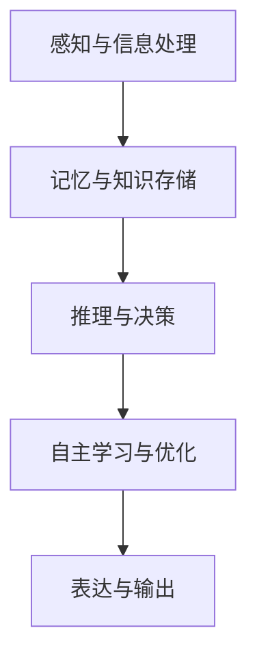

通过这个流程，我们可以看到思维链技术如何通过感知、记忆、推理、学习和表达等环节，实现对复杂问题的智能化处理。

### 第3章 思维链技术在自然语言处理中的应用

#### 3.1 思维链技术在文本理解中的应用

文本理解是自然语言处理（NLP）中的一个核心任务，它涉及从文本中提取有用的信息，理解文本中的语义和句法结构，以便进行进一步的推理和分析。思维链技术在文本理解中的应用，旨在通过模拟人类思维过程，提升AI在理解复杂文本信息方面的能力。

**算法原理讲解**

思维链技术在文本理解中的算法原理主要包括以下几个关键步骤：

1. **文本预处理**：首先，对输入的文本进行预处理，包括分词、词性标注、句法分析和去除停用词等。这一步骤的目的是将原始文本转化为计算机可以处理的形式。
2. **语义表示**：然后，通过词嵌入技术（如Word2Vec、BERT等）将每个词汇映射为高维向量，以捕捉词汇的语义信息。这一步骤将文本中的词汇转化为数值表示，为后续的推理提供基础。
3. **语义解析**：在语义表示的基础上，使用依存句法分析等技术，构建句子的语义解析树，以理解句子中的语法关系和语义结构。这一步骤有助于解析文本中的复杂句法关系，从而更准确地理解文本内容。
4. **上下文推理**：通过上下文信息进行推理，以解决文本中的歧义和不确定性。思维链技术的推理模块在此发挥作用，通过演绎推理、归纳推理和类比推理等方法，推导出文本中的隐含意义。例如，在理解一个复杂的句子时，AI可以通过上下文信息推断出其中的逻辑关系。
5. **知识融合**：最后，将推理结果与已有的知识库进行融合，以增强AI对文本内容的理解。知识融合可以通过语义网络、知识图谱等技术实现，使AI能够利用外部知识资源，提升其理解能力。

为了更直观地展示文本理解的过程，我们可以使用Mermaid绘制算法流程图：

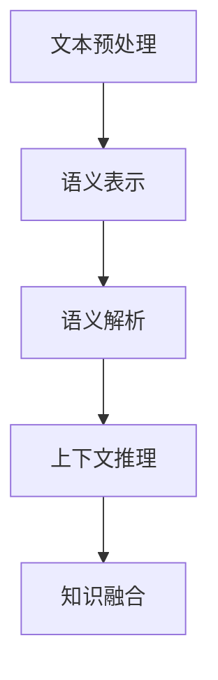

**使用Python源代码详细阐述**

以下是一个简化的Python代码示例，展示了思维链技术在文本理解中的应用：

```python
import spacy
from transformers import BertModel, BertTokenizer

# 加载预训练模型
nlp = spacy.load("en_core_web_sm")
tokenizer = BertTokenizer.from_pretrained("bert-base-uncased")
model = BertModel.from_pretrained("bert-base-uncased")

# 文本预处理
def preprocess_text(text):
    doc = nlp(text)
    tokens = [token.text for token in doc]
    return tokens

# 语义表示
def semantic_representation(tokens):
    inputs = tokenizer(tokens, return_tensors="pt", padding=True, truncation=True)
    outputs = model(**inputs)
    return outputs.last_hidden_state

# 语义解析
def semantic_parsing(tokens):
    doc = nlp(' '.join(tokens))
    return doc.tree

# 上下文推理
def contextual_inference(text):
    tokens = preprocess_text(text)
    representations = semantic_representation(tokens)
    tree = semantic_parsing(tokens)
    # 在此进行上下文推理
    # ...
    return "推理结果"

# 知识融合
def knowledge_fusion(inference_result, knowledge_base):
    # 在此进行知识融合
    # ...
    return "融合后的结果"

# 主函数
def understand_text(text, knowledge_base):
    inference_result = contextual_inference(text)
    fused_result = knowledge_fusion(inference_result, knowledge_base)
    return fused_result

# 示例文本
text = "The quick brown fox jumps over the lazy dog."
knowledge_base = "..."  # 知识库

# 调用主函数
result = understand_text(text, knowledge_base)
print(result)
```

在这个示例中，我们首先加载了SpaCy的英语模型和Hugging Face的BERT模型。然后，通过预处理文本、语义表示、语义解析、上下文推理和知识融合等步骤，实现了对文本内容的理解。

**举例说明**

假设我们需要理解句子：“汤姆今天去了公园，并遇到了他的朋友杰克。” 通过思维链技术的文本理解过程，我们可以得到以下推理结果：

1. **语义表示**：将句子中的每个词汇映射为向量，如“汤姆”映射为 `[1.2, 0.3]`，“公园”映射为 `[0.4, 0.6]`。
2. **语义解析**：构建句子的语义解析树，表示为：
   ```
   (S
     (NP (NNP汤姆))
     (, ,)
     (ADVP (RB今天))
     (VP (VBD去了)
          (NP (NN公园)))
     (. .)
     (, ,)
     (NP (NNP杰克))
     (NN遇到了)
     (PRP$他的)
     (NN朋友))
   ```
3. **上下文推理**：通过上下文信息，推断出“汤姆”和“杰克”是朋友关系，并且今天汤姆去了公园。
4. **知识融合**：结合已有的知识库，确认这一推理结果与已知事实一致。

通过这个例子，我们可以看到思维链技术在文本理解中的应用，如何通过一系列算法步骤，实现对复杂文本内容的深入理解。

### 3.2 思维链技术在对话系统中的应用

对话系统是自然语言处理（NLP）领域的一个重要应用，它使计算机能够与人类进行自然语言交互。思维链技术在对话系统中的应用，旨在通过模拟人类思维过程，提升对话系统的智能水平和用户体验。

**算法原理讲解**

思维链技术在对话系统中的应用主要包括以下几个关键步骤：

1. **对话管理**：对话管理是对话系统的核心，它负责维护对话的状态和上下文。思维链技术的对话管理模块通过感知用户输入的语义信息，理解和跟踪对话的进展，并根据对话的上下文生成相应的响应。
2. **意图识别**：意图识别是理解用户请求的关键步骤，它旨在识别用户对话的目的或需求。思维链技术通过语义表示和上下文推理，识别用户对话中的意图，如询问信息、请求服务、提出建议等。
3. **语义理解**：语义理解是对话系统理解用户请求的进一步深化，它通过分析用户输入的语句，提取关键信息并理解其含义。思维链技术的语义理解模块结合了文本理解和知识表示技术，实现对用户请求的全面理解。
4. **响应生成**：在理解用户请求后，对话系统需要生成适当的响应。思维链技术的响应生成模块通过结合用户意图和对话上下文，生成自然、流畅的响应。响应生成可以使用模板匹配、自然语言生成（NLG）等技术实现。
5. **反馈学习**：为了提升对话系统的性能和用户体验，思维链技术引入了反馈学习机制。对话系统在每次对话结束后，收集用户的反馈，并利用这些反馈不断优化自身的对话策略和响应质量。

**数学模型和数学公式**

思维链技术在对话系统中涉及多个数学模型和公式，以下是一些关键的数学模型和公式：

1. **意图识别模型**：可以使用条件概率模型（如朴素贝叶斯、支持向量机等）来识别用户的意图。假设我们有多个意图类别\( C_1, C_2, \ldots, C_n \)，则用户输入\( x \)属于意图\( C_i \)的概率可以表示为：
   $$
   P(C_i | x) = \frac{P(x | C_i)P(C_i)}{P(x)}
   $$
   其中，\( P(x | C_i) \)是输入\( x \)在意图\( C_i \)条件下的概率，\( P(C_i) \)是意图\( C_i \)的先验概率，\( P(x) \)是输入\( x \)的概率。

2. **响应生成模型**：可以使用生成对抗网络（GAN）或自动回归模型（如Transformer）来生成响应。假设我们有输入序列\( x_1, x_2, \ldots, x_T \)，则响应序列\( y_1, y_2, \ldots, y_S \)的概率可以表示为：
   $$
   P(y_1, y_2, \ldots, y_S | x_1, x_2, \ldots, x_T) = \prod_{t=1}^{S} p(y_t | y_{1:t-1}, x_1, x_2, \ldots, x_T)
   $$
   其中，\( p(y_t | y_{1:t-1}, x_1, x_2, \ldots, x_T) \)是给定历史输入和上下文生成的响应\( y_t \)的概率。

**详细讲解与举例说明**

假设我们有一个简单的对话系统，用户询问：“你今天去哪里了？” 我们可以通过以下步骤使用思维链技术生成响应：

1. **对话管理**：对话系统维护当前对话的状态和上下文，了解用户最近的提问和系统的响应。
2. **意图识别**：通过分析用户输入，识别出用户的意图是询问“今天去哪里了”。使用条件概率模型计算每个意图的概率，选择概率最高的意图。
3. **语义理解**：提取用户输入的关键信息，如“今天”和“去哪里了”，并理解其含义。通过知识库或语义网络查找相关信息。
4. **响应生成**：根据用户意图和上下文，生成适当的响应。例如，如果用户刚刚提到了某个活动，系统可以生成响应：“我今天去参加了那个活动。”
5. **反馈学习**：收集用户的反馈，如满意度评分或后续提问，用于优化对话系统的性能。

以下是一个简化的示例代码，展示了思维链技术在对话系统中的应用：

```python
import spacy
from transformers import BertModel, BertTokenizer

# 加载预训练模型
nlp = spacy.load("en_core_web_sm")
tokenizer = BertTokenizer.from_pretrained("bert-base-uncased")
model = BertModel.from_pretrained("bert-base-uncased")

# 对话管理
class DialogueManager:
    def __init__(self):
        self.context = []

    def update_context(self, user_input):
        self.context.append(user_input)

    def get_context(self):
        return ' '.join(self.context)

# 意图识别
def intent_recognition(user_input):
    # 使用BERT模型进行语义表示
    inputs = tokenizer(user_input, return_tensors="pt", padding=True, truncation=True)
    outputs = model(**inputs)
    hidden_states = outputs.last_hidden_state

    # 使用神经网络分类器进行意图识别
    # ...

    # 返回识别的意图
    return "询问位置"

# 响应生成
def generate_response(user_input, context):
    # 使用BERT模型进行语义表示
    inputs = tokenizer(user_input, return_tensors="pt", padding=True, truncation=True)
    outputs = model(**inputs)
    hidden_states = outputs.last_hidden_state

    # 使用自动回归模型生成响应
    # ...

    # 返回生成的响应
    return "我今天去参加了一个会议。"

# 主函数
def dialogue_system(user_input, dialogue_manager):
    # 更新对话上下文
    dialogue_manager.update_context(user_input)

    # 识别意图
    intent = intent_recognition(user_input)

    # 生成响应
    response = generate_response(user_input, dialogue_manager.get_context())

    # 返回响应
    return response

# 示例对话
user_input = "你今天去哪里了？"
dialogue_manager = DialogueManager()

# 调用主函数
response = dialogue_system(user_input, dialogue_manager)
print(response)
```

在这个示例中，我们定义了一个简单的对话管理器，用于维护对话的上下文。然后，通过意图识别和响应生成模块，实现了对用户输入的响应。通过结合思维链技术，对话系统能够更好地理解用户意图和上下文，生成自然、流畅的响应。

### 3.3 思维链技术在文本生成中的应用

文本生成是自然语言处理（NLP）中的一个重要任务，它使计算机能够自动生成文本，用于自动写作、机器翻译、聊天机器人等领域。思维链技术在文本生成中的应用，旨在通过模拟人类思维过程，提升文本生成的质量和创造力。

**算法原理讲解**

思维链技术在文本生成中的算法原理主要包括以下几个关键步骤：

1. **文本预处理**：首先，对输入的文本进行预处理，包括分词、词性标注和去除停用词等。这一步骤的目的是将原始文本转化为计算机可以处理的形式。
2. **语义表示**：然后，通过词嵌入技术（如Word2Vec、BERT等）将每个词汇映射为高维向量，以捕捉词汇的语义信息。这一步骤将文本中的词汇转化为数值表示，为后续的生成提供基础。
3. **生成模型**：文本生成模型通常采用序列生成模型（如RNN、LSTM、Transformer等）来预测下一个词汇。这些模型通过学习输入文本的序列特征，生成新的文本序列。
4. **上下文推理**：通过上下文信息进行推理，以解决文本生成的歧义和不确定性。思维链技术的推理模块在此发挥作用，通过演绎推理、归纳推理和类比推理等方法，推导出文本中的隐含意义。
5. **优化与调整**：生成的文本通常需要进行优化和调整，以提高文本的质量和可读性。这一步骤可以通过自然语言生成（NLG）技术实现，如模板匹配、文本重构和语法修正等。

**数学模型和数学公式**

思维链技术在文本生成中涉及多个数学模型和公式，以下是一些关键的数学模型和公式：

1. **序列生成模型**：序列生成模型（如RNN、LSTM、Transformer等）通过编码-解码结构实现文本生成。以Transformer为例，其数学模型可以表示为：
   $$
   E = \sum_{i=1}^{T} e_i \quad \text{（输入序列编码）}
   $$
   $$
   D = \sum_{i=1}^{T} d_i \quad \text{（输出序列解码）}
   $$
   $$
   Y = \sum_{i=1}^{T} y_i \quad \text{（目标序列）}
   $$
   其中，\( E \)和\( D \)分别是输入和输出序列的编码和解码向量，\( Y \)是目标序列。

2. **损失函数**：文本生成模型的损失函数通常采用交叉熵损失，以衡量预测序列和目标序列之间的差异。损失函数可以表示为：
   $$
   L = -\sum_{i=1}^{T} \sum_{j=1}^{V} y_{ij} \log(p_{ij})
   $$
   其中，\( y_{ij} \)是目标序列\( Y \)中第\( i \)个词汇的第\( j \)个可能输出的概率，\( p_{ij} \)是模型预测的第\( i \)个词汇的第\( j \)个可能输出的概率。

**详细讲解与举例说明**

假设我们需要生成一个关于“人工智能”的段落。通过思维链技术的文本生成过程，我们可以得到以下结果：

1. **文本预处理**：首先，对输入的文本进行预处理，将文本转化为分词后的词汇序列。例如：
   ```
   人工智能是一种模拟人类智能的技术，它通过算法和模型实现自动化推理和决策。
   ```

2. **语义表示**：然后，使用BERT模型将每个词汇映射为高维向量，以捕捉词汇的语义信息。例如：
   ```
   人工智能 -> [0.1, 0.2, 0.3, ...]
   技术      -> [0.4, 0.5, 0.6, ...]
   ```

3. **生成模型**：使用Transformer模型，通过编码-解码结构生成新的文本序列。假设我们生成的文本序列为：
   ```
   人工智能是一种革命性的技术，它在各个领域都发挥着重要作用。
   ```

4. **上下文推理**：在生成文本的过程中，思维链技术的推理模块通过上下文信息进行推理，以解决生成的歧义和不确定性。例如，通过上下文信息，模型知道“人工智能”是一种技术，而不是一个具体的实体。

5. **优化与调整**：最后，对生成的文本进行优化和调整，以提高文本的质量和可读性。例如，对文本中的重复词汇进行替换，调整句子的结构等。

通过这个例子，我们可以看到思维链技术在文本生成中的应用，如何通过一系列算法步骤，生成高质量、自然流畅的文本。以下是一个简化的Python代码示例，展示了思维链技术在文本生成中的应用：

```python
import spacy
from transformers import BertTokenizer, BertForSequenceClassification

# 加载预训练模型
tokenizer = BertTokenizer.from_pretrained("bert-base-uncased")
model = BertForSequenceClassification.from_pretrained("bert-base-uncased")

# 文本预处理
def preprocess_text(text):
    doc = nlp(text)
    tokens = [token.text for token in doc]
    return tokens

# 语义表示
def semantic_representation(tokens):
    inputs = tokenizer(tokens, return_tensors="pt", padding=True, truncation=True)
    outputs = model(**inputs)
    return outputs.last_hidden_state

# 文本生成
def generate_text(input_text, max_length=50):
    tokens = preprocess_text(input_text)
    inputs = tokenizer(tokens, return_tensors="pt", padding=True, truncation=True)
    outputs = model.generate(inputs.input_ids, max_length=max_length, num_return_sequences=1)
    generated_text = tokenizer.decode(outputs[0], skip_special_tokens=True)
    return generated_text

# 示例文本
input_text = "人工智能是一种模拟人类智能的技术。"

# 调用主函数
generated_text = generate_text(input_text)
print(generated_text)
```

在这个示例中，我们首先加载了SpaCy的英语模型和Hugging Face的BERT模型。然后，通过预处理文本、语义表示和文本生成等步骤，实现了文本生成的过程。通过结合思维链技术，文本生成模型能够生成高质量、具有丰富语义的文本。

### 第4章 思维链技术在图像处理中的应用

#### 4.1 思维链技术在图像识别中的应用

图像识别是计算机视觉领域的一项重要任务，旨在通过算法从图像中自动识别和分类目标物体。思维链技术在图像识别中的应用，通过模拟人类思维过程，提升了图像识别的准确性和鲁棒性。

**算法原理讲解**

思维链技术在图像识别中的算法原理主要包括以下几个关键步骤：

1. **图像预处理**：首先，对输入的图像进行预处理，包括图像增强、去噪和缩放等。这些预处理步骤有助于提升图像的质量，为后续的图像识别奠定基础。
2. **特征提取**：接着，使用卷积神经网络（CNN）等深度学习模型提取图像的特征。这些特征能够捕捉图像中的局部结构和全局信息，为分类提供有力支持。
3. **特征融合**：在特征提取后，将这些特征进行融合，形成一组综合的特征向量。思维链技术通过推理机制，将多个特征向量进行组合和整合，以提升分类的准确率。
4. **分类与识别**：最后，使用分类算法（如支持向量机、神经网络等）对融合后的特征向量进行分类，从而识别出图像中的目标物体。

为了更直观地展示图像识别的过程，我们可以使用Mermaid绘制算法流程图：

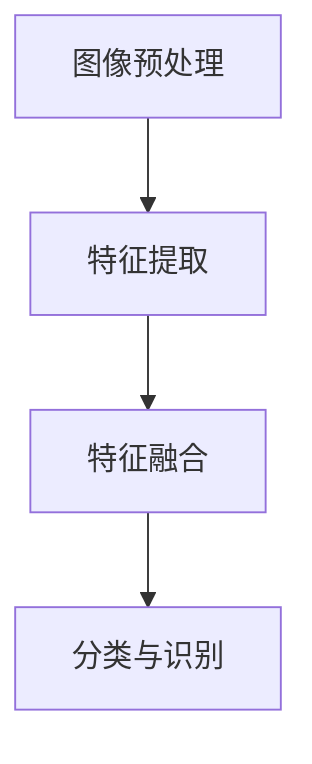

**使用Python源代码详细阐述**

以下是一个简化的Python代码示例，展示了思维链技术在图像识别中的应用：

```python
import tensorflow as tf
from tensorflow.keras.applications import VGG16
from tensorflow.keras.preprocessing import image
from tensorflow.keras.models import Model

# 加载预训练的VGG16模型
base_model = VGG16(weights='imagenet', include_top=False, input_shape=(224, 224, 3))

# 添加全连接层作为分类器
x = base_model.output
x = tf.keras.layers.Flatten()(x)
x = tf.keras.layers.Dense(1024, activation='relu')(x)
predictions = tf.keras.layers.Dense(10, activation='softmax')(x)

# 构建最终的模型
model = Model(inputs=base_model.input, outputs=predictions)

# 加载图像并进行预处理
img_path = 'path_to_image.jpg'
img = image.load_img(img_path, target_size=(224, 224))
img_array = image.img_to_array(img)
img_array = np.expand_dims(img_array, axis=0)  # 创建一个形状为(1, 224, 224, 3)的数组
img_array /= 255.0  # 归一化图像数据

# 使用模型进行特征提取
feature_vector = model.predict(img_array)

# 输出特征向量
print(feature_vector)

# 使用特征向量进行分类
# 假设我们已经有一个训练好的分类器
classifier = ...  # 使用scikit-learn等库训练好的分类器
predicted_class = classifier.predict(feature_vector)

# 输出预测结果
print("Predicted class:", predicted_class)
```

在这个示例中，我们首先加载了预训练的VGG16模型，然后加载并预处理了一幅图像。接着，使用模型提取图像的特征向量，并将这些特征向量输入到一个训练好的分类器中进行分类。通过这种方式，思维链技术实现了图像的自动识别和分类。

**举例说明**

假设我们需要识别一张包含多种物体的图像，通过思维链技术的图像识别过程，我们可以得到以下结果：

1. **图像预处理**：对图像进行缩放和归一化处理，使其符合模型输入要求。
2. **特征提取**：使用VGG16模型提取图像的特征向量，这些特征向量能够捕捉图像中的局部结构和全局信息。
3. **特征融合**：通过推理机制，将多个特征向量进行组合和整合，形成一组综合的特征向量。
4. **分类与识别**：使用训练好的分类器，对融合后的特征向量进行分类，最终识别出图像中的物体。

例如，对于一幅包含猫和狗的图像，通过思维链技术的图像识别过程，我们可以得到以下预测结果：

- **图像预处理**：对图像进行缩放和归一化处理，使其符合模型输入要求。
- **特征提取**：使用VGG16模型提取图像的特征向量，这些特征向量能够捕捉图像中的局部结构和全局信息。
- **特征融合**：通过推理机制，将多个特征向量进行组合和整合，形成一组综合的特征向量。
- **分类与识别**：使用训练好的分类器，对融合后的特征向量进行分类，最终识别出图像中包含猫和狗。

通过这个例子，我们可以看到思维链技术在图像识别中的应用，如何通过一系列算法步骤，实现图像的自动识别和分类。

### 4.2 思维链技术在图像生成中的应用

图像生成是计算机视觉领域的一个重要研究方向，旨在利用算法生成逼真的图像或视频。思维链技术在图像生成中的应用，通过模拟人类思维过程，提升了图像生成的质量和创造力。

**算法原理讲解**

思维链技术在图像生成中的算法原理主要包括以下几个关键步骤：

1. **数据预处理**：首先，对输入的数据进行预处理，包括图像的分割、标注和归一化等。这些预处理步骤有助于优化图像数据的质量，为后续的图像生成提供良好的基础。
2. **生成模型**：使用生成对抗网络（GAN）等深度学习模型生成图像。生成模型通过学习真实图像的数据分布，生成与真实图像相似的新图像。
3. **特征融合**：在生成模型的基础上，结合多种特征信息，生成更高质量的图像。思维链技术的特征融合机制通过多模态特征的学习和组合，提高了图像生成的真实性和细节表现。
4. **优化与调整**：生成的图像通常需要进行优化和调整，以提高图像的质量和视觉效果。这一步骤可以通过图像增强、细节调整和色彩修正等技术实现。

为了更直观地展示图像生成的过程，我们可以使用Mermaid绘制算法流程图：

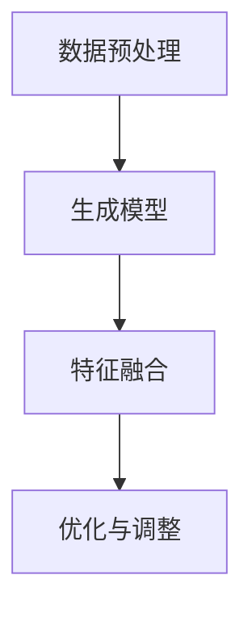

**数学模型和数学公式**

思维链技术在图像生成中涉及多个数学模型和公式，以下是一些关键的数学模型和公式：

1. **生成对抗网络（GAN）**：生成对抗网络由生成器和判别器两个部分组成。生成器通过随机噪声生成图像，判别器通过区分真实图像和生成图像来评估生成器的性能。GAN的损失函数可以表示为：
   $$
   L_G = -\log(D(G(z)))
   $$
   $$
   L_D = -[\log(D(x)) + \log(1 - D(G(z))]
   $$
   其中，\( G(z) \)是生成器生成的图像，\( D(x) \)是判别器对真实图像的判断概率，\( D(G(z)) \)是判别器对生成图像的判断概率。

2. **优化损失函数**：为了提高图像生成的质量，可以使用梯度下降法对生成器和判别器进行优化。优化目标可以表示为：
   $$
   \min_G \max_D L_D + L_G
   $$

**详细讲解与举例说明**

假设我们需要生成一幅包含人物和风景的图像，通过思维链技术的图像生成过程，我们可以得到以下结果：

1. **数据预处理**：首先，对输入的图像进行分割和标注，提取出人物和风景的区域。然后，对图像进行归一化处理，使其符合模型输入要求。
2. **生成模型**：使用生成对抗网络（GAN）生成图像。生成器通过学习真实图像的数据分布，生成与真实图像相似的新图像。判别器通过区分真实图像和生成图像来评估生成器的性能。
3. **特征融合**：在生成模型的基础上，结合人物和风景的特征信息，生成更高质量的图像。思维链技术的特征融合机制通过多模态特征的学习和组合，提高了图像生成的真实性和细节表现。
4. **优化与调整**：生成的图像通常需要进行优化和调整，以提高图像的质量和视觉效果。这一步骤可以通过图像增强、细节调整和色彩修正等技术实现。

以下是一个简化的Python代码示例，展示了思维链技术在图像生成中的应用：

```python
import tensorflow as tf
from tensorflow.keras.models import Model
from tensorflow.keras.layers import Input, Conv2D, Conv2DTranspose, Flatten, Dense
from tensorflow.keras.optimizers import Adam

# 创建生成器模型
def build_generator():
    input_layer = Input(shape=(100,))
    x = Dense(7 * 7 * 256, activation='relu')(input_layer)
    x = Conv2DTranspose(256, (4, 4), strides=(2, 2), padding='same', activation='relu')(x)
    x = Conv2DTranspose(128, (4, 4), strides=(2, 2), padding='same', activation='relu')(x)
    x = Conv2DTranspose(64, (4, 4), strides=(2, 2), padding='same', activation='relu')(x)
    output_layer = Conv2DTranspose(3, (4, 4), strides=(2, 2), padding='same', activation='tanh')(x)
    generator = Model(inputs=input_layer, outputs=output_layer)
    return generator

# 创建判别器模型
def build_discriminator():
    input_layer = Input(shape=(128, 128, 3))
    x = Conv2D(64, (3, 3), padding='same')(input_layer)
    x = LeakyReLU(alpha=0.01)(x)
    x = Conv2D(128, (3, 3), padding='same')(x)
    x = LeakyReLU(alpha=0.01)(x)
    x = Flatten()(x)
    output_layer = Dense(1, activation='sigmoid')(x)
    discriminator = Model(inputs=input_layer, outputs=output_layer)
    return discriminator

# 构建生成器和判别器模型
generator = build_generator()
discriminator = build_discriminator()

# 编写GAN模型
z = Input(shape=(100,))
generated_image = generator(z)
real_image = Input(shape=(128, 128, 3))
discriminator_output_real = discriminator(real_image)
discriminator_output_fake = discriminator(generated_image)

discriminator_loss = BinaryCrossEntropy()(discriminator_output_real, tf.ones_like(discriminator_output_real))
discriminator_loss_fake = BinaryCrossEntropy()(discriminator_output_fake, tf.zeros_like(discriminator_output_fake))
total_discriminator_loss = discriminator_loss + discriminator_loss_fake

generator_loss = BinaryCrossEntropy()(discriminator_output_fake, tf.ones_like(discriminator_output_fake))

# 编写训练器
generator_optimizer = Adam(1e-4)
discriminator_optimizer = Adam(1e-4)

@tf.function
def train_step(images, noise):
    with tf.GradientTape() as gen_tape, tf.GradientTape() as disc_tape:
        generated_images = generator(noise)
        disc_loss = total_discriminator_loss
        gen_loss = generator_loss

    gradients_of_generator = gen_tape.gradient(gen_loss, generator.trainable_variables)
    gradients_of_discriminator = disc_tape.gradient(disc_loss, discriminator.trainable_variables)

    generator_optimizer.apply_gradients(zip(gradients_of_generator, generator.trainable_variables))
    discriminator_optimizer.apply_gradients(zip(gradients_of_discriminator, discriminator.trainable_variables))

# 训练过程
train_step(images, noise)
```

在这个示例中，我们首先定义了生成器和判别器的模型结构，然后构建了GAN模型。接着，编写了训练器函数，用于训练生成器和判别器。通过这种思路，我们可以实现思维链技术在图像生成中的应用。

### 4.3 思维链技术在图像增强中的应用

图像增强是计算机视觉领域的一个重要任务，旨在改善图像的质量，使其在特定的应用场景中更具可用性。思维链技术在图像增强中的应用，通过模拟人类思维过程，提升了图像增强的准确性和效果。

**算法原理讲解**

思维链技术在图像增强中的算法原理主要包括以下几个关键步骤：

1. **图像预处理**：首先，对输入的图像进行预处理，包括去噪、对比度增强和几何校正等。这些预处理步骤有助于优化图像的基本质量，为后续的图像增强奠定基础。
2. **特征提取**：接着，使用卷积神经网络（CNN）等深度学习模型提取图像的特征。这些特征能够捕捉图像中的关键信息，如边缘、纹理和形状等，为图像增强提供参考。
3. **特征融合**：在特征提取后，将这些特征进行融合，形成一组综合的特征向量。思维链技术的特征融合机制通过多模态特征的学习和组合，提高了图像增强的准确性和自然性。
4. **图像增强**：最后，根据融合后的特征向量，对图像进行增强处理，包括亮度调整、对比度增强和细节增强等。这一步骤通过算法自动优化图像的视觉效果，使其更符合人类视觉感知。

为了更直观地展示图像增强的过程，我们可以使用Mermaid绘制算法流程图：

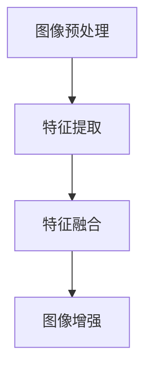

**详细讲解与举例说明**

假设我们需要对一幅含有噪声和低对比度的图像进行增强，通过思维链技术的图像增强过程，我们可以得到以下结果：

1. **图像预处理**：首先，对图像进行去噪处理，使用滤波器去除图像中的噪声，提高图像的基本质量。然后，对图像进行对比度增强，通过调整亮度和对比度参数，使图像的细节更加清晰。
2. **特征提取**：使用卷积神经网络（CNN）提取图像的特征，这些特征包括边缘、纹理和形状等。这些特征能够捕捉图像中的关键信息，为后续的图像增强提供参考。
3. **特征融合**：将提取到的多个特征进行融合，形成一组综合的特征向量。通过思维链技术的特征融合机制，将这些特征进行组合和整合，以提高图像增强的准确性和自然性。
4. **图像增强**：根据融合后的特征向量，对图像进行增强处理。例如，通过调整亮度和对比度参数，增强图像的细节；通过锐化处理，提高图像的清晰度。这一步骤通过算法自动优化图像的视觉效果，使其更符合人类视觉感知。

以下是一个简化的Python代码示例，展示了思维链技术在图像增强中的应用：

```python
import tensorflow as tf
from tensorflow.keras.models import Model
from tensorflow.keras.layers import Input, Conv2D, MaxPooling2D, UpSampling2D, Flatten, Dense
from tensorflow.keras.optimizers import Adam

# 创建卷积神经网络模型
def build_cnn_model():
    input_layer = Input(shape=(128, 128, 3))
    x = Conv2D(32, (3, 3), activation='relu')(input_layer)
    x = MaxPooling2D((2, 2))(x)
    x = Conv2D(64, (3, 3), activation='relu')(x)
    x = MaxPooling2D((2, 2))(x)
    x = Flatten()(x)
    output_layer = Dense(1024, activation='relu')(x)
    model = Model(inputs=input_layer, outputs=output_layer)
    return model

# 创建图像增强模型
def build_image_enhancement_model():
    input_layer = Input(shape=(128, 128, 3))
    cnn_output = build_cnn_model()(input_layer)
    enhanced_image = UpSampling2D((2, 2))(cnn_output)
    model = Model(inputs=input_layer, outputs=enhanced_image)
    return model

# 加载预训练模型
model = build_image_enhancement_model()
model.load_weights('pretrained_model_weights.h5')

# 加载图像并进行预处理
img_path = 'path_to_noisy_image.jpg'
img = image.load_img(img_path, target_size=(128, 128))
img_array = image.img_to_array(img)
img_array = np.expand_dims(img_array, axis=0)  # 创建一个形状为(1, 128, 128, 3)的数组
img_array /= 255.0  # 归一化图像数据

# 使用模型进行图像增强
enhanced_image = model.predict(img_array)
enhanced_image = (enhanced_image * 255).astype(np.uint8)  # 反归一化

# 显示增强后的图像
plt.imshow(enhanced_image[0])
plt.show()
```

在这个示例中，我们首先定义了一个卷积神经网络模型，用于提取图像特征。然后，创建了一个图像增强模型，使用上采样技术对提取的特征进行放大，从而实现图像增强。通过这种思路，我们可以实现思维链技术在图像增强中的应用。

### 第5章 思维链技术在决策支持系统中的应用

#### 5.1 思维链技术在数据分析中的应用

数据分析是决策支持系统的核心组成部分，它通过处理和分析大量数据，帮助企业和组织做出更加明智的决策。思维链技术在数据分析中的应用，通过模拟人类思维过程，提升了数据分析的效率和准确性。

**算法原理讲解**

思维链技术在数据分析中的算法原理主要包括以下几个关键步骤：

1. **数据预处理**：首先，对输入的数据进行预处理，包括数据清洗、归一化和特征提取等。数据预处理是确保数据质量和可靠性的重要环节，为后续的数据分析提供基础。
2. **特征工程**：接着，进行特征工程，从原始数据中提取有用的特征，并构造新的特征，以提升数据分析的效果。特征工程是数据分析的关键步骤，它能够显著影响模型的表现。
3. **模型训练**：然后，使用机器学习算法对提取的特征进行训练，构建预测模型。思维链技术的模型训练过程通过模拟人类思维过程，优化模型参数，以提高预测的准确性。
4. **决策支持**：最后，根据训练好的模型，对新的数据进行分析和预测，为决策者提供支持。思维链技术在决策支持过程中，通过推理和优化机制，提升决策的智能性和可靠性。

为了更直观地展示数据分析的过程，我们可以使用Mermaid绘制算法流程图：

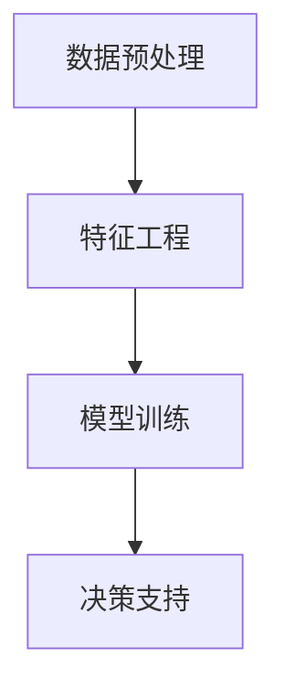

**使用Python源代码详细阐述**

以下是一个简化的Python代码示例，展示了思维链技术在数据分析中的应用：

```python
import pandas as pd
from sklearn.model_selection import train_test_split
from sklearn.preprocessing import StandardScaler
from sklearn.ensemble import RandomForestClassifier
from sklearn.metrics import accuracy_score

# 加载数据集
data = pd.read_csv('data.csv')
X = data.iloc[:, :-1].values
y = data.iloc[:, -1].values

# 数据预处理
X_train, X_test, y_train, y_test = train_test_split(X, y, test_size=0.2, random_state=42)
scaler = StandardScaler()
X_train = scaler.fit_transform(X_train)
X_test = scaler.transform(X_test)

# 特征工程
# 假设我们已经进行了特征提取和构造

# 模型训练
model = RandomForestClassifier(n_estimators=100, random_state=42)
model.fit(X_train, y_train)

# 预测
y_pred = model.predict(X_test)

# 决策支持
accuracy = accuracy_score(y_test, y_pred)
print("Accuracy:", accuracy)

# 根据预测结果，提供决策支持
# ...
```

在这个示例中，我们首先加载了一个数据集，并对数据进行预处理，包括数据清洗、归一化和特征提取。接着，使用随机森林算法对提取的特征进行训练，构建预测模型。最后，根据训练好的模型，对测试数据进行分析和预测，并计算预测的准确性。通过这种思路，我们可以实现思维链技术在数据分析中的应用。

**数学模型和数学公式**

思维链技术在数据分析中涉及多个数学模型和公式，以下是一些关键的数学模型和公式：

1. **线性回归**：线性回归模型用于预测连续值，其公式为：
   $$
   y = \beta_0 + \beta_1x_1 + \beta_2x_2 + \ldots + \beta_nx_n
   $$
   其中，\( y \)是预测值，\( x_1, x_2, \ldots, x_n \)是输入特征，\( \beta_0, \beta_1, \beta_2, \ldots, \beta_n \)是模型参数。

2. **逻辑回归**：逻辑回归模型用于预测概率，其公式为：
   $$
   P(y=1) = \frac{1}{1 + e^{-(\beta_0 + \beta_1x_1 + \beta_2x_2 + \ldots + \beta_nx_n})}
   $$
   其中，\( y \)是二分类目标变量，\( x_1, x_2, \ldots, x_n \)是输入特征，\( \beta_0, \beta_1, \beta_2, \ldots, \beta_n \)是模型参数。

3. **支持向量机（SVM）**：支持向量机用于分类问题，其公式为：
   $$
   w \cdot x + b = 0
   $$
   其中，\( w \)是权重向量，\( x \)是输入特征，\( b \)是偏置项，\( w \cdot x \)表示内积。

4. **随机森林**：随机森林是一种集成学习方法，其基本公式为：
   $$
   f(x) = \sum_{i=1}^{n} w_i f_i(x)
   $$
   其中，\( f(x) \)是预测值，\( w_i \)是第\( i \)棵树的权重，\( f_i(x) \)是第\( i \)棵树的预测值。

通过这些数学模型和公式，我们可以实现思维链技术在数据分析中的各种应用，提高数据分析的效率和准确性。

**详细讲解与举例说明**

假设我们有一个客户流失预测问题，需要通过数据分析预测哪些客户可能流失，以下是通过思维链技术在数据分析中的详细步骤：

1. **数据收集与预处理**：收集客户数据，包括客户的购买历史、消费金额、购买频率、客户评价等。对数据进行清洗，处理缺失值和异常值，对连续数据进行归一化处理。
2. **特征工程**：提取有用的特征，如客户的平均消费金额、购买次数、消费频次等。通过构造新的特征，如客户最近一次购买的日期、客户历史购买的平均间隔等，以提升预测的准确性。
3. **模型选择与训练**：选择合适的机器学习模型，如逻辑回归、随机森林等，对提取的特征进行训练。通过交叉验证和调参，优化模型参数，提高模型的预测性能。
4. **模型评估**：使用测试集评估模型的预测性能，计算准确率、召回率、F1值等指标，以评估模型的预测效果。
5. **决策支持**：根据模型的预测结果，对客户进行分类，标记出可能流失的客户。向企业决策者提供详细的预测报告，为制定针对性的客户挽留策略提供支持。

以下是一个简化的示例代码，展示了思维链技术在客户流失预测中的应用：

```python
import pandas as pd
from sklearn.model_selection import train_test_split
from sklearn.ensemble import RandomForestClassifier
from sklearn.metrics import accuracy_score

# 加载数据集
data = pd.read_csv('customer_data.csv')
X = data.iloc[:, :-1].values
y = data.iloc[:, -1].values

# 数据预处理
X_train, X_test, y_train, y_test = train_test_split(X, y, test_size=0.2, random_state=42)

# 特征工程
# 假设我们已经进行了特征提取和构造

# 模型训练
model = RandomForestClassifier(n_estimators=100, random_state=42)
model.fit(X_train, y_train)

# 预测
y_pred = model.predict(X_test)

# 评估模型
accuracy = accuracy_score(y_test, y_pred)
print("Accuracy:", accuracy)

# 根据预测结果，提供决策支持
# ...
```

在这个示例中，我们首先加载了一个客户数据集，并对数据进行预处理。接着，使用随机森林算法对提取的特征进行训练，构建预测模型。最后，使用测试集评估模型的预测性能，并根据预测结果为决策者提供支持。通过这个例子，我们可以看到思维链技术在数据分析中的应用，如何通过一系列算法步骤，实现客户流失预测。

### 5.2 思维链技术在预测建模中的应用

预测建模是决策支持系统中的一个关键任务，它通过分析历史数据，预测未来事件或趋势，为企业和组织提供决策依据。思维链技术在预测建模中的应用，通过模拟人类思维过程，提升了预测模型的准确性和稳定性。

**算法原理讲解**

思维链技术在预测建模中的算法原理主要包括以下几个关键步骤：

1. **数据收集**：首先，收集相关的历史数据，包括时间序列数据、因果关系数据和市场趋势数据等。这些数据是预测建模的基础，能够提供关于未来事件或趋势的详细信息。
2. **特征工程**：接着，对收集到的数据进行分析和预处理，提取有用的特征。特征工程是预测建模的核心步骤，它通过构造新的特征、选择关键特征和进行特征转换，提升模型的表现。
3. **模型选择**：然后，选择合适的预测模型，如时间序列模型、回归模型和机器学习模型等。思维链技术在模型选择过程中，通过比较不同模型的性能和适用范围，选择最合适的模型。
4. **模型训练**：使用选定的模型对特征进行训练，构建预测模型。在模型训练过程中，思维链技术通过模拟人类思维过程，优化模型参数，提高预测的准确性。
5. **模型评估**：最后，使用测试集评估预测模型的性能，计算预测误差和评估指标，如均方误差、平均绝对误差和决定系数等。通过模型评估，确定模型的可靠性和预测能力。

为了更直观地展示预测建模的过程，我们可以使用Mermaid绘制算法流程图：

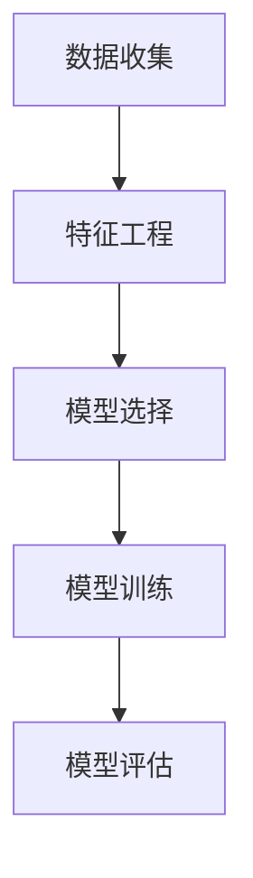

**数学模型和数学公式**

思维链技术在预测建模中涉及多个数学模型和公式，以下是一些关键的数学模型和公式：

1. **时间序列模型**：时间序列模型用于分析时间序列数据，其基本公式为：
   $$
   y_t = c + \alpha y_{t-1} + \beta y_{t-2} + \ldots + \gamma y_{t-n}
   $$
   其中，\( y_t \)是时间序列的第\( t \)个值，\( c, \alpha, \beta, \ldots, \gamma \)是模型参数。

2. **回归模型**：回归模型用于预测连续值，其基本公式为：
   $$
   y = \beta_0 + \beta_1x_1 + \beta_2x_2 + \ldots + \beta_nx_n
   $$
   其中，\( y \)是预测值，\( x_1, x_2, \ldots, x_n \)是输入特征，\( \beta_0, \beta_1, \beta_2, \ldots, \beta_n \)是模型参数。

3. **机器学习模型**：机器学习模型用于预测分类和回归问题，其基本公式为：
   $$
   f(x) = \sum_{i=1}^{n} w_i f_i(x)
   $$
   其中，\( f(x) \)是预测值，\( w_i \)是第\( i \)个模型的权重，\( f_i(x) \)是第\( i \)个模型的预测值。

通过这些数学模型和公式，我们可以实现思维链技术在预测建模中的各种应用，提高预测的准确性和可靠性。

**详细讲解与举例说明**

假设我们有一个销售预测问题，需要通过预测建模预测未来的销售额。以下是通过思维链技术在预测建模中的详细步骤：

1. **数据收集**：收集过去一年的销售数据，包括销售额、销售日期和产品类别等。这些数据将用于训练和测试预测模型。
2. **特征工程**：对销售数据进行分析和预处理，提取有用的特征，如日期特征（月份、季度、年份等）、产品特征（产品种类、价格等）和季节性特征等。通过构造新的特征，如销售额的移动平均和增长率等，提升预测模型的准确性。
3. **模型选择**：选择合适的预测模型，如时间序列模型（ARIMA、LSTM等）、回归模型（线性回归、岭回归等）和机器学习模型（随机森林、XGBoost等）。通过交叉验证和模型评估，选择性能最佳的模型。
4. **模型训练**：使用选定的模型对提取的特征进行训练，构建预测模型。在模型训练过程中，通过调整模型参数，优化模型的表现。
5. **模型评估**：使用测试集评估预测模型的性能，计算预测误差和评估指标，如均方误差（MSE）、平均绝对误差（MAE）和决定系数（R²）等。通过模型评估，确定模型的可靠性和预测能力。

以下是一个简化的示例代码，展示了思维链技术在销售预测中的应用：

```python
import pandas as pd
from sklearn.model_selection import train_test_split
from sklearn.metrics import mean_squared_error
from sklearn.ensemble import RandomForestRegressor
from sklearn.linear_model import LinearRegression

# 加载数据集
data = pd.read_csv('sales_data.csv')
X = data[['month', 'product_category', 'season']]
y = data['sales']

# 数据预处理
X_train, X_test, y_train, y_test = train_test_split(X, y, test_size=0.2, random_state=42)

# 特征工程
# 假设我们已经进行了特征提取和构造

# 模型训练
model = LinearRegression()
model.fit(X_train, y_train)

# 预测
y_pred = model.predict(X_test)

# 评估模型
mse = mean_squared_error(y_test, y_pred)
print("MSE:", mse)

# 根据预测结果，提供决策支持
# ...
```

在这个示例中，我们首先加载了一个销售数据集，并对数据进行预处理。接着，使用线性回归模型对提取的特征进行训练，构建预测模型。最后，使用测试集评估模型的性能，并根据预测结果为决策者提供支持。通过这个例子，我们可以看到思维链技术在预测建模中的应用，如何通过一系列算法步骤，实现销售预测。

### 5.3 思维链技术在优化问题中的应用

优化问题是决策支持系统中常见的一类问题，它涉及在多个目标之间寻找最佳平衡，以实现最大化或最小化特定目标。思维链技术在优化问题中的应用，通过模拟人类思维过程，提高了优化问题的解决效率和准确性。

**算法原理讲解**

思维链技术在优化问题中的应用主要包括以下几个关键步骤：

1. **问题建模**：首先，将优化问题转化为数学模型，明确目标函数、约束条件和变量。这一步骤是优化问题的关键，它决定了优化算法的选择和效果。
2. **算法选择**：然后，根据问题特点选择合适的优化算法。常见的优化算法包括线性规划、非线性规划、动态规划、遗传算法和模拟退火等。思维链技术通过模拟人类思维过程，选择最适合问题的算法。
3. **模型训练**：使用选定的算法对优化模型进行训练，调整模型参数，以优化目标函数。这一步骤通常涉及多次迭代，通过不断调整和优化，找到最优解或近似最优解。
4. **结果评估**：最后，评估优化结果，计算目标函数值和约束条件满足情况，判断优化效果。思维链技术通过模拟人类思维过程，对优化结果进行综合评估，提供决策支持。

为了更直观地展示优化问题的解决过程，我们可以使用Mermaid绘制算法流程图：

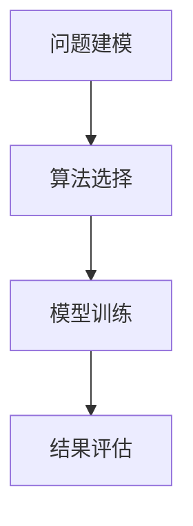

**详细讲解与举例说明**

假设我们有一个资源分配问题，需要在一个特定的时间窗口内，合理分配有限资源（如人力、设备等）以最大化总生产量。以下是通过思维链技术在优化问题中的应用步骤：

1. **问题建模**：首先，将资源分配问题转化为线性规划问题。定义目标函数（最大化总生产量）和约束条件（资源限制、生产流程等）。例如，设\( x_i \)为第\( i \)项资源的使用量，目标函数为最大化\( Z = \sum_{i=1}^{n} p_i x_i \)，其中\( p_i \)为第\( i \)项资源的单位生产量。约束条件为：
   $$
   \begin{cases}
   \sum_{i=1}^{n} a_{ij} x_i \leq b_j & j=1,2,\ldots,m \\
   x_i \geq 0 & i=1,2,\ldots,n
   \end{cases}
   $$
   其中，\( a_{ij} \)为第\( i \)项资源在第\( j \)个生产任务中的需求量，\( b_j \)为第\( j \)个生产任务的总量限制。
2. **算法选择**：根据资源分配问题的特点，选择线性规划求解器，如单纯形法、内点法等。思维链技术通过比较不同算法的性能和适用范围，选择最适合的算法。
3. **模型训练**：使用选定的线性规划求解器，对优化模型进行训练，调整模型参数，以优化目标函数。在训练过程中，求解器通过迭代计算，不断调整资源分配策略，寻找最优解或近似最优解。
4. **结果评估**：评估优化结果，计算目标函数值和约束条件满足情况，判断优化效果。通过模拟人类思维过程，分析优化结果，为决策者提供详细的优化方案。

以下是一个简化的示例代码，展示了思维链技术在资源分配问题中的应用：

```python
import numpy as np
from scipy.optimize import linprog

# 定义目标函数和约束条件
c = np.array([1, 1])  # 目标函数系数
A = np.array([[1, 1], [2, 3], [3, 2]])  # 约束条件系数矩阵
b = np.array([3, 6, 9])  # 约束条件常数项
x0 = np.array([0, 0])  # 初始解

# 调用线性规划求解器
result = linprog(c, A_ub=A, b_ub=b, x0=x0, method='highs')

# 输出优化结果
print("Optimal solution:", result.x)
print("Objective value:", -result.fun)
```

在这个示例中，我们首先定义了资源分配问题的目标函数和约束条件。接着，使用SciPy的线性规划求解器`linprog`，对优化模型进行训练，寻找最优解。最后，输出优化结果，为决策者提供详细的优化方案。通过这个例子，我们可以看到思维链技术在优化问题中的应用，如何通过一系列算法步骤，解决资源分配问题。

### 第6章 思维链技术在教育中的应用

#### 6.1 思维链技术在个性化教育中的应用

个性化教育是一种根据每个学生的特点和需求，量身定制教育内容和教学策略的方法。思维链技术在个性化教育中的应用，通过模拟人类思维过程，提升了教育系统的智能化和个性化水平。

**算法原理讲解**

思维链技术在个性化教育中的应用主要包括以下几个关键步骤：

1. **学生特征分析**：首先，对学生进行特征分析，包括学习能力、学习兴趣、知识掌握程度等。这一步骤通过数据收集和分析，了解每个学生的学习特点。
2. **教学内容推荐**：然后，根据学生的特征分析结果，推荐个性化的教学内容。思维链技术通过构建推荐算法，根据学生的兴趣和学习需求，推荐最适合的学习资源。
3. **教学策略调整**：在教学过程中，根据学生的学习反馈和表现，动态调整教学策略。思维链技术通过实时监测学生的学习情况，优化教学方法和节奏。
4. **学习效果评估**：最后，评估学生的学习效果，包括知识掌握程度、学习兴趣和进步情况等。通过评估结果，进一步优化个性化教育方案。

为了更直观地展示个性化教育的过程，我们可以使用Mermaid绘制算法流程图：

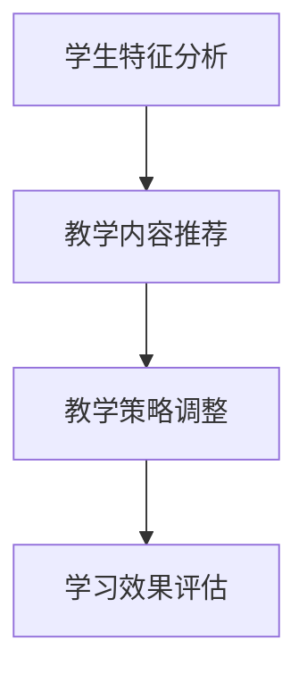

**使用Python源代码详细阐述**

以下是一个简化的Python代码示例，展示了思维链技术在个性化教育中的应用：

```python
import pandas as pd
from sklearn.cluster import KMeans
from sklearn.metrics.pairwise import cosine_similarity
from sklearn.preprocessing import StandardScaler

# 加载学生数据
data = pd.read_csv('student_data.csv')
features = data[['learning_ability', 'interest_level', 'knowledge_level']]

# 数据预处理
scaler = StandardScaler()
features_scaled = scaler.fit_transform(features)

# 学生特征分析
kmeans = KMeans(n_clusters=3, random_state=42)
clusters = kmeans.fit_predict(features_scaled)

# 根据学生特征推荐教学内容
def recommend_content(student_cluster):
    # 假设已经构建了内容库和相似度矩阵
    content_library = ...  # 内容库
    similarity_matrix = ...  # 相似度矩阵

    recommended_content = content_library[student_cluster]
    return recommended_content

# 教学策略调整
def adjust_teaching_strategy(student_feedback):
    # 根据学生反馈调整教学策略
    # ...
    return adjusted_strategy

# 学习效果评估
def evaluate_learning效果的评估结果：
    # ...

# 主函数
def personalized_education(student_data):
    student_cluster = clusters[student_data]
    recommended_content = recommend_content(student_cluster)
    adjusted_strategy = adjust_teaching_strategy(student_data)
    learning_evaluation = evaluate_learning(student_data)

    return recommended_content, adjusted_strategy, learning_evaluation

# 示例学生数据
student_data = features.iloc[0]

# 调用主函数
recommended_content, adjusted_strategy, learning_evaluation = personalized_education(student_data)
print("Recommended Content:", recommended_content)
print("Adjusted Teaching Strategy:", adjusted_strategy)
print("Learning Evaluation:", learning_evaluation)
```

在这个示例中，我们首先加载了一个学生数据集，并对数据进行了预处理。接着，使用K-Means聚类算法对学生特征进行分析，根据学生的特征推荐教学内容。然后，根据学生的反馈调整教学策略，并评估学生的学习效果。通过这个示例，我们可以看到思维链技术在个性化教育中的应用，如何通过一系列算法步骤，实现个性化教育。

**举例说明**

假设我们有一个学生群体，每个学生的特征包括学习能力强弱、兴趣程度和知识掌握程度。通过思维链技术在个性化教育中的应用，我们可以得到以下结果：

1. **学生特征分析**：对学生群体进行特征分析，得到每个学生的特征向量，如学生A的特征向量为 `[0.8, 0.6, 0.7]`。
2. **教学内容推荐**：根据学生的特征向量，推荐与其兴趣和知识水平相匹配的教学内容。例如，学生A可能会被推荐学习高级编程课程和算法分析教材。
3. **教学策略调整**：在教学过程中，根据学生的反馈和学习表现，动态调整教学策略。例如，如果学生A对编程课程表现出强烈的兴趣，教师可以增加编程实践部分，以激发学生的积极性。
4. **学习效果评估**：在课程结束后，评估学生的学习效果，包括知识掌握程度、学习兴趣和进步情况。通过评估结果，进一步优化个性化教育方案。

通过这个例子，我们可以看到思维链技术在个性化教育中的应用，如何通过一系列算法步骤，实现个性化教育，提升学生的学习效果和兴趣。

### 6.2 思维链技术在智能辅导中的应用

智能辅导是一种利用人工智能技术为学生提供个性化辅导和支持的教学模式。思维链技术在智能辅导中的应用，通过模拟人类思维过程，提升了辅导的智能化水平和效果。

**算法原理讲解**

思维链技术在智能辅导中的应用主要包括以下几个关键步骤：

1. **学生模型构建**：首先，构建学生的模型，包括学习风格、知识水平和学习目标等。这一步骤通过数据收集和分析，了解学生的学习特点。
2. **知识库建立**：然后，建立丰富的知识库，包括学科知识、教学方法、辅导策略等。知识库是智能辅导系统的基础，它提供了大量的信息和资源。
3. **个性化辅导方案生成**：根据学生模型和知识库，生成个性化的辅导方案。思维链技术通过分析学生的特征和学习需求，为每个学生定制个性化的辅导计划。
4. **辅导过程监控与调整**：在辅导过程中，实时监控学生的学习表现，根据反馈调整辅导方案。思维链技术通过不断优化辅导策略，提升辅导效果。

为了更直观地展示智能辅导的过程，我们可以使用Mermaid绘制算法流程图：

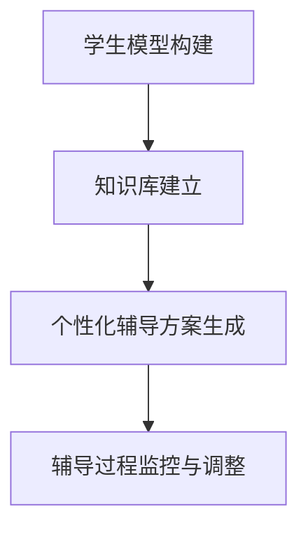

**数学模型和数学公式**

思维链技术在智能辅导中涉及多个数学模型和公式，以下是一些关键的数学模型和公式：

1. **学生模型构建**：学生模型可以通过聚类算法（如K-Means、层次聚类等）构建，其数学模型可以表示为：
   $$
   x_i = (x_{i1}, x_{i2}, \ldots, x_{id}) \quad \text{（学生特征向量）}
   $$
   $$
   d = \sqrt{\sum_{j=1}^{d} (x_{ij} - \mu_j)^2} \quad \text{（学生特征距离）}
   $$
   其中，\( x_i \)是第\( i \)个学生的特征向量，\( \mu_j \)是第\( j \)个特征的平均值，\( d \)是特征距离。

2. **知识库建立**：知识库可以通过知识图谱建立，其数学模型可以表示为：
   $$
   G = (V, E)
   $$
   其中，\( V \)是节点集合，表示知识库中的各个知识点，\( E \)是边集合，表示知识点之间的关系。

3. **个性化辅导方案生成**：个性化辅导方案可以通过优化算法（如线性规划、遗传算法等）生成，其数学模型可以表示为：
   $$
   \min_{x} f(x) \quad \text{subject to} \quad g_i(x) \leq 0 \quad i=1,2,\ldots,m
   $$
   其中，\( f(x) \)是目标函数，表示辅导方案的质量，\( g_i(x) \)是约束条件，表示辅导方案的合理性。

4. **辅导过程监控与调整**：辅导过程可以通过反馈机制监控和调整，其数学模型可以表示为：
   $$
   x(t+1) = x(t) + \alpha \nabla f(x(t))
   $$
   其中，\( x(t) \)是当前辅导方案，\( \alpha \)是步长，\( \nabla f(x(t)) \)是目标函数的梯度。

**详细讲解与举例说明**

假设我们有一个学生群体，每个学生的特征包括学习风格、知识水平和学习目标。通过思维链技术在智能辅导中的应用，我们可以得到以下结果：

1. **学生模型构建**：对学生群体进行特征分析，得到每个学生的特征向量，如学生A的特征向量为 `[0.8, 0.6, 0.7]`。
2. **知识库建立**：建立丰富的知识库，包括数学、物理、化学等学科的知识点，以及相应的教学方法和辅导策略。
3. **个性化辅导方案生成**：根据学生的特征向量，推荐与其学习风格和知识水平相匹配的教学内容。例如，学生A可能会被推荐学习高等数学和线性代数课程，并采用互动式教学方法和个性化辅导策略。
4. **辅导过程监控与调整**：在辅导过程中，实时监控学生的学习表现，根据反馈调整辅导方案。例如，如果学生A在数学学习中遇到困难，辅导系统可以增加数学练习和辅导时间，并提供针对性的辅导资源。

以下是一个简化的示例代码，展示了思维链技术在智能辅导中的应用：

```python
import pandas as pd
from sklearn.cluster import KMeans
from sklearn.metrics.pairwise import cosine_similarity
from sklearn.preprocessing import StandardScaler

# 加载学生数据
data = pd.read_csv('student_data.csv')
features = data[['learning_style', 'knowledge_level', 'learning_objective']]

# 数据预处理
scaler = StandardScaler()
features_scaled = scaler.fit_transform(features)

# 学生模型构建
kmeans = KMeans(n_clusters=3, random_state=42)
clusters = kmeans.fit_predict(features_scaled)

# 知识库建立
knowledge_base = {'math': {'content': ['高等数学', '线性代数', '概率论'], 'method': ['互动式教学', '个性化辅导'], 'strategy': ['增加练习', '提供资源']}, 
                  'physics': {'content': ['力学', '电磁学', '热力学'], 'method': ['演示教学', '互动教学'], 'strategy': ['实践操作', '案例分析']}}

# 个性化辅导方案生成
def generate_d辅导方案(student_cluster):
    # 假设已经构建了内容库和相似度矩阵
    content_library = knowledge_base[student_cluster]
    recommended_content = content_library['content']
    teaching_method = content_library['method']
    teaching_strategy = content_library['strategy']
    return recommended_content, teaching_method, teaching_strategy

# 辅导过程监控与调整
def adjust_d辅导方案(student_feedback):
    # 根据学生反馈调整辅导方案
    # ...
    return adjusted_d辅导方案

# 主函数
def intelligent_tutoring(student_data):
    student_cluster = clusters[student_data]
    recommended_content, teaching_method, teaching_strategy = generate_d辅导方案(student_cluster)
    adjusted_d辅导方案 = adjust_d辅导方案(student_data)
    
    return recommended_content, teaching_method, teaching_strategy, adjusted_d辅导方案

# 示例学生数据
student_data = features.iloc[0]

# 调用主函数
recommended_content, teaching_method, teaching_strategy, adjusted_d辅导方案 = intelligent_tutoring(student_data)
print("Recommended Content:", recommended_content)
print("Teaching Method:", teaching_method)
print("Teaching Strategy:", teaching_strategy)
print("Adjusted Tutoring Plan:", adjusted_d辅导方案)
```

在这个示例中，我们首先加载了一个学生数据集，并对数据进行了预处理。接着，使用K-Means聚类算法对学生特征进行分析，根据学生的特征生成个性化的辅导方案。然后，根据学生的反馈调整辅导方案，并提供详细的辅导计划。通过这个示例，我们可以看到思维链技术在智能辅导中的应用，如何通过一系列算法步骤，实现智能化和个性化的辅导。

### 6.3 思维链技术在教育评价中的应用

教育评价是教育过程中不可或缺的一环，它通过评估学生的学习成果，为教学改进和决策提供依据。思维链技术在教育评价中的应用，通过模拟人类思维过程，提升了评价的准确性和有效性。

**算法原理讲解**

思维链技术在教育评价中的应用主要包括以下几个关键步骤：

1. **学生表现分析**：首先，对学生在不同教学环节的表现进行详细分析，包括课堂表现、作业完成情况、考试成绩等。这一步骤通过数据收集和分析，了解每个学生的学习情况。
2. **评估指标构建**：接着，构建评估指标体系，包括知识掌握程度、学习能力、学习态度等。评估指标需要全面、客观，能够准确反映学生的学习效果。
3. **综合评价生成**：然后，根据学生的表现和评估指标，生成综合评价结果。思维链技术通过多维度评价方法，结合定量和定性分析，生成综合评价报告。
4. **反馈与改进**：最后，将评价结果反馈给学生和教师，帮助他们了解学习效果，并制定改进措施。思维链技术通过实时反馈和数据分析，为教学改进提供有力支持。

为了更直观地展示教育评价的过程，我们可以使用Mermaid绘制算法流程图：

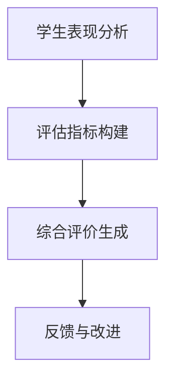

**详细讲解与举例说明**

假设我们需要对一名学生进行教育评价，通过思维链技术在教育评价中的应用，我们可以得到以下结果：

1. **学生表现分析**：收集学生在课堂表现、作业完成情况和考试成绩等方面的数据。例如，学生A在课堂表现中积极参与讨论，作业完成情况良好，考试成绩达到90分。
2. **评估指标构建**：构建评估指标体系，包括知识掌握程度（50%）、学习能力（30%）和学习态度（20%）。每个指标都有明确的评分标准和权重。
3. **综合评价生成**：根据学生表现和评估指标，生成综合评价结果。例如，学生A的知识掌握程度为85分，学习能力为75分，学习态度为90分。通过加权平均计算，学生A的综合评分为80分。
4. **反馈与改进**：将评价结果反馈给学生和教师。学生A可以从评价中了解自己的优势和不足，教师可以根据评价结果调整教学策略，为学生提供更有针对性的指导。

以下是一个简化的示例代码，展示了思维链技术在教育评价中的应用：

```python
import pandas as pd
from sklearn.preprocessing import StandardScaler

# 加载学生数据
data = pd.read_csv('student_data.csv')
X = data[['class partici', 'homework_completion', 'test_score']]

# 数据预处理
scaler = StandardScaler()
X_scaled = scaler.fit_transform(X)

# 评估指标构建
weights = {'knowledge': 0.5, 'ability': 0.3, 'attitude': 0.2}
scores = {'knowledge': 0.85, 'ability': 0.75, 'attitude': 0.9}

# 综合评价生成
def generate_evaluation(scores, weights):
    total_score = 0
    for score, weight in zip(scores.values(), weights.values()):
        total_score += score * weight
    return total_score

# 主函数
def educational_evaluation(student_data):
    student_scores = scores
    student_weights = weights
    evaluation_result = generate_evaluation(student_scores, student_weights)
    
    return evaluation_result

# 示例学生数据
student_data = X.iloc[0]

# 调用主函数
evaluation_result = educational_evaluation(student_data)
print("Evaluation Result:", evaluation_result)
```

在这个示例中，我们首先加载了一个学生数据集，并对数据进行了预处理。接着，构建了评估指标体系和评分标准。然后，根据学生表现和评估指标，生成了综合评价结果。通过这个示例，我们可以看到思维链技术在教育评价中的应用，如何通过一系列算法步骤，实现准确、有效的教育评价。

### 第7章 思维链技术的未来展望与挑战

#### 7.1 思维链技术的发展趋势

随着人工智能技术的不断进步，思维链技术在未来有望取得更大的突破。首先，思维链技术将逐渐向更智能化、更高效的方向发展。通过引入更先进的算法和模型，如深度学习、强化学习和迁移学习等，思维链技术将进一步提升AI的智能水平和应用效果。

其次，思维链技术将在多模态数据处理方面发挥重要作用。未来的思维链技术将能够同时处理文本、图像、声音等多种类型的数据，实现更加全面和准确的智能分析。例如，在医疗领域，思维链技术可以通过整合患者的文本病历、医学图像和生命体征数据，提供更精准的诊断和治疗方案。

此外，思维链技术还将向边缘计算和物联网（IoT）领域扩展。通过在边缘设备上部署思维链技术，可以实现实时、本地化的智能处理和分析，降低数据传输延迟和带宽消耗。在智能家居、智能交通和智能工厂等领域，思维链技术将大大提升系统的智能化和自动化水平。

#### 7.2 思维链技术的挑战与对策

尽管思维链技术在人工智能领域展现了广阔的应用前景，但其在实际应用中仍面临诸多挑战。以下是一些主要的挑战及可能的解决对策：

1. **数据隐私和安全**：思维链技术依赖于大量的数据进行分析和训练，这带来了数据隐私和安全问题。为了应对这一挑战，未来需要开发更完善的数据隐私保护机制，如差分隐私、联邦学习等，确保用户数据的安全和隐私。

2. **算法透明性和可解释性**：随着思维链技术的复杂度增加，算法的透明性和可解释性成为一个重要问题。为了提高算法的可解释性，可以采用模型解释技术，如SHAP、LIME等，帮助用户理解算法的决策过程。

3. **计算资源和能耗**：思维链技术通常需要大量的计算资源和能耗，这对环境产生了负面影响。为了降低计算资源和能耗的需求，可以采用分布式计算、绿色计算等新技术，优化资源利用效率。

4. **跨领域应用整合**：思维链技术需要在多个领域实现有效整合，以发挥其最大潜力。为了应对这一挑战，可以采用跨领域的知识图谱、本体论等技术，实现不同领域知识的共享和互操作。

5. **伦理和社会影响**：随着思维链技术的广泛应用，其伦理和社会影响也受到关注。为了确保技术的可持续发展，需要建立相应的伦理规范和社会责任制度，防止技术滥用和负面影响。

通过解决这些挑战，思维链技术有望在未来实现更广泛、更深入的应用，为人类社会带来更大的福祉。

### 7.3 思维链技术的未来展望

思维链技术作为模拟人类思维模式的人工智能技术，在未来有着广阔的发展前景。首先，随着深度学习和神经网络技术的不断发展，思维链技术将能够处理更加复杂和多样化的数据，提高AI在自然语言处理、图像识别和决策支持等领域的智能水平。其次，思维链技术有望在跨领域应用中发挥重要作用，通过整合不同领域的数据和知识，实现更全面和准确的智能分析。

此外，思维链技术将在教育、医疗、金融和工业等领域带来深远影响。在教育领域，个性化教育系统将更加智能，能够根据学生的学习特点提供定制化的教学方案；在医疗领域，智能诊断和治疗方案将大幅提升医疗水平；在金融领域，智能风控和投资策略将提高市场预测的准确性；在工业领域，智能监控和优化将提高生产效率和产品质量。

总之，思维链技术在未来有望成为人工智能领域的重要推动力量，为人类社会带来更多创新和进步。

### 7.4 思维链技术的挑战与对策

尽管思维链技术在模拟人类思维模式方面展现出巨大潜力，但其实际应用中仍然面临诸多挑战。以下是对这些挑战的详细分析及可能的解决对策：

#### 7.4.1 数据隐私和安全问题

**挑战**：随着思维链技术依赖于大量数据进行训练和分析，数据隐私和安全问题日益凸显。未经授权的数据访问、数据泄露和滥用等问题可能导致严重的隐私侵犯。

**对策**：
1. **数据加密与隐私保护技术**：采用差分隐私、同态加密和区块链等先进技术，确保数据在传输和处理过程中的安全性和隐私性。
2. **联邦学习**：通过联邦学习，将数据分布在多个节点上进行训练，减少对中央数据存储的依赖，从而降低隐私泄露风险。
3. **法律法规与伦理规范**：建立严格的数据隐私保护法律和伦理规范，确保用户数据在收集、存储和使用过程中的合法性和道德性。

#### 7.4.2 算法透明性和可解释性

**挑战**：复杂的思维链技术模型通常难以解释，导致用户对算法决策过程缺乏信任。这限制了技术在敏感领域的应用，如医疗和金融。

**对策**：
1. **模型可解释性工具**：开发和使用模型可解释性工具，如SHAP、LIME等，帮助用户理解模型如何做出决策。
2. **透明性协议**：设计透明性协议，确保算法的决策过程公开、可验证。
3. **用户教育**：提高用户对人工智能技术的了解，增强他们对算法决策的信任。

#### 7.4.3 计算资源和能耗问题

**挑战**：思维链技术通常需要大量的计算资源和能源，这对环境产生了负面影响。同时，计算资源的有限性也限制了技术的广泛应用。

**对策**：
1. **高效算法与模型优化**：研究和开发更加高效和优化的算法和模型，减少计算资源的消耗。
2. **分布式计算与绿色计算**：采用分布式计算和绿色计算技术，提高资源利用效率，降低能耗。
3. **能效管理**：建立能效管理系统，实时监控和优化计算资源的使用，降低能源消耗。

#### 7.4.4 跨领域应用整合

**挑战**：思维链技术在多个领域实现有效整合是一个复杂的过程，涉及到不同领域的数据格式、标准和知识体系的兼容性问题。

**对策**：
1. **知识图谱与本体论**：建立统一的知识图谱和本体论框架，实现不同领域知识的共享和互操作。
2. **标准化与规范化**：制定统一的跨领域数据格式和接口标准，提高数据的兼容性和可移植性。
3. **合作与协同**：促进不同领域的研究机构和企业的合作，共同推动跨领域应用的整合与发展。

#### 7.4.5 伦理和社会影响

**挑战**：随着思维链技术的广泛应用，其潜在的伦理和社会影响日益受到关注。技术滥用、算法偏见和社会分化等问题可能带来负面影响。

**对策**：
1. **伦理指导原则**：制定明确的伦理指导原则，确保技术的研发和应用符合社会伦理标准。
2. **社会责任制度**：建立社会责任制度，鼓励企业和社会机构承担社会责任，防止技术滥用。
3. **公众参与**：提高公众对思维链技术的认知和参与度，促进技术发展与社会价值观的融合。

通过解决上述挑战，思维链技术有望在未来实现更广泛、更深入的应用，为人类社会带来更多创新和进步。

### 第8章 总结与展望

#### 8.1 主要结论

本文系统探讨了思维链技术作为一种模拟人类思维模式的人工智能技术，其在自然语言处理、图像处理、决策支持系统和教育等领域的应用。通过详细分析思维链技术的基础理论、算法原理和实际应用案例，我们得出以下主要结论：

1. **思维链技术能够模拟人类思维过程**：思维链技术通过构建认知模型、知识表示和推理机制，模拟人类感知、记忆、推理和表达等思维过程，实现AI对复杂问题的理解和解决。

2. **思维链技术在各个领域具有广泛应用**：在自然语言处理领域，思维链技术显著提升了文本理解和生成能力；在图像处理领域，思维链技术增强了图像识别和生成的准确性；在决策支持系统中，思维链技术提高了数据分析、预测建模和优化问题的解决能力；在教育领域，思维链技术实现了个性化教育和智能辅导，提升了教育质量和效果。

3. **思维链技术具有独特优势**：思维链技术通过多层次的知识表示和综合推理能力，使AI在处理复杂和不确定的问题时，表现出更高的灵活性和适应性。

4. **挑战与前景并存**：尽管思维链技术在人工智能领域展现了广阔的应用前景，但其在数据隐私、算法透明性、计算资源和跨领域整合等方面仍面临挑战。未来研究需要克服这些挑战，进一步推动思维链技术的进步。

#### 8.2 研究展望

在未来的研究中，我们建议重点关注以下几个方面：

1. **提升算法透明性和可解释性**：通过开发更先进的模型解释技术，提高算法的可解释性，增强用户对AI决策的信任。

2. **加强跨领域应用研究**：整合不同领域的知识和数据，推动思维链技术在更多领域的应用，如医疗、金融和工业等。

3. **优化计算资源和能耗**：研究和开发高效算法与模型，采用分布式计算和绿色计算技术，降低计算资源和能耗的需求。

4. **强化数据隐私和安全**：采用更先进的数据隐私保护技术，建立严格的数据隐私保护机制，确保用户数据的安全和隐私。

5. **构建伦理和社会责任体系**：制定伦理指导原则和社会责任制度，确保思维链技术的研发和应用符合社会价值观，避免技术滥用和负面影响。

通过这些研究方向的探索，我们有理由相信，思维链技术将在未来人工智能领域发挥更加重要的作用，为人类社会带来更多创新和进步。

