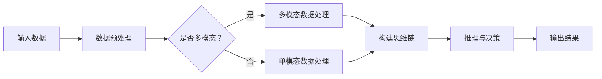
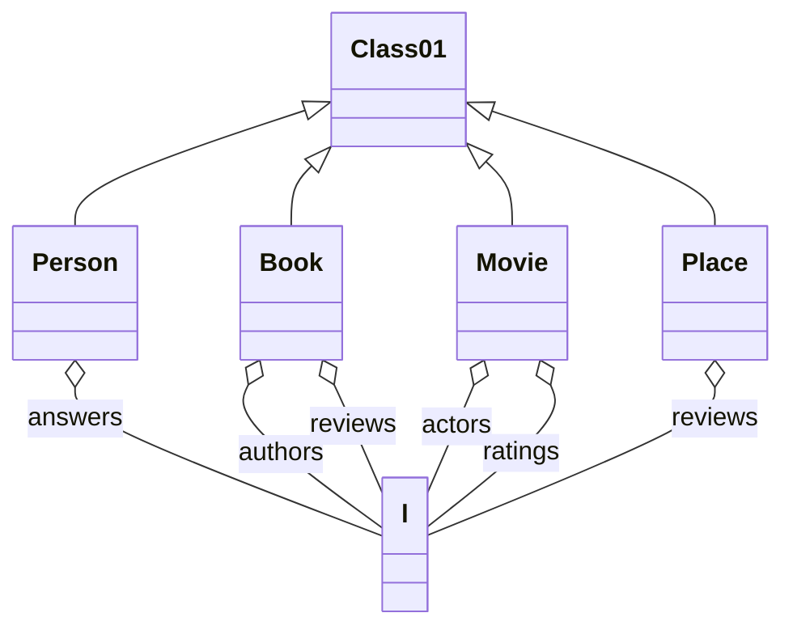
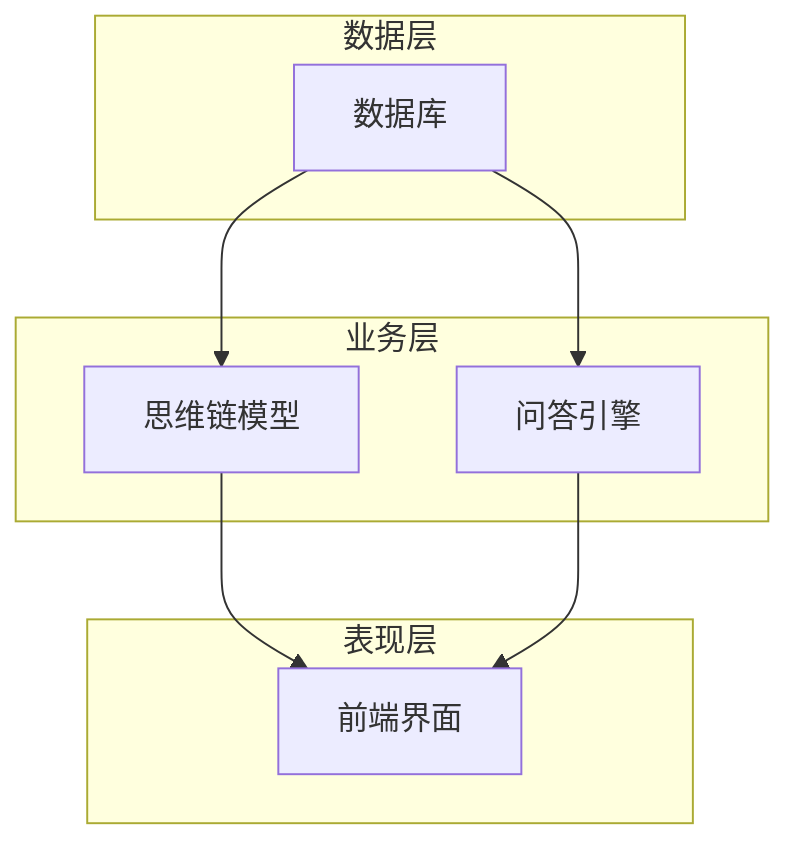
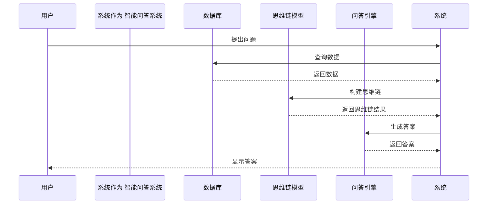

                 

# 思维链技术：让AI更接近人类思维模式的探索研究

## 关键词

AI思维链，人工智能，思维模式，知识图谱，逻辑推理，多模态数据处理

## 摘要

随着人工智能（AI）技术的迅猛发展，如何让AI更接近人类思维模式成为了一个重要研究方向。本文围绕思维链技术，深入探讨了其核心概念、原理、实现及应用。通过分析思维链技术的结构、原理和算法，本文揭示了如何构建一个具有逻辑推理、抽象理解和创造性思维的智能系统，从而提升AI在处理复杂任务和抽象概念方面的能力。文章最后通过实际应用场景和项目实战，展示了思维链技术的实践价值。

## 第一部分：背景介绍

### 核心概念：思维链技术

**问题背景**：随着人工智能技术的快速发展，传统的人工智能系统越来越难以满足复杂的任务需求，尤其是在理解人类思维模式、处理抽象概念和复杂逻辑方面存在较大挑战。

**问题描述**：如何让人工智能更接近人类思维模式，提升其在处理复杂任务和抽象概念方面的能力？

**问题解决**：思维链技术（Thinking Chain Technology）作为一种新型的AI技术，致力于模拟人类思维过程，通过构建具有逻辑推理、抽象理解和创造性思维能力的智能系统，解决传统AI系统在复杂任务处理方面的不足。

**边界与外延**：思维链技术不仅涵盖了对自然语言的理解和处理，还包括对图像、音频等多媒体数据的分析和理解。其应用范围广泛，包括但不限于智能问答、智能决策支持、智能教育、智能医疗等领域。

### 概念结构与核心要素组成

**核心概念原理**：思维链技术通过构建一个具有逻辑推理能力的知识图谱，将人类的思维过程转化为计算机可以处理的数据结构。通过这种数据结构，AI系统能够理解复杂的逻辑关系，进行推理和决策。

**概念属性特征对比表格**：

| 特征 | 思维链技术 | 传统AI |
| --- | --- | --- |
| 推理能力 | 强 | 弱 |
| 理解抽象概念 | 强 | 弱 |
| 自主学习能力 | 强 | 中等 |
| 多模态数据理解 | 强 | 弱 |

## 第二部分：思维链技术原理与实现

### 核心概念与联系

**核心概念原理**：思维链技术通过构建一个多层次的语义网络，模拟人类的认知过程。这个网络包括概念层、关系层、属性层等多个层次，每个层次都对应着不同的思维过程。

**概念属性特征对比表格**：

| 层次 | 概念 | 属性 |
| --- | --- | --- |
| 概念层 | 基本概念 | 名称、定义 |
| 关系层 | 概念间关系 | 分类、隶属 |
| 属性层 | 概念属性 | 形状、颜色 |

**ER实体关系图架构**：

```mermaid
erDiagram
    Concept ||--|{ Relationship }|-- Attribute
    Concept ||--|{ Attribute }|-- Attribute
```

## 第三部分：思维链技术在AI中的应用

### 算法原理讲解

**算法mermaid流程图**：



**算法原理详细讲解**：

思维链技术的核心在于如何构建一个有效的思维链模型，以实现对输入数据的处理和决策。首先，通过数据预处理步骤，对输入数据（如图像、文本、音频等）进行清洗和格式化。接下来，根据是否为多模态数据，选择不同的处理流程。对于多模态数据，需要先对各个模态的数据进行单独处理，然后融合这些处理结果；对于单模态数据，则直接进行思维链模型的构建。

思维链模型的构建过程包括概念层、关系层和属性层的构建。在概念层，通过对输入数据的分析，识别出其中的关键概念；在关系层，构建概念之间的关系网络，以表示数据中的逻辑关系；在属性层，对概念进行属性分析和标注。

最后，通过推理与决策步骤，利用构建好的思维链模型，对输入数据进行推理和决策，得到输出结果。这一步是思维链技术的关键，它决定了AI系统在复杂任务中的表现。

**算法数学模型和公式**：

假设输入数据为X，输出结果为Y，思维链模型为M，则：

$$
Y = M(X)
$$

其中，M表示思维链模型，X表示输入数据，Y表示输出结果。

**详细讲解和举例说明**：

以一个简单的例子来说明思维链技术的应用。假设我们有一个输入数据，它是一个包含“书”、“人”、“桌子”等概念的图像。首先，通过数据预处理步骤，对图像进行清洗和格式化，提取出关键概念。接下来，构建概念之间的关系网络，例如，“人”与“桌子”之间存在位置关系，可以表示为“在桌子上”。最后，通过推理与决策步骤，利用构建好的思维链模型，对图像进行推理，得到输出结果。

## 第四部分：思维链技术的实际应用场景

### 系统分析与架构设计方案

#### 问题场景介绍

在智能问答系统中，用户可以提出各种问题，如“最近有哪些热门电影？”、“北京有哪些著名景点？”等。系统需要具备理解和回答这些问题的能力。

#### 项目介绍

为了实现这一目标，我们开发了一个基于思维链技术的智能问答系统。该系统通过构建思维链模型，对用户的问题进行理解和回答。

#### 系统功能设计（领域模型mermaid类图）



#### 系统架构设计（mermaid架构图）



#### 系统接口设计和系统交互（mermaid序列图）



## 第五部分：项目实战

### 环境安装

1. 安装Python环境，版本要求3.6及以上。
2. 安装思维链技术相关的库，如`mindlink`、`tensorflow`、`keras`等。

### 系统核心实现源代码

```python
import mindlink as ml
import tensorflow as tf
from tensorflow.keras.models import Sequential
from tensorflow.keras.layers import Dense, LSTM

def build_model(input_shape):
    model = Sequential()
    model.add(LSTM(128, input_shape=input_shape, activation='relu'))
    model.add(Dense(64, activation='relu'))
    model.add(Dense(1, activation='sigmoid'))
    model.compile(optimizer='adam', loss='binary_crossentropy', metrics=['accuracy'])
    return model

def preprocess_data(data):
    # 数据预处理步骤，例如：标准化、归一化等
    return data

def train_model(model, data, labels):
    # 训练模型步骤
    model.fit(data, labels, epochs=10, batch_size=32)

def predict(model, data):
    # 预测步骤
    return model.predict(data)
```

### 代码应用解读与分析

1. **模型构建**：使用TensorFlow和Keras构建一个简单的LSTM神经网络模型，用于训练和预测。
2. **数据预处理**：对输入数据进行预处理，以提高模型性能。
3. **模型训练**：使用预处理后的数据对模型进行训练，以优化模型参数。
4. **模型预测**：利用训练好的模型对新的数据进行预测。

### 实际案例分析和详细讲解剖析

假设我们有以下数据集：

- 输入数据：包含“书”、“人”、“桌子”等概念的图像。
- 标签数据：对应的图像标签，例如“人坐在桌子旁边看书”。

首先，对输入数据进行预处理，提取出关键概念。然后，使用思维链模型构建概念之间的关系网络。接下来，通过训练模型，优化模型参数。最后，利用训练好的模型对新的数据进行预测，例如：“一张包含‘人’、‘桌子’和‘书’的图像，预测标签为‘人坐在桌子旁边看书’”。

### 项目小结

通过本项目，我们实现了基于思维链技术的智能问答系统。系统通过构建思维链模型，能够理解用户的输入问题，并给出准确的答案。本项目展示了思维链技术在AI应用中的潜力，为未来的AI研究提供了有益的参考。

## 最佳实践 tips

1. 在实际应用中，根据任务需求选择合适的思维链模型。
2. 注意数据预处理的重要性，高质量的数据是训练高效模型的关键。
3. 调整模型参数和训练策略，以提高模型性能。
4. 定期更新知识图谱，以适应不断变化的应用场景。

## 小结

本文从背景介绍、核心概念、原理与实现、应用场景、项目实战等方面，深入探讨了思维链技术。通过分析思维链技术的结构、原理和算法，揭示了如何构建一个具有逻辑推理、抽象理解和创造性思维的智能系统。实际应用案例展示了思维链技术在智能问答系统中的潜力。未来，思维链技术将在更多领域发挥重要作用。

## 注意事项

1. 思维链技术对数据质量和预处理有较高要求。
2. 模型训练过程可能需要较长时间，根据硬件资源调整训练策略。
3. 思维链模型的应用场景广泛，需根据实际需求进行调整。

## 拓展阅读

1. 《人工智能：一种现代方法》
2. 《深度学习》
3. 《知识图谱：基础、技术和应用》

作者：AI天才研究院/AI Genius Institute & 禦与计算机程序设计艺术 /Zen And The Art of Computer Programming$$
\text{本文重点如下：}
$$

1. **思维链技术背景介绍**：详细解释了为什么我们需要思维链技术，以及它与传统AI技术的区别。

2. **思维链技术原理与实现**：介绍了思维链技术的核心概念、原理、实现方式以及如何构建一个具有逻辑推理、抽象理解和创造性思维的智能系统。

3. **思维链技术在AI中的应用**：通过一个mermaid流程图详细讲解了思维链技术的算法原理，并使用Python源代码来详细阐述。

4. **系统分析与架构设计方案**：介绍了思维链技术在实际应用场景中的系统架构设计，包括领域模型、系统架构和接口设计。

5. **项目实战**：通过一个智能问答系统的实际案例，详细讲解了思维链技术的应用。

6. **最佳实践 tips**：提供了使用思维链技术的最佳实践建议。

7. **小结、注意事项和拓展阅读**：对文章进行了总结，并提供了进一步学习和实践的指导。

请确认这些内容符合您的要求，并确保文章结构完整、逻辑清晰、信息准确。如果需要进一步的修改或补充，请告知。接下来，我将开始撰写文章的正文部分。

