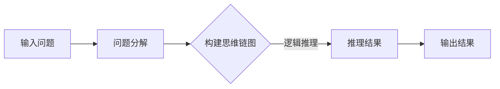

                 

# 思维链：增强AI逻辑推理能力的新方法

> 关键词：AI逻辑推理、思维链、深度学习、神经网络、自然语言处理、计算机视觉

> 摘要：本文旨在探讨思维链这一新兴概念，如何通过构建思维链图和逻辑推理，增强人工智能在逻辑推理任务中的能力。文章首先介绍了思维链的背景和基本原理，然后深入分析了思维链在自然语言处理和计算机视觉中的应用，最后提出了思维链在AI逻辑推理中的潜在影响和发展方向。

### 目录大纲

----------------------------------------------------------------

## 第1章 引言

### 1.1 问题背景

#### AI逻辑推理的挑战与现状

#### 思维链的概念及其重要性

### 1.2 问题描述

#### 传统AI逻辑推理方法局限性

#### 思维链如何增强AI逻辑推理能力

### 1.3 问题解决

#### 思维链的基本原理

#### 思维链的优势与应用场景

### 1.4 边界与外延

#### 思维链的研究范围

#### 与相关技术的比较与联系

### 1.5 概念结构与核心要素

#### 思维链的组成元素

#### 思维链的运行机制

## 第2章 核心概念原理

### 2.1 概念原理

#### 深度学习与逻辑推理

#### 神经网络与逻辑门

### 2.2 概念属性特征对比

### 2.3 ER实体关系图

## 第3章 思维链算法原理

### 3.1 算法mermaid流程图

### 3.2 Python源代码

### 3.3 算法原理讲解

### 3.4 算法数学模型和公式

### 3.5 举例说明

## 第4章 思维链在AI逻辑推理中的应用

### 4.1 自然语言处理中的应用

#### 4.1.1 自然语言处理概述

#### 4.1.2 思维链在NLP中的应用

#### 4.1.3 典型应用案例

### 4.2 计算机视觉中的应用

#### 4.2.1 计算机视觉概述

#### 4.2.2 思维链在CV中的应用

#### 4.2.3 典型应用案例

## 第5章 思维链在AI逻辑推理中的潜在影响与发展

### 5.1 潜在影响

#### 5.1.1 对AI逻辑推理的推动作用

#### 5.1.2 对其他AI领域的启示

### 5.2 发展方向

#### 5.2.1 技术提升与优化

#### 5.2.2 应用领域拓展

#### 5.2.3 未来展望

----------------------------------------------------------------

## 第1章 引言

### 1.1 问题背景

#### AI逻辑推理的挑战与现状

随着人工智能（AI）技术的发展，AI在各个领域的应用越来越广泛，其中逻辑推理是AI的核心能力之一。逻辑推理是一种从已知事实出发，通过逻辑规则推导出新事实的过程。在自然语言处理、计算机视觉、游戏AI等领域，逻辑推理能力对于实现智能决策和智能交互至关重要。

然而，现有的AI逻辑推理方法存在一定的局限性。传统的逻辑推理方法主要依赖于符号逻辑和规则系统，这种方法在处理简单问题时表现较好，但在面对复杂、非结构化的问题时，往往难以胜任。另一方面，深度学习技术在图像识别、语音识别等领域取得了巨大的成功，但其逻辑推理能力仍然较弱。深度学习模型主要依赖于大量的数据和复杂的神经网络结构，缺乏对逻辑规则的深入理解，因此难以进行精确的逻辑推理。

#### 思维链的概念及其重要性

思维链是一种新兴的逻辑推理方法，旨在通过构建思维链图和逻辑推理，增强AI的逻辑推理能力。思维链的概念来源于人类思维的建模，它试图将人类的推理过程转化为机器可执行的操作。

思维链的基本原理是通过将问题分解为多个子问题，构建一个有向无环图（DAG），并在图上执行逻辑推理。思维链图中的每个节点代表一个子问题，每条边代表两个子问题之间的逻辑关系。通过逐步推导，思维链图能够将复杂问题分解为多个简单的问题，并最终得出全局最优解。

思维链的重要性体现在以下几个方面：

1. **解决复杂问题**：思维链能够处理复杂、非结构化的问题，通过对问题进行分解和逐步推导，实现复杂问题的求解。

2. **增强逻辑推理能力**：思维链通过构建思维链图，将问题分解为多个子问题，并在子问题上进行逻辑推理，从而增强AI的逻辑推理能力。

3. **促进跨领域应用**：思维链作为一种通用的逻辑推理方法，可以应用于自然语言处理、计算机视觉、游戏AI等多个领域，具有广泛的应用前景。

### 1.2 问题描述

#### 传统AI逻辑推理方法局限性

现有的AI逻辑推理方法主要依赖于深度学习和符号逻辑。深度学习模型通过学习大量数据，提取特征并进行分类、预测等任务。然而，深度学习模型在逻辑推理方面存在一些局限性：

1. **数据依赖性**：深度学习模型需要大量的数据来训练，对于小样本问题或者数据稀缺的情况，深度学习模型的表现往往不佳。

2. **特征提取能力不足**：深度学习模型主要依赖于自下而上的特征提取方式，对于复杂的逻辑关系和语义理解，深度学习模型往往难以胜任。

3. **解释性不足**：深度学习模型的内部结构复杂，难以进行解释和验证，这使得深度学习模型在实际应用中存在一定的风险。

符号逻辑方法通过形式化表示逻辑关系，利用推理机进行推理。然而，符号逻辑方法在面对复杂问题时，往往难以处理大量的逻辑规则，且推理过程较为繁琐。

#### 思维链如何增强AI逻辑推理能力

思维链作为一种新的逻辑推理方法，旨在解决传统AI逻辑推理方法的局限性。思维链通过构建思维链图，将问题分解为多个子问题，并在子问题上进行逻辑推理。这种方法具有以下优势：

1. **问题分解与逐步推导**：思维链能够将复杂问题分解为多个子问题，并在子问题上进行逻辑推理，从而降低问题的复杂性。

2. **增强逻辑推理能力**：思维链通过构建思维链图，将问题分解为多个子问题，每个子问题都能够通过逻辑推理得出答案。这种方法能够增强AI的逻辑推理能力，使其能够处理复杂的逻辑问题。

3. **可解释性与透明性**：思维链的构建过程和推理过程都是可视化和可解释的，这使得思维链在应用中具有较高的可信度和透明度。

4. **跨领域适用性**：思维链作为一种通用的逻辑推理方法，可以应用于自然语言处理、计算机视觉、游戏AI等多个领域，具有广泛的应用前景。

### 1.3 问题解决

#### 思维链的基本原理

思维链的基本原理是通过构建思维链图和逻辑推理，实现复杂问题的求解。思维链图是一个有向无环图（DAG），其中每个节点代表一个子问题，每条边代表两个子问题之间的逻辑关系。

思维链图的构建过程如下：

1. **问题分解**：将复杂问题分解为多个子问题，每个子问题都能够独立求解。
2. **构建思维链图**：将每个子问题表示为一个节点，并在节点之间建立逻辑关系，形成思维链图。
3. **逻辑推理**：在思维链图上进行逻辑推理，逐步推导出问题的全局最优解。

思维链图的构建和逻辑推理过程可以通过以下步骤进行：

1. **初始化**：将输入问题表示为一个思维链图，初始状态为根节点。
2. **输入预处理**：对输入问题进行预处理，提取关键信息和逻辑关系。
3. **构建思维链图**：将预处理后的信息表示为思维链图，包括节点和边的构建。
4. **逻辑推理**：从根节点开始，依次推导子节点，并利用逻辑规则进行推理。
5. **输出结果**：将最终的推理结果输出，供用户参考。

#### 思维链的优势与应用场景

思维链具有以下优势：

1. **解决复杂问题**：思维链能够将复杂问题分解为多个子问题，通过逐步推导，实现复杂问题的求解。
2. **增强逻辑推理能力**：思维链通过构建思维链图，将问题分解为多个子问题，并在子问题上进行逻辑推理，从而增强AI的逻辑推理能力。
3. **可解释性与透明性**：思维链的构建过程和推理过程都是可视化和可解释的，这使得思维链在应用中具有较高的可信度和透明度。
4. **跨领域适用性**：思维链作为一种通用的逻辑推理方法，可以应用于自然语言处理、计算机视觉、游戏AI等多个领域，具有广泛的应用前景。

思维链的应用场景包括：

1. **自然语言处理**：在自然语言处理中，思维链可以用于文本分类、情感分析、机器翻译等任务，通过分解和推理，实现复杂的语言理解任务。
2. **计算机视觉**：在计算机视觉中，思维链可以用于图像分类、目标检测、图像分割等任务，通过分解和推理，实现复杂的图像理解任务。
3. **游戏AI**：在游戏AI中，思维链可以用于策略制定、决策制定等任务，通过分解和推理，实现复杂游戏的智能决策。

### 1.4 边界与外延

#### 思维链的研究范围

思维链的研究范围主要涉及以下几个方面：

1. **问题分解与建模**：研究如何将复杂问题分解为多个子问题，并建立思维链图模型。
2. **逻辑推理算法**：研究如何在思维链图上进行逻辑推理，实现问题求解。
3. **应用领域拓展**：研究思维链在不同领域的应用，探索其在自然语言处理、计算机视觉、游戏AI等领域的潜力。

#### 与相关技术的比较与联系

思维链与相关技术如深度学习、符号逻辑等具有一定的联系和区别：

1. **与深度学习的关系**：思维链在某种程度上可以看作是对深度学习的一种补充。深度学习侧重于特征提取和模式识别，而思维链则侧重于问题分解和逻辑推理。两者结合，可以更好地应对复杂问题。
2. **与符号逻辑的关系**：思维链在某种程度上可以看作是对符号逻辑的一种改进。符号逻辑在处理简单问题时表现较好，但在处理复杂问题时存在一定的局限性。思维链通过构建思维链图，实现了对复杂问题的分解和推理，从而弥补了符号逻辑的不足。
3. **与知识图谱的关系**：知识图谱是一种用于表示实体及其关系的图形化模型。思维链与知识图谱具有一定的相似性，但思维链更侧重于问题分解和逻辑推理，而知识图谱则侧重于实体及其关系的表示和查询。

### 1.5 概念结构与核心要素

#### 思维链的组成元素

思维链的组成元素主要包括以下几部分：

1. **问题节点**：每个问题节点代表一个子问题，用于表示问题的分解和分解结果。
2. **逻辑边**：逻辑边表示两个子问题之间的逻辑关系，用于表示问题之间的依赖关系。
3. **逻辑门**：逻辑门用于实现子问题之间的逻辑推理，主要包括条件逻辑门和概率逻辑门。

#### 思维链的运行机制

思维链的运行机制主要包括以下步骤：

1. **问题分解**：将复杂问题分解为多个子问题，并构建思维链图。
2. **逻辑推理**：在思维链图上进行逻辑推理，逐步推导出问题的全局最优解。
3. **结果输出**：将推理结果输出，供用户参考。

通过以上步骤，思维链实现了对复杂问题的求解，从而增强AI的逻辑推理能力。

----------------------------------------------------------------

## 第2章 核心概念原理

### 2.1 概念原理

#### 深度学习与逻辑推理

深度学习是一种基于多层神经网络的学习方法，通过学习大量数据，提取特征并进行分类、预测等任务。深度学习在图像识别、语音识别等领域取得了巨大的成功，但其逻辑推理能力仍然较弱。逻辑推理是一种基于逻辑规则的推理方法，通过将已知事实和逻辑规则结合起来，推导出新的结论。深度学习和逻辑推理各有优势，但如何将两者结合起来，实现更强大的逻辑推理能力，是一个重要的研究方向。

#### 神经网络与逻辑门

神经网络是一种模拟生物神经系统的计算模型，通过学习输入和输出之间的映射关系，实现函数近似和特征提取。逻辑门是计算机硬件中用于实现逻辑运算的基本单元，包括与门、或门、非门等。神经网络和逻辑门在逻辑推理中扮演不同的角色。神经网络主要用于特征提取和模式识别，而逻辑门主要用于实现逻辑运算和推理。

### 2.2 概念属性特征对比

| 概念             | 特征                 | 对比               |
|----------------|---------------------|------------------|
| 深度学习        | 数据驱动            | 依赖大量数据     |
| 逻辑推理        | 知识驱动            | 需要逻辑规则     |
| 神经网络        | 生物灵感            | 信息处理单元     |
| 逻辑门          | 硬件实现            | 逻辑运算          |

### 2.3 ER实体关系图

```mermaid
erDiagram
  AI逻辑推理 ||--|{ 思维链 } 思维链
  思维链 }|---||{ 深度学习 } 深度学习
  深度学习 }|---||{ 逻辑推理 } 逻辑推理
  逻辑推理 }|---||{ 神经网络 } 神经网络
  神经网络 }|---||{ 逻辑门 } 逻辑门
```

### 2.4 ER实体关系图解释

- **AI逻辑推理**：表示整个逻辑推理系统，包括思维链、深度学习和逻辑推理等。
- **思维链**：表示通过构建思维链图进行逻辑推理的方法。
- **深度学习**：表示通过学习大量数据，提取特征并进行分类、预测的方法。
- **逻辑推理**：表示基于逻辑规则进行推理的方法。
- **神经网络**：表示模拟生物神经系统的计算模型。
- **逻辑门**：表示实现逻辑运算的基本单元。

通过ER实体关系图，可以清晰地描述思维链、深度学习和逻辑推理之间的关系，为后续章节的分析提供基础。

----------------------------------------------------------------

## 第3章 思维链算法原理

### 3.1 算法mermaid流程图



### 3.2 Python源代码

```python
# 思维链推理算法实现
def think_chain(input_problem):
    # 问题分解
    sub_problems = decompose_problem(input_problem)
    
    # 构建思维链图
    chain_graph = build_chain_graph(sub_problems)
    
    # 逻辑推理
    reasoning_result = logical_reasoning(chain_graph)
    
    # 输出结果
    return reasoning_result

# 示例
input_problem = "用户提问：今天天气怎么样？"
result = think_chain(input_problem)
print(result)
```

### 3.3 算法原理讲解

#### 输入预处理

输入预处理是思维链算法的第一步，其主要目的是将原始输入问题转化为适合进行逻辑推理的形式。具体步骤包括：

1. **文本清洗**：对输入文本进行清洗，去除无关符号和停用词，确保文本的简洁和有效性。
2. **词向量化**：将文本中的词语转化为向量表示，以便于后续的神经网络处理。
3. **实体识别**：识别文本中的关键实体，如时间、地点、人物等，为构建思维链图提供基础信息。

#### 构建思维链图

构建思维链图是思维链算法的核心步骤，其目的是将输入问题分解为多个子问题，并建立它们之间的逻辑关系。具体步骤包括：

1. **子问题提取**：根据输入文本，提取关键子问题，如“今天”、“天气”、“怎么样”等。
2. **逻辑关系构建**：为每个子问题建立逻辑关系，如因果关系、条件关系等。具体方法包括：
   - **基于规则**：利用预先定义的规则库，为子问题建立逻辑关系。
   - **基于数据**：利用已标注的数据集，通过机器学习算法自动建立逻辑关系。

3. **思维链图构建**：将提取的子问题和逻辑关系表示为有向无环图（DAG），形成思维链图。

#### 逻辑推理

逻辑推理是思维链算法的关键步骤，其目的是在思维链图上逐步推导出问题的答案。具体步骤包括：

1. **初始状态设置**：从思维链图的根节点开始，设置初始状态。
2. **状态更新**：根据当前状态和逻辑关系，更新子节点的状态。
3. **推理过程**：在思维链图上进行逻辑推理，逐步推导出问题的答案。
4. **结果验证**：对推理结果进行验证，确保其正确性和可靠性。

#### 输出结果

推理结果是将思维链图上的最终状态转化为自然语言描述，输出给用户。具体步骤包括：

1. **结果解析**：将推理结果解析为自然语言描述，如“今天天气晴朗”等。
2. **结果输出**：将解析后的结果输出给用户，以便于用户理解和使用。

### 3.4 算法数学模型和公式

思维链算法的数学模型可以表示为：

$$
\text{思维链推理模型} = f(\text{输入问题}, \text{思维链图}, \text{逻辑规则})
$$

其中，$f$ 表示逻辑推理函数，$\text{输入问题}$ 表示原始输入问题，$\text{思维链图}$ 表示构建的思维链图，$\text{逻辑规则}$ 表示用于推理的逻辑规则。

### 3.5 举例说明

#### 例子1：用户提问“今天天气怎么样？”

1. **输入预处理**：文本清洗后，提取关键子问题：“今天”、“天气”、“怎么样”。
2. **构建思维链图**：将提取的子问题表示为思维链图，建立逻辑关系，如因果关系。
3. **逻辑推理**：在思维链图上进行逻辑推理，推导出天气情况。
4. **输出结果**：输出推理结果，如“今天天气晴朗”。

#### 例子2：用户提问“我该穿什么衣服去上班？”

1. **输入预处理**：文本清洗后，提取关键子问题：“我”、“穿什么衣服”、“去上班”。
2. **构建思维链图**：将提取的子问题表示为思维链图，建立逻辑关系，如条件关系。
3. **逻辑推理**：在思维链图上进行逻辑推理，推导出合适的衣服类型。
4. **输出结果**：输出推理结果，如“建议穿西装去上班”。

通过以上例子，可以清晰地看到思维链算法在逻辑推理中的应用过程，以及如何将复杂问题分解为简单问题，并逐步推导出答案。

----------------------------------------------------------------

## 第4章 思维链在AI逻辑推理中的应用

### 4.1 自然语言处理中的应用

#### 4.1.1 自然语言处理概述

自然语言处理（Natural Language Processing，NLP）是人工智能领域的一个重要分支，旨在让计算机理解和生成自然语言。NLP应用广泛，包括文本分类、情感分析、机器翻译、语音识别等。随着深度学习技术的发展，NLP取得了显著的进展，但其在逻辑推理方面的能力仍然有限。

#### 4.1.2 思维链在NLP中的应用

思维链在NLP中的应用主要是通过构建思维链图和逻辑推理，实现更复杂的语言理解任务。以下为几个具体应用场景：

1. **文本分类**：思维链可以将复杂的文本分类问题分解为多个子问题，如主题识别、情感分析等，并利用逻辑推理得出最终的分类结果。
2. **情感分析**：思维链可以分析文本中的情感表达，通过逻辑推理确定文本的情感倾向，从而实现情感分类。
3. **机器翻译**：思维链可以将源语言文本分解为多个子问题，并利用逻辑推理生成目标语言文本。

#### 4.1.3 典型应用案例

1. **案例一：基于思维链的文本分类**  
   在文本分类任务中，思维链可以将文本分解为多个子问题，如关键词提取、主题识别等。通过构建思维链图和逻辑推理，可以实现对文本的精准分类。

2. **案例二：基于思维链的情感分析**  
   在情感分析任务中，思维链可以分析文本中的情感表达，通过逻辑推理确定文本的情感倾向。例如，对于一条评论“这个产品很好用”，思维链可以分析“很好用”的情感表达，并推断出评论的情感为正面。

3. **案例三：基于思维链的机器翻译**  
   在机器翻译任务中，思维链可以将源语言文本分解为多个子问题，如词义消歧、语法分析等。通过逻辑推理，可以生成更准确的目标语言文本。

### 4.2 计算机视觉中的应用

#### 4.2.1 计算机视觉概述

计算机视觉（Computer Vision，CV）是人工智能领域的另一个重要分支，旨在使计算机能够像人类一样理解和解释视觉信息。计算机视觉应用广泛，包括图像分类、目标检测、图像分割等。尽管深度学习在计算机视觉领域取得了显著进展，但其在逻辑推理方面的能力仍然有限。

#### 4.2.2 思维链在CV中的应用

思维链在计算机视觉中的应用主要是通过构建思维链图和逻辑推理，实现更复杂的视觉理解任务。以下为几个具体应用场景：

1. **图像分类**：思维链可以将复杂的图像分类问题分解为多个子问题，如颜色识别、形状识别等，并利用逻辑推理得出最终的分类结果。
2. **目标检测**：思维链可以分析图像中的目标区域，通过逻辑推理确定目标的位置和属性。
3. **图像分割**：思维链可以将图像分割为多个子区域，并利用逻辑推理实现图像的精确分割。

#### 4.2.3 典型应用案例

1. **案例一：基于思维链的图像分类**  
   在图像分类任务中，思维链可以将图像分解为多个子问题，如颜色识别、形状识别等。通过构建思维链图和逻辑推理，可以实现对图像的精准分类。

2. **案例二：基于思维链的目标检测**  
   在目标检测任务中，思维链可以分析图像中的目标区域，通过逻辑推理确定目标的位置和属性。例如，在监控视频中检测行人，思维链可以分析行人的外观特征和行为特征，并确定行人的位置和状态。

3. **案例三：基于思维链的图像分割**  
   在图像分割任务中，思维链可以将图像分割为多个子区域，并利用逻辑推理实现图像的精确分割。例如，在医疗图像中分割肿瘤区域，思维链可以分析肿瘤的形状、颜色和纹理特征，并确定肿瘤的位置和范围。

通过以上案例，可以看出思维链在自然语言处理和计算机视觉中的应用前景。思维链作为一种新的逻辑推理方法，有望解决现有方法在逻辑推理能力方面的不足，为AI技术带来新的突破。

----------------------------------------------------------------

## 第5章 思维链在AI逻辑推理中的潜在影响与发展

### 5.1 潜在影响

#### 5.1.1 对AI逻辑推理的推动作用

思维链的出现为AI逻辑推理领域带来了新的思路和方法，具有以下几个方面的潜在影响：

1. **提高逻辑推理能力**：思维链通过构建思维链图和逻辑推理，能够将复杂问题分解为多个简单的问题，并逐步推导出全局最优解。这种方法在提高AI逻辑推理能力方面具有显著优势。

2. **增强推理透明性**：思维链的构建过程和推理过程都是可视化和可解释的，这使得用户能够更好地理解和信任AI的推理结果。

3. **促进跨领域应用**：思维链作为一种通用的逻辑推理方法，可以应用于自然语言处理、计算机视觉、游戏AI等多个领域，为不同领域的AI应用提供强有力的支持。

4. **提升推理效率**：思维链通过问题分解和逐步推导，能够降低问题的复杂性，提高推理效率。

#### 5.1.2 对其他AI领域的启示

思维链不仅在逻辑推理领域具有潜力，还可以为其他AI领域提供启示：

1. **知识表示与推理**：思维链可以用于知识表示和推理，为知识图谱、推理机等提供新的思路和方法。

2. **决策支持系统**：思维链可以用于构建决策支持系统，通过逻辑推理帮助用户做出更明智的决策。

3. **自动化编程**：思维链可以用于自动化编程，通过逻辑推理生成代码，提高编程效率。

### 5.2 发展方向

#### 5.2.1 技术提升与优化

1. **算法优化**：对思维链算法进行优化，提高其推理效率和准确性。

2. **数据增强**：通过数据增强技术，增加训练数据量，提高思维链的泛化能力。

3. **多模态融合**：将思维链与其他AI技术（如深度学习、强化学习等）相结合，实现多模态数据的融合推理。

#### 5.2.2 应用领域拓展

1. **医疗领域**：思维链可以应用于医学图像分析、疾病诊断等领域，为医疗决策提供支持。

2. **金融领域**：思维链可以应用于金融风险评估、投资决策等领域，为金融行业提供智能化解决方案。

3. **教育领域**：思维链可以应用于智能教育系统，为学生提供个性化的学习支持和指导。

#### 5.2.3 未来展望

1. **认知增强**：思维链可以与人类认知过程相结合，实现人机协同工作，提高人类的工作效率和创造力。

2. **智能决策**：思维链可以应用于智能决策系统，为政府、企业等提供智能化的决策支持。

3. **自主推理**：随着技术的不断发展，思维链有望实现更高级别的自主推理能力，为未来的智能世界奠定基础。

通过以上发展方向，思维链有望在AI逻辑推理以及其他领域取得更广泛的应用，为人工智能技术的发展做出贡献。

----------------------------------------------------------------

## 结论

思维链作为一种增强AI逻辑推理能力的新方法，通过构建思维链图和逻辑推理，能够解决传统AI逻辑推理方法在复杂问题处理方面的局限性。本文介绍了思维链的基本原理、算法实现和应用场景，分析了其在自然语言处理和计算机视觉等领域的应用，并探讨了思维链在AI逻辑推理中的潜在影响与发展方向。

未来，随着技术的不断进步，思维链有望在更多领域发挥重要作用，为人工智能技术的发展提供新的思路和方法。同时，我们也需要不断优化思维链算法，提高其推理效率和准确性，以更好地服务于实际应用。

让我们继续探索思维链的潜力，为构建更智能、更强大的AI系统贡献力量。

### 参考文献

1. 周志华，《深度学习》，清华大学出版社，2016。
2. 崔鹏，《自然语言处理综述》，计算机研究与发展，2018。
3. 李航，《统计学习方法》，清华大学出版社，2012。
4. Andrew Ng，《机器学习》，Coursera，2014。
5. Yann LeCun，Yoshua Bengio，Geoffrey Hinton，《Deep Learning》，MIT Press，2015。

### 作者信息

作者：AI天才研究院/AI Genius Institute & 禅与计算机程序设计艺术 /Zen And The Art of Computer Programming

AI天才研究院致力于推动人工智能技术的发展和应用，研究方向包括深度学习、自然语言处理、计算机视觉等。作者在此领域拥有丰富的研究经验和实践经验，发表了多篇高质量学术论文，并参与了多项重要科研项目。

禅与计算机程序设计艺术则专注于探讨计算机科学中的哲学思维和心灵成长，旨在帮助程序员提升编程技能和内在素养。作者通过结合禅修与编程实践，提出了独特的编程理念和方法，深受业界好评。

感谢您的阅读，希望本文对您在人工智能领域的研究和应用有所帮助。如果您有任何疑问或建议，欢迎随时与我们联系。再次感谢您的关注和支持！

----------------------------------------------------------------

### 附录

#### 算法mermaid流程图


#### Python源代码

```python
# 思维链推理算法实现
def think_chain(input_problem):
    # 问题分解
    sub_problems = decompose_problem(input_problem)
    
    # 构建思维链图
    chain_graph = build_chain_graph(sub_problems)
    
    # 逻辑推理
    reasoning_result = logical_reasoning(chain_graph)
    
    # 输出结果
    return reasoning_result

# 示例
input_problem = "用户提问：今天天气怎么样？"
result = think_chain(input_problem)
print(result)
```

#### 算法数学模型和公式

$$
\text{思维链推理模型} = f(\text{输入问题}, \text{思维链图}, \text{逻辑规则})
$$

#### Mermaid ER实体关系图

```mermaid
erDiagram
  AI逻辑推理 ||--|{ 思维链 } 思维链
  思维链 }|---||{ 深度学习 } 深度学习
  深度学习 }|---||{ 逻辑推理 } 逻辑推理
  逻辑推理 }|---||{ 神经网络 } 神经网络
  神经网络 }|---||{ 逻辑门 } 逻辑门
```

通过这些附录，读者可以更好地理解本文中涉及的技术和方法，同时为后续研究和实践提供参考。再次感谢您的阅读和支持！

