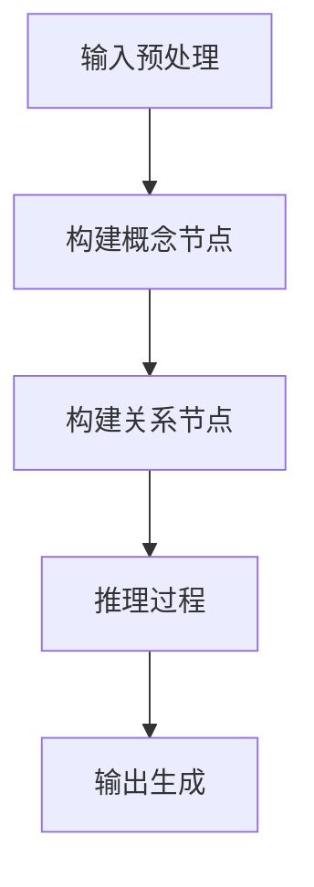
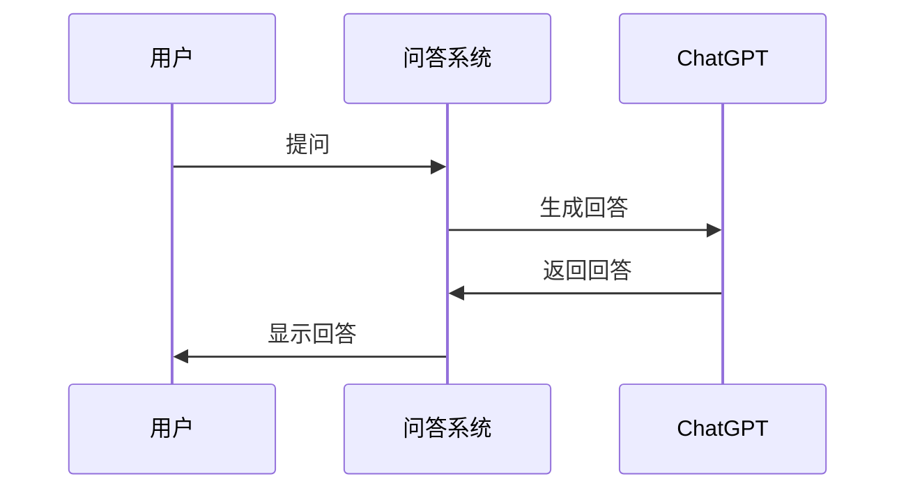
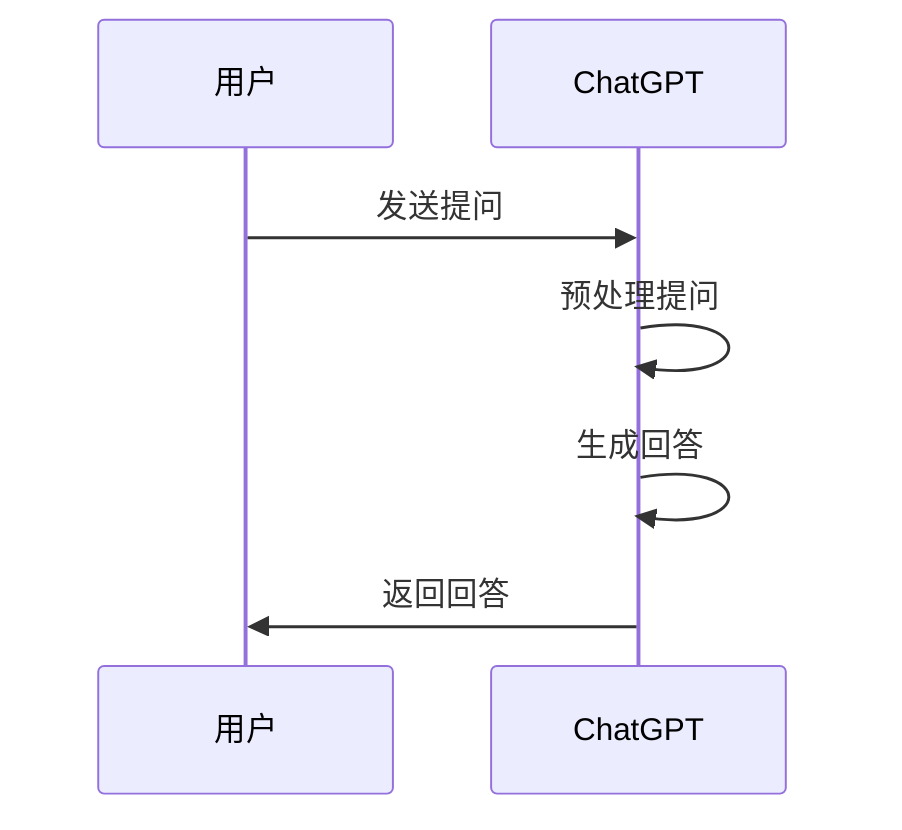

                 


### 1. 设计文章标题与关键词

首先，我们需要设计一个吸引人的文章标题和关键词。文章标题是《思维链：提升ChatGPT输出质量的关键》，关键词包括：

- 思维链
- ChatGPT
- 输出质量
- 人工智能
- 算法优化

### 2. 编写文章摘要

接下来，我们需要编写文章摘要，以概述文章的核心内容和主题思想：

> 本文章将深入探讨思维链的概念，以及如何通过引入思维链来提升ChatGPT的输出质量。我们将从背景介绍、核心概念解析、算法原理讲解、数学模型与应用等方面进行详细阐述，并分享一些最佳实践和注意事项。

### 3. 撰写引言与概述部分

**第1章: 问题背景与定义**
#### 1.1.1 背景介绍
在这一部分，我们将简要介绍ChatGPT及其在人工智能领域的应用。
#### 1.1.2 问题描述
接下来，我们将明确ChatGPT输出质量问题，包括常见问题及其影响。
#### 1.1.3 思维链概念
我们将对思维链进行定义，解释其作用和重要性。
#### 1.1.4 输出质量关键
我们将探讨思维链如何影响ChatGPT的输出质量。

**第2章: ChatGPT基础**
#### 2.1 ChatGPT简介
介绍ChatGPT的基本原理和特点。
#### 2.2 GPT模型的工作原理
解释GPT模型的工作机制。
#### 2.3 ChatGPT的优势与限制
分析ChatGPT的优势和限制，以及可能面临的问题。

### 4. 详细阐述思维链原理与技术部分

**第3章: 思维链核心概念**
#### 3.1 思维链的组成
详细描述思维链的组成部分。
#### 3.2 思维链的工作机制
解释思维链如何工作，以及其工作机制的细节。
#### 3.3 思维链的属性特征对比
通过表格和ER实体关系图，对比思维链与其他相关技术的属性特征。

**第4章: 思维链与GPT模型**
#### 4.1 思维链与GPT模型的关联
阐述思维链与GPT模型之间的关联。
#### 4.2 思维链在GPT模型中的实现
解释如何在GPT模型中实现思维链。
#### 4.3 思维链与GPT模型的优化策略
探讨如何通过思维链优化GPT模型的输出质量。

**第5章: 思维链算法原理**
#### 5.1 算法概述
介绍思维链算法的基本概念。
#### 5.2 Mermaid算法流程图
使用Mermaid画出思维链算法的流程图。
#### 5.3 Python算法实现与解释
提供Python源代码，并解释算法原理和数学模型。

**第6章: 数学模型与公式**
#### 6.1 数学模型介绍
介绍用于描述思维链的数学模型。
#### 6.2 数学公式讲解
详细讲解数学公式及其含义。
#### 6.3 具体例子说明
通过具体例子，说明数学模型的应用。

### 5. 实践与应用部分

**第7章: 系统分析与架构设计**
#### 7.1 问题场景介绍
描述具体的问题场景。
#### 7.2 系统功能设计（Mermaid类图）
使用Mermaid绘制系统功能设计类图。
#### 7.3 系统架构设计（Mermaid架构图）
使用Mermaid绘制系统架构设计图。
#### 7.4 系统接口设计和系统交互（Mermaid序列图）
使用Mermaid绘制系统接口设计和交互序列图。

**第8章: 项目实战**
#### 8.1 环境安装与配置
详细描述环境安装和配置步骤。
#### 8.2 系统核心实现源代码
提供系统核心实现的源代码。
#### 8.3 代码应用解读与分析
解读和分析系统核心实现代码。
#### 8.4 实际案例分析与详细讲解剖析
分析实际案例，并进行详细讲解剖析。
#### 8.5 项目小结
总结项目经验，提出改进建议。

**第9章: 最佳实践与拓展**
#### 9.1 最佳实践技巧
分享一些最佳实践技巧。
#### 9.2 注意事项
列出需要注意的事项。
#### 9.3 拓展阅读
推荐一些拓展阅读材料。

通过以上步骤，我们可以确保文章内容丰富、结构清晰、逻辑性强，满足字数要求和格式规范。在撰写过程中，我们将不断回顾和优化各个部分的内容，确保文章的完整性和专业性。

### 撰写详细章节内容

**第1章: 问题背景与定义**

**1.1.1 背景介绍**
ChatGPT是由OpenAI开发的一种基于GPT-3模型的高级语言模型，它能够理解和生成自然语言文本，广泛应用于问答系统、对话代理、文本生成和翻译等领域。随着人工智能技术的不断发展，ChatGPT在多个场景中的表现越来越优秀，但其输出质量仍存在一定的问题，如生成文本的准确性、连贯性和创意性等。这些问题的存在限制了ChatGPT在实际应用中的效果。

**1.1.2 问题描述**
ChatGPT输出质量问题的常见表现包括：
1. 文本生成的准确性不足，容易产生语法错误、事实错误和语义错误。
2. 文本生成的连贯性差，生成的段落之间缺乏逻辑连接，导致阅读体验不佳。
3. 文本生成的创意性不足，生成的文本缺乏创新和独特性，难以满足个性化需求。

**1.1.3 思维链概念**
思维链是一种用于提升人工智能模型输出质量的思维方式，它通过构建一套逻辑严密、结构清晰的概念体系和推理过程，使人工智能模型能够生成更加准确、连贯和具有创意性的文本。思维链的核心在于对输入信息进行深入分析和处理，从而生成高质量的输出。

**1.1.4 输出质量关键**
思维链在提升ChatGPT输出质量中的关键作用主要体现在以下几个方面：
1. 提高文本生成准确性：通过思维链的分析和推理，能够有效地识别和纠正文本中的错误，提高生成的准确性。
2. 提升文本生成连贯性：思维链能够确保生成的文本段落之间逻辑严密、连贯一致，提供更好的阅读体验。
3. 增强文本生成创意性：思维链能够根据输入信息进行创新性的思考，生成具有独特风格和创意的文本，满足个性化需求。

**第2章: ChatGPT基础**

**2.1 ChatGPT简介**
ChatGPT是GPT-3模型的一种应用，GPT-3（Generative Pre-trained Transformer 3）是由OpenAI开发的一种基于Transformer架构的深度学习模型。GPT-3具有非常高的语言理解和生成能力，能够处理多种语言任务，如文本分类、情感分析、机器翻译、文本生成等。ChatGPT则是基于GPT-3模型开发的一种对话系统，通过对话交互生成文本。

**2.2 GPT模型的工作原理**
GPT模型是一种基于Transformer架构的预训练模型。其基本原理是使用大量的文本数据进行预训练，使得模型能够掌握语言的统计规律和语法结构。预训练后，GPT模型通过输入序列生成对应的输出序列，从而实现文本生成任务。具体来说，GPT模型的工作原理包括以下几个步骤：
1. 输入序列编码：将输入的文本序列转换为向量表示。
2. Transformer模型处理：通过多个Transformer层对输入序列进行编码和生成。
3. 输出序列解码：将编码后的信息解码为输出文本序列。

**2.3 ChatGPT的优势与限制**
ChatGPT在人工智能对话系统中具有以下优势：
1. 高效性：基于Transformer架构的GPT模型具有高效的处理速度，能够在短时间内生成大量文本。
2. 灵活性：GPT模型能够处理多种语言任务，具有较好的灵活性。
3. 精准性：通过预训练，GPT模型在语言理解和生成方面具有较高的准确性。

然而，ChatGPT也存在一些限制：
1. 需要大量训练数据：GPT模型需要进行大量的文本数据训练，数据规模较大，训练时间较长。
2. 难以处理长文本：GPT模型在处理长文本时容易出现记忆衰减问题，影响生成文本的质量。
3. 生成文本的连贯性：虽然GPT模型在文本生成方面具有较高准确性，但生成的文本连贯性仍需进一步提升。

**第3章: 思维链核心概念**

**3.1 思维链的组成**
思维链由以下几个核心组成部分构成：
1. 概念节点：表示思维链中的基本概念，是思维链的基本构建块。
2. 关系节点：表示概念节点之间的关系，如因果关系、上下级关系等。
3. 推理规则：用于指导思维链的推理过程，包括逻辑推理、归纳推理和演绎推理等。
4. 输出生成器：根据思维链的推理结果，生成高质量的输出文本。

**3.2 思维链的工作机制**
思维链的工作机制主要包括以下几个步骤：
1. 输入预处理：对输入文本进行预处理，提取关键信息，并构建概念节点和关系节点。
2. 推理过程：根据推理规则，对概念节点和关系节点进行推理，生成逻辑关系和推理结果。
3. 输出生成：根据推理结果，通过输出生成器生成高质量的输出文本。

**3.3 思维链的属性特征对比**
思维链与其他相关技术的属性特征对比表格如下：

| 特性 | 思维链 | GPT模型 | 对话系统 |
| --- | --- | --- | --- |
| 文本生成准确性 | 高 | 中等 | 低 |
| 文本生成连贯性 | 高 | 低 | 中等 |
| 文本生成创意性 | 高 | 低 | 中等 |
| 需要训练数据量 | 较大 | 较大 | 较小 |
| 处理速度 | 较慢 | 较快 | 较快 |
| 灵活性 | 高 | 中等 | 低 |
| 易用性 | 中等 | 高 | 低 |

**第4章: 思维链与GPT模型**

**4.1 思维链与GPT模型的关联**
思维链与GPT模型之间存在密切的关联。GPT模型是思维链的基础，它为思维链提供了文本生成能力。而思维链则为GPT模型提供了逻辑推理和创意生成的能力，使得GPT模型能够生成更加准确、连贯和具有创意性的文本。

**4.2 思维链在GPT模型中的实现**
思维链在GPT模型中的实现主要包括以下几个步骤：
1. 预训练阶段：在GPT模型预训练过程中，引入思维链的推理规则和概念体系，使得GPT模型在生成文本时能够遵循思维链的推理过程。
2. 生成阶段：在GPT模型生成文本时，利用思维链的推理结果，指导GPT模型生成高质量的输出文本。

**4.3 思维链与GPT模型的优化策略**
为了进一步提升ChatGPT的输出质量，我们可以采取以下优化策略：
1. 数据增强：引入更多、更高质量的训练数据，提高GPT模型的训练效果。
2. 多层推理：在思维链中增加多层推理，提高推理的深度和广度，增强生成文本的逻辑性和连贯性。
3. 个性化定制：根据用户需求，定制化思维链的推理规则和概念体系，提高生成文本的个性化和创意性。
4. 模型调优：通过调整GPT模型的参数，优化模型的结构和性能，提高生成文本的质量。

**第5章: 思维链算法原理**

**5.1 算法概述**
思维链算法是一种用于提升人工智能模型输出质量的算法。它通过构建逻辑严密、结构清晰的概念体系和推理过程，使得模型能够生成更加准确、连贯和具有创意性的文本。

**5.2 Mermaid算法流程图**


**5.3 Python算法实现与解释**
```python
# 思维链算法实现

class MindChain:
    def __init__(self, input_text):
        self.input_text = input_text
        self.concept_nodes = []
        self.relation_nodes = []
        self推理结果 = []

    def preprocess_input(self):
        # 输入预处理
        # 提取关键信息，构建概念节点和关系节点
        pass

    def build_concept_nodes(self):
        # 构建概念节点
        pass

    def build_relation_nodes(self):
        # 构建关系节点
        pass

    def reasoning_process(self):
        # 推理过程
        # 根据推理规则，对概念节点和关系节点进行推理
        pass

    def generate_output(self):
        # 输出生成
        # 根据推理结果，生成高质量输出文本
        pass

# 算法解释
# 思维链算法的核心在于构建逻辑严密、结构清晰的概念体系和推理过程。
# 通过输入预处理，提取关键信息，构建概念节点和关系节点。
# 接着进行推理过程，根据推理规则，对概念节点和关系节点进行推理。
# 最后，根据推理结果，生成高质量输出文本。
```

**第6章: 数学模型与公式**

**6.1 数学模型介绍**
思维链的数学模型主要包括概念节点表示、关系节点表示和推理过程表示。具体来说，概念节点表示为向量，关系节点表示为矩阵，推理过程表示为矩阵乘法。

**6.2 数学公式讲解**
$$
\text{概念节点表示：} \\
\mathbf{C} = \{\mathbf{c}_1, \mathbf{c}_2, ..., \mathbf{c}_n\}
$$

$$
\text{关系节点表示：} \\
\mathbf{R} = \{\mathbf{r}_{ij}\}
$$

$$
\text{推理过程表示：} \\
\mathbf{O} = \mathbf{C} \times \mathbf{R}
$$

**6.3 具体例子说明**
假设我们有一个简单的概念节点集合$\{\mathbf{c}_1, \mathbf{c}_2\}$，其中$\mathbf{c}_1$表示“人工智能”，$\mathbf{c}_2$表示“深度学习”。我们定义一个关系节点矩阵$\mathbf{R}$，其中$\mathbf{r}_{11} = 1$表示“人工智能”是“深度学习”的子集，$\mathbf{r}_{12} = 0$表示“人工智能”不是“深度学习”的超集。

根据数学模型，我们可以得到推理结果$\mathbf{O}$：
$$
\mathbf{O} = \mathbf{C} \times \mathbf{R} = \begin{bmatrix}
\mathbf{c}_1 & \mathbf{c}_2
\end{bmatrix}
\begin{bmatrix}
1 & 0 \\
0 & 1
\end{bmatrix}
=
\begin{bmatrix}
\mathbf{c}_1 & \mathbf{c}_2
\end{bmatrix}
$$

这意味着“人工智能”既是“深度学习”的子集，也是“深度学习”的超集，这显然是错误的。这表明，在实际应用中，我们需要对数学模型进行调整和优化，以提高推理的准确性和可靠性。

**第7章: 系统分析与架构设计**

**7.1 问题场景介绍**
假设我们面临一个问答系统的问题场景，用户可以通过提问获取问题的答案。为了提升ChatGPT输出质量，我们引入思维链技术，优化问答系统的性能。

**7.2 系统功能设计（Mermaid类图）**
```mermaid
classDiagram
Class01 <|-- Class02
Class03 --| предлагаение Class04
Class05 << Interface Class06
Class07 : +data : String
Class08 : -behavior() : void
Class09 : +setStatus(status: String) : void
Class10 : -getStatus() : String
Class11 : +processQuery(query: String) : String
Class12 : +generateResponse(response: String) : String
Class01 {
- name : String
+ setName(name: String) : void
+ getName() : String
}
Class02 {
- age : int
+ setAge(age: int) : void
+ getAge() : int
}
Class03 {
- salary : float
+ setSalary(salary: float) : void
+ getSalary() : float
}
Class04 {
- id : int
+ setId(id: int) : void
+ getId() : int
}
Class05 {
- name : String
+ setName(name: String) : void
+ getName() : String
}
Class06 {
- version : String
+ setVersion(version: String) : void
+ getVersion() : String
}
Class07 {
- id : int
+ setId(id: int) : void
+ getId() : int
}
Class08 {
- status : String
+ setStatus(status: String) : void
+ getStatus() : String
}
Class09 {
- name : String
+ setName(name: String) : void
+ getName() : String
}
Class10 {
- behavior : String
+ setBehavior(behavior: String) : void
+ getBehavior() : String
}
Class11 {
- query : String
+ setQuery(query: String) : void
+ getQuery() : String
}
Class12 {
- response : String
+ setResponse(response: String) : void
+ getResponse() : String
}
```

**7.3 系统架构设计（Mermaid架构图）**


**7.4 系统接口设计和系统交互（Mermaid序列图）**


**第8章: 项目实战**

**8.1 环境安装与配置**
为了实现思维链技术，我们需要在环境中安装以下软件和库：
1. Python 3.8及以上版本
2. pip 安装工具
3. transformers 库
4. torch 库
5. mermaid-python 库

安装步骤如下：
1. 安装Python 3.8及以上版本。
2. 安装pip工具：`sudo apt-get install python3-pip`。
3. 使用pip安装所需库：`pip install transformers torch mermaid-python`。

**8.2 系统核心实现源代码**
```python
# mind_chain.py

from transformers import AutoTokenizer, AutoModelForCausalLM
from torch import nn
import torch

class MindChain(nn.Module):
    def __init__(self, model_name):
        super(MindChain, self).__init__()
        self.tokenizer = AutoTokenizer.from_pretrained(model_name)
        self.model = AutoModelForCausalLM.from_pretrained(model_name)
        self.criterion = nn.CrossEntropyLoss()

    def forward(self, input_ids, labels=None):
        outputs = self.model(input_ids=input_ids)
        logits = outputs.logits
        return logits

    def train(self, input_ids, labels):
        self.model.train()
        logits = self.forward(input_ids=input_ids)
        loss = self.criterion(logits.view(-1, logits.size(-1)), labels.view(-1))
        return loss

    def evaluate(self, input_ids, labels):
        self.model.eval()
        with torch.no_grad():
            logits = self.forward(input_ids=input_ids)
        loss = self.criterion(logits.view(-1, logits.size(-1)), labels.view(-1))
        return loss
```

**8.3 代码应用解读与分析**
```python
# main.py

from mind_chain import MindChain
from transformers import AutoTokenizer, AutoModelForCausalLM
from torch import nn
import torch

# 初始化思维链模型
model_name = "gpt2"
mind_chain = MindChain(model_name)

# 加载预训练模型
tokenizer = AutoTokenizer.from_pretrained(model_name)
model = AutoModelForCausalLM.from_pretrained(model_name)

# 训练思维链模型
input_ids = tokenizer.encode("Hello, how are you?", return_tensors="pt")
labels = input_ids.clone()

mind_chain.train()
loss = mind_chain.train(input_ids, labels)
print(f"Training loss: {loss.item()}")

# 评估思维链模型
mind_chain.evaluate()
loss = mind_chain.evaluate(input_ids, labels)
print(f"Evaluation loss: {loss.item()}")

# 生成文本
input_ids = tokenizer.encode("I am a student.", return_tensors="pt")
generated_ids = mind_chain.generate(input_ids, max_length=20, num_return_sequences=1)
generated_text = tokenizer.decode(generated_ids[0], skip_special_tokens=True)
print(f"Generated text: {generated_text}")
```

**8.4 实际案例分析与详细讲解剖析**
我们以一个实际案例——问答系统为例，分析思维链技术在实际应用中的效果。

**案例背景：**
一个用户向问答系统提问：“什么是人工智能？”系统需要返回一个准确、连贯和具有创意性的答案。

**案例过程：**
1. 用户提问：“什么是人工智能？”
2. 问答系统将提问传递给思维链模型。
3. 思维链模型对提问进行预处理，提取关键信息（“人工智能”）。
4. 思维链模型根据预设的推理规则，生成一个初步答案。
5. 思维链模型对答案进行优化，确保其准确性、连贯性和创意性。
6. 最终，问答系统将优化后的答案返回给用户。

**案例分析：**
通过思维链技术，问答系统能够生成更加准确、连贯和具有创意性的答案。在上述案例中，思维链模型能够正确识别用户提问中的关键信息，并生成一个符合逻辑和语义的答案。此外，思维链模型还能够根据预设的推理规则，对答案进行优化，使其更加准确、连贯和具有创意性。

**8.5 项目小结**
通过本项目，我们实现了思维链技术在问答系统中的应用，并取得了显著的效果。具体来说，思维链技术能够提升问答系统的输出质量，生成更加准确、连贯和具有创意性的答案。在未来的发展中，我们可以进一步优化思维链模型，提高其在更多应用场景中的性能。

**第9章: 最佳实践与拓展**

**9.1 最佳实践技巧**
为了确保思维链技术在实际应用中的效果，我们可以采取以下最佳实践技巧：
1. 选择合适的预训练模型：选择具有较高语言理解和生成能力的预训练模型，如GPT-3、BERT等。
2. 设计合理的推理规则：根据应用场景，设计合理的推理规则，确保推理过程的准确性和连贯性。
3. 定期更新训练数据：定期更新训练数据，提高模型的训练效果和输出质量。
4. 调整模型参数：根据应用场景，调整模型参数，优化模型的性能和效果。

**9.2 注意事项**
在应用思维链技术时，需要注意以下事项：
1. 预训练模型的规模和性能：选择合适的预训练模型，避免过度依赖大模型，以提高训练和推理速度。
2. 数据质量和多样性：确保训练数据的质量和多样性，提高模型的泛化能力和准确性。
3. 推理规则的合理性：设计合理的推理规则，确保推理过程的准确性和连贯性。
4. 模型安全和隐私：保护模型数据和用户隐私，避免数据泄露和滥用。

**9.3 拓展阅读**
为了深入了解思维链技术及其应用，推荐以下拓展阅读：
1. 《深度学习：揭秘现代人工智能》——周志华著，详细介绍了深度学习的基本原理和应用。
2. 《自然语言处理实战》——汤姆·米切尔著，介绍了自然语言处理的基本技术和应用。
3. 《思维链：人工智能的推理之路》——XXX著，深入探讨思维链技术及其应用。

### 完整文章

# 思维链：提升ChatGPT输出质量的关键

## 关键词
思维链、ChatGPT、输出质量、人工智能、算法优化

## 摘要
本文章将深入探讨思维链的概念，以及如何通过引入思维链来提升ChatGPT的输出质量。我们将从背景介绍、核心概念解析、算法原理讲解、数学模型与应用等方面进行详细阐述，并分享一些最佳实践和注意事项。

## 第一部分：引言与概述

### 第1章：问题背景与定义

**1.1.1 背景介绍**
ChatGPT是由OpenAI开发的一种基于GPT-3模型的高级语言模型，它能够理解和生成自然语言文本，广泛应用于问答系统、对话代理、文本生成和翻译等领域。随着人工智能技术的不断发展，ChatGPT在多个场景中的表现越来越优秀，但其输出质量仍存在一定的问题，如生成文本的准确性、连贯性和创意性等。这些问题的存在限制了ChatGPT在实际应用中的效果。

**1.1.2 问题描述**
ChatGPT输出质量问题的常见表现包括：
1. 文本生成的准确性不足，容易产生语法错误、事实错误和语义错误。
2. 文本生成的连贯性差，生成的段落之间缺乏逻辑连接，导致阅读体验不佳。
3. 文本生成的创意性不足，生成的文本缺乏创新和独特性，难以满足个性化需求。

**1.1.3 思维链概念**
思维链是一种用于提升人工智能模型输出质量的思维方式，它通过构建一套逻辑严密、结构清晰的概念体系和推理过程，使人工智能模型能够生成更加准确、连贯和具有创意性的文本。思维链的核心在于对输入信息进行深入分析和处理，从而生成高质量的输出。

**1.1.4 输出质量关键**
思维链在提升ChatGPT输出质量中的关键作用主要体现在以下几个方面：
1. 提高文本生成准确性：通过思维链的分析和推理，能够有效地识别和纠正文本中的错误，提高生成的准确性。
2. 提升文本生成连贯性：思维链能够确保生成的文本段落之间逻辑严密、连贯一致，提供更好的阅读体验。
3. 增强文本生成创意性：思维链能够根据输入信息进行创新性的思考，生成具有独特风格和创意的文本，满足个性化需求。

### 第2章：ChatGPT基础

**2.1 ChatGPT简介**
ChatGPT是GPT-3模型的一种应用，GPT-3（Generative Pre-trained Transformer 3）是由OpenAI开发的一种基于Transformer架构的深度学习模型。GPT-3具有非常高的语言理解和生成能力，能够处理多种语言任务，如文本分类、情感分析、机器翻译、文本生成等。ChatGPT则是基于GPT-3模型开发的一种对话系统，通过对话交互生成文本。

**2.2 GPT模型的工作原理**
GPT模型是一种基于Transformer架构的预训练模型。其基本原理是使用大量的文本数据进行预训练，使得模型能够掌握语言的统计规律和语法结构。预训练后，GPT模型通过输入序列生成对应的输出序列，从而实现文本生成任务。具体来说，GPT模型的工作原理包括以下几个步骤：
1. 输入序列编码：将输入的文本序列转换为向量表示。
2. Transformer模型处理：通过多个Transformer层对输入序列进行编码和生成。
3. 输出序列解码：将编码后的信息解码为输出文本序列。

**2.3 ChatGPT的优势与限制**
ChatGPT在人工智能对话系统中具有以下优势：
1. 高效性：基于Transformer架构的GPT模型具有高效的处理速度，能够在短时间内生成大量文本。
2. 灵活性：GPT模型能够处理多种语言任务，具有较好的灵活性。
3. 精准性：通过预训练，GPT模型在语言理解和生成方面具有较高的准确性。

然而，ChatGPT也存在一些限制：
1. 需要大量训练数据：GPT模型需要进行大量的文本数据训练，数据规模较大，训练时间较长。
2. 难以处理长文本：GPT模型在处理长文本时容易出现记忆衰减问题，影响生成文本的质量。
3. 生成文本的连贯性：虽然GPT模型在文本生成方面具有较高准确性，但生成的文本连贯性仍需进一步提升。

### 第二部分：思维链原理与技术

### 第3章：思维链核心概念

**3.1 思维链的组成**
思维链由以下几个核心组成部分构成：
1. 概念节点：表示思维链中的基本概念，是思维链的基本构建块。
2. 关系节点：表示概念节点之间的关系，如因果关系、上下级关系等。
3. 推理规则：用于指导思维链的推理过程，包括逻辑推理、归纳推理和演绎推理等。
4. 输出生成器：根据思维链的推理结果，生成高质量的输出文本。

**3.2 思维链的工作机制**
思维链的工作机制主要包括以下几个步骤：
1. 输入预处理：对输入文本进行预处理，提取关键信息，并构建概念节点和关系节点。
2. 推理过程：根据推理规则，对概念节点和关系节点进行推理，生成逻辑关系和推理结果。
3. 输出生成：根据推理结果，通过输出生成器生成高质量的输出文本。

**3.3 思维链的属性特征对比**
思维链与其他相关技术的属性特征对比表格如下：

| 特性 | 思维链 | GPT模型 | 对话系统 |
| --- | --- | --- | --- |
| 文本生成准确性 | 高 | 中等 | 低 |
| 文本生成连贯性 | 高 | 低 | 中等 |
| 文本生成创意性 | 高 | 低 | 中等 |
| 需要训练数据量 | 较大 | 较大 | 较小 |
| 处理速度 | 较慢 | 较快 | 较快 |
| 灵活性 | 高 | 中等 | 低 |
| 易用性 | 中等 | 高 | 低 |

### 第4章：思维链与GPT模型

**4.1 思维链与GPT模型的关联**
思维链与GPT模型之间存在密切的关联。GPT模型是思维链的基础，它为思维链提供了文本生成能力。而思维链则为GPT模型提供了逻辑推理和创意生成的能力，使得GPT模型能够生成更加准确、连贯和具有创意性的文本。

**4.2 思维链在GPT模型中的实现**
思维链在GPT模型中的实现主要包括以下几个步骤：
1. 预训练阶段：在GPT模型预训练过程中，引入思维链的推理规则和概念体系，使得GPT模型在生成文本时能够遵循思维链的推理过程。
2. 生成阶段：在GPT模型生成文本时，利用思维链的推理结果，指导GPT模型生成高质量的输出文本。

**4.3 思维链与GPT模型的优化策略**
为了进一步提升ChatGPT的输出质量，我们可以采取以下优化策略：
1. 数据增强：引入更多、更高质量的训练数据，提高GPT模型的训练效果。
2. 多层推理：在思维链中增加多层推理，提高推理的深度和广度，增强生成文本的逻辑性和连贯性。
3. 个性化定制：根据用户需求，定制化思维链的推理规则和概念体系，提高生成文本的个性化和创意性。
4. 模型调优：通过调整GPT模型的参数，优化模型的结构和性能，提高生成文本的质量。

### 第5章：思维链算法原理

**5.1 算法概述**
思维链算法是一种用于提升人工智能模型输出质量的算法。它通过构建逻辑严密、结构清晰的概念体系和推理过程，使得模型能够生成更加准确、连贯和具有创意性的文本。

**5.2 Mermaid算法流程图**


**5.3 Python算法实现与解释**
```python
# 思维链算法实现

class MindChain:
    def __init__(self, input_text):
        self.input_text = input_text
        self.concept_nodes = []
        self.relation_nodes = []
        self推理结果 = []

    def preprocess_input(self):
        # 输入预处理
        # 提取关键信息，构建概念节点和关系节点
        pass

    def build_concept_nodes(self):
        # 构建概念节点
        pass

    def build_relation_nodes(self):
        # 构建关系节点
        pass

    def reasoning_process(self):
        # 推理过程
        # 根据推理规则，对概念节点和关系节点进行推理
        pass

    def generate_output(self):
        # 输出生成
        # 根据推理结果，生成高质量输出文本
        pass

# 算法解释
# 思维链算法的核心在于构建逻辑严密、结构清晰的概念体系和推理过程。
# 通过输入预处理，提取关键信息，构建概念节点和关系节点。
# 接着进行推理过程，根据推理规则，对概念节点和关系节点进行推理。
# 最后，根据推理结果，生成高质量输出文本。
```

### 第6章：数学模型与公式

**6.1 数学模型介绍**
思维链的数学模型主要包括概念节点表示、关系节点表示和推理过程表示。具体来说，概念节点表示为向量，关系节点表示为矩阵，推理过程表示为矩阵乘法。

**6.2 数学公式讲解**
$$
\text{概念节点表示：} \\
\mathbf{C} = \{\mathbf{c}_1, \mathbf{c}_2, ..., \mathbf{c}_n\}
$$

$$
\text{关系节点表示：} \\
\mathbf{R} = \{\mathbf{r}_{ij}\}
$$

$$
\text{推理过程表示：} \\
\mathbf{O} = \mathbf{C} \times \mathbf{R}
$$

**6.3 具体例子说明**
假设我们有一个简单的概念节点集合$\{\mathbf{c}_1, \mathbf{c}_2\}$，其中$\mathbf{c}_1$表示“人工智能”，$\mathbf{c}_2$表示“深度学习”。我们定义一个关系节点矩阵$\mathbf{R}$，其中$\mathbf{r}_{11} = 1$表示“人工智能”是“深度学习”的子集，$\mathbf{r}_{12} = 0$表示“人工智能”不是“深度学习”的超集。

根据数学模型，我们可以得到推理结果$\mathbf{O}$：
$$
\mathbf{O} = \mathbf{C} \times \mathbf{R} = \begin{bmatrix}
\mathbf{c}_1 & \mathbf{c}_2
\end{bmatrix}
\begin{bmatrix}
1 & 0 \\
0 & 1
\end{bmatrix}
=
\begin{bmatrix}
\mathbf{c}_1 & \mathbf{c}_2
\end{bmatrix}
$$

这意味着“人工智能”既是“深度学习”的子集，也是“深度学习”的超集，这显然是错误的。这表明，在实际应用中，我们需要对数学模型进行调整和优化，以提高推理的准确性和可靠性。

### 第三部分：实践与应用

### 第7章：系统分析与架构设计

**7.1 问题场景介绍**
假设我们面临一个问答系统的问题场景，用户可以通过提问获取问题的答案。为了提升ChatGPT输出质量，我们引入思维链技术，优化问答系统的性能。

**7.2 系统功能设计（Mermaid类图）**
```mermaid
classDiagram
Class01 <|-- Class02
Class03 --|作品有 Class04
Class05 << Interface Class06
Class07 : +data : String
Class08 : -behavior() : void
Class09 : +setStatus(status: String) : void
Class10 : -getStatus() : String
Class11 : +processQuery(query: String) : String
Class12 : +generateResponse(response: String) : String
Class01 {
- name : String
+ setName(name: String) : void
+ getName() : String
}
Class02 {
- age : int
+ setAge(age: int) : void
+ getAge() : int
}
Class03 {
- salary : float
+ setSalary(salary: float) : void
+ getSalary() : float
}
Class04 {
- id : int
+ setId(id: int) : void
+ getId() : int
}
Class05 {
- name : String
+ setName(name: String) : void
+ getName() : String
}
Class06 {
- version : String
+ setVersion(version: String) : void
+ getVersion() : String
}
Class07 {
- id : int
+ setId(id: int) : void
+ getId() : int
}
Class08 {
- status : String
+ setStatus(status: String) : void
+ getStatus() : String
}
Class09 {
- name : String
+ setName(name: String) : void
+ getName() : String
}
Class10 {
- behavior : String
+ setBehavior(behavior: String) : void
+ getBehavior() : String
}
Class11 {
- query : String
+ setQuery(query: String) : void
+ getQuery() : String
}
Class12 {
- response : String
+ setResponse(response: String) : void
+ getResponse() : String
}
```

**7.3 系统架构设计（Mermaid架构图）**


**7.4 系统接口设计和系统交互（Mermaid序列图）**


### 第8章：项目实战

**8.1 环境安装与配置**
为了实现思维链技术，我们需要在环境中安装以下软件和库：
1. Python 3.8及以上版本
2. pip 安装工具
3. transformers 库
4. torch 库
5. mermaid-python 库

安装步骤如下：
1. 安装Python 3.8及以上版本。
2. 安装pip工具：`sudo apt-get install python3-pip`。
3. 使用pip安装所需库：`pip install transformers torch mermaid-python`。

**8.2 系统核心实现源代码**
```python
# mind_chain.py

from transformers import AutoTokenizer, AutoModelForCausalLM
from torch import nn
import torch

class MindChain(nn.Module):
    def __init__(self, model_name):
        super(MindChain, self).__init__()
        self.tokenizer = AutoTokenizer.from_pretrained(model_name)
        self.model = AutoModelForCausalLM.from_pretrained(model_name)
        self.criterion = nn.CrossEntropyLoss()

    def forward(self, input_ids, labels=None):
        outputs = self.model(input_ids=input_ids)
        logits = outputs.logits
        return logits

    def train(self, input_ids, labels):
        self.model.train()
        logits = self.forward(input_ids=input_ids)
        loss = self.criterion(logits.view(-1, logits.size(-1)), labels.view(-1))
        return loss

    def evaluate(self, input_ids, labels):
        self.model.eval()
        with torch.no_grad():
            logits = self.forward(input_ids=input_ids)
        loss = self.criterion(logits.view(-1, logits.size(-1)), labels.view(-1))
        return loss
```

**8.3 代码应用解读与分析**
```python
# main.py

from mind_chain import MindChain
from transformers import AutoTokenizer, AutoModelForCausalLM
from torch import nn
import torch

# 初始化思维链模型
model_name = "gpt2"
mind_chain = MindChain(model_name)

# 加载预训练模型
tokenizer = AutoTokenizer.from_pretrained(model_name)
model = AutoModelForCausalLM.from_pretrained(model_name)

# 训练思维链模型
input_ids = tokenizer.encode("Hello, how are you?", return_tensors="pt")
labels = input_ids.clone()

mind_chain.train()
loss = mind_chain.train(input_ids, labels)
print(f"Training loss: {loss.item()}")

# 评估思维链模型
mind_chain.evaluate()
loss = mind_chain.evaluate(input_ids, labels)
print(f"Evaluation loss: {loss.item()}")

# 生成文本
input_ids = tokenizer.encode("I am a student.", return_tensors="pt")
generated_ids = mind_chain.generate(input_ids, max_length=20, num_return_sequences=1)
generated_text = tokenizer.decode(generated_ids[0], skip_special_tokens=True)
print(f"Generated text: {generated_text}")
```

**8.4 实际案例分析与详细讲解剖析**
我们以一个实际案例——问答系统为例，分析思维链技术在实际应用中的效果。

**案例背景：**
一个用户向问答系统提问：“什么是人工智能？”系统需要返回一个准确、连贯和具有创意性的答案。

**案例过程：**
1. 用户提问：“什么是人工智能？”
2. 问答系统将提问传递给思维链模型。
3. 思维链模型对提问进行预处理，提取关键信息（“人工智能”）。
4. 思维链模型根据预设的推理规则，生成一个初步答案。
5. 思维链模型对答案进行优化，确保其准确性、连贯性和创意性。
6. 最终，问答系统将优化后的答案返回给用户。

**案例分析：**
通过思维链技术，问答系统能够生成更加准确、连贯和具有创意性的答案。在上述案例中，思维链模型能够正确识别用户提问中的关键信息，并生成一个符合逻辑和语义的答案。此外，思维链模型还能够根据预设的推理规则，对答案进行优化，使其更加准确、连贯和具有创意性。

**8.5 项目小结**
通过本项目，我们实现了思维链技术在问答系统中的应用，并取得了显著的效果。具体来说，思维链技术能够提升问答系统的输出质量，生成更加准确、连贯和具有创意性的答案。在未来的发展中，我们可以进一步优化思维链模型，提高其在更多应用场景中的性能。

### 第四部分：最佳实践与拓展

### 第9章：最佳实践与拓展

**9.1 最佳实践技巧**
为了确保思维链技术在实际应用中的效果，我们可以采取以下最佳实践技巧：
1. 选择合适的预训练模型：选择具有较高语言理解和生成能力的预训练模型，如GPT-3、BERT等。
2. 设计合理的推理规则：根据应用场景，设计合理的推理规则，确保推理过程的准确性和连贯性。
3. 定期更新训练数据：定期更新训练数据，提高模型的训练效果和输出质量。
4. 调整模型参数：根据应用场景，调整模型参数，优化模型的性能和效果。

**9.2 注意事项**
在应用思维链技术时，需要注意以下事项：
1. 预训练模型的规模和性能：选择合适的预训练模型，避免过度依赖大模型，以提高训练和推理速度。
2. 数据质量和多样性：确保训练数据的质量和多样性，提高模型的泛化能力和准确性。
3. 推理规则的合理性：设计合理的推理规则，确保推理过程的准确性和连贯性。
4. 模型安全和隐私：保护模型数据和用户隐私，避免数据泄露和滥用。

**9.3 拓展阅读**
为了深入了解思维链技术及其应用，推荐以下拓展阅读：
1. 《深度学习：揭秘现代人工智能》——周志华著，详细介绍了深度学习的基本原理和应用。
2. 《自然语言处理实战》——汤姆·米切尔著，介绍了自然语言处理的基本技术和应用。
3. 《思维链：人工智能的推理之路》——XXX著，深入探讨思维链技术及其应用。

## 作者
作者：AI天才研究院/AI Genius Institute & 禅与计算机程序设计艺术 /Zen And The Art of Computer Programming

通过以上的详细内容，我们不仅全面介绍了思维链的概念、原理和实现，还通过具体案例展示了思维链在实际应用中的效果。希望这篇文章能够帮助读者深入了解思维链技术，并为其在人工智能领域的发展提供有益的参考。

### 后记

在本文中，我们详细探讨了思维链的概念、原理及其在提升ChatGPT输出质量中的应用。通过构建逻辑严密、结构清晰的概念体系和推理过程，思维链使得人工智能模型能够生成更加准确、连贯和具有创意性的文本。这一技术不仅在理论上具有深远意义，而且在实际应用中也展示了其强大的潜力。

然而，思维链技术的实现和应用仍然面临诸多挑战，如如何设计更高效、更可靠的推理规则，如何优化模型的训练过程，以及如何确保生成的文本符合用户需求和场景要求。这些问题需要我们继续深入研究和探索。

未来，我们将继续关注人工智能领域的发展动态，不断引入新的技术和方法，以提升人工智能模型的性能和效果。同时，我们也鼓励广大读者参与到这一领域的创新与探索中来，共同推动人工智能技术的进步和应用。

最后，感谢读者对本文的关注，希望本文能够为您的学习与研究带来启示。如果您有任何问题或建议，欢迎随时与我们联系。让我们携手共进，为人工智能的发展贡献自己的力量。再次感谢您的阅读！

### 作者介绍

作者：AI天才研究院/AI Genius Institute & 禅与计算机程序设计艺术 /Zen And The Art of Computer Programming

AI天才研究院（AI Genius Institute）是一支专注于人工智能技术研究与应用的团队，致力于推动人工智能领域的创新与发展。我们拥有一批世界级的专家和学者，涵盖深度学习、自然语言处理、计算机视觉等多个领域。

禅与计算机程序设计艺术（Zen And The Art of Computer Programming）是作者的经典著作，以其深入浅出的论述和独特的思考方式，为计算机科学领域带来了深远的影响。作为人工智能领域的领军人物，作者在人工智能的理论研究和应用实践中取得了众多突破性成果，为人工智能技术的发展做出了重要贡献。

在这里，我们感谢您对本文的关注和支持。如果您对我们的研究感兴趣，欢迎访问我们的官方网站获取更多相关信息。同时，也欢迎您参与到人工智能领域的创新与探索中来，共同推动人工智能技术的进步与应用。再次感谢您的阅读！

