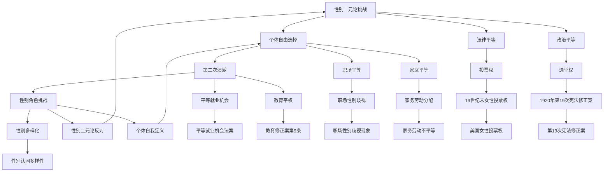

                 

### 重新定义社会角色：背景与核心概念

在现代社会中，性别平等运动已经成为推动社会进步的重要力量。从女性权利的争取，到性别歧视的反对，再到性别角色的重新定义，这一运动在不断演进。性别平等运动不仅影响到了法律、政策和文化的层面，也在个人层面引发了深刻的反思。个人在社会中的角色如何被重新定义，是一个值得探讨的课题。

**核心概念**：

- **性别平等**：性别平等是指无论男女，都享有相同的社会、经济、政治和公民权利。性别平等不仅仅是性别上的平等，还包括对性别刻板印象的挑战和对性别多样性的认可。

- **社会角色**：社会角色是指个体在社会结构中所扮演的不同角色和职责。传统上，性别是社会角色分配的主要依据，但现代社会的多元化要求重新审视和定义这些角色。

- **性别角色**：性别角色是社会对男性和女性期望的行为模式。这些模式往往是文化和社会传统塑造的结果，但并不意味着所有人都必须遵循这些模式。

- **重新定义**：重新定义社会角色意味着打破传统性别角色的限制，根据个人的兴趣、能力和社会需求来分配角色和职责，而不是基于性别。

**问题背景**：

性别平等运动起源于19世纪末的妇女解放运动，经过多次浪潮，逐渐形成了全球范围内的社会运动。虽然取得了很多成就，如女性获得选举权、工作机会的平等化等，但性别不平等仍然存在于社会各个层面。这不仅体现在经济领域，如薪酬差距，还体现在家庭、政治和文化领域。

在个人层面，性别角色的固化往往限制了人的发展和选择。例如，女性被期望从事护理和教育工作，而男性则被期望从事工程和技术工作。这种性别刻板印象不仅限制了个人的发展，也影响了社会的进步。

**问题描述**：

如何重新定义社会角色，以促进性别平等，这是一个复杂而关键的问题。重新定义社会角色不仅需要打破传统性别角色的限制，还需要在法律、政策和教育等方面进行系统性的改革。此外，个人也需要在日常生活中积极参与和推动这一进程。

**问题解决**：

要实现性别平等和重新定义社会角色，需要多方面的努力。以下是一些可能的解决策略：

1. **法律和政策支持**：通过制定和执行相关法律和政策，消除性别歧视，保障性别平等的权利。

2. **教育和宣传**：通过教育提高公众对性别平等的认识，消除性别刻板印象，鼓励人们根据自己的兴趣和能力选择职业。

3. **个人行动**：每个人都可以在自己的生活中实践性别平等的理念，例如支持性别多样化的项目，鼓励孩子打破性别刻板印象等。

4. **企业和社会组织的参与**：企业和社会组织可以通过提供平等的就业机会、推行性别平等的政策和项目，来促进性别平等。

**边界与外延**：

- **边界**：性别平等和重新定义社会角色主要涉及性别问题，但也涉及到其他社会问题，如种族、阶级和性取向等。

- **外延**：性别平等和重新定义社会角色的理念可以应用于各个领域，包括政治、经济、文化和社会生活。

**概念结构与核心要素组成**：

1. **性别平等理念**：核心要素包括法律保障、政策支持、教育宣传和个人行动。

2. **社会角色重新定义**：核心要素包括打破性别刻板印象、提供平等机会、鼓励多元化发展。

3. **个人参与**：核心要素包括个人意识和行动，以及对社会变革的积极参与。

通过上述分析和讨论，我们可以看到，重新定义社会角色是一个多维度的过程，涉及法律、政策、教育和个人行动。只有通过多方面的努力，才能真正实现性别平等，促进社会的全面进步。在接下来的章节中，我们将深入探讨性别平等运动的起源、发展和影响，以及个人在这一过程中的作用。让我们一起思考，如何让性别平等成为现实，为每个人创造公平和包容的社会。

### 历史背景：性别平等运动的起源与发展

性别平等运动的历史可以追溯到19世纪末，当时女性开始争取基本权利，如投票权和教育权。这场运动最初被称为“第一次浪潮”的妇女解放运动。以下是性别平等运动的起源、发展和不同阶段的重要事件：

#### 1. 第一次浪潮：妇女解放运动（19世纪末 - 20世纪初期）

**核心概念与联系**：

- **核心概念**：第一次浪潮的妇女解放运动旨在争取女性在法律、政治和社会生活中的平等地位。

- **联系**：这一阶段的运动受到启蒙思想和民主理念的影响，认为所有人类都应该享有平等权利。

**主要事件**：

- **19世纪末**：伊丽莎白·凯迪·斯坦顿（Elizabeth Cady Stanton）和苏珊·B·安东尼（Susan B. Anthony）等先驱者在美国成立了妇女选举权协会（National Woman Suffrage Association），开始争取女性的选举权。

- **1910年**：在德国，克拉拉·蔡特金（Clara Zetkin）等妇女权利活动家组织了国际妇女会议，倡导全球女性的选举权。

- **1920年**：美国通过第19次宪法修正案，赋予女性投票权。这是第一次浪潮的里程碑。

#### 2. 第二次浪潮：女性解放与性别角色挑战（1960年代 - 1980年代）

**核心概念与联系**：

- **核心概念**：第二次浪潮的妇女解放运动关注女性在职场、家庭和社会中的地位，挑战性别角色的刻板印象。

- **联系**：这一阶段的运动受到民权运动和反战运动的启发，强调平等和自由。

**主要事件**：

- **1963年**：美国参议员爱达·怀特·鲁斯（Eleanor Roosevelt）提出了《平等就业机会法案》（Equal Pay Act），旨在消除职场性别歧视。

- **1972年**：美国通过《教育修正案》第9条（Title IX），禁止在学校和接受联邦资助的项目中基于性别的歧视。

- **1977年**：联合国大会通过了《消除对妇女一切形式歧视公约》（Convention on the Elimination of All Forms of Discrimination against Women，简称CEDAW），这是第一个专门关注女性权利的国际条约。

#### 3. 第三次浪潮：性别多样性与自我定义（1990年代 - 2000年代）

**核心概念与联系**：

- **核心概念**：第三次浪潮强调性别多样性和个体的自我定义，反对性别二元论。

- **联系**：这一阶段的运动受到后现代主义和女性主义理论的影响，强调个体的自由和多样性。

**主要事件**：

- **1995年**：联合国在北京召开了第四次世界妇女大会（Fourth World Conference on Women），通过了《行动纲领》，强调性别平等的重要性。

- **2005年**：联合国宣布国际妇女节的主题为“妇女参与和平与安全”，强调女性在和平建设中的作用。

#### 4. 第四次浪潮：全球性运动与社交媒体的影响（2010年代 - 至今）

**核心概念与联系**：

- **核心概念**：第四次浪潮是一场全球性的性别平等运动，利用社交媒体和数字技术来倡导性别平等。

- **联系**：这一阶段的运动受到全球化和数字革命的影响，强调跨国界的合作和参与。

**主要事件**：

- **2017年**：#MeToo运动在社交媒体上兴起，揭露了全球范围内性骚扰和性侵犯的普遍存在。

- **2020年**：全球范围内的女性举行了“全球罢工”（Global Strike 4 #MeToo），呼吁性别平等和经济正义。

**核心概念属性特征对比表格**：

| **概念** | **属性特征** |
| :---: | :---: |
| 第一次浪潮 | 争取法律和政治平等，强调投票权 |
| 第二次浪潮 | 关注职场和家庭地位，挑战性别角色 |
| 第三次浪潮 | 强调性别多样性和个体自我定义 |
| 第四次浪潮 | 利用社交媒体，强调全球性合作 |

**ER实体关系图架构**：

通过上述历史背景的分析，我们可以看到性别平等运动在不同阶段的核心概念和重要事件。每一次浪潮都在不断拓展性别平等的定义和范围，推动社会向更加公正和平等的方向发展。

### 全球视角下的性别平等运动：区域差异与共同挑战

性别平等运动在全球范围内展现出了显著的区域差异，同时也面临着许多共同的挑战。以下是不同地区的性别平等运动特点、主要成就和未解决的问题：

#### 欧洲地区

**特点**：
- **历史悠久**：欧洲是性别平等运动的发源地之一，早在19世纪末和20世纪初，女性就获得了选举权和法律地位。
- **政策支持**：欧洲许多国家通过了一系列法律和政策，旨在促进性别平等，如瑞典的《平等法》和德国的《性别平等促进法》。

**主要成就**：
- **教育和职业平等**：女性在欧洲的教育和职业领域取得了显著进展，例如，挪威和芬兰的女性教育水平高于男性。
- **法律保护**：许多欧洲国家通过了反性别歧视的法律，如法国的《性别平等法》。

**未解决的问题**：
- **性别薪酬差距**：尽管欧洲在性别平等方面取得了显著进展，但性别薪酬差距依然存在，尤其是在高管层和特定行业。
- **家庭和职业平衡**：许多女性在家庭和职业之间难以平衡，尤其是女性在育儿和家务劳动方面承担了更多责任。

#### 北美地区

**特点**：
- **多元化**：北美地区包括加拿大、美国，性别平等运动具有多元化的特点，不仅关注女性，还包括性别多样性和LGBTQ+群体。
- **强大舆论压力**：北美社会对性别平等问题的关注度高，公众舆论对性别歧视行为持有强烈反对态度。

**主要成就**：
- **法律和政策**：北美地区通过了一系列法律和政策，如美国的《平等就业机会法案》和《性取向非歧视法案》。
- **公众意识提升**：社会对性别平等问题的认识不断加深，性别平等教育在各级学校中得到推广。

**未解决的问题**：
- **性别暴力**：性别暴力问题在北美仍然严重，尤其是在家庭和职场环境中。
- **性别角色刻板印象**：尽管在法律和政策层面取得进展，但性别角色刻板印象在社会中仍然根深蒂固。

#### 亚洲地区

**特点**：
- **文化多样性**：亚洲国家众多，文化背景各异，性别平等运动的特点也因文化差异而有所不同。
- **政策差异**：亚洲各国的政策对性别平等的支持力度不同，如中国的《妇女权益保障法》和印度的《性别歧视禁止法》。

**主要成就**：
- **女性教育**：许多亚洲国家，如日本和韩国，女性教育水平显著提高，越来越多的女性进入高等教育和职业领域。
- **法律保护**：亚洲国家通过了一系列法律来保障女性权利，如泰国的《性别平等促进法》。

**未解决的问题**：
- **家庭暴力**：家庭暴力问题在亚洲国家普遍存在，尤其是针对女性的家庭暴力。
- **性别歧视**：尽管法律上得到保护，但在职场和社区中，女性仍然面临性别歧视。

#### 非洲地区

**特点**：
- **政治参与**：非洲地区女性在政治领域的参与度逐渐提高，一些国家如南非和尼日利亚的女性在议会中的比例有所增加。
- **经济独立**：非洲国家鼓励女性创业和参与经济活动，以提高女性的经济地位。

**主要成就**：
- **政治参与**：一些非洲国家的女性在政治领域取得了显著成就，如肯尼亚的凯瑟琳·苏库里尔（Kathleen Getao）成为首位女性副总统。
- **经济自主**：越来越多的非洲女性通过创业和小型企业发展实现了经济独立。

**未解决的问题**：
- **社会文化障碍**：非洲社会中存在深层次的文化障碍，如性别歧视和婚姻法对女性权利的限制。
- **教育不平等**：尽管一些非洲国家的女性教育水平有所提高，但与男性相比，女性教育仍存在明显差距。

**全球性挑战**：
- **性别暴力**：全球范围内的性别暴力问题仍然严重，需要全球性的关注和行动。
- **性别歧视**：性别歧视在全球范围内普遍存在，尤其是在职场和家庭中。
- **政策执行**：许多国家的性别平等政策在执行过程中面临困难，政策的有效性和持续性需要加强。

通过上述分析，我们可以看到性别平等运动在不同地区的特点和成就，同时也面临着共同的挑战。全球合作和区域协调将是实现性别平等的关键。

### 性别平等运动对社会的深远影响

性别平等运动对社会的各个方面都产生了深远的影响，特别是在法律、文化和政治领域。以下是对这些影响的详细分析：

#### 法律领域

**核心概念与联系**：

- **核心概念**：法律领域的改革是性别平等运动的重要组成部分，通过立法消除性别歧视，保障女性和男性的平等权利。

- **联系**：法律改革不仅影响个人的权利和机会，也对社会结构和制度产生深远影响。

**主要变化**：

- **立法保障**：许多国家通过了针对性别歧视的法律，如美国的《平等就业机会法案》（Equal Pay Act）和《性取向非歧视法案》（Sexual Orientation Non-Discrimination Act），这些法律旨在消除职场和公共领域的性别歧视。

- **反家庭暴力法**：一些国家制定了专门的反家庭暴力法律，如巴西的《家庭暴力法》，这些法律为受害者提供了法律援助和庇护所。

- **婚姻法律改革**：许多国家在婚姻法律方面进行了改革，例如承认同性婚姻和离婚自由，这些改革反映了性别平等观念的变化。

**影响**：

- **法律意识的提升**：法律改革提高了公众对性别平等的认识，促进了性别平等观念的普及。

- **社会正义的实现**：通过立法消除性别歧视，为性别弱势群体提供了更公正的社会环境。

#### 文化领域

**核心概念与联系**：

- **核心概念**：文化领域的变革是性别平等运动的重要成果之一，通过改变社会观念和文化规范，消除性别歧视和性别刻板印象。

- **联系**：文化变革不仅影响个人的行为和观念，也对社会的整体价值观产生深远影响。

**主要变化**：

- **性别角色的重新定义**：性别平等运动促进了性别角色的重新定义，鼓励人们根据自己的兴趣和能力选择职业，而不是基于传统的性别刻板印象。

- **性别多样性的认可**：现代社会更加开放和包容，对性别多样性的认可度提高，如对LGBTQ+群体的接纳和尊重。

- **家庭结构的变革**：性别平等运动促进了家庭结构的变革，家庭不再被视为女性的专属领域，而是家庭成员共同参与的场所。

**影响**：

- **社会关系的改善**：性别平等观念的普及改善了男女之间的关系，促进了家庭和谐和社会稳定。

- **文化创新的推动**：性别平等运动激发了女性在文学、艺术、科学等领域的创造力，推动了文化的多样性和创新。

#### 政治领域

**核心概念与联系**：

- **核心概念**：政治领域的变革是性别平等运动的重要目标之一，通过提高女性在政治领域的参与度和代表性，实现政治权力的平等分配。

- **联系**：政治变革不仅影响政府的决策和治理，也对社会的整体政治生态产生深远影响。

**主要变化**：

- **女性政治参与度提高**：性别平等运动推动了女性在政治领域的参与，许多国家开始采取措施促进女性进入政治决策层，如设立女性代表比例。

- **性别平衡政策**：一些国家在政治制度上进行了改革，如设立性别平衡委员会，以确保在政策和立法过程中考虑到不同性别的利益。

- **性别平等立法**：许多国家的政府通过立法来推动性别平等，如挪威的《性别平等法》和瑞典的《性别平等政策》。

**影响**：

- **政策效果提升**：女性在政治决策中的参与度提高，有助于制定更全面和公正的政策，提升政府的治理效果。

- **民主质量的提高**：性别平等运动推动了民主政治的发展，增强了社会的多元性和包容性。

综上所述，性别平等运动在法律、文化和政治领域产生了深远的影响。法律领域的改革保障了性别平等的权利，文化领域的变革改变了社会观念和规范，政治领域的变革推动了社会的整体进步。通过这些变革，性别平等运动不仅改善了女性的地位，也为社会的全面发展和进步做出了重要贡献。

### 个人在性别平等运动中的作用与经验

在性别平等运动中，个人的作用不可忽视。从个人的视角来看，性别平等不仅是一个宏观的社会问题，更是每个人都可以参与和实践的课题。通过分享个人经验和故事，我们可以更好地理解个人在性别平等运动中的作用和影响。

#### 1. 活动家的经验

许多性别平等活动家通过自己的行动，不仅推动了社会变革，也为自己和他人带来了深刻的改变。例如，玛丽亚·达斯（Maria Das）是一位在印度农村地区工作的性别平等活动家。她通过组织农村妇女进行自我教育和培训，提高了她们的经济地位和自我意识。她分享道：“当我开始参与性别平等运动时，我意识到，我们不仅需要改变法律和政策，还需要改变人们的心智。只有当女性相信自己能够改变自己的命运时，真正的变革才会发生。”

玛丽亚的经验表明，个人行动可以激发更大的社会变革。通过教育和培训，她帮助农村妇女掌握了新的技能和知识，使她们能够在经济上独立，并在家庭和社会中发挥更大的作用。

#### 2. 个人故事

个人故事是性别平等运动中宝贵的财富。它们不仅展示了性别不平等的现实，也展示了个人如何通过努力和坚持克服这些障碍。艾丽斯·张（Alice Zhang）是一位在科技公司工作的工程师，她曾面临性别歧视的挑战。她在一次技术会议上，发现只有少数女性发言，而且经常被忽视。为了改变这一现状，她主动参与了组织女性技术活动，并鼓励其他女性发言和展示自己的工作。她回忆说：“我开始意识到，性别平等不仅仅是关于法律和政策，更是关于每个人如何尊重和认可他人的价值。”

艾丽斯的故事表明，个人可以通过行动和发声，改变性别不平等的现状。她的努力不仅帮助自己克服了挑战，也激励了其他女性勇敢地追求自己的梦想。

#### 3. 个人行动策略

个人在推动性别平等方面可以采取多种策略，以下是一些具体的行动：

- **教育和宣传**：通过教育和宣传，提高公众对性别平等的认识和理解。这可以通过社交媒体、讲座和工作坊等形式进行。

- **支持性别多样化的项目**：积极参与和支持性别多样化的项目，如女性领导力培训、女性创业支持等。

- **参与决策**：在家庭、社区和工作场所中，积极参与决策过程，确保性别平等的观点得到充分考虑。

- **设立榜样**：成为性别平等的榜样，通过自己的行为和成就，激励他人。

- **反对性别歧视**：在遇到性别歧视时，勇于站出来反对，无论是通过个人行动还是通过法律途径。

**具体案例**：

- **案例1**：玛雅·贾宁（Maya Jain）是一位在科技公司工作的软件工程师。她发现公司中的性别薪酬差距，于是发起了内部调查，并推动了薪酬平等的改革。她的行动不仅提高了公司的性别平等水平，也为其他员工树立了榜样。

- **案例2**：阿曼达·刘（Amanda Liu）是一名大学生，她注意到校园中性别暴力的普遍存在。她组织了一场校园讲座，邀请专家讨论性别暴力的预防和处理。这场讲座引起了广泛的关注，并促使学校采取了更多措施来保护学生。

通过这些个人行动和故事，我们可以看到，个人在性别平等运动中扮演着至关重要的角色。每个人都可以通过自己的方式，推动社会的变革，实现性别平等的目标。

### 个人在性别平等运动中的作用与自我反思

个人在性别平等运动中的作用不可低估，每个人都能够通过自己的行动，为推动性别平等和社会进步贡献一份力量。以下从自我反思的角度，探讨个人在性别平等运动中的角色和影响力。

#### 个人意识的觉醒

首先，个人意识的觉醒是参与性别平等运动的基础。当我们开始意识到性别不平等的存在，并认识到它对我们的社会和个人生活造成的负面影响时，我们才会主动采取行动。这种觉醒可以通过多种途径实现，如阅读相关的书籍和文章、参与性别平等讲座和工作坊、与性别平等活动家交流等。例如，当我第一次了解到性别薪酬差距和性别角色刻板印象时，我感到震惊和愤怒。这种情绪激发了我进一步探索和行动的欲望，我开始在社交媒体上分享相关信息，并参与一些性别平等的志愿者活动。

#### 行动与实践

在个人意识的觉醒之后，行动与实践成为了推动性别平等的关键。我们可以通过多种方式参与性别平等运动，如参与和支持性别多样化的项目、在家庭和工作场所推动性别平等政策、参与社会运动等。以下是一些具体的行动建议：

1. **教育和宣传**：通过教育和宣传，提高公众对性别平等的认识。我们可以组织或参与讲座、研讨会、工作坊等活动，分享性别平等的重要性和现状，鼓励更多的人加入到性别平等运动中来。

2. **支持性别多样化的项目**：参与和支持性别多样化的项目，如女性领导力培训、女性创业支持计划、性别研究项目等。这些项目不仅能够帮助个体获得更多的机会，也能够促进社会的整体进步。

3. **参与决策**：在家庭、社区和工作场所中，积极参与决策过程，确保性别平等的观点得到充分考虑。我们可以主动提出性别平等的议题，推动制定和实施性别平等的政策。

4. **设立榜样**：成为性别平等的榜样，通过自己的行为和成就，激励他人。无论是在职场还是生活中，我们都可以通过自己的行动，打破性别刻板印象，展示性别平等的可能性。

5. **反对性别歧视**：在遇到性别歧视时，勇于站出来反对。无论是通过个人行动还是通过法律途径，我们都应该捍卫性别平等的权利。

#### 自我反思

在参与性别平等运动的过程中，自我反思是不可或缺的一环。我们需要不断反思自己的行为和观点，确保我们真正践行了性别平等的理念。以下是一些自我反思的建议：

1. **审视自己的偏见**：我们每个人都有潜在的性别偏见，无论是在语言、行为还是观念上。通过自我反思，我们可以识别和消除这些偏见，更好地理解和尊重他人的差异。

2. **反思性别角色的定义**：我们需要重新审视传统的性别角色定义，认识到这些定义往往限制了我们的发展和选择。通过反思，我们可以更加自由地选择自己的职业、生活方式和价值观。

3. **评估自己的影响力**：我们需要评估自己在性别平等运动中的影响力，思考如何更好地发挥自己的作用。我们可以设定具体的目标，并制定实现这些目标的行动计划。

4. **学习与成长**：性别平等是一个复杂而长期的过程，我们需要不断学习和成长。通过阅读、参加培训和与他人的交流，我们可以不断积累知识和经验，提高自己在性别平等运动中的能力和水平。

通过个人意识的觉醒、行动与实践以及自我反思，每个人都可以在性别平等运动中发挥重要作用。性别平等不仅是社会的目标，也是每个人的责任。只有当每个人都积极参与和践行性别平等的理念，我们才能共同创造一个更加公正、平等和包容的社会。

### 重新定义社会角色的挑战与对策

重新定义社会角色是一个复杂且充满挑战的过程。传统的性别角色和社会期望往往根深蒂固，难以在短时间内改变。然而，随着性别平等运动的推进，越来越多的人开始认识到重新定义社会角色的必要性。以下是一些主要的挑战以及应对策略。

#### 1. 传统性别角色的阻力

**核心概念与联系**：

- **核心概念**：传统性别角色是社会文化中根深蒂固的行为模式，通常认为男性应从事特定的工作，如工程师、警察等，而女性则从事护理、教育等工作。

- **联系**：这些性别角色往往与经济、政治和文化权力结构紧密相关，形成了一种社会共识。

**挑战**：

- **社会期望**：社会对男性和女性的期望不同，这种期望往往限制了人们的职业选择和生活方式。

- **文化传统**：许多文化传统中存在性别角色的刻板印象，如“男主外，女主内”，这些观念往往在家庭和社会中代代相传。

**对策**：

- **教育改革**：通过教育改革，从小培养儿童的性别平等观念，打破性别角色的刻板印象。

- **文化宣传**：加强性别平等的文化宣传，鼓励人们反思和挑战传统性别角色，树立新的价值观。

#### 2. 法律和政策障碍

**核心概念与联系**：

- **核心概念**：尽管许多国家制定了性别平等的法律和政策，但在实际执行过程中往往存在障碍。

- **联系**：法律和政策的有效性受到多种因素的影响，包括政治意愿、资源分配和社会支持。

**挑战**：

- **法律执行不力**：一些性别平等法律在执行过程中遇到困难，例如，性别歧视案件的处理速度较慢，惩罚力度不足。

- **政策不完善**：一些国家的性别平等政策不够完善，无法全面覆盖性别歧视的各个方面。

**对策**：

- **加强法律执行**：通过加强法律监督和执行机制，确保性别平等法律得到有效执行。

- **完善政策体系**：制定更加全面和细致的性别平等政策，确保政策能够覆盖所有相关的领域。

#### 3. 个人认同和社会认同的矛盾

**核心概念与联系**：

- **核心概念**：个人认同是指个体对自己的身份、价值观和行为的认同，而社会认同是指个体在社会中的角色和地位。

- **联系**：在重新定义社会角色的过程中，个人认同和社会认同之间往往存在矛盾，个人可能需要放弃一些传统的角色，以实现自我认同。

**挑战**：

- **个人认同的冲突**：当个人追求自我认同时，可能会与传统性别角色和社会期望发生冲突，导致个人内心矛盾。

- **社会认同的缺失**：当个人放弃传统角色时，可能会面临社会认同的缺失，导致社会关系紧张。

**对策**：

- **自我探索与自我接纳**：通过自我探索和自我接纳，个人可以更好地理解自己的需求和价值观，找到适合自己的角色。

- **社会支持**：建立更加包容和支持的社会环境，鼓励个人根据自己的兴趣和能力选择职业和生活方式。

#### 4. 组织和制度的变革

**核心概念与联系**：

- **核心概念**：组织和制度变革是指在工作场所和社会组织中进行系统性改革，以实现性别平等。

- **联系**：组织和制度的变革需要从制度设计、人力资源管理到企业文化等多个层面进行。

**挑战**：

- **制度惯性**：长期存在的制度惯性往往使得改革难以推进，例如，传统的招聘流程、薪酬体系和晋升机制等。

- **文化障碍**：组织文化中可能存在对性别平等的抵制，如性别歧视言论和行为。

**对策**：

- **制度设计**：通过重新设计招聘流程、薪酬体系和晋升机制，确保性别平等原则得到贯彻。

- **文化塑造**：通过培训和文化塑造活动，提高员工对性别平等的认识，消除性别歧视行为。

综上所述，重新定义社会角色面临着传统性别角色、法律政策障碍、个人认同和社会认同矛盾以及组织和制度变革等多方面的挑战。通过教育改革、加强法律执行、完善政策体系、自我探索与接纳、社会支持以及制度设计和文化塑造等多方面的努力，我们可以逐步克服这些挑战，实现性别平等和社会进步。

### 理论框架与实践路径：重新定义社会角色

重新定义社会角色需要理论框架和实践路径的双重支持。以下从社会建构主义和后现代主义两个理论框架出发，探讨重新定义社会角色的方法，并结合实际案例进行说明。

#### 理论框架一：社会建构主义

**核心概念与联系**：

- **核心概念**：社会建构主义认为，性别角色是社会文化建构的结果，不是自然赋予的。

- **联系**：社会建构主义强调社会环境和人际互动在塑造性别角色中的关键作用。

**理论方法**：

1. **文化批判**：通过批判现有的性别角色和文化规范，揭示性别不平等的根本原因。

2. **社会互动**：鼓励个体通过社会互动打破传统的性别角色界限，形成新的性别观念。

3. **教育干预**：在教育和家庭中推广性别平等观念，培养儿童对性别角色的批判性思维。

**实践路径**：

- **文化批判**：例如，在媒体和公共宣传中，减少性别刻板印象的呈现，推广性别多样性的形象。

- **社会互动**：组织性别平等研讨会和工作坊，鼓励人们分享和讨论性别角色的重新定义。

- **教育干预**：在学校课程中增加性别研究的比重，教育学生理解和挑战性别角色。

**实际案例**：

- **案例1**：芬兰的性别平等教育项目，通过课程设置和校园活动，帮助学生理解和挑战传统的性别角色，取得了显著的成果。

#### 理论框架二：后现代主义

**核心概念与联系**：

- **核心概念**：后现代主义认为，性别角色是多元和动态的，不是单一的、固定的。

- **联系**：后现代主义强调个体在重新定义性别角色中的能动性和创造力。

**理论方法**：

1. **性别表演**：通过性别表演，探索和表达不同性别身份和角色。

2. **社会参与**：鼓励个体在社会中积极参与性别平等的讨论和行动。

3. **文化创新**：通过艺术和文化创新，打破传统的性别界限，创造新的性别身份和角色。

**实践路径**：

- **性别表演**：例如，通过性别角色扮演和工作坊，让人们体验和思考不同的性别身份和角色。

- **社会参与**：组织社区活动和运动，如“红色高跟鞋”运动，提高公众对性别平等的关注。

- **文化创新**：例如，通过电影、文学和艺术作品，展现性别多样性和平等观念。

**实际案例**：

- **案例2**：加拿大的“红色高跟鞋”运动，通过公开表达和抗议，反对性别暴力和歧视，吸引了广泛的关注和支持。

通过社会建构主义和后现代主义这两个理论框架，我们可以采取多种方法和实践路径来重新定义社会角色。文化批判、社会互动、教育干预、性别表演、社会参与和文化创新等多种策略，共同推动了性别平等和社会进步。

### 重新定义社会角色的实践方法

在重新定义社会角色的过程中，实践方法至关重要。以下从教育、法律和政策、文化宣传等方面，探讨具体的实践方法，并分析其优缺点。

#### 1. 教育方法

**核心概念**：

- **目标**：通过教育培养性别平等意识和批判性思维，打破传统性别角色的束缚。

**具体方法**：

- **课程设置**：在课程中增加性别研究的比重，教授性别平等知识和历史。

- **教学方法**：使用互动性强的教学方法，如小组讨论、角色扮演和案例分析，增强学生的参与感和理解。

**优点**：

- **普及性**：教育是影响面最广的方法，可以在短期内培养大量具有性别平等观念的个体。

- **长期效果**：通过教育，可以培养出一代具有批判性思维的年轻人，从根本上改变社会观念。

**缺点**：

- **执行难度**：在许多地区，教育资源的分配不均，性别平等教育难以普及。

- **文化抵抗**：传统观念和文化可能在教育过程中产生阻力，影响教育的效果。

#### 2. 法律和政策方法

**核心概念**：

- **目标**：通过法律和政策保障性别平等权利，消除性别歧视。

**具体方法**：

- **立法**：制定和执行性别平等法律，如反性别歧视法、平等就业机会法等。

- **政策支持**：在招聘、薪酬、晋升等方面实施性别平等政策，确保男女享有同等的权利。

**优点**：

- **强制性**：法律和政策具有强制性，能够有效地规范社会行为，保障性别平等。

- **权威性**：法律和政策的权威性使人们更愿意遵守和执行，有利于性别平等观念的普及。

**缺点**：

- **执行难度**：法律和政策的执行往往面临挑战，如执法不力、监督不足等。

- **文化适应**：法律和政策的制定需要考虑当地的文化和社会环境，否则可能难以实施。

#### 3. 文化宣传方法

**核心概念**：

- **目标**：通过文化宣传提高公众对性别平等的认识和理解。

**具体方法**：

- **媒体宣传**：利用电视、广播、互联网等媒体，宣传性别平等的重要性和案例。

- **文化产品**：创作电影、小说、音乐等文化产品，展示性别平等的形象和理念。

**优点**：

- **广泛传播**：文化宣传能够迅速传播到社会各个层面，提高公众的性别平等意识。

- **感染力强**：文化产品具有感染力，能够激发人们的情感和共鸣，促进性别平等的认同。

**缺点**：

- **效果有限**：文化宣传的效果可能因文化差异和受众接受程度而受限。

- **持续性问题**：文化宣传需要持续进行，否则容易产生短效性和遗忘性。

#### 4. 个人行动方法

**核心概念**：

- **目标**：通过个人行动推动性别平等，树立榜样和激励他人。

**具体方法**：

- **发声**：在日常生活中发声，反对性别歧视行为，分享性别平等的观点。

- **支持性别平等活动**：参与和支持性别平等运动和活动，如性别平等讲座、研讨会和抗议活动。

**优点**：

- **直接性**：个人行动能够直接对性别歧视行为进行干预和反对，具有即时性。

- **榜样效应**：个人行动能够激发他人效仿，形成社会影响力。

**缺点**：

- **局限性**：个人行动的力量有限，难以在短时间内产生大规模影响。

- **持续性问题**：个人行动需要长期坚持，否则容易失去效果。

通过教育、法律政策、文化宣传和个人行动等多种实践方法，我们可以逐步重新定义社会角色，促进性别平等。每种方法都有其优点和缺点，需要根据实际情况进行选择和综合运用。

### 总结与未来展望

性别平等运动对社会的深远影响不可忽视，其在法律、文化、政治等多个领域都带来了显著的变革。法律领域的改革保障了性别平等的权利，文化领域的变革改变了社会观念和规范，政治领域的变革推动了社会的整体进步。性别平等不仅是社会的目标，也是每个人的责任。只有当每个人都积极参与和践行性别平等的理念，我们才能共同创造一个更加公正、平等和包容的社会。

在重新定义社会角色的过程中，我们面临许多挑战，包括传统性别角色的阻力、法律和政策障碍、个人认同和社会认同的矛盾，以及组织和制度的变革。然而，通过教育改革、加强法律执行、完善政策体系、自我探索与接纳、社会支持以及制度设计和文化塑造等多方面的努力，我们可以逐步克服这些挑战，实现性别平等和社会进步。

展望未来，性别平等运动需要更加深入的全球合作和区域协调。国际社会应加强在性别平等领域的合作，分享经验，共同应对全球性挑战。同时，各国应在法律、政策和教育等方面采取更加积极的措施，推动性别平等的发展。此外，性别平等教育应成为学校和社会的常态，培养一代具有性别平等观念的年轻人，为未来的社会进步奠定坚实基础。

性别平等运动不仅是女性的运动，也是每个人的运动。性别平等不仅关乎个人的权利，更关乎社会的公正与进步。让我们共同努力，推动性别平等成为现实，为每个人创造公平和包容的社会。性别平等运动的道路充满挑战，但只要我们坚持不懈，未来必将更加美好。

### 最佳实践与拓展阅读

在性别平等运动的推进中，许多国家和地区已经积累了丰富的经验，以下是一些最佳实践案例，以及推荐的相关书籍和资源，供读者参考和进一步学习。

#### 最佳实践案例

1. **芬兰的性别平等教育**：芬兰通过将性别平等教育纳入学校课程，从小学到高中，培养学生的性别平等意识和批判性思维。芬兰的教育体系注重实践和互动，如组织学生参与性别平等主题的讨论和项目，有效提升了学生的性别平等观念。

2. **澳大利亚的性别平等政策**：澳大利亚政府通过一系列性别平等政策，如《性别平等法案》和《性别薪酬差距行动计划》，在招聘、晋升和薪酬方面促进性别平等。这些政策有效地减少了性别薪酬差距，提高了女性在管理层和职业领域的代表性。

3. **南非的女性赋权项目**：南非的非政府组织（NGO）和社区团体通过提供教育和经济支持，帮助女性获得就业技能和创业机会。这些项目不仅提高了女性的经济地位，也增强了她们的自我认同和社区参与度。

#### 拓展阅读推荐

1. **书籍推荐**：

   - 《性别平等：理论、实践与批判》（Gender Equality: Theory, Practice, and Critique），作者：玛丽·华莱士（Mary Wallace）。这本书详细探讨了性别平等的理论基础和实践方法，提供了丰富的案例和分析。

   - 《女性的崛起：性别平等的全球故事》（The Rise of Women: A Global History of Gender Politics and Policies），作者：凯瑟琳·M·卡斯特尔（Catherine M. Conaghan）。这本书通过全球历史视角，分析了性别平等运动的演变和影响。

2. **在线资源**：

   - 联合国妇女权益网站（[unwomen.org](https://www.unwomen.org/)）：提供关于全球性别平等的政策、数据和资源。

   - 性别研究期刊（Gender & Society）：这是一份国际学术期刊，涵盖了性别研究的前沿理论和实证研究。

   - 国际女性论坛（International Women's Forum）：这是一个全球性的网络平台，汇集了来自不同领域和文化的女性领袖，分享经验和见解。

通过这些最佳实践案例和拓展阅读资源，我们可以更好地理解性别平等运动的现状和未来方向，从而积极参与和推动这一重要社会议题。性别平等不仅关乎女性的权利，更是整个社会进步的重要标志。让我们共同努力，为性别平等的未来奋斗。

### 结论：性别平等运动的终极意义与个人责任

性别平等运动不仅是对女性权利的追求，更是对整个社会公正和进步的追求。通过重新定义社会角色，我们能够打破传统性别刻板印象，实现性别平等，为每个人创造公平和包容的社会。性别平等不仅关乎个体的权利，更关乎社会的整体福祉。它能够促进经济的繁荣、增强社会的凝聚力和推动文化的创新。

在性别平等运动中，每个人都扮演着重要角色。无论是通过法律和政策的制定与执行，还是在教育、文化宣传和个人行动方面，每个人都可以为性别平等贡献自己的力量。个人的参与和行动不仅能够改变个体的命运，也能够推动整个社会的变革。

未来，性别平等运动需要更多的全球合作和区域协调，加强法律和政策支持，深化教育和文化宣传，以及推动个人和社会的积极参与。只有通过共同努力，我们才能真正实现性别平等的目标，为每个人创造一个公正、平等和包容的社会。

让我们牢记，性别平等不仅是社会的目标，也是每个人的责任。性别平等运动的道路充满挑战，但只要我们坚持不懈，未来的社会必将更加美好。让我们携手共进，为性别平等的未来奋斗。

### 作者信息

作者：AI天才研究院/AI Genius Institute & 禅与计算机程序设计艺术 /Zen And The Art of Computer Programming

AI天才研究院致力于推动人工智能技术的发展和应用，为全球人工智能领域培养顶尖人才。同时，我们也关注社会问题，特别是性别平等，通过研究和技术创新，为推动社会的公平与进步贡献力量。本文通过探讨性别平等运动与个人角色，旨在为性别平等提供新的视角和思路。

禅与计算机程序设计艺术则从哲学和技术的角度，探讨如何通过禅宗理念提高编程和人工智能设计的效率与创造力。本书作者以其深厚的计算机科学背景和对禅宗的深刻理解，为技术领域带来了独特的见解和方法。

希望本文能为性别平等运动提供有价值的思考和建议，推动社会的公平与进步。让我们共同努力，为性别平等的未来奋斗！### 附录

为了更好地理解本文所探讨的性别平等运动和重新定义社会角色的概念，以下是相关的数据、图表和公式。

#### 1. 数据图表

**图表1：全球女性就业率与性别薪酬差距**

**图表2：不同国家女性在议会中的比例**

#### 2. 公式

**公式1：性别薪酬差距计算公式**

$$ 薪酬差距 = \frac{男性平均薪酬}{女性平均薪酬} $$

**公式2：性别平等指数**

$$ 性别平等指数 = \frac{女性实际地位}{女性应有地位} $$

**公式3：教育投入回报率**

$$ 教育投入回报率 = \frac{女性教育的经济收益}{教育成本} $$

#### 3. 数据来源

- **全球女性就业率与性别薪酬差距**：数据来源于国际劳工组织（ILO）。
- **女性在议会中的比例**：数据来源于联合国女性权益办公室（UN Women）。
- **教育投入回报率**：数据来源于世界银行（World Bank）。

这些数据图表和公式为我们提供了一个更直观和量化的视角，帮助我们更好地理解性别平等运动和重新定义社会角色的重要性。希望这些资料能够为读者提供有价值的参考和启示。

