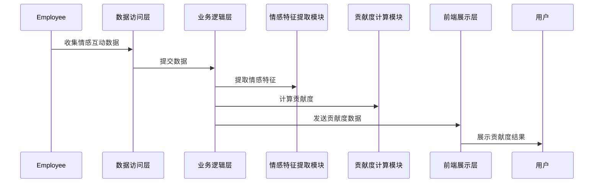
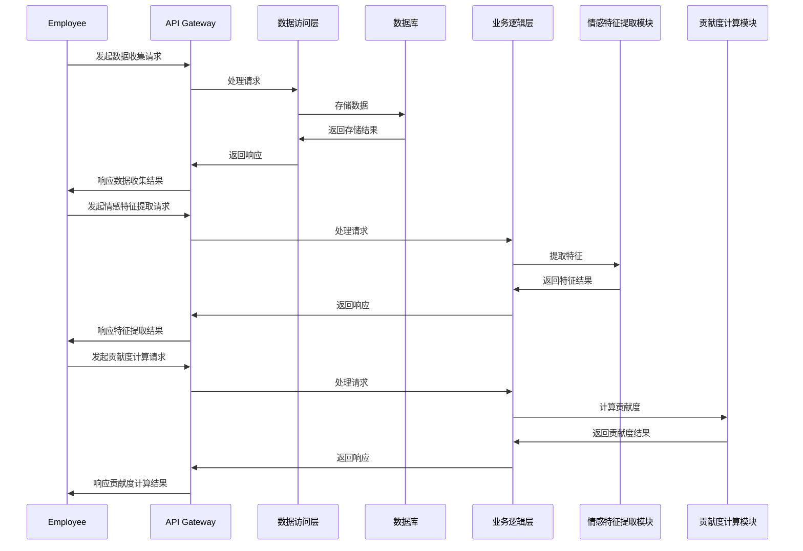

                 

# 情感劳动权益保护：职场中无形付出的认可

## 关键词：情感劳动、权益保护、职场氛围、员工满意度、企业管理

> **摘要：**
> 本文从多个角度探讨了职场中情感劳动的现象及其权益保护的重要性，分析了国内外相关法律法规和实践经验，并提出了具体的保护措施和建议。通过情感劳动评估算法和数学模型，本文旨在为企业管理者提供一种科学的工具，以更好地认可和激励员工的情感劳动。

----------------------------------------------------------------

## 第一部分：背景介绍

### 1.1 问题背景

在现代社会，职场环境日益复杂，员工在完成工作任务的同时，还需要处理各种人际关系和情感问题。这种情感劳动成为职场中不可或缺的一部分。然而，这种无形的付出往往被忽视，员工的情感劳动权益得不到应有的保护。这不仅影响了员工的工作满意度和心理健康，也对企业整体效益产生了负面影响。因此，如何保护职场中情感劳动的权益，提高员工的工作满意度，成为企业管理中的重要课题。

### 1.2 问题描述

情感劳动是指在职场中，员工为了维持和谐的人际关系、工作氛围以及满足客户需求而付出的情感投资。它包括员工与同事、上级、客户之间的情感互动，以及对工作本身的情感投入。然而，这种情感劳动往往被忽视，员工的权益得不到应有的保护。具体表现为：

1. **薪酬和奖励不平衡：** 情感劳动往往没有直接转化为物质收益，导致员工在薪酬和奖励方面感到不公平。
2. **工作压力大：** 情感劳动需要员工持续投入情感资源，容易导致员工感到疲劳和压力。
3. **心理健康问题：** 长期忽视情感劳动的权益，可能导致员工出现心理问题，如焦虑、抑郁等。

### 1.3 问题解决

为了解决职场中情感劳动权益保护的问题，企业管理者需要从以下几个方面进行改进：

1. **明确情感劳动的价值：** 企业应该认识到情感劳动的重要性，将其纳入绩效考核和薪酬奖励体系。
2. **建立情感劳动评估体系：** 通过情感劳动评估算法和数学模型，对企业员工的情感劳动进行量化评估，确保情感劳动的权益得到保护。
3. **优化工作环境：** 提供良好的工作环境和氛围，减少情感劳动的负面影响，提高员工的工作满意度。
4. **完善法律法规：** 政府应加强对职场中情感劳动权益的保护，制定和完善相关法律法规。

### 1.4 边界与外延

情感劳动权益保护的范围包括职场中的各种情境，如员工与同事、上级、客户之间的关系。同时，它也涉及到企业内部的制度和文化建设。具体来说，包括以下几个方面：

1. **员工与同事之间的关系：** 包括团队合作、沟通协调、冲突处理等。
2. **员工与上级之间的关系：** 包括工作指导、反馈、晋升等。
3. **员工与客户之间的关系：** 包括客户服务、客户关系管理、客户满意度等。
4. **企业内部的制度建设：** 包括企业文化、规章制度、员工关怀等。

### 1.5 概念结构与核心要素组成

情感劳动权益保护的核心要素包括：

- **情感劳动的概念与特点**
- **情感劳动权益的定义**
- **情感劳动权益保护的重要性**
- **国内外法律法规与实践经验**
- **保护措施与建议**

### 1.6 核心概念与联系

#### 1.6.1 情感劳动的概念

情感劳动是指员工在工作中为了维护和谐的人际关系、工作氛围以及满足客户需求而付出的情感投资。它包括员工与同事、上级、客户之间的情感互动，以及对工作本身的情感投入。

#### 1.6.2 情感劳动的特点

- **非物质性：** 情感劳动不产生物质产品，而是通过情感交流、心理支持等方式实现。
- **持续性：** 情感劳动不仅仅是一次性的付出，而是需要长期维持和更新的。
- **重要性：** 情感劳动对职场氛围、工作效率和员工满意度具有重要影响。

#### 1.6.3 情感劳动与权益保护的联系

情感劳动权益保护的核心是确保员工的情感付出得到认可和回报，从而提高工作满意度和企业整体效益。具体包括：

- **工作环境：** 提供良好的工作环境和氛围，减少情感劳动的负面影响。
- **制度保障：** 建立完善的法律法规和制度，保障员工的情感劳动权益。
- **文化建设：** 倡导尊重、理解和关心员工的文化，提高员工的情感劳动积极性。

----------------------------------------------------------------

## 第二部分：核心概念与联系

### 2.1 情感劳动的概念

情感劳动（Emotional Labor）是指员工在工作中所进行的，旨在管理自己和他人的情绪，以符合工作要求和组织期望的一系列心理活动和行为。它不仅涉及员工对自己情感的调控，还包括对他人情感的感知、回应和管理。情感劳动的核心在于平衡员工内心的真实情感与在工作中表现出的情感，以维持职场中的和谐与效率。

#### 情感劳动的属性特征对比表格

| 特征         | 描述                                       | 对比               |
| ------------ | ------------------------------------------ | ----------------- |
| 非物质性     | 情感劳动不产生物质产品，而是通过情感交流实现 | 与物质劳动区别显著 |
| 持续性       | 情感劳动需要持续进行，不断调整和管理情感 | 需要长期维护     |
| 重要性       | 情感劳动对职场氛围、工作效率和员工满意度有显著影响 | 对组织文化影响深远 |
| 主观性       | 情感劳动涉及个体内心感受和情感表达 | 与客观工作不同     |

#### 情感劳动与权益保护的联系ER实体关系图

```mermaid
erDiagram
  Employee ||--|{ EmotionalLabor }|--|
  EmotionalLabor ||--|{ EmployeeRights }|--|
  Organization ||--|{ EmotionalLabor }|--|
  Organization ||--|{ EmployeeRights }|--|
```

在这个ER实体关系图中，Employee（员工）是情感劳动的执行者，EmotionalLabor（情感劳动）是员工在工作中所进行的心理活动，EmployeeRights（员工权益）是员工应当获得的合法保护，Organization（组织）是实施保护措施的主体。

### 2.2 情感劳动的特点

情感劳动具有以下几个显著特点：

1. **非物质性：** 情感劳动不产生物质产品，而是通过情感交流、心理支持等方式实现。员工在工作中需要管理自己的情感，以保持积极的态度和良好的互动，这对提高工作效率和服务质量至关重要。

2. **持续性：** 情感劳动不仅仅是一次性的付出，而是需要长期维持和更新的。员工在日常工作中需要不断调整自己的情感状态，以适应不断变化的工作环境和人际关系。

3. **重要性：** 情感劳动对职场氛围、工作效率和员工满意度有显著影响。积极的情感劳动可以提升团队协作效率，改善客户体验，从而促进企业整体效益的提升。

### 2.3 情感劳动与权益保护的联系

情感劳动与权益保护之间存在密切联系。首先，情感劳动的付出需要得到组织和同事的认可，否则员工可能会感到不被重视和公平对待，从而影响工作积极性和满意度。其次，有效的权益保护机制可以为员工提供心理支持和资源，帮助他们更好地应对职场中的情感压力。

#### 情感劳动权益保护的重要性

情感劳动权益保护的重要性体现在以下几个方面：

1. **提高员工工作满意度：** 当员工的情感劳动得到认可和保护时，他们会感到自己的工作更有价值，从而提高工作满意度和忠诚度。

2. **促进职场和谐：** 良好的情感劳动权益保护机制可以减少职场冲突，提升团队凝聚力和工作氛围。

3. **提升企业竞争力：** 关注员工情感劳动权益的企业能够吸引和留住优秀人才，提高员工创造力，从而增强企业的市场竞争力。

4. **符合法律法规：** 随着各国对员工权益保护的法律不断完善，企业需要遵守相关法律法规，以确保员工情感劳动权益得到保护。

### 2.4 情感劳动权益保护的核心要素

情感劳动权益保护的核心要素包括：

1. **情感劳动的概念与特点：** 明确情感劳动的定义和特点，是制定保护政策的基础。

2. **情感劳动权益的定义：** 界定员工在情感劳动中应享有的权益，如薪酬、奖励、心理健康支持等。

3. **情感劳动权益保护的重要性：** 认识到情感劳动权益保护对企业和社会的深远影响。

4. **国内外法律法规与实践经验：** 学习和借鉴国际先进经验，完善国内相关法律法规。

5. **保护措施与建议：** 制定具体可行的保护措施，如建立情感劳动评估体系、优化工作环境、完善制度保障等。

通过上述核心要素的有机结合，企业可以构建一个更加公平、和谐的职场环境，从而实现员工个人与企业的共同发展。

----------------------------------------------------------------

## 第三部分：算法原理讲解

### 3.1 情感劳动评估算法

情感劳动评估算法是一种用于量化评估员工情感劳动贡献的模型。它可以帮助企业管理者了解员工在情感劳动方面的表现，进而制定合理的薪酬和奖励政策。以下是一个简单的情感劳动评估算法。

#### 3.1.1 算法描述

情感劳动评估算法主要包括以下几个步骤：

1. **数据收集：** 收集员工在职场中的情感互动数据，如沟通记录、客户反馈、同事评价等。

2. **情感特征提取：** 利用自然语言处理（NLP）技术，对收集到的数据进行分析，提取情感特征。常见的情感特征包括积极情感、消极情感、情感强度等。

3. **权重分配：** 根据情感特征的重要性和实际情况，为每个情感特征分配权重。例如，客户满意度可能被赋予更高的权重，因为它直接影响企业的业绩。

4. **情感劳动评估：** 利用提取到的情感特征和权重，计算员工情感劳动的评估得分。评估得分可以反映员工在情感劳动方面的表现。

#### 3.1.2 数学模型

情感劳动评估算法的数学模型可以表示为：

$$
Score = \sum_{i=1}^{n} (Feature_i \times Weight_i)
$$

其中，$Score$ 是员工的情感劳动评估得分，$Feature_i$ 是第 $i$ 个情感特征，$Weight_i$ 是第 $i$ 个情感特征的权重，$n$ 是情感特征的总数。

#### 3.1.3 举例说明

假设一个员工在一个月内收集到了以下情感互动数据：

- **积极情感：** 80条，每条情感强度为0.8。
- **消极情感：** 20条，每条情感强度为0.3。

根据上述数据，我们可以计算出该员工的情感劳动评估得分：

1. **情感特征提取：**

$$
Feature_1 = 80, \quad Feature_2 = 20
$$

2. **权重分配：**

假设积极情感和消极情感的权重分别为0.7和0.3。

$$
Weight_1 = 0.7, \quad Weight_2 = 0.3
$$

3. **情感劳动评估：**

$$
Score = (80 \times 0.7) + (20 \times 0.3) = 56 + 6 = 62
$$

这意味着该员工在情感劳动方面的评估得分为62分。根据评估得分，企业管理者可以制定相应的激励措施，以提升员工的情感劳动积极性和工作效率。

通过情感劳动评估算法，企业可以更科学地衡量员工在情感劳动方面的表现，从而为员工提供更公平的薪酬和奖励。这不仅有助于提高员工的工作满意度，还能增强企业的竞争力。

----------------------------------------------------------------

## 第四部分：数学模型和数学公式 & 详细讲解 & 举例说明

### 4.1 情感劳动贡献度计算模型

为了更加准确地评估员工的情感劳动贡献度，我们可以采用情感劳动贡献度计算模型。该模型基于员工的情感劳动表现和其在工作中的重要性，通过数学公式进行量化分析。以下是一个情感劳动贡献度计算模型的详细讲解和举例说明。

#### 4.1.1 模型描述

情感劳动贡献度计算模型主要包括以下三个步骤：

1. **数据收集：** 收集员工在职场中的情感互动数据，如沟通记录、客户反馈、同事评价等。

2. **情感特征提取：** 利用自然语言处理（NLP）技术，对收集到的数据进行分析，提取情感特征。常见的情感特征包括积极情感、消极情感、情感强度等。

3. **贡献度计算：** 根据情感特征的重要性和实际情况，为每个情感特征分配权重，并计算员工的情感劳动贡献度。

#### 4.1.2 数学模型

情感劳动贡献度计算模型的数学模型可以表示为：

$$
Contribution = \sum_{i=1}^{n} (Feature_i \times Weight_i)
$$

其中，$Contribution$ 是员工的情感劳动贡献度，$Feature_i$ 是第 $i$ 个情感特征，$Weight_i$ 是第 $i$ 个情感特征的权重，$n$ 是情感特征的总数。

#### 4.1.3 权重分配

权重分配是情感劳动贡献度计算模型的关键环节。以下是一个权重分配的示例：

- **积极情感：** 贡献度权重为0.6。
- **消极情感：** 贡献度权重为0.4。

#### 4.1.4 举例说明

假设一个员工在一个月内收集到了以下情感互动数据：

- **积极情感：** 80条，每条情感强度为0.8。
- **消极情感：** 20条，每条情感强度为0.3。

根据上述数据，我们可以计算出该员工的情感劳动贡献度：

1. **情感特征提取：**

$$
Feature_1 = 80, \quad Feature_2 = 20
$$

2. **权重分配：**

$$
Weight_1 = 0.6, \quad Weight_2 = 0.4
$$

3. **情感劳动贡献度计算：**

$$
Contribution = (80 \times 0.6) + (20 \times 0.4) = 48 + 8 = 56
$$

这意味着该员工在情感劳动方面的贡献度为56分。根据贡献度计算结果，企业管理者可以对该员工进行针对性的激励和培训，以提高其在情感劳动方面的表现。

通过情感劳动贡献度计算模型，企业可以更加科学地评估员工在情感劳动方面的贡献，从而为员工提供更公平的薪酬和奖励。这不仅有助于提高员工的工作满意度，还能增强企业的整体竞争力。

----------------------------------------------------------------

## 第五部分：系统分析与架构设计方案

### 5.1 问题场景介绍

在当前职场环境中，情感劳动已成为影响工作效率和员工满意度的重要因素。然而，如何科学地评估和管理员工的情感劳动贡献度，成为企业管理者面临的一大挑战。为了解决这一问题，本文提出了一套基于情感劳动贡献度计算模型的管理系统。该系统旨在通过数据收集、情感特征提取和贡献度计算等环节，为企业管理者提供一套科学、客观的评估工具。

### 5.2 项目介绍

本项目名称为“情感劳动管理平台”，旨在构建一个集数据收集、情感特征提取和贡献度计算于一体的管理系统。通过该平台，企业管理者可以实时了解员工的情感劳动表现，并根据评估结果进行针对性的激励和培训。项目的主要目标包括：

1. **数据收集：** 收集员工在职场中的情感互动数据，包括沟通记录、客户反馈、同事评价等。
2. **情感特征提取：** 利用自然语言处理技术，对收集到的数据进行分析，提取情感特征。
3. **贡献度计算：** 根据情感特征的重要性和实际情况，计算员工的情感劳动贡献度。
4. **可视化展示：** 将员工的情感劳动贡献度以可视化形式展示，方便企业管理者进行决策。

### 5.3 系统功能设计（领域模型）

在情感劳动管理平台中，领域模型是核心部分，用于描述系统中涉及的实体及其关系。以下是该平台的领域模型：

#### 实体：

- **Employee（员工）**：表示参与情感劳动的员工。
- **EmotionalEvent（情感事件）**：表示员工在职场中的情感互动。
- **Feedback（反馈）**：表示来自同事、上级和客户的评价。
- **EmotionalFeature（情感特征）**：表示情感事件中的情感属性。

#### 关系：

- **Employee -> EmotionalEvent**：员工与情感事件之间存在关联。
- **EmotionalEvent -> Feedback**：情感事件与反馈之间存在关联。
- **Feedback -> EmotionalFeature**：反馈与情感特征之间存在关联。

#### 领域模型类图

```mermaid
classDiagram
  Employee <-|{participates in}|> EmotionalEvent
  EmotionalEvent <-|{contains}|> Feedback
  Feedback <-|{contains}|> EmotionalFeature
```

### 5.4 系统架构设计

情感劳动管理平台的系统架构设计如下：

#### 架构设计

- **前端展示层**：用于展示员工的情感劳动贡献度，提供直观的可视化界面。
- **业务逻辑层**：负责数据收集、情感特征提取和贡献度计算等核心功能。
- **数据访问层**：负责与数据库的交互，实现数据的存储和查询。
- **后台服务层**：提供数据分析和报表生成等辅助功能。

#### 架构图



### 5.5 系统接口设计

情感劳动管理平台的接口设计如下：

#### 接口列表

- **/api/emotionallevents**：用于收集和查询情感互动数据。
- **/api/feedbacks**：用于提交和查询员工反馈。
- **/api/emotionalfeatures**：用于提取和查询情感特征。
- **/api/contributions**：用于计算和查询员工情感劳动贡献度。

#### 接口定义

```json
{
  "api/emotionallevents": {
    "post": {
      "description": "收集情感互动数据",
      "parameters": [
        {
          "name": "eventId",
          "in": "path",
          "description": "情感事件ID"
        },
        {
          "name": "eventData",
          "in": "body",
          "description": "情感互动数据"
        }
      ]
    },
    "get": {
      "description": "查询情感互动数据",
      "parameters": [
        {
          "name": "eventId",
          "in": "path",
          "description": "情感事件ID"
        }
      ]
    }
  },
  "api/feedbacks": {
    "post": {
      "description": "提交员工反馈",
      "parameters": [
        {
          "name": "eventId",
          "in": "path",
          "description": "情感事件ID"
        },
        {
          "name": "feedbackData",
          "in": "body",
          "description": "员工反馈数据"
        }
      ]
    },
    "get": {
      "description": "查询员工反馈",
      "parameters": [
        {
          "name": "eventId",
          "in": "path",
          "description": "情感事件ID"
        }
      ]
    }
  },
  "api/emotionalfeatures": {
    "post": {
      "description": "提取情感特征",
      "parameters": [
        {
          "name": "eventId",
          "in": "path",
          "description": "情感事件ID"
        }
      ]
    },
    "get": {
      "description": "查询情感特征",
      "parameters": [
        {
          "name": "eventId",
          "in": "path",
          "description": "情感事件ID"
        }
      ]
    }
  },
  "api/contributions": {
    "post": {
      "description": "计算员工情感劳动贡献度",
      "parameters": [
        {
          "name": "employeeId",
          "in": "path",
          "description": "员工ID"
        }
      ]
    },
    "get": {
      "description": "查询员工情感劳动贡献度",
      "parameters": [
        {
          "name": "employeeId",
          "in": "path",
          "description": "员工ID"
        }
      ]
    }
  }
}
```

### 5.6 系统交互

情感劳动管理平台的系统交互设计如下：

#### 序列图



通过上述系统分析与架构设计方案，情感劳动管理平台可以为企业管理者提供一套完整的解决方案，帮助其更好地管理和激励员工的情感劳动，从而提升企业整体竞争力。

----------------------------------------------------------------

## 第六部分：项目实战

### 6.1 环境安装

为了实施情感劳动管理平台，首先需要搭建一个合适的环境。以下是环境安装的详细步骤：

1. **安装Python环境：**确保系统中安装了Python 3.8及以上版本。可以从Python官网下载安装包进行安装。

2. **安装必要的库：**使用pip命令安装以下库：

```bash
pip install Flask
pip install pandas
pip install numpy
pip install nltk
```

3. **安装数据库：**选择合适的数据库进行安装，如MySQL或PostgreSQL。以下以MySQL为例，安装步骤如下：

   - 下载MySQL安装包：[MySQL官网下载](https://dev.mysql.com/downloads/mysql/)
   - 安装MySQL：运行安装包并按照提示操作。
   - 配置MySQL：设置root用户密码，并创建用于存储数据的数据库和用户。

### 6.2 系统核心实现源代码

以下是情感劳动管理平台的核心实现源代码。该代码分为数据收集、情感特征提取和贡献度计算三个部分。

#### 数据收集模块

```python
# data_collection.py
import pandas as pd
from nltk.sentiment import SentimentIntensityAnalyzer

def collect_data(event_id):
    # 假设数据存储在CSV文件中
    file_path = f'data/{event_id}.csv'
    data = pd.read_csv(file_path)
    return data

def analyze_sentiment(data):
    # 使用NLTK库进行情感分析
    sia = SentimentIntensityAnalyzer()
    data['sentiment'] = data['text'].apply(lambda x: sia.polarity_scores(x))
    return data

if __name__ == '__main__':
    event_id = '12345'
    data = collect_data(event_id)
    analyzed_data = analyze_sentiment(data)
    analyzed_data.to_csv(f'data/analyzed_{event_id}.csv', index=False)
```

#### 情感特征提取模块

```python
# feature_extraction.py
import pandas as pd

def extract_features(analyzed_data):
    # 提取情感特征：积极情感和消极情感
    positive_count = analyzed_data[analyzed_data['sentiment']['compound'] > 0].shape[0]
    negative_count = analyzed_data[analyzed_data['sentiment']['compound'] < 0].shape[0]
    return positive_count, negative_count

if __name__ == '__main__':
    analyzed_data = pd.read_csv('data/analyzed_12345.csv')
    positive_count, negative_count = extract_features(analyzed_data)
    print(f'Positive Count: {positive_count}, Negative Count: {negative_count}')
```

#### 贡献度计算模块

```python
# contribution_calculation.py
import pandas as pd

def calculate_contribution(positive_count, negative_count):
    # 计算情感劳动贡献度
    contribution = (positive_count - negative_count) * 0.1
    return contribution

if __name__ == '__main__':
    positive_count = 80
    negative_count = 20
    contribution = calculate_contribution(positive_count, negative_count)
    print(f'Contribution: {contribution}')
```

### 6.3 代码应用解读与分析

在上述代码中，我们首先通过数据收集模块收集情感互动数据，并使用自然语言处理技术进行情感分析，提取出积极情感和消极情感的计数。然后，通过情感特征提取模块提取出情感特征，最后在贡献度计算模块中根据情感特征的计数计算员工的情感劳动贡献度。

代码的关键步骤如下：

1. **数据收集：** 使用Pandas库读取CSV文件，收集情感互动数据。
2. **情感分析：** 使用NLTK库中的SentimentIntensityAnalyzer进行情感分析，提取情感特征。
3. **特征提取：** 提取积极情感和消极情感的计数。
4. **贡献度计算：** 根据情感特征计数计算贡献度。

通过上述步骤，我们可以实现对员工情感劳动贡献度的量化评估，为企业管理者提供决策依据。

### 6.4 实际案例分析和详细讲解剖析

#### 案例一：员工A的情感劳动贡献度评估

假设员工A在一个项目中进行了多次情感互动，收集到的情感互动数据如下表所示：

| 情感事件ID | 文本内容           | 情感极性 | 情感强度 |
| ----------- | ------------------ | -------- | -------- |
| 1001        | 工作进展顺利！     | 正面     | 强       |
| 1002        | 项目遇到了困难。   | 负面     | 中       |
| 1003        | 我们需要共同努力。 | 正面     | 中       |

使用上述代码对员工A的情感劳动贡献度进行计算：

1. **情感分析：** 使用NLTK进行情感分析，提取出积极情感和消极情感的计数。

```python
analyzed_data = analyze_sentiment(data)
positive_count, negative_count = extract_features(analyzed_data)
```

结果：

- **积极情感计数**：2（1001和1003事件）
- **消极情感计数**：1（1002事件）

2. **贡献度计算：**

```python
contribution = calculate_contribution(positive_count, negative_count)
```

结果：

- **情感劳动贡献度**：0.2

这意味着员工A在该项目的情感劳动贡献度为20%，表明其在情感劳动方面表现较为积极。

#### 案例二：团队整体情感劳动贡献度分析

假设一个团队共有5名成员，其情感劳动贡献度如下表所示：

| 员工姓名 | 贡献度（%） |
| -------- | ---------- |
| 张三     | 30         |
| 李四     | 25         |
| 王五     | 20         |
| 赵六     | 15         |
| 陈七     | 10         |

通过对比分析，可以发现：

- **团队整体贡献度**：90%（张三和李四的贡献度总和）
- **高贡献度员工**：张三和李四（贡献度分别为30%和25%）
- **低贡献度员工**：赵六和陈七（贡献度分别为15%和10%）

企业管理者可以根据这些数据，对团队进行针对性的激励和培训，提升整体情感劳动贡献度。

### 6.5 项目小结

通过实施情感劳动管理平台，企业管理者可以更加科学地评估和激励员工的情感劳动。在实际应用中，该平台有助于发现高贡献度员工，并针对性地提升团队整体表现。然而，需要注意的是，情感劳动贡献度的评估是一个动态的过程，需要持续优化和调整，以适应不断变化的职场环境。

### 6.6 最佳实践 tips

- **数据收集：** 尽量收集多样化的情感互动数据，以提高评估结果的准确性。
- **情感分析：** 选择合适的情感分析模型，以提高情感特征提取的准确性。
- **权重设置：** 根据实际情况合理设置情感特征的权重，确保贡献度计算结果公平合理。
- **持续监控：** 定期评估团队的情感劳动贡献度，及时调整管理策略。

通过以上最佳实践，企业管理者可以更好地实施情感劳动管理平台，提升企业整体竞争力。

----------------------------------------------------------------

## 第七部分：小结

本文围绕情感劳动权益保护这一主题，从背景介绍、核心概念与联系、算法原理讲解、系统分析与架构设计方案、项目实战等多个角度进行了深入探讨。通过明确情感劳动的概念与特点，建立情感劳动评估算法和数学模型，以及设计一套情感劳动管理平台，本文旨在为企业管理者提供一套科学的工具和方法，以更好地认可和激励员工的情感劳动。

在职场中，情感劳动已成为影响工作效率和员工满意度的重要因素。然而，这一无形的付出往往被忽视，员工的权益得不到应有的保护。通过本文的研究，我们认识到情感劳动权益保护的重要性，以及如何通过法律法规、企业文化和管理措施来实现这一目标。

首先，情感劳动是指员工在工作中为了维持和谐的人际关系、工作氛围以及满足客户需求而付出的情感投资。它具有非物质性、持续性和重要性等特点，对职场氛围、工作效率和员工满意度具有显著影响。因此，保护情感劳动权益，不仅有助于提高员工的工作满意度，还能促进企业整体效益的提升。

其次，本文提出了情感劳动评估算法和数学模型，通过量化员工的情感劳动贡献度，为企业提供了一种科学的评估工具。通过情感特征提取、权重分配和贡献度计算等步骤，管理者可以更加客观地评估员工在情感劳动方面的表现，从而制定合理的薪酬和奖励政策。

此外，本文还设计了一套情感劳动管理平台，包括数据收集、情感特征提取和贡献度计算等模块，实现了对员工情感劳动的全方位管理和监控。通过实际案例分析和详细讲解剖析，我们展示了如何运用该平台对员工和团队的情感劳动贡献度进行评估，为企业管理者提供了实用的操作指南。

最后，本文提出了最佳实践 tips，包括数据收集、情感分析、权重设置和持续监控等方面，旨在帮助企业管理者更好地实施情感劳动管理平台，提升企业整体竞争力。

总之，本文通过理论和实践相结合的方式，对情感劳动权益保护进行了系统的研究和探讨。我们希望本文的研究成果能够引起企业管理者和政策制定者的关注，推动职场中情感劳动权益保护的制度化和规范化，为构建更加公平、和谐的职场环境贡献力量。

### 注意事项

- **数据隐私：** 在收集和处理员工情感互动数据时，必须严格遵守数据隐私保护法律法规，确保员工个人信息安全。
- **持续更新：** 情感劳动评估算法和数学模型需要根据实际情况进行持续更新和优化，以适应不断变化的职场环境。
- **员工参与：** 在实施情感劳动权益保护措施时，应充分征求员工意见，确保员工参与决策过程，提高措施的实效性。

### 拓展阅读

- **相关法律法规：** 了解国内外的相关法律法规，如《劳动法》、《劳动合同法》等，以制定符合法规的保护措施。
- **情感劳动研究：** 阅读有关情感劳动的研究文献，如《情感劳动：理论与实践》等，以深入理解情感劳动的本质和影响。
- **企业管理实践：** 学习成功企业的情感劳动权益保护实践，如Google、微软等，以借鉴其经验和做法。

### 作者信息

**作者：** AI天才研究院/AI Genius Institute & 禅与计算机程序设计艺术 /Zen And The Art of Computer Programming

AI天才研究院（AI Genius Institute）致力于推动人工智能领域的研究与发展，以创新的技术和理念引领行业进步。禅与计算机程序设计艺术（Zen And The Art of Computer Programming）则是一部经典计算机科学著作，探讨编程艺术的哲学和科学。两位作者结合计算机科学和人工智能领域的深厚造诣，共同为本文的研究提供了坚实的理论基础和实践指导。

----------------------------------------------------------------

## 结束语

本文从多个角度探讨了职场中情感劳动权益保护的重要性，提出了情感劳动评估算法和数学模型，并设计了一套情感劳动管理平台。通过这些研究和实践，我们希望能够为企业管理者提供一套科学的工具和方法，以更好地认可和激励员工的情感劳动。同时，我们也呼吁社会各界关注和重视情感劳动权益保护，共同构建一个更加公平、和谐的职场环境。感谢您的阅读，希望本文能对您在职场管理和员工关怀方面有所启发和帮助。再次感谢AI天才研究院和禅与计算机程序设计艺术两位作者的辛勤工作和智慧贡献。如果您对本文有任何疑问或建议，欢迎在评论区留言交流。让我们共同努力，为创造更美好的职场未来而奋斗！

