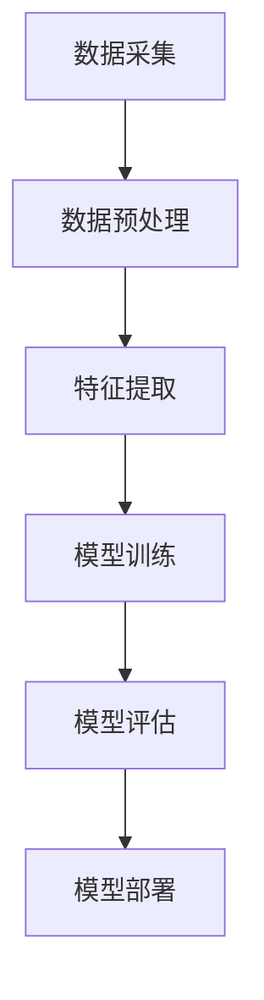
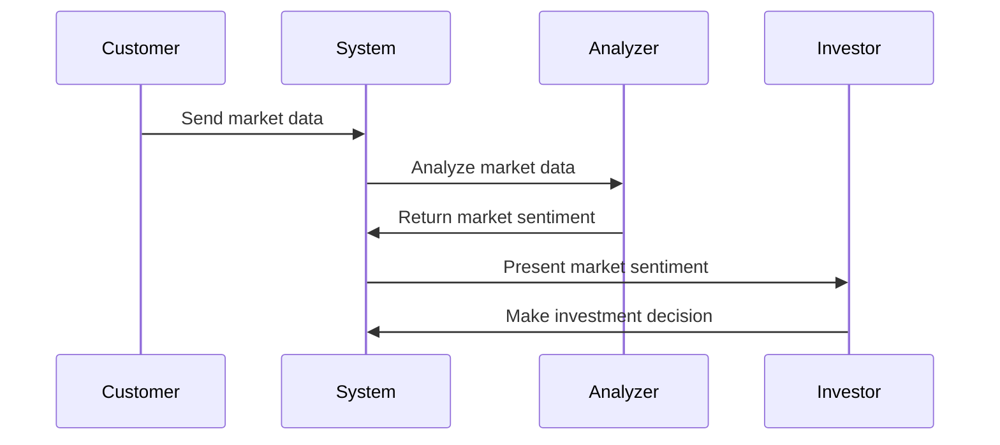
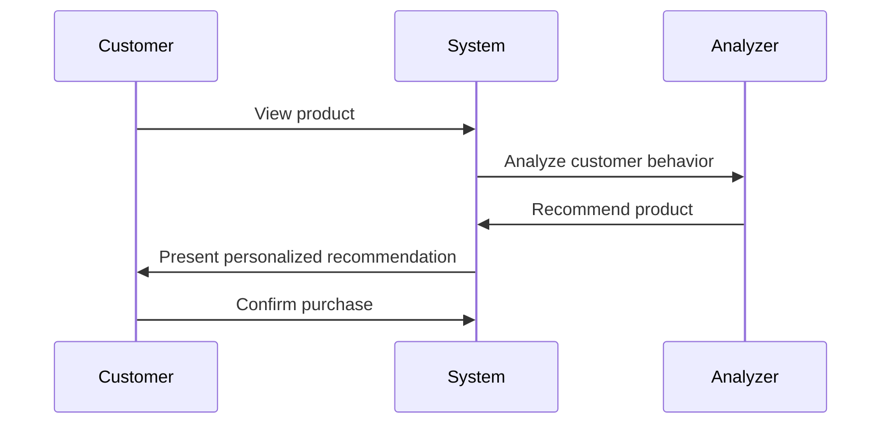

                 

# 情感经济学2.0：感性价值的量化研究

## 关键词
情感经济学、感性价值、量化研究、消费者行为、市场营销、投资决策

## 摘要
情感经济学2.0是探索情感在经济学中量化应用的新兴领域。本文首先介绍了情感经济学2.0的研究背景和核心问题，然后详细探讨了感性价值的定义和特征，情感量化方法的分类和常用技术，以及情感量化模型的构建和评估。接着，本文论述了情感经济学2.0在不同应用领域的实际价值，并举例说明。最后，本文总结了情感经济学2.0的研究成果和应用前景，提出了未来研究方向和挑战。

## 引言

### 1.1 问题背景

在过去的几十年里，传统经济学理论为我们提供了许多关于市场行为和经济现象的深刻见解。然而，随着社会经济的快速发展，消费者的行为模式和市场现象变得越来越复杂。特别是在全球化、互联网和信息技术的推动下，消费者的消费行为和市场需求呈现出多样化和个性化的趋势。这些变化使得传统的经济学理论和方法难以全面解释和预测经济现象。

在这样的背景下，情感经济学作为一门新兴学科应运而生。情感经济学旨在研究情感在经济学中的应用，探索情感如何影响消费者的决策和行为，以及如何通过量化情感价值来更好地理解和预测市场现象。随着心理学、行为经济学和计算机科学等学科的发展，情感经济学逐渐形成了一套系统的理论框架和方法论。

### 1.2 问题描述

情感经济学研究的一个核心问题是如何量化情感价值，即如何将消费者的情感体验转化为具体的数值，以便进行经济分析和预测。然而，现有的研究多停留在理论探讨阶段，缺乏系统的量化方法和实际应用。这导致了以下问题：

1. **理论上的缺失**：传统经济学理论主要关注理性决策，忽视了情感因素在消费决策中的重要作用。因此，在解释消费者行为和市场现象时，传统经济学理论往往显得不够充分。
2. **应用上的困难**：由于情感价值的主观性和个性化特点，将其量化为具体的数值是一个挑战。现有的量化方法和技术往往难以准确捕捉和衡量情感价值。
3. **跨学科整合的不足**：情感经济学涉及到心理学、行为经济学、计算机科学等多个学科，但现有的研究多停留在单一学科的范畴内，缺乏跨学科的整合和协同。

为了解决这些问题，本书提出了情感经济学2.0的概念，旨在构建一套系统的情感量化方法，填补现有研究的空白。情感经济学2.0将结合心理学、行为经济学和计算机科学等多学科知识，提出一套系统的情感量化方法，为企业和政策制定者提供科学依据。

### 1.3 问题解决

本书将从感性价值的定义、特征分析、量化模型和实际应用四个方面，全面探讨情感经济学2.0的量化研究。具体来说：

1. **感性价值的定义和特征分析**：首先，我们将定义感性价值，并探讨其特征，如主观性、个性化、动态性等。这将有助于我们理解感性价值的本质，为其量化提供理论基础。
2. **情感量化方法的分类和介绍**：接着，我们将介绍情感量化方法的分类，包括主观测量和客观测量，以及常见的情感量化技术，如情感分析、面部表情识别、生理信号监测和行为数据分析等。这将为我们提供多种量化情感价值的技术手段。
3. **情感量化模型的构建和评估**：我们将详细探讨情感量化模型的构建过程，包括数据采集与预处理、特征提取、模型训练与优化、模型评估与部署等步骤。通过这些步骤，我们可以构建出能够准确量化情感价值的模型。
4. **实际应用场景的探讨**：最后，我们将探讨情感经济学2.0在不同应用领域的实际价值，如消费者行为分析、投资决策、市场营销和社会政策等。通过具体案例的分析，我们将展示如何利用情感量化模型解决实际问题。

通过上述四个方面的研究，本书旨在构建一套完整的情感经济学2.0体系，为相关领域的研究者和实践者提供有力支持。

### 1.4 边界与外延

情感经济学2.0的研究范围包括消费行为、投资决策、市场营销、社会政策等多个领域。其核心在于将情感价值纳入经济学分析框架，从而更好地理解和预测经济现象。然而，情感经济学2.0也有其边界，主要在于如何准确量化情感价值，以及如何将量化结果应用于实际场景。

在情感经济学2.0的外延方面，它涉及到心理学、行为经济学、计算机科学等多个学科。这意味着情感经济学2.0不仅需要经济学理论的支持，还需要心理学、行为经济学和计算机科学等多学科知识的融合。通过跨学科的整合，情感经济学2.0可以更全面地解释和预测经济现象。

### 1.5 概念结构与核心要素组成

情感经济学2.0的核心概念包括感性价值、情感量化方法、应用领域等。其中，感性价值是指消费者在购买产品或服务时所感受到的情感体验，包括愉悦、满足、信任等。情感量化方法则是将情感体验转化为具体数值的过程，包括情感测量、情感分析等。应用领域则涵盖了消费行为、投资决策、市场营销等方面。

以下是情感经济学2.0的概念结构与核心要素组成的详细阐述：

#### 感性价值

感性价值是情感经济学2.0的核心概念之一。它是指消费者在购买产品或服务时所感受到的情感体验，如愉悦、满足、信任等。感性价值与消费者的心理状态、个人背景、文化价值观等因素密切相关，具有明显的个性化特征。

#### 情感量化方法

情感量化方法是将感性价值转化为具体数值的过程。根据测量手段的不同，情感量化方法主要可以分为两大类：主观测量和客观测量。

- **主观测量**：通过调查问卷、深度访谈等方式，直接获取消费者的情感体验数据。这种方法具有直接、直观的特点，但可能受到主观偏差的影响。
- **客观测量**：通过生理信号、行为数据等技术手段，间接获取消费者的情感状态。这种方法具有客观、准确的特点，但可能需要复杂的设备和技术支持。

常见的情感量化方法包括情感分析、面部表情识别、生理信号监测和行为数据分析等。

#### 应用领域

情感经济学2.0的应用领域非常广泛，包括消费行为、投资决策、市场营销、社会政策等多个领域。

- **消费行为**：通过情感量化模型，可以深入分析消费者的情感状态和偏好，为企业提供精准的市场洞察。例如，通过情感分析，企业可以了解消费者对产品的情感反馈，从而优化产品设计和服务质量。
- **投资决策**：情感经济学2.0可以应用于投资决策，帮助投资者更好地理解市场情绪和风险偏好。例如，通过分析社交媒体上的情感趋势，投资者可以预测市场的波动和投资机会。
- **市场营销**：情感量化模型可以用于市场营销策略的制定和优化。通过分析消费者的情感数据，企业可以制定更具针对性的营销活动，提高营销效果。
- **社会政策**：情感经济学2.0的研究成果可以应用于社会政策的制定和评估。例如，通过分析消费者的情感反馈，政策制定者可以更好地理解公众的情感状态和需求，从而制定更科学、有效的政策。

### 第2章 感性价值的定义与特征

#### 2.1 感性价值的定义

感性价值是指消费者在购买产品或服务时所感受到的情感体验，包括愉悦、满足、信任等。与理性价值相比，感性价值更具有主观性和个性化特点。理性价值主要关注产品的功能、性能和价格等客观因素，而感性价值则侧重于消费者在购买和使用产品或服务过程中的情感体验。

感性价值在消费者决策中扮演着重要的角色。研究表明，情感因素在很大程度上影响消费者的购买决策。例如，消费者可能会因为对某个品牌或产品的情感认同而选择购买，即使其价格相对较高。因此，理解感性价值的定义和特征对于企业和政策制定者具有重要意义。

#### 2.2 感性价值的特征

感性价值具有以下几个显著特征：

1. **主观性**：感性价值是消费者主观感受的结果。不同个体对同一产品或服务的感性价值可能会有较大差异。例如，一个人可能因为产品的设计风格而感到愉悦，而另一个人则可能因为产品的实用功能而感到满意。这种主观性使得感性价值难以用简单的量化方法进行衡量。

2. **个性化**：感性价值与消费者的个人背景、心理状态、文化价值观等因素密切相关，具有明显的个性化特征。例如，不同年龄、性别、文化背景的消费者可能会有不同的感性价值偏好。这种个性化特征要求我们在研究感性价值时，需要考虑消费者的个体差异。

3. **动态性**：消费者的感性价值会随着时间、环境、情境等因素的变化而变化。例如，在不同的购买场景下，消费者对同一产品的感性价值可能会有所不同。这种动态性使得感性价值的量化更具挑战性。

### 感性价值的属性特征对比表格

为了更好地理解感性价值的特征，我们可以将其与理性价值进行对比。以下是一个简单的对比表格：

| 特征       | 感性价值                 | 理性价值                 |
|------------|--------------------------|--------------------------|
| 主观性     | 消费者主观感受的结果     | 客观指标，如价格、性能   |
| 个性化     | 与消费者个人背景相关     | 通常适用于所有消费者     |
| 动态性     | 随时间、环境、情境变化   | 通常稳定，不易变化       |
| 量化难度   | 较大，难以直接衡量       | 较小，可以简单量化       |
| 影响因素   | 情感、心理状态、文化背景  | 产品功能、性能、价格     |

通过上述对比，我们可以看到，感性价值和理性价值在多个方面存在显著差异。了解这些差异有助于我们在研究和应用中更好地把握感性价值的本质。

#### 2.3 感性价值的影响因素

感性价值受到多种因素的影响，这些因素可以分为内部因素和外部因素。

1. **内部因素**：
   - **个人背景**：包括年龄、性别、教育程度、收入水平等。不同背景的消费者可能会有不同的感性价值偏好。
   - **心理状态**：消费者的情绪、压力、焦虑等心理状态会影响其对产品的感性价值判断。
   - **文化价值观**：消费者的文化背景和价值观念会影响其对产品的感性价值认同。

2. **外部因素**：
   - **产品特性**：产品的设计、功能、质量、品牌形象等直接影响消费者的感性价值。
   - **购买情境**：包括购买环境、促销活动、服务体验等。不同的购买情境可能会激发消费者不同的情感体验。
   - **社会影响**：消费者的朋友、家人、社交媒体等社会因素也可能影响其感性价值判断。

了解这些影响因素有助于我们更全面地理解感性价值的形成和变化过程，从而为实际应用提供有针对性的策略。

### 第3章 情感量化方法概述

#### 3.1 情感量化方法的分类

情感量化方法主要可以分为两大类：主观测量和客观测量。每种方法都有其独特的优势和局限性。

1. **主观测量**：
   - **调查问卷**：通过设计问卷，直接询问消费者对产品或服务的情感体验。这种方法简单直观，但可能受到消费者主观偏差的影响。
   - **深度访谈**：与消费者进行一对一访谈，深入了解其情感体验和购买行为。这种方法可以获得更深入的见解，但成本较高，且受访者数量有限。

2. **客观测量**：
   - **生理信号监测**：通过监测消费者的生理信号（如心率、皮肤电反应等），评估其情感状态。这种方法具有客观性，但需要专业的设备和数据分析技术。
   - **行为数据分析**：通过分析消费者的行为数据（如购买记录、搜索行为等），推断其情感偏好。这种方法具有数据量大、实时性强等优点，但可能存在隐私和数据安全等问题。

#### 3.2 常见的情感量化方法

以下是几种常见的情感量化方法及其基本原理：

1. **情感分析**：
   - **技术原理**：情感分析利用自然语言处理（NLP）技术，从文本中提取情感信息。通过训练分类模型，可以将文本中的情感倾向（如积极、消极、中性）进行量化。
   - **应用场景**：社交媒体分析、客户反馈分析、产品评价等。

2. **面部表情识别**：
   - **技术原理**：面部表情识别通过计算机视觉技术，分析人脸图像中的情感表达。通过识别面部特征（如眼睛闭合、嘴角上扬等），可以判断出消费者的情感状态。
   - **应用场景**：用户满意度调查、广告效果评估、虚拟现实体验等。

3. **生理信号监测**：
   - **技术原理**：生理信号监测通过传感器和数据分析技术，实时监测消费者的生理信号（如心率、呼吸、皮肤电反应等）。通过分析这些生理信号的变化，可以推断消费者的情感状态。
   - **应用场景**：心理健康监测、运动表现分析、虚拟现实体验等。

4. **行为数据分析**：
   - **技术原理**：行为数据分析通过收集和分析消费者的行为数据（如购买记录、搜索行为、浏览时间等），推断其情感偏好和购买意愿。
   - **应用场景**：个性化推荐、精准营销、用户行为分析等。

#### 3.3 情感量化方法的应用案例

以下是情感量化方法在现实生活中的几个应用案例：

1. **客户反馈分析**：
   - **案例描述**：某电商平台希望通过情感分析技术，分析消费者对产品的评价，了解消费者的情感偏好。
   - **技术方法**：使用情感分析技术，对消费者评论中的情感倾向进行量化，识别出积极的、中性的和消极的评价。
   - **应用效果**：通过对情感数据的分析，电商平台可以了解消费者对产品的满意度和不满意度，从而改进产品质量和售后服务。

2. **用户满意度调查**：
   - **案例描述**：某酒店集团希望通过面部表情识别技术，评估用户对酒店服务的满意度。
   - **技术方法**：在酒店大堂设置摄像头，实时捕捉用户的面部表情，通过面部表情识别技术，分析用户的情感状态。
   - **应用效果**：通过实时了解用户的情感状态，酒店集团可以及时调整服务质量，提高用户满意度。

3. **虚拟现实体验**：
   - **案例描述**：某游戏公司希望通过生理信号监测技术，提升用户的虚拟现实体验。
   - **技术方法**：在虚拟现实设备中集成生理信号监测设备，实时监测用户的心率、呼吸等生理信号，根据生理信号的变化调整虚拟现实内容。
   - **应用效果**：通过生理信号监测，用户可以感受到更加真实的虚拟体验，从而提高游戏的趣味性和沉浸感。

这些应用案例展示了情感量化方法在现实生活中的广泛应用潜力，为企业和政策制定者提供了新的数据支持和决策依据。

### 第4章 情感量化模型的构建

#### 4.1 数据采集与预处理

数据采集是情感量化模型构建的基础。数据来源可以包括问卷调查、社交媒体数据、购买记录等。在数据采集过程中，需要确保数据的真实性和有效性。

数据预处理是数据采集后的重要步骤。预处理过程主要包括数据清洗、去噪、归一化等。数据清洗旨在去除数据中的噪声和错误，如缺失值、重复值和异常值。去噪是通过滤波和降噪等技术，减少数据中的噪声。归一化则是通过缩放和标准化，将不同特征的数据转换到同一尺度上，以便进行后续分析。

#### 4.2 特征提取

特征提取是情感量化模型的关键步骤。通过提取与情感相关的特征，可以更好地表征消费者的情感状态。常见的特征提取方法包括以下几种：

1. **文本特征提取**：
   - **词频分析**：通过计算文本中各个单词的频率，提取文本的特征。
   - **词向量表示**：通过词嵌入技术，将文本中的单词映射到高维空间中，从而提取文本的特征。
   - **情感词典**：利用预定义的情感词典，提取文本中的情感词。

2. **图像特征提取**：
   - **人脸特征点检测**：通过计算机视觉技术，检测图像中的人脸特征点，提取人脸的特征。
   - **面部表情编码**：通过分析面部特征点的变化，提取面部表情的特征。

3. **生理信号特征提取**：
   - **时域特征**：通过分析生理信号的时间序列数据，提取如心率变异性等特征。
   - **频域特征**：通过傅里叶变换等频域分析方法，提取生理信号的频域特征。

4. **行为数据特征提取**：
   - **购买行为特征**：通过分析消费者的购买记录，提取购买频次、购买金额等特征。
   - **搜索行为特征**：通过分析消费者的搜索行为，提取搜索关键词、搜索时长等特征。

#### 4.3 模型训练与优化

模型训练与优化是情感量化模型构建的核心。常用的算法包括支持向量机（SVM）、决策树、神经网络等。通过交叉验证和超参数调优，可以优化模型的性能。

1. **支持向量机（SVM）**：
   - **原理**：SVM通过寻找一个超平面，将不同类别的数据点分开。在情感量化中，SVM可以用于分类任务，如情感倾向分类。
   - **训练过程**：通过训练数据集，优化SVM模型的参数，使其能够准确分类情感数据。

2. **决策树**：
   - **原理**：决策树通过一系列条件判断，将数据划分为不同的类别。在情感量化中，决策树可以用于分类和回归任务。
   - **训练过程**：通过训练数据集，构建决策树的各个节点和分支，优化决策树的分类效果。

3. **神经网络**：
   - **原理**：神经网络通过多层非线性变换，将输入数据映射到输出。在情感量化中，神经网络可以用于复杂的模式识别和分类任务。
   - **训练过程**：通过反向传播算法，调整神经网络的权重和偏置，优化模型的输出效果。

#### 4.4 模型评估与部署

模型评估是验证模型性能的重要环节。常用的评估指标包括准确率、召回率、F1值等。通过评估模型的性能，可以判断模型是否能够准确量化情感价值。

模型部署是将训练好的模型应用于实际场景的关键步骤。通过部署模型，企业可以将其应用于消费者行为分析、市场营销策略制定等实际场景中。模型部署的过程主要包括以下步骤：

1. **模型集成**：将训练好的模型集成到现有的系统中，如数据预处理模块、特征提取模块和分类预测模块等。
2. **实时预测**：通过实时数据流，将用户数据输入到模型中进行预测，输出情感量化结果。
3. **结果反馈**：根据模型的预测结果，生成相应的报告或推荐，为企业提供决策支持。

通过数据采集与预处理、特征提取、模型训练与优化、模型评估与部署等步骤，情感量化模型可以准确量化消费者的情感价值，为企业和政策制定者提供科学依据。

### 第5章 情感经济学2.0的应用领域

#### 5.1 消费者行为分析

情感经济学2.0在消费者行为分析中具有重要的应用价值。通过情感量化模型，可以深入分析消费者的情感状态和偏好，为企业提供精准的市场洞察。具体来说，情感经济学2.0可以应用于以下几个方面：

1. **情感偏好分析**：通过情感量化模型，可以识别消费者的情感偏好。例如，通过对消费者评论的情感分析，可以了解消费者对产品功能、设计、价格等方面的情感偏好，从而指导产品设计和改进。

2. **消费行为预测**：通过分析消费者的情感数据，可以预测消费者的购买行为。例如，通过对消费者的情感趋势和购买记录的分析，可以预测消费者的购买意向，帮助企业制定更有效的营销策略。

3. **满意度评估**：通过情感量化模型，可以评估消费者的满意度。例如，通过对消费者服务体验的情感分析，可以评估消费者对酒店、餐厅等服务提供商的满意度，为企业提供改进服务的依据。

4. **市场细分**：通过情感量化模型，可以识别不同市场细分群体的情感特征。例如，通过对消费者情感数据的分析，可以了解不同年龄段、性别、地域等群体的情感偏好，从而制定更有针对性的市场营销策略。

#### 5.2 投资决策

情感经济学2.0在投资决策中也发挥着重要作用。通过情感量化模型，可以更好地理解市场情绪和风险偏好，为投资者提供决策支持。具体来说，情感经济学2.0可以应用于以下几个方面：

1. **市场情绪分析**：通过情感量化模型，可以分析市场情绪的波动。例如，通过对社交媒体、新闻报道等文本数据的情感分析，可以了解市场的乐观或悲观情绪，从而预测市场的波动趋势。

2. **风险偏好评估**：通过情感量化模型，可以评估投资者的风险偏好。例如，通过对投资者的情感数据的分析，可以了解投资者在投资过程中的情绪波动，从而判断其风险承受能力。

3. **投资组合优化**：通过情感量化模型，可以优化投资者的投资组合。例如，通过对市场情绪和投资者风险偏好的分析，可以调整投资组合中的资产配置，降低投资风险。

4. **预测市场走势**：通过情感量化模型，可以预测市场的走势。例如，通过对消费者情感的实时分析，可以预测市场的需求变化，从而指导投资决策。

#### 5.3 市场营销

情感经济学2.0在市场营销中具有广泛的应用前景。通过情感量化模型，可以制定更具针对性的市场营销策略，提高营销效果。具体来说，情感经济学2.0可以应用于以下几个方面：

1. **情感驱动营销**：通过情感量化模型，可以了解消费者的情感状态和需求。例如，通过对消费者情感的实时分析，可以识别消费者的情感触发点，从而设计更具吸引力的营销活动。

2. **个性化推荐**：通过情感量化模型，可以为消费者提供个性化的推荐。例如，通过对消费者情感的量化分析，可以推荐符合消费者情感偏好的产品和服务，从而提高消费者的购买意愿。

3. **品牌形象塑造**：通过情感量化模型，可以评估品牌形象在消费者心中的情感价值。例如，通过对消费者情感的量化分析，可以了解消费者对品牌的情感认同度，从而制定品牌形象优化策略。

4. **营销效果评估**：通过情感量化模型，可以评估营销活动的效果。例如，通过对消费者情感的量化分析，可以了解营销活动对消费者情感的影响，从而评估营销活动的效果，指导后续的营销策略调整。

#### 5.4 社会政策

情感经济学2.0在社会政策领域也具有广泛的应用前景。通过情感量化模型，可以更好地理解公众的情感状态和需求，为政策制定者提供科学依据。具体来说，情感经济学2.0可以应用于以下几个方面：

1. **公众情感分析**：通过情感量化模型，可以分析公众的情感状态。例如，通过对社交媒体、新闻报道等文本数据的情感分析，可以了解公众对政策、事件等的情感反应，从而判断公众的态度和情绪。

2. **政策效果评估**：通过情感量化模型，可以评估政策的效果。例如，通过对公众情感的量化分析，可以了解政策实施后公众的情感变化，从而评估政策的效果，为政策调整提供依据。

3. **社会问题预警**：通过情感量化模型，可以预警社会问题的发生。例如，通过对公众情感的实时分析，可以识别出可能引发社会问题的情感信号，从而提前采取措施，预防社会问题的发生。

4. **公共政策优化**：通过情感量化模型，可以优化公共政策的制定。例如，通过对公众情感的量化分析，可以了解公众对政策的需求和期望，从而优化公共政策的制定和实施。

通过在消费者行为分析、投资决策、市场营销和社会政策等领域的应用，情感经济学2.0为企业和政策制定者提供了新的数据支持和决策依据，有助于更好地理解和预测经济现象，推动经济和社会的可持续发展。

### 第6章 情感经济学2.0的案例分析

为了更好地展示情感经济学2.0的应用效果，我们选取了几个具有代表性的实际案例进行分析和讨论。

#### 案例一：电商平台的情感驱动营销

某大型电商平台希望通过情感经济学2.0的方法，提升其用户满意度和转化率。具体步骤如下：

1. **数据采集与预处理**：该电商平台收集了大量的用户评论和购买记录，并进行了数据清洗和去噪处理，以确保数据的真实性和有效性。

2. **情感量化**：利用情感分析技术，对用户评论进行情感量化，识别出积极、消极和中性的情感倾向。同时，对购买记录进行情感分析，了解用户在购买过程中的情感变化。

3. **情感偏好分析**：通过对情感数据的分析，该电商平台识别出用户对产品功能、设计、价格等方面的情感偏好。例如，用户普遍对产品的外观设计持积极情感，而对价格较为敏感。

4. **营销策略调整**：根据情感偏好的分析结果，该电商平台调整了其营销策略。例如，在推广产品时，更加突出产品的外观设计和性价比，以吸引更多的潜在用户。

5. **效果评估**：通过跟踪用户的购买行为和满意度评分，该电商平台发现情感驱动营销策略显著提高了用户的满意度和转化率。

#### 案例二：投资公司的市场情绪分析

某投资公司希望通过情感经济学2.0的方法，更好地理解市场情绪，优化投资组合。具体步骤如下：

1. **数据采集与预处理**：该投资公司收集了大量的社交媒体文本数据、新闻报道和投资者评论，并进行了数据清洗和去噪处理。

2. **情感量化**：利用情感分析技术，对文本数据进行分析，识别出市场的乐观、悲观和中性情绪。同时，对投资者的情感数据进行分析，了解投资者的情绪变化。

3. **市场情绪预测**：通过对情感数据的分析，该投资公司建立了市场情绪预测模型，预测市场的波动趋势。

4. **投资组合优化**：根据市场情绪预测模型的结果，该投资公司调整了其投资组合，增加了对市场乐观情绪的资产配置，降低了市场悲观情绪的资产配置。

5. **效果评估**：通过跟踪投资组合的表现，该投资公司发现市场情绪分析显著提高了其投资组合的收益率。

#### 案例三：酒店行业的情感管理

某豪华酒店希望通过情感经济学2.0的方法，提升客户满意度和服务质量。具体步骤如下：

1. **数据采集与预处理**：该酒店收集了大量的客户反馈数据，包括评价、投诉和建议等，并进行了数据清洗和去噪处理。

2. **情感量化**：利用情感分析技术，对客户反馈进行情感量化，识别出客户对酒店设施、服务、价格等方面的情感倾向。

3. **情感偏好分析**：通过对情感数据的分析，该酒店识别出客户对酒店的不同方面的情感偏好。例如，客户普遍对酒店的服务持积极情感，但对价格较为敏感。

4. **服务质量提升**：根据情感偏好的分析结果，该酒店制定了针对性的服务质量提升策略。例如，加强对服务人员的培训，优化价格策略等。

5. **效果评估**：通过跟踪客户的满意度评分和复购率，该酒店发现情感管理策略显著提高了客户的满意度和忠诚度。

这些案例展示了情感经济学2.0在不同领域的实际应用效果，证明了其对于理解和预测经济现象、优化决策的重要价值。通过结合心理学、行为经济学和计算机科学等多学科知识，情感经济学2.0提供了一种全新的研究方法和工具，为企业和政策制定者提供了新的数据支持和决策依据。

### 第7章 结论与未来展望

#### 结论

本文系统探讨了情感经济学2.0的理论框架和方法论，从感性价值的定义、特征分析、量化方法、模型构建到实际应用，全面阐述了情感经济学2.0的核心内容和研究进展。通过分析消费者行为、投资决策、市场营销和社会政策等领域的应用案例，本文展示了情感经济学2.0的实际价值和潜力。情感经济学2.0不仅为企业和政策制定者提供了新的数据支持和决策依据，也为跨学科研究提供了新的视角和思路。

#### 未来展望

尽管情感经济学2.0已取得了一系列重要成果，但仍有大量问题和挑战需要解决。以下是一些未来研究的方向和展望：

1. **跨学科整合**：进一步深化心理学、行为经济学、计算机科学等多学科之间的整合，探索情感量化方法的创新和应用。

2. **数据隐私与安全**：随着数据量的增加，数据隐私和安全问题日益突出。未来研究需要关注如何在保障数据隐私和安全的前提下，进行情感量化分析。

3. **实时情感分析**：开发实时情感分析技术，实现对消费者情感状态的实时监测和预测，为企业提供更及时、准确的决策支持。

4. **个性化情感服务**：结合大数据和人工智能技术，实现个性化情感服务，满足消费者多样化的情感需求。

5. **情感经济学2.0的应用拓展**：进一步拓展情感经济学2.0的应用领域，如教育、医疗、公共服务等，为社会的可持续发展提供新思路。

#### 注意事项

在应用情感经济学2.0的过程中，需要注意以下几点：

1. **数据质量**：确保数据来源的可靠性和数据清洗的彻底性，以提高情感量化分析的准确性。

2. **模型选择**：根据具体应用场景选择合适的情感量化模型，并进行模型优化和评估，确保模型性能。

3. **伦理问题**：在情感量化分析过程中，应遵守伦理规范，确保消费者隐私和数据安全。

4. **政策支持**：政策制定者应关注情感经济学2.0的发展，提供必要的政策支持和资源投入。

#### 拓展阅读

对于对情感经济学2.0感兴趣的研究者和实践者，以下是一些推荐的拓展阅读资源：

1. **学术期刊**：如《经济学季刊》、《心理学报》等，这些期刊发表了大量关于情感经济学的研究论文。
2. **专业书籍**：如《情感经济学：情感如何影响经济决策》、《情感分析：从文本到情感》等，这些书籍详细介绍了情感经济学和情感分析的理论和方法。
3. **在线课程**：如Coursera、edX等平台上的相关课程，提供了丰富的学习资源和实践指导。

通过不断深入研究和应用，情感经济学2.0有望成为理解经济现象、优化决策的重要工具，为经济和社会的发展提供新动力。

### 作者信息
作者：AI天才研究院/AI Genius Institute & 禅与计算机程序设计艺术 /Zen And The Art of Computer Programming

### 附录
#### 2.1 感性价值的ER实体关系图
```mermaid
erDiagram
  Customer ||--|{ Product }|--|+ { Purchase }
  Customer ||--|{ Review }
  Product ||--|{ Feature }
```
#### 2.2 感性价值与理性价值的属性特征对比表格
| 特征 | 感性价值 | 理性价值 |
|------|----------|----------|
| 主观性 | 消费者主观感受的结果 | 客观指标，如价格、性能 |
| 个性化 | 与消费者个人背景相关 | 通常适用于所有消费者 |
| 动态性 | 随时间、环境、情境变化 | 通常稳定，不易变化 |
| 量化难度 | 较大，难以直接衡量 | 较小，可以简单量化 |
| 影响因素 | 情感、心理状态、文化背景 | 产品功能、性能、价格 |

#### 4.3 常用情感量化模型算法的mermaid流程图


#### 5.1 消费者行为分析的mermaid类图
```mermaid
classDiagram
  Customer <<interface>> CustomerInterface
  Review <<interface>> ReviewInterface
  Purchase <<interface>> PurchaseInterface
  Product <<entity>> Product
  Customer ^has^ Review
  Customer ^has^ Purchase
  Product ^has^ Feature
  CustomerInterface ^uses^ ReviewInterface
  CustomerInterface ^uses^ PurchaseInterface
```

#### 5.2 投资决策分析的mermaid架构图


#### 5.3 市场营销策略的mermaid序列图


