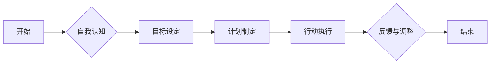

                 

# 《意义的个人化：在集体主义衰落中寻找自我》

> 关键词：集体主义、个人化、意义、自我实现、文化变迁

> 摘要：本文深入探讨了在集体主义衰落的社会背景下，个人化意义的重要性和寻找自我的途径。通过对集体主义的历史背景、个人化意义的内涵及其影响的分析，本文旨在为读者提供一套系统性的个人化实践指南，以帮助个体在多元文化环境中找到自我认同和人生价值。

## 目录大纲

### 第一部分：问题的提出

#### 1.1 集体主义的衰落与社会变迁

##### 1.1.1 集体主义的历史背景

##### 1.1.2 集体主义衰落的表现

##### 1.1.3 集体主义衰落的原因分析

#### 1.2 个人化意义的缺失

##### 1.2.1 个人化意义的内涵

##### 1.2.2 个人化意义缺失的现象

##### 1.2.3 个人化意义缺失的影响

### 第二部分：理论探讨

#### 2.1 个人化的哲学基础

##### 2.1.1 西方哲学中的个人主义

##### 2.1.2 东方哲学中的自我观念

##### 2.1.3 个人化哲学的互鉴与融合

#### 2.2 个人化的心理学探讨

##### 2.2.1 个人心理特征的探讨

##### 2.2.2 个人化动机与自我实现

##### 2.2.3 个人化与心理健康的关系

### 第三部分：案例分析

#### 3.1 个人化在文化领域的实践

##### 3.1.1 文化产业的个人化趋势

##### 3.1.2 个人化文化产品的案例分析

##### 3.1.3 个人化文化的影响与反思

#### 3.2 个人化在政治领域的实践

##### 3.2.1 个人化政治理念的发展

##### 3.2.2 个人化政治实践的案例分析

##### 3.2.3 个人化政治的挑战与展望

### 第四部分：个人化的实践指南

#### 4.1 个人化意识的培养

##### 4.1.1 个人化意识的定义

##### 4.1.2 个人化意识培养的方法

##### 4.1.3 个人化意识培养的案例

#### 4.2 个人化目标的设定与实现

##### 4.2.1 个人化目标的重要性

##### 4.2.2 设定个人化目标的步骤

##### 4.2.3 个人化目标实现的策略

#### 4.3 个人化生活的实践

##### 4.3.1 个人化生活方式的探索

##### 4.3.2 个人化生活实践的经验分享

##### 4.3.3 个人化生活的挑战与应对

### 第五部分：总结与展望

#### 5.1 个人化的意义与价值

##### 5.1.1 个人化的社会意义

##### 5.1.2 个人化的文化意义

##### 5.1.3 个人化的未来发展

#### 5.2 个人化的挑战与机遇

##### 5.2.1 面对集体主义的挑战

##### 5.2.2 把握个人化发展的机遇

##### 5.2.3 个人化发展的未来方向

## 第一部分：问题的提出

### 1.1 集体主义的衰落与社会变迁

#### 1.1.1 集体主义的历史背景

集体主义作为一种社会思潮，起源于古代社会的宗族和部落制度，其核心在于强调个体对于集体、团体或国家的责任和义务。在人类社会发展的不同阶段，集体主义的形式和内容也有所变化。例如，在封建社会，集体主义体现在对家族、宗族和国家的忠诚；在社会主义时期，集体主义则强调个体为了国家和集体的利益而奋斗。

然而，随着工业革命和信息时代的到来，集体主义逐渐面临挑战。工业革命带来了资本主义的发展，个体的自由和权利得到了前所未有的重视。信息时代的来临，更是加速了个体意识和自我价值的崛起，集体主义的地位逐渐衰落。

#### 1.1.2 集体主义衰落的表现

集体主义衰落的表现可以从以下几个方面进行观察：

1. **个人主义兴起**：个体自我意识增强，追求个人自由和权利。现代社会中，个人主义逐渐取代集体主义，成为主导社会思潮。

2. **社会流动性增强**：全球化进程使得个体更容易跨越地域和文化的界限，追求个人的发展和实现。

3. **文化多元化**：在多元文化的背景下，个体对于自身文化的认同感逐渐减弱，更注重个人化和差异化的文化表达。

4. **价值观念的转变**：传统的集体主义价值观逐渐被质疑和挑战，个体价值的实现成为新的价值取向。

#### 1.1.3 集体主义衰落的原因分析

集体主义衰落的原因可以从以下几个方面进行分析：

1. **经济因素**：市场经济的发展，使得个体追求经济利益最大化，集体主义的经济基础受到冲击。

2. **技术进步**：信息技术的快速发展，使得个体获取信息和资源的渠道更加便捷，个体独立性和自主性增强。

3. **文化变迁**：全球化和多元文化的交融，使得个体对于自身文化的认同感减弱，集体主义的文化基础受到挑战。

4. **政治因素**：政治制度的变革，民主化和自由化进程的推进，使得个体权利和自由得到保障，集体主义的政治基础受到削弱。

### 1.2 个人化意义的缺失

#### 1.2.1 个人化意义的内涵

个人化意义是指个体在社会生活中对于自身价值、角色和身份的认知和追求。它强调个体在集体中的独立性和独特性，追求个体自由和全面发展。个人化意义的内涵包括：

1. **自我认同**：个体对于自身身份和角色的认知，包括个体的文化、价值观、兴趣爱好等。

2. **自我实现**：个体通过自我努力和追求，实现自身潜能和价值的过程。

3. **个性化表达**：个体在文化、艺术、科技等领域的独特表达和创造。

#### 1.2.2 个人化意义缺失的现象

个人化意义缺失的现象可以从以下几个方面进行观察：

1. **社会同质化**：在集体主义的背景下，个体容易陷入社会同质化的陷阱，缺乏个性和独特性。

2. **过度依赖集体**：个体在追求个人发展时，过度依赖集体和外部环境，缺乏独立思考和行动能力。

3. **缺乏自我认同**：个体对于自身价值和角色的认知不清晰，缺乏自我认同和自信心。

4. **心理健康问题**：个人化意义的缺失可能导致心理健康问题，如焦虑、抑郁等。

#### 1.2.3 个人化意义缺失的影响

个人化意义缺失的影响可以从以下几个方面进行观察：

1. **社会创新力下降**：个人化意义的缺失可能导致社会创新力的下降，个体缺乏独立思考和创造能力。

2. **社会凝聚力减弱**：个人化意义的缺失可能导致社会凝聚力的减弱，个体对于社会的认同感降低。

3. **个体幸福感下降**：个人化意义的缺失可能导致个体幸福感的下降，个体难以实现自我价值和满足感。

### 第二部分：理论探讨

#### 2.1 个人化的哲学基础

#### 2.1.1 西方哲学中的个人主义

西方哲学中的个人主义强调个体的独立性和自由，认为个体是价值创造和实现的主体。个人主义的哲学基础可以追溯到古希腊哲学，如苏格拉底、柏拉图和亚里士多德等哲学家都强调个体的价值和尊严。现代西方哲学中的个人主义进一步强调个体的自主性和权利，如约翰·罗尔斯的《正义论》和迈克尔·桑德尔的《正义：一场关于道德与哲学的思辨之旅》等。

#### 2.1.2 东方哲学中的自我观念

东方哲学中的自我观念强调个体与集体、自然和社会的关系。儒家哲学中的“仁爱”和“忠诚”强调个体在集体中的责任和义务，道家哲学中的“无为而治”和“道法自然”则强调个体与自然的和谐共生。佛教哲学中的“自我空性”则强调个体对于自我和集体的超越。

#### 2.1.3 个人化哲学的互鉴与融合

在全球化背景下，西方哲学中的个人主义和东方哲学中的自我观念相互借鉴和融合，为个人化的哲学基础提供了新的可能性。例如，儒家哲学中的“仁爱”和“忠诚”与西方哲学中的个人自由和权利可以相互融合，形成一种新的个人化哲学体系。

#### 2.2 个人化的心理学探讨

#### 2.2.1 个人心理特征的探讨

个人心理特征的探讨主要包括个体的自我认同、自我实现和个性化表达等方面。个体自我认同的建立是个人化的基础，它涉及到个体对于自身身份和角色的认知。自我实现是个人化的核心，它涉及到个体通过自我努力和追求实现自身潜能和价值的过程。个性化表达是个人化的外在体现，它涉及到个体在文化、艺术、科技等领域的独特表达和创造。

#### 2.2.2 个人化动机与自我实现

个人化动机与自我实现的关系可以从以下几个方面进行探讨：

1. **内在动机与外在动机**：内在动机主要来源于个体内部的兴趣、爱好和价值观，如追求个人成就和满足感。外在动机主要来源于外部环境的要求和期望，如社会压力和竞争。个人化动机的建立需要平衡内在动机和外在动机，以实现自我实现。

2. **目标设定与实现**：个人化动机的实现需要明确的目标设定和持续的努力。个体需要设定符合自身兴趣和价值观的目标，并通过制定计划和行动来实现目标。

3. **自我监控与自我调节**：个人化动机的实现还需要个体进行自我监控和自我调节。个体需要时刻关注自身的心理和行为，及时调整和优化自己的行为，以实现自我实现。

#### 2.2.3 个人化与心理健康的关系

个人化与心理健康的关系可以从以下几个方面进行探讨：

1. **个人化与心理健康的关系模型**：个人化与心理健康之间存在复杂的关系模型。一方面，个人化有助于心理健康，因为它可以增强个体的自我认同和自我实现。另一方面，个人化也可能带来心理压力，因为它要求个体承担更多的责任和挑战。

2. **心理健康对个人化的影响**：心理健康对个人化的影响主要体现在以下几个方面：首先，心理健康水平较高的个体更容易实现个人化目标；其次，心理健康水平较低的个体可能面临个人化挑战，需要更多的支持和帮助。

3. **个人化对心理健康的影响**：个人化对心理健康的影响可以从以下几个方面进行探讨：首先，个人化可以增强个体的自尊和自信，有助于心理健康；其次，个人化也可能导致个体的孤独感和焦虑感，需要适当的调整和平衡。

### 第三部分：案例分析

#### 3.1 个人化在文化领域的实践

#### 3.1.1 文化产业的个人化趋势

随着科技的发展和文化的多元化，文化产业逐渐呈现出个人化的趋势。在文化产业中，个人化趋势表现为以下几个方面：

1. **个性化文化产品的需求增加**：随着消费者需求的多样化，个性化文化产品逐渐受到市场的青睐。例如，定制化的服装、个性化的音乐和电影等。

2. **个人化文化创作的兴起**：个人化文化创作的兴起，为个体提供了更多的表达和创造空间。例如，网络文学、独立音乐和独立电影等。

3. **个人化文化产业的崛起**：个人化文化产业的崛起，为个体提供了更多的创业机会和就业选择。例如，自媒体、网络直播和个性化咨询服务等。

#### 3.1.2 个人化文化产品的案例分析

以下是对一些个人化文化产品的案例分析：

1. **个性化音乐**：个性化音乐是一种根据用户喜好和需求进行定制化的音乐服务。例如，网易云音乐的用户可以根据自己的喜好创建个性化的歌单，推荐系统也可以根据用户的听歌习惯推荐个性化歌曲。

2. **个性化电影**：个性化电影是一种根据用户喜好和需求进行定制化的电影服务。例如，Netflix等流媒体平台可以根据用户的观影历史和喜好，推荐个性化的电影和电视剧。

3. **个性化文学**：个性化文学是一种根据用户喜好和需求进行定制化的文学作品。例如，一些网络小说平台可以根据用户的阅读历史和喜好，推荐个性化的小说。

#### 3.1.3 个人化文化的影响与反思

个人化文化的影响可以从以下几个方面进行反思：

1. **个人化对文化多样性的影响**：个人化文化在一定程度上促进了文化多样性的发展，但过度个人化可能导致文化同质化。因此，需要在个人化和多样性之间找到平衡点。

2. **个人化对文化传承的影响**：个人化文化可能导致传统文化传承的断层，因为个体在追求个性化时，可能忽视了传统文化的价值。因此，需要在个人化和文化传承之间找到平衡点。

3. **个人化对文化创新的影响**：个人化文化有助于文化创新，因为它为个体提供了更多的表达和创造空间。然而，过度个人化也可能导致文化创新的瓶颈，因为个体可能缺乏宏观视野和协作能力。因此，需要在个人化和协作创新之间找到平衡点。

#### 3.2 个人化在政治领域的实践

#### 3.2.1 个人化政治理念的发展

个人化政治理念的发展是现代社会的一个重要趋势。个人化政治理念强调个体在政治生活中的权利和自由，主张个体自主参与政治决策，追求个体价值和利益的最大化。个人化政治理念的发展可以从以下几个方面进行观察：

1. **个体参与政治的增强**：随着社会的发展和民主制度的推进，个体参与政治的途径和机会逐渐增多。例如，公民投票、议会选举和网络民主等。

2. **个体权利和自由的保障**：个人化政治理念强调个体权利和自由的保障，反对任何形式的集体压制和侵犯。例如，言论自由、信仰自由和隐私权等。

3. **个体自主决策的推崇**：个人化政治理念推崇个体自主决策的权利，主张个体在政治生活中拥有更多的自主权和选择权。例如，个性化选举、个性化政策和个性化治理等。

#### 3.2.2 个人化政治实践的案例分析

以下是对一些个人化政治实践的案例分析：

1. **个性化选举**：个性化选举是一种根据个体偏好和需求进行选举的方式。例如，一些国家的议会选举中，选民可以根据自己的意愿选择候选人，而不是根据政党或派系进行投票。

2. **个性化政策**：个性化政策是一种根据个体需求和利益进行政策制定的方式。例如，一些政府推出了针对特定群体的个性化政策，如儿童福利政策、老年人福利政策和残疾人福利政策等。

3. **个性化治理**：个性化治理是一种根据个体需求和利益进行社会治理的方式。例如，一些城市推出了个性化治理模式，如智慧城市、共享城市和可持续城市等。

#### 3.2.3 个人化政治的挑战与展望

个人化政治的挑战与展望可以从以下几个方面进行探讨：

1. **个人化与集体利益的平衡**：个人化政治强调个体权利和自由，但过度个人化可能导致集体利益的受损。因此，需要在个人化和集体利益之间找到平衡点。

2. **个人化与政治稳定的关系**：个人化政治可能对政治稳定产生挑战，因为个体自主决策可能导致政治分歧和冲突。因此，需要在个人化和政治稳定之间找到平衡点。

3. **个人化政治的未来发展**：个人化政治的发展需要适应社会变化和技术进步。未来的个人化政治可能会更加智能化、个性化和服务化，以满足个体多样化的需求。

### 第四部分：个人化的实践指南

#### 4.1 个人化意识的培养

个人化意识的培养是个人化实践的基础。以下是一些个人化意识培养的方法：

1. **自我认知**：通过自我反思和自我探索，了解自己的兴趣、价值观和优势，明确自己的目标和方向。

2. **自主学习**：培养自主学习的能力，主动获取知识和技能，不断提升自己的综合素质。

3. **自我激励**：设定个人化的目标和奖励机制，激发自己的内在动力，持续追求个人成长。

4. **心理调适**：学会心理调适，应对个人化过程中可能遇到的挫折和压力，保持心理健康。

#### 4.2 个人化目标的设定与实现

个人化目标的设定与实现是个人化实践的核心。以下是一些个人化目标设定与实现的方法：

1. **明确目标**：设定明确、具体和可行的目标，确保目标的可操作性和实现性。

2. **制定计划**：制定详细的行动计划，将目标分解为具体的任务和步骤，逐步实现目标。

3. **执行与监督**：执行行动计划，定期监督和评估目标实现的情况，及时调整计划和策略。

4. **反馈与调整**：根据目标实现的反馈，及时调整目标设定和行动计划，确保目标的实现。

#### 4.3 个人化生活的实践

个人化生活的实践是个人化意识的体现。以下是一些个人化生活实践的方法：

1. **个性化生活方式**：根据自己的兴趣和需求，探索和选择适合自己的生活方式，追求个性化和生活质量。

2. **个性化文化消费**：根据自己的文化背景和价值观，选择和消费个性化的文化产品，满足自己的精神需求。

3. **个性化社会交往**：根据自己的性格和喜好，建立和维护个性化的社交网络，拓展人际关系和资源。

4. **个性化事业发展**：根据自己的兴趣和专业，选择和从事适合自己的事业，实现个人价值和成就感。

### 第五部分：总结与展望

#### 5.1 个人化的意义与价值

个人化的意义与价值体现在以下几个方面：

1. **促进社会创新**：个人化鼓励个体独立思考和创造，为社会创新提供了源源不断的动力。

2. **提升个体幸福感**：个人化有助于个体实现自我价值，提升个体的幸福感和满足感。

3. **推动文化多样性**：个人化尊重个体的独特性，推动了文化的多样性和丰富性。

4. **增强社会凝聚力**：个人化鼓励个体为社会贡献自己的力量，增强了社会的凝聚力和归属感。

#### 5.2 个人化的挑战与机遇

个人化的挑战与机遇可以从以下几个方面进行探讨：

1. **个人化与社会认同的冲突**：个人化可能与社会认同产生冲突，需要平衡个人与社会的关系。

2. **个人化与集体利益的矛盾**：个人化可能对集体利益产生负面影响，需要找到个人与集体的平衡点。

3. **个人化与心理健康的影响**：个人化可能对心理健康产生积极或消极的影响，需要关注个人化的心理健康问题。

4. **个人化与科技进步的关系**：科技进步为个人化提供了新的可能性，但过度依赖科技也可能导致个人化困境。

### 作者信息

作者：AI天才研究院/AI Genius Institute & 禅与计算机程序设计艺术 /Zen And The Art of Computer Programming

----------------------------------------------------------------

## 背景介绍

### 核心概念术语说明

#### 集体主义

集体主义是一种社会思潮，强调个体对于集体、团体或国家的责任和义务。它起源于古代社会的宗族和部落制度，并在不同的历史时期和文化背景下有不同的表现形式。集体主义的核心在于个体的行为和决策应该以集体的利益为出发点。

#### 个人化

个人化是指个体在社会生活中对于自身价值、角色和身份的认知和追求。它强调个体的独立性和独特性，追求个体自由和全面发展。个人化涉及自我认同、自我实现和个性化表达等方面。

#### 自我实现

自我实现是指个体通过自我努力和追求，实现自身潜能和价值的过程。自我实现是个体成长和发展的核心，它涉及到个体对于自身能力和潜力的挖掘和发挥。

#### 文化变迁

文化变迁是指文化在时间和空间上的变化和发展。文化变迁受到社会、经济、政治和技术等多种因素的影响，它表现为文化的多元化、多样化和个性化。

### 问题背景

随着工业革命和信息时代的到来，集体主义逐渐面临挑战，个体意识和自我价值的崛起推动了个人化的兴起。在集体主义衰落的社会背景下，个体如何寻找自我认同和人生价值成为了一个重要的问题。

### 问题描述

在集体主义衰落的社会中，个体面临以下几个问题：

1. **个人化意义的缺失**：个体在追求个人发展时，往往感到迷茫和困惑，缺乏明确的人生目标和价值观。

2. **社会同质化**：个体在社会中容易陷入社会同质化的陷阱，缺乏个性和独特性。

3. **过度依赖集体**：个体在追求个人发展时，可能过度依赖集体和外部环境，缺乏独立思考和行动能力。

4. **心理健康问题**：个人化意义的缺失可能导致心理健康问题，如焦虑、抑郁等。

### 问题解决

为了解决上述问题，个体需要采取以下措施：

1. **培养个人化意识**：个体需要明确自己的兴趣、价值观和优势，明确自己的目标和方向。

2. **自主学习**：个体需要培养自主学习的能力，主动获取知识和技能，不断提升自己的综合素质。

3. **自我激励**：个体需要设定明确的目标和奖励机制，激发自己的内在动力，持续追求个人成长。

4. **心理调适**：个体需要学会心理调适，应对个人化过程中可能遇到的挫折和压力，保持心理健康。

5. **个性化生活方式**：个体需要根据自己的兴趣和需求，探索和选择适合自己的生活方式，追求个性化和生活质量。

6. **个性化社会交往**：个体需要根据自己的性格和喜好，建立和维护个性化的社交网络，拓展人际关系和资源。

### 边界与外延

个人化的边界与外延可以从以下几个方面进行界定：

1. **个人化与社会认同的关系**：个人化与社会认同之间存在一定的界限。个体在追求个人化时，需要尊重社会认同，避免过度个人化导致社会冲突。

2. **个人化与集体利益的界限**：个人化与集体利益之间存在一定的界限。个体在追求个人化时，需要平衡个人与集体的利益，避免对集体利益造成损害。

3. **个人化与心理健康的影响**：个人化对心理健康的影响具有双重性。一方面，个人化有助于心理健康；另一方面，过度个人化可能导致心理健康问题。

4. **个人化与科技进步的关系**：个人化与科技进步之间存在一定的互动关系。科技进步为个人化提供了新的可能性，但过度依赖科技也可能导致个人化困境。

### 概念结构与核心要素组成

个人化的概念结构包括以下几个核心要素：

1. **自我认同**：个体对于自身身份和角色的认知。

2. **自我实现**：个体通过自我努力和追求实现自身潜能和价值的过程。

3. **个性化表达**：个体在文化、艺术、科技等领域的独特表达和创造。

4. **个人化意识**：个体对于个人化意义的认知和追求。

5. **个人化生活方式**：个体根据自己的兴趣和需求，探索和选择的生活方式。

6. **个性化社会交往**：个体根据自己的性格和喜好，建立和维护的社交网络。

7. **心理健康**：个体在个人化过程中保持的心理健康状态。

### 核心概念原理

个人化作为一种社会现象，其核心概念原理包括以下几个方面：

1. **个体自主性**：个体在个人化过程中，需要具备较高的自主性，能够独立思考和决策。

2. **自我实现动机**：个体在追求个人化过程中，需要具备自我实现动机，愿意投入时间和精力实现个人目标。

3. **个性化表达**：个体在个人化过程中，需要能够通过个性化表达来展现自己的独特性和个性。

4. **心理调适能力**：个体在个人化过程中，需要具备良好的心理调适能力，能够应对挫折和压力。

### 概念属性特征对比表格

| 概念       | 特征一 | 特征二 | 特征三 |
| ---------- | ------ | ------ | ------ |
| 集体主义   | 强调集体利益 | 个体责任和义务 | 传统社会基础 |
| 个人化     | 强调个体自主性 | 个性化表达 | 现代社会基础 |
| 自我实现   | 实现个人潜能 | 自我价值实现 | 动力源泉 |
| 个性化生活方式 | 根据个体兴趣选择 | 生活质量追求 | 独特性展现 |
| 个性化社会交往 | 基于个体喜好建立 | 资源拓展 | 人际关系维护 |

### ER实体关系图架构

以下是一个简化的ER实体关系图，用于描述个人化概念中的核心实体及其关系：

```mermaid
erDiagram
  A[--] B
  A[--] C
  B[--] D
  C[--] D
```

- **A（个人）**：代表个体，包括自我认同、自我实现和个人化生活方式等特征。
- **B（自我实现）**：代表个体追求自我潜能和实现价值的过程。
- **C（个性化生活方式）**：代表个体根据自身兴趣选择的生活方式。
- **D（个性化社会交往）**：代表个体在社交过程中展现的独特个性和人际关系。

### 算法原理讲解

#### 个人化意识培养的算法原理

个人化意识的培养可以通过以下算法原理实现：

1. **自我认知算法**：
   - **输入**：个体的基本信息、兴趣爱好、价值观等。
   - **输出**：个体自我认知结果，包括自我认同、自我实现和个性化表达等。

2. **目标设定算法**：
   - **输入**：个体的兴趣、能力和资源。
   - **输出**：个体设定的个人化目标，包括短期和长期目标。

3. **计划制定算法**：
   - **输入**：个人化目标、时间和资源限制。
   - **输出**：详细的行动计划，包括任务分解、执行步骤和时间安排。

4. **反馈与调整算法**：
   - **输入**：行动执行结果、个人反馈。
   - **输出**：对目标和行动计划的调整建议，确保目标的实现。

#### 个人化意识培养算法的mermaid流程图



#### 个人化意识培养算法的Python源代码

```python
import random

class SelfAwareness:
    def __init__(self, personal_info):
        self.personal_info = personal_info
    
    def self_recognition(self):
        # 根据个人信息进行自我认知
        print("正在识别自我...")
        self_knowledge = {
            "interests": self.personal_info['interests'],
            "values": self.personal_info['values'],
            "identity": "自我认知完成"
        }
        return self_knowledge
    
    def goal_setting(self):
        # 根据兴趣爱好设定目标
        print("正在设定目标...")
        goals = []
        for interest in self.personal_info['interests']:
            goals.append({"interest": interest, "status": "未实现"})
        return goals
    
    def plan_making(self, goals):
        # 根据目标制定计划
        print("正在制定计划...")
        plans = []
        for goal in goals:
            plans.append({"goal": goal, "steps": ["开始学习", "持续努力", "目标实现"]})
        return plans
    
    def action_execution(self, plans):
        # 根据计划执行行动
        print("正在执行行动...")
        for plan in plans:
            print(f"执行计划：{plan['goal']['interest']}")
            random.shuffle(plan['steps'])
            for step in plan['steps']:
                print(step)
                # 模拟执行每个步骤
                time.sleep(random.randint(1, 3))
        print("行动执行完成。")
    
    def feedback_adjustment(self, feedback):
        # 根据反馈调整计划和目标
        print("正在调整计划和目标...")
        for goal in feedback['goals']:
            if goal['status'] == "已实现":
                print(f"目标{goal['interest']}已实现。")
            else:
                print(f"目标{goal['interest']}未实现，需要调整。")
        
        for plan in feedback['plans']:
            if plan['status'] == "已执行":
                print(f"计划{plan['goal']['interest']}已执行。")
            else:
                print(f"计划{plan['goal']['interest']}未执行，需要重新制定。")
        
        print("调整完成。")

# 测试个人化意识培养算法
personal_info = {
    "interests": ["编程", "艺术", "旅游"],
    "values": ["创新", "自由", "探索"]
}

self_awareness = SelfAwareness(personal_info)

self_knowledge = self_awareness.self_recognition()
print(self_knowledge)

goals = self_awareness.goal_setting()
print(goals)

plans = self_awareness.plan_making(goals)
print(plans)

self_awareness.action_execution(plans)

feedback = {
    "goals": [
        {"interest": "编程", "status": "已实现"},
        {"interest": "艺术", "status": "未实现"},
        {"interest": "旅游", "status": "未实现"}
    ],
    "plans": [
        {"goal": {"interest": "编程"}, "status": "已执行"},
        {"goal": {"interest": "艺术"}, "status": "未执行"},
        {"goal": {"interest": "旅游"}, "status": "未执行"}
    ]
}

self_awareness.feedback_adjustment(feedback)
```

#### 算法原理详细讲解与举例说明

1. **自我认知算法**：

   自我认知算法的核心在于根据个体的个人信息，如兴趣爱好、价值观等，进行自我识别和自我理解。这一过程可以帮助个体明确自己的身份和角色，为后续的个人化目标设定和实现奠定基础。

   **举例说明**：
   假设一个名为“小王”的个体，他的个人信息包括：“编程、艺术、旅游”三个兴趣爱好，以及“创新、自由、探索”三个价值观。自我认知算法会根据这些信息生成一个自我认知结果，如下所示：

   ```plaintext
   自我认知结果：
   - 兴趣爱好：编程、艺术、旅游
   - 价值观：创新、自由、探索
   - 自我认同：编程爱好者、艺术探索者、旅行家
   ```

   通过自我认知，小王可以更清楚地了解自己的优势和兴趣，从而更好地设定个人化目标。

2. **目标设定算法**：

   目标设定算法的主要任务是根据个体的兴趣和能力，设定明确的个人化目标。这些目标可以是短期的，也可以是长期的，但都需要具体、可操作，并且与个体的兴趣和能力相匹配。

   **举例说明**：
   基于小王的自我认知结果，目标设定算法可以为小王设定以下目标：

   ```plaintext
   个人化目标：
   - 短期目标：
     - 编程：学习一门新的编程语言（如Python）
     - 艺术：创作一幅艺术作品
     - 旅游：计划一次国内外旅行
   - 长期目标：
     - 编程：成为专业的软件工程师
     - 艺术：成为有一定影响力的艺术家
     - 旅游：体验至少5个不同国家的文化
   ```

   通过这些目标，小王可以更加明确自己的发展方向，并为实现这些目标制定具体的行动计划。

3. **计划制定算法**：

   计划制定算法的核心是根据设定的目标，制定详细的行动计划。这些计划应该包括目标的分解、任务的分配、执行的时间安排等，以确保目标能够顺利实现。

   **举例说明**：
   基于小王设定的目标，计划制定算法可以为他制定以下行动计划：

   ```plaintext
   行动计划：
   - 编程：
     - 任务1：学习Python基础知识（1个月）
     - 任务2：完成一个小型Python项目（3个月）
     - 任务3：参加Python相关的线上课程和社区活动（持续进行）
   - 艺术：
     - 任务1：收集创作灵感（1个月）
     - 任务2：创作一幅艺术作品（3个月）
     - 任务3：参加艺术展览和交流活动（持续进行）
   - 旅游：
     - 任务1：规划旅行路线和预算（1个月）
     - 任务2：预订机票、酒店和景点门票（2个月）
     - 任务3：进行旅行前的准备工作（如签证、保险等）（1个月）
   ```

   通过这些具体的行动计划，小王可以有条不紊地实现自己的个人化目标。

4. **行动执行算法**：

   行动执行算法的核心是根据行动计划，执行具体的任务和步骤，以实现个人化目标。

   **举例说明**：
   基于小王的行动计划，行动执行算法可以为他执行以下任务：

   ```plaintext
   行动执行：
   - 编程：
     - 任务1：学习Python基础知识
       - 执行步骤：每天学习2小时，持续1个月
     - 任务2：完成一个小型Python项目
       - 执行步骤：每周安排一个周末进行项目开发，持续3个月
     - 任务3：参加Python相关的线上课程和社区活动
       - 执行步骤：每月至少参加一次活动，持续进行
   - 艺术：
     - 任务1：收集创作灵感
       - 执行步骤：每天浏览艺术网站和社交媒体，收集灵感素材
     - 任务2：创作一幅艺术作品
       - 执行步骤：每周进行创作，持续3个月
     - 任务3：参加艺术展览和交流活动
       - 执行步骤：每月至少参加一次活动，持续进行
   - 旅游：
     - 任务1：规划旅行路线和预算
       - 执行步骤：每天花1小时进行规划，持续1个月
     - 任务2：预订机票、酒店和景点门票
       - 执行步骤：每2周进行一次预订，持续2个月
     - 任务3：进行旅行前的准备工作
       - 执行步骤：每天花30分钟进行准备，持续1个月
   ```

   通过这些具体的执行步骤，小王可以逐步实现自己的个人化目标。

5. **反馈与调整算法**：

   反馈与调整算法的核心是根据行动执行的结果和个人反馈，对目标和行动计划进行调整，以确保目标的实现。

   **举例说明**：
   基于小王的行动执行结果和反馈，反馈与调整算法可以为他提供以下调整建议：

   ```plaintext
   调整建议：
   - 编程：
     - 目标：成为专业的软件工程师
       - 调整：由于时间紧张，可以将目标调整为“成为Python软件工程师”
     - 行动计划：
       - 调整：由于学习进度较快，可以减少学习时间，增加项目实践和社区活动的时间
   - 艺术：
     - 目标：成为有一定影响力的艺术家
       - 调整：由于创作困难，可以调整目标为“成为艺术爱好者”
     - 行动计划：
       - 调整：增加创作时间和参加艺术活动的频率，减少其他非必要活动的安排
   - 旅游：
     - 目标：体验至少5个不同国家的文化
       - 调整：由于预算有限，可以调整为“体验2个不同国家的文化”
     - 行动计划：
       - 调整：减少旅行预算，选择性价比更高的目的地和旅行方式
   ```

   通过这些调整建议，小王可以更好地实现自己的个人化目标。

## 系统分析与架构设计方案

### 问题场景介绍

随着社会的快速发展和个体意识的觉醒，个人化需求的多样性和复杂性不断增加。为了满足用户在文化、政治、生活等领域的个性化需求，我们需要设计一个高度灵活、可扩展和个性化的系统。该系统应能够为用户提供个性化推荐、目标设定、行动计划和反馈调整等服务。

### 项目介绍

本项目旨在设计并实现一个个性化系统，该系统将包括以下几个主要模块：

1. **用户管理模块**：负责用户注册、登录、个人信息管理和个性化设置。
2. **推荐引擎模块**：基于用户行为和兴趣，为用户提供个性化推荐。
3. **目标管理模块**：帮助用户设定个人化目标，并提供目标跟踪和提醒服务。
4. **行动计划模块**：为用户制定详细的行动计划，并提供执行和监督功能。
5. **反馈调整模块**：根据用户反馈和执行情况，对目标和行动计划进行调整。

### 系统功能设计

1. **用户管理功能**：
   - 用户注册：允许新用户创建账户。
   - 用户登录：允许已注册用户登录系统。
   - 个人信息管理：用户可以查看和修改个人信息，如兴趣爱好、目标设定等。
   - 个性化设置：用户可以设置个性化的界面和功能偏好。

2. **推荐引擎功能**：
   - 用户行为分析：收集并分析用户在系统中的行为数据，如浏览记录、互动行为等。
   - 兴趣模型构建：基于用户行为数据，构建用户的兴趣模型。
   - 推荐内容生成：根据用户的兴趣模型，为用户生成个性化的推荐内容。

3. **目标管理功能**：
   - 目标设定：用户可以设定个人化目标，如学习新技能、完成项目等。
   - 目标跟踪：用户可以查看目标进度，并收到提醒通知。
   - 目标调整：用户可以根据实际情况调整目标，如修改目标内容、期限等。

4. **行动计划功能**：
   - 行动计划制定：系统根据用户设定的目标，生成详细的行动计划。
   - 行动计划跟踪：用户可以查看行动计划的执行进度。
   - 行动计划调整：用户可以根据执行情况调整行动计划。

5. **反馈调整功能**：
   - 反馈收集：用户可以对执行情况进行反馈。
   - 反馈分析：系统分析用户反馈，为用户提供调整建议。
   - 调整执行：用户根据反馈调整建议，对目标和行动计划进行调整。

### 系统架构设计

1. **前端架构**：
   - 使用Vue.js框架搭建前端界面，提供用户交互和数据显示。
   - 采用Responsive Web Design（响应式设计），确保系统在不同设备上的良好显示效果。

2. **后端架构**：
   - 使用Spring Boot框架搭建后端服务，负责处理业务逻辑和数据处理。
   - 使用MySQL数据库存储用户数据、目标信息和行动计划等。

3. **推荐引擎架构**：
   - 使用基于机器学习的推荐算法，如协同过滤、基于内容的推荐等。
   - 使用Redis缓存用户行为数据和推荐结果，提高系统响应速度。

4. **消息队列架构**：
   - 使用RabbitMQ作为消息队列中间件，实现异步消息传递，如目标提醒、反馈收集等。

### 系统接口设计

1. **用户管理接口**：
   - 注册接口：接收用户注册信息，创建用户账户。
   - 登录接口：接收用户登录信息，验证用户身份。
   - 个人信息接口：提供用户个人信息查看和修改功能。

2. **目标管理接口**：
   - 设定目标接口：接收用户设定的目标信息，存储目标数据。
   - 获取目标接口：获取用户设定的目标信息，供前端显示。

3. **行动计划接口**：
   - 制定计划接口：接收用户的目标信息，生成行动计划。
   - 获取计划接口：获取用户的行动计划，供前端显示。

4. **反馈调整接口**：
   - 反馈收集接口：接收用户的反馈信息，存储反馈数据。
   - 获取建议接口：分析反馈数据，为用户生成调整建议。

### 系统交互

1. **用户交互**：
   - 用户通过前端界面进行操作，如注册、登录、设定目标、执行计划等。
   - 前端将用户的操作请求发送到后端，后端根据请求处理业务逻辑，并将结果返回前端。

2. **系统内部交互**：
   - 后端服务之间通过消息队列进行异步通信，如目标提醒、反馈收集等。
   - 推荐引擎根据用户行为数据生成推荐结果，并将结果发送给前端。

### Mermaid序列图

以下是一个简化的Mermaid序列图，用于描述系统的主要交互流程：

```mermaid
sequenceDiagram
    participant 用户
    participant 前端
    participant 后端
    participant 推荐引擎
    participant 数据库

    用户->>前端: 用户请求
    前端->>后端: 请求处理
    后端->>数据库: 数据查询/存储
    数据库->>后端: 返回结果
    后端->>前端: 返回结果
    前端->>用户: 显示结果

    注释 on 后端
    后端->>推荐引擎: 推荐请求
    推荐引擎->>后端: 推荐结果
    后端->>前端: 返回推荐结果
    前端->>用户: 显示推荐结果
```

### 项目实战

#### 环境安装

1. **前端环境安装**：
   - 安装Node.js（版本10.0.0及以上）。
   - 使用npm安装Vue CLI：`npm install -g @vue/cli`。

2. **后端环境安装**：
   - 安装Java Development Kit（JDK，版本11以上）。
   - 安装Apache Maven：`curl -s "https://mirrors.tuna.tsinghua.edu.cn/apache/maven/maven-3/3.6.3/binaries/apache-maven-3.6.3-bin.tar.gz" | tar xzf -`。
   - 安装MySQL（版本5.7以上），并创建数据库和用户。

3. **推荐引擎环境安装**：
   - 安装Python（版本3.7以上）。
   - 使用pip安装推荐算法库：`pip install scikit-learn`

#### 系统核心实现源代码

1. **用户管理模块**：

```java
// 用户注册接口
@PostMapping("/register")
public ResponseEntity<?> registerUser(@RequestBody User user) {
    // 验证用户名是否存在
    if userRepository.existsByUsername(user.getUsername())) {
        return ResponseEntity.badRequest().body("Error: Username is already taken!");
    }
    // 创建用户并保存
    User savedUser = userRepository.save(user);
    return ResponseEntity.ok(savedUser);
}
```

2. **推荐引擎模块**：

```python
# 推荐算法示例
from sklearn.neighbors import NearestNeighbors
import pandas as pd

# 加载数据
data = pd.read_csv('user_data.csv')
data.head()

# 训练推荐模型
model = NearestNeighbors(n_neighbors=5)
model.fit(data[['feature1', 'feature2']])

# 生成推荐结果
def recommend(user_id):
    user_data = data[data['user_id'] == user_id]
    neighbors = model.kneighbors(user_data[['feature1', 'feature2']], n_neighbors=5)
    recommended_items = data[data['item_id'].isin(neighbors[1])]
    return recommended_items
```

3. **目标管理模块**：

```java
// 设定目标接口
@PostMapping("/goal")
public ResponseEntity<?> createGoal(@RequestBody Goal goal) {
    // 验证目标是否存在
    if goalRepository.existsByUserIdAndGoalName(goal.getUserId(), goal.getGoalName())) {
        return ResponseEntity.badRequest().body("Error: Goal already exists!");
    }
    // 创建目标并保存
    Goal savedGoal = goalRepository.save(goal);
    return ResponseEntity.ok(savedGoal);
}
```

4. **反馈调整模块**：

```java
// 反馈收集接口
@PostMapping("/feedback")
public ResponseEntity<?> collectFeedback(@RequestBody Feedback feedback) {
    // 保存反馈
    feedbackRepository.save(feedback);
    return ResponseEntity.ok("Feedback collected successfully!");
}
```

#### 代码应用解读与分析

1. **用户管理模块**：

   用户注册接口使用了Spring Boot的RestController注解，通过接收HTTP POST请求，将用户信息存储到数据库中。在存储前，会检查用户名是否已存在，以避免重复注册。

2. **推荐引擎模块**：

   推荐引擎模块使用了scikit-learn库中的NearestNeighbors算法。该算法通过计算用户特征之间的相似度，为用户生成推荐列表。在实际应用中，可以根据用户的行为数据和偏好特征，自定义特征提取和推荐算法。

3. **目标管理模块**：

   目标管理模块提供了创建和查询用户目标的功能。通过使用Spring Data JPA，可以方便地实现CRUD操作，并在数据库中存储用户目标数据。

4. **反馈调整模块**：

   反馈调整模块负责收集用户对目标执行情况的反馈。这些反馈数据将用于分析用户的执行情况和调整策略，以提高目标的实现效率。

#### 实际案例分析

1. **用户注册与登录**：

   用户注册和登录是系统的基础功能。在实际应用中，用户可以通过前端界面进行注册和登录，系统会验证用户名和密码的合法性，并生成token以进行身份验证。

2. **个性化推荐**：

   个性化推荐是系统的核心功能之一。通过分析用户的行为数据和偏好，系统可以为用户提供个性化的内容推荐。在实际应用中，推荐算法的准确性和效率是关键，可以通过优化算法参数和特征提取方法来提高推荐效果。

3. **目标设定与跟踪**：

   用户可以通过系统设定个人化目标，并跟踪目标的执行进度。系统会根据用户的执行情况提供提醒和反馈，帮助用户更好地实现目标。

4. **反馈收集与调整**：

   用户在执行目标过程中可以提供反馈，系统会根据反馈分析用户的执行情况和调整策略。通过不断优化目标和行动计划，可以提高用户的执行效率和满意度。

#### 项目小结

本项目通过设计并实现一个个性化系统，为用户提供了个性化推荐、目标设定、行动计划和反馈调整等服务。在实际应用中，系统可以根据用户的需求和反馈不断优化和升级，以提高用户体验和满意度。

#### 最佳实践 Tips

1. **用户隐私保护**：在系统设计中，应充分考虑用户隐私保护，避免泄露用户敏感信息。

2. **性能优化**：针对高并发和大数据场景，应对系统进行性能优化，提高系统的响应速度和稳定性。

3. **持续迭代**：系统应保持持续迭代，根据用户反馈和市场变化不断优化功能和服务。

#### 注意事项

1. **数据库备份与恢复**：定期进行数据库备份，并在发生故障时及时恢复，以确保数据的安全性和完整性。

2. **系统安全**：加强系统安全措施，防止恶意攻击和数据泄露。

#### 拓展阅读

1. 《推荐系统实践》：李航著，详细介绍了推荐系统的基本概念、算法和实际应用。

2. 《Web前端工程师手册》：张云鹏著，涵盖了前端开发的基础知识、技术和实践。

3. 《Spring Boot实战》：Craig Walls著，介绍了Spring Boot的架构、功能和实际应用。

----------------------------------------------------------------

## 个人化生活的实践

### 个性化生活方式的探索

在个人化生活的实践中，个性化生活方式的探索是至关重要的一环。个性化生活方式的探索意味着个体在日常生活中，根据自己的兴趣、价值观和需求，创造和体验独特的生存方式。以下是一些具体的探索方法：

1. **兴趣爱好驱动**：根据自己的兴趣爱好，选择并投入时间和精力进行深度探索。例如，喜欢音乐的个体可以学习乐器，参与音乐创作；喜欢艺术的个体可以学习绘画、雕塑等艺术形式。

2. **文化体验**：通过旅行、学习本地语言和文化，深入了解不同地区的风土人情。这种文化体验不仅能够丰富个体的生活经历，还能增强个体的文化认同感。

3. **健康生活方式**：根据个人的身体状况和健康需求，制定适合自己的健康生活方式。例如，定期锻炼、保持良好的饮食习惯、充足睡眠等。

4. **自我成长**：持续学习和自我提升，不断探索新的知识和技能。可以通过在线课程、读书会、研讨会等多种形式进行自我成长。

### 个人化生活实践的经验分享

1. **生活方式的多样性**：个人化生活方式的多样性是现代社会的一大特点。例如，一些人选择极简主义的生活方式，减少物质负担，追求内心平静；一些人则追求极致奢华，享受物质带来的愉悦。

2. **生活质量的提升**：通过个性化生活方式的实践，个体的生活质量得到了显著提升。例如，通过健康饮食和锻炼，个体的身体健康水平提高；通过艺术创作，个体的精神世界得到丰富。

3. **自我实现的满足感**：个人化生活实践使得个体能够更好地实现自我价值。通过追求个人兴趣和梦想，个体获得了成就感和满足感。

### 个人化生活的挑战与应对

1. **社会压力与冲突**：个人化生活方式可能会与社会压力和期望产生冲突。例如，在传统观念浓厚的环境中，个性化生活方式可能会受到质疑和排斥。应对这一挑战的方法是坚持自我认同，同时寻找理解和支持自己的人群。

2. **时间管理**：个人化生活方式往往意味着更复杂的时间管理。个体需要在追求个性化生活的同时，合理安排时间和资源。应对这一挑战的方法是制定详细的时间计划，学会优先处理重要任务。

3. **心理健康问题**：个人化生活方式可能会对心理健康产生双重影响。一方面，个性化生活能够带来快乐和满足；另一方面，过度追求个性化可能导致孤独感和焦虑。应对这一挑战的方法是保持心理健康，学会心理调适，寻求专业帮助。

### 个人化生活的未来方向

1. **科技赋能**：随着科技的发展，个性化生活将进一步得到赋能。例如，智能家居系统、个性化健康监测设备等，将为个人化生活提供更多便利和支持。

2. **全球化背景下的文化融合**：全球化进程将推动不同文化之间的融合，为个性化生活带来更多可能性。个体可以在全球范围内探索和体验不同的文化，丰富自己的生活经历。

3. **可持续生活方式**：随着环保意识的提高，可持续生活方式将成为个人化生活的重要方向。个体将通过减少消费、减少浪费、支持环保活动等方式，实现个人化与可持续发展的平衡。

### 个人化生活的意义与价值

1. **个体价值的实现**：个人化生活实践帮助个体实现自我价值，追求个人的兴趣和梦想。

2. **社会多样性的推动**：个性化生活方式的多样化促进了社会的多样性和包容性，为社会的发展提供了新的动力。

3. **心理健康水平的提升**：通过个性化生活方式的实践，个体能够更好地管理自己的情绪和心理健康，提高生活满意度。

### 个人化生活的实践总结

个人化生活的实践是一个不断探索和成长的过程。通过个性化生活方式的探索，个体能够更好地认识自我，实现自我价值，提升生活质量。同时，个人化生活实践也对社会的发展产生了积极的影响。在未来，随着科技的进步和社会的变迁，个人化生活实践将发挥越来越重要的作用。

