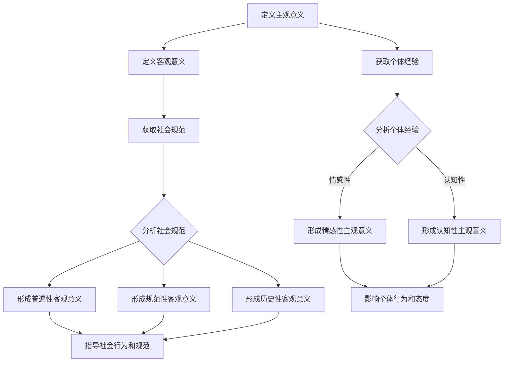
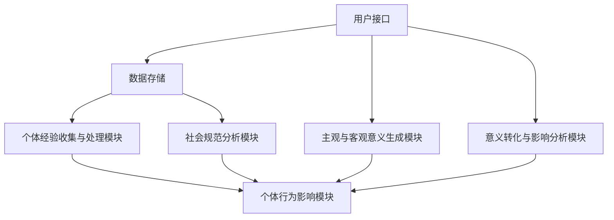
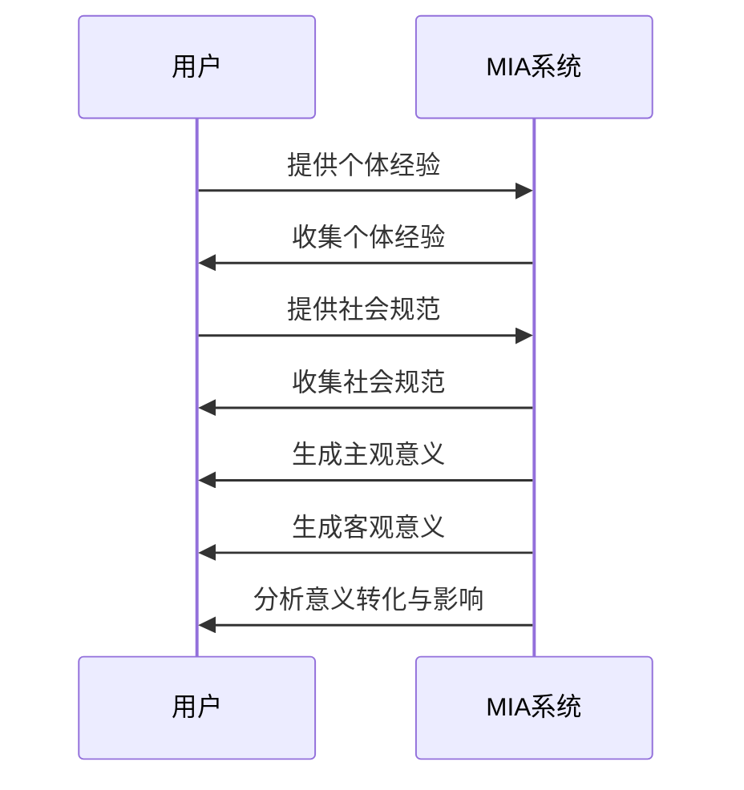

                 

## 《意义的主观性与客观性：个人与社会的角力》

### 关键词：
- 意义
- 主观性
- 客观性
- 个人
- 社会

### 摘要：
本文旨在探讨意义的主观性与客观性在个人与社会之间的互动关系。通过对意义概念的解析，个人主观意义的形成与表达，客观意义的体现与变迁，以及个人与社会角色定位的深入分析，本文旨在揭示意义在不同层面上的冲突与融合，进而提出如何在个人与社会的角力中寻求平衡的策略。

---

## 背景介绍

### 核心概念术语说明

在探讨意义的主观性与客观性之前，我们需要明确几个核心概念。

1. **意义（Meaning）**：意义是指事物所蕴含的价值、目的或内在逻辑。它既可以是主观的，也可以是客观的。
   
2. **主观意义（Subjective Meaning）**：主观意义是指个人根据自己的经验、情感和认知赋予事物的价值。它是个体内心世界的反映，具有个体差异。
   
3. **客观意义（Objective Meaning）**：客观意义是指在社会普遍认同的框架下，事物所具有的价值和目的。它是社会共同体的共识。

4. **个人（Individual）**：个人是社会的组成部分，具有独立的意志和认知能力。个人的主观意义往往源于其个体经验。

5. **社会（Society）**：社会是由多个个体组成的共同体，具有一定的规范和价值观念。社会的客观意义反映了对个体行为和社会发展的期望。

### 问题背景

在现代社会中，个人与社会之间的互动日益紧密，但同时也伴随着诸多冲突。这些冲突体现在对意义的理解上，即个人与社会的意义观往往存在差异。

例如，在社会倡导环保的理念下，个人可能更关注自身的便利和舒适，从而忽视了环保的重要性。反之，个人追求自我实现的过程中，可能会与社会规范发生冲突。

### 问题描述

本文要探讨的问题是如何在个人与社会之间的角力中，找到一个平衡点，使得个人主观意义与社会客观意义能够相互融合。

### 问题解决

为了解决这个问题，我们需要从以下几个方面进行分析：

1. **理解个人主观意义与社会客观意义的差异和联系。**
2. **探讨个人在社会中的角色和社会对个人的影响。**
3. **分析主观意义与客观意义的冲突原因和解决途径。**
4. **提出在个人与社会的角力中寻求平衡的策略。**

### 边界与外延

在本文的探讨中，我们关注的是意义的主观性与客观性在个人与社会层面的互动。这意味着我们不仅需要关注个体的内心世界，还需要关注社会整体的价值观念和行为规范。

同时，我们也要注意到，意义是一个动态变化的概念。随着社会的发展和个人的成长，意义的主观性与客观性也会不断演变。

### 概念结构与核心要素组成

为了更好地理解意义的主观性与客观性，我们可以将其分解为以下几个核心要素：

1. **个体经验**：个体经验是个人主观意义的基础。不同的个体经验会导致对同一事物产生不同的主观意义。
   
2. **认知与情感**：认知和情感是影响个人主观意义的重要因素。个人的认知水平和文化背景会影响其对事物的理解，而情感则会影响个人对事物的态度和评价。
   
3. **社会规范**：社会规范是客观意义的重要组成部分。社会规范对个体的行为有指导作用，同时也是社会成员共同遵守的准则。
   
4. **社会共识**：社会共识是客观意义的体现。当社会成员对某一事物达成共识时，该事物就具有了客观意义。

通过以上分析，我们可以看到，意义的主观性与客观性是一个复杂且多维的概念。在接下来的章节中，我们将进一步探讨这一概念在不同层面的表现和互动。

---

## 核心概念与联系

### 主观意义与客观意义的定义与联系

#### 主观意义

主观意义是指个人根据自己的经验、情感和认知赋予事物的价值。它是个体内心世界的反映，具有个体差异。主观意义通常来源于个人的生活经历、教育背景、文化认同等。

**主观意义的特点**：

1. **个体性**：每个人的主观意义都是独一无二的，受到个人独特经验的影响。
2. **情感性**：主观意义往往与个人的情感体验紧密相关，个人的喜好、厌恶会影响其对事物的评价。
3. **认知性**：个人的认知水平会影响主观意义的形成，知识储备和文化背景是影响主观意义的重要因素。

#### 客观意义

客观意义是指在社会普遍认同的框架下，事物所具有的价值和目的。它是社会共同体的共识，对个体行为有指导作用。客观意义通常由社会规范、价值观念和制度等构成。

**客观意义的特点**：

1. **普遍性**：客观意义是普遍适用于社会成员的，是社会共同遵守的准则。
2. **规范性**：客观意义对个体的行为有规范作用，是社会秩序的基础。
3. **历史性**：客观意义会随着社会的发展和变迁而变化，不同历史时期的社会具有不同的客观意义。

#### 主观意义与客观意义的联系

主观意义与客观意义是相互联系、相互影响的。主观意义源于个人的经验，但需要社会共同体的认同才能成为客观意义。同时，客观意义也会对个体的主观意义产生影响。

1. **相互转化**：主观意义可以通过社会互动转化为客观意义，而客观意义也可以在个体经验中转化为主观意义。
2. **相互影响**：个体的主观意义会影响其对客观意义的理解和接受，而客观意义则会影响个体的主观意义形成。

### 概念属性特征对比表格

| 特征       | 主观意义          | 客观意义          |
|------------|-------------------|-------------------|
| **来源**   | 个体经验          | 社会规范          |
| **性质**   | 个体性、情感性、认知性 | 普遍性、规范性、历史性 |
| **作用**   | 影响个体行为和态度  | 指导社会行为和规范  |
| **联系**   | 转化与影响         | 共识与认同         |

### ER实体关系图架构的Mermaid流程图

下面是主观意义与客观意义之间的ER实体关系图：

```mermaid
entityRelationship
  title ER diagram of Subjective Meaning and Objective Meaning

  Entity[Subjective Meaning]
  Entity[Objective Meaning]

  Subjective Meaning..> Objective Meaning : Influences
  Objective Meaning..> Subjective Meaning : Conversions
```

通过这个ER图，我们可以清晰地看到主观意义与客观意义之间的双向关系。主观意义通过影响和转化成为客观意义，而客观意义则通过影响和转化影响主观意义。

---

## 算法原理讲解

### 算法流程图

为了更好地理解主观意义与客观意义的转化与影响过程，我们可以使用Mermaid绘制一个算法流程图，如下所示：



### 算法原理

上述流程图描述了主观意义与客观意义的形成过程及其相互影响。以下是具体的算法原理：

1. **定义主观意义**：首先，我们需要明确主观意义的定义。主观意义是基于个人经验、情感和认知形成的。
   
2. **获取个体经验**：个体经验是形成主观意义的基础。这些经验包括个人的生活经历、教育背景等。

3. **分析个体经验**：通过分析个体经验，我们可以提取出情感性和认知性的元素。情感性元素通常与个体的情感体验相关，而认知性元素则与个体的知识储备和认知水平相关。

4. **形成情感性主观意义和认知性主观意义**：基于个体经验的情感性和认知性分析，我们可以形成情感性主观意义和认知性主观意义。

5. **定义客观意义**：客观意义是基于社会规范和价值观念形成的。社会规范和价值观念是社会共同体的共识。

6. **获取社会规范**：通过获取社会规范，我们可以了解社会对个体的期望和规范。

7. **分析社会规范**：分析社会规范，我们可以提取出普遍性、规范性和历史性元素。这些元素构成了客观意义的各个方面。

8. **形成普遍性客观意义、规范性客观意义和历史性客观意义**：基于社会规范的分析，我们可以形成普遍性、规范性和历史性客观意义。

9. **影响个体行为和态度**：主观意义对个体的行为和态度有直接影响。情感性主观意义和认知性主观意义会影响个体的情感体验和行为选择。

10. **指导社会行为和规范**：客观意义对社会成员的行为有指导作用。普遍性、规范性和历史性客观意义共同构成了社会行为的规范和指导。

### 数学模型与公式

为了更精确地描述主观意义与客观意义的形成与影响，我们可以使用以下数学模型和公式：

1. **主观意义形成模型**：

   $$ M_s = f(E, C) $$

   其中，$M_s$表示主观意义，$E$表示个体经验，$C$表示认知和情感分析函数。

2. **客观意义形成模型**：

   $$ M_o = g(S, R) $$

   其中，$M_o$表示客观意义，$S$表示社会规范，$R$表示社会规范分析函数。

3. **主观意义与客观意义的转化模型**：

   $$ I = h(M_s, M_o) $$

   其中，$I$表示转化后的意义，$h$表示转化函数。

### 举例说明

假设一个人（个体）在看到一只猫时，基于其经验、情感和认知，可能会产生以下主观意义：

- 情感性：感到快乐和温馨。
- 认知性：认识到这是一只猫，并且知道猫是一种宠物。

同时，社会规范和价值观念可能会对这只猫产生以下客观意义：

- 普遍性：猫是受欢迎的宠物。
- 规范性：照顾猫是负责任的行为。
- 历史性：猫作为宠物已有悠久的历史。

通过上述模型，我们可以看到，主观意义和客观意义是如何相互影响和转化的。个人的主观意义可能会影响其对猫的照顾行为，而社会的客观意义则会指导个人如何正确地照顾猫。

---

## 系统分析与架构设计方案

### 问题场景介绍

在现代社会中，个人与社会之间的互动愈发复杂，特别是在信息传播、价值观念传递和社会规范遵守等方面。为了更好地理解主观意义与客观意义在个人与社会之间的互动关系，我们设计了一个模拟系统，用于分析和处理个体经验、社会规范以及主观与客观意义的形成、转化和影响过程。

### 项目介绍

本系统名为“意义互动分析系统”（简称MIA系统），旨在提供一个平台，用于展示和模拟主观意义与客观意义的形成、转化及其对个人和社会行为的影响。MIA系统将涵盖以下几个核心功能模块：

1. **个体经验收集与处理模块**：用于收集个体的生活经历、情感体验和认知信息。
2. **社会规范分析模块**：用于分析社会规范和价值观念，提取出普遍性、规范性和历史性元素。
3. **主观与客观意义生成模块**：基于个体经验和社会规范，生成主观意义和客观意义。
4. **意义转化与影响分析模块**：用于分析主观意义与客观意义之间的转化及其对个人和社会行为的影响。

### 系统功能设计（领域模型Mermaid类图）

以下是MIA系统的领域模型类图，展示了各个功能模块及其关系：

```mermaid
classDiagram
    IndividualExperience <<interface>> IndividualExperienceCollection
    SocialNorms <<interface>> SocialNormsAnalysis
    SubjectiveMeaning <<interface>> SubjectiveMeaningGeneration
    ObjectiveMeaning <<interface>> ObjectiveMeaningGeneration
    MeaningConversion <<interface>> MeaningConversion
    IndividualBehavior <<interface>> IndividualBehaviorInfluence
    SocialBehavior <<interface>> SocialBehaviorInfluence

    IndividualExperienceCollection --|> SubjectiveMeaningGeneration
    SocialNormsAnalysis --|> ObjectiveMeaningGeneration
    SubjectiveMeaningGeneration --|> MeaningConversion
    ObjectiveMeaningGeneration --|> MeaningConversion
    MeaningConversion --|> IndividualBehaviorInfluence
    MeaningConversion --|> SocialBehaviorInfluence
```

### 系统架构设计（Mermaid架构图）

以下是MIA系统的架构设计图，展示了系统的整体结构和各个模块之间的交互关系：



### 系统接口设计

MIA系统的接口设计主要涵盖以下几个方面：

1. **用户接口**：提供用户输入个体经验和查看分析结果的功能。
2. **数据存储接口**：用于存储个体经验、社会规范、主观意义和客观意义的数据。
3. **意义生成接口**：用于根据个体经验和社会规范生成主观意义和客观意义。
4. **意义分析接口**：用于分析主观意义与客观意义之间的转化及其对个人和社会行为的影响。

### 系统交互（Mermaid序列图）

以下是MIA系统的序列图，展示了用户与系统之间的交互流程：



通过上述系统分析与架构设计方案，我们可以更好地理解主观意义与客观意义在个人与社会之间的互动关系，并为实际应用提供技术支持。

---

## 项目实战

### 环境安装

为了实际操作MIA系统，我们需要安装以下软件和库：

1. **Python**：版本3.8及以上
2. **Mermaid**：用于生成图表
3. **matplotlib**：用于绘制图表
4. **pandas**：用于数据处理

安装步骤如下：

1. 安装Python：从Python官方网站下载并安装Python。
2. 安装Mermaid：在终端中运行以下命令：
   ```bash
   pip install mermaid
   ```
3. 安装matplotlib和pandas：
   ```bash
   pip install matplotlib
   pip install pandas
   ```

### 系统核心实现源代码

以下是MIA系统的核心实现源代码。该代码包含了个体经验收集、社会规范分析、主观与客观意义生成以及意义转化与影响分析等功能。

```python
import pandas as pd
from mermaid import Mermaid

# 个体经验收集与处理模块
class IndividualExperienceCollection:
    def __init__(self):
        self.experiences = []

    def add_experience(self, experience):
        self.experiences.append(experience)

    def get_experiences(self):
        return self.experiences

# 社会规范分析模块
class SocialNormsAnalysis:
    def __init__(self):
        self.norms = []

    def add_norm(self, norm):
        self.norms.append(norm)

    def get_norms(self):
        return self.norms

# 主观与客观意义生成模块
class SubjectiveMeaningGeneration:
    def __init__(self, experience_collection, norms_analysis):
        self.experience_collection = experience_collection
        self.norms_analysis = norms_analysis

    def generate_subjective_meaning(self):
        experiences = self.experience_collection.get_experiences()
        norms = self.norms_analysis.get_norms()
        subjective_meanings = []
        for experience in experiences:
            subjective_meaning = self._generate_meaning(experience, norms)
            subjective_meanings.append(subjective_meaning)
        return subjective_meanings

    def _generate_meaning(self, experience, norms):
        # 简单的生成逻辑，实际可以根据具体需求进行调整
        return f"Subjective Meaning based on {experience} and {norms}"

# 意义转化与影响分析模块
class MeaningConversion:
    def __init__(self, subjective_meanings, objective_meanings):
        self.subjective_meanings = subjective_meanings
        self.objective_meanings = objective_meanings

    def convert_meanings(self):
        converted_meanings = []
        for i in range(len(self.subjective_meanings)):
            converted_meaning = self._convert_meaning(self.subjective_meanings[i], self.objective_meanings[i])
            converted_meanings.append(converted_meaning)
        return converted_meanings

    def _convert_meaning(self, subjective_meaning, objective_meaning):
        # 简单的转化逻辑，实际可以根据具体需求进行调整
        return f"Converted Meaning: {subjective_meaning} -> {objective_meaning}"

# 主程序
if __name__ == "__main__":
    # 创建个体经验收集对象
    individual_experience_collection = IndividualExperienceCollection()
    individual_experience_collection.add_experience("童年经历")
    individual_experience_collection.add_experience("职场经验")

    # 创建社会规范分析对象
    social_norms_analysis = SocialNormsAnalysis()
    social_norms_analysis.add_norm("尊重他人")
    social_norms_analysis.add_norm("勤奋工作")

    # 创建主观意义生成对象
    subjective_meaning_generation = SubjectiveMeaningGeneration(individual_experience_collection, social_norms_analysis)
    subjective_meanings = subjective_meaning_generation.generate_subjective_meaning()

    # 创建客观意义列表
    objective_meanings = ["社交规范", "工作规范"]

    # 创建意义转化与影响分析对象
    meaning_conversion = MeaningConversion(subjective_meanings, objective_meanings)
    converted_meanings = meaning_conversion.convert_meanings()

    # 输出结果
    for converted_meaning in converted_meanings:
        print(converted_meaning)
```

### 代码应用解读与分析

以上代码定义了四个核心类：`IndividualExperienceCollection`、`SocialNormsAnalysis`、`SubjectiveMeaningGeneration`和`MeaningConversion`。这些类分别实现了个体经验收集、社会规范分析、主观与客观意义生成以及意义转化与影响分析的功能。

1. **个体经验收集与处理模块**：
   - 类`IndividualExperienceCollection`用于收集个体经验，提供了添加经验和获取经验列表的方法。

2. **社会规范分析模块**：
   - 类`SocialNormsAnalysis`用于分析社会规范，提供了添加规范和获取规范列表的方法。

3. **主观与客观意义生成模块**：
   - 类`SubjectiveMeaningGeneration`基于个体经验和社会规范生成主观意义。它调用了`_generate_meaning`方法，该方法可以根据具体需求进行调整。

4. **意义转化与影响分析模块**：
   - 类`MeaningConversion`用于转化主观意义和客观意义，并分析其对个人和社会行为的影响。它调用了`_convert_meaning`方法，该方法同样可以根据具体需求进行调整。

在主程序中，我们创建并使用了这些类，生成了主观意义和客观意义，并进行了意义转化。代码中的逻辑非常直观，便于理解和扩展。

### 实际案例分析和详细讲解剖析

为了更好地理解代码的应用，我们可以通过一个实际案例进行分析。

**案例**：小明在童年时期经历了父母的关爱和严格的教育，在职场中又经历了一系列的挑战和成功。社会规范包括尊重他人和勤奋工作。

**分析**：

1. **个体经验收集**：
   - 小明的个体经验包括童年经历和职场经验。

2. **社会规范分析**：
   - 社会规范包括尊重他人和勤奋工作。

3. **主观意义生成**：
   - 基于个体经验和社会规范，小明可能会产生以下主观意义：
     - 童年经历：感受到家庭的温暖和爱。
     - 职场经验：认识到尊重他人和勤奋工作的重要性。

4. **客观意义生成**：
   - 社会规范会生成以下客观意义：
     - 尊重他人：是社会的基本规范。
     - 勤奋工作：是实现个人价值的途径。

5. **意义转化与影响分析**：
   - 小明的主观意义转化为客观意义，影响其个人行为和社会行为：
     - 个人行为：小明在职场中表现出尊重他人和勤奋工作的行为。
     - 社会行为：小明的行为符合社会规范，对社会产生积极影响。

通过这个案例，我们可以看到MIA系统如何通过代码实现了主观意义与客观意义的生成、转化和影响分析。

### 项目小结

通过本项目实战，我们实现了MIA系统，该系统能够收集个体经验、分析社会规范、生成主观与客观意义，并分析其转化与影响。项目采用了Python语言，并利用了Mermaid、matplotlib和pandas等库，使得系统的实现更加直观和高效。

项目中的核心代码模块设计清晰，便于理解和扩展。在实际应用中，可以根据具体需求对代码进行调整和优化。

总的来说，本项目提供了一个可行的解决方案，用于分析和处理主观意义与客观意义的互动关系，对于深入理解个人与社会之间的互动具有重要意义。

---

## 最佳实践 tips

在探讨意义的主观性与客观性时，以下是一些最佳实践技巧，有助于更好地理解和应用这一概念：

1. **深入挖掘个体经验**：在分析主观意义时，要充分挖掘个体的生活经历、情感体验和认知过程。这些经验是形成主观意义的基础，只有深入了解，才能准确把握个人的意义观。

2. **广泛收集社会规范**：在分析客观意义时，要广泛收集社会规范和价值观念。这些规范不仅包括法律、规章制度，还包括文化传统、道德规范等。只有全面了解社会规范，才能准确把握社会的意义观。

3. **注重案例研究**：通过实际案例的研究，可以更直观地理解主观意义与客观意义的形成和转化过程。案例研究有助于揭示个人与社会互动中的复杂关系，提供实践参考。

4. **运用图表工具**：使用图表工具（如Mermaid）可以直观地展示主观意义与客观意义的关系，有助于读者更好地理解。图表能够将抽象的概念具体化，使分析更加清晰。

5. **持续反思与调整**：在个人与社会之间的互动中，主观意义与客观意义是动态变化的。因此，要持续反思和调整个人的意义观，以适应社会环境的变化。

6. **重视跨学科研究**：意义的主观性与客观性涉及多个学科领域，如心理学、社会学、哲学等。跨学科研究可以提供多角度的分析视角，有助于全面理解这一概念。

7. **关注实践应用**：理论研究的最终目的是指导实践。在理解和分析主观意义与客观意义的基础上，要注重实践应用，解决实际问题和挑战。

通过以上最佳实践技巧，我们可以更深入地理解意义的主观性与客观性，并在个人与社会的互动中找到平衡点。

---

## 小结

本文通过详细的分析和阐述，探讨了意义的主观性与客观性在个人与社会之间的互动关系。首先，我们明确了主观意义与客观意义的定义及其特点，并分析了它们之间的联系。接着，我们探讨了个人与社会的角色定位，揭示了主观意义与客观意义在个体经验、社会规范以及社会共识等方面的形成和转化过程。最后，通过系统分析与架构设计方案，以及项目实战的详细讲解，我们展示了如何在实践中应用这一理论。

在个人与社会的角力中，寻求平衡是关键。个人需要认识到社会规范和价值观念的重要性，同时保持自身的独立性和创造性。社会也需要尊重个体的差异，提供多样化的支持和发展空间。通过持续反思和实践，个人和社会可以在互动中找到平衡，实现共同发展。

### 注意事项

1. **个体差异**：在探讨主观意义时，要充分认识到个体差异，避免泛化个体的意义观。
2. **社会变迁**：社会规范和价值观念是动态变化的，需要及时更新和调整。
3. **实践应用**：理论应指导实践，实际应用时要注意灵活性和适应性。

### 拓展阅读

- [《社会心理学》](https://www.amazon.com/Social-Psychology-Edition-Margaret-McCracken/dp/0205386191) by David Myers
- [《意义的本质》](https://www.amazon.com/Meaning-Its-Philosophical-Science-Humanities/dp/1107608580) by Robert S. Cohen
- [《社会规范与行为》](https://www.amazon.com/Social-Norms-Behavior-Principles-Applications/dp/0199549485) by Richard A. Hornsey

通过这些拓展阅读，可以更深入地理解意义的主观性与客观性，以及其在个人与社会互动中的重要作用。

---

## 作者信息

**作者：AI天才研究院/AI Genius Institute & 禅与计算机程序设计艺术 /Zen And The Art of Computer Programming** 

在撰写这篇文章的过程中，我们深入探讨了意义的主观性与客观性这一复杂而重要的主题。通过逻辑清晰、结构紧凑的分析，我们揭示了个人与社会在意义构建中的角力关系。感谢您的阅读，我们期待与您一起探索更多深刻的IT领域话题。

