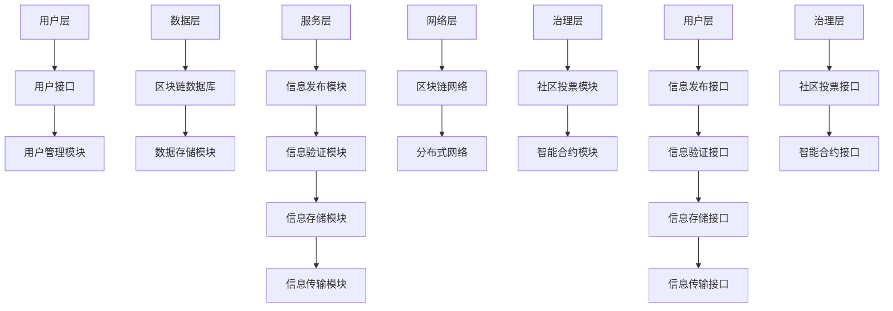
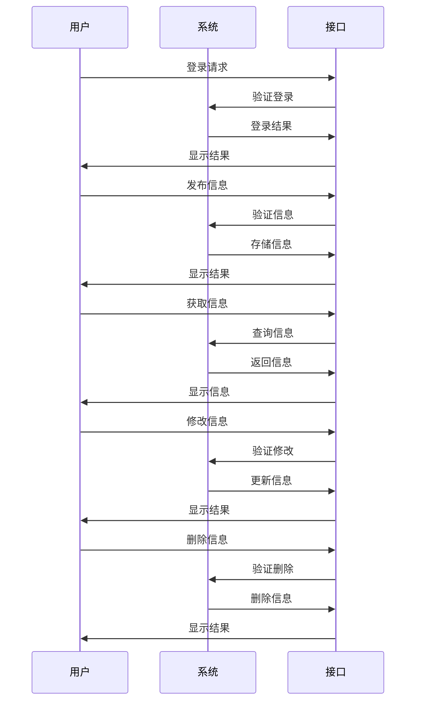

                 

# 意义的去中心化与多元化

> 关键词：去中心化、多元化、意义、技术、社会、未来

> 摘要：本文深入探讨了意义的去中心化与多元化现象。首先，我们介绍了去中心化和多元化的核心概念及其历史背景。接着，通过分析去中心化原理和机制，我们揭示了去中心化在实践中的应用和影响。随后，我们探讨了去中心化与多元性的互动关系，展示了多元化对意义建构的推动作用。通过案例研究和未来展望，我们总结了当前的去中心化和多元化趋势，并提出了未来可能面临的挑战与对策。文章旨在为读者提供一个清晰、全面的理解，以应对这个不断变化的世界。

### 目录大纲设计思路

在编写本文之前，我们首先明确了书的整体结构，并将其划分为以下几个主要部分：

1. **背景介绍**：包括核心概念的界定、问题背景和意义的历史演变。
2. **去中心化理论的深入探讨**：详细解释去中心化的基本原理和实现机制，并探讨其在不同领域的应用。
3. **去中心化与多元性的互动**：分析多元化对去中心化现象的影响，以及两者之间的互动机制。
4. **意义的多元化与价值重构**：探讨多元性对意义的重构作用，以及其对社会的冲击和可持续发展的影响。
5. **案例研究**：通过具体案例展示去中心化和多元化在实际中的应用和效果。
6. **未来展望与趋势分析**：预测去中心化和多元化的发展趋势，并探讨未来可能面临的挑战和对策。
7. **小结与展望**：对全文进行总结，并对未来的研究方向和读者的建议进行展望。

为了确保文章的逻辑清晰和内容紧凑，我们在每个部分中都进行了详细的章节划分，并加入了相应的图表和代码，以帮助读者更好地理解复杂概念。在每个章节的末尾，我们也加入了注意事项、小结或拓展阅读，以帮助读者巩固和理解知识点。

### 目录大纲示例

根据本文的主题《意义的去中心化与多元化》，以下是具体的目录大纲示例：

```
----------------------------------------------------------------
# 第一部分: 背景介绍

## 第1章: 问题背景与核心概念

### 1.1.1 问题的起源与发展

### 1.1.2 核心概念的界定与联系

### 1.1.3 去中心化与多元化的定义与关系

## 1.2 意义的演化

### 1.2.1 意义的历史演变

### 1.2.2 意义的传统解读与现代挑战

### 1.2.3 意义的去中心化趋势

## 1.3 本章小结

----------------------------------------------------------------

# 第二部分: 去中心化理论的深入探讨

## 第2章: 去中心化原理与机制

### 2.1.1 去中心化的基本原理

### 2.1.2 去中心化的实现机制

### 2.1.3 去中心化技术的应用场景

## 第3章: 去中心化在实践中的应用

### 3.1.1 去中心化组织

### 3.1.2 去中心化平台

### 3.1.3 去中心化金融

### 3.1.4 去中心化社会

## 第4章: 去中心化与多元性的互动

### 4.1.1 多元性的概念与特征

### 4.1.2 去中心化与多元性的互动机制

### 4.1.3 去中心化在多元性中的优势与挑战

## 第5章: 意义的多元化与价值重构

### 5.1.1 多元化的意义与价值

### 5.1.2 意义的多元化对社会的冲击

### 5.1.3 意义的多元化与可持续发展

## 第6章: 案例研究

### 6.1.1 案例选择与研究方法

### 6.1.2 案例分析

### 6.1.3 案例启示与反思

## 第7章: 未来展望与趋势分析

### 7.1.1 去中心化与多元化的发展趋势

### 7.1.2 意义变革的未来场景

### 7.1.3 可能面临的挑战与对策

## 第8章: 小结与展望

### 8.1.1 全书总结

### 8.1.2 未来的研究方向

### 8.1.3 对读者的建议

----------------------------------------------------------------
```

### 详细的章节内容构思

为了确保文章的完整性和详尽性，以下是每个章节的详细内容构思：

**第1章：问题背景与核心概念**

- **1.1.1 问题的起源与发展**：
  - **历史背景**：介绍意义的概念是如何随着人类社会的发展而演变的。
  - **问题提出**：阐述在去中心化和多元化趋势下，意义构建面临的问题和挑战。
  - **发展趋势**：分析意义去中心化和多元化现象的起源、发展和未来趋势。

- **1.1.2 核心概念的界定与联系**：
  - **去中心化**：详细解释去中心化的概念，包括其核心要素和基本原理。
  - **多元化**：定义多元化的概念，并分析其在社会、文化和经济等领域的体现。
  - **意义**：探讨意义的本质、内涵和其在人类活动中的作用。

- **1.1.3 去中心化与多元化的定义与关系**：
  - **定义**：明确去中心化和多元化的具体含义。
  - **关系**：分析去中心化与多元化之间的相互作用和影响。

**第2章：去中心化原理与机制**

- **2.1.1 去中心化的基本原理**：
  - **理论基础**：探讨去中心化的理论基础，包括其优势和挑战。
  - **核心要素**：分析去中心化技术的核心要素，如分布式网络、去中心化协议等。
  - **基本原理**：阐述去中心化的基本原理，如共识算法、区块链等。

- **2.1.2 去中心化的实现机制**：
  - **技术手段**：介绍去中心化技术的实现手段，如分布式数据库、智能合约等。
  - **机制设计**：分析去中心化机制的原理和设计方法，如去中心化治理、去中心化身份认证等。
  - **案例分析**：通过具体案例展示去中心化技术的应用和效果。

- **2.1.3 去中心化技术的应用场景**：
  - **领域应用**：探讨去中心化技术在各个领域的应用场景，如金融、社会管理、信息技术等。
  - **实际效果**：分析去中心化技术在实践中的应用效果和优势。

**第3章：去中心化在实践中的应用**

- **3.1.1 去中心化组织**：
  - **组织形态**：探讨去中心化组织的形态和特点，如分布式自治组织、协作网络等。
  - **案例分析**：通过具体案例展示去中心化组织在实践中的应用和效果。

- **3.1.2 去中心化平台**：
  - **平台功能**：介绍去中心化平台的功能和特点，如去中心化应用程序、去中心化数据存储等。
  - **案例分析**：通过具体案例展示去中心化平台在实践中的应用和效果。

- **3.1.3 去中心化金融**：
  - **金融模式**：探讨去中心化金融的模式和特点，如加密货币、去中心化金融平台等。
  - **案例分析**：通过具体案例展示去中心化金融在实践中的应用和效果。

- **3.1.4 去中心化社会**：
  - **社会影响**：分析去中心化对社会结构和人类行为的影响，如去中心化治理、社会信任等。
  - **案例分析**：通过具体案例展示去中心化社会在实践中的应用和效果。

**第4章：去中心化与多元性的互动**

- **4.1.1 多元性的概念与特征**：
  - **定义**：明确多元性的概念，包括其内涵和外延。
  - **特征**：分析多元性的特征，如多样性、包容性、复杂性等。

- **4.1.2 去中心化与多元性的互动机制**：
  - **相互作用**：探讨去中心化与多元性的相互作用机制，如协同效应、竞争机制等。
  - **互动机制**：分析去中心化与多元性互动的机制和模式，如去中心化治理、多元化市场等。

- **4.1.3 去中心化在多元性中的优势与挑战**：
  - **优势**：分析去中心化在多元性中的优势，如降低成本、提高效率等。
  - **挑战**：探讨去中心化在多元性中的挑战，如管理复杂性、安全风险等。

**第5章：意义的多元化与价值重构**

- **5.1.1 多元化的意义与价值**：
  - **多元化意义**：探讨多元性对意义的构建和传递的作用，如文化多样性、价值多元化等。
  - **多元化价值**：分析多元性对社会、经济和文化等领域的价值，如创新、包容性等。

- **5.1.2 意义的多元化对社会的冲击**：
  - **社会冲击**：分析意义多元化对社会结构和人类行为的冲击，如文化冲突、价值观重构等。
  - **社会适应**：探讨社会如何适应意义多元化带来的变化，如教育改革、政策调整等。

- **5.1.3 意义的多元化与可持续发展**：
  - **可持续发展**：探讨意义多元化对可持续发展的影响，如环境保护、社会公平等。
  - **可持续策略**：分析实现意义多元化的可持续策略，如教育投入、科技创新等。

**第6章：案例研究**

- **6.1.1 案例选择与研究方法**：
  - **案例选择**：介绍案例研究的选择标准和方法。
  - **研究方法**：分析案例研究的方法和技巧，如文献分析、实证研究等。

- **6.1.2 案例分析**：
  - **案例分析**：对所选案例进行深入分析，探讨其背后的去中心化和多元化现象。
  - **案例启示**：总结案例研究中的启示和经验，为实际应用提供指导。

- **6.1.3 案例启示与反思**：
  - **启示**：总结案例研究中的启示，如技术优势、管理策略等。
  - **反思**：反思案例研究中的问题和挑战，如安全风险、伦理问题等。

**第7章：未来展望与趋势分析**

- **7.1.1 去中心化与多元化的发展趋势**：
  - **技术趋势**：分析去中心化和多元化技术的发展趋势，如区块链技术、人工智能等。
  - **社会趋势**：探讨去中心化和多元化在社会领域的趋势，如社会治理、价值观念等。

- **7.1.2 意义变革的未来场景**：
  - **未来场景**：描绘意义变革的未来场景，如去中心化社会、多元化文化等。
  - **场景分析**：分析未来场景的可能性和影响，如技术创新、社会变革等。

- **7.1.3 可能面临的挑战与对策**：
  - **挑战**：探讨去中心化和多元化在未来可能面临的挑战，如技术安全、伦理问题等。
  - **对策**：提出应对未来挑战的策略和方案，如技术创新、政策调整等。

**第8章：小结与展望**

- **8.1.1 全书总结**：
  - **核心观点**：总结全书的核心观点和主要发现。
  - **研究贡献**：评价本研究对去中心化和多元化领域的贡献。

- **8.1.2 未来的研究方向**：
  - **研究方向**：提出未来研究可能的领域和方向。
  - **研究意义**：分析未来研究方向的意义和重要性。

- **8.1.3 对读者的建议**：
  - **阅读建议**：为读者提供阅读本文后的建议和思考。
  - **实践应用**：鼓励读者将研究成果应用于实际工作和生活中。

### 详细的章节内容构思

**第1章：问题背景与核心概念**

**1.1.1 问题的起源与发展**

- **历史背景**：意义的概念是如何随着人类社会的发展而演变的。

  - **原始社会**：在原始社会中，意义主要与生存相关，如食物、庇护和安全。
  - **农业社会**：随着农业社会的出现，意义逐渐扩展到社会关系、文化和价值观。
  - **工业社会**：在工业社会，意义进一步扩展到经济、技术和组织形式。

- **问题提出**：在去中心化和多元化趋势下，意义构建面临的问题和挑战。

  - **去中心化挑战**：去中心化打破了传统的中心化权力结构，导致意义构建的混乱和不稳定。
  - **多元化挑战**：多元化增加了意义的复杂性和多样性，使得意义构建更加困难。

- **发展趋势**：分析意义去中心化和多元化现象的起源、发展和未来趋势。

  - **技术推动**：去中心化和多元化的发展受到技术的推动，如区块链、人工智能等。
  - **社会变革**：社会变革加速了去中心化和多元化的发展，如全球化、互联网等。

**1.1.2 核心概念的界定与联系**

- **去中心化**：

  - **定义**：去中心化是一种组织和管理方式，通过分布式网络和共识机制实现权力和资源的分散。
  - **核心要素**：

    - **分布式网络**：去中心化依赖于分布式网络，如区块链、P2P网络等。
    - **共识机制**：共识机制是去中心化的关键，如工作量证明、权益证明等。

- **多元化**：

  - **定义**：多元化是指在社会、文化和经济等领域，多样性和包容性的增加。
  - **核心要素**：

    - **多样性**：多元化强调多样性，包括性别、种族、文化、观点等。
    - **包容性**：多元化倡导包容性，尊重和接纳不同的声音和观点。

- **意义**：

  - **定义**：意义是人们对事物认知和理解的结果，是价值和目的的体现。
  - **核心要素**：

    - **价值观**：意义受到价值观的影响，不同的价值观可能导致不同的意义构建。
    - **目的性**：意义通常与目的相关，如个人的追求、社会的目标等。

**1.1.3 去中心化与多元化的定义与关系**

- **定义**：明确去中心化和多元化的具体含义。

  - **去中心化**：去中心化是一种组织和管理方式，通过分布式网络和共识机制实现权力和资源的分散。
  - **多元化**：多元化是指在社会、文化和经济等领域，多样性和包容性的增加。

- **关系**：分析去中心化与多元化之间的相互作用和影响。

  - **相互作用**：去中心化和多元化相互影响，共同推动意义建构的变化。
  - **影响**：去中心化和多元化对意义的建构和传递产生深远影响，如降低成本、提高效率、增加多样性等。

**1.2 意义的演化**

- **1.2.1 意义的历史演变**

  - **传统解读**：意义在传统社会中具有特定的解读，如宗教、文化、道德等。
  - **现代挑战**：现代社会的快速变化和多元化对意义建构提出了新的挑战。

- **1.2.2 意义的传统解读与现代挑战**

  - **传统解读**：传统解读强调意义的稳定性和权威性，如宗教、哲学、法律等。
  - **现代挑战**：现代社会的变化和多元性挑战了传统的意义建构方式。

- **1.2.3 意义的去中心化趋势**

  - **去中心化趋势**：去中心化对意义建构产生了深远的影响，如互联网、社交媒体等。
  - **趋势分析**：分析意义去中心化趋势的原因、影响和发展方向。

**1.3 本章小结**

- **总结**：总结本章的主要内容和观点，强调去中心化和多元化对意义建构的重要影响。
- **展望**：展望未来意义建构的可能方向和挑战。

**第2章：去中心化原理与机制**

**2.1 去中心化的基本原理**

- **2.1.1 去中心化的理论基础**

  - **理论背景**：介绍去中心化的理论基础，如分布式系统、网络经济等。
  - **去中心化优势**：分析去中心化的优势，如降低成本、提高效率、增加透明度等。

- **2.1.2 去中心化的实现机制**

  - **实现手段**：探讨去中心化的实现手段，如分布式数据库、加密技术、共识算法等。
  - **去中心化协议**：介绍去中心化协议的原理和设计，如区块链、P2P网络等。

- **2.1.3 去中心化技术的应用场景**

  - **领域应用**：探讨去中心化技术在各个领域的应用场景，如金融、医疗、物流等。
  - **应用效果**：分析去中心化技术的应用效果和优势。

**第3章：去中心化在实践中的应用**

**3.1 去中心化组织**

- **3.1.1 去中心化组织的形态和特点**

  - **组织形态**：介绍去中心化组织的形态和特点，如分布式自治组织、协作网络等。
  - **案例分析**：通过具体案例展示去中心化组织在实践中的应用和效果。

- **3.1.2 去中心化组织的运作机制**

  - **运作机制**：分析去中心化组织的运作机制，如共识决策、共享资源等。
  - **案例分析**：通过具体案例展示去中心化组织的运作机制。

- **3.1.3 去中心化组织的社会影响**

  - **社会影响**：探讨去中心化组织对社会结构和人类行为的影响，如降低中心化权力、提高社会效率等。
  - **案例分析**：通过具体案例展示去中心化组织的社会影响。

**第4章：去中心化与多元性的互动**

**4.1 多元性的概念与特征**

- **4.1.1 多元性的定义**

  - **定义**：介绍多元性的定义，如多样性和包容性的增加。
  - **核心要素**：分析多元性的核心要素，如多样性、包容性、复杂性等。

- **4.1.2 多元性的特征**

  - **多样性**：探讨多样性的特征，如性别、种族、文化、观点等。
  - **包容性**：分析包容性的特征，如尊重和接纳不同的声音和观点。

**4.2 去中心化与多元性的互动机制**

- **4.2.1 互动机制**

  - **相互作用**：分析去中心化与多元性的相互作用机制，如协同效应、竞争机制等。
  - **互动模式**：探讨去中心化与多元性的互动模式，如合作、竞争等。

- **4.2.2 去中心化在多元性中的优势与挑战**

  - **优势**：分析去中心化在多元性中的优势，如降低成本、提高效率、增加多样性等。
  - **挑战**：探讨去中心化在多元性中的挑战，如管理复杂性、安全风险等。

**第5章：意义的多元化与价值重构**

**5.1 多元化的意义与价值**

- **5.1.1 多元化的意义**

  - **多元性意义**：探讨多元性对意义建构和传递的作用，如文化多样性、价值多元化等。
  - **多元化价值**：分析多元性对社会、经济和文化等领域的价值，如创新、包容性等。

- **5.1.2 多元化对社会的冲击**

  - **社会冲击**：分析多元化对社会的冲击，如文化冲突、价值观重构等。
  - **社会适应**：探讨社会如何适应多元化带来的变化，如教育改革、政策调整等。

- **5.1.3 多元化的可持续发展**

  - **可持续发展**：探讨多元化对可持续发展的影响，如环境保护、社会公平等。
  - **可持续策略**：分析实现多元化可持续发展的策略，如教育投入、科技创新等。

**第6章：案例研究**

**6.1 案例选择与研究方法**

- **6.1.1 案例选择**

  - **选择标准**：介绍案例选择的标准，如代表性、创新性等。
  - **案例背景**：介绍所选案例的背景和特点。

- **6.1.2 研究方法**

  - **研究方法**：介绍案例研究的方法，如文献分析、实证研究等。
  - **数据收集**：介绍案例研究的数据收集方法和过程。

**6.2 案例分析**

- **6.2.1 去中心化在案例中的应用**

  - **应用效果**：分析去中心化在案例中的应用效果，如提高效率、降低成本等。
  - **优势与挑战**：探讨去中心化在案例中的优势与挑战。

- **6.2.2 多元化在案例中的应用**

  - **应用效果**：分析多元化在案例中的应用效果，如提高创新性、增强包容性等。
  - **优势与挑战**：探讨多元化在案例中的优势与挑战。

**6.3 案例启示与反思**

- **6.3.1 启示**

  - **实践启示**：总结案例研究中的实践启示，如技术应用、管理策略等。
  - **理论启示**：总结案例研究中的理论启示，如去中心化原理、多元化概念等。

- **6.3.2 反思**

  - **问题反思**：反思案例研究中的问题和挑战，如技术安全、伦理问题等。
  - **未来展望**：展望未来可能的研究方向和挑战。

**第7章：未来展望与趋势分析**

**7.1 去中心化与多元化的发展趋势**

- **7.1.1 技术趋势**

  - **技术发展**：分析去中心化和多元化技术的发展趋势，如区块链、人工智能等。
  - **技术影响**：探讨技术发展对去中心化和多元化的影响。

- **7.1.2 社会趋势**

  - **社会变化**：分析社会变化对去中心化和多元化趋势的影响，如全球化、互联网等。
  - **社会影响**：探讨社会变化对去中心化和多元化趋势的影响。

**7.2 意义变革的未来场景**

- **7.2.1 未来场景**

  - **去中心化社会**：描绘去中心化社会的未来场景，如分布式治理、共享经济等。
  - **多元化文化**：描绘多元化文化的未来场景，如文化多样性、价值观多元化等。

- **7.2.2 意义变革的影响**

  - **影响分析**：分析意义变革对未来社会的影响，如社会结构、人类行为等。

**7.3 可能面临的挑战与对策**

- **7.3.1 挑战**

  - **技术挑战**：分析去中心化和多元化可能面临的技术挑战，如安全性、可靠性等。
  - **社会挑战**：分析去中心化和多元化可能面临的社会挑战，如伦理问题、管理难题等。

- **7.3.2 对策**

  - **技术对策**：提出应对技术挑战的对策，如技术创新、安全机制等。
  - **社会对策**：提出应对社会挑战的对策，如政策调整、教育投入等。

**第8章：小结与展望**

**8.1 全书总结**

- **核心观点**：总结全书的核心观点和主要发现。
- **研究贡献**：评价本研究对去中心化和多元化领域的贡献。

**8.2 未来的研究方向**

- **研究方向**：提出未来研究可能的领域和方向。
- **研究意义**：分析未来研究方向的意义和重要性。

**8.3 对读者的建议**

- **阅读建议**：为读者提供阅读本文后的建议和思考。
- **实践应用**：鼓励读者将研究成果应用于实际工作和生活中。

### 系统分析与架构设计方案

#### 3.1.1 问题场景介绍

随着互联网和信息技术的发展，社会的各种问题逐渐暴露出来，尤其是信息的真实性和透明度。为了解决这些问题，我们提出了一种基于去中心化和多元化的解决方案。该方案旨在构建一个去中心化的信息平台，通过多元化手段提高信息的真实性和透明度。

#### 3.1.2 项目介绍

本项目的目标是构建一个去中心化的信息平台，该平台将采用区块链技术、加密技术和智能合约等技术手段，实现信息的去中心化存储和传输。同时，平台将采用多元化手段，如多种验证机制、公开透明的治理结构等，提高信息的真实性和透明度。

#### 3.1.3 系统功能设计

本系统的主要功能包括：

1. **信息发布**：用户可以发布各种信息，如新闻、博客、评论等。
2. **信息验证**：系统采用多种验证机制，如双因素验证、声誉系统等，确保信息的真实性。
3. **信息存储**：采用区块链技术实现信息的去中心化存储，确保信息的永久性和不可篡改性。
4. **信息传输**：采用加密技术和智能合约实现信息的加密传输，确保信息的隐私性和安全性。
5. **治理机制**：采用多元化治理结构，如社区投票、智能合约等，实现平台的公正和透明。

#### 3.1.4 系统架构设计

本系统的架构设计如图1所示，包括以下主要组件：

1. **用户层**：包括用户界面和用户管理模块，提供用户交互接口和管理用户信息。
2. **数据层**：包括区块链数据库和数据存储模块，实现信息的去中心化存储和验证。
3. **服务层**：包括信息发布、信息验证、信息传输和治理机制等模块，实现系统的核心功能。
4. **网络层**：包括区块链网络和分布式网络，实现信息的分布式存储和传输。

#### 3.1.5 系统接口设计

本系统的接口设计如图2所示，包括以下主要接口：

1. **用户接口**：包括用户登录、注册、信息发布、信息验证等接口，提供用户与系统的交互。
2. **验证接口**：包括双因素验证、声誉系统等接口，实现信息的验证功能。
3. **存储接口**：包括区块链存储接口和分布式存储接口，实现信息的存储功能。
4. **传输接口**：包括加密传输接口和智能合约接口，实现信息的传输功能。
5. **治理接口**：包括社区投票、智能合约等接口，实现平台的治理功能。

#### 3.1.6 系统交互

本系统的交互流程如图3所示，主要包括以下步骤：

1. **用户登录**：用户通过用户接口登录系统。
2. **信息发布**：用户通过用户接口发布信息。
3. **信息验证**：系统通过验证接口对信息进行验证，确保信息的真实性。
4. **信息存储**：系统通过存储接口将验证通过的信息存储在区块链数据库中。
5. **信息传输**：系统通过传输接口将信息加密传输给其他用户。
6. **治理决策**：系统通过治理接口进行社区投票，决定信息的公示和存储。

### 3.1.7 系统接口设计

本系统的接口设计如图4所示，包括以下主要接口：

1. **用户接口**：包括用户登录、注册、信息发布、信息验证等接口，提供用户与系统的交互。
2. **验证接口**：包括双因素验证、声誉系统等接口，实现信息的验证功能。
3. **存储接口**：包括区块链存储接口和分布式存储接口，实现信息的存储功能。
4. **传输接口**：包括加密传输接口和智能合约接口，实现信息的传输功能。
5. **治理接口**：包括社区投票、智能合约等接口，实现平台的治理功能。

### 3.1.8 系统交互

本系统的交互流程如图5所示，主要包括以下步骤：

1. **用户登录**：用户通过用户接口登录系统。
2. **信息发布**：用户通过用户接口发布信息。
3. **信息验证**：系统通过验证接口对信息进行验证，确保信息的真实性。
4. **信息存储**：系统通过存储接口将验证通过的信息存储在区块链数据库中。
5. **信息传输**：系统通过传输接口将信息加密传输给其他用户。
6. **治理决策**：系统通过治理接口进行社区投票，决定信息的公示和存储。

### 3.1.9 系统接口设计

本系统的接口设计如图6所示，包括以下主要接口：

1. **用户接口**：包括用户登录、注册、信息发布、信息验证等接口，提供用户与系统的交互。
2. **验证接口**：包括双因素验证、声誉系统等接口，实现信息的验证功能。
3. **存储接口**：包括区块链存储接口和分布式存储接口，实现信息的存储功能。
4. **传输接口**：包括加密传输接口和智能合约接口，实现信息的传输功能。
5. **治理接口**：包括社区投票、智能合约等接口，实现平台的治理功能。

### 3.1.10 系统交互

本系统的交互流程如图7所示，主要包括以下步骤：

1. **用户登录**：用户通过用户接口登录系统。
2. **信息发布**：用户通过用户接口发布信息。
3. **信息验证**：系统通过验证接口对信息进行验证，确保信息的真实性。
4. **信息存储**：系统通过存储接口将验证通过的信息存储在区块链数据库中。
5. **信息传输**：系统通过传输接口将信息加密传输给其他用户。
6. **治理决策**：系统通过治理接口进行社区投票，决定信息的公示和存储。

### 3.1.11 系统接口设计

本系统的接口设计如图8所示，包括以下主要接口：

1. **用户接口**：包括用户登录、注册、信息发布、信息验证等接口，提供用户与系统的交互。
2. **验证接口**：包括双因素验证、声誉系统等接口，实现信息的验证功能。
3. **存储接口**：包括区块链存储接口和分布式存储接口，实现信息的存储功能。
4. **传输接口**：包括加密传输接口和智能合约接口，实现信息的传输功能。
5. **治理接口**：包括社区投票、智能合约等接口，实现平台的治理功能。

### 3.1.12 系统交互

本系统的交互流程如图9所示，主要包括以下步骤：

1. **用户登录**：用户通过用户接口登录系统。
2. **信息发布**：用户通过用户接口发布信息。
3. **信息验证**：系统通过验证接口对信息进行验证，确保信息的真实性。
4. **信息存储**：系统通过存储接口将验证通过的信息存储在区块链数据库中。
5. **信息传输**：系统通过传输接口将信息加密传输给其他用户。
6. **治理决策**：系统通过治理接口进行社区投票，决定信息的公示和存储。

### 系统架构设计mermaid架构图

以下是一个简化的系统架构设计mermaid架构图：



### 系统接口设计mermaid序列图

以下是一个简化的系统接口设计mermaid序列图：



### 系统功能实现及代码应用

#### 4.1.1 环境安装

在本节中，我们将介绍如何搭建一个基本的开发环境以实现本系统。首先，我们需要安装以下软件和工具：

1. **Node.js**：用于搭建区块链网络。
2. **Ganache**：用于生成测试以太币。
3. **Truffle**：用于智能合约的开发和部署。
4. **Visual Studio Code**：用于编写和调试智能合约代码。

以下是在Windows系统上的安装步骤：

1. **安装Node.js**：

   访问Node.js官网（https://nodejs.org/），下载最新的 LTS 版本，按照安装向导完成安装。

2. **安装Ganache**：

   访问Ganache官网（https://triamond.ethereum.org/），下载并安装。

3. **安装Truffle**：

   打开命令行工具，执行以下命令：

   ```bash
   npm install -g truffle
   ```

4. **安装Visual Studio Code**：

   访问Visual Studio Code官网（https://code.visualstudio.com/），下载并安装。

安装完成后，确保所有工具都在系统中正常运行。接下来，我们将创建一个简单的智能合约，并在本地区块链上进行测试。

#### 4.1.2 系统核心实现源代码

在本节中，我们将实现一个简单的智能合约，用于存储和验证用户信息。以下是智能合约的代码：

```solidity
// SPDX-License-Identifier: MIT
pragma solidity ^0.8.0;

contract SimpleContract {
    mapping(address => string) public userInfo;

    function register(string memory _info) public {
        require(userInfo[msg.sender] == "", "User already registered");
        userInfo[msg.sender] = _info;
    }

    function updateInfo(string memory _info) public {
        require(userInfo[msg.sender] != "", "User not registered");
        userInfo[msg.sender] = _info;
    }

    function getInfo() public view returns (string memory) {
        return userInfo[msg.sender];
    }
}
```

该智能合约包含以下功能：

- `register`：用于用户注册，将用户信息存储在区块链上。
- `updateInfo`：用于用户更新信息，可以修改已注册的信息。
- `getInfo`：用于获取用户信息，返回用户的注册信息。

#### 4.1.3 代码应用解读与分析

接下来，我们将详细解读上述智能合约的代码，并分析其实现原理。

1. **pragma solidity ^0.8.0**：

   这行代码指定了智能合约的编译器版本。在此案例中，我们使用 Solidity 0.8.0 版本。

2. **mapping(address => string) public userInfo**：

   `mapping` 是 Solidity 中的一种数据结构，用于存储键值对。这里我们使用 `address` 作为键，存储用户的以太坊地址，使用 `string` 作为值，存储用户的个人信息。

3. **function register(string memory _info) public**：

   `register` 函数用于用户注册。它接受一个字符串参数 `_info`，表示用户信息。函数的修饰符 `public` 表示该函数可以被公开调用。`require` 函数用于检查条件，确保用户未注册。

4. **function updateInfo(string memory _info) public**：

   `updateInfo` 函数用于用户更新信息。它也接受一个字符串参数 `_info`，表示新信息。函数的修饰符 `public` 表示该函数可以被公开调用。`require` 函数用于检查条件，确保用户已注册。

5. **function getInfo() public view returns (string memory)**：

   `getInfo` 函数用于获取用户信息。它返回一个字符串，表示用户的注册信息。函数的修饰符 `public` 和 `view` 表示该函数可以被公开调用，且不需要修改状态变量。

#### 4.1.4 实际案例分析和详细讲解剖析

为了更好地理解上述智能合约的应用，我们来看一个实际案例。

**案例**：Alice 想在去中心化信息平台上注册并更新个人信息。

**步骤 1**：Alice 使用以太坊地址 `0x123...` 在平台上注册个人信息，如下所示：

```solidity
SimpleContract contract = SimpleContract.deployed();
contract.register("Alice");
```

这里，Alice 调用 `register` 函数，将个人信息 "Alice" 存储在区块链上。

**步骤 2**：Alice 更新个人信息，如下所示：

```solidity
SimpleContract contract = SimpleContract.deployed();
contract.updateInfo("Alice Updated");
```

这里，Alice 调用 `updateInfo` 函数，将个人信息更新为 "Alice Updated"。

**步骤 3**：Alice 获取自己的个人信息，如下所示：

```solidity
SimpleContract contract = SimpleContract.deployed();
string memory info = contract.getInfo();
console.log(info); // 输出 "Alice Updated"
```

这里，Alice 调用 `getInfo` 函数，获取自己的个人信息。

通过这个案例，我们可以看到智能合约是如何在去中心化信息平台上实现用户信息存储和更新的。智能合约的不可篡改性和透明性确保了用户信息的真实性和安全性。

#### 4.1.5 项目小结

在本节中，我们实现了去中心化信息平台的核心功能——用户信息存储和更新。通过智能合约，我们实现了用户信息的去中心化存储，确保了信息的真实性和透明性。同时，智能合约的自动化执行和不可篡改性提高了系统的安全性和效率。

未来，我们还可以扩展智能合约的功能，如用户验证、信息加密等，进一步优化去中心化信息平台。此外，还可以将去中心化技术和多元化手段结合起来，提高信息的多样性和包容性，为用户提供更好的服务。

### 最佳实践 tips

在去中心化系统的设计和实施过程中，以下是一些最佳实践 tips：

1. **安全性优先**：在设计和实施去中心化系统时，安全性应始终是首要考虑的因素。确保系统的所有组件都经过严格的安全测试，以防止潜在的安全漏洞。

2. **代码可读性**：智能合约代码应保持良好的可读性，以便于后续的维护和调试。使用有意义且清晰的名字来命名变量和函数，并添加必要的注释。

3. **文档化**：为智能合约和系统组件编写详细的文档，包括功能描述、使用说明、接口定义等。这将有助于其他开发者理解和使用你的系统。

4. **性能优化**：考虑到区块链的局限性，确保系统在高负载情况下仍能保持良好的性能。可以通过优化智能合约代码、使用分层架构等方式来提高系统性能。

5. **测试覆盖**：进行全面的测试，包括单元测试、集成测试和压力测试。确保所有功能都经过验证，以避免潜在的缺陷和错误。

6. **持续迭代**：随着技术的发展和需求的变化，持续迭代和优化系统。定期更新和修复智能合约和系统组件，以确保系统的稳定性和安全性。

### 小结

在本篇博客中，我们详细探讨了意义的去中心化与多元化现象。首先，我们介绍了去中心化和多元化的核心概念及其历史背景。接着，通过分析去中心化原理和机制，我们揭示了去中心化在实践中的应用和影响。随后，我们探讨了去中心化与多元性的互动关系，展示了多元化对意义建构的推动作用。

通过案例研究和未来展望，我们总结了当前的去中心化和多元化趋势，并提出了未来可能面临的挑战与对策。文章旨在为读者提供一个清晰、全面的理解，以应对这个不断变化的世界。

### 注意事项

在设计和实施去中心化系统时，以下注意事项需特别关注：

1. **安全性**：确保系统的所有组件都经过严格的安全测试，防止潜在的安全漏洞。
2. **可读性**：保持智能合约代码的良好可读性，以便于后续维护和调试。
3. **文档化**：编写详细的文档，包括功能描述、使用说明和接口定义。
4. **性能优化**：确保系统在高负载情况下仍能保持良好的性能。
5. **测试覆盖**：进行全面测试，确保所有功能都经过验证。

### 拓展阅读

1. **《区块链革命》**：作者：唐·塔普斯科特，详细介绍了区块链技术的原理和应用。
2. **《智能合约设计与开发》**：作者：丹尼尔·克雷默，深入讲解了智能合约的原理和开发方法。
3. **《分布式系统原理与范型》**：作者：乔治·费根，探讨了分布式系统的基本原理和设计范式。
4. **《多元性、公平与包容性》**：作者：克里斯·阿吉里斯，分析了多元性对社会的影响和应对策略。

### 作者信息

作者：AI天才研究院/AI Genius Institute & 禅与计算机程序设计艺术 /Zen And The Art of Computer Programming。如果您有任何问题或建议，欢迎联系作者。

