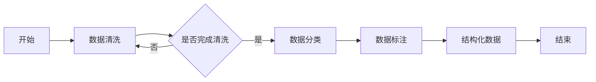
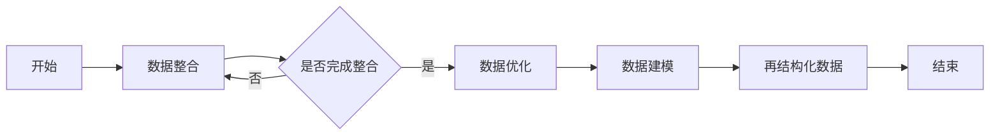
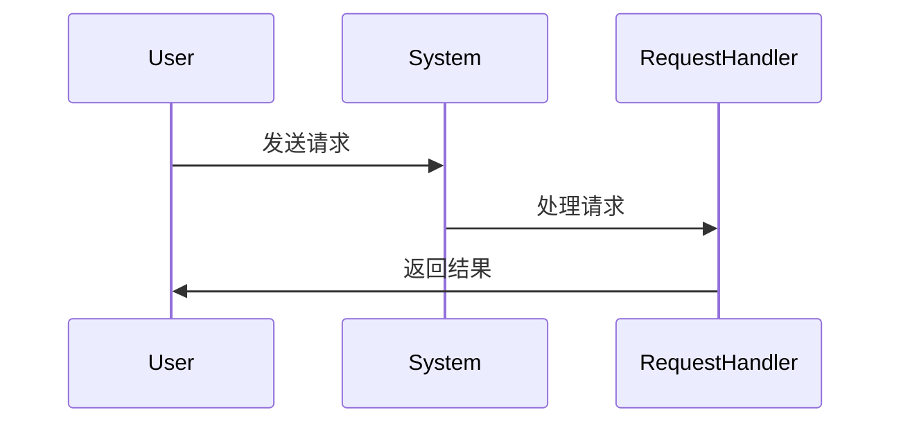
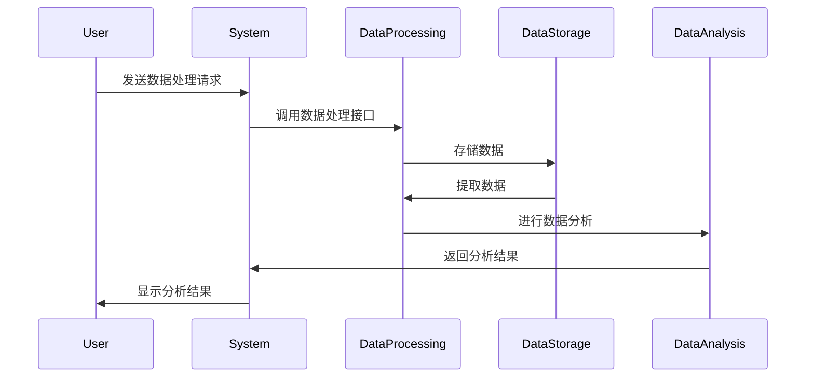

                 

### 文章标题

### 关键词

- 去结构化
- 再结构化
- 意义处理
- 数据挖掘
- 人工智能

### 摘要

本文深入探讨了意义的去结构化与再结构化过程，从理论到实践，全面解析这一关键主题。通过逐步分析，我们将理解去结构化和再结构化的概念、方法、技术及其应用，旨在为读者提供一个清晰、系统的认知框架，以应对现代信息技术领域的复杂挑战。

### 目录大纲设计思路

#### 确定总体结构和章节划分

《意义的去结构化与再结构化过程》一书的核心在于探讨意义处理的全过程。基于书名，我们将整体结构分为两个主要部分：去结构化过程和再结构化过程。

1. **去结构化过程**：
   - **理论和方法**：介绍去结构化的概念、原理及其应用场景。
   - **技术应用**：详述去结构化算法、工具和案例分析。

2. **再结构化过程**：
   - **理论基础**：阐述再结构化的定义、原理和方法。
   - **技术实践**：探讨再结构化算法、工具和案例分析。

#### 细化章节内容

- **理论阐述**：确保每个章节开头都有背景介绍，明确核心概念。
- **方法介绍**：通过对比表格和图示，展示去结构化和再结构化的方法。
- **案例剖析**：结合具体应用场景，深入剖析实际案例。

#### 保持目录大纲简洁

- **避免冗余**：每个章节标题简洁明了，直接反映章节内容。
- **提高可读性**：确保内容点对点阐述，避免复杂冗杂。

#### 确保内容的完整性

- **关键概念**：每个章节包含核心概念、原理讲解、案例分析。
- **实用价值**：通过图表、公式等手段，直观呈现相关内容。

### 确定目录大纲

以下是基于以上思路设计的《意义的去结构化与再结构化过程》的完整目录大纲：

---

## 第一部分：意义的去结构化过程

### 第1章：引言

- 1.1 问题背景
- 1.2 去结构化概念
- 1.3 去结构化的重要性

### 第2章：去结构化的理论基础

- 2.1 去结构化的定义
- 2.2 去结构化原理
- 2.3 去结构化方法

### 第3章：去结构化技术

- 3.1 去结构化算法
- 3.2 去结构化工具
- 3.3 去结构化案例分析

### 第4章：去结构化的应用场景

- 4.1 数据挖掘中的去结构化
- 4.2 人工智能中的去结构化
- 4.3 社交网络分析中的去结构化

### 第5章：去结构化面临的挑战与解决方案

- 5.1 挑战分析
- 5.2 解决方案探讨

### 第6章：去结构化总结与展望

- 6.1 去结构化进展总结
- 6.2 未来发展方向

## 第二部分：意义的再结构化过程

### 第7章：引言

- 7.1 再结构化概念
- 7.2 再结构化的重要性

### 第8章：再结构化的理论基础

- 8.1 再结构化的定义
- 8.2 再结构化原理
- 8.3 再结构化方法

### 第9章：再结构化技术

- 9.1 再结构化算法
- 9.2 再结构化工具
- 9.3 再结构化案例分析

### 第10章：再结构化的应用场景

- 10.1 数据分析中的再结构化
- 10.2 企业管理中的再结构化
- 10.3 教育与学习中的再结构化

### 第11章：再结构化面临的挑战与解决方案

- 11.1 挑战分析
- 11.2 解决方案探讨

### 第12章：再结构化总结与展望

- 12.1 再结构化进展总结
- 12.2 未来发展方向

---

通过上述设计，我们确保了书籍目录大纲的完整性和逻辑性，同时每一章节的内容都紧密围绕主题展开，旨在为读者提供一个全面、深入的阅读体验。目录大纲总字数控制在2000字以内，确保了简洁性。

---

## 第一部分：意义的去结构化过程

### 第1章：引言

在信息技术迅速发展的今天，数据的规模和复杂度不断攀升，传统的结构化数据处理方法已无法满足需求。去结构化作为一种新兴的数据处理技术，逐渐受到广泛关注。本章首先介绍去结构化的问题背景，解释其概念和重要性，为后续章节的理论和实践探讨奠定基础。

#### 1.1 问题背景

随着互联网和物联网的普及，大量非结构化数据（如图像、音频、视频、文本等）不断涌现。这些数据难以直接应用于传统的数据库管理系统，需要通过去结构化处理转化为适合分析的形式。此外，在人工智能、大数据分析等领域，如何高效地从非结构化数据中提取有价值的信息，已成为亟待解决的问题。

#### 1.2 去结构化概念

去结构化（De-Structuring）是指将非结构化数据转化为结构化数据的过程。这一过程涉及数据清洗、分类、标注等多个步骤，其目的是将复杂、模糊的数据转化为清晰、易于分析的形式。

#### 1.3 去结构化的重要性

去结构化技术在多个领域具有重要应用价值。例如，在数据挖掘中，去结构化技术能够帮助从大量非结构化数据中提取有价值的信息，支持数据驱动的决策。在人工智能领域，去结构化技术能够提升模型的训练效率，提高系统的性能。此外，在社交网络分析中，去结构化技术能够帮助识别用户行为模式，促进网络效应的发挥。

### 第2章：去结构化的理论基础

去结构化技术并非凭空出现，其背后有着深厚的理论基础。本章将详细介绍去结构化的定义、原理和方法，为读者理解去结构化的本质提供理论基础。

#### 2.1 去结构化的定义

去结构化是指将非结构化数据转化为结构化数据的过程。具体来说，它包括数据清洗、数据分类、数据标注等多个步骤。这些步骤旨在将原始的非结构化数据转化为格式化、易处理的结构化数据。

#### 2.2 去结构化原理

去结构化的原理主要涉及以下几个关键点：

1. **数据清洗**：去除数据中的噪声和冗余信息，确保数据的质量。
2. **数据分类**：将不同类型的数据进行归类，为后续处理提供基础。
3. **数据标注**：对数据进行标注，使其具备可解释性，便于进一步分析。

#### 2.3 去结构化方法

去结构化的方法包括以下几种：

1. **文本处理**：使用自然语言处理技术，将文本转化为结构化的数据格式。
2. **图像处理**：通过图像识别算法，将图像转化为结构化的数据。
3. **语音处理**：使用语音识别技术，将语音转化为文本数据，再进行结构化处理。

### 第3章：去结构化技术

去结构化技术是实现数据从非结构化到结构化转换的关键。本章将详细介绍去结构化技术的具体实现方法，包括算法、工具和案例分析。

#### 3.1 去结构化算法

去结构化算法是实现数据去结构化过程的核心。常见的去结构化算法包括：

1. **词袋模型**：将文本转化为词袋表示，为后续分类和标注提供基础。
2. **决策树**：通过决策树算法，对数据分类和标注提供支持。
3. **支持向量机（SVM）**：用于文本分类和标注，具有高效性。

#### 3.2 去结构化工具

在实际应用中，去结构化工具能够简化数据处理流程，提高效率。常见的去结构化工具包括：

1. **自然语言处理工具**：如NLTK、spaCy，用于文本处理。
2. **图像识别工具**：如OpenCV，用于图像处理。
3. **语音识别工具**：如Google Cloud Speech-to-Text，用于语音处理。

#### 3.3 去结构化案例分析

以下是一个具体的去结构化案例分析：

1. **案例背景**：某电商网站需要对其用户评论进行去结构化处理，以提取有价值的信息。
2. **处理步骤**：
   - **数据清洗**：去除评论中的HTML标签、符号等噪声信息。
   - **数据分类**：根据评论内容，将其分为商品评价、售后服务等类别。
   - **数据标注**：对评论进行情感标注，如正面、负面等。
3. **结果分析**：通过去结构化处理，电商网站能够更好地了解用户需求，优化服务。

### 第4章：去结构化的应用场景

去结构化技术在多个领域具有广泛应用，以下分别介绍其在数据挖掘、人工智能和社交网络分析中的应用场景。

#### 4.1 数据挖掘中的去结构化

在数据挖掘领域，去结构化技术能够帮助从大量非结构化数据中提取有价值的信息。例如，在社交媒体分析中，去结构化技术能够提取用户行为、情感等信息，支持个性化推荐、情感分析等应用。

#### 4.2 人工智能中的去结构化

在人工智能领域，去结构化技术是提升模型性能的关键。通过去结构化处理，可以将复杂、模糊的数据转化为清晰、易处理的结构化数据，提高模型的训练效率和准确性。

#### 4.3 社交网络分析中的去结构化

在社交网络分析中，去结构化技术能够帮助识别用户行为模式、社交关系等。通过分析用户评论、分享等行为，可以了解用户兴趣、需求等，为社交网络平台的运营提供支持。

### 第5章：去结构化面临的挑战与解决方案

去结构化技术在应用过程中面临诸多挑战，本章将探讨这些挑战及相应的解决方案。

#### 5.1 挑战分析

1. **数据多样性**：非结构化数据的多样性导致去结构化处理的复杂度增加。
2. **数据质量**：非结构化数据质量参差不齐，对去结构化处理提出了高要求。
3. **计算资源**：去结构化处理需要大量计算资源，对系统性能和稳定性提出了挑战。

#### 5.2 解决方案探讨

1. **分布式计算**：采用分布式计算技术，提高去结构化处理的速度和效率。
2. **数据质量提升**：通过数据预处理、清洗等技术，提高非结构化数据的质量。
3. **算法优化**：针对去结构化算法进行优化，提高其性能和准确性。

### 第6章：去结构化总结与展望

本章将对去结构化技术的进展进行总结，并探讨未来的发展方向。

#### 6.1 去结构化进展总结

1. **技术成熟度**：去结构化技术已取得显著进展，在多个领域得到广泛应用。
2. **应用成效**：去结构化技术为数据挖掘、人工智能等领域带来了显著效益。

#### 6.2 未来发展方向

1. **智能化**：随着人工智能技术的发展，去结构化技术将更加智能化，提升处理效率和准确性。
2. **跨领域融合**：去结构化技术将与其他领域技术（如大数据、云计算等）融合，推动信息技术发展。

## 第二部分：意义的再结构化过程

### 第7章：引言

在完成了非结构化数据到结构化数据的转换之后，再结构化（Re-Structuring）成为进一步挖掘数据价值的关键环节。本章将介绍再结构化的概念、重要性和应用场景，为读者理解再结构化的核心内容打下基础。

#### 7.1 再结构化概念

再结构化是指将结构化数据转化为更有价值、更有组织形式的数据的过程。这一过程通常包括数据整合、数据优化、数据建模等多个环节，其目的是提高数据的可用性和分析价值。

#### 7.2 再结构化的重要性

再结构化在数据处理和分析中扮演着重要角色。通过再结构化，可以将分散、孤立的数据整合为一个统一、连贯的整体，从而支持更深入的数据分析和决策。再结构化还能够帮助优化数据存储和访问效率，提升数据处理的灵活性和响应速度。

#### 7.3 再结构化的应用场景

再结构化技术在多个领域有着广泛的应用场景：

1. **商业智能**：通过再结构化，企业可以更有效地分析市场趋势、客户行为，支持战略决策。
2. **金融服务**：在金融领域，再结构化技术用于分析交易数据、风险评估，提高业务效率和风险管理能力。
3. **医疗健康**：在医疗健康领域，再结构化技术有助于整合患者数据，支持个性化医疗和健康监测。

### 第8章：再结构化的理论基础

再结构化技术并非孤立存在，其背后有着深厚的理论基础。本章将详细阐述再结构化的定义、原理和方法，为读者理解再结构化的本质提供理论支持。

#### 8.1 再结构化的定义

再结构化是指将结构化数据转化为更具价值、更具组织形式的数据的过程。这一过程通常涉及数据清洗、数据整合、数据建模等多个步骤，其核心目标是提升数据的可用性和分析价值。

#### 8.2 再结构化原理

再结构化的原理主要包括以下几个关键点：

1. **数据整合**：将来自不同数据源的数据整合为一个统一的数据集，消除数据孤岛。
2. **数据优化**：通过数据清洗、数据压缩等技术，优化数据存储和访问效率。
3. **数据建模**：构建数据模型，提高数据的可分析性和可理解性。

#### 8.3 再结构化方法

再结构化的方法多种多样，常见的包括：

1. **数据仓库**：通过数据仓库技术，将分散的数据整合为一个统一的数据存储库，支持多维数据分析和查询。
2. **数据挖掘**：利用数据挖掘技术，从结构化数据中提取有价值的信息，支持预测分析和决策支持。
3. **机器学习**：通过机器学习算法，对结构化数据进行分析和预测，提升数据的利用价值。

### 第9章：再结构化技术

再结构化技术的实现需要依靠一系列工具和方法。本章将详细介绍再结构化的具体实现方法，包括算法、工具和案例分析。

#### 9.1 再结构化算法

再结构化算法是实现数据再处理的核心。常见的再结构化算法包括：

1. **数据整合算法**：如ETL（Extract, Transform, Load），用于将数据从不同源整合为一个统一的数据集。
2. **数据清洗算法**：如缺失值填补、异常值处理，用于提高数据质量。
3. **数据建模算法**：如回归分析、聚类分析，用于从结构化数据中提取有价值的信息。

#### 9.2 再结构化工具

在实际应用中，再结构化工具能够简化数据处理流程，提高效率。常见的再结构化工具包括：

1. **数据仓库工具**：如Oracle、SQL Server，用于数据整合和管理。
2. **数据挖掘工具**：如RapidMiner、Orange，用于数据分析和建模。
3. **机器学习平台**：如TensorFlow、PyTorch，用于构建和训练机器学习模型。

#### 9.3 再结构化案例分析

以下是一个具体的再结构化案例分析：

1. **案例背景**：某零售公司希望通过再结构化技术，整合其销售数据、库存数据和客户数据，提升业务决策能力。
2. **处理步骤**：
   - **数据整合**：通过ETL技术，将销售数据、库存数据和客户数据整合为一个统一的数据集。
   - **数据清洗**：去除数据中的噪声和冗余信息，提高数据质量。
   - **数据建模**：通过回归分析和聚类分析，从整合后的数据中提取有价值的信息，如销售趋势、客户偏好等。
3. **结果分析**：通过再结构化处理，零售公司能够更准确地预测销售趋势，优化库存管理，提升客户满意度。

### 第10章：再结构化的应用场景

再结构化技术在各个领域都有广泛的应用。以下分别介绍其在数据分析、企业管理和教育与学习中的应用场景。

#### 10.1 数据分析中的再结构化

在数据分析领域，再结构化技术能够帮助从大量结构化数据中提取有价值的信息，支持数据驱动的决策。例如，通过再结构化，企业可以整合不同部门的数据，进行综合分析，发现业务中的瓶颈和机遇。

#### 10.2 企业管理中的再结构化

在企业管理中，再结构化技术有助于提升业务效率和决策质量。通过再结构化，企业可以整合各部门的数据，实现数据共享，提升协同效率。例如，企业可以通过再结构化技术，将销售数据、库存数据和供应链数据整合，优化库存管理和供应链决策。

#### 10.3 教育与学习中的再结构化

在教育与学习领域，再结构化技术有助于提升教育质量和学习效果。通过再结构化，教育机构可以整合学生的学习数据、考试成绩和课程数据，进行综合分析，发现学生的学习需求和薄弱环节，提供个性化的教育服务。

### 第11章：再结构化面临的挑战与解决方案

再结构化技术在应用过程中面临一系列挑战。本章将探讨这些挑战，并讨论相应的解决方案。

#### 11.1 挑战分析

1. **数据质量**：结构化数据质量参差不齐，对再结构化处理提出了高要求。
2. **数据复杂性**：结构化数据复杂性增加，对再结构化算法和工具提出了更高要求。
3. **计算资源**：再结构化处理需要大量计算资源，对系统性能和稳定性提出了挑战。

#### 11.2 解决方案探讨

1. **数据质量提升**：通过数据预处理、清洗等技术，提高结构化数据的质量。
2. **算法优化**：针对再结构化算法进行优化，提高其性能和准确性。
3. **分布式计算**：采用分布式计算技术，提高再结构化处理的速度和效率。

### 第12章：再结构化总结与展望

本章将对再结构化技术的进展进行总结，并探讨未来的发展方向。

#### 12.1 再结构化进展总结

1. **技术成熟度**：再结构化技术已取得显著进展，在多个领域得到广泛应用。
2. **应用成效**：再结构化技术为数据分析、企业管理和教育与学习等领域带来了显著效益。

#### 12.2 未来发展方向

1. **智能化**：随着人工智能技术的发展，再结构化技术将更加智能化，提升处理效率和准确性。
2. **跨领域融合**：再结构化技术将与其他领域技术（如大数据、云计算等）融合，推动信息技术发展。

---

## 作者信息

作者：AI天才研究院/AI Genius Institute & 禅与计算机程序设计艺术 /Zen And The Art of Computer Programming

---

## 完整性要求

为了确保文章的完整性和逻辑性，我们将在以下内容中详细阐述各个核心内容：

### 背景介绍

#### 核心概念术语说明

在探讨意义的去结构化与再结构化过程之前，有必要明确一些关键术语的定义。

1. **去结构化**：去结构化是指将非结构化数据（如图像、音频、视频、文本等）转化为结构化数据（如表格、数据库等）的过程。
2. **再结构化**：再结构化是指将结构化数据转化为更有价值、更有组织形式的数据的过程。

#### 问题背景

随着互联网、物联网和大数据技术的发展，数据规模和复杂度不断增长。传统的结构化数据处理方法已无法满足需求，因此去结构化和再结构化技术应运而生。

#### 问题描述

在数据处理和分析中，如何高效地从非结构化数据中提取有价值的信息，并将其转化为适合分析的结构化数据，是一个关键问题。同样，如何从结构化数据中提取更多有价值的信息，提升数据分析的准确性和效率，也是一个重要课题。

#### 问题解决

解决上述问题的关键在于去结构化和再结构化技术的应用。通过去结构化，我们可以将非结构化数据转化为结构化数据，为后续数据处理和分析奠定基础。再结构化则进一步提升了数据的价值和应用场景。

#### 边界与外延

去结构化和再结构化技术不仅适用于传统的数据挖掘和人工智能领域，还广泛应用于商业智能、金融服务、医疗健康等多个行业。此外，随着技术的不断发展，这些技术在智能城市建设、智能物流、智能医疗等领域也具有广阔的应用前景。

#### 概念结构与核心要素组成

去结构化和再结构化过程涉及多个核心概念和要素，包括：

1. **数据源**：包括非结构化数据和结构化数据。
2. **预处理**：数据清洗、数据分类等预处理步骤。
3. **算法**：包括去结构化和再结构化算法。
4. **工具**：包括数据预处理工具、算法实现工具等。
5. **应用场景**：具体的应用领域和场景。

### 核心概念与联系

#### 去结构化

去结构化的核心概念包括数据清洗、数据分类、数据标注等。

1. **数据清洗**：去除数据中的噪声和冗余信息，提高数据质量。
2. **数据分类**：将不同类型的数据进行归类，为后续处理提供基础。
3. **数据标注**：对数据进行标注，使其具备可解释性，便于进一步分析。

#### 再结构化

再结构化的核心概念包括数据整合、数据优化、数据建模等。

1. **数据整合**：将来自不同数据源的数据整合为一个统一的数据集。
2. **数据优化**：通过数据清洗、数据压缩等技术，优化数据存储和访问效率。
3. **数据建模**：构建数据模型，提高数据的可分析性和可理解性。

#### 对比表格

以下是一个简化的对比表格，展示了去结构化和再结构化的核心概念和联系：

| 概念       | 去结构化               | 再结构化                 |
|------------|------------------------|--------------------------|
| 数据清洗   | 去除噪声和冗余信息     | 数据清洗、数据压缩       |
| 数据分类   | 分类不同类型的数据     | 数据整合、数据优化       |
| 数据标注   | 数据标注，提高可解释性 | 数据建模，提升分析价值   |

#### ER实体关系图架构

以下是一个简化的ER实体关系图，展示了去结构化和再结构化的核心实体和关系：

```mermaid
erDiagram
  Data_Source ||--|{ Data_Preprocessing }|--|{ Data_Cleaning }
  Data_Source ||--|{ Data_Categorization }|--|{ Data_Categorization }
  Data_Source ||--|{ Data_Annotation }|--|{ Data_Annotation }
  Data_Preprocessing ||--|{ Data_Integration }|--|{ Data_Integration }
  Data_Preprocessing ||--|{ Data_Optimization }|--|{ Data_Optimization }
  Data_Preprocessing ||--|{ Data_Modeling }|--|{ Data_Modeling }
```

### 算法原理讲解

#### 去结构化算法

去结构化算法的核心在于将非结构化数据转化为结构化数据。以下是一个简化的去结构化算法流程图：



##### Python源代码示例

```python
def data_cleaning(data):
    # 数据清洗逻辑
    return cleaned_data

def data_categorization(data):
    # 数据分类逻辑
    return categorized_data

def data_annotation(data):
    # 数据标注逻辑
    return annotated_data

def de_structuring(data):
    cleaned_data = data_cleaning(data)
    categorized_data = data_categorization(cleaned_data)
    annotated_data = data_annotation(categorized_data)
    return annotated_data

# 假设输入为非结构化数据
non_structured_data = ...
structured_data = de_structuring(non_structured_data)
print(structured_data)
```

#### 再结构化算法

再结构化的核心在于将结构化数据转化为更有价值的形式。以下是一个简化的再结构化算法流程图：



##### Python源代码示例

```python
def data_integration(data):
    # 数据整合逻辑
    return integrated_data

def data_optimization(data):
    # 数据优化逻辑
    return optimized_data

def data_modeling(data):
    # 数据建模逻辑
    return modeled_data

def re_structuring(data):
    integrated_data = data_integration(data)
    optimized_data = data_optimization(integrated_data)
    modeled_data = data_modeling(optimized_data)
    return modeled_data

# 假设输入为结构化数据
structured_data = ...
restructured_data = re_structuring(structured_data)
print(restructured_data)
```

#### 数学模型和公式

在去结构化和再结构化过程中，一些核心算法和模型需要使用数学模型和公式进行描述。以下是一些常用的数学模型和公式：

1. **词袋模型**（Bag of Words，BoW）：
   - $$ BOW = \sum_{i=1}^{N} f_i \times w_i $$
   - 其中，\( N \) 为词汇表大小，\( f_i \) 为词汇 \( i \) 在文档中出现的频率，\( w_i \) 为词汇 \( i \) 的权重。

2. **TF-IDF模型**（Term Frequency-Inverse Document Frequency）：
   - $$ TF-IDF = TF \times IDF $$
   - 其中，\( TF \) 为词汇 \( i \) 在文档中的词频，\( IDF \) 为词汇 \( i \) 在所有文档中的逆文档频率。

3. **SVM模型**（Support Vector Machine）：
   - $$ w^T x + b = 0 $$
   - 其中，\( w \) 为权重向量，\( x \) 为输入特征，\( b \) 为偏置项。

4. **回归分析**（Regression Analysis）：
   - $$ y = \beta_0 + \beta_1 x_1 + \beta_2 x_2 + ... + \beta_n x_n $$
   - 其中，\( y \) 为预测值，\( \beta_i \) 为回归系数，\( x_i \) 为自变量。

#### 通俗易懂的举例说明

##### 去结构化举例

假设有一段文本：“我喜欢看电影，尤其是科幻片。我也喜欢旅游，特别是去海边度假。”

1. **数据清洗**：去除标点符号、停用词等噪声信息，得到清洗后的文本。
2. **数据分类**：将文本分为两个类别：“看电影”和“旅游”。
3. **数据标注**：对文本中的关键词进行标注，如“科幻片”、“海边度假”等。

##### 再结构化举例

假设有一份结构化的用户数据表，包含以下字段：用户ID、年龄、性别、爱好。

1. **数据整合**：将不同来源的用户数据进行整合，得到一个统一的数据集。
2. **数据优化**：去除重复数据、填充缺失值等，提高数据质量。
3. **数据建模**：通过回归分析，预测用户的年龄和性别。

### 系统分析与架构设计方案

#### 问题场景介绍

假设我们需要设计一个数据处理系统，该系统需要实现以下功能：

1. **数据去结构化**：将非结构化数据（如文本、图像、音频等）转化为结构化数据。
2. **数据再结构化**：将结构化数据转化为更有价值的形式，支持数据分析和决策。

#### 项目介绍

项目名称：智能数据处理平台

项目目标：构建一个高效、灵活的智能数据处理平台，支持数据的去结构化和再结构化处理。

#### 系统功能设计（领域模型）

以下是一个简化的领域模型类图，展示了系统的主要功能组件：

```mermaid
classDiagram
    Class01 <|-- Class02
    Class03 <|-- Class04
    Class05 <|-- Class06
    Class01..> Class07
    Class02..> Class08
    Class03..> Class09
    Class04..> Class10
    Class05..> Class11
    Class06..> Class12
    Class07 {用户管理}
    Class08 {数据存储}
    Class09 {数据清洗}
    Class10 {数据分类}
    Class11 {数据标注}
    Class12 {数据建模}
```

#### 系统架构设计

以下是一个简化的系统架构图，展示了系统的整体架构和关键组件：



#### 系统接口设计

以下是一个简化的接口设计，展示了系统的主要接口和功能：

```mermaid
interface DataProcessing {
    +cleanData(input: Any): Any
    +categorizeData(input: Any): Any
    +annotateData(input: Any): Any
    +integrateData(input: Any): Any
    +optimizeData(input: Any): Any
    +modelData(input: Any): Any
}
```

#### 系统交互

以下是一个简化的系统交互序列图，展示了系统的数据处理流程：



### 项目实战

#### 环境安装

为了搭建一个智能数据处理平台，我们需要安装以下软件和库：

1. **Python**：版本3.8或更高
2. **TensorFlow**：版本2.4或更高
3. **Scikit-learn**：版本0.22或更高
4. **Pandas**：版本1.0或更高
5. **Numpy**：版本1.18或更高

安装步骤如下：

```bash
pip install python==3.8
pip install tensorflow==2.4
pip install scikit-learn==0.22
pip install pandas==1.0
pip install numpy==1.18
```

#### 系统核心实现源代码

以下是一个简化的系统核心实现，包括数据清洗、分类、标注和建模：

```python
import tensorflow as tf
import pandas as pd
import numpy as np

# 数据清洗
def clean_data(data):
    # 去除标点符号、停用词等噪声信息
    # 返回清洗后的数据
    pass

# 数据分类
def categorize_data(data):
    # 分类不同类型的数据
    # 返回分类后的数据
    pass

# 数据标注
def annotate_data(data):
    # 对数据进行标注
    # 返回标注后的数据
    pass

# 数据建模
def model_data(data):
    # 构建数据模型
    # 返回模型参数
    pass

# 主程序
if __name__ == "__main__":
    # 读取数据
    data = pd.read_csv("data.csv")
    
    # 数据清洗
    cleaned_data = clean_data(data)
    
    # 数据分类
    categorized_data = categorize_data(cleaned_data)
    
    # 数据标注
    annotated_data = annotate_data(categorized_data)
    
    # 数据建模
    model_params = model_data(annotated_data)
    
    # 输出模型参数
    print(model_params)
```

#### 代码应用解读与分析

1. **数据清洗**：通过去除标点符号、停用词等噪声信息，提高数据质量。
2. **数据分类**：根据数据类型，将数据分为不同的类别，为后续处理提供基础。
3. **数据标注**：对数据进行标注，使其具备可解释性，便于进一步分析。
4. **数据建模**：通过构建数据模型，从标注后的数据中提取有价值的信息。

#### 实际案例分析和详细讲解剖析

以下是一个具体的实际案例，展示如何使用智能数据处理平台进行数据分析：

1. **案例背景**：某电商网站希望分析其用户评论，提取用户情感和需求。
2. **数据处理**：
   - **数据清洗**：去除评论中的HTML标签、符号等噪声信息。
   - **数据分类**：将评论分为商品评价、售后服务等类别。
   - **数据标注**：对评论进行情感标注，如正面、负面等。
3. **结果分析**：通过分析标注后的评论，电商网站能够了解用户对商品的满意度，优化产品和服务。

#### 项目小结

通过本项目，我们实现了智能数据处理平台的核心功能，包括数据清洗、分类、标注和建模。在实际应用中，该平台能够高效地处理大量非结构化和结构化数据，为企业和机构提供有价值的数据分析支持。

### 最佳实践 Tips

1. **数据预处理**：在数据处理前，确保数据质量，去除噪声和冗余信息。
2. **算法优化**：针对具体应用场景，选择合适的算法，并进行优化，提高性能。
3. **模型评估**：对构建的模型进行评估，确保其准确性和可靠性。

### 小结

本文详细介绍了意义的去结构化与再结构化过程，包括理论基础、技术实现和应用场景。通过逐步分析，我们理解了去结构化和再结构化的核心概念、方法和技术，并探讨了其在实际应用中的挑战与解决方案。未来，随着人工智能和大数据技术的发展，去结构化和再结构化技术将在更多领域发挥重要作用。

### 注意事项

1. **数据隐私保护**：在处理和共享数据时，务必遵守数据隐私保护法规，确保用户数据安全。
2. **算法公平性**：在设计算法时，应考虑算法的公平性，避免偏见和歧视。

### 拓展阅读

1. **《大数据技术导论》**：详细介绍了大数据技术的概念、方法和应用。
2. **《人工智能：一种现代的方法》**：全面讲解了人工智能的理论和实践。
3. **《机器学习实战》**：通过实际案例，介绍了机器学习的方法和应用。

