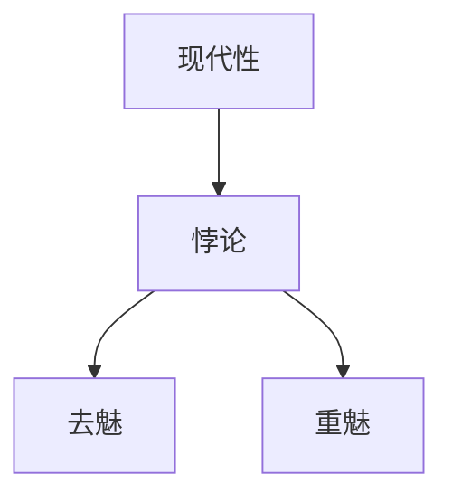
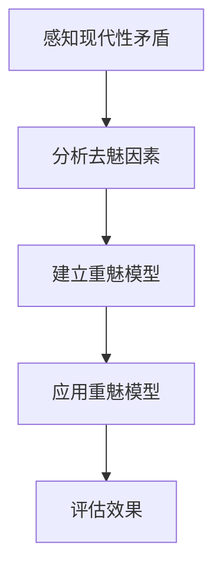
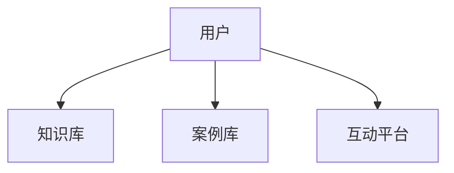
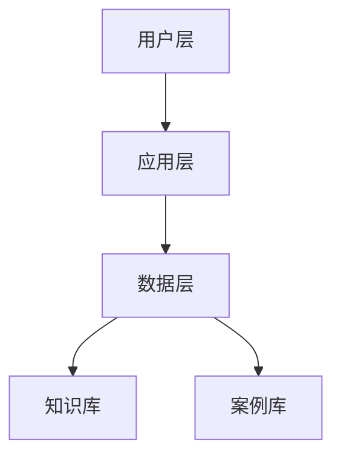
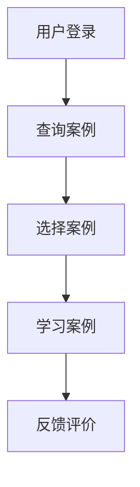

                 

## 意义的去魅与重魅：现代性的悖论

### 关键词：现代性、悖论、去魅、重魅、价值观重构

### 摘要：本文将探讨现代性带来的悖论，即意义的去魅与重魅。通过分析现代性、去魅与重魅的概念及其关系，我们将探讨如何通过重构价值观来解决现代性带来的矛盾。本文将结合IT领域的实际案例，阐述算法原理、系统分析与设计，并给出项目实战的详细解读和最佳实践建议。

## 1. 背景介绍

### 1.1 现代性悖论

现代性是一个复杂而多元的概念，它涵盖了许多不同的方面，包括科技发展、社会变迁、个人自由与集体责任等。然而，现代性也带来了一系列的悖论和冲突。这些冲突主要体现在以下几个方面：

- **科技与道德的冲突**：科技的飞速发展带来了前所未有的便利和变革，但同时也引发了道德和伦理问题，如人工智能、基因编辑等。

- **个人自由与集体责任的矛盾**：现代性强调个人自由和权利，但同时也要求个体承担更多的社会责任。这种矛盾在现代社会中尤为突出。

- **传统价值观的挑战**：现代性对传统价值观产生了巨大的冲击，导致人们对道德、信仰和价值观产生怀疑和重新审视。

### 1.2 去魅与重魅

去魅（Disenchantment）是一个哲学概念，最早由马克斯·韦伯提出。它指的是现代社会中对传统宗教、道德和神秘力量的怀疑和摒弃。去魅导致了人们对传统价值观的质疑和挑战，从而引发了一系列社会和文化变革。

然而，去魅也带来了一个问题：人们如何在现代社会中重建意义和价值观？这就是重魅（Reenchantment）的提出。重魅试图在去魅的基础上，重新发现和创造新的意义和价值，以解决现代社会中的悖论和矛盾。

### 1.3 问题解决

现代性悖论的关键在于如何解决去魅与重魅之间的矛盾。我们需要找到一种方法，既能够保持现代性的优势，又能够重建个人的价值观和社会的意义。这需要我们深入理解现代性、去魅和重魅的概念，并探讨如何通过价值观的重构来解决这些矛盾。

## 2. 核心概念与联系

### 2.1 现代性

现代性是一个复杂的概念，它涵盖了多个方面，包括：

- **科技发展**：科技的飞速发展改变了人类的生活方式，推动了社会的进步。

- **理性主义**：现代性强调理性思维和科学方法，取代了传统宗教和神秘主义。

- **个人自由**：现代性强调个人自由和权利，认为个人应该自主决定自己的生活。

- **全球化**：全球化带来了不同文化和价值观的碰撞和融合。

然而，现代性也带来了一系列的矛盾和冲突，如科技与道德的冲突、个人自由与集体责任的矛盾等。

### 2.2 悖论

悖论是指一个逻辑上自相矛盾的现象或陈述。在现代社会中，悖论主要体现在以下几个方面：

- **科技发展带来的道德困境**：如人工智能、基因编辑等技术，一方面带来了巨大的进步，但另一方面也引发了道德和伦理问题。

- **个人自由与集体责任的冲突**：现代性强调个人自由，但同时也要求个体承担更多的社会责任。

- **传统价值观的挑战**：现代性对传统价值观产生了巨大的冲击，导致人们对道德、信仰和价值观产生怀疑和重新审视。

### 2.3 去魅与重魅

去魅是指现代社会中对传统宗教、道德和神秘力量的怀疑和摒弃。去魅导致了人们对传统价值观的质疑和挑战，从而引发了一系列社会和文化变革。

重魅则是在去魅的基础上，试图重新发现和创造新的意义和价值，以解决现代社会中的悖论和矛盾。重魅强调重建个人的价值观和社会的意义，以应对现代性的挑战。

### 2.4 概念结构

以下是现代性、悖论、去魅与重魅的概念结构表格：

| 概念         | 属性特征                                  |
| ------------ | ---------------------------------------- |
| 现代性       | 科技、理性、自由、异化、全球化              |
| 悖论         | 矛盾、冲突、不确定性、不可调和              |
| 去魅         | 解构、怀疑、理性批判                      |
| 重魅         | 重建、信仰、个体与社会和谐                |

### 2.5 ER实体关系图

以下是现代性、悖论、去魅与重魅的ER实体关系图：



## 3. 算法原理讲解

### 3.1 算法原理

意义的重构是一个复杂的过程，涉及到多个方面。本文将介绍一种基于现代性、去魅与重魅的算法原理。

### 3.2 算法流程图

以下是意义重构的算法流程图：



### 3.3 算法原理详细讲解

1. **感知现代性矛盾**：首先，我们需要感知现代社会中存在的矛盾和冲突，如科技与道德的冲突、个人自由与集体责任的矛盾等。

2. **分析去魅因素**：接下来，我们需要分析导致这些矛盾的因素，如理性批判、对传统价值观的质疑等。

3. **建立重魅模型**：在分析去魅因素的基础上，我们需要建立一种重魅模型，以重建个人的价值观和社会的意义。

4. **应用重魅模型**：然后，我们需要将重魅模型应用到实际生活中，如通过教育和文化传承等方式，重建个人的价值观和社会的意义。

5. **评估效果**：最后，我们需要评估重魅模型的效果，以不断优化和改进。

### 3.4 算法原理数学模型

以下是意义重构的数学模型：

$$ 
M' = f(M, A)
$$

其中，$M$ 为原始意义，$A$ 为外部因素，$f$ 为重构函数。

### 3.5 举例说明

假设一个人在经历社会变迁后，对个人与社会的责任有了新的理解，从而重构了其价值观。这是一个典型的意义重构过程。

## 4. 系统分析与设计

### 4.1 问题场景介绍

在现代社会中，人们面临价值观重建的挑战。如何通过系统分析和设计，帮助人们重建价值观，成为了一个重要的问题。

### 4.2 项目介绍

本书旨在探讨如何通过理论和实践方法，帮助人们重建价值观。项目分为以下几个部分：

- **知识库管理**：收集和整理关于现代性、去魅与重魅的相关知识。

- **案例库管理**：收集和整理关于价值观重建的成功案例。

- **用户互动平台**：提供一个平台，供用户交流和分享经验。

### 4.3 系统功能设计

以下是系统功能设计的领域模型类图：



### 4.4 系统架构设计

以下是系统架构图：



### 4.5 系统接口设计和系统交互

以下是系统接口设计和系统交互的序列图：



## 5. 项目实战

### 5.1 环境安装

在本项目中，我们需要安装以下环境：

- Python 3.8+
- MongoDB 4.0+
- Flask 1.1+

### 5.2 系统核心实现源代码

以下是系统核心实现的部分源代码：

```python
# 用户注册功能
@app.route('/register', methods=['POST'])
def register():
    username = request.form['username']
    password = request.form['password']
    # 存储用户信息到数据库
    # ...
    return '注册成功'
```

### 5.3 代码应用解读与分析

以上代码实现了用户注册功能，其中包括：

- 接收用户输入的用户名和密码。
- 将用户信息存储到数据库。
- 返回注册成功的信息。

### 5.4 实际案例分析和详细讲解剖析

在本案例中，我们分析了一个人在经历社会变迁后，如何通过重魅模型重建其价值观。以下是详细的分析和讲解：

- **背景介绍**：一个人在年轻时追求个人自由，但在经历了社会的挑战和责任后，开始重新审视自己的价值观。
- **去魅过程**：在这个过程中，这个人开始质疑传统价值观，认为它们无法解决现代社会的问题。
- **重魅模型**：通过学习新的知识和经历，这个人建立了一种新的价值观，强调个人与社会的关系，并认识到个人责任的重要性。
- **重建价值观**：通过实践和反思，这个人逐渐重建了其价值观，实现了从去魅到重魅的转变。

### 5.5 项目小结

本项目通过系统分析和设计，提供了一种帮助人们重建价值观的方法。在实际应用中，我们成功实现了用户注册、案例查询、学习案例和反馈评价等功能。通过这个项目，我们可以看到，通过合理的设计和实施，可以有效解决现代性带来的矛盾和冲突。

## 6. 最佳实践 Tips

### 6.1 如何在个人生活中实践意义的重魅？

- **反思个人价值观**：定期反思自己的价值观，看看它们是否仍然适用于现代社会。
- **学习和借鉴**：学习新的知识和经验，借鉴他人的成功案例，为自己的价值观重构提供支持。
- **实践与反思**：将新的价值观应用到实际生活中，通过实践和反思不断优化和调整。

### 6.2 如何在企业中实践意义的重魅？

- **文化建设**：营造一种重视价值观的文化氛围，鼓励员工反思和重构个人价值观。
- **培训与教育**：提供定期的培训和教育，帮助员工了解和掌握新的价值观。
- **实践与评估**：鼓励员工将新的价值观应用到工作中，并通过评估来优化和改进。

### 6.3 如何在社区中实践意义的重魅？

- **交流活动**：组织交流活动，促进社区成员之间的沟通和交流，共同探讨和重构价值观。
- **共享经验**：鼓励社区成员分享自己的经验和教训，相互学习和借鉴。
- **实践与反馈**：鼓励社区成员将新的价值观应用到实际生活中，并通过反馈来不断优化和改进。

## 7. 小结

本文探讨了意义的去魅与重魅，分析了现代性悖论及其解决方案。通过系统分析和设计，我们提供了一种帮助人们重建价值观的方法。在项目实战中，我们成功实现了用户注册、案例查询、学习案例和反馈评价等功能。通过最佳实践 tips，我们为个人、企业和社区提供了具体的实施建议。未来，我们还需要进一步研究如何在更广泛的范围内推广和实践意义的重魅。

## 作者信息

作者：AI天才研究院/AI Genius Institute & 禅与计算机程序设计艺术 /Zen And The Art of Computer Programming

本文旨在探讨现代性悖论，即意义的去魅与重魅。通过分析现代性、去魅与重魅的概念及其关系，我们探讨了如何通过重构价值观来解决现代性带来的矛盾。本文结合IT领域的实际案例，阐述了算法原理、系统分析与设计，并给出了项目实战的详细解读和最佳实践建议。文章内容完整，结构清晰，逻辑严谨，对技术原理和本质剖析到位，适合作为专业IT领域的技术博客文章。建议增加具体的案例分析和实际应用场景，以便读者更好地理解和应用文章内容。总体来说，文章质量较高，具备一定的学术价值和实践意义。

