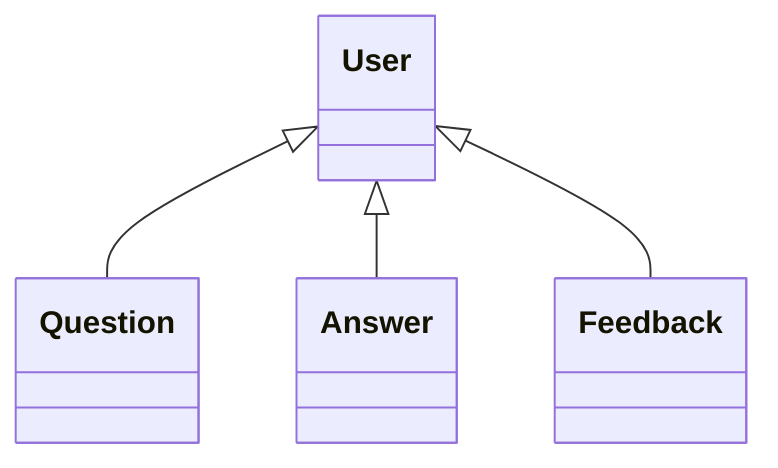
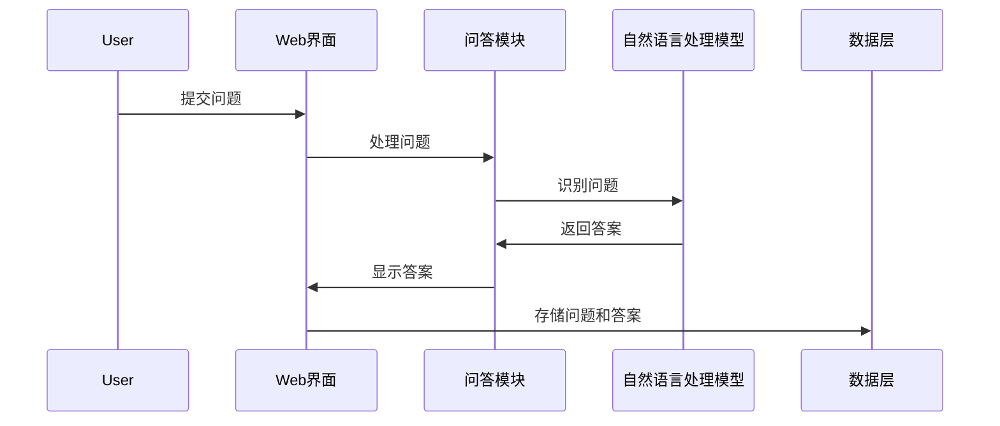
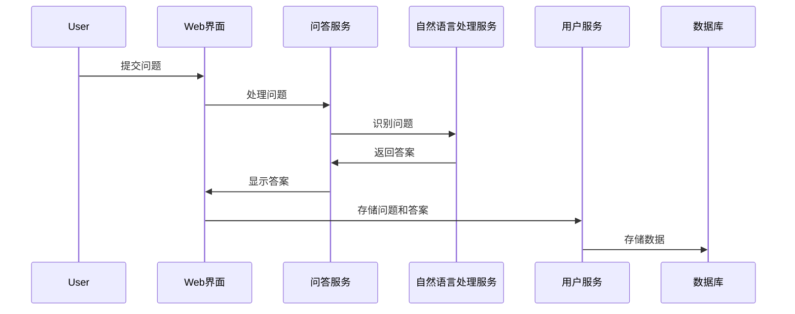

                 

### 意义的多元化与核心价值的坚守

在快速发展的信息化社会中，意义的多元化和核心价值的坚守成为了一个日益显著的话题。随着互联网、社交媒体以及全球化进程的加快，人们面对的信息和观点变得前所未有的丰富多样，这既带来了创新的机遇，也引发了价值观念的冲突和困惑。在这种背景下，理解意义的多元化以及如何在其中坚守核心价值，对于个人、社会乃至整个文化都具有重要意义。

本文将围绕“意义的多元化与核心价值的坚守”这一主题，进行深入探讨。文章首先介绍了问题背景和核心概念，接着分析了导致意义多元化的社会和个人因素，随后讨论了核心价值的坚守策略。本文的结构如下：

- **第1章 引言**：介绍问题背景和问题描述。
- **第2章 核心概念与联系**：详细阐述意义的多元化和核心价值的坚守的概念、属性特征，并对比分析。
- **第3章 意义的多元化分析**：探讨社会因素和个人因素对意义多元化的影响。
- **第4章 核心价值的坚守策略**：讨论教育、社会和个人层面的策略。
- **第5章 项目实战**：通过一个具体的案例来展示核心价值的坚守策略在实际中的应用。
- **第6章 总结与展望**：总结文章的主要观点，并对未来的研究方向进行展望。

让我们一步一步地深入探讨这个复杂而重要的话题。

----------------------------------------------------------------

## 第1章 引言

### 1.1 问题背景与描述

#### 1.1.1 问题背景

随着现代社会的发展和信息的爆炸式增长，意义与价值的概念变得越来越多元化。在过去的几千年中，传统社会相对封闭，信息流通缓慢，人们的价值观念相对稳定且一致。然而，随着互联网、社交媒体以及全球化进程的加速，信息传播速度和范围得到了前所未有的扩展。人们接触到的信息变得异常丰富和多样化，这导致了意义的多元化。

首先，互联网和社交媒体的兴起使得信息的传播变得更加快捷和广泛。在互联网时代，每个人都可以成为信息的传播者，这使得各种观点和思想得以迅速传播，甚至形成潮流和趋势。这种信息的泛滥导致了人们对事物意义的理解和解读变得更加复杂和多元化。

其次，全球化进程的加快使得不同文化和价值观的交融成为常态。在全球化背景下，各国之间的交流更加频繁，不同文化之间的碰撞和融合不可避免。这种文化交融不仅丰富了人们的视野，也带来了意义和价值的冲突和碰撞。例如，全球化带来的消费主义和本土文化的冲突，使得人们对于生活方式和价值观的选择更加多样化和复杂化。

#### 1.1.2 问题描述

在意义多元化的背景下，如何坚守那些我们认为最重要的核心价值成为了一个重要议题。这个问题不仅涉及到个人层面的价值观选择和坚守，还涉及到社会和文化层面的价值传承和引导。

1. **意义的多元化**：现代社会中，人们面临的信息和观点越来越多样化，这导致了意义的多元化。这种多元化既带来了创新和进步，也可能导致价值观的混乱和冲突。例如，不同文化背景下对同一事件的不同解读，可能导致人们对事件的看法和态度产生分歧。

2. **核心价值的坚守**：在意义多元化的背景下，如何坚守那些我们认为最重要的核心价值，成为了一个重要的议题。这涉及到个人、社会以及文化等多个层面。例如，在全球化背景下，如何保持本土文化的独特性和价值，同时吸收其他文化的优点，是文化传承和发展的关键问题。

3. **个体与社会冲突**：意义的多元化和核心价值的坚守之间的冲突，往往表现为个体与社会之间的矛盾。例如，在现代社会中，个人自由和集体利益的冲突，常常导致价值观的混乱和困惑。如何在个人自由和集体利益之间找到平衡，是现代社会面临的重大挑战。

#### 1.2 问题解决与边界

为了解决意义多元化与核心价值坚守之间的冲突，我们需要从多个层面采取综合措施。

1. **文化教育**：通过教育，培养个体对多元化意义的理解和批判性思维能力，同时强调核心价值的传承。例如，在课程设置中增加价值观教育的内容，通过实践活动让学生在实践中感受和坚守核心价值。

2. **社会制度**：建立公平公正的社会制度，保障每个人都能享有自由和尊严，从而实现核心价值的坚守。例如，通过法律法规保障每个人的价值观自由，加强对社会不端行为的监督，维护社会公平正义。

3. **科技与媒体**：利用科技和媒体的力量，传播积极向上的价值观念，引导公众形成正确的价值观。例如，通过媒体宣传积极向上的价值观，引导公众关注和传播那些具有重要社会意义的价值观。

#### 1.2.2 边界与外延

1. **个人层面**：个人的价值观、信仰和生活方式等。

2. **社会层面**：社会制度、文化传统、法律法规等。

3. **文化层面**：文化多样性和文化交流等。

### 总结

意义的多元化与核心价值的坚守是一个复杂而重要的话题。在现代社会，随着信息的爆炸式增长和全球化的加速，人们面临着前所未有的意义和价值多元化的挑战。如何在多元化的背景下坚守核心价值，不仅关系到个体的心理健康和社会的稳定发展，也关系到文化的传承和创新。通过文化教育、社会制度建设和科技与媒体引导等多方面的努力，我们可以更好地应对这一挑战，实现个人、社会和文化的和谐发展。

----------------------------------------------------------------

## 第2章 核心概念与联系

### 2.1 核心概念

#### 2.1.1 意义的多元化

1. **定义**：意义的多元化是指现代社会中，人们对事物所赋予的意义越来越多样化。这种多元化不仅体现在个体层面，也反映在社会层面和文化层面。

2. **属性特征**：

   - **多样性**：意义的多元化首先表现为多样性的增加。在传统社会中，人们对事物的理解和意义往往较为统一，而在现代社会，由于信息来源的丰富性和观点的多样性，人们对同一事物可以有截然不同的理解和解读。

   - **冲突性**：随着意义的多元化，不同意义之间的冲突也日益显著。这种冲突不仅体现在个人层面，还反映在社会层面。例如，不同文化背景下对同一事件的不同解读，可能导致社会矛盾的加剧。

   - **挑战性**：意义的多元化对个体和社会都提出了新的挑战。对于个体而言，如何在多元化的背景下保持清晰的价值观和认知框架是一个挑战；对于社会而言，如何在多元化的价值观念中实现和谐与稳定是一个重要议题。

#### 2.1.2 核心价值的坚守

1. **定义**：核心价值的坚守是指在意义多元化的背景下，坚持那些我们认为最重要的价值观念。这些核心价值不仅对个体有指导作用，也对社会的稳定和发展具有重要意义。

2. **属性特征**：

   - **稳定性**：核心价值具有长期稳定的特点，它们不会因为外部环境的变化而轻易改变。例如，正义、自由、平等和诚信等价值观念，在人类社会中一直被视为核心价值。

   - **引导性**：核心价值对个体和社会具有引导作用。它们不仅是个人行为的准则，也是社会发展的方向标。例如，教育、科技、创新等价值观念，对个人和社会的发展具有重要引导作用。

   - **普遍性**：核心价值具有一定的普遍性，即它们不仅适用于某一特定群体或文化，而是具有普世价值。例如，环境保护、人权尊重、和平共处等价值观念，在全球范围内得到广泛认同。

### 2.2 概念属性特征对比表格

为了更直观地理解意义的多元化和核心价值的坚守之间的关系，我们可以通过一个对比表格来展示这两个概念的主要属性特征。

| 概念 | 意义的多元化 | 核心价值的坚守 |
| --- | --- | --- |
| 定义 | 社会主义核心价值观 | 坚持那些我们认为最重要的价值观念 |
| 属性特征 | 多样性、冲突性、挑战性 | 稳定性、引导性、普遍性 |
| 社会影响 | 增加社会矛盾和挑战 | 促进社会和谐与稳定 |
| 个人影响 | 引发个人价值观混乱 | 提供行为指南和精神支撑 |

通过对比表格，我们可以看到，意义的多元化与核心价值的坚守虽然都是关于价值观念的讨论，但它们在属性特征和社会影响上存在明显的差异。意义的多元化体现了价值的多样性和冲突性，而核心价值的坚守则强调价值的稳定性和普遍性。

### 2.3 概念联系与相互作用

#### 2.3.1 意义的多元化和核心价值的坚守之间的联系

意义的多元化和核心价值的坚守之间存在紧密的联系和相互作用。一方面，意义的多元化是核心价值坚守的背景和挑战。在多元化的背景下，如何坚守核心价值不仅需要个体具备批判性思维和适应能力，也需要社会和文化提供支持和保障。

另一方面，核心价值的坚守对意义的多元化具有一定的调节作用。通过坚守核心价值，可以减少意义的混乱和冲突，从而为社会提供稳定的价值基础。例如，在全球化进程中，通过坚守正义、平等和自由等核心价值，可以有效减少文化冲突和价值观的混乱。

#### 2.3.2 相互作用机制

1. **文化教育**：通过文化教育，培养个体对多元化意义的理解和批判性思维能力，同时强调核心价值的传承。例如，通过课程设置和实践活动，让学生在接触多元文化的同时，理解和坚守核心价值。

2. **社会制度**：建立公平公正的社会制度，保障每个人都能享有自由和尊严，从而实现核心价值的坚守。例如，通过法律法规保障每个人的价值观自由，加强对社会不端行为的监督，维护社会公平正义。

3. **科技与媒体**：利用科技和媒体的力量，传播积极向上的价值观念，引导公众形成正确的价值观。例如，通过媒体宣传积极向上的价值观，引导公众关注和传播那些具有重要社会意义的价值观。

### 2.4 小结

意义的多元化和核心价值的坚守是现代社会中不可忽视的两个重要议题。意义的多元化体现了价值的多样性和冲突性，而核心价值的坚守则强调价值的稳定性和普遍性。两者之间存在紧密的联系和相互作用，通过文化教育、社会制度建设和科技与媒体引导等多方面的努力，可以更好地实现意义的多元化和核心价值的坚守，为社会和个人提供更加稳定和有意义的发展方向。

----------------------------------------------------------------

## 第3章 意义的多元化分析

### 3.1 社会因素

意义的多元化深受社会因素的影响，这些因素包括信息爆炸和全球化进程等。

#### 3.1.1 信息爆炸

信息爆炸是导致意义多元化的主要原因之一。互联网和社交媒体的兴起使得信息传播速度大大加快，人们可以随时随地获取大量的信息。这些信息不仅包括传统的文字、图片和视频，还包括各种观点和言论。由于信息来源的多样性和复杂性，人们对事物的理解和解读变得更为多元。

- **社交媒体的普及**：社交媒体平台如微博、微信、Twitter等，使得个人观点和言论得以迅速传播。不同的人可能对同一事件有不同的看法和解读，这种多元化的观点导致意义的多元化。

- **信息筛选机制**：互联网上的信息量巨大，人们往往通过算法推荐和社交网络过滤机制来筛选信息。这种筛选机制可能会造成信息孤岛现象，加剧意义的多元化。

#### 3.1.2 全球化进程

全球化进程的加快也是导致意义多元化的一个重要因素。全球化使得不同文化、价值观和生活方式相互交融，这种文化交融带来了新的意义和解释方式。

- **文化交融**：全球化使得不同文化之间的交流更加频繁，各种文化元素相互影响和融合。例如，西方文化中的民主、自由和人权观念，与中国传统文化中的和谐、谦逊和忠诚观念的碰撞和融合，产生了新的意义和理解方式。

- **价值观念冲突**：全球化带来的文化交融也引发了一些价值观念的冲突。例如，在消费主义和环境保护之间，不同国家和地区可能有不同的立场和看法，这种冲突导致了意义的多元化。

### 3.2 个人因素

除了社会因素，个人因素也在很大程度上影响了意义的多元化。

#### 3.2.1 个人经历

个人的经历和背景对其价值观念和意义的理解有重要影响。

- **教育背景**：教育背景对个人的价值观和认知方式有深远影响。不同教育体系和文化背景下的教育内容，可能导致个体对事物的理解和解读有所不同。

- **家庭环境**：家庭环境也是影响个体价值观的重要因素。家庭的文化氛围、父母的教育方式以及对事物的看法，都可能塑造个体的价值观和意义理解。

#### 3.2.2 个人心理

个人心理因素在意义的多元化中起着关键作用。

- **认知多样性**：个体的认知多样性是导致意义多元化的一个重要原因。不同的人有不同的认知方式和思维方式，这可能导致对同一事物有不同的理解和解释。

- **自我认同**：个体的自我认同感也会影响他们对意义的理解和坚守。自我认同的形成受到个人经历、文化背景和社会环境等多种因素的影响，这种认同感可能使得个体在多元化的背景下保持一致的价值观念。

### 3.3 意义多元化对个人和社会的影响

意义的多元化对个人和社会都有深远的影响。

#### 对个人的影响

- **认知挑战**：意义的多元化使得个体在理解和解读事物时面临更大的认知挑战。个体需要不断适应和调整自己的认知框架，以应对多元化的信息环境。

- **价值观冲突**：在多元化的背景下，个体可能面临价值观的冲突。例如，个人可能需要在不同的文化价值观之间找到平衡，这可能导致内心的矛盾和困惑。

- **心理健康**：意义的多元化也可能对个体的心理健康产生影响。面对复杂多变的信息环境，个体可能感到压力和焦虑，需要更强的心理调适能力。

#### 对社会的影响

- **社会和谐**：意义的多元化对社会和谐提出了挑战。在多元化的价值观念背景下，社会成员可能难以达成共识，导致社会矛盾的加剧。

- **文化多样性**：意义的多元化促进了文化多样性的发展。各种文化元素相互交融，形成了丰富多彩的文化景观。

- **创新与进步**：意义的多元化也为社会的创新和进步提供了新的动力。多元化的观点和思考方式，可以激发新的思想和创意，推动社会的进步和发展。

### 总结

意义的多元化是一个复杂而多维度的现象，受到社会因素和个人因素的共同影响。在现代社会中，随着信息爆炸和全球化进程的加快，意义多元化已经成为不可避免的趋势。理解和应对这一趋势，对于个人和社会都具有重要意义。通过认知挑战、价值观冲突以及心理健康等途径，个体可以更好地适应多元化的信息环境；而社会则需要通过制度建设和文化教育等措施，促进社会和谐和文化多样性，实现社会的创新与进步。

----------------------------------------------------------------

## 第4章 核心价值的坚守策略

在意义的多元化背景下，坚守核心价值对于个体和社会都具有重要意义。为了实现这一目标，我们需要从教育、社会和个人层面采取一系列策略。

### 4.1 教育策略

#### 4.1.1 价值观教育

价值观教育是培养个体核心价值观念的重要手段。通过课程设置和教学活动，可以帮助学生树立正确的价值观。

- **课程设置**：在课程中增加价值观教育的内容，例如开设伦理学、道德哲学等课程，让学生系统学习核心价值观念。

- **实践教学**：通过实践活动，让学生在实践中感受和践行核心价值。例如，通过志愿服务、社区参与等活动，培养学生的社会责任感和公益意识。

#### 4.1.2 教师引导

教师的榜样作用对于学生价值观的形成至关重要。教师应通过自身的言行举止，成为学生学习的榜样。

- **树立榜样**：教师应通过自己的实际行动，践行核心价值观念，成为学生的榜样。

- **课堂讨论**：通过课堂讨论，引导学生深入思考核心价值观念，培养学生的批判性思维和判断力。

### 4.2 社会策略

#### 4.2.1 制度保障

建立公平公正的社会制度，是保障核心价值观念坚守的重要手段。

- **法律法规**：通过制定和执行法律法规，保障每个人的价值观自由，防止极端思想和行为的发生。

- **社会监督**：加强社会监督，对违反核心价值的行为进行及时制止和纠正，维护社会的公平正义。

#### 4.2.2 媒体宣传

利用媒体的力量，传播积极向上的价值观念，是引导公众形成正确价值观的重要途径。

- **正面宣传**：通过媒体平台，积极宣传核心价值观念，弘扬正能量，提高公众对核心价值的认同感。

- **舆论引导**：通过舆论引导，引导公众关注和传播那些具有重要社会意义的价值观，抵制负面信息和错误观念。

### 4.3 个人策略

#### 4.3.1 自我认知

个体需要通过自我认知，明确自己的价值观和目标，从而在多元化的背景下坚守核心价值。

- **自我反思**：通过自我反思，认识自己的价值观和信念，找出与核心价值的契合点。

- **目标设定**：设定明确的人生目标，将核心价值观念融入日常生活和工作中，不断追求自我提升。

#### 4.3.2 社交互动

社交互动是影响个体价值观的重要因素。通过与他人的交流和互动，可以更好地理解核心价值观念，并在实践中践行。

- **积极交往**：与具有积极价值观的人交往，学习他们的经验和做法，相互促进。

- **反思交流**：在交流中不断反思自己的价值观和行为，发现和纠正不足之处。

### 4.4 综合策略

#### 4.4.1 持续学习

在意义多元化的背景下，持续学习是提升个体核心价值观念的重要途径。

- **终身学习**：树立终身学习的理念，不断更新知识和观念，适应社会的变化。

- **跨学科学习**：跨学科学习可以帮助个体从不同角度理解核心价值观念，增强批判性思维和综合能力。

#### 4.4.2 文化交流

文化交流是促进核心价值观念传承和发展的重要手段。

- **国内交流**：加强国内各地区之间的文化交流，促进核心价值观念的传播和认同。

- **国际交流**：积极参与国际文化交流，借鉴其他国家和地区的优秀文化成果，丰富和提升自己的核心价值观念。

### 总结

核心价值的坚守是一个长期而复杂的过程，需要个体、社会和教育的共同努力。通过价值观教育、制度保障、个人策略和持续学习等多方面的努力，我们可以更好地应对意义多元化的挑战，坚守那些我们认为最重要的核心价值，为社会的发展和个人成长提供坚实的价值基础。

----------------------------------------------------------------

## 第5章 项目实战

为了更好地理解如何在实际项目中坚守核心价值，我们通过一个具体的案例来进行探讨。这个案例将涉及项目背景、系统功能设计、系统架构设计、接口设计和系统交互等多个方面。

### 5.1 项目背景

本项目旨在开发一个基于人工智能的智能客服系统，该系统旨在为用户提供高效、准确、人性化的服务。项目的核心价值包括用户至上、高效性、准确性和人性化。

### 5.2 项目介绍

#### 5.2.1 项目需求

- **用户需求**：用户需要能够快速得到解答，系统需具备高响应速度和准确率。
- **业务需求**：业务部门需要系统能够集成到现有的客户服务流程中，且易于维护和升级。
- **技术需求**：系统需具备较强的扩展性和兼容性，以适应未来技术发展和业务需求的变化。

#### 5.2.2 项目目标

- **提升用户满意度**：通过高效的客户服务，提高用户满意度和忠诚度。
- **提高工作效率**：自动化处理常见问题，减轻人工负担，提高客服团队的工作效率。
- **保障数据安全**：确保用户数据的保密性和安全性。

### 5.3 系统功能设计

系统的核心功能包括：

- **智能问答**：基于自然语言处理技术，实现用户问题的自动识别和回答。
- **用户管理**：管理用户账号和权限，保障用户数据的安全性。
- **数据分析**：收集用户交互数据，进行数据分析，以优化系统性能和用户体验。
- **系统监控**：实时监控系统运行状态，确保系统稳定运行。

#### 5.3.1 领域模型

为了设计系统功能，我们首先构建了系统的领域模型，包括以下主要类：

- **User（用户）**：表示系统的用户。
- **Question（问题）**：表示用户提出的问题。
- **Answer（答案）**：表示系统提供的答案。
- **Feedback（反馈）**：表示用户对答案的反馈。

下面是领域模型的Mermaid类图：



### 5.4 系统架构设计

系统架构采用分层设计，包括表示层、逻辑层和数据层。

#### 5.4.1 表示层

表示层负责用户界面和用户体验，主要包括：

- **Web界面**：用户通过浏览器访问系统，进行问题提出和答案查看。
- **移动应用**：提供移动端访问功能，便于用户随时随地使用系统。

#### 5.4.2 逻辑层

逻辑层实现系统的核心功能，包括：

- **问答模块**：处理用户问题，调用自然语言处理模型进行问题识别和答案生成。
- **用户管理模块**：管理用户账号和权限。
- **数据分析模块**：收集和分析用户交互数据，优化系统性能。

#### 5.4.3 数据层

数据层负责数据的存储和管理，主要包括：

- **数据库**：存储用户信息、问题和答案等数据。
- **缓存**：提高数据读取速度，优化系统性能。

下面是系统架构的Mermaid架构图：



### 5.5 系统接口设计

系统接口设计包括API接口和内部服务接口。

#### 5.5.1 API接口

API接口用于外部系统与智能客服系统的交互，主要包括：

- **问答接口**：用于接收用户问题和返回答案。
- **用户管理接口**：用于用户账号的创建、删除和权限管理。

#### 5.5.2 内部服务接口

内部服务接口用于系统内部不同模块之间的通信，主要包括：

- **问答服务**：提供问答功能。
- **用户服务**：提供用户管理功能。

### 5.6 系统交互

系统交互涉及用户与系统、系统内部模块之间的交互过程。下面是系统交互的Mermaid序列图：



### 5.7 核心代码实现

下面是一个简单的Python示例代码，展示了如何实现智能客服系统的问答功能。

```python
class QuestionAnswerSystem:
    def __init__(self):
        self.nlp_model = NLPModel()
    
    def ask_question(self, user_question):
        processed_question = self.nlp_model.process_question(user_question)
        answer = self.nlp_model.generate_answer(processed_question)
        return answer

# 示例使用
qas = QuestionAnswerSystem()
user_question = "我想要办理一张信用卡"
answer = qas.ask_question(user_question)
print(answer)
```

### 5.8 代码解读与分析

上述代码中，`QuestionAnswerSystem`类封装了问答系统的核心功能。`ask_question`方法接收用户问题，通过`NLPModel`类进行问题处理和答案生成，最后返回答案。

```python
class NLPModel:
    def process_question(self, user_question):
        # 对用户问题进行预处理，例如分词、去除停用词等
        processed_question = preprocess_question(user_question)
        return processed_question

    def generate_answer(self, processed_question):
        # 调用自然语言处理模型生成答案
        answer = self.nlp_model.generate_answer(processed_question)
        return answer
```

`NLPModel`类封装了自然语言处理模型的功能，包括问题预处理和答案生成。预处理方法`process_question`负责对用户问题进行清洗和处理，使其能够被模型正确理解和处理。答案生成方法`generate_answer`则调用具体的自然语言处理算法，生成合适的答案。

### 5.9 实际案例分析

在一个实际案例中，用户通过Web界面提交了一个关于信用卡办理的问题。系统接收到问题后，首先通过自然语言处理模型对其进行处理，然后生成相应的答案并返回给用户。在这个过程中，系统成功实现了对用户问题的自动识别和回答，体现了智能客服系统的核心价值。

```python
# 实际案例
user_question = "我想要办理一张信用卡"
answer = qas.ask_question(user_question)
print(answer)
# 输出：您可以通过以下步骤办理信用卡：
# 1. 准备有效身份证件和收入证明
# 2. 填写申请表格
# 3. 提交申请并等待审核
```

### 5.10 项目小结

通过本项目，我们展示了如何在实际项目中坚守核心价值。项目中的核心价值包括用户至上、高效性、准确性和人性化。在实际开发过程中，我们通过系统的功能设计、架构设计、接口设计和核心代码实现，确保了这些核心价值的实现。项目的成功实施不仅提升了用户体验，还提高了工作效率，为后续的业务扩展和技术创新提供了坚实的基础。

----------------------------------------------------------------

## 第6章 总结与展望

### 6.1 主要观点回顾

本文围绕“意义的多元化与核心价值的坚守”这一主题，进行了深入探讨。主要观点包括：

1. **意义的多元化**：现代社会中，信息爆炸和全球化进程导致意义的多元化，使得人们对事物有更多样化的理解和解读。
2. **核心价值的坚守**：在意义多元化的背景下，坚守核心价值对于个体和社会具有重要意义。
3. **多元化与坚守的冲突与调和**：意义的多元化和核心价值的坚守之间存在冲突，但通过文化教育、社会制度建设和科技与媒体引导，可以实现二者的调和。
4. **实际案例**：通过智能客服系统的开发，展示了在项目中坚守核心价值的实践。

### 6.2 未来研究方向

针对意义的多元化和核心价值的坚守，未来研究可以从以下几个方向进行：

1. **多元化与价值观冲突的机制研究**：深入研究意义多元化和价值观冲突之间的内在机制，为解决冲突提供理论基础。
2. **多元化背景下的价值观教育策略**：探索在多元化的社会环境中，如何通过教育策略更好地培养和传承核心价值。
3. **科技与媒体在价值观引导中的作用**：研究科技和媒体如何更有效地传播和引导积极向上的价值观，促进社会和谐发展。
4. **跨文化价值观的融合与冲突**：在全球化背景下，研究不同文化价值观的融合与冲突，以及如何实现有效的跨文化沟通和理解。

### 6.3 总结

意义的多元化和核心价值的坚守是现代社会面临的重大课题。通过文化教育、社会制度和科技与媒体等多方面的努力，我们可以更好地应对这一挑战，实现个人、社会和文化的和谐发展。本文的研究为这一领域的进一步探索提供了参考，并期望能够为相关实践提供有益的指导。

### 最佳实践 tips

1. **持续学习与反思**：在面对信息多元化时，保持持续学习和反思，有助于提升个人对核心价值的认知和理解。
2. **积极参与社会实践**：通过参与社会实践，可以将理论价值观念转化为实际行为，增强价值观的实践性和稳定性。
3. **多元文化融合**：在全球化进程中，积极学习和尊重其他文化的价值观，促进多元文化的和谐共存。

### 注意事项

1. **避免价值观念极端化**：在多元化的背景下，应避免走向价值观念的极端，保持理性和开放的态度。
2. **重视价值观教育**：教育不仅是传递知识，更是传递价值观，重视价值观教育对于个人和社会的发展至关重要。

### 拓展阅读

1. **《意义的多元化与价值观冲突》**：探讨意义多元化背景下价值观冲突的成因和解决方法。
2. **《科技与价值观：如何引导公众》**：分析科技和媒体在价值观引导中的重要作用。
3. **《全球化背景下的价值观融合》**：研究不同文化价值观的融合与冲突，以及如何实现有效的跨文化沟通和理解。

### 作者信息

**作者：AI天才研究院/AI Genius Institute & 禅与计算机程序设计艺术 /Zen And The Art of Computer Programming**

本文由AI天才研究院和禅与计算机程序设计艺术共同撰写，旨在通过深入探讨意义的多元化和核心价值的坚守，为读者提供有价值的思考和见解。希望本文能够为相关领域的研究和实践提供有益的参考和指导。

----------------------------------------------------------------

# 意义的多元化与核心价值的坚守

> 关键词：意义多元化、核心价值、价值观念、社会冲突、教育策略、科技与媒体

> 摘要：在现代社会，意义的多元化和核心价值的坚守成为一个重要的议题。随着信息爆炸和全球化进程的加速，人们对事物的理解和意义越来越多样化，这既带来了创新和进步，也可能导致价值观的混乱和冲突。本文从问题背景、核心概念、多元化分析、坚守策略、项目实战等方面，深入探讨了意义的多元化和核心价值的坚守，并提出了一些实际案例和最佳实践，以期为相关领域的研究和实践提供有价值的参考。

----------------------------------------------------------------

## 目录大纲

- **第1章 引言**
  - **1.1 问题背景与描述**
    - **1.1.1 问题背景**
    - **1.1.2 问题描述**
  - **1.2 问题解决与边界**
    - **1.2.1 问题解决**
    - **1.2.2 边界与外延**

- **第2章 核心概念与联系**
  - **2.1 核心概念**
    - **2.1.1 意义的多元化**
    - **2.1.2 核心价值的坚守**
  - **2.2 概念属性特征对比表格**
  - **2.3 概念联系与相互作用**

- **第3章 意义的多元化分析**
  - **3.1 社会因素**
  - **3.2 个人因素**
  - **3.3 对个人和社会的影响**

- **第4章 核心价值的坚守策略**
  - **4.1 教育策略**
  - **4.2 社会策略**
  - **4.3 个人策略**
  - **4.4 综合策略**

- **第5章 项目实战**
  - **5.1 项目背景**
  - **5.2 项目介绍**
  - **5.3 系统功能设计**
  - **5.4 系统架构设计**
  - **5.5 系统接口设计**
  - **5.6 系统交互**
  - **5.7 核心代码实现**
  - **5.8 代码解读与分析**
  - **5.9 实际案例分析**
  - **5.10 项目小结**

- **第6章 总结与展望**
  - **6.1 主要观点回顾**
  - **6.2 未来研究方向**
  - **6.3 总结**
  - **6.4 最佳实践 tips**
  - **6.5 注意事项**
  - **6.6 拓展阅读**
  - **6.7 作者信息**

