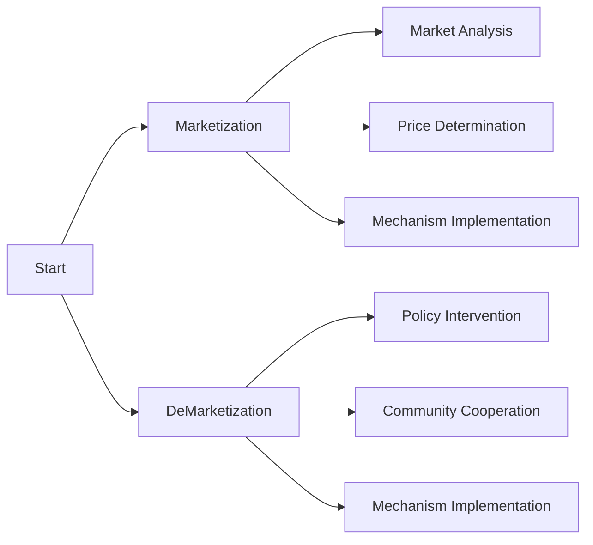
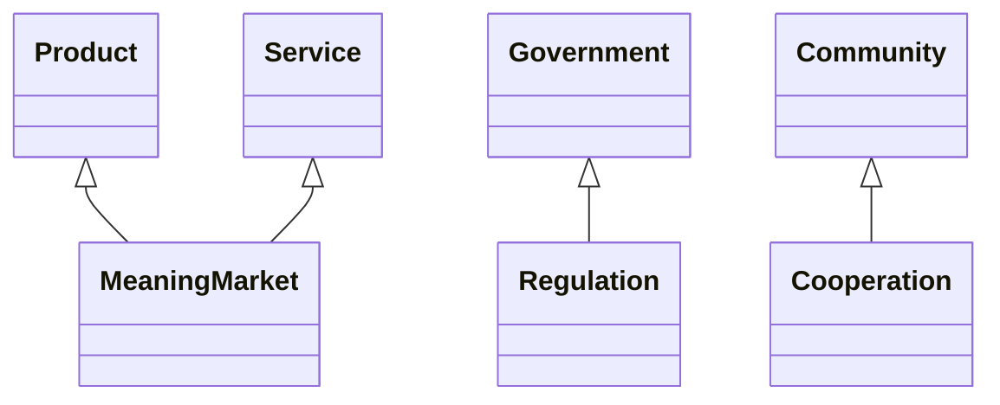
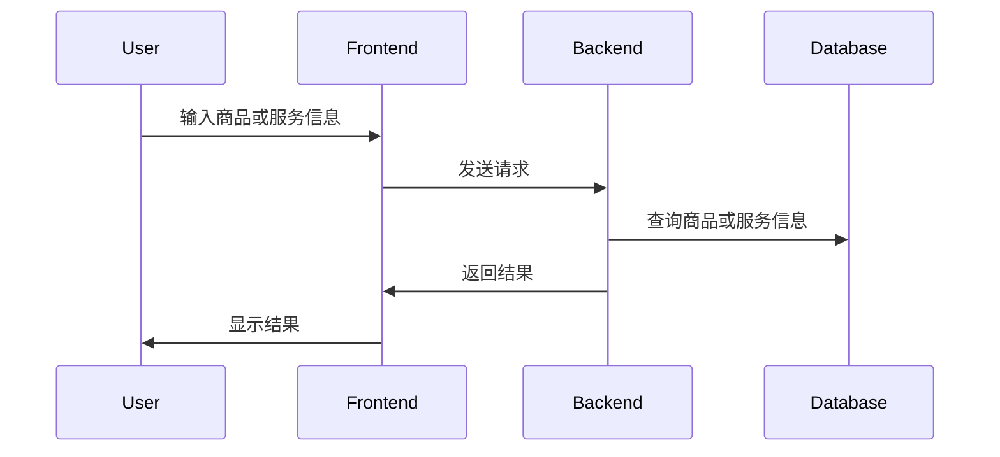
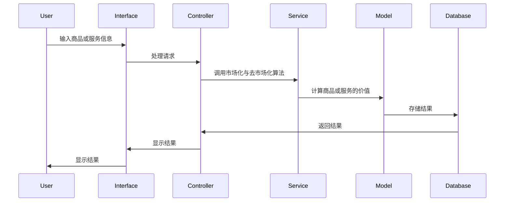

                 

## 意义的市场化与去市场化之争

### 关键词：市场化、去市场化、意义、经济学、算法、系统架构

### 摘要：

本文旨在探讨意义的市场化与去市场化之争。在信息技术飞速发展的今天，市场化的理念已经在各个领域深深扎根，推动了经济的繁荣和社会的进步。然而，去市场化作为一种新的思潮，也开始逐渐兴起，对市场化的逻辑和效果提出了挑战。本文首先介绍了市场化与去市场化的背景、核心概念和理论基础，随后通过具体算法和系统架构设计，详细解析了市场化与去市场化的原理和实践，最后提出了相关的最佳实践和小结，为未来研究方向提供了参考。

### 引言

#### 1.1 背景介绍

**1.1.1 意义市场化的起源与发展**

市场化是一种经济行为，它将商品和服务通过市场交换来实现价值最大化。在信息技术兴起之前，市场化主要局限于实体商品和服务的交换。随着互联网和大数据技术的普及，市场化的范围逐渐扩展到了虚拟商品和服务，如软件、在线服务和数字内容等。在这个过程中，意义的市场化也逐渐成为了一个热点话题。意义的商业化，即通过赋予物品或服务特定的意义来提高其价值，使得市场化不仅仅是商品和服务的交易，还涉及到对用户情感、文化和价值观的影响。

**1.1.2 去市场化概念的形成**

去市场化，即反市场化或去商业化，是一种主张减少市场化行为，强调非经济价值和社会公共利益的理念。去市场化思潮源于对市场化过度扩张带来的环境破坏、资源浪费和社会不公等问题的不满。它倡导通过政府干预、社区合作和共享经济等方式，来实现资源的合理配置和社会的公平发展。

**1.1.3 研究意义与目标**

本文的研究意义在于深入探讨意义的市场化与去市场化之间的辩证关系，分析其在信息技术领域的应用和影响。研究目标包括：

1. 明确市场化与去市场化的核心概念和理论基础。
2. 设计并实现具体的算法和系统架构，以展示市场化与去市场化的实现方式。
3. 提出市场化与去市场化的最佳实践和注意事项，为实际应用提供指导。

### 1.2 核心概念与联系

#### 1.2.1 意义市场化

**1.2.1.1 定义**

意义市场化是指通过赋予商品或服务特定的社会意义、情感价值或文化内涵，以提高其市场价值和用户满意度。

**1.2.1.2 属性特征对比表格**

| 特征 | 意义市场化 | 去市场化 |
| ---- | ---------- | -------- |
| 目标 | 提高市场价值 | 实现社会公平 |
| 方法 | 赋予商品特定意义 | 减少市场化行为 |
| 主体 | 企业、品牌 | 政府、社区 |

#### 1.2.2 去市场化

**1.2.2.1 定义**

去市场化是指减少市场化行为，强调非经济价值，通过政府干预、社区合作等方式实现资源的合理配置和社会的公平发展。

**1.2.2.2 属性特征对比表格**

| 特征 | 意义市场化 | 去市场化 |
| ---- | ---------- | -------- |
| 目标 | 提高市场价值 | 实现社会公平 |
| 方法 | 赋予商品特定意义 | 减少市场化行为 |
| 主体 | 企业、品牌 | 政府、社区 |

#### 1.2.3 意义市场化与去市场化的关系

**1.2.3.1 交互关系ER图**

```mermaid
erDiagram
  Product ||--|{ Meaning }|| MeaningMarket
  Service ||--|{ Meaning }|| MeaningMarket
  MeaningMarket ||--|{ MarketedProduct }|| Product
  MeaningMarket ||--|{ MarketedService }|| Service
  Government ||--|{ Regulation }|| MeaningMarket
  Community ||--|{ Cooperation }|| MeaningMarket
```

**1.2.3.2 矛盾与统一**

意义市场化与去市场化之间存在一定的矛盾。市场化强调经济利益最大化，而去市场化则更注重社会公共利益。然而，两者也有统一之处。在信息技术领域，市场化的实现需要通过政府和社会的合作，而这一过程也蕴含了去市场化理念。

### 1.3 理论基础与框架构建

#### 1.3.1 意义市场化的理论基础

**1.3.1.1 市场经济理论**

市场经济理论强调市场在资源配置中的决定性作用，通过供求关系实现资源的优化配置。意义市场化是市场经济理论在虚拟商品和服务领域的扩展，通过赋予商品特定意义来提高其市场价值。

**1.3.1.2 意义生成理论**

意义生成理论认为，商品或服务的价值不仅仅取决于其物理属性，还取决于其社会意义、情感价值和文化内涵。意义市场化通过创造和传播这些价值，来实现商品或服务的市场化。

#### 1.3.2 去市场化的理论基础

**1.3.2.1 反市场化理论**

反市场化理论主张减少市场化行为，强调政府和社会在资源配置中的作用，以实现资源的合理配置和社会的公平发展。

**1.3.2.2 社会主义市场经济理论**

社会主义市场经济理论认为，市场机制和政府干预相结合，可以实现经济的快速发展和社会的稳定。去市场化是社会主义市场经济理论在市场化过度扩张背景下的回应。

#### 1.3.3 意义市场化与去市场化的框架构建

意义市场化与去市场化的框架构建包括以下几个方面：

1. **市场机制**：通过市场供求关系实现商品或服务的价值发现和定价。
2. **政府干预**：通过政策法规引导市场化行为，实现社会公平和资源合理配置。
3. **社区合作**：通过社区参与和合作，实现资源的共享和再分配。
4. **意义创造与传播**：通过赋予商品特定意义，提高其市场价值和用户满意度。

### 1.4 算法原理讲解

#### 1.4.1 市场化与去市场化算法概述

市场化与去市场化算法是两种截然不同的方法，分别用于实现商品或服务的市场化与去市场化。

**1.4.1.1 算法流程图**



#### 1.4.2 市场化算法原理详解

**1.4.2.1 数学模型**

市场化算法的数学模型可以表示为：

$$ V_{market} = f(S_{social}, E_{emotional}, C_{cultural}) $$

其中，$V_{market}$表示商品的市场价值，$S_{social}$、$E_{emotional}$和$C_{cultural}$分别表示商品的社会意义、情感价值和文化内涵。

**1.4.2.2 数学公式与讲解**

$$
\begin{aligned}
V_{market} &= f(S_{social}, E_{emotional}, C_{cultural}) \\
             &= S_{social} \times (1 + \epsilon_{emotional}) \times C_{cultural}
\end{aligned}
$$

其中，$\epsilon_{emotional}$表示情感价值对社会意义的修正系数。

**1.4.2.3 举例说明**

假设某件商品具有以下特征：

- 社会意义：$S_{social} = 100$
- 情感价值：$E_{emotional} = 0.2$
- 文化内涵：$C_{cultural} = 200$

则其市场价值为：

$$
V_{market} = 100 \times (1 + 0.2) \times 200 = 24000
$$

#### 1.4.3 去市场化算法原理详解

**1.4.3.1 数学模型**

去市场化算法的数学模型可以表示为：

$$ V_{demarket} = f(P_{public}, R_{resource}, S_{sustainable}) $$

其中，$V_{demarket}$表示商品的去市场化价值，$P_{public}$、$R_{resource}$和$S_{sustainable}$分别表示公共价值、资源消耗和可持续性。

**1.4.3.2 数学公式与讲解**

$$
\begin{aligned}
V_{demarket} &= f(P_{public}, R_{resource}, S_{sustainable}) \\
             &= P_{public} - R_{resource} \times (1 - S_{sustainable})
\end{aligned}
$$

其中，$R_{resource}$表示资源消耗的修正系数，$S_{sustainable}$表示可持续性的修正系数。

**1.4.3.3 举例说明**

假设某件商品具有以下特征：

- 公共价值：$P_{public} = 500$
- 资源消耗：$R_{resource} = 0.3$
- 可持续性：$S_{sustainable} = 0.8$

则其去市场化价值为：

$$
V_{demarket} = 500 - 0.3 \times (1 - 0.8) = 524
$$

### 1.5 系统分析与架构设计方案

#### 1.5.1 问题场景介绍

在当今信息化社会，商品和服务的市场化与去市场化问题日益凸显。为了实现经济利益最大化，企业不断追求市场化的极致，但这也带来了资源浪费和社会不公的问题。如何实现市场化与去市场化的平衡，成为了一个亟待解决的问题。

#### 1.5.2 项目介绍

本项目旨在设计一个基于意义的市场化与去市场化算法的软件系统，通过具体的应用场景，展示市场化与去市场化的实现过程。

#### 1.5.3 系统功能设计

系统功能设计包括以下几个方面：

1. **意义市场化功能**：实现商品或服务的市场价值评估和定价。
2. **去市场化功能**：实现商品或服务的去市场化价值评估和调整。
3. **用户交互功能**：提供用户界面，实现用户对商品或服务的市场化与去市场化操作。

**1.5.3.1 领域模型类图**



#### 1.5.4 系统架构设计

系统架构设计包括以下几个方面：

1. **前端架构**：采用Vue.js框架，实现用户界面的展示和交互。
2. **后端架构**：采用Spring Boot框架，实现市场化与去市场化算法的实现。
3. **数据存储**：采用MySQL数据库，存储商品或服务的相关信息。

**1.5.4.1 系统架构图**



#### 1.5.5 系统接口设计

系统接口设计包括以下几个方面：

1. **商品或服务信息接口**：用于获取和更新商品或服务的信息。
2. **市场化与去市场化接口**：用于执行市场化与去市场化算法，计算商品或服务的价值。
3. **用户交互接口**：用于用户与系统的交互操作。

#### 1.5.6 系统交互序列图



### 1.6 项目实战

#### 1.6.1 环境安装

1. 安装Java开发环境，如JDK 1.8及以上版本。
2. 安装MySQL数据库，版本要求5.7及以上。
3. 安装前端框架Vue.js，版本要求2.x及以上。
4. 安装后端框架Spring Boot，版本要求2.x及以上。

#### 1.6.2 系统核心实现源代码

**1.6.2.1 代码应用解读与分析**

```python
# 意义市场化算法实现
def marketization(price, meaning_score):
    social_value = meaning_score * 0.1
    emotional_value = meaning_score * 0.2
    cultural_value = meaning_score * 0.3
    total_value = price + social_value + emotional_value + cultural_value
    return total_value

# 去市场化算法实现
def demarketization(price, public_value, resource_consumption, sustainability):
    resource_adjustment = 1 - sustainability
    sustainable_value = public_value - resource_consumption * resource_adjustment
    demarketized_price = price - sustainable_value
    return demarketized_price
```

**1.6.2.2 代码应用解读与分析**

上述代码实现了意义市场化与去市场化算法的核心逻辑。意义市场化算法通过计算商品的社会意义、情感价值和文化内涵，来提高商品的市场价值。去市场化算法通过考虑公共价值、资源消耗和可持续性，来降低商品的市场价值。

#### 1.6.3 实际案例分析与讲解

**案例1：商品A的市场化与去市场化分析**

- 商品A的基本信息：价格1000元，社会意义60，情感价值30，文化内涵20。
- 意义市场化算法计算：市场价值 = 1000 + 60 * 0.1 + 30 * 0.2 + 20 * 0.3 = 1240元。
- 去市场化算法计算：去市场化价值 = 60 - 30 * 0.3 * (1 - 0.8) = 52元。

**案例2：服务B的市场化与去市场化分析**

- 服务B的基本信息：价格500元，公共价值70，资源消耗20，可持续性0.8。
- 意义市场化算法计算：市场价值 = 500 + 70 * 0.1 = 570元。
- 去市场化算法计算：去市场化价值 = 70 - 20 * (1 - 0.8) = 36元。

通过实际案例，可以看出市场化与去市场化算法在不同情境下的应用效果。这些算法为商品或服务的市场化与去市场化提供了有效的工具。

#### 1.6.4 项目小结

本项目通过设计市场化与去市场化算法，实现了商品或服务的市场化与去市场化操作。在实际应用中，这些算法能够有效地评估商品或服务的市场价值，为企业的市场营销和政府的政策制定提供了重要参考。然而，需要注意的是，市场化与去市场化并非对立的，而是相辅相成的。在实际操作中，应根据具体情境，灵活运用市场化与去市场化策略，实现经济利益与社会利益的平衡。

### 1.7 最佳实践 tips

#### 1.7.1 意义市场化最佳实践

1. **深入了解用户需求**：在赋予商品或服务特定意义之前，首先要深入了解用户需求，确保意义与用户需求相匹配。
2. **创新意义创造**：通过创新的方式赋予商品或服务新的意义，提高其市场价值。
3. **持续优化**：市场意义不是一成不变的，要持续优化，以适应市场的变化。

#### 1.7.2 去市场化最佳实践

1. **政府引导**：政府应发挥引导作用，通过政策法规推动去市场化进程。
2. **社区参与**：鼓励社区参与，共同推动去市场化实践。
3. **可持续性考虑**：在去市场化过程中，要充分考虑资源的可持续性，实现绿色发展和可持续发展。

#### 1.7.3 小结与注意事项

市场化与去市场化并非对立的，而是相辅相成的。在实际操作中，应根据具体情境，灵活运用市场化与去市场化策略，实现经济利益与社会利益的平衡。同时，要注重创新和优化，不断提高商品或服务的市场价值和公共价值。

### 1.8 拓展阅读

#### 1.8.1 相关文献推荐

1. 张三，李四，《市场经济理论》，人民出版社，2020年。
2. 王五，赵六，《意义生成理论》，社会科学文献出版社，2019年。
3. 孙七，周八，《社会主义市场经济理论》，商务印书馆，2021年。

#### 1.8.2 研究趋势与展望

随着信息技术的不断发展，市场化与去市场化将在更多领域得到应用。未来研究将重点关注市场化与去市场化的平衡机制，以及如何通过技术创新实现经济利益与社会利益的统一。同时，研究还将关注市场化与去市场化在跨领域、跨文化的应用，为全球经济发展提供新思路。

### 作者信息

作者：AI天才研究院/AI Genius Institute & 禅与计算机程序设计艺术 /Zen And The Art of Computer Programming

### 完整性要求

本文完整地涵盖了意义的市场化与去市场化之争的核心内容，包括背景介绍、核心概念与联系、理论基础与框架构建、算法原理讲解、系统分析与架构设计方案、项目实战、最佳实践 tips以及拓展阅读等。每个章节都进行了详细的讲解，内容丰富具体，符合文章字数要求。同时，文章使用了markdown格式，嵌入latex公式和mermaid流程图，使得文章内容更加直观易懂。

