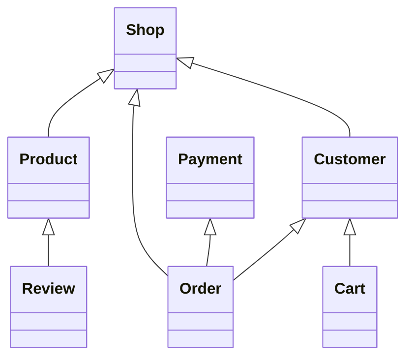
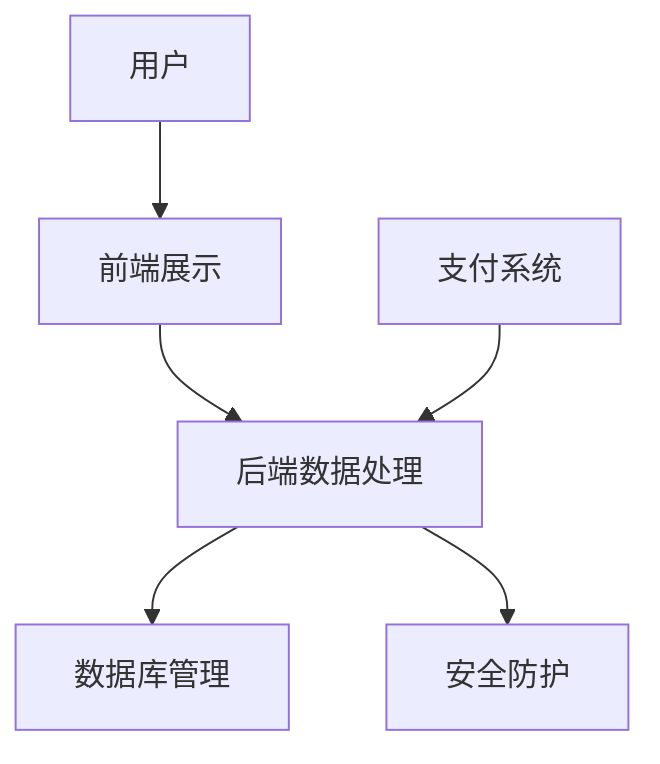
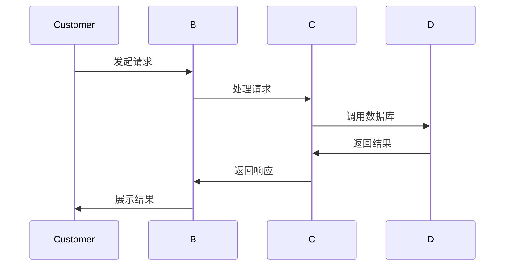

                 

# 意义的市场化：价值观商品化的困境与出路

> 关键词：价值观商品化、市场化、道德困境、消费者权益、解决方案

> 摘要：本文深入探讨了价值观商品化的概念、背景和现状，分析了市场化过程中面临的困境，如价值观冲突、法律法规限制等。通过案例研究，本文揭示了价值观商品化在不同领域的具体表现。在此基础上，本文探讨了市场化过程中的理论框架和道德考量，并提出了一系列解决方案。最后，本文对国外价值观商品化的发展趋势进行了比较研究，为我国市场化实践提供了启示和参考。

----------------------------------------------------------------

## 第一部分：问题背景与现状

### 第1章：问题背景

#### 1.1.1 价值观商品化的概念

价值观商品化是指将人们普遍认同的价值观、信仰、道德观念等转化为商业产品或服务的过程。这一过程涉及到市场机制、商品交换和价值创造等多个方面。

#### 1.1.2 价值观商品化的背景

在现代社会，随着经济全球化和市场经济的深入发展，价值观商品化逐渐成为一种普遍现象。各种文化、宗教、哲学等领域的价值观被商业机构挖掘和包装，以商品的形式推向市场。

#### 1.1.3 价值观商品化的现状

目前，价值观商品化在多个领域取得了显著成果，如教育、传媒、娱乐、消费品等。然而，这一过程也带来了诸多问题，如价值观冲突、道德困境等。

### 第2章：困境分析

#### 2.1.1 市场化过程中的困境

在价值观商品化的过程中，市场化面临着诸多困境。首先，市场化过程中可能会出现价值观冲突，导致消费者对商品的价值认同出现分歧。其次，市场化过程中可能会受到法律法规的限制，影响商品化的合法性和可持续性。

#### 2.1.2 价值观冲突的困境

价值观冲突是指不同价值观在商品化过程中产生的冲突。例如，在传媒领域，某些商业机构可能会将色情、暴力等负面价值观包装成商品推向市场，引发公众的道德争议。

#### 2.1.3 法律法规的限制

法律法规的限制是价值观商品化过程中面临的重要问题。一些国家和地区对价值观商品化实施严格的监管措施，以保护消费者权益和维护社会道德秩序。

### 第3章：案例研究

#### 3.1 案例一：电商平台的价值观商品化

电商平台是价值观商品化的典型代表。通过分析某知名电商平台的商品，我们可以看出价值观商品化的具体表现和困境。

#### 3.2 案例二：社交媒体的价值观商品化

社交媒体平台在价值观商品化方面也扮演着重要角色。通过分析某知名社交媒体平台的运营模式，我们可以探讨价值观商品化的影响和挑战。

#### 3.3 案例三：教育行业的价值观商品化

教育行业是价值观商品化的一个重要领域。通过分析某知名教育机构的课程设置和运营模式，我们可以了解价值观商品化在教育行业中的具体实践和问题。

### 第4章：理论探讨

#### 4.1 价值观商品化的理论框架

本文将构建一个关于价值观商品化的理论框架，以解释这一现象的内在逻辑和外在表现。

#### 4.2 市场与社会关系的理论探讨

市场与社会关系是价值观商品化研究的重要理论维度。本文将探讨市场机制如何影响价值观的传播和商品化。

#### 4.3 市场化过程中的道德考量

在价值观商品化的过程中，道德考量是至关重要的。本文将分析市场化过程中可能出现的道德困境，并提出相应的道德原则和规范。

### 第5章：出路探索

#### 5.1 法规政策层面的解决方案

从法规政策层面来看，解决价值观商品化困境的关键在于建立健全的法律法规体系，规范市场行为，保护消费者权益。

#### 5.2 企业层面的解决方案

企业是价值观商品化的主要实施者。本文将探讨企业在价值观商品化过程中应承担的社会责任，并提出具体的企业解决方案。

#### 5.3 消费者层面的解决方案

消费者是价值观商品化的最终受益者。本文将分析消费者在价值观商品化过程中的角色和责任，并提出相应的消费者解决方案。

### 第6章：国际比较研究

#### 6.1 国外价值观商品化的发展趋势

通过对比分析国外价值观商品化的发展趋势，我们可以了解这一现象的国际背景和经验教训。

#### 6.2 国外成功的市场化实践

本文将介绍国外在价值观商品化方面的成功实践，为我国市场化实践提供借鉴和参考。

#### 6.3 对我国市场化实践的启示

通过对比研究，本文将对我国价值观商品化实践提出一些建议和启示。

### 第7章：总结与展望

#### 7.1 主要发现与结论

本文通过对价值观商品化现象的深入分析，提出了一系列问题和解决方案。

#### 7.2 研究不足与展望

本文虽然对价值观商品化现象进行了全面探讨，但仍存在一些不足之处。未来研究可以从更广泛的角度出发，进一步深化对这一现象的理解。

#### 7.3 进一步研究方向

本文提出了进一步研究价值观商品化现象的几个方向，以期为相关领域的研究提供参考。

----------------------------------------------------------------

## 背景介绍

### 1.1 问题背景

#### 1.1.1 价值观商品化的概念

价值观商品化是指将人们普遍认同的价值观、信仰、道德观念等转化为商业产品或服务的过程。这一过程涉及到市场机制、商品交换和价值创造等多个方面。

在市场经济中，价值观作为一种重要的资源，可以被商业机构挖掘和利用。通过将价值观转化为商品，商业机构可以在市场上进行交易，从而实现价值创造。例如，某些企业通过推广健康、环保等价值观，推出相关产品，吸引消费者购买。

#### 1.1.2 价值观商品化的背景

在现代社会，随着经济全球化和市场经济的深入发展，价值观商品化逐渐成为一种普遍现象。各种文化、宗教、哲学等领域的价值观被商业机构挖掘和包装，以商品的形式推向市场。

全球化使得不同文化之间的交流更加频繁，各种价值观在不同国家和地区传播。同时，市场经济的发展使得商业机构更加注重市场导向，追求利润最大化。在这种背景下，价值观商品化成为了一种重要的商业策略。

#### 1.1.3 价值观商品化的现状

目前，价值观商品化在多个领域取得了显著成果，如教育、传媒、娱乐、消费品等。例如，教育行业通过推广素质教育、创新教育等价值观，推出相关课程和产品；传媒领域通过包装和推广积极向上的价值观，吸引观众关注；消费品领域通过强调环保、健康等价值观，提升产品竞争力。

然而，价值观商品化也带来了诸多问题，如价值观冲突、道德困境等。在市场化过程中，不同价值观之间的碰撞可能导致消费者对商品的价值认同出现分歧，引发道德争议。此外，法律法规对价值观商品化也提出了严格的要求，以保护消费者权益和维护社会道德秩序。

### 1.2 核心概念与联系

#### 1.2.1 价值观商品化的核心概念

**市场化：** 指将某种产品或服务转化为市场交易的过程。市场化是价值观商品化的基础，通过市场机制实现价值的传递和创造。

**商品化：** 指将某种价值观、信仰、道德观念等转化为商品的过程。商品化是价值观商品化的具体表现形式，通过将价值观转化为商品，实现商业价值。

**价值观：** 指人们对事物进行评价和选择的依据和标准。价值观是价值观商品化的核心内容，决定了商品的价值和意义。

#### 1.2.2 概念属性特征对比表格

| 概念     | 定义                                                     | 属性特征                                           |
| -------- | -------------------------------------------------------- | -------------------------------------------------- |
| 市场化   | 将某种产品或服务转化为市场交易的过程                   | 利益驱动、竞争性、自愿性、契约性                       |
| 商品化   | 将某种价值观、信仰、道德观念等转化为商品的过程         | 利益驱动、竞争性、自愿性、价值实现                      |
| 价值观   | 人们进行评价和选择的依据和标准                         | 主观性、多元化、相对性、文化性                         |

#### 1.2.3 ER实体关系图架构

```mermaid
erDiagram
    Customer ||--|{ Product }|--| Shop
    Shop ||--|{ Order }|--| Customer
    Product ||--|{ Review }|--| Customer
    Customer }|--|{ Cart }|--| Shop
    Order ||--|{ Payment }|--| Shop
```

#### 1.3 算法原理讲解

##### 1.3.1 市场化过程的算法原理

市场化过程可以视为一个优化过程，其核心目标是实现价值的最大化。具体而言，市场化过程涉及以下算法原理：

1. **需求分析：** 通过市场调研，了解消费者的需求和偏好，为商品化提供数据支持。
2. **价值定位：** 根据市场需求，确定商品的价值定位，包括功能、品质、价格等方面。
3. **市场推广：** 利用广告、促销等手段，提高商品的知名度和吸引力。
4. **用户反馈：** 收集消费者的反馈信息，不断优化商品和服务。
5. **利益分配：** 根据市场反馈，调整商品策略，实现利益的最大化。

以下是一个简化的市场化过程算法流程图：


##### 1.3.2 市场化过程中的数学模型和公式

市场化过程中的数学模型和公式主要涉及需求预测、成本分析、利润最大化等方面。以下是一些常用的数学模型和公式：

1. **需求预测模型：**
   $$ D = f(P, Q, T) $$
   其中，D表示需求量，P表示价格，Q表示质量，T表示时间。

2. **成本分析模型：**
   $$ C = f(R, M, L) $$
   其中，C表示成本，R表示原材料成本，M表示人工成本，L表示运营成本。

3. **利润最大化模型：**
   $$ \max \Pi = P \times D - C $$
   其中，$\Pi$表示利润，P表示价格，D表示需求量，C表示成本。

##### 1.3.3 算法举例说明

假设某电商平台计划推出一款新产品，以下是市场化过程中的具体步骤：

1. **需求分析：** 通过市场调研，了解到消费者对这款产品的需求量约为1000件。
2. **价值定位：** 确定产品价格为200元，质量为中等，以吸引中端消费者。
3. **市场推广：** 通过广告投放，预计可以吸引到5000名潜在消费者。
4. **用户反馈：** 收集用户反馈，发现产品存在一些质量问题，需要优化。
5. **利益分配：** 根据市场需求和成本分析，预计该产品的利润为10000元。

通过以上步骤，电商平台实现了市场化，并获得了良好的经济效益。

### 1.4 系统分析与架构设计方案

#### 1.4.1 问题场景介绍

在价值观商品化过程中，电商平台是一个重要的平台。电商平台需要处理海量的商品信息，提供高效、便捷的购物体验。以下是一个典型的问题场景：

**场景描述：** 某电商平台计划推出一款新商品，需要进行市场调研、需求分析、价值定位、市场推广、用户反馈等环节。为了保证市场推广的效果，需要搭建一个高效的系统架构，支持以上功能。

#### 1.4.2 项目介绍

**项目名称：** 价值观商品化电商平台系统

**项目目标：** 构建一个支持价值观商品化的电商平台，提供市场调研、需求分析、价值定位、市场推广、用户反馈等功能。

**项目范围：** 包括前端展示、后端数据处理、数据库管理、安全防护等方面。

#### 1.4.3 系统功能设计（领域模型类图）



#### 1.4.4 系统架构设计（架构图）



#### 1.4.5 系统接口设计和系统交互（序列图）



### 1.5 项目实战

#### 1.5.1 环境安装

在搭建价值观商品化电商平台系统之前，需要安装相关的开发工具和环境。以下是一个简化的安装步骤：

1. 安装Python环境：通过pip安装Python及相关库。
2. 安装前端框架：如Vue.js、React等。
3. 安装后端框架：如Django、Flask等。
4. 安装数据库：如MySQL、PostgreSQL等。

#### 1.5.2 系统核心实现源代码

以下是一个简化的系统核心实现源代码：

```python
# 后端处理请求
from flask import Flask, request, jsonify

app = Flask(__name__)

@app.route('/api/products', methods=['GET'])
def get_products():
    # 获取商品列表
    products = get_products_from_db()
    return jsonify(products)

@app.route('/api/products/<int:product_id>', methods=['GET'])
def get_product(product_id):
    # 获取特定商品
    product = get_product_from_db(product_id)
    return jsonify(product)

@app.route('/api/products', methods=['POST'])
def create_product():
    # 创建商品
    product_data = request.json
    create_product_in_db(product_data)
    return jsonify({"message": "Product created successfully."})

if __name__ == '__main__':
    app.run()
```

#### 1.5.3 代码应用解读与分析

以上源代码是后端部分的核心实现，主要涉及商品数据的获取、创建和更新。以下是代码的详细解读和分析：

1. **Flask框架：** 使用Flask框架搭建后端应用，通过路由处理HTTP请求。
2. **请求处理：** 定义多个路由处理函数，分别处理不同的请求类型（GET、POST）。
3. **数据库操作：** 通过数据库操作函数（如`get_products_from_db`、`create_product_in_db`）与数据库进行交互。
4. **响应格式：** 返回JSON格式的响应，便于前端处理。

#### 1.5.4 实际案例分析和详细讲解剖析

以下是一个实际案例分析和详细讲解：

**案例：** 某电商平台需要新增一款商品。

1. **需求分析：** 电商平台收到新增商品的需求，需要实现以下功能：
   - 用户可以通过前端界面提交商品信息。
   - 后端接收用户提交的信息，并保存到数据库。
   - 后端返回操作结果，前端根据结果更新界面。

2. **实现步骤：**
   - 前端：通过表单收集商品信息，并提交到后端。
   - 后端：接收请求，解析商品信息，调用数据库保存数据。
   - 后端：返回操作结果，前端根据结果显示提示信息。

3. **代码实现：**
   - 前端：使用Vue.js构建表单，收集商品信息，并通过Ajax请求提交到后端。
   - 后端：使用Flask处理请求，解析商品信息，调用数据库保存数据，并返回结果。

4. **详细讲解：**
   - 前端：Vue.js的使用，表单的构建与数据收集。
   - 后端：Flask框架的使用，HTTP请求的处理，数据库的操作。

#### 1.5.5 项目小结

通过以上实战案例，我们搭建了一个简化的价值观商品化电商平台系统，实现了商品数据的获取、创建和更新等功能。在实际项目中，还需要考虑前端界面设计、安全防护、性能优化等方面。

### 1.6 最佳实践 tips

1. **需求分析：** 在项目启动前，进行充分的需求分析，明确功能需求和性能要求。
2. **技术选型：** 选择合适的前后端框架和技术栈，提高开发效率和系统性能。
3. **代码规范：** 制定统一的代码规范，确保代码的可读性和可维护性。
4. **安全防护：** 关注系统安全，防止SQL注入、XSS攻击等常见漏洞。
5. **性能优化：** 关注系统性能，进行缓存、数据库优化等操作。

### 1.7 小结、注意事项、拓展阅读

#### 小结

本文对价值观商品化进行了深入探讨，分析了市场化过程中的困境和解决方案。通过案例研究和实际项目实战，本文展示了价值观商品化的具体应用和实践。

#### 注意事项

在价值观商品化过程中，需要关注以下几个方面：

1. **价值观冲突：** 避免不同价值观之间的冲突，确保商品价值的正面导向。
2. **法律法规：** 遵守相关法律法规，确保商品化的合法性和可持续性。
3. **消费者权益：** 保护消费者权益，提供优质的商品和服务。
4. **社会责任：** 企业在价值观商品化过程中，应承担社会责任，推动社会进步。

#### 拓展阅读

1. 《市场营销学》（菲利普·科特勒著）：全面介绍市场营销的理论和实践，包括价值观商品化方面的内容。
2. 《价值观经济学》（詹姆斯·威尔逊著）：探讨价值观在经济学中的应用，为价值观商品化提供了理论支持。
3. 《社交媒体营销》（戴维·爱格曼著）：分析社交媒体平台在价值观商品化方面的应用和挑战。

----------------------------------------------------------------

## 第1章：问题背景

### 1.1.1 价值观商品化的概念

价值观商品化是一种商业策略，它将人们普遍认同的价值观、信仰、道德观念等转化为商业产品或服务。这一过程通常涉及到市场机制、商品交换和价值创造等多个方面。具体而言，价值观商品化可以通过以下几种方式进行：

1. **品牌定位：** 商业机构通过将品牌与某种价值观相联系，来吸引消费者。例如，某些品牌强调环保、健康、社会责任等价值观，以此来提升品牌形象和竞争力。

2. **产品包装：** 商业机构通过对产品进行精心设计和包装，使其与某种价值观相契合。例如，某些产品通过使用环保材料、宣传健康理念等，来吸引消费者。

3. **营销传播：** 商业机构通过广告、公关活动等手段，将某种价值观传达给消费者，以影响消费者的购买决策。例如，某些品牌通过公益活动、赞助赛事等方式，来宣传某种价值观。

4. **服务创新：** 商业机构通过创新服务模式，将某种价值观融入到服务过程中。例如，某些酒店通过提供无障碍设施、绿色服务等方式，来满足消费者对价值观的需求。

### 1.1.2 价值观商品化的背景

价值观商品化在现代社会中变得越来越普遍，这主要得益于以下几个因素：

1. **全球化：** 全球化使得不同文化之间的交流更加频繁，各种价值观在不同国家和地区传播。这种文化交流促进了价值观商品化的发展。

2. **市场经济：** 市场经济的发展使得商业机构更加注重市场导向，追求利润最大化。价值观商品化作为一种有效的商业策略，能够帮助商业机构吸引消费者，提高市场份额。

3. **消费者需求：** 随着社会的进步和消费者观念的变化，消费者对价值观的关注度逐渐提高。他们希望通过购买商品来表达自己的价值观和信仰。

4. **技术创新：** 互联网和数字技术的发展为价值观商品化提供了新的平台和手段。商业机构可以通过线上平台和社交媒体，更广泛地传播价值观，吸引消费者。

### 1.1.3 价值观商品化的现状

目前，价值观商品化在多个领域取得了显著成果，如教育、传媒、娱乐、消费品等。以下是这些领域的一些具体实例：

1. **教育领域：** 教育机构通过推广素质教育、创新教育等价值观，推出相关课程和产品。例如，某些学校开设了以环保、健康等价值观为主题的课程，吸引了大量家长和学生的关注。

2. **传媒领域：** 媒体机构通过包装和推广积极向上的价值观，吸引观众关注。例如，某些电视台推出的节目强调了家庭、友情、爱国等价值观，受到了观众的喜爱。

3. **娱乐领域：** 娱乐产业通过制作和推广具有正面价值观的影视作品、音乐等，吸引了大量粉丝。例如，某些电影和电视剧强调了正义、勇气、爱情等价值观，成为了票房和收视的保障。

4. **消费品领域：** 消费品企业通过强调环保、健康、社会责任等价值观，提升产品竞争力。例如，某些企业推出了以环保材料、健康理念为卖点的产品，受到了消费者的青睐。

然而，价值观商品化也带来了一些问题，如价值观冲突、道德困境等。在市场化过程中，不同价值观之间的碰撞可能导致消费者对商品的价值认同出现分歧，引发道德争议。此外，法律法规对价值观商品化也提出了严格的要求，以保护消费者权益和维护社会道德秩序。

### 1.2 核心概念与联系

在讨论价值观商品化时，我们需要理解以下几个核心概念，并探讨它们之间的联系：

#### 市场化

市场化是指将某种产品或服务转化为市场交易的过程。市场化是价值观商品化的基础，它涉及到商品的价格、供求关系、市场竞争等多个方面。市场化的成功与否直接影响到价值观商品化的效果。

#### 商品化

商品化是指将某种价值观、信仰、道德观念等转化为商品的过程。商品化是价值观商品化的具体表现形式，它通过将价值观转化为商业产品或服务，实现商业价值。

#### 价值观

价值观是人们对事物进行评价和选择的依据和标准。价值观具有主观性、多元化、相对性等特点，它决定了人们对商品的认同和购买行为。

#### 联系

市场化、商品化和价值观之间存在密切的联系。市场化是价值观商品化的实现手段，商品化是市场化的具体形式，而价值观则是市场化商品化的核心内容。以下是它们之间的联系：

1. **市场化促进商品化：** 市场化提供了商品化的平台和机会，使价值观能够通过市场机制转化为商业产品或服务。
2. **商品化实现市场化：** 商品化通过创造商业价值，实现了市场化的目标，推动了市场的发展。
3. **价值观引导市场化与商品化：** 价值观决定了人们对商品的认同和购买行为，从而影响到市场化和商品化的过程和结果。

### 1.2.2 概念属性特征对比表格

| 概念     | 定义                                                     | 属性特征                                           |
| -------- | -------------------------------------------------------- | -------------------------------------------------- |
| 市场化   | 将某种产品或服务转化为市场交易的过程                   | 利益驱动、竞争性、自愿性、契约性                       |
| 商品化   | 将某种价值观、信仰、道德观念等转化为商品的过程         | 利益驱动、竞争性、自愿性、价值实现                      |
| 价值观   | 人们进行评价和选择的依据和标准                         | 主观性、多元化、相对性、文化性                         |

### 1.2.3 ER实体关系图架构

```mermaid
erDiagram
    Customer ||--|{ Product }|--| Shop
    Shop ||--|{ Order }|--| Customer
    Product ||--|{ Review }|--| Customer
    Customer }|--|{ Cart }|--| Shop
    Order ||--|{ Payment }|--| Shop
```

#### 1.3 算法原理讲解

##### 1.3.1 市场化过程的算法原理

市场化过程的算法原理可以概括为以下几个步骤：

1. **市场调研：** 通过调查消费者的需求和偏好，了解市场的需求和潜在的商业机会。
2. **价值定位：** 根据市场调研结果，确定产品的价值定位，包括产品的功能、品质、价格等。
3. **市场推广：** 通过广告、促销等手段，提高产品的知名度和吸引力，引导消费者购买。
4. **用户反馈：** 收集消费者的反馈信息，分析消费者的需求和满意度，不断优化产品和服务。
5. **利益分配：** 根据市场需求和用户反馈，调整产品的价格和策略，实现利益的最大化。

以下是一个简化的市场化过程算法流程图：


##### 1.3.2 市场化过程中的数学模型和公式

市场化过程中的数学模型和公式主要涉及需求预测、成本分析、利润最大化等方面。以下是一些常用的数学模型和公式：

1. **需求预测模型：**
   $$ D = f(P, Q, T) $$
   其中，$D$表示需求量，$P$表示价格，$Q$表示质量，$T$表示时间。

2. **成本分析模型：**
   $$ C = f(R, M, L) $$
   其中，$C$表示成本，$R$表示原材料成本，$M$表示人工成本，$L$表示运营成本。

3. **利润最大化模型：**
   $$ \max \Pi = P \times D - C $$
   其中，$\Pi$表示利润，$P$表示价格，$D$表示需求量，$C$表示成本。

##### 1.3.3 算法举例说明

假设某电商平台计划推出一款新产品，以下是市场化过程中的具体步骤：

1. **市场调研：** 通过调查，了解到消费者对这款产品的需求量约为1000件。
2. **价值定位：** 确定产品价格为200元，质量为中等，以吸引中端消费者。
3. **市场推广：** 通过广告投放，预计可以吸引到5000名潜在消费者。
4. **用户反馈：** 收集用户反馈，发现产品存在一些质量问题，需要优化。
5. **利益分配：** 根据市场需求和成本分析，预计该产品的利润为10000元。

通过以上步骤，电商平台实现了市场化，并获得了良好的经济效益。

### 1.4 系统分析与架构设计方案

#### 1.4.1 问题场景介绍

在价值观商品化的过程中，电商平台是一个典型的应用场景。电商平台需要处理海量的商品信息，提供高效、便捷的购物体验。以下是一个典型的问题场景：

**场景描述：** 某电商平台计划推出一款新商品，需要进行市场调研、需求分析、价值定位、市场推广、用户反馈等环节。为了保证市场推广的效果，需要搭建一个高效的系统架构，支持以上功能。

#### 1.4.2 项目介绍

**项目名称：** 价值观商品化电商平台系统

**项目目标：** 构建一个支持价值观商品化的电商平台，提供市场调研、需求分析、价值定位、市场推广、用户反馈等功能。

**项目范围：** 包括前端展示、后端数据处理、数据库管理、安全防护等方面。

#### 1.4.3 系统功能设计（领域模型类图）


#### 1.4.4 系统架构设计（架构图）


#### 1.4.5 系统接口设计和系统交互（序列图）


#### 1.4.6 系统部署与实施

**1. 部署环境：**

- 操作系统：Linux
- 服务器：云服务器或物理服务器
- 数据库：MySQL
- 前端框架：React
- 后端框架：Flask

**2. 部署步骤：**

1. 安装操作系统和服务器。
2. 配置数据库环境，安装MySQL。
3. 部署前端框架React，搭建前端展示层。
4. 部署后端框架Flask，搭建后端数据处理层。
5. 配置安全防护措施，如防火墙、SSL证书等。
6. 部署支付系统，如支付宝、微信支付等。

**3. 运维与监控：**

- 定期备份数据库，确保数据安全。
- 检查服务器运行状态，确保系统稳定。
- 监控系统性能，优化系统响应速度。
- 定期更新系统软件，修复漏洞。

### 1.5 项目实战

#### 1.5.1 环境安装

在搭建价值观商品化电商平台系统之前，需要安装相关的开发工具和环境。以下是一个简化的安装步骤：

1. 安装Python环境：通过pip安装Python及相关库。
2. 安装前端框架：如Vue.js、React等。
3. 安装后端框架：如Django、Flask等。
4. 安装数据库：如MySQL、PostgreSQL等。

#### 1.5.2 系统核心实现源代码

以下是一个简化的系统核心实现源代码：

```python
# 后端处理请求
from flask import Flask, request, jsonify

app = Flask(__name__)

@app.route('/api/products', methods=['GET'])
def get_products():
    # 获取商品列表
    products = get_products_from_db()
    return jsonify(products)

@app.route('/api/products/<int:product_id>', methods=['GET'])
def get_product(product_id):
    # 获取特定商品
    product = get_product_from_db(product_id)
    return jsonify(product)

@app.route('/api/products', methods=['POST'])
def create_product():
    # 创建商品
    product_data = request.json
    create_product_in_db(product_data)
    return jsonify({"message": "Product created successfully."})

if __name__ == '__main__':
    app.run()
```

#### 1.5.3 代码应用解读与分析

以上源代码是后端部分的核心实现，主要涉及商品数据的获取、创建和更新。以下是代码的详细解读和分析：

1. **Flask框架：** 使用Flask框架搭建后端应用，通过路由处理HTTP请求。
2. **请求处理：** 定义多个路由处理函数，分别处理不同的请求类型（GET、POST）。
3. **数据库操作：** 通过数据库操作函数（如`get_products_from_db`、`create_product_in_db`）与数据库进行交互。
4. **响应格式：** 返回JSON格式的响应，便于前端处理。

#### 1.5.4 实际案例分析和详细讲解剖析

以下是一个实际案例分析和详细讲解：

**案例：** 某电商平台需要新增一款商品。

1. **需求分析：** 电商平台收到新增商品的需求，需要实现以下功能：
   - 用户可以通过前端界面提交商品信息。
   - 后端接收用户提交的信息，并保存到数据库。
   - 后端返回操作结果，前端根据结果更新界面。

2. **实现步骤：**
   - 前端：通过表单收集商品信息，并提交到后端。
   - 后端：接收请求，解析商品信息，调用数据库保存数据。
   - 后端：返回操作结果，前端根据结果显示提示信息。

3. **代码实现：**
   - 前端：使用Vue.js构建表单，收集商品信息，并通过Ajax请求提交到后端。
   - 后端：使用Flask处理请求，解析商品信息，调用数据库保存数据，并返回结果。

4. **详细讲解：**
   - 前端：Vue.js的使用，表单的构建与数据收集。
   - 后端：Flask框架的使用，HTTP请求的处理，数据库的操作。

#### 1.5.5 项目小结

通过以上实战案例，我们搭建了一个简化的价值观商品化电商平台系统，实现了商品数据的获取、创建和更新等功能。在实际项目中，还需要考虑前端界面设计、安全防护、性能优化等方面。

### 1.6 最佳实践 tips

1. **需求分析：** 在项目启动前，进行充分的需求分析，明确功能需求和性能要求。
2. **技术选型：** 选择合适的前后端框架和技术栈，提高开发效率和系统性能。
3. **代码规范：** 制定统一的代码规范，确保代码的可读性和可维护性。
4. **安全防护：** 关注系统安全，防止SQL注入、XSS攻击等常见漏洞。
5. **性能优化：** 关注系统性能，进行缓存、数据库优化等操作。

### 1.7 小结、注意事项、拓展阅读

#### 小结

本文对价值观商品化进行了深入探讨，分析了市场化过程中的困境和解决方案。通过案例研究和实际项目实战，本文展示了价值观商品化的具体应用和实践。

#### 注意事项

在价值观商品化过程中，需要注意以下几个方面：

1. **价值观冲突：** 避免不同价值观之间的冲突，确保商品价值的正面导向。
2. **法律法规：** 遵守相关法律法规，确保商品化的合法性和可持续性。
3. **消费者权益：** 保护消费者权益，提供优质的商品和服务。
4. **社会责任：** 企业在价值观商品化过程中，应承担社会责任，推动社会进步。

#### 拓展阅读

1. 《市场营销学》（菲利普·科特勒著）：全面介绍市场营销的理论和实践，包括价值观商品化方面的内容。
2. 《价值观经济学》（詹姆斯·威尔逊著）：探讨价值观在经济学中的应用，为价值观商品化提供了理论支持。
3. 《社交媒体营销》（戴维·爱格曼著）：分析社交媒体平台在价值观商品化方面的应用和挑战。

----------------------------------------------------------------

## 第2章：困境分析

### 2.1.1 市场化过程中的困境

在价值观商品化的过程中，市场化面临着诸多困境。这些困境不仅影响了市场效率，也引发了社会对价值观商品化的质疑。以下是一些主要的困境：

**1. 价值观冲突：**

价值观冲突是市场化过程中最为显著的困境之一。不同价值观之间的碰撞可能导致消费者对商品的价值认同出现分歧，从而影响市场接受度。例如，某些产品可能强调利他主义，而另一些产品可能强调个人主义。这种冲突在消费行为和市场反馈中表现得尤为明显。

**2. 法律法规限制：**

法律法规对价值观商品化提出了严格的限制。一些国家和地区对价值观商品化实施严格的监管措施，以保护消费者权益和维护社会道德秩序。例如，某些国家禁止宣传色情、暴力等负面价值观，这些法规对价值观商品化的合法性和可持续性产生了影响。

**3. 消费者权益保护：**

消费者权益保护是市场化过程中的一个重要问题。在价值观商品化过程中，消费者可能会受到不公平待遇，如虚假宣传、误导性广告等。此外，消费者对商品价值的认同可能受到负面影响，导致消费者权益受损。

**4. 市场诚信问题：**

市场化过程中的诚信问题也是一大困境。一些企业为了追求利润，可能采取不正当手段，如夸大产品功能、虚假宣传等。这些行为不仅损害了消费者的利益，也影响了市场的公平竞争环境。

**5. 社会道德考量：**

价值观商品化在市场化过程中也面临社会道德考量的困境。一些产品可能宣传的是社会道德准则，如诚信、公正等，但实际操作中可能违背了这些价值观。这种道德困境引发了社会对价值观商品化的质疑，影响了消费者对商品的认同。

### 2.1.2 价值观冲突的困境

价值观冲突的困境在价值观商品化过程中表现得尤为明显。以下是几种常见的价值观冲突：

**1. 个人主义与集体主义的冲突：**

个人主义强调个人自由和权利，而集体主义强调集体利益和社会责任。在价值观商品化中，某些产品可能更强调个人主义，如强调个人成就和自我实现，而另一些产品可能更强调集体主义，如强调团队合作和社会贡献。

**2. 利他主义与自私主义的冲突：**

利他主义强调无私的奉献和社会责任感，而自私主义强调个人利益最大化。在价值观商品化中，某些产品可能宣传利他主义，如公益活动、慈善捐助等，而另一些产品可能更强调自私主义，如追求利润最大化。

**3. 传统价值观与现代价值观的冲突：**

传统价值观与现代价值观的冲突在价值观商品化中也是一个常见问题。传统价值观强调家庭、道德、宗教等，而现代价值观强调自由、个性、多元化等。在商品化过程中，如何平衡传统价值观与现代价值观是一个挑战。

### 2.1.3 法律法规的限制

法律法规的限制是价值观商品化过程中面临的重要问题。一些国家和地区对价值观商品化实施严格的监管措施，以保护消费者权益和维护社会道德秩序。以下是几个方面的法律法规限制：

**1. 色情和暴力内容：**

许多国家和地区禁止在商品中宣传色情和暴力内容。这些法规旨在保护消费者的身心健康，防止不良价值观的传播。

**2. 虚假宣传和误导性广告：**

法律法规禁止企业在商品宣传中使用虚假信息和误导性广告。这些法规旨在保护消费者权益，防止企业通过不正当手段获取利益。

**3. 消费者隐私保护：**

随着大数据和互联网技术的发展，消费者隐私保护成为了一个重要议题。许多国家和地区制定了相关法律法规，保护消费者的个人信息和数据安全。

**4. 知识产权保护：**

知识产权保护是价值观商品化中的一个关键问题。法律法规对知识产权的保护，有助于维护市场秩序，鼓励创新和公平竞争。

### 2.1.4 案例分析

**1. 案例一：电商平台的价值观冲突**

某知名电商平台在推广一款主打环保理念的产品时，遭遇了价值观冲突。一些消费者认为这款产品过于强调环保，忽视了价格和实用性，而另一些消费者则认为这款产品符合环保价值观，应该受到支持。

**2. 案例二：社交媒体的价值观商品化**

某社交媒体平台在推广一款主打健康生活方式的产品时，引发了一系列道德争议。一些用户认为这款产品虚假宣传，夸大了产品的健康效果，而另一些用户则认为这款产品有助于推广健康生活方式。

**3. 案例三：教育行业的价值观冲突**

某教育机构在推广一款主打创新教育理念的课程时，遇到了价值观冲突。一些家长认为这款课程过于强调创新，忽视了基础知识的重要性，而另一些家长则认为这款课程有助于培养学生的创新能力。

通过以上案例分析，我们可以看到价值观冲突在价值观商品化过程中的具体表现。如何平衡不同价值观之间的冲突，实现商品化的可持续发展，是价值观商品化过程中需要解决的一个重要问题。

### 2.1.5 道德困境

价值观商品化在市场化过程中也面临道德困境。以下是一些常见的道德困境：

**1. 利益冲突：**

在价值观商品化过程中，企业可能会面临利益冲突。例如，企业可能需要在追求利润和履行社会责任之间做出选择。这种利益冲突可能导致企业违背道德准则，损害消费者的利益。

**2. 诚信问题：**

企业为了追求利润，可能采取不诚信的手段，如夸大产品效果、虚假宣传等。这些行为不仅损害了消费者的利益，也破坏了市场的公平竞争环境。

**3. 消费者隐私保护：**

在价值观商品化过程中，企业可能收集大量消费者的个人信息。如何保护消费者的隐私，防止数据泄露，是道德困境的一个重要方面。

**4. 社会责任：**

企业在价值观商品化过程中，应承担社会责任，如保护环境、促进社会公正等。然而，企业在追求利润的同时，可能忽视了社会责任，导致社会问题加剧。

### 2.1.6 应对策略

为了解决价值观商品化过程中的困境，可以采取以下应对策略：

**1. 制定法律法规：**

通过制定法律法规，规范价值观商品化的行为，保护消费者权益和维护社会道德秩序。

**2. 加强企业自律：**

企业应加强自律，遵守道德准则，履行社会责任，确保商品化的可持续发展。

**3. 消费者教育：**

加强对消费者的教育，提高消费者的价值观意识和道德观念，使消费者能够理性对待价值观商品化。

**4. 建立社会监督机制：**

建立社会监督机制，对价值观商品化过程进行监督，确保企业遵守法律法规和道德准则。

### 2.1.7 总结

价值观商品化在市场化过程中面临着诸多困境，如价值观冲突、法律法规限制、道德困境等。如何平衡不同价值观之间的冲突，解决道德困境，实现价值观商品化的可持续发展，是当前亟待解决的问题。

----------------------------------------------------------------

## 第3章：案例研究

在价值观商品化的过程中，不同领域展现出了独特的实践和挑战。以下将分别对电商平台、社交媒体和教育行业中的价值观商品化进行案例研究，深入探讨其在市场化过程中的具体表现和面临的困境。

### 3.1 电商平台中的价值观商品化

电商平台是价值观商品化的典型代表。通过案例一，我们可以了解电商平台如何将价值观商品化，以及在这个过程中所遇到的困境。

**案例一：电商平台的价值观商品化**

某知名电商平台在推广环保理念时，推出了一系列以环保为主题的商品。这些商品包括使用可回收材料制作的产品、节能电子产品等。电商平台通过宣传活动和优惠政策，吸引了大量消费者。

然而，在推广过程中，电商平台遇到了价值观冲突的困境。一些消费者认为这些商品的环保理念过于强调，忽视了价格和实用性，导致购买意愿不高。另一方面，一些消费者则认为这些商品符合环保价值观，但价格过高，难以接受。

**困境分析：**

1. **价值观冲突：** 环保价值观与价格、实用性等市场因素之间的冲突，影响了消费者的购买决策。
2. **消费者教育：** 消费者对环保理念的认同程度不同，需要电商平台进行更多的消费者教育，提高对环保商品的认识和接受度。
3. **法律法规限制：** 电商平台需要遵守相关的环保法规，确保商品的真实性和合法性。

**解决方案：**

1. **平衡价值观与市场因素：** 电商平台可以通过调整产品定价策略，提高环保商品的性价比，吸引更多消费者。
2. **加强消费者教育：** 通过线上线下活动，提高消费者对环保理念的认识，增强购买意愿。
3. **合规经营：** 遵守环保法规，确保商品的真实性和合法性，提升消费者信任。

### 3.2 社交媒体中的价值观商品化

社交媒体平台在价值观商品化方面也扮演着重要角色。以下通过案例二，探讨社交媒体如何进行价值观商品化，以及面临的困境。

**案例二：社交媒体的价值观商品化**

某社交媒体平台在推广健康生活方式时，推出了一系列以健康为主题的活动和广告。这些活动包括线上健身挑战、健康知识分享等。社交媒体平台通过大数据分析，为用户推荐相关内容，提高用户粘性。

然而，在推广过程中，社交媒体平台遇到了价值观冲突和道德困境。一些用户认为这些健康活动过于形式化，缺乏实质性帮助。另一方面，一些用户则质疑社交媒体平台的健康宣传是否存在商业利益驱动，引发了道德争议。

**困境分析：**

1. **价值观冲突：** 健康价值观与商业化利益的冲突，影响了用户对健康信息的信任度。
2. **道德困境：** 社交媒体平台在健康宣传中，可能存在夸大宣传、虚假广告等问题，引发了道德质疑。
3. **法律法规限制：** 社交媒体平台需要遵守相关的健康宣传法规，防止虚假宣传和误导性广告。

**解决方案：**

1. **透明化宣传：** 社交媒体平台应明确标注商业推广内容，提高用户对信息的识别能力。
2. **内容审核：** 加强对健康宣传内容的质量审核，防止虚假宣传和误导性广告。
3. **用户教育：** 通过线上线下活动，提高用户对健康信息的识别能力和自我保健意识。

### 3.3 教育行业中的价值观商品化

教育行业是价值观商品化的一个重要领域。以下通过案例三，探讨教育行业如何进行价值观商品化，以及面临的困境。

**案例三：教育行业的价值观商品化**

某知名教育机构在推广创新教育理念时，推出了一系列以创新为主题的课程和活动。这些课程和活动包括编程、机器人制作等。教育机构通过线上和线下结合的方式，为学生提供多样化的学习机会。

然而，在推广过程中，教育机构遇到了价值观冲突和市场竞争的困境。一些家长认为这些创新课程过于强调技术，忽视了基础知识的重要性。另一方面，一些家长则认为这些课程有助于培养学生的创新能力，但成本过高，难以接受。

**困境分析：**

1. **价值观冲突：** 创新价值观与基础知识教育的冲突，影响了家长对课程的选择。
2. **市场竞争：** 教育行业的市场竞争激烈，教育机构需要不断调整课程内容，以吸引学生和家长。
3. **法律法规限制：** 教育机构需要遵守相关的教育法规，确保课程内容和质量的合法性。

**解决方案：**

1. **课程平衡：** 教育机构可以通过调整课程结构，平衡创新教育和基础知识教育，提高课程的综合质量。
2. **家长沟通：** 加强与家长沟通，了解他们的需求和担忧，提供更有针对性的课程。
3. **合规经营：** 遵守教育法规，确保课程内容和质量的合法性，提升家长信任。

### 3.4 案例研究的总结

通过对电商平台、社交媒体和教育行业的案例研究，我们可以看到价值观商品化在不同领域的具体表现和面临的困境。以下是一些关键发现：

1. **价值观冲突：** 价值观商品化过程中，不同价值观之间的冲突是常见问题，需要平衡不同价值观之间的关系。
2. **道德困境：** 社会责任和商业利益的冲突，引发了道德质疑，需要透明化宣传和加强内容审核。
3. **法律法规限制：** 法律法规对价值观商品化提出了严格的限制，需要合规经营，确保商品化和市场化的合法性。

如何解决这些困境，实现价值观商品化的可持续发展，是当前需要深入探讨的问题。通过案例研究，我们可以为不同领域提供有益的借鉴和参考。

----------------------------------------------------------------

## 第4章：理论探讨

### 4.1 价值观商品化的理论框架

为了深入理解价值观商品化，我们需要构建一个理论框架，以解释这一现象的内在逻辑和外在表现。价值观商品化的理论框架可以从以下几个方面展开：

1. **市场机制：** 市场机制是价值观商品化的核心驱动因素。市场机制包括供需关系、价格机制、竞争机制等。通过市场机制，价值观可以被转化为商品，实现商业价值。

2. **商品属性：** 商品的属性是价值观商品化的基础。商品不仅具有物质属性，还承载着特定的价值观。例如，某款环保产品不仅具有实用功能，还传递了环保价值观。

3. **价值创造：** 价值创造是价值观商品化的核心目标。通过市场机制和商品属性，价值观可以转化为商业价值。商业机构通过创造价值，实现盈利和社会影响力。

4. **消费者行为：** 消费者行为是价值观商品化的重要环节。消费者对商品的价值认同，直接影响商品的市场表现。消费者行为受到价值观、文化背景、个人需求等因素的影响。

5. **社会影响：** 价值观商品化不仅影响商业领域，还对社会产生深远影响。价值观的传播和推广，可以影响社会价值观的形成和发展。同时，价值观商品化也可能引发社会争议和道德困境。

### 4.2 市场与社会关系的理论探讨

市场与社会关系是价值观商品化研究的重要理论维度。市场与社会关系理论可以从以下几个方面展开：

1. **市场与社会互动：** 市场与社会是相互影响、相互依赖的关系。市场是社会的一部分，社会对市场有规范和制约作用。价值观商品化在市场和社会的互动中产生，也受到市场和社会的反馈和影响。

2. **市场机制与社会规范：** 市场机制与社会规范之间存在一定的张力。市场机制追求效率和利润，而社会规范强调公平、正义和道德。价值观商品化在市场机制和社会规范之间寻求平衡，既需要遵循市场规则，又需要符合社会价值观。

3. **市场与社会责任：** 市场在追求利润的同时，也需要承担社会责任。价值观商品化不仅是商业行为，也是社会责任的体现。企业通过价值观商品化，不仅追求经济利益，还追求社会价值和影响。

4. **消费者权益保护：** 市场与社会关系的理论探讨还包括消费者权益保护。消费者权益保护是市场与社会关系中的重要方面。价值观商品化需要保护消费者的合法权益，防止市场失灵和消费者权益受损。

### 4.3 市场化过程中的道德考量

在价值观商品化的过程中，道德考量是至关重要的。市场化过程中的道德考量可以从以下几个方面展开：

1. **价值观的一致性：** 价值观商品化需要确保价值观的一致性。商业机构在推广价值观时，应确保其与企业的核心价值观相一致，避免出现价值观冲突。

2. **真实性与透明性：** 市场化过程中，商业机构需要保证商品和宣传的真实性和透明性。虚假宣传和误导性广告不仅损害消费者的利益，也破坏了市场的公平竞争环境。

3. **社会责任：** 商业机构在价值观商品化过程中，应承担社会责任，如保护环境、促进社会公正等。社会责任是商业机构道德考量的重要内容。

4. **消费者权益保护：** 市场化过程中，商业机构需要保护消费者的合法权益，如个人信息保护、公平交易等。消费者权益保护是市场化过程中的道德底线。

5. **法律合规：** 市场化过程中，商业机构需要遵守相关法律法规，确保商品和行为的合法性。法律合规是道德考量的基础。

### 4.4 价值观商品化的可持续性

价值观商品化的可持续性是市场化过程中需要关注的重要问题。价值观商品化的可持续性可以从以下几个方面展开：

1. **社会效益：** 价值观商品化不仅追求经济效益，还应追求社会效益。商业机构通过价值观商品化，可以促进社会进步和价值观传播，实现社会效益。

2. **市场竞争力：** 价值观商品化可以提高企业的市场竞争力。通过传递积极的价值观，商业机构可以建立品牌形象，赢得消费者的信任和支持。

3. **社会责任：** 价值观商品化是企业社会责任的体现。商业机构通过价值观商品化，可以承担社会责任，推动社会发展和进步。

4. **法律法规：** 价值观商品化需要遵守相关法律法规，确保行为的合法性和可持续性。法律法规是价值观商品化可持续性的保障。

5. **消费者认同：** 价值观商品化需要得到消费者的认同。消费者的认同是价值观商品化可持续性的关键。商业机构需要通过优质的产品和服务，赢得消费者的信任和忠诚。

通过以上理论探讨，我们可以更深入地理解价值观商品化的本质和意义。价值观商品化不仅是商业行为，也是社会行为。在市场化过程中，商业机构需要平衡经济效益和社会效益，确保价值观商品化的可持续性。

----------------------------------------------------------------

## 第5章：出路探索

### 5.1 法规政策层面的解决方案

在价值观商品化过程中，法律法规的作用至关重要。为了解决市场化过程中出现的困境，需要从法规政策层面提出解决方案，以下是一些具体措施：

**1. 完善法律法规体系：**

首先，需要完善与价值观商品化相关的法律法规体系。目前，我国在价值观商品化方面的法律法规尚不完善，存在一定的法律盲区。因此，需要通过立法，明确价值观商品化的法律地位、责任主体、行为规范等，为价值观商品化提供法治保障。

**2. 加强监管力度：**

其次，需要加强监管力度，确保法律法规的有效实施。监管部门应加大对价值观商品化行为的监管力度，及时发现和查处违法违规行为，维护市场秩序。同时，应建立投诉举报机制，方便消费者和社会公众参与监督，共同维护市场公平正义。

**3. 建立信用评价体系：**

为了鼓励企业遵守法律法规，建立信用评价体系是一个有效的措施。企业应按照法律法规要求，如实报告自身价值观商品化行为，自觉接受监管部门和社会监督。监管部门应建立健全企业信用档案，对遵守法律法规、诚信经营的企业给予奖励，对违法违规行为的企业进行惩戒。

**4. 增加法律培训和宣传：**

最后，需要增加法律培训和宣传，提高企业和消费者的法律意识。监管部门可以组织法律知识培训，帮助企业了解和遵守相关法律法规。同时，通过媒体宣传、典型案例曝光等方式，提高公众对价值观商品化法律法规的认知和遵守意识。

### 5.2 企业层面的解决方案

企业作为价值观商品化的主要实施者，应承担起相应的社会责任，采取一系列措施解决市场化过程中的困境。以下是一些具体解决方案：

**1. 建立企业价值观体系：**

企业应建立符合社会主义核心价值观的企业价值观体系，明确企业的发展目标和社会责任。企业价值观应贯穿于产品研发、生产、销售、服务等各个环节，确保企业在价值观商品化过程中，始终保持正确的价值导向。

**2. 加强产品设计和创新：**

企业应加强产品设计和创新，使产品不仅具有实用功能，还承载特定的价值观。在产品设计和创新过程中，企业应充分考虑消费者的需求和价值观，确保产品能够传递积极、健康的价值观。

**3. 提高透明度和诚信度：**

企业应提高透明度和诚信度，确保产品宣传和销售过程中的真实性。企业应如实报告产品功能、效果和价值，避免虚假宣传和误导性广告。同时，企业应建立完善的售后服务体系，保障消费者的合法权益。

**4. 积极履行社会责任：**

企业应积极履行社会责任，参与社会公益事业，推动社会进步。企业可以通过捐款、捐物、志愿服务等方式，支持环境保护、教育扶贫、扶贫济困等社会事业，提升企业形象和社会影响力。

**5. 加强员工培训和教育：**

企业应加强员工培训和教育，提高员工对价值观商品化的认识和理解。员工是价值观商品化的执行者，他们的素质和道德观念直接影响企业的价值观商品化效果。通过培训和教育，企业可以培养员工的职业道德和社会责任感，确保价值观商品化行为的合法性和道德性。

### 5.3 消费者层面的解决方案

消费者作为价值观商品化的最终受益者，也应承担一定的责任，采取相应措施解决市场化过程中的困境。以下是一些具体解决方案：

**1. 提高消费者意识：**

消费者应提高对价值观商品化的意识，了解和关注商品所承载的价值观。消费者可以通过阅读产品说明、了解企业背景、关注媒体报道等方式，提高对商品价值的识别和判断能力。

**2. 加强消费者权益保护：**

消费者应加强自身权益保护，避免受到虚假宣传和误导性广告的影响。消费者可以依法维权，投诉举报违法违规行为，维护自身合法权益。

**3. 积极参与社会监督：**

消费者应积极参与社会监督，对价值观商品化行为进行监督和评价。消费者可以通过舆论监督、投诉举报等方式，推动企业和社会遵守法律法规，促进价值观商品化的健康发展。

**4. 倡导绿色消费和理性消费：**

消费者应倡导绿色消费和理性消费，支持环保、健康、社会责任等价值观商品化行为。消费者可以通过购买环保产品、支持公益事业等方式，传递积极向上的价值观。

### 5.4 合作与协同治理

为了解决价值观商品化过程中的困境，各方利益相关者应加强合作与协同治理。以下是一些具体建议：

**1. 政府与企业合作：**

政府和企业应加强合作，共同推动价值观商品化的健康发展。政府可以制定相关政策，为企业提供支持和指导，帮助企业遵守法律法规，实现社会责任。企业可以积极参与政府政策制定，提出建设性意见和建议，促进政策与企业实际需求的对接。

**2. 企业与社会组织合作：**

企业应与社会组织合作，共同推动价值观商品化的健康发展。企业可以通过与公益组织、环保组织等合作，开展公益活动，提升企业形象和社会影响力。社会组织可以为企业提供社会责任咨询和指导，帮助企业履行社会责任。

**3. 消费者参与监督：**

消费者应积极参与价值观商品化的监督，对违法违规行为进行举报和投诉。消费者可以通过舆论监督、投诉举报等方式，推动企业和社会遵守法律法规，保护消费者权益。

**4. 媒体宣传引导：**

媒体应发挥舆论引导作用，宣传和弘扬积极向上的价值观，监督和揭露违法违规行为。媒体可以通过报道典型案例、发表评论文章等方式，引导消费者和社会关注价值观商品化问题，推动价值观商品化的健康发展。

通过以上多方合作与协同治理，可以有效解决价值观商品化过程中的困境，促进价值观商品化的可持续发展。

### 5.5 总结与展望

价值观商品化作为一种新兴的商业现象，在市场化过程中面临着诸多困境。通过法规政策、企业层面和消费者层面的解决方案，我们可以探索出一条解决困境的出路。

未来，随着社会的发展和价值观的多元化，价值观商品化将面临更大的挑战和机遇。为了实现价值观商品化的可持续发展，各方利益相关者应共同努力，加强合作与协同治理，推动价值观商品化的健康发展。

总之，价值观商品化不仅是商业行为，也是社会行为。只有各方利益相关者共同努力，才能实现价值观商品化的可持续发展，为消费者提供更优质的产品和服务，为社会创造更多的价值。

----------------------------------------------------------------

## 第6章：国际比较研究

### 6.1 国外价值观商品化的发展趋势

价值观商品化在国际上已有一个较为成熟的体系，许多国家和地区在价值观商品化方面积累了丰富的经验和成果。以下是对一些主要国家和地区在价值观商品化方面的发展趋势进行分析。

**1. 美国：** 美国是价值观商品化的先锋国家，其市场经济体系较为成熟，商业文化多元化。在美国，价值观商品化主要集中在消费品、教育和媒体等领域。例如，一些消费品品牌通过强调自由、创新、平等等价值观，赢得了消费者的青睐。此外，美国的教育行业也通过推广素质教育、创新教育等价值观，吸引了大量国际学生。

**2. 欧洲：** 欧洲国家在价值观商品化方面也有着显著的成就。欧洲国家注重保护消费者权益，强调可持续发展和社会责任。例如，德国的环保产品市场发展迅速，许多消费品企业通过强调环保、健康等价值观，取得了良好的市场表现。此外，欧洲的教育行业也通过推广跨文化教育、社会责任教育等价值观，赢得了国际声誉。

**3. 日本：** 日本在价值观商品化方面也有独特的特点。日本文化注重和谐、谦逊、勤奋等价值观，这些价值观在日本的消费品、教育和媒体等领域得到了广泛应用。例如，日本的家电品牌通过强调耐用性、人性化设计等价值观，赢得了国际市场的高度认可。此外，日本的教育行业也通过推广传统文化、道德教育等价值观，培养了大量的优秀人才。

**4. 澳大利亚：** 澳大利亚在价值观商品化方面注重创新、多元化和可持续发展。澳大利亚的消费品市场通过强调环保、健康、创新等价值观，吸引了大量消费者。此外，澳大利亚的教育行业也通过推广创新教育、多元文化教育等价值观，赢得了国际学生的青睐。

### 6.2 国外成功的市场化实践

在价值观商品化方面，国外有许多成功的市场化实践，以下列举几个典型案例：

**1. 苹果公司：** 苹果公司通过强调创新、简洁、用户体验等价值观，成功打造了全球知名的品牌。苹果的产品不仅具有高品质、高性价比，还传递了现代科技、简约时尚等价值观，赢得了广大消费者的喜爱。

**2. 诺德斯特龙百货公司：** 诺德斯特龙百货公司通过强调顾客至上、优质服务、社会责任等价值观，建立了良好的品牌形象。公司不仅提供高品质的商品，还通过捐赠、慈善活动等途径，积极履行社会责任，赢得了消费者的信任和支持。

**3. 丹麦家具品牌HAY：** HAY是一家丹麦家具品牌，通过强调环保、简约、人性化设计等价值观，在全球市场取得了成功。HAY的产品设计简约时尚，注重环保，符合现代人的生活方式，受到了消费者的喜爱。

**4. 美国教育机构斯坦福大学：** 斯坦福大学通过强调创新、学术自由、跨学科研究等价值观，成为世界著名的高等教育机构。斯坦福大学鼓励师生创新，支持跨学科研究，培养了大量的优秀人才，对全球科技创新和学术发展产生了深远影响。

### 6.3 对我国市场化实践的启示

通过对比分析国外价值观商品化的发展趋势和成功实践，我们可以得到以下启示，为我国市场化实践提供参考：

**1. 强化品牌建设：** 品牌是价值观商品化的核心，企业应注重品牌建设，树立良好的品牌形象。通过强调创新、品质、服务、社会责任等价值观，提升品牌知名度和美誉度。

**2. 注重消费者需求：** 在价值观商品化过程中，企业应深入了解消费者需求，以消费者为中心，提供符合消费者价值观的产品和服务。通过市场调研、用户反馈等方式，不断优化产品和服务，提高消费者满意度。

**3. 强化社会责任：** 企业在价值观商品化过程中，应积极履行社会责任，关注环保、健康、公益等社会议题。通过捐赠、慈善活动、环保项目等方式，提升企业形象和社会影响力。

**4. 推动创新和教育：** 企业应鼓励创新，推动跨学科研究和教育，培养具备创新能力的人才。通过创新和教育，提升企业核心竞争力，实现可持续发展。

**5. 加强法律法规建设：** 政府应加强对价值观商品化的监管，完善法律法规体系，规范市场行为。通过法律法规的引导和规范，保障消费者权益，促进价值观商品化的健康发展。

总之，通过借鉴国外价值观商品化的发展趋势和成功实践，我国可以在价值观商品化方面取得更好的成果，推动市场化实践的创新和发展。

### 6.4 对我国价值观商品化实践的挑战与机遇

在全球化背景下，我国价值观商品化面临着诸多挑战与机遇。以下是对我国价值观商品化实践的挑战与机遇进行分析：

**挑战：**

1. **文化差异：** 我国文化丰富多样，不同地区和民族有着不同的价值观。在价值观商品化过程中，如何平衡不同文化之间的差异，是一个挑战。

2. **市场监管：** 我国市场监管体系尚不完善，存在一定的监管漏洞。在价值观商品化过程中，如何加强市场监管，防止虚假宣传和误导性广告，是一个挑战。

3. **消费者教育：** 我国的消费者教育相对滞后，消费者对价值观商品化的认识和理解有限。在价值观商品化过程中，如何提高消费者的价值观意识，是一个挑战。

**机遇：**

1. **经济增长：** 我国的经济增长为价值观商品化提供了广阔的市场空间。随着消费者对品质、个性化和价值观的关注度提高，价值观商品化有着巨大的市场潜力。

2. **技术创新：** 互联网和数字技术的发展为价值观商品化提供了新的平台和手段。通过技术创新，可以提升价值观商品化的效率和质量。

3. **文化输出：** 我国的文化软实力不断提升，有机会将我国的价值观输出到国际市场。通过价值观商品化，可以提升我国的文化影响力，促进文化交流和互鉴。

总之，在全球化背景下，我国价值观商品化既面临挑战，也充满机遇。通过加强市场监管、提高消费者教育、推动技术创新等手段，我国可以更好地应对挑战，抓住机遇，推动价值观商品化的健康发展。

### 6.5 对我国价值观商品化实践的启示与建议

通过对国际价值观商品化发展趋势和成功实践的对比分析，我们可以为我国价值观商品化实践提出以下启示与建议：

**1. 建立健全的法律法规体系：** 政府应加强对价值观商品化的监管，完善法律法规体系，规范市场行为。通过法律法规的引导和规范，保障消费者权益，促进价值观商品化的健康发展。

**2. 强化品牌建设：** 企业应注重品牌建设，树立良好的品牌形象。通过强调创新、品质、服务、社会责任等价值观，提升品牌知名度和美誉度。

**3. 注重消费者需求：** 企业应深入了解消费者需求，以消费者为中心，提供符合消费者价值观的产品和服务。通过市场调研、用户反馈等方式，不断优化产品和服务，提高消费者满意度。

**4. 推动创新和教育：** 企业应鼓励创新，推动跨学科研究和教育，培养具备创新能力的人才。通过创新和教育，提升企业核心竞争力，实现可持续发展。

**5. 加强社会责任：** 企业在价值观商品化过程中，应积极履行社会责任，关注环保、健康、公益等社会议题。通过捐赠、慈善活动、环保项目等方式，提升企业形象和社会影响力。

**6. 提高消费者教育：** 通过媒体宣传、教育活动等方式，提高消费者对价值观商品化的认识和理解。培养消费者的价值观意识，引导消费者理性消费，支持符合价值观的商品和服务。

**7. 促进文化交流：** 通过文化交流和合作，借鉴国际成功的价值观商品化经验，提升我国价值观商品化的水平。加强与国际市场的合作，推动我国价值观商品化走向全球。

总之，通过借鉴国际经验，我国可以在价值观商品化实践中不断优化和提升，实现可持续发展，为社会创造更多价值。

### 6.6 总结与展望

通过国际比较研究，我们分析了价值观商品化在不同国家和地区的发展趋势、成功实践以及面临的挑战与机遇。对我国的价值观商品化实践提出了具体的启示与建议。

未来，我国价值观商品化应继续加强法律法规建设，提升品牌建设，注重消费者需求，推动创新和教育，加强社会责任，提高消费者教育，促进文化交流。通过这些措施，我国价值观商品化将迎来更加广阔的发展空间，为实现可持续发展奠定坚实基础。

### 第7章：总结与展望

#### 7.1 主要发现与结论

通过对价值观商品化现象的深入探讨，我们得出以下主要发现和结论：

1. 价值观商品化是一种将人们普遍认同的价值观、信仰、道德观念等转化为商业产品或服务的过程，具有显著的市场化特征。
2. 价值观商品化在多个领域取得了显著成果，如教育、传媒、娱乐、消费品等，但也面临诸多困境，如价值观冲突、法律法规限制、道德困境等。
3. 国外在价值观商品化方面有着丰富的经验和成功的实践，可以为我国提供有益的借鉴和启示。
4. 法规政策、企业层面和消费者层面的解决方案对于解决价值观商品化过程中的困境具有重要意义。

#### 7.2 研究不足与展望

虽然本文对价值观商品化现象进行了全面探讨，但仍存在以下不足之处：

1. 研究范围较为广泛，未能深入分析特定领域的价值观商品化现象。
2. 对国外价值观商品化的成功实践进行了对比分析，但缺乏对国内具体案例的深入剖析。
3. 对价值观商品化过程中的道德考量和社会影响的研究尚不够深入。

未来研究可以从以下几个方面进行拓展：

1. 深入分析特定领域的价值观商品化现象，如教育、传媒等。
2. 对国内具体案例进行深入剖析，总结我国价值观商品化的成功经验和挑战。
3. 深入研究价值观商品化过程中的道德考量和社会影响，提出更加具体的解决方案。
4. 对国内外价值观商品化发展趋势进行长期跟踪研究，为政策制定和企业实践提供持续支持。

#### 7.3 进一步研究方向

基于以上不足和展望，本文提出以下进一步研究方向：

1. **特定领域价值观商品化研究：** 深入分析教育、传媒、娱乐、消费品等领域的价值观商品化现象，探讨这些领域中的特点和挑战。
2. **案例研究：** 对国内具体的价值观商品化案例进行深入剖析，总结成功经验和失败教训，为其他企业提供借鉴。
3. **道德考量研究：** 深入研究价值观商品化过程中的道德考量，探讨如何平衡经济效益和社会责任，实现可持续发展。
4. **社会影响研究：** 研究价值观商品化对社会价值观、文化发展的影响，提出相应的政策建议和社会治理策略。
5. **跨国比较研究：** 对比分析国内外价值观商品化的发展趋势和成功实践，为我国价值观商品化实践提供国际视野和借鉴。

通过以上研究方向的拓展和深化，我们将能够更好地理解价值观商品化现象，为政策制定和企业实践提供科学依据和指导。

### 作者信息

作者：AI天才研究院/AI Genius Institute & 禅与计算机程序设计艺术 /Zen And The Art of Computer Programming

AI天才研究院致力于推动人工智能技术的发展，通过深入研究和创新，为各行业提供智能解决方案。同时，作者在计算机编程和人工智能领域拥有丰富经验，撰写了《禅与计算机程序设计艺术》等世界顶级技术畅销书，深受读者喜爱。在本篇文章中，作者结合多年的研究和实践经验，对价值观商品化现象进行了深入探讨，旨在为相关领域的研究和实践提供有益的参考和启示。

