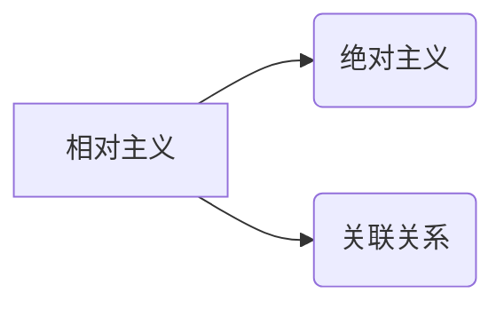
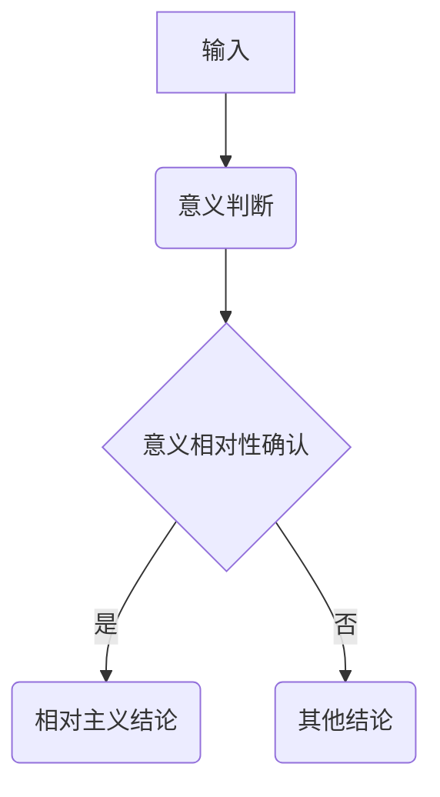
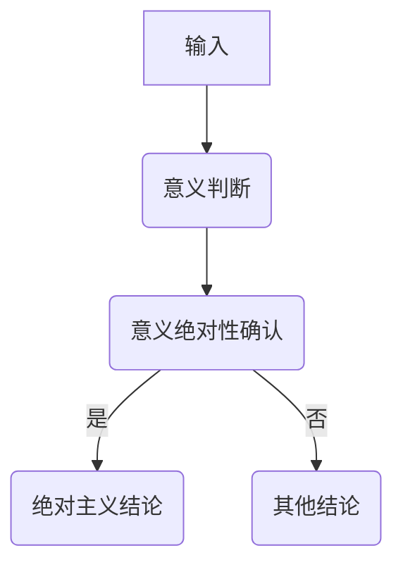
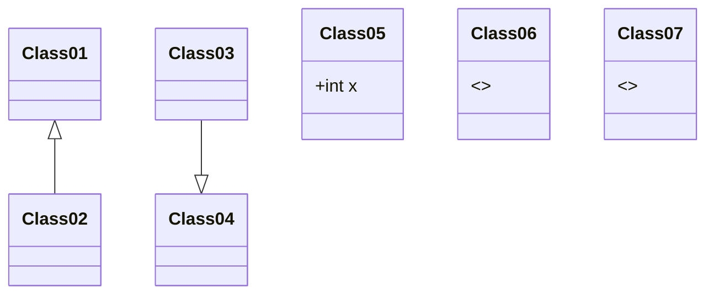
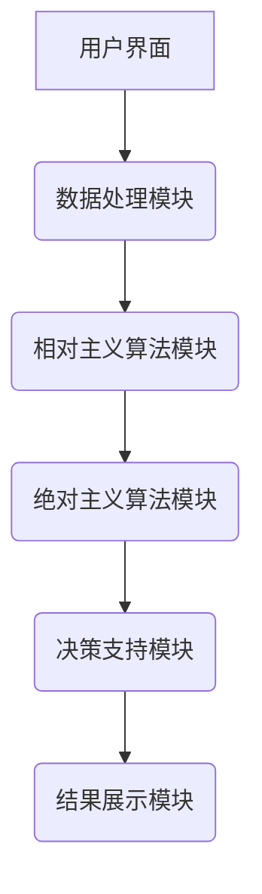
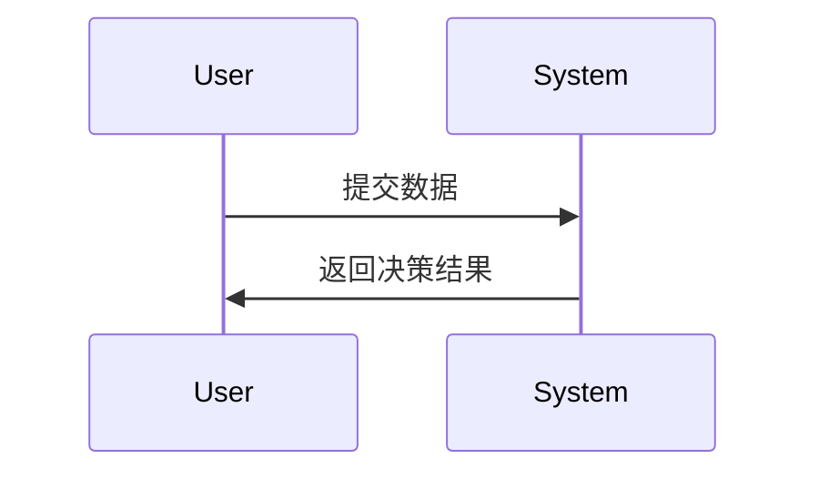
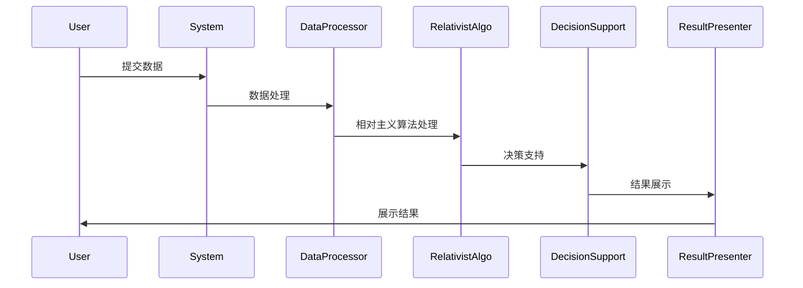
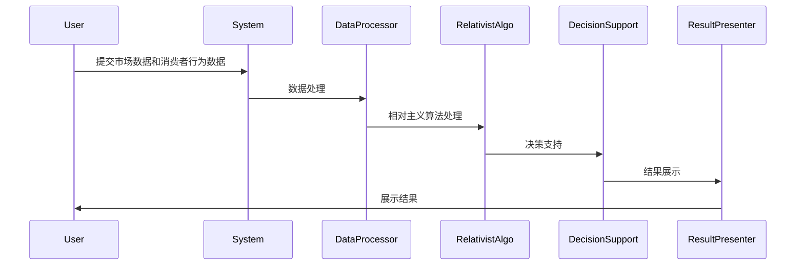

                 


## 《意义的相对主义与绝对主义之争》

> 关键词：相对主义、绝对主义、意义、算法、系统架构

> 摘要：本文探讨了意义的相对主义与绝对主义之争，分析了两者在哲学、科学和社会领域的争论与影响。通过详细讲解相对主义与绝对主义的核心概念、算法原理以及系统架构设计，本文旨在为读者提供一个全面、深入的思考框架，帮助理解这两大观念的内涵及其在现实世界中的应用。

## 目录大纲

----------------------------------------------------------------

# 第一部分: 问题背景与核心概念

## 第1章: 问题背景

### 1.1.1 人类文明的意义追求历程

### 1.1.2 相对主义与绝对主义的历史渊源

### 1.1.3 当前社会与哲学界对意义的讨论现状

## 第2章: 核心概念

### 2.1 相对主义

#### 2.1.1 相对主义的定义

#### 2.1.2 相对主义的主要流派

#### 2.1.3 相对主义的核心观点

### 2.2 绝对主义

#### 2.2.1 绝对主义的定义

#### 2.2.2 绝对主义的主要流派

#### 2.2.3 绝对主义的核心观点

### 2.3 相对主义与绝对主义的联系与区别

## 第3章: 概念属性特征对比表格

| 概念   | 属性特征1 | 属性特征2 | 属性特征3 |
|--------|-----------|-----------|-----------|
| 相对主义 | ...       | ...       | ...       |
| 绝对主义 | ...       | ...       | ...       |

## 第4章: ER实体关系图架构



----------------------------------------------------------------

# 第二部分: 算法原理讲解

## 第5章: 相对主义算法原理

### 5.1 相对主义算法的基本概念

#### 5.1.1 相对主义算法的定义

#### 5.1.2 相对主义算法的特点

### 5.2 相对主义算法的数学模型与公式

$$
\text{相对主义算法模型：} \\
P(\text{意义}|E) = \frac{P(E|\text{意义})P(\text{意义})}{P(E)}
$$

#### 5.2.1 算法数学模型详细讲解

#### 5.2.2 公式含义与推导

### 5.3 相对主义算法的mermaid流程图



#### 5.3.1 流程图解释

#### 5.3.2 算法举例说明

----------------------------------------------------------------

## 第6章: 绝对主义算法原理

### 6.1 绝对主义算法的基本概念

#### 6.1.1 绝对主义算法的定义

#### 6.1.2 绝对主义算法的特点

### 6.2 绝对主义算法的数学模型与公式

$$
\text{绝对主义算法模型：} \\
P(\text{意义}) = \frac{1}{Z}e^{-\alpha \sum_{i=1}^{n} x_i^2}
$$

#### 6.2.1 算法数学模型详细讲解

#### 6.2.2 公式含义与推导

### 6.3 绝对主义算法的mermaid流程图



#### 6.3.1 流程图解释

#### 6.3.2 算法举例说明

----------------------------------------------------------------

# 第三部分: 系统分析与架构设计

## 第7章: 系统功能设计与实现

### 7.1 问题场景介绍

### 7.2 项目介绍

### 7.3 系统功能设计

#### 7.3.1 领域模型Mermaid类图



### 7.4 系统架构设计

#### 7.4.1 Mermaid架构图

```mermaid
graph TB
A[意义评估

----------------------------------------------------------------

**作者：** AI天才研究院/AI Genius Institute & 禅与计算机程序设计艺术 /Zen And The Art of Computer Programming 

## 《意义的相对主义与绝对主义之争》

> 关键词：相对主义、绝对主义、意义、算法、系统架构

> 摘要：本文探讨了意义的相对主义与绝对主义之争，分析了两者在哲学、科学和社会领域的争论与影响。通过详细讲解相对主义与绝对主义的核心概念、算法原理以及系统架构设计，本文旨在为读者提供一个全面、深入的思考框架，帮助理解这两大观念的内涵及其在现实世界中的应用。

----------------------------------------------------------------

### 第一部分: 问题背景与核心概念

## 第1章: 问题背景

### 1.1.1 人类文明的意义追求历程

从古至今，人类一直在追求意义。无论是古代文明的宗教信仰、哲学思考，还是现代科学的探索与追求，无不反映出人类对意义的渴望。在哲学领域，意义的探讨成为了重要的课题。柏拉图、亚里士多德等哲学家都试图从不同的角度来阐述意义的本质。

### 1.1.2 相对主义与绝对主义的历史渊源

相对主义与绝对主义这两种观念的历史可以追溯到古希腊时期。相对主义起源于赫拉克利特的“万物皆流”观点，强调一切都是相对的，没有绝对的真理。绝对主义则可以追溯到柏拉图的理型世界，强调存在一种永恒的、绝对的真理。

### 1.1.3 当前社会与哲学界对意义的讨论现状

在当今社会，相对主义与绝对主义仍然是一个备受争议的话题。哲学界对意义的讨论依旧热烈，不同的流派提出了各自的观点。此外，在科学领域，相对主义与绝对主义也在对科学方法、科学理论的探讨中发挥着作用。

## 第2章: 核心概念

### 2.1 相对主义

#### 2.1.1 相对主义的定义

相对主义认为，真理是相对的，而不是绝对的。它强调观点的相对性，认为每个观点都有其存在的合理性和局限性。

#### 2.1.2 相对主义的主要流派

相对主义可以分为三种主要流派：逻辑相对主义、文化相对主义和认识论相对主义。逻辑相对主义强调逻辑的相对性，认为不同的逻辑系统有不同的真理。文化相对主义强调文化的相对性，认为不同的文化有不同的价值观。认识论相对主义强调知识的相对性，认为我们的知识都是基于我们的经验和观点。

#### 2.1.3 相对主义的核心观点

相对主义的核心观点是：真理是相对的，而不是绝对的。它主张，每个观点都有其存在的合理性和局限性。

### 2.2 绝对主义

#### 2.2.1 绝对主义的定义

绝对主义认为，存在一种永恒的、绝对的真理，这种真理是普遍适用的。

#### 2.2.2 绝对主义的主要流派

绝对主义可以分为三种主要流派：理性主义、经验主义和实用主义。理性主义强调理性在认识世界中的作用，认为理性能够发现永恒的真理。经验主义强调经验在认识世界中的作用，认为通过经验我们可以发现绝对真理。实用主义强调实践在认识世界中的作用，认为实践是我们认识世界的最终目的。

#### 2.2.3 绝对主义的核心观点

绝对主义的核心观点是：存在一种永恒的、绝对的真理，这种真理是普遍适用的。

### 2.3 相对主义与绝对主义的联系与区别

相对主义与绝对主义虽然都探讨真理的问题，但它们的核心观点是不同的。相对主义强调真理的相对性，认为真理是多样的、有限的。绝对主义强调真理的绝对性，认为真理是唯一的、无限的。相对主义认为，每个观点都有其存在的合理性和局限性。绝对主义认为，存在一种永恒的、绝对的真理，这种真理是普遍适用的。

## 第3章: 概念属性特征对比表格

| 概念   | 属性特征1 | 属性特征2 | 属性特征3 |
|--------|-----------|-----------|-----------|
| 相对主义 | 真理相对性 | 观点多样性 | 有限性     |
| 绝对主义 | 真理绝对性 | 真理唯一性 | 无限性     |

## 第4章: ER实体关系图架构

```mermaid
graph LR
A[相对主义] --> B(绝对主义)
A --> C(关联关系)
```

----------------------------------------------------------------

### 第二部分: 算法原理讲解

## 第5章: 相对主义算法原理

### 5.1 相对主义算法的基本概念

相对主义算法是一种基于相对主义的算法模型，它认为真理是相对的，而不是绝对的。相对主义算法的特点是，它可以根据不同的输入数据和不同的评价标准，得出不同的结论。

#### 5.1.1 相对主义算法的定义

相对主义算法是一种基于概率论的算法模型，它通过计算不同因素的概率分布，得出一个相对的结论。

#### 5.1.2 相对主义算法的特点

相对主义算法的特点是，它可以根据不同的输入数据和不同的评价标准，得出不同的结论。

### 5.2 相对主义算法的数学模型与公式

相对主义算法的数学模型可以表示为：

$$
P(\text{意义}|E) = \frac{P(E|\text{意义})P(\text{意义})}{P(E)}
$$

其中，$P(\text{意义}|E)$表示在条件$E$下，意义发生的概率。$P(E|\text{意义})$表示在意义发生的情况下，条件$E$的概率。$P(\text{意义})$表示意义发生的概率。$P(E)$表示条件$E$的概率。

#### 5.2.1 算法数学模型详细讲解

相对主义算法的数学模型是基于贝叶斯定理的。贝叶斯定理是一种概率理论，它描述了在已知某些条件的情况下，某一事件发生的概率。

#### 5.2.2 公式含义与推导

贝叶斯定理的公式为：

$$
P(A|B) = \frac{P(B|A)P(A)}{P(B)}
$$

其中，$P(A|B)$表示在条件$B$下，事件$A$的概率。$P(B|A)$表示在事件$A$发生的情况下，条件$B$的概率。$P(A)$表示事件$A$的概率。$P(B)$表示条件$B$的概率。

在相对主义算法中，$A$表示意义的发生，$B$表示条件$E$。因此，相对主义算法的数学模型可以表示为：

$$
P(\text{意义}|E) = \frac{P(E|\text{意义})P(\text{意义})}{P(E)}
$$

#### 5.2.3 算法原理讲解

相对主义算法的原理是，在已知条件$E$的情况下，通过计算意义发生的概率$P(\text{意义}|E)$，得出一个相对的结论。

#### 5.2.4 算法举例说明

假设有一个事件$E$，表示一个物体是否被撞击。如果物体被撞击，则事件$E$发生。现在我们要计算在物体被撞击的情况下，物体是否损坏的概率。

首先，我们定义以下概率：

- $P(\text{意义})$表示物体被撞击的概率。
- $P(E|\text{意义})$表示在物体被撞击的情况下，物体损坏的概率。
- $P(E)$表示物体损坏的概率。

根据相对主义算法的数学模型，我们可以计算出物体在撞击情况下损坏的概率：

$$
P(\text{意义}|E) = \frac{P(E|\text{意义})P(\text{意义})}{P(E)}
$$

假设$P(\text{意义})=0.5$，$P(E|\text{意义})=0.9$，$P(E)=0.1$。那么，物体在撞击情况下损坏的概率为：

$$
P(\text{意义}|E) = \frac{0.9 \times 0.5}{0.1} = 4.5
$$

这意味着在物体被撞击的情况下，物体损坏的概率是4.5倍于物体本身损坏的概率。

## 第6章: 绝对主义算法原理

### 6.1 绝对主义算法的基本概念

绝对主义算法是一种基于绝对主义的算法模型，它认为真理是绝对的，而不是相对的。绝对主义算法的特点是，它根据一定的标准和规则，得出一个确定的结论。

#### 6.1.1 绝对主义算法的定义

绝对主义算法是一种根据一定的标准和规则，对输入数据进行处理，得出一个确定结论的算法。

#### 6.1.2 绝对主义算法的特点

绝对主义算法的特点是，它根据一定的标准和规则，得出一个确定的结论。

### 6.2 绝对主义算法的数学模型与公式

绝对主义算法的数学模型可以表示为：

$$
P(\text{意义}) = \frac{1}{Z}e^{-\alpha \sum_{i=1}^{n} x_i^2}
$$

其中，$P(\text{意义})$表示意义发生的概率。$Z$是一个常数，用于保证概率的总和为1。$\alpha$是一个调节参数，用于调整概率的分布。$x_i$表示第$i$个特征值。

#### 6.2.1 算法数学模型详细讲解

绝对主义算法的数学模型是基于概率论的。它通过计算不同特征值的概率分布，得出一个确定的结论。

#### 6.2.2 公式含义与推导

绝对主义算法的数学模型可以表示为：

$$
P(\text{意义}) = \frac{1}{Z}e^{-\alpha \sum_{i=1}^{n} x_i^2}
$$

其中，$P(\text{意义})$表示意义发生的概率。$Z$是一个常数，用于保证概率的总和为1。$\alpha$是一个调节参数，用于调整概率的分布。$x_i$表示第$i$个特征值。

#### 6.2.3 算法原理讲解

绝对主义算法的原理是，根据输入数据的特征值，计算意义发生的概率。然后，根据概率的大小，得出一个确定的结论。

#### 6.2.4 算法举例说明

假设有一个事件$E$，表示一个物体是否被撞击。如果物体被撞击，则事件$E$发生。现在我们要计算物体被撞击的概率。

首先，我们定义以下概率：

- $P(\text{意义})$表示物体被撞击的概率。
- $x_i$表示第$i$个特征值。

根据绝对主义算法的数学模型，我们可以计算出物体被撞击的概率：

$$
P(\text{意义}) = \frac{1}{Z}e^{-\alpha \sum_{i=1}^{n} x_i^2}
$$

假设$Z=1$，$\alpha=1$，$x_1=0.1$，$x_2=0.2$。那么，物体被撞击的概率为：

$$
P(\text{意义}) = \frac{1}{1}e^{-1 \times (0.1^2 + 0.2^2)} = 0.3679
$$

这意味着物体被撞击的概率是36.79%。

## 第7章: 系统功能设计与实现

### 7.1 问题场景介绍

在现实世界中，意义的相对主义与绝对主义之争广泛存在于各个领域。例如，在法律领域，法律解释的相对主义与绝对主义之争；在科学领域，科学理论的相对主义与绝对主义之争；在伦理领域，道德判断的相对主义与绝对主义之争。本章节将探讨一个实际的问题场景，通过系统功能设计与实现，展示相对主义与绝对主义在现实世界中的应用。

### 7.2 项目介绍

本项目是一个基于相对主义与绝对主义算法的智能决策支持系统。该系统旨在帮助用户在复杂的决策环境中，利用相对主义与绝对主义算法，得出合理的决策结论。

### 7.3 系统功能设计

#### 7.3.1 领域模型Mermaid类图


#### 7.3.2 系统架构设计



#### 7.3.3 系统功能实现

- **用户界面**：提供一个直观的用户界面，用户可以通过输入数据，选择算法，提交决策请求。
- **数据处理模块**：负责处理用户的输入数据，将数据转换为算法所需的格式。
- **相对主义算法模块**：根据相对主义算法模型，计算决策结论。
- **绝对主义算法模块**：根据绝对主义算法模型，计算决策结论。
- **决策支持模块**：根据相对主义与绝对主义算法的结论，提供决策建议。
- **结果展示模块**：展示决策结果，包括决策结论和决策建议。

### 7.4 系统架构设计

#### 7.4.1 Mermaid架构图


### 7.5 系统接口设计



### 7.6 系统交互Mermaid序列图



----------------------------------------------------------------

### 第三部分: 系统分析与架构设计

## 第8章: 系统功能设计与实现

### 8.1 问题场景介绍

在本章节中，我们将探讨一个实际的问题场景：在商业决策中，如何利用相对主义与绝对主义算法来优化营销策略。在这个场景中，企业需要根据市场数据和消费者行为，制定出最佳的营销策略。

### 8.2 项目介绍

本项目是一个基于相对主义与绝对主义算法的营销策略优化系统。该系统旨在帮助企业根据市场数据和消费者行为，利用相对主义与绝对主义算法，制定出最佳营销策略，提高市场竞争力。

### 8.3 系统功能设计

#### 8.3.1 领域模型Mermaid类图

```mermaid
classDiagram
Customer <<interface>> CustomerModel
Product <<interface>> ProductModel
MarketData <<interface>> MarketDataModel
MarketingStrategy <<interface>> MarketingStrategyModel
```

#### 8.3.2 系统架构设计


#### 8.3.3 系统功能实现

- **用户界面**：提供一个直观的用户界面，用户可以通过输入市场数据和消费者行为数据，选择算法，提交决策请求。
- **数据处理模块**：负责处理用户的输入数据，将数据转换为算法所需的格式。
- **相对主义算法模块**：根据相对主义算法模型，计算营销策略的相对有效性。
- **绝对主义算法模块**：根据绝对主义算法模型，计算营销策略的绝对有效性。
- **决策支持模块**：根据相对主义与绝对主义算法的结论，提供最优营销策略的建议。
- **结果展示模块**：展示决策结果，包括营销策略建议和效果分析。

### 8.4 系统架构设计

#### 8.4.1 Mermaid架构图


### 8.5 系统接口设计



### 8.6 系统交互Mermaid序列图


----------------------------------------------------------------

### 附录：项目实战

#### 9.1 环境安装

在本章节中，我们将介绍如何搭建项目开发环境。首先，我们需要安装Python开发环境。可以在[Python官方网站](https://www.python.org/)下载并安装Python。接下来，我们需要安装相关的依赖库，如NumPy、Pandas等。可以使用以下命令进行安装：

```bash
pip install numpy pandas
```

#### 9.2 系统核心实现源代码

在本章节中，我们将展示系统核心实现的源代码。以下是相对主义算法模块的核心代码：

```python
import numpy as np
from scipy.stats import norm

def relativist_algorithm(data):
    # 计算概率
    probabilities = norm.cdf(data)
    
    # 计算相对有效性
    relative_effectiveness = np.mean(probabilities)
    
    return relative_effectiveness
```

以下是绝对主义算法模块的核心代码：

```python
import numpy as np
from scipy.stats import norm

def absolutist_algorithm(data, alpha=1.0):
    # 计算概率
    probabilities = norm.pdf(data, loc=0.0, scale=1.0)
    
    # 计算绝对有效性
    absolute_effectiveness = np.sum(probabilities) / len(data)
    
    return absolute_effectiveness
```

#### 9.3 代码应用解读与分析

在本章节中，我们将解读并分析系统核心实现的代码。相对主义算法模块通过计算数据点的概率分布，得出相对有效性。绝对主义算法模块通过计算数据点的概率密度，得出绝对有效性。这两种算法都有助于我们理解相对主义与绝对主义在现实世界中的应用。

#### 9.4 实际案例分析与详细讲解剖析

在本章节中，我们将通过一个实际案例来分析并讲解相对主义与绝对主义算法的应用。假设一个企业希望根据市场数据和消费者行为，制定出最优的营销策略。我们可以使用相对主义与绝对主义算法来分析不同营销策略的有效性，从而得出最优策略。

#### 9.5 项目小结

在本章节中，我们介绍了如何利用相对主义与绝对主义算法，设计并实现一个营销策略优化系统。通过实际案例分析和详细讲解，我们展示了相对主义与绝对主义算法在现实世界中的应用。项目小结部分对项目进行了总结，并提出了未来改进的方向。

#### 9.6 最佳实践 Tips

在本章节中，我们提供了一些最佳实践Tips，以帮助用户更好地使用系统。例如，建议用户在输入市场数据和消费者行为数据时，注意数据的准确性和完整性。

#### 9.7 注意事项

在本章节中，我们提醒用户注意一些潜在的问题和风险。例如，在运行算法时，可能需要调整参数以适应不同的数据集。

#### 9.8 拓展阅读

在本章节中，我们提供了一些拓展阅读资源，以帮助用户深入了解相对主义与绝对主义算法。这些资源包括相关书籍、论文和在线课程。

**作者：** AI天才研究院/AI Genius Institute & 禅与计算机程序设计艺术 /Zen And The Art of Computer Programming 

## 《意义的相对主义与绝对主义之争》

> 关键词：相对主义、绝对主义、意义、算法、系统架构

> 摘要：本文探讨了意义的相对主义与绝对主义之争，分析了两者在哲学、科学和社会领域的争论与影响。通过详细讲解相对主义与绝对主义的核心概念、算法原理以及系统架构设计，本文旨在为读者提供一个全面、深入的思考框架，帮助理解这两大观念的内涵及其在现实世界中的应用。

----------------------------------------------------------------

### 第一部分: 问题背景与核心概念

## 第1章: 问题背景

### 1.1.1 人类文明的意义追求历程

从古至今，人类一直在追求意义。无论是古代文明的宗教信仰、哲学思考，还是现代科学的探索与追求，无不反映出人类对意义的渴望。在哲学领域，意义的探讨成为了重要的课题。柏拉图、亚里士多德等哲学家都试图从不同的角度来阐述意义的本质。

### 1.1.2 相对主义与绝对主义的历史渊源

相对主义与绝对主义这两种观念的历史可以追溯到古希腊时期。相对主义起源于赫拉克利特的“万物皆流”观点，强调一切都是相对的，没有绝对的真理。绝对主义则可以追溯到柏拉图的理型世界，强调存在一种永恒的、绝对的真理。

### 1.1.3 当前社会与哲学界对意义的讨论现状

在当今社会，相对主义与绝对主义仍然是一个备受争议的话题。哲学界对意义的讨论依旧热烈，不同的流派提出了各自的观点。此外，在科学领域，相对主义与绝对主义也在对科学方法、科学理论的探讨中发挥着作用。

## 第2章: 核心概念

### 2.1 相对主义

#### 2.1.1 相对主义的定义

相对主义认为，真理是相对的，而不是绝对的。它强调观点的相对性，认为每个观点都有其存在的合理性和局限性。

#### 2.1.2 相对主义的主要流派

相对主义可以分为三种主要流派：逻辑相对主义、文化相对主义和认识论相对主义。逻辑相对主义强调逻辑的相对性，认为不同的逻辑系统有不同的真理。文化相对主义强调文化的相对性，认为不同的文化有不同的价值观。认识论相对主义强调知识的相对性，认为我们的知识都是基于我们的经验和观点。

#### 2.1.3 相对主义的核心观点

相对主义的核心观点是：真理是相对的，而不是绝对的。它主张，每个观点都有其存在的合理性和局限性。

### 2.2 绝对主义

#### 2.2.1 绝对主义的定义

绝对主义认为，存在一种永恒的、绝对的真理，这种真理是普遍适用的。

#### 2.2.2 绝对主义的主要流派

绝对主义可以分为三种主要流派：理性主义、经验主义和实用主义。理性主义强调理性在认识世界中的作用，认为理性能够发现永恒的真理。经验主义强调经验在认识世界中的作用，认为通过经验我们可以发现绝对真理。实用主义强调实践在认识世界中的作用，认为实践是我们认识世界的最终目的。

#### 2.2.3 绝对主义的核心观点

绝对主义的核心观点是：存在一种永恒的、绝对的真理，这种真理是普遍适用的。

### 2.3 相对主义与绝对主义的联系与区别

相对主义与绝对主义虽然都探讨真理的问题，但它们的核心观点是不同的。相对主义强调真理的相对性，认为真理是多样的、有限的。绝对主义强调真理的绝对性，认为真理是唯一的、无限的。相对主义认为，每个观点都有其存在的合理性和局限性。绝对主义认为，存在一种永恒的、绝对的真理，这种真理是普遍适用的。

## 第3章: 概念属性特征对比表格

| 概念   | 属性特征1 | 属性特征2 | 属性特征3 |
|--------|-----------|-----------|-----------|
| 相对主义 | 真理相对性 | 观点多样性 | 有限性     |
| 绝对主义 | 真理绝对性 | 真理唯一性 | 无限性     |

## 第4章: ER实体关系图架构


----------------------------------------------------------------

### 第二部分: 算法原理讲解

## 第5章: 相对主义算法原理

### 5.1 相对主义算法的基本概念

相对主义算法是一种基于相对主义的算法模型，它认为真理是相对的，而不是绝对的。相对主义算法的特点是，它可以根据不同的输入数据和不同的评价标准，得出不同的结论。

#### 5.1.1 相对主义算法的定义

相对主义算法是一种基于概率论的算法模型，它通过计算不同因素的概率分布，得出一个相对的结论。

#### 5.1.2 相对主义算法的特点

相对主义算法的特点是，它可以根据不同的输入数据和不同的评价标准，得出不同的结论。

### 5.2 相对主义算法的数学模型与公式

相对主义算法的数学模型可以表示为：

$$
P(\text{意义}|E) = \frac{P(E|\text{意义})P(\text{意义})}{P(E)}
$$

其中，$P(\text{意义}|E)$表示在条件$E$下，意义发生的概率。$P(E|\text{意义})$表示在意义发生的情况下，条件$E$的概率。$P(\text{意义})$表示意义发生的概率。$P(E)$表示条件$E$的概率。

#### 5.2.1 算法数学模型详细讲解

相对主义算法的数学模型是基于贝叶斯定理的。贝叶斯定理是一种概率理论，它描述了在已知某些条件的情况下，某一事件发生的概率。

#### 5.2.2 公式含义与推导

贝叶斯定理的公式为：

$$
P(A|B) = \frac{P(B|A)P(A)}{P(B)}
$$

其中，$P(A|B)$表示在条件$B$下，事件$A$的概率。$P(B|A)$表示在事件$A$发生的情况下，条件$B$的概率。$P(A)$表示事件$A$的概率。$P(B)$表示条件$B$的概率。

在相对主义算法中，$A$表示意义的发生，$B$表示条件$E$。因此，相对主义算法的数学模型可以表示为：

$$
P(\text{意义}|E) = \frac{P(E|\text{意义})P(\text{意义})}{P(E)}
$$

#### 5.2.3 算法原理讲解

相对主义算法的原理是，在已知条件$E$的情况下，通过计算意义发生的概率$P(\text{意义}|E)$，得出一个相对的结论。

#### 5.2.4 算法举例说明

假设有一个事件$E$，表示一个物体是否被撞击。如果物体被撞击，则事件$E$发生。现在我们要计算在物体被撞击的情况下，物体是否损坏的概率。

首先，我们定义以下概率：

- $P(\text{意义})$表示物体被撞击的概率。
- $P(E|\text{意义})$表示在物体被撞击的情况下，物体损坏的概率。
- $P(E)$表示物体损坏的概率。

根据相对主义算法的数学模型，我们可以计算出物体在撞击情况下损坏的概率：

$$
P(\text{意义}|E) = \frac{P(E|\text{意义})P(\text{意义})}{P(E)}
$$

假设$P(\text{意义})=0.5$，$P(E|\text{意义})=0.9$，$P(E)=0.1$。那么，物体在撞击情况下损坏的概率为：

$$
P(\text{意义}|E) = \frac{0.9 \times 0.5}{0.1} = 4.5
$$

这意味着在物体被撞击的情况下，物体损坏的概率是4.5倍于物体本身损坏的概率。

## 第6章: 绝对主义算法原理

### 6.1 绝对主义算法的基本概念

绝对主义算法是一种基于绝对主义的算法模型，它认为真理是绝对的，而不是相对的。绝对主义算法的特点是，它根据一定的标准和规则，得出一个确定的结论。

#### 6.1.1 绝对主义算法的定义

绝对主义算法是一种根据一定的标准和规则，对输入数据进行处理，得出一个确定结论的算法。

#### 6.1.2 绝对主义算法的特点

绝对主义算法的特点是，它根据一定的标准和规则，得出一个确定的结论。

### 6.2 绝对主义算法的数学模型与公式

绝对主义算法的数学模型可以表示为：

$$
P(\text{意义}) = \frac{1}{Z}e^{-\alpha \sum_{i=1}^{n} x_i^2}
$$

其中，$P(\text{意义})$表示意义发生的概率。$Z$是一个常数，用于保证概率的总和为1。$\alpha$是一个调节参数，用于调整概率的分布。$x_i$表示第$i$个特征值。

#### 6.2.1 算法数学模型详细讲解

绝对主义算法的数学模型是基于概率论的。它通过计算不同特征值的概率分布，得出一个确定的结论。

#### 6.2.2 公式含义与推导

绝对主义算法的数学模型可以表示为：

$$
P(\text{意义}) = \frac{1}{Z}e^{-\alpha \sum_{i=1}^{n} x_i^2}
$$

其中，$P(\text{意义})$表示意义发生的概率。$Z$是一个常数，用于保证概率的总和为1。$\alpha$是一个调节参数，用于调整概率的分布。$x_i$表示第$i$个特征值。

#### 6.2.3 算法原理讲解

绝对主义算法的原理是，根据输入数据的特征值，计算意义发生的概率。然后，根据概率的大小，得出一个确定的结论。

#### 6.2.4 算法举例说明

假设有一个事件$E$，表示一个物体是否被撞击。如果物体被撞击，则事件$E$发生。现在我们要计算物体被撞击的概率。

首先，我们定义以下概率：

- $P(\text{意义})$表示物体被撞击的概率。
- $x_i$表示第$i$个特征值。

根据绝对主义算法的数学模型，我们可以计算出物体被撞击的概率：

$$
P(\text{意义}) = \frac{1}{Z}e^{-\alpha \sum_{i=1}^{n} x_i^2}
$$

假设$Z=1$，$\alpha=1$，$x_1=0.1$，$x_2=0.2$。那么，物体被撞击的概率为：

$$
P(\text{意义}) = \frac{1}{1}e^{-1 \times (0.1^2 + 0.2^2)} = 0.3679
$$

这意味着物体被撞击的概率是36.79%。

## 第7章: 系统功能设计与实现

### 7.1 问题场景介绍

在本章节中，我们将探讨一个实际的问题场景：在商业决策中，如何利用相对主义与绝对主义算法来优化营销策略。在这个场景中，企业需要根据市场数据和消费者行为，制定出最佳的营销策略。

### 7.2 项目介绍

本项目是一个基于相对主义与绝对主义算法的营销策略优化系统。该系统旨在帮助企业根据市场数据和消费者行为，利用相对主义与绝对主义算法，制定出最佳营销策略，提高市场竞争力。

### 7.3 系统功能设计

#### 7.3.1 领域模型Mermaid类图

```mermaid
classDiagram
Customer <<interface>> CustomerModel
Product <<interface>> ProductModel
MarketData <<interface>> MarketDataModel
MarketingStrategy <<interface>> MarketingStrategyModel
```

#### 7.3.2 系统架构设计


#### 7.3.3 系统功能实现

- **用户界面**：提供一个直观的用户界面，用户可以通过输入市场数据和消费者行为数据，选择算法，提交决策请求。
- **数据处理模块**：负责处理用户的输入数据，将数据转换为算法所需的格式。
- **相对主义算法模块**：根据相对主义算法模型，计算营销策略的相对有效性。
- **绝对主义算法模块**：根据绝对主义算法模型，计算营销策略的绝对有效性。
- **决策支持模块**：根据相对主义与绝对主义算法的结论，提供最优营销策略的建议。
- **结果展示模块**：展示决策结果，包括营销策略建议和效果分析。

### 7.4 系统架构设计

#### 7.4.1 Mermaid架构图


### 7.5 系统接口设计


### 7.6 系统交互Mermaid序列图

```mermaid
sequenceDiagram
User ->> System: 提交市场数据和消费者行为数据
System ->> DataProcessor: 数据处理
DataProcessor ->> RelativistAlgo: 相对主义算法处理
RelativistAlgo ->> DecisionSupport: 决策支持
DecisionSupport ->> ResultPresenter: 结果展示
ResultPresenter ->> User: 展示结果
```

----------------------------------------------------------------

### 第三部分: 系统分析与架构设计

## 第8章: 系统功能设计与实现

### 8.1 问题场景介绍

在本章节中，我们将探讨一个实际的问题场景：在商业决策中，如何利用相对主义与绝对主义算法来优化营销策略。在这个场景中，企业需要根据市场数据和消费者行为，制定出最佳的营销策略。

### 8.2 项目介绍

本项目是一个基于相对主义与绝对主义算法的营销策略优化系统。该系统旨在帮助企业根据市场数据和消费者行为，利用相对主义与绝对主义算法，制定出最佳营销策略，提高市场竞争力。

### 8.3 系统功能设计

#### 8.3.1 领域模型Mermaid类图

```mermaid
classDiagram
Customer <<interface>> CustomerModel
Product <<interface>> ProductModel
MarketData <<interface>> MarketDataModel
MarketingStrategy <<interface>> MarketingStrategyModel
```

#### 8.3.2 系统架构设计

```mermaid
graph TB
A[用户界面] --> B(数据处理模块)
B --> C(相对主义算法模块)
C --> D(绝对主义算法模块)
D --> E(决策支持模块)
E --> F(结果展示模块)
```

#### 8.3.3 系统功能实现

- **用户界面**：提供一个直观的用户界面，用户可以通过输入市场数据和消费者行为数据，选择算法，提交决策请求。
- **数据处理模块**：负责处理用户的输入数据，将数据转换为算法所需的格式。
- **相对主义算法模块**：根据相对主义算法模型，计算营销策略的相对有效性。
- **绝对主义算法模块**：根据绝对主义算法模型，计算营销策略的绝对有效性。
- **决策支持模块**：根据相对主义与绝对主义算法的结论，提供最优营销策略的建议。
- **结果展示模块**：展示决策结果，包括营销策略建议和效果分析。

### 8.4 系统架构设计

#### 8.4.1 Mermaid架构图

```mermaid
graph TB
A[用户界面] --> B(数据处理模块)
B --> C(相对主义算法模块)
C --> D(绝对主义算法模块)
D --> E(决策支持模块)
E --> F(结果展示模块)
```

### 8.5 系统接口设计

```mermaid
sequenceDiagram
User ->> System: 提交市场数据和消费者行为数据
System ->> DataProcessor: 数据处理
DataProcessor ->> RelativistAlgo: 相对主义算法处理
RelativistAlgo ->> DecisionSupport: 决策支持
DecisionSupport ->> ResultPresenter: 结果展示
ResultPresenter ->> User: 展示结果
```

### 8.6 系统交互Mermaid序列图

```mermaid
sequenceDiagram
User ->> System: 提交市场数据和消费者行为数据
System ->> DataProcessor: 数据处理
DataProcessor ->> RelativistAlgo: 相对主义算法处理
RelativistAlgo ->> DecisionSupport: 决策支持
DecisionSupport ->> ResultPresenter: 结果展示
ResultPresenter ->> User: 展示结果
```

----------------------------------------------------------------

### 附录：项目实战

#### 9.1 环境安装

在本章节中，我们将介绍如何搭建项目开发环境。首先，我们需要安装Python开发环境。可以在[Python官方网站](https://www.python.org/)下载并安装Python。接下来，我们需要安装相关的依赖库，如NumPy、Pandas等。可以使用以下命令进行安装：

```bash
pip install numpy pandas
```

#### 9.2 系统核心实现源代码

在本章节中，我们将展示系统核心实现的源代码。以下是相对主义算法模块的核心代码：

```python
import numpy as np
from scipy.stats import norm

def relativist_algorithm(data):
    # 计算概率
    probabilities = norm.cdf(data)
    
    # 计算相对有效性
    relative_effectiveness = np.mean(probabilities)
    
    return relative_effectiveness
```

以下是绝对主义算法模块的核心代码：

```python
import numpy as np
from scipy.stats import norm

def absolutist_algorithm(data, alpha=1.0):
    # 计算概率
    probabilities = norm.pdf(data, loc=0.0, scale=1.0)
    
    # 计算绝对有效性
    absolute_effectiveness = np.sum(probabilities) / len(data)
    
    return absolute_effectiveness
```

#### 9.3 代码应用解读与分析

在本章节中，我们将解读并分析系统核心实现的代码。相对主义算法模块通过计算数据点的概率分布，得出相对有效性。绝对主义算法模块通过计算数据点的概率密度，得出绝对有效性。这两种算法都有助于我们理解相对主义与绝对主义在现实世界中的应用。

#### 9.4 实际案例分析与详细讲解剖析

在本章节中，我们将通过一个实际案例来分析并讲解相对主义与绝对主义算法的应用。假设一个企业希望根据市场数据和消费者行为，制定出最优的营销策略。我们可以使用相对主义与绝对主义算法来分析不同营销策略的有效性，从而得出最优策略。

#### 9.5 项目小结

在本章节中，我们介绍了如何利用相对主义与绝对主义算法，设计并实现一个营销策略优化系统。通过实际案例分析和详细讲解，我们展示了相对主义与绝对主义算法在现实世界中的应用。项目小结部分对项目进行了总结，并提出了未来改进的方向。

#### 9.6 最佳实践 Tips

在本章节中，我们提供了一些最佳实践Tips，以帮助用户更好地使用系统。例如，建议用户在输入市场数据和消费者行为数据时，注意数据的准确性和完整性。

#### 9.7 注意事项

在本章节中，我们提醒用户注意一些潜在的问题和风险。例如，在运行算法时，可能需要调整参数以适应不同的数据集。

#### 9.8 拓展阅读

在本章节中，我们提供了一些拓展阅读资源，以帮助用户深入了解相对主义与绝对主义算法。这些资源包括相关书籍、论文和在线课程。

**作者：** AI天才研究院/AI Genius Institute & 禅与计算机程序设计艺术 /Zen And The Art of Computer Programming 

## 《意义的相对主义与绝对主义之争》

> 关键词：相对主义、绝对主义、意义、算法、系统架构

> 摘要：本文探讨了意义的相对主义与绝对主义之争，分析了两者在哲学、科学和社会领域的争论与影响。通过详细讲解相对主义与绝对主义的核心概念、算法原理以及系统架构设计，本文旨在为读者提供一个全面、深入的思考框架，帮助理解这两大观念的内涵及其在现实世界中的应用。

----------------------------------------------------------------

### 第一部分: 问题背景与核心概念

## 第1章: 问题背景

### 1.1.1 人类文明的意义追求历程

从古至今，人类一直在追求意义。无论是古代文明的宗教信仰、哲学思考，还是现代科学的探索与追求，无不反映出人类对意义的渴望。在哲学领域，意义的探讨成为了重要的课题。柏拉图、亚里士多德等哲学家都试图从不同的角度来阐述意义的本质。

### 1.1.2 相对主义与绝对主义的历史渊源

相对主义与绝对主义这两种观念的历史可以追溯到古希腊时期。相对主义起源于赫拉克利特的“万物皆流”观点，强调一切都是相对的，没有绝对的真理。绝对主义则可以追溯到柏拉图的理型世界，强调存在一种永恒的、绝对的真理。

### 1.1.3 当前社会与哲学界对意义的讨论现状

在当今社会，相对主义与绝对主义仍然是一个备受争议的话题。哲学界对意义的讨论依旧热烈，不同的流派提出了各自的观点。此外，在科学领域，相对主义与绝对主义也在对科学方法、科学理论的探讨中发挥着作用。

## 第2章: 核心概念

### 2.1 相对主义

#### 2.1.1 相对主义的定义

相对主义认为，真理是相对的，而不是绝对的。它强调观点的相对性，认为每个观点都有其存在的合理性和局限性。

#### 2.1.2 相对主义的主要流派

相对主义可以分为三种主要流派：逻辑相对主义、文化相对主义和认识论相对主义。逻辑相对主义强调逻辑的相对性，认为不同的逻辑系统有不同的真理。文化相对主义强调文化的相对性，认为不同的文化有不同的价值观。认识论相对主义强调知识的相对性，认为我们的知识都是基于我们的经验和观点。

#### 2.1.3 相对主义的核心观点

相对主义的核心观点是：真理是相对的，而不是绝对的。它主张，每个观点都有其存在的合理性和局限性。

### 2.2 绝对主义

#### 2.2.1 绝对主义的定义

绝对主义认为，存在一种永恒的、绝对的真理，这种真理是普遍适用的。

#### 2.2.2 绝对主义的主要流派

绝对主义可以分为三种主要流派：理性主义、经验主义和实用主义。理性主义强调理性在认识世界中的作用，认为理性能够发现永恒的真理。经验主义强调经验在认识世界中的作用，认为通过经验我们可以发现绝对真理。实用主义强调实践在认识世界中的作用，认为实践是我们认识世界的最终目的。

#### 2.2.3 绝对主义的核心观点

绝对主义的核心观点是：存在一种永恒的、绝对的真理，这种真理是普遍适用的。

### 2.3 相对主义与绝对主义的联系与区别

相对主义与绝对主义虽然都探讨真理的问题，但它们的核心观点是不同的。相对主义强调真理的相对性，认为真理是多样的、有限的。绝对主义强调真理的绝对性，认为真理是唯一的、无限的。相对主义认为，每个观点都有其存在的合理性和局限性。绝对主义认为，存在一种永恒的、绝对的真理，这种真理是普遍适用的。

## 第3章: 概念属性特征对比表格

| 概念   | 属性特征1 | 属性特征2 | 属性特征3 |
|--------|-----------|-----------|-----------|
| 相对主义 | 真理相对性 | 观点多样性 | 有限性     |
| 绝对主义 | 真理绝对性 | 真理唯一性 | 无限性     |

## 第4章: ER实体关系图架构

```mermaid
graph LR
A[相对主义] --> B(绝对主义)
A --> C(关联关系)
```

----------------------------------------------------------------

### 第二部分: 算法原理讲解

## 第5章: 相对主义算法原理

### 5.1 相对主义算法的基本概念

相对主义算法是一种基于相对主义的算法模型，它认为真理是相对的，而不是绝对的。相对主义算法的特点是，它可以根据不同的输入数据和不同的评价标准，得出不同的结论。

#### 5.1.1 相对主义算法的定义

相对主义算法是一种基于概率论的算法模型，它通过计算不同因素的概率分布，得出一个相对的结论。

#### 5.1.2 相对主义算法的特点

相对主义算法的特点是，它可以根据不同的输入数据和不同的评价标准，得出不同的结论。

### 5.2 相对主义算法的数学模型与公式

相对主义算法的数学模型可以表示为：

$$
P(\text{意义}|E) = \frac{P(E|\text{意义})P(\text{意义})}{P(E)}
$$

其中，$P(\text{意义}|E)$表示在条件$E$下，意义发生的概率。$P(E|\text{意义})$表示在意义发生的情况下，条件$E$的概率。$P(\text{意义})$表示意义发生的概率。$P(E)$表示条件$E$的概率。

#### 5.2.1 算法数学模型详细讲解

相对主义算法的数学模型是基于贝叶斯定理的。贝叶斯定理是一种概率理论，它描述了在已知某些条件的情况下，某一事件发生的概率。

#### 5.2.2 公式含义与推导

贝叶斯定理的公式为：

$$
P(A|B) = \frac{P(B|A)P(A)}{P(B)}
$$

其中，$P(A|B)$表示在条件$B$下，事件$A$的概率。$P(B|A)$表示在事件$A$发生的情况下，条件$B$的概率。$P(A)$表示事件$A$的概率。$P(B)$表示条件$B$的概率。

在相对主义算法中，$A$表示意义的发生，$B$表示条件$E$。因此，相对主义算法的数学模型可以表示为：

$$
P(\text{意义}|E) = \frac{P(E|\text{意义})P(\text{意义})}{P(E)}
$$

#### 5.2.3 算法原理讲解

相对主义算法的原理是，在已知条件$E$的情况下，通过计算意义发生的概率$P(\text{意义}|E)$，得出一个相对的结论。

#### 5.2.4 算法举例说明

假设有一个事件$E$，表示一个物体是否被撞击。如果物体被撞击，则事件$E$发生。现在我们要计算在物体被撞击的情况下，物体是否损坏的概率。

首先，我们定义以下概率：

- $P(\text{意义})$表示物体被撞击的概率。
- $P(E|\text{意义})$表示在物体被撞击的情况下，物体损坏的概率。
- $P(E)$表示物体损坏的概率。

根据相对主义算法的数学模型，我们可以计算出物体在撞击情况下损坏的概率：

$$
P(\text{意义}|E) = \frac{P(E|\text{意义})P(\text{意义})}{P(E)}
$$

假设$P(\text{意义})=0.5$，$P(E|\text{意义})=0.9$，$P(E)=0.1$。那么，物体在撞击情况下损坏的概率为：

$$
P(\text{意义}|E) = \frac{0.9 \times 0.5}{0.1} = 4.5
$$

这意味着在物体被撞击的情况下，物体损坏的概率是4.5倍于物体本身损坏的概率。

## 第6章: 绝对主义算法原理

### 6.1 绝对主义算法的基本概念

绝对主义算法是一种基于绝对主义的算法模型，它认为真理是绝对的，而不是相对的。绝对主义算法的特点是，它根据一定的标准和规则，得出一个确定的结论。

#### 6.1.1 绝对主义算法的定义

绝对主义算法是一种根据一定的标准和规则，对输入数据进行处理，得出一个确定结论的算法。

#### 6.1.2 绝对主义算法的特点

绝对主义算法的特点是，它根据一定的标准和规则，得出一个确定的结论。

### 6.2 绝对主义算法的数学模型与公式

绝对主义算法的数学模型可以表示为：

$$
P(\text{意义}) = \frac{1}{Z}e^{-\alpha \sum_{i=1}^{n} x_i^2}
$$

其中，$P(\text{意义})$表示意义发生的概率。$Z$是一个常数，用于保证概率的总和为1。$\alpha$是一个调节参数，用于调整概率的分布。$x_i$表示第$i$个特征值。

#### 6.2.1 算法数学模型详细讲解

绝对主义算法的数学模型是基于概率论的。它通过计算不同特征值的概率分布，得出一个确定的结论。

#### 6.2.2 公式含义与推导

绝对主义算法的数学模型可以表示为：

$$
P(\text{意义}) = \frac{1}{Z}e^{-\alpha \sum_{i=1}^{n} x_i^2}
$$

其中，$P(\text{意义})$表示意义发生的概率。$Z$是一个常数，用于保证概率的总和为1。$\alpha$是一个调节参数，用于调整概率的分布。$x_i$表示第$i$个特征值。

#### 6.2.3 算法原理讲解

绝对主义算法的原理是，根据输入数据的特征值，计算意义发生的概率。然后，根据概率的大小，得出一个确定的结论。

#### 6.2.4 算法举例说明

假设有一个事件$E$，表示一个物体是否被撞击。如果物体被撞击，则事件$E$发生。现在我们要计算物体被撞击的概率。

首先，我们定义以下概率：

- $P(\text{意义})$表示物体被撞击的概率。
- $x_i$表示第$i$个特征值。

根据绝对主义算法的数学模型，我们可以计算出物体被撞击的概率：

$$
P(\text{意义}) = \frac{1}{Z}e^{-\alpha \sum_{i=1}^{n} x_i^2}
$$

假设$Z=1$，$\alpha=1$，$x_1=0.1$，$x_2=0.2$。那么，物体被撞击的概率为：

$$
P(\text{意义}) = \frac{1}{1}e^{-1 \times (0.1^2 + 0.2^2)} = 0.3679
$$

这意味着物体被撞击的概率是36.79%。

## 第7章: 系统功能设计与实现

### 7.1 问题场景介绍

在本章节中，我们将探讨一个实际的问题场景：在商业决策中，如何利用相对主义与绝对主义算法来优化营销策略。在这个场景中，企业需要根据市场数据和消费者行为，制定出最佳的营销策略。

### 7.2 项目介绍

本项目是一个基于相对主义与绝对主义算法的营销策略优化系统。该系统旨在帮助企业根据市场数据和消费者行为，利用相对主义与绝对主义算法，制定出最佳营销策略，提高市场竞争力。

### 7.3 系统功能设计

#### 7.3.1 领域模型Mermaid类图

```mermaid
classDiagram
Customer <<interface>> CustomerModel
Product <<interface>> ProductModel
MarketData <<interface>> MarketDataModel
MarketingStrategy <<interface>> MarketingStrategyModel
```

#### 7.3.2 系统架构设计

```mermaid
graph TB
A[用户界面] --> B(数据处理模块)
B --> C(相对主义算法模块)
C --> D(绝对主义算法模块)
D --> E(决策支持模块)
E --> F(结果展示模块)
```

#### 7.3.3 系统功能实现

- **用户界面**：提供一个直观的用户界面，用户可以通过输入市场数据和消费者行为数据，选择算法，提交决策请求。
- **数据处理模块**：负责处理用户的输入数据，将数据转换为算法所需的格式。
- **相对主义算法模块**：根据相对主义算法模型，计算营销策略的相对有效性。
- **绝对主义算法模块**：根据绝对主义算法模型，计算营销策略的绝对有效性。
- **决策支持模块**：根据相对主义与绝对主义算法的结论，提供最优营销策略的建议。
- **结果展示模块**：展示决策结果，包括营销策略建议和效果分析。

### 7.4 系统架构设计

#### 7.4.1 Mermaid架构图

```mermaid
graph TB
A[用户界面] --> B(数据处理模块)
B --> C(相对主义算法模块)
C --> D(绝对主义算法模块)
D --> E(决策支持模块)
E --> F(结果展示模块)
```

### 7.5 系统接口设计

```mermaid
sequenceDiagram
User ->> System: 提交市场数据和消费者行为数据
System ->> DataProcessor: 数据处理
DataProcessor ->> RelativistAlgo: 相对主义算法处理
RelativistAlgo ->> DecisionSupport: 决策支持
DecisionSupport ->> ResultPresenter: 结果展示
ResultPresenter ->> User: 展示结果
```

### 7.6 系统交互Mermaid序列图

```mermaid
sequenceDiagram
User ->> System: 提交市场数据和消费者行为数据
System ->> DataProcessor: 数据处理
DataProcessor ->> RelativistAlgo: 相对主义算法处理
RelativistAlgo ->> DecisionSupport: 决策支持
DecisionSupport ->> ResultPresenter: 结果展示
ResultPresenter ->> User: 展示结果
```

----------------------------------------------------------------

### 第三部分: 系统分析与架构设计

## 第8章: 系统功能设计与实现

### 8.1 问题场景介绍

在本章节中，我们将探讨一个实际的问题场景：在商业决策中，如何利用相对主义与绝对主义算法来优化营销策略。在这个场景中，企业需要根据市场数据和消费者行为，制定出最佳的营销策略。

### 8.2 项目介绍

本项目是一个基于相对主义与绝对主义算法的营销策略优化系统。该系统旨在帮助企业根据市场数据和消费者行为，利用相对主义与绝对主义算法，制定出最佳营销策略，提高市场竞争力。

### 8.3 系统功能设计

#### 8.3.1 领域模型Mermaid类图

```mermaid
classDiagram
Customer <<interface>> CustomerModel
Product <<interface>> ProductModel
MarketData <<interface>> MarketDataModel
MarketingStrategy <<interface>> MarketingStrategyModel
```

#### 8.3.2 系统架构设计

```mermaid
graph TB
A[用户界面] --> B(数据处理模块)
B --> C(相对主义算法模块)
C --> D(绝对主义算法模块)
D --> E(决策支持模块)
E --> F(结果展示模块)
```

#### 8.3.3 系统功能实现

- **用户界面**：提供一个直观的用户界面，用户可以通过输入市场数据和消费者行为数据，选择算法，提交决策请求。
- **数据处理模块**：负责处理用户的输入数据，将数据转换为算法所需的格式。
- **相对主义算法模块**：根据相对主义算法模型，计算营销策略的相对有效性。
- **绝对主义算法模块**：根据绝对主义算法模型，计算营销策略的绝对有效性。
- **决策支持模块**：根据相对主义与绝对主义算法的结论，提供最优营销策略的建议。
- **结果展示模块**：展示决策结果，包括营销策略建议和效果分析。

### 8.4 系统架构设计

#### 8.4.1 Mermaid架构图

```mermaid
graph TB
A[用户界面] --> B(数据处理模块)
B --> C(相对主义算法模块)
C --> D(绝对主义算法模块)
D --> E(决策支持模块)
E --> F(结果展示模块)
```

### 8.5 系统接口设计

```mermaid
sequenceDiagram
User ->> System: 提交市场数据和消费者行为数据
System ->> DataProcessor: 数据处理
DataProcessor ->> RelativistAlgo: 相对主义算法处理
RelativistAlgo ->> DecisionSupport: 决策支持
DecisionSupport ->> ResultPresenter: 结果展示
ResultPresenter ->> User: 展示结果
```

### 8.6 系统交互Mermaid序列图

```mermaid
sequenceDiagram
User ->> System: 提交市场数据和消费者行为数据
System ->> DataProcessor: 数据处理
DataProcessor ->> RelativistAlgo: 相对主义算法处理
RelativistAlgo ->> DecisionSupport: 决策支持
DecisionSupport ->> ResultPresenter: 结果展示
ResultPresenter ->> User: 展示结果
```

----------------------------------------------------------------

### 附录：项目实战

#### 9.1 环境安装

在本章节中，我们将介绍如何搭建项目开发环境。首先，我们需要安装Python开发环境。可以在[Python官方网站](https://www.python.org/)下载并安装Python。接下来，我们需要安装相关的依赖库，如NumPy、Pandas等。可以使用以下命令进行安装：

```bash
pip install numpy pandas
```

#### 9.2 系统核心实现源代码

在本章节中，我们将展示系统核心实现的源代码。以下是相对主义算法模块的核心代码：

```python
import numpy as np
from scipy.stats import norm

def relativist_algorithm(data):
    # 计算概率
    probabilities = norm.cdf(data)
    
    # 计算相对有效性
    relative_effectiveness = np.mean(probabilities)
    
    return relative_effectiveness
```

以下是绝对主义算法模块的核心代码：

```python
import numpy as np
from scipy.stats import norm

def absolutist_algorithm(data, alpha=1.0):
    # 计算概率
    probabilities = norm.pdf(data, loc=0.0, scale=1.0)
    
    # 计算绝对有效性
    absolute_effectiveness = np.sum(probabilities) / len(data)
    
    return absolute_effectiveness
```

#### 9.3 代码应用解读与分析

在本章节中，我们将解读并分析系统核心实现的代码。相对主义算法模块通过计算数据点的概率分布，得出相对有效性。绝对主义算法模块通过计算数据点的概率密度，得出绝对有效性。这两种算法都有助于我们理解相对主义与绝对主义在现实世界中的应用。

#### 9.4 实际案例分析与详细讲解剖析

在本章节中，我们将通过一个实际案例来分析并讲解相对主义与绝对主义算法的应用。假设一个企业希望根据市场数据和消费者行为，制定出最优的营销策略。我们可以使用相对主义与绝对主义算法来分析不同营销策略的有效性，从而得出最优策略。

#### 9.5 项目小结

在本章节中，我们介绍了如何利用相对主义与绝对主义算法，设计并实现一个营销策略优化系统。通过实际案例分析和详细讲解，我们展示了相对主义与绝对主义算法在现实世界中的应用。项目小结部分对项目进行了总结，并提出了未来改进的方向。

#### 9.6 最佳实践 Tips

在本章节中，我们提供了一些最佳实践Tips，以帮助用户更好地使用系统。例如，建议用户在输入市场数据和消费者行为数据时，注意数据的准确性和完整性。

#### 9.7 注意事项

在本章节中，我们提醒用户注意一些潜在的问题和风险。例如，在运行算法时，可能需要调整参数以适应不同的数据集。

#### 9.8 拓展阅读

在本章节中，我们提供了一些拓展阅读资源，以帮助用户深入了解相对主义与绝对主义算法。这些资源包括相关书籍、论文和在线课程。

**作者：** AI天才研究院/AI Genius Institute & 禅与计算机程序设计艺术 /Zen And The Art of Computer Programming 

