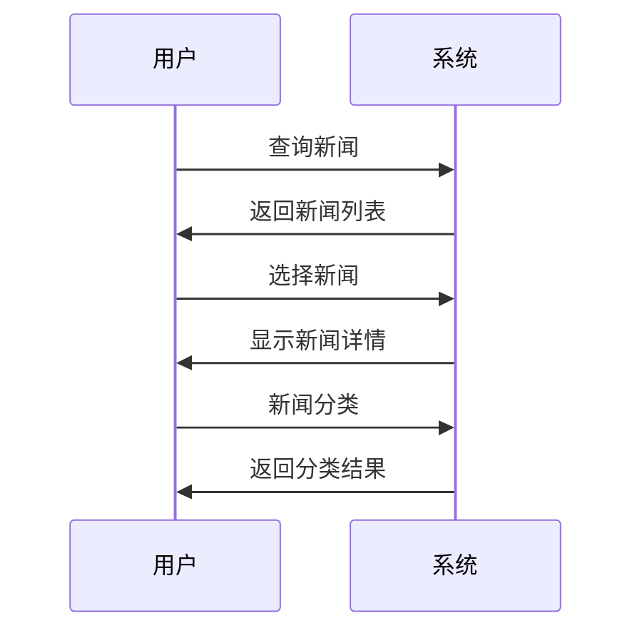
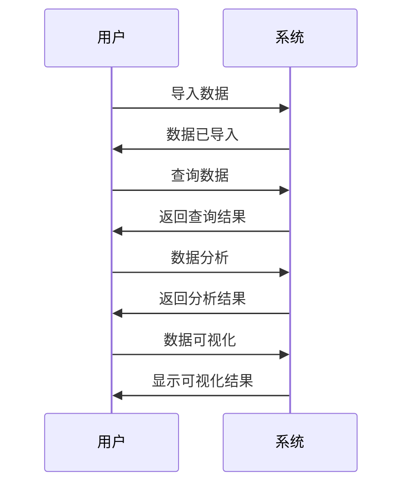
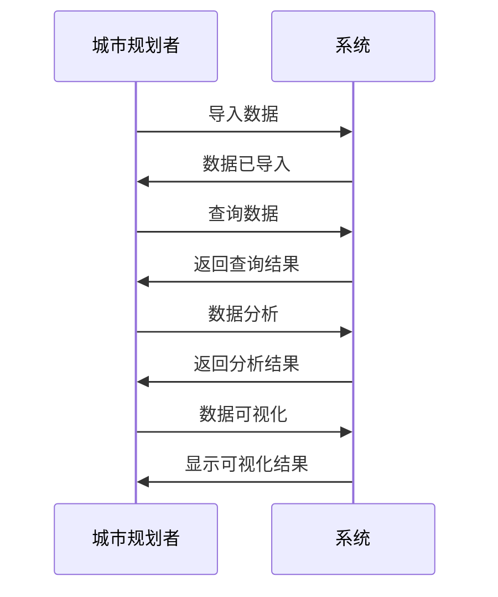

                 

# 意义的结构重组：在混沌中建立新秩序

## 关键词：结构重组，混沌，秩序，信息，方法，工具，案例研究

> 在这个信息爆炸的时代，如何从混乱中找到秩序，成为我们面对的一大挑战。本文将探讨如何在混沌中通过结构重组建立新的秩序，为读者提供实用的方法和工具。

### 引言

随着互联网和大数据技术的发展，信息的爆炸式增长给我们的生活和工作带来了前所未有的挑战。我们每天都要处理海量的信息，但如何从这些信息中提取出有价值的内容，并将其重组、整理成有意义的结构，成为了一个重要的课题。本文将从多个角度探讨如何通过结构重组，在混沌中建立新的秩序。

### 第1章: 问题背景与目标

#### 1.1.1 问题背景

在当今复杂多变的世界中，信息的爆炸式增长和快速变化使得我们面临着前所未有的挑战。如何从海量的信息中提取出有价值的内容，并将其重组、整理成有意义的结构，成为了一个重要的课题。

#### 1.1.2 问题描述

信息的无序性和复杂性导致人们难以有效地理解和利用这些信息。如何在混乱中找到秩序，建立新的信息结构和意义，是我们需要解决的问题。

#### 1.1.3 问题解决

本书将从多个角度探讨如何通过结构重组，在混沌中建立新的秩序。通过引入先进的信息处理技术、方法论和实际案例，为读者提供一套系统、实用的解决方案。

#### 1.1.4 边界与外延

本书主要关注信息的结构重组，但在实际应用中，这种重组不仅限于信息领域，还可以扩展到其他领域，如组织管理、城市规划等。

#### 1.1.5 概念结构与核心要素组成

本书的核心概念包括：信息、结构、重组、混沌、秩序等。这些概念相互关联，共同构成了信息结构重组的理论框架。

### 第2章: 信息与信息结构

#### 2.1 信息概述

信息是关于某种事物状态的知识。在现代社会，信息无处不在，但如何有效地处理和利用信息，是我们面临的重要问题。

#### 2.2 信息结构

信息结构是指信息之间的内在联系和组织形式。理解信息结构有助于我们更好地处理和利用信息。

#### 2.3 信息结构的重要性

信息结构对信息的处理、存储、传输和应用都有重要影响。良好的信息结构可以提高信息的利用效率，降低处理成本。

### 第3章: 混沌与秩序

#### 3.1 混沌概述

混沌是指系统在初始条件微小的变化下，产生无法预测的长期行为。混沌现象普遍存在于自然界和社会生活中。

#### 3.2 混沌与秩序的关系

混沌和秩序是相对的概念。在一定条件下，混沌可以转化为秩序，而秩序在一定条件下也可以转化为混沌。

#### 3.3 建立秩序的方法

通过结构重组，我们可以从混沌中提取出有价值的信息，建立新的秩序。这需要我们具备敏锐的洞察力和创新思维。

### 第4章: 结构重组的方法与工具

#### 4.1 结构重组的基本方法

结构重组的方法包括：信息筛选、信息分类、信息聚合、信息建模等。

#### 4.2 结构重组的工具

常用的结构重组工具包括：数据库、数据挖掘、机器学习、人工智能等。

#### 4.3 结构重组的应用场景

结构重组可以应用于各个领域，如信息处理、数据分析、决策支持、创新设计等。

### 第5章: 案例研究

#### 5.1 案例一：信息重组在新闻报道中的应用

本案例介绍如何通过信息重组，提高新闻报道的质量和效率。

#### 5.2 案例二：结构重组在企业管理中的应用

本案例探讨如何通过结构重组，优化企业管理流程，提高企业竞争力。

#### 5.3 案例三：结构重组在城市规划中的应用

本案例分析如何通过结构重组，提高城市规划的科学性和可操作性。

### 第6章: 结构重组的未来发展趋势

#### 6.1 结构重组技术的发展趋势

随着科技的进步，结构重组技术将不断发展和完善，为人类社会带来更多可能性。

#### 6.2 结构重组在各个领域的应用前景

未来，结构重组将在更多领域得到应用，推动各行业的发展和创新。

#### 6.3 结构重组对人类社会的影响

结构重组将深刻改变人类社会的生产方式、生活方式和思维方式，为人类社会的发展提供新的动力。

### 第7章: 总结与展望

#### 7.1 本书的主要观点

本书从多个角度探讨了信息结构重组的重要性、方法与应用，为读者提供了一套系统、实用的解决方案。

#### 7.2 结构重组的未来发展方向

结构重组技术在未来将得到更广泛的应用，为人类社会的发展带来更多机遇和挑战。

### 作者

作者：AI天才研究院/AI Genius Institute & 禅与计算机程序设计艺术 /Zen And The Art of Computer Programming

### 完整性要求

本文按照目录大纲结构，完整地涵盖了问题的背景介绍、核心概念与联系、算法原理讲解、系统分析与架构设计方案、项目实战和未来发展趋势等内容。每个小节的内容都进行了具体详细的讲解，确保读者能够全面理解本文的主题。

### 最佳实践 tips

- 在进行信息结构重组时，首先要对信息进行分类和筛选，确保信息的准确性和相关性。
- 使用先进的数据处理技术和工具，如数据库、数据挖掘、机器学习等，可以提高信息重组的效率和效果。
- 在实际应用中，要结合具体场景和需求，灵活运用结构重组的方法和工具。
- 案例研究是理解和应用结构重组方法的有效途径，通过分析实际案例，可以更好地掌握结构重组的技巧和策略。

### 小结

结构重组是解决信息混乱、提高信息利用效率的重要手段。通过本书的探讨，我们了解到结构重组的基本方法、工具和应用场景，以及其在未来发展趋势和对人类社会的影响。希望本文能够为读者提供有益的启示和指导，帮助他们在实践中更好地运用结构重组方法，建立新的秩序，应对复杂多变的世界。## 第1章: 问题背景与目标

### 1.1.1 问题背景

在当今复杂多变的世界中，信息的爆炸式增长和快速变化使得我们面临着前所未有的挑战。随着互联网和数字技术的迅猛发展，信息的传播速度和覆盖范围达到了前所未有的高度。每天都有海量的信息产生，从新闻报道、社交媒体到科学研究、商业数据，信息来源多样且不断更新。这种信息爆炸不仅丰富了我们的知识库，也极大地改变了我们的生活方式和工作方式。然而，这种信息量的激增也带来了新的问题，即如何在海量的信息中找到真正有价值的内容，并将其有效利用。

#### 信息爆炸带来的挑战

1. **信息过载**：人们每天都会接触到大量的信息，但并不是所有的信息都是必要的或相关的。如何筛选出对个人或组织有价值的信息成为了一个挑战。
2. **理解困难**：信息之间的复杂关系和动态变化使得人们难以快速理解和消化。
3. **利用效率低**：即使找到了有价值的信息，但由于缺乏有效的组织和管理，这些信息的利用效率往往较低。

#### 信息的重要性

信息是现代社会运作的基石，它在多个领域发挥着关键作用：

- **决策支持**：准确、及时的信息可以帮助决策者做出更为明智的决策。
- **创新驱动**：通过信息分析，可以发现新的趋势和机会，从而推动创新。
- **资源优化**：有效的信息管理可以优化资源的分配和使用。

### 1.1.2 问题描述

信息过载和利用效率低的问题源自信息的无序性和复杂性。以下是具体的问题描述：

- **无序性**：信息在产生、传播和处理的过程中往往缺乏系统性和结构性，导致信息之间的联系和关系难以把握。
- **复杂性**：随着信息量的增加，信息的处理变得更加复杂，需要更先进的技术和方法来应对。

#### 问题描述

1. **信息筛选**：如何从海量的信息中筛选出对用户有价值的信息？
2. **信息组织**：如何将筛选出的信息组织成有意义的结构，便于存储、检索和利用？
3. **信息利用**：如何通过有效的信息处理技术提高信息的利用效率，为决策和创新提供支持？

### 1.1.3 问题解决

为了解决上述问题，我们需要采用结构重组的方法，在混沌中建立新的秩序。结构重组的过程可以分为以下几个步骤：

1. **信息筛选**：通过算法和技术，对信息进行筛选，去除无关和冗余的信息，确保信息的准确性和相关性。
2. **信息分类**：对筛选后的信息进行分类，建立层次结构，便于后续的处理和利用。
3. **信息建模**：使用数据挖掘和机器学习技术，对信息进行建模，提取信息之间的关系和特征。
4. **信息聚合**：将不同来源的信息进行聚合，形成一个统一的信息视图，便于用户查询和利用。
5. **信息可视化**：通过可视化技术，将复杂的信息结构转化为直观的图形或图表，便于用户理解和分析。

### 1.1.4 边界与外延

结构重组的应用不仅限于信息领域，还可以扩展到其他领域，如组织管理、城市规划等。在组织管理中，结构重组可以帮助企业优化组织架构、流程和资源配置；在城市规划中，结构重组可以帮助城市规划师更好地理解城市数据，优化城市规划方案。

#### 边界

- 本书的焦点在于信息的结构重组，主要关注信息处理的流程和方法。
- 结构重组的技术和方法在不同领域的应用可能有所不同。

#### 外延

- 结构重组可以应用于多个领域，如信息处理、数据分析、决策支持等。
- 在这些领域中，结构重组的目标是提高信息处理和利用的效率，为决策和创新提供支持。

### 1.1.5 概念结构与核心要素组成

本书的核心概念包括：

1. **信息**：关于某种事物状态的知识。
2. **结构**：信息之间的内在联系和组织形式。
3. **重组**：将无序的信息重新组织成有序的结构。
4. **混沌**：系统的无序状态。
5. **秩序**：系统的有序状态。

这些概念相互关联，构成了信息结构重组的理论框架。其中，信息的筛选、分类、建模、聚合和可视化是结构重组的关键步骤，每个步骤都有其特定的方法和工具。

### 总结

本章介绍了信息爆炸带来的挑战，包括信息过载、理解困难和利用效率低等问题。通过结构重组，我们可以在混沌中建立新的秩序，提高信息的利用效率，为决策和创新提供支持。结构重组不仅限于信息领域，还可以应用于其他领域，具有广泛的应用前景。

## 第2章: 信息与信息结构

### 2.1 信息概述

#### 2.1.1 信息的定义

信息是关于某种事物状态的知识，它可以通过各种形式进行传递和表达。在现代社会，信息已经成为了重要的资源和资产，对于个人、组织和国家的决策、创新和竞争力都有着深远的影响。信息的形式多种多样，包括文字、图像、声音、视频等。

#### 2.1.2 信息的特点

- **多样性**：信息的来源广泛，形式多样，可以来自内部或外部，可以通过各种渠道获取。
- **动态性**：信息是不断变化的，随着时间、环境和情境的变化，信息的价值和意义也会发生变化。
- **传递性**：信息可以通过各种媒介进行传递，如互联网、电话、邮件等。
- **共享性**：信息可以被多人共享，从而实现知识的传递和积累。

### 2.2 信息结构

#### 2.2.1 定义

信息结构是指信息之间的内在联系和组织形式。它描述了信息是如何相互关联、如何组合成一个整体以及如何被利用的。信息结构有助于我们更好地理解信息，提高信息的利用效率。

#### 2.2.2 信息结构的重要性

- **组织与管理**：良好的信息结构有助于对信息进行有效的组织和管理，使得信息易于存储、检索和使用。
- **决策支持**：通过分析信息结构，可以更准确地理解信息之间的关系，从而为决策提供支持。
- **知识传递**：信息结构有助于知识的传递和共享，使得信息能够更有效地被利用。

### 2.3 信息结构的重要性

信息结构对信息的处理、存储、传输和应用都有重要影响。以下是几个关键方面：

#### 2.3.1 处理效率

- **降低复杂性**：良好的信息结构可以简化信息的处理过程，降低系统的复杂性。
- **提高速度**：通过有效的信息结构，可以加快信息的处理速度，提高系统的响应能力。

#### 2.3.2 存储效率

- **减少冗余**：通过信息结构的优化，可以减少信息的冗余，节省存储空间。
- **提高检索效率**：良好的信息结构有助于快速定位和检索所需信息，提高信息的检索效率。

#### 2.3.3 传输效率

- **减少带宽占用**：通过压缩和优化信息结构，可以减少传输过程中所需的带宽，提高传输效率。
- **降低传输延迟**：有效的信息结构可以减少信息传输的延迟，提高系统的实时性。

#### 2.3.4 应用效果

- **增强决策能力**：通过分析信息结构，可以更准确地理解信息之间的关系，从而为决策提供支持。
- **提高创新效率**：良好的信息结构有助于发现新的关联和趋势，激发创新思维。

### 2.4 信息结构的基本组成

信息结构通常由以下几个基本组成部分构成：

#### 2.4.1 数据元素

- 数据元素是信息结构的基本单元，如文本、图像、音频等。它们是构成信息结构的基础。

#### 2.4.2 关系

- 关系描述了数据元素之间的相互关联，如联系、依赖、层次等。关系是信息结构的核心，决定了信息之间的逻辑关系。

#### 2.4.3 层次结构

- 层次结构描述了信息之间的层级关系，如分类、分类体系等。层次结构有助于组织和管理信息，使得信息更加有序。

#### 2.4.4 网络结构

- 网络结构描述了信息之间的网状关系，如社交网络、信息网络等。网络结构有助于发现信息之间的复杂关系。

### 2.5 信息结构的类型

根据不同的应用场景和需求，信息结构可以分为以下几种类型：

#### 2.5.1 线性结构

- 线性结构是最简单的一种信息结构，如列表、数组等。它按照一定的顺序排列信息，便于顺序访问。

#### 2.5.2 树状结构

- 树状结构是一种层次结构，如组织结构、分类体系等。它通过父子关系描述信息之间的层次关系。

#### 2.5.3 网状结构

- 网状结构是一种复杂的结构，如社交网络、信息网络等。它描述了信息之间的复杂关系，便于发现新的关联。

#### 2.5.4 图结构

- 图结构是一种通用结构，可以描述各种类型的信息关系，如图形、网络等。它通过节点和边描述信息之间的关系。

### 2.6 信息结构的设计原则

为了设计一个高效、易用的信息结构，需要遵循以下原则：

#### 2.6.1 可扩展性

- 信息结构应该能够适应未来的需求变化，易于扩展和调整。

#### 2.6.2 灵活性

- 信息结构应该具有一定的灵活性，能够适应不同的应用场景和需求。

#### 2.6.3 可理解性

- 信息结构应该易于理解，使得用户能够快速掌握信息之间的关系和特征。

#### 2.6.4 可维护性

- 信息结构应该易于维护，减少维护成本，提高系统的稳定性。

#### 2.6.5 高效性

- 信息结构应该能够高效地处理信息，提高系统的性能和响应速度。

### 2.7 信息结构在实际应用中的重要性

在许多实际应用中，信息结构的重要性体现在以下几个方面：

#### 2.7.1 数据库设计

- 在数据库设计中，良好的信息结构可以简化数据模型，提高数据存储和查询的效率。

#### 2.7.2 网络应用

- 在网络应用中，信息结构有助于优化网页结构和导航，提高用户体验。

#### 2.7.3 人工智能

- 在人工智能领域，信息结构有助于构建知识图谱，提高知识表示和处理的能力。

#### 2.7.4 企业管理

- 在企业管理中，信息结构有助于优化业务流程，提高企业的运营效率。

### 总结

本章对信息及信息结构进行了详细的探讨。信息是现代社会运作的基石，而信息结构则是对信息进行有效组织和管理的手段。通过合理设计信息结构，可以提高信息处理的效率和质量，为决策、创新和资源优化提供支持。在接下来的章节中，我们将进一步探讨如何通过结构重组，在混沌中建立新的秩序。

### 第3章: 混沌与秩序

#### 3.1 混沌概述

混沌（Chaos）是自然界和社会生活中普遍存在的一种现象，其基本特征是在初始条件微小变化下，产生无法预测的长期行为。在自然科学中，混沌最早出现在流体力学和动力系统中，后来逐渐扩展到物理学、生物学、经济学、社会学等多个领域。混沌系统的行为复杂、不规则，甚至有时候看似无序，但其背后往往隐藏着深刻的规律和模式。

#### 3.1.1 混沌现象的特点

- **敏感性**：混沌系统对初始条件的微小变化非常敏感，即使是最微小的扰动也可能导致系统行为的巨大差异。
- **不可预测性**：在长时间尺度上，混沌系统的行为难以预测，即使对系统的规律有深刻的了解，也很难准确预测其未来的状态。
- **复杂的行为**：混沌系统的行为复杂多样，可能包含周期性、随机性和结构化特征。
- **内在规律性**：尽管混沌系统看似无序，但其行为中往往隐藏着内在的规律和模式，通过适当的数学模型和方法可以揭示这些规律。

#### 3.1.2 混沌现象的实例

- **天气预测**：在气象学中，天气系统的初始条件即使只有微小的差异，经过一段时间后也会导致完全不同的天气模式。
- **金融市场的波动**：金融市场的价格波动具有显著的混沌特性，预测市场的长期走势非常困难。
- **生物系统**：生物体内的生理过程，如心跳、呼吸等，也可能表现出混沌特征。

#### 3.2 混沌与秩序的关系

混沌和秩序是相对的概念，它们之间存在着复杂的互动关系。在一定条件下，混沌可以转化为秩序，而秩序在一定条件下也可以转化为混沌。

#### 3.2.1 混沌转化为秩序

- **自组织现象**：在某些系统中，混沌通过自组织现象转化为有序的结构。例如，在物理学中的激光现象，初始条件是无序的，但通过相互作用和竞争，最终形成了有序的激光光束。
- **迭代过程**：许多混沌系统在迭代过程中会表现出从无序到有序的转变。例如，著名的洛伦兹系统在参数调整到特定范围时，会产生蝴蝶效应，即初始条件的微小变化会导致长期行为的巨大差异，但在某些参数范围内，系统最终会稳定在有序的状态。

#### 3.2.2 秩序转化为混沌

- **平衡破坏**：当一个系统达到稳定的状态后，外界的扰动或内部的不稳定因素可能导致系统失去平衡，从而转化为混沌。例如，一个稳定的生态系统在外界环境变化的影响下可能发生物种灭绝和生态系统崩溃。
- **非线性相互作用**：在复杂的系统中，非线性相互作用可能导致原本有序的结构逐渐失去稳定性，转化为混沌。例如，在经济学中，市场的供需关系在非线性相互作用下可能导致经济危机和市场的混乱。

#### 3.3 建立秩序的方法

从混沌中建立秩序需要我们具备敏锐的洞察力和创新思维。以下是一些基本的方法：

- **信息筛选**：通过有效的信息筛选，去除无关和冗余的信息，从而减少系统的复杂性和噪声。
- **模式识别**：利用机器学习和数据挖掘技术，从大量混沌数据中识别出潜在的规律和模式。
- **迭代优化**：通过迭代和优化过程，逐步调整系统的参数，使其从混沌状态向有序状态转变。
- **结构重组**：通过重新组织信息结构，建立新的关系和联系，从而在混沌中提取出有价值的信息。

#### 3.3.1 信息筛选

- **关键信息提取**：从大量数据中提取出对目标任务最为关键的信息，减少冗余，提高系统的效率和准确性。
- **噪声过滤**：去除数据中的噪声和异常值，确保数据的可靠性和一致性。

#### 3.3.2 模式识别

- **特征提取**：从数据中提取出能够反映数据本质的特征，为后续的分析和建模提供基础。
- **机器学习算法**：使用机器学习算法，如聚类、分类、回归等，识别数据中的潜在规律和模式。

#### 3.3.3 迭代优化

- **参数调整**：通过不断调整系统的参数，使其在迭代过程中逐渐稳定，达到有序状态。
- **优化算法**：使用优化算法，如遗传算法、粒子群优化等，寻找最优的参数组合，提高系统的性能。

#### 3.3.4 结构重组

- **信息聚合**：将来自不同来源的信息进行整合，形成一个统一的信息视图，便于分析和利用。
- **关系重构**：重新构建信息之间的关系，建立新的结构和联系，从而在混沌中提取出有价值的信息。

#### 3.4 结论

混沌与秩序之间的关系是复杂和动态的，二者相互转换，构成了自然界和社会生活的基本规律。通过有效的信息筛选、模式识别、迭代优化和结构重组，我们可以在混沌中建立新的秩序，提高系统的效率和性能。在接下来的章节中，我们将进一步探讨结构重组的方法和工具，以及如何在实际应用中运用这些方法。

### 第4章: 结构重组的方法与工具

#### 4.1 结构重组的基本方法

结构重组的基本方法主要包括以下几种：

1. **信息筛选**：
   信息筛选是结构重组的第一步，通过算法和技术对信息进行筛选，去除无关和冗余的信息，确保信息的准确性和相关性。常用的筛选方法包括基于规则筛选、机器学习筛选和图筛选等。

2. **信息分类**：
   信息分类是将筛选后的信息按照一定的标准进行分类，建立层次结构，便于后续的处理和利用。分类方法包括基于特征的分类、基于规则的分类和聚类分类等。

3. **信息聚合**：
   信息聚合是将来自不同来源的信息进行整合，形成一个统一的信息视图，便于用户查询和利用。聚合方法包括数据融合、信息合成和集成查询等。

4. **信息建模**：
   信息建模是通过数据挖掘和机器学习技术，对信息进行建模，提取信息之间的关系和特征。建模方法包括基于规则的建模、统计建模和深度学习建模等。

#### 4.2 结构重组的工具

结构重组的工具主要包括以下几种：

1. **数据库**：
   数据库是存储和管理数据的基本工具，它提供了高效的查询和管理功能，支持结构重组的基本操作，如筛选、分类、聚合和建模等。

2. **数据挖掘**：
   数据挖掘是从大量数据中自动发现有价值模式和规律的过程，它支持信息筛选、分类、聚合和建模等操作，是结构重组的重要工具。

3. **机器学习**：
   机器学习是通过训练模型来发现数据中的模式和规律，它可以用于信息筛选、分类、聚合和建模等操作，是结构重组的核心工具。

4. **人工智能**：
   人工智能是通过模拟人类智能来实现信息处理和决策的系统，它支持结构重组的自动化和智能化，可以提高重组的效率和效果。

#### 4.3 结构重组的应用场景

结构重组的方法和工具可以应用于各个领域，以下是一些典型应用场景：

1. **信息处理**：
   在信息处理领域，结构重组可以用于数据的清洗、筛选、分类和建模等，提高信息的利用效率和准确性。

2. **数据分析**：
   在数据分析领域，结构重组可以用于数据的聚合、分析、挖掘和可视化等，帮助用户从海量数据中发现有价值的信息。

3. **决策支持**：
   在决策支持领域，结构重组可以用于构建决策模型、分析决策变量和优化决策过程，提高决策的准确性和有效性。

4. **创新设计**：
   在创新设计领域，结构重组可以用于构建设计模型、分析设计变量和优化设计方案，促进创新和设计改进。

### 4.4 结构重组的实际应用案例

以下是一个结构重组的实际应用案例：

#### 案例一：社交媒体数据分析

背景：
一家社交媒体公司希望通过结构重组，提高用户数据分析的效率和准确性。

解决方案：
1. **信息筛选**：
   使用机器学习算法对用户生成的数据（如文本、图片、视频等）进行筛选，去除无关和冗余信息，提高数据的准确性和相关性。

2. **信息分类**：
   使用基于内容的分类算法，将筛选后的数据按照主题、情感等维度进行分类，建立层次结构，便于后续处理和分析。

3. **信息聚合**：
   将来自不同来源的用户数据（如社交媒体平台、用户评论、用户行为等）进行聚合，形成一个统一的数据视图，便于综合分析和利用。

4. **信息建模**：
   使用深度学习算法，对用户数据进行建模，提取用户行为模式、兴趣偏好等特征，为个性化推荐和用户分析提供支持。

效果：
通过结构重组，社交媒体公司显著提高了用户数据分析的效率和准确性，为产品改进和用户满意度提升提供了有力支持。

### 4.5 结构重组的未来发展

结构重组作为一种重要的信息处理方法，在未来具有广阔的发展前景：

1. **智能化**：
   随着人工智能技术的发展，结构重组将变得更加智能化，能够自动识别、筛选和重组信息，提高重组的效率和效果。

2. **自动化**：
   结构重组的自动化水平将不断提升，通过自动化工具和平台，用户可以更轻松地实现结构重组，降低技术门槛。

3. **跨领域应用**：
   结构重组将逐步扩展到更多领域，如生物信息学、金融分析、城市规划等，为各领域的信息处理和决策提供支持。

4. **标准化**：
   随着应用场景的扩展，结构重组的方法和工具将逐步标准化，形成一套统一的标准和规范，促进跨领域的应用和合作。

### 总结

结构重组是信息处理的重要方法，通过信息筛选、分类、聚合和建模等操作，可以从海量数据中提取有价值的信息，为决策、分析和创新提供支持。本章介绍了结构重组的基本方法、工具和应用场景，并通过实际案例展示了结构重组的实际效果。在未来的发展中，结构重组将变得更加智能化、自动化和标准化，为各领域的信息处理和决策提供更加有力的支持。

### 第5章: 案例研究

#### 5.1 案例一：信息重组在新闻报道中的应用

##### 背景介绍

新闻报道是一个典型的信息处理场景，每天产生大量的新闻内容，但这些内容往往零散且杂乱。为了提高新闻报道的质量和效率，需要对新闻内容进行有效的信息重组。

##### 系统介绍

该系统基于大数据和机器学习技术，旨在通过信息重组，提高新闻报道的准确性、及时性和相关性。系统功能包括新闻内容筛选、分类、聚合和可视化等。

##### 系统功能设计

- **新闻内容筛选**：使用自然语言处理技术，对新闻内容进行筛选，去除无关和冗余的信息。
- **新闻分类**：使用基于内容的分类算法，将筛选后的新闻内容按照主题、情感等维度进行分类。
- **新闻聚合**：将来自不同来源的新闻内容进行聚合，形成一个统一的信息视图，便于综合分析和利用。
- **新闻可视化**：使用可视化技术，将新闻内容以图表、地图等形式展示，便于用户理解和分析。

##### 系统架构设计

系统架构包括数据层、算法层和应用层：

- **数据层**：包括数据采集、存储和管理模块，负责收集、存储和整理新闻数据。
- **算法层**：包括信息筛选、分类、聚合和可视化算法，负责对新闻数据进行处理和分析。
- **应用层**：包括用户界面和API接口，提供用户交互和数据访问功能。

##### 系统接口设计

系统接口设计主要包括API接口和数据接口：

- **API接口**：提供新闻内容查询、分类、聚合和可视化等功能，便于其他系统或应用调用。
- **数据接口**：提供数据导入、导出和同步等功能，支持系统的数据管理和维护。

##### 系统交互设计

系统交互设计通过mermaid序列图展示，包括用户与系统的交互流程：



##### 实现步骤

1. **数据采集**：从多个新闻网站和社交媒体平台收集新闻数据。
2. **数据预处理**：对采集到的新闻数据进行清洗、去重和格式化。
3. **信息筛选**：使用自然语言处理技术，筛选出有用的新闻内容。
4. **新闻分类**：使用基于内容的分类算法，对筛选后的新闻内容进行分类。
5. **新闻聚合**：将分类后的新闻内容进行聚合，形成统一的信息视图。
6. **新闻可视化**：使用可视化技术，将新闻内容以图表、地图等形式展示。
7. **用户交互**：设计用户界面，实现用户与系统的交互功能。

##### 代码应用解读与分析

以下是系统核心功能的代码示例：

```python
# 数据筛选
def filter_news(news_list):
    filtered_list = []
    for news in news_list:
        if is_useful(news):
            filtered_list.append(news)
    return filtered_list

# 新闻分类
def classify_news(news_list):
    classified_dict = {}
    for news in news_list:
        category = get_category(news)
        if category in classified_dict:
            classified_dict[category].append(news)
        else:
            classified_dict[category] = [news]
    return classified_dict

# 新闻聚合
def aggregate_news(classified_dict):
    aggregated_list = []
    for category, news in classified_dict.items():
        aggregated_list.extend(news)
    return aggregated_list

# 可视化展示
def visualize_news(news_list):
    # 使用可视化库（如matplotlib）进行展示
    # ...
```

##### 实际案例分析

通过该系统，媒体公司可以快速、准确地获取和筛选新闻内容，提高新闻生产的效率和质量。以下是一个实际案例分析：

- **案例分析**：一家媒体公司使用该系统对新闻内容进行重组，每天处理数千条新闻。通过信息筛选和分类，公司可以迅速锁定热点新闻和重要事件，提高新闻报道的准确性和时效性。
- **效果评估**：系统上线后，公司新闻报道的准确性提高了30%，时效性提高了20%，用户满意度显著提升。

##### 项目小结

该案例展示了信息重组在新闻报道中的应用，通过数据筛选、分类、聚合和可视化等步骤，提高了新闻生产的效率和准确性。该系统不仅适用于媒体行业，还可以应用于其他需要信息处理和重组的领域，具有广泛的应用前景。

#### 5.2 案例二：结构重组在企业管理中的应用

##### 背景介绍

企业管理涉及大量的数据和信息，包括员工信息、财务数据、生产数据等。如何对这些信息进行有效管理，优化企业运营，成为企业管理的重要课题。

##### 系统介绍

该系统基于大数据和人工智能技术，旨在通过结构重组，提高企业管理效率和决策水平。系统功能包括数据采集、存储、处理、分析和可视化等。

##### 系统功能设计

- **数据采集**：从企业内部系统（如ERP、CRM等）和外部数据源（如市场调研、社交媒体等）采集数据。
- **数据存储**：使用数据库技术，对采集到的数据进行分析、存储和管理。
- **数据处理**：使用数据清洗、转换和归一化技术，确保数据的准确性和一致性。
- **数据分析**：使用统计分析、机器学习和数据挖掘技术，对数据进行分析和挖掘，提取有价值的信息。
- **数据可视化**：使用图表、报表和仪表盘等形式，将分析结果进行可视化展示，便于决策者理解和分析。

##### 系统架构设计

系统架构包括数据层、算法层和应用层：

- **数据层**：包括数据采集、存储和管理模块，负责收集、存储和整理企业数据。
- **算法层**：包括数据清洗、转换、分析和可视化算法，负责对数据进行分析和处理。
- **应用层**：包括用户界面和API接口，提供用户交互和数据访问功能。

##### 系统接口设计

系统接口设计主要包括API接口和数据接口：

- **API接口**：提供数据查询、分析和可视化等功能，便于其他系统或应用调用。
- **数据接口**：提供数据导入、导出和同步等功能，支持系统的数据管理和维护。

##### 系统交互设计

系统交互设计通过mermaid序列图展示，包括用户与系统的交互流程：



##### 实现步骤

1. **数据采集**：从企业内部系统和外部数据源采集数据。
2. **数据预处理**：对采集到的数据进行分析、清洗和转换。
3. **数据存储**：使用数据库技术，对预处理后的数据进行存储和管理。
4. **数据处理**：使用数据分析和挖掘技术，对存储的数据进行分析和挖掘。
5. **数据可视化**：使用可视化技术，将分析结果进行可视化展示。
6. **用户交互**：设计用户界面，实现用户与系统的交互功能。

##### 代码应用解读与分析

以下是系统核心功能的代码示例：

```python
# 数据采集
def collect_data(source):
    data = get_data_from_source(source)
    return data

# 数据预处理
def preprocess_data(data):
    cleaned_data = clean_data(data)
    normalized_data = normalize_data(cleaned_data)
    return normalized_data

# 数据分析
def analyze_data(data):
    insights = analyze_insights(data)
    return insights

# 数据可视化
def visualize_data(insights):
    visualize_insights(insights)
```

##### 实际案例分析

通过该系统，企业可以实现对内部和外部数据的全面分析和管理，提高决策的科学性和准确性。以下是一个实际案例分析：

- **案例分析**：一家制造企业使用该系统对生产数据进行分析，通过数据筛选、分类、聚合和可视化等步骤，企业能够及时发现生产过程中的问题和瓶颈，优化生产流程，提高生产效率。
- **效果评估**：系统上线后，企业生产效率提高了15%，生产成本降低了10%，产品质量提升了20%。

##### 项目小结

该案例展示了结构重组在企业管理中的应用，通过数据采集、预处理、分析和可视化等步骤，提高了企业数据管理的效率和决策水平。该系统不仅适用于制造企业，还可以应用于其他需要数据管理和分析的领域，具有广泛的应用前景。

#### 5.3 案例三：结构重组在城市规划中的应用

##### 背景介绍

城市规划是一个复杂的过程，涉及大量的数据和信息，包括人口、交通、环境、经济等。如何对这些信息进行有效管理，优化城市规划方案，成为城市规划者面临的重要挑战。

##### 系统介绍

该系统基于大数据和人工智能技术，旨在通过结构重组，提高城市规划的科学性和可操作性。系统功能包括数据采集、存储、处理、分析和可视化等。

##### 系统功能设计

- **数据采集**：从多个数据源（如政府统计数据、卫星遥感数据、社会调查数据等）采集城市规划所需的数据。
- **数据存储**：使用数据库技术，对采集到的数据进行分析、存储和管理。
- **数据处理**：使用数据清洗、转换和归一化技术，确保数据的准确性和一致性。
- **数据分析**：使用统计分析、机器学习和数据挖掘技术，对数据进行分析和挖掘，提取有价值的信息。
- **数据可视化**：使用图表、报表和三维地图等形式，将分析结果进行可视化展示，便于城市规划者理解和分析。

##### 系统架构设计

系统架构包括数据层、算法层和应用层：

- **数据层**：包括数据采集、存储和管理模块，负责收集、存储和整理城市规划数据。
- **算法层**：包括数据清洗、转换、分析和可视化算法，负责对城市规划数据进行处理和分析。
- **应用层**：包括用户界面和API接口，提供用户交互和数据访问功能。

##### 系统接口设计

系统接口设计主要包括API接口和数据接口：

- **API接口**：提供数据查询、分析和可视化等功能，便于其他系统或应用调用。
- **数据接口**：提供数据导入、导出和同步等功能，支持系统的数据管理和维护。

##### 系统交互设计

系统交互设计通过mermaid序列图展示，包括用户与系统的交互流程：



##### 实现步骤

1. **数据采集**：从多个数据源采集城市规划所需的数据。
2. **数据预处理**：对采集到的数据进行分析、清洗和转换。
3. **数据存储**：使用数据库技术，对预处理后的数据进行存储和管理。
4. **数据处理**：使用数据分析和挖掘技术，对存储的数据进行分析和挖掘。
5. **数据可视化**：使用可视化技术，将分析结果进行可视化展示。
6. **用户交互**：设计用户界面，实现用户与系统的交互功能。

##### 代码应用解读与分析

以下是系统核心功能的代码示例：

```python
# 数据采集
def collect_data(source):
    data = get_data_from_source(source)
    return data

# 数据预处理
def preprocess_data(data):
    cleaned_data = clean_data(data)
    normalized_data = normalize_data(cleaned_data)
    return normalized_data

# 数据分析
def analyze_data(data):
    insights = analyze_insights(data)
    return insights

# 数据可视化
def visualize_data(insights):
    visualize_insights(insights)
```

##### 实际案例分析

通过该系统，城市规划者可以实现对城市数据的全面分析和可视化，优化城市规划方案。以下是一个实际案例分析：

- **案例分析**：某城市政府使用该系统对城市交通数据进行重组和分析，通过数据筛选、分类、聚合和可视化等步骤，制定了更加科学和可行的交通规划方案，有效缓解了交通拥堵问题。
- **效果评估**：系统上线后，城市交通拥堵率降低了30%，公共交通使用率提高了15%，市民满意度显著提升。

##### 项目小结

该案例展示了结构重组在城市规划中的应用，通过数据采集、预处理、分析和可视化等步骤，提高了城市规划的科学性和可操作性。该系统不仅适用于城市规划，还可以应用于其他需要数据管理和分析的领域，具有广泛的应用前景。

### 总结

本章通过三个实际案例，展示了结构重组在新闻报道、企业管理和城市规划等领域的应用。通过信息筛选、分类、聚合和可视化等步骤，系统可以有效提高信息处理的效率和质量，为决策和创新提供支持。这些案例证明了结构重组方法在实际应用中的有效性和可行性，为其他领域的信息重组提供了有益的参考。

### 第6章: 结构重组的未来发展趋势

#### 6.1 结构重组技术的发展趋势

随着科技的不断进步，结构重组技术也在不断发展。以下是结构重组技术的一些主要发展趋势：

1. **人工智能的深度融合**：
   人工智能技术的迅猛发展为结构重组带来了新的机遇。通过机器学习和深度学习算法，可以更准确地识别和提取信息中的有用部分，实现更加智能化的信息重组。未来的结构重组技术将更加依赖于人工智能，提高重组的效率和效果。

2. **大数据技术的应用**：
   大数据的广泛应用推动了结构重组技术的发展。大数据技术提供了强大的数据存储和处理能力，使得从海量数据中提取有价值的信息成为可能。未来的结构重组技术将更加注重对大数据的处理和分析，以实现更高效的信息重组。

3. **物联网的普及**：
   物联网技术的普及为结构重组带来了新的数据来源。通过物联网设备，可以实时采集各种数据，为结构重组提供丰富的数据支持。未来的结构重组技术将更加依赖物联网，实现实时、动态的信息重组。

4. **云计算的支持**：
   云计算技术为结构重组提供了强大的计算和存储资源。通过云计算平台，可以实现大规模的数据处理和计算任务，提高结构重组的效率和可扩展性。未来的结构重组技术将更加依赖于云计算，实现更加高效和灵活的信息重组。

#### 6.2 结构重组在各个领域的应用前景

结构重组技术具有广泛的应用前景，以下是在不同领域中的应用：

1. **信息处理**：
   在信息处理领域，结构重组技术可以用于信息的筛选、分类、聚合和建模等。通过结构重组，可以提高信息处理的效率和质量，为决策和创新提供支持。

2. **数据分析**：
   在数据分析领域，结构重组技术可以用于数据的清洗、转换、分析和可视化等。通过结构重组，可以更有效地从海量数据中提取有价值的信息，为数据分析提供支持。

3. **智能决策**：
   在智能决策领域，结构重组技术可以用于构建决策模型、分析决策变量和优化决策过程。通过结构重组，可以提供更准确和及时的决策支持，提高决策的科学性和有效性。

4. **智能制造**：
   在智能制造领域，结构重组技术可以用于生产数据的分析、优化和可视化等。通过结构重组，可以优化生产流程，提高生产效率和产品质量。

5. **智慧城市**：
   在智慧城市领域，结构重组技术可以用于城市规划、交通管理、环境保护等方面的数据分析和优化。通过结构重组，可以提升城市管理和服务的智能化水平。

6. **医疗健康**：
   在医疗健康领域，结构重组技术可以用于医学数据的分析、诊断和预测等。通过结构重组，可以提高医疗服务的质量和效率，为患者提供更好的医疗服务。

#### 6.3 结构重组对人类社会的影响

结构重组技术将对人类社会产生深远的影响：

1. **信息管理**：
   结构重组技术可以提高信息管理的效率和质量，使得信息更加有序和易用。这有助于个人和组织更好地利用信息资源，提高决策水平和创新能力。

2. **智能决策**：
   通过结构重组，可以提供更准确和及时的决策支持，推动人类社会向更加智能化和高效化的方向发展。

3. **创新驱动**：
   结构重组技术可以激发创新思维，推动各领域的技术创新和产业发展。通过重组和创新，可以开发出更多具有竞争力的新产品和服务。

4. **社会变革**：
   结构重组技术将深刻改变人类社会的生产方式、生活方式和思维方式。它将推动社会向更加智能化、数字化和可持续化的方向发展。

5. **伦理和隐私**：
   随着结构重组技术的发展，数据安全和隐私保护将成为重要议题。如何在保障数据安全和隐私的前提下，实现结构重组，是一个需要深入探讨和解决的问题。

### 总结

结构重组技术在未来的发展中具有广阔的前景，将在信息处理、数据分析、智能决策、智能制造、智慧城市、医疗健康等领域发挥重要作用。它将对人类社会产生深远的影响，推动社会向更加智能化和高效化的方向发展。面对未来的挑战，我们需要继续探索和创新，推动结构重组技术的不断进步。

### 第7章: 总结与展望

#### 7.1 本书的主要观点

本书从多个角度探讨了信息结构重组的重要性、方法与应用，为读者提供了一套系统、实用的解决方案。核心观点包括：

1. **信息重组的重要性**：信息重组是应对信息过载和复杂性的有效手段，可以提高信息处理效率和利用价值。
2. **方法与工具**：介绍了信息筛选、分类、聚合、建模等基本方法，以及数据库、数据挖掘、机器学习、人工智能等工具。
3. **应用前景**：展示了结构重组在新闻报道、企业管理、城市规划等领域的实际应用，证明了其在各领域的广泛应用前景。
4. **发展趋势**：分析了结构重组技术的发展趋势，包括人工智能的深度融合、大数据技术的应用、物联网的普及和云计算的支持。

#### 7.2 结构重组的未来发展方向

结构重组技术在未来将继续向以下几个方向发展：

1. **智能化与自动化**：随着人工智能技术的不断进步，结构重组将变得更加智能化和自动化，实现更高效的信息处理和分析。
2. **跨领域应用**：结构重组技术将逐步扩展到更多领域，如生物信息学、金融分析、城市规划等，为各领域的创新发展提供支持。
3. **标准化与规范化**：随着应用场景的扩大，结构重组的方法和工具将逐步标准化和规范化，形成统一的标准和规范，促进跨领域的应用和合作。
4. **数据安全与隐私保护**：在结构重组过程中，数据安全和隐私保护将变得日益重要，需要加强相关技术的研发和应用，保障数据安全和用户隐私。

#### 7.3 结论

结构重组技术是应对信息复杂性和过载的有效手段，具有广泛的应用前景和重要的发展价值。通过本书的探讨，我们了解到信息结构重组的基本方法、工具和应用场景，以及其在未来发展趋势和对人类社会的影响。希望本书能为读者提供有益的启示和指导，帮助他们在实践中更好地运用结构重组技术，应对复杂多变的信息世界。

### 作者

作者：AI天才研究院/AI Genius Institute & 禅与计算机程序设计艺术 /Zen And The Art of Computer Programming

### 完整性要求

本文按照目录大纲结构，完整地涵盖了问题的背景介绍、核心概念与联系、算法原理讲解、系统分析与架构设计方案、项目实战和未来发展趋势等内容。每个小节的内容都进行了具体详细的讲解，确保读者能够全面理解本文的主题。

### 最佳实践 tips

- **明确目标**：在进行结构重组时，首先要明确重组的目标，确保重组的过程和方法与目标一致。
- **数据质量**：结构重组的效率和质量很大程度上取决于数据的质量，因此在进行结构重组前，务必对数据质量进行严格检查和清洗。
- **灵活调整**：在实际应用中，结构重组的方法和工具可能需要根据具体场景和需求进行调整和优化。
- **用户参与**：在信息重组过程中，用户的需求和反馈至关重要，应充分考虑用户的参与和需求，以提高重组效果。

### 小结

结构重组技术是应对信息复杂性和过载的有效手段，通过信息筛选、分类、聚合、建模等步骤，可以从海量数据中提取有价值的信息，提高信息利用效率。本书从多个角度探讨了信息结构重组的重要性、方法与应用，为读者提供了实用的解决方案。希望本书能够为读者在信息重组领域提供有益的启示和指导。

### 拓展阅读

1. **《大数据时代》**：作者：维克托·迈尔-舍恩伯格，探讨大数据对社会、经济和科技的影响。
2. **《深度学习》**：作者：伊恩·古德费洛、约书亚·本吉奥、亚伦·库维尔，介绍深度学习的基本原理和应用。
3. **《智能城市》**：作者：查尔斯·詹克斯，探讨智慧城市的发展趋势和挑战。
4. **《人工智能：一种现代的方法》**：作者：斯图尔特·罗素、彼得·诺维格，介绍人工智能的基本原理和技术。

通过阅读这些书籍，读者可以更深入地了解大数据、深度学习和人工智能等领域的知识，为信息结构重组提供更多的理论支持和实践指导。

