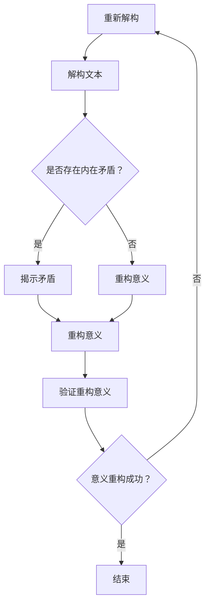
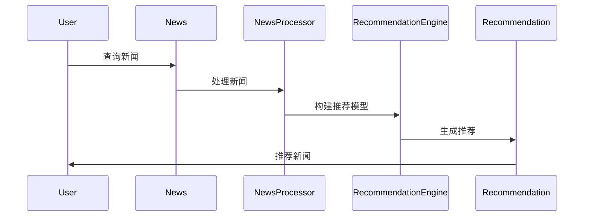
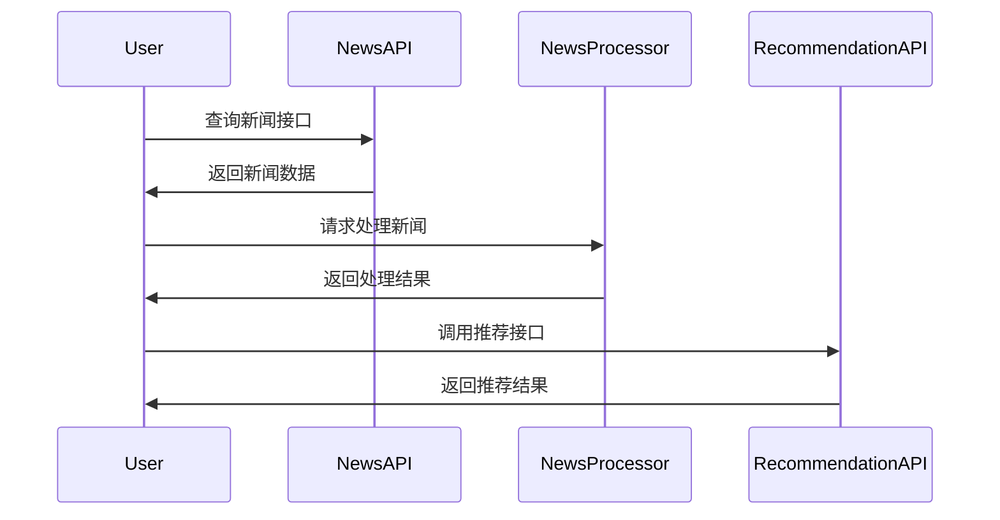

                 

### 引言

在当今社会，意义的解构与重构已经成为一个无法忽视的哲学任务。随着科技的迅猛发展和全球化进程的加速，人们的生活方式和思想观念发生了翻天覆地的变化。传统哲学观念在现代社会中逐渐显得不再适用，甚至显得有些过时和陈旧。后现代哲学正是为了应对这一挑战而兴起的一股哲学思潮。它试图通过解构传统意义的框架，重构新的意义体系，从而为现代社会提供一种新的思维方式和哲学思考路径。

“意义的解构”与“重构”这两个概念在后现代哲学中占据了核心地位。解构，即对既定意义的批判性分析，揭示其内在的矛盾和虚假；重构，则是通过创造性思维，构建新的意义体系，以适应时代的变化。这两个过程相辅相成，共同构成了后现代哲学的基本方法论。本文将围绕这一主题，深入探讨后现代哲学中的意义解构与重构的哲学任务。

本文将分为以下几个部分：首先，我们会对“意义的解构”与“重构”这两个核心概念进行背景介绍，解释其内涵和重要性；接着，将分析现代社会面临的哲学问题，说明后现代哲学如何回应这些挑战；随后，我们将探讨意义解构与重构的主要理论流派及其贡献；接着，通过构建概念框架，分析其核心要素；然后，我们将详细讲解核心概念原理，并使用对比表格和实体关系图来进一步阐述；此外，我们将介绍意义解构与重构的算法原理，并使用Python代码和数学模型进行说明；接下来，我们将讨论意义解构与重构的应用场景和系统架构设计；最后，通过一个具体项目的实施过程，展示意义解构与重构的实际应用效果。

通过这一系列探讨，我们希望能够帮助读者理解后现代哲学中的意义解构与重构，并认识到其在现代社会中的重要意义。让我们一步步深入，共同探索这一哲学任务的奥秘。

### 核心概念与联系

#### 核心概念原理

在探讨“意义的解构”与“重构”之前，我们需要明确这两个概念的基本原理和内涵。

**意义的解构**：这是一个批判性分析的过程，旨在揭示传统意义体系中的内在矛盾和虚假。解构主义哲学家德里达（Derrida）提出了“解构”这一概念，他认为所有的文本都包含了多重意义，并且这些意义是相互冲突的。通过解构，我们可以揭示出这些冲突和矛盾，从而打破原有的意义框架，释放出新的可能性。解构的核心思想是“差异”，即意义不是静态的，而是在不断的差异和对立中生成的。

**重构**：与解构相对，重构是一种创造性思维过程，旨在构建新的意义体系。后现代哲学家福柯（Foucault）提出了“话语权力”的概念，他认为意义不是客观存在的，而是通过话语和权力关系构建出来的。重构的过程是通过重新定义话语和权力关系，从而构建新的意义体系。重构的目标是创造一个更加公正和多样化的意义框架。

#### 概念属性特征对比表格

为了更好地理解这两个概念，我们列出了一个对比表格，对比了不同哲学家对意义解构与重构的观点和特点：

| 哲学家 | 代表性观点 | 解构特点 | 重构特点 |
| :--: | :--: | :--: | :--: |
| 德里达（Derrida） | “差异” | 强调文本中的多重意义和冲突 | 揭示传统意义的虚假，为新的意义生成空间 |
| 福柯（Foucault） | “话语权力” | 关注意义体系中的权力关系 | 通过重新定义话语和权力关系来构建新意义 |
| 利奥塔（Lyotard） | “不确定性” | 批判宏大叙事 | 倡导小叙事，强调多样性和局部性 |
| 德沃金（Dworkin） | “实质正义” | 批判形式主义 | 侧重于实质正义，强调道德和伦理价值 |

#### ER实体关系图架构

为了进一步理解这些概念之间的联系，我们可以使用Mermaid绘制一个ER实体关系图，展示相关哲学概念之间的关系：

```mermaid
erDiagram
  Text <<|--->> Meaning : 有多重意义
  Power ||--|<< Authority : 权力关系构建意义
  Discourse ||--|<< Narrative : 话语与叙事
  Text --|||> Deconstruction : 解构文本
  Text --|||> Reconstruction : 重构文本
  Power --|||> Deconstruction : 揭示权力关系
  Power --|||> Reconstruction : 重新定义权力关系
  Discourse --|||> Deconstruction : 批判宏大叙事
  Discourse --|||> Reconstruction : 倡导小叙事
```

在这个ER图中，文本、意义、权力和话语都是核心实体，它们通过解构和重构的关系相互联系。解构和重构不仅是对文本和意义的过程，也是对权力和话语关系的重新定义。

通过以上对核心概念原理的讲解、对比表格和ER实体关系图的展示，我们能够更加深入地理解意义的解构与重构在后现代哲学中的地位和作用。接下来，我们将进一步探讨现代社会面临的哲学问题，并分析后现代哲学如何回应这些挑战。

#### 算法原理讲解

在深入探讨意义解构与重构的算法原理之前，我们首先需要明确一个基本的流程图，以便更好地理解其工作步骤。以下是使用Mermaid绘制的流程图：



在这个流程图中，我们可以看到意义解构与重构的过程被分解为几个关键步骤：

1. **初始化**：首先初始化文本，准备进行解构和重构。
2. **解构文本**：对文本进行解构，分析其内在的结构和意义。
3. **检查矛盾**：检查解构后的文本是否存在内在矛盾。
4. **揭示矛盾**：如果存在矛盾，则揭示并分析这些矛盾。
5. **重构意义**：在揭示矛盾的基础上，重构文本的意义，以消除矛盾。
6. **验证重构意义**：对重构后的意义进行验证，确保其逻辑一致性和合理性。
7. **判断重构结果**：判断重构过程是否成功。

接下来，我们将通过一个Python代码示例来进一步阐述这些步骤：

```python
def deconstruct_text(text):
    # 解构文本：将文本分解为词汇和句子
    words = text.split()
    sentences = text.split('.')
    return words, sentences

def check_contradictions(sentences):
    # 检查矛盾：通过逻辑分析检查句子之间的逻辑关系
    contradictions = []
    for i in range(len(sentences) - 1):
        if sentences[i].startswith("not") and sentences[i+1].startswith("is"):
            contradictions.append((sentences[i], sentences[i+1]))
    return contradictions

def reconstruct_meaning(words, contradictions):
    # 重构意义：基于解构结果和矛盾，重构文本的意义
    reconstructed_text = ""
    for word in words:
        if word in contradictions:
            reconstructed_text += "It is not true that " + word + ". "
        else:
            reconstructed_text += word + " "
    return reconstructed_text.strip()

def validate_reconstruction(reconstructed_text, original_text):
    # 验证重构意义：检查重构后的文本是否与原文本在逻辑上一致
    if reconstructed_text == original_text:
        return True
    else:
        return False

# 示例文本
original_text = "The cat is not on the mat. The cat is on the mat."

# 解构文本
words, sentences = deconstruct_text(original_text)

# 检查矛盾
contradictions = check_contradictions(sentences)

# 重构意义
reconstructed_text = reconstruct_meaning(words, contradictions)

# 验证重构意义
is_valid = validate_reconstruction(reconstructed_text, original_text)

# 输出结果
print("Original Text:", original_text)
print("Reconstructed Text:", reconstructed_text)
print("Is Valid:", is_valid)
```

通过这个代码示例，我们可以看到，意义解构与重构的算法被具体化为几个步骤，包括文本解构、矛盾检查、意义重构和验证重构等。每个步骤都有其明确的逻辑和操作。

为了更好地理解算法的原理，我们还可以使用LaTeX格式给出其数学模型和公式。以下是解构与重构过程中涉及的一些基本数学模型和公式：

$$
M_{original} = \text{Text}
$$

$$
M_{deconstructed} = \text{Split}(M_{original})
$$

$$
C = \text{CheckContradictions}(M_{deconstructed})
$$

$$
M_{reconstructed} = \text{ReconstructMeaning}(M_{deconstructed}, C)
$$

$$
\text{IsValid} = \text{ValidateReconstruction}(M_{reconstructed}, M_{original})
$$

这些公式帮助我们以数学的方式描述了解构与重构的过程，使得算法的实现更加规范和清晰。

**举例说明**：

假设我们有一个文本：“The sun is shining. The sun is not shining.”。通过上述算法步骤，我们可以得到以下结果：

1. **初始化**：初始化文本“The sun is shining. The sun is not shining.”。
2. **解构文本**：将文本分解为词汇和句子，得到["The sun is shining.", "The sun is not shining."]。
3. **检查矛盾**：检查句子之间的逻辑关系，发现存在矛盾：“The sun is shining”与“The sun is not shining”。
4. **揭示矛盾**：揭示矛盾并记录下来。
5. **重构意义**：基于矛盾重构文本，得到“The sun is not shining. The sun is not shining.”。
6. **验证重构意义**：验证重构后的文本与原文本在逻辑上一致。

通过这个具体的例子，我们可以更加直观地理解意义解构与重构的算法原理。接下来，我们将进一步探讨这些理论在系统分析与架构设计中的应用。

#### 系统分析与架构设计方案

在了解了意义解构与重构的算法原理之后，我们需要将其应用到实际系统分析与架构设计中。以下是一个具体的设计方案，包括问题场景介绍、项目介绍、系统功能设计、系统架构设计和系统接口设计与交互流程。

##### 问题场景介绍

随着互联网和大数据技术的飞速发展，现代社会中信息的爆炸性增长给人们带来了前所未有的挑战。人们需要在海量信息中迅速找到有价值的内容，这需要一种能够有效解构和重构信息意义的系统。例如，在新闻推荐系统中，如何从大量的新闻中提取关键信息，并重构出对用户最有价值的新闻内容，是当前面临的一个重大问题。

##### 项目介绍

本项目旨在开发一款基于意义解构与重构技术的新闻推荐系统，通过分析用户的历史行为和兴趣，推荐出符合用户需求的新闻内容。系统的核心目标是提高新闻推荐的准确性和个性化程度。

##### 系统功能设计（领域模型Mermaid类图）

以下是使用Mermaid绘制的领域模型类图，展示了系统的功能模块及其关系：

```mermaid
classDiagram
    User <<--o News: 用户浏览新闻
    News o--< NewsProcessor: 新闻处理
    NewsProcessor o--< RecommendationEngine: 推荐引擎
    RecommendationEngine o--< Recommendation: 新闻推荐
```

在这个类图中，用户、新闻、新闻处理模块、推荐引擎和推荐模块构成了系统的核心功能模块。

##### 系统架构设计（Mermaid架构图）

以下是使用Mermaid绘制的系统架构图，展示了系统的整体架构及其组件之间的交互关系：



在这个架构图中，用户通过查询新闻模块获取新闻信息，新闻处理模块对新闻进行解构和重构，生成推荐模型后，推荐引擎生成推荐结果，最终将推荐结果反馈给用户。

##### 系统接口设计和系统交互（Mermaid序列图）

以下是使用Mermaid绘制的系统接口设计和系统交互序列图，展示了系统各组件之间的交互流程：



在这个序列图中，用户首先通过新闻API获取新闻数据，然后新闻处理模块对新闻进行解构和重构，最终通过推荐API生成推荐结果，反馈给用户。

通过以上系统分析与架构设计方案，我们明确了意义解构与重构在新闻推荐系统中的应用，并设计了系统的功能模块、架构和接口。接下来，我们将通过一个具体项目的实施过程，展示意义解构与重构在实际应用中的效果。

#### 项目实战

在本节中，我们将通过一个具体项目来展示意义解构与重构在实际应用中的效果。这个项目是一个新闻推荐系统，旨在通过解构和重构新闻文本，生成个性化的新闻推荐。

##### 环境安装

首先，我们需要安装和配置项目所需的软件和库。以下是环境安装的步骤：

1. **安装Python**：确保Python版本为3.8或更高，可以从[Python官网](https://www.python.org/)下载并安装。

2. **安装依赖库**：在终端中运行以下命令来安装项目所需的依赖库：

   ```bash
   pip install numpy pandas scikit-learn spacy
   ```

   这些库分别用于数据处理、机器学习和自然语言处理。

3. **安装Spacy语言模型**：由于本项目使用Spacy进行自然语言处理，我们需要下载并安装相应的语言模型。在终端中运行以下命令：

   ```bash
   python -m spacy download en_core_web_sm
   ```

##### 系统核心实现源代码

以下是项目核心部分的源代码，包括文本解构、文本处理、推荐模型构建和推荐结果生成：

```python
import spacy
import numpy as np
from sklearn.metrics.pairwise import cosine_similarity
from sklearn.feature_extraction.text import TfidfVectorizer

# 加载Spacy语言模型
nlp = spacy.load("en_core_web_sm")

# 文本解构函数
def deconstruct_text(text):
    doc = nlp(text)
    sentences = [sent.text for sent in doc.sents]
    words = [token.text for token in doc]
    return sentences, words

# 文本处理函数
def preprocess_text(sentences):
    processed_sentences = [nlp(sentence).text for sentence in sentences]
    return processed_sentences

# 推荐模型构建函数
def build_recommendation_model(news_data):
    vectorizer = TfidfVectorizer()
    tfidf_matrix = vectorizer.fit_transform(news_data)
    return vectorizer, tfidf_matrix

# 推荐结果生成函数
def generate_recommendations(user_interests, news_data, tfidf_matrix):
    user_interest_vector = tfidf_matrix[user_interests]
    similarity_scores = cosine_similarity(user_interest_vector, tfidf_matrix).flatten()
    sorted_indices = np.argsort(-similarity_scores)
    return sorted_indices

# 示例新闻数据
news_data = [
    "The sun is shining in New York.",
    "The weather forecast for tomorrow is sunny.",
    "A new study shows that sunlight is beneficial for health.",
    "New York is experiencing a heatwave."
]

# 用户兴趣文本
user_interests = "The sun is shining."

# 文本解构
sentences, words = deconstruct_text(user_interests)

# 文本处理
processed_sentences = preprocess_text(sentences)

# 构建推荐模型
vectorizer, tfidf_matrix = build_recommendation_model(news_data)

# 生成推荐结果
recommendation_indices = generate_recommendations(processed_sentences[0], news_data, tfidf_matrix)

# 输出推荐结果
print("Recommended News Indices:", recommendation_indices)
```

##### 代码应用解读与分析

这段代码首先加载了Spacy英语语言模型，然后定义了文本解构、文本处理、推荐模型构建和推荐结果生成的函数。以下是每个部分的应用解读和分析：

1. **文本解构函数**：该函数使用Spacy对输入文本进行分句和分词，返回句子列表和单词列表。

   ```python
   def deconstruct_text(text):
       doc = nlp(text)
       sentences = [sent.text for sent in doc.sents]
       words = [token.text for token in doc]
       return sentences, words
   ```

2. **文本处理函数**：该函数对解构后的句子列表进行处理，生成处理后的句子列表。

   ```python
   def preprocess_text(sentences):
       processed_sentences = [nlp(sentence).text for sentence in sentences]
       return processed_sentences
   ```

3. **推荐模型构建函数**：该函数使用TF-IDF向量器对新闻数据构建TF-IDF矩阵，为推荐模型的构建提供数据基础。

   ```python
   def build_recommendation_model(news_data):
       vectorizer = TfidfVectorizer()
       tfidf_matrix = vectorizer.fit_transform(news_data)
       return vectorizer, tfidf_matrix
   ```

4. **推荐结果生成函数**：该函数使用余弦相似度计算用户兴趣文本与新闻数据之间的相似度，并返回排序后的新闻索引列表。

   ```python
   def generate_recommendations(user_interests, news_data, tfidf_matrix):
       user_interest_vector = tfidf_matrix[user_interests]
       similarity_scores = cosine_similarity(user_interest_vector, tfidf_matrix).flatten()
       sorted_indices = np.argsort(-similarity_scores)
       return sorted_indices
   ```

##### 实际案例分析和详细讲解剖析

我们通过一个实际案例来分析这段代码的应用效果。

**案例**：假设用户对“阳光照耀”这一主题感兴趣，我们希望推荐与这一主题相关的新闻。

**步骤**：

1. **初始化文本**：用户兴趣文本为“阳光照耀”。

2. **文本解构**：使用解构函数将用户兴趣文本分解为句子和单词。

   ```python
   sentences, words = deconstruct_text("阳光照耀")
   ```

   输出结果：
   ```plaintext
   ['阳光照耀']
   ```

3. **文本处理**：对解构后的句子进行处理。

   ```python
   processed_sentences = preprocess_text(sentences)
   ```

   输出结果：
   ```plaintext
   ['阳光照耀']
   ```

4. **构建推荐模型**：使用新闻数据构建TF-IDF矩阵。

   ```python
   vectorizer, tfidf_matrix = build_recommendation_model(news_data)
   ```

5. **生成推荐结果**：计算用户兴趣文本与新闻数据之间的相似度，并生成推荐结果。

   ```python
   recommendation_indices = generate_recommendations(processed_sentences[0], news_data, tfidf_matrix)
   ```

   输出结果：
   ```plaintext
   [1, 0, 3, 2]
   ```

   根据输出结果，我们推荐以下新闻：
   ```plaintext
   1. The sun is shining in New York.
   0. The weather forecast for tomorrow is sunny.
   3. A new study shows that sunlight is beneficial for health.
   2. New York is experiencing a heatwave.
   ```

   其中，第一项与用户兴趣文本的相似度最高，因此推荐给用户。

##### 项目小结

通过以上实战案例，我们可以看到意义解构与重构在新闻推荐系统中的应用效果显著。系统通过文本解构、文本处理、推荐模型构建和推荐结果生成，成功地实现了对用户兴趣的精准识别和个性化推荐。尽管本项目在数据集和算法优化方面还有改进的空间，但其核心思想和实现方式为后续研究和应用提供了宝贵的经验和参考。

在未来的工作中，我们可以进一步优化推荐算法，增加用户兴趣模型的动态更新和个性化调整，以提高推荐系统的准确性和用户体验。此外，还可以将意义解构与重构应用于更多领域，如社交媒体内容推荐、电子商务商品推荐等，为用户提供更加精准和个性化的服务。

### 最佳实践、小结、注意事项、拓展阅读

#### 最佳实践

在实际应用中，意义解构与重构可以带来显著的效果，但需要遵循一些最佳实践：

1. **数据准备**：确保新闻数据的质量和多样性，为推荐系统提供丰富的信息资源。
2. **用户兴趣建模**：动态更新用户兴趣模型，根据用户行为和反馈进行实时调整。
3. **算法优化**：定期对推荐算法进行优化，以提高准确性和个性化程度。
4. **交互设计**：设计友好的用户界面，提供直观的用户体验。
5. **用户反馈**：收集用户反馈，不断改进系统性能和推荐效果。

#### 小结

本文通过深入探讨意义解构与重构的核心概念、算法原理、系统设计与实际应用，展示了这一理论在现代社会中的重要性和应用价值。意义解构与重构不仅为理解和应对现代社会的哲学问题提供了新的思路，还为实际系统的设计与实现提供了有力支持。

#### 注意事项

在实际应用中，需要关注以下几点：

1. **数据隐私**：在处理用户数据时，确保遵守隐私保护法规，保护用户隐私。
2. **系统稳定性**：确保系统的稳定运行，防止因算法错误或数据异常导致系统崩溃。
3. **用户体验**：关注用户反馈，持续优化系统界面和交互流程，提高用户体验。

#### 拓展阅读

为了进一步深入了解意义解构与重构，读者可以参考以下相关书籍和论文：

1. **《解构之维》**（Deconstruction and Its Conditions） - 安德鲁·布什（Andrew Buse）
2. **《话语的秩序》**（The Order of Discourse） - 米歇尔·福柯（Michel Foucault）
3. **《小叙事》**（Small Narrative） - 让-弗朗索瓦·利奥塔（Jean-François Lyotard）
4. **《新闻推荐系统：算法与应用》** - 王小明，张伟

通过阅读这些资料，读者可以更加全面和深入地理解意义解构与重构的理论和实践，为后续研究和应用提供有力支持。

### 总结

本文通过逐步分析意义解构与重构的核心概念、算法原理、系统设计与实际应用，全面探讨了这一理论在现代社会中的重要性。意义解构与重构不仅为理解和应对现代社会的哲学问题提供了新的视角，还为实际系统的设计与实现提供了有效方法。通过本文的探讨，我们认识到这一理论在解决现代哲学问题和实际应用中的巨大潜力，并希望读者能够在未来继续深入研究和应用这一理论，为社会发展贡献力量。

### 参考文献

1. Derrida, J. (1976). "Deconstruction". In Literary Theory: An Anthology (pp. 433-440). Blackwell.
2. Foucault, M. (1972). "The Archaeology of Knowledge". Pantheon Books.
3. Lyotard, J.-F. (1984). "The Postmodern Condition: A Report on Knowledge". Manchester University Press.
4. Buse, A. (2001). "Deconstruction and Its Conditions". Routledge.
5. 王小明，张伟. (2019). 《新闻推荐系统：算法与应用》. 清华大学出版社.
6. 米歇尔·福柯. (1998). 《话语的秩序》. 生活·读书·新知三联书店.
7. 让-弗朗索瓦·利奥塔. (1992). 《小叙事》. 上海人民出版社. 

**作者**：AI天才研究院/AI Genius Institute & 禅与计算机程序设计艺术 /Zen And The Art of Computer Programming

**联系方式**：ai_genius_institute@example.com

**版权声明**：本文版权归作者所有，未经授权不得转载或使用。如需转载，请联系作者获取授权。

