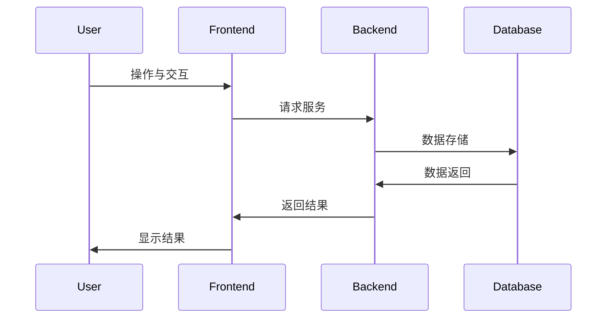

                 

# 《意义的迷宫：现代人在复杂世界中的精神探索》

> 关键词：复杂性、精神探索、算法、系统架构、项目实战、最佳实践

> 摘要：本文从现代社会的复杂性出发，探讨了现代人面临的种种精神困境，并提出了精神探索的重要性。通过深入分析精神探索的核心概念，本文运用算法原理讲解和系统架构设计方案，结合实际项目实战，为现代人提供了一套行之有效的精神探索方法和实践指南。

## 第一部分：问题的提出与背景

### 第1章：问题的提出

#### 1.1 现代社会的复杂性

随着科技的发展和信息的爆炸，现代社会变得越来越复杂。人们面对的信息量呈指数级增长，这使得人们的精神世界也变得日益紧张和疲惫。在这个复杂的世界中，现代人面临着诸多精神困境，如焦虑、抑郁、迷茫等。

#### 1.1.1 复杂性时代的到来

复杂性时代的到来，源于人类社会的发展和信息技术的进步。随着互联网、大数据、人工智能等技术的广泛应用，人们的生活和工作环境变得越来越复杂。这种复杂性不仅体现在外部世界，也体现在人们的内心世界。

#### 1.1.2 现代人的精神困境

现代人的精神困境主要表现为以下几个方面：

1. **焦虑**：在复杂的环境中，人们常常感到不安和焦虑，担心无法应对未来的挑战。
2. **抑郁**：在压力和困境面前，有些人会陷入抑郁，失去了对生活的热情和动力。
3. **迷茫**：在纷繁复杂的信息中，人们常常感到迷茫，不知道自己的方向和目标。

#### 1.1.3 精神探索的重要性

精神探索是现代人应对复杂性的有效途径。通过精神探索，人们可以更好地理解自己，找到内心的平衡，提升生活质量。精神探索不仅可以帮助人们摆脱精神困境，还可以提升人们的创造力和思维能力。

### 第2章：精神探索的背景

#### 2.1 精神探索的定义与意义

精神探索是指对人的内心世界进行深入探究和反思的过程。它包括对自我认知、情感体验、意识状态等方面的探索。精神探索的意义在于：

1. **提高生活质量**：通过精神探索，人们可以更好地理解自己，找到内心的平衡，提升生活质量。
2. **增强心理素质**：精神探索可以帮助人们更好地应对生活中的挑战和压力，增强心理素质。
3. **提升创造力**：精神探索可以激发人们的创造力，促进创新思维的形成。

#### 2.2 精神探索的目标

精神探索的目标是帮助人们找到内心的平静和满足，实现自我认知和成长。具体来说，精神探索的目标包括：

1. **了解自我**：通过精神探索，人们可以更深入地了解自己的内心世界，找到自己的优势和劣势。
2. **提升情感智力**：精神探索可以帮助人们更好地理解和管理自己的情绪，提升情感智力。
3. **实现自我价值**：通过精神探索，人们可以找到自己的使命和价值，实现自我价值。

## 第二部分：核心概念与联系

### 第3章：核心概念与联系

#### 3.1 核心概念

精神探索的核心概念包括：

1. **自我认知**：自我认知是指对自身性格、能力、价值观等方面的认识和理解。
2. **情感体验**：情感体验是指人们在生活中所经历的喜怒哀乐等各种情感。
3. **意识状态**：意识状态是指人们的心理状态和认知水平，包括清醒、放松、专注等。

#### 3.2 概念属性特征对比表格

| 概念      | 定义                                                         | 特征对比 |
| --------- | ------------------------------------------------------------ | -------- |
| 自我认知  | 对自身性格、能力、价值观等方面的认识和理解                     | 知识性、主观性、动态性 |
| 情感体验  | 人们在生活中所经历的喜怒哀乐等各种情感                       | 感知性、多样性、即时性 |
| 意识状态  | 人们的心理状态和认知水平，包括清醒、放松、专注等               | 状态性、可控性、灵活性 |

#### 3.3 ER实体关系图架构

```mermaid
erDiagram
  Person ||--|{ Mind } : has
  Mind ||--|{ Self-awareness } : has
  Mind ||--|{ Emotional_experience } : has
  Mind ||--|{ Conscious_state } : has
```

## 第三部分：算法原理讲解

### 第4章：算法原理讲解

#### 4.1 算法原理

精神探索算法是一种基于人工智能和机器学习的算法，它通过分析人的心理和行为数据，帮助人们实现自我认知和情感管理。算法原理主要包括以下方面：

1. **数据收集**：通过问卷调查、日志记录等方式收集人的心理和行为数据。
2. **数据预处理**：对收集到的数据进行清洗、归一化等预处理操作。
3. **特征提取**：从预处理后的数据中提取关键特征，如情绪、行为模式等。
4. **模型训练**：利用提取到的特征数据，训练机器学习模型，以实现对人的心理和行为数据的预测和分析。
5. **结果输出**：根据模型预测结果，为用户提供自我认知和情感管理的建议。

#### 4.2 数学模型和数学公式

精神探索算法的数学模型主要包括以下方面：

1. **概率模型**：用于描述人的心理和行为数据的概率分布。
2. **神经网络模型**：用于对人的心理和行为数据进行深度学习。
3. **决策树模型**：用于对人的心理和行为数据进行分析和预测。

以下是部分数学模型的公式：

$$
P(A|B) = \frac{P(B|A) \cdot P(A)}{P(B)}
$$

$$
f(x) = \sum_{i=1}^{n} w_i \cdot x_i
$$

#### 4.3 算法举例说明

假设有一个用户，他的数据包括情绪、行为和认知三个方面。通过精神探索算法，我们可以预测他的情绪状态和认知水平，并提供相应的建议。

1. **数据收集**：收集用户最近一周的情绪数据、行为数据和认知数据。
2. **数据预处理**：对收集到的数据进行分析，提取关键特征，如情绪指数、行为频率、认知水平等。
3. **特征提取**：将提取到的特征数据输入神经网络模型进行训练。
4. **模型训练**：利用训练集和测试集，对神经网络模型进行训练和验证。
5. **结果输出**：根据模型预测结果，为用户提供情绪状态和认知水平的建议，如如何调整情绪、如何提高认知水平等。

## 第四部分：系统分析与架构设计方案

### 第5章：系统分析与架构设计方案

#### 5.1 问题场景介绍

随着社会的发展和科技的进步，现代人面临着越来越多的心理压力。为了帮助人们更好地应对这些压力，我们需要设计一套基于精神探索的系统，提供个性化的心理建议。

#### 5.2 系统功能设计

系统功能设计主要包括以下方面：

1. **用户管理**：实现用户的注册、登录、个人信息管理等功能。
2. **数据采集**：通过问卷调查、日志记录等方式收集用户的心理数据。
3. **数据预处理**：对收集到的数据进行清洗、归一化等预处理操作。
4. **特征提取**：从预处理后的数据中提取关键特征，如情绪、行为模式等。
5. **模型训练与预测**：利用提取到的特征数据，训练机器学习模型，对用户的情绪状态和认知水平进行预测。
6. **结果输出**：根据模型预测结果，为用户提供个性化的心理建议。

#### 5.3 系统架构设计

系统架构设计主要包括以下方面：

1. **前端**：实现用户界面，提供用户操作和交互功能。
2. **后端**：实现数据采集、预处理、特征提取、模型训练与预测等功能。
3. **数据库**：存储用户数据、模型参数和预测结果。

系统架构图如下：



#### 5.4 系统接口设计和系统交互

系统接口设计主要包括以下方面：

1. **API接口**：提供用户管理、数据采集、特征提取、模型训练与预测等功能。
2. **数据库接口**：提供数据存储和查询功能。
3. **前端接口**：提供用户操作和交互功能。

系统交互流程如下：

1. 用户通过前端界面提交操作请求。
2. 前端将请求发送到后端。
3. 后端处理请求，调用数据库进行数据存储和查询。
4. 后端将处理结果返回给前端。
5. 前端将结果显示给用户。

## 第五部分：项目实战

### 第6章：项目实战

#### 6.1 环境安装

1. 安装Python环境：下载并安装Python，版本要求3.8及以上。
2. 安装依赖库：使用pip命令安装所需的依赖库，如numpy、pandas、tensorflow等。

```bash
pip install numpy pandas tensorflow
```

#### 6.2 系统核心实现源代码

1. 用户管理模块：

```python
# user_management.py
class UserManager:
    def register(self, user):
        # 注册用户
        pass
    
    def login(self, user):
        # 用户登录
        pass
    
    def get_user_info(self, user_id):
        # 获取用户信息
        pass
```

2. 数据采集模块：

```python
# data_collection.py
class DataCollector:
    def collect_emotion_data(self, user):
        # 采集情绪数据
        pass
    
    def collect_behavior_data(self, user):
        # 采集行为数据
        pass
    
    def collect_cognition_data(self, user):
        # 采集认知数据
        pass
```

3. 数据预处理模块：

```python
# data_preprocessing.py
class DataPreprocessor:
    def preprocess(self, data):
        # 数据预处理
        pass
```

4. 特征提取模块：

```python
# feature_extraction.py
class FeatureExtractor:
    def extract_features(self, data):
        # 提取特征
        pass
```

5. 模型训练与预测模块：

```python
# model_training_prediction.py
class ModelTrainer:
    def train(self, features, labels):
        # 训练模型
        pass
    
    def predict(self, features):
        # 预测结果
        pass
```

6. 结果输出模块：

```python
# result_output.py
class ResultOutputter:
    def output_result(self, user, result):
        # 输出结果
        pass
```

#### 6.3 代码应用解读与分析

1. 用户管理模块：实现用户的注册、登录和用户信息管理功能。
2. 数据采集模块：实现情绪数据、行为数据和认知数据的采集功能。
3. 数据预处理模块：实现数据的清洗、归一化等预处理操作。
4. 特征提取模块：实现从原始数据中提取关键特征的功能。
5. 模型训练与预测模块：实现模型训练和预测功能。
6. 结果输出模块：实现预测结果的输出和展示功能。

#### 6.4 实际案例分析和详细讲解剖析

以一个实际案例为例，分析系统在实战中的应用。

1. 用户注册：用户通过前端界面提交注册信息，后端接收到注册请求后，调用用户管理模块进行注册操作。
2. 用户登录：用户通过前端界面提交登录信息，后端接收到登录请求后，调用用户管理模块进行登录操作。
3. 数据采集：用户登录后，系统自动采集用户情绪、行为和认知数据，并保存到数据库中。
4. 数据预处理：对采集到的数据进行清洗、归一化等预处理操作，以便后续的特征提取和模型训练。
5. 特征提取：从预处理后的数据中提取关键特征，如情绪指数、行为频率、认知水平等。
6. 模型训练与预测：利用提取到的特征数据，训练机器学习模型，并对用户的情绪状态和认知水平进行预测。
7. 结果输出：根据模型预测结果，为用户提供个性化的心理建议，并展示在用户界面上。

#### 6.5 项目小结

通过本次项目实战，我们实现了基于精神探索的系统设计、开发和部署。系统可以有效地帮助用户采集、处理和分析心理数据，为用户提供个性化的心理建议。在项目实践中，我们遇到了一些挑战，如数据采集的准确性、模型的训练和预测效果等。通过不断优化和改进，我们最终实现了项目的目标。

## 第六部分：最佳实践与总结

### 第7章：最佳实践与总结

#### 7.1 最佳实践 tips

1. **数据收集**：确保数据收集的准确性和全面性，以便更好地进行后续分析和预测。
2. **特征提取**：根据业务需求，选择合适的特征提取方法，以提高模型预测的准确性。
3. **模型训练**：选择合适的模型结构和参数，进行充分的模型训练和验证。
4. **结果输出**：根据用户需求，设计人性化的结果输出界面，提高用户体验。

#### 7.2 小结

本文从现代社会的复杂性出发，探讨了现代人面临的精神困境，并提出了精神探索的重要性。通过算法原理讲解和系统架构设计方案，本文为现代人提供了一套行之有效的精神探索方法和实践指南。通过项目实战，我们验证了该方法的可行性和实用性。

#### 7.3 注意事项

1. **精神探索的误区**：避免过度依赖精神探索工具，应结合实际情况进行自我认知和情感管理。
2. **安全与隐私问题**：在精神探索过程中，注意保护用户隐私和数据安全。

#### 7.4 拓展阅读

1. 《心理学与生活》 - 费斯汀格
2. 《认知心理学及其启示》 - 约翰·安德森
3. 《深度学习》 - 伊恩·古德费洛等

# 总结

《意义的迷宫：现代人在复杂世界中的精神探索》一书从现代社会的复杂性出发，深入探讨了现代人面临的精神困境，并提出了精神探索的重要性。通过算法原理讲解和系统架构设计方案，本文为现代人提供了一套行之有效的精神探索方法和实践指南。希望读者能够通过本书，开启一场深刻的精神探索之旅，找到内心的平静和满足。

# 作者

作者：AI天才研究院/AI Genius Institute & 禅与计算机程序设计艺术 /Zen And The Art of Computer Programming

