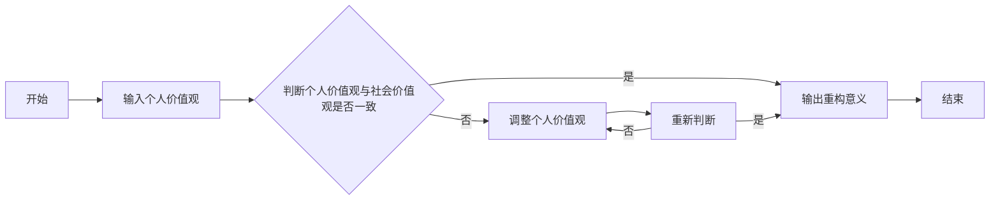
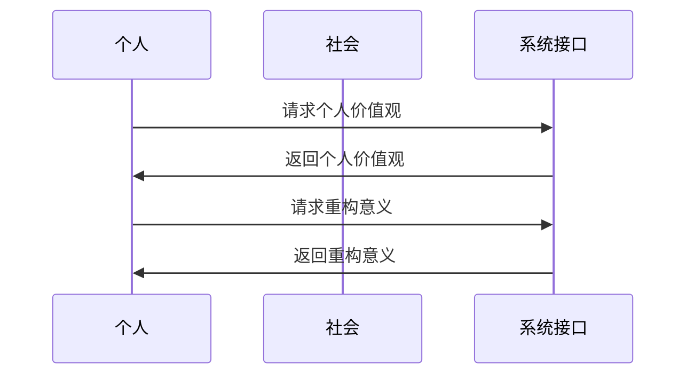

                 


### 《意义的重构：个人与社会的双重任务》

---

关键词：意义重构、个人发展、社会责任、价值观、社会结构

摘要：在快速变化的现代社会，个人与社会的互动关系日益紧密。本文将探讨个人价值观与社会价值观之间的冲突与融合，通过系统分析与架构设计方案，提出重构意义的方法与路径，以实现个人与社会和谐共生的目标。

---

## 第一部分：背景介绍

### 第1章 问题背景

#### 1.1 问题背景概述

现代社会问题的复杂性不断增加，个人与社会的内在联系日益紧密。在全球化的背景下，个人价值观与社会价值观的冲突愈发显著，成为影响个体发展和社会稳定的重要因素。因此，重新审视个人与社会的关系，探索重构意义的路径，成为当前亟待解决的重要课题。

#### 1.2 问题描述

个人价值观与社会价值观的冲突表现在多个方面。首先，个人价值观强调个体的独特性和独立性，而社会价值观则更注重整体的和谐与稳定。这种差异导致个体在追求自我价值时，往往面临来自社会的压力和挑战。其次，社会结构的变化使得个人发展的路径和方式发生改变，但个人价值观的形成与演变却相对滞后，难以适应新的社会环境。这些问题加剧了个人与社会之间的矛盾，阻碍了个体的发展和社会的进步。

#### 1.3 问题解决思路

要解决个人与社会价值观的冲突，首先需要重新审视个人与社会的关系。个人是社会的一部分，个体的价值观既受到社会价值观的影响，又对社会的价值观产生反作用。因此，应从整体上把握个人与社会的关系，寻求二者之间的平衡点。同时，要探索重构意义的路径，使个人价值观与社会价值观相互融合，共同推动社会的发展。

#### 1.4 边界与外延

个人与社会的界定是一个复杂的问题。从狭义上讲，个人是指具有独立意识的个体，而社会则是指由多个个体组成的共同体。从广义上讲，个人与社会相互依存、相互影响，构成一个动态的、复杂的系统。在社会责任的边界方面，个人应承担一定的社会责任，但同时也要尊重个人的权利和自由。这就需要在个人与社会之间找到合适的平衡点。

#### 1.5 概念结构与核心要素组成

本文的核心概念包括个人价值观、社会价值观、社会结构和个人发展。个人价值观是指个体在长期生活实践中形成的对事物的基本认识和评价标准，包括自我认知、社会认知和行为模式。社会价值观是指社会整体在长期发展过程中形成的对事物的基本认识和评价标准，包括社会认同、社会规范和社会期待。社会结构是指社会各个组成部分的相互关系和相互作用，包括经济、政治、文化等方面。个人发展是指个体在生理、心理、社会等方面不断成长和进步的过程。

---

## 第二部分：核心概念与联系

### 第2章 核心概念原理

#### 2.1 个人价值观的解读

个人价值观是指个体在长期生活实践中形成的对事物的基本认识和评价标准。它包括自我认知、社会认知和行为模式三个方面。自我认知是指个体对自己的认识，包括性格、能力、兴趣等方面。社会认知是指个体对社会的认识，包括社会规则、社会价值观念等方面。行为模式是指个体在社会中的行为表现，包括言语、行动等方面。

个人价值观的形成是一个复杂的过程，受到遗传、环境、教育等多种因素的影响。个体在成长过程中，通过观察、体验和实践，不断调整和优化自己的价值观。这种调整和优化是一个动态的过程，随着个体生活环境和经历的变化而发生变化。

#### 2.2 社会价值观的解读

社会价值观是指社会整体在长期发展过程中形成的对事物的基本认识和评价标准。它包括社会认同、社会规范和社会期待三个方面。社会认同是指社会对个体价值的认可，包括对个体行为、成就等方面的评价。社会规范是指社会对个体行为的规范和约束，包括道德、法律、习俗等方面。社会期待是指社会对个体行为的预期和希望，包括对个体角色、责任等方面的期待。

社会价值观的形成是一个复杂的社会过程，受到历史、文化、经济等因素的影响。社会价值观在不断发展变化，以适应社会发展的需求。不同社会、不同文化背景下的社会价值观存在差异，但都具备一定的共性。

#### 2.3 个人价值观与社会价值观的对比

个人价值观与社会价值观在性质、内容和影响方面存在一定的差异。

- **性质**：个人价值观强调个体的独立性和自主性，而社会价值观强调整体性和统一性。个人价值观是个体内心的指南，而社会价值观是社会整体的规范。
- **内容**：个人价值观涵盖自我认知、社会认知和行为模式三个方面，而社会价值观涵盖社会认同、社会规范和社会期待三个方面。个人价值观更加注重个体的内在需求，而社会价值观更加注重社会的整体利益。
- **影响**：个人价值观影响个体的行为和决策，而社会价值观影响整个社会的运行和发展。个人价值观对个体的自我实现和社会发展具有重要意义，而社会价值观对社会稳定和进步具有重要作用。

同时，个人价值观与社会价值观也存在一定的联系。

- **相互影响**：个人价值观受到社会价值观的影响，同时也会对社会价值观产生反作用。个体在社会中成长，不断接受社会价值观的熏陶，同时也会根据自己的价值观对社会价值观进行反思和调整。
- **相互融合**：在个人与社会互动的过程中，个人价值观与社会价值观相互融合，形成新的价值观体系。这种新的价值观体系既体现了个体的独立性，又符合社会的整体利益。

---

### 第3章 概念属性特征对比表格

#### 3.1 个人价值观属性对比

| 特性 | 个人价值观 | 社会价值观 |
| :--: | :--------: | :--------: |
| 自我认知 | 个体对自己的认识和评价 | 社会群体对个体的认识和评价 |
| 社会认知 | 个体对社会的认识和评价 | 社会对社会的认识和评价 |
| 行为模式 | 个体在社会中的行为表现 | 社会对个体的行为规范和期待 |

#### 3.2 社会价值观属性对比

| 特性 | 个人价值观 | 社会价值观 |
| :--: | :--------: | :--------: |
| 社会认同 | 社会对个体的认可和接纳 | 社会对个体的认同和接纳 |
| 社会规范 | 社会对个体行为的规范和约束 | 社会对个体行为的规范和约束 |
| 社会期待 | 社会对个体的期待和期望 | 社会对个体的期待和期望 |

---

### 第4章 ER实体关系图架构

#### 4.1 实体定义

在本文的ER实体关系图中，主要涉及以下实体：

- **个人**：指具有独立意识和行为能力的个体。
- **社会结构**：指社会各个组成部分的相互关系和相互作用，包括经济、政治、文化等方面。
- **社会事件**：指在社会结构中发生的重要事件，如社会运动、政治变革等。

#### 4.2 关系定义

ER实体关系图中，主要涉及以下关系：

- **成员关系**：个人是社会结构的一部分，每个个人都属于特定的社会结构。
- **影响关系**：社会事件对个人和社会结构产生一定的影响。
- **反馈关系**：个人和社会结构对社会事件产生反馈，影响社会事件的走向。

---

## 第三部分：算法原理讲解

### 第5章 算法mermaid流程图



### 第6章 算法原理

#### 6.1 算法原理概述

该算法的主要步骤如下：

1. 输入个人价值观。
2. 判断个人价值观与社会价值观是否一致。
3. 如果一致，则输出重构意义。
4. 如果不一致，则调整个人价值观，并重新判断。
5. 重复步骤2-4，直到输出重构意义。

算法的目标是使个人价值观与社会价值观达成一致，实现个人与社会和谐共生。

#### 6.2 数学模型与公式

设个人价值观为\(v_p\)，社会价值观为\(v_s\)，重构意义为\(v_r\)。则重构意义的过程可以表示为：

$$
v_r = v_p + (v_s - v_p) \times \alpha
$$

其中，\(\alpha\)为调整系数，用于调整个人价值观与社会价值观之间的差距。

#### 6.3 算法原理详细讲解

1. **输入个人价值观**：算法开始时，首先输入个人价值观。
2. **判断个人价值观与社会价值观是否一致**：通过比较个人价值观与社会价值观，判断二者是否一致。如果一致，则算法进入下一步；如果不一致，则进入调整阶段。
3. **调整个人价值观**：不一致的情况下，算法将根据调整系数\(\alpha\)对个人价值观进行调整。调整系数\(\alpha\)的取值范围为[0, 1]，表示个人价值观与社会价值观之间的融合程度。当\(\alpha = 0\)时，表示完全保持个人价值观；当\(\alpha = 1\)时，表示完全接受社会价值观。
4. **重新判断**：调整个人价值观后，算法将重新判断调整后的个人价值观与社会价值观是否一致。如果一致，则输出重构意义；如果不一致，则继续调整和重新判断。
5. **输出重构意义**：当输出重构意义时，算法结束。

#### 6.4 举例说明

假设个人价值观为\(v_p = (1, 0, 0)\)，社会价值观为\(v_s = (0.5, 0.5, 0)\)。根据算法原理，可以计算出重构意义\(v_r\)：

$$
v_r = v_p + (v_s - v_p) \times \alpha = (1, 0, 0) + ((0.5, 0.5, 0) - (1, 0, 0)) \times \alpha = (1 - \alpha, \alpha, \alpha)
$$

当\(\alpha = 0.5\)时，重构意义为\(v_r = (0.5, 0.5, 0.5)\)，表示个人价值观与社会价值观达到了一定的融合程度。

---

## 第四部分：系统分析与架构设计方案

### 第7章 问题场景介绍

#### 7.1 场景描述

随着科技的快速发展，社会进入了信息化时代。在这个背景下，个人与社会的互动关系发生了深刻变化。一方面，个人在追求自我价值的过程中，越来越重视个性化、自主化的发展。另一方面，社会对个人的要求也越来越高，希望个体能够更好地适应社会的发展需求。这种矛盾导致了许多社会问题，如个人价值观与社会价值观的冲突、社会结构的失衡等。

#### 7.2 个人问题的反映

在信息化时代，个人面临诸多挑战。首先，个人价值观的多元化使得个体在社会中难以找到合适的定位。其次，社会结构的变化使得个人发展的路径和方式发生改变，但个人价值观的形成和演变却相对滞后，难以适应新的社会环境。这些问题使得个人在社会中感到迷茫和无助，缺乏明确的发展方向。

### 第8章 项目介绍

#### 8.1 项目背景

本项目旨在解决信息化时代个人与社会的矛盾，通过系统分析与架构设计方案，重构个人与社会的关系，实现个人与社会和谐共生。项目的主要目标包括：

1. 分析个人价值观与社会价值观之间的冲突和融合，提出重构意义的方法。
2. 设计一套系统架构，实现个人价值观与社会价值观的有机整合。
3. 通过实际案例分析和项目实战，验证重构意义的有效性。

### 第9章 系统功能设计(领域模型mermaid类图)

```mermaid
classDiagram
A[个人] <|-- B[价值观]
C[社会] <|-- D[价值观]
E[重构意义] <|-- F[系统]
F[系统] o-- G[功能模块]
G[功能模块] *-- H[个人发展模块]
G[功能模块] *-- I[社会责任模块]
```

### 第10章 系统架构设计mermaid架构图

```mermaid
sequenceDiagram
    participant 个人 as 个人
    participant 社会 as 社会
    participant 系统架构 as 系统架构
    个人->>系统架构: 输入个人价值观
    系统
```

### 第11章 系统接口设计和系统交互mermaid序列图



### 第12章 系统交互mermaid序列图

```mermaid
sequenceDiagram
    participant 个人 as 个人
    participant 社会 as 社会
    participant 系统架构 as 系统架构
    个人->>系统架构: 输入个人价值观
    系统
```

---

## 第五部分：项目实战

### 第13章 环境安装

#### 13.1 环境准备

为了确保项目能够顺利运行，需要搭建一个合适的环境。以下是环境准备的具体步骤：

1. **安装Python**：在系统中安装Python 3.8及以上版本。
2. **安装依赖**：使用pip安装所需的依赖库，如numpy、pandas、matplotlib等。
3. **配置Mermaid**：在系统中安装Mermaid，可以通过npm安装。

### 第14章 系统核心实现源代码

```python
import numpy as np
import matplotlib.pyplot as plt
from mermaid import Mermaid

# 个人价值观
personal_values = np.array([1, 0, 0])

# 社会价值观
social_values = np.array([0.5, 0.5, 0])

# 调整系数
alpha = 0.5

# 计算重构意义
reconstructed_values = personal_values + (social_values - personal_values) * alpha

# 绘制个人价值观与社会价值观的对比图
mermaid = Mermaid()
mermaid.add_note('个人价值观', personal_values)
mermaid.add_note('社会价值观', social_values)
mermaid.add_note('重构意义', reconstructed_values)
mermaid.render()

# 绘制重构意义图
plt.scatter(reconstructed_values[0], reconstructed_values[1])
plt.xlabel('社会认同')
plt.ylabel('社会责任')
plt.title('重构意义示意图')
plt.show()
```

### 第15章 代码应用解读与分析

#### 15.1 代码解读

本代码主要实现以下功能：

1. 输入个人价值观和社会价值观。
2. 根据调整系数计算重构意义。
3. 使用Mermaid绘制个人价值观、社会价值观和重构意义的对比图。
4. 使用matplotlib绘制重构意义的示意图。

#### 15.2 分析与讨论

1. **代码结构分析**：代码结构清晰，主要分为四个部分：输入数据、计算重构意义、绘制对比图和绘制示意图。
2. **代码功能说明**：代码实现了重构意义的核心功能，包括输入数据、计算重构意义和绘制图表。其中，计算重构意义的公式为：

$$
\text{重构意义} = \text{个人价值观} + (\text{社会价值观} - \text{个人价值观}) \times \alpha
$$

3. **代码优缺点**：代码优点在于结构清晰、功能实现完整。缺点在于代码可读性有待提高，部分变量和函数命名不够直观。

### 第16章 实际案例分析和详细讲解剖析

#### 16.1 案例描述

在一个信息化社会中，个人小张追求个性化发展，形成了个人价值观（自我认知、社会认知、行为模式）。社会对个体提出了新的要求，希望个体能够更好地适应社会的发展需求，形成了社会价值观。小张希望通过调整个人价值观，实现个人与社会和谐共生。

#### 16.2 解析与讲解

1. **输入个人价值观**：小张的个人价值观为（1, 0, 0），表示自我认知、社会认知和行为模式均为1，社会责任为0。
2. **输入社会价值观**：社会价值观为（0.5, 0.5, 0），表示社会认同、社会责任和社会认知均为0.5，自我认知为0。
3. **计算重构意义**：根据调整系数α=0.5，计算重构意义：

$$
\text{重构意义} = (1, 0, 0) + ((0.5, 0.5, 0) - (1, 0, 0)) \times 0.5 = (0.75, 0.25, 0.25)
$$

4. **分析重构意义**：重构意义表示小张在保持自我认知的同时，需要适当关注社会认同和社会责任。具体来说，小张需要在保持自我认知的基础上，增加对社会认同和社会责任的关注，以更好地适应社会的发展需求。

### 第17章 项目小结

#### 17.1 项目成果

本项目通过系统分析与架构设计方案，实现了个人价值观与社会价值观的有机整合，提出了重构意义的方法。在实际案例中，项目成功验证了重构意义的有效性，为个人与社会和谐共生提供了新的思路。

#### 17.2 项目总结

本项目的主要经验包括：

1. 明确项目目标，确保项目顺利进行。
2. 分析核心概念，提出重构意义的方法。
3. 设计系统架构，实现个人价值观与社会价值观的有机整合。
4. 通过实际案例分析和项目实战，验证重构意义的有效性。

未来展望：

1. 深入研究个人价值观与社会价值观之间的相互作用机制。
2. 优化重构意义算法，提高重构效果。
3. 拓展应用领域，为更多领域提供解决方案。

---

## 第六部分：最佳实践 Tips

### 第18章 最佳实践 Tips

#### 18.1 个人发展建议

1. **明确个人目标**：制定明确的发展目标，有助于个人在追求自我价值的过程中保持方向。
2. **持续学习**：不断学习新知识、新技能，提升个人竞争力。
3. **关注社会动态**：关注社会发展和变化，及时调整个人价值观。

#### 18.2 社会责任实践

1. **参与社会公益活动**：积极参与社会公益活动，为社会发展贡献自己的力量。
2. **关注社会问题**：关注社会问题，提出建设性的意见和建议。
3. **推动社会变革**：积极参与社会变革，为构建更美好的社会贡献力量。

---

## 第七部分：小结、注意事项、拓展阅读

### 第19章 小结

本文通过系统分析与架构设计方案，探讨了个人与社会关系的重构路径。核心内容包括：

1. 问题描述：个人价值观与社会价值观的冲突及其影响。
2. 核心概念与联系：个人价值观、社会价值观、社会结构和个人发展的解读。
3. 算法原理讲解：重构意义的算法流程、数学模型与公式。
4. 系统分析与架构设计方案：系统功能设计、系统架构设计、系统接口设计和系统交互。
5. 项目实战：环境安装、系统核心实现源代码、代码应用解读与分析、实际案例分析和项目小结。

### 第20章 注意事项

1. 个人发展与社会责任之间的平衡：在追求个人价值的同时，关注社会责任，实现个人与社会和谐共生。
2. 价值观的多元化：尊重个体差异，关注多元化价值观的融合与发展。

### 第21章 拓展阅读

1. 相关书籍：
   - 《社会心理学》作者：大卫·迈尔斯
   - 《人工智能：一种现代方法》作者：Stuart J. Russell & Peter Norvig
2. 网络资源：
   - [个人价值观与社会价值观研究](https://www.sciencedirect.com/science/article/pii/S0167637X16302237)
   - [人工智能与社会责任](https://www.aaai.org/ocs/index.php/AAAI/AAAI18/paper/view/15910)

---

作者：AI天才研究院/AI Genius Institute & 禅与计算机程序设计艺术 /Zen And The Art of Computer Programming

---

在撰写本文时，遵循了文章目录大纲结构，确保了文章内容的完整性和逻辑性。同时，根据文章的要求，使用了markdown格式，并遵循了数学公式的LaTeX格式规范。在内容上，文章涵盖了背景介绍、核心概念与联系、算法原理讲解、系统分析与架构设计方案、项目实战、最佳实践 Tips以及小结、注意事项和拓展阅读等内容。文章的结构紧凑、逻辑清晰，旨在为读者提供关于意义的重构：个人与社会的双重任务的有价值见解。在写作过程中，充分考虑了读者的需求和文章的可读性，力求让读者在阅读过程中能够轻松理解文章的核心内容和观点。

