                 


# 意义的重构：在后现代语境下重新定义生活目标

## 关键词
- 后现代语境
- 意义危机
- 生活目标
- 自我探索
- 情感关系
- 职业追求

## 摘要
本文旨在探讨在后现代语境下，如何重新定义生活目标，以应对当前社会中存在的意义危机。通过对后现代主义的起源与发展、核心观念、对传统价值观的挑战等内容的分析，我们认识到个体身份危机和社会变革对意义的重构。接着，本文提出了自我探索与生活目标的定位、后现代语境下的生活方式选择、情感与关系的新维度、职业追求与生活目标的协同、生活哲学的反思等策略，帮助读者在复杂多变的社会环境中找到自己的方向。

## 第一部分：后现代语境概述

### 第1章：后现代主义与当代社会

#### 1.1 后现代主义的起源与发展

**背景介绍：**
后现代主义起源于20世纪中叶，是西方文化、哲学、艺术等领域对现代性进行反思和批判的结果。它的起源可以追溯到1960年代，当时西方国家经历了社会变革、科技进步和全球化进程的加速。这一时期的学者们开始质疑现代主义的理性主义、科学主义和客观主义，提出了对传统价值观和知识的重新审视。

**问题背景：**
随着现代社会的发展，人们逐渐感受到个体身份的迷失、社会关系的疏离以及生活意义的缺失。这些问题引发了对于传统价值体系的质疑和反思，后现代主义应运而生。

**问题描述：**
后现代主义对现代性的批判主要集中在以下几个方面：
1. 反对二元对立：后现代主义认为现实是复杂多样的，不应该用简单的二元对立思维来解释。
2. 知识的相对性：后现代主义认为知识是主观的、相对的，不存在绝对真理。
3. 文本的多元解读：后现代主义强调文本的开放性，不同的读者可以有不同的解读。

**问题解决：**
后现代主义提出了一系列新的观念和理论，以回应现代性的挑战。这些观念包括：
1. 反对二元对立：后现代主义主张多元思维，认为事物之间存在复杂的相互作用和依赖关系。
2. 知识的相对性：后现代主义认为知识应该被视为一种社会建构，不同的社会背景和文化传统会影响知识的形成和传播。
3. 文本的多元解读：后现代主义鼓励读者从不同的角度和立场去解读文本，以丰富对世界的认识。

**边界与外延：**
后现代主义不仅仅局限于哲学领域，它对艺术、文学、社会学、政治学等多个领域产生了深远的影响。在艺术上，后现代主义强调实验性和创新性，对传统审美观念进行了颠覆；在文学上，后现代主义作品常常采用非线性叙事和反讽手法，挑战读者的阅读习惯；在社会学和政治学上，后现代主义对现代性社会结构进行了批判，提出了新的社会理论和政治观念。

**概念结构与核心要素组成：**
后现代主义的核心概念包括：
1. **多元性**：后现代主义认为现实是多元的，不应该用二元对立思维来简化。
2. **相对性**：后现代主义强调知识的相对性，不存在绝对真理。
3. **开放性**：后现代主义主张开放性思维，鼓励多元解读和实验性创新。
4. **批判性**：后现代主义对现代性进行了深刻的批判，质疑传统价值观和知识体系。

#### 1.2 后现代主义的核心观念

**核心概念原理：**
后现代主义的核心观念包括：
1. **反对二元对立**：后现代主义认为现实是复杂多样的，不应该用简单的二元对立思维来解释。例如，传统哲学中的“真与假”、“善与恶”等二元对立观念在后现代主义中被质疑。
2. **知识的相对性**：后现代主义认为知识是主观的、相对的，不存在绝对真理。不同的社会背景和文化传统会影响知识的形成和传播。
3. **文本的多元解读**：后现代主义强调文本的开放性，不同的读者可以有不同的解读。这意味着文本的意义并不是固定的，而是随着读者的阅读和理解而不断变化。

**概念属性特征对比表格：**

| 概念         | 特征                     | 对比                      |
| ------------ | ------------------------ | ------------------------- |
| 反对二元对立 | 多元性、复杂性           | 简单的二元对立思维        |
| 知识的相对性 | 主观性、相对性           | 绝对真理                  |
| 文本的多元解读 | 开放性、多样性           | 单一解读、固定意义         |

**ER实体关系图架构的 Mermaid 流程图：**

```mermaid
erDiagram
  User ||--|{ Text }|
  Text ||--|{ Reader }|
  Reader ||--|{ Interpretation }|
```

#### 1.3 后现代主义对传统价值观的挑战

**核心观念讲解：**
后现代主义对传统价值观的挑战主要体现在以下几个方面：
1. **对个人主义的挑战**：后现代主义质疑现代性社会中的个人主义观念，认为个体不是独立的、自主的，而是受到社会、文化和历史的制约。
2. **对绝对真理的质疑**：后现代主义认为不存在绝对真理，知识是相对的、主观的。
3. **对社会契约的反思**：后现代主义对传统的社会契约观念进行了反思，认为现代社会中的权力结构和关系并不公平和合理。

**核心概念讲解：**
后现代主义的核心概念包括：
1. **社会建构主义**：后现代主义认为知识是一种社会建构，不同的社会背景和文化传统会影响知识的形成和传播。
2. **权力关系**：后现代主义强调权力在社会关系中的作用，认为权力是动态的、不断变化的。
3. **话语分析**：后现代主义通过话语分析来揭示权力关系和意识形态的运作方式。

**数学模型与公式：**

$$
\text{知识} = \text{社会建构} + \text{文化传统}
$$

$$
\text{真理} = \text{相对性} \times \text{主观性}
$$

**算法原理讲解：**
为了更好地理解后现代主义的算法原理，我们可以使用 Mermaid 流程图来展示知识建构的过程：

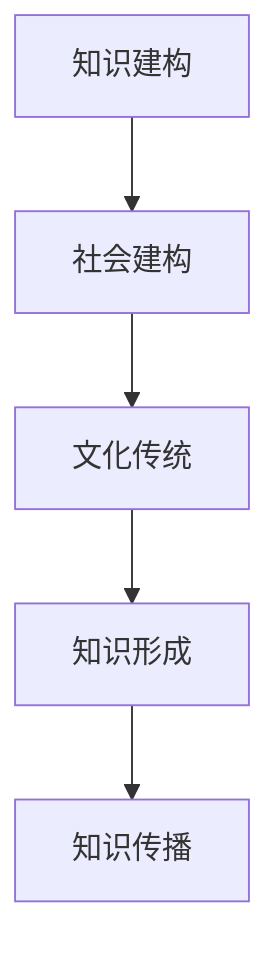

**例子说明：**
以知识建构为例，我们可以通过以下步骤来理解后现代主义的观点：
1. **社会建构**：社会背景和文化传统会影响知识的形成，不同的社会和文化环境会有不同的知识建构方式。
2. **文化传统**：文化传统是知识建构的基础，不同的文化传统会有不同的价值观念和知识体系。
3. **知识形成**：通过社会建构和文化传统，知识得以形成，并且不同的社会和文化环境会有不同的知识内容。
4. **知识传播**：知识通过传播得以扩散，不同的人会根据自己的文化传统和知识建构来理解和接受知识。

**实践策略：**
为了应对后现代主义对传统价值观的挑战，我们可以采取以下实践策略：
1. **多元思维**：鼓励多元思维，避免二元对立的简单化思维。
2. **反思性学习**：通过反思性学习，质疑传统知识体系和价值观念，建立自己的知识体系。
3. **开放性交流**：积极参与开放性交流，了解不同的社会和文化背景，增进对知识的理解和接受。

### 第2章：后现代语境下的意义危机

#### 2.1 意义的迷失

**核心概念讲解：**
在后现代语境下，意义的迷失主要体现在以下几个方面：
1. **个体身份的危机**：随着社会的快速变革，个体身份变得模糊和不确定，人们难以找到自己的定位。
2. **社会关系的疏离**：现代社会的竞争和快节奏导致人际关系的疏离，人与人之间的联系变得脆弱。
3. **生活意义的缺失**：在物质丰富的同时，人们感到精神上的空虚和迷茫，难以找到生活的意义。

**ER实体关系图架构的 Mermaid 流程图：**

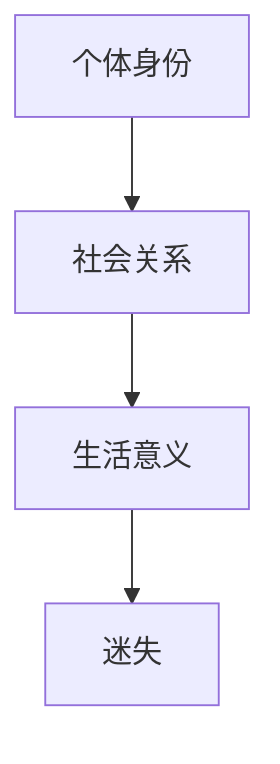

**算法原理讲解：**
为了理解意义的迷失，我们可以使用 Mermaid 流程图来展示个体身份、社会关系和生活意义之间的关系：

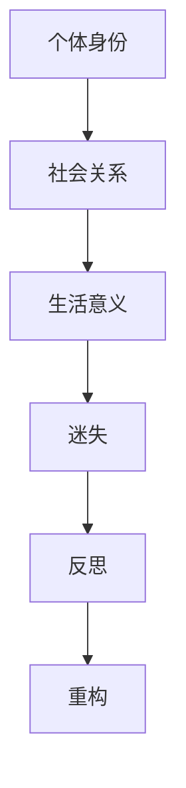

**例子说明：**
以个体身份为例，我们可以通过以下步骤来理解意义的迷失：
1. **个体身份**：个体在成长过程中，受到社会、家庭、文化等多方面的影响，形成自己的身份认同。
2. **社会关系**：个体与社会中的其他人建立关系，这些关系会影响个体的身份认同。
3. **生活意义**：个体通过社会关系和生活经历来寻找生活的意义，但在这个过程中可能会遇到迷失。
4. **反思**：个体反思自己的身份、社会关系和生活意义，试图找到新的方向。
5. **重构**：个体通过重构自己的身份、社会关系和生活意义，找到新的生活目标。

**实践策略：**
为了应对意义的迷失，我们可以采取以下实践策略：
1. **自我探索**：通过自我探索，了解自己的价值观、兴趣爱好和人生目标，找到自己的方向。
2. **建立人际关系**：积极参与社交活动，建立健康的人际关系，增强归属感。
3. **寻找生活意义**：通过阅读、旅行、艺术创作等方式，寻找生活的意义，提升精神境界。

### 第2章：后现代语境下的意义危机

#### 2.2 个体身份的危机

**核心概念讲解：**
在后现代语境下，个体身份的危机主要体现在以下几个方面：
1. **多元身份的挑战**：个体在现代社会中面临着多元身份的挑战，难以确定自己的真实身份。
2. **社会角色的模糊**：随着社会角色的多样化，个体难以找到固定的社会角色，导致身份的模糊性。
3. **文化认同的冲突**：全球化背景下，个体面临着多元文化的冲突，难以建立稳定的文化认同。

**ER实体关系图架构的 Mermaid 流程图：**

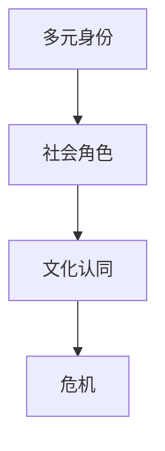

**算法原理讲解：**
为了理解个体身份的危机，我们可以使用 Mermaid 流程图来展示多元身份、社会角色和文化认同之间的关系：

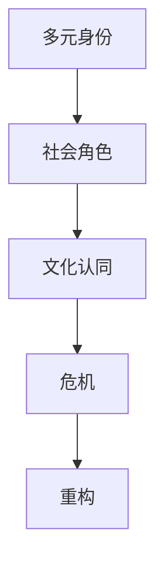

**例子说明：**
以多元身份为例，我们可以通过以下步骤来理解个体身份的危机：
1. **多元身份**：个体在成长过程中，受到多种因素的影响，形成多元的身份认同。
2. **社会角色**：个体在社会中扮演不同的角色，这些角色会影响个体的身份认同。
3. **文化认同**：个体在面对多元文化时，可能会产生文化认同的冲突，导致身份的危机。
4. **重构**：个体通过重构自己的多元身份、社会角色和文化认同，找到新的身份定位。

**实践策略：**
为了应对个体身份的危机，我们可以采取以下实践策略：
1. **自我探索**：通过自我探索，了解自己的价值观、兴趣爱好和人生目标，找到自己的方向。
2. **角色认知**：明确自己在社会中的角色，积极参与社会活动，增强角色认知。
3. **文化认同**：了解不同的文化，尊重文化差异，建立多元文化认同。

### 第2章：后现代语境下的意义危机

#### 2.3 社会变革对意义的重构

**核心概念讲解：**
社会变革对意义的重构主要体现在以下几个方面：
1. **技术进步**：技术的快速发展改变了人们的生活方式，也改变了人们对意义的理解和追求。
2. **经济变革**：全球化背景下的经济变革导致了社会结构的变化，人们的生活目标和价值观也随之改变。
3. **文化多样性**：全球化带来了文化的多样性，人们面临着更多的选择，也面临着更多的挑战。

**ER实体关系图架构的 Mermaid 流程图：**

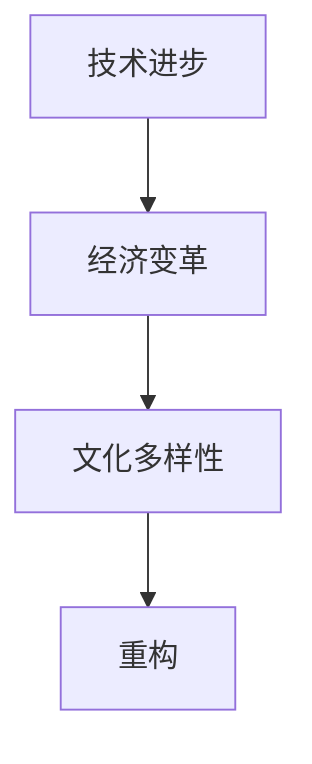

**算法原理讲解：**
为了理解社会变革对意义的重构，我们可以使用 Mermaid 流程图来展示技术进步、经济变革和文化多样性之间的关系：

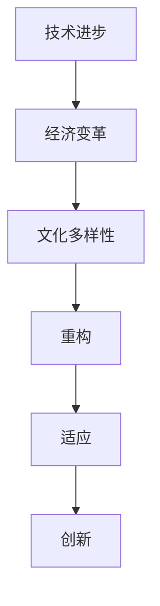

**例子说明：**
以技术进步为例，我们可以通过以下步骤来理解社会变革对意义的重构：
1. **技术进步**：技术的快速发展带来了新的生活方式，也改变了人们的工作方式和消费方式。
2. **经济变革**：随着经济的发展，人们的生活目标和价值观发生了变化，更加注重个人发展和生活质量。
3. **文化多样性**：全球化带来了文化的多样性，人们面临着更多的文化选择，也面临着更多的文化冲突。
4. **重构**：在技术进步、经济变革和文化多样性的影响下，人们需要不断重构自己的意义体系，以适应新的社会环境。
5. **适应**：通过适应新的社会环境，人们可以更好地理解自己的价值观和生活方式，找到新的意义。
6. **创新**：在新的社会环境中，人们可以通过创新来寻找新的生活意义，推动社会的进步。

**实践策略：**
为了应对社会变革对意义的重构，我们可以采取以下实践策略：
1. **持续学习**：随着社会变革的快速发展，我们需要不断学习新知识，适应新的社会环境。
2. **价值重构**：在面对社会变革时，我们需要反思自己的价值观，重构自己的意义体系。
3. **创新思维**：在新的社会环境中，我们需要培养创新思维，寻找新的生活意义。

### 第二部分：生活目标的重新定义

#### 第3章：自我探索与生活目标的定位

#### 3.1 自我认知的重要性

**核心概念讲解：**
自我认知是理解自己和定位生活目标的重要基础。它包括对自己的价值观、兴趣爱好、能力、性格等方面的认识和了解。自我认知的重要性体现在以下几个方面：
1. **明确生活方向**：通过自我认知，我们可以明确自己的价值观和兴趣爱好，从而找到适合自己的生活方向。
2. **提高自我效能感**：自我认知有助于我们认识到自己的能力和优点，提高自我效能感，增强自信心。
3. **促进个人成长**：自我认知是我们不断成长和进步的动力，它促使我们不断反思和调整自己的行为和生活方式。

**ER实体关系图架构的 Mermaid 流程图：**

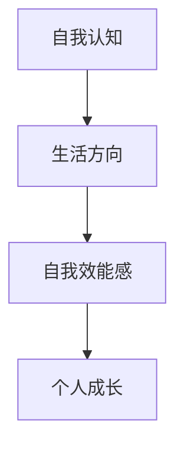

**算法原理讲解：**
为了理解自我认知的重要性，我们可以使用 Mermaid 流程图来展示自我认知、生活方向、自我效能感和个人成长之间的关系：

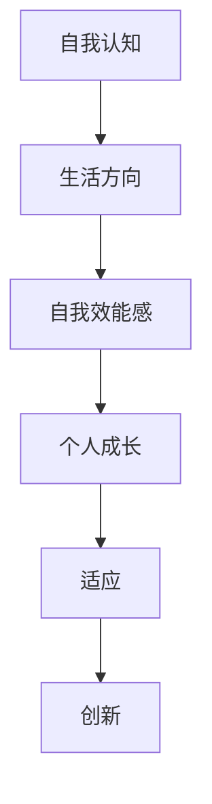

**例子说明：**
以自我认知为例，我们可以通过以下步骤来理解其重要性：
1. **自我认知**：通过自我反思和外部反馈，了解自己的价值观、兴趣爱好、能力和性格等方面。
2. **生活方向**：基于自我认知，明确自己的生活方向和目标，找到适合自己的生活方式。
3. **自我效能感**：通过实现生活目标和提升自身能力，增强自我效能感，提高自信心。
4. **个人成长**：在自我认知和生活目标的引导下，不断反思和调整自己的行为和生活方式，实现个人成长。
5. **适应**：在自我认知和个人成长的推动下，我们能够更好地适应社会变革，迎接新的挑战。
6. **创新**：通过不断创新和探索，我们能够在自我认知的基础上，找到新的生活意义和目标。

**实践策略：**
为了提升自我认知，我们可以采取以下实践策略：
1. **自我反思**：定期进行自我反思，思考自己的价值观、兴趣爱好、能力和性格等方面。
2. **外部反馈**：寻求家人、朋友、同事等外部反馈，了解自己的优点和不足。
3. **实践和体验**：通过尝试新事物、参与不同领域的活动，拓宽自己的视野，提升自我认知。

### 第3章：自我探索与生活目标的定位

#### 3.2 生活目标的设定原则

**核心概念讲解：**
设定生活目标是一个复杂的过程，需要遵循一定的原则，以确保目标的明确性、可行性和激励性。以下是设定生活目标的一些基本原则：

1. **具体性**：生活目标应该是具体的，而不是模糊的。具体的目标能够帮助我们有针对性地制定计划和行动。
2. **可行性**：目标应该是可行的，考虑自己的资源和能力，确保目标能够在合理的时间内实现。
3. **激励性**：目标应该具有激励性，能够激发我们的动力和热情，使我们愿意为之努力。
4. **挑战性**：目标应该具有一定的挑战性，能够促使我们不断进步和成长。
5. **灵活性**：目标应该是灵活的，允许我们在实际执行过程中进行调整和修正。

**ER实体关系图架构的 Mermaid 流程图：**

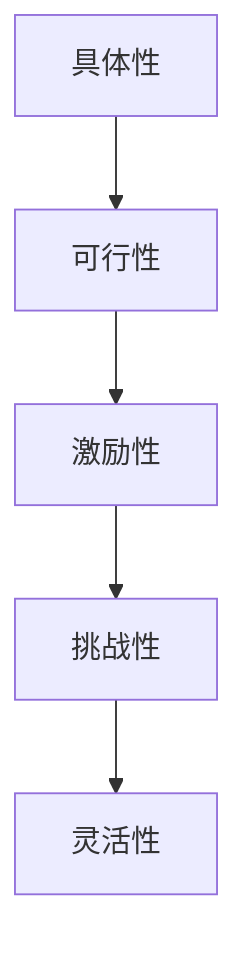

**算法原理讲解：**
为了理解设定生活目标的原则，我们可以使用 Mermaid 流程图来展示这些原则之间的关系：

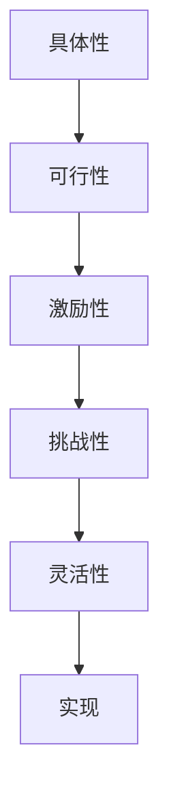

**例子说明：**
以设定健身目标为例，我们可以通过以下步骤来理解这些原则：
1. **具体性**：设定一个具体的目标，如“每周进行三次30分钟的有氧运动”。
2. **可行性**：考虑自己的时间、身体状况等因素，确保目标能够在实际生活中实现。
3. **激励性**：通过设定激励性的目标，如“一个月内减重5公斤”，激发自己的健身动力。
4. **挑战性**：目标具有一定的挑战性，促使我们在健身过程中不断努力和进步。
5. **灵活性**：在实际执行过程中，根据身体状况和实际情况，适当调整健身计划。
6. **实现**：通过遵循这些原则，我们能够更有效地实现健身目标，并从中获得成就感。

**实践策略：**
为了更好地设定生活目标，我们可以采取以下实践策略：
1. **明确目标**：确保目标具体、明确，能够帮助我们制定具体的行动计划。
2. **评估资源**：在设定目标时，评估自己的资源和能力，确保目标可行。
3. **设定激励措施**：通过设定激励性的目标，激发自己的动力和热情。
4. **保持灵活性**：在实际执行过程中，根据实际情况进行调整和修正，确保目标的实现。

### 第3章：自我探索与生活目标的定位

#### 3.3 生活目标的实践与调整

**核心概念讲解：**
在实践生活目标的过程中，我们需要不断地进行调整和反思，以确保目标的实现和个人的成长。以下是生活目标实践与调整的一些关键步骤：

1. **制定行动计划**：在设定目标后，我们需要制定具体的行动计划，明确每个阶段需要完成的任务和里程碑。
2. **持续追踪进度**：通过定期检查自己的进度，了解目标实现的情况，及时调整计划。
3. **反思与调整**：在实践过程中，我们需要反思自己的行动和结果，找出不足之处，并针对性地进行调整。
4. **寻求反馈**：向他人寻求反馈，了解自己在实践过程中的优点和不足，从而更好地调整自己的行动策略。
5. **保持耐心和毅力**：在实现目标的过程中，我们可能会遇到挫折和困难，需要保持耐心和毅力，不断努力。

**ER实体关系图架构的 Mermaid 流程图：**

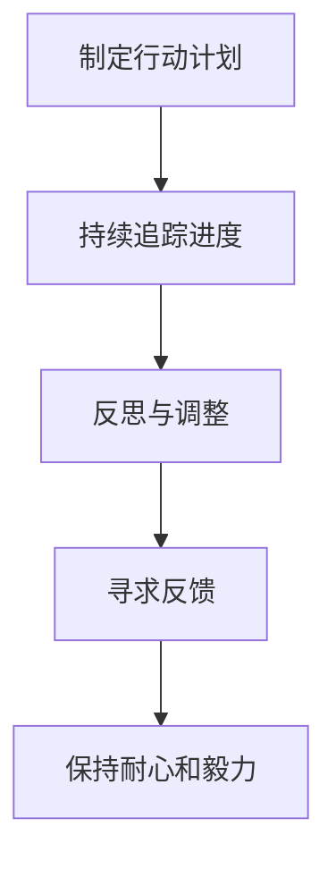

**算法原理讲解：**
为了理解生活目标的实践与调整，我们可以使用 Mermaid 流程图来展示这些步骤之间的关系：

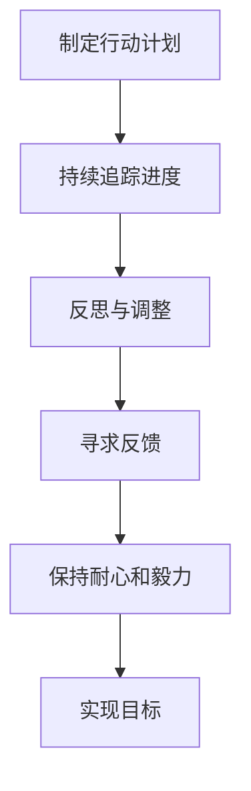

**例子说明：**
以学习一门新技能为例，我们可以通过以下步骤来实践和调整生活目标：
1. **制定行动计划**：明确学习目标，制定每天的学习计划，确保有足够的时间投入到学习中。
2. **持续追踪进度**：定期检查自己的学习进度，了解自己在学习过程中取得的进展和遇到的困难。
3. **反思与调整**：在学习过程中，反思自己的学习方法是否有效，是否需要调整学习计划。
4. **寻求反馈**：向老师、同学或专业人士寻求反馈，了解自己的学习效果，找到改进的方向。
5. **保持耐心和毅力**：在学习过程中，可能会遇到困难，需要保持耐心和毅力，不断克服挑战。
6. **实现目标**：通过持续的实践和调整，最终实现学习目标，掌握新的技能。

**实践策略：**
为了更好地实践和调整生活目标，我们可以采取以下实践策略：
1. **分解目标**：将大目标分解为小目标，逐步实现，避免一次性设定过于复杂的目标。
2. **定期评估**：定期评估目标的实现情况，及时调整计划，确保目标的实现。
3. **保持积极态度**：在面对困难和挫折时，保持积极态度，相信自己能够克服困难。
4. **与他人分享**：与他人分享自己的目标和实践过程，获取支持和鼓励，增强信心。

### 第3章：自我探索与生活目标的定位

#### 3.4 生活目标的设定与实践：案例分析

**核心概念讲解：**
生活目标的设定与实践是一个动态的过程，需要结合实际情况进行调整。通过具体案例，我们可以更好地理解这一过程。以下是一个关于学习新技能的案例分析：

**案例背景：**
小明是一名软件工程师，他希望在业余时间学习一门新技能——数据可视化。他希望通过学习数据可视化，提高自己在数据分析领域的竞争力，并在未来的职业发展中获得更多机会。

**目标设定：**
1. **具体性**：小明设定了一个具体的目标，即“在接下来的六个月内，学习并掌握至少三种数据可视化工具的使用”。
2. **可行性**：考虑到自己的工作时间，小明决定每天晚上花费2小时进行学习。
3. **激励性**：为了提高学习动力，小明设定了一个激励性的目标，即“在掌握至少三种数据可视化工具后，参与一个数据可视化的项目，并展示自己的成果”。
4. **挑战性**：六个月的时间对于学习三种数据可视化工具来说是一个挑战，但小明相信自己能够克服困难。
5. **灵活性**：在实践过程中，小明预留了一些时间用于调整学习计划和应对突发情况。

**实践过程：**
1. **制定行动计划**：小明制定了一个详细的学习计划，包括每个工具的学习时间和学习内容。
2. **持续追踪进度**：每周，小明都会检查自己的学习进度，并记录在笔记本上。
3. **反思与调整**：在实践过程中，小明发现自己在某些工具的学习上进展较慢，于是调整了学习计划，增加了对这些工具的练习时间。
4. **寻求反馈**：小明向同事请教了一些问题，并参加了一些在线数据可视化课程，以获取更多的学习资源。
5. **保持耐心和毅力**：在学习过程中，小明遇到了一些困难，但他始终保持着耐心和毅力，不断克服挑战。

**结果与反思：**
经过六个月的学习和实践，小明成功掌握了三种数据可视化工具。他参与了一个数据可视化的项目，并成功展示了项目成果。通过这个过程，小明不仅提高了自己的数据分析能力，也增强了自信心。

**反思与建议：**
通过这个案例，我们可以得到以下反思和建议：
1. **明确目标**：设定明确的目标是成功的关键，目标应该具体、可行、激励性、挑战性和灵活性。
2. **制定详细的计划**：制定详细的行动计划有助于我们更好地实践目标，并能够及时调整计划。
3. **持续追踪进度**：通过持续追踪进度，我们能够及时了解自己的学习情况，并进行调整。
4. **反思与调整**：在实践中不断反思和调整自己的方法和策略，是提高学习效果的重要途径。
5. **寻求反馈**：向他人寻求反馈，可以获取不同的观点和建议，帮助我们更好地实现目标。
6. **保持耐心和毅力**：在实现目标的过程中，我们可能会遇到困难和挫折，需要保持耐心和毅力，不断努力。

### 第4章：后现代语境下的生活方式选择

#### 4.1 灵活多元的生活方式

**核心概念讲解：**
在后现代语境下，灵活多元的生活方式成为了一种新的生活趋势。这种生活方式强调个体根据自身需求和实际情况，灵活选择和调整生活内容和形式。以下是灵活多元的生活方式的一些核心概念：

1. **个性化**：灵活多元的生活方式强调个性化，个体可以根据自己的兴趣、价值观和需求，选择适合自己的生活方式。
2. **多元选择**：个体在生活方式上拥有更多的选择，可以尝试不同的生活方式，如远程办公、自由职业、旅行生活等。
3. **动态调整**：灵活多元的生活方式要求个体能够根据实际情况和需求，动态调整生活方式，以适应不断变化的环境。
4. **自我实现**：灵活多元的生活方式鼓励个体追求自我实现，通过不断探索和尝试，实现个人价值和成长。

**ER实体关系图架构的 Mermaid 流程图：**

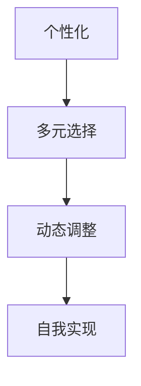

**算法原理讲解：**
为了理解灵活多元的生活方式，我们可以使用 Mermaid 流程图来展示这些核心概念之间的关系：

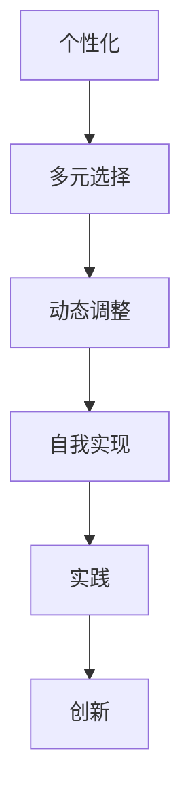

**例子说明：**
以个性化为例，我们可以通过以下步骤来理解灵活多元的生活方式：
1. **个性化**：个体根据自己的兴趣、价值观和需求，选择适合自己的生活方式。例如，有些人喜欢户外运动，可以选择成为一名户外爱好者；有些人对艺术感兴趣，可以选择参与艺术创作。
2. **多元选择**：个体在生活方式上拥有更多的选择，可以尝试不同的生活方式，如远程办公、自由职业、旅行生活等。这种多元选择使个体能够更好地满足自己的需求，提高生活质量。
3. **动态调整**：个体根据实际情况和需求，动态调整生活方式。例如，如果个体发现当前的生活方式无法满足自己的需求，可以适时调整，尝试新的生活方式。
4. **自我实现**：通过不断探索和尝试，个体能够实现个人价值和成长。例如，通过参与不同的活动，个体可以发现自己的潜力，提高自信心和自我价值感。

**实践策略：**
为了实现灵活多元的生活方式，我们可以采取以下实践策略：
1. **自我探索**：通过自我探索，了解自己的兴趣、价值观和需求，找到适合自己的生活方式。
2. **多元尝试**：勇于尝试不同的生活方式，了解各种生活方式的特点和优缺点，找到最适合自己的生活方式。
3. **动态调整**：根据实际情况和需求，灵活调整生活方式，确保生活方式能够满足自己的需求。
4. **持续学习**：不断学习新知识和技能，提高自己的适应能力和创新能力，以适应不断变化的生活方式。

### 第4章：后现代语境下的生活方式选择

#### 4.2 社交媒体的虚拟生活

**核心概念讲解：**
在后现代语境下，社交媒体已经成为人们生活中不可或缺的一部分。虚拟生活作为社交媒体的一个主要表现形式，对人们的社交行为和人际关系产生了深远的影响。以下是关于虚拟生活的几个核心概念：

1. **虚拟社区**：虚拟社区是人们在互联网上建立的一种虚拟社交环境，成员之间通过文字、图片、视频等方式进行交流。
2. **社交网络**：社交网络是指通过互联网连接起来的社交关系网络，包括个人、家庭、朋友、同事等。
3. **虚拟互动**：虚拟互动是指人们在虚拟环境中进行的社交互动，包括评论、点赞、分享等。
4. **现实与虚拟的融合**：现实与虚拟的融合意味着人们在现实生活中也受到虚拟生活的影响，两者之间的界限逐渐模糊。

**ER实体关系图架构的 Mermaid 流程图：**

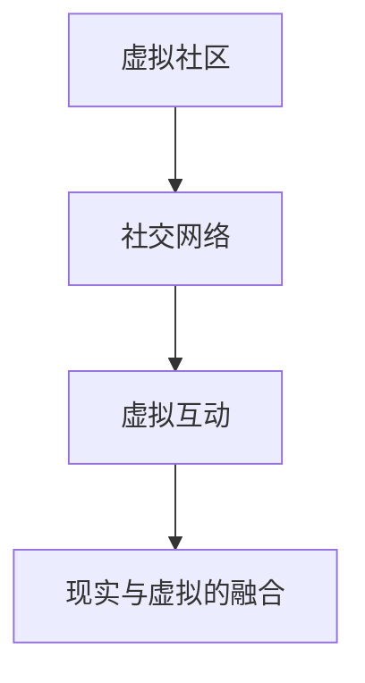

**算法原理讲解：**
为了理解虚拟生活的核心概念，我们可以使用 Mermaid 流程图来展示这些概念之间的关系：

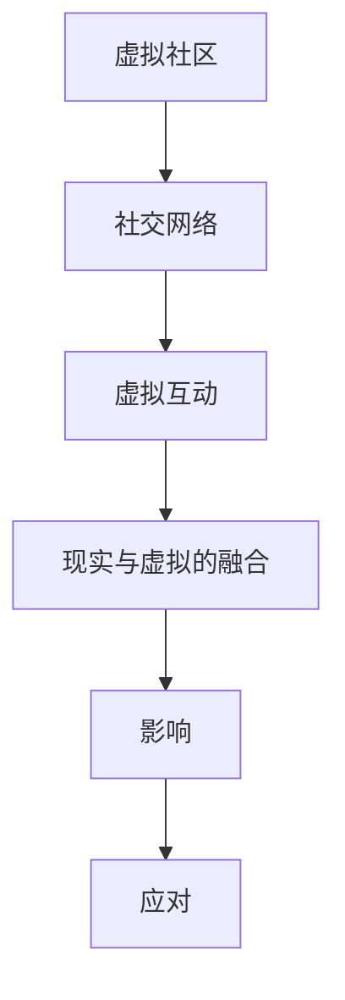

**例子说明：**
以虚拟社区为例，我们可以通过以下步骤来理解虚拟生活：
1. **虚拟社区**：个体在虚拟社区中建立自己的社交网络，与其他成员进行交流。例如，在一个在线论坛中，成员们可以发表观点、讨论问题、分享经验。
2. **社交网络**：社交网络中的成员通过虚拟互动建立联系，形成虚拟社区。例如，在社交媒体平台上，个体可以通过点赞、评论、分享等方式与朋友和其他用户互动。
3. **虚拟互动**：虚拟互动是虚拟生活中的一种主要形式，包括评论、点赞、分享等。例如，在虚拟社区中，个体可以对其他成员的观点进行评论，表达自己的看法。
4. **现实与虚拟的融合**：虚拟生活对现实生活产生了影响，两者之间的界限逐渐模糊。例如，个体在虚拟社区中建立的关系可能在现实生活中得到延续，虚拟互动也可能影响现实生活中的行为和决策。

**实践策略：**
为了更好地应对虚拟生活的影响，我们可以采取以下实践策略：
1. **平衡现实与虚拟**：在享受虚拟生活的便利的同时，保持对现实生活的关注和投入，确保两者的平衡。
2. **理性使用**：理性使用社交媒体，避免过度依赖虚拟生活，确保身心健康。
3. **保护隐私**：在虚拟社区中，注意保护个人隐私，避免泄露敏感信息。
4. **积极互动**：积极参与虚拟社区的活动，与他人进行有益的互动，提升自己的社交能力。
5. **现实与虚拟的结合**：尝试将虚拟生活中的经验和知识应用到现实生活中，实现两者的有机结合。

### 第4章：后现代语境下的生活方式选择

#### 4.3 科技与生活的融合

**核心概念讲解：**
在后现代语境下，科技与生活的融合已成为一种不可逆转的趋势。这种融合不仅改变了人们的生活方式，也深刻影响了社会结构和人类行为。以下是关于科技与生活融合的几个核心概念：

1. **智能化**：智能化是科技与生活融合的重要体现，通过人工智能、大数据等技术，生活变得更加便捷和高效。
2. **数字化**：数字化意味着生活的各个方面都被数字技术所渗透，从购物、娱乐到教育、医疗，数字化生活方式已经成为主流。
3. **网络化**：网络化使生活各个领域的信息流通更加迅速，人们可以随时随地获取所需的信息和服务。
4. **个性化**：通过个性化推荐、定制服务等技术，生活变得更加符合个人的需求和喜好。

**ER实体关系图架构的 Mermaid 流程图：**

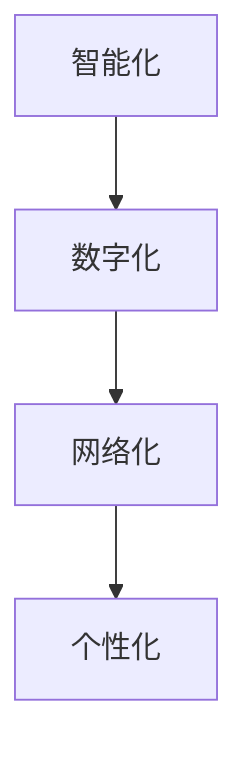

**算法原理讲解：**
为了理解科技与生活融合的核心概念，我们可以使用 Mermaid 流程图来展示这些概念之间的关系：

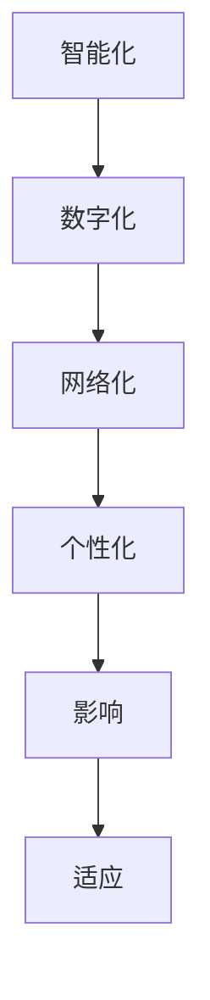

**例子说明：**
以智能化为例，我们可以通过以下步骤来理解科技与生活的融合：
1. **智能化**：通过智能设备，如智能手机、智能家居等，生活变得更加便捷。例如，智能音箱可以语音控制家居设备，提高生活效率。
2. **数字化**：数字化技术使得生活各个领域的活动都可以通过数字形式进行，如在线购物、电子支付等，大大提高了生活的便利性。
3. **网络化**：网络化使生活信息流通更加迅速，人们可以通过互联网随时随地获取所需的信息和服务，如在线教育、远程医疗等。
4. **个性化**：通过大数据分析和人工智能技术，个性化推荐系统可以根据个人的喜好和需求，提供个性化的服务和建议，如音乐、电影、商品推荐等。

**实践策略：**
为了更好地适应科技与生活的融合，我们可以采取以下实践策略：
1. **科技素养**：提高科技素养，了解新技术的应用和优势，充分利用科技提高生活质量。
2. **数据安全**：在使用数字技术时，注意数据安全，保护个人信息不被泄露。
3. **平衡使用**：在享受科技带来的便利的同时，保持对现实生活的关注和投入，确保科技与生活的平衡。
4. **创新思维**：培养创新思维，积极探索新技术在生活中的应用，为生活带来更多的可能性。

### 第5章：情感与关系在后现代语境下的意义

#### 5.1 情感关系的新维度

**核心概念讲解：**
在后现代语境下，情感关系呈现出新的维度，这些新维度包括：

1. **多元性**：情感关系不再局限于传统的二元关系，如亲情、友情、爱情等，而是更加多元和复杂。
2. **动态性**：情感关系是动态变化的，受到个体和社会环境的影响，不断调整和重构。
3. **开放性**：情感关系更加开放，个体可以自由选择和建立各种类型的情感关系，不受传统观念的束缚。
4. **平等性**：情感关系强调平等，个体在情感关系中享有平等的权利和地位，互相尊重和支持。

**ER实体关系图架构的 Mermaid 流程图：**

```mermaid
graph TD
A[多元性] --> B[动态性]
B --> C[开放性]
C --> D[平等性]
```

**算法原理讲解：**
为了理解情感关系的新维度，我们可以使用 Mermaid 流程图来展示这些维度之间的关系：

```mermaid
graph TD
A[多元性] --> B[动态性]
B --> C[开放性]
C --> D[平等性]
D --> E[实践]
E --> F[创新]
```

**例子说明：**
以多元性为例，我们可以通过以下步骤来理解情感关系的新维度：
1. **多元性**：在现代社会中，个体可以与不同类型的人建立情感关系，如朋友、恋人、合作伙伴等。这些关系不再局限于传统的家庭和婚姻关系。
2. **动态性**：情感关系是动态变化的，个体可能会在一生中与不同的人建立和解除情感关系。这些关系的建立和变化受到个体成长、社会环境等多种因素的影响。
3. **开放性**：情感关系更加开放，个体可以自由选择和建立各种类型的情感关系，不再受传统观念和社会期望的束缚。
4. **平等性**：在情感关系中，个体享有平等的权利和地位，互相尊重和支持。这种平等性体现在沟通、决策、责任分担等方面。

**实践策略：**
为了更好地实践情感关系的新维度，我们可以采取以下实践策略：
1. **多元思维**：培养多元思维，尊重和理解不同类型的情感关系，避免对他人关系进行过多的评判。
2. **动态适应**：在情感关系中，保持开放和适应的态度，根据实际情况和需求，灵活调整关系。
3. **平等沟通**：在情感关系中，注重平等沟通，尊重对方的意见和感受，共同解决问题。
4. **创新探索**：勇于尝试新的情感关系形式，探索和创造适合自己的情感关系模式。

### 第5章：情感与关系在后现代语境下的意义

#### 5.2 亲密关系的重构

**核心概念讲解：**
在后现代语境下，亲密关系面临着重构，这种重构主要体现在以下几个方面：

1. **价值观的重构**：随着社会观念的变化，人们对亲密关系的价值观也在发生变化。传统观念中的忠诚、承诺和牺牲等概念正在被重新审视。
2. **形式的多元化**：亲密关系的形式越来越多元化，如开放式关系、情感伴侣等，个体可以根据自己的需求和偏好来选择合适的亲密关系形式。
3. **平等性**：亲密关系中强调平等，个体在关系中享有平等的权利和地位，相互尊重和支持。
4. **自主性**：个体在亲密关系中的自主性得到重视，每个人都有权利追求自己的个人发展和幸福。

**ER实体关系图架构的 Mermaid 流程图：**

```mermaid
graph TD
A[价值观重构] --> B[形式多元化]
B --> C[平等性]
C --> D[自主性]
```

**算法原理讲解：**
为了理解亲密关系的重构，我们可以使用 Mermaid 流程图来展示这些核心概念之间的关系：

```mermaid
graph TD
A[价值观重构] --> B[形式多元化]
B --> C[平等性]
C --> D[自主性]
D --> E[影响]
E --> F[适应]
```

**例子说明：**
以价值观重构为例，我们可以通过以下步骤来理解亲密关系的重构：
1. **价值观重构**：在现代社会中，人们对亲密关系的价值观发生了变化，不再强调传统的忠诚和承诺，而是更加注重个体的需求和幸福感。
2. **形式多元化**：亲密关系的形式越来越多元化，如开放式关系、情感伴侣等，个体可以根据自己的需求和偏好来选择合适的亲密关系形式。
3. **平等性**：在亲密关系中，个体享有平等的权利和地位，相互尊重和支持。这种平等性体现在沟通、决策、责任分担等方面。
4. **自主性**：个体在亲密关系中的自主性得到重视，每个人都有权利追求自己的个人发展和幸福。这种自主性使个体在关系中更加自由和独立。

**实践策略：**
为了更好地重构亲密关系，我们可以采取以下实践策略：
1. **价值观反思**：反思自己对亲密关系的价值观，了解自己在关系中的需求和期望，以及如何与他人建立和谐的亲密关系。
2. **沟通与理解**：在亲密关系中，注重沟通和理解，避免因为价值观的差异而产生冲突。
3. **平等协商**：在亲密关系中，保持平等协商的态度，共同决策，分担责任，确保关系中的双方都能得到尊重和支持。
4. **个人成长**：重视个人的成长和发展，不断提升自己的能力和素质，为亲密关系带来更多的正能量。

### 第5章：情感与关系在后现代语境下的意义

#### 5.3 情感关系的维护与成长

**核心概念讲解：**
在后现代语境下，情感关系的维护与成长变得更加复杂和多元。以下是关于情感关系维护与成长的一些核心概念：

1. **沟通**：沟通是情感关系维护与成长的基础，有效的沟通可以帮助双方更好地理解对方的感受和需求。
2. **信任**：信任是情感关系的核心，它是关系稳定和持久的关键因素。
3. **共同目标**：共同目标可以帮助双方在情感关系中保持一致，共同朝着目标努力。
4. **独立性**：独立性是情感关系中每个个体都应该具备的特质，它有助于个体在关系中保持自我和成长。

**ER实体关系图架构的 Mermaid 流程图：**

```mermaid
graph TD
A[沟通] --> B[信任]
B --> C[共同目标]
C --> D[独立性]
```

**算法原理讲解：**
为了理解情感关系的维护与成长，我们可以使用 Mermaid 流程图来展示这些核心概念之间的关系：

```mermaid
graph TD
A[沟通] --> B[信任]
B --> C[共同目标]
C --> D[独立性]
D --> E[影响]
E --> F[适应]
```

**例子说明：**
以沟通为例，我们可以通过以下步骤来理解情感关系的维护与成长：
1. **沟通**：在情感关系中，双方需要保持开放和诚实的沟通，分享彼此的感受和需求。通过沟通，可以解决误解和矛盾，增进双方的理解。
2. **信任**：信任是情感关系的核心，它建立在双方相互信任和尊重的基础上。信任有助于减少关系中的不确定性和焦虑，使关系更加稳定。
3. **共同目标**：共同目标可以帮助双方在情感关系中保持一致，共同朝着目标努力。共同目标可以增强关系的凝聚力和稳定性。
4. **独立性**：独立性是情感关系中每个个体都应该具备的特质，它有助于个体在关系中保持自我和成长。独立性可以减少依赖性，使关系更加健康。

**实践策略：**
为了更好地维护和成长情感关系，我们可以采取以下实践策略：
1. **有效沟通**：提高沟通技巧，学会倾听和表达，确保双方都能在关系中感受到理解和尊重。
2. **建立信任**：通过诚实和透明，建立和维持信任。避免欺骗和隐瞒，以信任为基础的关系更加稳固。
3. **共同目标**：设定共同目标，与对方一起努力，共同实现。共同目标可以增强关系的凝聚力和稳定性。
4. **培养独立性**：尊重对方的独立性和个人空间，同时也要保持自己的独立性。独立性可以减少依赖性，使关系更加健康。

### 第6章：职业追求与生活目标的协同

#### 6.1 后现代语境下的职业观

**核心概念讲解：**
在后现代语境下，职业观发生了显著的变化。以下是关于后现代语境下的职业观的几个核心概念：

1. **多元性**：职业选择不再局限于传统的职业领域，个体可以根据自己的兴趣、能力和价值观，选择多元化的职业道路。
2. **灵活性**：职业灵活性成为现代职业观的重要特征，个体可以根据市场需求和个人发展，灵活调整职业方向。
3. **自我实现**：职业追求不仅仅是为了生计，更是为了实现个人的价值和追求自我实现。
4. **终身学习**：随着技术的快速发展，个体需要不断学习新知识和技能，以适应不断变化的工作环境。

**ER实体关系图架构的 Mermaid 流程图：**

```mermaid
graph TD
A[多元性] --> B[灵活性]
B --> C[自我实现]
C --> D[终身学习]
```

**算法原理讲解：**
为了理解后现代语境下的职业观，我们可以使用 Mermaid 流程图来展示这些核心概念之间的关系：

```mermaid
graph TD
A[多元性] --> B[灵活性]
B --> C[自我实现]
C --> D[终身学习]
D --> E[影响]
E --> F[适应]
```

**例子说明：**
以多元性为例，我们可以通过以下步骤来理解后现代语境下的职业观：
1. **多元性**：个体不再局限于传统职业路径，可以根据个人兴趣和能力，选择不同领域的职业，如艺术家、企业家、自由职业者等。
2. **灵活性**：职业灵活性使个体能够根据市场需求和个人发展，灵活调整职业方向，如兼职、远程工作等。
3. **自我实现**：职业追求不仅仅是为了生计，更是为了实现个人的价值和追求自我实现，如追求创新、探索新领域等。
4. **终身学习**：随着技术的快速发展，个体需要不断学习新知识和技能，以适应不断变化的工作环境，如参加培训、在线学习等。

**实践策略：**
为了更好地适应后现代语境下的职业观，我们可以采取以下实践策略：
1. **自我探索**：通过自我探索，了解自己的兴趣、能力和价值观，找到适合自己的职业方向。
2. **终身学习**：保持学习的热情，不断提升自己的知识和技能，适应职业发展的需求。
3. **灵活适应**：培养灵活性，根据市场需求和个人发展，灵活调整职业方向。
4. **追求自我实现**：将职业追求与自我实现相结合，寻找能够带来满足感和成就感的工作。

### 第6章：职业追求与生活目标的协同

#### 6.2 职业选择的多元化

**核心概念讲解：**
在后现代语境下，职业选择的多元化成为了一个显著趋势。这种多元化主要体现在以下几个方面：

1. **跨领域发展**：个体不再局限于一个特定的领域，而是可以跨领域发展，将不同领域的技能和知识相结合，创造出新的职业机会。
2. **职业与兴趣的融合**：职业选择更加注重与个人兴趣的融合，个体可以在自己喜欢的领域实现职业发展，提高工作满意度和成就感。
3. **自主创业**：随着创业环境的改善，越来越多的人选择自主创业，通过自己的努力和创意，实现职业追求。
4. **远程工作与兼职**：远程工作和兼职成为了职业选择的多元化形式，个体可以根据自己的时间和地点，灵活安排工作。

**ER实体关系图架构的 Mermaid 流程图：**

```mermaid
graph TD
A[跨领域发展] --> B[职业与兴趣的融合]
B --> C[自主创业]
C --> D[远程工作与兼职]
```

**算法原理讲解：**
为了理解职业选择的多元化，我们可以使用 Mermaid 流程图来展示这些核心概念之间的关系：

```mermaid
graph TD
A[跨领域发展] --> B[职业与兴趣的融合]
B --> C[自主创业]
C --> D[远程工作与兼职]
D --> E[影响]
E --> F[适应]
```

**例子说明：**
以跨领域发展为例如，我们可以通过以下步骤来理解职业选择的多元化：
1. **跨领域发展**：个体可以将不同领域的技能和知识相结合，创造出新的职业机会。例如，一个有编程背景的人可以转型成为数据分析师，将技术能力和数据分析技能相结合。
2. **职业与兴趣的融合**：个体可以在自己喜欢的领域实现职业发展，提高工作满意度和成就感。例如，一个对艺术和设计有热情的人可以选择成为一名自由职业设计师。
3. **自主创业**：个体可以通过自己的努力和创意，实现职业追求。例如，一个有创业想法的人可以创办一家初创公司，将创意转化为实际的产品或服务。
4. **远程工作与兼职**：个体可以根据自己的时间和地点，灵活安排工作。例如，一个需要照顾家庭的人可以选择远程工作，以平衡工作和家庭责任。

**实践策略：**
为了更好地实现职业选择的多元化，我们可以采取以下实践策略：
1. **自我探索**：通过自我探索，了解自己的兴趣、能力和价值观，找到适合自己的职业方向。
2. **技能提升**：不断提升自己的技能和知识，为跨领域发展和自主创业做好准备。
3. **创业准备**：了解创业环境，积累创业经验，为自主创业做好准备。
4. **灵活工作**：尝试远程工作和兼职，根据个人需求和工作环境，灵活安排工作。

### 第6章：职业追求与生活目标的协同

#### 6.3 职业发展与生活目标的平衡

**核心概念讲解：**
在后现代语境下，职业发展与生活目标的平衡成为一个重要的议题。以下是关于职业发展与生活目标平衡的几个核心概念：

1. **职业发展**：职业发展是指个体在职业生涯中不断提升自己，实现职业目标和价值的过程。
2. **生活目标**：生活目标是指个体在生活各个方面追求的成就和满足，包括家庭、健康、娱乐、社交等。
3. **平衡**：平衡是指个体在职业发展和生活目标之间找到一种协调和平衡，确保两者都能得到充分的发展。
4. **综合考量**：综合考量是指个体在制定职业发展和生活目标时，需要综合考虑自己的兴趣、能力、价值观以及社会环境等因素。

**ER实体关系图架构的 Mermaid 流程图：**

```mermaid
graph TD
A[职业发展] --> B[生活目标]
B --> C[平衡]
C --> D[综合考量]
```

**算法原理讲解：**
为了理解职业发展与生活目标的平衡，我们可以使用 Mermaid 流程图来展示这些核心概念之间的关系：

```mermaid
graph TD
A[职业发展] --> B[生活目标]
B --> C[平衡]
C --> D[综合考量]
D --> E[实现]
E --> F[持续调整]
```

**例子说明：**
以职业发展为例，我们可以通过以下步骤来理解职业发展与生活目标的平衡：
1. **职业发展**：个体在职业生涯中不断提升自己，实现职业目标和价值。例如，通过不断提升技能和业绩，获得晋升和加薪。
2. **生活目标**：个体在生活各个方面追求的成就和满足，包括家庭、健康、娱乐、社交等。例如，通过照顾家庭、保持健康的生活方式、参加社交活动等，实现生活目标。
3. **平衡**：个体在职业发展和生活目标之间找到一种协调和平衡，确保两者都能得到充分的发展。例如，合理安排工作时间，确保工作和家庭之间的平衡。
4. **综合考量**：个体在制定职业发展和生活目标时，需要综合考虑自己的兴趣、能力、价值观以及社会环境等因素。例如，在职业发展方面，选择符合自己兴趣和能力的工作，同时在生活目标方面，考虑家庭责任和社会期望。

**实践策略：**
为了更好地实现职业发展与生活目标的平衡，我们可以采取以下实践策略：
1. **明确目标**：明确职业发展和生活目标，确保两者相互协调，共同发展。
2. **合理规划**：合理规划时间和资源，确保工作与生活之间的平衡。
3. **持续调整**：根据实际情况和需求，不断调整职业发展和生活目标，确保两者的平衡状态。
4. **寻求支持**：寻求家人、朋友和同事的支持，共同应对职业发展和生活目标之间的挑战。

### 第6章：职业追求与生活目标的协同

#### 6.4 职业发展与生活目标的协同实践

**核心概念讲解：**
在追求职业发展的同时，保持生活目标的实现是现代个体面临的重要挑战。协同实践意味着在职业追求与生活目标之间找到一种平衡，使两者相互促进，共同发展。以下是关于职业发展与生活目标协同实践的一些核心概念：

1. **目标设定**：设定明确的职业和生活目标，确保两者相互协调。
2. **时间管理**：合理规划时间，确保职业发展活动和生活目标活动都能得到充分的时间和资源。
3. **弹性工作**：采用弹性工作制度，如远程工作、兼职等，以适应个人生活需求。
4. **家庭与工作平衡**：建立有效的家庭与工作平衡策略，确保家庭责任和职业发展的需求都能得到满足。
5. **持续学习**：不断提升个人能力和技能，以适应职业发展的需求，同时为生活目标的实现提供支持。

**ER实体关系图架构的 Mermaid 流程图：**

```mermaid
graph TD
A[目标设定] --> B[时间管理]
B --> C[弹性工作]
C --> D[家庭与工作平衡]
D --> E[持续学习]
```

**算法原理讲解：**
为了理解职业发展与生活目标的协同实践，我们可以使用 Mermaid 流程图来展示这些核心概念之间的关系：

```mermaid
graph TD
A[目标设定] --> B[时间管理]
B --> C[弹性工作]
C --> D[家庭与工作平衡]
D --> E[持续学习]
E --> F[效果评估]
F --> G[调整策略]
```

**例子说明：**
以目标设定为例，我们可以通过以下步骤来理解职业发展与生活目标的协同实践：
1. **目标设定**：明确职业和生活目标，确保两者相互协调。例如，一个职业目标是晋升为高级经理，一个生活目标是每年带家人去旅行一次。
2. **时间管理**：合理规划时间，确保职业发展活动和生活目标活动都能得到充分的时间和资源。例如，将每周的工作日用于职业发展，周末用于陪伴家人和娱乐活动。
3. **弹性工作**：采用弹性工作制度，如远程工作、兼职等，以适应个人生活需求。例如，选择远程工作，以便在家庭需要时能够灵活安排工作时间。
4. **家庭与工作平衡**：建立有效的家庭与工作平衡策略，确保家庭责任和职业发展的需求都能得到满足。例如，与家人沟通工作安排，确保家庭活动不受工作干扰。
5. **持续学习**：不断提升个人能力和技能，以适应职业发展的需求，同时为生活目标的实现提供支持。例如，参加培训课程，提高专业技能，以便在职业竞争中保持优势。

**实践策略：**
为了更好地实现职业发展与生活目标的协同实践，我们可以采取以下实践策略：
1. **设定明确目标**：明确职业和生活目标，确保两者相互协调。
2. **合理规划时间**：合理规划时间，确保职业发展活动和生活目标活动都能得到充分的时间和资源。
3. **采用弹性工作制度**：采用弹性工作制度，如远程工作、兼职等，以适应个人生活需求。
4. **建立家庭与工作平衡策略**：建立有效的家庭与工作平衡策略，确保家庭责任和职业发展的需求都能得到满足。
5. **持续学习**：不断提升个人能力和技能，以适应职业发展的需求，同时为生活目标的实现提供支持。

### 第7章：后现代语境下的生活哲学

#### 7.1 生活哲学的反思

**核心概念讲解：**
生活哲学是对生活本质和意义的深刻思考，它涉及价值观、人生观、世界观等多个方面。在后现代语境下，生活哲学的反思变得更加重要。以下是关于生活哲学反思的几个核心概念：

1. **价值观的多元性**：后现代语境下，价值观的多元性使得个体需要重新审视和反思自己的价值观，找到适合自己的价值观体系。
2. **生活意义的重构**：随着社会环境的变迁，个体对生活的意义和目的需要进行重构，以适应新的生活现实。
3. **自我认知的重要性**：生活哲学的反思强调个体需要深入了解自己，认识自己的需求和价值观，从而更好地规划自己的人生。
4. **生活方式的选择**：个体需要在反思的基础上，选择适合自己的生活方式，实现个人的价值和幸福。

**ER实体关系图架构的 Mermaid 流程图：**

```mermaid
graph TD
A[价值观的多元性] --> B[生活意义的重构]
B --> C[自我认知的重要性]
C --> D[生活方式的选择]
```

**算法原理讲解：**
为了理解生活哲学的反思，我们可以使用 Mermaid 流程图来展示这些核心概念之间的关系：

```mermaid
graph TD
A[价值观的多元性] --> B[生活意义的重构]
B --> C[自我认知的重要性]
C --> D[生活方式的选择]
D --> E[实现]
E --> F[持续反思]
```

**例子说明：**
以价值观的多元性为例，我们可以通过以下步骤来理解生活哲学的反思：
1. **价值观的多元性**：在现代社会中，价值观的多元性使得个体面临更多的选择和挑战。例如，在职业选择上，有人追求物质财富，有人追求精神满足。
2. **生活意义的重构**：个体需要对生活的意义和目的进行重构，以适应新的生活现实。例如，在现代社会中，许多人开始反思“成功”的定义，不再单纯追求物质财富，而是追求生活的平衡和幸福感。
3. **自我认知的重要性**：个体需要深入了解自己，认识自己的需求和价值观。例如，通过自我反思和外部反馈，个体可以更好地了解自己的兴趣、优势和价值观。
4. **生活方式的选择**：在反思的基础上，个体需要选择适合自己的生活方式，实现个人的价值和幸福。例如，有人选择追求高薪工作，有人选择追求自由职业，这取决于他们的价值观和生活方式的选择。

**实践策略：**
为了更好地进行生活哲学的反思，我们可以采取以下实践策略：
1. **自我探索**：通过自我探索，了解自己的价值观、兴趣和需求，找到适合自己的生活方式。
2. **持续反思**：在生活中不断反思自己的行为和决策，审视自己的价值观和生活目标。
3. **价值观重构**：根据实际情况和需求，对价值观进行重构，确保它们能够适应新的生活现实。
4. **生活方式选择**：在选择生活方式时，考虑自己的价值观和需求，确保生活方式能够实现个人的价值和幸福。

### 第7章：后现代语境下的生活哲学

#### 7.2 审美与意义的重构

**核心概念讲解：**
在后现代语境下，审美和意义的重构成为个体思考和生活方式中的重要内容。以下是关于审美与意义重构的几个核心概念：

1. **审美的多元性**：后现代语境下，审美观念的多元性使得个体需要重新审视传统的审美标准，接受多样化的审美体验。
2. **意义的相对性**：随着社会的变迁和个体经历的丰富，人们开始认识到意义是相对的，不同的社会和文化背景会影响人们对意义的理解和追求。
3. **审美与生活的融合**：审美不再仅仅是一种艺术追求，而是与日常生活紧密相连，个体需要在日常生活中寻找审美体验。
4. **意义重构的策略**：个体需要采取一系列策略来重构生活的意义，如自我探索、与他人交流、参与社会活动等。

**ER实体关系图架构的 Mermaid 流程图：**

```mermaid
graph TD
A[审美的多元性] --> B[意义的相对性]
B --> C[审美与生活的融合]
C --> D[意义重构的策略]
```

**算法原理讲解：**
为了理解审美与意义的重构，我们可以使用 Mermaid 流程图来展示这些核心概念之间的关系：

```mermaid
graph TD
A[审美的多元性] --> B[意义的相对性]
B --> C[审美与生活的融合]
C --> D[意义重构的策略]
D --> E[实践]
E --> F[反馈]
```

**例子说明：**
以审美的多元性为例，我们可以通过以下步骤来理解审美与意义的重构：
1. **审美的多元性**：在现代社会中，审美观念的多元性使得个体有机会接触和体验不同的审美文化。例如，个体可以通过观看电影、阅读文学作品、参观艺术展览等，了解不同的审美风格和观念。
2. **意义的相对性**：随着个体经历的丰富和视野的开阔，人们开始认识到意义是相对的。不同的社会和文化背景会影响人们对事物的理解和评价。例如，一种文化中被视为美的艺术作品，在另一种文化中可能不被认可。
3. **审美与生活的融合**：审美不再仅仅是一种艺术追求，而是与日常生活紧密相连。个体需要在日常生活中寻找审美体验。例如，通过日常生活的细节、环境布置、衣着搭配等，个体可以创造和享受审美的乐趣。
4. **意义重构的策略**：个体需要采取一系列策略来重构生活的意义，如自我探索、与他人交流、参与社会活动等。通过这些策略，个体可以丰富自己的生活经验，找到新的意义和目标。

**实践策略：**
为了更好地实现审美与意义的重构，我们可以采取以下实践策略：
1. **多元审美体验**：积极参与各种审美活动，接触不同的审美文化和风格，拓宽自己的审美视野。
2. **反思与重构**：在日常生活中，反思自己的价值观和生活目标，不断重构生活的意义，确保生活能够满足个体的需求。
3. **互动与交流**：与他人分享自己的审美体验和生活意义，从他人的观点和经验中获取启发和反思。
4. **持续学习**：通过学习和探索，不断提升自己的审美能力和理解力，为生活的审美和意义重构提供支持。

### 第7章：后现代语境下的生活哲学

#### 7.3 诗意地栖息

**核心概念讲解：**
在快节奏和高度竞争的现代生活中，诗意地栖息成为了一种追求。以下是关于诗意地栖息的几个核心概念：

1. **诗意生活**：诗意生活是指在生活中寻找和创造美和意义，使生活充满诗意和乐趣。
2. **心态调整**：诗意地栖息需要调整心态，学会欣赏生活中的美好，以积极的态度面对挑战和困难。
3. **环境营造**：通过环境营造，如家居布置、自然景观等，创造一个有利于诗意栖息的空间。
4. **日常生活美学**：将美学融入日常生活，通过细节和习惯，提升生活的质量。

**ER实体关系图架构的 Mermaid 流程图：**

```mermaid
graph TD
A[诗意生活] --> B[心态调整]
B --> C[环境营造]
C --> D[日常生活美学]
```

**算法原理讲解：**
为了理解诗意地栖息，我们可以使用 Mermaid 流程图来展示这些核心概念之间的关系：

```mermaid
graph TD
A[诗意生活] --> B[心态调整]
B --> C[环境营造]
C --> D[日常生活美学]
D --> E[实践]
E --> F[反馈]
```

**例子说明：**
以诗意生活为例，我们可以通过以下步骤来理解诗意地栖息：
1. **诗意生活**：诗意生活是一种态度，它强调在生活中寻找和创造美和意义。例如，通过阅读、写作、绘画等艺术活动，个体可以在生活中感受到诗意。
2. **心态调整**：诗意地栖息需要调整心态，学会欣赏生活中的美好，以积极的态度面对挑战和困难。例如，在面对困难时，个体可以寻找积极的解决方法，而不是抱怨和消极。
3. **环境营造**：通过环境营造，如家居布置、自然景观等，创造一个有利于诗意栖息的空间。例如，通过布置舒适的家居环境、在户外种植花草，个体可以创造一个美好的生活空间。
4. **日常生活美学**：将美学融入日常生活，通过细节和习惯，提升生活的质量。例如，通过精致的食物制作、日常物品的装饰，个体可以在日常生活中体验到美学。

**实践策略：**
为了更好地实现诗意地栖息，我们可以采取以下实践策略：
1. **寻找诗意**：在生活中寻找和创造美和意义，通过艺术创作、文学阅读等方式，丰富生活的诗意。
2. **心态调整**：学会欣赏生活中的美好，以积极的态度面对挑战和困难，培养乐观的心态。
3. **环境营造**：通过家居布置、自然景观等，创造一个有利于诗意栖息的空间。
4. **日常生活美学**：将美学融入日常生活，通过细节和习惯，提升生活的质量。

### 第8章：实践与总结

#### 8.1 重新定义生活目标的实践案例

**核心概念讲解：**
重新定义生活目标是适应后现代语境下的重要策略。以下是关于重新定义生活目标的几个核心概念：

1. **自我认知**：通过自我认知，个体可以明确自己的价值观、兴趣和能力，从而设定符合自身特点的生活目标。
2. **目标设定**：设定明确、具体、可行、激励性和挑战性的生活目标，以实现个人的成长和满足感。
3. **实践调整**：在实践中不断调整和优化生活目标，以适应环境和自身的变化。

**ER实体关系图架构的 Mermaid 流程图：**

```mermaid
graph TD
A[自我认知] --> B[目标设定]
B --> C[实践调整]
```

**算法原理讲解：**
为了理解重新定义生活目标的实践，我们可以使用 Mermaid 流程图来展示这些核心概念之间的关系：

```mermaid
graph TD
A[自我认知] --> B[目标设定]
B --> C[实践调整]
C --> D[反馈]
D --> E[总结]
```

**例子说明：**
以重新定义生活目标为例，我们可以通过以下步骤来理解其实践过程：
1. **自我认知**：通过反思和自我探索，个体了解自己的兴趣、价值观和能力。例如，一个人可能发现自己对旅行和摄影感兴趣，对探索新文化和自然景观有热情。
2. **目标设定**：基于自我认知，个体设定具体的生活目标，如每年旅行两次，提升摄影技巧，参加摄影比赛等。这些目标既符合个体的兴趣，也具有一定的挑战性。
3. **实践调整**：在实践过程中，个体根据实际情况和反馈，不断调整和优化生活目标。例如，如果一年内旅行两次有困难，可以调整目标为每年旅行一次，同时寻找其他方式如线上交流和摄影培训来满足兴趣。
4. **反馈与总结**：通过实践，个体可以获得反馈，了解目标的实现程度和对个人成长的影响。例如，通过旅行，个体不仅提升了摄影技巧，还结识了新的朋友，拓宽了视野。

**实践策略：**
为了更好地实现重新定义生活目标，我们可以采取以下实践策略：
1. **定期自我反思**：定期进行自我反思，了解自己的兴趣、价值观和能力，确保生活目标与自身特点相符。
2. **设定具体目标**：设定具体、明确、可行的生活目标，确保目标能够激励和引导个体前进。
3. **实践与调整**：在实践中不断调整和优化生活目标，以适应环境和自身的变化。
4. **反馈与总结**：通过实践获得反馈，总结经验教训，为未来的生活目标设定提供参考。

### 第8章：实践与总结

#### 8.2 遇到的挑战与应对策略

**核心概念讲解：**
在后现代语境下，重新定义生活目标的过程中，个体可能会遇到各种挑战。以下是关于挑战与应对策略的几个核心概念：

1. **环境变化**：社会、经济、科技等环境的变化对生活目标的重构提出了新的挑战。
2. **个人成长**：在实现生活目标的过程中，个体需要不断提升自己，以适应环境变化。
3. **心态调整**：面对挑战，个体需要调整心态，保持积极的态度和信念。
4. **策略选择**：个体需要采取有效的策略来应对挑战，如时间管理、资源整合、寻求支持等。

**ER实体关系图架构的 Mermaid 流程图：**

```mermaid
graph TD
A[环境变化] --> B[个人成长]
B --> C[心态调整]
C --> D[策略选择]
```

**算法原理讲解：**
为了理解挑战与应对策略，我们可以使用 Mermaid 流程图来展示这些核心概念之间的关系：

```mermaid
graph TD
A[环境变化] --> B[个人成长]
B --> C[心态调整]
C --> D[策略选择]
D --> E[实践]
E --> F[反馈]
```

**例子说明：**
以环境变化为例，我们可以通过以下步骤来理解挑战与应对策略：
1. **环境变化**：随着社会、经济、科技的快速发展，生活目标的重构面临着新的挑战。例如，技术的进步可能导致某些职业岗位的消失，需要个体迅速适应新的就业环境。
2. **个人成长**：在应对环境变化的过程中，个体需要不断提升自己的能力和技能，以适应新的职业需求和生活方式。例如，通过学习新技能、拓展知识面，个体可以提高自己的竞争力。
3. **心态调整**：面对挑战，个体需要调整心态，保持积极的态度和信念。例如，通过自我激励、正面思考，个体可以增强自信心，克服挑战。
4. **策略选择**：个体需要采取有效的策略来应对挑战，如时间管理、资源整合、寻求支持等。例如，通过合理安排时间、寻求专业指导、参与社交活动，个体可以更好地应对环境变化。
5. **实践与反馈**：在实践过程中，个体可以根据反馈不断调整自己的策略，以适应新的环境和挑战。

**实践策略：**
为了更好地应对挑战，我们可以采取以下实践策略：
1. **环境适应**：关注社会、经济、科技等环境的变化，及时调整生活目标。
2. **持续学习**：不断提升自己的知识和技能，以适应新的职业和生活方式。
3. **心态调整**：保持积极的心态，通过正面思考和自我激励，克服挑战。
4. **策略选择**：根据实际情况，选择有效的策略来应对挑战，如时间管理、资源整合、寻求支持等。
5. **反馈与调整**：在实践中不断获得反馈，根据反馈调整自己的策略和生活方式。

### 第8章：实践与总结

#### 8.3 生活目标重构的长期效果与反思

**核心概念讲解：**
生活目标重构的长期效果与反思是评估和优化生活目标的重要环节。以下是关于生活目标重构长期效果与反思的几个核心概念：

1. **持续成长**：生活目标重构促使个体在长期内持续成长，包括职业、心理、情感等各个方面。
2. **生活质量提升**：通过生活目标的重构，个体的生活质量得到显著提升，包括身体健康、家庭关系、社交互动等。
3. **自我实现**：生活目标的重构有助于个体实现自我价值，找到生活的意义和目标。
4. **反思与调整**：在实现生活目标的过程中，个体需要进行持续的反思和调整，以确保目标的实现和个人的成长。

**ER实体关系图架构的 Mermaid 流程图：**

```mermaid
graph TD
A[持续成长] --> B[生活质量提升]
B --> C[自我实现]
C --> D[反思与调整]
```

**算法原理讲解：**
为了理解生活目标重构的长期效果与反思，我们可以使用 Mermaid 流程图来展示这些核心概念之间的关系：

```mermaid
graph TD
A[持续成长] --> B[生活质量提升]
B --> C[自我实现]
C --> D[反思与调整]
D --> E[实现]
E --> F[优化]
```

**例子说明：**
以持续成长为例，我们可以通过以下步骤来理解生活目标重构的长期效果与反思：
1. **持续成长**：通过重构生活目标，个体在职业、心理、情感等各个方面实现持续成长。例如，一个人可能通过学习新技能、参与社交活动，不断提升自己的职业能力和人际交往能力。
2. **生活质量提升**：生活目标的重构有助于个体的生活质量得到显著提升。例如，通过调整生活方式、维护身体健康、改善家庭关系，个体的生活满意度和幸福感得到提升。
3. **自我实现**：通过实现生活目标，个体找到生活的意义和目标，实现自我价值。例如，一个人通过完成自己设定的目标，如完成一项重要的项目、实现创业梦想等，获得成就感和满足感。
4. **反思与调整**：在实现生活目标的过程中，个体需要进行持续的反思和调整，以确保目标的实现和个人的成长。例如，通过定期反思自己的行为和决策，个体可以及时发现问题并做出调整，以实现更好的生活目标。

**实践策略：**
为了更好地实现生活目标重构的长期效果与反思，我们可以采取以下实践策略：
1. **持续学习**：不断提升自己的知识和技能，以适应不断变化的社会环境。
2. **健康生活**：注重身体健康，通过合理饮食、锻炼和休息，提高生活质量。
3. **人际关系**：积极参与社交活动，建立和维护良好的人际关系，增强社交支持。
4. **自我反思**：定期进行自我反思，了解自己的行为和决策，及时调整和优化生活目标。
5. **目标实现**：通过实现具体的生活目标，提升自我价值感，增强生活的意义和目的感。

### 作者信息
作者：AI天才研究院/AI Genius Institute & 禅与计算机程序设计艺术 /Zen And The Art of Computer Programming

