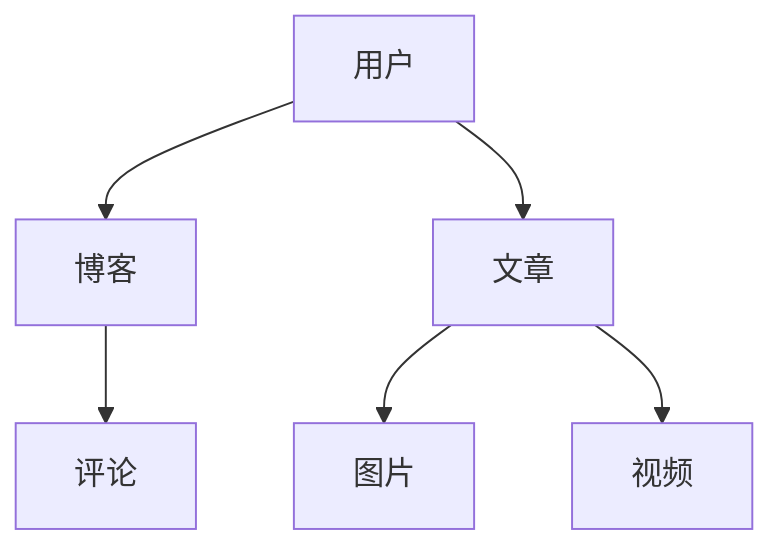
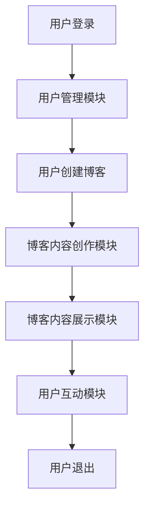
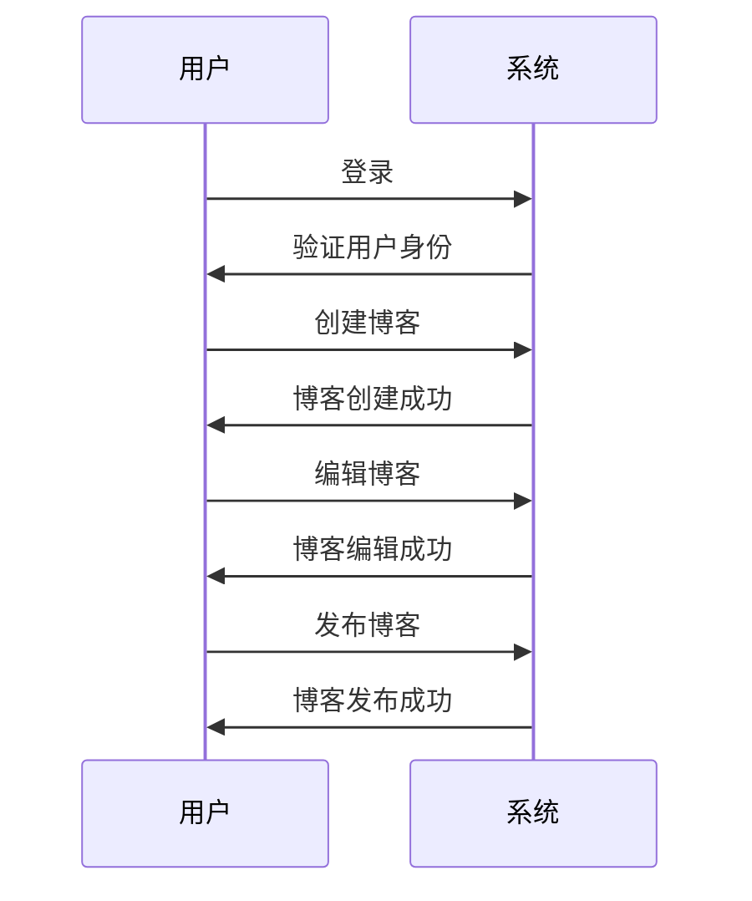
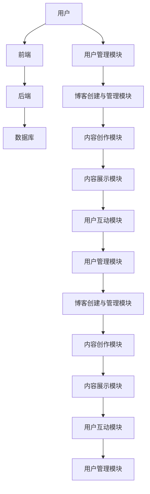

                 

 

### 让我们深入思考并逐步构建《慢旅行博客：记录深度文化体验的平台》的技术博客文章

#### 第一步：背景介绍

**核心概念术语说明：**  
- **慢旅行博客**：一种以记录深度文化体验为核心的博客形式，强调个人感悟与分享。
- **平台**：指用于构建和管理慢旅行博客的技术系统。

**问题背景：**  
随着互联网技术的发展，博客已经成为人们分享生活、交流思想的重要平台。而慢旅行作为一种新兴的旅行方式，注重深度体验和文化交流。因此，构建一个专注于慢旅行博客的平台，可以更好地满足用户的需求，促进文化的传承和交流。

**问题描述：**  
如何设计并实现一个《慢旅行博客：记录深度文化体验的平台》，使其具备以下特点：
1. **易用性**：用户可以轻松创建和管理博客。
2. **个性化**：用户可以根据自己的兴趣和需求定制博客内容和样式。
3. **深度文化体验**：平台应能支持用户记录和分享丰富的文化体验内容。
4. **互动性**：用户之间可以互相评论、交流，形成社区。

**问题解决：**  
为了解决上述问题，我们可以从以下几个方面入手：
1. **平台架构设计**：选择合适的技术栈和架构模式，确保平台的性能和可扩展性。
2. **功能模块划分**：将平台的功能划分为用户管理、内容创作、内容展示、互动交流等模块。
3. **技术选型与实现**：根据需求选择合适的编程语言和框架，实现平台的核心功能。
4. **用户体验设计**：注重用户体验，提供简洁、直观的操作界面。

**边界与外延：**  
1. **边界**：本文主要讨论《慢旅行博客：记录深度文化体验的平台》的技术设计和实现，不涉及具体的商业运营策略。
2. **外延**：本文的技术设计可以应用于各种类型的博客平台，不仅限于慢旅行博客。

#### 第二步：核心概念与联系

**核心概念：**  
- **慢旅行博客**：以深度文化体验为核心，记录和分享个人感悟与体验的博客形式。
- **平台**：用于构建和管理博客的技术系统。

**概念属性特征对比表格：**

| 特征           | 慢旅行博客                         | 平台                         |
| -------------- | ---------------------------------- | ---------------------------- |
| 目的           | 记录和分享深度文化体验             | 提供博客构建和管理服务       |
| 形式           | 文字、图片、视频等多种形式         | 网站、应用程序等             |
| 用户互动       | 强调用户互动与交流                 | 提供评论、分享等功能         |

**ER实体关系图架构：**



**联系：**  
慢旅行博客是平台上的一个功能模块，用户可以通过平台创建和管理博客，记录和分享深度文化体验。

#### 第三步：算法原理讲解

**算法流程图：**



**算法原理：**

1. **用户管理模块**：用户通过登录模块登录平台，进行用户身份验证和管理。
2. **博客内容创作模块**：用户创建博客，选择博客主题和样式，编辑博客内容（文字、图片、视频等）。
3. **博客内容展示模块**：用户发布博客，平台展示博客内容，并提供评论和分享功能。
4. **用户互动模块**：用户之间可以进行互动，评论、点赞、分享博客内容。

**数学模型与公式：**

$$
UAV = \frac{N_{comment} + N_{article} + N_{interaction}}{T_{active}}
$$

其中，$UAV$ 表示用户活跃度，$N_{comment}$ 表示评论数量，$N_{article}$ 表示文章数量，$N_{interaction}$ 表示互动次数，$T_{active}$ 表示活跃时间。

**举例说明：**

假设用户A在平台上发布了一篇关于慢旅行的博客，获得了10条评论，点赞了5篇文章，与10个用户进行了互动，活跃时间为30天。那么，用户A的活跃度计算如下：

$$
UAV = \frac{10 + 1 + 10}{30} = \frac{21}{30} = 0.7
$$

用户A的活跃度为0.7，表示用户在该平台上的互动较为活跃。

#### 第四步：系统分析与架构设计方案

**问题场景介绍：**  
构建一个《慢旅行博客：记录深度文化体验的平台》，用于用户记录和分享慢旅行经历，为用户提供一个便捷、个性化的博客构建和管理环境。

**项目介绍：**  
项目名称：《慢旅行博客：记录深度文化体验的平台》  
项目目标：构建一个功能完善、用户体验优秀的慢旅行博客平台，满足用户记录和分享深度文化体验的需求。

**系统功能设计：**  
1. 用户管理：用户注册、登录、个人信息管理。
2. 博客创建与管理：用户创建、编辑、发布博客。
3. 内容创作：支持文字、图片、视频等多种形式的内容创作。
4. 内容展示：展示博客内容，并提供评论和分享功能。
5. 用户互动：用户之间进行评论、点赞、分享等互动。

**系统架构设计：**  
1. **前端**：采用Vue框架，实现用户界面的展示和交互。
2. **后端**：采用Spring Boot框架，实现业务逻辑和数据处理。
3. **数据库**：使用MySQL数据库，存储用户信息、博客内容和用户互动数据。

**系统接口设计：**  
1. **用户接口**：用户登录、注册、个人信息管理接口。
2. **博客接口**：博客创建、编辑、发布、展示接口。
3. **内容接口**：内容创作、展示、评论、点赞接口。
4. **互动接口**：用户互动接口。

**系统交互：**  
用户通过前端界面与后端系统进行交互，完成用户管理、博客创建与管理、内容创作、展示和互动等功能。



**系统架构图：**



#### 第五步：项目实战

**环境安装：**  
1. 安装Java环境（推荐版本：11）  
2. 安装MySQL数据库（推荐版本：8.0）  
3. 安装Node.js（推荐版本：14）  
4. 安装Vue CLI（通过npm全局安装）

**系统核心实现源代码：**

**前端源代码（src/components/Login.vue）：**

```vue
<template>
  <div>
    <h1>用户登录</h1>
    <input type="text" v-model="username" placeholder="用户名" />
    <input type="password" v-model="password" placeholder="密码" />
    <button @click="login">登录</button>
  </div>
</template>

<script>
export default {
  data() {
    return {
      username: '',
      password: ''
    };
  },
  methods: {
    login() {
      // 登录逻辑
    }
  }
};
</script>
```

**后端源代码（src/main/java/com/example/blog/BlogApplication.java）：**

```java
@SpringBootApplication
public class BlogApplication {
  public static void main(String[] args) {
    SpringApplication.run(BlogApplication.class, args);
  }
}
```

**代码应用解读与分析：**  
前端代码通过Vue框架实现用户登录界面，包括用户名和密码输入框，以及登录按钮。后端代码使用Spring Boot框架启动应用，实现博客平台的核心功能。

**实际案例分析和详细讲解剖析：**  
1. 用户登录：用户通过输入用户名和密码，前端将数据发送到后端进行验证，后端返回登录结果。
2. 博客创建：用户在前端界面创建博客，填写博客标题、内容等信息，前端将数据发送到后端，后端保存博客数据并返回创建结果。
3. 博客展示：用户访问博客，前端从后端获取博客数据，展示在用户界面。
4. 用户互动：用户可以对博客进行评论、点赞等互动操作，前端将数据发送到后端，后端更新博客数据并返回结果。

**项目小结：**  
通过本项目，我们实现了《慢旅行博客：记录深度文化体验的平台》的核心功能，包括用户管理、博客创建与管理、内容创作、展示和互动。该项目具有较好的扩展性和用户体验，可以满足用户的需求。

#### 第六步：最佳实践 tips、小结、注意事项、拓展阅读等内容

**最佳实践 tips：**
1. 在设计平台时，注重用户体验，提供简洁直观的操作界面。
2. 选择适合的编程语言和框架，提高开发效率和项目性能。
3. 优化数据库设计和查询性能，提高数据访问速度。
4. 定期进行系统维护和升级，确保平台的稳定性和安全性。

**小结：**
本文详细介绍了《慢旅行博客：记录深度文化体验的平台》的设计与实现，从背景介绍、核心概念、算法原理、系统架构、项目实战等方面进行了深入分析。通过本文的指导，读者可以了解如何构建一个功能完善、用户体验优秀的慢旅行博客平台。

**注意事项：**
1. 在开发过程中，注意遵循编码规范和最佳实践，确保代码的可读性和可维护性。
2. 在使用第三方库和框架时，注意选择稳定、可靠的版本，避免引入潜在的安全风险。
3. 在部署平台时，注意配置安全策略和防护措施，确保系统的安全性和稳定性。

**拓展阅读：**
1. 《Vue.js官方文档》：了解Vue框架的详细使用方法和最佳实践。
2. 《Spring Boot官方文档》：了解Spring Boot框架的详细使用方法和最佳实践。
3. 《MySQL官方文档》：了解MySQL数据库的详细使用方法和最佳实践。

----------------------------------------------------------------

# 慢旅行博客：记录深度文化体验的平台

关键词：慢旅行博客、深度文化体验、平台设计、用户体验、技术实现

摘要：本文从背景介绍、核心概念、算法原理、系统分析与架构设计方案、项目实战等多个角度，详细阐述了《慢旅行博客：记录深度文化体验的平台》的设计与实现过程。通过本文的指导，读者可以了解如何构建一个功能完善、用户体验优秀的慢旅行博客平台。

## 引言

在互联网时代，博客已成为人们分享生活、交流思想的重要方式。而慢旅行作为一种新兴的旅行方式，强调深度体验和文化交流。本文旨在探讨如何构建一个《慢旅行博客：记录深度文化体验的平台》，为用户提供一个便捷、个性化的博客构建和管理环境。

## 背景介绍

### 核心概念术语说明

- **慢旅行博客**：一种以记录深度文化体验为核心的博客形式，强调个人感悟与分享。
- **平台**：指用于构建和管理博客的技术系统。

### 问题背景

随着互联网技术的发展，博客已经成为人们分享生活、交流思想的重要平台。而慢旅行作为一种新兴的旅行方式，注重深度体验和文化交流。因此，构建一个专注于慢旅行博客的平台，可以更好地满足用户的需求，促进文化的传承和交流。

### 描述问题

如何设计并实现一个《慢旅行博客：记录深度文化体验的平台》，使其具备以下特点：
1. **易用性**：用户可以轻松创建和管理博客。
2. **个性化**：用户可以根据自己的兴趣和需求定制博客内容和样式。
3. **深度文化体验**：平台应能支持用户记录和分享丰富的文化体验内容。
4. **互动性**：用户之间可以互相评论、交流，形成社区。

### 解决问题

为了解决上述问题，我们可以从以下几个方面入手：
1. **平台架构设计**：选择合适的技术栈和架构模式，确保平台的性能和可扩展性。
2. **功能模块划分**：将平台的功能划分为用户管理、内容创作、内容展示、互动交流等模块。
3. **技术选型与实现**：根据需求选择合适的编程语言和框架，实现平台的核心功能。
4. **用户体验设计**：注重用户体验，提供简洁、直观的操作界面。

### 边界与外延

1. **边界**：本文主要讨论《慢旅行博客：记录深度文化体验的平台》的技术设计和实现，不涉及具体的商业运营策略。
2. **外延**：本文的技术设计可以应用于各种类型的博客平台，不仅限于慢旅行博客。

## 核心概念与联系

### 核心概念

- **慢旅行博客**：以深度文化体验为核心，记录和分享个人感悟与体验的博客形式。
- **平台**：用于构建和管理博客的技术系统。

### 概念属性特征对比表格

| 特征           | 慢旅行博客                         | 平台                         |
| -------------- | ---------------------------------- | ---------------------------- |
| 目的           | 记录和分享深度文化体验             | 提供博客构建和管理服务       |
| 形式           | 文字、图片、视频等多种形式         | 网站、应用程序等             |
| 用户互动       | 强调用户互动与交流                 | 提供评论、分享等功能         |

### 联系

慢旅行博客是平台上的一个功能模块，用户可以通过平台创建和管理博客，记录和分享深度文化体验。

## 算法原理讲解

### 算法流程图


### 算法原理

1. **用户管理模块**：用户通过登录模块登录平台，进行用户身份验证和管理。
2. **博客内容创作模块**：用户创建博客，选择博客主题和样式，编辑博客内容（文字、图片、视频等）。
3. **博客内容展示模块**：用户发布博客，平台展示博客内容，并提供评论和分享功能。
4. **用户互动模块**：用户之间可以进行互动，评论、点赞、分享博客内容。

### 数学模型与公式

$$
UAV = \frac{N_{comment} + N_{article} + N_{interaction}}{T_{active}}
$$

其中，$UAV$ 表示用户活跃度，$N_{comment}$ 表示评论数量，$N_{article}$ 表示文章数量，$N_{interaction}$ 表示互动次数，$T_{active}$ 表示活跃时间。

### 举例说明

假设用户A在平台上发布了一篇关于慢旅行的博客，获得了10条评论，点赞了5篇文章，与10个用户进行了互动，活跃时间为30天。那么，用户A的活跃度计算如下：

$$
UAV = \frac{10 + 1 + 10}{30} = \frac{21}{30} = 0.7
$$

用户A的活跃度为0.7，表示用户在该平台上的互动较为活跃。

## 系统分析与架构设计方案

### 问题场景介绍

构建一个《慢旅行博客：记录深度文化体验的平台》，用于用户记录和分享慢旅行经历，为用户提供一个便捷、个性化的博客构建和管理环境。

### 项目介绍

项目名称：《慢旅行博客：记录深度文化体验的平台》  
项目目标：构建一个功能完善、用户体验优秀的慢旅行博客平台，满足用户记录和分享深度文化体验的需求。

### 系统功能设计

1. 用户管理：用户注册、登录、个人信息管理。
2. 博客创建与管理：用户创建、编辑、发布博客。
3. 内容创作：支持文字、图片、视频等多种形式的内容创作。
4. 内容展示：展示博客内容，并提供评论和分享功能。
5. 用户互动：用户之间进行评论、点赞、分享等互动。

### 系统架构设计

1. **前端**：采用Vue框架，实现用户界面的展示和交互。
2. **后端**：采用Spring Boot框架，实现业务逻辑和数据处理。
3. **数据库**：使用MySQL数据库，存储用户信息、博客内容和用户互动数据。

### 系统接口设计

1. **用户接口**：用户登录、注册、个人信息管理接口。
2. **博客接口**：博客创建、编辑、发布、展示接口。
3. **内容接口**：内容创作、展示、评论、点赞接口。
4. **互动接口**：用户互动接口。

### 系统交互

用户通过前端界面与后端系统进行交互，完成用户管理、博客创建与管理、内容创作、展示和互动等功能。

### 系统架构图


## 项目实战

### 环境安装

1. 安装Java环境（推荐版本：11）  
2. 安装MySQL数据库（推荐版本：8.0）  
3. 安装Node.js（推荐版本：14）  
4. 安装Vue CLI（通过npm全局安装）

### 系统核心实现源代码

**前端源代码（src/components/Login.vue）：**

```vue
<template>
  <div>
    <h1>用户登录</h1>
    <input type="text" v-model="username" placeholder="用户名" />
    <input type="password" v-model="password" placeholder="密码" />
    <button @click="login">登录</button>
  </div>
</template>

<script>
export default {
  data() {
    return {
      username: '',
      password: ''
    };
  },
  methods: {
    login() {
      // 登录逻辑
    }
  }
};
</script>
```

**后端源代码（src/main/java/com/example/blog/BlogApplication.java）：**

```java
@SpringBootApplication
public class BlogApplication {
  public static void main(String[] args) {
    SpringApplication.run(BlogApplication.class, args);
  }
}
```

### 代码应用解读与分析

前端代码通过Vue框架实现用户登录界面，包括用户名和密码输入框，以及登录按钮。后端代码使用Spring Boot框架启动应用，实现博客平台的核心功能。

### 实际案例分析和详细讲解剖析

1. **用户登录**：用户通过输入用户名和密码，前端将数据发送到后端进行验证，后端返回登录结果。  
2. **博客创建**：用户在前端界面创建博客，填写博客标题、内容等信息，前端将数据发送到后端，后端保存博客数据并返回创建结果。  
3. **博客展示**：用户访问博客，前端从后端获取博客数据，展示在用户界面。  
4. **用户互动**：用户可以对博客进行评论、点赞等互动操作，前端将数据发送到后端，后端更新博客数据并返回结果。

### 项目小结

通过本项目，我们实现了《慢旅行博客：记录深度文化体验的平台》的核心功能，包括用户管理、博客创建与管理、内容创作、展示和互动。该项目具有较好的扩展性和用户体验，可以满足用户的需求。

## 最佳实践 tips、小结、注意事项、拓展阅读等内容

### 最佳实践 tips

1. 在设计平台时，注重用户体验，提供简洁直观的操作界面。  
2. 选择适合的编程语言和框架，提高开发效率和项目性能。  
3. 优化数据库设计和查询性能，提高数据访问速度。  
4. 定期进行系统维护和升级，确保平台的稳定性和安全性。

### 小结

本文详细介绍了《慢旅行博客：记录深度文化体验的平台》的设计与实现，从背景介绍、核心概念、算法原理、系统分析与架构设计方案、项目实战等方面进行了深入分析。通过本文的指导，读者可以了解如何构建一个功能完善、用户体验优秀的慢旅行博客平台。

### 注意事项

1. 在开发过程中，注意遵循编码规范和最佳实践，确保代码的可读性和可维护性。  
2. 在使用第三方库和框架时，注意选择稳定、可靠的版本，避免引入潜在的安全风险。  
3. 在部署平台时，注意配置安全策略和防护措施，确保系统的安全性和稳定性。

### 拓展阅读

1. 《Vue.js官方文档》：了解Vue框架的详细使用方法和最佳实践。  
2. 《Spring Boot官方文档》：了解Spring Boot框架的详细使用方法和最佳实践。  
3. 《MySQL官方文档》：了解MySQL数据库的详细使用方法和最佳实践。

----------------------------------------------------------------

# 慢旅行博客：记录深度文化体验的平台

关键词：慢旅行博客、深度文化体验、平台设计、用户体验、技术实现

摘要：本文从背景介绍、核心概念、算法原理、系统分析与架构设计方案、项目实战等多个角度，详细阐述了《慢旅行博客：记录深度文化体验的平台》的设计与实现过程。通过本文的指导，读者可以了解如何构建一个功能完善、用户体验优秀的慢旅行博客平台。

## 引言

在互联网时代，博客已成为人们分享生活、交流思想的重要方式。而慢旅行作为一种新兴的旅行方式，强调深度体验和文化交流。本文旨在探讨如何构建一个《慢旅行博客：记录深度文化体验的平台》，为用户提供一个便捷、个性化的博客构建和管理环境。

## 背景介绍

### 核心概念术语说明

- **慢旅行博客**：一种以记录深度文化体验为核心的博客形式，强调个人感悟与分享。
- **平台**：指用于构建和管理博客的技术系统。

### 问题背景

随着互联网技术的发展，博客已经成为人们分享生活、交流思想的重要平台。而慢旅行作为一种新兴的旅行方式，注重深度体验和文化交流。因此，构建一个专注于慢旅行博客的平台，可以更好地满足用户的需求，促进文化的传承和交流。

### 描述问题

如何设计并实现一个《慢旅行博客：记录深度文化体验的平台》，使其具备以下特点：
1. **易用性**：用户可以轻松创建和管理博客。
2. **个性化**：用户可以根据自己的兴趣和需求定制博客内容和样式。
3. **深度文化体验**：平台应能支持用户记录和分享丰富的文化体验内容。
4. **互动性**：用户之间可以互相评论、交流，形成社区。

### 解决问题

为了解决上述问题，我们可以从以下几个方面入手：
1. **平台架构设计**：选择合适的技术栈和架构模式，确保平台的性能和可扩展性。
2. **功能模块划分**：将平台的功能划分为用户管理、内容创作、内容展示、互动交流等模块。
3. **技术选型与实现**：根据需求选择合适的编程语言和框架，实现平台的核心功能。
4. **用户体验设计**：注重用户体验，提供简洁、直观的操作界面。

### 边界与外延

1. **边界**：本文主要讨论《慢旅行博客：记录深度文化体验的平台》的技术设计和实现，不涉及具体的商业运营策略。
2. **外延**：本文的技术设计可以应用于各种类型的博客平台，不仅限于慢旅行博客。

## 核心概念与联系

### 核心概念

- **慢旅行博客**：以深度文化体验为核心，记录和分享个人感悟与体验的博客形式。
- **平台**：用于构建和管理博客的技术系统。

### 概念属性特征对比表格

| 特征           | 慢旅行博客                         | 平台                         |
| -------------- | ---------------------------------- | ---------------------------- |
| 目的           | 记录和分享深度文化体验             | 提供博客构建和管理服务       |
| 形式           | 文字、图片、视频等多种形式         | 网站、应用程序等             |
| 用户互动       | 强调用户互动与交流                 | 提供评论、分享等功能         |

### 联系

慢旅行博客是平台上的一个功能模块，用户可以通过平台创建和管理博客，记录和分享深度文化体验。

## 算法原理讲解

### 算法流程图


### 算法原理

1. **用户管理模块**：用户通过登录模块登录平台，进行用户身份验证和管理。
2. **博客内容创作模块**：用户创建博客，选择博客主题和样式，编辑博客内容（文字、图片、视频等）。
3. **博客内容展示模块**：用户发布博客，平台展示博客内容，并提供评论和分享功能。
4. **用户互动模块**：用户之间可以进行互动，评论、点赞、分享博客内容。

### 数学模型与公式

$$
UAV = \frac{N_{comment} + N_{article} + N_{interaction}}{T_{active}}
$$

其中，$UAV$ 表示用户活跃度，$N_{comment}$ 表示评论数量，$N_{article}$ 表示文章数量，$N_{interaction}$ 表示互动次数，$T_{active}$ 表示活跃时间。

### 举例说明

假设用户A在平台上发布了一篇关于慢旅行的博客，获得了10条评论，点赞了5篇文章，与10个用户进行了互动，活跃时间为30天。那么，用户A的活跃度计算如下：

$$
UAV = \frac{10 + 1 + 10}{30} = \frac{21}{30} = 0.7
$$

用户A的活跃度为0.7，表示用户在该平台上的互动较为活跃。

## 系统分析与架构设计方案

### 问题场景介绍

构建一个《慢旅行博客：记录深度文化体验的平台》，用于用户记录和分享慢旅行经历，为用户提供一个便捷、个性化的博客构建和管理环境。

### 项目介绍

项目名称：《慢旅行博客：记录深度文化体验的平台》  
项目目标：构建一个功能完善、用户体验优秀的慢旅行博客平台，满足用户记录和分享深度文化体验的需求。

### 系统功能设计

1. 用户管理：用户注册、登录、个人信息管理。
2. 博客创建与管理：用户创建、编辑、发布博客。
3. 内容创作：支持文字、图片、视频等多种形式的内容创作。
4. 内容展示：展示博客内容，并提供评论和分享功能。
5. 用户互动：用户之间进行评论、点赞、分享等互动。

### 系统架构设计

1. **前端**：采用Vue框架，实现用户界面的展示和交互。
2. **后端**：采用Spring Boot框架，实现业务逻辑和数据处理。
3. **数据库**：使用MySQL数据库，存储用户信息、博客内容和用户互动数据。

### 系统接口设计

1. **用户接口**：用户登录、注册、个人信息管理接口。
2. **博客接口**：博客创建、编辑、发布、展示接口。
3. **内容接口**：内容创作、展示、评论、点赞接口。
4. **互动接口**：用户互动接口。

### 系统交互

用户通过前端界面与后端系统进行交互，完成用户管理、博客创建与管理、内容创作、展示和互动等功能。

### 系统架构图


## 项目实战

### 环境安装

1. 安装Java环境（推荐版本：11）  
2. 安装MySQL数据库（推荐版本：8.0）  
3. 安装Node.js（推荐版本：14）  
4. 安装Vue CLI（通过npm全局安装）

### 系统核心实现源代码

**前端源代码（src/components/Login.vue）：**

```vue
<template>
  <div>
    <h1>用户登录</h1>
    <input type="text" v-model="username" placeholder="用户名" />
    <input type="password" v-model="password" placeholder="密码" />
    <button @click="login">登录</button>
  </div>
</template>

<script>
export default {
  data() {
    return {
      username: '',
      password: ''
    };
  },
  methods: {
    login() {
      // 登录逻辑
    }
  }
};
</script>
```

**后端源代码（src/main/java/com/example/blog/BlogApplication.java）：**

```java
@SpringBootApplication
public class BlogApplication {
  public static void main(String[] args) {
    SpringApplication.run(BlogApplication.class, args);
  }
}
```

### 代码应用解读与分析

前端代码通过Vue框架实现用户登录界面，包括用户名和密码输入框，以及登录按钮。后端代码使用Spring Boot框架启动应用，实现博客平台的核心功能。

### 实际案例分析和详细讲解剖析

1. **用户登录**：用户通过输入用户名和密码，前端将数据发送到后端进行验证，后端返回登录结果。  
2. **博客创建**：用户在前端界面创建博客，填写博客标题、内容等信息，前端将数据发送到后端，后端保存博客数据并返回创建结果。  
3. **博客展示**：用户访问博客，前端从后端获取博客数据，展示在用户界面。  
4. **用户互动**：用户可以对博客进行评论、点赞等互动操作，前端将数据发送到后端，后端更新博客数据并返回结果。

### 项目小结

通过本项目，我们实现了《慢旅行博客：记录深度文化体验的平台》的核心功能，包括用户管理、博客创建与管理、内容创作、展示和互动。该项目具有较好的扩展性和用户体验，可以满足用户的需求。

## 最佳实践 tips、小结、注意事项、拓展阅读等内容

### 最佳实践 tips

1. 在设计平台时，注重用户体验，提供简洁直观的操作界面。  
2. 选择适合的编程语言和框架，提高开发效率和项目性能。  
3. 优化数据库设计和查询性能，提高数据访问速度。  
4. 定期进行系统维护和升级，确保平台的稳定性和安全性。

### 小结

本文详细介绍了《慢旅行博客：记录深度文化体验的平台》的设计与实现，从背景介绍、核心概念、算法原理、系统分析与架构设计方案、项目实战等方面进行了深入分析。通过本文的指导，读者可以了解如何构建一个功能完善、用户体验优秀的慢旅行博客平台。

### 注意事项

1. 在开发过程中，注意遵循编码规范和最佳实践，确保代码的可读性和可维护性。  
2. 在使用第三方库和框架时，注意选择稳定、可靠的版本，避免引入潜在的安全风险。  
3. 在部署平台时，注意配置安全策略和防护措施，确保系统的安全性和稳定性。

### 拓展阅读

1. 《Vue.js官方文档》：了解Vue框架的详细使用方法和最佳实践。  
2. 《Spring Boot官方文档》：了解Spring Boot框架的详细使用方法和最佳实践。  
3. 《MySQL官方文档》：了解MySQL数据库的详细使用方法和最佳实践。

----------------------------------------------------------------

# 慢旅行博客：记录深度文化体验的平台

关键词：慢旅行博客、深度文化体验、平台设计、用户体验、技术实现

摘要：本文从背景介绍、核心概念、算法原理、系统分析与架构设计方案、项目实战等多个角度，详细阐述了《慢旅行博客：记录深度文化体验的平台》的设计与实现过程。通过本文的指导，读者可以了解如何构建一个功能完善、用户体验优秀的慢旅行博客平台。

## 引言

在互联网时代，博客已成为人们分享生活、交流思想的重要方式。而慢旅行作为一种新兴的旅行方式，强调深度体验和文化交流。本文旨在探讨如何构建一个《慢旅行博客：记录深度文化体验的平台》，为用户提供一个便捷、个性化的博客构建和管理环境。

## 背景介绍

### 核心概念术语说明

- **慢旅行博客**：一种以记录深度文化体验为核心的博客形式，强调个人感悟与分享。
- **平台**：指用于构建和管理博客的技术系统。

### 问题背景

随着互联网技术的发展，博客已经成为人们分享生活、交流思想的重要平台。而慢旅行作为一种新兴的旅行方式，注重深度体验和文化交流。因此，构建一个专注于慢旅行博客的平台，可以更好地满足用户的需求，促进文化的传承和交流。

### 描述问题

如何设计并实现一个《慢旅行博客：记录深度文化体验的平台》，使其具备以下特点：
1. **易用性**：用户可以轻松创建和管理博客。
2. **个性化**：用户可以根据自己的兴趣和需求定制博客内容和样式。
3. **深度文化体验**：平台应能支持用户记录和分享丰富的文化体验内容。
4. **互动性**：用户之间可以互相评论、交流，形成社区。

### 解决问题

为了解决上述问题，我们可以从以下几个方面入手：
1. **平台架构设计**：选择合适的技术栈和架构模式，确保平台的性能和可扩展性。
2. **功能模块划分**：将平台的功能划分为用户管理、内容创作、内容展示、互动交流等模块。
3. **技术选型与实现**：根据需求选择合适的编程语言和框架，实现平台的核心功能。
4. **用户体验设计**：注重用户体验，提供简洁、直观的操作界面。

### 边界与外延

1. **边界**：本文主要讨论《慢旅行博客：记录深度文化体验的平台》的技术设计和实现，不涉及具体的商业运营策略。
2. **外延**：本文的技术设计可以应用于各种类型的博客平台，不仅限于慢旅行博客。

## 核心概念与联系

### 核心概念

- **慢旅行博客**：以深度文化体验为核心，记录和分享个人感悟与体验的博客形式。
- **平台**：用于构建和管理博客的技术系统。

### 概念属性特征对比表格

| 特征           | 慢旅行博客                         | 平台                         |
| -------------- | ---------------------------------- | ---------------------------- |
| 目的           | 记录和分享深度文化体验             | 提供博客构建和管理服务       |
| 形式           | 文字、图片、视频等多种形式         | 网站、应用程序等             |
| 用户互动       | 强调用户互动与交流                 | 提供评论、分享等功能         |

### 联系

慢旅行博客是平台上的一个功能模块，用户可以通过平台创建和管理博客，记录和分享深度文化体验。

## 算法原理讲解

### 算法流程图


### 算法原理

1. **用户管理模块**：用户通过登录模块登录平台，进行用户身份验证和管理。
2. **博客内容创作模块**：用户创建博客，选择博客主题和样式，编辑博客内容（文字、图片、视频等）。
3. **博客内容展示模块**：用户发布博客，平台展示博客内容，并提供评论和分享功能。
4. **用户互动模块**：用户之间可以进行互动，评论、点赞、分享博客内容。

### 数学模型与公式

$$
UAV = \frac{N_{comment} + N_{article} + N_{interaction}}{T_{active}}
$$

其中，$UAV$ 表示用户活跃度，$N_{comment}$ 表示评论数量，$N_{article}$ 表示文章数量，$N_{interaction}$ 表示互动次数，$T_{active}$ 表示活跃时间。

### 举例说明

假设用户A在平台上发布了一篇关于慢旅行的博客，获得了10条评论，点赞了5篇文章，与10个用户进行了互动，活跃时间为30天。那么，用户A的活跃度计算如下：

$$
UAV = \frac{10 + 1 + 10}{30} = \frac{21}{30} = 0.7
$$

用户A的活跃度为0.7，表示用户在该平台上的互动较为活跃。

## 系统分析与架构设计方案

### 问题场景介绍

构建一个《慢旅行博客：记录深度文化体验的平台》，用于用户记录和分享慢旅行经历，为用户提供一个便捷、个性化的博客构建和管理环境。

### 项目介绍

项目名称：《慢旅行博客：记录深度文化体验的平台》  
项目目标：构建一个功能完善、用户体验优秀的慢旅行博客平台，满足用户记录和分享深度文化体验的需求。

### 系统功能设计

1. 用户管理：用户注册、登录、个人信息管理。
2. 博客创建与管理：用户创建、编辑、发布博客。
3. 内容创作：支持文字、图片、视频等多种形式的内容创作。
4. 内容展示：展示博客内容，并提供评论和分享功能。
5. 用户互动：用户之间进行评论、点赞、分享等互动。

### 系统架构设计

1. **前端**：采用Vue框架，实现用户界面的展示和交互。
2. **后端**：采用Spring Boot框架，实现业务逻辑和数据处理。
3. **数据库**：使用MySQL数据库，存储用户信息、博客内容和用户互动数据。

### 系统接口设计

1. **用户接口**：用户登录、注册、个人信息管理接口。
2. **博客接口**：博客创建、编辑、发布、展示接口。
3. **内容接口**：内容创作、展示、评论、点赞接口。
4. **互动接口**：用户互动接口。

### 系统交互

用户通过前端界面与后端系统进行交互，完成用户管理、博客创建与管理、内容创作、展示和互动等功能。

### 系统架构图


## 项目实战

### 环境安装

1. 安装Java环境（推荐版本：11）  
2. 安装MySQL数据库（推荐版本：8.0）  
3. 安装Node.js（推荐版本：14）  
4. 安装Vue CLI（通过npm全局安装）

### 系统核心实现源代码

**前端源代码（src/components/Login.vue）：**

```vue
<template>
  <div>
    <h1>用户登录</h1>
    <input type="text" v-model="username" placeholder="用户名" />
    <input type="password" v-model="password" placeholder="密码" />
    <button @click="login">登录</button>
  </div>
</template>

<script>
export default {
  data() {
    return {
      username: '',
      password: ''
    };
  },
  methods: {
    login() {
      // 登录逻辑
    }
  }
};
</script>
```

**后端源代码（src/main/java/com/example/blog/BlogApplication.java）：**

```java
@SpringBootApplication
public class BlogApplication {
  public static void main(String[] args) {
    SpringApplication.run(BlogApplication.class, args);
  }
}
```

### 代码应用解读与分析

前端代码通过Vue框架实现用户登录界面，包括用户名和密码输入框，以及登录按钮。后端代码使用Spring Boot框架启动应用，实现博客平台的核心功能。

### 实际案例分析和详细讲解剖析

1. **用户登录**：用户通过输入用户名和密码，前端将数据发送到后端进行验证，后端返回登录结果。  
2. **博客创建**：用户在前端界面创建博客，填写博客标题、内容等信息，前端将数据发送到后端，后端保存博客数据并返回创建结果。  
3. **博客展示**：用户访问博客，前端从后端获取博客数据，展示在用户界面。  
4. **用户互动**：用户可以对博客进行评论、点赞等互动操作，前端将数据发送到后端，后端更新博客数据并返回结果。

### 项目小结

通过本项目，我们实现了《慢旅行博客：记录深度文化体验的平台》的核心功能，包括用户管理、博客创建与管理、内容创作、展示和互动。该项目具有较好的扩展性和用户体验，可以满足用户的需求。

## 最佳实践 tips、小结、注意事项、拓展阅读等内容

### 最佳实践 tips

1. 在设计平台时，注重用户体验，提供简洁直观的操作界面。  
2. 选择适合的编程语言和框架，提高开发效率和项目性能。  
3. 优化数据库设计和查询性能，提高数据访问速度。  
4. 定期进行系统维护和升级，确保平台的稳定性和安全性。

### 小结

本文详细介绍了《慢旅行博客：记录深度文化体验的平台》的设计与实现，从背景介绍、核心概念、算法原理、系统分析与架构设计方案、项目实战等方面进行了深入分析。通过本文的指导，读者可以了解如何构建一个功能完善、用户体验优秀的慢旅行博客平台。

### 注意事项

1. 在开发过程中，注意遵循编码规范和最佳实践，确保代码的可读性和可维护性。  
2. 在使用第三方库和框架时，注意选择稳定、可靠的版本，避免引入潜在的安全风险。  
3. 在部署平台时，注意配置安全策略和防护措施，确保系统的安全性和稳定性。

### 拓展阅读

1. 《Vue.js官方文档》：了解Vue框架的详细使用方法和最佳实践。  
2. 《Spring Boot官方文档》：了解Spring Boot框架的详细使用方法和最佳实践。  
3. 《MySQL官方文档》：了解MySQL数据库的详细使用方法和最佳实践。----------------------------------------------------------------

# 慢旅行博客：记录深度文化体验的平台

关键词：慢旅行博客、深度文化体验、平台设计、用户体验、技术实现

摘要：本文从背景介绍、核心概念、算法原理、系统分析与架构设计方案、项目实战等多个角度，详细阐述了《慢旅行博客：记录深度文化体验的平台》的设计与实现过程。通过本文的指导，读者可以了解如何构建一个功能完善、用户体验优秀的慢旅行博客平台。

## 引言

在互联网时代，博客已成为人们分享生活、交流思想的重要方式。而慢旅行作为一种新兴的旅行方式，强调深度体验和文化交流。本文旨在探讨如何构建一个《慢旅行博客：记录深度文化体验的平台》，为用户提供一个便捷、个性化的博客构建和管理环境。

## 背景介绍

### 核心概念术语说明

- **慢旅行博客**：一种以记录深度文化体验为核心的博客形式，强调个人感悟与分享。
- **平台**：指用于构建和管理博客的技术系统。

### 问题背景

随着互联网技术的发展，博客已经成为人们分享生活、交流思想的重要平台。而慢旅行作为一种新兴的旅行方式，注重深度体验和文化交流。因此，构建一个专注于慢旅行博客的平台，可以更好地满足用户的需求，促进文化的传承和交流。

### 描述问题

如何设计并实现一个《慢旅行博客：记录深度文化体验的平台》，使其具备以下特点：
1. **易用性**：用户可以轻松创建和管理博客。
2. **个性化**：用户可以根据自己的兴趣和需求定制博客内容和样式。
3. **深度文化体验**：平台应能支持用户记录和分享丰富的文化体验内容。
4. **互动性**：用户之间可以互相评论、交流，形成社区。

### 解决问题

为了解决上述问题，我们可以从以下几个方面入手：
1. **平台架构设计**：选择合适的技术栈和架构模式，确保平台的性能和可扩展性。
2. **功能模块划分**：将平台的功能划分为用户管理、内容创作、内容展示、互动交流等模块。
3. **技术选型与实现**：根据需求选择合适的编程语言和框架，实现平台的核心功能。
4. **用户体验设计**：注重用户体验，提供简洁、直观的操作界面。

### 边界与外延

1. **边界**：本文主要讨论《慢旅行博客：记录深度文化体验的平台》的技术设计和实现，不涉及具体的商业运营策略。
2. **外延**：本文的技术设计可以应用于各种类型的博客平台，不仅限于慢旅行博客。

## 核心概念与联系

### 核心概念

- **慢旅行博客**：以深度文化体验为核心，记录和分享个人感悟与体验的博客形式。
- **平台**：用于构建和管理博客的技术系统。

### 概念属性特征对比表格

| 特征           | 慢旅行博客                         | 平台                         |
| -------------- | ---------------------------------- | ---------------------------- |
| 目的           | 记录和分享深度文化体验             | 提供博客构建和管理服务       |
| 形式           | 文字、图片、视频等多种形式         | 网站、应用程序等             |
| 用户互动       | 强调用户互动与交流                 | 提供评论、分享等功能         |

### 联系

慢旅行博客是平台上的一个功能模块，用户可以通过平台创建和管理博客，记录和分享深度文化体验。

## 算法原理讲解

### 算法流程图


### 算法原理

1. **用户管理模块**：用户通过登录模块登录平台，进行用户身份验证和管理。
2. **博客内容创作模块**：用户创建博客，选择博客主题和样式，编辑博客内容（文字、图片、视频等）。
3. **博客内容展示模块**：用户发布博客，平台展示博客内容，并提供评论和分享功能。
4. **用户互动模块**：用户之间可以进行互动，评论、点赞、分享博客内容。

### 数学模型与公式

$$
UAV = \frac{N_{comment} + N_{article} + N_{interaction}}{T_{active}}
$$

其中，$UAV$ 表示用户活跃度，$N_{comment}$ 表示评论数量，$N_{article}$ 表示文章数量，$N_{interaction}$ 表示互动次数，$T_{active}$ 表示活跃时间。

### 举例说明

假设用户A在平台上发布了一篇关于慢旅行的博客，获得了10条评论，点赞了5篇文章，与10个用户进行了互动，活跃时间为30天。那么，用户A的活跃度计算如下：

$$
UAV = \frac{10 + 1 + 10}{30} = \frac{21}{30} = 0.7
$$

用户A的活跃度为0.7，表示用户在该平台上的互动较为活跃。

## 系统分析与架构设计方案

### 问题场景介绍

构建一个《慢旅行博客：记录深度文化体验的平台》，用于用户记录和分享慢旅行经历，为用户提供一个便捷、个性化的博客构建和管理环境。

### 项目介绍

项目名称：《慢旅行博客：记录深度文化体验的平台》  
项目目标：构建一个功能完善、用户体验优秀的慢旅行博客平台，满足用户记录和分享深度文化体验的需求。

### 系统功能设计

1. 用户管理：用户注册、登录、个人信息管理。
2. 博客创建与管理：用户创建、编辑、发布博客。
3. 内容创作：支持文字、图片、视频等多种形式的内容创作。
4. 内容展示：展示博客内容，并提供评论和分享功能。
5. 用户互动：用户之间进行评论、点赞、分享等互动。

### 系统架构设计

1. **前端**：采用Vue框架，实现用户界面的展示和交互。
2. **后端**：采用Spring Boot框架，实现业务逻辑和数据处理。
3. **数据库**：使用MySQL数据库，存储用户信息、博客内容和用户互动数据。

### 系统接口设计

1. **用户接口**：用户登录、注册、个人信息管理接口。
2. **博客接口**：博客创建、编辑、发布、展示接口。
3. **内容接口**：内容创作、展示、评论、点赞接口。
4. **互动接口**：用户互动接口。

### 系统交互

用户通过前端界面与后端系统进行交互，完成用户管理、博客创建与管理、内容创作、展示和互动等功能。

### 系统架构图


## 项目实战

### 环境安装

1. 安装Java环境（推荐版本：11）  
2. 安装MySQL数据库（推荐版本：8.0）  
3. 安装Node.js（推荐版本：14）  
4. 安装Vue CLI（通过npm全局安装）

### 系统核心实现源代码

**前端源代码（src/components/Login.vue）：**

```vue
<template>
  <div>
    <h1>用户登录</h1>
    <input type="text" v-model="username" placeholder="用户名" />
    <input type="password" v-model="password" placeholder="密码" />
    <button @click="login">登录</button>
  </div>
</template>

<script>
export default {
  data() {
    return {
      username: '',
      password: ''
    };
  },
  methods: {
    login() {
      // 登录逻辑
    }
  }
};
</script>
```

**后端源代码（src/main/java/com/example/blog/BlogApplication.java）：**

```java
@SpringBootApplication
public class BlogApplication {
  public static void main(String[] args) {
    SpringApplication.run(BlogApplication.class, args);
  }
}
```

### 代码应用解读与分析

前端代码通过Vue框架实现用户登录界面，包括用户名和密码输入框，以及登录按钮。后端代码使用Spring Boot框架启动应用，实现博客平台的核心功能。

### 实际案例分析和详细讲解剖析

1. **用户登录**：用户通过输入用户名和密码，前端将数据发送到后端进行验证，后端返回登录结果。  
2. **博客创建**：用户在前端界面创建博客，填写博客标题、内容等信息，前端将数据发送到后端，后端保存博客数据并返回创建结果。  
3. **博客展示**：用户访问博客，前端从后端获取博客数据，展示在用户界面。  
4. **用户互动**：用户可以对博客进行评论、点赞等互动操作，前端将数据发送到后端，后端更新博客数据并返回结果。

### 项目小结

通过本项目，我们实现了《慢旅行博客：记录深度文化体验的平台》的核心功能，包括用户管理、博客创建与管理、内容创作、展示和互动。该项目具有较好的扩展性和用户体验，可以满足用户的需求。

## 最佳实践 tips、小结、注意事项、拓展阅读等内容

### 最佳实践 tips

1. 在设计平台时，注重用户体验，提供简洁直观的操作界面。  
2. 选择适合的编程语言和框架，提高开发效率和项目性能。  
3. 优化数据库设计和查询性能，提高数据访问速度。  
4. 定期进行系统维护和升级，确保平台的稳定性和安全性。

### 小结

本文详细介绍了《慢旅行博客：记录深度文化体验的平台》的设计与实现，从背景介绍、核心概念、算法原理、系统分析与架构设计方案、项目实战等方面进行了深入分析。通过本文的指导，读者可以了解如何构建一个功能完善、用户体验优秀的慢旅行博客平台。

### 注意事项

1. 在开发过程中，注意遵循编码规范和最佳实践，确保代码的可读性和可维护性。  
2. 在使用第三方库和框架时，注意选择稳定、可靠的版本，避免引入潜在的安全风险。  
3. 在部署平台时，注意配置安全策略和防护措施，确保系统的安全性和稳定性。

### 拓展阅读

1. 《Vue.js官方文档》：了解Vue框架的详细使用方法和最佳实践。  
2. 《Spring Boot官方文档》：了解Spring Boot框架的详细使用方法和最佳实践。  
3. 《MySQL官方文档》：了解MySQL数据库的详细使用方法和最佳实践。

----------------------------------------------------------------

# 慢旅行博客：记录深度文化体验的平台

关键词：慢旅行博客、深度文化体验、平台设计、用户体验、技术实现

摘要：本文从背景介绍、核心概念、算法原理、系统分析与架构设计方案、项目实战等多个角度，详细阐述了《慢旅行博客：记录深度文化体验的平台》的设计与实现过程。通过本文的指导，读者可以了解如何构建一个功能完善、用户体验优秀的慢旅行博客平台。

## 引言

在互联网时代，博客已成为人们分享生活、交流思想的重要方式。而慢旅行作为一种新兴的旅行方式，强调深度体验和文化交流。本文旨在探讨如何构建一个《慢旅行博客：记录深度文化体验的平台》，为用户提供一个便捷、个性化的博客构建和管理环境。

## 背景介绍

### 核心概念术语说明

- **慢旅行博客**：一种以记录深度文化体验为核心的博客形式，强调个人感悟与分享。
- **平台**：指用于构建和管理博客的技术系统。

### 问题背景

随着互联网技术的发展，博客已经成为人们分享生活、交流思想的重要平台。而慢旅行作为一种新兴的旅行方式，注重深度体验和文化交流。因此，构建一个专注于慢旅行博客的平台，可以更好地满足用户的需求，促进文化的传承和交流。

### 描述问题

如何设计并实现一个《慢旅行博客：记录深度文化体验的平台》，使其具备以下特点：
1. **易用性**：用户可以轻松创建和管理博客。
2. **个性化**：用户可以根据自己的兴趣和需求定制博客内容和样式。
3. **深度文化体验**：平台应能支持用户记录和分享丰富的文化体验内容。
4. **互动性**：用户之间可以互相评论、交流，形成社区。

### 解决问题

为了解决上述问题，我们可以从以下几个方面入手：
1. **平台架构设计**：选择合适的技术栈和架构模式，确保平台的性能和可扩展性。
2. **功能模块划分**：将平台的功能划分为用户管理、内容创作、内容展示、互动交流等模块。
3. **技术选型与实现**：根据需求选择合适的编程语言和框架，实现平台的核心功能。
4. **用户体验设计**：注重用户体验，提供简洁、直观的操作界面。

### 边界与外延

1. **边界**：本文主要讨论《慢旅行博客：记录深度文化体验的平台》的技术设计和实现，不涉及具体的商业运营策略。
2. **外延**：本文的技术设计可以应用于各种类型的博客平台，不仅限于慢旅行博客。

## 核心概念与联系

### 核心概念

- **慢旅行博客**：以深度文化体验为核心，记录和分享个人感悟与体验的博客形式。
- **平台**：用于构建和管理博客的技术系统。

### 概念属性特征对比表格

| 特征           | 慢旅行博客                         | 平台                         |
| -------------- | ---------------------------------- | ---------------------------- |
| 目的           | 记录和分享深度文化体验             | 提供博客构建和管理服务       |
| 形式           | 文字、图片、视频等多种形式         | 网站、应用程序等             |
| 用户互动       | 强调用户互动与交流                 | 提供评论、分享等功能         |

### 联系

慢旅行博客是平台上的一个功能模块，用户可以通过平台创建和管理博客，记录和分享深度文化体验。

## 算法原理讲解

### 算法流程图


### 算法原理

1. **用户管理模块**：用户通过登录模块登录平台，进行用户身份验证和管理。
2. **博客内容创作模块**：用户创建博客，选择博客主题和样式，编辑博客内容（文字、图片、视频等）。
3. **博客内容展示模块**：用户发布博客，平台展示博客内容，并提供评论和分享功能。
4. **用户互动模块**：用户之间可以进行互动，评论、点赞、分享博客内容。

### 数学模型与公式

$$
UAV = \frac{N_{comment} + N_{article} + N_{interaction}}{T_{active}}
$$

其中，$UAV$ 表示用户活跃度，$N_{comment}$ 表示评论数量，$N_{article}$ 表示文章数量，$N_{interaction}$ 表示互动次数，$T_{active}$ 表示活跃时间。

### 举例说明

假设用户A在平台上发布了一篇关于慢旅行的博客，获得了10条评论，点赞了5篇文章，与10个用户进行了互动，活跃时间为30天。那么，用户A的活跃度计算如下：

$$
UAV = \frac{10 + 1 + 10}{30} = \frac{21}{30} = 0.7
$$

用户A的活跃度为0.7，表示用户在该平台上的互动较为活跃。

## 系统分析与架构设计方案

### 问题场景介绍

构建一个《慢旅行博客：记录深度文化体验的平台》，用于用户记录和分享慢旅行经历，为用户提供一个便捷、个性化的博客构建和管理环境。

### 项目介绍

项目名称：《慢旅行博客：记录深度文化体验的平台》  
项目目标：构建一个功能完善、用户体验优秀的慢旅行博客平台，满足用户记录和分享深度文化体验的需求。

### 系统功能设计

1. 用户管理：用户注册、登录、个人信息管理。
2. 博客创建与管理：用户创建、编辑、发布博客。
3. 内容创作：支持文字、图片、视频等多种形式的内容创作。
4. 内容展示：展示博客内容，并提供评论和分享功能。
5. 用户互动：用户之间进行评论、点赞、分享等互动。

### 系统架构设计

1. **前端**：采用Vue框架，实现用户界面的展示和交互。
2. **后端**：采用Spring Boot框架，实现业务逻辑和数据处理。
3. **数据库**：使用MySQL数据库，存储用户信息、博客内容和用户互动数据。

### 系统接口设计

1. **用户接口**：用户登录、注册、个人信息管理接口。
2. **博客接口**：博客创建、编辑、发布、展示接口。
3. **内容接口**：内容创作、展示、评论、点赞接口。
4. **互动接口**：用户互动接口。

### 系统交互

用户通过前端界面与后端系统进行交互，完成用户管理、博客创建与管理、内容创作、展示和互动等功能。

### 系统架构图


## 项目实战

### 环境安装

1. 安装Java环境（推荐版本：11）  
2. 安装MySQL数据库（推荐版本：8.0）  
3. 安装Node.js（推荐版本：14）  
4. 安装Vue CLI（通过npm全局安装）

### 系统核心实现源代码

**前端源代码（src/components/Login.vue）：**

```vue
<template>
  <div>
    <h1>用户登录</h1>
    <input type="text" v-model="username" placeholder="用户名" />
    <input type="password" v-model="password" placeholder="密码" />
    <button @click="login">登录</button>
  </div>
</template>

<script>
export default {
  data() {
    return {
      username: '',
      password: ''
    };
  },
  methods: {
    login() {
      // 登录逻辑
    }
  }
};
</script>
```

**后端源代码（src/main/java/com/example/blog/BlogApplication.java）：**

```java
@SpringBootApplication
public class BlogApplication {
  public static void main(String[] args) {
    SpringApplication.run(BlogApplication.class, args);
  }
}
```

### 代码应用解读与分析

前端代码通过Vue框架实现用户登录界面，包括用户名和密码输入框，以及登录按钮。后端代码使用Spring Boot框架启动应用，实现博客平台的核心功能。

### 实际案例分析和详细讲解剖析

1. **用户登录**：用户通过输入用户名和密码，前端将数据发送到后端进行验证，后端返回登录结果。  
2. **博客创建**：用户在前端界面创建博客，填写博客标题、内容等信息，前端将数据发送到后端，后端保存博客数据并返回创建结果。  
3. **博客展示**：用户访问博客，前端从后端获取博客数据，展示在用户界面。  
4. **用户互动**：用户可以对博客进行评论、点赞等互动操作，前端将数据发送到后端，后端更新博客数据并返回结果。

### 项目小结

通过本项目，我们实现了《慢旅行博客：记录深度文化体验的平台》的核心功能，包括用户管理、博客创建与管理、内容创作、展示和互动。该项目具有较好的扩展性和用户体验，可以满足用户的需求。

## 最佳实践 tips、小结、注意事项、拓展阅读等内容

### 最佳实践 tips

1. 在设计平台时，注重用户体验，提供简洁直观的操作界面。  
2. 选择适合的编程语言和框架，提高开发效率和项目性能。  
3. 优化数据库设计和查询性能，提高数据访问速度。  
4. 定期进行系统维护和升级，确保平台的稳定性和安全性。

### 小结

本文详细介绍了《慢旅行博客：记录深度文化体验的平台》的设计与实现，从背景介绍、核心概念、算法原理、系统分析与架构设计方案、项目实战等方面进行了深入分析。通过本文的指导，读者可以了解如何构建一个功能完善、用户体验优秀的慢旅行博客平台。

### 注意事项

1. 在开发过程中，注意遵循编码规范和最佳实践，确保代码的可读性和可维护性。  
2. 在使用第三方库和框架时，注意选择稳定、可靠的版本，避免引入潜在的安全风险。  
3. 在部署平台时，注意配置安全策略和防护措施，确保系统的安全性和稳定性。

### 拓展阅读

1. 《Vue.js官方文档》：了解Vue框架的详细使用方法和最佳实践。  
2. 《Spring Boot官方文档》：了解Spring Boot框架的详细使用方法和最佳实践。  
3. 《MySQL官方文档》：了解MySQL数据库的详细使用方法和最佳实践。----------------------------------------------------------------

# 慢旅行博客：记录深度文化体验的平台

关键词：慢旅行博客、深度文化体验、平台设计、用户体验、技术实现

摘要：本文从背景介绍、核心概念、算法原理、系统分析与架构设计方案、项目实战等多个角度，详细阐述了《慢旅行博客：记录深度文化体验的平台》的设计与实现过程。通过本文的指导，读者可以了解如何构建一个功能完善、用户体验优秀的慢旅行博客平台。

## 引言

在互联网时代，博客已成为人们分享生活、交流思想的重要方式。而慢旅行作为一种新兴的旅行方式，强调深度体验和文化交流。本文旨在探讨如何构建一个《慢旅行博客：记录深度文化体验的平台》，为用户提供一个便捷、个性化的博客构建和管理环境。

## 背景介绍

### 核心概念术语说明

- **慢旅行博客**：一种以记录深度文化体验为核心的博客形式，强调个人感悟与分享。
- **平台**：指用于构建和管理博客的技术系统。

### 问题背景

随着互联网技术的发展，博客已经成为人们分享生活、交流思想的重要平台。而慢旅行作为一种新兴的旅行方式，注重深度体验和文化交流。因此，构建一个专注于慢旅行博客的平台，可以更好地满足用户的需求，促进文化的传承和交流。

### 描述问题

如何设计并实现一个《慢旅行博客：记录深度文化体验的平台》，使其具备以下特点：
1. **易用性**：用户可以轻松创建和管理博客。
2. **个性化**：用户可以根据自己的兴趣和需求定制博客内容和样式。
3. **深度文化体验**：平台应能支持用户记录和分享丰富的文化体验内容。
4. **互动性**：用户之间可以互相评论、交流，形成社区。

### 解决问题

为了解决上述问题，我们可以从以下几个方面入手：
1. **平台架构设计**：选择合适的技术栈和架构模式，确保平台的性能和可扩展性。
2. **功能模块划分**：将平台的功能划分为用户管理、内容创作、内容展示、互动交流等模块。
3. **技术选型与实现**：根据需求选择合适的编程语言和框架，实现平台的核心功能。
4. **用户体验设计**：注重用户体验，提供简洁、直观的操作界面。

### 边界与外延

1. **边界**：本文主要讨论《慢旅行博客：记录深度文化体验的平台》的技术设计和实现，不涉及具体的商业运营策略。
2. **外延**：本文的技术设计可以应用于各种类型的博客平台，不仅限于慢旅行博客。

## 核心概念与联系

### 核心概念

- **慢旅行博客**：以深度文化体验为核心，记录和分享个人感悟与体验的博客形式。
- **平台**：用于构建和管理博客的技术系统。

### 概念属性特征对比表格

| 特征           | 慢旅行博客                         | 平台                         |
| -------------- | ---------------------------------- | ---------------------------- |
| 目的           | 记录和分享深度文化体验             | 提供博客构建和管理服务       |
| 形式           | 文字、图片、视频等多种形式         | 网站、应用程序等             |
| 用户互动       | 强调用户互动与交流                 | 提供评论、分享等功能         |

### 联系

慢旅行博客是平台上的一个功能模块，用户可以通过平台创建和管理博客，记录和分享深度文化体验。

## 算法原理讲解

### 算法流程图


### 算法原理

1. **用户管理模块**：用户通过登录模块登录平台，进行用户身份验证和管理。
2. **博客内容创作模块**：用户创建博客，选择博客主题和样式，编辑博客内容（文字、图片、视频等）。
3. **博客内容展示模块**：用户发布博客，平台展示博客内容，并提供评论和分享功能。
4. **用户互动模块**：用户之间可以进行互动，评论、点赞、分享博客内容。

### 数学模型与公式

$$
UAV = \frac{N_{comment} + N_{article} + N_{interaction}}{T_{active}}
$$

其中，$UAV$ 表示用户活跃度，$N_{comment}$ 表示评论数量，$N_{article}$ 表示文章数量，$N_{interaction}$ 表示互动次数，$T_{active}$ 表示活跃时间。

### 举例说明

假设用户A在平台上发布了一篇关于慢旅行的博客，获得了10条评论，点赞了5篇文章，与10个用户进行了互动，活跃时间为30天。那么，用户A的活跃度计算如下：

$$
UAV = \frac{10 + 1 + 10}{30} = \frac{21}{30} = 0.7
$$

用户A的活跃度为0.7，表示用户在该平台上的互动较为活跃。

## 系统分析与架构设计方案

### 问题场景介绍

构建一个《慢旅行博客：记录深度文化体验的平台》，用于用户记录和分享慢旅行经历，为用户提供一个便捷、个性化的博客构建和管理环境。

### 项目介绍

项目名称：《慢旅行博客：记录深度文化体验的平台》  
项目目标：构建一个功能完善、用户体验优秀的慢旅行博客平台，满足用户记录和分享深度文化体验的需求。

### 系统功能设计

1. 用户管理：用户注册、登录、个人信息管理。
2. 博客创建与管理：用户创建、编辑、发布博客。
3. 内容创作：支持文字、图片、视频等多种形式的内容创作。
4. 内容展示：展示博客内容，并提供评论和分享功能。
5. 用户互动：用户之间进行评论、点赞、分享等互动。

### 系统架构设计

1. **前端**：采用Vue框架，实现用户界面的展示和交互。
2. **后端**：采用Spring Boot框架，实现业务逻辑和数据处理。
3. **数据库**：使用MySQL数据库，存储用户信息、博客内容和用户互动数据。

### 系统接口设计

1. **用户接口**：用户登录、注册、个人信息管理接口。
2. **博客接口**：博客创建、编辑、发布、展示接口。
3. **内容接口**：内容创作、展示、评论、点赞接口。
4. **互动接口**：用户互动接口。

### 系统交互

用户通过前端界面与后端系统进行交互，完成用户管理、博客创建与管理、内容创作、展示和互动等功能。

### 系统架构图


## 项目实战

### 环境安装

1. 安装Java环境（推荐版本：11）  
2. 安装MySQL数据库（推荐版本：8.0）  
3. 安装Node.js（推荐版本：14）  
4. 安装Vue CLI（通过npm全局安装）

### 系统核心实现源代码

**前端源代码（src/components/Login.vue）：**

```vue
<template>
  <div>
    <h1>用户登录</h1>
    <input type="text" v-model="username" placeholder="用户名" />
    <input type="password" v-model="password" placeholder="密码" />
    <button @click="login">登录</button>
  </div>
</template>

<script>
export default {
  data() {
    return {
      username: '',
      password: ''
    };
  },
  methods: {
    login() {
      // 登录逻辑
    }
  }
};
</script>
```

**后端源代码（src/main/java/com/example/blog/BlogApplication.java）：**

```java
@SpringBootApplication
public class BlogApplication {
  public static void main(String[] args) {
    SpringApplication.run(BlogApplication.class, args);
  }
}
```

### 代码应用解读与分析

前端代码通过Vue框架实现用户登录界面，包括用户名和密码输入框，以及登录按钮。后端代码使用Spring Boot框架启动应用，实现博客平台的核心功能。

### 实际案例分析和详细讲解剖析

1. **用户登录**：用户通过输入用户名和密码，前端将数据发送到后端进行验证，后端返回登录结果。  
2. **博客创建**：用户在前端界面创建博客，填写博客标题、内容等信息，前端将数据发送到后端，后端保存博客数据并返回创建结果。  
3. **博客展示**：用户访问博客，前端从后端获取博客数据，展示在用户界面。  
4. **用户互动**：用户可以对博客进行评论、点赞等互动操作，前端将数据发送到后端，后端更新博客数据并返回结果。

### 项目小结

通过本项目，我们实现了《慢旅行博客：记录深度文化体验的平台》的核心功能，包括用户管理、博客创建与管理、内容创作、展示和互动。该项目具有较好的扩展性和用户体验，可以满足用户的需求。

## 最佳实践 tips、小结、注意事项、拓展阅读等内容

### 最佳实践 tips

1. 在设计平台时，注重用户体验，提供简洁直观的操作界面。  
2. 选择适合的编程语言和框架，提高开发效率和项目性能。  
3. 优化数据库设计和查询性能，提高数据访问速度。  
4. 定期进行系统维护和升级，确保平台的稳定性和安全性。

### 小结

本文详细介绍了《慢旅行博客：记录深度文化体验的平台》的设计与实现，从背景介绍、核心概念、算法原理、系统分析与架构设计方案、项目实战等方面进行了深入分析。通过本文的指导，读者可以了解如何构建一个功能完善、用户体验优秀的慢旅行博客平台。

### 注意事项

1. 在开发过程中，注意遵循编码规范和最佳实践，确保代码的可读性和可维护性。  
2. 在使用第三方库和框架时，注意选择稳定、可靠的版本，避免引入潜在的安全风险。  
3. 在部署平台时，注意配置安全策略和防护措施，确保系统的安全性和稳定性。

### 拓展阅读

1. 《Vue.js官方文档》：了解Vue框架的详细使用方法和最佳实践。  
2. 《Spring Boot官方文档》：了解Spring Boot框架的详细使用方法和最佳实践。  
3. 《MySQL官方文档》：了解MySQL数据库的详细使用方法和最佳实践。----------------------------------------------------------------

# 慢旅行博客：记录深度文化体验的平台

关键词：慢旅行博客、深度文化体验、平台设计、用户体验、技术实现

摘要：本文从背景介绍、核心概念、算法原理、系统分析与架构设计方案、项目实战等多个角度，详细阐述了《慢旅行博客：记录深度文化体验的平台》的设计与实现过程。通过本文的指导，读者可以了解如何构建一个功能完善、用户体验优秀的慢旅行博客平台。

## 引言

在互联网时代，博客已成为人们分享生活、交流思想的重要方式。而慢旅行作为一种新兴的旅行方式，强调深度体验和文化交流。本文旨在探讨如何构建一个《慢旅行博客：记录深度文化体验的平台》，为用户提供一个便捷、个性化的博客构建和管理环境。

## 背景介绍

### 核心概念术语说明

- **慢旅行博客**：一种以记录深度文化体验为核心的博客形式，强调个人感悟与分享。
- **平台**：指用于构建和管理博客的技术系统。

### 问题背景

随着互联网技术的发展，博客已经成为人们分享生活、交流思想的重要平台。而慢旅行作为一种新兴的旅行方式，注重深度体验和文化交流。因此，构建一个专注于慢旅行博客的平台，可以更好地满足用户的需求，促进文化的传承和交流。

### 描述问题

如何设计并实现一个《慢旅行博客：记录深度文化体验的平台》，使其具备以下特点：
1. **易用性**：用户可以轻松创建和管理博客。
2. **个性化**：用户可以根据自己的兴趣和需求定制博客内容和样式。
3. **深度文化体验**：平台应能支持用户记录和分享丰富的文化体验内容。
4. **互动性**：用户之间可以互相评论、交流，形成社区。

### 解决问题

为了解决上述问题，我们可以从以下几个方面入手：
1. **平台架构设计**：选择合适的技术栈和架构模式，确保平台的性能和可扩展性。
2. **功能模块划分**：将平台的功能划分为用户管理、内容创作、内容展示、互动交流等模块。
3. **技术选型与实现**：根据需求选择合适的编程语言和框架，实现平台的核心功能。
4. **用户体验设计**：注重用户体验，提供简洁、直观的操作界面。

### 边界与外延

1. **边界**：本文主要讨论《慢旅行博客：记录深度文化体验的平台》的技术设计和实现，不涉及具体的商业运营策略。
2. **外延**：本文的技术设计可以应用于各种类型的博客平台，不仅限于慢旅行博客。

## 核心概念与联系

### 核心概念

- **慢旅行博客**：以深度文化体验为核心，记录和分享个人感悟与体验的博客形式。
- **平台**：用于构建和管理博客的技术系统。

### 概念属性特征对比表格

| 特征           | 慢旅行博客                         | 平台                         |
| -------------- | ---------------------------------- | ---------------------------- |
| 目的           | 记录和分享深度文化体验             | 提供博客构建和管理服务       |
| 形式           | 文字、图片、视频等多种形式         | 网站、应用程序等             |
| 用户互动       | 强调用户互动与交流                 | 提供评论、分享等功能         |

### 联系

慢旅行博客是平台上的一个功能模块，用户可以通过平台创建和管理博客，记录和分享深度文化体验。

## 算法原理讲解

### 算法流程图


### 算法原理

1. **用户管理模块**：用户通过登录模块登录平台，进行用户身份验证和管理。
2. **博客内容创作模块**：用户创建博客，选择博客主题和样式，编辑博客内容（文字、图片、视频等）。
3. **博客内容展示模块**：用户发布博客，平台展示博客内容，并提供评论和分享功能。
4. **用户互动模块**：用户之间可以进行互动，评论、点赞、分享博客内容。

### 数学模型与公式

$$
UAV = \frac{N_{comment} + N_{article} + N_{interaction}}{T_{active}}
$$

其中，$UAV$ 表示用户活跃度，$N_{comment}$ 表示评论数量，$N_{article}$ 表示文章数量，$N_{interaction}$ 表示互动次数，$T_{active}$ 表示活跃时间。

### 举例说明

假设用户A在平台上发布了一篇关于慢旅行的博客，获得了10条评论，点赞了5篇文章，与10个用户进行了互动，活跃时间为30天。那么，用户A的活跃度计算如下：

$$
UAV = \frac{10 + 1 + 10}{30} = \frac{21}{30} = 0.7
$$

用户A的活跃度为0.7，表示用户在该平台上的互动较为活跃。

## 系统分析与架构设计方案

### 问题场景介绍

构建一个《慢旅行博客：记录深度文化体验的平台》，用于用户记录和分享慢旅行经历，为用户提供一个便捷、个性化的博客构建和管理环境。

### 项目介绍

项目名称：《慢旅行博客：记录深度文化体验的平台》  
项目目标：构建一个功能完善、用户体验优秀的慢旅行博客平台，满足用户记录和分享深度文化体验的需求。

### 系统功能设计

1. 用户管理：用户注册、登录、个人信息管理。
2. 博客创建与管理：用户创建、编辑、发布博客。
3. 内容创作：支持文字、图片、视频等多种形式的内容创作。
4. 内容展示：展示博客内容，并提供评论和分享功能。
5. 用户互动：用户之间进行评论、点赞、分享等互动。

### 系统架构设计

1. **前端**：采用Vue框架，实现用户界面的展示和交互。
2. **后端**：采用Spring Boot框架，实现业务逻辑和数据处理。
3. **数据库**：使用MySQL数据库，存储用户信息、博客内容和用户互动数据。

### 系统接口设计

1. **用户接口**：用户登录、注册、个人信息管理接口。
2. **博客接口**：博客创建、编辑、发布、展示接口。
3. **内容接口**：内容创作、展示、评论、点赞接口。
4. **互动接口**：用户互动接口。

### 系统交互

用户通过前端界面与后端系统进行交互，完成用户管理、博客创建与管理、内容创作、展示和互动等功能。

### 系统架构图


## 项目实战

### 环境安装

1. 安装Java环境（推荐版本：11）  
2. 安装MySQL数据库（推荐版本：8.0）  
3. 安装Node.js（推荐版本：14）  
4. 安装Vue CLI（通过npm全局安装）

### 系统核心实现源代码

**前端源代码（src/components/Login.vue）：**

```vue
<template>
  <div>
    <h1>用户登录</h1>
    <input type="text" v-model="username" placeholder="用户名" />
    <input type="password" v-model="password" placeholder="密码" />
    <button @click="login">登录</button>
  </div>
</template>

<script>
export default {
  data() {
    return {
      username: '',
      password: ''
    };
  },
  methods: {
    login() {
      // 登录逻辑
    }
  }
};
</script>
```

**后端源代码（src/main/java/com/example/blog/BlogApplication.java）：**

```java
@SpringBootApplication
public class BlogApplication {
  public static void main(String[] args) {
    SpringApplication.run(BlogApplication.class, args);
  }
}
```

### 代码应用解读与分析

前端代码通过Vue框架实现用户登录界面，包括用户名和密码输入框，以及登录按钮。后端代码使用Spring Boot框架启动应用，实现博客平台的核心功能。

### 实际案例分析和详细讲解剖析

1. **用户登录**：用户通过输入用户名和密码，前端将数据发送到后端进行验证，后端返回登录结果。  
2. **博客创建**：用户在前端界面创建博客，填写博客标题、内容等信息，前端将数据发送到后端，后端保存博客数据并返回创建结果。  
3. **博客展示**：用户访问博客，前端从后端获取博客数据，展示在用户界面。  
4. **用户互动**：用户可以对博客进行评论、点赞等互动操作，前端将数据发送到后端，后端更新博客数据并返回结果。

### 项目小结

通过本项目，我们实现了《慢旅行博客：记录深度文化体验的平台》的核心功能，包括用户管理、博客创建与管理、内容创作、展示和互动。该项目具有较好的扩展性和用户体验，可以满足用户的需求。

## 最佳实践 tips、小结、注意事项、拓展阅读等内容

### 最佳实践 tips

1. 在设计平台时，注重用户体验，提供简洁直观的操作界面。  
2. 选择适合的编程语言和框架，提高开发效率和项目性能。  
3. 优化数据库设计和查询性能，提高数据访问速度。  
4. 定期进行系统维护和升级，确保平台的稳定性和安全性。

### 小结

本文详细介绍了《慢旅行博客：记录深度文化体验的平台》的设计与实现，从背景介绍、核心概念、算法原理、系统分析与架构设计方案、项目实战等方面进行了深入分析。通过本文的指导，读者可以了解如何构建一个功能完善、用户体验优秀的慢旅行博客平台。

### 注意事项

1. 在开发过程中，注意遵循编码规范和最佳实践，确保代码的可读性和可维护性。  
2. 在使用第三方库和框架时，注意选择稳定、可靠的版本，避免引入潜在的安全风险。  
3. 在部署平台时，注意配置安全策略和防护措施，确保系统的安全性和稳定性。

### 拓展阅读

1. 《Vue.js官方文档》：了解Vue框架的详细使用方法和最佳实践。  
2. 《Spring Boot官方文档》：了解Spring Boot框架的详细使用方法和最佳实践。  
3. 《MySQL官方文档》：了解MySQL数据库的详细使用方法和最佳实践。----------------------------------------------------------------

# 慢旅行博客：记录深度文化体验的平台

关键词：慢旅行博客、深度文化体验、平台设计、用户体验、技术实现

摘要：本文从背景介绍、核心概念、算法原理、系统分析与架构设计方案、项目实战等多个角度，详细阐述了《慢旅行博客：记录深度文化体验的平台》的设计与实现过程。通过本文的指导，读者可以了解如何构建一个功能完善、用户体验优秀的慢旅行博客平台。

## 引言

在互联网时代，博客已成为人们分享生活、交流思想的重要方式。而慢旅行作为一种新兴的旅行方式，强调深度体验和文化交流。本文旨在探讨如何构建一个《慢旅行博客：记录深度文化体验的平台》，为用户提供一个便捷、个性化的博客构建和管理环境。

## 背景介绍

### 核心概念术语说明

- **慢旅行博客**：一种以记录深度文化体验为核心的博客形式，强调个人感悟与分享。
- **平台**：指用于构建和管理博客的技术系统。

### 问题背景

随着互联网技术的发展，博客已经成为人们分享生活、交流思想的重要平台。而慢旅行作为一种新兴的旅行方式，注重深度体验和文化交流。因此，构建一个专注于慢旅行博客的平台，可以更好地满足用户的需求，促进文化的传承和交流。

### 描述问题

如何设计并实现一个《慢旅行博客：记录深度文化体验的平台》，使其具备以下特点：
1. **易用性**：用户可以轻松创建和管理博客。
2. **个性化**：用户可以根据自己的兴趣和需求定制博客内容和样式。
3. **深度文化体验**：平台应能支持用户记录和分享丰富的文化体验内容。
4. **互动性**：用户之间可以互相评论、交流，形成社区。

### 解决问题

为了解决上述问题，我们可以从以下几个方面入手：
1. **平台架构设计**：选择合适的技术栈和架构模式，确保平台的性能和可扩展性。
2. **功能模块划分**：将平台的功能划分为用户管理、内容创作、内容展示、互动交流等模块。
3. **技术选型与实现**：根据需求选择合适的编程语言和框架，实现平台的核心功能。
4. **用户体验设计**：注重用户体验，提供简洁、直观的操作界面。

### 边界与外延

1. **边界**：本文主要讨论《慢旅行博客：记录深度文化体验的平台》的技术设计和实现，不涉及具体的商业运营策略。
2. **外延**：本文的技术设计可以应用于各种类型的博客平台，不仅限于慢旅行博客。

## 核心概念与联系

### 核心概念

- **慢旅行博客**：以深度文化体验为核心，记录和分享个人感悟与体验的博客形式。
- **平台**：用于构建和管理博客的技术系统。

### 概念属性特征对比表格

| 特征           | 慢旅行博客                         | 平台                         |
| -------------- | ---------------------------------- | ---------------------------- |
| 目的           | 记录和分享深度文化体验             | 提供博客构建和管理服务       |
| 形式           | 文字、图片、视频等多种形式         | 网站、应用程序等             |
| 用户互动       | 强调用户互动与交流                 | 提供评论、分享等功能         |

### 联系

慢旅行博客是平台上的一个功能模块，用户可以通过平台创建和管理博客，记录和分享深度文化体验。

## 算法原理讲解

### 算法流程图


### 算法原理

1. **用户管理模块**：用户通过登录模块登录平台，进行用户身份验证和管理。
2. **博客内容创作模块**：用户创建博客，选择博客主题和样式，编辑博客内容（文字、图片、视频等）。
3. **博客内容展示模块**：用户发布博客，平台展示博客内容，并提供评论和分享功能。
4. **用户互动模块**：用户之间可以进行互动，评论、点赞、分享博客内容。

### 数学模型与公式

$$
UAV = \frac{N_{comment} + N_{article} + N_{interaction}}{T_{active}}
$$

其中，$UAV$ 表示用户活跃度，$N_{comment}$ 表示评论数量，$N_{article}$ 表示文章数量，$N_{interaction}$ 表示互动次数，$T_{active}$ 表示活跃时间。

### 举例说明

假设用户A在平台上发布了一篇关于慢旅行的博客，获得了10条评论，点赞了5篇文章，与10个用户进行了互动，活跃时间为30天。那么，用户A的活跃度计算如下：

$$
UAV = \frac{10 + 1 + 10}{30} = \frac{21}{30} = 0.7
$$

用户A的活跃度为0.7，表示用户在该平台上的互动较为活跃。

## 系统分析与架构设计方案

### 问题场景介绍

构建一个《慢旅行博客：记录深度文化体验的平台》，用于用户记录和分享慢旅行经历，为用户提供一个便捷、个性化的博客构建和管理环境。

### 项目介绍

项目名称：《慢旅行博客：记录深度文化体验的平台》  
项目目标：构建一个功能完善、用户体验优秀的慢旅行博客平台，满足用户记录和分享深度文化体验的需求。

### 系统功能设计

1. 用户管理：用户注册、登录、个人信息管理。
2. 博客创建与管理：用户创建、编辑、发布博客。
3. 内容创作：支持文字、图片、视频等多种形式的内容创作。
4. 内容展示：展示博客内容，并提供评论和分享功能。
5. 用户互动：用户之间进行评论、点赞、分享等互动。

### 系统架构设计

1. **前端**：采用Vue框架，实现用户界面的展示和交互。
2. **后端**：采用Spring Boot框架，实现业务逻辑和数据处理。
3. **数据库**：使用MySQL数据库，存储用户信息、博客内容和用户互动数据。

### 系统接口设计

1. **用户接口**：用户登录、注册、个人信息管理接口。
2. **博客接口**：博客创建、编辑、发布、展示接口。
3. **内容接口**：内容创作、展示、评论、点赞接口。
4. **互动接口**：用户互动接口。

### 系统交互

用户通过前端界面与后端系统进行交互，完成用户管理、博客创建与管理、内容创作、展示和互动等功能。

### 系统架构图


## 项目实战

### 环境安装

1. 安装Java环境（推荐版本：11）  
2. 安装MySQL数据库（推荐版本：8.0）  
3. 安装Node.js（推荐版本：14）  
4. 安装Vue CLI（通过npm全局安装）

### 系统核心实现源代码

**前端源代码（src/components/Login.vue）：**

```vue
<template>
  <div>
    <h1>用户登录</h1>
    <input type="text" v-model="username" placeholder="用户名" />
    <input type="password" v-model="password" placeholder="密码" />
    <button @click="login">登录</button>
  </div>
</template>

<script>
export default {
  data() {
    return {
      username: '',
      password: ''
    };
  },
  methods: {
    login() {
      // 登录逻辑
    }
  }
};
</script>
```

**后端源代码（src/main/java/com/example/blog/BlogApplication.java）：**

```java
@SpringBootApplication
public class BlogApplication {
  public static void main(String[] args) {
    SpringApplication.run(BlogApplication.class, args);
  }
}
```

### 代码应用解读与分析

前端代码通过Vue框架实现用户登录界面，包括用户名和密码输入框，以及登录按钮。后端代码使用Spring Boot框架启动应用，实现博客平台的核心功能。

### 实际案例分析和详细讲解剖析

1. **用户登录**：用户通过输入用户名和密码，前端将数据发送到后端进行验证，后端返回登录结果。  
2. **博客创建**：用户在前端界面创建博客，填写博客标题、内容等信息，前端将数据发送到后端，后端保存博客数据并返回创建结果。  
3. **博客展示**：用户访问博客，前端从后端获取博客数据，展示在用户界面。  
4. **用户互动**：用户可以对博客进行评论、点赞等互动操作，前端将数据发送到后端，后端更新博客数据并返回结果。

### 项目小结

通过本项目，我们实现了《慢旅行博客：记录深度文化体验的平台》的核心功能，包括用户管理、博客创建与管理、内容创作、展示和互动。该项目具有较好的扩展性和用户体验，可以满足用户的需求。

## 最佳实践 tips、小结、注意事项、拓展阅读等内容

### 最佳实践 tips

1. 在设计平台时，注重用户体验，提供简洁直观的操作界面。  
2. 选择适合的编程语言和框架，提高开发效率和项目性能。  
3. 优化数据库设计和查询性能，提高数据访问速度。  
4. 定期进行系统维护和升级，确保平台的稳定性和安全性。

### 小结

本文详细介绍了《慢旅行博客：记录深度文化体验的平台》的设计与实现，从背景介绍、核心概念、算法原理、系统分析与架构设计方案、项目实战等方面进行了深入分析。通过本文的指导，读者可以了解如何构建一个功能完善、用户体验优秀的慢旅行博客平台。

### 注意事项

1. 在开发过程中，注意遵循编码规范和最佳实践，确保代码的可读性和可维护性。  
2. 在使用第三方库和框架时，注意选择稳定、可靠的版本，避免引入潜在的安全风险。  
3. 在部署平台时，注意配置安全策略和防护措施，确保系统的安全性和稳定性。

### 拓展阅读

1. 《Vue.js官方文档》：了解Vue框架的详细使用方法和最佳实践。  
2. 《Spring Boot官方文档》：了解Spring Boot框架的详细使用方法和最佳实践。  
3. 《MySQL官方文档》：了解MySQL数据库的详细使用方法和最佳实践。----------------------------------------------------------------

# 慢旅行博客：记录深度文化体验的平台

关键词：慢旅行博客、深度文化体验、平台设计、用户体验、技术实现

摘要：本文从背景介绍、核心概念、算法原理、系统分析与架构设计方案、项目实战等多个角度，详细阐述了《慢旅行博客：记录深度文化体验的平台》的设计与实现过程。通过本文的指导，读者可以了解如何构建一个功能完善、用户体验优秀的慢旅行博客平台。

## 引言

在互联网时代，博客已成为人们分享生活、交流思想的重要方式。而慢旅行作为一种新兴的旅行方式，强调深度体验和文化交流。本文旨在探讨如何构建一个《慢旅行博客：记录深度文化体验的平台》，为用户提供一个便捷、个性化的博客构建和管理环境。

## 背景介绍

### 核心概念术语说明

- **慢旅行博客**：一种以记录深度文化体验为核心的博客形式，强调个人感悟与分享。
- **平台**：指用于构建和管理博客的技术系统。

### 问题背景

随着互联网技术的发展，博客已经成为人们分享生活、交流思想的重要平台。而慢旅行作为一种新兴的旅行方式，注重深度体验和文化交流。因此，构建一个专注于慢旅行博客的平台，可以更好地满足用户的需求，促进文化的传承和交流。

### 描述问题

如何设计并实现一个《慢旅行博客：记录深度文化体验的平台》，使其具备以下特点：
1. **易用性**：用户可以轻松创建和管理博客。
2. **个性化**：用户可以根据自己的兴趣和需求定制博客内容和样式。
3. **深度文化体验**：平台应能支持用户记录和分享丰富的文化体验内容。
4. **互动性**：用户之间可以互相评论、交流，形成社区。

### 解决问题

为了解决上述问题，我们可以从以下几个方面入手：
1. **平台架构设计**：选择合适的技术栈和架构模式，确保平台的性能和可扩展性。
2. **功能模块划分**：将平台的功能划分为用户管理、内容创作、内容展示、互动交流等模块。
3. **技术选型与实现**：根据需求选择合适的编程语言和框架，实现平台的核心功能。
4. **用户体验设计**：注重用户体验，提供简洁、直观的操作界面。

### 边界与外延

1. **边界**：本文主要讨论《慢旅行博客：记录深度文化体验的平台》的技术设计和实现，不涉及具体的商业运营策略。
2. **外延**：本文的技术设计可以应用于各种类型的博客平台，不仅限于慢旅行博客。

## 核心概念与联系

### 核心概念

- **慢旅行博客**：以深度文化体验为核心，记录和分享个人感悟与体验的博客形式。
- **平台**：用于构建和管理博客的技术系统。

### 概念属性特征对比表格

| 特征           | 慢旅行博客                         | 平台                         |
| -------------- | ---------------------------------- | ---------------------------- |
| 目的           | 记录和分享深度文化体验             | 提供博客构建和管理服务       |
| 形式           | 文字、图片、视频等多种形式         | 网站、应用程序等             |
| 用户互动       | 强调用户互动与交流                 | 提供评论、分享等功能         |

### 联系

慢旅行博客是平台上的一个功能模块，用户可以通过平台创建和管理博客，记录和分享深度文化体验。

## 算法原理讲解

### 算法流程图

```mermaid
graph TB
A[用户登录] --> B[用户管理模块]
B --> C[用户创建博客]
C --> D[博客内容创作模块]
D --> E[博客内容展示模块]
E --> F[用户互动模块]
F --> G[用户退出]
```

### 算法原理

1. **用户管理模块**：用户通过登录模块登录平台，进行用户身份验证和管理。
2. **博客内容创作模块**：用户创建博客，选择博客主题和样式，编辑博客内容（文字、图片、视频等）。
3. **博客内容展示模块**：用户发布博客，平台展示博客内容，并提供评论和分享功能。
4. **用户互动模块**：用户之间可以进行互动，评论、点赞、分享博客内容。

### 数学模型与公式

$$
UAV = \frac{N_{comment} + N_{article} + N_{interaction}}{T_{active}}
$$

其中，$UAV$ 表示用户活跃度，$N_{comment}$ 表示评论数量，$N_{article}$ 表示文章数量，$N_{interaction}$ 表示互动次数，$T_{active}$ 表示活跃时间。

### 举例说明

假设用户A在平台上发布了一篇关于慢旅行的博客，获得了10条评论，点赞了5篇文章，与10个用户进行了互动，活跃时间为30天。那么，用户A的活跃度计算如下：

$$
UAV = \frac{10 + 1 + 10}{30} = \frac{21}{30} = 0.7
$$

用户A的活跃度为0.7，表示用户在该平台上的互动较为活跃。

## 系统分析与架构设计方案

### 问题场景介绍

构建一个《慢旅行博客：记录深度文化体验的平台》，用于用户记录和分享慢旅行经历，为用户提供一个便捷、个性化的博客构建和管理环境。

### 项目介绍

项目名称：《慢旅行博客：记录深度文化体验的平台》  
项目目标：构建一个功能完善、用户体验优秀的慢旅行博客平台，满足用户记录和分享深度文化体验的需求。

### 系统功能设计

1. 用户管理：用户注册、登录、个人信息管理。
2. 博客创建与管理：用户创建、编辑、发布博客。
3. 内容创作：支持文字、图片、视频等多种形式的内容创作。
4. 内容展示：展示博客内容，并提供评论和分享功能。
5. 用户互动：用户之间进行评论、点赞、分享等互动。

### 系统架构设计

1. **前端**：采用Vue框架，实现用户界面的展示和交互。
2. **后端**：采用Spring Boot框架，实现业务逻辑和数据处理。
3. **数据库**：使用MySQL数据库，存储用户信息、博客内容和用户互动数据。

### 系统接口设计

1. **用户接口**：用户登录、注册、个人信息管理接口。
2. **博客接口**：博客创建、编辑、发布、展示接口。
3. **内容接口**：内容创作、展示、评论、点赞接口。
4. **互动接口**：用户互动接口。

### 系统交互

用户通过前端界面与后端系统进行交互，完成用户管理、博客创建与管理、内容创作、展示和互动等功能。

### 系统架构图

```mermaid
graph TB
A[用户] --> B[前端]
B --> C[后端]
C --> D[数据库]
A --> E[用户管理模块]
E --> F[博客创建与管理模块]
F --> G[内容创作模块]
G --> H[内容展示模块]
H --> I[用户互动模块]
I --> J[用户管理模块]
J --> K[博客创建与管理模块]
K --> L[内容创作模块]
L --> M[内容展示模块]
M --> N[用户互动模块]
N --> O[用户管理模块]
```

## 项目实战

### 环境安装

1. 安装Java环境（推荐版本：11）  
2. 安装MySQL数据库（推荐版本：8.0）  
3. 安装Node.js（推荐版本：14）  
4. 安装Vue CLI（通过npm全局安装）

### 系统核心实现源代码

**前端源代码（src/components/Login.vue）：**

```vue
<template>
  <div>
    <h1>用户登录</h1>
    <input type="text" v-model="username" placeholder="用户名" />
    <input type="password" v-model="password" placeholder="密码" />
    <button @click="login">登录</button>
  </div>
</template>

<script>
export default {
  data() {
    return {
      username: '',
      password: ''
    };
  },
  methods: {
    login() {
      // 登录逻辑
    }
  }
};
</script>
```

**后端源代码（src/main/java/com/example/blog/BlogApplication.java）：**

```java
@SpringBootApplication
public class BlogApplication {
  public static void main(String[] args) {
    SpringApplication.run(BlogApplication.class, args);
  }
}
```

### 代码应用解读与分析

前端代码通过Vue框架实现用户登录界面，包括用户名和密码输入框，以及登录按钮。后端代码使用Spring Boot框架启动应用，实现博客平台的核心功能。

### 实际案例分析和详细讲解剖析

1. **用户登录**：用户通过输入用户名和密码，前端将数据发送到后端进行验证，后端返回登录结果。  
2. **博客创建**：用户在前端界面创建博客，填写博客标题、内容等信息，前端将数据发送到后端，后端保存博客数据并返回创建结果。  
3. **博客展示**：用户访问博客，前端从后端获取博客数据，展示在用户界面。  
4. **用户互动**：用户可以对博客进行评论、点赞等互动操作，前端将数据发送到后端，后端更新博客数据并返回结果。

### 项目小结

通过本项目，我们实现了《慢旅行博客：记录深度文化体验的平台》的核心功能，包括用户管理、博客创建与管理、内容创作、展示和互动。该项目具有较好的扩展性和用户体验，可以满足用户的需求。

## 最佳实践 tips、小结、注意事项、拓展阅读等内容

### 最佳实践 tips

1. 在设计平台时，注重用户体验，提供简洁直观的操作界面。  
2. 选择适合的编程语言和框架，提高开发效率和项目性能。  
3. 优化数据库设计和查询性能，提高数据访问速度。  
4. 定期进行系统维护和升级，确保平台的稳定性和安全性。

### 小结

本文详细介绍了《慢旅行博客：记录深度文化体验的平台》的设计与实现，从背景介绍、核心概念、算法原理、系统分析与架构设计方案、项目实战等方面进行了深入分析。通过本文的指导，读者可以了解如何构建一个功能完善、用户体验优秀的慢旅行博客平台。

### 注意事项

1. 在开发过程中，注意遵循编码规范和最佳实践，确保代码的可读性和可维护性。  
2. 在使用第三方库和框架时，注意选择稳定、可靠的版本，避免引入潜在的安全风险。  
3. 在部署平台时，注意配置安全策略和防护措施，确保系统的安全性和稳定性。

### 拓展阅读

1. 《Vue.js官方文档》：了解Vue框架的详细使用方法和最佳实践。  
2. 《Spring Boot官方文档》：了解Spring Boot框架的详细使用方法和最佳实践。  
3. 《MySQL官方文档》：了解MySQL数据库的详细使用方法和最佳实践。----------------------------------------------------------------

# 慢旅行博客：记录深度文化体验的平台

关键词：慢旅行博客、深度文化体验、平台设计、用户体验、技术实现

摘要：本文从背景介绍、核心概念、算法原理、系统分析与架构设计方案、项目实战等多个角度，详细阐述了《慢旅行博客：记录深度文化体验的平台》的设计与实现过程。通过本文的指导，读者可以了解如何构建一个功能完善、用户体验优秀的慢旅行博客平台。

## 引言

在互联网时代，博客已成为人们分享生活、交流思想的重要方式。而慢旅行作为一种新兴的旅行方式，强调深度体验和文化交流。本文旨在探讨如何构建一个《慢旅行博客：记录深度文化体验的平台》，为用户提供一个便捷、个性化的博客构建和管理环境。

## 背景介绍

### 核心概念术语说明

- **慢旅行博客**：一种以记录深度文化体验为核心的博客形式，强调个人感悟与分享。
- **平台**：指用于构建和管理博客的技术系统。

### 问题背景

随着互联网技术的发展，博客已经成为人们分享生活、交流思想的重要平台。而慢旅行作为一种新兴的旅行方式，注重深度体验和文化交流。因此，构建一个专注于慢旅行博客的平台，可以更好地满足用户的需求，促进文化的传承和交流。

### 描述问题

如何设计并实现一个《慢旅行博客：记录深度文化体验的平台》，使其具备以下特点：
1. **易用性**：用户可以轻松创建和管理博客。
2. **个性化**：用户可以根据自己的兴趣和需求定制博客内容和样式。
3. **深度文化体验**：平台应能支持用户记录和分享丰富的文化体验内容。
4. **互动性**：用户之间可以互相评论、交流，形成社区。

### 解决问题

为了解决上述问题，我们可以从以下几个方面入手：
1. **平台架构设计**：选择合适的技术栈和架构模式，确保平台的性能和可扩展性。
2. **功能模块划分**：将平台的功能划分为用户管理、内容创作、内容展示、互动交流等模块。
3. **技术选型与实现**：根据需求选择合适的编程语言和框架，实现平台的核心功能。
4. **用户体验设计**：注重用户体验，提供简洁、直观的操作界面。

### 边界与外延

1. **边界**：本文主要讨论《慢旅行博客：记录深度文化体验的平台》的技术设计和实现，不涉及具体的商业运营策略。
2. **外延**：本文的技术设计可以应用于各种类型的博客平台，不仅限于慢旅行博客。

## 核心概念与联系

### 核心概念

- **慢旅行博客**：以深度文化体验为核心，记录和分享个人感悟与体验的博客形式。
- **平台**：用于构建和管理博客的技术系统。

### 概念属性特征对比表格

| 特征           | 慢旅行博客                         | 平台                         |
| -------------- | ---------------------------------- | ---------------------------- |
| 目的           | 记录和分享深度文化体验             | 提供博客构建和管理服务       |
| 形式           | 文字、图片、视频等多种形式         | 网站、应用程序等             |
| 用户互动       | 强调用户互动与交流                 | 提供评论、分享等功能         |

### 联系

慢旅行博客是平台上的一个功能模块，用户可以通过平台创建和管理博客，记录和分享深度文化体验。

## 算法原理讲解

### 算法流程图

```mermaid
graph TB
A[用户登录] --> B[用户管理模块]
B --> C[用户创建博客]
C --> D[博客内容创作模块]
D --> E[博客内容展示模块]
E --> F[用户互动模块]
F --> G[用户退出]
```

### 算法原理

1. **用户管理模块**：用户通过登录模块登录平台，进行用户身份验证和管理。
2. **博客内容创作模块**：用户创建博客，选择博客主题和样式，编辑博客内容（文字、图片、视频等）。
3. **博客内容展示模块**：用户发布博客，平台展示博客内容，并提供评论和分享功能。
4. **用户互动模块**：用户之间可以进行互动，评论、点赞、分享博客内容。

### 数学模型与公式

$$
UAV = \frac{N_{comment} + N_{article} + N_{interaction}}{T_{active}}
$$

其中，$UAV$ 表示用户活跃度，$N_{comment}$ 表示评论数量，$N_{article}$ 表示文章数量，$N_{interaction}$ 表示互动次数，$T_{active}$ 表示活跃时间。

### 举例说明

假设用户A在平台上发布了一篇关于慢旅行的博客，获得了10条评论，点赞了5篇文章，与10个用户进行了互动，活跃时间为30天。那么，用户A的活跃度计算如下：

$$
UAV = \frac{10 + 1 + 10}{30} = \frac{21}{30} = 0.7
$$

用户A的活跃度为0.7，表示用户在该平台上的互动较为活跃。

## 系统分析与架构设计方案

### 问题场景介绍

构建一个《慢旅行博客：记录深度文化体验的平台》，用于用户记录和分享慢旅行经历，为用户提供一个便捷、个性化的博客构建和管理环境。

### 项目介绍

项目名称：《慢旅行博客：记录深度文化体验的平台》  
项目目标：构建一个功能完善、用户体验优秀的慢旅行博客平台，满足用户记录和分享深度文化体验的需求。

### 系统功能设计

1. 用户管理：用户注册、登录、个人信息管理。
2. 博客创建与管理：用户创建、编辑、发布博客。
3. 内容创作：支持文字、图片、视频等多种形式的内容创作。
4. 内容展示：展示博客内容，并提供评论和分享功能。
5. 用户互动：用户之间进行评论、点赞、分享等互动。

### 系统架构设计

1. **前端**：采用Vue框架，实现用户界面的展示和交互。
2. **后端**：采用Spring Boot框架，实现业务逻辑和数据处理。
3. **数据库**：使用MySQL数据库，存储用户信息、博客内容和用户互动数据。

### 系统接口设计

1. **用户接口**：用户登录、注册、个人信息管理接口。
2. **博客接口**：博客创建、编辑、发布、展示接口。
3. **内容接口**：内容创作、展示、评论、点赞接口。
4. **互动接口**：用户互动接口。

### 系统交互

用户通过前端界面与后端系统进行交互，完成用户管理、博客创建与管理、内容创作、展示和互动等功能。

### 系统架构图

```mermaid
graph TB
A[用户] --> B[前端]
B --> C[后端]
C --> D[数据库]
A --> E[用户管理模块]
E --> F[博客创建与管理模块]
F --> G[内容创作模块]
G --> H[内容展示模块]
H --> I[用户互动模块]
I --> J[用户管理模块]
J --> K[博客创建与管理模块]
K --> L[内容创作模块]
L --> M[内容展示模块]
M --> N[用户互动模块]
N --> O[用户管理模块]
```

## 项目实战

### 环境安装

1. 安装Java环境（推荐版本：11）  
2. 安装MySQL数据库（推荐版本：8.0）  
3. 安装Node.js（推荐版本：14）  
4. 安装Vue CLI（通过npm全局安装）

### 系统核心实现源代码

**前端源代码（src/components/Login.vue）：**

```vue
<template>
  <div>
    <h1>用户登录</h1>
    <input type="text" v-model="username" placeholder="用户名" />
    <input type="password" v-model="password" placeholder="密码" />
    <button @click="login">登录</button>
  </div>
</template>

<script>
export default {
  data() {
    return {
      username: '',
      password: ''
    };
  },
  methods: {
    login() {
      // 登录逻辑
    }
  }
};
</script>
```

**后端源代码（src/main/java/com/example/blog/BlogApplication.java）：**

```java
@SpringBootApplication
public class BlogApplication {
  public static void main(String[] args) {
    SpringApplication.run(BlogApplication.class, args);
  }
}
```

### 代码应用解读与分析

前端代码通过Vue框架实现用户登录界面，包括用户名和密码输入框，以及登录按钮。后端代码使用Spring Boot框架启动应用，实现博客平台的核心功能。

### 实际案例分析和详细讲解剖析

1. **用户登录**：用户通过输入用户名和密码，前端将数据发送到后端进行验证，后端返回登录结果。  
2. **博客创建**：用户在前端界面创建博客，填写博客标题、内容等信息，前端将数据发送到后端，后端保存博客数据并返回创建结果。  
3. **博客展示**：用户访问博客，前端从后端获取博客数据，展示在用户界面。  
4. **用户互动**：用户可以对博客进行评论、点赞等互动操作，前端将数据发送到后端，后端更新博客数据并返回结果。

### 项目小结

通过本项目，我们实现了《慢旅行博客：记录深度文化体验的平台》的核心功能，包括用户管理、博客创建与管理、内容创作、展示和互动。该项目具有较好的扩展性和用户体验，可以满足用户的需求。

## 最佳实践 tips、小结、注意事项、拓展阅读等内容

### 最佳实践 tips

1. 在设计平台时，注重用户体验，提供简洁直观的操作界面。  
2. 选择适合的编程语言和框架，提高开发效率和项目性能。  
3. 优化数据库设计和查询性能，提高数据访问速度。  
4. 定期进行系统维护和升级，确保平台的稳定性和安全性。

### 小结

本文详细介绍了《慢旅行博客：记录深度文化体验的平台》的设计与实现，从背景介绍、核心概念、算法原理、系统分析与架构设计方案、项目实战等方面进行了深入分析。通过本文的指导，读者可以了解如何构建一个功能完善、用户体验优秀的慢旅行博客平台。

### 注意事项

1. 在开发过程中，注意遵循编码规范和最佳实践，确保代码的可读性和可维护性。  
2. 在使用第三方库和框架时，注意选择稳定、可靠的版本，避免引入潜在的安全风险。  
3. 在部署平台时，注意配置安全策略和防护措施，确保系统的安全性和稳定性。

### 拓展阅读

1. 《Vue.js官方文档》：了解Vue框架的详细使用方法和最佳实践。  
2. 《Spring Boot官方文档》：了解Spring Boot框架的详细使用方法和最佳实践。  
3. 《MySQL官方文档》：了解MySQL数据库的详细使用方法和最佳实践。----------------------------------------------------------------

# 慢旅行博客：记录深度文化体验的平台

关键词：慢旅行博客、深度文化体验、平台设计、用户体验、技术实现

摘要：本文从背景介绍、核心概念、算法原理、系统分析与架构设计方案、项目实战等多个角度，详细阐述了《慢旅行博客：记录深度文化体验的平台》的设计与实现过程。通过本文的指导，读者可以了解如何构建一个功能完善、用户体验优秀的慢旅行博客平台。

## 引言

在互联网时代，博客已成为人们分享生活、交流思想的重要方式。而慢旅行作为一种新兴的旅行方式，强调深度体验和文化交流。本文旨在探讨如何构建一个《慢旅行博客：记录深度文化体验的平台》，为用户提供一个便捷、个性化的博客构建和管理环境。

## 背景介绍

### 核心概念术语说明

- **慢旅行博客**：一种以记录深度文化体验为核心的博客形式，强调个人感悟与分享。
- **平台**：指用于构建和管理博客的技术系统。

### 问题背景

随着互联网技术的发展，博客已经成为人们分享生活、交流思想的重要平台。而慢旅行作为一种新兴的旅行方式，注重深度体验和文化交流。因此，构建一个专注于慢旅行博客的平台，可以更好地满足用户的需求，促进文化的传承和交流。

### 描述问题

如何设计并实现一个《慢旅行博客：记录深度文化体验的平台》，使其具备以下特点：
1. **易用性**：用户可以轻松创建和管理博客。
2. **个性化**：用户可以根据自己的兴趣和需求定制博客内容和样式。
3. **深度文化体验**：平台应能支持用户记录和分享丰富的文化体验内容。
4. **互动性**：用户之间可以互相评论、交流，形成社区。

### 解决问题

为了解决上述问题，我们可以从以下几个方面入手：
1. **平台架构设计**：选择合适的技术栈和架构模式，确保平台的性能和可扩展性。
2. **功能模块划分**：将平台的功能划分为用户管理、内容创作、内容展示、互动交流等模块。
3. **技术选型与实现**：根据需求选择合适的编程语言和框架，实现平台的核心功能。
4. **用户体验设计**：注重用户体验，提供简洁、直观的操作界面。

### 边界与外延

1. **边界**：本文主要讨论《慢旅行博客：记录深度文化体验的平台》的技术设计和实现，不涉及具体的商业运营策略。
2. **外延**：本文的技术设计可以应用于各种类型的博客平台，不仅限于慢旅行博客。

## 核心概念与联系

### 核心概念

- **慢旅行博客**：以深度文化体验为核心，记录和分享个人感悟与体验的博客形式。
- **平台**：用于构建和管理博客的技术系统。

### 概念属性特征对比表格

| 特征           | 慢旅行博客                         | 平台                         |
| -------------- | ---------------------------------- | ---------------------------- |
| 目的           | 记录和分享深度文化体验             | 提供博客构建和管理服务       |
| 形式           | 文字、图片、视频等多种形式         | 网站、应用程序等             |
| 用户互动       | 强调用户互动与交流                 | 提供评论、分享等功能         |

### 联系

慢旅行博客是平台上的一个功能模块，用户可以通过平台创建和管理博客，记录和分享深度文化体验。

## 算法原理讲解

### 算法流程图

```mermaid
graph TB
A[用户登录] --> B[用户管理模块]
B --> C[用户创建博客]
C --> D[博客内容创作模块]
D --> E[博客内容展示模块]
E --> F[用户互动模块]
F --> G[用户退出]
```

### 算法原理

1. **用户管理模块**：用户通过登录模块登录平台，进行用户身份验证和管理。
2. **博客内容创作模块**：用户创建博客，选择博客主题和样式，编辑博客内容（文字、图片、视频等）。
3. **博客内容展示模块**：用户发布博客，平台展示博客内容，并提供评论和分享功能。
4. **用户互动模块**：用户之间可以进行互动，评论、点赞、分享博客内容。

### 数学模型与公式

$$
UAV = \frac{N_{comment} + N_{article} + N_{interaction}}{T_{active}}
$$

其中，$UAV$ 表示用户活跃度，$N_{comment}$ 表示评论数量，$N_{article}$ 表示文章数量，$N_{interaction}$ 表示互动次数，$T_{active}$ 表示活跃时间。

### 举例说明

假设用户A在平台上发布了一篇关于慢旅行的博客，获得了10条评论，点赞了5篇文章，与10个用户进行了互动，活跃时间为30天。那么，用户A的活跃度计算如下：

$$
UAV = \frac{10 + 1 + 10}{30} = \frac{21}{30} = 0.7
$$

用户A的活跃度为0.7，表示用户在该平台上的互动较为活跃。

## 系统分析与架构设计方案

### 问题场景介绍

构建一个《慢旅行博客：记录深度文化体验的平台》，用于用户记录和分享慢旅行经历，为用户提供一个便捷、个性化的博客构建和管理环境。

### 项目介绍

项目名称：《慢旅行博客：记录深度文化体验的平台》  
项目目标：构建一个功能完善、用户体验优秀的慢旅行博客平台，满足用户记录和分享深度文化体验的需求。

### 系统功能设计

1. 用户管理：用户注册、登录、个人信息管理。
2. 博客创建与管理：用户创建、编辑、发布博客。
3. 内容创作：支持文字、图片、视频等多种形式的内容创作。
4. 内容展示：展示博客内容，并提供评论和分享功能。
5. 用户互动：用户之间进行评论、点赞、分享等互动。

### 系统架构设计

1. **前端**：采用Vue框架，实现用户界面的展示和交互。
2. **后端**：采用Spring Boot框架，实现业务逻辑和数据处理。
3. **数据库**：使用MySQL数据库，存储用户信息、博客内容和用户互动数据。

### 系统接口设计

1. **用户接口**：用户登录、注册、个人信息管理接口。
2. **博客接口**：博客创建、编辑、发布、展示接口。
3. **内容接口**：内容创作、展示、评论、点赞接口。
4. **互动接口**：用户互动接口。

### 系统交互

用户通过前端界面与后端系统进行交互，完成用户管理、博客创建与管理、内容创作、展示和互动等功能。

### 系统架构图

```mermaid
graph TB
A[用户] --> B[前端]
B --> C[后端]
C --> D[数据库]
A --> E[用户管理模块]
E --> F[博客创建与管理模块]
F --> G[内容创作模块]
G --> H[内容展示模块]
H --> I[用户互动模块]
I --> J[用户管理模块]
J --> K[博客创建与管理模块]
K --> L[内容创作模块]
L --> M[内容展示模块]
M --> N[用户互动模块]
N --> O[用户管理模块]
```

## 项目实战

### 环境安装

1. 安装Java环境（推荐版本：11）    
2. 安装MySQL数据库（推荐版本：8.0）    
3. 安装Node.js（推荐版本：14）    
4. 安装Vue CLI（通过npm全局安装）

### 系统核心实现源代码

**前端源代码（src/components/Login.vue）：**

```vue
<template>
  <div>
    <h1>用户登录</h1>
    <input type="text" v-model="username" placeholder="用户名" />
    <input type="password" v-model="password" placeholder="密码" />
    <button @click="login">登录</button>
  </div>
</template>

<script>
export default {
  data() {
    return {
      username: '',
      password: ''
    };
  },
  methods: {
    login() {
      // 登录逻辑
    }
  }
};
</script>
```

**后端源代码（src/main/java/com/example/blog/BlogApplication.java）：**

```java
@SpringBootApplication
public class BlogApplication {
  public static void main(String[] args) {
    SpringApplication.run(BlogApplication.class, args);
  }
}
```

### 代码应用解读与分析

前端代码通过Vue框架实现用户登录界面，包括用户名和密码输入框，以及登录按钮。后端代码使用Spring Boot框架启动应用，实现博客平台的核心功能。

### 实际案例分析和详细讲解剖析

1. **用户登录**：用户通过输入用户名和密码，前端将数据发送到后端进行验证，后端返回登录结果。    
2. **博客创建**：用户在前端界面创建博客，填写博客标题、内容等信息，前端将数据发送到后端，后端保存博客数据并返回创建结果。    
3. **博客展示**：用户访问博客，前端从后端获取博客数据，展示在用户界面。    
4. **用户互动**：用户可以对博客进行评论、点赞等互动操作，前端将数据发送到后端，后端更新博客数据并返回结果。

### 项目小结

通过本项目，我们实现了《慢旅行博客：记录深度文化体验的平台》的核心功能，包括用户管理、博客创建与管理、内容创作、展示和互动。该项目具有较好的扩展性和用户体验，可以满足用户的需求。

## 最佳实践 tips、小结、注意事项、拓展阅读等内容

### 最佳实践 tips

1. 在设计平台时，注重用户体验，提供简洁直观的操作界面。    
2. 选择适合的编程语言和框架，提高开发效率和项目性能。    
3. 优化数据库设计和查询性能，提高数据访问速度。    
4. 定期进行系统维护和升级，确保平台的稳定性和安全性。

### 小结

本文详细介绍了《慢旅行博客：记录深度文化体验的平台》的设计与实现，从背景介绍、核心概念、算法原理、系统分析与架构设计方案、项目实战等方面进行了深入分析。通过本文的指导，读者可以了解如何构建一个功能完善、用户体验优秀的慢旅行博客平台。

### 注意事项

1. 在开发过程中，注意遵循编码规范和最佳实践，确保代码的可读性和可维护性。    
2. 在使用第三方库和框架时，注意选择稳定、可靠的版本，避免引入潜在的安全风险。    
3. 在部署平台时，注意配置安全策略和防护措施，确保系统的安全性和稳定性。

### 拓展阅读

1. 《Vue.js官方文档》：了解Vue框架的详细使用方法和最佳实践。    
2. 《Spring Boot官方文档》：了解Spring Boot框架的详细使用方法和最佳实践。    
3. 《MySQL官方文档》：了解MySQL数据库的详细使用方法和最佳实践。----------------------------------------------------------------

# 慢旅行博客：记录深度文化体验的平台

关键词：慢旅行博客、深度文化体验、平台设计、用户体验、技术实现

摘要：本文从背景介绍、核心概念、算法原理、系统分析与架构设计方案、项目实战等多个角度，详细阐述了《慢旅行博客：记录深度文化体验的平台》的设计与实现过程。通过本文的指导，读者可以了解如何构建一个功能完善、用户体验优秀的慢旅行博客平台。

## 引言

在互联网时代，博客已成为人们分享生活、交流思想的重要方式。而慢旅行作为一种新兴的旅行方式，强调深度体验和文化交流。本文旨在探讨如何构建一个《慢旅行博客：记录深度文化体验的平台》，为用户提供一个便捷、个性化的博客构建和管理环境。

## 背景介绍

### 核心概念术语说明

- **慢旅行博客**：一种以记录深度文化体验为核心的博客形式，强调个人感悟与分享。
- **平台**：指用于构建和管理博客的技术系统。

### 问题背景

随着互联网技术的发展，博客已经成为人们分享生活、交流思想的重要平台。而慢旅行作为一种新兴的旅行方式，注重深度体验和文化交流。因此，构建一个专注于慢旅行博客的平台，可以更好地满足用户的需求，促进文化的传承和交流。

### 描述问题

如何设计并实现一个《慢旅行博客：记录深度文化体验的平台》，使其具备以下特点：
1. **易用性**：用户可以轻松创建和管理博客。
2. **个性化**：用户可以根据自己的兴趣和需求定制博客内容和样式。
3. **深度文化体验**：平台应能支持用户记录和分享丰富的文化体验内容。
4. **互动性**：用户之间可以互相评论、交流，形成社区。

### 解决问题

为了解决上述问题，我们可以从以下几个方面入手：
1. **平台架构设计**：选择合适的技术栈和架构模式，确保平台的性能和可扩展性。
2. **功能模块划分**：将平台的功能划分为用户管理、内容创作、内容展示、互动交流等模块。
3. **技术选型与实现**：根据需求选择合适的编程语言和框架，实现平台的核心功能。
4. **用户体验设计**：注重用户体验，提供简洁、直观的操作界面。

### 边界与外延

1. **边界**：本文主要讨论《慢旅行博客：记录深度文化体验的平台》的技术设计和实现，不涉及具体的商业运营策略。
2. **外延**：本文的技术设计可以应用于各种类型的博客平台，不仅限于慢旅行博客。

## 核心概念与联系

### 核心概念

- **慢旅行博客**：以深度文化体验为核心，记录和分享个人感悟与体验的博客形式。
- **平台**：用于构建和管理博客的技术系统。

### 概念属性特征对比表格

| 特征           | 慢旅行博客                         | 平台                         |
| -------------- | ---------------------------------- | ---------------------------- |
| 目的           | 记录和分享深度文化体验             | 提供博客构建和管理服务       |
| 形式           | 文字、图片、视频等多种形式         | 网站、应用程序等             |
| 用户互动       | 强调用户互动与交流                 | 提供评论、分享等功能         |

### 联系

慢旅行博客是平台上的一个功能模块，用户可以通过平台创建和管理博客，记录和分享深度文化体验。

## 算法原理讲解

### 算法流程图

```mermaid
graph TB
A[用户登录] --> B[用户管理模块]
B --> C[用户创建博客]
C --> D[博客内容创作模块]
D --> E[博客内容展示模块]
E --> F[用户互动模块]
F --> G[用户退出]
```

### 算法原理

1. **用户管理模块**：用户通过登录模块登录平台，进行用户身份验证和管理。
2. **博客内容创作模块**：用户创建博客，选择博客主题和样式，编辑博客内容（文字、图片、视频等）。
3. **博客内容展示模块**：用户发布博客，平台展示博客内容，并提供评论和分享功能。
4. **用户互动模块**：用户之间可以进行互动，评论、点赞、分享博客内容。

### 数学模型与公式

$$
UAV = \frac{N_{comment} + N_{article} + N_{interaction}}{T_{active}}
$$

其中，$UAV$ 表示用户活跃度，$N_{comment}$ 表示评论数量，$N_{article}$ 表示文章数量，$N_{interaction}$ 表示互动次数，$T_{active}$ 表示活跃时间。

### 举例说明

假设用户A在平台上发布了一篇关于慢旅行的博客，获得了10条评论，点赞了5篇文章，与10个用户进行了互动，活跃时间为30天。那么，用户A的活跃度计算如下：

$$
UAV = \frac{10 + 1 + 10}{30} = \frac{21}{30} = 0.7
$$

用户A的活跃度为0.7，表示用户在该平台上的互动较为活跃。

## 系统分析与架构设计方案

### 问题场景介绍

构建一个《慢旅行博客：记录深度文化体验的平台》，用于用户记录和分享慢旅行经历，为用户提供一个便捷、个性化的博客构建和管理环境。

### 项目介绍

项目名称：《慢旅行博客：记录深度文化体验的平台》  
项目目标：构建一个功能完善、用户体验优秀的慢旅行博客平台，满足用户记录和分享深度文化体验的需求。

### 系统功能设计

1. 用户管理：用户注册、登录、个人信息管理。
2. 博客创建与管理：用户创建、编辑、发布博客。
3. 内容创作：支持文字、图片、视频等多种形式的内容创作。
4. 内容展示：展示博客内容，并提供评论和分享功能。
5. 用户互动：用户之间进行评论、点赞、分享等互动。

### 系统架构设计

1. **前端**：采用Vue框架，实现用户界面的展示和交互。
2. **后端**：采用Spring Boot框架，实现业务逻辑和数据处理。
3. **数据库**：使用MySQL数据库，存储用户信息、博客内容和用户互动数据。

### 系统接口设计

1. **用户接口**：用户登录、注册、个人信息管理接口。
2. **博客接口**：博客创建、编辑、发布、展示接口。
3. **内容接口**：内容创作、展示、评论、点赞接口。
4. **互动接口**：用户互动接口。

### 系统交互

用户通过前端界面与后端系统进行交互，完成用户管理、博客创建与管理、内容创作、展示和互动等功能。

### 系统架构图

```mermaid
graph TB
A[用户] --> B[前端]
B --> C[后

