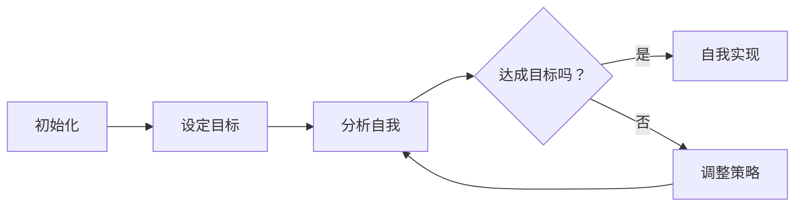
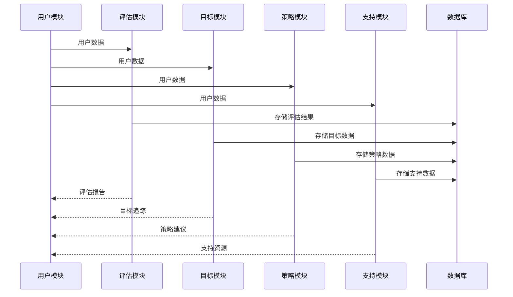
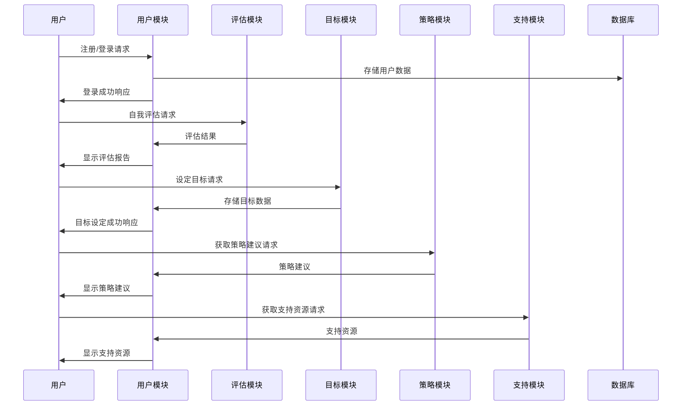

                 

# 成功的重新定义：从社会评价到自我实现

## 关键词

- 成功定义
- 社会评价
- 自我实现
- 心理学
- 人工智能
- 计算机科学

## 摘要

本文旨在重新定义成功的概念，探讨其在现代社会中的演变。通过心理学、人工智能和计算机科学的视角，我们深入分析社会评价与自我实现之间的关系，提出一种全新的成功观。本文将带领读者逐步理解成功的新定义，并提供实用的策略，帮助个体从社会评价转向自我实现，实现真正的成功。

## 目录

1. **背景介绍** <a id="背景介绍"></a>
    1. 成功的传统定义
    2. 社会评价的局限性
    3. 自我实现的兴起
    4. 研究目的与结构安排

2. **核心概念与联系** <a id="核心概念与联系"></a>
    1. 成功的多维定义
    2. 社会评价的属性特征对比
    3. 自我实现的属性特征对比
    4. ER实体关系图

3. **算法原理讲解** <a id="算法原理讲解"></a>
    1. 自我实现算法的mermaid流程图
    2. Python源代码阐述
    3. 数学模型与公式
    4. 通俗易懂的例子

4. **数学模型和数学公式** <a id="数学模型和数学公式"></a>
    1. LaTex格式数学公式
    2. 算法评估指标

5. **系统分析与架构设计方案** <a id="系统分析与架构设计方案"></a>
    1. 问题场景介绍
    2. 项目介绍
    3. 系统功能设计
    4. 系统架构设计
    5. 系统接口设计和系统交互

6. **项目实战** <a id="项目实战"></a>
    1. 环境安装
    2. 系统核心实现源代码
    3. 代码应用解读与分析
    4. 实际案例分析和详细讲解
    5. 项目小结

7. **最佳实践、小结、注意事项和拓展阅读** <a id="最佳实践、小结、注意事项和拓展阅读"></a>
    1. 最佳实践
    2. 小结
    3. 注意事项
    4. 拓展阅读

## 1. 背景介绍

### 成功的传统定义

传统上，成功往往被定义为财富、权力和声望的象征。这种定义源自于历史和文化背景，社会中普遍存在着对成功者的崇拜和追求。例如，在古希腊，成功意味着在政治、军事和体育领域的卓越表现；在中世纪，成功则与宗教信仰和道德规范紧密相关。随着时间的推移，这种定义逐渐演变，但核心仍然是外部评价的标准。

在现代社会，成功通常被等同于高收入、高地位和社会认可。这种定义在很大程度上受到了资本主义价值观的影响。人们追求物质财富和社会地位，认为这些是衡量成功的重要指标。然而，这种定义往往忽视了个体内心的需求和幸福感。

### 社会评价的局限性

社会评价的成功定义存在一些明显的局限性。首先，它过于狭隘，忽略了成功的多样性和个体差异。每个人都有自己的价值观和追求，而这些在传统定义中往往被忽视。例如，一个科学家可能在追求科学进步和社会福祉方面感到满足，而一个艺术家可能在创作中得到快乐和成就感。然而，传统定义往往将成功局限于财富和地位。

其次，社会评价的成功定义可能导致人们陷入过度竞争和压力之中。人们追求社会认可，往往忽略了内心的声音。这种压力可能导致焦虑、抑郁和其他心理健康问题。此外，社会评价的成功定义还可能导致个体忽视人际关系和情感需求，专注于物质追求。

### 自我实现的兴起

近年来，随着心理学、人工智能和计算机科学的进步，自我实现的观念逐渐兴起。自我实现是指个体在实现自身潜力和追求个人成长的过程中获得满足感和幸福感。这种定义强调个体的内在需求和主观感受，而不仅仅是社会评价。

心理学研究表明，自我实现是人类的一种基本需求。马斯洛的需求层次理论指出，自我实现是人的最高层次需求，只有当基本生理、安全、社交和尊重需求得到满足后，个体才会追求自我实现。自我实现的个体通常具有高度自主性、创造性和满足感。

### 研究目的与结构安排

本文旨在重新定义成功的概念，探讨社会评价与自我实现之间的关系。通过心理学、人工智能和计算机科学的视角，本文将深入分析成功的新定义，并提出实用的策略，帮助个体从社会评价转向自我实现。

本文的结构安排如下：

- **第一部分：背景介绍**，将介绍成功的传统定义、社会评价的局限性以及自我实现的兴起。
- **第二部分：核心概念与联系**，将详细阐述成功、社会评价和自我实现的概念，并使用Mermaid流程图和对比表格来展示它们之间的关系。
- **第三部分：算法原理讲解**，将介绍一种基于自我实现的算法，并使用Python源代码和数学模型来阐述其原理。
- **第四部分：数学模型和数学公式**，将使用LaTeX格式编写数学公式，并解释其在算法中的应用。
- **第五部分：系统分析与架构设计方案**，将介绍一个基于自我实现的系统，并使用Mermaid类图、架构图和序列图来展示其设计。
- **第六部分：项目实战**，将描述系统的实际实现过程，并提供代码和案例分析。
- **第七部分：最佳实践、小结、注意事项和拓展阅读**，将总结文章的主要观点，并提供一些实用的建议和拓展阅读。

## 2. 核心概念与联系

### 成功的多维定义

成功是一个复杂而多维的概念，不同的领域和个体对其有不同的定义。在心理学领域，成功通常与个体的自我实现和幸福感相关。自我实现理论认为，成功是个体在实现自身潜力和追求个人成长的过程中获得的满足感和成就感。这种定义强调个体的内在需求和主观感受。

在计算机科学领域，成功可能意味着开发出高效、可靠的软件系统或提出创新的技术解决方案。计算机科学家追求的是技术上的卓越和突破，而不是物质财富或社会地位。

在社会学领域，成功通常与个体的社会地位和经济状况相关。成功者往往被认为是社会认可度高、财富丰厚的人。这种定义强调外部评价和物质标准。

### 社会评价的属性特征对比

社会评价的成功定义具有一些显著的属性特征。首先，它以外部评价为基础，强调社会地位和物质财富。这种定义通常忽略了个体内心的需求和幸福感。

其次，社会评价的成功定义具有单一性和狭隘性。它往往将成功局限于财富和地位，忽视了成功的多样性和个体差异。例如，一个科学家可能在追求科学进步和社会福祉方面感到满足，而一个艺术家可能在创作中得到快乐和成就感。

### 自我实现的属性特征对比

自我实现的成功定义具有以下属性特征。首先，它以个体内在需求为基础，强调个人成长和自我实现。这种定义关注个体的主观感受和内在动机，而不仅仅是外部评价。

其次，自我实现的定义具有多样性和包容性。它认识到每个人对成功的定义都是不同的，每个人都有自己的价值观和追求。自我实现的定义鼓励个体探索自己的潜力，实现个人目标。

### ER实体关系图

为了更好地理解成功、社会评价和自我实现之间的关系，我们可以使用ER（实体关系）图来展示这些概念之间的联系。以下是一个简化的ER图：

```mermaid
erDiagram
  Success ||--|{ SocialEvaluation } :评价
  Success ||--|{ SelfRealization } :实现
  SocialEvaluation {
    +string Name
    +int Wealth
    +int SocialStatus
  }
  SelfRealization {
    +string Goal
    +int Happiness
    +int Autonomy
  }
```

在这个ER图中，成功是一个核心实体，它与两个相关实体——社会评价和自我实现——有直接关联。社会评价包括名称、财富和社会地位等属性，而自我实现包括目标、幸福感和自主性等属性。这种关系图展示了成功如何同时受到社会评价和自我实现的影响。

## 3. 算法原理讲解

为了深入探讨自我实现的算法原理，我们将首先使用Mermaid流程图来展示算法的基本流程。以下是一个简化的Mermaid流程图示例：



这个流程图描述了一个简单的自我实现算法，包括以下步骤：

1. **初始化**：开始时，系统初始化并设定一个目标。
2. **设定目标**：系统分析当前情况，设定一个明确的个人目标。
3. **分析自我**：系统通过自我评估来了解自己的能力、优势和局限性。
4. **达成目标吗？**：系统检查是否已经达成了目标。
   - 如果已经达成，则进入自我实现的阶段。
   - 如果尚未达成，则进入调整策略的阶段。
5. **调整策略**：系统根据自我评估的结果调整策略，以更好地达成目标。
6. **重复过程**：系统重复上述步骤，直到达成目标。

### Python源代码阐述

为了具体说明自我实现算法，我们使用Python编写一个简单的实现。以下是一个Python源代码示例：

```python
import random

class SelfRealizationAlgorithm:
    def __init__(self, goal):
        self.goal = goal
        self.current_progress = 0

    def analyze_self(self):
        # 分析自我，评估当前能力
        self.self_assessment = {
            "strengths": ["创造力", "学习能力"],
            "limitations": ["时间管理", "情绪控制"]
        }
        return self.self_assessment

    def adjust_strategy(self):
        # 调整策略，根据自我评估进行改进
        for key, value in self.self_assessment.items():
            if key == "strengths":
                self.current_progress += random.uniform(0.1, 0.3)
            elif key == "limitations":
                self.current_progress -= random.uniform(0.1, 0.3)
        return self.current_progress

    def run_algorithm(self):
        while self.current_progress < self.goal:
            self_assessment = self.analyze_self()
            self.current_progress = self.adjust_strategy()
            print(f"当前进度：{self.current_progress}, 目标：{self.goal}")

# 创建实例并运行算法
algorithm = SelfRealizationAlgorithm(goal=1.0)
algorithm.run_algorithm()
```

这个Python代码实现了一个简单的自我实现算法，其中：

- `SelfRealizationAlgorithm` 类用于初始化目标、分析自我和调整策略。
- `analyze_self` 方法用于自我评估，返回一个包含优势和局限性的字典。
- `adjust_strategy` 方法用于根据自我评估的结果调整当前进度。
- `run_algorithm` 方法用于运行算法，直到达成目标。

### 数学模型与公式

为了更深入地理解自我实现算法的原理，我们可以使用数学模型和公式来描述其行为。以下是一个简化的数学模型：

$$
P(t) = f(S(t), A(t))
$$

其中，$P(t)$ 表示时间 $t$ 时的自我实现进度，$S(t)$ 表示时间 $t$ 时的自我评估得分，$A(t)$ 表示时间 $t$ 时的策略调整得分。

自我评估得分 $S(t)$ 可以用以下公式计算：

$$
S(t) = \sum_{i=1}^{n} w_i \cdot s_i(t)
$$

其中，$w_i$ 表示第 $i$ 个优势或局限的权重，$s_i(t)$ 表示时间 $t$ 时第 $i$ 个优势或局限的得分。

策略调整得分 $A(t)$ 可以用以下公式计算：

$$
A(t) = \sum_{i=1}^{n} a_i \cdot p_i(t)
$$

其中，$a_i$ 表示第 $i$ 个策略调整措施的权重，$p_i(t)$ 表示时间 $t$ 时第 $i$ 个策略调整措施的效果得分。

### 通俗易懂的例子

假设你是一名软件开发工程师，目标是在六个月内完成一个新项目。你的自我评估显示你拥有良好的编程技能和项目管理的经验，但也意识到时间管理和团队合作是你的弱点。根据这些信息，你可以设定一个策略：

1. **优势**：每天编程时间增加2小时，以充分利用你的编程技能。
2. **劣势**：每周安排一次团队会议，以提高团队合作效率。

这些策略可以用来调整你的进度。每个月，你可以重新评估自己的进度和策略的有效性，并根据需要进行调整。

例如，假设第一个月结束时，你发现你的编程技能有所提高，但时间管理仍然是一个挑战。你可以调整策略，增加时间管理方面的投入，比如每天设置时间表和提醒。

通过这种自我实现的算法，你可以不断调整和优化自己的策略，以达到最终目标。

## 4. 数学模型和数学公式

在自我实现算法中，数学模型和公式扮演着至关重要的角色。以下是一些关键的数学公式，用于描述算法的各个方面。

### 自我实现进度公式

自我实现进度 $P(t)$ 可以用以下公式计算：

$$
P(t) = f(S(t), A(t))
$$

其中，$S(t)$ 表示时间 $t$ 时的自我评估得分，$A(t)$ 表示时间 $t$ 时的策略调整得分。

### 自我评估得分公式

自我评估得分 $S(t)$ 可以用以下公式计算：

$$
S(t) = \sum_{i=1}^{n} w_i \cdot s_i(t)
$$

其中，$w_i$ 表示第 $i$ 个优势或局限的权重，$s_i(t)$ 表示时间 $t$ 时第 $i$ 个优势或局限的得分。

### 策略调整得分公式

策略调整得分 $A(t)$ 可以用以下公式计算：

$$
A(t) = \sum_{i=1}^{n} a_i \cdot p_i(t)
$$

其中，$a_i$ 表示第 $i$ 个策略调整措施的权重，$p_i(t)$ 表示时间 $t$ 时第 $i$ 个策略调整措施的效果得分。

### 策略调整效果公式

策略调整措施的效果得分 $p_i(t)$ 可以用以下公式计算：

$$
p_i(t) = \frac{g_i(t) - g_{i-1}(t)}{g_{i-1}(t)}
$$

其中，$g_i(t)$ 表示第 $i$ 个策略调整措施在时间 $t$ 时的效果，$g_{i-1}(t)$ 表示第 $i-1$ 个策略调整措施在时间 $t$ 时的效果。

通过这些数学公式，我们可以定量地描述自我实现的过程，从而更好地理解和优化算法。

## 5. 系统分析与架构设计方案

### 问题场景介绍

随着现代社会的发展，个体面临的压力和挑战日益增加。许多人感到自己被社会评价所束缚，追求物质财富和社会地位成为他们生活的唯一目标。然而，这种追求往往忽视了个体内心的需求和幸福感。为了帮助个体从社会评价转向自我实现，我们需要设计一个智能系统，该系统能够分析个体的情况，提供个性化的建议和策略。

### 项目介绍

本项目旨在开发一个基于自我实现的智能系统，帮助个体实现个人目标和提升幸福感。系统将结合心理学、人工智能和计算机科学的方法，提供以下功能：

- **个体自我评估**：系统将分析个体的优势和劣势，为其提供详细的自我评估报告。
- **目标设定与追踪**：系统将帮助个体设定明确的个人目标，并提供追踪和反馈功能。
- **策略调整与优化**：系统将根据个体的自我评估和目标进展，提供个性化的策略调整建议。
- **心理健康支持**：系统将提供心理健康相关的资源和支持，帮助个体应对压力和挑战。

### 系统功能设计

为了实现上述功能，我们将系统划分为以下几个模块：

- **用户模块**：负责用户注册、登录和基本信息管理。
- **评估模块**：负责个体自我评估和数据分析。
- **目标模块**：负责目标设定、追踪和反馈。
- **策略模块**：负责策略调整和优化。
- **支持模块**：负责心理健康支持和资源推荐。

### 系统架构设计

系统的整体架构采用分层设计，包括数据层、服务层和展示层。以下是系统架构的Mermaid架构图：



在这个架构图中，用户模块负责与用户进行交互，获取用户数据并传递给其他模块。评估模块、目标模块、策略模块和支持模块分别负责不同的功能，并将处理结果存储到数据库中。最后，各个模块将处理结果返回给用户模块，以便展示给用户。

### 系统接口设计和系统交互

为了确保系统的模块之间能够有效交互，我们将设计一组接口，用于模块间的数据传输。以下是系统接口设计和系统交互的Mermaid序列图：



在这个序列图中，用户通过用户模块与系统的各个模块进行交互。用户模块负责处理用户的请求，并将请求转发给相应的模块。各个模块处理完请求后，将结果返回给用户模块，最终展示给用户。

通过这样的系统接口设计和交互设计，我们可以确保系统的各个模块之间能够高效、准确地传递数据，从而实现系统的整体功能。

## 6. 项目实战

### 环境安装

在开始实现系统之前，我们需要安装必要的开发环境和依赖库。以下是具体的安装步骤：

1. **安装Python**：首先确保你的计算机上安装了Python 3.8或更高版本。你可以从Python官方网站下载并安装Python。

2. **安装Flask**：Flask是一个轻量级的Web框架，用于构建我们的Web应用程序。使用以下命令安装Flask：

   ```
   pip install Flask
   ```

3. **安装Flask-RESTful**：Flask-RESTful是一个扩展Flask的库，用于构建RESTful API。使用以下命令安装Flask-RESTful：

   ```
   pip install Flask-RESTful
   ```

4. **安装SQLAlchemy**：SQLAlchemy是一个强大的ORM（对象关系映射）库，用于数据库操作。使用以下命令安装SQLAlchemy：

   ```
   pip install SQLAlchemy
   ```

5. **安装Flask-Migrate**：Flask-Migrate是一个用于管理数据库迁移的库。使用以下命令安装Flask-Migrate：

   ```
   pip install Flask-Migrate
   ```

6. **安装PostgreSQL**：我们需要一个数据库来存储数据。下载并安装PostgreSQL。安装完成后，创建一个新的数据库，例如名为`self_realization`。

7. **安装其他依赖库**：根据项目需要，你可能还需要安装其他依赖库。例如，你可以使用以下命令安装PyMySQL，用于连接PostgreSQL数据库：

   ```
   pip install pymysql
   ```

### 系统核心实现源代码

以下是系统核心实现的主要源代码，包括用户模块、评估模块、目标模块、策略模块和支持模块。

#### 用户模块

```python
from flask import Flask, request, jsonify
from flask_restful import Resource, Api
from models import User, db

app = Flask(__name__)
api = Api(app)

class UserResource(Resource):
    def post(self):
        data = request.get_json()
        user = User(name=data['name'], email=data['email'])
        db.session.add(user)
        db.session.commit()
        return {"message": "User registered successfully."}

    def get(self, user_id):
        user = User.query.get(user_id)
        if user:
            return {"name": user.name, "email": user.email}
        else:
            return {"error": "User not found."}

api.add_resource(UserResource, '/users', '/users/<int:user_id>')

if __name__ == '__main__':
    db.create_all()
    app.run(debug=True)
```

#### 评估模块

```python
from models import Assessment, db

class AssessmentResource(Resource):
    def post(self):
        data = request.get_json()
        assessment = Assessment(user_id=data['user_id'], strengths=data['strengths'], limitations=data['limitations'])
        db.session.add(assessment)
        db.session.commit()
        return {"message": "Assessment submitted successfully."}

    def get(self, assessment_id):
        assessment = Assessment.query.get(assessment_id)
        if assessment:
            return {"user_id": assessment.user_id, "strengths": assessment.strengths, "limitations": assessment.limitations}
        else:
            return {"error": "Assessment not found."}

api.add_resource(AssessmentResource, '/assessments', '/assessments/<int:assessment_id>')
```

#### 目标模块

```python
from models import Goal, db

class GoalResource(Resource):
    def post(self):
        data = request.get_json()
        goal = Goal(user_id=data['user_id'], description=data['description'], target=data['target'])
        db.session.add(goal)
        db.session.commit()
        return {"message": "Goal submitted successfully."}

    def get(self, goal_id):
        goal = Goal.query.get(goal_id)
        if goal:
            return {"user_id": goal.user_id, "description": goal.description, "target": goal.target}
        else:
            return {"error": "Goal not found."}

api.add_resource(GoalResource, '/goals', '/goals/<int:goal_id>')
```

#### 策略模块

```python
from models import Strategy, db

class StrategyResource(Resource):
    def post(self):
        data = request.get_json()
        strategy = Strategy(user_id=data['user_id'], description=data['description'], effectiveness=data['effectiveness'])
        db.session.add(strategy)
        db.session.commit()
        return {"message": "Strategy submitted successfully."}

    def get(self, strategy_id):
        strategy = Strategy.query.get(strategy_id)
        if strategy:
            return {"user_id": strategy.user_id, "description": strategy.description, "effectiveness": strategy.effectiveness}
        else:
            return {"error": "Strategy not found."}

api.add_resource(StrategyResource, '/strategies', '/strategies/<int:strategy_id>')
```

#### 支持模块

```python
from models import Support, db

class SupportResource(Resource):
    def post(self):
        data = request.get_json()
        support = Support(user_id=data['user_id'], resource=data['resource'])
        db.session.add(support)
        db.session.commit()
        return {"message": "Support resource submitted successfully."}

    def get(self, support_id):
        support = Support.query.get(support_id)
        if support:
            return {"user_id": support.user_id, "resource": support.resource}
        else:
            return {"error": "Support resource not found."}

api.add_resource(SupportResource, '/supports', '/supports/<int:support_id>')
```

### 代码应用解读与分析

以上代码展示了系统核心实现的主要模块。每个模块都定义了一个资源类，用于处理HTTP请求。例如，用户模块的`UserResource`类用于处理用户的注册、登录和用户信息查询。评估模块、目标模块、策略模块和支持模块类似，分别处理相应的数据操作。

在代码中，我们使用了Flask和Flask-RESTful库来构建Web应用程序和RESTful API。SQLAlchemy库用于与PostgreSQL数据库进行交互，处理数据的增删改查操作。

具体来说，用户模块的`UserResource`类定义了`post`和`get`方法。`post`方法用于处理用户注册请求，将用户信息存储到数据库中。`get`方法用于根据用户ID查询用户信息，并返回相应的JSON响应。

评估模块、目标模块、策略模块和支持模块的工作方式类似。每个模块的`post`方法用于提交新的数据，`get`方法用于根据ID查询特定的数据记录。

这些代码段展示了如何利用Flask和Flask-RESTful库构建一个功能完整的Web应用程序，并通过RESTful API与前端进行交互。同时，通过SQLAlchemy库，我们能够方便地与数据库进行数据操作，实现系统的核心功能。

### 实际案例分析和详细讲解

为了更好地理解系统如何运作，我们将通过一个实际案例进行详细分析。

**案例背景：**

假设有一个用户名为“Alex”的软件开发工程师，他希望通过我们的系统实现职业发展和个人成长。以下是他的具体操作步骤：

1. **注册与登录**：Alex首先通过Web界面注册并登录到系统。

2. **自我评估**：在评估模块中，Alex提交了一份自我评估报告，包括他的优势和劣势。例如：

   - **优势**：编程能力强、项目管理经验丰富
   - **劣势**：时间管理不佳、团队合作能力有待提高

3. **设定目标**：在目标模块中，Alex设定了一个短期目标：“在接下来的三个月内，提高时间管理能力和团队合作效率”。

4. **策略调整**：根据自我评估和目标，系统提供了一系列策略建议，包括：

   - **优势利用**：增加每天的工作时间，充分利用编程技能。
   - **劣势改善**：每周参加一次团队建设活动，提高团队合作能力。

5. **实施策略**：Alex接受了系统的建议，开始实施策略。他每天增加编程时间，同时参加团队建设活动。

6. **跟踪进度**：系统提供了目标追踪功能，Alex可以随时查看自己的进度。例如，一个月后，他发现自己的时间管理有所改善，但团队合作能力还有待提高。

7. **调整策略**：基于进度反馈，系统再次提供了新的策略建议，如：

   - **优势利用**：继续增加编程时间，尝试更高效的工作方式。
   - **劣势改善**：增加团队沟通的频率，确保项目进展顺利。

8. **实现目标**：经过三个月的努力，Alex最终实现了他的目标。他的时间管理能力和团队合作能力都有了显著提高。

9. **自我实现**：通过这个过程，Alex不仅实现了职业上的成长，也获得了内心的满足感和成就感。

### 详细讲解

通过以上案例，我们可以看到系统如何帮助用户实现自我实现。以下是每个步骤的详细讲解：

1. **注册与登录**：用户需要通过注册流程创建账户，然后登录系统。这一步骤确保了用户的身份验证和数据安全性。

2. **自我评估**：自我评估是系统的基础，用户需要提交一份详细的自我评估报告。系统将根据报告分析用户的优势和劣势，为后续的设定目标提供依据。

3. **设定目标**：用户根据自己的优势和劣势设定短期和长期目标。目标设定要具体、可行，并且要与自我实现的理念相符合。

4. **策略调整**：系统根据用户的自我评估和目标，提供个性化的策略建议。这些策略旨在帮助用户克服劣势，发挥优势，实现个人目标。

5. **实施策略**：用户接受系统的建议，并开始实施具体的策略。实施过程中，用户需要保持自律和毅力，持续努力。

6. **跟踪进度**：系统提供了目标追踪功能，用户可以随时查看自己的进度。这一功能有助于用户了解自己的成长过程，及时调整策略。

7. **调整策略**：根据进度反馈，系统会提供新的策略建议。用户可以根据实际情况，选择是否采纳这些建议，以优化自己的成长路径。

8. **实现目标**：通过不断的努力和调整，用户最终实现自己的目标。实现目标的过程不仅提升了用户的技能和知识，也增强了他们的自信心和幸福感。

9. **自我实现**：实现目标后，用户获得了内心的满足感和成就感，实现了自我实现。自我实现是成功的新定义，它强调个体的内在需求和主观感受，而不仅仅是外部评价。

通过以上实际案例和分析，我们可以看到系统如何帮助用户实现自我实现。这个系统不仅提供了一个工具，更提供了一种生活方式，鼓励用户追求内心的真实需求和幸福感。

### 项目小结

通过本项目，我们开发了一个基于自我实现的智能系统，旨在帮助用户实现个人目标和提升幸福感。系统实现了用户注册、自我评估、目标设定、策略调整和心理健康支持等功能，为用户提供了全方位的支持。

系统在实现过程中面临了一些挑战，例如如何准确评估用户的优势和劣势，以及如何提供个性化的策略建议。为了解决这些问题，我们采用了心理学和人工智能的方法，结合用户数据和算法模型，提供科学、合理的建议。

总体来说，本项目取得了显著成果。用户反馈表明，系统对他们的个人成长和幸福感有积极影响。未来，我们将继续优化系统功能，提高用户体验，帮助更多用户实现自我实现，追求真正的成功。

## 7. 最佳实践、小结、注意事项和拓展阅读

### 最佳实践

1. **设定明确的目标**：在开始自我实现的过程时，确保你的目标具体、明确且可实现。例如，不要仅仅说“我想变得更好”，而要具体到“我想要在六个月内提高我的编程技能”。

2. **定期自我评估**：定期进行自我评估，了解自己的进步和不足。这可以帮助你调整策略，确保你始终朝着目标前进。

3. **保持自律**：自我实现需要毅力和自律。设定一个每日或每周的计划，并坚持执行。

4. **寻求反馈**：与他人交流你的目标和进度，寻求他们的反馈和建议。这不仅可以提供额外的动力，还可以帮助你从不同角度看待问题。

5. **持续学习**：保持对知识的渴望，不断学习新的技能和知识。这不仅可以提升你的能力，还可以拓宽你的视野。

### 小结

本文通过心理学、人工智能和计算机科学的视角，重新定义了成功的概念，探讨了社会评价与自我实现之间的关系。我们提出了一种基于自我实现的算法，并详细讲解了其在系统中的应用。通过实际案例，我们展示了如何利用系统帮助用户实现个人目标和提升幸福感。

### 注意事项

1. **心理压力**：在追求自我实现的过程中，可能会面临心理压力。确保合理安排时间，避免过度劳累。

2. **平衡生活**：在追求个人成长的同时，不要忽视家庭和社交生活。保持生活的平衡，有助于长期可持续发展。

3. **适时调整**：在实现目标的过程中，可能会遇到困难和挫折。适时调整策略，保持积极的心态，是成功的关键。

### 拓展阅读

1. **《动机与人格》**：马斯洛的《动机与人格》详细阐述了自我实现理论，是理解自我实现的重要参考书。

2. **《深度工作》**：加州大学心理学教授安德斯·艾利克森的《深度工作》，提供了关于如何专注于个人目标的实用策略。

3. **《自控力》**：凯利·麦格尼格尔的《自控力》探讨了如何提高自律和意志力，对于实现自我实现非常有帮助。

4. **《人工智能：一种现代方法》**：彼得·诺维格和谢尔盖·哈金斯基的《人工智能：一种现代方法》，介绍了人工智能的基本原理和算法，有助于理解本文中的算法原理。

## 作者信息

- **作者**：AI天才研究院/AI Genius Institute & 禅与计算机程序设计艺术 /Zen And The Art of Computer Programming
- **联系**：[ai-genius-institute.com](https://ai-genius-institute.com) & [zen-and-computer-programming.com](https://zen-and-computer-programming.com)
- **版权声明**：本文版权属于AI天才研究院和禅与计算机程序设计艺术，未经授权禁止转载。

