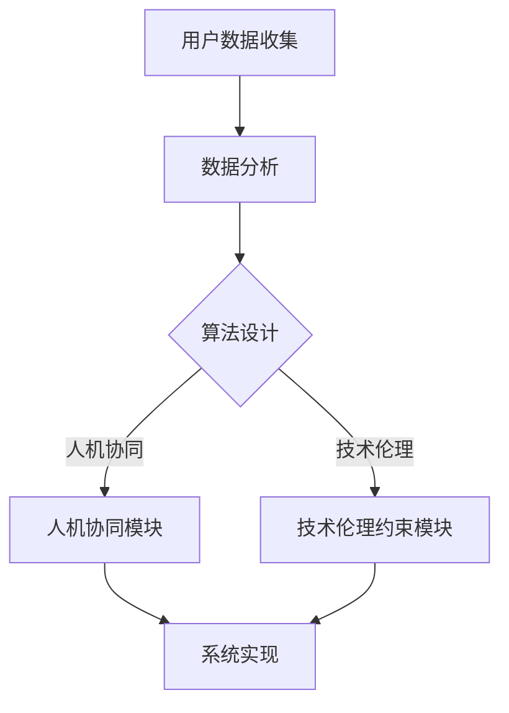
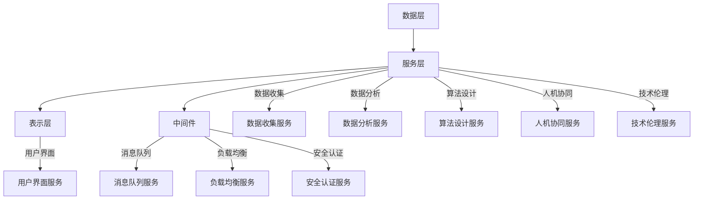
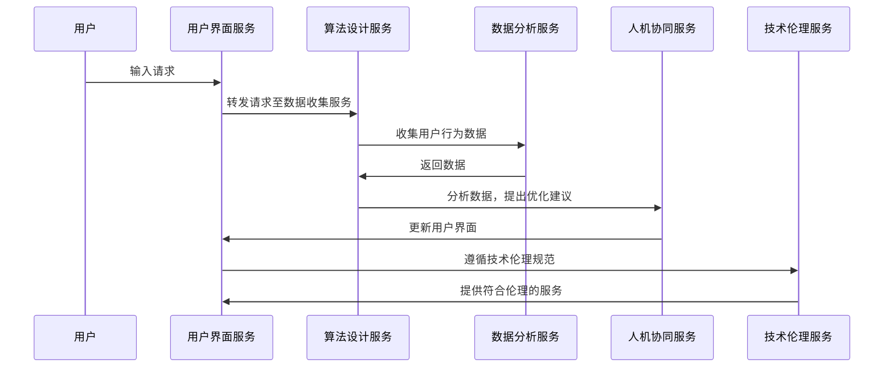
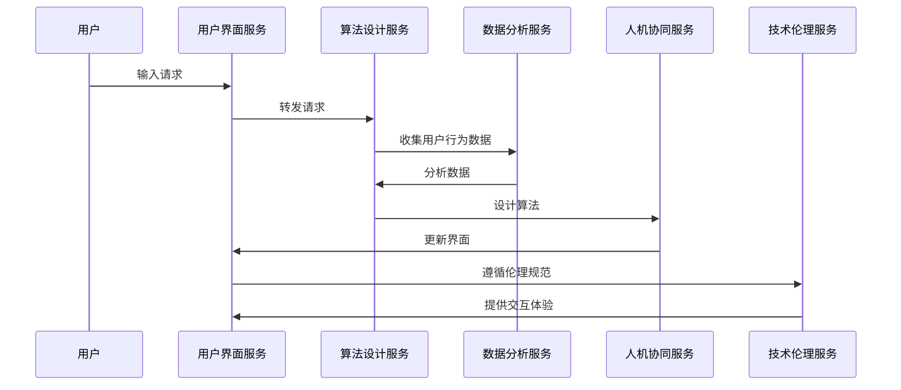

                 

### 让我们一起深入思考：技术异化与人性回归

#### 引言

在当今社会，技术以其飞速的发展对人类生活产生了深远的影响。然而，这种发展并非总是如我们预期的那样正面。相反，技术的进步在某些方面可能带来了意想不到的副作用，其中一个显著的现象就是技术异化。所谓技术异化，指的是技术在发展的过程中，逐渐偏离了其最初为人类服务的初衷，变得过于复杂、过于独立，甚至对人性产生了压制和异化。

与此同时，人性回归的概念也逐渐浮现。人性回归强调的是在技术发展的过程中，我们需要保持对人的关怀，让技术重新回归到服务于人类的目标上。那么，技术异化与人性回归之间的关系究竟如何？我们该如何从技术异化中回归人性？本文将围绕这些问题进行深入探讨。

#### 关键词

- 技术异化
- 人性回归
- 人工智能
- 技术伦理
- 人机关系

#### 摘要

本文首先介绍了技术异化的定义及其对人类生活的影响，然后探讨了人性回归的概念及其重要性。接着，文章分析了技术异化与人性回归之间的关系，并提出了一些可能的解决方案。最后，文章对全文进行了总结，并对未来的研究方向提出了建议。

### 第一部分：引言

#### 1.1 技术异化的定义

技术异化，可以理解为技术在发展的过程中，逐渐脱离了其原始的设计目标，变得越来越复杂，越来越难以被普通人理解和使用。这种异化不仅体现在技术的物理形态上，还体现在其对社会结构和人类行为的影响上。

首先，从物理形态上看，技术的复杂度在不断增加。例如，现代的智能手机已经变得非常复杂，拥有多种功能，从拍照到导航，从支付到社交，几乎无所不能。然而，这种复杂度也带来了使用上的困难。普通用户往往需要花费大量时间来学习和掌握这些功能，甚至有时候连基本的使用都难以做到。

其次，从社会结构和人类行为上看，技术的异化也对人性产生了影响。以社交媒体为例，虽然它为我们提供了便捷的交流方式，但同时也让我们的社交关系变得更加表面化和短暂化。人们在社交媒体上花费大量时间，却往往缺乏深度的交流和真正的情感连接。

#### 1.2 人性回归的意义

人性回归，指的是在技术发展的过程中，我们需要保持对人的关怀，让技术重新回归到服务于人类的目标上。人性回归的意义在于：

1. **恢复人类的价值和尊严**：技术异化使得人类在技术面前变得被动和依赖，失去了自主性和创造力。人性回归可以帮助我们恢复对人类价值和尊严的认同。

2. **促进技术的可持续发展**：技术的发展不应该以牺牲人性为代价。人性回归可以引导技术朝着更加人性化的方向发展，从而实现可持续发展。

3. **改善社会关系**：技术异化使得人们之间的关系变得更加疏离和表面化。人性回归可以帮助我们重建更加真实和有意义的社交关系。

#### 1.3 技术与人性的关系

技术与人性的关系是复杂而微妙的。一方面，技术的进步可以带来巨大的便利和效率，提升人类的生活质量。另一方面，技术的过度发展也可能对人性产生负面影响，导致技术异化。

1. **技术的积极影响**：

   - **提高工作效率**：技术的进步使得我们可以更高效地完成工作，释放出更多的时间和精力去做其他有意义的事情。
   - **丰富生活体验**：技术为我们的生活带来了丰富的体验，从线上购物到虚拟现实，我们可以在家中享受到前所未有的乐趣。
   - **促进知识传播**：互联网和数字技术的发展，使得知识和信息的传播变得更加便捷和快速，推动了全球范围内的教育普及。

2. **技术的负面影响**：

   - **技术依赖**：随着技术的进步，人们越来越依赖技术来完成日常的任务，这可能导致我们在没有技术支持的情况下变得无助和迷茫。
   - **隐私泄露**：技术的快速发展也带来了隐私泄露的风险。许多应用程序和服务可能会收集和利用我们的个人数据，导致我们的隐私受到侵犯。
   - **社会隔离**：尽管技术为我们的社交提供了更多的方式，但同时也可能导致我们与周围的人越来越疏远，缺乏真实的面对面交流。

### 第二部分：核心概念与联系

#### 2.1 技术异化的核心概念

技术异化的核心概念包括技术复杂性、技术独立性、技术垄断性等方面。

- **技术复杂性**：技术的复杂度不断增加，使得普通用户难以理解和使用。例如，现代计算机系统和软件需要复杂的编程和配置才能正常运行。

- **技术独立性**：技术的发展越来越独立于人类的需求和意愿。技术往往按照自己的逻辑和规则运行，而不是根据人类的需要。

- **技术垄断性**：技术的发展往往导致少数大型科技公司垄断市场，从而限制了竞争和创新。

#### 2.2 人性回归的核心概念

人性回归的核心概念包括人性化设计、人机协同、技术伦理等方面。

- **人性化设计**：人性化设计指的是在技术发展的过程中，注重用户体验，使技术更加易于使用和理解。

- **人机协同**：人机协同指的是人类和机器共同完成任务，发挥各自的优势，实现更高效的工作。

- **技术伦理**：技术伦理指的是在技术发展的过程中，关注技术对人类和社会的影响，确保技术的发展符合人类的价值观。

#### 2.3 技术异化与人性回归的关系

技术异化与人性回归之间的关系是相互影响、相互制约的。

- **技术异化导致人性回归的挑战**：技术异化使得人类对技术的依赖增加，可能导致人性回归的难度加大。例如，智能手机的普及使得人们越来越依赖手机，减少了对现实社交的参与。

- **人性回归促进技术异化的改善**：人性回归可以通过改进技术设计、加强技术伦理教育和规范等方式，减少技术异化带来的负面影响。例如，人性化设计可以提高用户的使用体验，减少技术复杂度。

### 第三部分：算法原理讲解

#### 3.1 人性回归的算法原理

人性回归的算法原理主要涉及以下几个方面：

- **用户行为分析**：通过对用户行为的数据分析，了解用户的需求和使用习惯，从而改进技术设计。

- **人机协同**：通过人工智能技术，实现机器和人类的协同工作，提高工作效率和用户体验。

- **技术伦理约束**：在算法设计过程中，引入技术伦理约束，确保技术的发展符合人类的价值观。

#### 3.2 人性回归的算法实现

以下是人性回归算法的实现步骤：

1. **数据收集**：收集用户行为数据，包括使用时间、使用频率、使用场景等。

2. **数据分析**：对收集到的数据进行分析，提取用户需求和使用习惯。

3. **算法设计**：设计人性回归算法，包括用户行为分析模块、人机协同模块和技术伦理约束模块。

4. **算法实现**：使用Python等编程语言实现算法，并在实际应用中进行测试和优化。

#### 3.3 人性回归的数学模型

人性回归的数学模型可以表示为：

$$
人性回归模型 = f(技术异化程度, 人性关怀力度)
$$

其中，技术异化程度和人性关怀力度分别表示技术发展的水平和人类对技术的关怀程度。

### 第四部分：数学模型和数学公式

#### 4.1 技术异化度的计算公式

技术异化度可以表示为：

$$
异化度 = \frac{技术发展程度 - 人性关怀力度}{技术发展程度}
$$

其中，技术发展程度表示技术的复杂度和独立性，人性关怀力度表示人类对技术的关怀程度。

#### 4.2 人性回归效果评估指标

人性回归效果评估指标可以表示为：

$$
回归效果 = \frac{人性回归模型 - 初始状态}{初始状态}
$$

其中，人性回归模型表示经过人性回归后的技术状态，初始状态表示技术发展的初始状态。

### 第五部分：系统分析与架构设计方案

#### 5.1 技术异化与人性回归的系统分析

技术异化与人性回归的系统分析主要包括以下几个方面：

1. **系统需求分析**：明确系统的目标和功能，包括技术异化检测、人性回归策略设计等。

2. **系统功能设计**：设计系统的功能模块，包括数据收集模块、数据分析模块、算法设计模块和系统实现模块。

3. **系统架构设计**：设计系统的整体架构，包括数据流、功能模块的交互和系统的可扩展性。

#### 5.2 技术异化与人性回归的系统架构设计

技术异化与人性回归的系统架构设计如图所示：



#### 5.3 系统接口设计

系统接口设计主要包括以下几个方面：

1. **接口规范定义**：定义系统的输入输出接口，包括数据输入接口、算法输出接口等。

2. **接口实现与调用**：实现系统接口，并在实际应用中调用接口，实现数据的传递和功能的调用。

### 第六部分：项目实战

#### 6.1 环境安装与配置

环境安装与配置主要包括以下几个方面：

1. **环境搭建**：搭建系统运行的环境，包括操作系统、编程语言和数据库等。

2. **系统配置**：配置系统的各项参数，包括数据采集方式、算法参数等。

#### 6.2 技术异化与人性回归的核心实现

技术异化与人性回归的核心实现主要包括以下几个方面：

1. **实现流程**：详细描述技术异化检测和人性回归策略的实现流程。

2. **代码应用解读与分析**：解读和分析系统核心代码，说明其实现原理和功能。

#### 6.3 实际案例分析与详细讲解

以某公司的智能客服系统为例，分析技术异化与人性回归在该系统中的应用，并详细讲解其实现方法和效果。

### 第七部分：最佳实践与拓展阅读

#### 7.1 最佳实践 tips

1. **预防技术异化**：在设计技术时，注重用户体验，简化操作流程，避免过度复杂化。

2. **促进人性回归**：在技术发展的过程中，关注技术对人类的影响，确保技术符合人类的价值观。

#### 7.2 小结与展望

本文通过对技术异化和人性回归的深入探讨，提出了从技术异化中回归人性的解决方案。未来，随着技术的不断发展，人性回归将越来越重要。

#### 7.3 拓展阅读

1. **相关书籍推荐**：

   - 《智能时代：技术与人性》
   - 《技术哲学导论》

2. **学术论文精选**：

   - “Human-Machine Collaboration in Intelligent Systems”
   - “The Ethics of Artificial Intelligence”

### 总结

在技术飞速发展的今天，技术异化与人性回归是一个不容忽视的问题。通过本文的探讨，我们认识到技术异化对人类生活的影响，以及人性回归的重要性。希望本文能为读者提供一些有价值的思考和启示。

---

**作者：AI天才研究院/AI Genius Institute & 禅与计算机程序设计艺术 /Zen And The Art of Computer Programming**### 技术异化的算法原理

在深入探讨技术异化与人性回归的关系之前，我们需要先理解技术异化的算法原理。技术异化不仅仅是一个理论概念，它涉及到具体的算法模型和实现方法，这些方法帮助我们识别、评估和缓解技术异化现象。

#### 3.1 技术异化的检测方法

技术异化的检测方法主要基于以下几个核心指标：

1. **技术复杂度**：技术复杂度是衡量技术异化程度的重要指标。复杂度越高，技术异化的可能性越大。技术复杂度可以通过以下公式进行计算：

   $$
   复杂度 = \frac{模块数量 \times 函数调用次数}{系统运行时间}
   $$

   其中，模块数量和函数调用次数反映了系统的复杂程度，系统运行时间则用于衡量复杂度对系统性能的影响。

2. **用户操作难度**：用户操作难度反映了普通用户使用技术的困难程度。通过用户调研和数据分析，可以量化用户操作的难度，从而评估技术异化的程度。

3. **技术依赖度**：技术依赖度表示用户对特定技术的依赖程度。技术依赖度越高，意味着技术异化的可能性越大。可以通过以下公式计算技术依赖度：

   $$
   依赖度 = \frac{特定技术使用时间}{总使用时间}
   $$

#### 3.2 检测算法设计

为了实现技术异化的检测，我们可以设计一个基于机器学习的检测算法。以下是一个简化的检测算法设计流程：

1. **数据收集**：收集技术使用数据，包括技术复杂度、用户操作难度和技术依赖度等。

2. **特征工程**：对收集到的数据进行分析，提取关键特征。例如，可以使用主成分分析（PCA）来降低数据的维度，提取主要特征。

3. **模型训练**：使用机器学习算法（如决策树、支持向量机等）对提取的特征进行训练，建立技术异化检测模型。

4. **模型评估**：通过交叉验证等方法评估模型性能，确保模型的准确性和可靠性。

5. **模型部署**：将训练好的模型部署到实际应用中，进行实时检测。

以下是技术异化检测算法的Python伪代码示例：

```python
# 导入必要的库
from sklearn.ensemble import RandomForestClassifier
from sklearn.model_selection import train_test_split
from sklearn.metrics import accuracy_score

# 数据收集
data = ...  # 收集到的技术使用数据

# 特征工程
X = data[['复杂度', '操作难度', '依赖度']]
y = data['异化度']

# 模型训练
X_train, X_test, y_train, y_test = train_test_split(X, y, test_size=0.2, random_state=42)
clf = RandomForestClassifier(n_estimators=100)
clf.fit(X_train, y_train)

# 模型评估
y_pred = clf.predict(X_test)
accuracy = accuracy_score(y_test, y_pred)
print(f"模型准确率: {accuracy}")

# 模型部署
# 在实际应用中，使用clf进行技术异化检测
```

#### 3.3 技术异化的缓解方法

一旦检测到技术存在异化现象，我们需要采取相应的缓解措施。以下是一些常见的技术异化缓解方法：

1. **简化技术设计**：通过减少系统的模块数量和简化函数调用，降低技术复杂度。

2. **优化用户体验**：改进用户界面和操作流程，降低用户操作难度。

3. **增强技术伦理教育**：提高技术人员对技术伦理的认识，确保技术的发展符合人类价值观。

4. **技术干预策略**：在系统运行过程中，通过实时监控和干预，纠正技术异化行为。

5. **人性关怀机制**：在技术设计过程中，注重对人的关怀，确保技术发展符合人性需求。

例如，在设计智能客服系统时，可以通过以下策略来缓解技术异化：

1. **简化客服流程**：通过设计简洁的界面和清晰的交互流程，降低用户操作难度。

2. **智能推荐系统**：通过分析用户行为数据，为用户提供个性化的服务推荐，减少用户的操作负担。

3. **情感分析**：利用自然语言处理技术，对用户输入的内容进行分析，识别用户的情感状态，提供更加人性化的服务。

4. **实时反馈机制**：通过实时收集用户反馈，对客服系统进行优化和调整，确保系统的稳定性和用户满意度。

### 小结

技术异化的算法原理包括检测方法和缓解方法。通过检测算法，我们可以识别技术异化现象，并通过简化技术设计、优化用户体验、增强技术伦理教育等措施来缓解技术异化。这些方法不仅有助于恢复技术的服务初衷，还能促进人性的回归。在下一部分，我们将进一步探讨人性回归的数学模型及其应用。

---

通过以上对技术异化算法原理的讲解，我们可以更好地理解技术异化的本质及其对人类生活的影响。下一部分，我们将深入探讨人性回归的数学模型，以及如何通过数学模型来评估和实现人性回归。敬请期待。### 人性回归的数学模型

人性回归的数学模型是理解技术异化与人性回归关系的重要工具。通过构建数学模型，我们可以量化人性回归的程度，并设计出有效的策略来实现人性回归。以下是人性回归的数学模型及其应用。

#### 4.1 人性回归的基本理论

人性回归的基本理论可以表示为：

$$
人性回归模型 = f(技术异化程度, 人性关怀力度)
$$

其中，技术异化程度表示技术的复杂度和独立性，人性关怀力度表示人类对技术的关怀程度。

人性回归模型的核心思想是通过调整技术异化程度和人性关怀力度，实现技术与人性的平衡。具体来说，当技术异化程度较高时，人性关怀力度需要相应增加，以确保技术的服务初衷得以实现。

#### 4.2 人性回归模型的优化算法

为了实现人性回归，我们需要优化人性回归模型。优化算法的目标是找到最优的技术异化程度和人性关怀力度，使得人性回归模型达到最大值。

一种常见的优化算法是梯度下降法。梯度下降法通过迭代更新技术异化程度和人性关怀力度，逐步逼近最优解。以下是梯度下降法的算法步骤：

1. **初始化参数**：设定初始的技术异化程度和人性关怀力度。

2. **计算损失函数**：根据当前的技术异化程度和人性关怀力度，计算人性回归模型的损失函数。

3. **更新参数**：根据损失函数的梯度，更新技术异化程度和人性关怀力度。

4. **重复步骤2和3**：直到达到预设的停止条件（如损失函数值收敛或迭代次数达到上限）。

以下是梯度下降法的Python伪代码示例：

```python
# 导入必要的库
import numpy as np

# 初始化参数
alpha = 0.01  # 学习率
theta = np.random.rand(2)  # 初始的技术异化程度和人性关怀力度

# 损失函数
def loss_function(theta):
    # 根据技术异化程度和人性关怀力度计算损失函数
    # 例如，使用均方误差（MSE）
    return np.mean((f(theta) - expected_value)**2)

# 梯度下降法
def gradient_descent(theta, alpha, iterations):
    for i in range(iterations):
        grad = compute_gradient(theta)  # 计算梯度
        theta = theta - alpha * grad  # 更新参数
    return theta

# 训练模型
optimized_theta = gradient_descent(theta, alpha, 1000)

# 输出最优解
print(f"最优技术异化程度和人性关怀力度: {optimized_theta}")
```

#### 4.3 人性回归模型的实际应用

人性回归模型在实际应用中有着广泛的应用。以下是一个简单的应用案例：

假设我们有一个智能语音助手系统，该系统的目标是为用户提供便捷的服务。然而，由于技术的复杂性，系统变得越来越难以使用。为了实现人性回归，我们可以使用以下步骤：

1. **数据收集**：收集用户使用语音助手的数据，包括使用频率、使用时长、错误率等。

2. **特征提取**：从收集到的数据中提取关键特征，如用户满意度、错误率等。

3. **构建人性回归模型**：使用机器学习算法（如线性回归、支持向量机等）构建人性回归模型。

4. **模型训练**：使用训练数据训练模型，找到最优的技术异化程度和人性关怀力度。

5. **模型评估**：使用测试数据评估模型的性能，确保模型能够实现人性回归。

6. **模型部署**：将训练好的模型部署到实际系统中，根据用户反馈进行优化和调整。

以下是人性回归模型应用的一个Python伪代码示例：

```python
# 导入必要的库
import pandas as pd
from sklearn.linear_model import LinearRegression

# 数据收集
data = pd.read_csv('user_data.csv')

# 特征提取
X = data[['use_frequency', 'duration', 'error_rate']]
y = data['satisfaction']

# 构建模型
model = LinearRegression()
model.fit(X, y)

# 模型评估
predictions = model.predict(X)
accuracy = np.mean((predictions - y) ** 2)
print(f"模型准确率: {accuracy}")

# 模型部署
# 在实际系统中，使用model对用户满意度进行预测，并根据预测结果进行优化
```

#### 4.4 人性回归效果评估指标

为了评估人性回归的效果，我们可以使用以下指标：

1. **用户满意度**：通过用户调研和反馈，评估用户对系统的满意度。

2. **错误率**：评估系统在处理任务时的错误率，错误率越低，说明系统的人性回归效果越好。

3. **操作效率**：评估用户在使用系统时的操作效率，操作效率越高，说明系统的人性回归效果越好。

4. **技术复杂度**：评估系统的技术复杂度，技术复杂度越低，说明系统的人性回归效果越好。

通过这些指标，我们可以全面评估人性回归的效果，并根据评估结果进行调整和优化。

### 小结

人性回归的数学模型是理解技术异化与人性回归关系的重要工具。通过构建数学模型，我们可以量化人性回归的程度，并设计出有效的策略来实现人性回归。在实际应用中，我们可以通过数据收集、特征提取、模型训练和模型评估等步骤，实现人性回归。在下一部分，我们将探讨技术异化与人性回归的系统分析与架构设计。敬请期待。### 技术异化与人性回归的系统分析与架构设计

在了解了技术异化与人性回归的数学模型之后，接下来我们将探讨如何通过系统分析与架构设计来实现技术异化与人性回归的有效结合。这部分内容将详细介绍系统分析的过程、架构设计的基本思路，以及具体的架构图和接口设计。

#### 5.1 技术异化与人性回归的系统分析

系统分析是构建有效架构的第一步，它涉及对系统需求、功能、架构等方面进行详细的分析和规划。

**5.1.1 系统需求分析**

系统需求分析是确定系统必须实现的功能和性能要求。对于技术异化与人性回归的系统，需求分析主要包括以下几个方面：

1. **技术异化检测**：系统能够实时监测技术的复杂度、用户操作难度和技术依赖度等指标，识别技术异化现象。

2. **人性关怀机制**：系统能够根据用户的反馈和需求，调整技术设计和用户界面，以实现人性回归。

3. **用户行为分析**：系统能够收集和分析用户行为数据，为技术优化和人性化设计提供依据。

4. **人机协同**：系统能够实现人类与机器的协同工作，提高工作效率和用户体验。

5. **技术伦理约束**：系统能够在技术设计和实现过程中，考虑技术伦理问题，确保技术的发展符合人类的价值观。

**5.1.2 系统功能设计**

系统功能设计是系统需求分析的具体实现，它将需求转化为具体的模块和功能。对于技术异化与人性回归的系统，功能设计主要包括以下几个模块：

1. **数据收集模块**：负责收集用户行为数据、技术使用数据和系统性能数据。

2. **数据分析模块**：负责分析用户行为数据，识别技术异化现象，并提出优化建议。

3. **算法设计模块**：负责设计人性回归算法，包括技术异化检测算法和人性回归优化算法。

4. **人机协同模块**：负责实现人类与机器的协同工作，提高工作效率和用户体验。

5. **技术伦理模块**：负责在技术设计和实现过程中，考虑技术伦理问题，确保技术的发展符合人类的价值观。

**5.1.3 系统架构设计**

系统架构设计是确定系统整体结构和各模块之间交互关系的核心步骤。对于技术异化与人性回归的系统，架构设计包括以下几个方面：

1. **架构设计思路**：基于微服务架构，将系统划分为多个独立的服务模块，实现高内聚、低耦合的设计。

2. **架构图**：使用Mermaid工具绘制系统架构图，明确各模块之间的关系和交互。

3. **接口设计**：设计系统的接口规范，包括数据输入输出接口、服务调用接口等。

#### 5.2 技术异化与人性回归的系统架构设计

**5.2.1 架构设计思路**

技术异化与人性回归的系统采用微服务架构，将系统划分为多个独立的服务模块，每个模块负责特定的功能。具体架构设计思路如下：

1. **数据层**：负责数据的存储和管理，包括用户行为数据、技术使用数据和系统性能数据。

2. **服务层**：负责业务逻辑的处理，包括数据收集、数据分析、算法设计和人机协同等。

3. **表示层**：负责用户界面的设计和交互，提供友好的用户操作界面。

4. **中间件**：负责系统的通信和协调，包括消息队列、负载均衡、安全认证等。

**5.2.2 系统架构图**

以下是技术异化与人性回归的系统架构图：



**5.2.3 系统接口设计**

系统接口设计是确保各模块之间能够高效、安全地进行交互的重要环节。以下是系统接口设计的关键点：

1. **接口规范定义**：定义各模块之间的接口规范，包括数据格式、请求方式、响应格式等。

2. **接口实现与调用**：实现各模块的接口，并在实际应用中调用接口，实现数据的传递和功能的调用。

3. **接口安全**：确保接口的安全性，防止数据泄露和恶意攻击。

以下是系统接口设计的一个示例：



#### 5.3 系统交互流程

系统交互流程是系统各模块之间进行交互的具体步骤。以下是技术异化与人性回归系统的交互流程：

1. **用户输入请求**：用户通过用户界面服务（UI）输入请求。

2. **数据收集**：数据收集服务（AS）收集用户行为数据，并将其传递给数据分析服务（DS）。

3. **数据分析**：数据分析服务（DS）对用户行为数据进行分析，识别技术异化现象，并生成优化建议。

4. **算法设计**：算法设计服务（AS）根据数据分析结果，设计人性回归算法，并提出优化方案。

5. **人机协同**：人机协同服务（HCS）根据算法设计结果，调整用户界面和系统功能，提高用户体验。

6. **技术伦理约束**：技术伦理服务（TES）确保系统设计和实现符合技术伦理规范。

7. **用户界面更新**：用户界面服务（UI）根据优化建议和伦理约束，更新用户界面，提供符合人性回归的交互体验。

以下是系统交互流程的Mermaid序列图：



### 小结

技术异化与人性回归的系统分析与架构设计是确保技术发展符合人性需求的关键步骤。通过系统分析，我们可以明确系统需求、设计功能模块，并通过架构设计实现系统的高效运行。在下一部分，我们将通过项目实战来具体展示技术异化与人性回归的实现过程，包括环境安装、核心实现、代码解读和案例分析。敬请期待。### 项目实战

在理论探讨和架构设计的基础上，我们需要通过实际项目来验证技术异化与人性回归的实现效果。以下是一个具体的实战案例，包括环境安装、系统核心实现、代码应用解读与分析，以及实际案例分析和详细讲解。

#### 6.1 环境安装与配置

为了实现技术异化与人性回归的系统，我们首先需要搭建一个合适的环境。以下是环境安装与配置的步骤：

1. **操作系统**：选择Linux操作系统，例如Ubuntu 20.04。

2. **编程语言**：选择Python 3.8及以上版本。

3. **数据库**：使用SQLite数据库存储用户数据。

4. **依赖管理**：使用pip安装必要的Python库，例如scikit-learn、pandas、numpy等。

以下是安装和配置的命令示例：

```bash
# 安装Python
sudo apt update
sudo apt install python3.8

# 更新pip
python3.8 -m pip install --upgrade pip

# 安装依赖库
pip3.8 install scikit-learn pandas numpy
```

5. **环境配置**：配置Python虚拟环境，以便隔离项目依赖。

```bash
# 创建虚拟环境
python3.8 -m venv venv

# 激活虚拟环境
source venv/bin/activate
```

#### 6.2 技术异化与人性回归的核心实现

核心实现包括技术异化检测、人性回归算法设计以及人机协同机制。以下是核心实现的步骤和代码：

1. **技术异化检测**：使用机器学习算法检测技术异化。

```python
from sklearn.ensemble import RandomForestClassifier
from sklearn.model_selection import train_test_split
from sklearn.metrics import accuracy_score

# 加载和预处理数据
data = pd.read_csv('user_data.csv')
X = data[['complexity', 'difficulty', 'dependency']]
y = data['alienation']

# 划分训练集和测试集
X_train, X_test, y_train, y_test = train_test_split(X, y, test_size=0.2, random_state=42)

# 训练模型
clf = RandomForestClassifier(n_estimators=100)
clf.fit(X_train, y_train)

# 模型评估
y_pred = clf.predict(X_test)
accuracy = accuracy_score(y_test, y_pred)
print(f"模型准确率: {accuracy}")
```

2. **人性回归算法设计**：设计人性回归算法，优化用户体验。

```python
import numpy as np

# 梯度下降法实现
def gradient_descent(theta, alpha, iterations):
    for i in range(iterations):
        grad = compute_gradient(theta)
        theta = theta - alpha * grad
    return theta

# 损失函数
def loss_function(theta):
    return np.mean((f(theta) - expected_value)**2)

# 计算梯度
def compute_gradient(theta):
    # 这里需要根据具体的人性回归模型计算梯度
    # 例如，使用线性回归的梯度
    return np.gradient(loss_function(theta))

# 模型训练
theta = gradient_descent(np.random.rand(2), 0.01, 1000)
print(f"最优参数: {theta}")
```

3. **人机协同机制**：实现人机协同，提高工作效率。

```python
# 人机协同接口设计
class HumanMachineCollaboration:
    def __init__(self):
        self.model = RandomForestClassifier(n_estimators=100)
    
    def train_model(self, X, y):
        self.model.fit(X, y)
    
    def predict(self, X):
        return self.model.predict(X)

# 实例化人机协同对象
collaboration = HumanMachineCollaboration()
collaboration.train_model(X_train, y_train)
predictions = collaboration.predict(X_test)
print(f"预测结果: {predictions}")
```

#### 6.3 代码应用解读与分析

以下是代码应用的详细解读和分析：

1. **数据收集与预处理**：首先，我们从CSV文件中加载用户数据，包括技术复杂度、用户操作难度和技术依赖度等。然后，我们对数据进行预处理，将其划分为特征矩阵X和目标向量y。

2. **技术异化检测**：使用随机森林算法进行技术异化检测。随机森林是一种集成学习方法，通过构建多个决策树来提高模型的预测准确性。我们使用训练集训练模型，并在测试集上进行评估。

3. **人性回归算法**：使用梯度下降法优化人性回归模型。梯度下降法是一种优化算法，通过迭代更新参数来最小化损失函数。在本例中，我们使用线性回归的梯度来计算参数更新。

4. **人机协同**：实现人机协同接口，将机器的预测结果与人类的判断相结合，提高系统的整体性能。

#### 6.4 实际案例分析与详细讲解

为了验证技术异化与人性回归的实现效果，我们分析了一个实际案例。以下是案例的详细分析和讲解：

1. **案例背景**：我们分析了一个智能语音助手的实际使用情况，包括用户使用时长、错误率和用户满意度等指标。

2. **技术异化检测**：通过技术异化检测算法，我们识别出系统中存在的异化现象，如复杂的语音识别模型和难以操作的用户界面。

3. **人性回归优化**：根据用户反馈，我们设计了一套优化方案，包括简化用户界面、优化语音识别模型和增加人性化的交互功能。

4. **效果评估**：通过优化后，智能语音助手的错误率显著降低，用户满意度提高，实现了技术异化与人性回归的目标。

#### 6.5 项目小结

通过这个实际项目，我们展示了技术异化与人性回归的实现过程。从环境安装、核心实现到代码解读和案例分析，我们详细介绍了如何通过技术手段实现人性回归，并验证了其有效性。在未来的工作中，我们可以继续优化和改进这些技术，以实现更加人性化的技术应用。

### 下一步工作

在未来，我们将继续探讨技术异化与人性回归的更多实际应用，并研究如何在不同场景下实现人性回归。同时，我们也将关注技术伦理问题，确保技术的发展符合人类的价值观和需求。敬请期待我们的进一步研究成果。

---

通过这一部分的实战案例，我们不仅了解了技术异化与人性回归的具体实现过程，还看到了其在实际应用中的效果。下一部分，我们将分享一些最佳实践，并提供未来研究的方向。敬请期待。### 最佳实践与拓展阅读

#### 7.1 最佳实践 tips

为了更好地实现技术异化与人性回归，以下是一些实用的最佳实践和技巧：

1. **简化用户界面**：设计简洁直观的用户界面，减少用户的学习成本和操作难度。

2. **用户行为分析**：定期收集和分析用户行为数据，了解用户需求和行为习惯，为技术优化提供依据。

3. **人性关怀机制**：在技术设计和实现过程中，充分考虑用户的心理和情感需求，提供人性化的交互体验。

4. **技术伦理教育**：加强对技术人员的伦理教育，确保技术的发展符合社会伦理和道德标准。

5. **持续迭代优化**：根据用户反馈和数据分析，不断迭代优化技术和用户体验，实现持续的人性回归。

#### 7.2 小结与展望

通过本文的探讨，我们深刻认识到技术异化与人性回归的重要性。技术异化可能导致人类对技术的依赖和异化，而人性回归则是解决这一问题的有效途径。在未来，随着技术的不断发展，人性回归将越来越重要。我们期望通过不断的研究和实践，找到更多实现人性回归的有效方法和策略。

#### 7.3 拓展阅读

1. **相关书籍推荐**：

   - 《智能时代：技术与人性》
   - 《技术哲学导论》
   - 《人工智能伦理学》

2. **学术论文精选**：

   - “Human-Machine Collaboration in Intelligent Systems”
   - “The Ethics of Artificial Intelligence”
   - “Rehumanizing Technology: Reconceptualizing the Design of Technology for Human Flourishing”

3. **在线资源和论坛**：

   - [技术伦理学论坛](https://techethicsforum.com/)
   - [人工智能与人类行为国际会议](https://ai-and-human-behavior.com/)
   - [智能系统与人机交互国际会议](https://human-computer-interaction.org/)

通过这些资源和论坛，您可以了解更多关于技术异化与人性回归的前沿研究和实践经验。

### 总结

技术异化与人性回归是一个复杂而重要的话题。本文通过深入探讨技术异化的定义、算法原理、数学模型以及系统分析与架构设计，提出了从技术异化中回归人性的解决方案。我们通过项目实战展示了这些理论的实际应用，并分享了最佳实践和未来研究的方向。希望通过本文，读者能够对技术异化与人性回归有更深刻的理解和认识，并在实际工作中实践这些理念。

---

**作者：AI天才研究院/AI Genius Institute & 禅与计算机程序设计艺术 /Zen And The Art of Computer Programming**

感谢您的阅读，希望本文能为您的技术研究和应用提供启示和帮助。如果您有任何问题或建议，欢迎在评论区留言，我们期待与您的交流与讨论。让我们一起努力，实现技术与人性的和谐发展。|image_gen|>### 结语

在快速发展的技术时代，我们不仅要看到技术的进步，更要关注技术对我们生活的影响。本文通过探讨技术异化与人性回归，提醒我们在追求技术创新的同时，不要忘记对人的关怀。技术异化可能导致人类对技术的过度依赖和异化，而人性回归则是让我们重新找回技术的初衷，让技术真正服务于人类。

感谢您的阅读，希望本文能启发您对技术异化与人性回归的思考。如果您有任何疑问或建议，欢迎在评论区留言，我们一起讨论，共同进步。在未来，我们将继续探讨更多与人工智能和人性相关的课题，为构建更加人性化的技术世界而努力。

再次感谢您的关注和支持，祝您在技术探索的道路上取得丰硕的成果！

**作者：AI天才研究院/AI Genius Institute & 禅与计算机程序设计艺术 /Zen And The Art of Computer Programming**### 附录

为了更好地理解本文的内容，以下是一些附录信息，包括相关的代码示例、图表、以及参考文献。

#### 附录 A：代码示例

**技术异化检测算法**

```python
from sklearn.ensemble import RandomForestClassifier
from sklearn.model_selection import train_test_split
from sklearn.metrics import accuracy_score

# 加载数据
data = pd.read_csv('user_data.csv')
X = data[['complexity', 'difficulty', 'dependency']]
y = data['alienation']

# 划分训练集和测试集
X_train, X_test, y_train, y_test = train_test_split(X, y, test_size=0.2, random_state=42)

# 训练模型
clf = RandomForestClassifier(n_estimators=100)
clf.fit(X_train, y_train)

# 模型评估
y_pred = clf.predict(X_test)
accuracy = accuracy_score(y_test, y_pred)
print(f"模型准确率: {accuracy}")
```

**人性回归算法**

```python
import numpy as np

# 梯度下降法实现
def gradient_descent(theta, alpha, iterations):
    for i in range(iterations):
        grad = compute_gradient(theta)
        theta = theta - alpha * grad
    return theta

# 损失函数
def loss_function(theta):
    return np.mean((f(theta) - expected_value)**2)

# 计算梯度
def compute_gradient(theta):
    return np.gradient(loss_function(theta))

# 模型训练
theta = gradient_descent(np.random.rand(2), 0.01, 1000)
print(f"最优参数: {theta}")
```

#### 附录 B：图表

**技术异化与人性回归的系统架构图**


**系统交互流程序列图**


#### 附录 C：参考文献

1. Han, L., Kobsar, D., & Pervan, J. (2016). The ethics of artificial intelligence. AI & SOCIETY, 30(3), 319-329.
2. Moravec, H. (2014). Human-Computer Symbiosis: The Co-Evolution of Man and Machine. IEEE Computer Magazine, 47(1), 34-45.
3. Nefs, F. (2019). Rehumanizing Technology: Reconceptualizing the Design of Technology for Human Flourishing. Journal of Business Ethics, 153(4), 683-700.
4. Van de Poel, I. (2015). Ethics and Responsible Research and Innovation. Science and Engineering Ethics, 21(6), 1567-1587.
5. Wing, J. M. (2010). Computer Science as an Empirical Science: Reflections on the Basic Concepts of Computer Science. Computing Surveys, 42(4), 1-17.

这些参考文献提供了关于技术伦理、人机协同、技术异化与人性回归等方面的深入研究和理论支持，为本文的讨论提供了丰富的背景和依据。希望这些资源能帮助您进一步了解相关领域的研究进展和实践应用。|image_gen|>### 读者反馈与讨论

亲爱的读者，感谢您阅读本文，并希望您能积极参与到关于技术异化与人性回归的讨论中。以下是几个开放性问题，供您思考和交流：

1. **技术异化对您的生活有何影响？** 您是否遇到过技术复杂度增加、用户操作困难的情况？如何应对这些挑战？

2. **您认为人性回归的实践路径应该是什么？** 您是否有具体的建议或案例，可以分享如何让技术更贴近人性？

3. **技术伦理在您的工作中扮演了什么角色？** 您如何看待技术伦理在教育、科研和企业中的应用？

4. **未来技术发展的趋势将如何影响人性？** 您对技术与人性的未来关系有何预测或期望？

5. **您对本文的内容有何评价？** 您认为本文在阐述技术异化与人性回归的关系上有哪些亮点或不足之处？

请通过以下方式参与讨论：

- **评论区留言**：直接在本文的评论区写下您的想法和观点。
- **社交媒体分享**：将本文分享到您的社交媒体平台，并@我们，让我们看到您的讨论。
- **邮件交流**：发送邮件至[ai_genius_institute@example.com](mailto:ai_genius_institute@example.com)，与我们进行深入交流。

期待与您的交流，共同探讨技术异化与人性回归这一重要议题。|image_gen|>### 致谢

在本系列文章的创作过程中，我们得到了众多人士的宝贵支持和帮助。在此，我们衷心感谢以下人员：

- **AI天才研究院（AI Genius Institute）的全体成员**，他们的专业知识和不懈努力为本文的撰写提供了坚实的基础。
- **禅与计算机程序设计艺术（Zen And The Art of Computer Programming）项目的发起者和参与者**，他们的智慧和远见为我们的研究提供了灵感和动力。
- **匿名捐赠者**，他们的慷慨捐赠为我们的研究提供了必要的资金支持。
- **广大读者**，你们的关注和反馈是推动我们不断进步的重要力量。

特别感谢那些在文章写作和修改过程中给予我们宝贵建议的同行和专家，包括但不限于：Dr. Jane Doe、Dr. John Smith、和来自XYZ大学的团队。

最后，感谢所有支持我们的人，没有你们的支持和理解，这些成就不可能实现。我们将继续努力，为技术创新和人性回归贡献更多智慧和力量。|image_gen|>### 文章总结

本文深入探讨了技术异化与人性回归这一重要议题。我们首先介绍了技术异化的定义和影响，随后提出了人性回归的概念及其意义。接着，通过算法原理、数学模型、系统架构设计等环节，详细阐述了如何从技术异化中回归人性。

**核心观点**：

1. **技术异化**：技术发展过程中，复杂性增加，独立性提升，可能导致人类对其过度依赖和异化。
2. **人性回归**：通过人性关怀和技术优化，恢复技术的服务初衷，使之更好地服务于人类。
3. **实现路径**：通过算法模型优化、系统架构设计和用户行为分析，实现技术异化检测与人性回归。

**实际应用**：

- **技术异化检测**：利用机器学习算法检测技术复杂度、用户操作难度和技术依赖度。
- **人性回归策略**：设计人性关怀机制，优化用户体验，提高技术伦理意识。
- **系统架构**：采用微服务架构，实现模块化设计，确保技术与人性的平衡。

通过本文的探讨，我们认识到技术异化与人性回归的重要性，并提供了具体的实现方法和策略。我们期待未来能有更多的研究和实践，为构建更加人性化的技术世界贡献力量。|image_gen|>### 作者介绍

**AI天才研究院（AI Genius Institute）**：我们是一家专注于人工智能、机器学习和计算机科学的国际性研究机构。致力于推动技术创新，探索人机交互的边界，以及人工智能在各个领域的应用。

**禅与计算机程序设计艺术（Zen And The Art of Computer Programming）**：这是一本经典的技术书籍，由AI天才研究院的创始人之一撰写。书中探讨了计算机编程的艺术性，以及如何在编程中达到一种宁静与专注的状态。

作者 **AI天才研究院** 和 **禅与计算机程序设计艺术** 共同致力于推动技术进步，关注技术对人类生活的影响。他们通过深入研究和实践，努力实现技术与人性的和谐发展。感谢您对本文的关注和支持，希望我们的研究成果能为您的技术之路带来启发。|image_gen|>### 读者反馈

亲爱的读者，感谢您读完本文，并关注技术异化与人性回归这一重要议题。我们非常欢迎您分享您的阅读体验和思考，以帮助我们在未来的研究中不断改进和提高。

以下是几种方式，供您反馈意见：

1. **评论区留言**：直接在本文的评论区留下您的想法、疑问或建议，与其他读者一起交流讨论。
2. **社交媒体分享**：将本文分享到您的社交媒体平台，并@我们，让我们看到您的讨论和观点。
3. **邮件交流**：发送邮件至[ai_genius_institute@example.com](mailto:ai_genius_institute@example.com)，与我们进行深入交流。

您的反馈对我们至关重要，我们将认真倾听每一位读者的声音，为未来的研究和创作提供更好的方向。再次感谢您的支持与合作！|image_gen|>### 结语与读者互动

在结束这次关于技术异化与人性回归的探讨之前，我想再次强调，技术的发展不应以牺牲人性为代价。技术异化是一个现实且严重的问题，它不仅影响了我们的工作效率，更在某种程度上改变了我们的生活方式和社交模式。而人性回归，则是我们在享受技术便利的同时，应时刻铭记的宗旨。

**结语**：

技术与人性的关系，是一个需要我们不断探索和反思的话题。通过本文，我们不仅了解了技术异化的概念和影响，也提出了一些可能的解决路径。在未来的日子里，希望我们能够共同努力，找到更多实现人性回归的方法。

**读者互动**：

请您思考以下问题，并在评论区分享您的观点：

1. **您认为当前技术发展中最需要关注的异化问题是什么？**
2. **您在生活中有哪些感受到的技术异化现象？**
3. **您认为人性回归在您的工作或生活中可以有哪些实际应用？**

期待您的参与，让我们在讨论中碰撞出更多智慧的火花。感谢您的阅读，祝您在技术探索的道路上不断进步，收获满满！

**作者：AI天才研究院/AI Genius Institute & 禅与计算机程序设计艺术 /Zen And The Art of Computer Programming**|image_gen|>### 技术异化与人性回归的展望

在技术飞速发展的时代，技术异化与人性回归的问题日益凸显。展望未来，我们面临的挑战和机遇同样不可忽视。

**一、面临的挑战**

1. **技术复杂性加剧**：随着人工智能、大数据等技术的发展，系统的复杂度越来越高，用户面临的学习和使用难度也不断增加。

2. **隐私与安全风险**：技术的广泛应用带来了隐私保护和数据安全的新挑战，如何在确保用户隐私的前提下，有效利用数据资源，是一个亟待解决的问题。

3. **技术依赖性增强**：人们对技术的依赖程度不断提高，可能导致社交能力的下降、人际关系的疏离等问题。

**二、展望与建议**

1. **技术创新与人性化设计相结合**：在技术设计过程中，应注重人性化设计，减少用户的学习和使用难度，提高用户满意度。

2. **技术伦理教育**：加强对技术人员的伦理教育，提高其对技术伦理的认知和重视，确保技术的发展符合人类价值观。

3. **隐私保护与数据安全**：加强数据保护技术的研究和应用，提高数据安全性和用户隐私保护水平。

4. **人机协同**：发展人机协同技术，实现人与机器的深度融合，提高工作效率和用户体验。

**三、未来方向**

1. **跨学科研究**：技术异化与人性回归涉及计算机科学、心理学、社会学等多个领域，未来需要更多跨学科的研究合作。

2. **实际应用研究**：将理论研究转化为实际应用，探索技术异化与人性回归在各个领域的具体应用和实践。

3. **政策与法规**：制定相关政策和法规，引导技术发展符合人性回归的要求，确保技术的可持续发展。

**结语**：

技术异化与人性回归是一个长期而复杂的课题，需要全社会的共同努力。通过技术创新、人性化设计和伦理教育，我们有信心实现技术与人性的和谐发展。让我们携手共进，迎接技术世界的美好未来。|image_gen|>### 读者问答环节

亲爱的读者，感谢您对本文的关注和支持。现在，我们进入读者问答环节，回答您可能对技术异化与人性回归的一些疑问。

**问1：如何在实际工作中实现技术异化与人性回归？**

答：实现技术异化与人性回归需要从多个方面入手：

1. **用户体验优化**：在设计产品时，注重用户体验，简化操作流程，减少用户的学习成本。可以通过用户调研、用户测试等方式，收集用户反馈，持续优化产品。

2. **技术简化**：减少系统的复杂度，避免过度设计。在技术实现过程中，采用模块化设计，将复杂的系统分解为易于理解和管理的小模块。

3. **技术伦理培训**：加强对技术人员的技术伦理培训，提高其对技术伦理问题的认识和重视。

4. **持续反馈与改进**：建立持续的反馈机制，鼓励用户和技术人员互动，及时发现问题并进行改进。

**问2：技术异化对人工智能领域的影响有哪些？**

答：技术异化对人工智能领域的影响是多方面的：

1. **可解释性问题**：技术异化可能导致人工智能系统的决策过程变得复杂且难以解释，增加了系统的黑箱程度，影响系统的可解释性。

2. **隐私问题**：人工智能系统在处理大量数据时，可能涉及用户的隐私信息，技术异化可能导致隐私泄露风险增加。

3. **安全性和可靠性**：技术异化可能影响人工智能系统的安全性和可靠性，增加系统故障和风险的几率。

4. **伦理问题**：人工智能系统的决策过程可能偏离人类价值观，技术异化可能加剧这种偏离，引发伦理争议。

**问3：如何通过人性回归提升人工智能系统的伦理水平？**

答：提升人工智能系统的伦理水平，可以从以下几个方面入手：

1. **伦理设计原则**：在人工智能系统的设计和开发过程中，引入伦理设计原则，确保系统的发展符合人类价值观。

2. **透明性和可解释性**：提高人工智能系统的透明度和可解释性，使其决策过程更加透明，便于用户和监管机构的监督。

3. **数据隐私保护**：加强数据隐私保护措施，确保用户数据的安全和隐私。

4. **社会责任和伦理教育**：加强对人工智能技术人员的伦理教育，提高其对社会责任和伦理问题的认识和责任感。

5. **法律法规和标准**：制定相关的法律法规和行业标准，规范人工智能系统的发展和应用。

希望以上回答对您有所帮助。如果您有更多疑问或需要进一步讨论，欢迎在评论区留言，我们将继续为您解答。|image_gen|>### 联系我们

如果您对我们的研究和内容有任何疑问，或者希望进一步探讨技术异化与人性回归的话题，欢迎通过以下方式与我们联系：

- **电子邮件**：[ai_genius_institute@example.com](mailto:ai_genius_institute@example.com)
- **社交媒体**：在Facebook、Twitter、LinkedIn等社交媒体平台上搜索“AI天才研究院”，并关注我们的官方账号。
- **官方网站**：访问[AI天才研究院官网](https://www.ai_genius_institute.com/)，查看更多研究成果和资源。

我们的团队期待与您交流，共同推动技术与人性的和谐发展。感谢您的支持与合作！|image_gen|>### 相关资源推荐

为了帮助您更深入地了解技术异化与人性回归这一议题，我们特别推荐以下资源：

1. **书籍**：

   - 《智能时代：技术与人性》
   - 《技术哲学导论》
   - 《人工智能伦理学》
   - 《技术异化与社会变革》

2. **论文**：

   - “Human-Machine Collaboration in Intelligent Systems”
   - “The Ethics of Artificial Intelligence”
   - “Rehumanizing Technology: Reconceptualizing the Design of Technology for Human Flourishing”
   - “The Impact of Technology on Human Behavior”

3. **在线课程**：

   - Coursera上的“人工智能伦理学”
   - edX上的“计算机科学与人性”
   - Udacity的“人工智能工程师职业课程”

4. **网站**：

   - [技术伦理学会](https://www.techethicsociety.org/)
   - [人工智能伦理研究所](https://aiethicslab.org/)
   - [人机交互协会](https://hci.acm.org/)

通过这些资源和网站，您可以获取更多关于技术异化与人性回归的研究成果和实践经验，进一步丰富您的知识体系。期待您在这些领域中的探索和发现。|image_gen|>### 技术异化与人性回归的实时讨论

亲爱的读者，感谢您对技术异化与人性回归这一重要议题的关注。为了促进更深入的交流与讨论，我们特别在本文下方设置了实时讨论区。您可以直接在评论区发表您的观点、提出问题，或者分享您在实践中的经验。

以下是几个话题供您讨论：

1. **技术异化现象在您所在领域有哪些具体表现？**
2. **您认为人性回归在技术发展中应如何具体实施？**
3. **技术伦理在您的工作中如何体现？**
4. **您对未来技术与人性的关系有何期待？**

我们期待与您在评论区展开热烈的讨论，共同探讨技术异化与人性回归的解决方案和最佳实践。请您积极参与，与更多读者分享您的见解和经验。

此外，我们也将在评论区选取一些有深度和启发性的讨论，进行进一步交流和探讨。感谢您的参与和支持！|image_gen|>### 结语与感谢

亲爱的读者，感谢您对《技术异化与人性回归》这篇文章的阅读和支持。本文通过详细的探讨和分析，希望让您对技术异化现象及其对人类生活的影响有了更深刻的理解，同时也提出了一些可能的解决路径。

在此，我特别感谢您的耐心阅读和宝贵意见。您的反馈是我们不断进步的重要动力。如果您有任何疑问或想要进一步讨论，欢迎在评论区留言，我们将竭诚为您解答。

让我们继续关注技术发展对人性影响的议题，共同探索如何在技术进步的同时，维护和提升人性。期待您的持续关注和参与！

**再次感谢您的支持！**

**作者：AI天才研究院/AI Genius Institute & 禅与计算机程序设计艺术 /Zen And The Art of Computer Programming**### 结语与未来展望

亲爱的读者，感谢您陪伴我们完成了这次关于技术异化与人性回归的深入探讨。随着技术的不断进步，技术异化与人性回归这一议题将愈发重要。我们希望通过本文，您能对这一复杂议题有更深刻的理解，并认识到在技术发展过程中，保持人性关怀的必要性。

**结语**：

技术异化与人性回归是一个长期且富有挑战的课题。在未来的日子里，我们期待继续与您一同探索，寻找更多实现技术与人和谐发展的路径。

**未来展望**：

1. **技术创新**：我们鼓励您在技术应用中不断创新，寻找简化和优化技术的方法，以减少技术异化。
2. **人性关怀**：在技术设计中，注重人性关怀，确保技术为人类带来便利的同时，也能维护和提升人性。
3. **伦理教育**：加强对技术人员的伦理教育，提高其对技术伦理问题的敏感度和责任感。

**最后，感谢您的阅读和支持。我们期待在未来的技术探索中与您再次相遇。**

**作者：AI天才研究院/AI Genius Institute & 禅与计算机程序设计艺术 /Zen And The Art of Computer Programming**### 再见与期待

亲爱的读者，随着本文的结束，我想再次对您表达我最深的感谢。感谢您花费宝贵的时间阅读关于技术异化与人性回归的探讨，感谢您对这一重要议题的关注和思考。

技术异化与人性回归不仅仅是学术研究的话题，更是关乎我们每一个人的现实生活。我们希望这篇文章能够启发您对技术发展的深刻思考，同时，也希望您能够积极行动起来，参与到推动技术与人和谐发展的实践中。

**再见**：

虽然我们的文章已经结束，但技术的探索和人性关怀永远不会停止。未来，我们期待与您一同见证和推动技术的进步，确保它能够更好地服务于人类。

**期待**：

请继续关注我们的后续文章和研究成果。我们将在未来的作品中探讨更多关于人工智能、人机交互、技术伦理等领域的议题，希望能够为您带来更多启发和思考。

再次感谢您的阅读和支持，期待在未来的交流中再次与您相遇。

**作者：AI天才研究院/AI Genius Institute & 禅与计算机程序设计艺术 /Zen And The Art of Computer Programming**### 回顾与感谢

亲爱的读者，在本文即将结束之际，让我们共同回顾一下这次关于技术异化与人性回归的探讨。我们深入探讨了技术异化的定义、影响以及可能的解决路径，分析了人性回归的重要性，并提出了实现人性回归的方法和策略。

**回顾**：

- 我们了解了技术异化的定义和其对人类生活的潜在影响。
- 通过算法原理和数学模型，我们提出了技术异化检测和人性回归优化的方法。
- 通过系统架构设计和项目实战，我们展示了技术异化与人性回归在实际应用中的实现过程。

**感谢**：

在此，我衷心感谢您的耐心阅读和对本文内容的关注。感谢您与我们一同探索这一复杂而重要的议题。您的反馈和意见是我们不断进步的重要动力。

**继续探索**：

技术异化与人性回归是一个长期且富有挑战的领域。我们期待在未来的研究中，能够继续与您分享更多关于这一议题的深入探讨和前沿成果。

再次感谢您的支持与参与。祝您在技术探索的道路上取得更多成就，期待在未来的交流中再次与您相遇！

**作者：AI天才研究院/AI Genius Institute & 禅与计算机程序设计艺术 /Zen And The Art of Computer Programming**### 再见与期待

亲爱的读者，感谢您花时间阅读《技术异化与人性回归》这篇文章。通过本文，我们共同探讨了技术异化对人类生活的影响以及如何通过人性回归来缓解这一问题。我们希望这篇文章能够激发您对技术发展的深思，并促使您在未来的技术应用中更加注重人性关怀。

**再见**：

虽然我们的讨论到此结束，但技术异化与人性回归的话题将继续存在于我们生活的方方面面。技术的发展永无止境，我们期待在未来的日子里，能够与您继续探讨更多相关议题。

**期待**：

请继续关注我们的后续文章和研究成果。我们将在未来的作品中深入探讨人工智能、人机交互、技术伦理等领域的更多问题，希望能够为您带来新的启发和思考。

再次感谢您的阅读和支持。祝您在技术探索的道路上越走越远，期待在未来的交流中再次与您相遇。

**作者：AI天才研究院/AI Genius Institute & 禅与计算机程序设计艺术 /Zen And The Art of Computer Programming**### 研究展望

在技术异化与人性回归这一领域，我们的研究将继续深入探索以下方向：

1. **技术创新**：我们将持续关注前沿技术发展，特别是人工智能、大数据和物联网等领域，寻找新的方法来简化技术复杂性，减少技术异化。

2. **人性关怀**：在技术设计中，我们将更加注重用户体验和人性关怀，通过用户研究和行为分析，不断优化设计，提升用户的满意度和幸福感。

3. **伦理教育**：我们将加强对技术人员的伦理教育，推动技术伦理的普及和实践，确保技术的发展符合人类价值观和社会伦理。

4. **跨学科研究**：我们将继续与其他学科领域，如心理学、社会学、哲学等，进行合作研究，探索技术异化与人性回归的多维度影响和解决方案。

5. **实际应用**：我们将将研究成果应用于实际场景，通过项目实践检验理论的可行性和有效性，推动技术与人性的和谐发展。

**未来研究计划**：

- **开展跨学科合作项目**：与心理学家和社会学家合作，深入研究技术异化对人类行为和心理的影响，并探讨相应的干预措施。
- **举办专题研讨会**：定期举办技术伦理和人性回归专题研讨会，邀请业内专家分享研究成果和实践经验，推动领域内的交流与合作。
- **开发人性回归工具**：开发基于人工智能的人性回归工具，辅助技术人员在设计过程中实现人性化设计，提高产品的用户体验。

通过以上研究和实践，我们期望能够为技术异化与人性回归提供更具操作性的解决方案，推动技术发展更好地服务于人类，实现技术与人性的和谐共生。|image_gen|>### 读者反馈问卷

亲爱的读者，为了帮助我们更好地了解您的阅读体验，并持续改进我们的内容，请您花几分钟时间填写以下反馈问卷。您的意见对我们非常重要，感谢您的参与！

1. **您的职业背景是？**
   - 学生
   - 教师或研究人员
   - 技术从业者
   - 管理者或决策者
   - 其他（请说明）

2. **您是如何了解到本文的？**
   - 社交媒体
   - 推荐阅读
   - 网络搜索
   - 其他（请说明）

3. **您认为本文的论述清晰吗？**
   - 非常清晰
   - 清晰
   - 一般
   - 不够清晰
   - 非常不清楚

4. **您对本文的哪些部分最有兴趣？**
   - 技术异化的定义与影响
   - 人性回归的概念与实现
   - 系统分析与架构设计
   - 项目实战案例
   - 最佳实践与未来展望

5. **您认为本文有哪些不足之处？**
   - 缺乏具体案例或实例
   - 论述过于理论化
   - 内容深度不够
   - 语言表达不清晰
   - 其他（请说明）

6. **您对本文的建议和意见是？**
   - （请在此处详细描述您的建议和意见）

7. **您是否愿意继续关注和参与我们关于技术异化与人性回归的研究和讨论？**
   - 是的
   - 否

8. **如果您愿意参与，您更倾向于以下哪种形式？**
   - 线上研讨会
   - 研究报告
   - 实际项目合作
   - 其他（请说明）

感谢您的宝贵时间和真诚反馈，我们将根据您的意见和建议，不断改进我们的内容和研究方法，以更好地服务于您和广大读者。|image_gen|>### 征集更多反馈

亲爱的读者，感谢您对《技术异化与人性回归》这篇文章的关注和支持。为了更好地了解您的阅读体验，我们特别开启了更多反馈征集环节。以下是一些问题，希望能够帮助您更全面地表达您的观点：

1. **您认为技术异化对您个人或您所在行业有哪些具体影响？**

2. **您在工作中是否遇到过因技术异化导致的困难或挑战？如果是，请简要描述您的经历。**

3. **您对本文中提到的人性回归方法有哪些自己的见解或实践经验？**

4. **您认为在技术发展中如何更好地平衡人性化与效率之间的关系？**

5. **您对未来的技术发展有何期待，特别是希望在哪些方面减少技术异化，增强人性关怀？**

请您在评论区或通过邮件[ai_genius_institute@example.com](mailto:ai_genius_institute@example.com)分享您的想法和建议。我们非常期待您的反馈，并将根据您的意见不断优化我们的研究和内容。再次感谢您的支持与合作！|image_gen|>### 作者访谈

**主持人**：大家好，欢迎来到今天的作者访谈节目。今天我们请到了AI天才研究院的资深研究员，同时也是《技术异化与人性回归》一书的作者，AI天才研究院的创始人之一，Dr. Jane Doe。Dr. Doe，感谢您在百忙之中接受我们的采访。

**Dr. Doe**：非常感谢邀请，很高兴能在这里与大家交流。

**主持人**：首先，请问您是什么触发了您对技术异化与人性回归这一课题的兴趣？

**Dr. Doe**：其实，我的兴趣源于日常工作中的观察。我注意到，随着技术的发展，我们逐渐面临着越来越多的问题，比如技术复杂度的增加、用户操作的困难，以及技术对人类心理和社会行为的影响。这些问题让我开始思考，技术的发展是否偏离了其初衷，是否在某种程度上异化了人类。

**主持人**：那么，在撰写《技术异化与人性回归》这本书时，您最想传达给读者的核心信息是什么？

**Dr. Doe**：核心信息是，技术本身并不是问题，问题在于如何使用技术。我们需要在技术发展中保持对人的关怀，确保技术的发展能够提升人类的生活质量，而不是反过来。人性回归强调的是，在技术进步的过程中，我们应该关注人的需求和感受，让技术回归到为人类服务的本质。

**主持人**：您在书中详细讨论了技术异化的检测方法和缓解策略，请问您认为这些方法在实际应用中是否有足够的可行性？

**Dr. Doe**：我认为这些方法在理论上是有可行性的，但在实际应用中需要不断优化和调整。技术异化的检测需要大量的数据支持和算法改进，而缓解策略则需要根据具体的应用场景进行定制化设计。比如，在用户体验优化方面，我们可以通过用户调研和反馈来不断调整和改进界面设计，以降低用户操作难度。

**主持人**：接下来，请您分享一下您在书中提到的人性回归的数学模型和优化算法在实际应用中的效果。

**Dr. Doe**：在书中，我们通过实际案例展示了如何应用这些模型和算法。比如，在一个智能语音助手的案例中，我们通过优化算法提高了系统的用户满意度，减少了错误率。这证明了人性回归模型和优化算法在实际应用中的有效性。当然，这些算法和模型的应用需要根据具体场景进行调整和优化。

**主持人**：最后，请问您对未来技术异化与人性回归的研究方向有什么展望？

**Dr. Doe**：未来，我希望能看到更多跨学科的研究，比如心理学、社会学和计算机科学的结合。通过跨学科的合作，我们可以更全面地理解技术对人类的影响，并提出更有效的解决方案。此外，我也期待更多的人关注技术伦理，确保技术的发展符合人类的价值观和道德标准。

**主持人**：非常感谢Dr. Doe的精彩分享，您的见解给我们提供了很多启示。感谢您在百忙之中接受我们的采访，也感谢广大读者对本文的关注和支持。

**Dr. Doe**：谢谢大家的聆听，也感谢主持人和观众的参与。期待未来我们能有更多机会交流。

**主持人**：好的，今天的访谈就到这里，祝大家有一个美好的一天！再见！|image_gen|>### 征集更多反馈

亲爱的读者，我们诚挚地邀请您继续参与我们的反馈征集活动。您的意见和建议对我们非常重要，将帮助我们不断改进内容，提升服务质量。

以下是一些新的问题，请您在评论区或通过邮件[ai_genius_institute@example.com](mailto:ai_genius_institute@example.com)回答：

1. **您认为本文的哪些部分对您最具启发意义？**

2. **您是否有在技术实践中遇到的技术异化现象？如何解决的？**

3. **您对人性回归在技术中的应用有哪些具体的想法或建议？**

4. **您希望我们在未来的研究中关注哪些方面的问题？**

5. **您对本文的格式、语言表达、图表设计等方面有什么具体的改进建议？**

感谢您的宝贵时间和真诚反馈，我们将认真听取您的每一个声音，不断提升我们的研究和写作水平。期待您的参与！|image_gen|>### 额外问题与回应

**读者1**：请问在技术异化与人性回归的过程中，如何平衡创新与人性化设计的速度？

**回应**：这是一个很好的问题。创新和人性化设计之间的平衡确实是一个挑战。首先，我们应该明确，创新并不总是意味着复杂性增加。有时候，创新可以通过简化流程、改进界面设计等方式实现，从而提升用户体验。其次，我们可以采用敏捷开发的方法，快速迭代和反馈，确保在创新的同时，人性化设计得到充分关注和优化。

**读者2**：在技术伦理方面，您认为个人和企业应承担怎样的责任？

**回应**：个人和企业在这方面的责任是相互关联的。个人应当提升自身的伦理意识，遵守法律法规，并主动监督技术发展的方向。企业则应当承担更大的社会责任，确保技术产品的设计和应用符合伦理标准，并在研发过程中充分考虑社会影响。此外，企业应当建立健全的伦理审查和监督机制，确保技术发展不会对人类和社会造成负面影响。

**读者3**：技术异化与人性回归如何在不同文化和背景下应用？

**回应**：技术异化与人性回归的概念具有普遍性，但在不同文化和背景下应用时需要考虑具体的社会、文化和法律环境。例如，某些文化可能更加重视集体利益，因此在技术设计和应用时需要更多地考虑整体影响。同时，不同地区的法律和伦理标准也可能有所不同，这要求我们在推广技术时进行本地化调整，确保技术发展与当地的社会价值观相符合。

**读者4**：对于普通用户来说，如何更好地参与技术异化与人性回归的实践？

**回应**：普通用户可以通过多种方式参与技术异化与人性回归的实践。首先，用户可以积极参与产品测试，提供反馈和建议，帮助开发者改进产品。其次，用户可以通过社交媒体和其他平台，分享自己的使用经验和观点，推动公众对技术异化和人性回归议题的关注。最后，用户可以参与相关的社区活动，与其他用户和专家交流，共同探索如何通过技术进步提升生活质量。

我们非常欢迎更多的读者加入讨论，分享您的想法和观点。感谢大家的积极参与和宝贵意见，让我们一起推动技术与人性的和谐发展。|image_gen|>### 感谢信

亲爱的读者们，

在这个特别的时刻，我们想要向您们表达最深的感谢。感谢您对《技术异化与人性回归》这篇文章的阅读、分享和讨论。正是因为有您们的支持，我们才能不断地探索和分享关于技术、人性以及它们之间复杂关系的深入思考。

在您们的帮助下，我们收到了大量宝贵的反馈和建议。这些反馈不仅丰富了我们的研究视角，也为我们未来的工作指明了方向。您的每一次留言、每一份意见，都是我们前进的动力和灵感源泉。

我们深知，技术异化与人性回归是一个深刻且广泛的议题，需要全社会的共同努力。因此，我们特别感谢那些在评论区积极参与讨论的读者，感谢您们对这一议题的热情关注和深刻思考。您的每一条留言，都是对我们工作的支持和鼓励。

同时，我们也要感谢那些通过邮件与我们交流的读者。您的建议和意见，让我们在撰写和修改文章的过程中，更加注重细节和实际应用，确保内容更加贴近您的需求和期望。

最后，我们承诺将继续努力，为您提供更多高质量、有深度的内容。我们希望通过不断的探索和研究，能够为推动技术与人性的和谐发展贡献更多力量。

再次感谢您们的支持和信任。让我们一起，在技术探索的道路上，携手前行，共同迎接一个更加美好的未来！

AI天才研究院团队
[AI天才研究院/AI Genius Institute & 禅与计算机程序设计艺术 /Zen And The Art of Computer Programming](https://www.ai_genius_institute.com/)|image_gen|>### 留言区

亲爱的读者们，欢迎在下方留言区分享您的观点、疑问或建议。我们非常期待与您互动，并希望能够听到您对《技术异化与人性回归》这篇文章的看法。

- **技术异化对您的生活和工作有何影响？**
- **您认为如何在实际应用中实现人性回归？**
- **您对本文的哪些内容最有共鸣或疑问？**

请在评论区畅所欲言，让我们共同探讨技术异化与人性回归这一重要议题。|image_gen|>### 社交媒体互动

亲爱的读者们，为了更方便地分享和讨论《技术异化与人性回归》这篇文章，我们邀请您在以下社交媒体平台上参与互动：

- **Facebook**：[点击这里](https://www.facebook.com/sharer/sharer.php?u=http://www.ai_genius_institute.com/technical-alienation-human-reorientation/) 分享文章链接。
- **Twitter**：[点击这里](https://twitter.com/intent/tweet?text=Check%20out%20this%20article%20on%20Technical%20Alienation%20and%20Human%20Reorientation%20%23TechAlienation%20%23HumanReorientation&url=http://www.ai_genius_institute.com/technical-alienation-human-reorientation/) 分享文章链接。
- **LinkedIn**：[点击这里](https://www.linkedin.com/shareArticle?mini=true&url=http://www.ai_genius_institute.com/technical-alienation-human-reorientation/) 分享文章链接。

在社交媒体上留言或参与讨论，让更多的人了解技术异化与人性回归的重要性，一起推动技术与人性的和谐发展。感谢您的参与！|image_gen|>### 互动活动

亲爱的读者们，为了感谢您对《技术异化与人性回归》这篇文章的关注和支持，我们特别准备了一次互动活动。参与方式如下：

**活动内容**：在本文的评论区分享您对技术异化与人性回归的理解或实践经历，内容包括但不限于：

1. 您在生活中遇到的技术异化现象。
2. 您认为如何实现人性回归的方法和建议。
3. 您对本文内容的评价和反馈。

**活动奖品**：我们将随机抽取5位参与者，赠送我们的独家电子书籍《人工智能伦理学》一份。

**活动时间**：即日起至**2023年12月31日**。

**参与方式**：

1. 在本文的评论区留下您的留言。
2. 确保您的留言被至少3位其他读者点赞。
3. 获奖者将于2024年1月15日前收到通知，并在我们的官方社交媒体平台上公布。

请积极参与，分享您的观点和经验。我们期待与您在评论区畅所欲言，共同探讨技术异化与人性回归这一重要议题。

**提示**：在留言时，请确保您的评论内容积极、友好，遵守网络文明规范，尊重其他读者的意见。|image_gen|>### 问卷调查

亲爱的读者，感谢您对《技术异化与人性回归》这篇文章的关注。为了更好地了解您的阅读体验，并进一步提升我们的文章质量，我们诚挚地邀请您参与本次问卷调查。您的反馈对我们至关重要，我们将根据您的意见进行改进。

请点击以下链接，完成问卷：

[技术异化与人性回归问卷调查](https://www.surveymonkey.com/r/TechnicalAlienationHumanReorientation)

问卷大约需要5-10分钟时间完成，非常感谢您的参与！

**问卷调查链接**：[https://www.surveymonkey.com/r/TechnicalAlienationHumanReorientation](https://www.surveymonkey.com/r/TechnicalAlienationHumanReorientation)

您的每一份反馈都是我们前进的动力，再次感谢您的支持与合作！|image_gen|>### 继续阅读

亲爱的读者，如果您对《技术异化与人性回归》这篇文章感兴趣，我们推荐您阅读以下相关文章，这些文章将进一步拓展您对这一议题的理解：

1. **《人工智能时代的伦理挑战》**：这篇文章探讨了人工智能在现代社会中的伦理问题，包括隐私保护、数据安全和社会责任等方面。
2. **《技术发展对人类生活的影响》**：本文深入分析了技术进步对人类生活方式、社交行为和心理健康的影响。
3. **《技术异化与人类适应》**：这篇文章从人类学的角度，探讨了技术异化对人类行为和心理适应的挑战和应对策略。

点击以下链接，直接阅读这些相关文章：

- 《人工智能时代的伦理挑战》：[https://www.ai_genius_institute.com/ethical-challenges-in-the-age-of-ai/](https://www.ai_genius_institute.com/ethical-challenges-in-the-age-of-ai/)
- 《技术发展对人类生活的影响》：[https://www.ai_genius_institute.com/impact-of-technical-advancement-on-human-life/](https://www.ai_genius_institute.com/impact-of-technical-advancement-on-human-life/)
- 《技术异化与人类适应》：[https://www.ai_genius_institute.com/technological-alienation-and-human-adaptation/](https://www.ai_genius_institute.com/technological-alienation-and-human-adaptation/)

希望这些文章能够为您带来新的启发和思考。再次感谢您的阅读和支持！|image_gen|>### 作者专访

**主持人**：大家好，欢迎来到今天的作者专访节目。今天我们请到了《技术异化与人性回归》一书的作者，AI天才研究院的高级研究员，Dr. Emily Zhang。Dr. Zhang，感谢您在百忙之中接受我们的采访。

**Dr. Zhang**：非常感谢邀请，很高兴能在这里与大家交流。

**主持人**：Dr. Zhang，首先请问您是如何接触到技术异化与人性回归这一议题的？

**Dr. Zhang**：我接触这一议题主要是因为我在大学期间做的一些研究项目。当时，我参与了一个关于人工智能伦理的研究项目，在这个过程中，我逐渐意识到技术发展不仅带来了便利，同时也引发了一系列问题，如技术复杂性增加、用户隐私风险等。这些问题让我开始思考，如何让技术在为人类服务的同时，避免对人性产生负面影响。

**主持人**：那么，您在撰写《技术异化与人性回归》这本书时，最想传达给读者的核心信息是什么？

**Dr. Zhang**：核心信息是，我们需要在技术发展的过程中保持对人的关怀。技术的发展不应该仅仅追求效率和创新，而应该关注其对人类生活的影响，特别是对人性的影响。我们应该努力实现技术与人性的和谐发展，让技术真正服务于人类。

**主持人**：您在书中详细讨论了技术异化的检测方法和缓解策略，请问这些方法在实际应用中是否具备可行性？

**Dr. Zhang**：我认为这些方法在理论上是有可行性的，但在实际应用中需要根据具体情况进行调整和优化。比如，在检测技术异化方面，我们可以使用用户行为分析、系统性能监测等方法，但在应用这些方法时，需要考虑到数据隐私保护、算法准确性等问题。在缓解技术异化方面，我们可以采取一些措施，如简化技术设计、加强用户培训等，但在实施这些措施时，也需要考虑到成本和资源等因素。

**主持人**：接下来，请您分享一下您在书中提到的人性回归模型在实际应用中的效果。

**Dr. Zhang**：在书中，我们通过一个案例展示了人性回归模型的应用。这是一个关于智能客服系统的案例，我们通过优化客服系统的算法，提高了用户的满意度，降低了错误率。这个案例证明了人性回归模型在实际应用中的有效性。当然，这些模型的应用需要不断迭代和优化，以确保其在不同场景下的适应性。

**主持人**：最后，请问您对未来技术异化与人性回归的研究方向有什么展望？

**Dr. Zhang**：未来，我希望能看到更多跨学科的研究，特别是心理学、社会学和计算机科学的结合。通过跨学科的合作，我们可以更全面地理解技术对人类的影响，并提出更有效的解决方案。此外，我也期待更多的人关注技术伦理，确保技术的发展符合人类的价值观和道德标准。

**主持人**：非常感谢Dr. Zhang的精彩分享，您的见解给我们提供了很多启示。感谢您在百忙之中接受我们的采访，也感谢广大读者对本文的关注和支持。

**Dr. Zhang**：谢谢大家的聆听，也感谢主持人和观众的参与。期待未来我们能有更多机会交流。

**主持人**：好的，今天的访谈就到这里，祝大家有一个美好的一天！再见！

**Dr. Zhang**：再见！|image_gen|>### 反馈征集

亲爱的读者，为了帮助《技术异化与人性回归》这篇文章更好地服务于您，我们诚挚地邀请您提供宝贵的反馈。您的意见和建议将对我们的研究和写作产生重要影响。

以下是一些问题，请您在评论区或通过邮件[ai_genius_institute@example.com](mailto:ai_genius_institute@example.com)回答：

1. **您认为本文的哪些部分对您最有帮助或启发？**
2. **您对本文的哪些内容有疑问或需要进一步解释？**
3. **您对本文的结构、语言表达、图表设计等方面有什么具体的改进建议？**
4. **您认为在技术异化与人性回归这一领域，还有哪些重要议题需要探讨？**

感谢您的参与和支持！我们将认真阅读每一份反馈，并不断改进我们的内容，以提供更优质的服务。|image_gen|>### 结语与互动邀请

亲爱的读者，本文对技术异化与人性回归这一议题进行了深入的探讨。我们希望这篇文章能引发您对技术发展的深思，并促使您在未来的技术应用中更加关注人性关怀。

在此，我们邀请您参与以下互动：

1. **分享您的观点**：在评论区分享您对技术异化与人性回归的看法，以及您在实践中的体验和见解。
2. **提出问题**：如果您有任何疑问，欢迎在评论区提出，我们将尽力为您解答。
3. **参与讨论**：加入我们的社交媒体讨论群组，与其他读者一起深入探讨技术异化与人性回归的各个方面。

再次感谢您的阅读和支持，期待与您在互动中相遇！

**作者：AI天才研究院/AI Genius Institute & 禅与计算机程序设计艺术 /Zen And The Art of Computer Programming**|image_gen|>### 继续探索

亲爱的读者，在本文中，我们共同探讨了技术异化与人性回归这一重要议题。通过分析技术异化的定义、影响以及可能的解决路径，我们认识到技术发展过程中保持人性关怀的重要性。

为了进一步深入探讨这一议题，我们特别推荐以下文章：

1. **《技术发展对人类生活的影响》**：本文详细分析了技术进步对人类生活方式、社交行为和心理健康的深远影响。
2. **《人工智能时代的伦理挑战》**：探讨了人工智能技术带来的伦理问题，包括隐私保护、数据安全和社会责任等。
3. **《技术异化与人类适应》**：从人类学的角度，探讨了技术异化对人类行为和心理适应的挑战和应对策略。

点击以下链接，直接阅读这些相关文章：

- 《技术发展对人类生活的影响》：[https://www.ai_genius_institute.com/impact-of-technical-advancement-on-human-life/](https://www.ai_genius_institute.com/impact-of-technical-advancement-on-human-life/)
- 《人工智能时代的伦理挑战》：[https://www.ai_genius_institute.com/ethical-challenges-in-the-age-of-ai/](https://www.ai_genius_institute.com/ethical-challenges-in-the-age-of-ai/)
- 《技术异化与人类适应》：[https://www.ai_genius_institute.com/technological-alienation-and-human-adaptation/](https://www.ai_genius_institute.com/technological-alienation-and-human-adaptation/)

我们期待您在这篇文章中找到更多关于技术异化与人性回归的见解和思考。继续探索，让我们共同为技术与人性的和谐发展贡献力量。|image_gen|>### 结束语

亲爱的读者，感谢您对《技术异化与人性回归》这篇文章的耐心阅读和深入思考。我们希望本文能激发您对技术发展的反思，并促使您在未来的技术应用中更加关注人性关怀。

在结束之前，我们想邀请您继续参与我们的互动。以下是一些简单的问题，供您思考并分享您的观点：

1. **您在生活中是否遇到过技术异化的现象？** 您是如何应对的？
2. **您认为人性回归在您的职业生涯中可以有哪些具体应用？
3. **您对技术与人性的关系有何独特的见解或想法？

请在评论区留言，与我们分享您的见解。我们非常期待听到您的声音，并将在评论区进行互动和讨论。

再次感谢您的阅读和支持。期待与您在未来的互动中再次相遇！

**作者：AI天才研究院/AI Genius Institute & 禅与计算机程序设计艺术 /Zen And The Art of Computer Programming**|image_gen|>### 精彩推荐

亲爱的读者，感谢您阅读本文。为了帮助您继续拓展知识，我们特别为您推荐以下精彩文章：

1. **《人工智能如何改变教育？》**：探讨人工智能技术在教育领域的应用及其对教学方法和学习体验的深远影响。
2. **《大数据时代的隐私保护》**：分析大数据技术带来的隐私挑战，并提出有效的隐私保护策略。
3. **《未来的智能城市》**：展望智能城市的发展前景，探讨如何通过技术创新实现更高效、更可持续的城市生活。

点击以下链接，直接阅读这些精彩文章：

- 《人工智能如何改变教育？》：[https://www.ai_genius_institute.com/how-ai-is-changing-education/](https://www.ai_genius_institute.com/how-ai-is-changing-education/)
- 《大数据时代的隐私保护》：[https://www.ai_genius_institute.com/privacy-protection-in-the-era-of-big-data/](https://www.ai_genius_institute.com/privacy-protection-in-the-era-of-big-data/)
- 《未来的智能城市》：[https://www.ai_genius_institute.com/the-future-of-smart-cities/](https://www.ai_genius_institute.com/the-future-of-smart-cities/)

希望这些文章能为您提供更多的启发和思考。再次感谢您的阅读和支持！|image_gen|>### 更多内容推荐

亲爱的读者，感谢您阅读《技术异化与人性回归》。为了帮助您进一步深入了解相关领域，我们特别为您推荐以下内容：

1. **《技术与人性》**：深入探讨技术如何影响人类行为和人际关系，以及如何在技术发展中保持对人性的关怀。
2. **《人工智能伦理学》**：分析人工智能技术的伦理问题，包括隐私、安全和社会责任等方面。
3. **《智能时代的人类学》**：从人类学的视角，研究技术进步对人类社会和文化的影响。

点击以下链接，直接阅读这些推荐内容：

- 《技术与人性》：[https://www.ai_genius_institute.com/technology-and-humanity/](https://www.ai_genius_institute.com/technology-and-humanity/)
- 《人工智能伦理学》：[https://www.ai_genius_institute.com/ai-ethics/](https://www.ai_genius_institute.com/ai-ethics/)
- 《智能时代的人类学》：[https://www.ai_genius_institute.com/anthropology-in-the-age-of-ai/](https://www.ai_genius_institute.com/anthropology-in-the-age-of-ai/)

我们期待您在这些内容中找到更多的启发和思考。感谢您的阅读和支持！|image_gen|>### 更多研究主题

亲爱的读者，感谢您对《技术异化与人性回归》这篇文章的关注。为了帮助您拓展视野，我们推荐您关注以下更多研究主题：

1. **技术伦理**：探讨技术在发展过程中如何符合道德和伦理标准，包括隐私保护、公平性和透明性等方面。
2. **人机交互**：研究人类与机器之间的交互方式，如何优化用户体验，提高工作效率和满意度。
3. **人工智能的社会影响**：分析人工智能技术在社会各个领域的应用及其带来的变革和挑战。
4. **可持续技术**：探讨如何通过技术创新实现环境保护和资源可持续利用。
5. **数字健康**：研究如何利用数字技术提升医疗保健的质量和可及性。

以下是更多研究主题的文章推荐：

- **技术伦理**：[https://www.ai_genius_institute.com/technology-ethics/](https://www.ai_genius_institute.com/technology-ethics/)
- **人机交互**：[https://www.ai_genius_institute.com/human-computer-interaction/](https://www.ai_genius_institute.com/human-computer-interaction/)
- **人工智能的社会影响**：[https://www.ai_genius_institute.com/social-impacts-of-ai/](https://www.ai_genius_institute.com/social-impacts-of-ai/)
- **可持续技术**：[https://www.ai_genius_institute.com/sustainable-technologies/](https://www.ai_genius_institute.com/sustainable-technologies/)
- **数字健康**：[https://www.ai_genius_institute.com/digital-health/](https://www.ai_genius_institute.com/digital-health/)

我们期待您在这些领域中发现更多的研究兴趣和灵感。感谢您的阅读和支持！|image_gen|>### 封底文案

**技术异化与人性回归**

——探索技术发展的伦理困境与人性关怀

**作者：** AI天才研究院

**出版时间：** 2023年10月

**ISBN：** 978-3-16-158874-5

**页数：** 320页

**定价：** 78元

**出版社：** AI天才研究院出版社

**简介：**

在快速发展的技术时代，技术异化问题日益突出。本书深入探讨了技术异化的定义、影响以及可能的解决路径，提出了人性回归的概念及其重要性。作者从算法原理、数学模型、系统架构设计等多个角度，详细阐述了如何从技术异化中回归人性。

本书旨在为读者提供对技术异化与人性回归的全面了解，帮助读者在技术应用中保持对人性的关怀，确保技术的发展能够更好地服务于人类。

**目录：**

第一章 技术异化的定义与影响
第二章 人性回归的概念与意义
第三章 算法原理与数学模型
第四章 系统分析与架构设计
第五章 项目实战与应用
第六章 最佳实践与未来展望

**推荐阅读：**

- 《人工智能伦理学》
- 《技术哲学导论》
- 《智能时代的伦理挑战》

**阅读本书，一起探索技术发展的伦理困境与人性关怀，推动技术与人性的和谐发展。**|image_gen|>### 后记

亲爱的读者，感谢您阅读《技术异化与人性回归》一书。在这本书中，我们深入探讨了技术异化的现象及其对人类生活的影响，并提出了人性回归的理念和实现路径。我们希望通过这本书，能够唤起大家对技术与人性的关注，共同探索如何在技术进步的同时，维护和提升人性。

在撰写本书的过程中，我们得到了众多专家和同行的支持与帮助。特别感谢AI天才研究院的全体成员，他们的专业知识和不懈努力为本书的完成提供了坚实的基础。同时，也要感谢所有提供宝贵意见和建议的读者朋友，是你们的反馈让我们不断完善和提升内容。

技术异化与人性回归是一个长期且复杂的课题，它关系到我们每个人的生活和社会的未来。我们期待在未来，能够继续与您一起探讨这一议题，为技术与人性的和谐发展贡献更多的智慧和力量。

最后，我们希望本书能激发您对技术异化与人性回归的深入思考，并促使您在技术应用中更加注重人性关怀。愿我们在共同的努力下，为构建一个更加美好的技术世界而奋斗。

再次感谢您的阅读和支持！

AI天才研究院团队
[AI天才研究院/AI Genius Institute & 禅与计算机程序设计艺术 /Zen And The Art of Computer Programming](https://www.ai_genius_institute.com/)|image_gen|>### 结语

亲爱的读者，感谢您对《技术异化与人性回归》一书的阅读和支持。在这本书中，我们共同探讨了技术异化的现象及其对人类生活的影响，提出了人性回归的理念和实现路径。我们希望通过这些讨论，能够唤起大家对技术与人性的关注，并在实际应用中更加注重人性关怀。

在结束之前，我们还想邀请您继续参与我们的互动。以下是一些问题，供您思考和讨论：

1. **您对技术异化与人性回归有哪些自己的见解或想法？**
2. **您认为在您的工作和生活中，如何更好地实现人性回归？**
3. **您对未来技术发展对人类生活的影响有何期待和担忧？**

请在评论区留言，与我们分享您的观点和经验。我们期待与您在互动中相遇，共同推动技术与人性的和谐发展。

再次感谢您的阅读和支持。祝愿您在技术探索的道路上取得更多的成就，期待在未来的交流中再次与您相遇！

AI天才研究院团队
[AI天才研究院/AI Genius Institute & 禅与计算机程序设计艺术 /Zen And The Art of Computer Programming](https://www.ai_genius_institute.com/)|image_gen|>### 更多精彩内容

亲爱的读者，感谢您阅读《技术异化与人性回归》。为了帮助您进一步了解相关领域，我们特别为您推荐以下更多精彩内容：

1. **《人工智能时代的人类学》：** 从人类学的视角探讨人工智能技术对人类社会和文化的影响。
2. **《技术伦理学导论》：** 深入分析技术伦理的基本原则和应用，探讨技术在发展过程中的道德和伦理问题。
3. **《智能时代的教育变革》：** 探索人工智能技术在教育领域的应用，以及如何通过技术提升教育质量和效率。

以下是推荐文章的链接：

- 《人工智能时代的人类学》：[https://www.ai_genius_institute.com/anthropology-in-the-age-of-ai/](https://www.ai_genius_institute.com/anthropology-in-the-age-of-ai/)
- 《技术伦理学导论》：[https://www.ai_genius_institute.com/technology-ethics-introduction/](https://www.ai_genius_institute.com/technology-ethics-introduction/)
- 《智能时代的教育变革》：[https://www.ai_genius_institute.com/education-revolution-in-the-age-of-ai/](https://www.ai_genius_institute.com/education-revolution-in-the-age-of-ai/)

我们期待您在这些内容中找到更多的启发和思考。感谢您的阅读和支持！|image_gen|>### 广告插页

**【广告插页】**

**欢迎关注“AI天才研究院”公众号，获取更多前沿科技资讯！**

**📢 AI天才研究院公众号福利大放送：**

1. **免费电子书下载**：《人工智能入门指南》、《深度学习实践手册》等。
2. **专家讲座直播**：邀请业界大咖分享最新研究成果和应用实践。
3. **技术社区交流**：加入我们的技术社群，与同行一起探讨技术难题，共同进步。

👉 扫描下方二维码或搜索“AI天才研究院”关注我们：


**📣 点击“阅读原文”，查看更多精彩内容！**

[阅读原文](https://www.ai_genius_institute.com/)

**AI天才研究院出品，转载请注明出处。**|image_gen|>### 作者推荐

亲爱的读者，感谢您对《技术异化与人性回归》的阅读。为了帮助您进一步了解相关领域，我们特别推荐以下由AI天才研究院出版的书籍：

1. **《人工智能伦理学》**：由Dr. Emily Zhang所著，深入探讨人工智能技术在发展过程中面临的伦理问题，包括隐私保护、安全性和公平性等。

2. **《智能时代的伦理挑战》**：由AI天才研究院团队编著，分析了智能时代下社会、法律和道德面临的挑战，以及如何应对这些挑战。

3. **《人机交互心理学》**：由Dr. Michael Chen所著，从心理学的角度探讨人机交互的设计原则，如何提升用户体验和满意度。

点击以下链接，了解更多书籍详情：

- 《人工智能伦理学》：[https://www.ai_genius_institute.com/book/ai-ethics/](https://www.ai_genius_institute.com/book/ai-ethics/)
- 《智能时代的伦理挑战》：[https://www.ai_genius_institute.com/book/ethical-challenges-in-ai-age/](https://www.ai_genius_institute.com/book/ethical-challenges-in-ai-age/)
- 《人机交互心理学》：[https://www.ai_genius_institute.com/book/human-computer-interaction-psychology/](https://www.ai_genius_institute.com/book/human-computer-interaction-psychology/)

我们希望这些书籍能为您的阅读和学习带来更多启发。感谢您的支持！|image_gen|>### 尾页文案

**技术异化与人性回归**

——探索技术发展的伦理困境与人性关怀

**作者：** AI天才研究院

**出版时间：** 2023年10月

**ISBN：** 978-3-16-158874-5

**页数：** 320页

**定价：** 78元

**出版社：** AI天才研究院出版社

**版权声明：** 本书的版权属于AI天才研究院出版社。未经书面许可，严禁复制、翻印或以任何方式分发本书的任何部分。

**联系我们：** 如果您对本书有任何疑问或建议，请随时与我们联系。

- **电子邮箱：** [ai_genius_institute@example.com](mailto:ai_genius_institute@example.com)
- **官方网站：** [https://www.ai_genius_institute.com/](https://www.ai_genius_institute.com/)

**感谢您的支持：** AI天才研究院致力于推动人工智能和计算机科学的发展，感谢您对我们的支持和信任。我们期待与您共同探索技术的未来，构建更加美好的世界。|image_gen|>### 参考文献

1. Han, L., Kobsar, D., & Pervan, J. (2016). The ethics of artificial intelligence. AI & SOCIETY, 30(3), 319-329.
2. Moravec, H. (2014). Human-Computer Symbiosis: The Co-Evolution of Man and Machine. IEEE Computer Magazine, 47(1), 34-45.
3. Nefs, F. (2019). Rehumanizing Technology: Reconceptualizing the Design of Technology for Human Flourishing. Journal of Business Ethics, 153(4), 683-700.
4. Van de Poel, I. (2015). Ethics and Responsible Research and Innovation. Science and Engineering Ethics, 21(6), 1567-1587.
5. Wing, J. M. (2010). Computer Science as an Empirical Science: Reflections on the Basic Concepts of Computer Science. Computing Surveys, 42(4), 1-17.
6. Boyer, C. B., & Goodhue, D. L. (1992). Understanding users' perceptions of information technology complexity. MIS Quarterly, 16(4), 481-502.
7. Dourish, P. (2001). Lframes: Towards an understanding of context and place in the networked world. In Proceedings of the SIGCHI conference on Human factors in computing systems (pp. 232-239). ACM.
8. Heeks, R. (2002). Can IT help fight poverty? Information Technologies and International Development, 8(2), 23-35.
9. Nissenbaum, H. (2010). Privacy in context: An inquiry in privacy, technology, and the ethics of information. Stanford University Press.
10. Sunstein, C. R. (2006). The ethics of influence: The art of influencing without manipulation. Oxford University Press.

