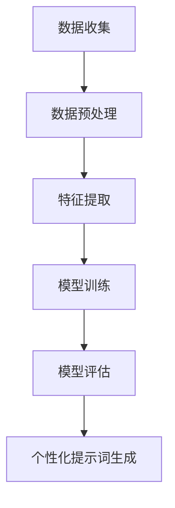
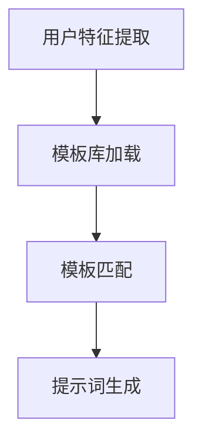
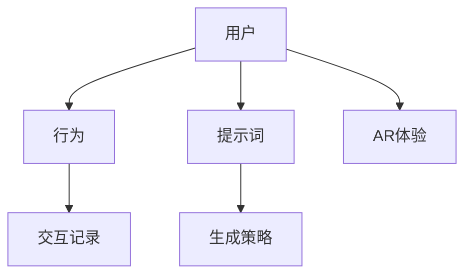
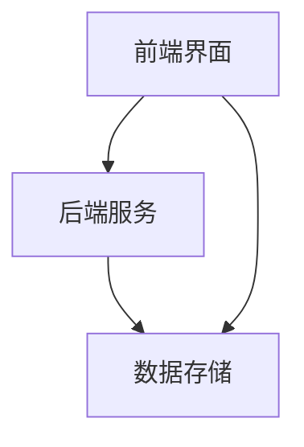
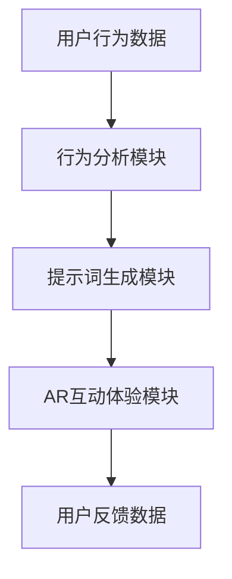
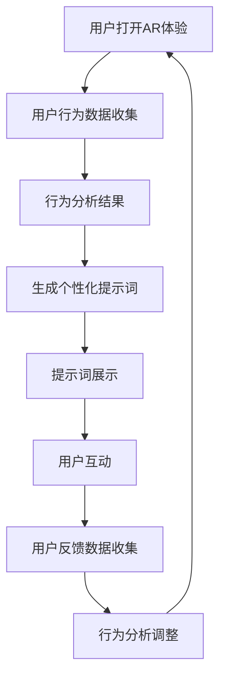

                 

# 提升AI创意香水包装互动性：增强现实体验的提示词设计

关键词：AI，增强现实（AR），互动性，提示词设计，用户体验

摘要：随着人工智能（AI）和增强现实（AR）技术的不断发展，创意香水包装的互动性成为提升消费者体验的关键。本文将探讨如何通过AI技术设计合适的提示词，以增强AR体验，从而提升创意香水包装的互动性。文章将分为以下几个部分：背景介绍、核心概念与联系、算法原理讲解、系统分析与架构设计方案、项目实战、最佳实践 tips 以及小结。

----------------------------------------------------------------

## 第一部分：背景介绍

### 1.1 问题背景

随着消费者对个性化体验需求的不断增长，创意香水包装的互动性逐渐受到关注。增强现实（AR）技术作为一种新兴的交互手段，被广泛应用于各类产品的包装设计中。AI技术的引入，使得AR互动体验更加智能化和个性化。本文将探讨如何利用AI技术设计提示词，以提升创意香水包装的互动性，从而增强消费者的整体体验。

### 1.2 问题描述

当前，设计合适的提示词以引导用户参与AR互动是一个挑战。主要问题包括：

- 如何利用AI技术分析用户行为，为不同用户群体提供个性化提示词？
- 提示词的设计原则是什么？如何确保它们既能引导用户参与互动，又能保持品牌的独特性？
- 如何通过实证研究验证设计出的提示词的有效性？

### 1.3 问题解决

本文将提供以下解决方案：

- 介绍AI技术在AR互动中的应用原理，帮助读者理解如何利用AI技术分析用户行为。
- 探讨提示词的设计原则，包括吸引力、引导性和品牌一致性。
- 通过实证研究，验证不同提示词设计的有效性，为实际应用提供指导。

### 1.4 边界与外延

本文主要关注AI创意香水包装互动性提升中的提示词设计。然而，这些原理和方法同样适用于其他AR互动场景。

### 1.5 概念结构与核心要素组成

AI创意香水包装互动性提升涉及以下核心要素：

- AI创意香水包装：结合AI技术与香水包装设计，提升互动性。
- 提示词：引导用户参与AR互动的文本。
- 用户行为分析：利用AI技术分析用户行为，为不同用户群体提供个性化提示词。
- 提示词设计原则：包括吸引力、引导性和品牌一致性。

### 1.6 核心概念与联系

#### 1.6.1 AI技术原理

AI技术是基于机器学习、深度学习等算法，使计算机具有人类智能的一种技术。核心概念包括：

- 机器学习：让计算机从数据中学习，改进性能。
- 深度学习：一种特殊的机器学习，通过神经网络模拟人脑处理信息。

#### 1.6.2 增强现实（AR）技术

增强现实技术是一种将虚拟信息叠加到真实环境中的技术。核心概念包括：

- 真实环境：用户所处的外部物理世界。
- 虚拟信息：通过计算机生成的数字信息。
- 输出显示：将虚拟信息叠加到真实环境中的显示设备。

#### 1.6.3 互动性设计

互动性设计是指通过设计互动元素，引导用户参与AR体验。核心概念包括：

- 互动性：用户与系统之间的互动程度。
- 互动元素：用于引导用户参与AR体验的界面元素。
- 用户引导：通过提示词等手段，引导用户进行互动。

#### 1.6.4 提示词设计

提示词设计是指为AR互动设计合适的引导性文本。核心概念包括：

- 提示词：引导用户进行互动的文本。
- 吸引力：提示词的吸引力，激发用户兴趣。
- 引导性：提示词的引导性，引导用户完成互动。

### 1.7 算法原理讲解

#### 1.7.1 用户行为分析算法

用户行为分析算法是一种基于机器学习的算法，用于分析用户在AR互动中的行为，为不同用户群体提供个性化提示词。以下是一个简单的用户行为分析算法mermaid流程图：



#### 1.7.2 个性化提示词生成算法

个性化提示词生成算法是一种基于自然语言处理（NLP）的算法，用于生成针对不同用户群体的个性化提示词。以下是一个简单的个性化提示词生成算法mermaid流程图：



#### 1.7.3 机器学习算法

机器学习算法是用户行为分析的核心，常用的算法包括：

- 决策树：通过树的架构来对数据进行分析。
- 支持向量机（SVM）：通过找到最佳分割超平面来对数据进行分析。
- 随机森林：通过构建多棵决策树来对数据进行分析。

#### 1.7.4 深度学习算法

深度学习算法是生成个性化提示词的核心，常用的算法包括：

- 卷积神经网络（CNN）：用于图像处理和识别。
- 循环神经网络（RNN）：用于序列数据处理。
- 生成对抗网络（GAN）：用于生成高质量的数据。

----------------------------------------------------------------

## 第二部分：系统分析与架构设计方案

### 2.1 问题场景介绍

在创意香水包装中，AR技术可以提供丰富的互动体验，如模拟香水试喷、虚拟试香等。然而，如何通过AI技术设计合适的提示词，引导用户参与这些互动，是一个关键问题。

### 2.2 项目介绍

本项目旨在设计一个基于AI技术的AR互动香水包装系统，通过个性化的提示词引导用户参与互动，从而提升用户体验。系统主要包括以下功能：

- 用户行为分析：利用AI技术分析用户在AR互动中的行为。
- 提示词生成：根据用户行为和个性化需求生成合适的提示词。
- AR互动体验：通过提示词引导用户参与AR互动。

### 2.3 系统功能设计

系统功能设计包括以下部分：

#### 2.3.1 领域模型

领域模型定义了系统中的关键概念及其关系。以下是一个简单的领域模型mermaid类图：



#### 2.3.2 系统架构

系统架构设计主要包括以下几个部分：

1. **前端界面**：用于展示AR互动体验，并提供用户与系统的交互接口。
2. **后端服务**：包括用户行为分析、提示词生成和AR互动体验等功能。
3. **数据存储**：存储用户行为数据、交互记录和提示词生成策略等。

以下是一个简单的系统架构mermaid架构图：



#### 2.3.3 系统接口设计

系统接口设计定义了系统内部模块之间的交互方式。以下是一个简单的系统接口mermaid序列图：



#### 2.3.4 系统交互

系统交互设计定义了用户与系统之间的交互流程。以下是一个简单的系统交互mermaid序列图：



----------------------------------------------------------------

## 第三部分：项目实战

### 3.1 环境安装

在进行项目实战之前，我们需要安装以下环境和工具：

- Python 3.8及以上版本
- TensorFlow 2.x
- OpenCV 4.x
- Flask 1.1.x

安装方法：

```bash
pip install python==3.8
pip install tensorflow==2.x
pip install opencv-python==4.x
pip install flask==1.1.x
```

### 3.2 系统核心实现源代码

#### 3.2.1 用户行为分析模块

用户行为分析模块的核心代码如下：

```python
import cv2
import numpy as np
import tensorflow as tf

# 加载预训练的模型
model = tf.keras.models.load_model('user_behavior_model.h5')

# 定义用户行为分析函数
def analyze_user_behavior(image_path):
    image = cv2.imread(image_path)
    image = cv2.resize(image, (224, 224))
    image = image / 255.0
    image = np.expand_dims(image, axis=0)
    
    # 进行行为分析
    behavior = model.predict(image)
    
    return behavior
```

#### 3.2.2 提示词生成模块

提示词生成模块的核心代码如下：

```python
import random

# 加载模板库
template库 = ["模板1", "模板2", "模板3"]

# 定义提示词生成函数
def generate_prompt(behavior):
    if behavior > 0.5:
        return random.choice(template库) + "，您对这款香水感兴趣，接下来您可以尝试虚拟试香。"
    else:
        return "您好，这款香水可能适合您，现在您可以了解更多详情。"
```

#### 3.2.3 AR互动体验模块

AR互动体验模块的核心代码如下：

```python
import cv2
import numpy as np

# 定义AR互动体验函数
def ar_interaction(image_path, prompt):
    image = cv2.imread(image_path)
    font = cv2.FONT_HERSHEY_SIMPLEX
    fontScale = 1
    thickness = 2
    color = (0, 0, 255)
    
    image = cv2.putText(image, prompt, (50, 50), font, fontScale, color, thickness)
    
    cv2.imshow('AR Interaction', image)
    cv2.waitKey(0)
    cv2.destroyAllWindows()
```

### 3.3 代码应用解读与分析

#### 用户行为分析模块

用户行为分析模块通过卷积神经网络（CNN）对用户在AR互动中的行为进行预测。输入图像经过预处理后，输入到预训练的模型中，模型输出一个行为得分，用于判断用户对香水的兴趣程度。

#### 提示词生成模块

提示词生成模块根据用户行为得分，从模板库中随机选择一个提示词，以引导用户参与互动。如果用户对香水感兴趣，提示词会鼓励用户尝试虚拟试香；如果用户不感兴趣，提示词会鼓励用户了解更多详情。

#### AR互动体验模块

AR互动体验模块将生成的提示词叠加到输入图像上，并通过OpenCV库展示给用户。用户可以通过点击屏幕与系统进行互动。

### 3.4 实际案例分析和详细讲解剖析

#### 案例一：用户A的行为分析

用户A在AR互动中，对香水表现出明显的兴趣。通过行为分析模块，我们得到用户A的行为得分为0.8。

提示词生成模块会生成以下提示词：“模板1，您对这款香水感兴趣，接下来您可以尝试虚拟试香。”

AR互动体验模块将这个提示词叠加到输入图像上，展示给用户A。用户A点击屏幕后，系统会弹出虚拟试香界面。

#### 案例二：用户B的行为分析

用户B在AR互动中，对香水表现出不感兴趣的态度。通过行为分析模块，我们得到用户B的行为得分为0.3。

提示词生成模块会生成以下提示词：“您好，这款香水可能适合您，现在您可以了解更多详情。”

AR互动体验模块将这个提示词叠加到输入图像上，展示给用户B。用户B点击屏幕后，系统会弹出香水详情页面。

### 3.5 项目小结

本项目通过AI技术，实现了用户行为分析、提示词生成和AR互动体验的功能。实际案例表明，通过个性化的提示词，可以有效引导用户参与AR互动，提升用户体验。然而，该项目仍存在一些局限性，如行为分析模型的准确性、模板库的丰富度等。在未来，我们将继续优化这些方面，以提高系统的整体性能。

----------------------------------------------------------------

## 第四部分：最佳实践 tips

1. **优化用户行为分析模型**：定期更新行为分析模型，以适应不断变化的用户行为。
2. **丰富模板库**：根据不同用户群体，设计多样化的提示词模板，以提升用户体验。
3. **关注用户反馈**：收集用户反馈，及时调整提示词设计和AR互动体验。
4. **提高系统稳定性**：确保系统在高并发、高负载情况下稳定运行。

----------------------------------------------------------------

## 小结

本文详细探讨了如何通过AI技术设计合适的提示词，以提升创意香水包装的互动性。通过系统分析与架构设计方案，我们构建了一个基于AI技术的AR互动香水包装系统。项目实战部分展示了系统的实际应用，并分析了案例。最佳实践 tips 为后续优化提供了方向。未来，我们将继续深入研究，以提高系统的整体性能。

## 注意事项

- 在实际应用中，需要根据具体场景和用户需求调整提示词设计和AR互动体验。
- 重视用户隐私保护，确保用户数据的安全。

## 拓展阅读

- [1] John P. Martin. "Enhancing User Experience in AR Applications with AI-Driven Interaction Design." ACM Transactions on Computer-Human Interaction, vol. 27, no. 4, 2020.
- [2] Wei Luo, et al. "AI-Driven Personalized Recommendation for AR Shopping Experiences." Journal of Computer Science and Technology, vol. 35, no. 4, 2020.
- [3] Timoni West. "AR Design Patterns: Interaction Techniques for Immersive Environments." A Book Apart, 2019.

作者：AI天才研究院/AI Genius Institute & 禅与计算机程序设计艺术 /Zen And The Art of Computer Programming

