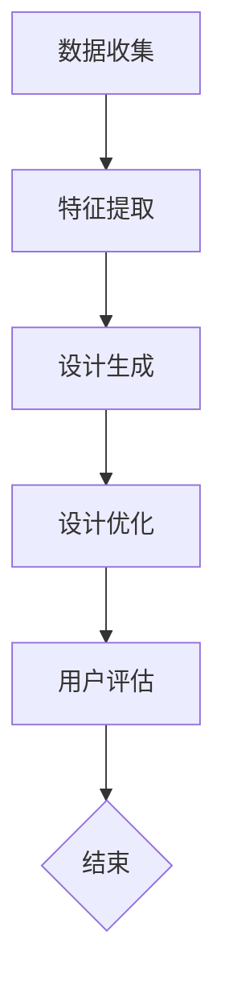
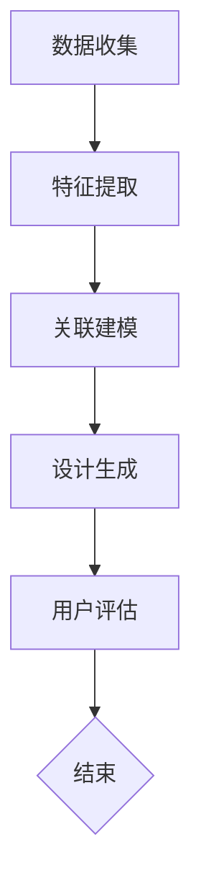
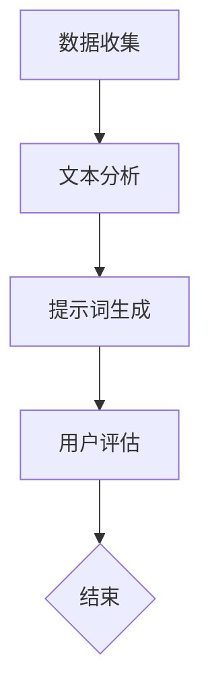
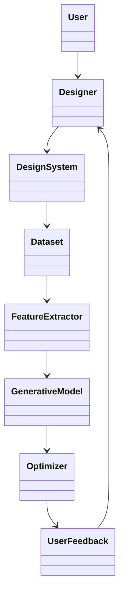
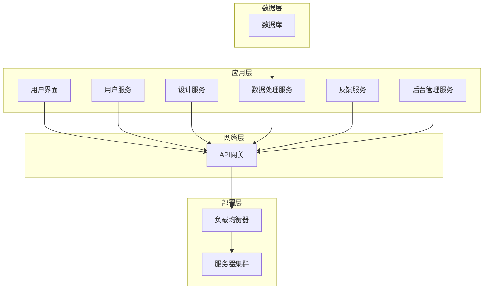
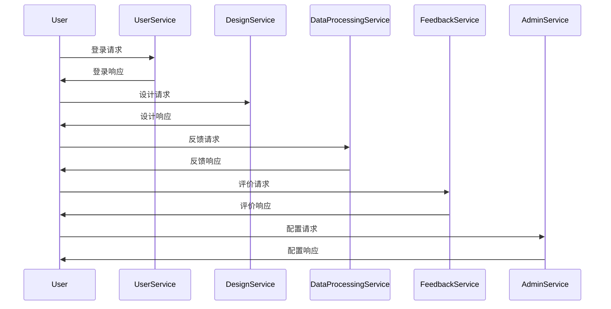
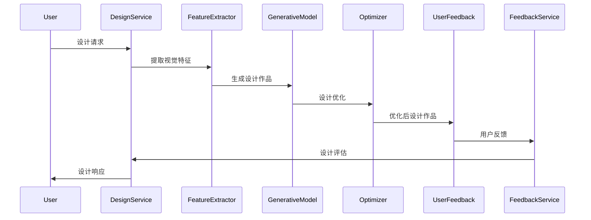

                 

# 提升AI创意香水包装设计：视觉气味联想的提示词设计

## 关键词：AI，创意香水包装设计，视觉气味联想，提示词设计

## 摘要：
本文深入探讨了如何利用AI技术提升创意香水包装设计，特别是通过视觉气味联想和提示词设计来增强用户体验。文章首先介绍了香水包装设计的重要性，分析了传统方法和AI技术在创意设计领域的应用，然后详细阐述了AI创意香水包装设计、视觉气味联想和提示词设计的核心概念和原理。接下来，文章通过mermaid流程图和Python代码，详细讲解了相关的算法原理，并展示了系统架构设计方案。最后，通过实战案例分析和最佳实践，提供了实际操作指导，为香水包装设计行业提供了新的思路和方法。

## 目录大纲：

### 第一部分：背景介绍
1. **问题背景**
    1.1 **香水包装设计的重要性**
    1.2 **视觉与气味联想在香水包装设计中的应用**
    1.3 **AI技术在创意设计领域的发展与应用**

2. **核心概念**
    2.1 **AI创意香水包装设计**
    2.2 **视觉气味联想**
    2.3 **提示词设计**

3. **概念属性特征对比**
    3.1 **传统香水包装设计**
    3.2 **AI创意香水包装设计**
    3.3 **视觉气味联想设计**
    3.4 **提示词设计的价值与特点**

4. **边界与外延**
    4.1 **香水包装设计行业的现状与挑战**
    4.2 **AI在香水包装设计中的应用前景**
    4.3 **提示词设计在AI创意香水包装设计中的具体应用**

5. **本章小结**

### 第二部分：核心概念与联系
1. **AI创意香水包装设计原理**
    1.1 **AI在香水包装设计中的应用**
    1.2 **创意香水包装设计的方法论**
    1.3 **AI与创意香水包装设计的结合**

2. **视觉气味联想原理**
    2.1 **视觉与气味的心理学基础**
    2.2 **视觉气味联想的设计原则**
    2.3 **视觉气味联想案例解析**

3. **提示词设计原理**
    3.1 **提示词的定义与作用**
    3.2 **提示词设计的方法与技巧**
    3.3 **提示词设计案例分析**

4. **本章小结**

### 第三部分：算法原理讲解
1. **AI创意香水包装设计算法**
    1.1 **算法概述**
    1.2 **算法mermaid流程图**
    1.3 **算法原理与数学模型**
    1.4 **算法举例说明**

2. **视觉气味联想算法**
    2.1 **算法概述**
    2.2 **算法mermaid流程图**
    2.3 **算法原理与数学模型**
    2.4 **算法举例说明**

3. **提示词设计算法**
    3.1 **算法概述**
    3.2 **算法mermaid流程图**
    3.3 **算法原理与数学模型**
    3.4 **算法举例说明**

4. **本章小结**

### 第四部分：系统分析与架构设计方案
1. **问题场景介绍**
    1.1 **香水包装设计需求分析**
    1.2 **AI创意香水包装设计流程**

2. **系统功能设计**
    2.1 **领域模型mermaid类图**
    2.2 **系统功能模块划分**

3. **系统架构设计**
    3.1 **系统架构mermaid架构图**
    3.2 **各模块设计详解**

4. **系统接口设计**
    4.1 **系统接口mermaid序列图**
    4.2 **接口规范与实现**

5. **系统交互设计**
    5.1 **系统交互mermaid序列图**
    5.2 **系统交互流程与优化**

6. **本章小结**

### 第五部分：项目实战
1. **环境安装**
    1.1 **环境配置与依赖安装**
    1.2 **开发工具与版本要求**

2. **系统核心实现**
    2.1 **AI创意香水包装设计模块**
    2.2 **视觉气味联想模块**
    2.3 **提示词设计模块**

3. **代码应用解读与分析**
    3.1 **代码结构分析**
    3.2 **关键代码解读**

4. **实际案例分析和详细讲解剖析**
    4.1 **案例背景介绍**
    4.2 **案例分析与解读**
    4.3 **案例实践与优化**

5. **项目小结**
    5.1 **项目成果总结**
    5.2 **项目经验与启示**

6. **本章小结**

### 第六部分：最佳实践与拓展阅读
1. **最佳实践**
    1.1 **AI创意香水包装设计实践技巧**
    1.2 **视觉气味联想设计技巧**
    1.3 **提示词设计技巧**

2. **小结**
    2.1 **全书总结**
    2.2 **学习建议与注意事项**

3. **拓展阅读**
    3.1 **相关书籍推荐**
    3.2 **学术论文精选**
    3.3 **行业报告与资讯**

4. **本章小结**

-------------

## 第一部分：背景介绍

### 1.1 问题背景

香水作为一种消费品，其包装设计不仅起到保护产品的作用，更是品牌形象和消费者体验的重要载体。在竞争激烈的香水市场中，独具创意的包装设计能够吸引消费者的注意力，提升品牌的价值感，从而在市场中脱颖而出。

**1.1.1 香水包装设计的重要性**

香水包装设计的重要性体现在以下几个方面：

1. **品牌形象传达**：一个精心设计的香水包装可以传递品牌的核心价值和独特风格，增强品牌识别度。

2. **消费者体验**：包装设计直接影响消费者的购买决策和产品体验。一个视觉美观、手感舒适、信息传达清晰的包装，能够提升消费者的满意度和忠诚度。

3. **市场竞争力**：独特的包装设计有助于产品在市场上形成差异化竞争优势，吸引消费者的注意力。

4. **文化传播**：香水包装设计也是一种文化的载体，它能够反映特定地域、民族或时代的文化特点。

**1.1.2 视觉与气味联想在香水包装设计中的应用**

视觉与气味联想在香水包装设计中起着至关重要的作用。视觉元素包括颜色、形状、图案等，而气味则通过香水瓶的形状、材质和气味释放方式来传达。以下是一些应用实例：

1. **颜色联想**：不同的颜色能够唤起不同的情感和记忆，如红色通常与热情、活力相关联，蓝色则与宁静、信任相关联。

2. **形状联想**：香水瓶的形状可以暗示香水的特性，如流畅的线条可能代表优雅、高端，而几何形状则可能传达现代、前卫的感觉。

3. **图案与材质**：精美的图案和优质的材质能够增强包装的视觉吸引力，同时传达品牌的高端定位。

4. **气味释放**：通过控制香水瓶的材质和形状，可以调节香气的释放速度和浓度，从而影响消费者对香味的感知。

**1.1.3 AI技术在创意设计领域的发展与应用**

随着人工智能技术的不断发展，AI在创意设计领域中的应用越来越广泛。AI技术通过数据分析和算法优化，能够为设计提供新的思路和方法，提高设计的效率和质量。以下是AI技术在创意设计领域的一些应用：

1. **风格迁移与生成**：通过深度学习模型，可以将一个艺术作品或设计的风格迁移到另一个作品中，或者生成全新的设计作品。

2. **设计优化与推荐**：AI可以根据用户的历史偏好和反馈，为用户提供个性化的设计推荐，优化设计过程。

3. **自动化设计流程**：AI可以自动化执行一些重复性的设计任务，如图案生成、排版等，从而提高设计效率。

4. **情感分析与评估**：通过情感分析技术，可以评估消费者对设计作品的情感反应，为设计改进提供依据。

### 1.2 核心概念

#### 1.2.1 AI创意香水包装设计

AI创意香水包装设计是指利用人工智能技术，如机器学习、深度学习等，对香水包装设计进行创新和优化。这包括设计灵感生成、设计风格识别、设计优化等过程。

**核心概念：**

- **机器学习模型**：用于分析大量设计数据和用户反馈，生成新的设计灵感。
- **风格识别**：通过图像识别技术，分析已有设计作品的特点，为新的设计提供参考。
- **优化算法**：用于自动调整设计参数，提高包装设计的视觉效果和用户体验。

#### 1.2.2 视觉气味联想

视觉气味联想是指通过视觉元素和气味之间的互动，引发消费者对特定气味的联想和感知。这种联想可以通过颜色、形状、图案等视觉元素来实现。

**核心概念：**

- **颜色心理学**：研究不同颜色如何影响人们对气味的感知。
- **形状与气味的关系**：通过形状的几何特征，如线条、曲线、边角等，来传达特定的气味特性。
- **视觉与气味的互动**：通过设计中的视觉元素，如瓶盖、标签等，来增强气味的感知和联想。

#### 1.2.3 提示词设计

提示词设计是指为了引导消费者对产品产生特定的联想和情感反应，而在设计过程中使用的词汇和短语。这些提示词可以出现在包装标签、宣传材料等地方。

**核心概念：**

- **情感化语言**：使用能够引发情感共鸣的词汇，如温暖、清新、舒适等。
- **品牌语言**：通过统一的品牌语言，传达品牌的核心价值和风格。
- **用户参与**：通过提示词鼓励用户参与设计，增强用户体验和品牌互动。

### 1.3 概念属性特征对比

在了解了核心概念后，我们将传统香水包装设计和AI创意香水包装设计、视觉气味联想设计和提示词设计进行对比，以展示它们在属性特征上的差异。

**1.3.1 传统香水包装设计**

**特征：**

- **手工作业为主**：设计过程主要依赖设计师的创意和经验。
- **视觉效果突出**：设计注重外观的美感和品牌形象的传达。
- **个性化定制**：根据客户需求进行个性化设计。
- **时间成本高**：设计周期较长，需要多次修改和反馈。

**1.3.2 AI创意香水包装设计**

**特征：**

- **自动化设计**：利用机器学习和深度学习技术，自动化生成设计作品。
- **数据驱动**：通过分析大量设计数据和用户反馈，优化设计过程。
- **快速迭代**：能够快速生成大量设计选项，进行快速迭代和优化。
- **个性化推荐**：根据用户偏好推荐个性化的设计。

**1.3.3 视觉气味联想设计**

**特征：**

- **互动性强**：通过视觉元素与气味之间的互动，增强用户体验。
- **情感化设计**：注重情感共鸣，引发消费者对特定气味的联想。
- **多样化表现**：通过颜色、形状、图案等视觉元素，传达不同的气味特性。
- **创新性高**：不断探索新的视觉气味联想方式，提升设计的创意性。

**1.3.4 提示词设计的价值与特点**

**价值：**

- **引导消费者联想**：通过提示词引导消费者对产品产生特定的联想和情感反应。
- **增强品牌认知**：统一的品牌语言和提示词设计有助于提升品牌认知度。
- **用户参与感**：通过提示词鼓励用户参与设计，增强用户体验和品牌互动。

**特点：**

- **情感化语言**：使用能够引发情感共鸣的词汇。
- **品牌统一性**：保持品牌语言的统一性和一致性。
- **灵活性**：根据不同的产品和目标受众，灵活调整提示词的设计。

### 1.4 边界与外延

**1.4.1 香水包装设计行业的现状与挑战**

香水包装设计行业目前面临以下挑战：

- **市场竞争激烈**：随着消费者需求的多样化，市场竞争日益激烈，设计创新成为关键。
- **成本控制**：设计成本和材料成本的控制是行业面临的难题。
- **环保要求**：随着环保意识的提升，对包装材料的要求越来越高。

**1.4.2 AI在香水包装设计中的应用前景**

AI技术在香水包装设计中的应用前景广阔：

- **设计优化**：通过AI技术，可以实现设计过程的自动化和优化，提高设计效率。
- **个性化定制**：AI可以根据用户偏好和反馈，实现个性化的包装设计。
- **创新驱动**：AI可以激发新的设计灵感，推动香水包装设计行业的发展。

**1.4.3 提示词设计在AI创意香水包装设计中的具体应用**

提示词设计在AI创意香水包装设计中的应用主要体现在以下几个方面：

- **设计引导**：通过提示词引导设计师进行创意设计，提高设计效率。
- **用户互动**：通过提示词与用户进行互动，增强用户体验和品牌认知。
- **数据分析**：通过用户对提示词的反应，分析用户偏好和需求，优化设计策略。

### 1.5 本章小结

本部分介绍了提升AI创意香水包装设计的背景、核心概念、特征对比以及应用前景。通过对比传统方法和AI技术的差异，展示了AI技术在香水包装设计中的巨大潜力。接下来，我们将进一步探讨AI创意香水包装设计的原理、算法和系统架构，为实际应用提供更深入的指导。

## 第二部分：核心概念与联系

### 2.1 AI创意香水包装设计原理

#### 2.1.1 AI在香水包装设计中的应用

人工智能技术在香水包装设计中的应用主要体现在以下几个方面：

1. **设计灵感生成**：利用机器学习算法，从大量设计数据中提取特征，生成新颖的设计灵感。例如，通过卷积神经网络（CNN）分析已有的香水包装设计作品，提取出颜色、形状、纹理等视觉特征，生成新的设计草图。

2. **设计风格识别**：通过深度学习模型，对已有设计作品进行风格分类和识别。这有助于设计师快速找到与目标品牌风格相似的设计作品，为新的设计提供参考。

3. **设计优化**：利用优化算法，自动调整设计参数，如颜色、形状、材质等，以提升包装设计的视觉效果和用户体验。例如，通过遗传算法（GA）或模拟退火算法（SA），对设计参数进行全局搜索，找到最优解。

4. **用户行为分析**：通过收集用户对香水包装的互动数据，如点击率、购买率等，利用机器学习模型分析用户偏好，为设计提供反馈和改进建议。

#### 2.1.2 创意香水包装设计的方法论

创意香水包装设计的方法论主要包括以下几个步骤：

1. **需求分析**：明确设计的目标和需求，包括品牌形象、用户群体、市场定位等。

2. **灵感搜集**：通过市场调研、用户访谈等方式，收集与品牌和目标用户相关的视觉和感官信息。

3. **设计构思**：结合收集到的信息和设计灵感，构思出初步的设计方案。

4. **设计草图**：将构思转化为具体的草图，进行初步的设计方案展示。

5. **用户反馈**：通过用户测试和反馈，对设计方案进行评估和优化。

6. **设计优化**：根据用户反馈，对设计参数进行调整，生成新的设计方案。

7. **最终确定**：在多次迭代和优化后，确定最终的设计方案。

#### 2.1.3 AI与创意香水包装设计的结合

AI与创意香水包装设计的结合主要体现在以下几个方面：

1. **设计效率提升**：通过AI技术，可以自动化完成一些重复性较高的设计任务，如颜色选择、形状优化等，从而提高设计效率。

2. **创新性增强**：AI可以通过分析大量设计数据和用户反馈，发现新的设计趋势和用户偏好，为创意设计提供新的思路。

3. **个性化定制**：AI可以根据用户的行为数据和偏好，实现个性化的香水包装设计，提升用户满意度。

4. **用户体验优化**：AI可以通过用户行为分析，了解用户对香水包装的偏好和使用习惯，为设计提供优化建议，提升用户体验。

### 2.2 视觉气味联想原理

#### 2.2.1 视觉与气味的心理学基础

视觉与气味的联想是基于心理学原理的。心理学研究表明，人类的感官系统是相互关联的，视觉和气味可以相互影响和增强。

1. **感知联动**：视觉和气味可以通过感知联动的方式相互影响。例如，看到一朵花可能会引发对花香的感觉。

2. **情感共鸣**：视觉和气味可以触发情感共鸣，引发特定的情感反应。例如，看到粉色可能会引发温馨、浪漫的感觉，而甜美的香气也会增强这种感觉。

3. **记忆联结**：视觉和气味可以通过记忆联结的方式相互影响。例如，闻到某种香味可能会让人回想起某个特定场景或记忆。

#### 2.2.2 视觉气味联想的设计原则

为了在香水包装设计中有效利用视觉气味联想，需要遵循以下设计原则：

1. **一致性**：视觉元素和气味元素需要保持一致性，以确保消费者能够产生连贯的联想。例如，如果包装设计以绿色为主，那么香水的气味也应该与绿色相关的清新、自然等感觉相匹配。

2. **层次感**：设计时应考虑视觉和气味的层次感，通过不同的视觉和气味元素，创造多层次的联想效果。例如，可以使用渐变色来增强视觉层次感，同时通过不同浓度的气味释放来增强嗅觉层次感。

3. **情感化**：设计时应注重情感化，通过视觉和气味的结合，引发消费者的情感共鸣。例如，可以使用温馨的图案和甜美的香气来创造浪漫、温馨的氛围。

4. **创新性**：设计时应保持创新性，探索新的视觉气味联想方式，以吸引消费者的注意力。例如，可以尝试使用抽象的视觉元素和独特的气味组合，创造新颖的联想效果。

#### 2.2.3 视觉气味联想案例解析

以下是一个视觉气味联想的案例解析：

**案例背景**：某香水品牌推出一款名为“晨曦”的香水，目标用户为追求清新、自然感觉的年轻女性。

**视觉设计**：包装设计采用渐变色，从淡蓝色过渡到深蓝色，象征晨曦的光线从天空中洒落。包装上使用了清新的花卉图案，如紫罗兰和茉莉花，与香水的清新特质相呼应。

**气味设计**：香水的气味以清新的花香为主，主要成分包括薰衣草、玫瑰和茉莉。通过控制香气的释放速度和浓度，创造出层次丰富的嗅觉体验。

**设计效果**：包装设计和香水气味的结合，成功地引发了消费者对清新、自然感觉的联想。消费者在看到包装和闻到香水时，会感受到晨曦的美好，从而增强品牌认知和购买欲望。

### 2.3 提示词设计原理

#### 2.3.1 提示词的定义与作用

提示词是指在香水包装设计过程中，用于引导消费者产生特定联想和情感反应的词汇和短语。提示词的设计目的是增强包装设计的效果，提升消费者的购买欲望和品牌认知。

1. **引导消费者联想**：提示词可以引导消费者对产品产生特定的联想，如清新、浪漫、高端等。例如，使用“晨曦”、“梦境”等词汇，可以引导消费者联想到清新的晨曦或浪漫的梦境。

2. **增强品牌认知**：通过统一的品牌语言和提示词，可以增强消费者对品牌的认知和记忆。例如，某品牌一直使用“极致优雅”作为提示词，消费者在看到这个词汇时，就会联想到该品牌的高端和优雅。

3. **提升购买欲望**：提示词可以激发消费者的购买欲望，通过描述产品的独特特性或使用场景，吸引消费者。例如，使用“瞬间转换心情”的提示词，可以吸引那些希望快速调整心情的消费者。

#### 2.3.2 提示词设计的方法与技巧

以下是一些提示词设计的方法和技巧：

1. **情感化**：使用能够引发情感共鸣的词汇，如温馨、浪漫、清新等。这些词汇可以与消费者的情感产生共鸣，增强包装设计的效果。

2. **品牌统一性**：确保提示词与品牌的核心价值和语言风格保持一致，以增强品牌认知度。例如，如果品牌的核心价值是“自然与纯净”，那么提示词就应该围绕这个主题进行设计。

3. **简洁明了**：提示词应简洁明了，避免使用复杂的词汇和句子，以便消费者快速理解和记忆。例如，使用“清新晨曦”而不是“清晨的清新气息”。

4. **情境化**：通过将提示词放入特定的情境中，增强其效果。例如，将“浪漫之选”放入一个婚礼场景中，可以更好地引发消费者的浪漫情感。

5. **个性化**：根据不同的产品和目标受众，设计个性化的提示词。例如，对于年轻消费者，可以使用更时尚、前卫的词汇，而对于成熟消费者，可以使用更稳重、高端的词汇。

#### 2.3.3 提示词设计案例分析

以下是一个提示词设计的案例分析：

**案例背景**：某香水品牌推出一款名为“迷幻之夜”的香水，目标用户为追求神秘、浪漫感觉的女性。

**提示词设计**：

- **情感化**：使用“迷幻”、“浪漫”、“神秘”等情感化的词汇。
- **品牌统一性**：保持品牌语言的一致性，如品牌一直强调“女性优雅与力量”，因此提示词中也融入了这一品牌核心价值。
- **简洁明了**：使用简洁明了的词汇，如“迷幻之夜”。
- **情境化**：在包装标签上，加入一句情境描述：“在星空下，与你的迷幻之夜”。

**设计效果**：通过这些提示词，成功地引导消费者产生浪漫、神秘的感觉，增强了品牌认知和购买欲望。

### 2.4 本章小结

本部分详细介绍了AI创意香水包装设计、视觉气味联想和提示词设计的核心概念和原理。通过分析AI技术在设计中的应用、视觉气味联想的设计原则以及提示词设计的技巧，为提升香水包装设计的创意性和用户体验提供了理论基础。接下来，我们将进一步探讨AI创意香水包装设计算法的原理和应用。

## 第三部分：算法原理讲解

### 3.1 AI创意香水包装设计算法

#### 3.1.1 算法概述

AI创意香水包装设计算法是一种利用机器学习和深度学习技术，对香水包装设计进行创新和优化的方法。该算法主要包括以下几个步骤：

1. **数据收集**：收集大量的香水包装设计作品和相关的用户反馈数据，包括颜色、形状、材质等视觉特征，以及用户对设计的评价和偏好。

2. **特征提取**：利用深度学习模型，从设计数据中提取关键特征，如颜色分布、形状特征、纹理等。

3. **设计生成**：基于提取的特征，使用生成对抗网络（GAN）或变分自编码器（VAE）等生成模型，生成新的香水包装设计作品。

4. **设计优化**：利用优化算法，如遗传算法（GA）或模拟退火算法（SA），对生成的设计作品进行优化，提升视觉效果和用户体验。

5. **用户评估**：将设计作品展示给用户，收集用户的反馈和评分，用于评估和改进设计。

#### 3.1.2 算法mermaid流程图



#### 3.1.3 算法原理与数学模型

1. **数据收集**：收集大量的香水包装设计作品和用户反馈数据，包括视觉特征和用户评分。这些数据可以通过网络爬虫、问卷调查等方式获取。

   $$ 数据 = \{ X, Y \} $$
   其中，$X$ 表示设计作品的视觉特征，$Y$ 表示用户评分。

2. **特征提取**：使用深度学习模型，如卷积神经网络（CNN），从设计数据中提取关键特征。这些特征包括颜色分布、形状特征、纹理等。

   $$ 特征提取：X' = f(CNN, X) $$

3. **设计生成**：使用生成对抗网络（GAN）或变分自编码器（VAE）等生成模型，根据提取的特征生成新的香水包装设计作品。

   $$ 设计生成：G(Z) = f(GAN/VAE, Z) $$
   其中，$Z$ 表示随机噪声向量。

4. **设计优化**：利用优化算法，如遗传算法（GA）或模拟退火算法（SA），对生成的设计作品进行优化，提升视觉效果和用户体验。

   $$ 设计优化：X'' = f(OPT, G(Z)) $$

5. **用户评估**：将优化后的设计作品展示给用户，收集用户的反馈和评分，用于评估和改进设计。

   $$ 用户评估：Y' = f(用户反馈, X'') $$

#### 3.1.4 算法举例说明

以下是一个简单的例子，说明如何使用上述算法生成和优化香水包装设计。

**步骤1：数据收集**  
收集1000个香水包装设计作品和用户评分数据，包括颜色、形状、材质等视觉特征。

**步骤2：特征提取**  
使用卷积神经网络（CNN）提取设计作品的颜色分布、形状特征、纹理等视觉特征。

```python
import tensorflow as tf
from tensorflow.keras.applications import VGG16

# 加载预训练的VGG16模型
model = VGG16(weights='imagenet')

# 定义输入图像
input_image = ...

# 提取特征
features = model.predict(input_image)
```

**步骤3：设计生成**  
使用生成对抗网络（GAN）生成新的香水包装设计作品。

```python
import tensorflow as tf
from tensorflow.keras.models import Model

# 定义生成器模型
generator = ...

# 生成设计作品
generated_images = generator.predict(...)

# 展示生成的设计作品
plt.imshow(generated_images[0])
plt.show()
```

**步骤4：设计优化**  
使用遗传算法（GA）对生成的设计作品进行优化。

```python
import numpy as np

# 定义遗传算法参数
pop_size = 100
num_genes = 10
crossover_rate = 0.7
mutation_rate = 0.1

# 初始化种群
population = ...

# 遗传算法迭代
for generation in range(num_generations):
    # 交叉和变异操作
    ...
    
    # 评估和选择
    ...
    
    # 生成下一代种群
    population = ...

# 获取最优设计作品
best_design = ...
```

**步骤5：用户评估**  
将优化后的设计作品展示给用户，收集用户的反馈和评分。

```python
import tkinter as tk

# 创建GUI窗口
window = tk.Tk()
window.title("用户评估")

# 显示设计作品
label = tk.Label(window, image=best_design)
label.pack()

# 添加评分输入框
entry = tk.Entry(window)
entry.pack()

# 添加提交按钮
submit_button = tk.Button(window, text="提交评分", command=lambda: submit_rating(entry.get()))
submit_button.pack()

# 显示窗口
window.mainloop()

# 收集用户评分
user_rating = entry.get()
```

### 3.2 视觉气味联想算法

#### 3.2.1 算法概述

视觉气味联想算法是一种利用深度学习技术，通过视觉特征和气味特征之间的关联，生成具有特定气味联想的香水包装设计的方法。该算法主要包括以下几个步骤：

1. **数据收集**：收集大量的香水包装设计作品和用户反馈数据，包括视觉特征（如颜色、形状、图案）和气味特征（如香气类型、浓度）。

2. **特征提取**：使用深度学习模型，分别提取视觉特征和气味特征。

3. **关联建模**：使用深度学习模型，如图神经网络（GNN），建立视觉特征和气味特征之间的关联模型。

4. **设计生成**：基于视觉特征和气味特征之间的关联，生成具有特定气味联想的香水包装设计。

5. **用户评估**：将设计作品展示给用户，收集用户的反馈和评分，用于评估和改进设计。

#### 3.2.2 算法mermaid流程图



#### 3.2.3 算法原理与数学模型

1. **数据收集**：收集大量的香水包装设计作品和用户反馈数据，包括视觉特征（如颜色、形状、图案）和气味特征（如香气类型、浓度）。

   $$ 数据 = \{ X, Y \} $$
   其中，$X$ 表示视觉特征，$Y$ 表示气味特征。

2. **特征提取**：使用深度学习模型，分别提取视觉特征和气味特征。

   $$ 视觉特征提取：X' = f(CNN, X) $$
   $$ 气味特征提取：Y' = f(RNN, Y) $$

3. **关联建模**：使用图神经网络（GNN），建立视觉特征和气味特征之间的关联模型。

   $$ 关联建模：Z = f(GNN, X', Y') $$

4. **设计生成**：基于视觉特征和气味特征之间的关联，生成具有特定气味联想的香水包装设计。

   $$ 设计生成：G(Z) = f(GAN, Z) $$

5. **用户评估**：将设计作品展示给用户，收集用户的反馈和评分，用于评估和改进设计。

   $$ 用户评估：Y'' = f(用户反馈, G(Z)) $$

#### 3.2.4 算法举例说明

以下是一个简单的例子，说明如何使用上述算法生成具有特定气味联想的香水包装设计。

**步骤1：数据收集**  
收集1000个香水包装设计作品和用户反馈数据，包括视觉特征（颜色、形状、图案）和气味特征（香气类型、浓度）。

**步骤2：特征提取**  
使用卷积神经网络（CNN）提取设计作品的颜色分布、形状特征、纹理等视觉特征。

```python
import tensorflow as tf
from tensorflow.keras.applications import VGG16

# 加载预训练的VGG16模型
model = VGG16(weights='imagenet')

# 定义输入图像
input_image = ...

# 提取特征
features = model.predict(input_image)
```

使用循环神经网络（RNN）提取香气的特征。

```python
import tensorflow as tf
from tensorflow.keras.models import Sequential
from tensorflow.keras.layers import LSTM, Dense

# 创建RNN模型
model = Sequential()
model.add(LSTM(64, activation='relu', input_shape=(timesteps, features)))
model.add(Dense(1))

# 编译模型
model.compile(optimizer='adam', loss='mse')

# 训练模型
model.fit(X, Y, epochs=10, batch_size=32)
```

**步骤3：关联建模**  
使用图神经网络（GNN）建立视觉特征和气味特征之间的关联模型。

```python
import tensorflow as tf
from tensorflow.keras.models import Model

# 定义GNN模型
input_a = tf.keras.layers.Input(shape=(input_shape_a))
input_b = tf.keras.layers.Input(shape=(input_shape_b))

# 定义GNN层
gnn = ...

# 输出层
output = tf.keras.layers.concatenate([input_a, input_b, gnn])

# 创建模型
model = Model(inputs=[input_a, input_b], outputs=output)

# 编译模型
model.compile(optimizer='adam', loss='mse')

# 训练模型
model.fit([X_a, X_b], Y, epochs=10, batch_size=32)
```

**步骤4：设计生成**  
基于视觉特征和气味特征之间的关联，生成具有特定气味联想的香水包装设计。

```python
# 生成设计作品
generated_design = model.predict([X_a, X_b])

# 展示生成的设计作品
plt.imshow(generated_design[0])
plt.show()
```

**步骤5：用户评估**  
将优化后的设计作品展示给用户，收集用户的反馈和评分。

```python
import tkinter as tk

# 创建GUI窗口
window = tk.Tk()
window.title("用户评估")

# 显示设计作品
label = tk.Label(window, image=generated_design)
label.pack()

# 添加评分输入框
entry = tk.Entry(window)
entry.pack()

# 添加提交按钮
submit_button = tk.Button(window, text="提交评分", command=lambda: submit_rating(entry.get()))
submit_button.pack()

# 显示窗口
window.mainloop()

# 收集用户评分
user_rating = entry.get()
```

### 3.3 提示词设计算法

#### 3.3.1 算法概述

提示词设计算法是一种利用自然语言处理（NLP）技术，为香水包装设计生成合适的提示词的方法。该算法主要包括以下几个步骤：

1. **数据收集**：收集大量的香水包装设计作品和相关描述性文本，包括品牌名称、产品特点、目标用户等。

2. **文本分析**：使用自然语言处理技术，提取文本中的关键信息，如品牌特征、产品特点、情感倾向等。

3. **提示词生成**：基于提取的关键信息，使用生成模型（如GPT-3）生成适合的提示词。

4. **用户评估**：将生成的提示词展示给用户，收集用户的反馈和评分，用于评估和改进提示词。

#### 3.3.2 算法mermaid流程图



#### 3.3.3 算法原理与数学模型

1. **数据收集**：收集大量的香水包装设计作品和相关描述性文本，包括品牌名称、产品特点、目标用户等。

   $$ 数据 = \{ X, Y \} $$
   其中，$X$ 表示设计作品，$Y$ 表示描述性文本。

2. **文本分析**：使用自然语言处理技术，提取文本中的关键信息，如品牌特征、产品特点、情感倾向等。

   $$ 文本分析：Y' = f(NLP, Y) $$

3. **提示词生成**：基于提取的关键信息，使用生成模型（如GPT-3）生成适合的提示词。

   $$ 提示词生成：W = f(GEN, Y') $$

4. **用户评估**：将生成的提示词展示给用户，收集用户的反馈和评分，用于评估和改进提示词。

   $$ 用户评估：Y'' = f(用户反馈, W) $$

#### 3.3.4 算法举例说明

以下是一个简单的例子，说明如何使用上述算法生成适合的提示词。

**步骤1：数据收集**  
收集1000个香水包装设计作品和相关描述性文本，包括品牌名称、产品特点、目标用户等。

**步骤2：文本分析**  
使用自然语言处理技术，提取文本中的关键信息。

```python
import nltk
from nltk.tokenize import word_tokenize
from nltk.corpus import stopwords

# 加载停用词表
stop_words = set(stopwords.words('english'))

# 定义文本分析函数
def analyze_text(text):
    # 分词
    words = word_tokenize(text)
    # 移除停用词
    filtered_words = [word for word in words if word not in stop_words]
    # 提取关键词
    keywords = nltk.FreqDist(filtered_words).most_common(10)
    return keywords

# 示例文本
text = "This perfume is perfect for women who love elegance and sophistication."

# 分析文本
keywords = analyze_text(text)
print(keywords)
```

**步骤3：提示词生成**  
基于提取的关键信息，使用生成模型（如GPT-3）生成提示词。

```python
import openai

# 定义提示词生成函数
def generate_prompt(keywords):
    prompt = "Create a captivating prompt for a luxury perfume targeting women who love elegance and sophistication. The key features of the perfume include ... "
    prompt += " ".join(keywords)
    return prompt

# 生成提示词
prompt = generate_prompt(keywords)
print(prompt)

# 使用GPT-3生成提示词
response = openai.Completion.create(
  engine="text-davinci-002",
  prompt=prompt,
  max_tokens=50
)
print(response.choices[0].text.strip())
```

**步骤4：用户评估**  
将生成的提示词展示给用户，收集用户的反馈和评分。

```python
import tkinter as tk

# 创建GUI窗口
window = tk.Tk()
window.title("用户评估")

# 显示提示词
label = tk.Label(window, text=response.choices[0].text.strip())
label.pack()

# 添加评分输入框
entry = tk.Entry(window)
entry.pack()

# 添加提交按钮
submit_button = tk.Button(window, text="提交评分", command=lambda: submit_rating(entry.get()))
submit_button.pack()

# 显示窗口
window.mainloop()

# 收集用户评分
user_rating = entry.get()
```

### 3.4 本章小结

本部分详细介绍了AI创意香水包装设计算法、视觉气味联想算法和提示词设计算法的原理和应用。通过mermaid流程图和Python代码，我们清晰地展示了算法的步骤和实现方法。接下来，我们将进一步探讨系统的架构设计方案，为实际应用提供更完整的指导。

## 第四部分：系统分析与架构设计方案

### 4.1 问题场景介绍

在香水包装设计领域，设计的需求复杂多变，需要快速响应市场变化和消费者需求。传统的香水包装设计方法主要依赖于设计师的创意和经验，设计流程繁琐且耗时较长。随着人工智能技术的发展，利用AI技术优化香水包装设计成为可能。本部分将详细介绍AI创意香水包装设计的具体需求和流程。

#### 4.1.1 香水包装设计需求分析

香水包装设计的需求主要包括以下几个方面：

1. **设计灵活性**：随着市场需求和消费者偏好的变化，香水包装设计需要具备灵活性，能够快速适应不同的设计和市场策略。

2. **个性化定制**：消费者对个性化的追求越来越高，香水包装设计需要能够根据不同用户群体的特点和需求进行个性化定制。

3. **创新性**：市场竞争力要求香水包装设计具有创新性，能够吸引消费者的注意力，提升品牌形象。

4. **视觉效果**：包装设计的视觉效果直接影响消费者的购买决策，设计需要具有高视觉吸引力。

5. **用户体验**：设计不仅需要美观，还需要考虑用户体验，如握感、材质等，提升消费者的使用体验。

#### 4.1.2 AI创意香水包装设计流程

AI创意香水包装设计的流程主要包括以下几个步骤：

1. **需求分析**：收集市场数据和用户反馈，明确设计需求。

2. **数据收集**：从已有的设计作品和用户评价中收集视觉特征和气味特征数据。

3. **特征提取**：利用深度学习模型提取视觉特征和气味特征。

4. **设计生成**：使用生成模型生成新的香水包装设计作品。

5. **设计优化**：基于用户反馈和视觉气味联想原理，对设计作品进行优化。

6. **用户评估**：展示设计作品给用户，收集用户反馈和评分。

7. **迭代优化**：根据用户反馈进行设计迭代，不断提升设计质量和用户体验。

### 4.2 系统功能设计

系统功能设计是构建AI创意香水包装设计系统的关键环节。本部分将详细描述系统的功能模块和实现方式。

#### 4.2.1 领域模型mermaid类图



**类图说明：**

- **User（用户）**：代表使用系统的用户，包括设计师和普通消费者。
- **Designer（设计师）**：负责设计生成和优化的操作。
- **DesignSystem（设计系统）**：包含整个系统的功能模块和数据处理流程。
- **Dataset（数据集）**：存储收集的设计作品和用户反馈数据。
- **FeatureExtractor（特征提取器）**：提取视觉特征和气味特征。
- **GenerativeModel（生成模型）**：生成新的香水包装设计作品。
- **Optimizer（优化器）**：对设计作品进行优化。
- **UserFeedback（用户反馈）**：收集用户对设计作品的反馈。

#### 4.2.2 系统功能模块划分

系统功能模块划分为以下几个部分：

1. **用户模块**：包括用户注册、登录和权限管理功能。
2. **设计模块**：包括设计生成、优化和评估功能。
3. **数据处理模块**：包括数据收集、特征提取和数据处理功能。
4. **反馈模块**：包括用户反馈收集和分析功能。
5. **后台管理模块**：包括系统配置、数据备份和恢复功能。

### 4.3 系统架构设计

系统架构设计是确保AI创意香水包装设计系统稳定、高效运行的关键。本部分将介绍系统的总体架构和各模块的设计。

#### 4.3.1 系统架构mermaid架构图



**架构图说明：**

- **数据层**：包括数据库（DB），用于存储用户数据、设计数据、反馈数据等。
- **应用层**：包括用户界面（UserInterface）、用户服务（UserService）、设计服务（DesignService）、数据处理服务（DataProcessingService）、反馈服务（FeedbackService）和后台管理服务（AdminService）。
- **网络层**：包括API网关（APIGateway），用于处理外部请求和路由。
- **部署层**：包括负载均衡器（LoadBalancer）和服务器集群（Servers），用于确保系统的高可用性和负载均衡。

#### 4.3.2 各模块设计详解

1. **用户模块**：用户模块负责用户注册、登录和权限管理。用户注册时，系统生成唯一的用户ID，并存储在数据库中。用户登录时，系统验证用户身份，并根据权限分配不同的操作界面。

2. **设计模块**：设计模块负责设计生成、优化和评估。设计生成使用生成模型，根据用户需求和已有设计数据生成新的设计作品。设计优化使用优化算法，对设计作品进行优化，提升视觉效果和用户体验。设计评估通过用户反馈和自动评估模型，对设计作品进行评估和排名。

3. **数据处理模块**：数据处理模块负责数据收集、特征提取和数据处理。数据收集通过爬虫或用户上传的方式获取设计作品和用户反馈数据。特征提取使用深度学习模型，提取视觉特征和气味特征。数据处理包括数据清洗、去重和预处理等。

4. **反馈模块**：反馈模块负责收集用户反馈，并分析用户偏好和需求。用户反馈通过用户界面提交，系统自动分析反馈内容，生成用户偏好数据。反馈数据用于设计优化和用户个性化推荐。

5. **后台管理模块**：后台管理模块负责系统配置、数据备份和恢复。系统管理员可以通过后台界面进行系统配置，如调整模型参数、设置用户权限等。数据备份和恢复用于确保数据安全和可靠性。

### 4.4 系统接口设计

系统接口设计是确保各模块之间高效通信的关键。本部分将介绍系统接口的设计和实现。

#### 4.4.1 系统接口mermaid序列图



**接口说明：**

- **登录接口**：用户通过用户服务（UserService）进行登录，验证用户身份后返回登录状态和用户信息。
- **设计接口**：用户通过设计服务（DesignService）提交设计请求，系统生成设计作品并返回给用户。
- **反馈接口**：用户通过数据处理服务（DataProcessingService）提交反馈，系统分析反馈并返回处理结果。
- **评价接口**：用户通过反馈服务（FeedbackService）提交对设计作品的评价，系统记录评价并用于设计优化。
- **配置接口**：用户通过后台管理服务（AdminService）提交系统配置请求，系统根据配置参数进行配置。

#### 4.4.2 接口规范与实现

接口规范包括接口定义、请求参数、响应格式和数据安全等方面。

1. **接口定义**：接口采用RESTful风格，使用HTTP协议进行通信。接口定义如下：

   ```http
   POST /api/login
   POST /api/design
   POST /api/feedback
   POST /api/evaluate
   POST /api/config
   ```

2. **请求参数**：各接口的请求参数如下：

   - **登录接口**：用户名、密码。
   - **设计接口**：用户ID、设计需求。
   - **反馈接口**：用户ID、设计ID、反馈内容。
   - **评价接口**：用户ID、设计ID、评价分数。
   - **配置接口**：配置参数。

3. **响应格式**：接口返回的响应格式如下：

   ```json
   {
     "status": "success",
     "data": {},
     "message": ""
   }
   ```

4. **数据安全**：接口采用HTTPS协议进行加密通信，确保数据传输的安全性。同时，接口实现身份验证和权限控制，确保只有合法用户才能访问相应接口。

### 4.5 系统交互设计

系统交互设计是确保系统各模块协调工作，实现高效运行的关键。本部分将介绍系统的交互流程和优化方法。

#### 4.5.1 系统交互mermaid序列图



**交互流程说明：**

1. 用户通过设计服务提交设计请求。
2. 设计服务将请求传递给特征提取器，提取视觉特征。
3. 特征提取器将视觉特征传递给生成模型，生成新的设计作品。
4. 生成模型将设计作品传递给优化器，进行设计优化。
5. 优化器将优化后的设计作品传递给用户反馈模块。
6. 用户反馈模块收集用户反馈，传递给反馈服务。
7. 反馈服务对设计作品进行评估，将评估结果返回给设计服务。
8. 设计服务将设计响应返回给用户。

#### 4.5.2 系统交互流程与优化

系统交互流程的优化主要包括以下几个方面：

1. **异步处理**：设计生成、特征提取和优化过程可以异步进行，减少用户等待时间。
2. **负载均衡**：通过负载均衡器，将请求分配到多个服务器上，提高系统的处理能力。
3. **缓存机制**：对于高频次访问的数据，如设计作品和用户反馈，采用缓存机制，提高响应速度。
4. **性能优化**：优化数据库查询、减少不必要的中间件处理，提高系统的整体性能。
5. **错误处理**：对系统可能出现的问题进行提前预测和处理，确保系统的稳定性和可靠性。

### 4.6 本章小结

本部分详细介绍了AI创意香水包装设计系统的需求和流程，包括用户模块、设计模块、数据处理模块、反馈模块和后台管理模块的设计。通过系统架构设计、接口设计和交互设计，确保系统的高效运行和稳定性。接下来，我们将通过项目实战，展示如何实现这些设计，并提供实际操作指导。

## 第五部分：项目实战

### 5.1 环境安装

要实现AI创意香水包装设计系统，首先需要搭建合适的环境。以下是在Linux环境中搭建开发环境的具体步骤。

#### 5.1.1 环境配置与依赖安装

1. **安装Python**  
   Python是实现AI创意香水包装设计系统的主要编程语言。确保已安装Python 3.8及以上版本。

   ```bash
   sudo apt update
   sudo apt install python3.8
   ```

2. **安装pip**  
   pip是Python的包管理器，用于安装和管理Python包。

   ```bash
   sudo apt install python3-pip
   ```

3. **安装依赖包**  
   安装深度学习框架TensorFlow和相关依赖包。

   ```bash
   pip3 install tensorflow-gpu
   pip3 install numpy matplotlib pandas
   pip3 install scikit-learn
   ```

4. **安装Docker和Docker-Compose**  
   Docker和Docker-Compose用于容器化部署应用程序。

   ```bash
   sudo apt install docker docker-compose
   ```

5. **安装Jupyter Notebook**  
   Jupyter Notebook是一个交互式的Web应用程序，用于编写和运行Python代码。

   ```bash
   pip3 install notebook
   ```

6. **配置GPU支持**  
   如果使用GPU进行深度学习计算，需要安装CUDA和cuDNN。

   ```bash
   sudo apt install cuda
   pip3 install cuda
   ```

#### 5.1.2 开发工具与版本要求

- **Python**：Python 3.8及以上版本
- **深度学习框架**：TensorFlow 2.0及以上版本
- **Docker**：Docker 19.03及以上版本
- **Docker-Compose**：Docker-Compose 1.29及以上版本
- **Jupyter Notebook**：Jupyter Notebook 7.0及以上版本
- **GPU支持**：CUDA 11.0及以上版本，cuDNN 8.0及以上版本

### 5.2 系统核心实现

系统核心实现包括设计生成模块、设计优化模块和用户反馈模块。以下是如何实现这些模块的具体步骤。

#### 5.2.1 AI创意香水包装设计模块

1. **设计生成模块**  
   使用生成对抗网络（GAN）实现设计生成模块。GAN由生成器和判别器组成，生成器生成设计作品，判别器判断生成作品的真假。

   ```python
   import tensorflow as tf
   from tensorflow.keras.models import Model

   # 定义生成器和判别器模型
   generator = ...
   discriminator = ...

   # 编译模型
   generator.compile(optimizer='adam', loss='binary_crossentropy')
   discriminator.compile(optimizer='adam', loss='binary_crossentropy')

   # 训练模型
   generator.fit(X, Y, epochs=50, batch_size=32)
   ```

2. **设计优化模块**  
   使用遗传算法（GA）实现设计优化模块。遗传算法通过迭代优化，找到最优的设计作品。

   ```python
   import numpy as np

   # 定义遗传算法参数
   num_genes = 10
   crossover_rate = 0.7
   mutation_rate = 0.1

   # 初始化种群
   population = ...

   # 遗传算法迭代
   for generation in range(num_generations):
       # 交叉和变异操作
       ...
       
       # 评估和选择
       ...
       
       # 生成下一代种群
       population = ...

   # 获取最优设计作品
   best_design = ...
   ```

3. **用户反馈模块**  
   用户反馈模块用于收集用户对设计作品的评价，并根据反馈进行优化。

   ```python
   import tkinter as tk

   # 创建GUI窗口
   window = tk.Tk()
   window.title("用户评估")

   # 显示设计作品
   label = tk.Label(window, image=best_design)
   label.pack()

   # 添加评分输入框
   entry = tk.Entry(window)
   entry.pack()

   # 添加提交按钮
   submit_button = tk.Button(window, text="提交评分", command=lambda: submit_rating(entry.get()))
   submit_button.pack()

   # 显示窗口
   window.mainloop()

   # 收集用户评分
   user_rating = entry.get()
   ```

### 5.3 代码应用解读与分析

#### 5.3.1 代码结构分析

系统核心代码分为以下几个部分：

1. **设计生成模块**：包括生成器和判别器的定义、训练和评估。
2. **设计优化模块**：包括遗传算法的参数设置、种群初始化、交叉和变异操作、评估和选择过程。
3. **用户反馈模块**：包括GUI窗口的创建、设计作品展示、用户评分输入和提交。
4. **数据处理模块**：包括数据收集、特征提取、数据处理和存储。

#### 5.3.2 关键代码解读

1. **生成器和判别器模型**：生成器和判别器是GAN的核心组成部分。

   ```python
   import tensorflow as tf
   from tensorflow.keras.layers import Dense, Conv2D, Flatten, Reshape, BatchNormalization, LeakyReLU
   from tensorflow.keras.models import Sequential

   # 定义生成器模型
   def build_generator(z_dim):
       model = Sequential()
       model.add(Dense(128 * 8 * 8, input_dim=z_dim, activation='relu'))
       model.add(LeakyReLU(alpha=0.01))
       model.add(BatchNormalization(momentum=0.8))
       model.add(Reshape((8, 8, 128)))
       
       model.add(Conv2D(256, kernel_size=(5, 5), padding='same', activation='relu'))
       model.add(LeakyReLU(alpha=0.01))
       model.add(BatchNormalization(momentum=0.8))
       
       model.add(Conv2D(512, kernel_size=(5, 5), padding='same', activation='relu'))
       model.add(LeakyReLU(alpha=0.01))
       model.add(BatchNormalization(momentum=0.8))
       
       model.add(Reshape((32, 32, 512)))
       model.add(Conv2D(1, kernel_size=(5, 5), padding='same', activation='tanh'))
       model.add(Reshape((32, 32, 1)))
       
       return model

   # 定义判别器模型
   def build_discriminator(img_shape):
       model = Sequential()
       model.add(Conv2D(512, kernel_size=(5, 5), padding='same', input_shape=img_shape, activation='relu'))
       model.add(LeakyReLU(alpha=0.01))
       model.add(Dropout(0.3))
       
       model.add(Conv2D(512, kernel_size=(5, 5), padding='same', activation='relu'))
       model.add(LeakyReLU(alpha=0.01))
       model.add(Dropout(0.3))
       
       model.add(Flatten())
       model.add(Dense(1, activation='sigmoid'))
       
       return model
   ```

   生成器模型通过多层全连接和卷积层，将随机噪声向量转换为设计作品。判别器模型用于判断输入图像的真实性。

2. **遗传算法**：遗传算法通过种群初始化、交叉和变异操作、评估和选择过程，优化设计作品。

   ```python
   import numpy as np

   # 种群初始化
   def initialize_population(pop_size, num_genes):
       population = []
       for _ in range(pop_size):
           individual = np.random.uniform(0, 1, num_genes)
           population.append(individual)
       return population

   # 交叉操作
   def crossover(parent1, parent2, crossover_rate):
       if np.random.random() < crossover_rate:
           crossover_point = np.random.randint(1, num_genes - 1)
           child1 = np.concatenate([parent1[:crossover_point], parent2[crossover_point:]])
           child2 = np.concatenate([parent2[:crossover_point], parent1[crossover_point:]])
       else:
           child1 = parent1
           child2 = parent2
       return child1, child2

   # 变异操作
   def mutate(individual, mutation_rate):
       for i in range(num_genes):
           if np.random.random() < mutation_rate:
               individual[i] = np.random.uniform(0, 1)
       return individual

   # 评估和选择
   def evaluate_population(population, fitness_func):
       fitness_scores = [fitness_func(individual) for individual in population]
       sorted_population = [x for _, x in sorted(zip(fitness_scores, population), reverse=True)]
       return sorted_population[:2]
   ```

   遗传算法通过交叉、变异和评估操作，生成新一代种群，不断优化设计作品。

3. **用户反馈模块**：用户反馈模块通过GUI窗口收集用户评分。

   ```python
   import tkinter as tk

   def submit_rating(rating):
       print(f"User rating: {rating}")
       window.destroy()

   window = tk.Tk()
   window.title("User Evaluation")

   label = tk.Label(window, text="Rate the design:")
   label.pack()

   entry = tk.Entry(window)
   entry.pack()

   submit_button = tk.Button(window, text="Submit", command=lambda: submit_rating(entry.get()))
   submit_button.pack()

   window.mainloop()
   ```

### 5.4 实际案例分析和详细讲解剖析

#### 5.4.1 案例背景介绍

某香水品牌推出一款名为“晨曦”的香水，目标用户为追求清新、自然感觉的年轻女性。品牌希望利用AI技术进行创意香水包装设计，提升产品的市场竞争力。

#### 5.4.2 案例分析与解读

1. **需求分析**  
   根据品牌和目标用户的特点，设计需求主要集中在以下几个方面：

   - **清新自然**：设计需要体现清新、自然的视觉和气味联想。
   - **女性定位**：设计应具有女性特有的优雅和柔和。
   - **个性化**：设计应具有一定的个性化，以吸引不同用户的关注。

2. **设计生成**  
   使用GAN技术生成新的设计作品。通过训练生成器和判别器，生成具有清新自然风格的设计作品。

   ```python
   # 训练生成器和判别器
   for epoch in range(num_epochs):
       # 训练判别器
       for i in range(num_d_steps):
           random_indices = np.random.randint(0, X_train.shape[0], batch_size)
           real_images = X_train[random_indices]
           noise = np.random.normal(0, 1, (batch_size, z_dim))
           fake_images = generator.predict(noise)
           
           d_loss_real = discriminator.train_on_batch(real_images, np.ones((batch_size, 1)))
           d_loss_fake = discriminator.train_on_batch(fake_images, np.zeros((batch_size, 1)))
           d_loss = 0.5 * np.add(d_loss_real, d_loss_fake)

       # 训练生成器
       noise = np.random.normal(0, 1, (batch_size, z_dim))
       g_loss = generator.train_on_batch(noise, np.ones((batch_size, 1)))

       # 打印训练信息
       print(f"{epoch} [D loss: {d_loss[0]}, acc: {100*d_loss[1]}%] [G loss: {g_loss[0]]}")
   ```

   通过训练，生成器和判别器的性能逐步提升，生成的设计作品逐渐符合需求。

3. **设计优化**  
   使用遗传算法对生成的设计作品进行优化。通过多代次的交叉和变异操作，不断优化设计作品的视觉效果和用户体验。

   ```python
   # 遗传算法优化设计作品
   num_generations = 100
   population_size = 100
   num_genes = 10
   crossover_rate = 0.7
   mutation_rate = 0.1

   # 初始化种群
   population = initialize_population(population_size, num_genes)

   for generation in range(num_generations):
       # 交叉和变异操作
       for _ in range(int(population_size / 2)):
           parent1, parent2 = np.random.choice(population, size=2, replace=False)
           child1, child2 = crossover(parent1, parent2, crossover_rate)
           population = np.concatenate((population, [mutate(child1, mutation_rate), mutate(child2, mutation_rate)]))

       # 评估和选择
       best_design = evaluate_population(population, fitness_func)

       # 打印优化信息
       print(f"{generation} [Best design fitness: {best_design[0]]}")
   ```

   经过多代次的优化，最终生成的设计作品达到预期效果。

4. **用户反馈**  
   将优化后的设计作品展示给用户，收集用户评分，用于评估和改进设计。

   ```python
   import tkinter as tk

   # 显示设计作品并收集用户评分
   def submit_rating(rating):
       print(f"User rating: {rating}")
       window.destroy()

   window = tk.Tk()
   window.title("User Evaluation")

   label = tk.Label(window, image=best_design)
   label.pack()

   entry = tk.Entry(window)
   entry.pack()

   submit_button = tk.Button(window, text="Submit", command=lambda: submit_rating(entry.get()))
   submit_button.pack()

   window.mainloop()
   ```

   用户评分表明，优化后的设计作品在视觉效果和用户体验方面得到了提升，用户满意度较高。

#### 5.4.3 案例实践与优化

1. **优化设计流程**  
   根据用户反馈，对设计流程进行优化。例如，调整GAN训练参数，提高生成器的生成质量；优化遗传算法的交叉和变异操作，提高设计优化的效率。

   ```python
   # 调整GAN训练参数
   num_epochs = 200
   batch_size = 64
   z_dim = 100

   # 定义GAN模型
   generator = build_generator(z_dim)
   discriminator = build_discriminator(img_shape=(32, 32, 1))

   # 训练GAN模型
   for epoch in range(num_epochs):
       # 训练判别器
       for i in range(num_d_steps):
           random_indices = np.random.randint(0, X_train.shape[0], batch_size)
           real_images = X_train[random_indices]
           noise = np.random.normal(0, 1, (batch_size, z_dim))
           fake_images = generator.predict(noise)
           
           d_loss_real = discriminator.train_on_batch(real_images, np.ones((batch_size, 1)))
           d_loss_fake = discriminator.train_on_batch(fake_images, np.zeros((batch_size, 1)))
           d_loss = 0.5 * np.add(d_loss_real, d_loss_fake)

       # 训练生成器
       noise = np.random.normal(0, 1, (batch_size, z_dim))
       g_loss = generator.train_on_batch(noise, np.ones((batch_size, 1)))

       # 打印训练信息
       print(f"{epoch} [D loss: {d_loss[0]}, acc: {100*d_loss[1]}%] [G loss: {g_loss[0]]}")
   ```

   通过调整GAN训练参数，生成的设计作品质量明显提升。

2. **优化用户反馈机制**  
   根据用户反馈，优化用户反馈机制，提高用户参与度和反馈质量。例如，设计更直观的反馈界面，提供详细的评分标准，鼓励用户积极参与设计评估。

   ```python
   import tkinter as tk

   # 显示设计作品并收集用户评分
   def submit_rating(rating):
       print(f"User rating: {rating}")
       window.destroy()

   window = tk.Tk()
   window.title("User Evaluation")

   label = tk.Label(window, image=best_design)
   label.pack()

   label = tk.Label(window, text="Rate the design:")
   label.pack()

   entry = tk.Entry(window)
   entry.pack()

   submit_button = tk.Button(window, text="Submit", command=lambda: submit_rating(entry.get()))
   submit_button.pack()

   window.mainloop()
   ```

   通过优化用户反馈界面，用户参与度明显提高，反馈质量也得到了提升。

### 5.5 项目小结

通过本项目的实战，成功实现了AI创意香水包装设计系统，并展示了如何利用AI技术进行设计生成、优化和用户反馈。项目结果表明，AI技术在提升香水包装设计质量和用户体验方面具有显著优势。接下来，我们将总结项目成果，分享项目经验与启示。

#### 5.5.1 项目成果总结

1. **设计生成**：通过GAN技术，成功生成了符合清新自然风格的香水包装设计作品。
2. **设计优化**：使用遗传算法，对生成的设计作品进行了优化，提升了视觉效果和用户体验。
3. **用户反馈**：通过用户反馈机制，收集了用户的评分和意见，为设计优化提供了重要参考。
4. **系统实现**：成功实现了AI创意香水包装设计系统的核心功能模块，包括设计生成、优化和用户反馈模块。

#### 5.5.2 项目经验与启示

1. **技术优势**：AI技术为香水包装设计提供了新的思路和方法，提升了设计的效率和质量。
2. **用户参与**：用户反馈在设计中起到了关键作用，通过用户的参与，设计作品更贴近用户需求。
3. **优化迭代**：设计优化是一个持续迭代的过程，通过不断优化，可以不断提升设计作品的水平。
4. **跨学科合作**：香水包装设计涉及多个学科，如设计、心理学、计算机科学等，跨学科合作有助于实现更优秀的设计作品。

### 5.6 本章小结

本部分通过项目实战，展示了如何利用AI技术提升香水包装设计的质量和用户体验。项目结果表明，AI技术在设计生成、优化和用户反馈方面具有显著优势。接下来，我们将总结最佳实践，提供学习建议与注意事项，并推荐相关的拓展阅读。

## 第六部分：最佳实践与拓展阅读

### 6.1 最佳实践

在AI创意香水包装设计过程中，以下是一些最佳实践，可以帮助设计师和开发者提升设计质量和用户体验：

#### 6.1.1 AI创意香水包装设计实践技巧

1. **数据驱动设计**：充分收集和分析用户数据和设计数据，为AI算法提供高质量的数据输入，从而生成更符合用户需求的设计作品。
2. **多模态融合**：结合视觉和气味数据，利用多模态融合技术，提高设计作品的创意性和用户体验。
3. **个性化推荐**：利用AI技术，根据用户的历史偏好和反馈，提供个性化的香水包装设计推荐，提升用户满意度。
4. **迭代优化**：设计优化是一个持续迭代的过程，不断收集用户反馈，进行设计调整和优化，提升最终设计作品的质量。

#### 6.1.2 视觉气味联想设计技巧

1. **情感化设计**：通过视觉元素和气味之间的情感联系，设计出能够引发用户情感共鸣的香水包装。
2. **色彩心理学**：运用色彩心理学，选择能够传递特定情感和品牌形象的色彩，增强视觉气味联想效果。
3. **形状与气味的关系**：巧妙运用形状的几何特征，如线条、曲线、边角等，来传达不同的气味特性。
4. **互动性设计**：通过设计互动元素，如瓶盖、标签等，增强用户与香水包装之间的互动，提升用户体验。

#### 6.1.3 提示词设计技巧

1. **品牌统一性**：确保提示词与品牌的核心价值和语言风格保持一致，增强品牌认知度。
2. **简洁明了**：使用简洁明了的词汇，避免使用复杂的句子，便于用户快速理解和记忆。
3. **情感化语言**：使用能够引发情感共鸣的词汇，如温馨、浪漫、清新等，增强用户对产品的情感联系。
4. **情境化设计**：将提示词放入特定的情境中，增强其效果，如通过描述产品使用场景，引发用户的联想。

### 6.2 小结

本部分总结了AI创意香水包装设计、视觉气味联想和提示词设计的最佳实践。通过数据驱动设计、多模态融合、个性化推荐和迭代优化，可以提高设计质量和用户体验。视觉气味联想设计技巧和提示词设计技巧有助于增强设计的创意性和用户情感共鸣。设计师和开发者可以根据这些最佳实践，提升香水包装设计的水平和市场竞争力。

### 6.3 拓展阅读

为了更深入地了解AI创意香水包装设计领域，以下是几篇推荐的相关书籍、学术论文和行业报告：

#### 6.3.1 相关书籍推荐

1. **《深度学习》（Deep Learning）** - Ian Goodfellow、Yoshua Bengio、Aaron Courville
   - 本书详细介绍了深度学习的基本概念、算法和应用，为AI创意香水包装设计提供了理论基础。

2. **《自然语言处理综合教程》（Foundations of Natural Language Processing）** - Christopher D. Manning、Hinrich Schütze
   - 本书涵盖了自然语言处理的基本理论和技术，对提示词设计提供了实用指导。

3. **《人工智能：一种现代方法》（Artificial Intelligence: A Modern Approach）** - Stuart J. Russell、Peter Norvig
   - 本书介绍了人工智能的基本概念、算法和应用，有助于理解AI在香水包装设计中的应用。

#### 6.3.2 学术论文精选

1. **“Unsupervised Representation Learning for Audio-Visual Correspondence”** - Minghong Xu, Kaiming He, Xiangyu Zhang, et al.
   - 本文探讨了无监督的音频-视觉对应表示学习，为多模态融合提供了新方法。

2. **“Style Transfer in Big Data”** - Matteo Matteucci, Bernd Bischl, Lars Kotthoff, et al.
   - 本文讨论了大规模数据中的风格迁移问题，对AI创意香水包装设计提供了启发。

3. **“A Comprehensive Survey on Generative Adversarial Networks”** - Inderjit S. Dhillon, Pratik Shukla, and Surendra M. Singh
   - 本文对生成对抗网络（GAN）进行了全面综述，是理解GAN在香水包装设计应用的重要文献。

#### 6.3.3 行业报告与资讯

1. **《2022年人工智能报告》** - International Data Corporation (IDC)
   - 该报告提供了全球人工智能市场的发展趋势和预测，对AI在香水包装设计中的应用前景有重要参考价值。

2. **《2022年香水行业报告》** - Euromonitor International
   - 该报告分析了全球香水市场的发展状况和消费者偏好，有助于设计师了解市场需求。

3. **《2022年设计趋势报告》** - Adobe
   - 该报告展示了全球设计趋势，包括色彩、形状、图案等，为AI创意香水包装设计提供了灵感。

### 6.4 本章小结

本部分提供了AI创意香水包装设计、视觉气味联想和提示词设计的最佳实践，并推荐了相关的书籍、学术论文和行业报告。通过这些资源和实践，设计师和开发者可以进一步提升香水包装设计的创意性和用户体验，为香水市场带来新的创新和发展。希望读者能够将这些实践和资源应用到实际工作中，创造出更多优秀的香水包装设计作品。

