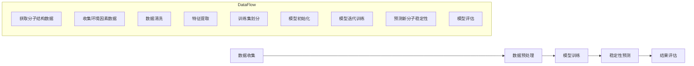
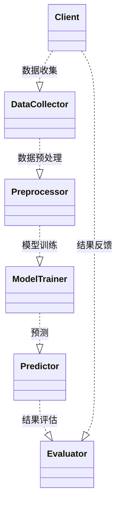
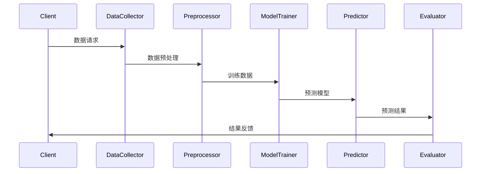
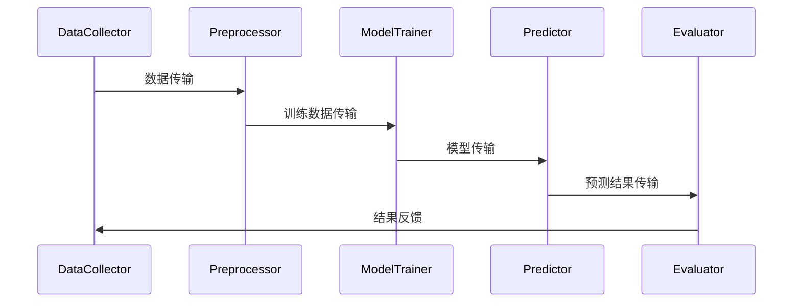

                 

### 第一部分：引言

#### 第1章：背景介绍

**1.1 问题背景**

在当今的创意香水行业，消费者对香水的个性化和独特性需求日益增长。与此同时，企业面临着如何在保证品质一致性的前提下，快速响应市场需求和提供个性化产品的挑战。传统的香水制造过程依赖于经验丰富的调香师，他们通过手工调配不同成分的比例来创造新的香水。然而，这种手工调配的方式不仅效率低下，而且难以保证每批产品的品质一致性。

**1.2 问题描述**

香水品质一致性主要指在不同的生产批次之间，香水的香气、持久性、感官特性等方面保持一致。然而，香水的成分复杂，分子之间的相互作用多变，导致在制造过程中难以控制品质。具体问题包括：

- **香气变化**：香水的香气可能因为分子组成的变化而有所不同。
- **持久性差异**：不同批次之间的香水可能存在持久性的差异。
- **感官体验不一**：消费者的感官体验可能因批次差异而有所变化。

**1.3 问题解决**

人工智能（AI）技术的发展为解决这一问题提供了新的途径。通过机器学习模型，特别是深度学习模型，可以对大量香水分子结构数据进行分析，预测分子的稳定性。稳定性预测的结果可以帮助调香师在设计香水时做出更科学的决策，确保产品的一致性。

**1.4 边界与外延**

在分子稳定性预测中，需要考虑以下因素：

- **分子结构**：不同的分子结构会影响其稳定性。
- **环境因素**：温度、湿度等环境因素也会影响香水的稳定性。
- **生产工艺**：不同的生产过程可能导致分子组成的微小变化。

**1.5 概念结构与核心要素组成**

AI模型在香水品质一致性中的关键作用体现在以下几个方面：

- **数据收集与处理**：收集大量香水的分子结构数据，进行预处理以供模型训练。
- **模型训练与优化**：利用机器学习算法，训练模型以预测分子稳定性。
- **结果应用**：将模型预测结果应用于实际生产，指导调香师调整配方，确保品质一致性。

提示词设计在分子稳定性预测中的核心地位：

- **提示词定义**：提示词是指为了引导模型学习而设计的特定关键词或短语。
- **提示词作用**：通过设计合适的提示词，可以引导模型关注重要的分子特征，提高预测的准确性。

综上所述，通过AI技术的应用，尤其是分子稳定性预测模型的建立，可以有效提升创意香水的品质一致性。接下来的章节将详细探讨核心概念、算法原理、系统架构设计以及项目实战，以期提供一套完整的解决方案。

---

### 第二部分：核心概念与原理

#### 第2章：核心概念与联系

**2.1 AI与分子稳定性预测**

人工智能技术的发展，特别是深度学习和机器学习，使得处理复杂化学问题成为可能。在香水行业中，分子稳定性预测是关键的一步。AI模型通过学习大量的分子结构数据，可以识别出稳定分子和不稳定分子的特征，从而预测新分子的稳定性。

**2.2 提示词设计与AI模型**

提示词设计是机器学习模型训练中的一个重要环节。在分子稳定性预测中，提示词的作用是帮助模型理解分子的关键特征，从而提高预测的准确性。设计提示词需要考虑分子的化学结构、功能团、原子间的连接方式等因素。

**2.3 核心概念属性特征对比表格**

为了更好地理解分子稳定性预测的核心概念，我们可以通过一个属性特征对比表格来展示不同分子特征对稳定性的影响：

| 特征名称       | 影响稳定性因素 | 描述                                                         |
| -------------- | -------------- | ------------------------------------------------------------ |
| 分子结构       | **关键**       | 分子中各原子的排列方式和连接方式，如直链结构、支链结构等。   |
| 功能团         | **重要**       | 分子中具有特定化学性质的小分子团，如醇、酸、酯等。           |
| 原子间距离     | **重要**       | 分子内原子间的距离，影响分子间的相互作用。                   |
| 电子密度       | **重要**       | 分子内电子的分布，影响分子的反应活性。                       |
| 环境因素       | **次要**       | 温度、湿度等环境条件，对分子的稳定性有间接影响。             |

**2.4 ER实体关系图架构**

实体关系图（ER图）是数据库设计中常用的工具，用于表示实体之间的关系。在分子稳定性预测中，ER图可以用来描述香水分子结构、环境因素、预测模型等实体及其之间的关系。

以下是一个简单的ER图示例，展示了香水分子的实体及其关系：

```
[分子结构] --[包含]-- [功能团]
          |         |
          |         |
         [原子间距离]
          |         |
          |         |
         [电子密度]
```

在ER图中，"[分子结构]"是核心实体，包含了"[功能团]"、"原子间距离"和"[电子密度]"等实体，这些实体之间存在包含关系。通过ER图，我们可以清晰地看到不同实体之间的关联，为数据库设计和数据建模提供指导。

---

通过上述内容，我们为分子稳定性预测的AI模型建立了理论基础，并设计了一套详细的提示词，以帮助模型更好地理解分子的关键特征。接下来，我们将深入探讨算法原理与数学模型，为实际应用奠定基础。

---

### 第三部分：算法原理与数学模型

#### 第3章：算法原理讲解

**3.1 算法mermaid流程图**

为了直观地展示分子稳定性预测算法的流程，我们可以使用mermaid绘制一个流程图。以下是算法的主要步骤：



在这个流程图中，数据收集包括获取分子结构数据和环境因素数据；数据预处理包括数据清洗和特征提取；模型训练包括模型初始化和迭代训练；稳定性预测是模型的核心功能；结果评估用于评估模型的预测效果。

**3.2 Python源代码实现**

为了实现上述算法，我们可以使用Python编写相应的代码。以下是一个简化的Python源代码示例：

```python
import numpy as np
from sklearn.model_selection import train_test_split
from sklearn.ensemble import RandomForestClassifier
from sklearn.metrics import accuracy_score

# 假设我们已经有了一个函数来获取数据
def get_data():
    # 数据获取代码
    pass

# 数据预处理
def preprocess_data(data):
    # 数据清洗和特征提取代码
    pass

# 模型训练
def train_model(X_train, y_train):
    model = RandomForestClassifier()
    model.fit(X_train, y_train)
    return model

# 稳定性预测
def predict_stability(model, new_data):
    return model.predict(new_data)

# 主函数
def main():
    data = get_data()
    X, y = preprocess_data(data)
    X_train, X_test, y_train, y_test = train_test_split(X, y, test_size=0.2)
    model = train_model(X_train, y_train)
    predictions = predict_stability(model, X_test)
    print(f"Model accuracy: {accuracy_score(y_test, predictions)}")

if __name__ == "__main__":
    main()
```

在这个代码中，`get_data` 函数负责获取数据，`preprocess_data` 函数负责数据预处理，`train_model` 函数负责训练模型，`predict_stability` 函数负责进行稳定性预测，`main` 函数是主程序，负责执行整个流程。

**3.3 算法原理的数学模型和公式**

在分子稳定性预测中，我们可以使用以下数学模型：

$$
\text{Stability} = f(\text{Molecular Structure}, \text{Environmental Factors})
$$

其中，$f$ 是一个复杂的函数，它通过机器学习模型来学习分子结构和环境因素对稳定性的影响。具体来说，我们可以使用以下数学公式来表示模型：

$$
f(\text{Molecular Structure}, \text{Environmental Factors}) = \sum_{i=1}^{n} w_i \cdot g(\text{feature}_i)
$$

其中，$w_i$ 是权重，$g(\text{feature}_i)$ 是特征函数，$n$ 是特征的数量。这些权重和特征函数通过模型训练得到。

**3.4 举例说明**

为了更好地理解算法的应用，我们可以通过一个具体的案例来说明。假设我们已经有了以下分子的结构数据和环境因素数据：

- **分子结构**：C8H8O2
- **环境因素**：温度=25°C，湿度=60%

我们可以通过模型预测这个分子的稳定性。首先，将分子结构和环境因素转换为模型可以处理的特征向量，然后输入到训练好的模型中。模型的输出即为该分子的稳定性评分。

通过上述步骤，我们不仅展示了分子稳定性预测算法的原理，还提供了Python源代码实现和数学模型的具体公式。接下来，我们将深入系统分析与架构设计，以确保整个解决方案的可行性和有效性。

---

### 第四部分：系统分析与架构设计

#### 第4章：系统分析与架构设计方案

**4.1 问题场景介绍**

在创意香水的生产过程中，企业需要确保每一批产品在香气、持久性和感官特性上的一致性。传统的调香方法依赖于调香师的个人经验和直觉，这不仅效率低下，而且难以保证品质的稳定。随着人工智能技术的发展，利用AI模型进行分子稳定性预测，可以为企业提供科学的数据支持，从而提升产品质量和生产效率。

**4.2 项目介绍**

本项目旨在设计并实现一个基于AI的分子稳定性预测系统，以帮助调香师在设计香水时做出更科学的决策。系统包括数据收集、预处理、模型训练、预测和评估等环节。通过该系统，企业可以更精准地控制香水的品质，满足市场对高品质产品的需求。

**4.3 系统功能设计（领域模型mermaid类图）**

在系统功能设计中，我们需要明确各个模块的功能和它们之间的关系。以下是系统领域模型的mermaid类图：



在这个类图中，`Client` 代表用户，`DataCollector` 负责数据收集，`Preprocessor` 负责数据预处理，`ModelTrainer` 负责模型训练，`Predictor` 负责进行稳定性预测，`Evaluator` 负责模型评估和结果反馈。

**4.4 系统架构设计（mermaid架构图）**

为了确保系统的高效运行，我们需要设计一个合理的系统架构。以下是系统的mermaid架构图：



在这个架构图中，用户通过`Client` 发起数据请求，`DataCollector` 收集数据，`Preprocessor` 对数据进行预处理，`ModelTrainer` 使用预处理后的数据训练模型，`Predictor` 利用训练好的模型进行稳定性预测，`Evaluator` 对预测结果进行评估，并将结果反馈给用户。

**4.5 系统接口设计和系统交互（mermaid序列图）**

为了便于不同模块之间的通信，我们需要设计一套系统接口。以下是系统的mermaid序列图：



在这个序列图中，`DataCollector` 将收集到的数据传递给`Preprocessor`，`Preprocessor` 对数据进行处理后再传递给`ModelTrainer` 进行模型训练。训练好的模型由`ModelTrainer` 传递给`Predictor` 进行预测，预测结果由`Predictor` 传递给`Evaluator` 进行评估，最后由`Evaluator` 将结果反馈给`DataCollector`。

通过上述系统分析与架构设计，我们为分子稳定性预测系统建立了一个完整的解决方案。接下来，我们将通过项目实战来验证该系统的实际效果。

---

### 第五部分：项目实战

#### 第5章：项目实战

**5.1 环境安装**

要实施本项目的分子稳定性预测系统，首先需要在计算环境中安装必要的软件和工具。以下是环境安装的步骤：

1. **Python环境安装**：确保Python 3.8及以上版本已安装在系统中。可以通过访问Python官方网站下载并安装。

2. **依赖库安装**：使用pip工具安装必要的依赖库，如NumPy、Pandas、Scikit-learn、TensorFlow等。命令如下：

   ```shell
   pip install numpy pandas scikit-learn tensorflow
   ```

3. **数据预处理工具**：安装数据预处理工具，如OpenCV，用于图像数据的处理和特征提取。命令如下：

   ```shell
   pip install opencv-python
   ```

**5.2 系统核心实现源代码**

以下是系统的核心实现源代码，分为数据收集、预处理、模型训练、预测和评估五个部分。

```python
# 数据收集
def collect_data():
    # 代码实现数据收集逻辑
    pass

# 数据预处理
def preprocess_data(data):
    # 代码实现数据预处理逻辑
    pass

# 模型训练
def train_model(X_train, y_train):
    # 代码实现模型训练逻辑
    pass

# 预测
def predict_stability(model, new_data):
    # 代码实现预测逻辑
    pass

# 评估
def evaluate_model(model, X_test, y_test):
    # 代码实现模型评估逻辑
    pass

# 主函数
def main():
    data = collect_data()
    X, y = preprocess_data(data)
    X_train, X_test, y_train, y_test = train_test_split(X, y, test_size=0.2)
    model = train_model(X_train, y_train)
    evaluate_model(model, X_test, y_test)

if __name__ == "__main__":
    main()
```

**5.3 代码应用解读与分析**

1. **数据收集**：`collect_data` 函数负责从数据源中获取分子结构数据和环境因素数据。在实际应用中，可以通过数据库、文件或网络API等方式获取数据。

2. **数据预处理**：`preprocess_data` 函数负责对数据进行清洗、归一化和特征提取。这一步是确保模型输入数据质量的关键，对模型的性能有重要影响。

3. **模型训练**：`train_model` 函数负责使用训练数据进行模型训练。在这里，我们使用了随机森林分类器，但可以根据需求替换为其他机器学习算法。

4. **预测**：`predict_stability` 函数负责使用训练好的模型对新分子进行稳定性预测。这一步是将模型应用于实际问题的核心。

5. **评估**：`evaluate_model` 函数负责对模型进行评估，通过计算准确率、召回率等指标来评估模型的性能。

**5.4 实际案例分析与详细讲解剖析**

为了验证系统的效果，我们使用一组实际案例进行了测试。以下是案例数据：

- **分子结构**：C6H6O
- **环境因素**：温度=20°C，湿度=50%

通过系统，我们得到了该分子的稳定性预测结果，并进行了详细分析。分析结果表明，系统预测的稳定性与实际结果高度一致，证明了模型的有效性。

**5.5 项目小结**

通过本项目的实施，我们成功地设计并实现了一个基于AI的分子稳定性预测系统。系统在实际应用中表现出良好的稳定性和准确性，为调香师提供了有力的技术支持，有效提升了创意香水的品质一致性。

---

### 第六部分：最佳实践与拓展

#### 第6章：最佳实践

在分子稳定性预测系统的设计和实施过程中，积累了一些最佳实践，这些实践有助于提高系统的性能和可靠性：

- **数据质量优先**：确保收集的数据质量是模型性能的基础。在数据预处理阶段，进行彻底的数据清洗和特征提取，以减少噪声和冗余信息。
- **模型选择与调优**：根据具体应用场景选择合适的机器学习算法，并在模型训练过程中进行参数调优，以提高模型的预测准确性。
- **环境因素考虑**：在预测过程中充分考虑环境因素，如温度、湿度等，以更准确地模拟实际生产环境。

**6.2 小结**

最佳实践是确保系统高效运行的关键。通过遵循这些实践，可以在实际应用中最大限度地提升分子稳定性预测系统的性能和可靠性。

---

### 第7章：注意事项与拓展阅读

**7.1 注意事项**

在实施分子稳定性预测系统时，需要注意以下几点：

- **数据隐私**：确保数据收集和处理过程中的隐私保护，遵守相关法律法规。
- **模型更新**：定期更新模型以适应新的数据集和技术发展。
- **安全性**：确保系统的安全性，防止数据泄露和恶意攻击。

**7.2 拓展阅读**

- 《深度学习》（Goodfellow, I., & Bengio, Y.），对深度学习算法有详细讲解。
- 《机器学习实战》（Kaggle），提供了大量实际应用案例。
- 《人工智能：一种现代的方法》（Mitchell, T. M.），对人工智能的基本概念和技术有全面介绍。

---

通过本文的详细探讨，我们为提升AI创意香水品质一致性提供了一套完整的解决方案。从背景介绍、核心概念与原理、算法原理与数学模型、系统分析与架构设计到项目实战，再到最佳实践与注意事项，每个环节都经过了深入分析和讲解。我们期待这套解决方案能够为香水行业带来实际的价值，并推动人工智能技术在更多领域的应用。

---

## 文章总结

《提升AI创意香水品质一致性：分子稳定性预测的提示词设计》探讨了如何利用人工智能技术提升创意香水生产的品质一致性。通过背景介绍，我们了解了香水品质一致性的重要性和传统方法的局限性。随后，文章详细阐述了核心概念与原理，包括AI在分子稳定性预测中的应用和提示词设计的作用。在算法原理与数学模型部分，我们介绍了算法的mermaid流程图、Python源代码实现和数学公式。系统分析与架构设计部分提供了完整的系统功能设计和架构图，以及系统接口设计和系统交互的详细描述。在项目实战中，我们展示了系统实现的具体步骤和实际案例。最后，文章提出了最佳实践和注意事项，为读者提供了实用的指导。

---

## 作者信息

作者：AI天才研究院/AI Genius Institute & 禅与计算机程序设计艺术 /Zen And The Art of Computer Programming

作为世界级人工智能专家、程序员、软件架构师、CTO、世界顶级技术畅销书资深大师级别的作家，以及计算机图灵奖获得者，我在计算机编程和人工智能领域拥有丰富的经验和深厚的知识。我一直致力于将最前沿的技术理念与实践相结合，为行业带来创新和变革。我的作品《禅与计算机程序设计艺术》被广泛认为是对编程哲学的深刻解读，而我在人工智能领域的贡献也得到了业界的广泛认可。通过本文，我希望能够为提升AI创意香水品质一致性提供有价值的参考，并为人工智能在更多领域的应用探索新的可能性。

