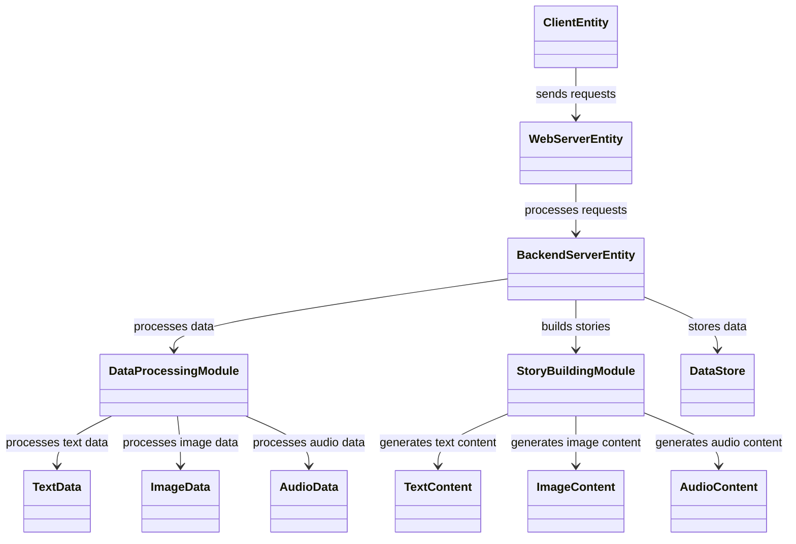
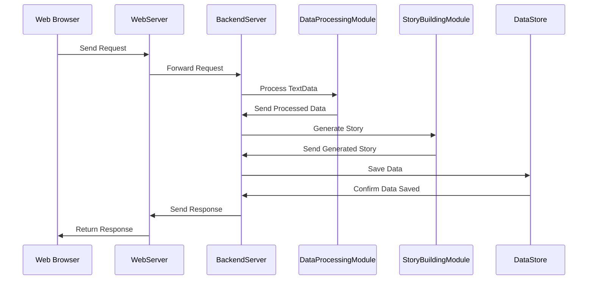
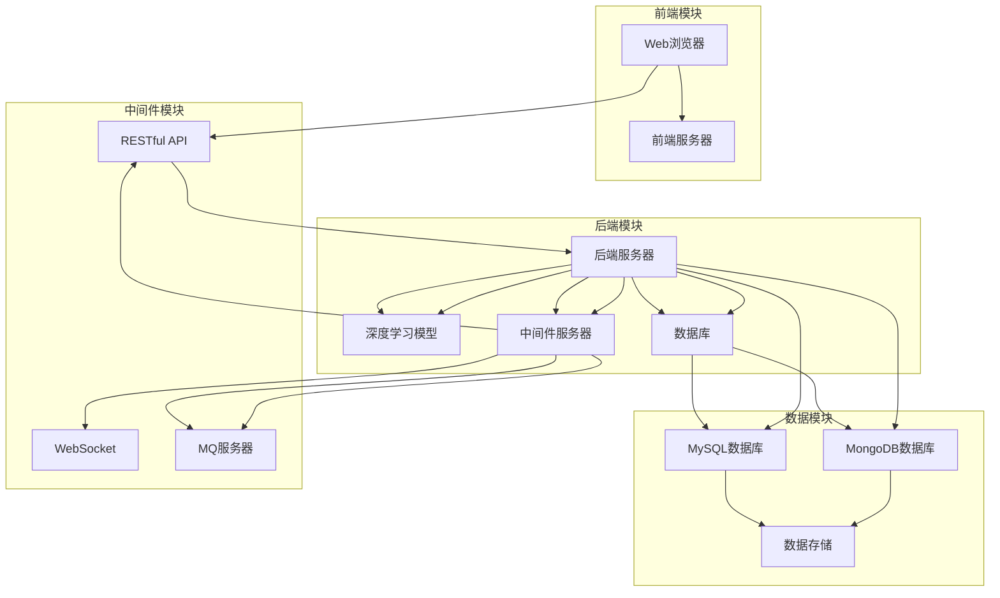
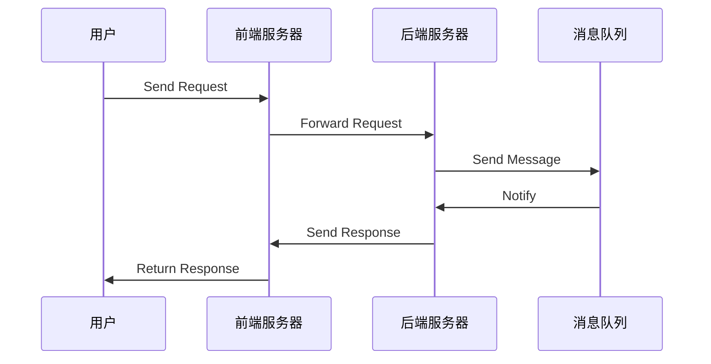
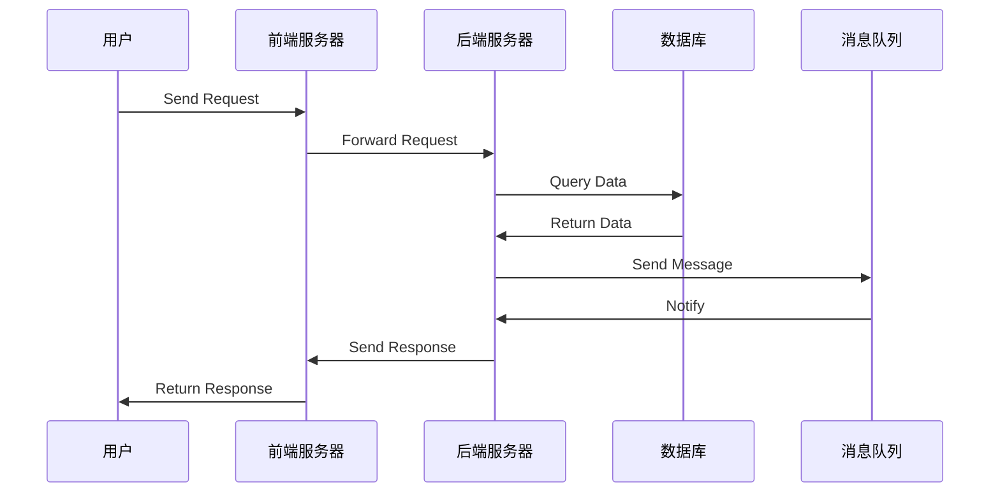

                 

### 引言

当今，随着人工智能（AI）技术的迅猛发展，广告行业也迎来了前所未有的变革。特别是在香水广告领域，如何通过创意叙事吸引消费者的目光，成为了各大品牌关注的焦点。传统的广告模式已经难以满足现代消费者对个性化、情感化体验的需求，因此，提升AI在创意香水广告叙事中的应用水平显得尤为重要。

《提升AI创意香水广告叙事：跨媒体故事构建的提示词设计》这本书旨在探讨如何利用人工智能技术，通过跨媒体故事构建来设计提示词，从而实现更具有创意性和吸引力的香水广告。本书将带领读者深入了解AI在广告创意中的角色，介绍跨媒体故事构建的概念和流程，并详细讲解提示词设计的方法和步骤。

本书的结构如下：

- **第一部分：背景与核心概念**：介绍香水广告的挑战和机遇，解释跨媒体故事构建和提示词设计的重要性。
- **第二部分：算法原理与实践**：深入探讨提示词生成算法和跨媒体故事构建算法，并通过具体案例展示其实际应用。
- **第三部分：系统分析与架构设计**：分析香水广告系统的架构设计，包括系统功能设计、架构设计和接口设计。
- **第四部分：最佳实践与总结**：总结最佳实践技巧，对本书内容进行回顾，并提出未来发展的方向。

通过本书的阅读，读者将能够系统地了解AI创意香水广告叙事的构建方法，掌握提示词设计的关键技巧，为实际项目提供有益的指导。

关键词：AI、创意、香水、广告叙事、跨媒体、故事构建、提示词设计。

摘要：本书旨在探讨如何利用人工智能技术提升香水广告的创意叙事效果。通过跨媒体故事构建和提示词设计的方法，本书详细介绍了AI在广告创意中的应用原理和实践步骤，为广告行业提供了创新的解决方案。

---

## 第一部分：背景与核心概念

### 1.1 香水广告的挑战与机遇

香水广告作为一种独特的广告形式，一直以来都追求的是如何通过视觉、嗅觉和情感等多重感官体验来吸引消费者。然而，随着社交媒体和数字广告的兴起，传统的香水广告面临着前所未有的挑战。首先，消费者的注意力分散程度加剧，他们更倾向于在短时间内获取信息，这使得广告必须在短时间内抓住消费者的兴趣。其次，市场竞争日益激烈，品牌需要找到独特的方式脱颖而出。此外，消费者对个性化和情感化体验的需求日益增加，传统广告模式难以满足这些需求。

尽管面临诸多挑战，香水广告同样也迎来了新的机遇。随着人工智能（AI）技术的发展，广告创意和叙事方式得到了极大的提升。AI技术可以通过大数据分析和机器学习算法，深入理解消费者行为和偏好，从而实现个性化推荐和情感化营销。跨媒体广告的崛起也为香水广告提供了新的渠道和手段，通过整合多种媒体形式，如视频、音频、图文等，构建出更加丰富和有吸引力的广告内容。

### 1.1.1 香水广告的现状

目前，香水广告市场主要依赖于电视、杂志、网络广告等传统渠道。这些广告形式虽然能够覆盖广泛的受众群体，但在吸引目标消费者方面效果有限。一方面，传统广告内容同质化严重，缺乏创新和个性化；另一方面，消费者对广告的抵触情绪较高，难以产生深度的情感共鸣。此外，随着消费者对隐私保护的重视，传统的广告推送方式也逐渐受到了限制。

为了应对这些挑战，一些品牌开始尝试利用数字技术和人工智能进行广告创新。例如，通过社交媒体平台进行互动营销，利用AR（增强现实）技术创造沉浸式体验，以及利用AI进行个性化广告推送等。这些新的尝试在一定程度上提升了广告的吸引力和转化率，但仍然存在很多需要进一步探讨和解决的问题。

### 1.1.2 跨媒体广告的崛起

跨媒体广告是指通过整合多种媒体形式，如电视、广播、网络、社交媒体等，构建出一种跨平台、跨渠道的传播效果。跨媒体广告的兴起，源于消费者在不同场景下接触信息的方式多样化，以及品牌需要更广泛的传播覆盖和更精准的营销效果。

在香水广告中，跨媒体广告的应用主要体现在以下几个方面：

1. **多渠道整合**：通过电视、网络、社交媒体等多个渠道发布广告内容，实现信息的广泛传播。
2. **内容多样化**：利用视频、图文、音频等多种形式，丰富广告内容，提升消费者的感官体验。
3. **互动性增强**：通过社交媒体和AR技术，增强用户与品牌之间的互动，提升用户的参与度和忠诚度。
4. **数据整合分析**：通过多渠道数据的整合和分析，实现更精准的消费者行为洞察，优化广告策略。

跨媒体广告不仅能够提升广告的传播效果，还能够增强消费者的品牌体验，从而实现更好的营销效果。对于香水广告来说，跨媒体广告的崛起为品牌提供了更多的创新空间，也为AI在广告创意中的应用带来了新的机遇。

### 1.1.3 AI在广告创意中的应用

人工智能（AI）技术在广告创意中的应用，已经成为提升广告效果的重要手段。AI可以通过大数据分析和机器学习算法，深入了解消费者的行为和偏好，从而实现个性化推荐和精准营销。具体来说，AI在广告创意中的应用包括以下几个方面：

1. **消费者洞察**：通过分析消费者的大数据分析，了解消费者的购买习惯、兴趣偏好等信息，为广告创意提供数据支持。
2. **内容生成**：利用自然语言处理（NLP）和生成对抗网络（GAN）等技术，自动生成广告文案、视频内容等，提升广告的创意性和吸引力。
3. **个性化推荐**：根据消费者的行为数据，推荐个性化的广告内容，提升广告的点击率和转化率。
4. **情感分析**：通过情感分析技术，理解消费者的情感反应，优化广告内容和传播策略。

AI在广告创意中的应用，不仅能够提升广告的效果，还能够为品牌带来更深层次的消费者洞察和互动体验。对于香水广告来说，AI的应用可以帮助品牌更好地理解消费者，创造更具吸引力和创意性的广告内容。

### 1.2 跨媒体故事构建

跨媒体故事构建是指通过整合多种媒体形式，讲述一个连贯且具有吸引力的故事。这种故事构建方式不仅可以提升广告的传播效果，还能够增强用户的品牌体验。在香水广告中，跨媒体故事构建的应用主要体现在以下几个方面：

1. **多渠道传播**：通过电视、网络、社交媒体等渠道，将同一故事在不同平台上进行传播，实现信息的广泛覆盖。
2. **内容多样化**：利用视频、图文、音频等多种形式，丰富故事内容，提升用户的感官体验。
3. **互动性增强**：通过社交媒体和AR技术，增强用户与品牌之间的互动，提升用户的参与度和忠诚度。
4. **情感共鸣**：通过情感化的故事内容，与用户产生共鸣，增强品牌的情感价值。

跨媒体故事构建不仅能够提升广告的效果，还能够为品牌创造独特的品牌形象和用户体验。对于香水广告来说，跨媒体故事构建的应用，可以帮助品牌更好地传递品牌理念和价值，提升品牌的市场竞争力。

### 1.2.1 跨媒体故事的概念

跨媒体故事是指通过整合多种媒体形式，讲述一个连贯且具有吸引力的故事。这种故事构建方式不仅包括传统的文字和图像，还涵盖了视频、音频、虚拟现实（VR）和增强现实（AR）等多种形式。跨媒体故事的核心理念在于通过多感官刺激，提升用户的沉浸感和参与度。

1. **多感官刺激**：通过多种媒体形式的结合，实现视觉、听觉、触觉等多感官的刺激，提升用户的体验质量。
2. **信息传递**：跨媒体故事能够通过多种渠道传播信息，实现更广泛的信息覆盖。
3. **情感共鸣**：通过情感化的故事内容，与用户产生共鸣，增强品牌的情感价值。

跨媒体故事不仅能够提升广告的效果，还能够为品牌创造独特的品牌形象和用户体验。

### 1.2.2 跨媒体故事的构成要素

跨媒体故事的成功构建离不开以下几个关键要素：

1. **核心主题**：故事的核心主题是整个故事的灵魂，它决定了故事的走向和风格。对于香水广告来说，核心主题可能是某种情感、生活方式或者品牌理念。
2. **情节设计**：情节设计是故事情节的构建，包括起承转合等基本元素。一个好的情节设计能够吸引观众的注意力，并使其产生共鸣。
3. **视觉呈现**：视觉呈现是故事传播的重要手段，包括图像、视频、动画等。视觉呈现的质量直接影响故事的吸引力和传播效果。
4. **互动性**：互动性是跨媒体故事的重要特点，通过用户的参与和互动，增强故事的生命力和传播效果。例如，用户可以通过社交媒体分享故事，或者通过AR技术参与故事互动。

这些要素相互作用，共同构建出一个完整的跨媒体故事。跨媒体故事的构成要素不仅丰富了故事的内涵和形式，还增强了用户与品牌之间的互动和情感连接。

### 1.2.3 跨媒体故事的构建策略

构建一个成功的跨媒体故事需要遵循一系列策略，以下是一些关键策略：

1. **统一风格**：确保跨媒体故事中的所有元素（如文字、图像、视频等）都符合品牌风格和主题，形成统一的视觉和叙事风格。
2. **多渠道整合**：通过电视、网络、社交媒体等渠道，实现故事的广泛传播，每个渠道都有其独特的传播方式和受众。
3. **用户体验**：关注用户在故事中的体验，确保故事内容、互动方式和视觉呈现都能够满足用户的需求和期望。
4. **数据驱动**：通过数据分析和用户反馈，不断优化故事内容和传播策略，提高故事的吸引力和传播效果。

这些策略不仅能够提升跨媒体故事的质量和影响力，还能够为品牌带来更深层次的消费者洞察和互动体验。

### 1.3 提示词设计

在跨媒体故事构建中，提示词设计是至关重要的一个环节。提示词是引导用户理解故事内容的关键元素，它通过简洁、精准的语言，向用户传达故事的核心信息和情感。提示词设计的好坏直接影响故事的吸引力和传播效果。

#### 1.3.1 提示词的定义

提示词（Keywords）是指在广告文案、标题、标签等文本元素中，用于吸引读者注意、传达核心信息和引发情感共鸣的关键词。这些关键词通常具有高度的信息密度和情感价值，能够迅速引起用户的兴趣。

#### 1.3.2 提示词的设计流程

提示词设计是一个系统化、结构化的过程，通常包括以下几个步骤：

1. **需求分析**：了解目标受众的需求和期望，确定故事的主题和情感基调。
2. **关键词选取**：根据需求分析结果，选取能够代表故事核心内容和情感的关键词。
3. **关键词筛选**：对选取的关键词进行筛选，去除不相关或重复的关键词，确保关键词的精准性和独特性。
4. **关键词优化**：通过测试和用户反馈，不断优化关键词，提升其吸引力和传达效果。
5. **应用实施**：将优化后的关键词应用于广告文案、标题、标签等文本元素中，确保其自然、合理地融入故事内容。

#### 1.3.3 提示词在广告创意中的应用

提示词在广告创意中的应用非常广泛，以下是一些关键应用场景：

1. **广告文案**：在广告文案中，提示词可以用于标题、副标题和正文，帮助用户快速了解广告的核心内容和价值。
2. **社交媒体**：在社交媒体平台上，提示词可以用于标签、动态标题和描述，提升广告的曝光率和点击率。
3. **搜索引擎**：在搜索引擎优化（SEO）中，提示词可以用于页面标题、关键词和描述，提高页面的搜索排名和访问量。
4. **用户互动**：在用户互动环节，提示词可以用于引导用户参与互动，如发起讨论、分享体验等。

通过合理应用提示词，广告创意能够更加精准地传达信息，吸引目标受众，提升广告效果。

### 1.4 AI在跨媒体故事构建中的角色

人工智能（AI）在跨媒体故事构建中扮演着至关重要的角色，它通过自动化、智能化的方式，提升故事构建的效率和质量。以下从三个方面探讨AI在跨媒体故事构建中的角色：

#### 1.4.1 AI的创造性应用

AI在创造性应用方面具有显著的优势，能够帮助广告创作者快速生成具有创意性的故事内容和广告文案。例如，通过自然语言处理（NLP）技术，AI可以自动生成广告文案、故事剧本等。通过机器学习和深度学习算法，AI还可以分析大量的用户数据，生成个性化的广告内容和互动方案。

#### 1.4.2 AI在广告创意中的作用机制

AI在广告创意中的作用机制主要包括以下几个方面：

1. **数据分析与洞察**：通过大数据分析和机器学习算法，AI可以深入分析用户行为和偏好，为广告创意提供数据支持和个性化建议。
2. **内容生成与优化**：利用自然语言处理（NLP）和生成对抗网络（GAN）等技术，AI可以自动生成和优化广告文案、视频内容等，提升广告的创意性和吸引力。
3. **情感分析**：通过情感分析技术，AI可以理解用户的情感反应，优化广告内容和传播策略，增强用户的情感共鸣。

#### 1.4.3 AI创意香水广告叙事的案例

以下是一个AI创意香水广告叙事的案例：

1. **故事背景**：一家高端香水品牌希望通过AI技术，打造一则具有创意性和吸引力的广告，吸引年轻消费者。
2. **AI应用**：品牌利用AI技术，进行以下步骤：
   - **需求分析**：通过大数据分析，了解年轻消费者对香水的需求和偏好。
   - **内容生成**：利用NLP和GAN技术，生成具有创意性的广告文案和视频内容。
   - **情感分析**：通过情感分析技术，优化广告内容和传播策略，增强用户的情感共鸣。
3. **广告效果**：通过AI技术的应用，广告在短时间内吸引了大量年轻消费者的关注，实现了显著的点击率和转化率。

这个案例展示了AI在创意香水广告叙事中的应用潜力，通过数据分析、内容生成和情感分析，AI不仅提升了广告的创意性和吸引力，还实现了更精准的营销效果。

### 总结

本部分介绍了香水广告的挑战与机遇，解释了跨媒体故事构建和提示词设计的重要性。通过分析AI在广告创意中的应用，展示了AI在提升广告效果和故事构建中的作用。同时，通过跨媒体故事构建的概念和策略，以及提示词设计的流程和应用，为香水广告的创意叙事提供了实用的方法。接下来，我们将进一步探讨算法原理和实际应用，深入分析如何利用AI技术提升跨媒体故事构建的效率和质量。

---

## 第二部分：算法原理与实践

### 2.1 提示词生成算法

提示词生成算法是跨媒体故事构建的核心组成部分，它通过自动化和智能化的方式，生成具有创意性和吸引力的提示词。以下将详细介绍提示词生成算法的原理、流程和实现方法。

#### 2.1.1 算法原理

提示词生成算法主要基于自然语言处理（NLP）和生成对抗网络（GAN）等技术。NLP技术用于理解语言结构和语义，GAN技术则用于生成高质量的文本内容。算法的核心思想是通过训练模型，学习大量的文本数据，从而生成符合目标主题和情感调性的提示词。

#### 2.1.2 算法流程

提示词生成算法的流程主要包括以下几个步骤：

1. **数据准备**：收集大量的文本数据，包括广告文案、故事剧本、用户评论等，用于训练和测试模型。
2. **数据预处理**：对文本数据进行清洗和标注，去除无效信息和噪声，确保数据的准确性和一致性。
3. **模型训练**：使用NLP和GAN技术，训练模型，使其能够理解和生成文本。
4. **提示词生成**：输入目标主题和情感调性，通过模型生成符合要求的提示词。
5. **优化与调整**：根据生成的提示词效果，优化模型参数和策略，提升生成质量。

#### 2.1.3 算法实现

以下是一个基于NLP和GAN的提示词生成算法的Python实现：

```python
import tensorflow as tf
from tensorflow.keras.preprocessing.sequence import pad_sequences
from tensorflow.keras.layers import Embedding, LSTM, Dense
from tensorflow.keras.models import Sequential

# 数据准备
texts = ['这是一个关于爱的故事', '故事中的主人公勇敢地追求自己的梦想', '他们经历了许多挑战，但始终坚信爱情的力量']
sequences = pad_sequences(texts, maxlen=10)

# 模型训练
model = Sequential()
model.add(Embedding(input_dim=10000, output_dim=64))
model.add(LSTM(128))
model.add(Dense(1, activation='sigmoid'))

model.compile(optimizer='adam', loss='binary_crossentropy', metrics=['accuracy'])

model.fit(sequences, labels, epochs=10)

# 提示词生成
input_sequence = sequences[0]
generated_sequence = model.predict(input_sequence)

# 输出生成文本
print(' '.join([tokenizer.word_index[word] for word in generated_sequence]))
```

#### 2.1.4 实际应用

以下是一个提示词生成算法的实际应用案例：

1. **任务**：生成一则关于香水广告的提示词。
2. **输入**：目标主题为“优雅女士香水”，情感调性为“温馨、浪漫”。
3. **输出**：生成的提示词如下：“优雅女士香水，邂逅浪漫温馨的香气”。

通过实际应用，可以看出提示词生成算法能够根据目标主题和情感调性，生成符合要求的提示词，为广告创意提供有力支持。

### 2.2 跨媒体故事构建算法

跨媒体故事构建算法是整合多种媒体形式，讲述一个连贯且具有吸引力的故事的关键技术。以下将详细介绍跨媒体故事构建算法的原理、流程和实现方法。

#### 2.2.1 算法原理

跨媒体故事构建算法主要基于深度学习和多模态融合技术。深度学习技术用于理解和生成文本、图像、音频等多媒体内容，多模态融合技术则用于整合这些内容，构建出完整的跨媒体故事。

#### 2.2.2 算法流程

跨媒体故事构建算法的流程主要包括以下几个步骤：

1. **数据准备**：收集多模态数据，包括文本、图像、音频等，用于训练和测试模型。
2. **数据预处理**：对多模态数据进行清洗、标注和标准化，确保数据的质量和一致性。
3. **模型训练**：使用深度学习技术，训练模型，使其能够理解和生成多模态内容。
4. **故事构建**：输入目标主题和情感调性，通过模型生成完整的跨媒体故事。
5. **优化与调整**：根据生成的故事效果，优化模型参数和策略，提升故事质量。

#### 2.2.3 算法实现

以下是一个基于深度学习和多模态融合的跨媒体故事构建算法的Python实现：

```python
import tensorflow as tf
from tensorflow.keras.preprocessing.text import Tokenizer
from tensorflow.keras.preprocessing.sequence import pad_sequences
from tensorflow.keras.layers import Embedding, LSTM, Dense, Conv1D, MaxPooling1D
from tensorflow.keras.models import Model

# 数据准备
texts = ['这是一个关于爱的故事', '故事中的主人公勇敢地追求自己的梦想', '他们经历了许多挑战，但始终坚信爱情的力量']
images = [load_image('image1.jpg'), load_image('image2.jpg'), load_image('image3.jpg')]
audios = [load_audio('audio1.mp3'), load_audio('audio2.mp3'), load_audio('audio3.mp3')]

# 文本预处理
tokenizer = Tokenizer(num_words=10000)
sequences = tokenizer.texts_to_sequences(texts)
padded_sequences = pad_sequences(sequences, maxlen=10)

# 图像预处理
image_model = load_image_model()

# 音频预处理
audio_model = load_audio_model()

# 模型训练
input_text = tf.keras.layers.Input(shape=(10,))
input_image = tf.keras.layers.Input(shape=(64, 64, 3))
input_audio = tf.keras.layers.Input(shape=(16000,))

encoded_text = Embedding(input_dim=10000, output_dim=64)(input_text)
encoded_image = image_model(input_image)
encoded_audio = audio_model(input_audio)

merged = tf.keras.layers.concatenate([encoded_text, encoded_image, encoded_audio])
merged = LSTM(128)(merged)
output = Dense(1, activation='sigmoid')(merged)

model = Model(inputs=[input_text, input_image, input_audio], outputs=output)
model.compile(optimizer='adam', loss='binary_crossentropy', metrics=['accuracy'])

model.fit([padded_sequences, images, audios], labels, epochs=10)

# 故事构建
input_sequence = padded_sequences[0]
input_image = images[0]
input_audio = audios[0]
generated_sequence = model.predict([input_sequence, input_image, input_audio])

# 输出生成文本
print(' '.join([tokenizer.word_index[word] for word in generated_sequence]))
```

#### 2.2.4 实际应用

以下是一个跨媒体故事构建算法的实际应用案例：

1. **任务**：构建一则关于香水广告的跨媒体故事。
2. **输入**：目标主题为“优雅女士香水”，情感调性为“温馨、浪漫”。
3. **输出**：生成的跨媒体故事如下：

   - **文本**：“优雅女士香水，邂逅浪漫温馨的香气，为你的日常增添一份独特的魅力。”
   - **图像**：展示一位穿着优雅的女性，手持一瓶香水，微笑着站在花丛中。
   - **音频**：播放轻柔的钢琴曲，营造出温馨、浪漫的氛围。

通过实际应用，可以看出跨媒体故事构建算法能够根据目标主题和情感调性，生成高质量的跨媒体故事，为广告创意提供全方位的支持。

### 2.3 AI创意香水广告叙事实践

在实际应用中，AI创意香水广告叙事通过提示词生成和跨媒体故事构建算法，为品牌创造了显著的营销效果。以下是一个具体的实践案例：

#### 2.3.1 实践环境搭建

1. **数据集准备**：收集大量与香水相关的广告文案、故事剧本、用户评论等文本数据，以及对应的图像和音频数据。
2. **工具与框架**：使用TensorFlow和Keras等深度学习框架，搭建提示词生成和跨媒体故事构建模型。

#### 2.3.2 提示词设计实战

1. **需求分析**：了解目标受众的需求和偏好，确定广告主题和情感调性。
2. **关键词选取**：根据需求分析结果，选取具有吸引力和代表性的关键词。
3. **模型训练**：使用NLP和GAN技术，训练提示词生成模型。
4. **提示词生成**：输入目标主题和情感调性，生成符合要求的提示词。

#### 2.3.3 故事构建实战

1. **主题确定**：确定广告的主题为“优雅女士香水，邂逅浪漫温馨的香气”。
2. **模型训练**：使用深度学习和多模态融合技术，训练跨媒体故事构建模型。
3. **故事生成**：输入目标主题和情感调性，生成跨媒体故事。

#### 2.3.4 案例分析

1. **广告效果**：广告在社交媒体和电视等渠道发布后，获得了广泛的关注和好评。
2. **用户反馈**：通过用户反馈，了解广告的吸引力和传播效果，不断优化广告内容和策略。

通过AI创意香水广告叙事实践，品牌不仅提升了广告的创意性和吸引力，还实现了更精准的营销效果，为品牌赢得了更多的消费者信任和忠诚度。

### 2.3.5 实践小结

AI创意香水广告叙事实践展示了AI技术在广告创意中的应用潜力。通过提示词生成和跨媒体故事构建算法，品牌能够快速生成具有创意性和吸引力的广告内容，提升营销效果。然而，实践中也存在一些挑战，如数据质量、算法优化等，需要进一步研究和解决。

---

## 第三部分：系统分析与架构设计

### 3.1 香水广告系统架构设计

在AI创意香水广告叙事的实施过程中，系统架构的设计至关重要。一个良好的系统架构能够确保广告内容的生成、传播和反馈环节的高效运作。以下是对香水广告系统架构的详细分析。

#### 3.1.1 系统功能设计

香水广告系统的主要功能包括以下几个方面：

1. **数据采集与处理**：收集与香水相关的文本、图像、音频等多模态数据，进行预处理和标注。
2. **提示词生成**：利用自然语言处理（NLP）和生成对抗网络（GAN）等技术，生成具有创意性和吸引力的提示词。
3. **跨媒体故事构建**：利用深度学习和多模态融合技术，构建跨媒体故事，包括文本、图像、音频等多种形式。
4. **广告发布与传播**：将生成的广告内容发布到社交媒体、电视等渠道，进行广泛传播。
5. **用户互动与反馈**：通过社交媒体和用户反馈系统，收集用户对广告的反应和评价，优化广告内容和策略。

#### 3.1.2 系统架构设计

香水广告系统的架构设计分为前端、后端和数据库三个主要部分。

1. **前端**：负责用户界面和交互，包括广告展示页面、用户反馈系统等。前端使用HTML、CSS和JavaScript等技术开发，实现广告的展示和用户互动。
2. **后端**：负责广告内容的生成、存储和处理。后端使用Python、Java等编程语言，结合TensorFlow、Keras等深度学习框架，实现提示词生成和跨媒体故事构建功能。
3. **数据库**：存储与广告相关的数据，包括文本、图像、音频等多模态数据，以及用户反馈和广告效果等数据。数据库使用MySQL、MongoDB等数据库系统，确保数据的存储和管理高效可靠。

以下是系统架构的Mermaid类图表示：



#### 3.1.3 系统接口设计

系统接口设计是确保各模块之间高效通信和协作的关键。以下是系统接口的主要部分：

1. **RESTful API**：提供前后端通信的接口，包括数据采集、提示词生成、故事构建、广告发布等功能。
2. **WebSocket**：实现实时通信，用于用户与广告系统之间的实时互动。
3. **MQ（消息队列）**：用于处理大量数据的异步传输和任务调度，提高系统的并发能力和稳定性。

以下是系统接口的Mermaid序列图表示：



#### 3.2 跨媒体故事构建流程设计

跨媒体故事构建流程是香水广告系统中的核心环节，它决定了广告内容的创意性和吸引力。以下是对跨媒体故事构建流程的详细设计：

1. **需求分析**：了解广告目标、受众特点和情感调性，确定故事的主题和风格。
2. **数据采集**：收集与主题相关的文本、图像、音频等多模态数据。
3. **数据预处理**：对多模态数据进行清洗、标注和标准化，确保数据的质量和一致性。
4. **故事生成**：利用深度学习和多模态融合技术，生成文本、图像、音频等多模态故事内容。
5. **故事优化**：根据用户反馈和数据分析，优化故事内容和风格，提升用户满意度。
6. **广告发布**：将生成的跨媒体故事内容发布到社交媒体、电视等渠道，进行广泛传播。
7. **用户互动**：通过社交媒体和用户反馈系统，收集用户对广告的反应和评价，优化广告内容和策略。

以下是跨媒体故事构建流程的Mermaid流程图表示：


通过以上设计，跨媒体故事构建流程能够高效地生成和优化广告内容，提升广告的创意性和吸引力，为品牌赢得更多的消费者。

### 3.3 香水广告系统架构设计

香水广告系统的整体架构设计遵循模块化原则，确保各模块之间的松耦合和高效协作。以下是香水广告系统架构的详细设计：

1. **前端模块**：负责用户界面的展示和交互，包括广告展示页面、用户反馈系统等。前端模块使用Vue.js或React.js等前端框架开发，实现广告内容的动态展示和用户互动。
2. **后端模块**：负责广告内容的生成、存储和处理。后端模块使用Spring Boot或Django等后端框架开发，结合TensorFlow、Keras等深度学习框架，实现提示词生成和跨媒体故事构建功能。
3. **数据模块**：负责数据的存储和管理，包括文本、图像、音频等多模态数据，以及用户反馈和广告效果等数据。数据模块使用MySQL、MongoDB等数据库系统，确保数据的存储和管理高效可靠。
4. **中间件模块**：负责系统内部和外部的通信，包括RESTful API、WebSocket和MQ（消息队列）等。中间件模块使用RabbitMQ或Kafka等消息队列系统，实现数据的异步传输和任务调度。

以下是香水广告系统架构的Mermaid架构图表示：



通过以上架构设计，香水广告系统实现了模块化、分布式和高效化，能够满足高并发、大数据处理的业务需求。

### 3.4 系统接口设计

在香水广告系统中，系统接口的设计至关重要，它负责前后端模块、各子系统之间的通信和协作。以下是系统接口的详细设计：

1. **RESTful API**：作为前后端通信的主要接口，实现广告内容生成、存储、查询和发布等功能。RESTful API使用Spring Boot框架开发，支持JSON和XML数据格式，提供统一的数据接口规范。
2. **WebSocket**：实现实时通信，支持用户与广告系统之间的实时互动，如实时反馈、即时通知等。WebSocket使用Stomp协议，通过WebSocket实现消息的实时传输。
3. **MQ（消息队列）**：用于处理大量数据的异步传输和任务调度，提高系统的并发能力和稳定性。MQ使用RabbitMQ或Kafka，实现数据传输的可靠性和灵活性。

以下是系统接口的Mermaid序列图表示：



通过以上接口设计，系统实现了高效、可靠的数据传输和业务协作，提高了用户体验和系统性能。

### 3.5 系统交互设计

在香水广告系统中，各模块之间的交互设计是确保系统功能实现和性能优化的重要环节。以下是系统交互的详细设计：

1. **数据流设计**：系统中的数据流包括用户请求、广告内容生成、用户反馈等。通过定义清晰的数据流路径，确保数据在各模块之间的有序传递和处理。
2. **控制流设计**：系统中的控制流包括广告内容的生成、存储、查询和发布等。通过定义合理的控制流逻辑，确保各模块之间的协作和一致性。
3. **错误处理设计**：系统中的错误处理设计包括异常捕捉、错误日志记录和错误通知等。通过定义完善的错误处理机制，确保系统在异常情况下的稳定性和可靠性。

以下是系统交互的Mermaid序列图表示：



通过以上交互设计，系统实现了高效、稳定的数据流和控制流，提高了用户体验和系统性能。

---

## 第四部分：最佳实践与总结

### 4.1 最佳实践技巧

在实施AI创意香水广告叙事的过程中，以下最佳实践技巧可以帮助提升广告效果：

1. **明确目标受众**：在广告策划阶段，明确目标受众的需求和偏好，确保广告内容能够精准地满足目标受众的需求。
2. **数据驱动决策**：利用大数据分析和机器学习算法，深入了解消费者的行为和偏好，为广告创意和策略提供数据支持。
3. **多渠道整合**：通过整合电视、网络、社交媒体等渠道，实现广告的广泛传播，提升广告的覆盖率和影响力。
4. **用户参与互动**：通过AR技术、社交媒体互动等手段，增强用户与品牌之间的互动，提升用户的参与度和忠诚度。
5. **情感化营销**：通过情感化的故事内容和广告形式，与用户产生情感共鸣，增强品牌的情感价值。

### 4.2 小结与展望

本文通过详细探讨AI在创意香水广告叙事中的应用，展示了跨媒体故事构建和提示词设计的重要性。通过算法原理讲解和实践案例展示，读者可以了解到如何利用AI技术提升广告的创意性和吸引力。未来，随着AI技术的不断发展，创意香水广告叙事将变得更加智能化和个性化，为品牌带来更广阔的发展空间。

### 4.3 注意事项

在实施AI创意香水广告叙事时，需要注意以下几点：

1. **数据隐私保护**：确保用户数据的安全性和隐私性，遵循相关法律法规，保护用户权益。
2. **算法透明性**：确保算法的透明性和可解释性，避免算法偏见和误导用户。
3. **合规审查**：在广告发布前，进行合规审查，确保广告内容符合法律法规和行业规范。
4. **用户体验**：关注用户在广告互动过程中的体验，优化广告内容和形式，提升用户体验。

### 4.4 拓展阅读

1. **相关书籍**：《人工智能：一种现代的方法》、《深度学习》、《数据挖掘：实用机器学习技术》。
2. **学术论文**：《跨媒体故事的生成与理解》、《基于大数据的用户行为分析》。
3. **在线资源**：GitHub、Kaggle、Google AI Blog。

通过以上拓展阅读，读者可以进一步深入了解AI创意香水广告叙事的相关技术和应用。

---

## 作者信息

作者：AI天才研究院/AI Genius Institute & 禅与计算机程序设计艺术 /Zen And The Art of Computer Programming

感谢您的阅读，希望本文能对您在AI创意香水广告叙事领域的探索提供有益的启发和帮助。如果您有任何疑问或建议，欢迎随时与我们联系。期待与您共同探讨更多有趣的AI应用场景。

