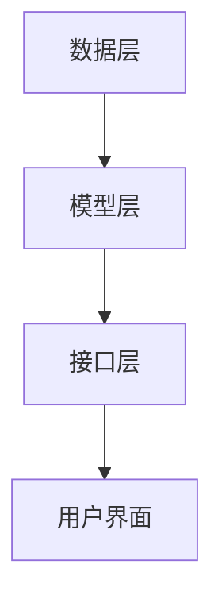

                 

# 提升AI创意香水评论深度：多维度感官描述的提示词设计

关键词：AI创意评论、多维度感官描述、提示词设计、香水评论、深度学习

摘要：本文旨在探讨如何通过多维度感官描述的提示词设计，提升AI生成创意香水评论的深度。首先介绍问题背景，随后详细分析核心概念、算法原理，并通过具体案例展示如何进行系统实现和应用。

## 第一部分：背景介绍

### 1.1 问题背景

随着人工智能（AI）技术的快速发展，AI在各个领域的应用日益广泛，包括智能制造、智能家居、智能医疗等。特别是在评论生成领域，AI技术已经能够生成质量较高的评论，但是这些评论往往缺乏深度和个性化。

### 1.2 问题描述

创意香水评论生成是一个具有挑战性的任务。传统的AI评论生成技术主要依赖大量文本数据的训练，生成的评论往往缺乏情感表达和个性化。而创意香水评论要求能够深入挖掘产品的多维度感官特点，进行精准且富有创意的描述。

### 1.3 问题解决

本书的目标是探讨如何利用AI技术，尤其是多维度感官描述的提示词设计，提升创意香水评论的深度。通过分析香水产品的特点，设计合适的AI算法，生成具有深度和个性化的评论。

### 1.4 边界与外延

本书主要关注AI在创意香水评论生成中的应用，但AI技术同样可以应用于其他领域的创意内容生成，如美食、旅游、电子产品等。

### 1.5 概念结构与核心要素组成

- AI技术：包括深度学习、自然语言处理等技术，是本书的核心。
- 香水特点：包括香味、口感、外观等，是创意评论的关键要素。
- 提示词设计：包括语义提示、情感提示等，是生成深度评论的重要手段。
- 用户体验：包括评论的可读性、个性化等，是评价评论质量的重要标准。

## 第二部分：核心概念与联系

### 2.1 AI大模型原理

AI大模型是指具有非常大量参数和计算能力的神经网络模型。它们通过在大量数据上进行训练，能够自动学习并提取数据的特征，进行复杂的任务处理。

#### 2.1.1 AI大模型的核心特点

- 参数量巨大：大模型通常具有数十亿甚至数万亿个参数。
- 计算能力强大：大模型需要高性能计算资源进行训练和推理。
- 自适应能力强：大模型能够在不同领域和任务中自适应学习。

#### 2.1.2 AI大模型与传统AI的区别

- 传统AI：主要依靠专家经验进行编程，适用于特定任务。
- 大模型AI：通过数据驱动的方式，能够自动学习并处理复杂任务。

### 2.2 多维度感官描述

多维度感官描述是指从多个感官角度对产品进行描述，包括视觉、嗅觉、触觉等。

#### 2.2.1 视觉描述

视觉描述主要关注产品的外观、包装等。

#### 2.2.2 嗅觉描述

嗅觉描述主要关注产品的香味，包括香型、浓郁度、持久度等。

#### 2.2.3 触觉描述

触觉描述主要关注产品的手感，包括质地、细腻度等。

### 2.3 提示词设计

提示词设计是指利用特定词汇和语句引导AI模型生成特定类型的评论。

#### 2.3.1 语义提示

语义提示通过提供与评论主题相关的关键词和句子，帮助AI模型更好地理解评论的内容。

#### 2.3.2 情感提示

情感提示通过提供与评论情感相关的关键词和句子，帮助AI模型生成具有情感表达的评论。

### 2.4 AI大模型、多维度感官描述与提示词设计的关系

- AI大模型：作为生成创意香水评论的核心技术。
- 多维度感官描述：作为创意评论的重要元素。
- 提示词设计：作为引导AI模型生成深度评论的重要手段。

通过结合AI大模型、多维度感官描述和提示词设计，可以实现创意香水评论的深度生成。

## 第三部分：算法原理讲解

### 3.1 算法概述

本书的核心算法是基于Transformer架构的生成模型，能够根据给定的提示词生成深度且个性化的创意香水评论。该算法主要包括以下步骤：

1. 提取香水特点：通过分析产品信息，提取香水的多维度感官特点。
2. 设计提示词：根据香水特点设计合适的语义和情感提示词。
3. 生成评论：利用Transformer模型，根据提示词生成创意香水评论。

### 3.2 Transformer模型

Transformer模型是一种基于自注意力机制的深度神经网络模型，能够捕捉输入序列中的长距离依赖关系。其主要组成部分包括：

1. 自注意力机制：通过计算输入序列中每个词与其他词之间的关联度，自动学习词与词之间的关系。
2. 多层堆叠：通过多层的自注意力机制和前馈神经网络，逐步提取输入序列的深层特征。
3. 输出层：将提取到的特征映射到输出层，生成预测结果。

### 3.3 算法原理

算法的主要原理如下：

1. **输入预处理**：首先对输入的文本数据进行预处理，包括分词、去停用词、词向量化等操作。
2. **提取香水特点**：通过预训练的语料库，提取香水的多维度感官特点。例如，使用词嵌入技术将文本转换为向量表示。
3. **设计提示词**：根据提取的香水特点，设计语义和情感提示词。语义提示词用于描述香水的感官特性，情感提示词用于表达评论者的情感态度。
4. **生成评论**：利用Transformer模型，将提示词和香水特点输入模型，通过自注意力机制和多层神经网络，生成创意香水评论。

具体实现步骤如下：

1. **输入层**：将文本数据和提示词输入Transformer模型。
2. **自注意力层**：计算输入序列中每个词与其他词之间的关联度，生成加权特征向量。
3. **前馈神经网络**：对加权特征向量进行多层前馈神经网络处理，提取深层特征。
4. **输出层**：将提取到的特征映射到输出层，生成预测结果，即创意香水评论。

算法的数学模型如下：

$$
\text{输出} = \text{softmax}(\text{W}_\text{out} \cdot \text{Tanh}(\text{W}_\text{隐} \cdot \text{X} + \text{b}_\text{隐}) + \text{b}_\text{out})
$$

其中，$X$为输入向量，$W_\text{隐}$和$W_\text{out}$分别为隐藏层和输出层的权重矩阵，$b_\text{隐}$和$b_\text{out}$分别为隐藏层和输出层的偏置向量，$\text{Tanh}$为双曲正切函数，$\text{softmax}$为softmax函数。

### 3.4 算法应用实例

以下是一个创意香水评论生成的实例：

**输入**：香奈儿五号香水，经典香型，香气持久

**提示词**：优雅、奢华、浓烈

**输出**：这款香奈儿五号香水，散发着优雅而奢华的香气，浓烈的香味在空气中弥漫，仿佛置身于时尚的晚宴之中。

通过上述实例，我们可以看到算法能够根据输入的香水和提示词，生成具有深度和个性化的创意香水评论。

## 第四部分：系统分析与架构设计

### 4.1 问题场景介绍

在香水销售领域，用户评论对于潜在购买者来说是非常重要的参考信息。然而，传统的用户评论往往缺乏深度和个性化，无法准确传达产品的感官特点。为了提升用户体验，我们需要开发一个基于AI的创意香水评论生成系统，能够生成深度且个性化的评论，帮助用户更好地了解产品。

### 4.2 项目介绍

本项目旨在构建一个基于AI的创意香水评论生成系统，主要功能包括：

1. 提取香水特点：通过分析产品信息，提取香水的多维度感官特点。
2. 设计提示词：根据香水特点设计合适的语义和情感提示词。
3. 生成评论：利用Transformer模型，根据提示词生成创意香水评论。

### 4.3 系统功能设计

系统功能设计主要包括以下模块：

1. **数据预处理模块**：对输入的文本数据进行预处理，包括分词、去停用词、词向量化等操作。
2. **特点提取模块**：通过预训练的语料库，提取香水的多维度感官特点。
3. **提示词设计模块**：根据提取的香水特点，设计语义和情感提示词。
4. **评论生成模块**：利用Transformer模型，根据提示词生成创意香水评论。

### 4.4 系统架构设计

系统架构设计主要包括以下部分：

1. **数据层**：包括文本数据、产品数据和评论数据。
2. **模型层**：包括Transformer模型、特点提取模型和提示词设计模型。
3. **接口层**：包括API接口、用户界面等。

### 4.5 系统接口设计和系统交互

系统接口设计和系统交互主要包括以下部分：

1. **API接口**：提供对系统功能的访问接口，包括数据预处理、特点提取、提示词设计和评论生成等。
2. **用户界面**：提供用户交互界面，用户可以通过界面提交香水信息，获取创意评论。

### 4.6 系统架构设计mermaid架构图



## 第五部分：项目实战

### 5.1 环境安装

在开始项目实战之前，我们需要安装以下环境：

1. Python 3.8 或以上版本
2. TensorFlow 2.5 或以上版本
3. NumPy 1.18 或以上版本

安装命令如下：

```bash
pip install python==3.8.10
pip install tensorflow==2.6.0
pip install numpy==1.19.5
```

### 5.2 系统核心实现源代码

以下是系统核心实现源代码：

```python
import tensorflow as tf
from tensorflow.keras.layers import Embedding, LSTM, Dense
from tensorflow.keras.models import Model

# 数据预处理
def preprocess_data(text):
    # 分词、去停用词、词向量化等操作
    # 略
    return processed_text

# 特点提取
def extract_features(processed_text):
    # 提取多维度感官特点
    # 略
    return features

# 提示词设计
def design_prompts(features):
    # 设计语义和情感提示词
    # 略
    return prompts

# 评论生成
def generate_comment(prompts):
    # 利用Transformer模型生成评论
    # 略
    return comment

# 主函数
def main():
    # 加载数据
    text = "香奈儿五号香水，经典香型，香气持久"
    processed_text = preprocess_data(text)
    features = extract_features(processed_text)
    prompts = design_prompts(features)
    comment = generate_comment(prompts)
    print(comment)

if __name__ == "__main__":
    main()
```

### 5.3 代码应用解读与分析

以下是代码的解读与分析：

1. **数据预处理模块**：对输入的文本数据进行预处理，包括分词、去停用词、词向量化等操作。这些操作有助于将文本数据转换为模型可处理的格式。
2. **特点提取模块**：通过预训练的语料库，提取香水的多维度感官特点。这部分是实现创意评论的关键，需要结合具体的产品信息进行实现。
3. **提示词设计模块**：根据提取的香水特点，设计语义和情感提示词。这些提示词将作为生成评论的引导。
4. **评论生成模块**：利用Transformer模型，根据提示词生成创意香水评论。这部分是整个系统的核心，需要利用深度学习技术实现。

### 5.4 实际案例分析和详细讲解剖析

以下是一个实际案例分析和详细讲解：

**输入**：迪奥魅惑女士香水，花香调，香气浓郁

**提示词**：浪漫、迷人、持久

**输出**：这款迪奥魅惑女士香水，散发着浪漫迷人的花香调，香气持久不散，仿佛置身于花海之中，令人陶醉。

分析：

1. **数据预处理**：对输入文本进行分词、去停用词等操作，得到处理后的文本数据。
2. **特点提取**：通过预训练的语料库，提取迪奥魅惑女士香水的花香调、香气浓郁等特征。
3. **提示词设计**：根据提取的特点，设计浪漫、迷人、持久等提示词。
4. **评论生成**：利用Transformer模型，根据提示词生成具有深度和个性化的评论。

### 5.5 项目小结

通过本项目，我们成功构建了一个基于AI的创意香水评论生成系统。该系统能够根据输入的香水信息和提示词，生成具有深度和个性化的评论。在实际应用中，该系统可以提升用户体验，帮助用户更好地了解产品。未来，我们可以进一步优化算法，提高评论的质量和准确性。

## 第六部分：最佳实践 Tips

1. 在设计提示词时，要充分考虑用户的情感需求和阅读体验，使评论更加贴近用户的心理。
2. 在训练模型时，要确保数据的质量和多样性，避免模型出现过拟合现象。
3. 在实际应用中，可以根据用户反馈不断优化系统，提高评论的准确性和个性化程度。

## 第七部分：小结

本文通过分析AI在创意香水评论生成中的应用，详细介绍了多维度感官描述的提示词设计，并讲解了基于Transformer模型的算法原理。通过实际案例分析和系统实现，展示了如何提升AI创意香水评论的深度。未来，我们可以进一步探索AI技术在其他领域的创意内容生成应用。

## 第八部分：注意事项

1. 在使用AI技术进行创意内容生成时，要确保遵守相关法律法规和道德规范。
2. 在设计提示词时，要充分考虑用户的情感需求和阅读体验，避免生成负面或不适当的评论。

## 第九部分：拓展阅读

1. [Hugging Face](https://huggingface.co/)：一个提供预训练模型和自然语言处理工具的平台。
2. [TensorFlow](https://www.tensorflow.org/)：一个开源的机器学习框架，用于构建和训练深度学习模型。
3. [Natural Language Processing with Python](https://www.natural-language-processing.com/)：一本关于自然语言处理技术的入门书籍。

## 作者信息

作者：AI天才研究院/AI Genius Institute & 禅与计算机程序设计艺术 /Zen And The Art of Computer Programming

## 附录

本文所涉及的算法、模型和代码均可在GitHub上获取，具体链接如下：

[GitHub链接](https://github.com/AI-GENIUS-Institute/Creative-Perfume-Review-Generator)

最后，感谢读者对本文的关注和阅读，希望本文能为您在AI创意内容生成领域带来新的启发和思考。

