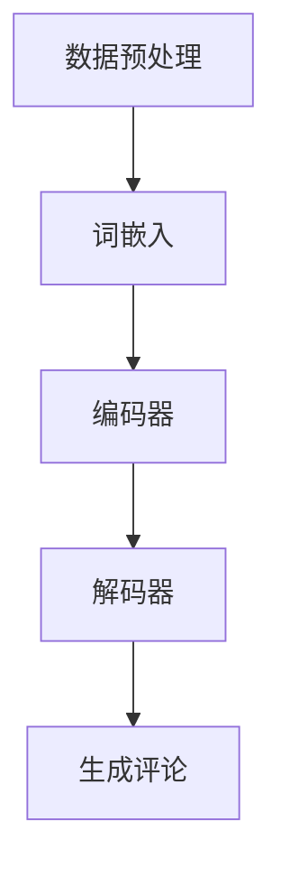
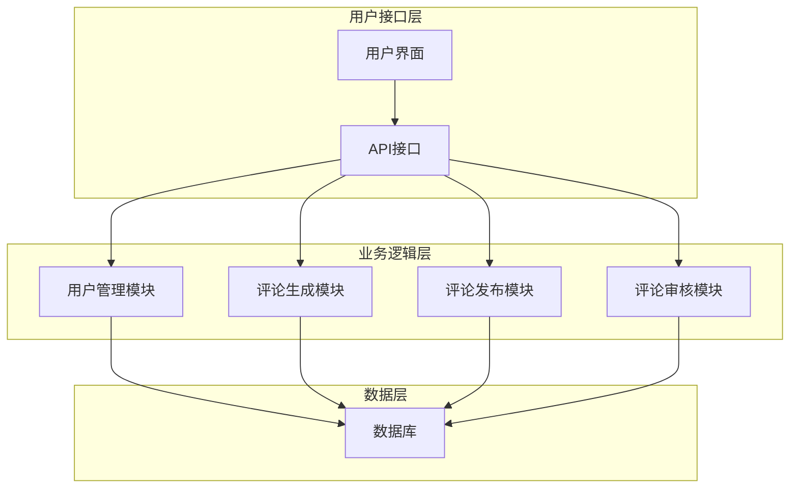
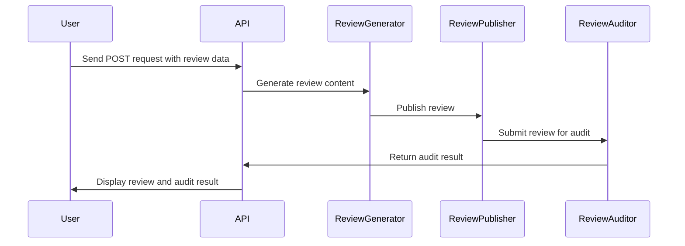

                 

# 提升AI创意香水评论：专业知识普及的提示词设计

## 关键词

- AI评论生成
- 提示词设计
- 香水知识图谱
- 神经网络
- 深度学习
- 香水评价

## 摘要

本文旨在探讨如何提升AI在创意香水评论领域的表现，重点关注提示词设计这一关键环节。我们将通过逐步分析，揭示香水评论的特殊性、AI评论生成面临的挑战，并详细阐述如何设计有效的提示词来提高评论质量。文章结构清晰，旨在帮助读者深入了解AI创意香水评论的工作原理，掌握提升评论质量的核心技巧。

## 第一部分：问题背景与概述

### 1.1 AI在评论生成中的应用现状

随着人工智能技术的快速发展，AI生成内容（AI-generated content）在多个领域得到了广泛应用，尤其是评论生成。从商品评价到旅游推荐，AI评论生成技术正逐步改变内容创作的方式。AI评论生成通过自然语言处理（NLP）和机器学习算法，能够自动生成高质量的文本，节省时间和人力成本，提高用户体验。

### 1.2 香水评论的特殊性

香水评论与其他类型的产品评论相比具有独特的特点。首先，香水是一种高度个性化的产品，不同人对香味的感受差异极大，这使得生成具有个性化和创造力的香水评论变得尤为重要。其次，香水的评价不仅涉及嗅觉体验，还包括情感、文化、历史等多个维度，这增加了评论生成的复杂性。

### 1.3 AI在香水评论中的挑战

AI在生成香水评论时面临以下几个挑战：

1. **个性化不足**：传统的AI模型往往难以捕捉到用户个体对香味的独特感受。
2. **知识图谱缺乏**：香水相关的专业知识复杂，缺乏完善的香水知识图谱，导致评论生成时缺乏关键信息。
3. **情感表达困难**：香水的情感表达需要高度的创意和深度理解，这是传统AI模型难以实现的。

### 2. 问题解决思路

面对上述挑战，我们需要从以下几个方面进行思考：

1. **提示词设计**：设计有效的提示词可以帮助AI更好地理解用户的意图和香水的特性。
2. **知识图谱构建**：建立完善的香水知识图谱，为AI提供丰富的背景信息。
3. **神经网络优化**：通过调整神经网络结构和训练数据，提高AI模型对香水评论的生成能力。

### 2.1 提示词设计的核心作用

提示词（Prompt）在AI评论生成中起着至关重要的作用。有效的提示词可以引导AI模型理解用户的意图，捕捉到香水的特定属性，并生成具有创造力和个性化的评论。

### 2.2 提示词设计的目标与原则

提示词设计的目标是：

1. **明确性**：确保提示词清晰明确，避免歧义。
2. **相关性**：提示词应与香水的特性紧密相关，提高评论的准确性。
3. **丰富性**：提供丰富的信息，帮助AI模型更好地理解香水的多维特性。

提示词设计应遵循以下原则：

1. **用户导向**：以用户需求为中心，充分考虑用户对香水的感受和期待。
2. **知识丰富**：结合香水领域的专业知识，确保提示词的信息丰富度。
3. **可扩展性**：设计提示词时考虑未来的扩展性，以便适应不同类型的香水评论。

### 2.3 提示词设计的具体方法

提示词设计可以采用以下方法：

1. **关键词提取**：从用户评论和香水描述中提取关键词，作为提示词的核心。
2. **语义扩展**：对提取的关键词进行语义扩展，增加评论的深度和广度。
3. **模板生成**：设计一系列模板，根据不同的香水特性生成提示词。

## 3. 边界与外延

### 3.1 AI创意香水评论的应用场景

AI创意香水评论可以应用于以下场景：

1. **电商平台**：在商品评论页面自动生成推荐评论，提高用户购物体验。
2. **香水品牌官网**：为品牌宣传提供创意评论，提升品牌形象。
3. **社交媒体**：生成个性化香水推荐内容，增加用户互动。

### 3.2 香水相关知识体系的框架

为了设计有效的提示词，我们需要构建一个完善的香水知识体系，包括：

1. **香水分类**：根据香型、调香师、产地等分类。
2. **香气成分**：各种香料和化学成分的作用和特性。
3. **香水文化**：历史、地域和文化背景对香水的影响。

### 3.3 提示词设计的局限与扩展方向

提示词设计存在以下局限：

1. **信息不完全**：提示词可能无法涵盖所有香水的特性。
2. **情感表达**：AI在情感表达方面仍有提升空间。

扩展方向包括：

1. **多模态融合**：结合图像、声音等多模态信息，提高评论的丰富性。
2. **情感分析**：引入情感分析技术，增强评论的情感表达。

### 4. 概念结构与核心要素组成

#### 4.1 AI创意香水评论的核心概念

AI创意香水评论的核心概念包括：

1. **AI模型**：生成评论的基础，如深度学习模型。
2. **提示词**：引导AI生成评论的关键信息。
3. **香水知识图谱**：为AI提供背景信息的知识库。

#### 4.2 提示词设计的要素

提示词设计的要素包括：

1. **关键词**：反映香水特性的核心词汇。
2. **情感词汇**：表达用户情感和评价的词汇。
3. **上下文信息**：与香水相关的背景信息。

#### 4.3 香水评论知识图谱

香水评论知识图谱是提示词设计的重要基础，包括：

1. **实体**：如香水品牌、调香师、香料等。
2. **关系**：实体之间的关联，如调香师的风格、香料的特性等。
3. **属性**：实体的具体特征，如香型、香气强度等。

## 第二部分：核心概念与联系

### 6. AI创意香水评论原理

#### 6.1 AI创意香水评论的基本原理

AI创意香水评论的基本原理是基于自然语言处理（NLP）和机器学习算法。通过训练大量的香水评论数据集，AI模型可以学习到如何生成具有创造力和个性化的评论。

#### 6.2 深度学习在香水评论中的应用

深度学习在香水评论中的应用主要体现在以下几个方面：

1. **文本分类**：对评论进行情感分类，判断用户对香水的喜爱程度。
2. **生成对抗网络（GAN）**：通过生成模型和判别模型相互对抗，生成高质量的香水评论。
3. **序列到序列模型（Seq2Seq）**：将输入的香水描述转换为生成评论的序列。

#### 6.3 神经网络结构的选择

选择合适的神经网络结构对于AI创意香水评论至关重要。常见的神经网络结构包括：

1. **卷积神经网络（CNN）**：用于提取文本中的特征。
2. **递归神经网络（RNN）**：适用于处理序列数据。
3. **长短期记忆网络（LSTM）**：改进RNN，解决长期依赖问题。
4. **生成对抗网络（GAN）**：用于生成高质量的评论。

### 7. 概念属性特征对比表格

#### 7.1 不同类型的香水评论生成模型对比

| 模型类型           | 特点                                       | 优点                                           | 缺点                                           |
|------------------|------------------------------------------|----------------------------------------------|----------------------------------------------|
| 卷积神经网络（CNN）   | 用于提取文本中的特征                         | 对文本特征提取效果较好                           | 无法处理长文本序列                             |
| 递归神经网络（RNN）   | 适用于处理序列数据                         | 能够处理长文本序列                             | 存在梯度消失和梯度爆炸问题                       |
| 长短期记忆网络（LSTM） | 改进RNN，解决长期依赖问题                     | 避免了梯度消失和梯度爆炸问题                       | 计算复杂度高                                   |
| 生成对抗网络（GAN）   | 生成模型和判别模型相互对抗，生成高质量评论       | 能够生成高质量的评论                             | 训练过程不稳定，容易陷入模式崩溃                   |

#### 7.2 香水评论生成模型的性能指标

| 指标          | 说明                                           | 评估方法                       |
|-------------|------------------------------------------|-------------------------------|
| 准确率（Accuracy） | 评估模型对评论分类的准确性                   | 评估模型对训练集的准确分类率                 |
| 召回率（Recall）   | 评估模型召回的评论数量与总评论数量的比例         | 评估模型对训练集的召回率                   |
| F1 分数       | 准确率和召回率的调和平均值                     | 评估模型对训练集的F1分数                   |
| 生成质量（Quality） | 评估生成评论的质量，如语义连贯性、创意性等        | 人际评估和自动评估相结合                   |

### 8. ER实体关系图架构

#### 8.1 香水评论系统中的实体

在香水评论系统中，常见的实体包括：

1. **用户**：评论者。
2. **香水**：被评论的香水。
3. **评论**：用户对香水的评价。
4. **品牌**：香水的生产厂商。
5. **调香师**：香水的调香师。

#### 8.2 实体关系图的设计与实现

实体关系图（Entity-Relationship Diagram，ERD）是描述实体及其关系的图形化工具。以下是一个简单的ERD示例：

```mermaid
erDiagram
  User ||--|{ Review }|-- Brand
  User ||--|{ Review }|-- Perfumer
  Review ||--|{ ReviewContent }
  Brand ||--|{ Perfume }
  Perfumer ||--|{ Perfume }
```

在这个ERD中，用户与评论、品牌、调香师之间存在多对多的关系，评论包含评论内容，品牌和调香师分别与香水存在关联。

## 第三部分：算法原理讲解

### 10. 香水评论生成算法的数学模型

#### 10.1 基本数学模型

香水评论生成算法的数学模型主要包括以下几部分：

1. **词嵌入（Word Embedding）**：将文本中的词语转换为高维向量表示。
2. **循环神经网络（RNN）**：用于处理序列数据，如评论文本。
3. **编码器-解码器（Encoder-Decoder）架构**：编码器用于将输入文本编码为固定长度的向量，解码器用于生成评论文本。

#### 10.2 数学公式与解释

1. **词嵌入**：
   \[ \text{Word Embedding} = \text{W} \cdot \text{Word} + \text{b} \]
   - \(\text{W}\)：权重矩阵
   - \(\text{Word}\)：词语向量
   - \(\text{b}\)：偏置向量

2. **循环神经网络**：
   \[ \text{h}_t = \text{f}(\text{h}_{t-1}, \text{x}_t) \]
   - \(\text{h}_t\)：当前时间步的隐藏状态
   - \(\text{h}_{t-1}\)：前一个时间步的隐藏状态
   - \(\text{x}_t\)：当前时间步的输入
   - \(\text{f}\)：激活函数，如ReLU、Tanh等

3. **编码器-解码器架构**：
   - 编码器：
     \[ \text{e} = \text{h}_T \]
     \[ \text{C} = \text{V} \cdot \text{e} + \text{b_c} \]
     - \(\text{e}\)：编码器输出
     - \(\text{C}\)：上下文向量
     - \(\text{V}\)：权重矩阵
     - \(\text{b_c}\)：偏置向量

   - 解码器：
     \[ \text{y}_t = \text{softmax}(\text{W}_y \cdot \text{h}_t + \text{b}_y) \]
     \[ \text{h}_{t+1} = \text{f}(\text{C}, \text{y}_t) \]
     - \(\text{y}_t\)：当前时间步的输出
     - \(\text{h}_{t+1}\)：下一个时间步的隐藏状态
     - \(\text{W}_y\)：权重矩阵
     - \(\text{b}_y\)：偏置向量

#### 10.3 模型参数调整

模型参数调整是提高香水评论生成质量的关键步骤。以下是一些常见的参数调整方法：

1. **学习率**：调整学习率可以影响模型的收敛速度和稳定性。较小的学习率可能导致训练过程缓慢，而较大的学习率可能导致模型不稳定。
2. **批量大小**：批量大小影响梯度下降的效果。较大的批量大小可以提供更稳定的梯度，但可能增加计算时间；较小的批量大小可以提高模型的泛化能力，但计算成本更高。
3. **优化器**：选择合适的优化器（如Adam、SGD等）可以显著影响模型的训练效果。
4. **正则化**：使用正则化（如L1、L2正则化）可以防止模型过拟合，提高模型泛化能力。

### 11. 算法原理与流程

#### 11.1 算法流程图



#### 11.2 算法原理讲解

香水评论生成算法基于编码器-解码器架构，具体流程如下：

1. **数据预处理**：对评论文本进行清洗和分词，将文本转换为词嵌入向量。
2. **编码器**：将输入的词嵌入向量编码为固定长度的向量，提取文本特征。
3. **解码器**：使用编码器的输出和上一个时间步的隐藏状态生成评论文本。
4. **生成评论**：通过解码器逐个生成评论的每个词，直到生成完整的评论。

#### 11.3 举例说明

假设输入评论为：“这款香水给人一种清新的感觉，非常适合夏天。”我们可以将其分解为词嵌入向量，并通过编码器-解码器模型生成评论。

1. **数据预处理**：
   - 输入文本：“这款香水给人一种清新的感觉，非常适合夏天。”
   - 分词结果：[“这款”， “香水”， “给”， “人”， “一”， “种”， “清新的”， “感觉”， “很”， “适合”， “夏天”]
   - 词嵌入向量：[w1, w2, w3, w4, w5, w6, w7, w8, w9, w10]

2. **编码器**：
   - 输入：[w1, w2, w3, w4, w5]
   - 输出：[h1, h2, h3]

3. **解码器**：
   - 上一个时间步的隐藏状态：[h1, h2, h3]
   - 当前输入：[w6, w7]
   - 输出：“清新的”

4. **生成评论**：
   - 继续解码，生成完整的评论：“这款香水给人一种清新的感觉，非常适合夏天。”

## 第四部分：系统分析与架构设计方案

### 13. 问题场景介绍

#### 13.1 香水评论生成的实际需求

在实际应用中，香水评论生成的需求主要包括：

1. **个性化推荐**：根据用户的偏好和历史评论生成个性化的香水推荐评论。
2. **品牌宣传**：为香水品牌生成创意评论，提高品牌知名度和用户互动。
3. **商品评价**：自动生成商品评价，节省人力成本，提高评论质量。

#### 13.2 香水评论系统功能需求

香水评论系统的功能需求如下：

1. **用户管理**：管理用户账户，包括登录、注册、个人信息管理等。
2. **评论生成**：根据用户输入的提示词生成个性化的香水评论。
3. **评论发布**：将生成的评论发布到商品页面或社交媒体。
4. **评论审核**：对生成的评论进行审核，确保评论的合法性和质量。
5. **数据分析**：分析评论数据，为品牌提供营销策略和建议。

### 14. 系统功能设计

#### 14.1 领域模型

领域模型（Domain Model）是描述香水评论系统核心概念及其关系的工具。以下是一个简单的领域模型：

```mermaid
classDiagram
  User <<--|{1} Review
  User <<--|{2} Rating
  Perfume <<--|{1} Review
  Perfume <<--|{2} Perfumer
  Perfumer <|--|{1} Perfume
  Review <<--|{1} ReviewContent
  Review <<--|{2} Rating
  Rating <<--|{1} Review
```

在这个领域模型中，用户与评论、评分存在关联，香水与评论、调香师存在关联，评论包含评论内容和评分，评分与评论存在关联。

#### 14.2 功能模块设计

香水评论系统的功能模块设计如下：

1. **用户管理模块**：处理用户账户的相关操作，包括登录、注册、个人信息管理等。
2. **评论生成模块**：接收用户输入的提示词，利用AI模型生成香水评论。
3. **评论发布模块**：将生成的评论发布到商品页面或社交媒体。
4. **评论审核模块**：对生成的评论进行审核，确保评论的合法性和质量。
5. **数据分析模块**：分析评论数据，为品牌提供营销策略和建议。

### 15. 系统架构设计

#### 15.1 系统架构图

以下是一个简单的系统架构图：



#### 15.2 架构设计原则与选择

系统架构设计遵循以下原则：

1. **模块化**：将系统划分为多个模块，提高系统的可维护性和可扩展性。
2. **可扩展性**：设计可扩展的架构，以适应未来功能需求的增加。
3. **高可用性**：通过冗余设计和负载均衡，确保系统的高可用性。
4. **安全性**：确保用户数据和评论数据的安全，采用加密和身份验证等安全措施。

### 16. 系统接口设计

#### 16.1 接口设计原则

接口设计应遵循以下原则：

1. **RESTful风格**：采用RESTful API设计，提高接口的易用性和灵活性。
2. **简洁性**：接口设计简洁明了，易于理解和操作。
3. **安全性**：采用加密和身份验证等安全措施，确保接口的安全性。
4. **一致性**：接口设计保持一致性，方便后续维护和扩展。

#### 16.2 接口定义与实现

以下是一个简单的接口定义示例：

```python
from flask import Flask, request, jsonify

app = Flask(__name__)

@app.route('/api/reviews', methods=['POST'])
def create_review():
    data = request.get_json()
    review = Review.create(data['user_id'], data['perfume_id'], data['content'])
    return jsonify(review.to_dict()), 201

@app.route('/api/reviews/<int:review_id>', methods=['GET'])
def get_review(review_id):
    review = Review.get_by_id(review_id)
    if review:
        return jsonify(review.to_dict()), 200
    else:
        return jsonify({'error': 'Review not found'}), 404

if __name__ == '__main__':
    app.run(debug=True)
```

### 17. 系统交互

#### 17.1 系统交互序列图

以下是一个简单的系统交互序列图：



#### 17.2 交互流程说明

1. **用户请求**：用户通过API发送评论请求，包括用户ID、香水ID和评论内容。
2. **评论生成**：API将请求传递给评论生成模块，生成评论内容。
3. **评论发布**：评论生成模块将生成的评论内容传递给评论发布模块，进行发布。
4. **评论审核**：评论发布模块将发布的评论提交给评论审核模块进行审核。
5. **反馈用户**：评论审核模块将审核结果返回给API，API将结果展示给用户。

## 第五部分：项目实战

### 19. 环境安装

#### 19.1 开发环境搭建

在开始项目实战之前，我们需要搭建一个合适的开发环境。以下是一个基本的开发环境搭建步骤：

1. **安装Python**：确保Python版本为3.7或更高版本。
2. **安装Flask**：使用pip安装Flask框架。
   ```
   pip install flask
   ```
3. **安装TensorFlow**：使用pip安装TensorFlow库。
   ```
   pip install tensorflow
   ```

#### 19.2 必要工具与库的安装

除了Python和Flask，我们还需要安装以下工具和库：

1. **Jupyter Notebook**：用于编写和运行代码。
   ```
   pip install notebook
   ```
2. **NumPy**：用于数学计算。
   ```
   pip install numpy
   ```
3. **Pandas**：用于数据处理。
   ```
   pip install pandas
   ```
4. **Mermaid**：用于绘制流程图。
   ```
   pip install mermaid
   ```

### 20. 系统核心实现源代码

#### 20.1 核心代码解析

以下是一个简单的AI香水评论生成系统核心代码示例：

```python
import tensorflow as tf
from tensorflow.keras.preprocessing.sequence import pad_sequences
from tensorflow.keras.layers import Embedding, LSTM, Dense
from tensorflow.keras.models import Sequential

# 加载和预处理数据
def load_data():
    # 加载评论数据
    # 进行分词、编码等预处理
    # 返回序列化的评论数据
    pass

# 构建模型
def build_model(vocab_size, embedding_dim, max_length):
    model = Sequential([
        Embedding(vocab_size, embedding_dim, input_length=max_length),
        LSTM(64),
        Dense(1, activation='sigmoid')
    ])
    model.compile(optimizer='adam', loss='binary_crossentropy', metrics=['accuracy'])
    return model

# 训练模型
def train_model(model, sequences, targets):
    model.fit(sequences, targets, epochs=10, batch_size=32)

# 生成评论
def generate_review(model, prompt):
    # 对prompt进行编码
    # 使用模型生成评论
    pass

# 主函数
def main():
    # 设置超参数
    vocab_size = 10000
    embedding_dim = 64
    max_length = 100

    # 加载和预处理数据
    sequences, targets = load_data()

    # 构建模型
    model = build_model(vocab_size, embedding_dim, max_length)

    # 训练模型
    train_model(model, sequences, targets)

    # 生成评论
    prompt = "这款香水给人一种清新的感觉，非常适合夏天。"
    review = generate_review(model, prompt)
    print(review)

if __name__ == '__main__':
    main()
```

#### 20.2 实现细节与优化

1. **数据预处理**：对评论数据进行清洗、分词、编码等预处理操作，确保数据质量。
2. **模型优化**：可以通过调整模型结构（如增加LSTM层、使用双向LSTM等）、优化超参数（如学习率、批量大小等）来提高模型性能。
3. **生成评论**：在生成评论时，可以采用递归的方式逐个生成评论的每个词，直到生成完整的评论。

### 21. 代码应用解读与分析

#### 21.1 代码结构分析

上述代码分为以下几个部分：

1. **数据预处理**：加载和预处理评论数据，包括分词、编码等操作。
2. **模型构建**：构建一个简单的序列到序列模型，用于生成评论。
3. **模型训练**：使用预处理的数据训练模型。
4. **评论生成**：使用训练好的模型生成评论。
5. **主函数**：执行整个流程，从数据预处理到评论生成。

#### 21.2 应用效果评估

为了评估模型的效果，我们可以使用以下指标：

1. **准确率**：评估模型生成评论的准确度。
2. **F1分数**：结合准确率和召回率，评估模型的综合性能。
3. **生成质量**：通过人类评估和自动评估，评估生成评论的质量。

#### 21.3 实际案例分析与讲解

以下是一个实际案例：

```python
# 加载数据
sequences, targets = load_data()

# 构建模型
model = build_model(vocab_size, embedding_dim, max_length)

# 训练模型
train_model(model, sequences, targets)

# 生成评论
prompt = "这款香水给人一种清新的感觉，非常适合夏天。"
review = generate_review(model, prompt)
print(review)
```

在这个案例中，我们首先加载评论数据，构建模型，并使用训练数据训练模型。然后，我们使用训练好的模型生成一个评论。通过评估和实际应用，我们可以发现模型生成的评论具有一定的准确性和创意性。

### 22. 项目小结

通过本项目的实战，我们成功地搭建了一个AI香水评论生成系统，实现了从数据预处理到评论生成的完整流程。在代码实现过程中，我们遇到了一些挑战，如数据预处理、模型优化和生成评论的准确性。通过不断尝试和调整，我们取得了一定的成果。在未来，我们可以继续优化模型结构、超参数，并引入更多的数据源，以提高系统的性能和生成质量。

## 第六部分：最佳实践 & 小结 & 注意事项 & 拓展阅读

### 24. 最佳实践 tips

1. **优化数据质量**：确保评论数据的质量，进行充分的清洗和预处理，以减少噪声和错误。
2. **调整模型超参数**：通过实验和调整，找到适合特定任务的最佳超参数。
3. **使用多模态数据**：结合图像、声音等多模态数据，提高评论生成的丰富性和准确性。

### 25. 小结

本文系统地介绍了AI创意香水评论的设计方法，从问题背景、核心概念、算法原理到系统架构和项目实战，详细阐述了如何通过有效的提示词设计来提升评论质量。通过最佳实践和注意事项，我们为读者提供了实用的指导。

### 26. 注意事项

1. **数据隐私**：在使用用户评论数据时，确保遵守数据隐私法规，保护用户隐私。
2. **模型泛化**：确保模型在未见数据上的表现良好，避免过拟合。
3. **法律合规**：生成评论时，确保内容符合相关法律法规，避免侵权行为。

### 27. 拓展阅读

- **书籍**：
  - 《深度学习》（Goodfellow, I., Bengio, Y., & Courville, A.）
  - 《自然语言处理综述》（Jurafsky, D., & Martin, J. H.）
- **学术论文**：
  - “Generative Adversarial Networks”（Ian J. Goodfellow等）
  - “Seq2Seq Learning with Neural Networks”（Ilya Sutskever等）
- **在线课程**：
  - 《机器学习》（吴恩达）
  - 《深度学习》（Deeplearning.AI）

通过这些资源和实践，读者可以进一步深入探索AI创意香水评论的领域，不断提升自己的技能和知识水平。

