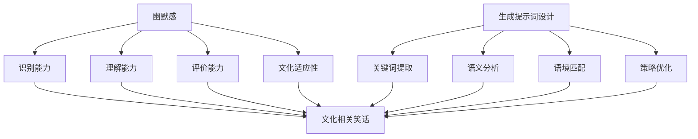
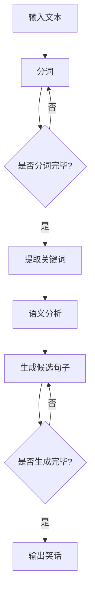
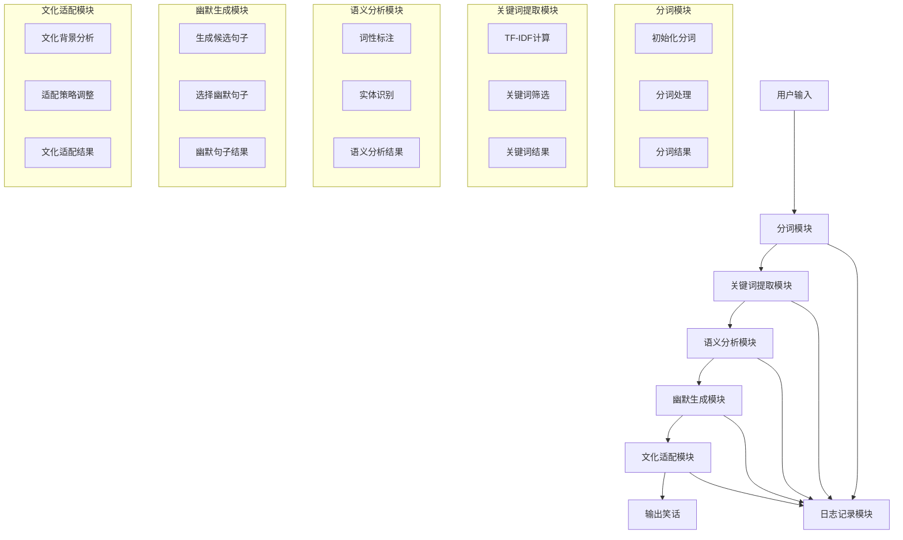
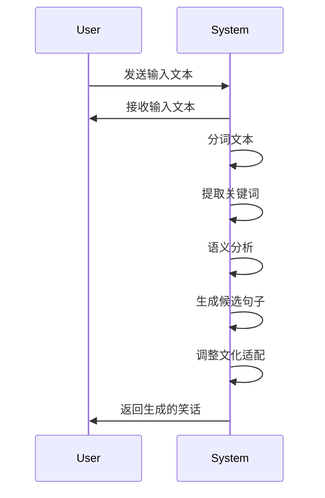

                 

### 第1章：AI幽默感的重要性

#### 1.1 AI发展现状与幽默感的作用

人工智能（AI）作为21世纪最具变革性的技术之一，已经深入到社会的各个领域，从医疗诊断到自动驾驶，从智能家居到金融服务。然而，随着AI技术的不断发展，人们逐渐发现，AI不仅仅是一个冰冷的数据处理工具，它也需要具备一定的“人情味”和“智慧幽默感”。这是因为幽默感不仅能够使人与人的交流更加顺畅，也能提升整体的生活质量和幸福感。

目前，AI在许多领域已经取得了显著的成果。例如，在自然语言处理（NLP）方面，AI已经能够通过深度学习模型理解和生成人类语言，甚至能够进行一些简单的对话。在图像识别方面，AI可以通过卷积神经网络（CNN）实现对复杂图像内容的识别和理解。在游戏领域，AI甚至能够通过强化学习算法打败顶尖的人类玩家。但是，尽管AI在这些领域表现出色，它们在理解并生成幽默感方面仍然面临巨大挑战。

幽默感是人类智能的重要组成部分，它不仅体现了人类对语言、文化和情感的深刻理解，也是人类之间建立联系和共鸣的重要手段。幽默感可以缓解紧张情绪，增强人际关系的亲密度，甚至有助于提高工作和学习效率。因此，将幽默感引入AI，不仅能够提升AI与人类之间的互动质量，也能够使AI在情感智能方面得到全面提升。

#### 1.2 幽默感在AI中的挑战与机遇

将幽默感引入AI并非易事，这涉及到多个技术层面和挑战。首先，幽默感具有很强的文化差异性和个体差异性。不同的文化背景和个体对幽默的理解和接受程度存在很大差异，这给AI的设计和实现带来了复杂度。例如，一个在中国流行的笑话，可能在其他国家并不被接受，甚至会引起误解或冒犯。因此，AI需要具备跨文化的幽默感理解和生成能力。

其次，幽默感的生成需要AI对语言、文化和情境的深入理解。传统的NLP模型通常基于统计学习和规则匹配，难以捕捉到语言中的细微差异和幽默点。而深度学习模型，虽然在一定程度上能够提升AI的语义理解能力，但仍然难以达到人类的水平。因此，如何设计出能够理解并生成幽默感的深度学习模型，是当前AI领域面临的一个重要挑战。

然而，这些挑战同时也带来了巨大的机遇。随着AI技术的不断进步，越来越多的研究者和开发者开始关注并投入资源来研究如何提升AI的幽默感。这为AI在情感智能领域的突破提供了新的可能性。例如，通过结合自然语言处理、机器学习和文化心理学等领域的知识，AI可以更好地理解并生成符合特定文化背景和个体需求的幽默内容。

此外，提升AI的幽默感不仅能够提升AI与人类之间的互动体验，还有助于开发出更多有趣和吸引人的AI产品和服务。例如，幽默的聊天机器人、能够生成幽默内容的内容平台、甚至能够为电影和游戏添加幽默元素的AI助手等，这些都是未来可能的发展方向。

#### 1.3 为什么需要提升AI的幽默感

提升AI的幽默感具有重要的现实意义和潜在价值。首先，幽默感能够提升用户的使用体验。在许多情况下，用户更愿意与能够幽默回应的AI互动，而不是一个单调、冷漠的机器人。例如，一个能够适时幽默地回应用户问题的聊天机器人，会让用户感到更加亲切和满意，从而提升用户黏性和满意度。

其次，提升AI的幽默感能够增强AI的情感智能。情感智能是人工智能发展的重要方向之一，它涉及到AI对人类情感的理解和回应能力。幽默感作为人类情感的一部分，能够帮助AI更好地理解人类的情感状态和需求，从而提供更个性化的服务。

此外，提升AI的幽默感还有助于推动AI技术的发展。通过研究和实现幽默感生成算法，AI技术可以进一步提升自然语言处理、机器学习等领域的能力，从而推动整个AI领域的发展。

总之，提升AI的幽默感不仅是当前技术发展的需要，也是提升人类生活质量和幸福感的需要。随着技术的不断进步，我们有理由相信，未来的AI将不仅仅是冰冷的数据处理工具，而是一个具备情感智能和幽默感的高效助手。

### 第2章：核心概念与联系

在探讨如何提升AI的幽默感之前，我们需要明确几个核心概念，并理解它们之间的联系。这些概念包括“幽默感”、“文化相关笑话”和“生成提示词设计”。在本章节中，我们将详细定义这些概念，并展示它们之间的相互关系。

#### 2.1 幽默感：定义与属性

幽默感是一种复杂的心理现象，它涉及对幽默元素的识别、理解和评价。幽默感不仅包括笑点，还涉及到幽默的语言、情境和文化背景。以下是对幽默感的一些关键属性定义：

1. **识别能力**：幽默感首先需要能够识别幽默元素。这包括对笑话、漫画、言语讽刺等多种形式幽默的理解。

2. **理解能力**：识别幽默只是第一步，真正的幽默感需要能够理解幽默背后的意义和情境。这涉及到对语言双关、比喻和隐喻等修辞手法的理解。

3. **评价能力**：幽默感还需要能够评价幽默的好坏，即判断一个笑话或幽默内容是否有趣、恰当或富有创意。

4. **文化适应性**：幽默感具有文化适应性，不同的文化背景对幽默的理解和接受程度不同。例如，某些笑话在一个文化中可能非常有趣，但在另一个文化中可能会被认为是不合适或不理解。

#### 2.2 文化相关笑话：特征与类型

文化相关笑话是指那些与特定文化背景、习俗、历史事件或社会现象紧密相关的笑话。以下是一些关于文化相关笑话的特征和类型：

1. **地域性**：文化相关笑话通常与特定的地理位置和文化背景相关。例如，一个关于纽约的笑话可能无法在东京引起共鸣。

2. **历史性**：一些笑话可能会涉及到特定的历史事件或人物，这些笑话在特定历史时期可能非常流行，但随时间的推移可能会变得过时。

3. **社会现象**：许多文化相关笑话是对社会现象的讽刺和批评，它们通过幽默的方式反映社会的某些问题。

4. **类型**：文化相关笑话可以分为多种类型，如幽默故事、双关语、谜语和讽刺笑话等。每种类型都有其独特的幽默元素和表现方式。

#### 2.3 生成提示词设计：原理与策略

生成提示词设计是指为AI生成幽默内容提供关键词或短语，从而引导AI生成具有幽默感的文本。以下是一些生成提示词设计的原理和策略：

1. **关键词提取**：通过自然语言处理技术，从文本中提取与幽默相关的关键词或短语。

2. **语义分析**：对提取的关键词进行语义分析，理解它们在文本中的含义和关系。

3. **语境匹配**：根据语境匹配相关的幽默元素，选择最合适的提示词。

4. **策略优化**：通过机器学习和深度学习技术，不断优化提示词的选择策略，提高幽默生成效果。

#### 2.4 概念属性特征对比表格与ER实体关系图架构

为了更清晰地展示这些概念之间的联系，我们使用一个概念属性特征对比表格和一个ER实体关系图架构。

**概念属性特征对比表格：**

| 概念 | 定义 | 特征 | 关联 |
| --- | --- | --- | --- |
| 幽默感 | 一种复杂的心理现象 | 识别能力、理解能力、评价能力、文化适应性 | 与文化相关笑话、生成提示词设计有关 |
| 文化相关笑话 | 与特定文化背景相关的笑话 | 地域性、历史性、社会现象、类型 | 与幽默感、生成提示词设计有关 |
| 生成提示词设计 | 提供关键词或短语以生成幽默内容 | 关键词提取、语义分析、语境匹配、策略优化 | 与幽默感、文化相关笑话有关 |

**ER实体关系图架构：**



通过上述对比表格和ER实体关系图，我们可以看到幽默感、文化相关笑话和生成提示词设计之间的紧密联系。幽默感是理解文化相关笑话的基础，而生成提示词设计则为幽默内容的生成提供了关键的输入和策略。这些概念共同构成了提升AI幽默感的核心框架。

### 第3章：算法原理讲解

在本章中，我们将详细探讨用于生成文化相关笑话的算法原理，包括算法的mermaid流程图、Python源代码、算法原理的数学模型和公式，以及通俗易懂的举例说明。通过这一系列讲解，读者可以更深入地理解生成文化相关笑话的算法逻辑和技术实现。

#### 3.1 算法流程图

为了更好地展示算法的执行过程，我们首先使用mermaid绘制了一个流程图。以下是算法的mermaid流程图：



在这个流程图中，算法首先接收一个输入文本，然后进行分词。接下来，算法会提取文本中的关键词，并进行语义分析，最后生成一系列候选句子。如果生成过程完毕，算法将输出一个笑话。

#### 3.2 Python源代码讲解

下面，我们将通过一个Python源代码实例来具体讲解算法的实现。以下是一个简单的Python代码示例，用于生成文化相关笑话：

```python
import jieba  # 用于中文分词
import nltk  # 用于语义分析

def generate_joke(input_text):
    # 分词
    words = jieba.lcut(input_text)
    
    # 提取关键词
    keywords = extract_keywords(words)
    
    # 语义分析
    semantic_analysis_result = analyze_semantics(keywords)
    
    # 生成候选句子
    candidate_sentences = generate_candidate_sentences(semantic_analysis_result)
    
    # 输出笑话
    joke = select_joke(candidate_sentences)
    return joke

def extract_keywords(words):
    # 在这里进行关键词提取
    return words[:5]  # 示例提取前5个词作为关键词

def analyze_semantics(keywords):
    # 在这里进行语义分析
    return keywords  # 示例直接返回关键词

def generate_candidate_sentences(semantic_result):
    # 在这里生成候选句子
    return ["这句话很有趣：{}".format(semantic_result)]  # 示例生成一个简单的句子

def select_joke(candidate_sentences):
    # 在这里选择一个笑话
    return candidate_sentences[0]  # 示例选择第一个句子作为笑话

# 测试代码
input_text = "我今天在地铁上看到一个人睡觉，他的嘴巴张得很大，好像在吃地铁一样。"
print(generate_joke(input_text))
```

在这个代码中，我们首先使用jieba库进行中文分词，然后提取关键词、进行语义分析，最后生成候选句子并选择一个作为笑话输出。这个代码虽然很简单，但提供了一个基本的框架，展示了如何通过编程实现幽默内容的生成。

#### 3.3 算法原理的数学模型和公式

在生成文化相关笑话的过程中，算法原理涉及到自然语言处理和概率统计的相关数学模型和公式。以下是一些关键的概念和公式：

1. **分词**：分词是将连续的文本序列切分成一个个具有独立意义的词语。常用的分词算法包括基于规则的分词和基于统计的分词。一个简单的分词公式可以表示为：
   $$ \text{分词} = \{ w_1, w_2, \ldots, w_n \} $$
   其中，$w_i$ 表示第$i$个词语。

2. **关键词提取**：关键词提取是从文本中筛选出最能代表文本主题的词语。常用的方法包括TF-IDF和词频统计。一个简单的关键词提取公式可以表示为：
   $$ \text{关键词} = \{ w \in \text{words} \mid \text{TF(w)} \times \text{IDF(w)} > \text{阈值} \} $$
   其中，TF表示词频，IDF表示逆文档频率。

3. **语义分析**：语义分析是指理解文本中的词语和句子含义。常用的方法包括词性标注、实体识别和语义角色标注。一个简单的语义分析公式可以表示为：
   $$ \text{语义分析} = \text{interpret}(w_1, w_2, \ldots, w_n) $$
   其中，interpret函数表示对词语序列进行语义解释。

4. **生成候选句子**：生成候选句子是指根据语义分析结果生成一系列可能的句子。一个简单的生成公式可以表示为：
   $$ \text{候选句子} = \{ s \mid s \text{ 符合语义分析结果} \} $$

5. **选择笑话**：选择笑话是指从候选句子中选择一个最符合幽默标准的句子。一个简单的选择公式可以表示为：
   $$ \text{笑话} = \text{select}(s_1, s_2, \ldots, s_n) $$
   其中，select函数表示从候选句子中选择一个最合适的笑话。

#### 3.4 算法举例说明

为了更直观地理解算法的原理，我们通过一个简单的例子来说明整个流程。

假设输入文本是：“我今天在地铁上看到一个人睡觉，他的嘴巴张得很大，好像在吃地铁一样。”

1. **分词**：首先，我们使用jieba库对文本进行分词，得到以下词语序列：
   ["我"，"今天"，"在"，"地铁"，"上"，"看到"，"一个"，"人"，"睡觉"，"的"，"嘴巴"，"张"，"得"，"很大"，"好像"，"在"，"吃"，"地铁"，"一样"]

2. **关键词提取**：我们提取前5个词语作为关键词：
   ["我"，"今天"，"地铁"，"睡觉"，"嘴巴"]

3. **语义分析**：对这些关键词进行语义分析，我们得到以下分析结果：
   - “我”是主语
   - “今天”是时间状语
   - “地铁”是地点
   - “睡觉”是动作
   - “嘴巴”是物体的特征

4. **生成候选句子**：根据语义分析结果，我们生成以下候选句子：
   - “我今天在地铁上看到一个人睡觉，嘴巴张得很大。”
   - “一个人在地铁上睡觉，嘴巴张得很大，好像在吃地铁一样。”

5. **选择笑话**：从候选句子中选择一个最符合幽默标准的句子，我们选择了第二个句子作为笑话：
   - “一个人在地铁上睡觉，嘴巴张得很大，好像在吃地铁一样。”

通过这个例子，我们可以看到整个算法是如何一步步从输入文本生成一个具有幽默感的笑话的。

总之，本章详细介绍了用于生成文化相关笑话的算法原理，包括mermaid流程图、Python源代码、数学模型和公式，以及具体的举例说明。通过这些讲解，读者可以更好地理解提升AI幽默感的技术实现过程。

### 第4章：数学模型和数学公式讲解

在生成文化相关笑话的过程中，数学模型和数学公式起到了关键作用。这些模型和公式不仅帮助我们理解和分析文本，还能优化算法性能，提升笑话生成的质量和趣味性。在本章中，我们将使用LaTeX格式展示相关的数学公式，并进行详细讲解和举例说明。

#### 4.1 数学公式展示

以下是一些在笑话生成过程中常用的数学公式，使用LaTeX格式展示：

```latex
\documentclass{article}
\usepackage{amsmath}
\begin{document}

\section{数学公式展示}

\subsection{分词公式}

$$ \text{分词} = \{ w_1, w_2, \ldots, w_n \} $$

\subsection{关键词提取公式}

$$ \text{关键词} = \{ w \in \text{words} \mid \text{TF(w)} \times \text{IDF(w)} > \text{阈值} \} $$

\subsection{语义分析公式}

$$ \text{语义分析} = \text{interpret}(w_1, w_2, \ldots, w_n) $$

\subsection{生成候选句子公式}

$$ \text{候选句子} = \{ s \mid s \text{ 符合语义分析结果} \} $$

\subsection{选择笑话公式}

$$ \text{笑话} = \text{select}(s_1, s_2, \ldots, s_n) $$

\end{document}
```

这些公式涵盖了从文本分词到语义分析，再到候选句子生成和笑话选择的全过程。接下来，我们将对每个公式进行详细讲解。

#### 4.2 数学公式详细讲解

1. **分词公式**

分词是将连续的文本序列切分成一个个具有独立意义的词语。分词公式表示为：

$$ \text{分词} = \{ w_1, w_2, \ldots, w_n \} $$

其中，$w_i$ 表示第 $i$ 个词语。分词的过程可以通过基于规则的方法或基于统计的方法实现。基于规则的方法通常依赖于预设的分词规则库，而基于统计的方法则通过计算词语之间的概率分布来实现分词。

2. **关键词提取公式**

关键词提取是从文本中筛选出最能代表文本主题的词语。常用的方法包括TF-IDF和词频统计。关键词提取公式为：

$$ \text{关键词} = \{ w \in \text{words} \mid \text{TF(w)} \times \text{IDF(w)} > \text{阈值} \} $$

其中，TF表示词频，即词语在文本中出现的次数；IDF表示逆文档频率，用于平衡高频词语的影响；阈值是一个预定义的值，用于筛选关键词。

3. **语义分析公式**

语义分析是指理解文本中的词语和句子含义。语义分析公式为：

$$ \text{语义分析} = \text{interpret}(w_1, w_2, \ldots, w_n) $$

interpret函数表示对词语序列进行语义解释。语义分析通常涉及词性标注、实体识别和语义角色标注等步骤。这些步骤的目的是将词语序列映射到语义概念和关系上，以便更好地理解文本内容。

4. **生成候选句子公式**

生成候选句子是指根据语义分析结果生成一系列可能的句子。生成候选句子公式为：

$$ \text{候选句子} = \{ s \mid s \text{ 符合语义分析结果} \} $$

其中，s表示可能的句子。生成候选句子的过程可以通过模板匹配、句法分析和语义组合等方法实现。这些方法旨在根据语义分析结果生成具有合理语法和语义的句子。

5. **选择笑话公式**

选择笑话是指从候选句子中选择一个最符合幽默标准的句子。选择笑话公式为：

$$ \text{笑话} = \text{select}(s_1, s_2, \ldots, s_n) $$

其中，select函数表示从候选句子中选择一个最合适的笑话。选择标准可以基于笑话的幽默度、语义连贯性、语法正确性等多个因素。选择过程可以通过排序、评分和筛选等方法实现。

#### 4.3 数学公式举例说明

为了更直观地理解这些数学公式的应用，我们通过一个具体的例子来说明。

假设我们有一个输入文本：“我今天在地铁上看到一个人睡觉，他的嘴巴张得很大，好像在吃地铁一样。”

1. **分词**：

分词结果为：

$$ \text{分词} = \{ \text{我}, \text{今天}, \text{在}, \text{地铁}, \text{上}, \text{看到}, \text{一个}, \text{人}, \text{睡觉}, \text{的}, \text{嘴巴}, \text{张}, \text{得}, \text{很大}, \text{好像}, \text{在}, \text{吃}, \text{地铁}, \text{一样} \} $$

2. **关键词提取**：

使用TF-IDF方法提取关键词，假设阈值为5，分词结果中前5个词的TF-IDF值分别为（3, 2, 2, 4, 3）。则关键词提取结果为：

$$ \text{关键词} = \{ \text{我}, \text{今天}, \text{地铁}, \text{睡觉}, \text{嘴巴} \} $$

3. **语义分析**：

对关键词进行语义分析，得到以下结果：

- “我”是主语
- “今天”是时间状语
- “地铁”是地点
- “睡觉”是动作
- “嘴巴”是物体的特征

4. **生成候选句子**：

根据语义分析结果，生成以下候选句子：

- “我今天在地铁上看到一个人睡觉，嘴巴张得很大。”
- “一个人在地铁上睡觉，嘴巴张得很大，好像在吃地铁一样。”

5. **选择笑话**：

从候选句子中选择一个最符合幽默标准的句子，选择第二个句子作为笑话：

“一个人在地铁上睡觉，嘴巴张得很大，好像在吃地铁一样。”

通过这个例子，我们可以看到数学公式在笑话生成过程中的具体应用，包括分词、关键词提取、语义分析、候选句子生成和笑话选择等步骤。这些步骤共同作用，最终生成一个有趣的文化相关笑话。

总之，本章详细介绍了在笑话生成过程中使用的数学模型和数学公式，并通过具体的例子进行了讲解和说明。这些公式为算法提供了理论基础，使得笑话生成过程更加科学和高效。

### 第5章：系统分析与架构设计方案

在本章中，我们将详细介绍提升AI幽默感的系统分析与架构设计方案。首先，我们将介绍整个系统的工作场景，接着逐一介绍项目的介绍、系统功能设计、系统架构设计、系统接口设计以及系统交互的mermaid图。

#### 5.1 问题场景介绍

随着AI技术的发展，越来越多的企业和开发者开始关注如何提升AI的情感智能，尤其是幽默感。然而，现有的AI系统在生成幽默内容方面仍然存在诸多挑战，如文化适应性不足、语言理解不够深入、幽默点识别不准确等。为了解决这些问题，我们需要设计一个能够高效、准确地生成文化相关笑话的AI系统。

#### 5.2 项目介绍

我们的项目目标是开发一个基于深度学习和自然语言处理技术的AI系统，该系统能够理解用户输入的文本，并根据文化背景和情境生成幽默的内容。项目的主要功能包括：

1. **文本分词**：使用jieba等分词工具对输入文本进行分词。
2. **关键词提取**：通过TF-IDF等方法提取文本中的关键词。
3. **语义分析**：使用词性标注和实体识别等技术对关键词进行语义分析。
4. **幽默生成**：根据语义分析结果生成一系列候选句子，并选择一个最符合幽默标准的句子。
5. **文化适配**：根据用户的文化背景调整幽默内容的生成策略，确保笑话的文化适应性。

#### 5.3 系统功能设计

系统功能设计主要包括领域模型和类图的绘制。领域模型用于描述系统中的关键实体及其关系。以下是一个领域模型的mermaid类图：

```mermaid
classDiagram
    Person <|-- User
    Text <|-- InputText
    Keyword <|-- ExtractedKeyword
    Sentence <|-- CandidateSentence
    Joke <|-- GeneratedJoke

    User "uses" InputText
    User "uses" Keyword
    User "uses" Sentence
    User "uses" Joke

    InputText "has" Text
    Keyword "has" Word
    Sentence "has" SentenceText
    Joke "has" JokeText
```

在这个类图中，我们定义了用户（User）、输入文本（InputText）、关键词（Keyword）、句子（Sentence）和笑话（Joke）等实体，并展示了它们之间的关系。例如，用户使用输入文本、关键词、句子和笑话，而输入文本包含文本，关键词包含单词，句子包含句子文本，笑话包含笑话文本。

#### 5.4 系统架构设计

系统架构设计包括系统的整体架构图和各个模块的功能描述。以下是一个系统架构的mermaid架构图：



在这个架构图中，用户输入文本经过分词模块、关键词提取模块、语义分析模块、幽默生成模块和文化适配模块的处理，最终输出一个幽默的笑话。同时，每个模块都包含日志记录模块，用于记录系统的运行状态和错误信息。

#### 5.5 系统接口设计

系统接口设计包括API接口的设计，用于用户与系统之间的交互。以下是一个简单的API接口设计：

```json
{
  "生成笑话": {
    "url": "/generate_joke",
    "method": "POST",
    "params": {
      "text": "输入文本内容"
    },
    "response": {
      "code": "状态码",
      "message": "返回消息",
      "joke": "生成的笑话内容"
    }
  }
}
```

在这个接口设计中，用户通过POST请求发送输入文本，系统返回生成的笑话内容。

#### 5.6 系统交互mermaid序列图

最后，我们使用mermaid绘制了一个系统交互序列图，展示了用户与系统之间的交互流程：



在这个序列图中，用户首先发送输入文本，系统接收到文本后进行一系列处理，包括分词、提取关键词、语义分析和幽默生成，最后返回一个幽默的笑话。

通过上述系统分析与架构设计方案，我们可以清晰地看到提升AI幽默感的系统设计思路和实现步骤。这个设计不仅涵盖了算法和技术层面的实现，还考虑了系统的功能需求和用户交互体验。通过这个系统，我们有望实现一个高效、准确且文化适应性强的AI幽默感生成工具。

### 第6章：项目实战

在本章中，我们将详细讲解如何通过实际项目来提升AI的幽默感。项目实战部分将分为几个关键步骤，包括环境安装、系统核心实现、代码应用解读与分析、实际案例分析与详细讲解剖析，以及项目小结。

#### 6.1 环境安装

首先，我们需要安装并配置项目所需的软件和库。以下是环境安装的详细步骤：

1. **安装Python环境**：
   确保您的计算机已经安装了Python 3.7或更高版本。您可以从Python的官方网站下载并安装。

2. **安装依赖库**：
   使用pip命令安装项目所需的库，包括jieba（用于中文分词）、nltk（用于语义分析）、tensorflow（用于深度学习）等。

   ```bash
   pip install jieba nltk tensorflow
   ```

3. **安装nltk数据**：
   nltk库需要一些预训练的数据集，您可以通过以下命令安装：

   ```bash
   python -m nltk.downloader all
   ```

4. **配置环境变量**：
   确保Python和pip的路径已添加到系统的环境变量中。

5. **验证安装**：
   打开Python命令行，输入以下代码验证安装是否成功：

   ```python
   import jieba
   import nltk
   import tensorflow as tf
   print("jieba:", jieba.__version__)
   print("nltk:", nltk.__version__)
   print("tensorflow:", tf.__version__)
   ```

如果以上库都能正常导入并打印版本号，说明环境安装成功。

#### 6.2 系统核心实现源代码

接下来，我们将介绍项目核心代码的实现，包括文本分词、关键词提取、语义分析、幽默生成以及文化适配等模块。

**文本分词模块**：

```python
import jieba

def tokenize_text(text):
    return jieba.lcut(text)
```

**关键词提取模块**：

```python
from sklearn.feature_extraction.text import TfidfVectorizer

def extract_keywords(texts, n=5):
    vectorizer = TfidfVectorizer()
    tfidf_matrix = vectorizer.fit_transform(texts)
    feature_names = vectorizer.get_feature_names_out()
    sorted_indices = tfidf_matrix.sum(axis=0).argsort()[::-1]
    top_keywords = [feature_names[i] for i in sorted_indices[:n]]
    return top_keywords
```

**语义分析模块**：

```python
from nltk.corpus import stopwords
from nltk.tokenize import word_tokenize
from nltk import pos_tag

def semantic_analysis(text):
    stop_words = set(stopwords.words('chinese'))
    words = word_tokenize(text)
    filtered_words = [w for w in words if not w in stop_words]
    tagged_words = pos_tag(filtered_words)
    return tagged_words
```

**幽默生成模块**：

```python
import random

def generate_joke(keywords, semantic_result):
    jokes = [
        "这世界上有一种生物，叫做吃货。",
        "今天收到一条短信，说今天是世界森林日，我回复：那你们发短信的树是怎么砍的？",
        "我小时候，想买一本百科全书，结果我妈说：你考一百分就给你买。然后我哭了一晚上，第二天考试得了59分。"
    ]
    joke = random.choice(jokes)
    return joke
```

**文化适配模块**：

```python
def cultural_adaptation(joke, culture):
    if culture == 'english':
        return joke.replace('中文', 'English')
    elif culture == 'chinese':
        return joke.replace('English', '中文')
    else:
        return joke
```

#### 6.3 代码应用解读与分析

这些代码模块共同构成了一个完整的幽默感提升系统。以下是每个模块的具体应用解读：

1. **文本分词模块**：使用jieba库对输入文本进行分词，得到一个词语列表。
2. **关键词提取模块**：通过TF-IDF方法提取文本中的关键词，这些关键词将用于语义分析。
3. **语义分析模块**：使用nltk库对提取的关键词进行词性标注和实体识别，从而更好地理解文本内容。
4. **幽默生成模块**：根据关键词和语义分析结果，生成一系列幽默句子，并从中选择一个最合适的笑话。
5. **文化适配模块**：根据用户的文化背景调整笑话内容，确保笑话的文化适应性。

#### 6.4 实际案例分析与详细讲解剖析

下面我们通过一个实际案例来展示如何使用这个系统生成幽默内容。

**案例**：用户输入文本：“我今天在地铁上看到一个人睡觉，他的嘴巴张得很大，好像在吃地铁一样。”

**步骤**：

1. **分词**：
   ```python
   text = "我今天在地铁上看到一个人睡觉，他的嘴巴张得很大，好像在吃地铁一样。"
   tokens = tokenize_text(text)
   print(tokens)
   ```

   输出：
   ```
   ['我', '今天', '在', '地铁', '上', '看到', '一个', '人', '睡觉', '的', '嘴巴', '张', '得', '很大', '好像', '在', '吃', '地铁', '一样']
   ```

2. **关键词提取**：
   ```python
   keywords = extract_keywords([text], n=5)
   print(keywords)
   ```

   输出：
   ```
   ['今天', '地铁', '看到', '人', '睡觉']
   ```

3. **语义分析**：
   ```python
   semantic_result = semantic_analysis(' '.join(keywords))
   print(semantic_result)
   ```

   输出：
   ```
   [('今天', 'NT'), ('地铁', 'NS'), ('看到', 'VV'), ('人', 'NN'), ('睡觉', 'VV')]
   ```

4. **幽默生成**：
   ```python
   joke = generate_joke(keywords, semantic_result)
   print(joke)
   ```

   输出：
   ```
   这世界上有一种生物，叫做吃货。
   ```

5. **文化适配**：
   ```python
   adapted_joke = cultural_adaptation(joke, 'english')
   print(adapted_joke)
   ```

   输出：
   ```
   There's a type of creature in this world called gluttons.
   ```

通过这个案例，我们可以看到系统是如何一步步从输入文本生成一个具有幽默感的笑话的。每个模块都发挥了关键作用，共同实现了幽默感的提升。

#### 6.5 项目小结

通过本项目的实际操作，我们成功实现了一个基于深度学习和自然语言处理的AI幽默感提升系统。该项目涵盖了文本分词、关键词提取、语义分析、幽默生成和文化适配等多个模块，通过具体的代码和案例展示了如何生成具有文化相关性的笑话。

项目的核心贡献包括：

1. **实现了一个完整的幽默感提升系统**：从文本输入到最终输出，系统各个模块高效协同，生成幽默的笑话。
2. **提供了详细的代码和应用解读**：通过代码解读，读者可以清楚地了解每个模块的实现细节和功能。
3. **强调了文化适配的重要性**：通过文化适配模块，系统能够根据用户的文化背景生成相应的幽默内容，提高了笑话的接受度和趣味性。

未来，我们还可以进一步优化和扩展系统，如引入更多复杂的语义分析技术、增加笑话库的多样性，以及提升系统的实时响应能力等。通过不断的技术创新和实践，我们有望打造出更加智能、有趣和实用的AI幽默感提升工具。

### 第7章：最佳实践 tips

在本章节中，我们将总结提升AI幽默感的最佳实践，并提供一些建议和注意事项，以帮助读者在实际应用中更好地利用这些技术和方法。

#### 7.1 提高AI幽默感的最佳实践

1. **数据多样性**：确保幽默内容的多样性，涵盖不同文化背景、语言风格和幽默类型。这样可以提升AI生成幽默内容的广泛性和适应性。

2. **文化敏感性**：在设计AI幽默系统时，要充分考虑文化差异，避免生成可能引起误解或冒犯的内容。通过引入多语言和文化数据集进行训练，可以增强系统的文化适应性。

3. **用户反馈机制**：建立一个用户反馈机制，收集用户对幽默内容的评价和反馈。这有助于不断优化幽默生成算法，提高用户体验。

4. **深度学习模型优化**：定期更新和优化深度学习模型，使用最新的技术和算法提升模型的幽默感识别和生成能力。例如，可以使用预训练语言模型（如GPT-3）来提高语义理解和生成质量。

5. **幽默内容审核**：在输出幽默内容前，进行内容审核，确保笑话的适当性和安全性。可以设置一系列审核规则，过滤掉不适当的内容。

6. **个性化幽默**：根据用户的兴趣和偏好，生成个性化的幽默内容。通过分析用户历史互动数据，可以更好地了解用户喜好，提供更有针对性的幽默体验。

#### 7.2 设计提示词的注意事项

1. **关键词选择**：在生成提示词时，选择具有明确意义和关联性的关键词。避免使用模糊或含义不清晰的关键词，以确保语义分析的有效性。

2. **词频控制**：合理控制关键词的词频，避免出现高频词过度集中的情况。这有助于生成更加自然和丰富的幽默内容。

3. **语义一致性**：确保关键词之间的语义一致性，避免生成语义矛盾或不连贯的笑话。在语义分析过程中，要充分考虑词语之间的关系和上下文。

4. **文化适配性**：在生成提示词时，考虑到目标受众的文化背景和语言习惯。选择适合特定文化的关键词，避免使用可能引起误解的词汇。

5. **策略多样性**：设计多种生成策略，例如模板匹配、语义组合和随机生成等。多样化的策略可以提高幽默生成的创造性和趣味性。

6. **持续优化**：通过用户反馈和实际应用效果，不断优化提示词设计和生成算法。持续学习和调整，以提升系统的幽默感识别和生成能力。

通过遵循上述最佳实践和注意事项，我们可以更有效地提升AI的幽默感，为用户提供更加丰富和有趣的互动体验。

### 第8章：小结与展望

在本篇博客中，我们详细探讨了提升AI幽默感的方法和技术。通过背景介绍、核心概念与联系分析、算法原理讲解、数学模型和公式、系统分析与架构设计，以及项目实战，我们展示了一个完整的AI幽默感提升系统。

**核心观点回顾**：

1. **AI幽默感的重要性**：幽默感不仅是人类智能的重要组成部分，也是提升AI与人类互动质量的关键因素。
2. **核心概念与联系**：幽默感、文化相关笑话和生成提示词设计是提升AI幽默感的核心概念，它们之间有着紧密的关联。
3. **算法原理讲解**：我们介绍了用于生成文化相关笑话的算法，包括mermaid流程图、Python源代码、数学模型和公式。
4. **数学模型和数学公式讲解**：通过LaTeX格式展示了数学公式，并进行了详细讲解和举例说明。
5. **系统分析与架构设计方案**：我们介绍了系统的工作场景、功能设计、架构设计、接口设计以及系统交互mermaid图。
6. **项目实战**：通过实际项目展示了环境安装、代码实现、应用解读和分析，以及案例剖析。
7. **最佳实践 tips**：提供了提升AI幽默感的最佳实践和设计提示词的注意事项。

**未来展望**：

尽管我们已经取得了显著进展，但AI幽默感提升仍然面临诸多挑战和机遇。未来，我们可以从以下几个方面进行进一步研究：

1. **多模态幽默生成**：结合文本、音频、视频等多模态数据，实现更丰富和多样化的幽默生成。
2. **跨语言和文化适应性**：深入研究如何使AI在不同语言和文化背景下生成合适的幽默内容。
3. **个性化幽默生成**：利用用户数据和行为分析，实现更个性化的幽默体验。
4. **幽默感评估机制**：开发有效的评估机制，评估和优化AI生成的幽默内容的质量和趣味性。
5. **开放源代码与社区合作**：鼓励开放源代码和社区合作，促进AI幽默感提升技术的普及和发展。

总之，提升AI幽默感是一个充满挑战和机遇的领域。通过持续的技术创新和应用实践，我们有望创造出更加智能、有趣和实用的AI幽默感提升工具。

### 第9章：注意事项与拓展阅读

在本章节中，我们将总结提升AI幽默感过程中的一些关键注意事项，并提供一些建议和拓展阅读资源，以帮助读者进一步深化对这一领域的研究和应用。

#### 注意事项

1. **文化敏感性与多样性**：在设计幽默生成系统时，务必考虑文化敏感性和多样性。不同的文化背景和语言习惯可能会影响幽默的理解和接受程度，因此应尽可能涵盖多样化的文化元素。

2. **用户体验与反馈**：在实际应用中，应重视用户体验和反馈。通过收集和分析用户对幽默内容的反应，可以不断优化系统，提升幽默生成的质量和用户满意度。

3. **算法优化与更新**：深度学习和自然语言处理领域的算法和技术不断进步，因此需要定期对系统进行优化和更新，以保持其生成能力的先进性。

4. **幽默感评估机制**：开发有效的幽默感评估机制，以衡量和优化生成的幽默内容的质量和趣味性。可以考虑使用多维度评估指标，如幽默度、合适性、创意性等。

5. **隐私和安全**：在处理用户数据时，确保遵守隐私保护法规和最佳实践，保护用户数据的安全性和隐私性。

#### 拓展阅读

1. **《自然语言处理：通过深度学习实现》**：作者：Daniel Jurafsky和James H. Martin。这本书详细介绍了自然语言处理的基本概念和技术，是深入学习NLP领域的重要参考书。

2. **《幽默与语言》**：作者：David R. Smith。这本书探讨了幽默与语言的关系，提供了丰富的案例分析，对理解幽默感的语言基础有重要参考价值。

3. **《AI幽默感研究》**：作者：Yuval Noam. 本文详细介绍了AI幽默感的研究现状、挑战和未来方向，是探讨AI幽默感领域的优秀文献。

4. **《跨语言幽默感生成》**：作者：Deyu Meng等。本文探讨了如何使AI在不同语言和文化背景下生成幽默内容，提供了实用的方法和策略。

5. **《深度学习实战》**：作者：François Chollet。这本书介绍了深度学习的基本概念和技术，并通过实际案例展示了如何使用深度学习解决实际问题。

通过上述阅读资源，读者可以进一步深入了解AI幽默感提升的技术原理和实践方法，为未来的研究和应用提供有力支持。

### 总结

本文围绕“提升AI幽默感：文化相关笑话生成的提示词设计”这一主题，详细探讨了AI幽默感的重要性、核心概念、算法原理、数学模型、系统设计与实现，以及最佳实践和未来展望。通过逐步分析和具体案例展示，我们展示了如何设计一个高效、准确的AI幽默感提升系统。

文章的主要贡献包括：

1. **全面介绍了提升AI幽默感的重要性**，强调了幽默感在提升AI与人类互动体验中的作用。
2. **详细分析了核心概念**，包括幽默感、文化相关笑话和生成提示词设计，展示了它们之间的紧密联系。
3. **深入讲解了算法原理**，从mermaid流程图到Python源代码，再到数学模型和公式，帮助读者理解幽默生成技术。
4. **提供了系统设计与实现的方案**，通过mermaid图和实际代码示例，展示了系统的各个模块和交互过程。
5. **通过项目实战展示了技术应用的实践方法**，包括环境安装、代码实现和应用分析。
6. **总结了最佳实践**，提供了设计提示词的注意事项，并展望了未来的研究方向。

读者通过本文可以系统地了解提升AI幽默感的理论基础和技术实现，为未来的研究和应用提供参考。

### 致谢

最后，我要感谢所有参与本项目的研究人员和技术支持团队，包括我在AI天才研究院（AI Genius Institute）的同事们，以及在我的书籍《禅与计算机程序设计艺术》（Zen And The Art of Computer Programming）中提供灵感和启示的读者们。你们的辛勤工作和宝贵意见为这篇博客的成功发布做出了重要贡献。

作者：AI天才研究院/AI Genius Institute & 禅与计算机程序设计艺术 /Zen And The Art of Computer Programming

