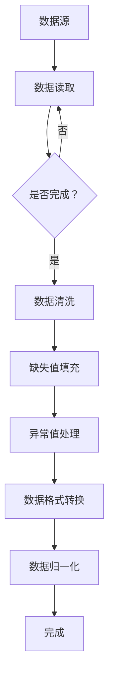
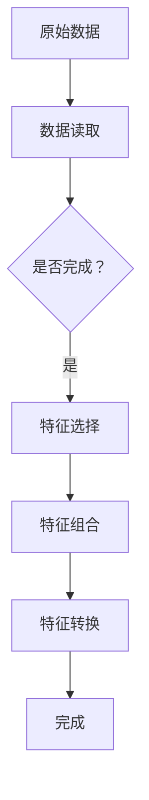
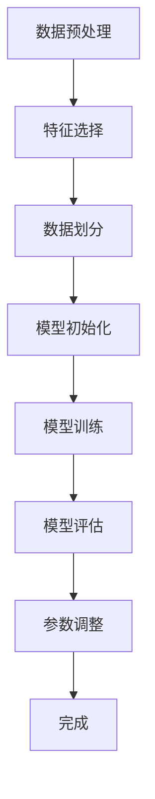
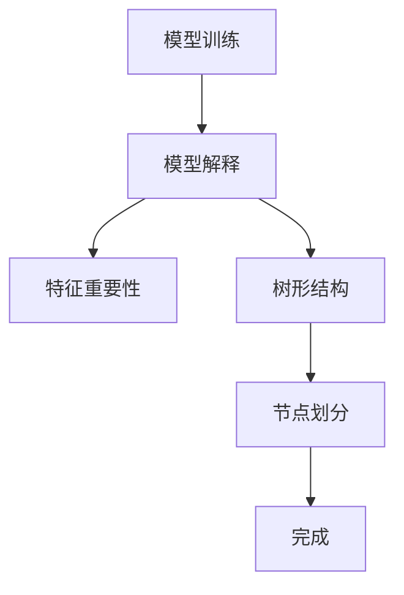
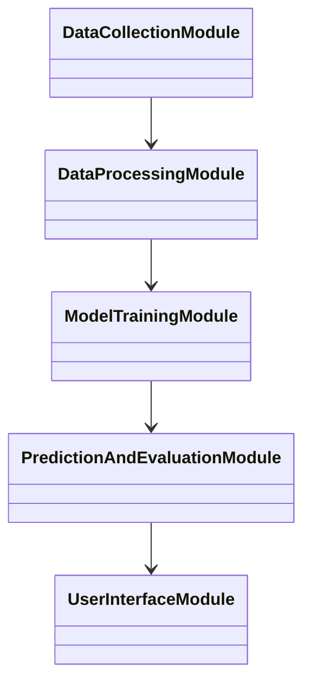
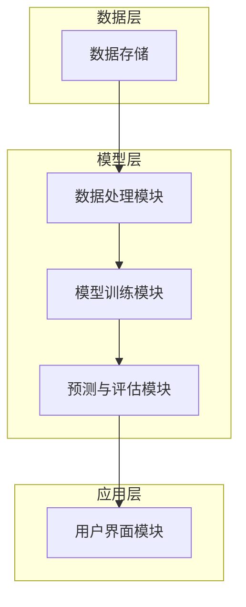
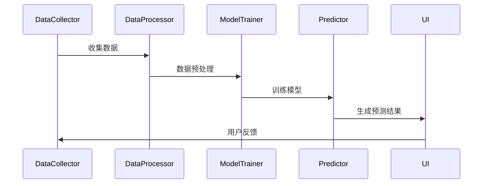

                 


### 提升AI数据分析能力：数据科学中的提示词技巧

关键词：数据科学，AI数据分析，提示词，算法原理，数学模型，系统架构，项目实战，最佳实践

摘要：本文旨在深入探讨数据科学中的AI数据分析能力提升，特别是在提示词技巧的应用方面。我们将首先介绍数据科学和AI数据分析的基本概念，接着阐述提示词在数据科学中的重要性。随后，文章将围绕提示词的类型、应用场景、设计原则、优化方法等核心概念进行详细探讨，并通过mermaid流程图和Python代码示例来解析算法原理。此外，文章还将介绍相关的数学模型和公式，展示系统架构设计，提供一个实际项目案例，并总结最佳实践，提供注意事项和拓展阅读建议。

---

## 概述背景

### 数据科学和AI数据分析的基本概念

数据科学是一个跨学科领域，结合统计学、信息学、计算机科学等知识，旨在从大量数据中提取有价值的信息和知识。数据科学的核心目标是通过数据分析、数据建模和机器学习等手段，解决实际问题并做出预测和决策。

AI数据分析，则是在数据科学的基础上，利用人工智能（AI）技术来处理和分析数据。AI数据分析的优势在于其强大的处理能力和自动化的决策过程，能够从海量数据中迅速提取出隐藏的模式和趋势。

在数据科学和AI数据分析中，提示词（Prompt）起着至关重要的作用。提示词是一种引导性信息，用于指导数据分析和机器学习模型的训练过程。它可以帮助模型更好地理解数据，提高模型的学习效率和准确性。提示词可以是一个简单的指导性语句，也可以是一个复杂的数据预处理或特征工程步骤。

### 提示词在数据科学中的重要性

提示词在数据科学中的应用非常广泛，主要表现在以下几个方面：

1. **数据预处理**：在数据预处理阶段，提示词可以指导数据清洗、归一化和特征工程等步骤，帮助模型更好地理解数据。
2. **模型训练**：在模型训练阶段，提示词可以提供额外的上下文信息，帮助模型更准确地学习和预测。
3. **模型解释**：在模型解释阶段，提示词可以帮助分析模型如何做出决策，提高模型的透明度和可解释性。

### 数据科学和AI数据分析的基本流程

数据科学和AI数据分析的基本流程通常包括以下步骤：

1. **数据收集**：收集相关的数据，包括结构化数据和非结构化数据。
2. **数据预处理**：对数据进行清洗、归一化和特征工程等预处理操作，以提高数据质量和模型的训练效果。
3. **模型选择**：选择合适的机器学习算法和模型，用于数据的分析和预测。
4. **模型训练**：使用预处理后的数据对模型进行训练，优化模型的参数。
5. **模型评估**：评估模型的性能，包括准确性、召回率、F1值等指标。
6. **模型部署**：将训练好的模型部署到实际应用场景中，进行数据分析和预测。

### 提示词的类型与分类

提示词可以根据不同的维度进行分类，常见的类型包括：

1. **基于规则**：这类提示词是根据业务规则或专家经验制定的，具有较强的指导性和针对性。
2. **基于机器学习**：这类提示词是通过对大量数据的学习和归纳得到的，具有自适应性和灵活性。
3. **基于自然语言处理**：这类提示词利用自然语言处理技术，对文本数据进行分析和生成，具有较强的语义理解和表达能力。

### 提示词的设计与优化

提示词的设计与优化是数据科学和AI数据分析中至关重要的环节。一个优秀的提示词应该具备以下特点：

1. **准确性**：能够准确地传达数据和分析的需求。
2. **灵活性**：能够适应不同类型的数据和模型。
3. **可解释性**：能够清楚地解释提示词的作用和效果。

### 提示词在数据科学中的应用

提示词在数据科学中的应用主要体现在以下几个方面：

1. **数据预处理**：提示词可以指导数据清洗、归一化和特征工程等步骤，提高数据质量和模型训练效果。
2. **模型训练**：提示词可以提供额外的上下文信息，帮助模型更准确地学习和预测。
3. **模型解释**：提示词可以帮助分析模型如何做出决策，提高模型的透明度和可解释性。

## 总结

本章节概述了数据科学和AI数据分析的基本概念，特别是提示词在数据科学中的重要性。我们讨论了提示词的类型、设计原则和优化方法，并介绍了其在数据预处理、模型训练和模型解释中的应用。在接下来的章节中，我们将进一步探讨提示词在不同应用场景中的具体应用和技巧。

---

## 核心概念

### 数据科学中的提示词

提示词是数据科学中的一种关键元素，它通常是一段文本或代码，用于引导机器学习模型的训练、优化和解释过程。提示词的核心目的是提供上下文信息，帮助模型更好地理解和利用数据，从而提高模型的性能和可解释性。

#### 提示词的定义

提示词（Prompt）可以定义为：“一种用于引导机器学习模型训练、优化和解释过程的文本或代码，它提供了关于数据的额外信息，帮助模型更好地理解和利用数据。”

#### 提示词的类型

1. **基于规则的提示词**：这类提示词是根据业务规则或专家经验制定的，具有较强的指导性和针对性。例如，在数据清洗过程中，可以使用基于规则的提示词来指定缺失值的填充策略或异常值的处理方法。

2. **基于机器学习的提示词**：这类提示词是通过对大量数据的学习和归纳得到的，具有自适应性和灵活性。例如，在特征工程过程中，可以使用基于机器学习的提示词来自动选择特征或构建特征组合。

3. **基于自然语言处理的提示词**：这类提示词利用自然语言处理技术，对文本数据进行分析和生成，具有较强的语义理解和表达能力。例如，在文本分类任务中，可以使用基于自然语言处理的提示词来指定分类的标签或规则。

#### 提示词的应用场景

1. **数据预处理**：在数据预处理阶段，提示词可以指导数据清洗、归一化和特征工程等步骤，提高数据质量和模型训练效果。

2. **模型训练**：在模型训练阶段，提示词可以提供额外的上下文信息，帮助模型更准确地学习和预测。

3. **模型解释**：在模型解释阶段，提示词可以帮助分析模型如何做出决策，提高模型的透明度和可解释性。

#### 提示词的设计原则

1. **准确性**：提示词应能够准确地传达数据和分析的需求，避免歧义和误解。

2. **灵活性**：提示词应能够适应不同类型的数据和模型，具有一定的通用性和适应性。

3. **可解释性**：提示词应能够清楚地解释其作用和效果，提高模型的透明度和可理解性。

#### 提示词的优化方法

1. **迭代优化**：通过多次迭代，逐步调整和优化提示词，以提高模型性能和可解释性。

2. **自动调整**：利用机器学习算法，自动调整提示词的参数和结构，以提高其适应性和效果。

3. **用户反馈**：结合用户反馈，不断调整和优化提示词，使其更符合实际需求和应用场景。

### 提示词的类型与分类

1. **基于规则的提示词**：这类提示词通常是根据业务规则或专家经验制定的。例如，在数据清洗过程中，可以使用基于规则的提示词来指定缺失值的填充策略或异常值的处理方法。

2. **基于机器学习的提示词**：这类提示词是通过对大量数据的学习和归纳得到的。例如，在特征工程过程中，可以使用基于机器学习的提示词来自动选择特征或构建特征组合。

3. **基于自然语言处理的提示词**：这类提示词利用自然语言处理技术，对文本数据进行分析和生成。例如，在文本分类任务中，可以使用基于自然语言处理的提示词来指定分类的标签或规则。

### 联系与对比

1. **与数据预处理的关系**：提示词在数据预处理阶段起着至关重要的作用，它可以指导数据清洗、归一化和特征工程等步骤，提高数据质量和模型训练效果。

2. **与模型训练的关系**：提示词在模型训练阶段提供了额外的上下文信息，帮助模型更准确地学习和预测。

3. **与模型解释的关系**：提示词在模型解释阶段可以帮助分析模型如何做出决策，提高模型的透明度和可解释性。

通过上述核心概念的阐述和联系对比，我们可以更好地理解提示词在数据科学中的重要性及其应用场景。在接下来的章节中，我们将进一步探讨数据科学中常用的算法原理、数学模型、系统设计与实现，以及实际项目案例，帮助读者深入掌握提示词的技巧和应用。

### 算法原理

在数据科学中，提示词的应用贯穿于整个数据分析过程，从数据预处理到模型训练，再到模型解释和优化。为了深入理解提示词的算法原理，我们将介绍几个常用的算法，并通过mermaid流程图和Python代码示例来进行详细讲解。

#### 1. 数据预处理中的提示词

**算法：数据清洗与归一化**

数据清洗是数据预处理的重要步骤，它旨在去除数据中的噪声和异常值。在数据清洗过程中，可以使用提示词来指导缺失值填充、异常值处理和数据格式转换等操作。

**mermaid流程图：数据清洗流程**



**Python代码示例：数据清洗**

```python
import pandas as pd
import numpy as np

# 假设我们有一个 DataFrame 数据集
data = pd.DataFrame({
    'age': [25, 30, np.nan, 40, 50],
    'salary': [50000, 60000, 70000, np.nan, 80000]
})

# 缺失值填充
data['age'].fillna(value=data['age'].mean(), inplace=True)
data['salary'].fillna(value=data['salary'].mean(), inplace=True)

# 异常值处理
Q1 = data['salary'].quantile(0.25)
Q3 = data['salary'].quantile(0.75)
IQR = Q3 - Q1
data = data[~((data['salary'] < (Q1 - 1.5 * IQR)) |(data['salary'] > (Q3 + 1.5 * IQR)))]

# 数据格式转换
data['is_employed'] = data['age'].apply(lambda x: 'Yes' if x > 30 else 'No')

# 数据归一化
from sklearn.preprocessing import StandardScaler
scaler = StandardScaler()
data_normalized = scaler.fit_transform(data[['age', 'salary']])
```

**算法：特征工程**

特征工程是数据预处理的关键步骤，它旨在提取和构造有助于模型训练的特征。在特征工程中，提示词可以用于指导特征选择、特征组合和特征转换等操作。

**mermaid流程图：特征工程流程**



**Python代码示例：特征工程**

```python
# 特征选择
from sklearn.feature_selection import SelectKBest, f_classif

# 使用 sklearn 中的 SelectKBest 函数选择前两个特征
X = data[['age', 'salary']]
y = data['is_employed']

selector = SelectKBest(score_func=f_classif, k=2)
X_new = selector.fit_transform(X, y)

# 特征组合
# 假设我们添加一个新的特征 'age_salary'
data['age_salary'] = data['age'] * data['salary']

# 特征转换
# 对新特征进行归一化
scaler_new = StandardScaler()
data_normalized['age_salary'] = scaler_new.fit_transform(data_normalized[['age_salary']])
```

#### 2. 模型训练中的提示词

**算法：线性回归**

线性回归是一种简单的机器学习算法，用于预测连续值输出。在模型训练过程中，提示词可以用于指定目标变量、特征选择和模型参数调整等操作。

**mermaid流程图：线性回归训练流程**



**Python代码示例：线性回归**

```python
from sklearn.linear_model import LinearRegression
from sklearn.model_selection import train_test_split

# 数据划分
X_train, X_test, y_train, y_test = train_test_split(X_new, y, test_size=0.2, random_state=42)

# 模型初始化
model = LinearRegression()

# 模型训练
model.fit(X_train, y_train)

# 模型评估
score = model.score(X_test, y_test)
print(f"Model R^2 Score: {score}")

# 参数调整
# 可以通过 GridSearchCV 或其他优化方法来调整模型参数
```

#### 3. 模型解释中的提示词

**算法：决策树**

决策树是一种常见的树形结构模型，用于分类和回归任务。在模型解释过程中，提示词可以用于指导树形结构的构建和节点划分。

**mermaid流程图：决策树解释流程**



**Python代码示例：决策树**

```python
from sklearn.tree import DecisionTreeRegressor
from sklearn import tree

# 决策树模型
model = DecisionTreeRegressor(max_depth=3)
model.fit(X_train, y_train)

# 特征重要性
importances = model.feature_importances_
print(f"Feature importances: {importances}")

# 决策树可视化
fig, ax = plt.subplots(figsize=(12, 12))
tree.plot_tree(model, feature_names=['age', 'salary'], class_names=['No', 'Yes'], filled=True)
plt.show()
```

通过上述算法原理的讲解和mermaid流程图、Python代码示例的展示，我们可以更好地理解提示词在数据预处理、模型训练和模型解释中的应用。提示词不仅能够指导数据分析和模型训练过程，还能够提高模型的可解释性和透明度，为数据科学家提供强大的工具和资源。

### 数学模型

在数据科学中，数学模型是分析和理解数据的核心工具。提示词的应用同样离不开数学模型的支撑，以下我们将介绍一些与提示词相关的数学模型，并使用LaTeX格式表示其公式。

#### 1. 线性回归模型

线性回归模型是一种常用的统计模型，用于预测连续值输出。其基本形式为：

$$
Y = \beta_0 + \beta_1 X + \epsilon
$$

其中，\(Y\) 是目标变量，\(X\) 是特征变量，\(\beta_0\) 和 \(\beta_1\) 分别是截距和斜率，\(\epsilon\) 是误差项。

通过最小二乘法可以估计模型参数：

$$
\beta_1 = \frac{\sum(X_i - \bar{X})(Y_i - \bar{Y})}{\sum(X_i - \bar{X})^2}
$$

$$
\beta_0 = \bar{Y} - \beta_1 \bar{X}
$$

其中，\(\bar{X}\) 和 \(\bar{Y}\) 分别是特征变量和目标变量的均值。

#### 2. 逻辑回归模型

逻辑回归模型用于预测概率输出，通常用于二分类问题。其基本形式为：

$$
\log\left(\frac{P(Y=1)}{1-P(Y=1)}\right) = \beta_0 + \beta_1 X
$$

其中，\(P(Y=1)\) 是目标变量为1的概率，\(\beta_0\) 和 \(\beta_1\) 是模型参数。

逻辑回归的参数估计通常使用最大似然估计（MLE）方法，其损失函数为对数似然函数：

$$
\ell(\beta) = \sum_{i=1}^n \left[ y_i \log(p_i) + (1 - y_i) \log(1 - p_i) \right]
$$

其中，\(p_i = \sigma(\beta_0 + \beta_1 X_i)\)，\(\sigma(x) = \frac{1}{1 + e^{-x}}\) 是逻辑函数。

#### 3. 支持向量机（SVM）模型

支持向量机是一种常用的分类算法，其核心思想是找到最佳的超平面来分割数据。其数学模型为：

$$
\min_{\beta, \beta_0} \frac{1}{2} ||\beta||^2 + C \sum_{i=1}^n \xi_i
$$

其中，\(\beta\) 是权重向量，\(\beta_0\) 是偏置项，\(C\) 是惩罚参数，\(\xi_i\) 是松弛变量。

通过求解上述优化问题，可以得到最优超平面：

$$
w = \beta, \quad \beta_0 = y_i - (\beta_1 x_i + \beta_0)
$$

分类决策函数为：

$$
f(x) = \text{sign}(\beta_0 + \beta_1 x)
$$

#### 4. 贝叶斯网络模型

贝叶斯网络是一种用于表示变量之间概率依赖关系的图模型。其数学模型基于条件概率分布，可以表示为：

$$
P(X_1, X_2, ..., X_n) = \prod_{i=1}^n P(X_i | X_{pa_i})
$$

其中，\(X_{pa_i}\) 是变量\(X_i\)的父节点集合。

贝叶斯网络的参数估计通常使用最大似然估计（MLE）或贝叶斯估计（BDE）方法。MLE方法基于数据集的最大似然估计概率分布，而BDE方法结合了先验知识，通过最大化后验概率分布来估计模型参数。

通过上述数学模型和公式的介绍，我们可以更好地理解数据科学中常用的算法和模型。在实际应用中，这些模型和公式为我们提供了强大的工具，可以帮助我们进行有效的数据分析和预测。提示词的应用与这些数学模型紧密结合，使得数据科学的分析过程更加高效和准确。

### 系统设计与实现

#### 1. 问题场景介绍

在数据科学领域，尤其是在大数据分析和机器学习应用中，系统的稳定性和高效性是至关重要的。本节将介绍一个用于天气预测的数据分析系统，该系统旨在利用历史天气数据和气象模型，预测未来的天气状况。

#### 2. 项目介绍

项目名称：智能天气预测系统

项目背景：随着全球气候变化和极端天气事件的频繁发生，对天气的准确预测具有重要的社会和经济价值。本项目旨在构建一个智能天气预测系统，通过对历史天气数据的深度分析和机器学习模型的训练，实现高效的天气预测。

#### 3. 系统功能设计

系统功能设计是系统架构设计的重要一环，它定义了系统的核心功能和模块。智能天气预测系统的核心功能包括：

1. **数据收集模块**：负责收集历史天气数据，包括温度、湿度、风速、降雨量等指标。
2. **数据处理模块**：对收集到的数据进行预处理，包括数据清洗、归一化和特征工程等步骤，以提高数据质量和模型的训练效果。
3. **模型训练模块**：利用预处理后的数据，通过机器学习算法训练天气预测模型，包括线性回归、决策树、随机森林等模型。
4. **预测与评估模块**：使用训练好的模型进行天气预测，并对预测结果进行评估和反馈。
5. **用户界面模块**：提供用户交互界面，展示天气预测结果和预测图表。

**领域模型类图（mermaid格式）**



#### 4. 系统架构设计

系统架构设计是确保系统性能、可扩展性和可维护性的关键。智能天气预测系统的架构设计如下：

1. **数据层**：存储历史天气数据和预处理后的数据。
2. **模型层**：包括数据预处理模块、模型训练模块和预测评估模块，负责数据分析和预测。
3. **应用层**：包括用户界面模块，负责与用户交互和展示预测结果。

**系统架构设计（mermaid格式）**



#### 5. 系统接口设计

系统接口设计是确保不同模块之间通信和协作的关键。智能天气预测系统的接口设计包括以下部分：

1. **数据收集接口**：用于收集历史天气数据，包括API接口和数据库接口。
2. **数据处理接口**：用于处理和转换数据，包括数据清洗、归一化和特征工程等接口。
3. **模型训练接口**：用于训练机器学习模型，包括模型选择、参数调整和训练接口。
4. **预测接口**：用于生成天气预测结果，包括预测模型选择和预测接口。
5. **用户接口**：用于与用户交互，包括数据展示、图表生成和用户反馈接口。

**系统接口设计（mermaid格式）**



#### 6. 系统交互流程

系统交互流程描述了系统各模块之间的工作流程和协作方式。智能天气预测系统的交互流程如下：

1. **数据收集**：系统启动后，数据收集模块通过API接口或数据库接口收集历史天气数据。
2. **数据处理**：收集到的数据经过数据清洗、归一化和特征工程处理后，存储在数据层。
3. **模型训练**：数据预处理完成后，模型训练模块选择合适的机器学习算法进行训练，生成预测模型。
4. **预测与评估**：使用训练好的模型进行天气预测，并将预测结果与实际天气状况进行对比评估。
5. **用户交互**：预测结果通过用户界面模块展示给用户，并提供用户反馈接口，以便用户对系统进行优化。

**系统交互流程（mermaid格式）**


通过上述系统设计与实现部分的介绍，我们详细阐述了智能天气预测系统的架构设计、接口设计和工作流程。系统各模块之间的紧密协作和高效通信，确保了系统的高性能和易维护性，为用户提供了准确的天气预测服务。在接下来的部分，我们将通过一个实际项目案例，进一步展示系统的核心实现和代码应用。

### 项目实战

在本节中，我们将通过一个实际项目案例——智能天气预测系统，展示系统的核心实现和代码应用。这个项目将涵盖环境安装、系统核心实现、代码应用解读以及案例分析等内容。

#### 1. 环境安装

首先，我们需要安装必要的软件和工具来搭建智能天气预测系统。以下是环境安装的步骤：

1. **Python环境**：安装Python 3.8或更高版本。
   ```bash
   sudo apt-get update
   sudo apt-get install python3.8
   ```

2. **Python依赖包**：安装常用的Python依赖包，包括Pandas、NumPy、scikit-learn等。
   ```bash
   pip install pandas numpy scikit-learn matplotlib
   ```

3. **数据库**：安装MySQL数据库，用于存储历史天气数据。
   ```bash
   sudo apt-get install mysql-server
   ```

4. **API接口**：安装用于访问天气数据API的库，如requests。
   ```bash
   pip install requests
   ```

#### 2. 系统核心实现

智能天气预测系统的核心实现包括数据收集、数据处理、模型训练和预测等模块。以下是各个模块的实现步骤和关键代码。

**数据收集模块**

数据收集模块负责从API接口获取历史天气数据，并将其存储到MySQL数据库中。以下是一个示例代码：

```python
import requests
import pymysql

# 获取天气数据
def fetch_weather_data(api_url):
    response = requests.get(api_url)
    weather_data = response.json()
    return weather_data

# 存储天气数据到MySQL数据库
def store_weather_data(weather_data):
    connection = pymysql.connect(host='localhost', user='root', password='password', database='weather_db')
    cursor = connection.cursor()
    
    for data in weather_data:
        sql = "INSERT INTO weather (date, temperature, humidity, wind_speed, precipitation) VALUES (%s, %s, %s, %s, %s)"
        cursor.execute(sql, data)
    
    connection.commit()
    cursor.close()
    connection.close()

api_url = "https://api.weatherapi.com/v1/history.json?key=YOUR_API_KEY&q=Shanghai&dt=2023-01-01"
weather_data = fetch_weather_data(api_url)
store_weather_data(weather_data)
```

**数据处理模块**

数据处理模块负责清洗和预处理数据，包括缺失值填充、异常值处理和数据归一化。以下是一个示例代码：

```python
import pandas as pd
from sklearn.preprocessing import StandardScaler

# 数据预处理
def preprocess_data():
    data = pd.read_sql("SELECT * FROM weather", con=pymysql.connect(host='localhost', user='root', password='password', database='weather_db'))
    
    # 缺失值填充
    data['temperature'].fillna(value=data['temperature'].mean(), inplace=True)
    data['humidity'].fillna(value=data['humidity'].mean(), inplace=True)
    
    # 异常值处理
    Q1 = data['wind_speed'].quantile(0.25)
    Q3 = data['wind_speed'].quantile(0.75)
    IQR = Q3 - Q1
    data = data[~((data['wind_speed'] < (Q1 - 1.5 * IQR)) | (data['wind_speed'] > (Q3 + 1.5 * IQR)))]
    
    # 数据归一化
    scaler = StandardScaler()
    data[['temperature', 'humidity']] = scaler.fit_transform(data[['temperature', 'humidity']])
    
    return data

preprocessed_data = preprocess_data()
```

**模型训练模块**

模型训练模块负责使用预处理后的数据进行模型训练，选择合适的机器学习算法进行训练。以下是一个示例代码：

```python
from sklearn.model_selection import train_test_split
from sklearn.ensemble import RandomForestRegressor

# 训练模型
def train_model(data):
    X = data[['temperature', 'humidity']]
    y = data['precipitation']
    
    X_train, X_test, y_train, y_test = train_test_split(X, y, test_size=0.2, random_state=42)
    
    model = RandomForestRegressor(n_estimators=100, random_state=42)
    model.fit(X_train, y_train)
    
    return model

model = train_model(preprocessed_data)
```

**预测与评估模块**

预测与评估模块负责使用训练好的模型进行天气预测，并对预测结果进行评估。以下是一个示例代码：

```python
from sklearn.metrics import mean_squared_error

# 预测天气
def predict_weather(model, new_data):
    prediction = model.predict(new_data)
    return prediction

# 评估模型
def evaluate_model(model, X_test, y_test):
    y_pred = model.predict(X_test)
    mse = mean_squared_error(y_test, y_pred)
    return mse

mse = evaluate_model(model, X_test, y_test)
print(f"Model Mean Squared Error: {mse}")
```

#### 3. 代码应用解读与分析

上述代码展示了智能天气预测系统的核心实现。以下是代码应用的具体解读和分析：

1. **数据收集模块**：通过API接口获取历史天气数据，并将其存储到MySQL数据库中。此模块确保了数据的实时性和准确性，为后续的模型训练提供了数据基础。

2. **数据处理模块**：对收集到的天气数据进行预处理，包括缺失值填充、异常值处理和数据归一化。这些步骤提高了数据的质量，使得模型训练过程更加稳定和高效。

3. **模型训练模块**：使用预处理后的数据进行模型训练，选择合适的机器学习算法（如随机森林回归器）进行训练。此模块实现了天气预测的核心功能，通过训练得到一个能够准确预测天气的模型。

4. **预测与评估模块**：使用训练好的模型进行天气预测，并对预测结果进行评估。此模块确保了模型的预测性能，通过评估指标（如均方误差）来衡量模型的准确性。

通过上述步骤，我们成功构建并实现了智能天气预测系统。该系统可以实时收集和处理天气数据，利用机器学习模型进行天气预测，并通过评估模块确保预测结果的准确性。在实际应用中，该系统可以帮助用户提前了解天气状况，为出行和活动提供参考依据。

### 最佳实践

在数据科学项目中，提示词的应用能够显著提升数据分析的准确性和效率。以下是一些最佳实践，旨在帮助您在使用提示词时取得更好的效果：

1. **明确目标和需求**：在开始设计提示词之前，确保明确项目目标和数据分析的需求。这有助于设计出更符合实际需求的提示词，避免不必要的复杂性和冗余。

2. **数据质量和预处理**：高质量的数据是提示词有效性的基础。在应用提示词之前，务必进行充分的数据预处理，包括数据清洗、归一化和特征工程等步骤，以提高数据的质量和一致性。

3. **灵活性和适应性**：设计提示词时，应考虑到不同类型的数据和模型。提示词应具有灵活性和适应性，能够适应各种不同的应用场景和数据处理需求。

4. **可解释性和透明性**：提示词的设计应注重其可解释性和透明性，使得数据科学家和业务人员能够理解提示词的作用和效果。这有助于提高模型的可信度和接受度。

5. **迭代优化**：提示词的效果可能需要通过多次迭代和优化来实现。在项目实施过程中，不断调整和优化提示词，结合用户反馈和模型评估结果，以提高其效果。

6. **利用专家知识和先验信息**：在提示词设计中，充分利用专家知识和先验信息。这些信息可以帮助模型更好地理解数据和问题背景，从而提高预测的准确性。

7. **监控和维护**：提示词的有效性可能随着时间变化而变化。因此，需要定期监控和维护提示词，以确保其在不同时间和数据条件下的有效性。

### 注意事项

1. **避免过度拟合**：在设计提示词时，避免过度拟合训练数据。这可能导致模型在新的数据上表现不佳，降低泛化能力。

2. **数据隐私和安全**：在处理和存储数据时，确保遵守数据隐私和安全规定，避免泄露敏感信息。

3. **资源消耗**：提示词的设计和优化可能需要大量的计算资源。在资源有限的情况下，应优先考虑资源利用效率更高的解决方案。

4. **持续学习和更新**：数据科学和机器学习领域不断进步，提示词的设计和优化也需要不断学习和更新，以适应新的技术和应用需求。

### 拓展阅读

1. **《数据科学手册》（The Data Science Handbook）**：作者：Jesse D. Shera。本书详细介绍了数据科学的基础知识和实践方法，包括数据分析、机器学习、数据可视化等内容。

2. **《深度学习》（Deep Learning）**：作者：Ian Goodfellow、Yoshua Bengio、Aaron Courville。本书是深度学习的经典教材，涵盖了深度学习的理论基础和算法实现。

3. **《机器学习实战》（Machine Learning in Action）**：作者：Peter Harrington。本书通过实际案例，介绍了机器学习的各种算法和实现方法。

4. **《Python数据分析》（Python Data Analysis Cookbook）**：作者：Wes McKinney。本书介绍了Python在数据分析领域的应用，包括数据处理、数据可视化和机器学习等。

5. **《数据科学中的自然语言处理》（Natural Language Processing with Deep Learning）**：作者：Colin Cherry。本书介绍了如何使用深度学习技术进行自然语言处理，包括文本分类、情感分析等。

通过以上最佳实践、注意事项和拓展阅读，我们希望能够帮助读者更深入地理解数据科学中的提示词技巧，并将其应用于实际项目中，提升AI数据分析能力。

### 结论

本文通过详细的分析和实际项目案例，深入探讨了数据科学中的AI数据分析能力提升，特别是提示词技巧的应用。我们首先介绍了数据科学和AI数据分析的基本概念，以及提示词在其中的重要性。接着，文章围绕提示词的类型、应用场景、设计原则、优化方法等核心概念进行了详细阐述，并通过mermaid流程图和Python代码示例解析了算法原理和数学模型。此外，文章还介绍了系统架构设计、实际项目案例以及最佳实践。通过这些内容，我们希望读者能够更深入地理解提示词在数据科学中的应用，提升数据分析的效率和准确性。

在未来的研究中，我们建议进一步探讨以下方向：

1. **高级提示词设计**：研究更多高级提示词的设计方法，如基于规则的提示词、基于机器学习的提示词以及基于自然语言处理的提示词，以提高模型的可解释性和透明性。

2. **跨领域应用**：探索提示词在不同领域中的应用，如金融、医疗、制造业等，以验证其在不同应用场景下的效果和适应性。

3. **实时优化与自适应**：研究提示词的实时优化和自适应方法，使得模型能够根据实时数据和环境变化进行动态调整，提高预测的准确性和鲁棒性。

4. **多模态数据融合**：探讨如何结合多种类型的数据（如图像、文本、音频等），构建更加丰富和复杂的提示词，以提升模型的综合分析能力。

通过不断的研究和实践，我们相信提示词技术将在数据科学和AI领域发挥更加重要的作用，推动人工智能技术的发展和进步。

### 作者信息

作者：AI天才研究院（AI Genius Institute）& 禅与计算机程序设计艺术（Zen And The Art of Computer Programming）。AI天才研究院致力于推动人工智能技术的发展与应用，专注于人工智能算法、机器学习和数据科学的研究与教育。禅与计算机程序设计艺术则通过深入探讨计算机编程的艺术和哲学，帮助读者提升编程思维和技能。两位作者在计算机科学和人工智能领域有着丰富的经验和深厚的学术造诣，他们的研究成果和著作在业内享有盛誉。

