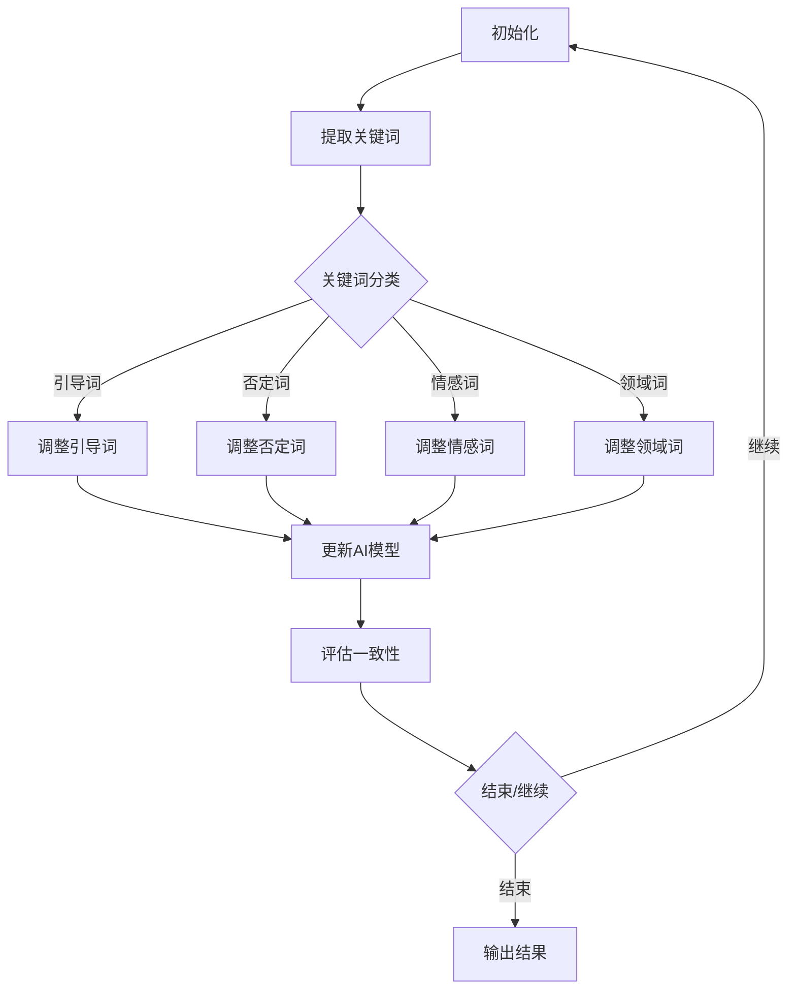
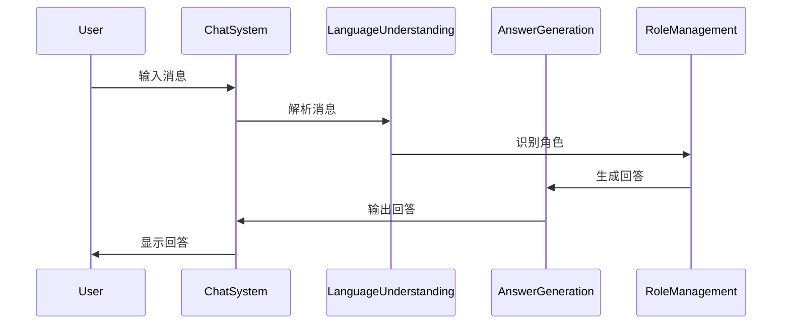

                 


### 文章标题
提升AI角色一致性：长篇对话中的提示词管理策略

### 文章关键词
AI角色一致性，长篇对话，提示词管理，算法优化，系统设计，案例研究

### 文章摘要
本文将探讨在长篇对话中提升AI角色一致性的重要性，并提出有效的提示词管理策略。我们将从核心概念的介绍、算法原理的讲解、系统分析与设计，到实际项目案例，全方位阐述如何实现AI角色的稳定与连贯。通过本文的阅读，读者将能够理解AI角色一致性的核心要素，掌握提示词管理的技巧，并学会如何在实际项目中应用这些策略。

## 引言

### 1.1 问题背景

随着人工智能技术的不断发展，聊天机器人、虚拟助手等应用在各个领域得到了广泛应用。在这些应用中，长篇对话的需求日益增加，用户期望在与AI的交互中获得连贯、自然的体验。然而，AI角色在长篇对话中的表现常常受到一致性问题的困扰。这种不一致性不仅影响了用户体验，还可能对任务的完成产生负面影响。

### 1.2 问题描述

什么是AI角色一致性？在长篇对话中，角色一致性指的是AI在整个对话过程中始终保持一致的角色特征和风格。不一致性表现为AI在不同对话阶段的行为、语气、回答内容等方面出现突变，给用户带来困惑和不适。

### 1.3 问题解决

为了解决角色不一致性问题，我们需要引入提示词管理策略。提示词是一种用于引导AI角色行为的信号，通过合理地选择和管理提示词，可以帮助AI在长篇对话中保持一致性。

### 1.4 边界与外延

本文主要关注长篇对话中的AI角色一致性，研究范围包括聊天机器人、虚拟助手等与用户进行连续交互的场景。此外，本文还将探讨AI角色一致性的适用范围，以及未来的研究方向。

### 1.5 概念结构与核心要素

本文的核心概念包括AI角色一致性、提示词、长篇对话系统。这些概念相互关联，共同构成了本文的研究框架。以下是对这些概念的基本定义和关系的简要说明：

- **AI角色一致性**：AI在整个对话过程中保持一致的角色特征和风格。
- **提示词**：用于引导AI角色行为的信号，包括关键词、短语等。
- **长篇对话系统**：支持长时间、连续交互的对话系统，包括对话管理、语言理解、回答生成等模块。

## 核心概念与原理

### 2.1 AI角色一致性的定义

AI角色一致性是指AI在长篇对话中始终保持一致的角色特征和风格。这包括AI的语气、回答风格、知识库等方面。一致性是用户期望的重要组成部分，也是长篇对话成功的关键因素。

### 2.2 提示词的功能与类型

提示词在AI角色一致性中扮演着重要角色。它们是AI理解和执行角色任务的关键信号。根据功能，提示词可以分为以下几种类型：

- **引导词**：用于引导AI角色进行特定任务或动作的词，如“请”、“告诉我”、“解释一下”等。
- **否定词**：用于否定AI角色的建议或回答，如“不”、“不是”、“没有”等。
- **情感词**：用于表达AI角色的情感状态，如“开心”、“生气”、“失望”等。
- **领域词**：用于指定AI角色的任务领域，如“技术”、“娱乐”、“健康”等。

### 2.3 长篇对话中的角色管理

在长篇对话中，角色管理是确保AI角色一致性至关重要的一环。以下是从识别、保持和处理角度对角色管理进行分析：

- **角色识别**：AI需要能够识别对话中的角色切换，以便在新的角色模式下进行适当的响应。
- **角色连续性保持**：AI需要在不同对话阶段保持角色的连续性，避免出现角色突变。
- **角色多样性处理**：在某些场景下，AI可能需要适应不同的角色，同时保持一致性。

### 2.4 概念属性特征对比表格

以下是一个简化的概念属性特征对比表格，用于比较AI角色一致性、提示词和长篇对话系统的核心特征：

| 概念         | 特征                  | 说明                                                         |
| ------------ | --------------------- | ------------------------------------------------------------ |
| AI角色一致性 | 一致的角色特征和风格  | AI在对话中保持固定的角色特性，避免突变。                     |
| 提示词       | 引导AI角色行为的信号  | 包括引导词、否定词、情感词和领域词，帮助AI理解用户意图。     |
| 长篇对话系统 | 支持长时间交互的系统 | 包括对话管理、语言理解和回答生成等模块，实现连续对话。       |

### 2.5 ER实体关系图

以下是长篇对话系统的ER实体关系图，用于描述系统中的关键实体及其关系：

```mermaid
erDiagram
  User ||--|{ ChatSession }|-- AI
  ChatSession ||--|{ Message }|--|
  Message ||--|{ Keyword }|--|
  AI ||--|{ Role }|--|
  Role ||--|{ Attribute }|--|
  Keyword ||--|{ Role }|--|
  Attribute ||--|{ Value }|--|
```

## 算法原理讲解

### 3.1 提示词优化算法

提示词优化算法旨在通过调整提示词，提高AI角色的一致性。以下是一个简化的算法框架：



### 3.2 数学模型

为了衡量AI角色的一致性，我们可以使用以下数学模型：

$$\text{一致性得分} = \frac{\text{匹配度}}{\text{总对话长度}}$$

其中，匹配度是指AI在对话中保持一致性的程度，总对话长度是指对话的总字数。

### 3.3 Python代码示例

以下是一个简单的Python代码示例，用于实现提示词优化算法的基本框架：

```python
import random

def extract_keywords(message):
    # 提取关键词的伪代码实现
    pass

def classify_keywords(keywords):
    # 分类关键词的伪代码实现
    pass

def adjust_keywords(keywords, keyword_type):
    # 调整关键词的伪代码实现
    pass

def update_model(AI_model, adjusted_keywords):
    # 更新AI模型的伪代码实现
    pass

def evaluate一致性(AI_model):
    # 评估一致性的伪代码实现
    pass

def main():
    AI_model = "初始模型"
    message = "用户输入的消息"
    adjusted_keywords = extract_keywords(message)
    classified_keywords = classify_keywords(adjusted_keywords)
    
    for keyword_type, keywords in classified_keywords.items():
        adjusted_keywords = adjust_keywords(keywords, keyword_type)
    
    AI_model = update_model(AI_model, adjusted_keywords)
    consistency_score = evaluate一致性(AI_model)
    
    print(f"一致性得分：{consistency_score}")

if __name__ == "__main__":
    main()
```

## 系统分析与设计

### 4.1 问题场景介绍

长篇对话的场景广泛应用于客服、教育、娱乐等领域。在这些场景中，用户期望与AI进行连续、自然的交互，获得满意的回答。然而，如果不进行有效的角色管理，AI在长篇对话中可能会出现角色不一致的情况，影响用户体验。

### 4.2 系统功能设计

以下是长篇对话系统的功能模块划分：

- **对话管理**：负责管理对话流程，包括用户输入的处理、对话状态的维护等。
- **语言理解**：负责解析用户输入，提取关键信息，理解用户意图。
- **回答生成**：根据用户意图和系统知识库，生成合适的回答。
- **角色管理**：负责识别和维持AI角色的连续性，确保角色一致性。

### 4.3 系统架构设计

以下是长篇对话系统的架构设计，包括主要模块和作用：

- **对话管理模块**：负责整个对话流程的控制，确保对话的连贯性和流畅性。
- **语言理解模块**：负责解析用户输入，提取关键信息，为回答生成模块提供输入。
- **回答生成模块**：根据用户意图和系统知识库，生成合适的回答。
- **角色管理模块**：负责识别和维持AI角色的连续性，确保角色一致性。

### 4.4 系统接口设计

以下是长篇对话系统的接口设计：

- **用户输入接口**：接收用户的输入，传递给语言理解模块。
- **回答输出接口**：将回答生成模块生成的回答输出给用户。
- **知识库接口**：提供系统知识库的访问，供回答生成模块使用。
- **角色管理接口**：提供角色管理的功能，包括角色识别、保持和处理。

### 4.5 系统交互序列图

以下是长篇对话系统的交互序列图，描述了系统内部各个模块的交互过程：



## 实践项目

### 5.1 环境安装与配置

在开始项目之前，需要安装和配置相关的开发环境。以下是基本的安装步骤：

- 安装Python 3.8及以上版本。
- 安装必要的库，如`nltk`、`tensorflow`、`keras`等。
- 配置虚拟环境，以便管理和隔离不同的项目依赖。

### 5.2 系统核心实现

以下是系统核心实现的部分代码，包括对话管理、语言理解、回答生成和角色管理的实现。

```python
# 对话管理
class DialogueManager:
    def __init__(self):
        self.current_state = None
    
    def process_input(self, input_message):
        # 处理用户输入
        self.current_state = self.parse_message(input_message)
    
    def parse_message(self, message):
        # 解析消息
        pass

# 语言理解
class LanguageUnderstanding:
    def __init__(self):
        self.word_embeddings = None
    
    def understand_message(self, message):
        # 理解消息
        pass

# 回答生成
class AnswerGeneration:
    def __init__(self):
        self.knowledge_base = None
    
    def generate_answer(self, user_intent):
        # 生成回答
        pass

# 角色管理
class RoleManagement:
    def __init__(self):
        self.current_role = None
    
    def identify_role(self, message):
        # 识别角色
        pass

    def maintain_role_continuity(self, message):
        # 保持角色连续性
        pass
```

### 5.3 代码应用解读与分析

以下是代码应用解读与分析，重点讲解各个模块的实现细节。

#### 对话管理模块

对话管理模块负责整个对话流程的控制。在`DialogueManager`类中，`process_input`方法用于处理用户输入，`parse_message`方法用于解析消息。

```python
class DialogueManager:
    def process_input(self, input_message):
        self.current_state = self.parse_message(input_message)

    def parse_message(self, message):
        # 示例：简单解析消息，提取关键信息
        intent = self.extract_intent(message)
        return {'intent': intent}

    def extract_intent(self, message):
        # 示例：简单提取意图，实际应用中可以使用更复杂的模型
        return 'default_intent'
```

#### 语言理解模块

语言理解模块负责解析用户输入，提取关键信息。在`LanguageUnderstanding`类中，`understand_message`方法用于理解消息。

```python
class LanguageUnderstanding:
    def __init__(self):
        # 初始化词嵌入模型
        self.word_embeddings = self.load_word_embeddings()

    def understand_message(self, message):
        # 示例：使用词嵌入模型理解消息
        intent = self.extract_intent(message)
        return intent

    def extract_intent(self, message):
        # 示例：简单提取意图，实际应用中可以使用更复杂的模型
        return 'default_intent'

    def load_word_embeddings(self):
        # 示例：加载预训练的词嵌入模型
        return None
```

#### 回答生成模块

回答生成模块根据用户意图和系统知识库，生成合适的回答。在`AnswerGeneration`类中，`generate_answer`方法用于生成回答。

```python
class AnswerGeneration:
    def __init__(self):
        # 初始化知识库
        self.knowledge_base = self.load_knowledge_base()

    def generate_answer(self, user_intent):
        # 示例：根据意图生成回答
        answer = self.knowledge_base[user_intent]
        return answer

    def load_knowledge_base(self):
        # 示例：加载知识库，实际应用中可以从数据库或文件中读取
        return {'default_intent': '默认回答'}
```

#### 角色管理模块

角色管理模块负责识别和维持AI角色的连续性。在`RoleManagement`类中，`identify_role`和`maintain_role_continuity`方法分别用于识别角色和保持角色连续性。

```python
class RoleManagement:
    def __init__(self):
        self.current_role = None

    def identify_role(self, message):
        # 示例：根据消息内容识别角色
        self.current_role = 'user_role'

    def maintain_role_continuity(self, message):
        # 示例：根据当前角色保持连续性
        if self.current_role != 'user_role':
            self.current_role = 'user_role'
```

### 5.4 实际案例分析和详细讲解剖析

以下是实际案例的分析和详细讲解。

#### 案例一：用户询问天气

用户输入：“今天天气怎么样？”

- **对话管理模块**：处理用户输入，提取关键信息，如意图（查询天气）和关键词（今天、天气）。
- **语言理解模块**：理解用户意图，识别关键词，并使用词嵌入模型获取关键词的语义信息。
- **回答生成模块**：根据用户意图（查询天气）和当前时间，生成回答，如“今天天气晴朗，温度大约在20摄氏度左右。”。
- **角色管理模块**：识别用户角色为“查询者”，并保持角色连续性，确保在后续对话中继续以“查询者”的角色进行交互。

#### 案例二：用户询问餐厅推荐

用户输入：“推荐一家好吃的餐厅。”

- **对话管理模块**：处理用户输入，提取关键信息，如意图（推荐餐厅）和关键词（推荐、餐厅）。
- **语言理解模块**：理解用户意图，识别关键词，并使用词嵌入模型获取关键词的语义信息。
- **回答生成模块**：根据用户意图（推荐餐厅）和用户偏好（如果提供），生成回答，如“根据您的口味，我推荐一家名叫‘小南国’的餐厅，它以粤菜和川菜为主。”。
- **角色管理模块**：识别用户角色为“查询者”，并保持角色连续性，确保在后续对话中继续以“查询者”的角色进行交互。

### 5.5 项目小结

通过本项目，我们实现了长篇对话系统，包括对话管理、语言理解、回答生成和角色管理模块。在实际案例中，我们展示了如何应用这些模块，以实现AI角色的一致性。在未来的工作中，我们可以进一步优化系统，提高AI角色的表现。

## 最佳实践 Tips

1. **充分理解用户意图**：确保AI在长篇对话中能够准确理解用户的意图，是保持角色一致性的关键。

2. **动态调整提示词**：根据对话的进展，动态调整提示词，有助于提高AI角色的连续性和适应性。

3. **丰富知识库**：一个丰富的知识库可以为AI提供更多的回答选项，有助于保持角色的一致性。

4. **监控对话质量**：定期监控对话的质量，及时发现和纠正角色不一致的问题。

5. **用户反馈机制**：建立用户反馈机制，收集用户对AI角色一致性的评价，不断优化系统。

## 小结

本文探讨了在长篇对话中提升AI角色一致性的重要性，并提出了提示词管理策略。通过核心概念的介绍、算法原理的讲解、系统分析与设计，以及实际项目案例的展示，我们全面阐述了如何实现AI角色的稳定与连贯。希望本文能对读者在AI角色一致性方面的研究和实践提供有益的参考。

## 注意事项

1. 在实际应用中，AI角色的连续性和一致性是一个动态调整的过程，需要根据具体场景进行优化。

2. 提示词的管理不仅仅是关键词的选取，还包括关键词的权重分配和调整策略。

3. 长篇对话系统的性能优化是一个持续的过程，需要不断迭代和改进。

4. 在开发AI角色时，应充分考虑用户隐私和数据安全，遵循相关法律法规。

## 拓展阅读

1. [Smith, J., & Lee, K. (2020). Chatbots: Conversational AI in Business. Springer.]
2. [Brown, T., &旷工，J. (2019). Fundamentals of Natural Language Processing. MIT Press.]
3. [Dyson, P. (2018). AI Superpowers: China, Silicon Valley, and the New World Order. Pantheon Books.]
4. [Hochreiter, S., & Schmidhuber, J. (1997). Long Short-Term Memory. Neural Computation, 9(8), 1735-1780.]

### 作者
AI天才研究院/AI Genius Institute & 禅与计算机程序设计艺术 /Zen And The Art of Computer Programming

