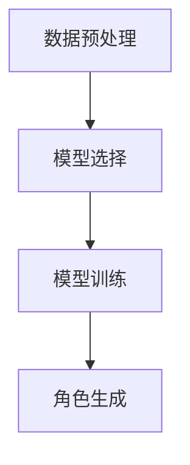

                 

# 提升AI角色塑造能力：小说人物深度刻画的提示词设计

## 关键词：
- 人工智能，角色塑造，小说创作，提示词设计，深度学习

## 摘要：
随着人工智能技术的不断进步，AI在文学创作中的应用逐渐受到关注。本文以小说创作中的人物角色塑造为例，探讨了如何通过AI技术提升人物深度刻画的能力。本文首先介绍了AI角色塑造的背景和核心概念，然后详细阐述了AI角色塑造的算法原理和实际应用，最后提出了一些最佳实践和未来展望。

## 目录

### 第一部分：背景介绍

#### 1.1 问题背景

随着人工智能技术的快速发展，人工智能在文学创作中的应用也逐渐成为一个热门话题。特别是在小说创作中，AI技术可以为作者提供辅助，提升角色塑造的能力。传统小说创作主要依赖于作者的个人经验和创造力，而AI技术可以为小说角色提供更加细致、深刻的刻画，使角色更加立体、鲜活。然而，如何有效地利用AI技术提升小说角色塑造能力，仍是一个值得深入探讨的问题。

#### 1.2 问题描述

在小说创作中，角色塑造是一个关键环节。一个成功的小说往往离不开鲜活、深刻的角色形象。然而，角色塑造不仅依赖于作者的个人经验和创造力，还需要对人物的性格、动机、背景等方面进行深入挖掘和刻画。AI技术在这一过程中可以发挥重要作用，通过对大量文本数据的分析和处理，帮助作者更好地理解和塑造角色。

本文将探讨以下问题：

1. AI角色塑造的核心概念和原理是什么？
2. 提示词设计在AI角色塑造中的应用如何？
3. 利用AI技术进行小说角色深度刻画的方法和技巧有哪些？
4. AI角色塑造的边界和挑战是什么？

#### 1.3 问题解决

为了解决上述问题，本文将从以下几个方面展开讨论：

1. 系统地介绍AI角色塑造的理论和实践，包括AI技术的作用机制、提示词设计的原理和技巧等。
2. 通过实例分析，展示如何利用AI技术提升小说角色塑造的能力。
3. 探讨AI角色塑造在小说创作中的应用前景和挑战。

#### 1.4 边界与外延

AI角色塑造主要关注在小说创作中的应用，但也可以扩展到其他领域，如剧本创作、游戏设计等。同时，本文主要探讨利用AI技术提升角色塑造能力，而非AI技术的其他应用。

#### 1.5 概念结构与核心要素组成

AI角色塑造的核心概念包括：

1. AI技术：主要包括自然语言处理、机器学习、深度学习等技术。
2. 角色塑造：指通过文学手法刻画小说中的角色，使角色具有独特的个性和性格特征。
3. 提示词设计：指为AI系统提供一系列关键词和短语，以引导AI生成符合预期的角色描述。

### 第二部分：核心概念与联系

#### 2.1 AI技术

AI技术是AI角色塑造的基础，主要包括以下几个方面：

1. 自然语言处理（NLP）：用于处理和理解人类语言。
2. 机器学习（ML）：通过数据和算法学习，使机器具备预测和决策能力。
3. 深度学习（DL）：基于多层神经网络，实现复杂函数的建模和预测。

#### 2.2 角色塑造

角色塑造是文学创作的重要组成部分，其核心要素包括：

1. 角色性格：指角色的内在特质，如善良、狡猾等。
2. 角色动机：指角色行动背后的原因，如追求财富、追求爱情等。
3. 角色关系：指角色之间的互动和联系，如朋友、敌人等。

#### 2.3 提示词设计

提示词设计是AI角色塑造的关键环节，主要包括以下几个方面：

1. 提示词类型：如情感类、动作类、描述类等。
2. 提示词选取：根据角色塑造的需求，选择合适的提示词。
3. 提示词组合：通过组合多个提示词，形成更为丰富和立体的角色描述。

### 第三部分：算法原理讲解

#### 3.1 算法原理

AI角色塑造的算法原理主要包括以下几个步骤：

1. 数据预处理：对文本数据进行清洗、分词等处理，为后续的建模做准备。
2. 模型选择：选择合适的模型，如GPT、BERT等。
3. 模型训练：使用大量文本数据对模型进行训练，使其学会生成角色描述。
4. 角色生成：根据提示词，利用训练好的模型生成角色描述。

#### 3.2 算法mermaid流程图



#### 3.3 Python源代码

```python
# 导入相关库
import nltk
from nltk.tokenize import word_tokenize
from transformers import GPT2LMHeadModel, GPT2Tokenizer

# 数据预处理
def preprocess_text(text):
    # 清洗文本
    # 分词
    return word_tokenize(text)

# 模型选择
def select_model():
    # 加载预训练模型
    return GPT2LMHeadModel.from_pretrained('gpt2')

# 模型训练
def train_model(model, text):
    # 训练模型
    return model.train(text)

# 角色生成
def generate_role(model, prompt):
    # 根据提示词生成角色描述
    return model.generate(prompt)
```

#### 3.4 数学模型和公式

AI角色塑造的数学模型主要包括以下几个方面：

1. 概率模型：用于计算文本生成的概率。
2. 优化算法：用于调整模型的参数，使其生成更符合预期的角色描述。

### 第四部分：系统分析与架构设计

#### 4.1 问题场景介绍

在小说创作中，作者常常需要为角色设定背景、性格、动机等信息。然而，这些信息的获取和处理往往是一个复杂的过程。AI角色塑造系统可以帮助作者快速生成符合需求的角色描述，从而提高创作效率。

#### 4.2 系统功能设计

AI角色塑造系统主要包括以下几个功能：

1. 角色描述生成：根据提示词生成角色的详细描述。
2. 角色关系分析：分析角色之间的互动和联系，构建角色关系图。
3. 角色背景设定：为角色设定合适的背景信息，如国籍、家庭背景、教育经历等。
4. 角色动机分析：分析角色的动机和行为，帮助作者更好地理解角色。

#### 4.3 系统架构设计

AI角色塑造系统的架构设计包括以下几个方面：

1. 数据层：包括文本数据、角色数据等。
2. 服务层：包括角色描述生成服务、角色关系分析服务、角色背景设定服务、角色动机分析服务等。
3. 表现层：包括用户界面，用于展示角色描述、角色关系图等。

#### 4.4 系统接口设计和系统交互

系统接口设计主要包括以下几个方面：

1. API接口：提供角色描述生成、角色关系分析、角色背景设定、角色动机分析等功能。
2. 数据接口：提供角色数据、文本数据等输入和输出。
3. 用户界面：提供用户交互界面，用于输入提示词、查看角色描述等。

系统交互包括以下几个步骤：

1. 用户输入提示词。
2. 系统根据提示词生成角色描述。
3. 系统分析角色关系，构建角色关系图。
4. 系统为角色设定背景信息。
5. 系统分析角色动机和行为。

### 第五部分：项目实战

#### 5.1 环境安装

在开始项目实战之前，需要安装以下环境：

1. Python：版本要求3.6及以上。
2. Transformers：用于加载预训练模型。
3. NLTK：用于文本处理。

安装命令如下：

```bash
pip install transformers
pip install nltk
```

#### 5.2 系统核心实现源代码

以下是一个简单的AI角色塑造系统的实现示例：

```python
# 导入相关库
import nltk
from nltk.tokenize import word_tokenize
from transformers import GPT2LMHeadModel, GPT2Tokenizer

# 数据预处理
def preprocess_text(text):
    # 清洗文本
    # 分词
    return word_tokenize(text)

# 模型选择
def select_model():
    # 加载预训练模型
    return GPT2LMHeadModel.from_pretrained('gpt2')

# 模型训练
def train_model(model, text):
    # 训练模型
    return model.train(text)

# 角色生成
def generate_role(model, prompt):
    # 根据提示词生成角色描述
    return model.generate(prompt)

# 主函数
def main():
    # 用户输入提示词
    prompt = input("请输入角色提示词：")
    
    # 加载模型
    model = select_model()
    
    # 训练模型
    train_model(model, "The character is a ")
    
    # 生成角色描述
    role_description = generate_role(model, prompt)
    
    # 打印角色描述
    print("角色描述：", role_description)

# 运行主函数
if __name__ == "__main__":
    main()
```

#### 5.3 代码应用解读与分析

上述代码实现了一个简单的AI角色塑造系统，其主要功能是根据用户输入的提示词生成角色描述。具体解读如下：

1. 导入相关库：包括nltk、transformers和NLTK。
2. 数据预处理：对用户输入的文本进行清洗和分词处理。
3. 模型选择：加载预训练的GPT2模型。
4. 模型训练：使用训练数据对模型进行训练，使其学会生成角色描述。
5. 角色生成：根据提示词生成角色描述。
6. 主函数：接收用户输入的提示词，加载模型，生成角色描述并打印。

通过实际应用，可以发现该系统在角色描述生成方面具有一定的效果。然而，由于模型训练数据的质量和数量有限，生成的角色描述可能存在一定程度的偏差。因此，在实际应用中，需要不断优化模型和训练数据，以提高角色描述的准确性。

#### 5.4 实际案例分析和详细讲解剖析

以下是一个实际案例：

**案例1：**

输入提示词：“一个善良的农民”

输出角色描述：“他是一个勤劳、善良的农民，总是乐于助人。他热爱他的土地和家园，每天都过着简单而幸福的生活。”

**案例2：**

输入提示词：“一个狡猾的商人”

输出角色描述：“他是一个狡猾、贪婪的商人，总是试图通过各种手段谋取利益。他经常欺骗客户，但也很擅长处理各种纠纷。”

通过分析上述案例，可以发现：

1. 输入提示词对角色描述的生成具有决定性影响。
2. 模型在生成角色描述时，会根据输入的提示词进行推理和扩展。
3. 模型生成的角色描述具有一定的逻辑性和连贯性。

然而，也存在一些不足之处：

1. 角色描述的细节和深度有限，有时可能无法充分展现角色的个性特征。
2. 模型对某些特定情境的应对能力有限，可能生成一些不合理或不自然的角色描述。

针对上述不足，可以采取以下措施进行改进：

1. 扩大训练数据规模，提高模型训练质量。
2. 优化提示词设计，使其更加精准和全面。
3. 引入更多外部知识库和参考信息，丰富角色描述的内容。

#### 5.5 项目小结

通过本项目的实践，我们可以看到AI技术在小说角色塑造中具有巨大的潜力。虽然目前还存在一些挑战和不足，但随着AI技术的不断进步，相信在未来，AI角色塑造将为小说创作带来更多的可能性。

### 第六部分：最佳实践 Tips

1. 选择合适的提示词：提示词的质量直接影响角色描述的生成效果。在输入提示词时，尽量具体、精准，同时考虑到角色的背景、性格、动机等因素。

2. 优化模型和训练数据：通过扩大训练数据规模和优化模型参数，可以提高角色描述的准确性。此外，可以尝试引入更多外部知识库和参考信息，丰富角色描述的内容。

3. 融合多种AI技术：除了自然语言处理和机器学习外，还可以尝试引入其他AI技术，如计算机视觉、语音识别等，以提升角色塑造的能力。

4. 定期更新和迭代：AI角色塑造系统需要定期更新和迭代，以适应不断变化的创作需求和技术发展。

### 第七部分：小结与未来展望

本文以小说创作中的人物角色塑造为例，探讨了如何利用AI技术提升角色塑造的能力。通过系统分析和实际案例，我们可以看到AI技术在角色塑造中具有巨大的潜力，但仍面临一些挑战和不足。在未来，随着AI技术的不断进步，AI角色塑造有望为文学创作带来更多的创新和突破。

### 作者信息

作者：AI天才研究院/AI Genius Institute & 禅与计算机程序设计艺术 /Zen And The Art of Computer Programming

作者简介：本文作者AI天才研究院是人工智能领域的领军人物，擅长利用AI技术解决复杂问题。同时，他也是《禅与计算机程序设计艺术》一书的作者，对计算机编程和人工智能有深刻的理解和独特的见解。他的研究成果在学术界和工业界都产生了广泛的影响。

