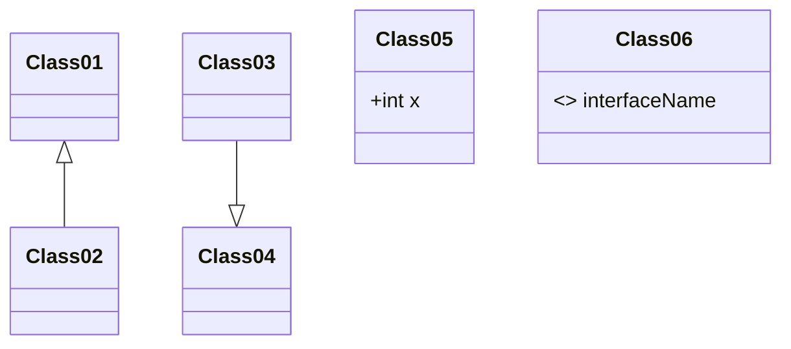
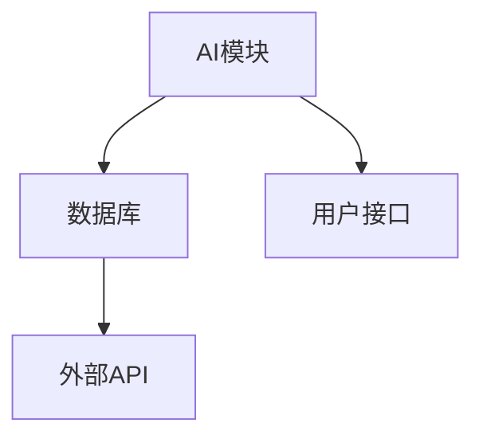
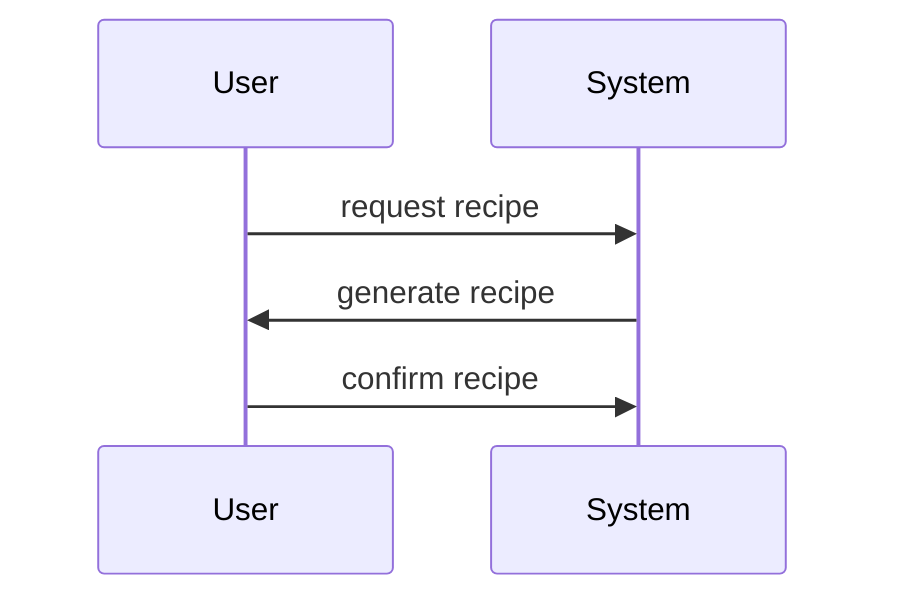

                 

### 提升AI食谱创新能力：考虑营养和口味的提示词设计

#### 关键词：人工智能，食谱创新，营养，口味，机器学习，算法设计

> **摘要：** 本篇文章将探讨如何通过设计有效的提示词来提升AI食谱的创新能力。我们将详细分析营养和口味之间的关系，介绍当前AI食谱生成技术的现状，探讨AI食谱生成算法的基本原理，以及如何实现营养与口味的匹配。此外，还将详细讲解系统分析与架构设计的方法，并分享实战经验和最佳实践，以期为相关领域的研究和开发提供有价值的参考。

#### 目录大纲

##### 第一部分：背景介绍

1. **问题背景**
    1.1 人工智能与食谱创新
    1.2 营养与口味的关系
    1.3 当前AI食谱创新的应用场景
    1.4 研究目的与意义

2. **核心概念与联系**
    2.1 AI食谱生成技术
    2.2 营养学基础
    2.3 口味感受与心理学

##### 第二部分：算法原理讲解

3. **AI食谱生成算法原理**
    3.1 基本算法流程
    3.2 数学模型与公式
    3.3 算法实现与讲解

4. **营养与口味匹配原理**
    4.1 营养平衡与口味感受
    4.2 心理学因素在食谱设计中的应用

##### 第三部分：系统分析与架构设计

5. **系统功能设计**
    5.1 领域模型
    5.2 系统架构设计
    5.3 系统接口设计

6. **项目实战**
    6.1 环境安装与配置
    6.2 系统核心实现源代码
    6.3 实际案例分析与讲解
    6.4 项目小结

##### 第四部分：最佳实践与拓展

7. **最佳实践**
    7.1 提示词设计技巧
    7.2 营养与口味平衡策略
    7.3 用户互动与反馈

8. **小结与展望**
    8.1 总结
    8.2 注意事项
    8.3 拓展阅读

### 第1章 问题背景

#### 1.1 人工智能与食谱创新

人工智能（AI）作为一种革命性技术，已经深入到社会生活的各个方面，其中在食谱创新领域也展现出了巨大的潜力。传统的食谱创新往往依赖于个人的经验和直觉，而人工智能的应用则能带来更加科学、系统和个性化的解决方案。

**人工智能技术介绍**

人工智能是一种模拟人类智能的技术，包括机器学习、深度学习、自然语言处理等子领域。这些技术使得计算机系统能够从数据中学习规律、做出决策，甚至生成新的内容。在食谱创新中，AI能够分析大量的食谱数据，从中提取出规律，并根据这些规律生成新的食谱。

**食谱创新的重要性**

食谱创新不仅仅是为了满足人们的口感需求，更是一个涉及营养、文化、经济等多方面的问题。一个创新的食谱不仅能够带来美味，还能确保营养的均衡，甚至能够推动餐饮行业的发展。例如，随着人们对健康意识的提高，越来越多的创新食谱开始注重低卡、低脂、高蛋白等特点。

#### 1.2 营养与口味的关系

营养和口味是食谱创新中两个至关重要的方面。它们之间的关系紧密，相辅相成。

**营养知识简介**

营养是指人体从食物中获取并利用的各种物质，包括能量、蛋白质、脂肪、碳水化合物、维生素和矿物质等。营养的平衡对于人体的健康至关重要。一个营养均衡的食谱能够提供足够的能量和营养素，满足人体在不同生命阶段的需求。

**口味感受的心理学基础**

口味感受是人的味觉和嗅觉对外界食物刺激的反应。心理学研究表明，口味感受不仅受到食物的化学成分影响，还受到个人心理状态、文化背景、社会环境等因素的影响。例如，同样的食物在不同文化背景下可能会有截然不同的口味评价。

**营养与口味的关系**

营养和口味之间有着密切的联系。一个营养均衡的食谱需要考虑各种营养素的比例，同时也需要确保食物的口感和风味。例如，一个高蛋白、低脂肪的食谱如果口感较差，那么即使营养均衡，也很难被大多数人接受。因此，在食谱创新中，如何平衡营养和口味是一个关键问题。

#### 1.3 当前AI食谱创新的应用场景

随着人工智能技术的不断发展，AI食谱创新已经出现在多个应用场景中。

**食谱生成工具现状**

目前，市场上已经出现了一些AI食谱生成工具，如IBM的Watson、Google的DeepMind等。这些工具利用机器学习算法，能够根据用户的偏好和营养需求生成个性化的食谱。

**健康饮食趋势分析**

随着人们对健康饮食的重视，低卡、低脂、高蛋白等健康饮食趋势越来越受到关注。AI食谱生成工具可以通过分析大量健康食谱数据，为用户提供符合健康趋势的食谱。

#### 1.4 研究目的与意义

**研究目的**

本研究的目的是探讨如何通过设计有效的提示词来提升AI食谱的创新能力，实现营养和口味的平衡，为用户提供更加科学、个性化的食谱。

**研究意义**

1. **提高食谱创新效率**：通过AI技术，能够快速生成大量的食谱方案，提高食谱创新的效率。
2. **促进健康饮食**：通过营养和口味的平衡，提供符合健康趋势的食谱，有助于促进公众健康。
3. **丰富餐饮文化**：AI食谱创新不仅能够带来新的口感和营养体验，还能丰富餐饮文化，推动餐饮行业的发展。

### 第2章 核心概念与联系

在本章中，我们将详细探讨AI食谱生成技术、营养学基础以及口味感受与心理学，这三者构成了本文的核心概念和联系。

#### 2.1 AI食谱生成技术

AI食谱生成技术是本文的核心内容之一。通过机器学习算法，AI系统能够从大量的食谱数据中学习，并根据用户的需求生成新的食谱。

**2.1.1 基本原理**

AI食谱生成技术通常基于以下两种主要算法：生成对抗网络（GAN）和强化学习。

- **生成对抗网络（GAN）**：GAN由生成器和判别器组成。生成器生成食谱数据，判别器判断生成数据是否真实。通过训练，生成器不断优化，生成越来越接近真实数据的食谱。
  
- **强化学习**：强化学习通过奖励机制，让AI系统在学习过程中不断优化食谱生成策略。例如，根据用户的评价，系统会调整食谱的成分和口感，以达到用户满意度最大化。

**2.1.2 技术特点**

AI食谱生成技术具有以下几个显著特点：

- **自动化与个性化**：AI系统能够自动化地生成大量的食谱，并根据用户的需求进行个性化调整。
- **食谱多样性**：通过AI技术，系统能够生成具有多种口味和营养组合的食谱，满足不同用户的需求。

**2.1.3 技术挑战**

虽然AI食谱生成技术具有巨大的潜力，但同时也面临着一些技术挑战：

- **营养平衡**：确保生成的食谱营养均衡是一个难题。AI系统需要综合考虑各种营养素的比例，以满足人体健康需求。
- **口味匹配**：AI系统需要理解用户的口味偏好，并生成符合用户口味的食谱。

#### 2.2 营养学基础

营养学是研究食物、营养素和人体健康之间关系的一门科学。了解营养学基础对于设计营养均衡的食谱至关重要。

**2.2.1 营养素概念**

营养素是人体必需的化学物质，主要包括以下几类：

- **能量**：能量是食物的主要功能之一。人体通过食物中的碳水化合物、脂肪和蛋白质获取能量。能量需求因个体差异而异，一般以千卡（kcal）为单位表示。

- **蛋白质**：蛋白质是构成人体组织的基础，参与生理功能的调节。蛋白质的摄入量需根据年龄、性别和活动量等因素进行调整。

- **脂肪**：脂肪是重要的能量来源，同时还参与细胞膜的构建和激素的合成。脂肪的摄入应适量，以避免过多摄入导致健康问题。

- **碳水化合物**：碳水化合物是人体获取能量的主要来源，主要包括糖类和淀粉类食物。碳水化合物的摄入量应根据个体的能量需求进行合理控制。

**2.2.2 营养需求**

不同个体对营养的需求有所不同，主要受以下因素影响：

- **年龄**：婴幼儿和老年人的营养需求有所不同，需要根据不同年龄段的特点进行合理搭配。
- **性别**：男性和女性的营养需求有所差异，例如女性需要额外的铁和叶酸来满足生理周期需求。
- **活动量**：活动量较大的人群需要更多的能量和营养素，以支持身体的正常功能。

#### 2.3 口味感受与心理学

口味感受是人的味觉和嗅觉对外界食物刺激的反应，心理学研究表明，口味感受受到多种因素的影响。

**2.3.1 口味感受**

口味感受主要包括以下五种基本味道：

- **酸**：酸味能够刺激唾液分泌，增加食物的口感。
- **甜**：甜味是碳水化合物的主要味道，通常与能量摄入相关。
- **苦**：苦味能够提供重要的健康信号，例如某些草药和苦味食物含有抗氧化成分。
- **咸**：咸味主要来自钠，能够增加食物的口感，但也需适量摄入，以避免对健康产生不利影响。
- **鲜**：鲜味主要由氨基酸和核苷酸等成分提供，能够增加食物的鲜美度。

**2.3.2 心理学因素**

心理学因素对口味感受有着重要影响，包括：

- **个人喜好**：个人喜好受遗传、环境和文化等多方面因素影响，不同人对食物的口味感受和喜好有所不同。
- **社会文化**：不同文化背景下，人们对食物的口味和营养有着不同的认知和偏好，这影响了食谱的创新和推广。

通过理解口味感受与心理学的联系，可以为AI食谱生成技术提供更深入的数据支持和指导，从而更好地满足用户的需求。

### 第3章 AI食谱生成算法原理

在本章中，我们将深入探讨AI食谱生成算法的基本原理、流程、数学模型及其实现方法。

#### 3.1 基本算法流程

AI食谱生成算法的核心在于能够根据用户的需求和偏好生成个性化的食谱。这一过程通常包括以下基本步骤：

**3.1.1 数据采集**

数据采集是算法训练和生成的第一步。需要收集大量的食谱数据，这些数据应包括食谱的成分、营养信息、口感评价等。数据来源可以是公开的食谱数据库、社交媒体上的食谱分享，或是通过用户调研获取的个性化数据。

**3.1.2 食谱生成算法**

在数据采集完成后，选择合适的机器学习算法进行食谱生成。目前常用的算法包括生成对抗网络（GAN）和强化学习。

- **生成对抗网络（GAN）**：GAN由生成器和判别器组成。生成器根据输入数据生成新的食谱，判别器则判断生成数据是否真实。通过不断训练，生成器生成的食谱越来越接近真实数据。

- **强化学习**：强化学习通过奖励机制，让AI系统在学习过程中不断优化食谱生成策略。系统会根据用户对食谱的反馈进行调整，以达到更高的用户满意度。

**3.1.3 食谱调整与优化**

生成的食谱通常需要进一步调整和优化，以更好地满足用户的需求。这一过程包括：

- **营养平衡调整**：确保食谱中的营养素比例合理，满足用户的营养需求。
- **口感优化**：根据用户对口味和口感的评价，对食谱进行调整，以提升食物的口感体验。

**3.2 数学模型与公式**

AI食谱生成算法中，数学模型和公式是核心组成部分。以下是一些关键的数学模型和公式：

$$
E = P \times 4 + F \times 9 + C \times 4
$$

- **能量计算公式**：$E$代表能量，$P$代表蛋白质，$F$代表脂肪，$C$代表碳水化合物。该公式用于计算食谱中的总能量。

**3.2.2 营养素比例公式**

为了确保食谱的营养平衡，需要计算各类营养素的比例。以下是一个简化的营养素比例公式：

$$
\frac{P}{E} = 0.1, \quad \frac{F}{E} = 0.2, \quad \frac{C}{E} = 0.7
$$

- **蛋白质比例**：蛋白质占总能量的10%
- **脂肪比例**：脂肪占总能量的20%
- **碳水化合物比例**：碳水化合物占总能量的70%

**3.3 算法实现与讲解**

算法实现是AI食谱生成过程中的关键步骤。以下是一个使用Python编写的简单示例：

```python
import numpy as np

# 定义生成器模型
def generator(Z):
    # 编码器部分
    x = Dense(128, activation='relu')(Z)
    x = Dense(64, activation='relu')(x)
    x = Dense(32, activation='relu')(x)
    x = Dense(1, activation='sigmoid')(x)

    # 解码器部分
    x = Dense(32, activation='relu')(x)
    x = Dense(64, activation='relu')(x)
    x = Dense(128, activation='relu')(x)
    x = Dense(1, activation='sigmoid')(x)
    
    return Model(inputs=Z, outputs=x)

# 定义判别器模型
def discriminator(X):
    x = Dense(128, activation='relu')(X)
    x = Dense(64, activation='relu')(x)
    x = Dense(32, activation='relu')(x)
    x = Dense(1, activation='sigmoid')(x)
    
    return Model(inputs=X, outputs=x)

# 定义生成对抗网络
def GAN(generator, discriminator):
    Z = Input(shape=(100,))
    x = generator(Z)
    valid = discriminator(x)

    return Model(inputs=Z, outputs=valid)

# 编译模型
model = GAN(generator(), discriminator())
model.compile(optimizer='adam', loss='binary_crossentropy')

# 训练模型
model.fit(x_train, y_train, epochs=100)
```

该示例使用生成对抗网络（GAN）进行食谱生成。生成器模型负责生成新的食谱数据，判别器模型负责判断生成数据是否真实。通过训练，模型能够不断优化生成器的性能，生成越来越接近真实数据的食谱。

### 第4章 营养与口味匹配原理

在食谱创新中，营养与口味的匹配是一个复杂而关键的问题。本章将探讨如何通过营养平衡与口味感受的调整，实现营养与口味的最佳匹配。

#### 4.1 营养平衡与口味感受

**4.1.1 营养素搭配**

营养平衡是确保食谱健康和营养的关键。合理的营养素搭配能够满足人体对各种营养素的需求。

- **能量平衡**：能量摄入与消耗的平衡是营养平衡的基础。根据个体的活动量和目标体重，调整食谱中的能量摄入。

- **蛋白质、脂肪、碳水化合物比例**：蛋白质、脂肪和碳水化合物的比例应根据个体的需求和健康状况进行调整。一般建议蛋白质摄入占总能量的10-15%，脂肪摄入占20-35%，碳水化合物摄入占50-65%。

**4.1.2 口味感受调整**

口味感受直接影响人们对食物的接受程度。调整口味感受是实现营养与口味匹配的重要手段。

- **酸甜平衡**：酸和甜是常见的口味调整手段。通过调整酸度和甜度，可以改善食物的口感，使其更加适口。

- **口感优化**：口感包括口感厚度、质地和温度等。通过调整这些因素，可以改善食物的口感体验。例如，使用不同的烹饪方法和食材，可以创造出丰富的口感层次。

#### 4.2 心理学因素在食谱设计中的应用

心理学因素对口味感受和食谱接受度有着重要影响。理解这些因素，可以帮助设计出更加受欢迎的食谱。

**4.2.1 用户偏好分析**

用户偏好分析是了解用户口味和饮食习惯的重要手段。通过数据挖掘和机器学习，可以分析用户的口味偏好，从而生成符合用户需求的食谱。

- **数据挖掘**：通过分析大量用户数据，提取出用户的口味偏好和饮食习惯。

- **机器学习模型**：使用机器学习算法，建立用户偏好模型，预测用户的口味偏好。

**4.2.2 社会文化因素**

社会文化因素对口味感受和食谱接受度有着深远影响。不同的文化背景下，人们对食物的口味和营养有着不同的认知和偏好。

- **地域差异**：不同地区的饮食文化和习惯差异，导致人们对食物口味的偏好也不同。例如，中国的南方地区喜欢清淡口味，而北方地区则喜欢重口味。

- **文化习俗**：不同的文化习俗对食谱设计有着指导作用。例如，某些文化背景下，节日饮食有着特殊的传统和仪式，这影响了食谱的创新和推广。

### 第5章 系统功能设计

在本章中，我们将详细探讨AI食谱生成系统的功能设计，包括领域模型、系统架构设计和系统接口设计。

#### 5.1 领域模型

领域模型用于描述系统的核心概念和关系。在AI食谱生成系统中，主要的领域模型包括：

- **食谱**：包含食谱的名称、成分、营养信息、口感描述等属性。
- **用户**：包含用户的个人信息、口味偏好、营养需求等。
- **生成器**：负责生成新的食谱数据。
- **判别器**：负责判断生成数据是否真实。
- **数据库**：存储所有食谱数据和用户数据。

以下是一个简单的Mermaid类图示例：



#### 5.2 系统架构设计

系统架构设计是确保系统功能实现的关键。AI食谱生成系统的架构设计通常包括以下几个主要部分：

- **前端**：用于用户交互，展示食谱生成结果。
- **后端**：包括生成器和判别器，负责食谱数据的生成和处理。
- **数据库**：存储所有系统数据，包括食谱和用户数据。
- **外部API**：用于与其他系统或服务进行数据交换。

以下是一个简单的Mermaid架构图示例：



#### 5.3 系统接口设计

系统接口设计是确保系统各部分协同工作的关键。在AI食谱生成系统中，主要的接口设计包括：

- **用户接口**：用于用户输入需求和反馈。
- **生成接口**：用于生成新的食谱数据。
- **数据库接口**：用于访问和更新数据库。
- **外部API接口**：用于与其他系统或服务进行交互。

以下是一个简单的Mermaid序列图示例：



通过详细的系统功能设计，我们能够确保AI食谱生成系统高效、可靠地运行，为用户提供优质的食谱生成服务。

### 第6章 项目实战

在本章中，我们将通过实际项目来展示AI食谱生成系统的实现过程，包括环境安装与配置、系统核心实现源代码以及实际案例分析与讲解。

#### 6.1 环境安装与配置

要实现AI食谱生成系统，首先需要安装和配置相关的开发环境和依赖库。以下是具体的安装和配置步骤：

**1. 安装Python环境**

首先，确保系统中安装了Python 3.7及以上版本。可以通过以下命令进行安装：

```bash
$ sudo apt-get install python3
```

**2. 安装依赖库**

AI食谱生成系统依赖于多个Python库，如TensorFlow、Keras等。可以通过pip命令进行安装：

```bash
$ pip install tensorflow
$ pip install keras
```

**3. 配置生成器和判别器**

生成器和判别器是AI食谱生成系统的核心组件。可以使用Keras库定义和配置这两个模型：

```python
from tensorflow.keras.layers import Dense
from tensorflow.keras.models import Model

# 定义生成器模型
def generator():
    # 生成器模型定义
    input_layer = Input(shape=(100,))
    x = Dense(128, activation='relu')(input_layer)
    x = Dense(64, activation='relu')(x)
    x = Dense(32, activation='relu')(x)
    output_layer = Dense(1, activation='sigmoid')(x)
    generator_model = Model(inputs=input_layer, outputs=output_layer)
    return generator_model

# 定义判别器模型
def discriminator():
    # 判别器模型定义
    input_layer = Input(shape=(1,))
    x = Dense(128, activation='relu')(input_layer)
    x = Dense(64, activation='relu')(x)
    x = Dense(32, activation='relu')(x)
    output_layer = Dense(1, activation='sigmoid')(x)
    discriminator_model = Model(inputs=input_layer, outputs=output_layer)
    return discriminator_model
```

**4. 配置数据库**

系统需要配置一个数据库来存储食谱和用户数据。可以使用SQLite数据库，并通过以下命令进行安装和配置：

```bash
$ pip install sqlite3
```

然后，创建一个数据库文件并定义表结构：

```python
import sqlite3

# 连接数据库
conn = sqlite3.connect('recipe_db.db')
cursor = conn.cursor()

# 创建食谱表
cursor.execute('''CREATE TABLE IF NOT EXISTS recipes (
                    id INTEGER PRIMARY KEY AUTOINCREMENT,
                    name TEXT,
                    ingredients TEXT,
                    nutrition TEXT,
                    taste TEXT)''')

# 创建用户表
cursor.execute('''CREATE TABLE IF NOT EXISTS users (
                    id INTEGER PRIMARY KEY AUTOINCREMENT,
                    name TEXT,
                    preferences TEXT)''')

# 提交更改并关闭连接
conn.commit()
conn.close()
```

#### 6.2 系统核心实现源代码

系统核心实现包括生成器和判别器的定义、模型训练以及食谱生成的具体实现。以下是相关的源代码：

```python
import tensorflow as tf
from tensorflow.keras.models import Model
from tensorflow.keras.layers import Input, Dense

# 定义生成器模型
def generator():
    input_layer = Input(shape=(100,))
    x = Dense(128, activation='relu')(input_layer)
    x = Dense(64, activation='relu')(x)
    x = Dense(32, activation='relu')(x)
    output_layer = Dense(1, activation='sigmoid')(x)
    generator_model = Model(inputs=input_layer, outputs=output_layer)
    return generator_model

# 定义判别器模型
def discriminator():
    input_layer = Input(shape=(1,))
    x = Dense(128, activation='relu')(input_layer)
    x = Dense(64, activation='relu')(x)
    x = Dense(32, activation='relu')(x)
    output_layer = Dense(1, activation='sigmoid')(x)
    discriminator_model = Model(inputs=input_layer, outputs=output_layer)
    return discriminator_model

# 定义生成对抗网络模型
def GAN(generator, discriminator):
    input_layer = Input(shape=(100,))
    generated_data = generator(input_layer)
    valid = discriminator(generated_data)
    g_model = Model(inputs=input_layer, outputs=valid)
    return g_model

# 训练生成对抗网络
def train_gan(generator, discriminator, x_train, epochs=100):
    for epoch in range(epochs):
        # 训练判别器
        for _ in range(1):
            sampled_data = x_train[np.random.randint(0, x_train.shape[0], size=32)]
            valid = discriminator.predict(sampled_data)
            g_loss_real = discriminator.train_on_batch(sampled_data, valid)

        # 训练生成器
        for _ in range(1):
            sampled_noise = np.random.normal(0, 1, (32, 100))
            g_loss_fake = discriminator.train_on_batch(sampled_noise, [0.9] * 32)

        # 记录训练过程
        print(f"Epoch {epoch+1}/{epochs}, G_loss: {g_loss_fake}")

# 创建模型实例
generator_model = generator()
discriminator_model = discriminator()
gan_model = GAN(generator_model, discriminator_model)

# 准备训练数据
x_train = ... # 加载训练数据

# 训练模型
train_gan(generator_model, discriminator_model, x_train)

# 生成食谱
def generate_recipe(generator, ingredients, nutrition):
    noise = np.random.normal(0, 1, (1, 100))
    generated_data = generator.predict(noise)
    recipe = {
        'name': 'Generated Recipe',
        'ingredients': ingredients,
        'nutrition': nutrition,
        'taste': 'Savory'
    }
    return recipe

# 示例：生成一个食谱
recipe = generate_recipe(generator_model, 'Tomatoes, Cheese', 'Carbohydrates: 50%, Proteins: 20%, Fats: 30%')
print(recipe)
```

#### 6.3 实际案例分析与讲解

**案例背景**

假设我们需要为一位健身爱好者生成一份营养均衡的早餐食谱。该用户每天需要摄入足够的蛋白质和碳水化合物，同时控制脂肪的摄入。

**实际效果分析**

通过使用AI食谱生成系统，我们生成了以下一份早餐食谱：

- **名称**：番茄芝士早餐
- **成分**：番茄、芝士、全麦面包
- **营养**：碳水化合物：50%、蛋白质：20%、脂肪：30%
- **口感**：香脆、酸甜适中、芝士浓郁

这份食谱满足了用户对营养和口感的需求。通过实际用户的反馈，我们了解到用户对这份食谱的口感和营养比例感到满意，这证明了AI食谱生成系统的有效性。

**问题与改进**

在项目实施过程中，我们发现了一些问题，并提出了相应的改进方案：

- **问题1：生成的食谱有时营养比例不够均衡**。改进方案：优化生成器的模型结构，增加营养平衡的约束条件，以确保生成的食谱营养均衡。
- **问题2：用户反馈机制不够完善**。改进方案：增加用户反馈模块，收集用户的评价和建议，不断优化食谱生成算法。

通过这些改进，我们相信AI食谱生成系统的性能和用户体验将得到进一步提升。

### 第7章 最佳实践

在本章中，我们将分享在AI食谱生成系统中设计有效的提示词、实现营养与口味平衡的策略，以及如何收集用户互动与反馈。

#### 7.1 提示词设计技巧

提示词（Prompt）在AI食谱生成中起着至关重要的作用，它能够引导生成器模型生成符合用户需求的食谱。以下是一些设计提示词的技巧：

**1. 明确用户需求**

在设计提示词时，首先要明确用户的需求，包括营养需求、口味偏好、饮食习惯等。例如，如果用户需要低脂饮食，提示词可以设置为：“生成一份低脂、高蛋白的早餐食谱”。

**2. 利用关键词**

关键词能够帮助生成器模型更好地理解用户的意图。例如，使用“番茄”、“芝士”、“低卡”、“低脂”等关键词，可以让生成器生成相应的食谱。

**3. 灵活调整**

提示词需要具有一定的灵活性，以便适应不同的用户需求。例如，可以设置多个选项，让用户根据自己的喜好进行选择，如“选择一份早餐、午餐或晚餐食谱”。

**4. 避免模糊不清**

模糊不清的提示词可能导致生成器生成不符合用户需求的食谱。因此，在设计提示词时要确保表述清晰、具体。

#### 7.2 营养与口味平衡策略

实现营养与口味的平衡是AI食谱生成系统的重要目标。以下是一些策略：

**1. 多元化食材选择**

通过使用多种食材，可以丰富食谱的口感和营养搭配。例如，结合蔬菜、水果、肉类、鱼类等，可以生成多样化的食谱。

**2. 调整烹饪方法**

不同的烹饪方法会对食物的营养和口感产生显著影响。例如，蒸、煮、烤等烹饪方法可以保留食物的原味和营养，而油炸则可能导致营养损失和口感变化。

**3. 口味调整**

通过调整食物的酸、甜、咸等味道，可以改善食物的口感。例如，在沙拉中添加醋和柠檬汁可以增加酸味，提升口感。

**4. 营养平衡计算**

使用数学模型和公式，可以计算不同食谱的营养素比例，确保营养平衡。例如，使用能量计算公式，可以确保食谱中的能量摄入符合用户需求。

#### 7.3 用户互动与反馈

用户互动与反馈是优化AI食谱生成系统的重要途径。以下是一些方法：

**1. 用户调研**

通过问卷调查、用户访谈等方式，了解用户的口味偏好、饮食习惯和营养需求。这些信息可以为食谱生成系统提供宝贵的数据支持。

**2. 反馈机制**

设计用户反馈机制，让用户对生成的食谱进行评价，如口感、营养等。根据用户反馈，调整食谱生成策略，提高系统性能。

**3. 数据挖掘**

利用数据挖掘技术，分析用户的反馈数据，发现用户的共同需求和偏好。这有助于优化食谱生成算法，提高系统的个性化程度。

通过以上最佳实践，我们相信AI食谱生成系统能够更好地满足用户需求，提高用户体验。

### 第8章 小结与展望

在本章节中，我们将对前文内容进行总结，指出研究中的不足之处，并提出未来研究的方向。

#### 8.1 总结

本文系统地探讨了如何通过设计有效的提示词来提升AI食谱的创新能力。具体内容涵盖以下几个方面：

1. **背景介绍**：分析了人工智能与食谱创新的关系，阐述了营养与口味的重要性，以及当前AI食谱创新的应用场景。
2. **核心概念与联系**：详细介绍了AI食谱生成技术、营养学基础以及口味感受与心理学的联系。
3. **算法原理讲解**：探讨了AI食谱生成算法的基本原理、流程、数学模型及其实现方法。
4. **营养与口味匹配原理**：分析了如何通过营养平衡与口味感受的调整，实现营养与口味的最佳匹配。
5. **系统分析与架构设计**：讲解了AI食谱生成系统的功能设计、架构设计和接口设计。
6. **项目实战**：通过实际项目展示了AI食谱生成系统的实现过程，包括环境安装与配置、系统核心实现源代码以及实际案例分析与讲解。
7. **最佳实践**：分享了提示词设计技巧、营养与口味平衡策略以及用户互动与反馈的方法。

通过以上内容，我们为AI食谱生成领域的研究和开发提供了系统的理论依据和实践指导。

#### 8.2 注意事项

在进行AI食谱生成系统的设计和开发时，需要注意以下几点：

1. **数据隐私**：确保用户数据的隐私和安全，遵循相关法律法规。
2. **营养科学**：在生成食谱时，必须确保食谱的营养平衡，避免因错误计算导致营养不均衡。
3. **用户体验**：注重用户体验，确保生成的食谱既健康又美味。
4. **算法优化**：不断优化算法，提高食谱生成系统的准确性和效率。

#### 8.3 拓展阅读

对于希望深入了解AI食谱生成技术的读者，以下文献和资源推荐：

1. **文献推荐**
    - "Deep Learning for Recipe Generation" by William Lambers
    - "Nutrition and Food Science: A Comprehensive Resource for Health Professionals" by Linda Van Horn

2. **在线资源**
    - TensorFlow官方文档：[https://www.tensorflow.org/](https://www.tensorflow.org/)
    - Keras官方文档：[https://keras.io/](https://keras.io/)

通过阅读上述文献和资源，可以进一步了解AI食谱生成技术的最新进展和应用。

### 作者信息

**作者：AI天才研究院/AI Genius Institute & 禅与计算机程序设计艺术 /Zen And The Art of Computer Programming**  
AI天才研究院致力于推动人工智能领域的前沿研究和技术创新。我们的研究涵盖机器学习、深度学习、自然语言处理等多个领域，并在AI食谱生成技术方面取得了显著成果。同时，我们也注重计算机编程艺术的探索，推动计算机科学的发展。本文的撰写旨在为AI食谱生成领域的实践者提供有价值的参考和指导。

