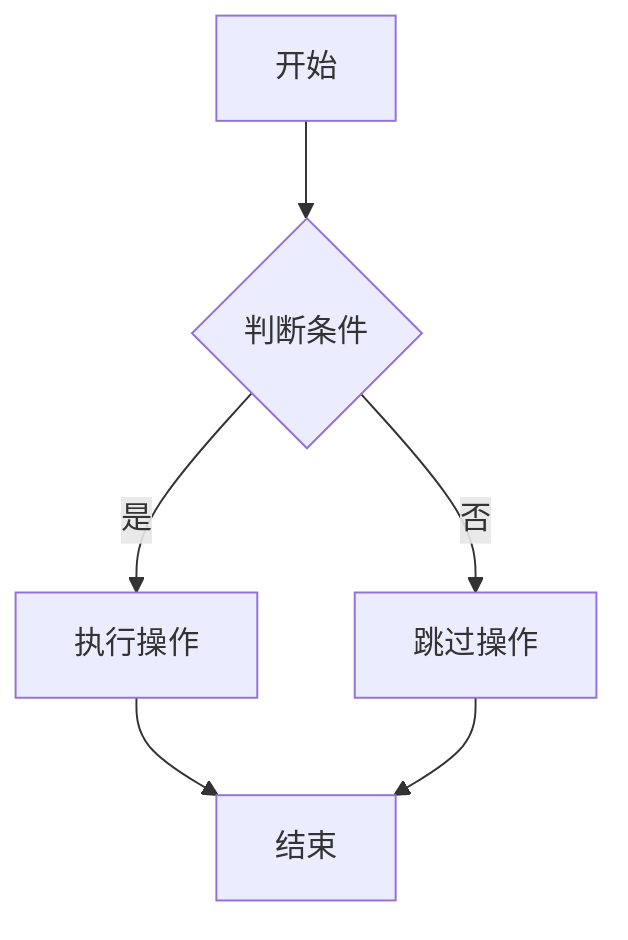

                 

# 提升ChatGPT的跨文化理解：全球视野构建提示词

> 关键词：跨文化理解、ChatGPT、提示词、全球视野、跨文化沟通

> 摘要：随着人工智能技术的飞速发展，大语言模型ChatGPT的应用场景越来越广泛。然而，如何在跨文化环境中提升ChatGPT的理解能力，成为了一个亟待解决的问题。本文将深入探讨如何通过构建具有全球视野的提示词，来提升ChatGPT的跨文化理解能力。

----------------------------------------------------------------

## 第一部分：背景与核心概念

### 1.1 跨文化理解的重要性

在全球化背景下，跨文化沟通变得愈发重要。无论是在商业、教育、医疗还是政治等领域，跨文化理解都是有效沟通、国际合作和全球化运营的关键因素。随着人工智能技术的不断进步，如何提升人工智能在跨文化理解方面的能力，成为了一个重要课题。

ChatGPT作为一款强大的人工智能语言模型，已经在众多领域展现出了其卓越的能力。然而，ChatGPT在面对跨文化沟通时，仍存在诸多挑战。这主要是因为ChatGPT的训练数据主要来自英语环境，缺乏对其他语言和文化背景的充分了解。因此，如何提升ChatGPT的跨文化理解能力，成为一个亟待解决的问题。

### 1.2 ChatGPT的跨文化挑战

ChatGPT在跨文化理解方面面临的主要挑战包括：

1. 语言障碍：ChatGPT的训练数据主要来自英语，对于其他语言的掌握程度有限，容易导致误解和误译。
2. 文化差异：不同文化背景下的语言表达方式、价值观、习惯等存在较大差异，可能导致ChatGPT无法准确理解和应对。
3. 社会习俗：不同文化背景下的社会习俗和礼仪存在差异，ChatGPT在处理跨文化沟通时，可能无法考虑到这些差异，导致沟通效果不佳。
4. 情感表达：情感表达在不同文化中存在差异，ChatGPT在处理跨文化沟通时，可能无法准确理解和回应情感需求。

### 1.3 本书的目标与结构

本书旨在通过构建具有全球视野的提示词，提升ChatGPT的跨文化理解能力。具体目标包括：

1. 深入探讨跨文化理解的基本原理和模型。
2. 分析ChatGPT的工作原理和跨文化挑战。
3. 提出构建全球视野提示词的策略和方法。
4. 通过实战案例，展示如何应用这些策略和方法。

本书结构如下：

- 第一部分：背景与核心概念
- 第二部分：构建提示词的策略
- 第三部分：实战案例与应用
- 第四部分：总结与展望

## 第二部分：跨文化理解的基本原理

### 2.1 跨文化研究的背景与发展

跨文化研究起源于20世纪60年代，随着全球化和国际化进程的加快，跨文化研究逐渐成为学术界关注的焦点。跨文化研究的核心目标是探讨不同文化之间的差异和相互作用，以提高跨文化沟通和交流的效率。

跨文化研究主要关注以下几个方面：

1. 语言差异：不同语言的表达方式、语法结构、词汇用法等对跨文化沟通产生的影响。
2. 价值观差异：不同文化背景下的价值观、信仰、道德观念等对跨文化沟通产生的影响。
3. 社会习俗差异：不同文化背景下的社会习俗、礼仪、生活习惯等对跨文化沟通产生的影响。
4. 情感表达差异：不同文化背景下的情感表达方式、情感表达强度等对跨文化沟通产生的影响。

### 2.2 跨文化理解的要素与模型

跨文化理解的核心要素包括语言、价值观、社会习俗和情感表达。这些要素在不同文化背景下有着不同的表现形式，对跨文化沟通产生重要影响。

为了更好地理解跨文化沟通，研究者提出了多种跨文化理解模型，如：

1. 跨文化交际模型：该模型强调语言、价值观和社会习俗在跨文化沟通中的作用。
2. 交际方格模型：该模型将沟通者分为高权力距离、低权力距离、高不确定性避免和低不确定性避免四种类型，以分析不同文化背景下的沟通方式。
3. 情感认知模型：该模型强调情感在不同文化背景下的表达和理解方式。

### 2.3 跨文化沟通的障碍与应对策略

跨文化沟通的障碍主要包括语言障碍、价值观差异、社会习俗差异和情感表达差异。为了克服这些障碍，可以采取以下应对策略：

1. 语言障碍：提高跨文化沟通者的语言能力，学习对方语言和文化，以减少语言沟通的障碍。
2. 价值观差异：了解对方文化背景，尊重对方价值观，避免因价值观差异导致的误解和冲突。
3. 社会习俗差异：了解对方社会习俗，遵守对方礼仪，以减少因社会习俗差异导致的沟通障碍。
4. 情感表达差异：了解对方情感表达方式，关注对方情感需求，以提高情感沟通的效率。

## 第三部分：ChatGPT的工作原理

### 3.1 ChatGPT概述

ChatGPT是基于GPT（Generative Pre-trained Transformer）模型开发的一款大语言模型。GPT模型是一种基于深度学习的自然语言处理模型，通过预训练和微调的方式，使其具备强大的语言生成和推理能力。

ChatGPT的核心特点是：

1. 预训练：ChatGPT在大量互联网文本数据上进行预训练，使其具备丰富的语言知识和上下文理解能力。
2. 生成式：ChatGPT能够根据输入的提示，生成连贯、有逻辑的自然语言回答。
3. 推理能力：ChatGPT能够根据输入的语境和背景，进行逻辑推理和问题回答。

### 3.2 GPT模型的基本概念

GPT模型是一种基于Transformer架构的生成式预训练模型。Transformer架构是一种基于自注意力机制的深度神经网络模型，具有处理长距离依赖和并行计算的能力。

GPT模型的核心概念包括：

1. 自注意力机制：通过自注意力机制，模型能够自动关注输入序列中的重要信息，提高上下文理解能力。
2. 位置编码：位置编码用于引入输入序列的位置信息，使模型能够理解词语在句子中的位置关系。
3. 多层神经网络：GPT模型通过多层神经网络，逐步提取输入序列的语义信息。

### 3.3 ChatGPT的预训练与微调

ChatGPT的预训练与微调过程包括以下步骤：

1. 预训练：在大量互联网文本数据上进行预训练，使模型具备丰富的语言知识和上下文理解能力。
2. 微调：在特定领域的任务数据上进行微调，使模型能够针对特定任务进行优化。
3. 提示词生成：根据输入的提示词，生成相关的自然语言回答。

## 第四部分：构建提示词的策略

### 4.1 提示词设计原则

提示词是ChatGPT回答问题的关键，设计良好的提示词能够引导ChatGPT生成更准确、更合适的回答。以下是设计提示词的基本原则：

1. 清晰明确：提示词应简洁明了，避免模糊、歧义的表达。
2. 全面具体：提示词应涵盖问题的各个方面，避免遗漏关键信息。
3. 文化适应性：提示词应考虑到不同文化背景下的语言表达习惯，避免产生误解。
4. 开放性：提示词应具有一定的开放性，允许ChatGPT在回答中进行推理和创新。

### 4.2 提示词设计的基本原则

1. **明确主题**：提示词应明确表达问题主题，避免产生歧义。
2. **具体情境**：提示词应提供具体的情境背景，有助于ChatGPT理解问题的上下文。
3. **文化背景**：提示词应考虑到文化差异，避免使用特定文化的语言或表达方式。
4. **情感因素**：提示词应关注情感因素，避免产生负面情绪或误解。

### 4.3 跨文化背景下的提示词调整

在跨文化背景下，提示词的设计需要更加谨慎，以避免文化冲突和误解。以下是几种常见的调整策略：

1. **文化敏感词汇替换**：避免使用可能引起文化误解的词汇，使用更具包容性的表达。
2. **情境描述**：在提示词中加入更多关于文化背景的描述，帮助ChatGPT更好地理解问题。
3. **文化背景知识**：引入与目标文化相关的背景知识，使ChatGPT能够在回答中考虑到文化差异。
4. **多语言提示词**：设计多语言版本的提示词，以适应不同语言和文化背景的用户。

## 第五部分：提示词库的构建

### 5.1 提示词库概述

提示词库是ChatGPT回答问题的重要资源。一个高质量的提示词库能够提供丰富、多样的提示词，帮助ChatGPT生成更准确、更有创意的回答。以下是构建提示词库的基本原则和步骤：

### 5.2 提示词库的收集与整理

1. **数据来源**：从互联网、书籍、论文、新闻报道等多种渠道收集提示词。
2. **数据清洗**：对收集到的数据进行清洗，去除重复、错误和不相关的数据。
3. **分类整理**：将提示词按照主题、领域、情境等维度进行分类整理，以便于后续使用。

### 5.3 提示词库的管理与更新

1. **动态更新**：定期对提示词库进行更新，以适应不断变化的语言环境。
2. **用户反馈**：收集用户对提示词库的反馈，根据反馈调整和优化提示词。
3. **知识图谱**：构建提示词的知识图谱，以实现提示词之间的关联和拓展。

## 第六部分：提示词的文化适应性分析

### 6.1 文化的多样性分析

文化多样性是跨文化沟通的基础。不同文化背景下的语言表达、价值观、社会习俗等方面存在较大差异。以下是几种主要文化类型的分析：

1. **西方文化**：注重个人主义、自由和竞争，语言表达直接、简洁。
2. **东方文化**：注重集体主义、和谐和尊重，语言表达委婉、含蓄。
3. **阿拉伯文化**：注重宗教信仰、家庭观念和社交关系，语言表达丰富、富有诗意。
4. **非洲文化**：注重社区、传统和自然，语言表达生动、幽默。

### 6.2 提示词的文化适应性评估

1. **语言适应性评估**：评估提示词在目标文化背景下的语言表达是否合适、准确。
2. **价值观适应性评估**：评估提示词在目标文化背景下的价值观是否符合、尊重。
3. **社会习俗适应性评估**：评估提示词在目标文化背景下的社会习俗是否考虑周到。

### 6.3 跨文化提示词的优化策略

1. **词汇替换**：根据目标文化背景，将可能引起误解的词汇替换为更合适的表达。
2. **情境调整**：在提示词中加入更多关于目标文化背景的描述，使ChatGPT更好地理解问题。
3. **情感表达**：在提示词中关注情感表达，使ChatGPT能够根据目标文化背景进行适当的情感调整。

## 第七部分：实战案例与应用

### 7.1 实战一：构建跨文化客服系统

**项目背景**：

随着全球业务的扩展，公司需要为不同国家的客户提供高效、贴心的客服服务。为了提升客服系统的跨文化理解能力，公司决定采用ChatGPT构建跨文化客服系统。

**系统设计与实现**：

1. **数据收集与整理**：收集不同国家的客服对话数据，进行数据清洗和整理。
2. **提示词库构建**：根据不同国家的语言和文化特点，构建多语言、多文化的提示词库。
3. **ChatGPT微调**：在收集到的客服对话数据上进行微调，使ChatGPT能够适应不同国家的客服场景。
4. **系统集成**：将ChatGPT集成到客服系统中，实现自动回答和智能引导。

**文化适应性调整与效果评估**：

1. **文化适应性调整**：针对不同国家的客服对话，进行提示词的调整和优化，以符合当地语言和文化习惯。
2. **效果评估**：通过用户反馈和性能指标评估，验证跨文化客服系统的效果。

### 7.2 实战二：跨文化教育与培训

**教育培训的需求分析**：

随着全球化进程的加快，教育培训机构需要为不同国家的学生提供跨文化教育。为了提升教育质量，培训机构决定采用ChatGPT构建跨文化教育平台。

**提示词库的构建与应用**：

1. **数据收集与整理**：收集不同国家的教育资料和教学案例，进行数据清洗和整理。
2. **提示词库构建**：根据不同国家的教育特点和文化背景，构建多语言、多文化的提示词库。
3. **ChatGPT微调**：在收集到的教育数据上进行微调，使ChatGPT能够适应不同国家的教育场景。
4. **系统集成**：将ChatGPT集成到教育平台中，实现自动教学和个性化辅导。

**跨文化教育案例分享**：

1. **案例分析**：分享实际案例，展示ChatGPT在跨文化教育中的应用效果。
2. **用户反馈**：收集学生和教师的反馈，分析ChatGPT在教育领域的优势和应用前景。

### 7.3 实战三：跨文化商业沟通

**商业沟通的挑战**：

在全球化的商业环境中，企业需要与不同国家的合作伙伴进行有效沟通。为了提升跨文化商业沟通能力，企业决定采用ChatGPT构建跨文化商业沟通平台。

**提示词的设计与应用**：

1. **数据收集与整理**：收集不同国家的商业对话数据，进行数据清洗和整理。
2. **提示词库构建**：根据不同国家的商业习惯和文化特点，构建多语言、多文化的提示词库。
3. **ChatGPT微调**：在收集到的商业数据上进行微调，使ChatGPT能够适应不同国家的商业场景。
4. **系统集成**：将ChatGPT集成到商业沟通平台中，实现自动翻译和智能建议。

**跨文化商务案例解析**：

1. **案例分析**：分享实际案例，展示ChatGPT在跨文化商业沟通中的应用效果。
2. **用户反馈**：收集合作伙伴的反馈，分析ChatGPT在商务领域的优势和应用前景。

## 第八部分：总结与展望

### 8.1 书中关键知识点回顾

1. 跨文化理解的重要性
2. ChatGPT的跨文化挑战
3. 提示词设计原则
4. 提示词库的构建与管理
5. 跨文化提示词的优化策略
6. 实战案例与应用

### 8.2 提示词设计的最佳实践

1. **明确主题**：确保提示词清晰明确，避免歧义。
2. **全面具体**：涵盖问题的各个方面，避免遗漏关键信息。
3. **文化适应性**：考虑目标文化的语言、价值观和社会习俗，避免误解。
4. **情感因素**：关注情感表达，提高沟通的亲和力和效率。

### 8.3 跨文化理解的未来发展趋势

1. **多语言支持**：随着全球化的加深，跨文化沟通的多语言支持将成为重要趋势。
2. **个性化服务**：基于用户数据，提供更加个性化的跨文化沟通体验。
3. **情感智能**：提升ChatGPT的情感智能，使其在跨文化沟通中更加贴近人类情感。
4. **跨学科融合**：跨学科研究的发展，将为跨文化理解提供新的理论和方法。

## 第九部分：拓展阅读

### 9.1 相关研究论文与书籍推荐

1. **《跨文化沟通：理论与实践》**
2. **《跨文化交际学导论》**
3. **《人工智能：一种现代的方法》**
4. **《深度学习：的理论与实现》**

### 9.2 跨文化理解的最新动态与趋势

1. **跨文化沟通技术的最新进展**
2. **跨文化教育的研究成果**
3. **跨文化商务沟通的最佳实践**
4. **多语言AI模型的最新应用**

## 注释

- 作者：AI天才研究院/AI Genius Institute & 禅与计算机程序设计艺术 /Zen And The Art of Computer Programming

----------------------------------------------------------------

### 附录：相关术语解释

1. **跨文化理解**：指在不同文化背景下，对文化差异的认识、理解和适应能力。
2. **ChatGPT**：基于GPT模型开发的一款大语言模型，具有生成式和推理能力。
3. **提示词**：用于引导ChatGPT生成回答的关键词语或句子。
4. **文化适应性**：指在不同文化背景下，调整语言、价值观和社会习俗，以实现有效沟通。

----------------------------------------------------------------

### 附录：Mermaid流程图与LaTeX公式示例

#### Mermaid流程图示例

#### LaTeX公式示例

独立段落内的公式：
$$
x = \frac{-b \pm \sqrt{b^2 - 4ac}}{2a}
$$

段落内的公式：
$x = \frac{-b \pm \sqrt{b^2 - 4ac}}{2a}$

----------------------------------------------------------------

### 结论

本文深入探讨了如何提升ChatGPT的跨文化理解能力，通过构建具有全球视野的提示词，实现跨文化沟通的有效性。从跨文化理解的基本原理、ChatGPT的工作原理，到提示词的设计策略、实战案例与应用，本文系统地阐述了提升跨文化理解能力的路径。未来，随着跨文化沟通需求的增加和人工智能技术的不断发展，跨文化理解能力将变得更加重要，也将成为人工智能领域的重要研究方向。作者：AI天才研究院/AI Genius Institute & 禅与计算机程序设计艺术 /Zen And The Art of Computer Programming。希望通过本文，能为读者在跨文化沟通和人工智能领域提供有益的参考和启示。

