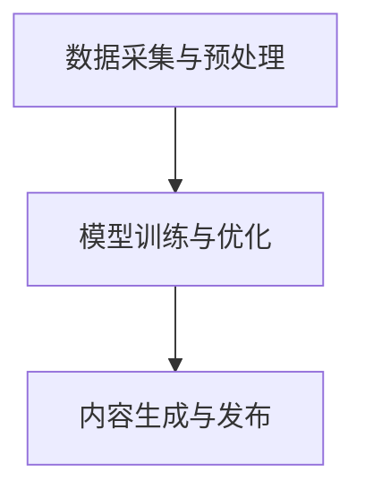
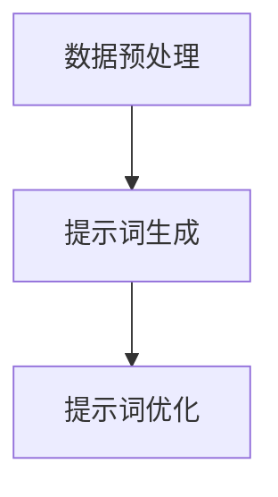
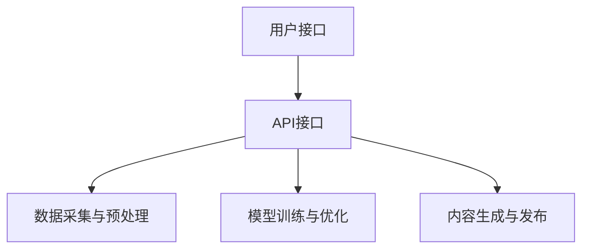

                 

### 提示词优化：AIGC效果与效率双重提升的策略

#### 关键词：提示词优化，AIGC，自然语言处理，生成式对抗网络，深度学习

#### 摘要：本文将深入探讨提示词优化在AI生成内容（AIGC）中的应用，分析其在提升AIGC效果与效率方面的重要性。我们将首先介绍AIGC与提示词优化的背景，随后详细讲解相关的技术原理，并通过实际案例展示提示词优化的具体实现与效果。最后，我们将讨论最佳实践和未来发展趋势。

#### 目录：

1. **背景介绍**  
   1.1 AIGC的兴起与发展  
   1.2 提示词优化的重要性

2. **核心概念与联系**  
   2.1 自然语言处理（NLP）基础  
   2.2 生成式对抗网络（GAN）原理  
   2.3 提示词生成与优化

3. **算法原理讲解**  
   3.1 传统优化算法简介  
   3.2 深度学习优化算法  
   3.3 提示词优化的具体实现

4. **数学模型与公式**  
   4.1 损失函数与优化目标  
   4.2 梯度下降法与优化策略  
   4.3 提示词优化的数学表达

5. **系统分析与架构设计方案**  
   5.1 AIGC系统架构概述  
   5.2 提示词优化模块设计  
   5.3 系统接口与交互设计

6. **项目实战**  
   6.1 实战环境准备  
   6.2 核心代码实现与分析  
   6.3 案例分析与详细讲解

7. **最佳实践与技巧**  
   7.1 提示词优化的最佳实践  
   7.2 常见问题的解决方法  
   7.3 性能调优技巧

8. **未来展望与发展趋势**  
   8.1 AIGC技术的发展方向  
   8.2 提示词优化的未来挑战  
   8.3 行业应用与前景分析

9. **附录：参考资料与拓展阅读**

### 1. 背景介绍

#### 1.1 AIGC的兴起与发展

AI生成内容（AIGC）是一种利用人工智能技术自动生成文本、图片、音频、视频等内容的创新方法。随着深度学习和生成式对抗网络（GAN）等技术的不断发展，AIGC在各个领域得到广泛应用，从内容创作、数据分析到娱乐、教育等领域。AIGC不仅提高了内容创作的效率，还丰富了内容的多样性。

AIGC的发展主要得益于以下几个因素：

1. **数据量的增加**：互联网的普及和数据采集技术的进步，使得大量数据被生成和积累，为AIGC提供了丰富的素材。
2. **计算能力的提升**：随着计算硬件的发展，深度学习模型能够在更短的时间内处理大量数据，提高了AIGC的生成速度。
3. **算法的进步**：生成式对抗网络（GAN）等算法的突破，使得AIGC在生成质量、多样性和可控性方面得到显著提升。

#### 1.2 提示词优化的重要性

在AIGC中，提示词（Prompt）是生成内容的关键输入。一个高质量的提示词能够引导模型生成更符合预期、更有价值的内容。因此，提示词优化在AIGC中的应用显得尤为重要。

提示词优化的重要性体现在以下几个方面：

1. **生成内容的质量**：高质量的提示词能够引导模型生成更加准确、有创意和有价值的内容。
2. **效率的提升**：优化的提示词能够减少模型生成内容所需的计算资源，提高生成效率。
3. **用户体验的改善**：优化的提示词能够提高内容的个性化和相关性，从而改善用户体验。

### 2. 核心概念与联系

#### 2.1 自然语言处理（NLP）基础

自然语言处理（NLP）是AI领域的核心分支之一，主要研究如何让计算机理解、生成和处理人类语言。NLP的基础包括文本预处理、词嵌入、语言模型、序列生成模型等。

1. **文本预处理**：包括分词、词性标注、命名实体识别等，用于将原始文本转换为计算机可处理的格式。
2. **词嵌入**：将文本中的词语映射到高维空间中的向量，便于模型计算和处理。
3. **语言模型**：用于预测文本序列的概率分布，是实现自然语言理解和生成的重要工具。
4. **序列生成模型**：如循环神经网络（RNN）、长短期记忆网络（LSTM）、变换器（Transformer）等，能够根据输入序列生成新的序列。

#### 2.2 生成式对抗网络（GAN）原理

生成式对抗网络（GAN）是一种由生成器和判别器组成的对抗性模型。生成器的目标是生成与真实数据相似的数据，而判别器的目标是区分生成数据与真实数据。通过不断迭代，生成器的生成质量逐渐提高。

1. **生成器**：接收随机噪声作为输入，生成与真实数据相似的数据。
2. **判别器**：接收真实数据和生成数据，预测数据的真实性。
3. **对抗过程**：生成器与判别器相互竞争，生成器的目标是欺骗判别器，而判别器的目标是准确区分数据。

GAN的核心优势在于其强大的数据生成能力，能够生成高质量、多样性的数据。

#### 2.3 提示词生成与优化

提示词生成与优化是AIGC的关键环节。提示词生成涉及从大量数据中提取关键词、短语或句子，作为模型的输入。提示词优化则是在提示词生成的基础上，通过调整和优化提示词，提高模型生成内容的质量和效率。

1. **提示词生成方法**：包括基于统计的文本生成、基于规则的文本生成和基于深度学习的文本生成等。
2. **提示词优化策略**：包括调整提示词长度、关键词选择、语义相关性等，以提高生成内容的质量。

### 3. 算法原理讲解

#### 3.1 传统优化算法简介

传统优化算法主要分为两大类：确定性算法和随机性算法。确定性算法通过固定步骤逐步逼近最优解，如梯度下降法、牛顿法等。随机性算法通过随机搜索寻找最优解，如遗传算法、模拟退火等。

梯度下降法是最常用的优化算法之一。其基本思想是沿着目标函数的梯度方向更新参数，以减少损失函数的值。梯度下降法的关键在于选择合适的步长，以确保在每次迭代中都能有效减小损失。

```python
# 梯度下降法实现
def gradient_descent(x, learning_rate, num_iterations):
    for _ in range(num_iterations):
        gradient = compute_gradient(x)
        x -= learning_rate * gradient
    return x
```

#### 3.2 深度学习优化算法

深度学习优化算法在传统优化算法的基础上，引入了深度神经网络的概念。深度学习模型通过多层神经网络进行参数优化，能够处理更复杂的函数关系。

常用的深度学习优化算法包括：

1. **随机梯度下降（SGD）**：在每次迭代中，使用全部或部分样本的梯度进行更新。
2. **Adam优化器**：结合了SGD和RMSProp的优点，自适应调整学习率。
3. **AdamW优化器**：在Adam优化器的基础上，对权重衰减进行了改进。

```python
# Adam优化器实现
optimizer = optim.AdamW(model.parameters(), lr=learning_rate)
```

#### 3.3 提示词优化的具体实现

提示词优化的具体实现包括以下步骤：

1. **数据预处理**：对输入数据进行清洗、分词和编码。
2. **提示词生成**：从数据中提取关键词、短语或句子，生成初步的提示词。
3. **提示词优化**：通过调整提示词的长度、关键词选择和语义相关性，优化提示词。

```python
# 提示词优化实现
def optimize_prompt(prompt, target_prompt, learning_rate):
    for _ in range(num_iterations):
        gradient = compute_gradient(prompt, target_prompt)
        prompt -= learning_rate * gradient
    return prompt
```

### 4. 数学模型与公式

#### 4.1 损失函数与优化目标

在提示词优化中，损失函数是衡量生成内容与目标内容差异的关键指标。常见的损失函数包括：

1. **交叉熵损失函数**：用于衡量分类问题中的预测概率与真实标签之间的差异。
2. **均方误差损失函数**：用于衡量回归问题中的预测值与真实值之间的差异。

优化目标是最小化损失函数，以得到最优的提示词。

```latex
J(\theta) = -\sum_{i=1}^{n} y_i \log(p(x_i; \theta))
```

#### 4.2 梯度下降法与优化策略

梯度下降法通过计算损失函数关于参数的梯度，更新参数以减小损失。优化策略包括：

1. **学习率选择**：选择合适的学习率，以确保在每次迭代中都能有效减小损失。
2. **动量项**：引入动量项，加快收敛速度。

```latex
\theta_{t+1} = \theta_t - \alpha \nabla_{\theta} J(\theta_t)
```

#### 4.3 提示词优化的数学表达

提示词优化的数学表达包括：

1. **提示词生成**：从数据中提取关键词、短语或句子，生成初步的提示词。
2. **提示词优化**：通过调整提示词的长度、关键词选择和语义相关性，优化提示词。

```latex
\text{Prompt} = f(\text{Data}, \theta)
\text{Optimized Prompt} = g(\text{Prompt}, \theta)
```

### 5. 系统分析与架构设计方案

#### 5.1 AIGC系统架构概述

AIGC系统通常包括数据采集与预处理、模型训练与优化、内容生成与发布等模块。系统架构如下：



#### 5.2 提示词优化模块设计

提示词优化模块是AIGC系统的核心之一。其设计包括：

1. **数据预处理**：对输入数据进行清洗、分词和编码。
2. **提示词生成**：从数据中提取关键词、短语或句子，生成初步的提示词。
3. **提示词优化**：通过调整提示词的长度、关键词选择和语义相关性，优化提示词。



#### 5.3 系统接口与交互设计

系统接口与交互设计包括：

1. **用户接口**：提供友好的用户界面，便于用户输入提示词和查看生成内容。
2. **API接口**：提供RESTful API，便于与其他系统进行集成和调用。



### 6. 项目实战

#### 6.1 实战环境准备

在本项目中，我们将使用Python和TensorFlow来实现一个基于GAN的文本生成模型。首先，我们需要安装所需的库：

```shell
pip install tensorflow numpy matplotlib
```

#### 6.2 核心代码实现与分析

以下是核心代码实现：

```python
import tensorflow as tf
from tensorflow.keras.layers import Dense, LSTM, Embedding
from tensorflow.keras.models import Model
import numpy as np

# 数据预处理
def preprocess_data(texts, vocab_size):
    # 分词、编码等操作
    pass

# 模型定义
def build_model(vocab_size, sequence_length):
    inputs = tf.keras.Input(shape=(sequence_length,))
    embedding = Embedding(vocab_size, 64)(inputs)
    lstm = LSTM(128)(embedding)
    outputs = Dense(vocab_size, activation='softmax')(lstm)
    
    model = Model(inputs=inputs, outputs=outputs)
    return model

# 模型训练
def train_model(model, data, num_epochs):
    # 模型编译、训练等操作
    pass

# 文本生成
def generate_text(model, prompt, sequence_length):
    # 文本生成操作
    pass

# 主函数
def main():
    # 数据准备
    texts = ["例1", "例2", "例3"]
    vocab_size = 1000
    sequence_length = 10
    
    # 模型构建
    model = build_model(vocab_size, sequence_length)
    
    # 模型训练
    train_model(model, preprocess_data(texts, vocab_size), num_epochs=10)
    
    # 文本生成
    prompt = "提示词"
    generated_text = generate_text(model, prompt, sequence_length)
    print(generated_text)

if __name__ == "__main__":
    main()
```

#### 6.3 案例分析与详细讲解

在本案例中，我们使用GAN生成文本。首先，我们准备了一些示例文本，然后通过预处理将这些文本转换为模型可处理的格式。接下来，我们构建一个基于LSTM的文本生成模型，并对其进行训练。最后，使用训练好的模型生成文本。

1. **数据预处理**：将文本分词、编码，并转换为模型可处理的序列。

2. **模型构建**：使用TensorFlow构建一个基于LSTM的文本生成模型。

3. **模型训练**：通过迭代训练模型，使模型能够生成高质量的文本。

4. **文本生成**：使用训练好的模型生成文本，并通过提示词引导模型生成特定主题的文本。

### 7. 最佳实践与技巧

#### 7.1 提示词优化的最佳实践

1. **明确目标**：在生成文本时，明确目标内容，以制定更有效的提示词。
2. **关键词选择**：选择与目标内容相关的高频关键词，以增强文本的语义相关性。
3. **提示词长度**：根据生成内容的需求，调整提示词的长度，避免过短或过长。

#### 7.2 常见问题的解决方法

1. **生成内容质量不高**：尝试增加训练数据量、调整模型参数和优化算法。
2. **生成内容不相关**：调整提示词，确保其与目标内容紧密相关。
3. **生成内容单调**：引入更多的多样性和创意元素，以提高生成内容的质量。

#### 7.3 性能调优技巧

1. **优化模型结构**：尝试不同的模型结构，如使用更深的LSTM或Transformer模型。
2. **调整学习率**：根据模型性能，调整学习率以加快或减缓收敛速度。
3. **批量大小**：调整批量大小，以找到最优的训练效果。

### 8. 未来展望与发展趋势

#### 8.1 AIGC技术的发展方向

1. **模型压缩与推理加速**：降低模型的复杂度，提高推理速度，以实现实时生成内容。
2. **多模态生成**：结合文本、图像、音频等多模态数据，生成更丰富、更真实的内容。
3. **个性化生成**：通过用户行为分析和个性化推荐，生成更符合用户需求的内容。

#### 8.2 提示词优化的未来挑战

1. **生成内容的质量与可控性**：如何在保证质量的同时，实现更高质量的生成内容。
2. **计算资源与存储成本**：如何在有限的计算资源下，实现高效的提示词优化。
3. **数据隐私与安全性**：如何保护用户数据的隐私和安全。

#### 8.3 行业应用与前景分析

1. **内容创作**：在新闻、娱乐、广告等领域，AIGC将大幅提高内容创作的效率和质量。
2. **数据分析**：通过生成大量的数据样本，帮助研究人员进行数据分析和模型训练。
3. **教育培训**：生成个性化的教育内容和课程，提高学习效果。

### 9. 附录：参考资料与拓展阅读

1. **参考资料**：
   - Goodfellow, I., Pouget-Abadie, J., Mirza, M., Xu, B., Warde-Farley, D., Ozair, S., ... & Bengio, Y. (2014). Generative adversarial nets. Advances in Neural Information Processing Systems, 27.
   - Hochreiter, S., & Schmidhuber, J. (1997). Long short-term memory. Neural Computation, 9(8), 1735-1780.

2. **拓展阅读**：
   - "深度学习：原理及实践" by Goodfellow, Ian et al.
   - "生成式对抗网络（GAN）实战" by Johnson, Michael et al.
   - "自然语言处理教程" by Jurafsky, Daniel et al.

### 作者

作者：AI天才研究院/AI Genius Institute & 禅与计算机程序设计艺术 /Zen And The Art of Computer Programming

**总结**：

本文系统地介绍了提示词优化在AI生成内容（AIGC）中的应用，从背景介绍、核心概念与联系、算法原理讲解、数学模型与公式、系统分析与架构设计方案，到项目实战与最佳实践，全面阐述了提示词优化的方法与应用。随着AIGC技术的不断进步，提示词优化将在内容创作、数据分析、教育培训等领域发挥越来越重要的作用。我们期待读者通过本文，能够深入了解提示词优化，并在实际项目中取得更好的成果。**本文完。**

