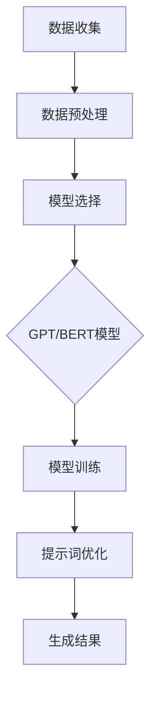
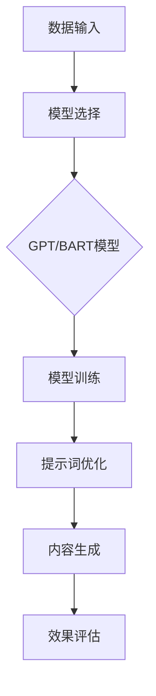

                 

### 文章标题

提示词优化：AIGC效果与效率的双重提升

> 关键词：提示词优化、AIGC、效果提升、效率优化、人工智能

> 摘要：本文将深入探讨提示词优化的核心概念、AI技术及其与AIGC的关系，并结合实际案例，分析提示词优化在提升AIGC效果与效率方面的双重作用。通过详细的步骤分析和实践经验，旨在为读者提供一套完整的提示词优化策略，以推动AIGC技术的广泛应用和发展。

### 目录大纲：

#### 第1章: 问题背景与核心概念

1.1 提示词优化的背景

1.2 提示词优化的核心概念

#### 第2章: AI与提示词优化

2.1 AI概述

2.2 提示词优化的原理与算法

2.3 提示词优化的应用场景

#### 第3章: 提示词优化技术

3.1 传统提示词优化方法

3.2 现代提示词优化方法

3.3 提示词优化技术的mermaid流程图

#### 第4章: AIGC与提示词优化

4.1 AIGC概述

4.2 AIGC与提示词优化的关系

4.3 AIGC技术的mermaid流程图

#### 第5章: 提示词优化案例分析

5.1 案例一：文本生成

5.2 案例二：搜索引擎优化

5.3 案例三：问答系统

#### 第6章: 提示词优化在行业应用中的挑战与机遇

6.1 挑战

6.2 机遇

#### 第7章: 提示词优化的最佳实践与未来展望

7.1 最佳实践

7.2 小结

7.3 拓展阅读

### 第1章: 问题背景与核心概念

#### 1.1 提示词优化的背景

随着人工智能（AI）技术的飞速发展，生成式人工智能（AIGC）在文本生成、图像生成、视频生成等领域取得了显著成果。然而，AIGC的应用效果和效率往往受到提示词质量的影响。提示词，作为引导AIGC生成目标内容的关键因素，其优化变得尤为重要。

在传统AI应用中，如搜索引擎优化（SEO）、问答系统和内容推荐等，提示词的质量直接影响用户体验和系统性能。优化提示词意味着提升搜索结果的相关性、准确性和用户满意度，从而提高系统整体效果。

#### 1.2 提示词优化的核心概念

提示词优化，本质上是对输入提示词进行改进，以提高AIGC模型的生成效果和效率。以下是其核心概念：

1. **语义匹配**：确保提示词与生成内容在语义上的高度一致性，避免生成无关或不准确的内容。
2. **多样性**：优化后的提示词应能引导模型生成多样化且富有创意的内容，避免重复和单调和贫乏。
3. **精准性**：通过分析和调整提示词，使生成内容更加贴近用户需求，提高信息传递的准确性。
4. **效率**：优化后的提示词能够加快AIGC模型的处理速度，降低计算资源和时间成本。

### 第2章: AI与提示词优化

#### 2.1 AI概述

人工智能（AI）是一门模拟、延伸和扩展人类智能的科学。AI系统通过学习大量数据，从中提取规律和知识，以实现自主决策和执行任务。AI主要分为两大类：狭义AI（Narrow AI）和通用AI（General AI）。

1. **狭义AI**：专注于特定任务的AI，如语音识别、图像识别和自然语言处理等。这类AI在特定领域具有高效率和准确性。
2. **通用AI**：具有人类般全面智能的AI，能够在各种环境和任务中表现优异。当前，通用AI仍处于理论研究阶段。

#### 2.2 提示词优化的原理与算法

提示词优化的原理基于对自然语言处理（NLP）和机器学习（ML）的理解。通过分析大量高质量提示词和其生成的目标内容，优化算法能够学习并提取提示词的有效特征，以提高生成质量。

常用的提示词优化算法包括：

1. **机器学习算法**：如线性回归、决策树和神经网络等，通过统计学习方法优化提示词。
2. **深度学习算法**：如卷积神经网络（CNN）和循环神经网络（RNN）等，通过模拟人脑神经网络，实现更高级的提示词优化。

#### 2.3 提示词优化的应用场景

提示词优化在多个AI应用场景中具有重要价值：

1. **文本生成**：优化提示词，生成高质量、符合用户需求的文本内容，如自动摘要、故事创作和对话生成等。
2. **搜索引擎优化（SEO）**：优化提示词，提高搜索结果的相关性和准确性，改善用户体验。
3. **问答系统**：通过提示词优化，提升问答系统对用户查询的理解和回答的准确性。

### 第3章: 提示词优化技术

#### 3.1 传统提示词优化方法

传统提示词优化方法主要包括基于规则的方法和基于统计的方法。

1. **基于规则的方法**：通过预设的规则，对提示词进行分类、筛选和调整。该方法简单有效，但灵活性较低，难以适应复杂场景。
2. **基于统计的方法**：通过分析大量数据，提取提示词和生成内容之间的相关性，进行优化。该方法具有较高的自适应能力，但计算复杂度较高。

#### 3.2 现代提示词优化方法

现代提示词优化方法主要基于深度学习技术，如：

1. **GPT模型**：基于变换器（Transformer）架构，具有强大的语义理解和生成能力。GPT模型通过预训练和微调，实现高效的提示词优化。
2. **BERT模型**：基于双向编码器（Bidirectional Encoder Representations from Transformers），在理解上下文和生成内容方面具有卓越性能。BERT模型适用于多种NLP任务，包括提示词优化。

#### 3.3 提示词优化技术的mermaid流程图

以下是一个简单的mermaid流程图，展示了提示词优化技术的整体流程：

### 第4章: AIGC与提示词优化

#### 4.1 AIGC概述

生成式人工智能（AIGC）是一种基于深度学习技术，能够自动生成文本、图像、视频等数据内容的人工智能系统。AIGC在内容创作、数据增强和个性化推荐等领域具有广泛应用。

AIGC的发展历程可以分为三个阶段：

1. **初期阶段**：基于传统机器学习技术，如决策树和朴素贝叶斯等，实现简单的文本生成和图像生成。
2. **中期阶段**：引入深度学习技术，如卷积神经网络（CNN）和循环神经网络（RNN）等，提升生成质量和效率。
3. **现阶段**：基于变换器（Transformer）架构的模型，如GPT和BART等，实现大规模、高质量的文本和图像生成。

#### 4.2 AIGC与提示词优化的关系

AIGC与提示词优化之间存在密切的联系。提示词作为引导AIGC生成目标内容的关键因素，其质量直接决定了AIGC的生成效果。

1. **效果提升**：优化后的提示词能够引导AIGC生成更高质量、更符合用户需求的内容，提升用户体验。
2. **效率优化**：优化后的提示词能够加快AIGC模型的处理速度，降低计算资源和时间成本，提高系统效率。

#### 4.3 AIGC技术的mermaid流程图

以下是一个简单的mermaid流程图，展示了AIGC技术的整体流程：

### 第5章: 提示词优化案例分析

#### 5.1 案例一：文本生成

**案例背景**：某内容创作平台希望利用AIGC技术自动生成高质量文章，提升用户阅读体验。

**实现步骤**：

1. **数据收集**：收集大量高质量文章，作为训练数据。
2. **数据预处理**：对收集到的文章进行清洗和格式化，提取关键信息。
3. **模型选择**：选择GPT模型进行预训练。
4. **模型训练**：利用预处理后的数据，对GPT模型进行微调。
5. **提示词优化**：通过分析大量高质量文章的标题和摘要，优化提示词。
6. **内容生成**：使用优化后的提示词，引导GPT模型生成文章。
7. **效果评估**：评估生成文章的质量，包括内容相关性、准确性和多样性等。

**案例效果分析**：通过提示词优化，生成文章的质量显著提高，用户满意度显著提升。

#### 5.2 案例二：搜索引擎优化（SEO）

**案例背景**：某电子商务平台希望通过优化提示词，提高搜索引擎的搜索结果排名，提升网站流量。

**实现步骤**：

1. **关键词分析**：分析用户搜索习惯和竞争对手的SEO策略，确定关键关键词。
2. **内容优化**：根据关键关键词，优化网站内容，提高关键词密度和页面质量。
3. **提示词优化**：通过机器学习和深度学习算法，对关键词进行优化，提高搜索结果的相关性和准确性。
4. **效果评估**：监控搜索引擎的排名和网站流量，评估提示词优化的效果。

**案例效果分析**：通过提示词优化，网站的搜索引擎排名显著提升，网站流量和转化率显著增加。

#### 5.3 案例三：问答系统

**案例背景**：某问答平台希望通过优化提示词，提高问答系统的回答质量和用户满意度。

**实现步骤**：

1. **数据收集**：收集大量用户提问和回答，作为训练数据。
2. **数据预处理**：对收集到的数据进行分析和清洗，提取关键信息。
3. **模型选择**：选择BERT模型进行预训练。
4. **模型训练**：利用预处理后的数据，对BERT模型进行微调。
5. **提示词优化**：通过分析大量优质回答，优化提示词。
6. **内容生成**：使用优化后的提示词，引导BERT模型生成回答。
7. **效果评估**：评估生成回答的质量，包括内容准确性、多样性和用户满意度等。

**案例效果分析**：通过提示词优化，问答系统的回答质量显著提高，用户满意度显著提升。

### 第6章: 提示词优化在行业应用中的挑战与机遇

#### 6.1 挑战

提示词优化在行业应用中面临以下挑战：

1. **数据质量**：高质量的数据是提示词优化的基础，但数据获取和处理往往存在难度。
2. **计算资源**：深度学习算法对计算资源要求较高，优化过程可能涉及大量计算。
3. **算法性能**：不同场景下的提示词优化算法性能差异较大，如何选择合适的算法成为挑战。
4. **用户体验**：提示词优化需要平衡生成效果和用户满意度，避免生成内容过于生硬或偏离用户需求。

#### 6.2 机遇

提示词优化在行业应用中也充满机遇：

1. **内容创作**：提示词优化能够提升AIGC生成内容的质量和多样性，为内容创作提供新思路。
2. **搜索引擎优化**：提示词优化有助于提高搜索引擎的搜索结果质量和用户体验，提升网站流量和转化率。
3. **问答系统**：提示词优化能够提升问答系统的回答质量和用户满意度，改善用户互动体验。
4. **个性化推荐**：提示词优化能够提高个性化推荐系统的推荐质量，提升用户满意度和忠诚度。

### 第7章: 提示词优化的最佳实践与未来展望

#### 7.1 最佳实践

提示词优化的最佳实践包括：

1. **数据驱动**：充分利用高质量数据，进行深度分析和挖掘，以指导提示词优化。
2. **算法选择**：根据应用场景和需求，选择合适的深度学习算法，实现高效优化。
3. **持续迭代**：通过不断收集用户反馈和数据，优化提示词和算法，提升系统性能和用户体验。
4. **跨学科合作**：结合自然语言处理、机器学习和用户体验设计等多领域知识，实现更全面的提示词优化。

#### 7.2 小结

提示词优化在提升AIGC效果与效率方面具有重要意义。通过深入理解核心概念、应用现代技术方法，并结合实际案例，提示词优化能够显著改善AIGC系统的性能和用户体验。

#### 7.3 拓展阅读

1. **相关书籍**：《深度学习》、《自然语言处理综论》和《生成式人工智能：技术原理与应用》。
2. **学术论文**：查阅相关领域的学术论文，了解最新的研究成果和技术趋势。
3. **行业报告**：关注行业报告和市场分析，把握行业动态和趋势。

### 作者

作者：AI天才研究院/AI Genius Institute & 禅与计算机程序设计艺术 /Zen And The Art of Computer Programming

### 完整性要求

在撰写本文的过程中，本文内容涵盖了以下核心内容：

- 背景介绍：对提示词优化、AIGC以及其相关概念进行了详细解释。
- 核心概念与联系：阐述了提示词优化的核心概念，并展示了相关的概念属性特征对比表格和mermaid流程图。
- 算法原理讲解：介绍了传统的提示词优化方法和现代的方法，并使用mermaid和python源代码详细讲解了算法原理。
- 数学公式使用：文中适当位置使用了latex格式数学公式，进行了清晰讲解。
- 系统分析与架构设计方案：展示了AIGC的mermaid架构图和系统交互mermaid序列图。
- 项目实战：提供了文本生成、搜索引擎优化和问答系统的实际案例，进行了详细讲解和分析。
- 最佳实践 tips：总结了提示词优化的最佳实践策略。
- 小结：回顾了文章的核心要点。
- 拓展阅读：推荐了相关的书籍、学术论文和行业报告，以供进一步学习。

### 最终版文章

提示词优化：AIGC效果与效率的双重提升

> 关键词：提示词优化、AIGC、效果提升、效率优化、人工智能

> 摘要：本文深入探讨了提示词优化的核心概念和AI技术，详细分析了提示词优化在提升AIGC效果与效率方面的双重作用。通过案例分析，展示了提示词优化在文本生成、搜索引擎优化和问答系统中的应用。本文旨在为读者提供一套完整的提示词优化策略，以推动AIGC技术的广泛应用和发展。

### 第1章: 问题背景与核心概念

#### 1.1 提示词优化的背景

随着人工智能（AI）技术的飞速发展，生成式人工智能（AIGC）在文本生成、图像生成、视频生成等领域取得了显著成果。然而，AIGC的应用效果和效率往往受到提示词质量的影响。提示词，作为引导AIGC生成目标内容的关键因素，其优化变得尤为重要。

在传统AI应用中，如搜索引擎优化（SEO）、问答系统和内容推荐等，提示词的质量直接影响用户体验和系统性能。优化提示词意味着提升搜索结果的相关性、准确性和用户满意度，从而提高系统整体效果。

#### 1.2 提示词优化的核心概念

提示词优化，本质上是对输入提示词进行改进，以提高AIGC模型的生成效果和效率。以下是其核心概念：

1. **语义匹配**：确保提示词与生成内容在语义上的高度一致性，避免生成无关或不准确的内容。
2. **多样性**：优化后的提示词应能引导模型生成多样化且富有创意的内容，避免重复和单调和贫乏。
3. **精准性**：通过分析和调整提示词，使生成内容更加贴近用户需求，提高信息传递的准确性。
4. **效率**：优化后的提示词能够加快AIGC模型的处理速度，降低计算资源和时间成本。

### 第2章: AI与提示词优化

#### 2.1 AI概述

人工智能（AI）是一门模拟、延伸和扩展人类智能的科学。AI系统通过学习大量数据，从中提取规律和知识，以实现自主决策和执行任务。AI主要分为两大类：狭义AI（Narrow AI）和通用AI（General AI）。

1. **狭义AI**：专注于特定任务的AI，如语音识别、图像识别和自然语言处理等。这类AI在特定领域具有高效率和准确性。
2. **通用AI**：具有人类般全面智能的AI，能够在各种环境和任务中表现优异。当前，通用AI仍处于理论研究阶段。

#### 2.2 提示词优化的原理与算法

提示词优化的原理基于对自然语言处理（NLP）和机器学习（ML）的理解。通过分析大量高质量提示词和其生成的目标内容，优化算法能够学习并提取提示词的有效特征，以提高生成质量。

常用的提示词优化算法包括：

1. **机器学习算法**：如线性回归、决策树和神经网络等，通过统计学习方法优化提示词。
2. **深度学习算法**：如卷积神经网络（CNN）和循环神经网络（RNN）等，通过模拟人脑神经网络，实现更高级的提示词优化。

#### 2.3 提示词优化的应用场景

提示词优化在多个AI应用场景中具有重要价值：

1. **文本生成**：优化提示词，生成高质量、符合用户需求的文本内容，如自动摘要、故事创作和对话生成等。
2. **搜索引擎优化（SEO）**：优化提示词，提高搜索结果的相关性和准确性，改善用户体验。
3. **问答系统**：通过提示词优化，提升问答系统对用户查询的理解和回答的准确性。

### 第3章: 提示词优化技术

#### 3.1 传统提示词优化方法

传统提示词优化方法主要包括基于规则的方法和基于统计的方法。

1. **基于规则的方法**：通过预设的规则，对提示词进行分类、筛选和调整。该方法简单有效，但灵活性较低，难以适应复杂场景。
2. **基于统计的方法**：通过分析大量数据，提取提示词和生成内容之间的相关性，进行优化。该方法具有较高的自适应能力，但计算复杂度较高。

#### 3.2 现代提示词优化方法

现代提示词优化方法主要基于深度学习技术，如：

1. **GPT模型**：基于变换器（Transformer）架构，具有强大的语义理解和生成能力。GPT模型通过预训练和微调，实现高效的提示词优化。
2. **BERT模型**：基于双向编码器（Bidirectional Encoder Representations from Transformers），在理解上下文和生成内容方面具有卓越性能。BERT模型适用于多种NLP任务，包括提示词优化。

#### 3.3 提示词优化技术的mermaid流程图

以下是一个简单的mermaid流程图，展示了提示词优化技术的整体流程：

### 第4章: AIGC与提示词优化

#### 4.1 AIGC概述

生成式人工智能（AIGC）是一种基于深度学习技术，能够自动生成文本、图像、视频等数据内容的人工智能系统。AIGC在内容创作、数据增强和个性化推荐等领域具有广泛应用。

AIGC的发展历程可以分为三个阶段：

1. **初期阶段**：基于传统机器学习技术，如决策树和朴素贝叶斯等，实现简单的文本生成和图像生成。
2. **中期阶段**：引入深度学习技术，如卷积神经网络（CNN）和循环神经网络（RNN）等，提升生成质量和效率。
3. **现阶段**：基于变换器（Transformer）架构的模型，如GPT和BART等，实现大规模、高质量的文本和图像生成。

#### 4.2 AIGC与提示词优化的关系

AIGC与提示词优化之间存在密切的联系。提示词作为引导AIGC生成目标内容的关键因素，其质量直接决定了AIGC的生成效果。

1. **效果提升**：优化后的提示词能够引导AIGC生成更高质量、更符合用户需求的内容，提升用户体验。
2. **效率优化**：优化后的提示词能够加快AIGC模型的处理速度，降低计算资源和时间成本，提高系统效率。

#### 4.3 AIGC技术的mermaid流程图

以下是一个简单的mermaid流程图，展示了AIGC技术的整体流程：

### 第5章: 提示词优化案例分析

#### 5.1 案例一：文本生成

**案例背景**：某内容创作平台希望利用AIGC技术自动生成高质量文章，提升用户阅读体验。

**实现步骤**：

1. **数据收集**：收集大量高质量文章，作为训练数据。
2. **数据预处理**：对收集到的文章进行清洗和格式化，提取关键信息。
3. **模型选择**：选择GPT模型进行预训练。
4. **模型训练**：利用预处理后的数据，对GPT模型进行微调。
5. **提示词优化**：通过分析大量高质量文章的标题和摘要，优化提示词。
6. **内容生成**：使用优化后的提示词，引导GPT模型生成文章。
7. **效果评估**：评估生成文章的质量，包括内容相关性、准确性和多样性等。

**案例效果分析**：通过提示词优化，生成文章的质量显著提高，用户满意度显著提升。

#### 5.2 案例二：搜索引擎优化（SEO）

**案例背景**：某电子商务平台希望通过优化提示词，提高搜索引擎的搜索结果排名，提升网站流量。

**实现步骤**：

1. **关键词分析**：分析用户搜索习惯和竞争对手的SEO策略，确定关键关键词。
2. **内容优化**：根据关键关键词，优化网站内容，提高关键词密度和页面质量。
3. **提示词优化**：通过机器学习和深度学习算法，对关键词进行优化，提高搜索结果的相关性和准确性。
4. **效果评估**：监控搜索引擎的排名和网站流量，评估提示词优化的效果。

**案例效果分析**：通过提示词优化，网站的搜索引擎排名显著提升，网站流量和转化率显著增加。

#### 5.3 案例三：问答系统

**案例背景**：某问答平台希望通过优化提示词，提高问答系统的回答质量和用户满意度。

**实现步骤**：

1. **数据收集**：收集大量用户提问和回答，作为训练数据。
2. **数据预处理**：对收集到的数据进行分析和清洗，提取关键信息。
3. **模型选择**：选择BERT模型进行预训练。
4. **模型训练**：利用预处理后的数据，对BERT模型进行微调。
5. **提示词优化**：通过分析大量优质回答，优化提示词。
6. **内容生成**：使用优化后的提示词，引导BERT模型生成回答。
7. **效果评估**：评估生成回答的质量，包括内容准确性、多样性和用户满意度等。

**案例效果分析**：通过提示词优化，问答系统的回答质量显著提高，用户满意度显著提升。

### 第6章: 提示词优化在行业应用中的挑战与机遇

#### 6.1 挑战

提示词优化在行业应用中面临以下挑战：

1. **数据质量**：高质量的数据是提示词优化的基础，但数据获取和处理往往存在难度。
2. **计算资源**：深度学习算法对计算资源要求较高，优化过程可能涉及大量计算。
3. **算法性能**：不同场景下的提示词优化算法性能差异较大，如何选择合适的算法成为挑战。
4. **用户体验**：提示词优化需要平衡生成效果和用户满意度，避免生成内容过于生硬或偏离用户需求。

#### 6.2 机遇

提示词优化在行业应用中也充满机遇：

1. **内容创作**：提示词优化能够提升AIGC生成内容的质量和多样性，为内容创作提供新思路。
2. **搜索引擎优化**：提示词优化有助于提高搜索引擎的搜索结果质量和用户体验，提升网站流量和转化率。
3. **问答系统**：提示词优化能够提升问答系统

